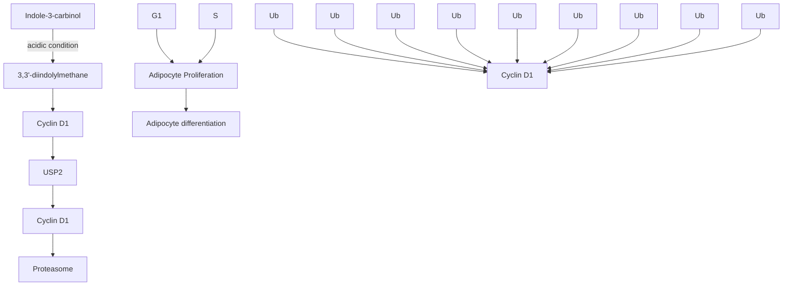

RESEARCH ARTICLE

# 3,3’-Diindolylmethane suppresses high-fat diet-induced obesity through inhibiting adipogenesis of pre-adipocytes by targeting USP2 activity

Hee Yang1∗∗, Sang Gwon Seo1∗∗, Seung Ho Shin1, Soyun Min1, Min Jeong Kang1, Ra Yoo1, Jeong Yeon Kwon2, Shuhua Yue3, Kee Hong Kim2, Ji-Xin Cheng3,4, Jong Rhan Kim5, Joon-Suk Park6, Jong Hun Kim7, Jung Han Yoon Park7, Hyong Joo Lee1∗ and Ki Won Lee1,7,8

1 Department of Agricultural Biotechnology, Seoul National University, Seoul, Republic of Korea  
2 Department of Food Science, Purdue University, West Lafayette, IN, USA  
3 Weldon School of Biomedical Engineering, Purdue University, West Lafayette, IN, USA  
4 Department of Chemistry, Purdue University, West Lafayette, IN, USA  
5 R&D Evaluation Center, Korea Institute of Science and Technology Evaluation and Planning, Seoul, Republic of Korea  
6 Laboratory Animal Center, Daegu-GyeongBuk Medical Innovation Foundation, Daegu, Republic of Korea  
7 Research Institute of Agriculture and Life Sciences, Seoul National University, Seoul, Republic of Korea  
8 Advanced Institutes of Convergence Technology, Seoul National University, Suwon, Republic of Korea

Scope: Indole-3-carbinol (I3C), a derivative abundant in cruciferous vegetables such as cab bage, is well known for its various health benefits such as chemo-preventive and anti-obesity effects. I3C is easily metabolized to 3,3 -diindolylmethane (DIM), a more stable form, in acidic conditions of the stomach. However, the anti-obesity effect of DIM has not been investigated clearly. We sought to investigate the effect of DIM on diet-induced obesity and to elucidate its underlying mechanisms.

Methods and results: High-fat diet (HFD)-fed obese mouse and MDI-induced 3T3-L1 adipo genesis models were used to study the effect of DIM. We observed that the administration of DIM (50 mg/kg BW) significantly suppressed HFD-induced obesity, associated with a decrease in adipose tissue. Additionally, we observed that DIM treatment (40 and 60 -M), but not I3C treatment, significantly inhibited MDI-induced adipogenesis by reducing the levels of several adipogenic proteins such as PPAR- and C/EBP. DIM, but not I3C, suppressed cell cycle progression in the G1 phase, which occurred in the early stage of adipogenesis, inducing post-translational degradation of cyclin D1 by inhibiting ubiquitin specific peptidase 2 (USP2) activities.

Conclusion: Our findings indicate that cruciferous vegetables, which can produce DIM as a metabolite, have the potential to prevent or treat chronic obesity.

## Keywords:

3,3’-Diindolylmethane / Cyclin D1 / Indole-3-carbinol / Obesity / USP2 enzyme

Additional supporting information may be found in the online version of this article at the publisher’s web-site

Received: February 4, 2017

Revised: May 6, 2017

Accepted: May 26, 2017

Correspondence: Dr. Ki Won Lee

E-mail: kiwon@snu.ac.kr

Abbreviations: DIM, 3,3’-diindolylmethane; I3C, Indol-3-carbinol; CD, control diet; HFD, high-fat diet; DUBs, deubiquitinating enzymes; USP2, ubiquitin specific peptidase 2; BCS, bovine calf serum; IBMX, 3-isobutyl-1-methylxanthine; MDI, mixture of 3-isobutyl-1-methylxanthine, dexamethasone, and insulin; C/EBP, CCAAT/enhancer-binding protein ; PPAR-, peroxisome proliferator-activated receptor ; ORO, oil red o; CARS, coherent anti-stokes raman scattering; WAT, white adipose tissue; FACS, fluorescence-activated cell sorter; aP2, adipocyte protein 2; FAS, fatty acid synthase; SREBP1, sterol regulatory element-binding protein 1; Ub, ubiquitin

∗Additional corrresponding author: Hyong Joo Lee

E-mail: leehyjo@snu.ac.kr

∗∗These authors contributed equally to this work.

Colour Online: See the article online to view Figs. 2 and 3 in colour.

## 1 Introduction

Obesity has become a worldwide problem, which causes several chronic diseases, including diabetes, hypertension, and heart diseases [1]. Therefore, prevention of obesity has become one of the very important goals of public health. Many natural food components have received attention due to their biological activities in obesity. Especially, many previous studies have reported that indole-3-carbinol (I3C), a derivative from cruciferous vegetables such as cabbage, inhibits adipocyte differentiation and thereby reduces body weight in mice [2–4]. However, it has been reported that I3C is readily metabolized to 3,3’- diindolylmethane (DIM) in an acidic environment such as in the human stomach [5–7]. But, the effects of DIM on adipocyte differentiation and obesity have not yet been elucidated.

Obesity is characterized by overgrowth of adipose tissue mass resulting from hyperplasia (increase in adipocyte number) and hypertrophy (increase in adipocyte size) of adipocytes [8, 9]. Upon the commonly used hormone cocktail (isobutylmethylxanthine (IBMX), dexamethasone, and insulin; MDI) stimulation, 3T3-L1 pre-adipocytes differentiate into adipocytes, a process called adipogenesis. During adipogenesis, important regulators such as peroxisome proliferator-activated receptor  (PPAR-) and CCAAT/enhancer-binding protein  (C/EBP) are expressed which induce the expression of several proteins including fatty acid synthase (FAS), adipocyte protein 2 (aP2), and sterol regulatory element-binding protein 1 (SREBP1). In the early stage of adipogenesis, the cell cycle progresses and the cell numbers are increased, followed by increased lipid accumulation during the late stage of adipogenesis, which are the mimicking processes of hyperplasia and hypertrophy in adipose tissue [10–12].

Cyclin D1 is required for cell cycle progression in the G1 phase [13, 14]. Cyclin D1 can be regulated in an ubiquitindependent manner resulting in degradation via 26S protea some [15]. Ubiquitin-specific protease (peptidase) 2 (USP2) is one of the deubiquitinating enzymes (DUBs) that remove ubiquitin from its substrates [16,17]. USP2 has been reported to regulate various biological processes including cell cycle progression [15, 18] and fatty acid synthesis [19, 20] by stabilizing its target protein such as cyclin D1 and FAS in cancer cells.

Here, we aimed to investigate the anti-obesity effect of DIM in a HFD-fed obese mouse model and the antiadipogenic effect of DIM and its molecular mechanisms in 3T3-L1 pre-adipocytes. Our findings suggest that DIM has an anti-adipogenic effect that regulates cyclin D1 degradation by inhibiting USP2 activity in the early stage of adipocyte differentiation, which may be responsible for reducing the weight of white adipose tissue and body weight.

## 2 Materials and methods

## 2.1 Animal experimental design and treatment

Male C57BL/6N mice (6-week-old) were purchased from Ori ent Bio (Seongnam, Korea) and all experimental designs were approved by the Institutional Animal Care and Use Committee (IACUC) of Seoul National University (SNU-110126- 8). Mice were housed in climate-controlled quarters (23 $3 ^ { \circ } \mathrm { C } , 5 0 \pm 1 0 \%$ humidity) with a 12-h light-dark cycle. After the 1 week acclimation, mice were randomly divided into four groups (n 7 in each group): 1) 16 kcal% control diet (CD) (AIN-93G)-fed mice, 2) 60 kcal% high-fat diet (HFD)- fed mice, 3) HFD-fed mice with DIM (10 mg/kg BW), and 4) HFD-fed mice with DIM (50 mg/kg BW). CD and HFD were purchased from FeedLab (Guri, Korea) and provided in the form of pellets for 12 weeks. The compositions of CD and HFD are shown in Supplementary Table 1. Animals were treated with either vehicle [polyethylene glycol 200 (PEG200)] or DIM dissolved in PEG200 [Sigma (St. Louis, MO, USA)] by oral gavage every day. Body weight was monitored weekly, and food intake was measured every 2 days.

## 2.2 Tissue histology

White adipose tissues (WAT) were fixed with 4% formalin and embedded in paraffin blocks. Paraffin sections were stained with hematoxylin and eosin (H&E) and visualized with a microscope at 200 magnification. Epididymal fat tissue was used as a representative of WAT for H&E staining. For quantification of the size of adipocytes, three images were randomly taken from independent H&E-stained WAT sections in each group. The area of adipocytes in WAT was determined by dividing the cross-sectional area by the total number of distributed adipocytes in images. The cross-sectional area of distributed adipocytes was measured with Image J software (National Institutes of Health, Bethesda, MD, USA).

## 2.3 Cell culture

3T3-L1 pre-adipocytes (ATCC, Manassas, VA, USA) were maintained in Dulbecco’s modified Eagle’s medium (DMEM) supplemented with 10% bovine calf serum (BCS), at 5% CO and $3 7 ^ { \circ } \mathrm { C } .$ . Cells were sub-cultured every two days at a den sity of $2 \times 1 0 ^ { 5 }$ cells per 100 mm dish. For differentiation, confluent 3T3-L1 pre-adipocytes were incubated for 2 days in DMEM supplemented with 10% fetal bovine serum (FBS) and MDI cocktail (0.5 mM methylisobutylxanthine (IBMX), 1 $\mu \mathrm { M }$ dexamethasone, and 5 ug/mL. insulin). After 2 days. the medium was replaced with DMEM containing 10% FBS and 5 -g/mL insulin. Two days later, the medium was replaced with DMEM containing 10% FBS and the cell monolayers were incubated for an additional 2 days. We added DIM or I3C to culture medium diluted from 100 mM stock solution in which dissolved in dimethyl sulfoxide. The cells were exposed to DIM or I3C during the indicated periods between days 0 and 6 as described in the figure legends. DIM, I3C, IBMX, dexamethasone, and insulin were obtained from Sigma (St. Louis, MO, USA) and all cell culture materials were purchased from GIBCO BRL (Grand Island, NY, USA).

## 2.4 Oil red O (ORO) staining

Cells were differentiated to adipocytes for 6 days as mentioned above. The intracellular lipid accumulation in adipocytes was assessed by ORO staining. After induction of cell differentiation, the medium was removed, and mature 3T3- L1 adipocytes were fixed in 4% formalin. The fixed cells were stained with ORO solution (Sigma). Stained adipocytes were visualized using a microscope or quantified by eluting ORO solution with isopropyl alcohol, and measuring the ab sorbance at 515 nm using a spectrophotometer.

## 2.5 Multimodal Coherent Anti-Stokes Raman Scattering (CARS)

Simultaneous CARS imaging analysis of lipid droplets in adipocytes was performed as described previously [21]. Briefly, the difference in the wave number between the pump laser and Stokes laser was tuned to $2 8 4 0 ~ \mathrm { c m } ^ { - 1 }$ , which indicated the Raman shift of the symmetric CH2 stretch vibration in lipid molecules. Combined beams were focused into the specimen through a 60 water immersion objective (numerical aperture 1.2). The forward CARS signal was collected by an air condenser (numerical aperture 0.55), transmitted through a 600/65 nm bandpass filter and detected by a photomultiplier tube (H7422-40, Hamamatsu, Japan). The combined pump and Stokes laser power at the specimen was kept constant at 55 mW. Images were acquired every 1.12 s. Images were analyzed using Fluo-View software (Olympus, Center Valley, PA, USA).

## 2.6 Western blot analysis

The cells were harvested lysing in RIPA buffer (Cell Signaling Technology, Beverly, MA, USA) and centrifuged (10 min, 19,326 xg, $4 ^ { \circ } \mathrm { C } )$ to collect supernatants. Protein concentrations were determined using Protein Assay Reagent (Bio-Rad, Hercules, CA, USA). Protein lysates were loaded onto SDS-PAGE gels and transferred to polyvinylidene fluoride membranes (GE Healthcare, Piscataway, NJ, USA). The membranes were blocked with 5% skim milk and incubated overnight at 4C with indicated primary antibodies followed by HRP-conjugated secondary antibodies for 1 h. Protein bands were visualized by a chemiluminescence detection kit (Amersham Pharmacia Biotech, Piscataway, NJ, USA). Density of the protein band was quantified by Image J software (National Institutes of Health, Bethesda, MD, USA). Antibodies against PPAR- and cyclin D1 were obtained from Santa Cruz Biotechnology (Santa Cruz, CA, USA). Antibodies against C/EBP, FAS, aP2, and SREBP-1c were obtained from Cell Signaling Technology (Beverly, MA, USA). Antibody against USP2 was obtained from Proteintech Group (Chicago, IL, USA).

## 2.7 Quantitative real-time PCR

Total RNA was extracted using RNA-BEE (TEL-TEST, Pearland, TX, USA). Then, 1 -g RNA was reverse transcribed into complementary DNA (cDNA) using cDNA Synthesis Kit (Promega, Fitchburg, WI, USA). Quantitative real-time PCR was performed by CFX Connect Real-Time PCR Detection System (Bio-Rad) using iQ SYBR Green Supermix (Fermen tas, Glen Burnie, MD, USA) and the following PCR primers (Bioneer, Daejeon, Korea): Ppar-, 5 -CGCTGATGCACTGC CTATGA-3 and 5 -AGAGGTCCACAGAGCTGATTCC-3 ; C/ebp, 5 -CGCAAGAGCCGAGATAAAGC-3 and 5 -CAC GGCTCAGCTGTTCCA-3 ; Ap2, 5 -CATGGCCAAGCCCAA CAT-3 and 5 -CGCCCAGTTTGAAGGAAATC-3 ; Fas, 5 -TT GCCCGAGTCAGAGAACC-3 and 5 -CGTCCACAATAGCT TCATAGC-3 ; and β-actin, 5 -TGTCCACCTTCCAGCAGA TGT-3 and 5 -AGCTCAGTAACAGTCCGCCTAGA-3 . We calculated the relative mRNA expression according using the delta CT method [22]. -actin was used for normalization.

## 2.8 Trypan blue assay

3T3-L1 pre-adipocytes were seeded in 24-well plates at a density of $2 . 5 \ \times \ 1 0 ^ { 4 }$ cells per well, and incubated in DMEM supplemented with 10% FBS and MDI cocktail with or without DIM and I3C at indicated concentrations. Cells were trypsinized and stained with 0.4% trypan blue for 5 min. The stained cells were loaded onto a hematocytometer, and viable cells were counted.

## 2.9 Fluorescence-activated cell sorter (FACS) analysis

Confluent 3T3-L1 pre-adipocytes were cultured with MDI cocktail with or without DIM or I3C at indicated concentrations. After indicated time periods, cells were trypsinized and centrifuged (2 min, 380 g, RT). Supernatants were re moved and pellets were washed twice with PBS, followed by fixation with ice-cold 70% ethanol (v/v). For propidium iodide (PI) solution staining, fixed cells were washed with PBS and incubated in $5 0 0 \mu \mathrm { L }$ of PBS containing 20 -g/mL PI (Sigma) and 0.2 mg/mL RNase (Amresco, Solon, OH, USA) at $3 7 ^ { \circ } \mathrm { C }$ for 10 min in the dark. Fluorescence was measured using a FACS Calibur flow cytometer (Becton-Dickinson, San Jose, CA, USA). A total of ten thousand cells were counted for analysis and the proportion of cells in each stage (G1, S, G2/M) was evaluated with manufacture’s provided program.

## 2.10 Ubiquitination assay

3T3-L1 pre-adipocytes were cultured with MDI cocktail with or without DIM $( 6 0 ~ \mu \mathrm { M } )$ prior to MG132 $( 5 ~ \mu \mathrm { M } )$ treatment. Cyclin D1 was immunoprecipitated overnight at 4C from cell lysates by cyclin D1 antibody and protein $\mathsf { A } / \mathsf { G }$ PLUS-Agarose (Santa Cruz Biotechnology). Ubiquitination of precipitated cyclin D1 was determined by western blot using antibody against Ub (Santa Cruz Biotechnology).

## 2.11 USP2 activity assay

All materials for USP2 deubiquitinase activity assay were purchased from Life Sensors (Malvern, PA, USA). USP2 deubiquitinase activity assay was conducted according to the manufacturer’s instructions. Briefly, in a 96 well black microplate (BD Biosciences, Billerica, MA, USA), 10 nM USP2 core was incubated in assay buffer (50 mM Tris, pH 8.0, 0.05% CHAPS, 10 mM DTT) with DIM (20, 40, and $6 0 ~ \mu \mathrm { M } )$ or Ubiquitin (Ub)-aldehyde $( 1 . 7 6 \mu \mathrm { M } )$ for 10 min at 30C followed by addition of K48-linked DiUb substrate (200 nM). After reaction, the kinetics of USP2 activity (FU) was monitored at every 5 min interval of time for 3 h using Infinite 200 PRO (Tecan, Mannedorf, Switzerland) at the following¨ wavelengths: Exc. 540 nm/Emm. 580 nm.

## 2.12 Statistical analysis

In vivo data were expressed as means SEM and in vitro data were expressed as means SD. Student’s t-test was used to evaluate the differences between the CD and HFD groups or the control and MDI-treated groups. A probability value of $p < 0 . 0 5$ or $p < 0 . 0 1$ was used as the criterion for statistical significance. One-way ANOVA with post-hoc Tukey HSD was used for multiple comparisons among HFD-fed or MDI-treated groups. Means with superscripts of different letters were significantly different at $p < 0 . 0 5$ . Analysis was performed using IBM SPSS statistics software (version 22.0, IBM, Armonk, NY, USA).

## 3 Results

## 3.1 3,3’-Diindolylmethane suppresses HFD-induced increases in body weight and epididymal white adipose tissue (eWAT) in mice

Since I3C has been studied for its anti-obesity effects, we investigated whether DIM, a metabolite of I3C, has an effect on obesity. The structures of the two chemicals are shown in Fig. 1A. Mice were fed a HFD with or without DIM at 10 and 50 mg/kg BW for 12 weeks. Body weight of HFD-fed mice was significantly increased up to 22 % compared to that of CD-fed mice, but the body weight of HFD DIM (50 mg/kg)-fed mice significantly decreased as compared to that of HFD-fed mice (Fig. 1B). However, DIM (10 or 50 mg/kg) administration did not affect food intake in HFD-fed mice (Fig. 1C). DIM (10 and 50 mg/kg) administration significantly decreased the relative weights of the epididymal white adipose tissues (eWATs), but not the relative weights of other tissues including kidney, pancreas, and spleen, compared to those in HFD-fed mice (Fig. 1D). Additionally, the average size of adipocytes was decreased in HFD DIM (10 and 50 mg/kg)-fed mice compared to HFD-fed mice (Fig. 1E and F). Furthermore, we identified a beneficial effect of DIM against the reductions in serum triglycerides, total cholesterol, and LDL-cholesterol levels in the HFD DIM (10 or 50 mg/kg)-fed mice (Supporting Infor mation Fig. 3A–C). These results indicated that DIM reduced HFD-induced increases in weight gain, which was mainly attributable to the decrease in adipose tissue mass.

## 3.2 3,3’-Diindolylmethane inhibits MDI-induced adipogenesis of 3T3-L1 preadipocytes

The results from in vivo study with HFD-fed mice suggested that DIM specifically acted on white adipose tissue. Since the expansion and renewal of adipose tissue in obesity rely on proliferation and differentiation of adipocytes [23, 24], we next examined whether DIM had an anti-adipogenic activity or not. The differentiation of 3T3-L1 pre-adipocytes was induced by MDI in the absence or presence of DIM or I3C at 20, 40, and $6 0 \mu \mathrm { M } .$ . Treatment with DIM (40 and $6 0 \mu \mathrm { M } )$ , but not with I3C, for 6 days significantly blocked MDI-induced adipogenesis of 3T3-L1 pre-adipocytes (Fig. 2A). Consistently, DIM treatment $( 6 0 ~ \mu \mathrm { M } )$ for 6 days remarkably decreased MDI-induced lipid accumulation, whereas I3C (60 -M) treat ment did not reduce MDI-induced lipid accumulation in live 3T3-L1 adipocytes in SRS imaging analysis (Fig. 2B). We also investigated the expression levels of several proteins involved in adipogenesis. DIM treatment $( 6 0 ~ \mu \mathrm { M } )$ , but not I3C treatment $( 6 0 ~ \mu \mathrm { M } )$ , effectively reduced the expression levels of representative adipogenesis-related proteins such as PPAR-$\gamma$ and $\mathrm { C / E B P \alpha , }$ , PPAR--targeted proteins such as aP2, and lipogenesis-related proteins including FAS and SREBP1 (Fig. 2C). The relative expression levels of each protein were consistent with the representative Western blot data (Fig. 2D–H). DIM $( 6 0 \mu \mathrm { M } )$ , but not I3C $( 6 0 \mu \mathrm { M } )$ , abolished mRNA level of various adipogenesis- and lipogenesis-related genes including $P p a r { \bf - } \gamma , C / e b p { \bf \alpha }$ , and $A p 2 ( { \mathrm { F i g . ~ } } 2 { \mathrm { I - L } } )$ . These observations demonstrated that DIM treatment suppressed MDI-induced adipogenesis of 3T3-L1 pre-adipocytes by down-regulating the protein and mRNA expression levels of various adipogenesisand lipogenesis-related proteins.

A  

chemical

Two chemical structures: Indole-3-carbinol (I3C) and 3,3'-diindolylmethane (DIM)

B

bar chart

| Group | Body weight (g) |
|-------|-----------------|
| CD +   | 28              |
| CD -   | 36              |
| HFD +  | 32              |
| HFD -  | 36              |
| DIM 10 | 32              |
| DIM 50 | 32              |

C  

bar chart

| Group | Food intake (g/day) |
| --- | --- |
| CD + HFD - DIM (mg/kg) | 2.5 |
| CD + HFD + DIM (mg/kg) | 2.3 |
| CD + HFD + DIM (mg/kg) | 2.2 |
| CD + HFD + DIM (mg/kg) | 2.2 |

D  

bar chart

| Tissue         | CD   | HFD  | DIM (mg/kg) |
| -------------- | ---- | ---- | ----------- |
| Epididymal fat | 4.5  | 6.8  | -           |
| Liver          | 4.0  | 3.0  | -           |
| Kidney         | 1.2  | 1.0  | -           |
| Pancreas       | 0.5  | 0.4  | -           |
| Spleen         | 0.2  | 0.1  | -           |

E

text_image

CD
HFD
HFD + DIM 10 mg/kg
HFD + DIM 50 mg/kg

F  

bar chart

| CD | HFD | DIM (mg/kg) | Adipocyte Area (x 10³ µm²) |
| --- | --- | --- | --- |
| + | - | - | 5.0 |
| - | + | - | 7.0 |
| - | + | 10 | 4.5 |
| - | + | 50 | 4.0 |

Figure 1. Effect of DIM on HFDinduced obesity in mice. (A) The structure of I3C and DIM. (B) Average body weight gain (g) and (C) food intake (g/day) for 12 weeks. (D) Relative weights (% of body weight) of various organs including epididymal fat, liver, kidney, pancreas, and spleen. (E) Histological photographs of cross-sections of epididymal fat depots and (F) quantitative analyses of the size of adipocytes ( 103 -m2) in epididymal fat tissue (n 3/each group). Data are expressed as means SEM. Significant differences between the CD and HFD groups: $^ { \# } p < 0 . 0 5$ and $^ { \# \# } p < 0 . 0 1$ . Means with different superscript letters are significantly different among 3 HFD groups $( p < 0 . 0 5 )$ . NS: not significant.

## 3.3 3,3’-Diindolylmethane inhibits MDI-induced adipogenesis in the early stage

3T3-L1 pre-adipocytes undergo proliferation during the early stage (Day 0–2) and differentiation during the late stage (After Day 2) [11]. To examine which step is the most important in the anti-adipogenic effect of DIM, we treated cells with DIM $( 6 0 \mu \mathrm { M } )$ during different periods of time. Interestingly, treat ment with DIM $( 6 0 ~ \mu \mathrm { M } )$ only during the first two days (Day 0–2) inhibited complete MDI-induced adipogenesis, suggesting that treatment with DIM during the early stage of adipogenesis is the primary step in the induction of anti-adipogenic activity of DIM (Fig. 3A). We therefore investigated whether DIM affected cell proliferation and cell cycle progression during the early stage of adipogenesis. During the first two days of adipogenesis, the number of cells was increased by approximately 2-fold in response to MDI. However, DIM (60 -M) treatment significantly reduced MDI-induced increase in cell number, whereas I3C $( 6 0 ~ \mu \mathrm { M } )$ treatment had no effect on MDI-induced increase in cell number (Fig. 3B). Next, we conducted FACS analysis to examine cell cycle profiles. MDI induced cell cycle progression in 3T3-L1 pre-adipocytes from the G0/G1 phase to the S phase at 16 h and from the S phase to the G2/M phase between 20 and 24 h (Supplementary Fig. 1A). However, cell cycle pro gression was significantly inhibited in MDI combined with DIM $( 6 0 ~ \mu \mathrm { M } )$ -treated cells, but not in MDI combined with I3C $( 6 0 ~ \mu \mathrm { M } )$ -treated cells. A large proportion of DIM-treated cells still remained in the G1 phase compared to MDI-treated cells (Fig. 3C). These observations indicated that DIM treatment suppressed MDI-induced cell cycle progression and the subsequent increase in the number of pre-adipocytes.

A  

bar chart

| MDI | DIM (μM) | I3C (μM) | ORO Concentration (%) |
| --- | -------- | -------- | --------------------- |
| -   | -        | -        | 100                   |
| +   | -        | -        | 350                   |
| +   | 20       | -        | 360                   |
| +   | 40       | -        | 240                   |
| +   | 60       | -        | 50                    |
| +   | -        | 20       | 320                   |
| +   | -        | 40       | 310                   |
| +   | -        | 60       | 310                   |

B  

text_image

Control
MDL
MDL + DIM 60 µM
MDL + I3C 60 µM

C  

text_image

PPARγ
C/EBPα
MDI - + + +
DIM (μM) - - 60 -
I3C (μM) - - - 60
aP2
FAS
MDI - + + +
DIM (μM) - - 60 -
I3C (μM) - - - 60
SREBP1
β-actin
MDI - + + +
DIM (μM) - - 60 -
I3C (μM) - - - 60

D  

bar chart

| Protein | MDI | DIM (μM) | I3C (μM) | Relative protein level |
|---|---|---|---|---|
| PPARγ | - | - | - | 1.0 |
| PPARγ | + | - | - | 1.2 |
| C/EBPα | - | - | - | 0.2 |
| C/EBPα | + | - | - | 8.5 |
| aP2 | - | - | - | 1.4 |
| aP2 | + | - | - | 1.1 |
| FAS | - | - | - | 2.0 |
| FAS | + | - | - | 1.0 |
| SREBP1 | - | - | - | 0.2 |
| SREBP1 | + | - | - | 1.2 |
| SREBP1 | - | 60 | - | 0.4 |
| SREBP1 | + | 60 | - | 1.0 |
## indicates p<0.01 vs MDI control; ## indicates p<0.05 vs I3C control; ** indicates p<0.01 vs I3C control; # indicates p<0.05 vs MDI control; ## indicates p<0.05 vs I3C control; # indicates p=0.06 vs MDI control.

-  

bar chart

| Gene | Condition | Relative mRNA level (MDI) | Relative mRNA level (DIM) | Relative mRNA level (I3C) |
| --- | --- | --- | --- | --- |
| Pparg | - | 400 | 220 | 250 |
| Pparg | + | 380 | 180 | 260 |
| C/ebpα | - | 1.5 | 6.5 | 7.5 |
| C/ebpα | + | 1.0 | 6.0 | 7.0 |
| aP2 | - | 900 | 700 | 650 |
| aP2 | + | 900 | 700 | 650 |
| Fas | - | 1.0 | 3.5 | 3.0 |
| Fas | + | 1.5 | 3.0 | 3.5 |

Figure 2. Effect of DIM on MDIinduced adipogenesis in 3T3-L1 preadipocytes. The cells were exposed to DIM or I3C diluted in culture media during days 0–6. (A) The photograph of ORO staining and quantitative analysis of intracellular lipid accumulation in differentiated 3T3-L1 adipocytes. (B) SRS imaging analysis of lipid droplets in differentiated 3T3-L1 adipocytes. (C) Representative images of Western blots showing expression of various adipogenic/lipogenic proteins and (D-H) quantitative data normalized to - actin expression $( n = 3 )$ . Significant differences between the control and MDI groups: $^ { \# } p < 0 . 0 5$ and $^ { \# \# } p < 0 . 0 1$ , among MDI groups: ${ } ^ { * } p < 0 . 0 5$ and $^ { * * } p < 0 . 0 1$ . (I-L) qPCR analysis of various adipogenic/lipogenic gene levels in 3T3-L1 pre-adipocytes. Data are representative of three independent experiments. Data are expressed as means SD. Significant differences between the control and MDI groups: $^ { \# } p < 0$ .05 and $^ { \# \# } p < 0 . 0 1$ . Means with different superscript letters are significantly different among MDI groups $( p < 0 . 0 5 )$ .

## 3.4 3,3’-Diindolylmethane reduces cyclin D1 protein expression at the post-translational level

Various proteins such as cyclin D1 and cyclin A play roles in different phases of cell cycle [25]. Among them, cyclin D1 has been reported to be expressed in the G1 phase and to be responsible for the G1-S transition [13]. Treatment with DIM $( 6 0 \mu \mathrm { M } )$ , but not with I3C, effectively decreased MDI-induced cyclin D1 protein levels (Fig. 4A) followed by a decrease in MDI-induced cyclin A1 protein levels (Supplementary Fig. 2A). Cyclin D1 generally plays a role in cell cycle progression by binding with cyclin-dependent kinase 4 (CDK 4) [26]. However, DIM treatment did not show any direct effect on the CDK4-cyclin D1 complex activity in vitro (Supplementary Fig. 2B). Therefore, we further examined the effect of DIM on the expression of cyclin D1 at the transcriptional level. However, DIM treatment $( 6 0 ~ \mu \mathrm { M } )$ did not reduce the mRNA levels of cyclin D1 that were induced by MDI (Fig. 4B). Since we observed that DIM treatment $( 6 0 ~ \mu \mathrm { M } )$ reduced cy clin D1 protein levels but not mRNA levels, we next examined whether DIM affected the stability of cyclin D1 protein. Pre vious studies have reported that cyclin D1 levels are regulated by ubiquitin-mediated degradation [27, 28]. We therefore investigated whether addition of MG132, which is a proteasome inhibitor that blocks the degradation of ubiquitin-conjugated proteins, mitigates the effect of DIM on cyclin D1. Consistent with Fig. 4A, in the absence of MG132, DIM treatment $( 6 0 ~ \mu \mathrm { M } )$ significantly reduced MDI-induced cyclin D1 protein levels. However, MG132 $( 5 ~ \mu \mathrm { M } )$ treatment prevented DIM-induced suppression of MDI-induced cyclin D1 protein levels (Fig. 4C). Moreover, ubiquitination of cyclin D1 protein was increased in cells treated with MDI DIM MG132 compared to those treated with MDI MG132 (Fig. 4D). These results suggested that DIM treatment reduced cyclin D1 protein levels at the post-translational level by increasing ubiquitination and subsequent proteasomal degradation of cyclin D1. Furthermore, DIM supplementation (10 and 50 mg/kg) effectively decreased the cyclin D1 protein level in the adipose tissues of HFD-fed mice (Fig. 4E).

A  

bar chart

| MDI | DIM (60 µM) | DIM-treated periods (Day) | ORO Concentration (%) |
| --- | --- | --- | --- |
| - | - | 0-2 | 100 |
| + | - | 0-2 | 300 |
| + | + | 2-4 | 100 |
| + | + | 4-6 | 290 |
| + | + | 0-4 | 250 |
| + | + | 2-6 | 100 |
| + | + | 0-6 | 150 |
| + | + | 0-6 | 75 |

B  

line chart

| Time Point | Control | MDI | MDI + DIM 60μM | MDI + I3C 60μM |
| ---------- | ------- | --- | -------------- | -------------- |
| 0-day      | 50      | 50  | 50             | 50             |
| 1-day      | 80      | 85  | 65             | 70             |
| 2-day      | 120     | 115 | 70             | 65             |

c  

stacked bar chart

| Condition | Time Point | FL2-A Count | % of Cell Distribution |
| --- | --- | --- | --- |
| control | 16 h | ~300 | ~90% |
| control | 20 h | ~300 | ~90% |
| MDI | 16 h | ~200 | ~85% |
| MDI | 20 h | ~200 | ~85% |
| MDI + DIM | 16 h | ~200 | ~85% |
| MDI + DIM | 20 h | ~200 | ~85% |
| MDI + I3C | 16 h | ~200 | ~85% |
| MDI + I3C | 20 h | ~200 | ~85% |
| MDI | 16 h | ~40 | ~75% |
| MDI | 20 h | ~40 | ~75% |
| I3C | 16 h | ~40 | ~75% |
| I3C | 20 h | ~40 | ~75% |
| G2/M | 16 h | ~10 | ~10% |
| G2/M | 20 h | ~10 | ~10% |
| S | 16 h | ~10 | ~10% |
| S | 20 h | ~10 | ~10% |
| G0/G1 | 16 h | ~85 | ~85% |
| G0/G1 | 20 h | ~85 | ~85% |
| sub-G1 | 16 h | ~15 | ~15% |
| sub-G1 | 20 h | ~15 | ~15% |
| G2/M | 16 h | ~10 | ~10% |
| G2/M | 20 h | ~10 | ~10% |
| S | 16 h | ~15 | ~15% |
| S | 20 h | ~15 | ~15% |
| G0/G1 | 16 h | ~45 | ~45% |
| G0/G1 | 20 h | ~45 | ~45% |
| sub-G1 | 16 h | ~45 | ~45% |
| sub-G1 | 20 h | ~45 | ~45% |
| G2/M | 16 h | ~10 | ~10% |
| G2/M | 20 h | ~10 | ~10% |
| S | 16 h | ~15 | ~15% |
| S | 20 h | ~15 | ~15% |
| G0/G1 | - | - | - |
| G0/G1 | - | - | - |
| sub-G1 | - | - | - |
| sub-G1 | - | - | - |
| G2/M | - | - | - |
| G2/M | - | - | - |
| S | - | - | - |
| S | - | - | - |
| G0/G1 | - | - | - |
| G0/G1 | - | - | - |
| sub-G1 | - | - | - |
| sub-G1 | - | - | - |
| G2/M | - | - | - |
| G2/M | - | - | - |
| S | - (DIM) / I3C (μM) | - | - |
| G2/M | - (DIM) / I3C (μM) | - | - |
| G2/M | - (DIM) / I3C (μM) | - | - |
| G2/M | - (DIM) / I3C (μM) | - | - |

Figure 3. Effect of DIM on MDIinduced adipogenesis during the early stage (Day 0–2) in 3T3-L1 preadipocytes. The cells were exposed to DIM or I3C diluted in culture media during the indicated periods between days 0 and 6. (A) The photograph of ORO staining and quantitative analysis of intracellular lipid accumulation at different DIM-treatment periods. (B) Trypan blue assay data of cell proliferation during Day 0–2 in 3T3- L1 pre-adipocytes. (C) FACS analysis of cell cycle progression at 16 and 20 h in 3T3-L1 pre-adipocytes. The data are presented as means SD. Significant differences between the control and MDI groups: $^ { \# } p < 0 . 0 5$ and $^ { \# \# } p < 0 . 0 1$ . Means with different superscript letters are significantly different among MDI groups $( p < 0 . 0 5 )$ .

## 3.5 3,3’-Diindolylmethane directly inhibits USP2 deubiquitinase activity in vitro

Previous studies have reported that ubiquitination of cyclin D1 is specifically regulated by USP2, which is one of the DUBs [15]. Since we found that DIM treatment promoted degradation of cyclin D1 protein, we investigated whether regulation of USP2 deubiquitinase activity was involved in the action of DIM. USP2 activity assay results showed that DIM treatment (20, 40, and $6 0 ~ \mu \mathrm { M } )$ effectively inhibited the activity of core USP2 protein (10 nM), which was quite comparable to Ub-aldehyde (1.76 -M), a general peptide in hibitor of DUBs (Fig. 5A and B). However, USP2 protein levels remained unchanged with either MDI or DIM (20, 40, and $6 0 ~ \mu \mathrm { M } )$ treatment (Fig. 5C). These results indicated that DIM treatment directly inhibited USP2 deubiquitinase activity, which resulted in decreased stability of cyclin D1 and consequently increased ubiquitin-mediated proteasomal degradation.

## 4 Discussion

Previous studies have demonstrated that I3C has many bio logical effects including anti-cancer and anti-obesity effects in vivo [3, 4, 29]. However, it is well known that I3C is easily metabolized to several metabolites in the form of dimers, trimers, and oligomers in acidic conditions [30]. Interest ingly, several in vivo studies have demonstrated that I3C is effective only when it is administered orally and not when it injected intraperitoneally [31] supporting the claim that I3C-derived metabolites, rather than I3C itself, are more responsible for potential bioactivity on various diseases such as cancer. DIM is one of the maior I3C-derived metabolites and it is stable in acidic conditions. Thus, DIM does not undergo further metabolism, which provides an advantages of persisting much longer in the plasma and various tissues in humans [30, 32]. Moreover, administration of I3C can cause unexpected reactions due to its by-products because I3C. but not DIM. produces more than 20 metabolites during the digestion process, which include not only less bioactive metabolites such as indole-3-carboxylic acid and indole-3-carboxaldehyde but also several toxic metabolites such as indolo[3,2-b]carbaxole [30]. Collectively, we can easily infer that intake of DIM itself is more potent than intake of I3C in terms of stability and less production of toxic metabolites.

A  

text_image

Cyclin D1
β-actin
MDI - + + + + + +
DIM (µM) - - 20 40 60 - - -
I3C (µM) - - - - - 20 40 60

B  

bar chart

| MDI (μM) | -    | +    | +    | -    | -    | -    |
|----------|------|------|------|------|------|------|
| DIM      | -    | 3.8  | 3.7  | -    | -    | -    |
| I3C      | -    | 4.0  | 4.1  | -    | -    | -    |

C  

bar chart

| Condition | Relative Cyclin D1 protein level |
| --------- | -------------------------------- |
| MDI -     | 1.0                              |
| DIM (60 µM) | 1.6                             |
| MG132 (5 µM) | 1.5                            |

D  

other

| Group | IP: Cyclin D1 (kDA) |
|-------|---------------------|
| IB: Ub | - 100               |
| IB: Ub | - 50               |
| IB: Cyclin D1 | -                   |
| MDI   | +                   |
| DIM   | -                   |
| MG132 | +                   |

E  

text_image

Cyclin D1
β-actin
CD + + + - - - - - - - - -
HFD - - - + + + + + + +
DIM (mg/kg) - - - - - - 10 10 10 50 50 50

bar chart

| CD | HFD | DIM (mg/kg) | Relative cyclin D1 protein level |
| --- | --- | --- | --- |
| - | - | - | ~2 |
| - | + | - | ~60 |
| - | + | 10 | ~30 |
| - | + | 50 | ~15 |

Figure 4. Effect of DIM on cyclin D1 protein in 3T3-L1 pre-adipocytes and HFD-fed mice. Cells were exposed to DIM or I3C diluted in culture media for 8 h. (A) Western blot analysis of cyclin D1 protein level and (B) qPCR analysis of cyclin D1 mRNA level in 3T3-L1 preadipocytes. (C) Western blot analysis of cyclin D1 protein level restored by MG132 treatment and (D) ubiquitination level as determined by immunoprecipitation with cyclin D1 in 3T3-L1 pre-adipocytes. (E) Representative images of Western blots of cyclin D1 protein level in vivo and quantitative data normalized to -actin expression $\left( n = 3 \right)$ . IP: Immunoprecipitation. IB: Immunoblot. The results are representative of three independent experiments and presented as means $\pm \textsf { S D }$ . Significant differences between the control and MDI groups: $^ { \# } p < 0 . 0 5$ and $^ { \# \# } p < 0 . 0 1$ . Means with different superscript letters are significantly different among MDI groups $( p < 0 . 0 5 )$ . NS: not significant.

Based on previous studies with I3C [2, 33], we first hypothesized that DIM, a major metabolite of I3C, primarily acts on adipose tissues. To investigate the anti-obesity effect of DIM in dramatic adipose tissue-expanding condi tions, we designed an in vivo study with mice fed a high-fat diet (60 kcal%). We also confirmed that DIM supplemen tation (up to 250 mg/kg) did not increase serum ALT (ala nine aminotransferase), AST (aspartate aminotransferase), or ALP (alkaline phosphatase) levels in HFD-fed mice (data not shown). This further suggests that the doses of DIM used in this study were not cytotoxic for the liver in mice. In the present study, we first demonstrated that DIM has an antiobesity effect in mice, suggesting that adipose tissue is the primary organ responsible for the obseryed effect of DIM. We also analyzed several lipid factors in serum. The levels of serum triglycerides, total cholesterol, and LDL-cholesterol were reduced in the HFD DIM (10 or 50 mg/kg)-fed mice compared to the HFD-fed mice (Supporting Information Fig $3 \mathrm { A - C } )$ . Moreover, DIM (40 and $6 0 ~ \mu \mathrm { M } )$ effectively inhibited adipogenesis and reduced the adipogenic/lipogenic gene expression levels in 3T3-L1 pre-adipocytes. According to Anderton et al., DIM is detectable at approximately 10 -g/mL $( 4 0 ~ \mu \mathrm { M } )$ in the plasma and 50–100 -g/g in various tissues

B  

text_image

USP2
β-actin
MDI - + + + +
DIM (μM) - - 20 40 60

Figure 5. Effect of DIM on USP2 enzyme activity in vitro. (A) Kinetics and end-point analysis of USP2 enzyme activity (FU) using fluorescence spectroscopy (Ex. 540 nm/ Em. 580 nm wave length) in vitro. The data are representative of three independent experiments. The data are presented as means $\pm \mathsf { s D }$ . Significant differences between the control and USP2 groups: $^ { \# } p < 0 . 0 5$ and $^ { \# \# } p < 0 . 0 1$ . Means with different superscript letters are significantly different among USP2 groups $( p < 0 . 0 5 )$ . (B) Western blot analysis of USP2 protein levels in 3T3-L1 pre-adipocytes.  

flowchart

Figure 6. Proposed diagram for 3,3’-diindolylmethane regulation of adipocyte differentiation. 3,3’-diindolylmethane directly inhibits USP2 enzyme activity and consequently blocks deubiquitination of cyclin D1, thereby promoting degradation of cyclin D1. As a consequence, the transition from the G1 phase to the S phase in the cell cycle is mitigated and adipogenesis is inhibited

such as the liver, heart and kidney at 1 h after oral administration of crystalline DIM 250 mg/kg in mice [32]. As we administered mice with DIM at 50 mg/kg/day for 12 weeks, it was expected that blood and tissue DIM concentrations in mice were lower than those in the study of Anderton et al. Therefore, it is reasonable to assume that 40 and 60 -M are valid concentrations to evaluate the efficacy of DIM on adipocyte differentiation in the adipose tissue microenvironment.

In the one hands, I3C did not show any effect at the same concentration of DIM in our study. However, several studies have previously reported that I3C treatment exerts an antiadipogenic effect and reduces the expression of adipogenic genes such as $\mathrm { P P A R - } \gamma$ in 3T3-L1 pre-adipocytes [2,33]. These differences among studies are probably due to the difference in experimental conditions such as the concentration and duration of I3C treatment. In previous studies [2, 33], I3C showed anti-adipogenic activity only when its concentration was high (100 or $2 0 0 ~ { \mu \mathrm { M } } )$ ). Additionally, other researchers treated 3T3-L1 pre-adipocytes with I3C for a longer period (10–12 days), while we treated cells with I3C and DIM for only 6 days. Interestingly, it has been observed that I3C gradually transformed into DIM even in a cell culture condition which is a neutral pH condition as well as a low pH condition, when it was incubated for an extended period [34]. Taken together, these results suggest that when a higher concentration (100 or $2 0 0 ~ { \mu \mathrm { M } } )$ of I3C is present for an extended period, I3C is converted to DIM and DIM exerts anti-adipogenic activity.

DUBs play an important role in post-translational modifi cation including proteasome-dependent protein degradation by editing the assembly of poly Ub chains, which are composed of different linkages at various lysines such as lysine 48 (K48) and lysine 63 (K63), which are among the most abundant forms of poly-ubiquitin linkages [16]. Numerous substrates of DUBs are involved in cellular processes includ ing cell cycle progression and differentiation [35, 36]. Previous studies have revealed that several DUBs are also involved in various aspects of adipocyte biology including adipogenesis [37, 38]. USP19 regulates adipogenesis by repressing transcriptional activity of the retinoic acid receptor, thereby destabilizing PPAR- through deubiquitinating coronin 2A [38]. USP7 (also known as herpesvirus-associated ubiquitinspecific protease;HAUSP) upregulates histone acetyltransferase Tip60 via its deubiquitinating activity in mouse adipose tissue as well as 3T3-L1 adipocytes. Transcriptome analysis has revealed that both proteins co-regulate several cell cyclerelated genes involved in the early stage of adipogenesis [37]. Additionally, cyclin D1 and FAS are stabilized by USP2 in cancer cells [15,18–20], but the roles of both proteins are also essential in adipocyte differentiation [39].

Pre-adipocytes undergo proliferation at an early stage and exhibit lipid accumulation in the late stage, and consequently differentiate into adipocytes [11, 40]. Several previous studies have shown that inhibition of cell cycle-associated genes is a key strategy to inhibit the onset of adipogenesis [39]. Various natural compounds with an inhibitory effect at the early stage of adipocyte differentiation target cell cycle-associated genes, including cyclin D, cyclin A [41].

In this study, we found that treatment with DIM (20, 40, and 60 -M) reduced adipogenesis in the early stage (0-2 days) by reducing the levels of cyclin D1 at the post-translational level. We also found that cyclin D1 expression was decreased in HFD DIM supplemented group compared to HFD-fed group (Fig. 4E). We also observed that DIM directly reduced the activity of USP2 deubiquitinase. Although treatment with DIM for only the first two days (Day 0–2) was sufficient to reduce adipogenesis, treatment with DIM (60 -M) for the latter four days (Day 2–6) also resulted in inhibition of adipogenesis to some extent. In the late stage of adipogenesis, lipid accumulation is the main outcome via the induction of various lipogenic proteins such as FAS [10]. Interestingly, we also noted that the expression of FAS protein was significantly reduced, while the mRNA expression of Fas did not change following DIM treatment (60 -M) in 3T3-L1 preadipocytes (Fig. 2C and G). Since it has been reported that USP2 regulates the stability of not only cyclin D1 but also FAS in various cancer cells [15, 18–20], we can postulate that the inhibitory effect of DIM on USP2 deubiquitinase activity affects the degradation of FAS in the late stage of adipogenesis as well as that of cyclin D1 in the early stage of adipogenesis of 3T3-L1 pre-adipocytes. However, PPAR-, C/EBP, and Ap2, which are also expressed in the late stage of adipogenesis, were significantly reduced by DIM treatment (60 -M) both in terms of protein and mRNA expression level. Taken together, these results indicate that reductions in PPAR-, C/EBP, and Ap2 expression levels results from inhibition of early adipogenesis regardless of direct post-translational regulation by USP2.

While DIM dose-dependently inhibited lipid accumulation at the concentration range between 20 and 60 -M (Fig. 2A), DIM at 20 -M almost completely inhibited USP2 activity (Fig. 5A). This difference in dose-response between the two experiments was probably due to differences in the experimental conditions. When DIM was added to cell culture media, the intracellular concentrations of DIM may have been much lower and the USP2 activity assay was conducted under cell-free conditions. In addition, it is still unclear how DIM regulates the USP2 activity without affecting its expression level in 3T3-L1 pre-adipocytes. Direct evidence for binding of USP2 with DIM and the exact binding site should be further investigated.

In summary, we demonstrate for the first time that DIM suppresses HFD-induced obesity in mice, which is attributable to decreased WAT mass. In vitro study results demonstrate that DIM inhibits adipogenesis in the early stage of differentiation by directly inhibiting USP2 activity in 3T3-L1 pre-adipocytes. Altogether, 3,3’-diindolylmethane increases the degradation of cyclin D1 by inhibition of USP2, which may be responsible for reducing adipose tissue mass, thereby, suppressing HFD-induced obesity in mice (Fig. 6). These observations indicate that long-term consumption of the cruciferous vegetable-derived compound DIM may have the potential to prevent or treat chronic obesity.

H.Y., S.G.S., K.W.L., and H.J.L. designed the research. H.Y., S.G.S., S.H.S., S.M., M.J.K., R.Y., J.YK, S.Y., J.-X.C., J.R.K., and J.S.P. conducted the research. H.Y. and S.G.S. wrote the manuscript. J.H.K., J.H.Y.P., K.H.K., and K.W.L. evaluated the data and edited the manuscript. H.Y., S.G.S., J.H.Y.P., and K.W.L. contributed to discussions.

This research was supported by the Mid-career Researcher Program (2015R1A2A1A10053567) through the National Research Foundation (NRF) grant funded by the Ministry of Science, ICT & Future Planning, and by the Agriculture, Food and Rural Affairs Research Center Support Program (710002-07-7sb310) funded by the Ministry of Agriculture, Food and Rural Affairs, both Republic of Korea.

The authors have declared no conflict of interest.

## 5 References

[1] Fruhbeck, G., Gomez-Ambrosi, J., Muruzabal, F. J., Burrell, M. A., The adipocyte: a model for integration of endocrine and metabolic signaling in energy metabolism regulation. Am. J. Physiol. Endocrinol. Metab. 2001, 280, E827–E847.  
[2] Choi, Y., Um, S. J., Park, T., Indole-3-carbinol directly targets SIRT1 to inhibit adipocyte differentiation. Int. J. Obes. 2013, 37, 881–884.  
[3] Choi, Y., Kim, Y., Park, S., Lee, K. W. et al., Indole-3-carbinol prevents diet-induced obesity through modulation of multiple genes related to adipogenesis, thermogenesis or inflammation in the visceral adipose tissue of mice .I. Nutr Biochem. 2012, 23, 1732–1739.  
[4] Chang, H. P., Wang, M. L., Chan, M. H., Chiu, Y. S. et al., Antiobesity activities of indole-3-carbinol in high-fat-dietinduced obese mice, Nutrition 2011, 27. 463470  
[5] Fujioka, N., Ainslie-Waldman, C. E., Upadhyaya, P., Carmella, S. G. et al., Urinary 3,3’-diindolylmethane: a biomarker of glucobrassicin exposure and indole-3-carbinol uptake in humans, Cancer Epidemiol. Biomarkers Prey. 2014. 23. 282- 287.  
[6] Reed, G. A., Arneson, D. W., Putnam, W. C., Smith, H. J. et al., Single-dose and multiple-dose administration of indole-3-carbinol to women: pharmacokinetics based on 3,3’-diindolylmethane. Cancer Epidemiol. Biomarkers Prev. 2006, 15, 2477–2481.  
[7] Grose, K. R., Bjeldanes, L. F., Oligomerization of indole-3- carbinol in aqueous acid. Chem. Res. Toxicol. 1992, 5, 188– 193.  
[8] Shepherd, P. R., Gnudi, L., Tozzo, E., Yang, H. M. et al., Adipose cell hyperplasia and enhanced glucose disposal in transgenic mice overexpressing Glut4 selectively in adiposetissue. J. Biol. Chem. 1993, 268, 22243–22246.  
[9] Daquinag, A. C., Tseng, C., Salameh, A., Zhang, Y. et al., Depletion of white adipocyte progenitors induces beige adipocyte differentiation and suppresses obesity development. Cell Death Differ. 2015, 22, 351–363.  
[10] Student, A. K., Hsu, R. Y., Lane, M. D., Induction of fatty acid synthetase synthesis in differentiating 3T3-L1 preadipocytes. J. Biol. Chem. 1980, 255, 4745–4750.  
[11] Gregoire, F. M., Smas, C. M., Sul, H. S., Understanding adipocyte differentiation. Physiol. Rev. 1998, 78, 783–809.  
[12] Patel, Y. M., Lane, M. D., Mitotic clonal expansion during preadipocyte differentiation: calpain-mediated turnover of p27. J. Biol. Chem. 2000, 275, 17653–17660.  
[13] Baldin, V., Lukas, J., Marcote, M. J., Pagano, M. et al., Cyclin D1 is a nuclear protein required for cell cycle progression in G1. Genes Dev. 1993. 7. 812821.  
[14] Stacey, D. W., Cyclin D1 serves as a cell cycle regulatory switch in actively proliferating cells. Curr. Opin. Cell Biol. 2003, 15, 158–163.  
[15] Shan, J., Zhao, W., Gu, W., Suppression of cancer cell growth by promoting cyclin D1 degradation. Mol. Cell 2009, 36, 469– 476.  
[16] Komander, D., Clague, M. J., Urbe, S., Breaking the chains: structure and function of the deubiquitinases. Nat. Rev. Mol. Cell Biol. 2009, 10, 550–563.  
[17] Reyes-Turcu, F. E., Ventii, K. H., Wilkinson, K. D., Regulation and cellular roles of ubiquitin-specific deubiquitinating enzymes. Annu. Rev. Biochem. 2009, 78, 363–397.  
[18] Kim, J., Kim, W. J., Liu, Z., Loda, M. et al., The ubiquitinspecific protease USP2a enhances tumor progression by targeting cyclin A1 in bladder cancer. Cell Cycle 2012, 11, 1123–1130.  
[19] Gelebart, P., Zak, Z., Anand, M., Belch, A. et al., Blockade of fatty acid synthase triggers significant apoptosis in mantle cell lymphoma. PLoS One 2012, 7, e33738.  
[20] Graner, E., Tang, D., Rossi, S., Baron, A. et al., The isopeptidase USP2a regulates the stability of fatty acid synthase in prostate cancer. Cancer Cell 2004, 5, 253–261.  
[21] Le, T. T., Langohr, I. M., Locker, M. J., Sturek, M. et al., Labelfree molecular imaging of atherosclerotic lesions using multimodal nonlinear optical microscopy. J. Biomed. Opt. 2007, 12, 054007.  
[22] Livak, K. J., Schmittgen, T. D., Analysis of relative gene expression data using real-time quantitative PCR and the 2(-Delta Delta C(T)) Method. Methods 2001, 25, 402–408.  
[23] Min, S. Y., Yang, H., Seo, S. G., Shin, S. H. et al., Cocoa polyphenols suppress adipogenesis in vitro and obesity in vivo by targeting insulin receptor. Int J Obes (Lond) 2013, 37, 584–592.  
[24] Shin, S. H., Seo, S. G., Min, S., Yang, H. et al., Caffeic acid phenethyl ester, a major component of propolis, suppresses high fat diet-induced obesity through inhibiting adipogenesis at the mitotic clonal expansion stage. J. Agric. Food Chem. 2014, 62, 4306–4312.  
[25] Israels, E. D., Israels, L. G., The cell cycle. Oncologist 2000, 5, 510–513.  
[26] Dong, Y., Sui, L., Sugimoto, K., Tai, Y. et al., Cyclin D1-CDK4 complex, a possible critical factor for cell proliferation and prognosis in laryngeal squamous cell carcinomas. Int. J. Cancer 2001, 95, 209–215.  
[27] Diehl, J. A., Zindy, F., Sherr, C. J., Inhibition of cyclin D1 phosphorylation on threonine-286 prevents its rapid degradation via the ubiquitin-proteasome pathway. Genes Dev. 1997, 11, 957–972.  
[28] Alao, J. P., The regulation of cyclin D1 degradation: roles in cancer development and the potential for therapeutic invention. Mol. Cancer 2007, 6, 24.  
[29] Qi, M., Anderson, A. E., Chen, D.-Z., Sun, S. et al., Indole-3- carbinol prevents PTEN loss in cervical cancer in vivo. Mol. Med. 2005, 11, 59–63.  
[30] Anderton, M. J., Manson, M. M., Verschoyle, R. D., Gescher, A. et al., Pharmacokinetics and tissue disposition of indole-3-carbinol and its acid condensation products after oral administration to mice. Clin. Cancer. Res. 2004, 10, 5233– 5241.  
[31] Park, J. Y., Bjeldanes, L. F., Organ-selective induction of cytochrome P-450-dependent activities by indole-3- carbinol-derived products: influence on covalent binding of benzo[a]pyrene to hepatic and pulmonary DNA in the rat. Chem. Biol. Interact. 1992, 83, 235–247.  
[32] Anderton, M. J., Manson, M. M., Verschoyle, R., Gescher, A. et al., Physiological modeling of formulated and crystalline 3,3’-diindolylmethane pharmacokinetics following oral ad ministration in mice. Drug Metab. Dispos. 2004, 32, 632–638.  
[33] Choi, H. S., Jeon, H. J., Lee, O. H., Lee, B. Y., Indole-3-carbinol, a vegetable phytochemical, inhibits adipogenesis by regulating cell cycle and AMPKalpha signaling. Biochimie 2014, 104, 127–136.  
[34] Niwa, T., Swaneck, G., Bradlow, H. L., Alterations in estradiol metabolism in MCF-7 cells induced by treatment with indole-3-carbinol and related compounds. Steroids 1994, 59, 523– 527.  
[35] Lim, K. H., Song, M. H., Baek, K. H., Decision for cell fate: deubiquitinating enzymes in cell cycle checkpoint. Cell. Mol. Life Sci. 2016, 73, 1439–1455.  
[36] Lill, J. R., Wertz, I. E., Toward understanding ubiquitin modifying enzymes: from pharmacological targeting to proteomics. Trends Pharmacol. Sci. 2014, 35, 187–207.  
[37] Gao, Y., Koppen, A., Rakhshandehroo, M., Tasdelen, I. et al., Early adipogenesis is regulated through USP7-mediated deubiquitination of the histone acetyltransferase TIP60. Nat. Commun. 2013, 4, 2656.  
[38] Lim, K. H., Choi, J. H., Park, J. H., Cho, H. J. et al., Ubiquitin specific protease 19 involved in transcriptional repression of retinoic acid receptor by stabilizing CORO2A. Oncotarget 2016, 7, 34759–34772.  
[39] Aguilar, V., Fajas, L., Cycling through metabolism. EMBO Mol. Med. 2010, 2, 338–348.

[40] Lane, M. D., Tang, Q. Q., From multipotent stem cell to adipocyte. Birth Defects Res. A Clin. Mol. Teratol. 2005, 73, 476–477.

[41] Rayalam, S., Della-Fera, M. A., Baile, C. A., Phytochemicals and regulation of the adipocyte life cycle. J. Nutr. Biochem. 2008, 19, 717–726.