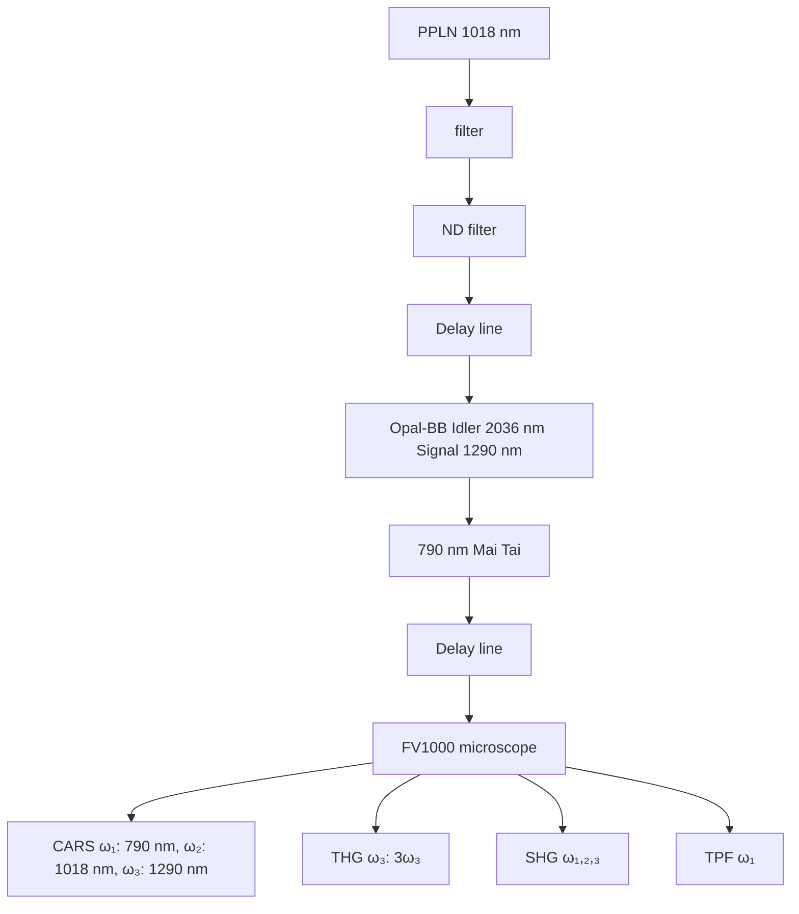

# A multimodal platform for nonlinear optical microscopy and microspectroscopy

Hongtao Chen,1 Haifeng Wang,2 Mikhail N. Slipchenko,2 YooKyung Jung,3 Yunzhou Shi,2 Jiabin Zhu,2 Kimberly K. Buhman,4 Ji-Xin Cheng, 1,2,\*

1 Department of Chemistry, Purdue University, West Lafayette, IN. 47907, USA 2 Weldon School of Biomedical Engineering, Purdue University, West Lafayette, IN. 47907, USA 3 Department of Physics, Purdue University, West Lafayette, IN. 47907, USA 4 Department of Foods and Nutrition, Purdue University, West Lafayette, IN. 47907, USA \*Corresponding author: jcheng@purdue.edu

Abstract: Multimodal nonlinear optical microscopy is a valuable tool to study complex biological samples. We present an easy-to-operate approach to perform coherent anti-Stokes Raman scattering (CARS), two-photon fluorescence (TPF), second harmonic generation (SHG), and third-harmonic generation (THG) imaging using a single laser source composed of an 80 MHz femtosecond (fs) laser, an optical parametric oscillator (OPO), and a PPLN crystal for frequency doubling. The platform allows vibrationally resonant CARS imaging of CH-rich myelin sheath in fresh spinal tissues and lipid bodies in live cells. Multimodal nonlinear optical imaging and microspectroscopy analysis of fresh liver tissues are demonstrated.

© 2009 Optical Society of America

OCIS codes: (190.4380) Nonlinear optics, four-wave mixing; (300.6230) Spectroscopy, coherent anti-Stokes Raman scattering; (110.0180) Imaging systems, microscopy

## References and links

1. W. Denk, J. H. Strickler, and W. W. Webb, "Two-photon laser scanning fluorescence microscopy," Science 248, 73-76 (1990).  
2. P. J. Campagnola, and L. M. Loew, "Second-harmonic imaging microscopy for visualizing biomolecular arrays in cells, tissues and organisms," Nat. Biotech. 21, 1356-1360 (2003).  
3. W. R. Zipfel, R. M. Williams, R. Christie, A. Y. Nikitin, B. T. Hyman, and W. W. Webb, "Live tissue intrinsic emission microscopy using multiphoton-excited native fluorescence and second harmonic generation," Proc. Natl. Acad. Sci. U. S. A. 100, 7075-7080 (2003).  
4. Y. Barad, H. Eisenberg, M. Horowitz, and Y. Silberberg, "Nonlinear scanning laser microscopy by third harmonic generation," Appl. Phys. Lett. 70, 922-924 (1997).  
5. J. Squier, M. Muller, G. Brakenhoff, and K. R. Wilson, "Third harmonic generation microscopy," Opt. Express 3, 315-324 (1998).  
6. D. Debarre, W. Supatto, A.-M. Pena, A. Fabre, T. Tordjmann, L. Combettes, M.-C. Schanne-Klein, and E. Beaurepaire, "Imaging lipid bodies in cells and tissues using third-harmonic generation microscopy," Nat. Meth. 3, 47-53 (2006).  
7. J.-X. Cheng, A. Volkmer, L. D. Book, and X. S. Xie, "An epi-detected coherent anti-Stokes Raman scattering (E-CARS) microscope with high spectral resolution and high sensitivity," J. Phys. Chem. B 105, 1277-1280 (2001).  
8. F. Ganikhanov, S. Carrasco, X. S. Xie, M. Katz, W. Seitz, and D. Kopf, "Broadly tunable dual-wavelength light source for coherent anti-Stokes Raman scattering microscopy," Opt. Lett. 31, 1292-1294 (2006).  
9. M. Hashimoto, T. Araki, and S. Kawata, "Molecular vibration imaging in the fingerprint region by use of coherent anti-Stokes Raman scattering microscopy with a collinear configuration," Opt. Lett. 25, 1768-1770 (2000).  
10. Y. Fu, H. Wang, R. Shi, and J.-X. Cheng, "Second harmonic and sum frequency generation imaging of fibrous astroglial filaments in ex vivo spinal tissues," Biophys. J. 92, 3251-3259 (2007).  
11. H.-W. Wang, T. T. Le, and J.-X. Cheng, "Label-free imaging of arterial cells and extracellular matrix using a multimodal CARS microscope," Opt. Commun. 281, 1813-1822 (2008).  
12. J. X. Cheng, and X. S. Xie, "Coherent anti-Stokes Raman scattering microscopy: instrumentation, theory, and applications," J. Phys. Chem. B 108, 827-840 (2004).  
13. S. Tang, T. B. Krasieva, Z. Chen, G. Tempea, and B. J. Tromberg, "Effect of pulse duration on two-photon excited fluorescence and second harmonic generation in nonlinear optical microscopy," J. Biomed. Opt. 11, 020501-020503 (2006).  
14. Y. Fu, H. Wang, T. B. Huff, R. Shi, and J.-X. Cheng, "Coherent anti-stokes Raman scattering imaging of myelin degradation reveals a calcium-dependent pathway in lyso-PtdCho-induced demyelination," J. Neurosci. Res. 85, 2870-2881 (2007).  
15. J. Moger, B. D. Johnston, and C. R. Tyler, "Imaging metal oxide nanoparticles in biological structures with CARS microscopy," Opt. Express 16, 3408-3419 (2008).  
16. X. Nan, J.-X. Cheng, and X. S. Xie, "Vibrational imaging of lipid droplets in live fibroblast cells with coherent anti-Stokes Raman scattering microscopy," J. Lipid Res. 44, 2202-2208 (2003).  
17. L. Li, H. Wang, and J.-X. Cheng, "Quantitative Coherent Anti-Stokes Raman Scattering Imaging of Lipid Distribution in Coexisting Domains," Biophys. J. 89, 3480-3490 (2005).  
18. T. Hellerer, C. Axäng, C. Brackmann, P. Hillertz, M. Pilon, and A. Enejder, "Monitoring of lipid storage in Caenorhabditis elegans using coherent anti-Stokes Raman scattering (CARS) microscopy," Proc. Natl. Acad. Sci. U. S. A. 104, 14658-14663 (2007).  
19. J.-X. Cheng, and X. S. Xie, "Green's function formulation for third-harmonic generation microscopy," J. Opt. Soc. Am. B 19, 1604-1610 (2002).  
20. S. Huang, A. A. Heikal, and W. W. Webb, "Two-photon fluorescence spectroscopy and microscopy of NAD(P)H and flavoprotein," Biophys. J. 82, 2811-2825 (2002).  
21. M. D. Duncan, J. Reintjes, and T. J. Manuccia, "Scanning coherent anti-Stokes Raman microscope," Opt. Lett. 7, 350-352 (1982).  
22. A. Zumbusch, G. R. Holtom, and X. S. Xie, "Three-Dimensional Vibrational Imaging by Coherent Anti-Stokes Raman Scattering," Phys. Rev. Lett. 82, 4142 (1999).  
23. E. O. Potma, D. J. Jones, J.-X. Cheng, X. S. Xie, and J. Ye, "High-sensitivity coherent anti-Stokes Raman scattering microscopy with two tightly synchronized picosecond lasers," Opt. Lett. 27, 1168-1170 (2002).  
24. C. L. Evans, E. O. Potma, M. Puoris'haag, D. Cote, C. P. Lin, and X. S. Xie, "Chemical imaging of tissue in vivo with video-rate coherent anti-Stokes Raman scattering microscopy," Proc. Natl. Acad. Sci. U. S. A. 102, 16807-16812 (2005).  
25. N. Dudovich, D. Oron, and Y. Silberberg, "Single-pulse coherently controlled nonlinear Raman spectroscopy and microscopy," Nature 418, 512-514 (2002).  
26. S.-H. Lim, A. G. Caster, and S. R. Leone, "Single-pulse phase-control interferometric coherent anti-Stokes Raman scattering spectroscopy," Phys. Rev. A 72, 041803 (2005).  
27. J.-X. Cheng, A. Volkmer, L. D. Book, and X. S. Xie, "Multiplex coherent anti-Stokes Raman scattering microspectroscopy and study of lipid vesicles," J. Phys. Chem. B 106, 8493-8498 (2002).  
28. M. Muller, and J. M. Schins, "Imaging the thermodynamic state of lipid membranes with multiplex CARS microscopy," J. Phys. Chem. B 106, 3715-3723 (2002).  
29. H. A. Rinia, K. N. J. Burger, M. Bonn, and M. Muller, "Quantitative label-free imaging of lipid composition and packing of individual cellular lipid droplets using multiplex CARS microscopy," Biophys. J. 95, 4908- 4914 (2008).  
30. H. N. Paulsen, K. M. Hilligse, J. Thøgersen, S. R. Keiding, and J. J. Larsen, "Coherent anti-Stokes Raman scattering microscopy with a photonic crystal fiber based light source," Opt. Lett. 28, 1123-1125 (2003).  
31. T. W. Kee, and M. T. Cicerone, "Simple approach to one-laser, broadband coherent anti-Stokes Raman scattering microscopy," Opt. Lett. 29, 2701-2703 (2004).  
32. H. Kano, and H.-o. Hamaguchi, "Ultrabroadband (> 2500 cm-1) multiplex coherent anti-Stokes Raman scattering microspectroscopy using a supercontinuum generated from a photonic crystal fiber," Appl. Phys Lett. 86, 121113-121113 (2005).  
33. G. I. Petrov, and V. Yakovlev, "Enhancing red-shifted white-light continuum generation in optical fibers for applications in nonlinear Raman microscopy," Opt. Express 13, 1299-1306 (2005).  
34. T. Hellerer, A. M. K. Enejder, and A. Zumbusch, "Spectral focusing: High spectral resolution spectroscopy with broad-bandwidth laser pulses," Appl. Phys. Lett. 85, 25-27 (2004).  
35. Y. Fu, H. Wang, R. Shi, and J.-X. Cheng, "Characterization of photodamage in coherent anti-Stokes Raman scattering microscopy," Opt. Express 14, 3942-3951 (2006).

## 1. Introduction

Understanding the interactions between cells, extracellular matrix, and stroma in a tissue environment is an emerging frontier of biology. Different modalities of nonlinear optical microscopy have been developed and combined for imaging complex tissue samples with inherent 3D spatial resolution. Among the one-beam modalities, two-photon fluorescence (TPF) microscopy [1] and second harmonic generation (SHG) microscopy [2] can be readily integrated with a femtosecond (fs) Ti:sapphire laser [3]. Third-harmonic generation (THG) microscopy [4, 5] has been combined with SHG and TPF by using an optical parametric oscillator (OPO) system [6]. As a two-beam modality, CARS microscopy is mostly operated with picosecond (ps) pulses, either from two synchronized Ti:sapphire lasers [7] or from a synchronously pumped OPO system [8]. In comparison with fs pulses, ps pulse excitation not only provides sufficient spectral resolution [9], but also increases the ratio of resonant CARS signal to non-resonant background [7]. Recently, CARS, TPF, and sum-frequency generation (SFG) modalities have been integrated into a microscope operated with ps pulses for multimodal imaging of white matter [10] and artery [11]. Although tunable ps laser systems operating in the NIR range are widely accepted for high-speed CARS imaging [12], the reduced efficiency of nonlinear optical (NLO) process caused by longer pulse duration [13] hinders the application of ps lasers to TPF and SHG imaging. Therefore, it is desirable to couple the CARS imaging modality to other widely used platforms of multiphoton microscopy. In this paper, we demonstrate the integration of CARS, TPF, SHG, and THG on a laser-scanning microscope platform based on a multi-beam source composed of a turn-key fs laser and an OPO. Our platform provides a practical solution to fully utilize the NLO imaging capabilities.

## 2. Materials and methods

## 2.1 Sample preparation

TiO2 nanopowder (<100 nm) was purchased from Sigma-Aldrich (St. Louis, MO) for the estimation of spatial resolution. 10 mg nanopowder was mixed with 1 mL milliQ water and sonicated for 5 min. After sonication, 20 µL of the mixture was dropped on a cover slip and dried in air. A drop of water was added to cover the dried nanopowder before imaging. Subcutaneous fat, extracted from a Long-Evans rat, was used to evaluate the vibrational contrast and the spectral resolution. The fat tissue was maintained in DMEM medium at 37 °C. A small piece of the fat tissue was placed in a coverslip-bottomed dish (MatTek, Ashland, MA) with 100 µL medium. A cover slip was placed on top of the tissue to minimize sample movement during imaging. Fresh spinal cord ventral white matter was extracted from adult guinea pigs as previously described [14]. The ventral white matter was cut into 1-cm long strips, placed in a coverslip-bottomed dish, and subsequently incubated in fresh Krebs’ solution at room temperature for 1 h prior to imaging. Fresh liver tissues were dissected from C57BL/6J mice fed a high fat diet for 3 weeks. A slice of fresh tissue was placed in a coverslip-bottomed dish with 100 µL medium before imaging. For live cell imaging, KB cells were cultured in a coverslip bottomed dish in RPMI1640 medium.

## 2.2 A multimodal nonlinear optical imaging platform

The platform that allows CARS, SHG, THG and TPF imaging is illustrated in Fig. 1. The laser source is composed of a fs laser (Mai Tai, Spectra-Physics, Fremont, CA) and an OPO (Opal-BB, Spectra-Physics). The Mai Tai laser is operated at 790 nm with 3.0 W output, at the repetition rate of 80 MHz. Pumped by 80% of the Mai Tai output, the OPO produces a signal beam at 1290 nm and an idler beam at 2036 nm. The idler frequency was doubled to 1018 nm using a PPLN crystal. The remaining 20% of the Mai Tai beam is sent through a delay line and collinearly combined with the frequency-doubled idler beam for CARS imaging on an inverted confocal microscope (FV1000+IX81, Olympus America Inc, PA). This Mai Tai beam is also used for TPF and SHG imaging. The 1290 nm signal beam from OPO provides SHG and THG imaging capabilities. The 1018 nm and the 1290 nm beams are firstly collinearly combined using a dichroic mirror (1200dcspxr, Chroma, VT), and then combined with the 790 nm beam using a second dichroic mirror (900dclp, Chroma, VT). The default polarizations of 790 nm, 1018 nm and 1290 nm beams are horizontal before the microscope.

A 60X/CARS water objective with a 1.2 numerical aperture (1-U2B893IR, Olympus) is used to focus all laser beams into the specimen. The backward signal is collected by the same objective, detected by either internal spectral detectors or an external PMT detector (R7683, Hamamatsu Photonics, Japan) installed at the side port. A dichroic mirror (675dcspxr, Chroma, VT) in the confocal scanning box and a silver mirror below the objective are used for internal detection of TPF, CARS, THG, and SHG signals. A silver mirror in the confocal box and a dichroic mirror (750dcspxr or 650dcspxr, Chroma, VT) below the objective are used for external detection. The forward signal is collected by an air condenser (IX2-LWUCD, NA 0.55, working distance 27 mm) and detected by a second external PMT detector (R7683, Hamamatsu Photonics, Japan). Appropriate bandpass filters (Chroma, VT) are used to selectively transmit a certain NLO signal. The acquisition time for each frame of $5 1 2 \times 5 1 2$ pixels is 1.1 seconds.

flowchart

Fig. 1. Schematic diagram of a multimodal NLO microscope using a fs laser source. The Mai Tai output at 790 nm $\left( \omega _ { 1 } \right)$ is split into two beams, with 80% of power being used to pump the Opal-BB. The idler output at 2036 nm from Opal-BB is doubled using a PPLN crystal. The rest of Mai Tai output is sent through a delay line and collinearly combined with the frequencydoubled idler beam at 1018 nm $( \omega _ { 2 } )$ for CARS imaging on a FV1000 laser-scanning inverted microscope. The 790 nm beam is also used for TPF and SHG imaging. The signal beam at 1290 nm (ω ) is used for SHG and THG imaging. Two internal spectral detectors are used for the microspectroscopy analysis. External detectors (not shown) are added for simultaneous forward and backward detection.

For CARS imaging of lipids, the pump laser $\left( \omega _ { 1 } \right)$ at 790 nm $( 1 2 6 5 8 ~ \mathrm { { c m } ^ { - 1 } ) }$ and the Stokes laser $( \omega _ { 2 } )$ at 1018 nm (9823 cm-1) provides a wavenumber difference centered at $2 8 4 0 ~ \mathrm { { c m } ^ { - 1 } }$ that matches the Raman shift of the symmetric CH stretch vibration in lipids. The CARS signal at 645 nm is detected by the external detectors with 650/45 nm bandpass filters or by the internal spectral detectors with a 620-670 nm filter. The backward SHG signal is detected by an external detector with a 650/45 nm filter for the 1290 nm excitation. The THG signal is detected with a 430/40 nm filter. The two-photon excited autofluorescence is detected by an external detector with a 520/40 filter or by the internal spectral detector with a 460-560 nm spectral filter. An internal lamda-scan mode is used for the microspectroscopy analysis within 400-700 nm range. Images were analyzed using FluoView software (Olympus America Inc., PA) and ImageJ (NIH). The maximum average power of the 790 nm beam is 220 mW before the microscope. The power of the 2036 nm beam is 240 mW before the PPLN crystal. The PPLN crystal produces a 1018 nm beam with a power of 52 mW before the microscope and 2.2 mW at the sample. The maximum power of the 1290 nm beam is 400 mW before the microscope. The 790 nm and 1290 nm beams are attenuated by the microscope optical components and neutral density wheels to 10 to 20 mW and 2 to 18 mw at the sample, respectively. No noticeable photo-damage to the samples was observed.

The pulse durations (FWHM) of the 790 nm and the 1290 nm beams are 130 fs and 200 fs, respectively. To measure the pulse duration of the PPLN-doubled 1018 nm beam, we scanned the time delay of the 790 nm beam and measured the time-resolved CARS intensity from glass. The recorded intensity profile versus the time delay showed a FWHM of 400 fs. By deconvolution with the 790 nm beam, we estimated the pulse duration of the 1018 nm beam to be 390 fs. The spectral widths (FWHMs) of the 790 nm and 1018 nm beams were measured to be 8 nm (corresponding to $\mathrm { { \dot { 1 } } 2 9 ~ c m ^ { - { \dot { 1 } } } ) }$ and 9 nm (corresponding to $8 6 ~ \mathrm { { c m } ^ { - 1 } ) }$ using a spectrometer, respectively.

## 3. Experimental results

## 3.1 Spatial resolution characterized with $T i O _ { 2 }$ nanoparticles.

natural_image

Microscopic image showing scattered bright spots on a dark background, with a labeled region 'a. CARS' and a scale bar (no other text or symbols)

line chart

| X (μm) | Intensity (a.u.) |
| ------ | ---------------- |
| 0.0    | 0.0              |
| 0.5    | 0.0              |
| 1.0    | 10.0             |
| 1.5    | 0.0              |
| 2.0    | 0.0              |

line chart

| Z (μm) | Intensity (a.u.) |
| ------ | ---------------- |
| 0      | 0                |
| 1      | ~3               |
| 2      | ~9               |
| 3      | ~1               |
| 4      | 0                |

natural_image

Microscopic image showing fluorescent spots with a circled region and scale bar (no text or symbols)

line chart

| X (μm) | Intensity (a.u.) |
| ------ | ---------------- |
| 0.0    | 0.0              |
| 0.5    | 2.0              |
| 1.0    | 9.0              |
| 1.5    | 2.0              |
| 2.0    | 0.0              |

line chart

| Z (μm) | Intensity (a.u.) |
| ------ | ---------------- |
| 0      | 0                |
| 1      | ~4               |
| 2      | ~9               |
| 3      | ~2               |
| 4      | 0                |

Fig. 2. Spatial resolution. (a) Epi-detected CARS image of $\mathrm { T i O } _ { 2 }$ nanoparicles, excited at 790 and 1018 nm. (b-c) Lateral and axial intensity profiles along the circled TiO nanoparticle in (a). (d) Epi-detected THG image of TiO nanoparicles, excited at 1290 nm. (e-f) Lateral and axial intensity profiles along the circled TiO2 nanoparticle in (d). Scale bars = 5 µm.

To evaluate the spatial resolution of our NLO imaging system, we used $\mathrm { T i O } _ { 2 }$ nanoparticles due to their high third-order nonlinear susceptibilities and intense CARS signal [15]. TiO nanoparticles with 50\~100 nm diameter were spread on a coverslip and covered by water. Fig. 2 shows epi-detected CARS and THG image of $\mathrm { T i O } _ { 2 }$ nanoparicles. Z-stack images were obtained with a 0.05 µm step size. The typical FWHM of the lateral and axial intensity profiles of a single particle was measured to be 0.38 µm and 1.11 µm, respectively for CARS imaging. Based on the point spread function theory, the FWHM was calculated to be 0.40 µm laterally and 1.43 µm axially for 790 nm excitation. For THG imaging, the typical FWHM of the lateral and axial intensity profiles of a single particle was 0.49 µm and 1.35 µm, respectively whereas the calculated FWHM was 0.66 µm laterally and 2.33 µm axially for 1290 nm excitation. The improved spatial resolution is due to NLO signal generation at the focal center. The spatial resolution of the CARS imaging is lower than the previously reported 0.28 µm and 0.75 µm obtained by two synchronized ps lasers at shorter wavelengths [7]. On the other hand, the longer wavelength provides better penetration depth [8], which benefits imaging of tissues.

## 3.2 Vibrational imaging of lipid bodies and lipid membranes using fs CARS

  
Fig. 3. Vibrational contrast of C-H rich objects. (a-d) The forward-detected CARS images of a subcutaneous fat tissue by the fs (a-b) and ps (c-d) lasers, respectively. The Raman shift is marked in each image. Scale bars = 20 µm. (e) The CARS spectra of subcutaneous fat recorded with the fs (grey) and ps (black) lasers. (f-g) The backward-detected CARS images of myelin sheath surrounding parallel axons in a fresh spinal tissue (f) and paranodal myelin at a node of Ranvier (g). Scale bars = 10 µm.

The vibrational contrast and the spectral resolution are two important parameters for CARS microscopy. The pulses of a few ps provide a high vibrational contrast and a good spectral resolution for CARS imaging [14, 16-18] because their spectral width matches the typical Raman band $( 8 { \cdot } 1 0 \ \mathrm { c m } ^ { - 1 } ) .$ . The pulses of \~100 fs duration have a bandwidth of $\sim 1 5 0 ~ \mathrm { c m } ^ { - 1 }$ approximately in the NIR region, thus most energy is used for the generation of non-resonant background. However, some biologically significant Raman bands have a broad spectral profile. For instance, the CH stretch vibration at $2 8 5 0 ~ \mathrm { c m } ^ { - 1 }$ has a line width $\mathrm { o f } \sim 5 0 \mathrm { c m } ^ { - 1 }$ . For the C-H rich objects, we anticipate that our system could give a good CARS contrast. To compare the performance of the ps and fs pulses, we recorded the CARS spectra of fat tissues by our fs CARS system and our ps CARS setup [11] in which the pump and Stokes beams were at 707 nm and 885 nm with 5 ps and 7 ps pulse lengths, respectively. The forwarddetected CARS images on- and off- the CH vibration were shown in Fig. 3(a-d). A strong vibrational contrast was observed with both the fs and ps lasers. Whereas the spectral width obtained by the fs system (Fig. 3(e), gray) was broader than that by the ps system (Fig. 3(e), black), we noticed that both systems generated the same vibrational contrast of 6:1 measured as the ratio of the resonant signal at \~2840 cm-1 to non-resonant background at 2760 cm-1. This result demonstrates the applicability of fs lasers to acquire high-quality CARS images of lipid-rich features.

To further demonstrate the feasibility of fs CARS for vibratonal imaging of lipid membranes, we have imaged the myelin sheath which is an extended plasma membrane wrapping around an axon and is crucial for impulse conduction. CARS microscopy has been proven as a unique tool for the visualization of myelin in healthy and diseased states [14]. Fig. 3(f) showed that high quality CARS images of myelin can be obtained with our fs laser source. The signal to background ratio of 9:1 is comparable to the value (15:1) obtained with the ps lasers. Moreover, the high spatial resolution allowed clear visualization of paranodal myelin loops around a node of Ranvier (Fig. 3(g)).

## 3.3 Comparison of CARS and THG imaging of lipid droplets

Lipid droplets can be imaged by CARS [16] as well as THG microscopy [6] in a label-free manner. Our system allowed direct comparison of these two modalities using live cells. We used the 1290 nm excitation to produce the forward THG signal from lipid droplets inside KB cells (Fig. 4(a)). We then used the 790 nm and 1018 nm beams to produce the forward CARS signal from the same cells (Fig. 4(b)). We adjusted the laser powers used for CARS and THG imaging so that the peak intensities from lipid droplets were at the same level. For THG imaging, the final power at the sample was 18 mW, while for CARS imaging, the pump power was 1.7 mW and the Stokes power was 1.4 mW. Based on these data, we estimated that the efficiency of CARS would be $1 8 ^ { 3 } / ( 3 { \times } 1 . 7 ^ { 2 } { \times } 1 . 4 ) = 4 8 0$ times stronger than THG in our setup, where 3 is the combinatorial factor. The larger signal in CARS is conceivably due to the Raman enhancement. Additionally, the Gouy phase shift of a focused beam, which diminishes the NLO signal generation from a focal volume, is tripled in THG but partially canceled in CARS [19]. Because of the Gouy phase shift, THG imaging is not sensitive to homogeneous medium, thus we observed a dark contrast from the rest of the cells. In contrast, the forward CARS signal also arose from the solvent and the entire cell body was visualized.

natural_image

Microscopic images comparing THG and CARS cell samples, showing cellular structures with white speckles (no text or symbols)

Fig. 4. Comparison of forward-detected THG (a) and CARS (b) images of lipid droplets inside live KB cells. Scale bars = 10 µm.

## 3.4 Multimodal NLO imaging and microspectroscopy analysis of fresh liver tissue

A key advantage of the fs laser source is its superior capabilities of TPF, SHG, and THG imaging over ps lasers. To illustrate such advantage, we imaged fresh liver tissues from high fat fed mice using TPF to visualize intrinsic fluorphores, SHG to visualize collagen, and CARS to visualize lipid bodies in hepatocytes. The backward TPF signals and forward CARS signals were collected simultaneously, whereas the TPF and backward SHG were recorded sequentially.

At the liver surface, a strong TPF signal from fibrous structures was observed $( z = 0$ µm, Fig. 5(a)). When the laser was focused into the tissue around 1 µm below the liver surface, we observed collagen fibers clearly by SHG imaging with the 1290 nm excitation (Fig. 5(b)). Although the 790 nm excitation can provide similar information of collagen fibers, the 1290 nm beam provides better penetration depth and higher selectivity by minimizing the autofluorescence from hepatocytes. When the laser was focused into the tissue around 4 to 5 µm below the liver surface, numerous lipid droplets inside cells were visualized by CARS (Fig. 5(c)). The two-photon excited autofluorescence of the same liver cells was visualized simultaneously (Fig. 5(d)).

In addition to multimodal imaging, our setup is capable of the multimodal spectral analysis with a λ-scanner. By performing the λ-scan of the circled area in Fig. 5(c), a spectrum that contained autofluoresence from the liver cells and CARS signal from the intracellular lipid bodies was obtained and shown in Fig. 5(e). To assign the origin of the autofluorescence, we recorded the spectra with different excitation wavelengths ranging from 720 nm to 900 nm as shown in Fig. 5(f) and observed the strongest autofluorescence at the 720 nm excitation. Based on the excitation spectra of coenzymes [20], we determined that autofluorescence signal mainly arose from NAD(P)H. This multimodal spectral analysis can be potentially used to study the relationship between lipid accumulation and metabolic activity in the liver cells.

natural_image

Fluorescence microscopy image showing green-labeled neural network structures at 790 nm scale (z = 0 μm), no text or symbols present.

natural_image

Microscopic image showing scattered white particles on a dark background, with a red-circled region highlighting a cluster of particles (no text or symbols present)

line chart

| Emission (nm) | Intensity (a.u.) |
| ------------- | ---------------- |
| 400           | 0                |
| 450           | 4                |
| 500           | 6                |
| 550           | 4                |
| 600           | 2                |
| 650           | 9                |

natural_image

Fluorescent microscopy image showing SHG protein expression in a neural network at 1290 nm scale (z = 1 μm), with no visible text or symbols.

natural_image

Microscopic image showing dark circular structures with bright spots, labeled 'd. TPF' in top-left corner (no other text or symbols)

line chart

| Emission (nm) | 720 nm | 750 nm | 790 nm | 820 nm | 860 nm | 900 nm |
| ------------- | ------ | ------ | ------ | ------ | ------ | ------ |
| 400           | 0      | 0      | 0      | 0      | 0      | 0      |
| 450           | 10     | 8      | 6      | 4      | 2      | 1      |
| 500           | 9      | 8      | 6      | 4      | 2      | 1      |
| 550           | 7      | 6      | 5      | 3      | 2      | 1      |
| 600           | 4      | 3      | 3      | 2      | 1      | 1      |
| 650           | 1      | 1      | 1      | 1      | 1      | 1      |

Fig. 5. Multimodal nonlinear optical imaging of fresh liver tissues from high fat fed mice. (a) TPF image excited at 790 nm and detected in the 450-550 nm region. Fibrous structure on the liver surface produced strong intrinsic fluorescence. (b) SHG image of collagen fibers at 1 µm below the liver surface, excited by the 1290 nm beam. (c) Forward-detected CARS image of lipid droplets in liver cells. (d) TPF image of the same cells as in (c) excited by the 790 nm fs laser. (e) Microspectroscopy analysis of the circled area shown in (c) using a λ-scanner detector and the same lasers. The CARS signal peaked at 645 nm and the autofluorescence peaked around 490 nm are shown. (f) TPF spectra of the entire image shown in (d) by different excitation wavelengths. Scale bars = 10 µm.

## 4. Discussion

Laser sources have been essential for the advances in CARS microscopy. In the 1980s, visible dye lasers with non-collinear beam geometry were used in the first CARS microscope [21]. In 1999, Xie and coworkers revived this technique by using two synchronized near infrared fs pulse trains for CARS imaging in a collinear beam geometry [22]. Later, Hashimoto et al. used an amplified laser system to produce two ps pulse trains for CARS imaging [9]. Cheng et al. indicated for the first time that tunable ps lasers operating in the NIR wavelengths provides not only high spectral resolution, but also superior vibrational contrast over fs lasers [7]. In the spectral domain, the spectral width of a fs pulse is much broader than the width of most Raman lines, i.e. vibrational line widths are typically on the order of 10 cm-1 whereas fs pulses are around 100 cm-1 in bandwidth. On the other hand, the spectral width of a ps pulse matches the Raman line width, thus focusing the excitation energy on a single Raman band and permitting high-speed CARS imaging. Since 2001, ps laser sources have been widely used in developments of CARS microscopy, including electronically synchronized Ti:sapphire lasers [23] and synchronously pumped, intracavity-doubled ps OPO [24]. In parallel, various designs based on fs lasers were proposed to utilize the advantages of fs pulses. CARS microscopy with a single broadband source through optical pulse shaping was demonstrated [25, 26]. Multiplex CARS microscopy with ps/fs pulse excitation [27-29] and with a laser-pumped photonic crystal fiber have been extensively explored [30-33]. However, high-speed and highquality images were still difficult to obtain with these methods. Moreover, it is difficult to perform multimodality imaging on these platforms.

The current work couples CARS microscopy to a widely used multiphoton imaging platform based on a fs laser, a synchronously pumped fs OPO, and a PPLN doubling crystal. This method provides a cost-efficient way to maximize the bioimaging capabilities of NLO microscopy. It also offers several advantages over multimodal imaging with two synchronized ps lasers [14]. First, all the pulses are inherently synchronized, which eliminates the need for day-to-day alignment of temporal overlapping of the two beams for CARS imaging. Second, all the wavelengths are in the near IR region from 700 nm to 1.3 µm, a golden window for tissue imaging. Third, the fs pulses allow efficient generation of TPF, SHG, and THG signals. Importantly, unlike amplified fs lasers [22, 34], the pulses of a high repetition rate in our system permit high-speed imaging. Although the highest acquisition rate of our microscope is 2 µs/pixel, video rate imaging using advanced scanning configurations [24] is feasible due to the significant NLO signal level. Furthermore, the three-beam modality with tunable ability allows background free CARS imaging via time-resolved detection.

Compared with ps lasers, a disadvantage associated with fs lasers is the higher peak power at the focus. It was shown that the photodamage in CARS microscopy [35] increases with shorter wavelengths. In our system, the average power of the 1018 nm beam at the sample is relatively low (2.2 mW), and thus a higher power (10 to 20 mW) of 790 nm beam is used. Increasing the power of the Stokes beam by intracavity doubling would be beneficial to increase the photodamage threshold and further enhance the vibrational contrast by minimizing the two-photon resonance enhancement of the non-resonant background.

To summarize, we have demonstrated multimodal NLO imaging based on a turn-key fs laser, an OPO, and a frequency doubling system. Our method provides a cost-effective solution to implement CARS and THG imaging on a widely used multiphoton microscope. The integration of CARS, SHG, THG, and multiphoton fluorescence on the same microscope platform greatly enhances the capability, applicability, and versatility of NLO microscopy.

## Acknowledgments

This work was supported by NIH R01 grant EB007243. The authors cordially thank Spectra-Physics/Newport and Olympus Inc. for their strong technical support of the instrumentation.