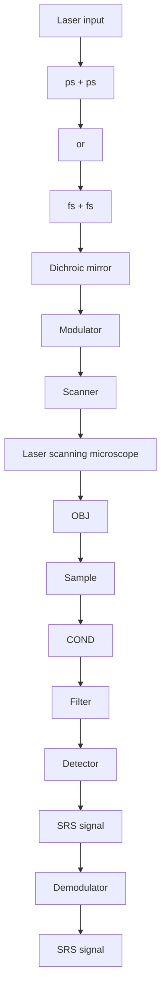
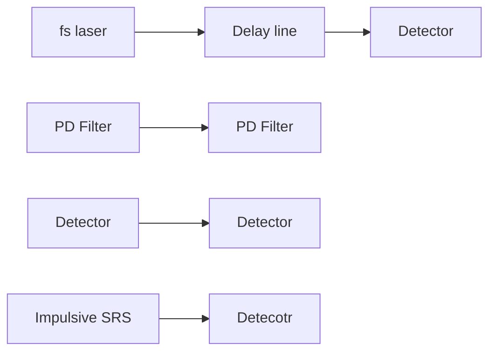
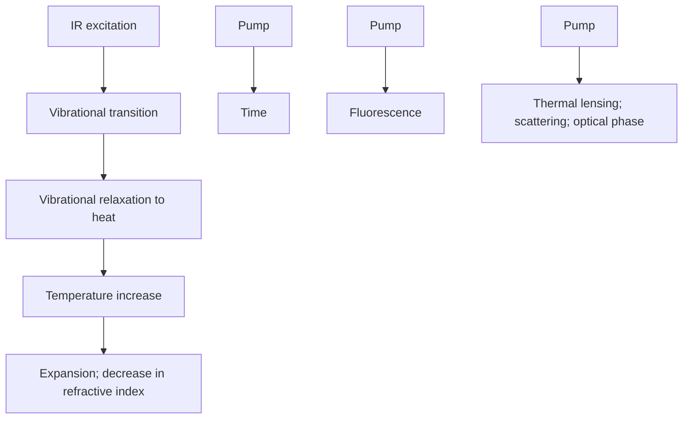
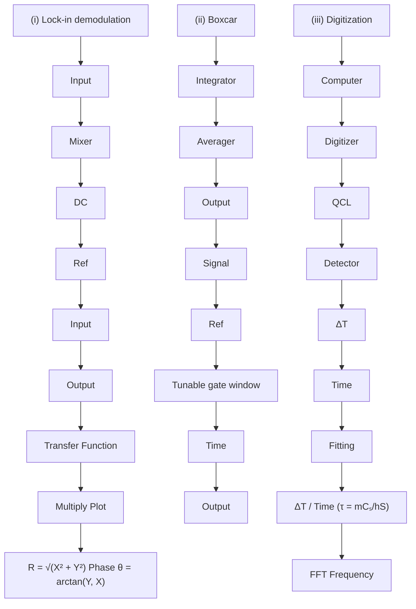
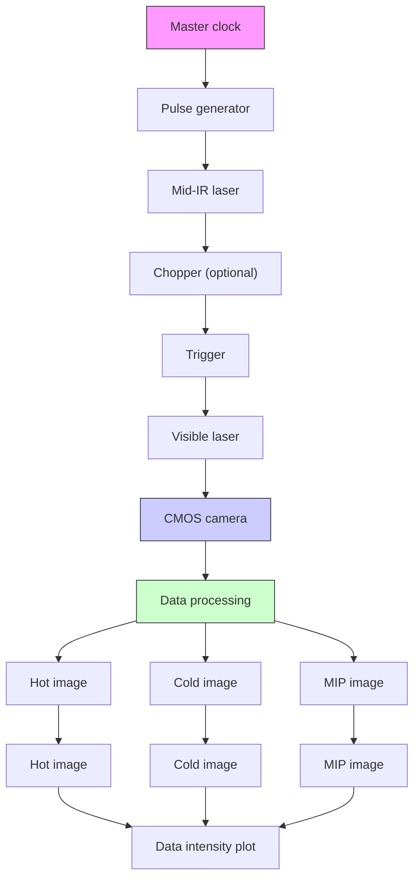
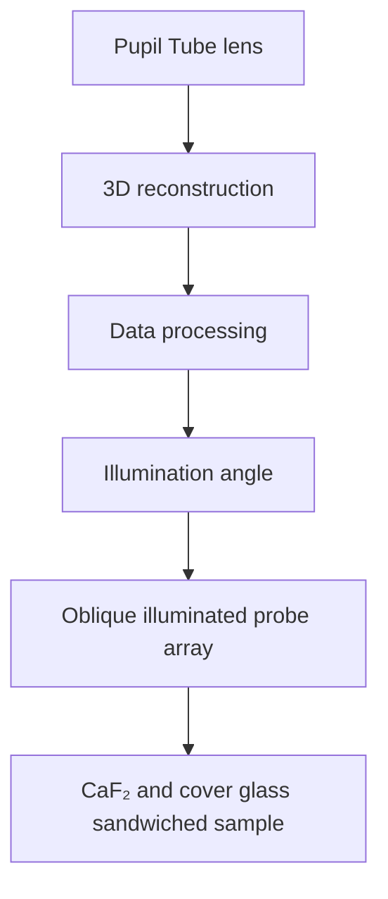

# Advanced vibrational microscopes for life science

Received: 7 July 2024

Accepted: 4 March 2025

Published online: 13 May 2025

Check for updates

Ji-Xin Cheng  1,2,3,4 , Yuhao Yuan  1 , Hongli Ni1 , Jianpeng Ao1 , Qing Xia  1 , Rylie Bolarinho3 & Xiaowei Ge  1

Providing molecular fngerprint information, vibrational spectroscopic imaging opens a new window to decipher the function of biomolecules in living systems. While classic vibrational microscopes based on spontaneous Raman scattering or mid-infrared absorption ofer rich insights into sample composition, they have very small cross sections or poor spatial resolution. Nonlinear vibrational microscopy, based on coherent Raman scattering or optical photothermal detection of vibrational absorption, overcomes these barriers and enables high-speed and high-sensitivity imaging of chemical bonds in live cells and tissues. Here, we introduce various modalities, including their principles, strengths, weaknesses and data mining methods to the life sciences community. We further provide a guide for prospective users and an outlook on future technological advances.

Optical microscopy has been a foundational tool in life science since Van Leeuwenhoek’s observation of microorganisms in the 17th century using his single-lens microscope. The invention of phase contrast microscope in the 1930s further allowed the observation of structures such as chromosomes inside live cells. For imaging biomolecules, fluorescence microscopy is currently the tool of choice, aided by the development of dyes, fluorescent proteins and advanced modalities such as super-resolution microscopy. However, the fluorescent reporters are often larger than the target molecules including small proteins, fatty acids, amino acids, carbohydrates and cholesterol. Thus, labeling inevitably perturbs the functions of small biomolecules. Click chemistry has been developed to partially address this concern, wherein the molecules of interest are first tagged with an azide or alkyne causing minimal perturbation to biochemistry and are then conjugated to a dye through a click reaction for visualization under a fluorescence microscope. Yet, the click-chemistry approach only allows one snapshot of the system, prohibiting dynamic imaging. Additionally, the click reaction efficiency can be heterogeneous in a cellular environment.

One elegant way to address these limitations is using chemical bond vibrations as contrast. Vibrational microscopy can be pursued in a label-free manner by targeting intrinsic bonds within biomolecules or in a click-free manner by direct imaging of the azide or alkyne bonds. In the spectral domain, fluorescence is broad (\~50 nm), limiting the number of fluorophores to be used, and is often affected by photobleaching. In contrast, vibrational lines are much narrower (\~1 nm), allowing for highly multiplexed imaging without photobleaching. These unique advantages have made vibrational imaging a highly desirable goal for scientists. However, it is technically very challenging since signals such as spontaneous Raman scattering from a chemical bond are many orders of magnitude weaker than the fluorescence emission from a dye. Mid-infrared absorption offers a much larger cross section, but the spatial resolution of an infrared light microscope is too poor to resolve features inside a cell, and strong water absorption impairs infrared spectroscopic imaging of living systems. Advanced vibrational microscopes, which include coherent Raman scattering (CRS) microscopy, vibrational photothermal (VIP) microscopy, vibrational photoacoustic imaging and up-conversion of mid-infrared absorption (Fig. 1), are overcoming these daunting barriers, enabling highspeed, high-sensitivity imaging of specific chemical bonds in live cells and organisms.

In this Review, we provide an overview of the development of these advanced vibrational microscopes with a focus on CRS (Box 1) and VIP (Box 2) microscopy. We describe the principles, instrumentation, advantages and limitations of each modality. We further discuss the role of data science in vibrational imaging, illustrate multi-scale

1 Department of Electrical and Computer Engineering, Boston University, Boston, MA, USA. 2 Department of Biomedical Engineering, Boston University, Boston, MA, USA. 3 Department of Chemistry, Boston University, Boston, MA, USA. 4 Photonics Center, Boston University, Boston, MA, USA.

e-mail: jxcheng@bu.edu

a  

text_image

Pump
Stokes
Pump
Anti-Stokes
Ω
CARS

b  

c  
  
Fig. 1 | Energy diagrams for advanced vibrational microscopy. a–f, Energy diagrams. CARS, coherent anti-Stokes Raman scattering. SRS, stimulated Raman scattering. SRP, stimulated Raman photothermal. MIP, mid-infrared photothermal. MIPA, mid-infrared photoacoustic. SWIP, shortwave infrared

d  

e  

f  

text_image

Visible/NIR
Fluorescence
v = 3
v = 2
v = 1
v = 0
IR
FEIR

photothermal. OPA, overtone photoacoustic. VR-SFG, vibration-resonant sum frequency generation. FEIR, fluorescence-encoded infrared. IR, infrared. NIR, near infrared. SWIR, shortwave infrared. Ω, chemical bond vibrational frequency. ν, vibrational energy level.

life science applications from single viruses to humans, offer a user guide on modality selection and sample preparation, and present an outlook for the field.

## CRS microscope

## CARS microscope

The coherent anti-Stokes Raman scattering (CARS) microscope was reported by Duncan et al. in 1982 (Fig. 2a)1 , in which a non-collinear scheme was adopted to meet the phase-matching condition required in CARS spectroscopy. In 1999, Zumbusch et al. reported a collinear CARS microscope (Fig. 2b)2 . With a high numerical aperture (NA) objective lens, the phase-matching conditions are relaxed due to the large cone of wave vectors and the short interaction length within the focal volume. Additionally, with near-infrared (NIR) lasers, the linear absorption-induced photodamage is minimized and the nonresonant background is reduced compared to visible lasers. The collinear beam geometry and NIR excitation were widely adopted and revived the CARS microscopy field. The development of advanced CARS modalities (Supplementary Table 1) is summarized below.

In 2001, Cheng et al. improved the spectral resolution and signal-to-background ratio using a NIR picosecond laser as the excitation source (Fig. 2c)3 . In CARS, the nonresonant signal is quadratically dependent on the pulse spectral width, while the resonant CARS signal reaches a plateau when the spectral width of a laser pulse exceeds the Raman line width in the condensed phase. As a result, laser pulses of a few picoseconds, corresponding to a spectral width of about 10 cm−1 , are ideal for CARS imaging and this concept has been adopted by the field since then. In the meantime, epi-detected CARS microscopy (Fig. 2c) was reported as a means of imaging nanoscale objects in a bulk medium3 . For small scatterers or thin samples with a size much smaller than the excitation wavelengths, the phase-matching condition is satisfied in both forward and backward detections. Therefore, the same signal intensity is expected in both forward-detected and epi-detected CARS. On the other hand, the nonresonant background from the bulk solvent builds up coherently and predominantly goes forward, allowing small objects to be epi-detected with high contrast. For thick samples, epi-detected CARS arises from back-scattering of forward signals4 . Recently, Heuke and Rigneault reported coherent Stokes Raman scattering microscopy as a potential means of enhancing the backward-to-forward signal ratio5 .

Although picosecond lasers allow high-speed CARS imaging of a specific Raman band, single-color CARS images are insufficient to identify the chemical composition of a sample. With picosecond lasers, a CARS spectrum can be acquired by slow wavelength tuning. Integration of a narrowband picosecond laser with a broadband femtosecond laser was applied to enable acquisition of a CARS spectrum at each pixel. In 2002, Cheng et al.6 and Wurpel et al.7 reported multiplex CARS (Fig. 2d) by combining a narrowband and a broadband laser

## BOX 1

# Spontaneous Raman versus coherent Raman scattering

In spontaneous Raman scattering, a single laser beam (pump) interacts with molecules to generate both Stokes and anti-Stokes Raman scattering. In CRS, including CARS (Fig. 1a) and SRS (Fig. 1b), two laser beams, one at pump frequency (ω ) and the other at Stokes frequency $( \omega _ { \mathrm { { s } } } ) ,$ , drive the vibration of a chemical bond. The light–matter interactions produce a signal at the anti-Stokes frequency $( \omega _ { \mathsf { p } } - \omega _ { \mathsf { S } } + \omega _ { \mathsf { p } } )$ and the Stokes frequency. Meanwhile, the pump beam experiences an intensity loss and the Stokes beam experiences an intensity gain, referred to as stimulated Raman loss and stimulated Raman gain, respectively. CARS, stimulated Raman loss and stimulated Raman gain can be implemented in the single-color mode using picosecond laser pulses, or in the multiplex mode with a narrowband and a broadband laser source.

Intuitively, CARS and SRS gain a large signal level by interfering with a local oscillator. The CARS field interferes with the nonresonant background, whereas SRS interferes with one of the input laser fields. Notably, the local oscillator carries noise. At the shot noise limit, the signal grows faster than the noise with increasing laser power and builds suficient SNR on the microsecond timescale. Therefore, CARS and SRS outperform spontaneous Raman for imaging a specific Raman mode with microsecond dwell time.

When the molecular concentration is at the micromolar to nanomolar level, down to the single molecule, the very limited SRS or CARS photons are buried in noise. Raman imaging is also inefective under these conditions due to the low photon count. Nevertheless, spontaneous Raman can accumulate suficient photons to build the SNR with second-level integration. In this sense, CARS, SRS and Raman spectroscopy are complementary techniques. CARS and SRS are suitable for fast imaging of molecules with relatively high local concentrations, often at millimolar levels, such as lipid, myelin, proteins and nanoparticles. Spontaneous Raman scattering is suitable for slow, whole-spectrum measurements at a point of interest.

to acquire a CARS spectrum covering a few hundred wavenumbers with a spectrometer. The spectral resolution was determined by the narrow-bandwidth picosecond laser and the covered range of the spectra window was determined by the femtosecond laser. In 2004,

## BOX 2

# Photothermal versus photoacoustic imaging of chemical bonds

Vibrational transitions are quantized and the lifetime of a vibrationally excited state is a few picoseconds. Thus, a nanosecond mid-infrared pulse, a nanosecond SWIR pulse, or a train of NIR pump and Stokes pulses, could repetitively excite a chemical bond, with all absorbed energy converted to heat via eficient vibrational relaxation. The heat difusion then follows Newton’s law of heating and cooling on the nanosecond to microsecond timescale. Since vibrational excitation and relaxation are on the much shorter picosecond timescale, the generated heat accumulates and induces a substantial temperature rise, a thermal lens of a medium or a thermal expansion of a particle, which can be measured through fluorescence, optical phase or Rayleigh scattering detection. This mechanism makes VIP microscopy an extremely sensitive method for chemical bond imaging. The concept of photothermal imaging based on the change in refractive index (the mirage efect)145 was proposed in 1983. Initial efort on mid-infrared photothermal imaging based on a quantum cascade laser was reported in 2012; however, with 1–2-µm spatial resolution146. A 2016 high-performance MIP microscope62 achieved submicrometer spatial resolution and micromolar sensitivity. This work triggered rapid technical developments147,148 and commercialization of optical photothermal infrared microscopy into a mIRage system by Photothermal Spectroscopy Corporation149. Advanced MIP schemes achieving 100-nm resolution were reported recently150,151.

Notably, the transient heat further expands the specimen and generates an ultrasound wave via the photoacoustic efect. Transducer-based NIR and MIPA imaging of lipid, glucose and protein has been demonstrated89,93,95. Both the photothermal and photoacoustic efects modulate the refractive index and can be optically probed. A recent work shows that the optical photothermal signal is \~63 times larger than the photoacoustic signal under the same excitation87. The low eficiency of thermal energy to ultrasound wave conversion and the diference between thermo-optic and elasto-optic coeficients account for this diference. On the other hand, unlike the photothermal signal, which is highly confined to the excitation focus, the photoacoustic wave experiences much less tissue scattering than the optical wave and can propagate to a far-field transducer. In this scenario, the two modalities are complementary for chemical imaging. The photothermal efect allows highly sensitive detection of nanoscale objects or low-concentration molecules via a pump-probe scheme, while the photoacoustic efect allows deep-tissue imaging of abundant chemical bonds, such as lipids deposited inside an arterial wall89.

broadband CARS was developed by Kee et al. to cover a spectral window of more than 2,500 cm−1 with a laser of broader bandwidth8 . In 2014, Cicerone and coworkers developed three-color broadband CARS that allowed the acquisition of fingerprint CARS spectra with a pixel dwell time of a few milliseconds9 .

Multiplex CARS was also achieved in the time domain. In 2002, Volkmer et al. developed time-resolved CARS that used two femtosecond lasers to excite multiple vibration modes and a third femtosecond laser to probe the signal10. The CARS spectrum was reconstructed by

Fourier transform. In 2004, spectral focusing was introduced to femtosecond laser-excited CARS, in which the femtosecond pulses were temporally chirped into picosecond pulses with optical gratings11. A CARS spectrum was generated by tuning the delay between the pump and Stokes pulses. In 2006, Ogilvie et al. reported Fourier-transform CARS (Fig. 2f) to achieve a 1,500 cm−1 spectral window using ultrashort pulses12. Ideguchi et al. harnessed laser frequency combs for high-speed CARS spectroscopy and spectral imaging13. By a fast delay scanner, Goda and coworkers applied Fourier-transform CARS to high-throughput single-cell analysis14,15.

Most CARS microscopes are built by scanning the sample or the tightly focused laser beams. Laser-scan CARS reached video-rate imaging speed in 2005 (ref. 4). To further improve the imaging speed and throughput, widefield CARS (Fig. 2e) was developed by Heinrich et al.16. A dark-field counterpropagating excitation with nanosecond pulsed lasers was used to satisfy the phase-matching conditions. Since then, different excitation schemes for widefield CARS have been adopted, including non-phase-matching illumination17, dynamic speckle illumination18, CARS holography19, collinear non-phase-matching illumination20, phase imaging21, surface-enhanced22 and random illumination23. In particular, widefield surface-enhanced CARS allowed rapid acquisition of Raman spectra with 10 cm−1 spectral resolution and achieved an imaging speed of 120 frames per second22.

CARS imaging is affected by a nonresonant background that arises from an electronic contribution to the third-order susceptibility. Such background limits the sensitivity of detecting low-concentration molecules and disperses the CARS spectrum. Persistent efforts have been made to minimize the background, as detailed in the Supplementary Information.

## SRS microscope

The stimulated Raman scattering (SRS) microscope reported in 2007 by Ploetz et al.24 is based on multiplex detection of signals generated by high-energy pulses, whereas the low-repetition-rate laser limited the signal-to-noise ratio (SNR). A high-speed SRS microscope using MHz modulation was reported in 2008 by Freudiger et al.25 and independently in 2009 by two other groups26,27. In the standard configuration of an SRS microscope (Fig. 3a), two spatially and temporally overlapped ultrafast lasers are tightly focused on a sample by a high-NA objective. Because of SRS, a modulation transfer from the intensity-modulated laser to the unmodulated laser occurs in the focus. The MHz-frequency modulation brings the SRS signal out of the low-frequency noise, which enables high-sensitivity and high-speed detection. The transmitted light is collected by a high-NA condenser to minimize a cross-phase modulation background and then spectrally filtered to remove the modulated laser. After converting the light-intensity to electrical signal by a photodetector, a demodulator, typically a lock-in amplifier, is used to obtain the SRS signal. Based on this basic configuration, various advanced SRS instrumentations have been developed to address the need for faster speed, higher sensitivity, super resolution, extended spectral range, volumetric imaging and clinical translation. Theoretically, SRS and CARS share the same level of SNR27.

Targeting video-rate imaging, an epi-detected SRS microscope was demonstrated by incorporating resonant scanners and placing the detector directly in front of the objective lens28. The high-speed epi-detection enabled in vivo imaging without motion artifacts, whereas the difficulty in building the specialized detector blocked the wide use of this method. Spatially multiplexed SRS further pushed the frame rate to 2 kHz with an arrayed detector29, allowing real-time imaging of chemical kinetics. The challenges of this method are the alignment complexity and the low power density per channel.

Pursuing high-speed spectral acquisition, a spectrally broadband femtosecond laser was used for spectral focusing or spectral multiplex ing. Spectral focusing is a technique to improve the spectral resolution of coherent Raman by chirping the spectrally broadband lasers

a Non-collinear CARS; 1982  

text_image

ps
ω$_
ω$_P
Sample
Filters
ω$_AS
Camera

b Collinear fs-CARS; 1999  

text_image

fs
ωP
ωS
ωAS
Photon counter

c Epi ps-CARS; 2001  

text_image

ωP
ωS
ωAS
Dichroic
mirror
APD

d Multiplex CARS; 2002  

text_image

ωP
ωS
ωAS
Spectro
-meter

e Widefield CARS; 2004  

text_image

ωP
ωS
ωAS
CCD

f FT CARS; 2006  

text_image

Beam
splitter
fs
Mirror
ωAS
PMT

Fig. 2 | Various modalities developed for CARS imaging. a–f, CARS imaging modalities. ps, picosecond. fs, femtosecond. ω , frequency of pump laser. ω , frequency of Stokes laser. ${ \bf \nabla } _ { \bf \omega } \omega _ { \omega } ,$ frequency of anti-Stokes signal. APD, avalanche photodiode. CCD, charge-coupled device. FT, Fourier transform. PMT, photomultiplier tube.

(Fig. 3b)30,31. As the laser pulses are parallelly stretched in the temporal–spectral domain, the instantaneous frequency difference between the two pulses is constant and an SRS spectrum can be acquired by tuning the temporal delay. Delaying scanning with a motorized delay stage is the most straightforward approach, but it is slow. Galvo scanner-based32, polygon mirror-based33 and acousto-optic-based34 delay lines realized kilohertz spectral acquisition at the expense of alignment complication. Spectral multiplexing is another approach to achieve high-speed spectrum acquisition, where a spectrally broadband femtosecond laser is combined with a narrowband picosecond laser for simultaneous excitation of multiple vibration bands. The unmixing of the spectral channels is realized by a spectrometer with an arrayed detector24,35 (Fig. 3c) or by time-domain encoding and decoding with a single-pixel detector35,36. The shared disadvantage of spectral focusing and spectral multiplexing is the limited spectral range, which is determined by the laser bandwidth. This problem can be addressed by using a laser with a larger bandwidth31. However, the instability and insufficient output power of these lasers remain a concern. Other efforts have been made to develop a fast wavelength tuning laser for high-speed spectral scanning. A pulse pair-resolved wavelength-switchable laser has been reported for ultrafast multicolor SRS imaging on flow cytometry37. The shortcoming is the limited number of spectral channels. On the laser side, high-speed swept-source techniques using a Fourier-domain mode-locked laser38 or galvo/resonant scanner-based wavelength sweeping39 were developed for high-speed spectral acquisition. A fast-tuning fiber laser outputting picosecond pulses has been developed for multi-window SRS imaging40

Toward higher detection sensitivity and higher resolution, pre-resonance SRS reported in 2017 achieved sub-micromolar sensitivity of engineered Raman tags41. SRS excited fluorescence further stepped into the single-molecule regime by integrating highly sensitive fluorescence detection42. Combining SRS excited fluorescence with stimulated emission depletion allows for high-resolution vibrational imaging with 180-nm lateral resolution43. Inspired by reversible saturable optical fluorescence transition nanoscopy, vibrational photoswitchable probes44 have been developed to advance super-resolution SRS imaging45,46. Plasmon-enhanced SRS offers another approach to reach single-molecule imaging sensitivity47. The major issue of these methods is the requirement of a specific exogenous label with NIR pre-resonance or plasmonic resonance. Alternatively, SRS microscopy using visible excitation wavelengths achieved pre-resonance sensitivity enhancement of endogenous molecules by two orders of magnitude48. The usage of short-wavelength laser also benefits the spatial resolution, enabling 130-nm lateral resolution49. As shown in Fig. 3d, the visible SRS system is built by adding second-harmonic generation crystals to a spectral focusing SRS setup. The downside is the increased photodamage induced by the visible light. Such photodamage can be mitigated by extensive pulse chirping.

a  

flowchart

c  

flowchart

d  

flowchart

b  

flowchart

e  

flowchart

f  

flowchart

Fig. 3 | Various modalities developed for SRS imaging. a–f, SRS imaging modalities. OBJ, objective lens. COND, condenser lens. PD, photodiode. SHG, second-harmonic generation.

Low-wavenumber detection is difficult for standard spectraldomain SRS because the two excitation laser wavelengths are too close to be separated. Impulsive SRS allows for low-wavenumber detection of crystals by detecting the evolution of an impulsively excited vibration wave packet in the time domain with a probe pulse50,51. In an impulsive SRS microscope (Fig. 3e), a vibrational wave packet is excited by the pump pulse and the sample refractive index is modulated at the vibration frequencies. Such refractive index modulation is sensed through probing the spectral shift or the deflection of a probe laser. The spectral shift or the deflection is converted into laser intensity change through a filter or an aperture, respectively. The temporal profile of the vibration is acquired by scanning the delay between the pump and probe pulses. Impulsive SRS imaging on biological samples has not been achieved due to the limited detection sensitivity.

A few volumetric SRS imaging techniques have been developed toward a comprehensive understanding of a three-dimensional (3D) biological system. Utilizing a self-reconstructing Bessel beam, SRS tomography improved the imaging depth by twofold in the scattering environment52,53. By encoding the Bessel beam axially, fast depth scanning can be achieved without mechanical movement53. The disadvantages of Bessel beam SRS tomography are the system complexity and the low Bessel beam generation efficiency. Another method is SRS optical coherence tomography (OCT), where spectral-domain OCT was combined with spectral-multiplexed SRS to enable simultaneously multiplexed spatial and spectral imaging54. However, this leads to a trade-off between axial resolution and spectral resolution in SRS-OCT. For a non-tomography method, remote-focusing SRS integrating a deformable mirror into a standard SRS system was developed for fast axial scanning and aberration correction55, yet within a small axial scan range.

Efforts have been made to translate laboratory-based SRS systems to clinical and industrial applications using fiber lasers as robust, compact laser sources38,40,56,57. To suppress the high-intensity noise of the fiber laser, balanced detection techniques were implemented (Fig. 3f) to remove the noise in the signal by subtracting a reference with the same noise. According to the reference-generating method, balanced detection schemes used in SRS can be categorized into colinear balanced detection56, in-line balanced detection58 and auto-balanced detection57. Toward clinical use, an intraoperative SRS system has been built in a cart and used in human study59. A proof-of-concept handheld SRS system with a compact objective lens along with an integration of a miniaturized meta-lens into SRS were reported60.

## Data science in CRS imaging

Data science methods used in CRS imaging could be broadly categorized into two major groups as reviewed recently61. The first category encompasses spectral unmixing techniques, which serve as the cornerstone for deciphering chemical information embedded within a hyperspectral or multicolor CRS image. Hyperspectral CRS imaging incorporates spatial dimension with the spectral domain to uncover the chemical composition of a complex system. The resulting abundant data require advanced data mining tools, as summarized in Supplementary Table 2. The second category, driven by booming computing power, comprises various machine learning methods (Supplementary Table 3) that break the design space trade-offs imposed by the physical limits of CRS instrumentation. Details can be found in the Supplementary Information.

text_image

MIP effect
Vibrational excitation and relaxation
ps
Expansion
ns
Thermal
diffusion
μs
Vibrational energy
diagram
Excitation
v₁
v₀
Relaxation

flowchart

Fig. 4 | Contrast mechanisms of MIP imaging. a, The MIP effect occurs over three distinct timescales: vibrational relaxation on the picosecond scale, sample expansion on the nanosecond scale and thermal diffusion on the microsecond scale. b, MIP signal can be detected through optical fluorescence, diffraction, scattering or phase measurement.

## VIP microscope

## MIP microscope

MIP contrast mechanisms. Mid-infrared photothermal (MIP) microscopy enables super-resolution infrared imaging via a pump-probe technique where the chemical contrast arises from vibrational absorption-induced thermal effects (Fig. 1c). In an MIP microscope, a pulsed mid-infrared beam excites molecules on the picosecond timescale (Fig. 4a). Following vibrational relaxation, the molecules quickly return to the ground state, with infrared photon energy transforming into heat, leading to a local temperature rise within the object. The generated heat then dissipates within nanoseconds to microseconds. Following thermal expansion (∆r) on the nanosecond timescale, there is a subsequent change in the refractive index (∆n) of the object. Photothermal-induced alterations in size and refractive index modulate the amplitude, phase and angular distribution of scattered probe light, while the temperature rise can affect the fluorescence emission of thermosensitive dyes. Thus, MIP can exploit multiple contrast mechanisms for chemical imaging, where the visible probe beam measures photothermal-modulated lensing, scattering, phase or fluorescence signals (Fig. 4b).

For solutions, thermal lensing is the predominant contrast mecha nism. When molecules in a solution are excited by the infrared beam, localized heating causes a change in the refractive index, thus forming a thermal lens. The thermal lens modulates the propagation of the probe beam and generates MIP contrast62. For particle absorbers, heating by the infrared beam leads to particle expansion and refractive index reduction, thus altering the scattering intensity63,64. For nanosized objects, interferometric scattering-based MIP can be applied, where the interference with a reference field amplifies the scattering from the nanosized object65,66. In transparent samples, the probe beam propagates through the sample, and a phase image can be acquired via the interference with a reference beam. The photothermal effect-induced refractive index change alters the optical path length of the probe beam. By measuring the transient change in phase shift induced by vibrational absorption, the MIP effect brings chemical information into a phase image67–70. Other than thermal lensing, scattering and phase, fluorescence serves as an effective sensor of the local temperature rise, with many fluorescent probes exhibiting modulation of over 1% per Kelvin. Fluorescence-detected MIP (F-MIP) microscopy has been independently reported by the Cheng71 and Simpson72 groups, and commercialized into a fluorescence-detected photothermal infrared microscope by Photothermal Spectroscopy Corporation. F-MIP offers a 100-fold enhancement in modulation depth over scattering-based MIP typically on the scale of 10−4 per Kelvin, attributed to the small thermal expansion and thermo-optic coefficient of the samples. Moreover, since photothermal signals only originate from fluorescent chromophores, F-MIP effectively captures the target of interest. Additionally, fluorescence emission is incoherent and distinct from the excitation wavelength, ensuring interference-free imaging.

Representative implementations. MIP microscopy is implemented using two major modalities: scanning and widefield. Quantum cascade lasers with nanojoule pulse energy and MHz repetition rate are suitable for point-scanning MIP. The initial sample-scanning MIP system adopted a co-propagation geometry62, which combines a mid-infrared pump and visible probe focused onto a diffraction-limited spot (Fig. 5a(i)). Images are generated by collecting signals in a point-by-point manner using a lateral translation stage. In co-propagating MIP, the mid-infrared and visible beams are combined using a dichroic mirror and are directed to a reflective objective. The probe beam is focused to provide a comparable size to the pump, thus matching the thermal lens size of liquid specimens or diffuse objects. This makes it suitable for detecting dissolved molecules in bulk solution or diffused molecules in biological samples. The sample-scanning speed is limited by the slow operation of the scanning stage and the lock-in integration time, resulting in millisecond pixel dwell times that are insufficient for capturing dynamic processes in living samples. Video-rate laser-scanning MIP imaging was recently developed to overcome this limitation by using galvo mirrors for synchronized scanning of the pump and probe beams, achieving a line rate of over 2 kHz through single-pulse photothermal detection per pixel73.

In co-propagation geometry, spatial resolution is restricted by the NA of the reflective objective, typically around 0.5–0.8. The Hartland Group63 demonstrated a counterpropagating MIP geometry (Fig. 5a(ii)), where a high-NA refractive objective, such as a water/oil immersion objective (NA = 1.2–1.5), can be used to boost the collection efficiency of scattered visible photons. The tightly focused probe beam further enables the visualization of nanoscale intracellular features with a spatial resolution of 300 nm74.

a Scanning MIP beam geometry  

text_image

(i) Co-propagating
Reflective objective,
NA: 0.4–0.8
Sample
Stage
Condenser
Pump Probe

(ii) Counter-propagating  

text_image

Reflective objective,
NA: 0.5–0.8
Sample
Refractive objective,
NA: 1.2/1.5
Pump
Probe

b Scanning MIP detection method  

flowchart

c Synchronization and data acquisition of widefield MIP imaging  

flowchart

d Epi-widefield MIP for 2D imaging  

text_image

Tube lens
Polarizing
beam splitter
Silicon substrate
Parabolic
mirror

e Forward MIP tomography for 3D imaging  

flowchart

Fig. 5 | MIP imaging implementations. a–e, Scanning (a and b), widefield (c and d) and tomography (e). 2D, two-dimensional. CMOS, complementary metal-oxide semiconductor. FFT, fast Fourier transform. QCL, quantum cascade laser.

Three detection methods were developed for scanning MIP microscopy: lock-in detection, boxcar detection and signal digitiza tion. Lock-in detection, which is most widely used in photothermal microscopy75, involves mixing a reference signal with the modulated photothermal signal, which then goes through a low-pass filter. Lock-in outputs an in-phase component, X, and an out-of-phase component, Y, giving the amplitude and phase of the signal via the R and θ components, respectively (Fig. 5b(i)). This method allows for weak signal to be extracted at the fundamental frequency of the reference component76. However, single-frequency lock-in detection methods loses temporal information past the first harmonic due to demodulation at the fundamental frequency77. This makes it challenging to separate the photothermal signal from the solvent background in a complex environment77.

In boxcar detection, the photothermal signal within a specific time-gated window is retrieved, enabling for a high SNR by rejecting all signal and noise outside this window. The photothermal signals within the specific gate window from multiple inputs are integrated and averaged together to produce the boxcar output (Fig. 5b(ii)). Boxcar detection is also advantageous because it involves minimal post-processing of data78. Boxcar detection by the Sander group allowed for nanosecond-scale temporal resolution to elucidate the difference in temporal dynamics of axon bundles and water background78. Notably, having a single gate window does not allow for real-time recording of thermal dynamics.

In signal digitization (Fig. 5b(iii)), the heating and cooling dynamics induced by each individual infrared pulse are recorded, followed by digital processing. Therefore, the complete dynamics per pixel are recorded in a single measurement. Using a MHz digitizer, Yin et al. revealed the difference in thermal decays by exponentially fitting the temporal data of lipid droplets and water background77. This allowed for water-background suppression by utilizing higher-order harmonics after converting the data to the frequency domain via fast Fourier transform77. While this method is able to acquire a full snapshot of the dynamics, it acquires a large amount of data, which makes real-time display difficult.

In widefield MIP microscopy79,80, both the infrared and visible beams are arranged to illuminate a large area to enable high-throughput measurements. Infrared optical parametric oscillators with microjoule pulse energy and a kHz pulse repetition rate are suitable for widefield illumination. By using a virtual lock-in camera technique, widefield MIP integrates a mid-infrared pump, a visible probe, a complementary metal-oxide-semiconductor camera, and a pulse generator for synchro nization and data acquisition (Fig. 5c). The pulse generator produces the master clock signal and triggers the mid-infrared laser, probe beam and complementary metal-oxide-semiconductor camera externally. This ensures synchronization of the mid-infrared pulses and visible probe pulses with precisely controlled delays, as well as sequential exposure of the camera to each hot (infrared-on) and cold (infrared-off) frame. The MIP image is then created by subtracting the cold frame from the hot frame. In instances where the mid-infrared cannot be externally triggered, an optical chopper is used to modulate the pump pulses. Similarly to scanning MIP, widefield MIP microscopy has also reached video-rate imaging speed81.

To enhance sensitivity, widefield MIP operated in epi mode utilizes interferometric scattering to amplify weak scattering signals, enabling fingerprint detection of single viruses at a speed of 635 frames per second66. In an epi-detected widefield MIP setup (Fig. 5d), the sample is placed on a silicon wafer substrate to reflect forward-scattered visible photons, serving as a reference field for interferometric scattering measurements. The infrared beam is weakly focused onto the sample plane from the bottom of the silicon substrate via an off-axis gold parabolic mirror, with an illumination area around 50 µm in diameter. Simultaneously, the probe beam illuminates the sample from above through a 50/50 polarizing beam splitter, a quarter-wave plate and a high-NA air objective. The reflected visible photons are collected using the same objective and then projected onto the camera with a tube lens.

By integrating widefield infrared illumination with tomography, such as OCT, intensity diffraction tomography and optical diffraction tomography, MIP tomography enables 3D chemical analysis and volumetric chemical phase imaging of thick tissues, live cells and worms82,83. A forward-detected MIP tomography system is illustrated in Fig. 5e. The probe beam illuminates the sample at various incident angles by a ring laser array. For each oblique illumination, wavefront distortion is captured through interference imaging or intensity-based phase retrieval. Using 3D reconstruction algorithms, tomographic refractive index images are recovered by the collected wavefront data at all illumination angles. Finally, the MIP tomography image is generated by subtracting the cold from the hot refractive index images.

## Other modalities of VIP microscopy

Recently developed stimulated Raman photothermal (SRP) and short wave infrared photothermal (SWIP) microscopy expand the VIP imaging family. In these modalities, the absorber within a sample absorbs energy

Fig. 6 | Broad applications of advanced vibrational microscopy to life sciences. a–g, The left column represents various biological models, and the middle and right columns show representative applications for each model based on Raman scattering and infrared absorption, respectively. a, Bio-nanoparticles (20 nm to 300 nm), including viruses and nanomedicines. (i) SRS image of alkyne-labeled polymeric nanoparticles (magenta) in ex vivo mouse cortical brain slices. Scale bar, 20 µm. (ii) Widefield interferometric defocus-enhanced MIP imaging allows high-throughput fingerprinting of single viruses, with interferometric and fluorescence imaging as references. Scale bar, 10 µm. b, Nonviral microorganisms (0.5 µm to 10 µm), including bacteria and fungi. (i) SRS imaging for saturated fatty acid chain length prediction in fatty acid-producing E. coli grown on an agarose pad by analyzing the CH /CH ratio. Scale bar, 10 µm. (ii) Click-free MIP imaging of trehalose incorporation into the mycobacterial membrane using an azido photothermal probe, with proteins distributed throughout the cell body. Scale bar, 10 µm. c, Mammalian cells (10 µm to 100 µm). (i) SRS images of C–D/C–H bond ratios in V337M induced pluripotent stem (iPS) cell neurons at 72 h after D O labeling, showing lipid metabolic dynamics. Scale bar, 10 µm. (ii) MIP imaging of β-sheet structures (1,628 cm–1) and lipid oxidation (1,740 cm–1) in cultured APP-KO neurons after incubation with 42-residue human amyloid-β. Scale bar, 20 µm. d, Model organisms (50 µm to 10 mm): C. elegans and Drosophila melanogaster. (i) Coherent Raman imaging of a lipid intensity map in a wild-type C. elegans adult, with region of interest no. 5 highlighting the oocyte nucleus, a region that is lipid poor126. Scale bar, 10 µm. (ii) In vivo

3D vibrational photoacoustic imaging of fat bodies in a third-instar D melanogaster larva, with longitudinal images highlighting lipid storage 12 Scale bar, 1 mm. e, Tissues (100 µm to 10 mm). (i) Stimulated Raman histology of a brain–tumor interface from an individual with glioblastoma, showing a hypercellular tumor and reactive astrocytes in peritumoral regions. Scale bar, 50 µm. (ii) Mid-infrared optoacoustic imaging of freshly excised pancreatic mouse tissue of 4-mm thickness, showing a lipid map at 2,850 cm–1 and a protein map at 1,550 cm–1. Scale bar, 100 µm. f, Model animals (10 cm to 20 cm). (i) In vivo SRS imaging of progressive lipid ovoid deposition in live mouse sciatic nerves. Scale bar, 50 µm. (ii) Merged mid-infrared/visible in vivo optoacoustic images for noninvasive glucose monitoring in the mouse ear. Scale bar, 400 µm. g, Human skin (1.5 m to 1.8 m). (i) SRS image at 2,950 cm–1 showing proteins vibrations in hair on the living human forearm skin surface and at 2,120 cm−1 showing d6-DMSO penetration into the skin. Scale bar, 50 µm. (ii) In vivo MIP imaging of endogenous lipids and administered drug content on human skin. The phase gradient DC (direct current) image shows the stratum corneum, a hair and the hair follicle opening. FA, fatty acid; LE, lipid ester; BPO, benzoyl peroxide. Scale bar, 50 µm. Credit: images adapted under a Creative Commons license CC BY 4.0 from: a(i), ref. 106; a(ii), ref. 66; b(i), ref. 108; b(ii), ref. 107; c(ii), ref. 124; f(i), ref. 136; f(ii), ref. 94; or adapted with permission from: c(i), ref. 123, Elsevier; d(i), ref. 128, Springer Nature America; d(ii), ref. 89, American Physical Society; e(i), ref. 130, Springer Nature America; e(ii), ref. 93, Springer Nature America; g(i), ref. 28, AAAS; g(ii), ref. 138.

a Bio-nanoparticles  
  
b Nonviral microorganisms

  
c Mammalian cells

natural_image

Two stylized neuron illustrations, one with a spiky tail and the other with a straight axon (no text or labels)

d Model organisms

natural_image

Illustration of a fly and its appendages (no text or symbols)

e Tissues

f Model animals  

g Human  
  
10 mm  
20 cm  
1 M

0.02 µm  
0.3 µm  
1 µm  
10 µm  
100 µm  
(i) Nanoparticles in ex vivo brain slices  

natural_image

Fluorescence microscopy images showing cellular structures at 2×10⁸ and 2×10⁹ particles mL⁻¹, with scale bar indicating 20 μm (no text or symbols beyond labels)

(i) Fatty acid producing E. coli

text_image

Protein
10 µm
Fatty acid
chain length
18
14
12
8

(i) Lipid metabolism in iPS cell neurons  

natural_image

Fluorescence microscopy images showing cellular structures labeled CH and CD/CH, with scale bar of 10 μm and color scale from 0 to 0.07 (no text or symbols beyond labels)

(i) Lipid particle diversity in C. elegans  

text_image

Oocytes
Spermatheca
Embryos
Intestine
Epidermis
C
4
3
5
2
10 µm

(i) Stimulated Raman histology  

text_image

Gigble peritumoral region
Dense tumor core
Tumor-brain interface
50 µm

(i) Lipid ovoid deposition in live mouse nerve  

natural_image

Microscopic view of layered material structure with 50 μm scale bar (no text or symbols)

(i) DMSO penetrating live human skin  

natural_image

Fluorescence microscopy images showing hair and DMSO imaging of tissue samples at 50 μm scale (no text or symbols in the visual content)

(ii) Single virus fingerprinting  

text_image

Interferometric
+ fluorescence
MIP: amide I.
10 µm

(ii) Trehalose traicking in mycobacteria  

natural_image

Fluorescence microscopy images comparing protein structures in amide II and azido-trehalose samples, with 10 μm scale bar (no text or symbols beyond labels)

(ii) Molecular structures in primary neurons  

text_image

Protein β-sheet
Lipid oxidation
v = 1,628 cm⁻¹
v = 1,740 cm⁻¹
20 µm

(ii) Fat storage in Drosophila  

text_image

1 mm
1 mm
0.6 mm
0.4 mm
0.3 mm
Z = 0 mm

(ii) Lipids in pancreatic mouse tissue  

natural_image

Microscopic images of cellular structures labeled CH, Amide II, and Overlay, with scale bar indicating 100 μm (no text or symbols beyond labels)

(ii) Mapping glucose in live mouse  

natural_image

Microscopic image of a material surface with color-coded intensity scale (0–3,880 cm⁻¹), showing green and blue regions, scale bar 400 μm, and color bar 532 nm (no text or symbols beyond scale indicators)

(ii) Drug mapping in human forearm skin  

text_image

Phase-gradient DC
Hair follicle
opening
Hair
50 µm
FA + LE + BPO

from the excitation laser and the energy is quickly relaxed into heat. This thermal effect alters the refractive index, creating a thermal lens that alters the propagation of the probe laser. An aperture is placed before the detector to turn the alternation in propagation into a probe intensity change.

Specifically, SRP microscopy84 harnesses stimulated Raman as a two-photon vibrational absorption process (Fig. 1b). The thermal lensing mechanism making SRP more effective than SRS for detecting subtle vibrational transitions, particularly in thermally enhancing media like glycerol and other tissue-clearing agents. For dimethyl sulfoxide (DMSO), SRP achieved up to 500 times higher modulation depth compared to SRS84. This technique has been applied to biological samples, including viruses, mammalian cells and brain tissues. SRP offers several advantages over SRS. First, it is resistant to noise in the pump or Stokes lasers, permitting the use of noisy ultrafast sources like optical parametric amplifiers or fiber lasers. Second, it relaxes the high-NA light collection condition, allowing flexible sample handling with a long-working distance lens. On the other hand, SRP can be affected by non-vibrational absorption background. Such background can be minimized through advanced modulation schemes, like delay modulation.

Beyond the fundamental vibrational transitions, overtone transitions (Fig. 1d)—higher-order harmonics of molecular vibrations—occur within the shortwave infrared (SWIR) window (1,000–2,500 nm) and provide vibrational contrast85,86. Utilizing these overtone transitions, SWIP and overtone photothermal microscopy have been developed to leverage the advantages of the SWIR window87,88. This spectral region offers reduced scattering compared to SRS and lower water absorption than MIP techniques, making it ideal for deep-tissue chemical imaging89,90. The pump-probe photothermal detection scheme used by SWIP offers another advantage of decoupling absorption from scattering, enabling precise quantitative chemical analysis in a scattering sample. Notably, SWIP achieves millimeter-deep vibrational imaging with micrometer-level lateral resolution. With a 1,725-nm excitation laser targeting the first overtone of C–H vibration and a 1,310-nm probe laser, SWIP can resolve intracellular lipid distributions in tumor spheroids and myelin structures in thick tissues, bridging the gap between high-resolution and penetration depth in bond-selective imaging87. This capability makes SWIP suitable for applications such as live organoid imaging.

## Vibrational photoacoustic imaging

Photoacoustic detection of vibrational transitions allows deep-tissue chemical imaging. In photoacoustic imaging, the molecules absorb the pulsed excitation laser and convert the energy into heat. A small part of the thermal energy is converted into acoustic waves through thermal expansion and contraction91. The low tissue scattering of acoustic waves enables deep-tissue imaging capability. Vibrational photoacoustic imaging can be categorized into mid-infrared photoacoustic (MIPA; Fig. 1c), overtone photoacoustic (OPA) and stimulated Raman photoacoustic microscopy.

MIPA imaging of biological samples was reported in 2017, for non invasive skin glucose monitoring92. In 2019, Pleitez et al. reported an improved MIPA microscopy and achieved live-cell imaging with 5.3-µm lateral resolution and micromolar sensitivity93. High-sensitivity blood glucose sensing was achieved by combining MIPA with visible photoacoustic microscopy94 . Ultraviolet-localized photoacoustic-detected MIP microscopy was developed to push the resolution limit95. The tight optical focus and the low water absorption of ultraviolet light enabled water-background-suppressed imaging with a lateral resolution of 260 nm.

Overtone absorptions are based on the high-order harmonics of the fundamental modes of molecular vibrations. OPA imaging of biological tissue was demonstrated around 2011 to detect lipid89 and recently water content in tissues96. Benefiting from the fact that the wavelength corresponding to overtone absorption falls in the SWIR window—which has lower water absorption than the mid-infrared window and lower scattering than the visible window—OPA allows deep-tissue chemical imaging and has garnered interest in clinical applications. Fiber-based OPA catheters were fabricated for intravascular lipid-laden plaque detection97,98. A mobile OPA system was developed and used in the hospital setting for human breast cancer margin assessment99.

Stimulated Raman photoacoustic microscopy100 was reported in 2010 using a femtosecond laser as the excitation source and chloroform in a capillary tube as the test bed. Although the feasibility of stimulated Raman photoacoustic imaging was shown, its application to bio-samples remains challenging due to the weak signal.

## Up-conversion of mid-infrared absorption

Up-conversion of mid-infrared absorption refers to methods that encode, within the same molecule, mid-infrared absorption in an optical emission at shorter wavelengths. The up-conversion of mid-infrared absorption can be realized through vibration-resonant sum frequency generation (VR-SFG) or fluorescence-encoded infrared (FEIR) spectroscopy.

The energy diagram of VR-SFG is shown in Fig. 1e. The signal is generated when a mid-infrared photon and a visible/NIR photon are simultaneously absorbed by the sample. In this way, VR-SFG combines the vibrational contrast from mid-infrared absorption with the sensitiv ity to non-centrosymmetric media from SFG. Application of VR-SFG to bio-sample imaging was reported in 2011. By using a high-repetition rate laser and a colinear excitation geometry, this work enhanced the signal level and achieved rapid imaging of collagen101. VR-SFG based on the second-order SFG is only sensitive to non-centrosymmetric molecules. To break this limitation, third-order SFG was developed for vibration-sensitive detection of lipid and water102.

FEIR (Fig. 1f) utilizes a double-resonance scheme of mid-infrared excitation and NIR/visible up-conversion. Taking advantage of the high fluorescence quantum yield, FEIR can achieve single-molecule detection sensitivity103. Based on this principle, bond-selective fluorescence-detected infrared-excited imaging was demonstrated to visualize various intracellular targets104. This method, also called infrared-encoded spontaneous emission, could benefit fluorescence imaging by distinguishing spectrally overlapping fluorophores with vibrational information105. This capability has the potential to enable super-multiplexed fluorescence imaging.

## Life science applications and user guide

## Applications from single bio-nanoparticles to humans

Figure 6 illustrates the broad applications of advanced chemical microscopy, underscoring its versatility in addressing biological questions across a broad range of length scales. As summarized below, these techniques were applied to a diverse set of biological models, including single bio-nanoparticles, nonviral microorganisms, mammalian cells, model organisms, tissue slices, live animals and human skin.

At the nanoscale (Fig. 6a), bio-nanoparticles like viruses and nanomedicines (20 nm to 300 nm) can be visualized using SRS and MIP microscopy. These methods enable single-particle imaging and tracking of nanoparticles in complex biological environments, including crossing the blood–brain barrier. Using SRS, Vanden-Hehir et al. visualized both deuterium-labeled and alkyne-labeled polymeric nanoparticles within primary rat microglia and in ex vivo cortical mouse brain tissue (Fig. 6a(i))106. Independently, MIP microscopy facilitated single-virus fingerprinting by detecting viral proteins and bases in nucleic acids, allowing identification of single DNA and RNA viruses (Fig. 6a(ii))66. These methods open new doors for drug delivery research and understanding of viral content and behavior.

For nonviral microorganisms such as bacteria and fungi (0.5 µm to 10 µm; Fig. 6b), SRS and MIP microscopy have enabled the study 64,107 107–109 and metabolite distributions110,111. In particular, these techniques are crucial for investigating single-cell metabolic responses to antibiotics and antifungals112, offering a powerful platform for rapid antimicrobial and antifungal susceptibility testing113. For example, longitudinal hyperspectral SRS imaging has been applied to visualize free fatty acids in metabolically engineered Escherichia coli across multiple cell cycles108 (Fig. 6b(i)), allowing for compositional analysis of fatty acid chain length and unsaturation in live cells. Additionally, click-free MIP imaging has been performed to track trehalose uptake in single live mycobacteria via an azido photothermal probe107 (Fig. 6b(ii)), allowing direct visualization of the trehalose recycling pathway from cytoplasmic uptake to membrane localization. These findings are critical for understanding microbial metabolism and have potential in infectious disease diagnosis and new antibiotics development.

At the mammalian cell level (Fig. 6c), advanced vibrational imaging has enabled comprehensive studies of cellular chemical composition114 and metabolism115, particularly in mammalian cells ranging from 10 µm to 100 µm in size. Techniques like SRS and MIP have been widely used to detect and monitor the metabolism of key biomolecules such as lipids115–117 , nucleic acids118,119, proteins120,12 and carbohydrates107,12 . For example, SRS imaging has been extensively used to investigate cellular lipid metabolism123 (Fig. 6c(i)), revealing key insights into processes like lipid storage and mobilization, and its role in neuronal health and disease. Additionally, label-free MIP imaging exhibits high sensitivity to protein quantities and secondary structures, making it effective for studying protein aggregation and lipid oxidation (Fig. 6c(ii)), especially in relation to β-sheet structures associated with neurodegenerative diseases such as Alzheimer’s and Parkinson’s disease124,125. These advanced vibrational imaging techniques are invaluable for elucidating cellular metabolism and dynamics, offering insights into the roles of biomolecules in health and disease.

As a widely used model organism in life science research, Caenorhabditis elegans (\~50 µm in diameter) is an elegant test bed for vibrational imaging applications (Fig. 6d) 73,126–128 due to its simple structure, transparency and ease of genetic manipulation. Leveraging the label-free lipid quantification capabilities of SRS microscopy, researchers have explored genes regulating fat metabolism in worms under physiological conditions with RNA interference126. By integrating hyperspectral SRS imaging in the fingerprint window, k-means clustering and multivariate curve resolution analysis, Wang et al. achieved quantitative mapping of fat distribution, fat unsaturation, lipid oxidation and cholesterol storage throughout C. elegans127. Chen et al. used broadband CARS imaging to study protein content and lipid dynamics in live worms, uncovering that intestinal fat is diverse and mainly allocated to offspring development, while epidermal fat, with higher triglyceride content, is more stable and functions as an energy reserve (Fig. 6d(i))128. Drosophila123,129 and zebrafish embryos are also extensively used as model organisms. Using Drosophila as a model, the Shi group investigated metabolic activities in cells and tissues during aging through deuterated water (D O)-probed stimulated Raman scattering. They examined lipid metabolism in fat bodies, focusing on the effects of different diets and insulin signaling pathways12 In neurons, studies on tauopathy revealed that Drosophila overexpressing tau exhibit impaired brain metabolic dynamics and accumulate lipid droplets with slow lipid turnover123. OPA microscopy, which has a penetration depth of a few millimeters, has allowed for whole-body lipid analysis in Drosophila (Fig. 6d(ii))89.

Both sliced and intact ex vivo tissues (100 µm to 10 mm) have been widely used in nonlinear vibrational imaging (Fig. 6e). Virtual histology by label-free SRS images at the C–H region could mimic the hematoxylin and eosin staining for rapid intraoperative diagnosis, in which the CH for protein is used to identify the cell nuclei and the CH for lipid gives a contrast as the cellular body and extracellular matrix (Fig. 6e(i))130. With the aid of convolutional neural networks, a rapid pathological diagnosis could be completed in less than 2.5 min, while conventional diagnosis takes about 30 min. Meanwhile, mid-infrared optoacoustic microscopy has been applied for biomolecule imaging in freshly excised pancreatic mouse tissue (Fig. 6e(ii))93. Both the C–H region and the fingerprint region were targeted to map the distribution of lipid and protein. The optoacoustic process converts mid-infrared vibrational absorption into a positive contrast with negligible photodamage and high sensitivity. SRS has also been used to image amyloid plaques in Alzheimer’s disease131 and glioblastoma xenografts132,133 in humans. With millimeter-scale penetration depth, OPA imaging has been used for atherosclerosis detection in ex vivo blood vessels134 and spinal cord white matter loss assessment135.

In vivo vibrational imaging of small animals (5 cm to 20 cm) has been demonstrated (Fig. 6f). For example, SRS was used to monitor the cell cycle in mouse skin119 as well as peripheral nerve degeneration in amyotrophic lateral sclerosis (ALS; Fig. 6f(i))136. With high spatial resolution and chemical specificity, small lipid ovoid deposition derived from myelinating cells could be detected quantitatively, even in the early stage of ALS. A long-term observation of live animals during ALS progression was conducted using SRS imaging, where the number of lipid ovoids was related to ALS progression. A depth-gated mid-infrared optoacoustic sensor was developed to minimize interference caused by the skin and allow depth-selective localization of glucose readings in the blood-rich skin of mice (Fig. 6f(ii))94. In this work, a 20-ns pulsed mid-infrared laser at 1,080 cm−1 was used to target the glucose, and the optoacoustic readout was colocalized with the blood vessel optoacoustic imaging, which was targeted by a 3-ns 532-nm pulsed laser. In vivo intravascular photoacoustic imaging was conducted to detect lipid plaque in the abdominal aorta of a live rabbit137. In vivo CARS has been conducted to image the sebaceous glands, corneocytes and adipocytes in the skin of a live mouse4 .

Nonlinear vibrational imaging has also been applied to humans, with two examples given in Fig. 6g. SRS imaging was adopted to monitor deuterated DMSO penetration of human skin at video-rate imaging speed (Fig. 6g(i)) 28. DMSO is a commonly used polar aprotic solvent. Imaging the penetration of DMSO or other solvents in human skin can potentially reflect the drug distribution during transdermal delivery. With video-rate imaging speed, motion artifacts could be minimized when recording short-lived events. Similarly, studies on DMSO accumulation in human skin have been conducted55,60. With oblique detection, MIP microscopy can not only image intrinsic biomolecules such as proteins, fatty acids and lipid esters, but also visualize the penetration of benzoyl peroxide in live human skin (Fig. 6g(ii))138. The mapped distribution of active components offers valuable feedback for hydrophobic or hydrophilic modification of drugs.

Overall, the illustrated applications highlight the potential of advanced vibrational microscopy in life science research. These techniques offer chemical bond specificity, submicrometer spatial resolution, and up to video-rate speed enabling the tracking of dynamic processes, to researchers working across diverse systems, from bio-nanoparticles to whole organisms.

## Bridging biomolecules to vibrational imaging modalities

Infrared absorption and Raman scattering spectroscopy are complementary in the analysis of biomolecules including lipids, proteins, carbohydrates and nucleic acids. Each type of biomolecule exhibits unique vibrational modes that can be detected through infrared or Raman. To serve as a user guide for bridging applications with vibrational imaging modalities, Supplementary Table 4 provides an overview of chemical bonds commonly used for nonlinear vibrational imaging of different biomolecules, along with their infrared and Raman transition strengths. The triple-bond tags, including infrared-preferred azides107,116 Raman-preferred alkynes 139 and nitriles used in both modalities74,140, are not included in the table. Details of vibrational imaging modalities for specific biomolecules can be found in the Supplementary Information.

## Sample preparation for vibrational imaging

The overall criterion for achieving good image quality is to maximize the laser delivery efficiency to the sample, optimize the signal detection, and minimize the photodamage. General rules should be followed unless special cases arise. For coherent Raman imaging, due to high laser energy at the focal spot, measurements should be performed with a glass coverslip to minimize photon absorption from the polymer dish. For MIP imaging, given the strong absorption of the mid-infrared light of most materials, a high transmission window, such as CaF , should be used on the side of the mid-infrared excitation. Additionally, a minimal amount of water should be kept between the sample and the coverslip to minimize water absorption. For transducer-based photoacoustic imaging, coupling medium such as water should be used to minimize acoustic impedance mismatch. Detailed sample preparation guidelines for different imaging modalities can be found in the Supplementary Information.

## Discussion and outlook

Vibrational microscopy bridges the gap between phase contrast and fluorescence microscopy, and is emerging as a major branch of the optical microscopy family. Although this Review focuses on nonlinear vibrational microscopes, we emphasize that linear vibrational imaging modalities are equally important. Commercial confocal Raman microscopy and Fourier-transform infrared microscopy are widely used for single-cell spectroscopic analysis and large-area chemical mapping of tissues. For example, confocal Raman microspectroscopy revealed the spatial distribution of fumarate, a metabolite within the tricarboxylic acid cycle, in cells and tissues141. In this work, the number of pixels was limited by the slow spectral acquisition speed on the second level. Similarly, Fourier-transform infrared microspectroscopy enabled metabolic profiling of single-cell responses to drug treatments142, whereas its poor spatial resolution prohibits intracellular visualization and applicability to live-cell imaging. With much improved speed and spatial resolution, CRS microscopy and MIP (also called O-PTIR) microscopy overcome such limitations. For comparison, broadband CARS, covering the entire spectral window, allows spectral acquisition at the speed of a few milliseconds per pixel9 . Similarly, MIP imaging of azide photothermal probes allows mapping of carbohydrate trafficking in live cells with submicrometer spatial resolution107

Both CRS microscopy and VIP microscopy were initially devel oped as label-free imaging technologies. These methods have found broad use in the study of human specimens and functional materials, where label-free techniques are essential. In live-cell and tissue studies, vibrational tags such as the C–D bond for Raman imaging and azide for infrared imaging enable the visualization of specific biomolecules, including fatty acids, amino acids or carbohydrates. Unlike fluorescent tags, the volume of a chemical bond is one million times smaller, thus inducing minimal perturbation to chemistry inside the cells. This strategy has been used in bio-orthogonal fluorescence imaging, where azide-tagged biomolecules undergo a click reaction to conjugate dyes for visualizing the final state. By vibrational microscopy, one can perform click-chemistry-free imaging of azide-tagged molecules in real time. For example, aided by an azido photothermal probe, MIP microscopy allowed real-time imaging of azido-trehalose trafficking in live cells107. Notably, while MIP was initially proposed as a dye-free technique, it was revealed that fluorescence is a more sensitive probe of temperature than scattering71,72. Thus, fluorescence can be used as both a guide and a sensor in photothermal imaging of specific organelles inside a cell. In F-MIP, photothermal spectroscopy gives the chemical content and/or protein secondary structure information, adding new information to fluorescence imaging.

Thus far, the cost of the laser system has been a bottleneck for broader use of coherent Raman microscopy. We envision that, with the development of fast-tuning fiber lasers, this issue will be addressed in the near future. Notably, MIP microscopy is broadly used. The product of MIP microscopy, mIRage, is now used worldwide for various appli cations from detection of protein secondary structure in Alzheimer’s disease124,125 to mapping of nanoplastics in the environment143. Two factors contributed to this entrepreneur success. First, the quantum cascade laser is much more compact and cost effective than the ultrafast lasers needed for CARS/SRS microscopy. Second, the operation of MIP microscopy is easier compared to CARS/SRS and AFM-IR, which allows routine use by non-experts.

The limited detection sensitivity, compared to fluorescence microscopy, remains a challenge facing the chemical imaging field. Raman scattering and infrared absorption are complementary to each other, with Raman scattering being sensitive to C–H, C–D, C=C and C≡C bonds, and infrared absorption being sensitive to C=O, C–O, N–O, S=O and P=O vibrations in the fingerprint window, as well as azide and nitrile in the silent window. Innovations are urgently needed to push the sensitivity to micromolar and nanomolar levels for both Raman and infrared-based imaging technologies. Such high sensitivity will be the cornerstone for the development of vibrational nanoscopy. A promising approach is vibrational modulation of fluorescence via up-conversion, which offers single-molecule sensitivity42,103–105. Coherent Raman microscopy with high-energy laser pulses and VIP microscopy with ultrasensitive thermal reporters are alternative solutions. Together with advanced instrument development, the sensitivity and specificity of vibrational imaging has been greatly advanced by vibrational probes, including stable isotope probes and small-size Raman and infrared tags (see the Review by Wei Min et al. in the same issue144).

More transformative applications are needed for vibrational imaging to gain wider acceptance among the life science community. Thus far, most applications are focused on lipid bodies and protein aggregates due to their abundance of specific chemical bonds. A broader range of applications beyond the capabilities of fluorescence microscopy is to be demonstrated. Examples include click-chemistry-free mapping of specific biomolecules like carbohydrates, amino acids or proteins, imaging of low-concentration drug molecules, and mapping the metabolism in single cells and/or specific organelles.

Finally, joint efforts by academic researchers and the commercial sector are key to disseminating nonlinear vibrational microscopes to end users globally. Currently, coherent Raman microscopes are available from Leica (Germany), VibroniX (China), Invenio (USA), Lightcore Technologies (France), CRI Chemometric Imaging (United Kingdom and Italy) and Refined Lasers (Germany). MIP microscopes are available through Photothermal Spectroscopy Corporation (USA). Lower-cost microscopes and transformative applications promise to expand the life science market.

## References

1. Duncan, M. D., Reintjes, J. & Manuccia, T. J. Scanning coherent anti-Stokes Raman microscope. Opt. Lett. 7, 350–352 (1982).  
CARS microscope using a non-collinear beam geometry.  
2. Zumbusch, A., Holtom, G. R. & Xie, X. S. Three-dimensional vibrational imaging by coherent anti-Stokes Raman scattering. Phys. Rev. Lett. 82, 4142–4145 (1999).  
Collinear CARS microscope. This paper revived the CARS microscopy field.  
3. Cheng, J. X., Volkmer, A., Book, L. D. & Xie, X. S. An epi-detected coherent anti-stokes raman scattering (E-CARS) microscope with high spectral resolution and high sensitivity. J. Phys. Chem. B 105, 1277–1280 (2001).  
Epi-detected CARS microscope.  
4. Evans, C. L. et al. Chemical imaging of tissue in vivo with video-rate coherent anti-Stokes Raman scattering microscopy. Proc. Natl Acad. Sci. USA 102, 16807–16812 (2005).  
5. Heuke, S. & Rigneault, H. Coherent Stokes Raman scattering microscopy (CSRS). Nat. Commun. 14, 3337 (2023).  
6. Cheng, J. X., Volkmer, A., Book, L. D. & Xie, X. S. Multiplex coherent anti-stokes Raman scattering microspectroscopy and study of lipid vesicles. J. Phys. Chem. B 106, 8493–8498 (2002).  
7. Wurpel, G. W., Schins, J. M. & Muller, M. Chemical specificity in three-dimensional imaging with multiplex coherent anti-Stokes Raman scattering microscopy. Opt. Lett. 27, 1093–1095 (2002).  
8. Kee, T. W. & Cicerone, M. T. Simple approach to one-laser, broadband coherent anti-Stokes Raman scattering microscopy. Opt. Lett. 29, 2701–2703 (2004).  
9. Camp Jr, C. H. et al. High-speed coherent Raman fingerprint imaging of biological tissues. Nat. Photonics 8, 627–634 (2014). Broadband CARS with high sensitivity.  
10. Volkmer, A., Book, L. D. & Xie, X. S. Time-resolved coherent anti-Stokes Raman scattering microscopy: imaging based on Raman free induction decay. Appl. Phys. Lett. 80, 1505–1507 (2002).  
11. Hellerer, T., Enejder, A. M. K. & Zumbusch, A. Spectral focusing: high spectral resolution spectroscopy with broad-bandwidth laser pulses. Appl. Phys. Lett. 85, 25–27 (2004).  
12. Ogilvie, J. P., Beaurepaire, E., Alexandrou, A. & Jofre, M. Fourier-transform coherent anti-Stokes Raman scattering microscopy. Opt. Lett. 31, 480–482 (2006).  
13. Ideguchi, T. et al. Coherent Raman spectro-imaging with laser frequency combs. Nature 502, 355–358 (2013).  
14. Hashimoto, K., Takahashi, M., Ideguchi, T. & Goda, K. Broadband coherent Raman spectroscopy running at 24,000 spectra per second. Sci. Rep. 6, 21036 (2016).  
15. Kinegawa, R. et al. High-speed broadband Fourier-transform coherent anti-stokes Raman scattering spectral microscopy. J. Raman Spectrosc. 50, 1141–1146 (2019).  
16. Heinrich, C., Bernet, S. & Ritsch-Marte, M. Wide-field coherent anti-Stokes Raman scattering microscopy. Appl. Phys. Lett. 84, 816–818 (2004).  
17. Toytman, I., Cohn, K., Smith, T., Simanovskii, D. & Palanker, D. Wide-field coherent anti-Stokes Raman scattering microscopy with non-phase-matching illumination. Opt. Lett. 32, 1941–1943 (2007).  
18. Heinrich, C., Hofer, A., Bernet, S. & Ritsch-Marte, M. Coherent anti-Stokes Raman scattering microscopy with dynamic speckle illumination. N. J. Phys. 10, 023029 (2008).  
19. Shi, K., Li, H., Xu, Q., Psaltis, D. & Liu, Z. Coherent anti-stokes Raman holography for chemically selective single-shot nonscanning 3D imaging. Phys. Rev. Lett. 104, 093902 (2010).  
20. Lei, M., Winterhalder, M., Selm, R. & Zumbusch, A. Video-rate wide-field coherent anti-Stokes Raman scattering microscopy with collinear nonphase-matching illumination. J. Biomed. Opt. 16, 021102 (2011).  
21. Berto, P., Gachet, D., Bon, P., Monneret, S. & Rigneault, H. Wide-field vibrational phase imaging. Phys. Rev. Lett. 109, 093902 (2012).  
22. Zong, C. et al. Wide-field surface-enhanced coherent anti-Stokes Raman scattering microscopy. ACS Photonics 9, 1042–1049 (2022).  
23. Fantuzzi, E. M. et al. Wide-field coherent anti-Stokes Raman scattering microscopy using random illuminations. Nat. Photonics 17, 1097–1104 (2023).  
24. Ploetz, E., Laimgruber, S., Berner, S., Zinth, W. & Gilch, P. Femtosecond stimulated Raman microscopy. Appl. Phys. B 87, 389–393 (2007). SRS microscope.  
25. Freudiger, C. W. et al. Label-free biomedical imaging with high sensitivity by stimulated Raman scattering microscopy. Science 322, 1857–1861 (2008).  
High-speed SRS microscope achieving high-sensitivity biomedical imaging with chemical specificity.  
26. Nandakumar, P., Kovalev, A. & Volkmer, A. Vibrational imaging based on stimulated Raman scattering microscopy. N. J. Phys. 11, 033026 (2009).  
27. Ozeki, Y., Dake, F., Kajiyama, S. I., Fukui, K. & Itoh, K. Analysis and experimental assessment of the sensitivity of stimulated Raman scattering microscopy. Opt. Express 17, 3651–3658 (2009).  
28. Saar, B. G. et al. Video-rate molecular imaging in vivo with stimulated Raman scattering. Science 330, 1368–1370 (2010).  
29. Li, H. et al. Imaging chemical kinetics of radical polymerization with an ultrafast coherent Raman microscope. Adv. Sci. 7, 1903644 (2020).  
30. Andresen, E. R., Berto, P. & Rigneault, H. Stimulated Raman scattering microscopy by spectral focusing and fiber-generated soliton as Stokes pulse. Opt. Lett. 36, 2387–2389 (2011).  
31. Beier, H. T., Noojin, G. D. & Rockwell, B. A. Stimulated Raman scattering using a single femtosecond oscillator with flexibility for imaging and spectral applications. Opt. Express 19, 18885–18892 (2011).  
32. Liao, C.-S. et al. Stimulated Raman spectroscopic imaging by microsecond delay-line tuning. Optica 3, 1377–1380 (2016).  
33. Lin, H. et al. Microsecond fingerprint stimulated Raman spectroscopic imaging by ultrafast tuning and spatial-spectral learning. Nat. Commun. 12, 3052 (2021).  
34. Alshaykh, M. S. et al. High-speed stimulated hyperspectral Raman imaging using rapid acousto-optic delay lines. Opt. Lett. 42, 1548–1551 (2017).  
35. Liao, C. S. et al. Microsecond scale vibrational spectroscopic imaging by multiplex stimulated Raman scattering microscopy. Light Sci. Appl. 4, e265 (2015).  
36. Fu, D. et al. Quantitative chemical imaging with multiplex stimulated Raman scattering microscopy. J. Am. Chem. Soc. 134, 3623–3626 (2012).  
37. Suzuki, Y. et al. Label-free chemical imaging flow cytometry by high-speed multicolor stimulated Raman scattering. Proc. Nat Acad. Sci. USA 116, 15842–15848 (2019).  
38. Karpf, S., Eibl, M., Wieser, W., Klein, T. & Huber, R. A time-encoded technique for fibre-based hyperspectral broadband stimulated Raman microscopy. Nat. Commun. 6, 6784 (2015).  
39. Ozeki, Y. et al. High-speed molecular spectral imaging of tissue with stimulated Raman scattering. Nat. Photonics 6, 844–850 (2012).  
40. Würthwein, T. et al. Multi-color stimulated Raman scattering with a frame-to-frame wavelength-tunable fiber-based light source. Biomed. Opt. Express 12, 6228–6236 (2021).  
41. Wei, L. et al. Super-multiplex vibrational imaging. Nature 544, 465–470 (2017).  
42. Xiong, H. et al. Stimulated Raman excited fluorescence spectroscopy and imaging. Nat. Photonics 13, 412–417 (2019).  
43. Xiong, H. et al. Super-resolution vibrational microscopy by stimulated Raman excited fluorescence. Light Sci. Appl. 10, 87 (2021).  
44. Ao, J. et al. Switchable stimulated Raman scattering microscopy with photochromic vibrational probes. Nat. Commun. 12, 3089 (2021).  
45. Shou, J. et al. Super-resolution vibrational imaging based on photoswitchable Raman probe. Sci. Adv. 9, eade9118 (2023).  
46. Ao, J. et al. Photoswitchable vibrational nanoscopy with sub 100-nm optical resolution. Adv. Photonics 5, 066001 (2023).  
47. Zong, C. et al. Plasmon-enhanced stimulated Raman scattering microscopy with single-molecule detection sensitivity. Nat. Commun. 10, 5318 (2019).  
48. Zhuge, M. et al. Ultrasensitive vibrational imaging of retinoids by visible preresonance stimulated Raman scattering microscopy. Adv. Sci. 8, 2003136 (2021).  
49. Bi, Y. et al. Near-resonance enhanced label-free stimulated Raman scattering microscopy with spatial resolution near 130 nm. Light Sci. Appl. 7, 81 (2018).  
50. Koehl, R. M., Adachi, S. & Nelson, K. A. Real-space polariton wave packet imaging. J. Chem. Phys. 110, 1317–1320 (1999).  
51. Raanan, D. et al. Sub-second hyper-spectral low-frequency vibrational imaging via impulsive Raman excitation. Opt. Lett. 44, 5153–5156 (2019).  
52. Chen, X. et al. Volumetric chemical imaging by stimulated Raman projection microscopy and tomography. Nat. Commun. 8, 15117 (2017).  
53. Wang, W. & Huang, Z. Stimulated Raman scattering tomography for rapid three-dimensional chemical imaging of cells and tissue. Adv. Photonics 6, 026001 (2024).  
54. Robles, F. E., Zhou, K. C., Fischer, M. C. & Warren, W. S. Stimulated Raman scattering spectroscopic optical coherence tomography. Optica 4, 243–246 (2017).  
55. Lin, P. et al. Volumetric chemical imaging in vivo by a remote-focusing stimulated Raman scattering microscope. Opt. Express 28, 30210–30221 (2020).  
56. Nose, K. et al. Sensitivity enhancement of fiber-laser-based stimulated Raman scattering microscopy by collinear balanced detection technique. Opt. Express 20, 13958–13965 (2012).  
57. Freudiger, C. W. et al. Stimulated Raman scattering microscopy with a robust fibre laser source. Nat. Photonics 8, 153–159 (2014).  
58. Crisafi, F. et al. In-line balanced detection stimulated Raman scattering microscopy. Sci. Rep. 7, 10745 (2017).  
59. Orringer, D. A. et al. Rapid intraoperative histology of unprocessed surgical specimens via fibre-laser-based stimulated Raman scattering microscopy. Nat. Biomed. Eng. 1, 0027 (2017).  
60. Liao, C.-S. et al. In vivo and in situ spectroscopic imaging by a handheld stimulated Raman scattering microscope. ACS Photonics 5, 947–954 (2017).  
61. Lin, H. & Cheng, J. X. Computational coherent Raman scattering imaging: breaking physical barriers by fusion of advanced instrumentation and data science. eLight 3, 6 (2023).  
62. Zhang, D. et al. Depth-resolved mid-infrared photothermal imaging of living cells and organisms with submicrometer spatial resolution. Sci. Adv. 2, e1600521 (2016).  
63. Li, Z., Aleshire, K., Kuno, M. & Hartland, G. V. Super-resolution far-field infrared imaging by photothermal heterodyne imaging. J. Phys. Chem. B 121, 8838–8846 (2017).  
64. Dong, P. T. et al. Polarization-sensitive stimulated Raman scattering imaging resolves amphotericin B orientation in Candida membrane. Sci. Adv. 7, eabd5230 (2021).  
65. Yurdakul, C., Zong, H. N., Bai, Y. R., Cheng, J. X. & Ünlü, M. S. Bond-selective interferometric scattering microscopy. J. Phys. D. 54, 364002 (2021).  
66. Xia, Q. et al. Single virus fingerprinting by widefield interferometric defocus-enhanced mid-infrared photothermal microscopy. Nat. Commun. 14, 6655 (2023).  
67. Yuan, T., Riobo, L., Gasparin, F., Ntziachristos, V. & Pleitez, M. A. Phase-shifting optothermal microscopy enables live-cell mid-infrared hyperspectral imaging of large cell populations at high confluency. Sci. Adv. 10, eadj7944 (2024).  
68. Zhang, D. et al. Bond-selective transient phase imaging via sensing of the infrared photothermal efect. Light Sci. Appl. 8, 116 (2019).  
69. Schnell, M. et al. All-digital histopathology by infrared-optical hybrid microscopy. Proc. Natl Acad. Sci. USA 117, 3388–3396 (2020).

## Clinical translation of stimulated Raman histology for intraoperative use.

## MIP imaging of living systems. This paper led to mIRage, a commercial product that is worldwide used.

70. Toda, K., Tamamitsu, M. & Ideguchi, T. Adaptive dynamic range shift (ADRIFT) quantitative phase imaging. Light Sci. Appl. 10, 1 (2021).  
71. Zhang, Y. et al. Fluorescence-detected mid-infrared photothermal microscopy. J. Am. Chem. Soc. 143, 11490–11499 (2021).  
72. Li, M. et al. Fluorescence-detected mid-infrared photothermal microscopy. J. Am. Chem. Soc. 143, 10809–10815 (2021).  
73. Yin, J. et al. Video-rate mid-infrared photothermal imaging by single-pulse photothermal detection per pixel. Sci. Adv. 9, eadg8814 (2023).  
74. He, H. et al. Mapping enzyme activity in living systems by real-time mid-infrared photothermal imaging of nitrile chameleons. Nat. Methods 21, 342–352 (2024).  
75. Adhikari, S. et al. Photothermal microscopy: imaging the optical absorption of single nanoparticles and single molecules. ACS Nano 14, 16414–16445 (2020).  
76. Samolis, P. D. & Sander, M. Y. Phase-sensitive lock-in detection for high-contrast mid-infrared photothermal imaging with sub-difraction limited resolution. Opt. Express 27, 2643–2655 (2019).  
77. Yin, J. et al. Nanosecond-resolution photothermal dynamic imaging via MHZ digitization and match filtering. Nat. Commun. 12, 7097 (2021).  
78. Samolis, P. D., Zhu, X. & Sander, M. Y. Time-resolved mid-infrared photothermal microscopy for imaging water-embedded axon bundles. Anal. Chem. 95, 16514–16521 (2023).  
79. Bai, Y. et al. Ultrafast chemical imaging by widefield photothermal sensing of infrared absorption. Sci. Adv. 5, eaav7127 (2019).  
80. Toda, K., Tamamitsu, M., Nagashima, Y., Horisaki, R. & Ideguchi, T. Molecular contrast on phase-contrast microscope. Sci. Rep. 9, 9957 (2019).  
81. Ishigane, G. et al. Label-free mid-infrared photothermal live-cel imaging beyond video rate. Light Sci. Appl. 12, 174 (2023).  
82. Tamamitsu, M. et al. Label-free biochemical quantitative phase imaging with mid-infrared photothermal efect. Optica 7, 359–366 (2020).  
83. Zhao, J. et al. Bond-selective intensity difraction tomography. Nat. Commun. 13, 7767 (2022).  
84. Zhu, Y. et al. Stimulated Raman photothermal microscopy toward ultrasensitive chemical imaging. Sci. Adv. 9, eadi2181 (2023). Stimulated Raman photothermal microscope.  
85. Wilson, R. H., Nadeau, K. P., Jaworski, F. B., Tromberg, B. J. & Durkin, A. J. Review of short-wave infrared spectroscopy and imaging methods for biological tissue characterization. J. Biomed. Opt. 20, 030901 (2015).  
86. Wang, P., Rajian, J. R. & Cheng, J. X. Spectroscopic imaging of deep tissue through photoacoustic detection of molecular vibration. J. Phys. Chem. Lett. 4, 2177–2185 (2013).  
87. Ni, H. et al. Millimetre-deep micrometre-resolution vibrational imaging by shortwave infrared photothermal microscopy. Nat. Photonics 18, 944–951 (2024).  
88. Wang, L. et al. Overtone photothermal microscopy for high-resolution and high-sensitivity vibrational imaging. Nat. Commun. 15, 5374 (2024).  
89. Wang, H. W. et al. Label-free bond-selective imaging by listening to vibrationally excited molecules. Phys. Rev. Lett. 106, 238106 (2011).  
90. Horton, N. G. et al. In vivo three-photon microscopy of subcortical structures within an intact mouse brain. Nat. Photonics 7, 205–209 (2013).

## Vibrational photothermal microscope in the short-wave infrared window enabling subcellular-resolution and millimeter-deep chemical imaging.

## Bond-selective photoacoustic microscope.

91. Wang, L. V. & Wu, H. I. Biomedical Optics: Principles and Imaging (John Wiley & Sons, 2012).  
92. Sim, J. Y., Ahn, C. G., Jeong, E. J. & Kim, B. K. In vivo microscopic photoacoustic spectroscopy for non-invasive glucose monitoring invulnerable to skin secretion products. Sci. Rep. 8, 1059 (2018).  
93. Pleitez, M. A. et al. Label-free metabolic imaging by mid-infrared optoacoustic microscopy in living cells. Nat. Biotechnol. 38, 293–296 (2020).  
94. Uluc, N. et al. Non-invasive measurements of blood glucose levels by time-gating mid-infrared optoacoustic signals. Nat. Metab. 6, 678–686 (2024).  
95. Shi, J. et al. High-resolution, high-contrast mid-infrared imaging o fresh biological samples with ultraviolet-localized photoacoustic microscopy. Nat. Photonics 13, 609–615 (2019). MIPA microscope.  
96. Xu, Z., Zhu, Q. & Wang, L. V. In vivo photoacoustic tomography of mouse cerebral edema induced by cold injury. J. Biomed. Opt. 16, 066020 (2011).  
97. Jansen, K., van der Steen, A. F., van Beusekom, H. M., Oosterhuis, J. W. & van Soest, G. Intravascular photoacoustic imaging of human coronary atherosclerosis. Opt. Lett. 36, 597–599 (2011).  
98. Wang, P. et al. High-speed intravascular photoacoustic imaging of lipid-laden atherosclerotic plaque enabled by a 2-kHz barium nitrite raman laser. Sci. Rep. 4, 6889 (2014).  
99. Li, R. et al. High-speed intraoperative assessment of breast tumor margins by multimodal ultrasound and photoacoustic tomography. Med. Devices Sens. 1, e10018 (2018).  
100. Yakovlev, V. V. et al. Stimulated Raman photoacoustic imaging. Proc. Natl Acad. Sci. USA 107, 20335–20339 (2010).  
101. Raghunathan, V., Han, Y., Korth, O., Ge, N. H. & Potma, E. O. Rapid vibrational imaging with sum frequency generation microscopy. Opt. Lett. 36, 3891–3893 (2011).  
102. Hanninen, A. M., Prince, R. C., Ramos, R., Plikus, M. V. & Potma, E. O. High-resolution infrared imaging of biological samples with third-order sum-frequency generation microscopy. Biomed. Opt. Express 9, 4807–4817 (2018).  
103. Whaley-Mayda, L., Guha, A., Penwell, S. B. & Tokmakof, A. Fluorescence-encoded infrared vibrational spectroscopy with single-molecule sensitivity. J. Am. Chem. Soc. 143, 3060–3064 (2021).  
104. Wang, H. et al. Bond-selective fluorescence imaging with single-molecule sensitivity. Nat. Photonics 17, 846–855 (2023).  
105. Yan, C. et al. Multidimensional widefield infrared-encoded spontaneous emission microscopy: distinguishing chromophores by ultrashort infrared pulses. J. Am. Chem. Soc. 146, 1874–1886 (2024).  
106. Vanden-Hehir, S. et al. Alkyne-tagged PLGA allows direct visualization of nanoparticles in vitro and ex vivo by stimulated Raman scattering microscopy. Biomacromolecules 20, 4008–4014 (2019).  
107. Xia, Q. et al. Click-free imaging of carbohydrate traficking in live cells using an azido photothermal probe. Sci. Adv. 10, eadq0294 (2024).  
108. Tague, N. et al. Longitudinal single-cell imaging of engineered strains with stimulated Raman scattering to characterize heterogeneity in fatty acid production. Adv. Sci. 10, e2206519 (2023).  
109. Ge, X. et al. SRS-FISH: a high-throughput platform linking microbiome metabolism to identity at the single-cell level. Proc. Natl Acad. Sci. USA 119, e2203519119 (2022).  
110. Zhang, J. et al. Visualization of a limonene synthesis metabolon inside living bacteria by hyperspectral SRS microscopy. Adv. Sci. 9, e2203887 (2022).  
111. Wakisaka, Y. et al. Probing the metabolic heterogeneity of live Euglena gracilis with stimulated Raman scattering microscopy. Nat. Microbiol. 1, 16124 (2016).  
112. Schiessl, K. T. et al. Phenazine production promotes antibiotic tolerance and metabolic heterogeneity in Pseudomonas aeruginosa biofilms. Nat. Commun. 10, 762 (2019).  
113. Zhang, M. et al. Rapid determination of antimicrobial susceptibility by stimulated Raman scattering imaging of D O metabolic incorporation in a single bacterium. Adv. Sci. 7, 2001452 (2020).  
114. Tan, Y., Lin, H. & Cheng, J. X. Profiling single cancer cell metabolism via high-content SRS imaging with chemical sparsity. Sci. Adv. 9, eadg6061 (2023).  
115. Zhao, G. et al. Ovarian cancer cell fate regulation by the dynamics between saturated and unsaturated fatty acids. Proc. Natl Acad. Sci. USA 119, e2203480119 (2022).  
116. Bai, Y. et al. Single-cell mapping of lipid metabolites using an infrared probe in human-derived model systems. Nat. Commun. 15, 350 (2024).  
117. Li, J. et al. Lipid desaturation is a metabolic marker and therapeutic target of ovarian cancer stem cells. Cell Stem Cell 20, 303–314 (2017).  
118. Zhang, X. et al. Label-free live-cell imaging of nucleic acids using stimulated Raman scattering microscopy. Chemphyschem 13, 1054–1059 (2012).  
119. Lu, F. K. et al. Label-free DNA imaging in vivo with stimulated Raman scattering microscopy. Proc. Natl Acad. Sci. USA 112, 11624–11629 (2015).  
120. Oh, S. et al. Protein and lipid mass concentration measurement in tissues by stimulated Raman scattering microscopy. Proc. Natl Acad. Sci. USA 119, e2117938119 (2022).  
121. Lim, J. M. et al. Cytoplasmic protein imaging with mid-infrared photothermal microscopy: cellular dynamics of live neurons and oligodendrocytes. J. Phys. Chem. Lett. 10, 2857–2861 (2019).  
122. Hu, F. et al. Vibrational imaging of glucose uptake activity in live cells and tissues by stimulated Raman scattering. Angew. Chem. Int. Ed. Engl. 54, 9821–9825 (2015).  
123. Li, Y. et al. Microglial lipid droplet accumulation in tauopathy brain is regulated by neuronal AMPK. Cell Metab. 36, 1351–1370 (2024).  
124. Gustavsson, N. et al. Correlative optical photothermal infrared and X-ray fluorescence for chemical imaging of trace elements and relevant molecular structures directly in neurons. Light Sci. Appl. 10, 151 (2021).  
125. Klementieva, O. et al. Super-resolution infrared imaging of polymorphic amyloid aggregates directly in neurons. Adv. Sci. 7, 1903004 (2020). Application of MIP microscopy to protein structure analysis.  
126. Wang, M. C., Min, W., Freudiger, C. W., Ruvkun, G. & Xie, X. S. RNAi screening for fat regulatory genes with SRS microscopy. Nat. Methods 8, 135–138 (2011).  
127. Wang, P. et al. Imaging lipid metabolism in live Caenorhabditis elegans using fingerprint vibrations. Angew. Chem. Int. Ed. Engl. 53, 11787–11792 (2014).  
128. Chen, W. W. et al. Spectroscopic coherent Raman imaging of Caenorhabditis elegans reveals lipid particle diversity. Nat. Chem. Biol. 16, 1087–1095 (2020).  
129. Li, Y., Zhang, W., Fung, A. A. & Shi, L. DO-SRS imaging of diet regulated metabolic activities in Drosophila during aging processes. Aging Cell 21, e13586 (2022).  
130. Hollon, T. C. et al. Near real-time intraoperative brain tumor diagnosis using stimulated Raman histology and deep neural networks. Nat. Med. 26, 52–58 (2020).  
131. Ji, M. et al. Label-free imaging of amyloid plaques in Alzheimer’s disease with stimulated Raman scattering microscopy. Sci. Adv. 4, eaat7715 (2018).  
132. Randall, E. C. et al. Integrated mapping of pharmacokinetics and pharmacodynamics in a patient-derived xenograft model of glioblastoma. Nat. Commun. 9, 4904 (2018).  
133. Ji, M. et al. Rapid, label-free detection of brain tumors with stimulated Raman scattering microscopy. Sci. Transl. Med. 5, 201ra119 (2013).  
Use of SRS microscopy for histopathology.  
134. Sethuraman, S., Amirian, J. H., Litovsky, S. H., Smalling, R. W. & Emelianov, S. Y. Ex vivo characterization of atherosclerosis using intravascular photoacoustic imaging. Opt. Express 15, 16657–16666 (2007).  
135. Wu, W., Wang, P., Cheng, J. X. & Xu, X. M. Assessment of white matter loss using bond-selective photoacoustic imaging in a rat model of contusive spinal cord injury. J. Neurotrauma 31, 1998–2002 (2014).  
136. Tian, F. et al. Monitoring peripheral nerve degeneration in ALS by label-free stimulated Raman scattering imaging. Nat. Commun. 7, 13283 (2016).  
137. Wang, B. et al. In vivo intravascular ultrasound-guided photoacoustic imaging of lipid in plaques using an animal model of atherosclerosis. Ultrasound Med. Biol. 38, 2098–2103 (2012).  
138. Li, M. et al. Ultrasensitive in vivo infrared spectroscopic imaging via oblique photothermal microscopy. Preprint at bioRxiv https://doi.org/10.1101/2024.10.02.616360 (2024).  
139. Wei, L. et al. Live-cell imaging of alkyne-tagged small biomolecules by stimulated Raman scattering. Nat. Methods 11, 410–412 (2014).  
140. Shi, L. et al. Highly-multiplexed volumetric mapping with Raman dye imaging and tissue clearing. Nat. Biotechnol. 40, 364–373 (2022).  
141. Kamp, M. et al. Raman micro-spectroscopy reveals the spatial distribution of fumarate in cells and tissues. Nat. Commun. 15, 5386 (2024).  
142. Liu, X., Shi, L., Zhao, Z., Shu, J. & Min, W. VIBRANT: spectral profiling for single-cell drug responses. Nat. Methods 21, 501–511 (2024).  
143. Su, Y. et al. Steam disinfection releases micro(nano)plastics from silicone-rubber baby teats as examined by optical photothermal infrared microspectroscopy. Nat. Nanotechnol. 17, 76–85 (2022).  
144. Wei, M. et al. [Review on vibrational probes.] Nat. Methods https://doi.org/xxx (2025).  
145. Fournier, D., Lepoutre, F. & Boccara, A. C. Tomographic approach for photothermal imaging using the mirage efect. J. Phys. Colloq. 44, C6-479–C476-482 (1983).  
146. Furstenberg, R, Kendziora, C. A., Papantonakis, M. R., Nguyen, V., & McGill, R. A. Chemical imaging using infrared photothermal microspectroscopy. in Proceedings of SPIE Defense, Security, and Sensing 8374, 837411 (2012).  
147. Bai, Y., Yin, J. & Cheng, J. -X. Bond-selective imaging by optically sensing the mid-infrared photothermal efect. Sci. Adv. 7, eabg1559 (2021).  
148. Xia, Q., Yin, J., Guo, Z. & Cheng, J. -X. Mid-infrared photothermal microscopy: principle, instrumentation, applications. J. Phys. Chem. B 126, 8597–8613 (2022).  
149. Product news. Microscope improves infrared spectroscopy. J. Fail. Anal. Prev. 18, 250–251 (2018).  
150. Fu, P. C. et al. Super-resolution imaging of non-fluorescent molecules by photothermal relaxation localization microscopy. Nat. Photonics 17, 330–337 (2023).  
151. Tamamitsu, M. et al. Mid-infrared wide-field nanoscopy. Nat. Photonics 18, 738–743 (2024).

## Acknowledgements

We acknowledge grants from the National Institutes of Health (R35 GM136223, R01 EB032391, R01 EB035429, R01 AI141439, R01 CA224275 and R33CA287046) and the Chan Zuckerberg Initiative DAF (2023-321163), an advised fund of Silicon Valley Community Foundation.

## Author contributions

J.-X.C. drafted the outline, introduction, outlook and two boxes. Y.Y. drafted the CARS section. H.N. drafted the SRS and SWIP sections. J.A. drafted the data science section. R.B. and Q.X. drafted the MIP section. X.G. and H.N. drafted the SRP and SWIP section. Q.X., J.A. and Y.Y. drafted the applications and user guide section. J.A., Q.X. and Y.Y. contributed to manuscript revision.

## Competing interests

J.-X.C. declares competing interests with VibroniX and Photothermal Spectroscopy, which did not fund this work. The remaining authors declare no competing interests.

## Additional information

Supplementary information The online version contains supplementary material available at https://doi.org/10.1038/s41592-025-02655-w.

Correspondence and requests for materials should be addressed to Ji-Xin Cheng.

Peer review information Nature Methods thanks Caitlin Davis, Vladislav Yakovlev, and the other, anonymous, reviewer(s) for their contribution to the peer review of this work. Primary Handling Editor: Rita Strack, in collaboration with the Nature Methods team.

Reprints and permissions information is available at www.nature.com/reprints.

Publisher’s note Springer Nature remains neutral with regard to jurisdictional claims in published maps and institutional afiliations.

Springer Nature or its licensor (e.g. a society or other partner) holds exclusive rights to this article under a publishing agreement with the author(s) or other rightsholder(s); author self-archiving of the accepted manuscript version of this article is solely governed by the terms of such publishing agreement and applicable law.

© Springer Nature America, Inc. 2025