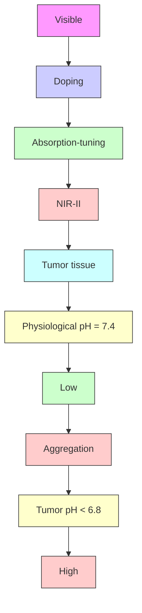

pubs.acs.org/ac

Article

# Ambient Oxygen-Doped Conjugated Polymer for pH-Activatable Aggregation-Enhanced Photoacoustic Imaging in the Second Near-Infrared Window

Jiayingzi Wu,\* Liyan You, Saadia T. Chaudhry, Jiazhi He, Ji-Xin Cheng,\* and Jianguo Mei\*

Cite This: Anal. Chem. 2021, 93, 3189−3195

Read Online

ACCESS

Metrics & More

Article Recommendations

Supporting Information

ABSTRACT: Photoacoustic (PA) probes absorbing in the second near-infrared (NIR-II: 1000−1700 nm) window hold great promise for deep-tissue diagnosis and treatment. Currently, NIR-II PA probes typically involve complex synthesis and surfactant adjuvant for processing and delivery. Furthermore, these NIR-II PA

probes are “always-on,” leading to inadequate signal-to-background ratio and low specificity. To address these challenges, this study reports a pH-activatable and aggregation-enhanced NIR-II PA probe. Without using any toxic or exotic oxidants, the selected polymer (PPE) is readily doped by oxygen in an ambient environment and simultaneously red-shifts its absorption profile from visible to NIR-II region. By virtue of the carboxyl groups on the side chains, oxygen-doped PPE is readily water-soluble at a physiological pH but tends to aggregate in an acidic environment. The pH-induced aggregation results in a significant PA enhancement and thus allows specific PA imaging of acidic tumor microenvironment in vivo. Our study provides a facile and surfactant-free strategy for achieving water-soluble and pH-responsive NIR-II PA probes, which could be applied for diagnoses of cancer and other diseases associated with changes in pH. It paves the way for the development of new activatable NIR-II imaging probes and also could facilitate the investigation of biological and pathological processes in deep tissue.

flowchart

## INTRODUCTION

The recent development of photoacoustic (PA) imaging in the second near-infrared (NIR-II: 1000−1700 nm) window has rapidly attracted extensive interest for both preclinical research and clinical practice.1−6 Compared to the first near-infrared (NIR-I: 750−1000 nm) window, the NIR-II window provides higher imaging quality and deeper imaging depth since the light scattering and tissue absorption are significantly reduced and the maximum permissible exposure laser energy for skin is increased.1 −4 Most of the current NIR-II PA contrast agents are “always-on” probes, which continuously emit signals regardless of their interaction with the target of interest, and they develop contrast signals through accumulation and retention.7 As a result, always-on NIR-II PA probes are restricted by the inherent background signal to contend with. In contrast, activatable probes are designed to amplify or boost imaging signals in response to specific targets or events, so they offer a higher signal-to-background ratio and lower detection limit.7−9 However, despite these advantages, activatable NIR-II PA probes have not been fully developed yet, preventing the widespread application of this valuable tool. 2,10

Among the reported NIR-II PA contrast agents, conjugated polymers have been recognized as one of the most promising candidates for the design of activatable NIR-II probes because of their high absorption coefficient, excellent photostability, and outstanding biocompatibility.2,11 Previously, activatable conjugated polymers in the NIR-I window have been demonstrated for imaging of pH,12 reactive oxygen species, 11 enzyme,13 and other stimuli.8,9 Meanwhile, several always-on NIR-II conjugated polymers have been reported in recent years,14−17 but activatable NIR-II conjugated polymers have been rarely explored.10 Conventionally, activatable PA probes require to have a distinct absorption change in response to stimuli. However, only a limited number of chromophores have such properties, not mentioning the challenges in the synthesis of NIR-II absorbing agents. In addition, most of the reported NIR-II conjugated polymers are neutral polymers attained through donor−acceptor molecular engineering, which usually requires a huge amount of synthetic efforts.2,5 The inherently hydrophobic polymer backbones normally require encapsulation in amphiphilic surfactants to enable their water solubility. Such strategy raises concern that the encapsulated nanoparticles have poor biodistribution, polymer leakage, and surfactant detachment.18 Therefore, an alternative approach that is simple yet effective to prepare water-soluble NIR-II conjugated polymers for activatable PA imaging is highly desired. 19

In addition to molecular engineering, the absorption spectra of conjugated polymers are also known to be modulated by

Received: October 31, 2020

Accepted: January 27, 2021

Published: February 4, 2021

Scheme 1. Illustration of the Absorption-Tuning Process through the Ambient-Oxygen Doping of PPE and the Aggregation-Enhanced PA Imaging of Tumor through pH Activation  

flowchart

their redox states.20 The redox reaction of converting conjugated polymer from a neutral state into a polaron/ bipolaron state is called doping, which is realized upon addition of chemical dopants (oxidizing/reducing agents) or application of an appropriate electrical bias.21 The new generated electronic levels of polaron/bipolarons are located between the conduction and valence bands of neutral conjugated polymers. Thereby, the doped conjugated polymers have narrower band gaps and red-shifted absorption profiles.21 This doping method is typically applied to induce desired structural, spectroscopic, and electrical transport properties for organic electronics.21 In the last decade, due to the unique optical properties of conjugated polymers after the formation of polarons/bipolarons, doped conjugated polymers have also been applied for PA imaging and photothermal therapy in the NIR-I and NIR-II windows. 22 −31 Regardless of numerous bioapplications that have achieved success with doped conjugated polymers (e.g., polypyrrole, 22−26,31 poly(3,4- ethylenedioxythiophene):poly(4-styrenesulfonate) 27 and polyaniline28−30), a few long-standing intrinsic problems need to be appropriately addressed. First, these conjugated polymers usually need to be doped by strong chemical dopants to obtain the NIR-II absorption, yet these dopants are susceptible to dissociation in bioenvironments resulting in dedoping and loss of their signature optical property. 28 Second, the toxicity of chemical dopants are cause for concern and unsuitable for tissue.32,33 Last but not the least, since the reported doped conjugated polymers are either toxic to cells or insoluble in aqueous solution, complicated surface modification is often 22−31

We herein report an aqueous compatible 3,4-ethylenedioxythiophene-alt-3,4-ethylenedioxythiophene copolymer bearing carboxylate side chains (PPE) as an activatable NIR-II PA contrast agent (Scheme 1).34,35 Without adding any surfactant, PPE is readily soluble in water at neutral physiological pH. The freely dissolved PPE with its small size is beneficial for deep-tissue penetration and ideal biodistribution.36 Furthermore, because of the low oxidation potential of PPE, it can be directly doped by oxygen in the ambient environment, redshifting its absorption to the NIR-II region. The high physicochemical stability and negligible cytotoxicity of PPE after doping was validated, and its outstanding PA properties in the NIR-II windows were demonstrated. Notably, the free polymer chains could be activated by pH to aggregate into large particles in an acidic environment, as the carboxylate side chains were converted to carboxylic acids. The aggregation induced significant enhancement in the PA intensity of doped PPE, enabling its application for pH imaging. Finally, its potential for pH-activatable imaging of a tumor, which has an acidic microenvironment (pH 6.5−6.8), was demonstrated in 37,38

## EXPERIMENTAL METHODS

Chemicals and Polymer Synthesis. All reagents purchased from suppliers were used without further purification. PPE was synthesized according to the previous literature.34,35 1 H nuclear magnetic resonance (NMR) spectra were recorded on a mercury 300 at 293 K with deuterated chloroform as the solvent. Details can be found in the Supporting Information.

Characterization. Dynamic light scattering (DLS) was performed using a Malvern Nano-Zetasizer. UV/vis/NIR spectra were recorded with a Cary-5000 spectrometer.

Electrochemistry. A three-electrode cell was fabricated with indium tin oxide (ITO)/glass substrates coated with PPE as the working electrode, a leakless Ag/AgCl as the reference electrode, cell culture medium as the electrolyte, and a platinum wire as the counter electrode. Cyclic voltammetry experiments were performed using a three-electrode cell, at a scan rate of 40 mV $\mathbf { s } ^ { - 1 }$ . The redox potential of PPE was estimated by $E _ { 1 / 2 } = \big ( E _ { \mathrm { c } , \mathrm { p } } + E _ { \mathrm { a } , \mathrm { p } } \big ) / 2 \colon E _ { \mathrm { c } , \mathrm { p } } \overline { { - } }$ peak potential of the cathodic peak: $E _ { \mathrm { a , p } } ^ { } .$ peak potential of the anodic peak.

Photoacoustic Spectroscopy. The OPO Laser (EKSPLA NT320) with pulse width 5 ns, repetition rate 10 Hz, was applied as excitation laser resource, and the laser energy was 40−120 μJ at the focus spot on the sample. Photoacoustic signals were acquired by a single element transducer (v317-sm, 20 MHz). A preamplifier (Olympus 5682, voltage gain 30 dB) and a Pulser/receiver (Olympus 5073 pr, ultrasonic bandwidth 75 MHz, voltage gain 39 dB) were used to improve the system sensitivity. All of the samples were in the solution state and sealed in a 1 mm diameter glass tube. $\mathrm { D } _ { 2 } \mathrm { O }$ was applied as the sound coupling agent.

chemical

Chemical reaction scheme showing phosphorylation of a brominated polycyclic aromatic compound under K2CO3 catalysis and 2M KOH in methanol, with p-type doping (oxidation) as the step.

line chart

| Wavelength (nm) | Undoped (i) | Partially doped, 15 min (ii) | Fully doped, 4 hour (iii) |
| --------------- | ------------ | ---------------------------- | ------------------------- |
| 400             | 0.1          | 0.1                          | 0.1                       |
| 600             | 0.85         | 0.2                          | 0.15                      |
| 800             | 0.3          | 0.3                          | 0.2                       |
| 1000            | 0.2          | 0.4                          | 0.3                       |
| 1200            | 0.1          | 0.3                          | 0.35                      |
| 1700            | 0.05         | 0.2                          | 0.45                      |

line chart

| Magnetic Field (G) | Neutral | Polaron | Bipolaron |
| ------------------ | ------- | ------- | --------- |
| 3000               | 0       | 0       | 0         |
| 3200               | 0       | 0       | 0         |
| 3400               | 0       | 0       | 0         |
| 3600               | 0       | -8.0x10⁵| 0         |
| 3800               | 0       | 0       | 0         |
| 4000               | 0       | 0       | 0         |

line chart

| Potential (V) vs. Ag/AgCl | Current Density (mA cm⁻²) |
| ------------------------- | ------------------------- |
| -0.6                      | -0.1                      |
| -0.4                      | -0.2                      |
| -0.2                      | -0.15                     |
| 0.0                       | 0.2                       |
| 0.2                       | 0.15                      |
| 0.4                       | 0.18                      |

Figure 1. Preparation and characterization of (doped) PPE. (a) Synthetic route of water-soluble PPE. (b) Mechanism of p-type doping of PPE. (c) Absorption spectra of PPE aqueous solutions which are undoped (in neutral form, stabilized by $\mathrm { N } _ { 2 } \mathrm { H } _ { 4 } )$ , partially doped by the dissolved oxygen in the solution for 15 min (mostly in polaron state), and fully doped by the dissolved oxygen in the solution for 4 h (mostly in bipolaron state). The wavelength regions corresponding to neutral, polaron, and bipolaron states are highlighted in vibrant blue, purple, and pale blue, respectively. The inset is the photograph of PPE aqueous solutions at the three states. (d) Detection of radical concentration of PPE in the neutral, polaron, and bipolaron states by electron paramagnetic resonance (EPR) spectroscopy. (e) Cyclic voltammograms of the PPE in basal cell culture medium as biologically relevant electrolytes at a scan rate of 40 mV $\mathbf { s } ^ { - 1 } .$ .

Photoacoustic Tomography. The ultrasound and photoacoustic signals were processed by a high-frequency ultrasound imaging system (Vantage128, Verasonics Inc.). For the penetration study in chicken breast, a Q-switched Nd:YAG laser (Continuum Surelite SL III-10) with 5 ns pulse with a 10 Hz repetition rate was applied as the laser source. A transmission-mode detection modality was adopted. The laser light was guided to the tissue surface by a fiber bundle, and the photoacoustic signals were detected from the other side of the tissue by a low-frequency transducer array (L7-4, PHILIPS/ATL). For the other photoacoustic tomography experiments, the EKSPLA OPO Laser with pulse width 5 ns, repetition rate 10 Hz, was applied as excitation laser. In the meantime, a refection-mode detection was applied using a customized collinear probe, which has a customized highfrequency ultrasound array with 128 elements and 50% bandwidth (L22-14 v, Verasonics Inc.).

Cytotoxicity Test. HEK cells were cultured in Dulbecco’s modified Eagle medium (DMEM) containing 10% fetal bovine serum in a humid environment containing 5% $\mathrm { C O } _ { 2 }$ and 95% air at $3 7 ~ ^ { \circ } \mathrm { C }$ . PC-3 cells were cultured in F-12K containing 10% fetal bovine serum in a humid environment containing 5% $\mathrm { C O } _ { 2 }$ and 95% air at $3 7 ~ ^ { \circ } \mathrm { C } .$ ,Cells were first seeded in 96-wel plates (3000−5000 cells per well), and the culture medium was replaced with a fresh medium containing PPE at different concentrations $\left( 0 { - } 2 0 0 \mu \mathrm { g \ m L ^ { - 1 } } \right)$ and incubated for 24 h. The cell viability was then measured by $_ { 3 - } ( 4 , 5$ -dimethylthiazol-2- yl)-2,5-diphenyltetrazolium bromide (MTT) assay.

Tumor Mouse Model. mice obtained from Charles River Laboratories were inoculated subcutaneously with $3 \times 1 0 ^ { 6 }$ PC-3 cells in the rear left flanks. Mice were used in imaging studies when either PC-3 tumors reached 8−10 mm in diameter. All protocols were approved by the Boston University’s Institutional Animal Care and Use Committee (IACUC) (PROTO201800533).

Ex Vivo PA Tomography Imaging. Typically, 100 μg $\mathrm { m L } ^ { - 1 }$ PPE solutions were sealed in transparent polyurethane tubes (Vention medical Inc., inner diameter of 1.4 mm, wall thickness of 0.1 mm). The tubes were fixed on a holder and emerged in a water tank.

In Vivo PA Tomography Imaging. PC-3 xenografted tumors-bearing mice were anesthetized using 2% isoflurane in oxygen delivered through a nose cone, and their body temperature was maintained by a heat pad during the PA imaging period. Doped PPE $( \mathrm { p \dot { H } = 7 . 4 , 4 \dot { 0 } \mu L , 1 5 0 \dot { \mu } g \ m L ^ { - 1 } } )$ cYmlowb were administrated intratumorally or intramuscularly. Images were recorded right after the injections. All animal experiments were performed in compliance with the Guidelines for the Care and Use of Research Animals established by the Boston University Animal Studies Committee. All protocols were approved by the Boston University’s Institutional Animal Care and Use Committee (IACUC) (PROTO201800533).

## RESULTS AND DISCUSSION

Preparation and Characterization of (Doped) PPE. PPE was prepared according to the reported standard conditions (Figures 1a and S1−S5).34,35 Due to the strong ion−dipole interactions between carboxylates and water, PPE is readily soluble in 0.1 M KOH aqueous solutions without the addition of any stabilizer or surfactant.34 Also, PPE is known to switch between its neutral form and doped oxidized forms (Figure 1b).34 The undoped fresh PPE displayed a vibrant blue color in the neutral state (∼600 nm) (Figure 1c). The basic solution was tuned to the physiological pH by titration with HCl until the pH value was ${ \sim } 7 . 4 .$ Immediately, PPE turned into purple with its absorption profile red-shifted to the NIR-II region (∼1000 nm), indicating that PPE was spontaneously doped (oxidized) to the polaron state by oxygen in a physiological pH environment (Figure 1c; the absorption spectrum was recorded at 15 min).34 For a longer exposure time (4 h) in the ambient environment, PPE was further turned to bipolaron state with a pale blue color and its absorption profile was further red-shifted beyond 1500 nm and became noticeably flat in the entire NIR-II region (Figure 1c). While additional oxidizing agents such as $\mathrm { F e C l } _ { 3 }$ or Fe (OTs) were previously employed in the doping of conjugated polymers,32,33 here we demonstrated that PPE can be directly doped by ambient oxygen in a physiological pH environment. This doping method circumvents the cytotoxicity problems caused by the chemical dopants.

Next, electron paramagnetic resonance (EPR) spectroscopy was applied to determine if the bipolaron samples contained any residual radical species from the polaron state. The EPR results of PPE (Figure 1d) in the neutralized, polaron, and bipolaron states aligned well with the UV−vis−NIR absorption analysis, shown in Figure 1c, confirming the distinct paramagnetic nature of the polaron state and the diamagnetic nature of the bipolaron and neutral states. A sharp, symmetric signal at $g = 2 . 0 0 3 1$ was observed for the PPE radical. A radical signal was not detected in the bipolaron state and eliminated the possibility of any residual radical leftover in bipolaron samples. This result proves that the doping procedure allowed full conversion of the PPE polarons to bipolarons. Furthermore, a small distorted signal at ∼3700 G was detected for all of the samples, presumably due to the aqueous environment, radical impurities, sample tube material, or slight misalignment between the positioning of the sample and the field. This is a background signal and can be ignored for the purposes of this discussion.

To further understand the doping mechanism of PPE, the electrochemical properties of PPE were investigated by cyclic voltammetry (Figure 1e). The redox potential $\stackrel { \smile } { ( } E _ { 1 / 2 } = \stackrel { \bullet } { ( } E _ { \mathrm { c , p } } ^ { \prime } +$ $E _ { \mathrm { a , p } } ) / 2 ; E _ { \mathrm { c , p } } \mathrm { : }$ peak potential of the cathodic peak, $E _ { \mathrm { a , p } } \mathrm { : }$ peak potential of the anodic peak) of PPE was calculated to be −0.25 V vs Ag/AgCl. Such a negative value of the redox potential indicates the high tendency of PPE to lose electrons.39 Meanwhile, the neutral physiological pH, which is relatively more acidic than the original pH of KOH solution, also contributed to a reduced oxidation potential because cation radicals are more stable in acidic conditions.40,41 Consequently, a low concentration of the dissolved oxygen in the solution is able to dope PPE into polaron/bipolaron 42 states.

Biocompatibility and PA Properties of PPE After Oxygen Doping. To test the doping stability of PPE in physiological environments, we monitored the absorption spectra of PPE in phosphate buffered saline (PBS) $\left( \mathrm { p H } = 7 . 4 \right)$ and in minimum essential medium (MEM) cell culture medium (pH = 7.4, containing 10% fetal bovine serum) over 18 days. Figure 2a shows that the absorption of PPE remained unchanged over time in PBS $\mathrm { ( p H = 7 . 4 ) }$ ). When the PPE was dissolved in MEM cell culture medium, it was less doped than that in PBS $\left( \mathrm { p H } = 7 . 4 \right)$ , probably because of the existence of antioxidants $( \mathrm { e . g . } ,$ serum, glucose, amino acids) in the culture medium (Figure S6a).43 The partially doped PPE with a broad absorption peak at around 1000 nm also remained stable for more than 18 days in the cell culture medium (Figure S6a). The excellent solubility and stability of PPE after doping in PBS $\left( \mathrm { p H } = 7 . 4 \right)$ and in the cell culture medium indicates the feasibility of using doped PPE for in vivo imaging in the NIR-II window. Additionally, a cytotoxicity test was performed with an MTT assay to confirm the biocompatibility of doped PPE (Figure 2b). No noticeable toxicity was found up to 200 μg mL−1 after 24 h incubation, showing the promise of the doped PPE for biological applications.

line chart

| Wavelength (nm) | 1 day | 2 day | 4 day | 6 day | 8 day | 11 day | 14 day | 18 day |
| --------------- | ----- | ----- | ----- | ----- | ----- | ------ | ------ | ------ |
| 400             | 0.2   | 0.2   | 0.2   | 0.2   | 0.2   | 0.2    | 0.2    | 0.2    |
| 700             | 0.6   | 0.6   | 0.6   | 0.6   | 0.6   | 0.6    | 0.6    | 0.6    |
| 1000            | 0.9   | 0.9   | 0.9   | 0.9   | 0.9   | 0.9    | 0.9    | 0.9    |
| 1300            | 1.2   | 1.2   | 1.2   | 1.2   | 1.2   | 1.2    | 1.2    | 1.2    |
| 1700            | 1.5   | 1.5   | 1.5   | 1.5   | 1.5   | 1.5    | 1.5    | 1.5    |

bar chart

| Concentration (μg mL⁻¹) | PC-3 | HEK |
| ------------------------ | ---- | --- |
| 0                        | 100  | 100 |
| 20                       | 90   | 85  |
| 50                       | 95   | 90  |
| 100                      | 105  | 85  |
| 150                      | 100  | 90  |
| 200                      | 90   | 90  |

scatterplot

| Wavelength (nm) | Norm. PA Intensity |
| --------------- | ------------------ |
| 900             | 0.6                |
| 1000            | 0.7                |
| 1100            | 0.8                |
| 1200            | 0.9                |
| 1300            | 1.0                |
| 1400            | 0.9                |
| 1500            | 0.8                |
| 1600            | 0.7                |
| 1700            | 0.6                |

scatterplot

| Pulse Number | PA Intensity (a.u.) |
| ------------ | ------------------- |
| 0            | 0.30                |
| 1000         | 0.35                |
| 2000         | 0.38                |
| 3000         | 0.40                |

line chart

| Concentration (μg mL⁻¹) | PA Intensity (a.u.) |
| ------------------------ | ------------------- |
| 0                        | 0                   |
| 50                       | 10                  |
| 100                      | 20                  |
| 200                      | 35                  |

text_image

Pulse Number
Surface
4.4 cm
PPE in a tube
Max
Min

Figure 2. Biocompatibility and PA properties of PPE after oxygen doping. (a) Absorption spectra of doped PPE in PBS $\mathrm { ( p H = 7 . 4 ) }$ over time. (b) Cell viability of PC-3 and HEK cells after 24 h incubation with varied concentrations of doped PPE. The percentage cell viability of treated cells was calculated relative to that of cells treated with the same volume of PBS $\left( \mathrm { p H } = 7 . 4 \right)$ . (c) PA spectra of doped PPE in PBS $\mathrm { ( p H = 7 . 4 ) }$ . PA intensity was normalized by laser energy at each wavelength. (d) PA intensity of doped PPE vs number of pulses under 1100 nm laser irradiation. The total exposure time was about 5 min for 3000 pulses. The laser light energy at the focus point was ∼45 μJ. (e) PA intensity of doped PPE at 1100 nm as a function of mass concentration in PBS $\mathrm { ( \bar { p } \bar { H } = 7 . 4 ) }$ . $R ^ { 2 } > 0 . 9 9 .$ . Error bars represent standard deviations. (f) PA image of the 0.5 mg mL−1 doped PPE contained in a polyurethane tube at 4.4 cm depth. Laser energy density was tuned to 45 mJ cm−2 at 1064 nm.

After the aqueous stability and biocompatibility of PPE were confirmed, its potential for PA imaging was evaluated. Figures 2c and S6b show that the doped PPE efficiently generates PA signals in the entire NIR-II region in PBS $\left( \mathrm { p H } = 7 . 4 \right)$ and in the cell culture medium, respectively. No obvious PA intensity loss was observed after exposure to 3000 laser pulses (corresponding to more than 5 min) at 1100 nm, suggesting the good photostability of doped PPE (Figure 2d). A linear relationship between the concentration and PA signal at 1100 nm was observed (Figures 2e and S6c). Under the same experimental condition, the detection sensitivity, defined as 1:1 signal-to-background ratio, was estimated to be $4 . 8 \ \mu \mathrm { g \ m L ^ { - 1 } }$ in PBS $\mathrm { ( p H = 7 . 4 ) }$ .

Previously, we have demonstrated that NIR-II conjugated polymer nanoparticles have the advantage of deeper imaging depth over conventional NIR-I PA contrast agents. 14,1 Therefore, it is worth testing if the water-soluble PPE as a molecular contrast agent is also capable for deep-tissue imaging as it generates a strong PA signal in the NIR-II window. PA imaging of doped PPE was conducted with a chicken breast tissue phantom in a similar manner as our earlier $\mathrm { s t u d y . } ^ { 1 4 } \mathrm { ~ A ~ }$ polyurethane tube containing an aqueous solution of doped PPE was embedded in layers of chicken breast tissue with the same thickness below and above the tube, and a laser light at 1064 nm was illuminated from the top surface of the tissue while the PA signal was detected from the bottom surface of the tissue. The laser fluence was ∼45 mJ $\mathrm { c m } ^ { - 2 }$ and 100 images were acquired and averaged at the same position. An imaging depth of 4.4 cm was obtained with the concentration of 0.5 mg $\mathrm { \ m { \bar { L } } ^ { - 1 } }$ (Figure 2f), which is comparable to the imaging depth $( \sim 5$ cm) that was achieved with NIR-II conjugated polymer nanoparticles.14,16 We also recorded PA images at different depths, and the derived signal-to-noise ratio (SNR) from the images was plotted as a function of depth and fitted into an exponential function (Figure S7). The PA imaging depth limit with 0.5 mg mL−1 doped PPE was determined to be 4.9 cm at 1064 nm, which is 8.7 times higher than the calculated optical penetration depth (0.56 cm) in the current experimental conditions.44 These results demonstrate that doped PPE as a water-soluble polymer is of great potential for deep-tissue imaging in the NIR-II window.

pH-Activatable Aggregation-Enhanced PA Imaging In Vitro and In Vivo. Besides its outstanding performance in deep-tissue PA imaging, PPE also has advantages in its functionality for activatable imaging. By introducing carboxylate ions to the side chains, PPE was readily soluble in water under neutral or basic conditions. As the solution became more acidic, carboxylates convert into carboxylic acids, and the resulted greater hydrophobicity of the polymer in the aqueous solution leads to the aggregation (Figure 3a). The diameter of doped PPE in those basic solutions was not detectable with dynamic light scattering (DLS), but it increased dramatically when the pH was lower than 7.0 (Figure 3b). On the other hand, the absorption spectra of doped PPE did not change in this physiological pH range (Figure 3c), indicating it reached a stable doping state and the aggregation had negligible influence on the optical absorption profiles as the chemical structure was not altered. Then, the PA intensities of 100 $\mu { \mathfrak { g } }$ mL−1 doped PPE in the solutions with different pH were collected at 1064 nm and plotted (Figure $^ { 3 \mathrm { d } , \mathbf { e } ) }$ . With such a low concentration of the doped PPE, negligible PA signal was found at $\mathrm { p H } = 7 . 4$ and 7.0, but the signal was dramatically amplified at $\mathrm { p H } = 6 . 5$ and continued to increase as the pH value declined. Particularly, the PA brightness of doped PPE at $\mathrm { p H } = 6 . 5$ and 5.5 were 3.1- and 5.0-fold of that at $\mathrm { p H } = 7 . 4 ,$ , respectively. Since we have ruled out the contribution of the absorption change to the enhanced PA effect, such observation is likely attributed to the size growth (Figure 3f). Indeed, the localized heat flux increases with the growth of particle size and the PA pressure is theoretically proportional to the heat transfer rate.45

a  

chemical

Chemical reaction diagram showing nucleophilic substitution of -COO⁻ K⁺ with proton transfer to form -COOH

b  

scatterplot

| pH | Intensity-Averaged Size (nm) |
|---|---|
| 5.5 | 6500 |
| 6.0 | 3800 |
| 6.5 | 600 |
| 7.0 | 400 |
| 7.5 | 100 |

C  

line chart

| Wavelength (nm) | pH 7.4 | pH 7.0 | pH 6.5 | pH 6.0 | pH 5.5 |
| --------------- | ------ | ------ | ------ | ------ | ------ |
| 450             | 0.1    | 0.1    | 0.1    | 0.1    | 0.1    |
| 650             | 0.2    | 0.2    | 0.2    | 0.2    | 0.2    |
| 850             | 0.3    | 0.3    | 0.3    | 0.3    | 0.3    |
| 1050            | 0.4    | 0.4    | 0.4    | 0.4    | 0.4    |
| 1250            | 0.4    | 0.4    | 0.4    | 0.4    | 0.4    |

d  

heatmap

| Value | Color Intensity |
|-------|-----------------|
| 7.4   | Max             |
| 7.0   | Max             |
| 6.5   | Max             |
| 6.0   | Max             |
| 5.5   | Max             |

e  

scatterplot

| pH   | PA Intensity (a.u.) |
|------|---------------------|
| 5.5  | 5.0                 |
| 6.0  | 4.0                 |
| 6.5  | 3.0                 |
| 7.0  | 1.0                 |
| 7.5  | 1.0                 |

scatterplot

| Intensity-Averaged Size (nm) | PA Intensity (a.u.) |
| ---------------------------- | ------------------- |
| 0                            | 1.0                 |
| 1000                         | 3.0                 |
| 4000                         | 4.0                 |
| 6000                         | 5.0                 |

g  

text_image

Muscle
Tumor
PA US
Max
Min

h  

bar chart

| Category | PA Intensity (a.u.) |
| -------- | ------------------- |
| Muscle   | 0.8                 |
| Tumor    | 2.8                 |

Figure 3. pH-activatable aggregation-enhanced PA imaging in vitro and in vivo. (a) Mechanism of the acid-induced aggregation of PPE. (b) Intensity-averaged size of doped PPE at different pH. (c) Absorption spectra of doped PPE at different pH. (d) PA images of 100 $\boldsymbol { \dot { \mu } } \mathbf { g } \ \mathbf { m } \mathbf { L } ^ { - 1 }$ doped PPE at different pH. (e) Corresponding PA intensity from (d). (f) PA intensity as a function of intensity-averaged size of doped PPE. (g) PA images in muscle and tumor after local administrations of doped PPE $\mathrm { ( p H = 7 . 4 , ~ 4 0 ~ } \mu \mathrm { L }$ , 150 μg mL−1 ). (h) Corresponding PA intensity from (g). Asterisk represents statistically significant difference in PA intensity between muscle and tumor; $^ { \ast } p <$ 0.1 $\left( n = 3 \right)$ . Error bars represent the standard error of the mean.

Similar size-growth-induced PA enhancements were observed with gold nanoparticles and polymer nanoparticles.36,46,47 Thus, other than a chemical approach-induced absorption variation, PPE was activated through a supramolecular approach-induced morphology change. Our design has advantages in its simplicity and generality.

Due to the glycolysis under hypoxic conditions, the tumor microenvironment has been known as characteristically acidic.48 Therefore, the pH-activatable doped PPE is promising for specific tumor imaging in vivo. As a proof-ofconcept, in vivo PA imaging after local administration of doped PPE (pH = 7.4, 40 μL, 150 μg mL−1 ) in muscle or tumor was carried out. Figure 3g shows that PPE was obviously brighter in the tumor than that in the muscle, and the enhancement was quantified as high as 3.4-fold (Figure 3h). These results highlight the potential of doped PPE for sensitive tumor imaging in vivo. Moreover, the small-sized polymers at normal tissue pH are capable of penetrating into deep tissue, while the large-sized aggregates at tumor acidic pH could prolong the 36 tumor retention.

## CONCLUSIONS

In summary, we have reported an activatable and water-soluble NIR-II contrast agent through facile preparation. Taking advantage of its low oxidation potential, PPE can be directly doped by oxygen in the environment and its absorption simultaneously shifts from the visible to the NIR-II region (1000−1700 nm). The doped PPE shows high stability in both PBS (pH = 7.4) and cell culture medium over time. The utility of ambient-doped PPE for PA imaging is demonstrated. Furthermore, the protonation of PPE is capitalized to a develop pH-activatable PA probe that tends to aggregate at an acidic pH and results in the enhanced PA brightness. Therefore, the pH-activatable PPE holds promise for PA imaging of tumor acidic microenvironment in vivo and as well as other diseases associated with changes in pH, such as inflammation, cardiac ischemia, and Alzheimer’s disease. 12 This approach could be further developed for activatable photothermal therapy since, theoretically, a PA probe also acts as an efficient optothermal convertor.49,50

## ASSOCIATED CONTENT

## \*sı Supporting Information

The Supporting Information is available free of charge at https://pubs.acs.org/doi/10.1021/acs.analchem.0c04601.

Synthetic routes for compound 6 (PPE) (Figure S1); 1 H NMR of compound 3 (ProDOT) (Figure S2); 1 H NMR of compound 5 (EDOT) (Figure S3); 1 H NMR of compound 6 (PPE) (Figure S4); HPLC of compound 6 (PPE) (Figure S5); stability and optical properties of doped PPE in MEM cell culture medium (Figure S6); SNR of 0.5 mg mL−1 doped PPE (Figure S7); chemical synthesis routes (PDF)

## AUTHOR INEORMATION

## Corresponding Authors

Jiayingzi Wu − Department of Chemistry, Purdue University, West Lafayette, Indiana 47907, United States; orcid.org 0000-0002-7635-0950; Email: wu945@purdue.edu  
Ji-Xin Cheng − Department of Electrical and Computer Engineering, Department of Physics, Department of Biomedical Engineering, and Department of Chemistry,

Boston University, Boston, Massachusetts 02215, United States; orcid.org/0000-0002-5607-6683; Email: jxcheng@bu.edu

Jianguo Mei − Department of Chemistry, Purdue University, West Lafayette, Indiana 47907, United States; orcid.org 0000-0002-5743-2715; Email: jgmei@purdue.edu

## Authors

Liyan You − Department of Chemistry, Purdue University, West Lafayette, Indiana 47907, United States

Saadia T. Chaudhry − Department of Chemistry, Purdue University, West Lafayette, Indiana 47907, United States

Jiazhi He − Department of Chemistry, Purdue University, West Lafayette, Indiana 47907, United States

Complete contact information is available at: https://pubs.acs.org/10.1021/acs.analchem.0c04601

## Author Contributions

J.W., J.-X.C., and J.M. conceived the project. J.W. designed the experiments. J.W. conducted most of the experiments. L.Y. synthesized the polymer. S.T.C. conducted the EPR measurements. J.H. conducted the EPR measurements. J.W. wrote the original manuscript. J.W., S.T.C., J.-X.C., and J.M. revised the manuscript. All authors approved the final version.

## Notes

The authors declare no competing financial interest.

## ACKNOWLEDGMENTS

This work is supported by Keck Foundation grant to J.-X.C., the Showalter Trust Research Award, and Startup grant by Purdue University to J.M. The authors also thank Dr. Hyeon Jeong Lee for her help in animal experiments and Yulin Fan for his help in sample preparation.

## REFERENCES

(1) Hong, G.; Antaris, A. L.; Dai, H. Nat. Biomed. Eng. 2017, 1, No. 0010. (2) Miao, Q.; Pu, K. Adv. Mater. 2018, 30, No. 1801778.  
(3) Smith, A. M.; Mancini, M. C.; Nie, S. Nat. Nanotechnol. 2009, 4, 710−711.  
(4) Jiang, Y.; Li, J.; Zhen, X.; Xie, C.; Pu, K. Adv. Mater. 2018, 30, No. 1705980.  
(5) He, S.; Song, J.; Qu, J.; Cheng, Z. Chem. Soc. Rev. 2018, 47, 4258−4278.  
(6) Hong, G.; Diao, S.; Chang, J.; Antaris, A. L.; Chen, C.; Zhang, B.; Zhao, S.; Atochin, D. N.; Huang, P. L.; Andreasson, K. I.; et al. Nat. Photonics 2014, 8, 723.  
(7) Kobayashi, H.; Choyke, P. L. Acc. Chem. Res. 2011, 44, 83−90.  
(8) Miao, Q.; Pu, K. Bioconjugate Chem. 2016, 27, 2808−2823.  
(9) Lyu, Y.; Pu, K. Adv. Sci. 2017, 4, No. 1600481.  
(10) Wang, Z.; Zhen, X.; Upputuri, P. K.; Jiang, Y.; Lau, J.; Pramanik, M.; Pu, K.; Xing, B. ACS Nano 2019, 13, 5816−5825.  
(11) Pu, K.; Shuhendler, A. J.; Jokerst, J. V.; Mei, J.; Gambhir, S. S.; Bao, Z.; Rao, J. Nat. Nanotechnol. 2014, 9, 233.  
(12) Miao, Q.; Lyu, Y.; Ding, D.; Pu, K. Adv. Mater. 2016, 28, 3662−3668.  
(13) Li, J.; Xie, C.; Huang, J.; Jiang, Y.; Miao, Q.; Pu, K. Angew. Chem., Int. Ed. 2018, 57, 3995−3998.  
(14) Wu, J.; You, L.; Lan, L.; Lee, H. J.; Chaudhry, S. T.; Li, R.; Cheng, J. X.; Mei, J. Adv. Mater. 2017, 29, No. 1703403.  
(15) Wu, J.; Lee, H. J.; You, L.; Luo, X.; Hasegawa, T.; Huang, K. C.; Lin, P.; Ratliff, T.; Ashizawa, M.; Mei, J. Small 2020, 16, No. 2001215.  
(16) Jiang, Y.; Upputuri, P. K.; Xie, C.; Lyu, Y.; Zhang, L.; Xiong, Q.; Pramanik, M.; Pu, K. Nano Lett. 2017, 17, 4964−4969.  
(17) Guo, B.; Sheng, Z.; Kenry, K.; Hu, D.; Lin, X.; Xu, S.; Liu, C.; Zheng, H.; Liu, B. Mater. Horiz. 2017, 4, 1151−1156.  
(18) Xie, C.; Zhen, X.; Lei, Q.; Ni, R.; Pu, K. Adv. Funct. Mater. 2017, 27, No. 1605397.  
(19) Xie, C.; Lyu, Y.; Zhen, X.; Miao, Q.; Pu, K. ACS Appl. Bio Mater. 2018, 1, 1147−1153.  
(20) Beaujuge, P. M.; Reynolds, J. R. Chem. Rev. 2010, 110, 268− 320.  
(21) Bredas, J. L.; Street, G. B. Acc. Chem. Res. 1985, 18, 309−315.  
(22) Zha, Z.; Deng, Z.; Li, Y.; Li, C.; Wang, J.; Wang, S.; Qu, E.; Dai, Z. Nanoscale 2013, 5, 4462−4467.  
(23) Zha, Z.; Yue, X.; Ren, Q.; Dai, Z. Adv. Mater. 2013, 25, 777− 782.  
(24) Chen, M.; Fang, X.; Tang, S.; Zheng, N. Chem. Commun. 2012, 48, 8934−8936.  
(25) Li, W.; Wang, X.; Wang, J.; Guo, Y.; Lu, S. Y.; Li, C. M.; Kang, Y.; Wang, Z. G.; Ran, H. T.; Cao, Y.; Liu, H. Biomacromolecules 2019, 20, 401−411.  
(26) Yang, K.; Xu, H.; Cheng, L.; Sun, C.; Wang, J.; Liu, Z. Adv. Mater. 2012, 24, 5586−5592.  
(27) Cheng, L.; Yang, K.; Chen, Q.; Liu, Z. ACS Nano 2012, 6, 5605−5613.  
(28) Li, J.; Yoon, S. J.; Hsieh, B. Y.; Tai, W.; O’Donnell, M.; Gao, X. Nano Lett. 2015, 15, 8217−8222.  
(29) Zhou, J.; Lu, Z.; Zhu, X.; Wang, X.; Liao, Y.; Ma, Z.; Li, F. Biomaterials 2013, 34, 9584−9592.  
(30) Yang, J.; Choi, J.; Bang, D.; Kim, E.; Lim, E. K.; Park, H.; Suh, J. S.; Lee, K.; Yoo, K. H.; Kim, E. K.; Huh, Y. M.; Haam, S. Angew. Chem., Int. Ed. 2011, 50, 441−444.  
(31) Wang, X.; Ma, Y.; Sheng, X.; Wang, Y.; Xu, H. Nano Lett. 2018, 18, 2217−2225.  
(32) Cai, T.; Zhou, Y.; Wang, E.; Hellström, S.; Zhang, F.; Xu, S.; Inganas, O.; Andersson, M. R.̈ Sol. Energy Mater. Sol. Cells 2010, 94, 1275−1281.  
(33) Morris, J. D.; Wong, K. M.; Penaherrera, C. D.; Payne, C. K. Biomater. Sci. 2016, 4, 331−337.  
(34) Ponder, J. F., Jr.; Ö sterholm, A. M.; Reynolds, J. R. Chem. Mater. 2017, 29, 4385−4392.  
(35) Ponder, J. F., Jr.; Ö sterholm, A. M.; Reynolds, J. R. Macromolecules 2016, 49, 2106−2111.  
(36) Xie, C.; Zhen, X.; Lyu, Y.; Pu, K. Adv. Mater. 2017, 29, No. 1703693.  
(37) Webb, B. A.; Chimenti, M.; Jacobson, M. P.; Barber, D. L. Nat. Rev. Cancer 2011, 11, 671−677.  
(38) Wang, Y.; Zhou, K.; Huang, G.; Hensley, C.; Huang, X.; Ma, X.; Zhao, T.; Sumer, B. D.; DeBerardinis, R. J.; Gao, J. Nat. Mater. 2014, 13, 204−212.  
(39) Zanello, P.; Nervi, C.; De Biani, F. F. Inorganic Electrochemistry: Theory, Practice and Application; Royal Society of Chemistry, 2011.  
(40) Mochizuki, Y.; Horii, T.; Okuzaki, H. Trans. Mater. Res. Soc. Jpn. 2012, 37, 307−310.  
(41) Jin, S.; Xue, G. Macromolecules 1997, 30, 5753−5757.  
(42) Abdou, M. S.; Orfino, F. P.; Son, Y.; Holdcroft, S. J. Am. Chem. Soc. 1997, 119, 4518−4524.  
(43) Lewinska, A.; Wnuk, M.; Slota, E.; Bartosz, G. Clin. Exp. Pharmacol. Physiol. 2007, 34, 781−786.  
(44) Ku, G.; Zhou, M.; Song, S.; Huang, Q.; Hazle, J.; Li, C. ACS Nano 2012, 6, 7489−7496.  
(45) Wang, L. V. IEEE J. Sel. Top. Quantum Electron. 2008, 14, 171− 179.  
(46) Bayer, C. L.; Nam, S. Y.; Chen, Y. S.; Emelianov, S. Y. J. Biomed. Opt. 2013, 18, No. 016001.  
(47) Lu, H. D.; Wilson, B. K.; Heinmiller, A.; Faenza, B.; Hejazi, S.; Prud’homme, R. K. ACS Appl. Mater. Interfaces 2016, 8, 14379− 14388.  
(48) Gatenby, R. A.; Gillies, R. J. Nat. Rev. Cancer 2004, 4, 891−899.  
(49) Li, J.; Cui, D.; Jiang, Y.; Huang, J.; Cheng, P.; Pu, K. Adv. Mater. 2019, 31, No. 1905091.  
(50) Li, J.; Pu, K. Acc. Chem. Res. 2020, 53, 752−762.