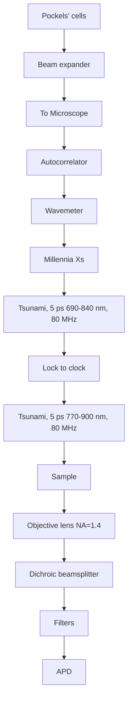

## LETTERS

# An Epi-Detected Coherent Anti-Stokes Raman Scattering (E-CARS) Microscope with High Spectral Resolution and High Sensitivity

Ji-xin Cheng, Andreas Volkmer, Lewis D. Book, and X. Sunney Xie\*

Har ard Uni ersity, Department of Chemistry and Chemical Biology, 12 Oxford Street, V VCambridge, Massachusetts 02138

Recei ed: October 13, 2000; In Final Form: December 7, 2000

We report an epi-detected coherent anti-Stokes Raman scattering (E-CARS) microscope that uses two synchronized picosecond pulse trains. The microscope not only provides high spectral resolution but also significantly improves sensitivity for three-dimensional vibrational imaging of living cells.

Coherent anti-Stokes Raman scattering (CARS) microscopy provides a unique approach to imaging chemical and biological samples by using molecular vibrations as a contrast mechanism.1,2 CARS is a four-wave mixing process involving a pump beam and a Stokes beam, with center frequencies at $\omega _ { \mathrm { p } }$ and $\omega _ { \mathrm { s } } ,$ respectively. When $\omega _ { \mathrm { p } } - \omega _ { \mathrm { s } }$ is tuned to be resonant with a given vibrational mode, an enhanced CARS signal is observed at the anti-Stokes frequency of $2 \omega _ { \mathrm { p } } \ \mathrm { ~ - ~ } \ \omega _ { \mathrm { s } }$ (Figure $1 \mathrm { A } ) .$ 3 Unlike -spontaneous Raman scattering, CARS is highly sensitive and can be detected in the presence of background fluorescence induced by one-photon excitation. The first attempt at CARS microscopy was reported in 1982 by Duncan et al., who relied on noncollinear pump and Stokes beams from visible pulsed lasers and a two-dimensional detector to record the anti-Stokes beam in the phase matching direction.1 In 1999, a significant advance was made by Zumbusch et al. by using tightly focused collinearly propagating pump and Stokes beams.2 The large cone angles of wave vectors at the focus relaxed the phase matching condition, and the anti-Stokes signal was collected and detected in the forward direction with high spatial resolution. Because of its nonlinear intensity dependence, the CARS signal is only generated at the focus, allowing three-dimensional sectioning of thick samples. This is similar and complementary to twophoton fluorescence imaging4 but requires no fluorophores.

Another major improvement in the 1999 work resulted from the use of near-infrared pump (800 nm) and Stokes pulses (1.2 µm) from solid-state lasers.2 Whereas it is desirable to use nearinfrared pulses to reduce scattering and photodamage to the sample, it is less obvious that near-infrared pulses significantly increase the signal-to-background ratio. It is important to realize that CARS detection is not background free and that sensitivity is background limited. There is a nonresonant background signal that arises from electronic contributions to the third-order susceptibility (Figure 1B), which has an essentially flat frequency response. The electronic contribution, while always present, is significantly enhanced when there is a two-photon resonance of the pump beam associated with the excited electronic state (Figure 1C). The use of the near-infrared instead of visible pulses avoided the two-photon resonance and led to a significant improvement in sensitivity.2 To further improve the sensitivity, we need to further reject the nonresonant background.

In the experiment done by Zumbusch et al., both pump and Stokes beams were femtosecond pulse trains.2 The spectral resolution was about $6 0 \mathrm { c m } ^ { - 1 }$ . Such a spectral resolution is too low to distinguish different Raman bands in the fingerprint region. Picosecond excitation has been extensively used for CARS spectroscopy5 and was employed in Duncan et al.’s CARS microscopy work.1 However, it is not clear whether the high spectral resolution of the picosecond source comes at the expense of the sensitivity. The conventional wisdom is that the higher peak power of femtosecond pulses would result in higher sensitivity. We shall demonstrate that this is not true for CARS microscopy.

text_image

Electronically excited state
Resonant CARS
(A)
Non-resonant contribution
(B)
Two-photon enhanced non-resonant contribution
(C)

Figure 1. Different contributions to CARS signal. (A) Resonant CARS. (B) Nonresonant CARS due to electronic contribution, where the dotted lines indicate virtual states. (C) The dominant electronic contribution, which can be enhanced by a two-photon resonance of the pump beam associated with the excited electronic state. Adapted from a similar figure in ref 12.

In the frequency domain, CARS is related to the induced third-order polarization,6

$$
\begin{array}{l} P ^ {(3)} \left(\omega_ {\mathrm{as}}\right) = \int_ {- \infty} ^ {+ \infty} \mathrm{d} \omega_ {\mathrm{p}} \int_ {- \infty} ^ {+ \infty} \mathrm{d} \omega_ {\mathrm{s}} \int_ {- \infty} ^ {+ \infty} \mathrm{d} \omega_ {\mathrm{p}} ^ {\prime} \chi^ {(3)} \left(- \omega_ {\mathrm{as}}, \omega_ {\mathrm{p}} \omega_ {\mathrm{s}} \omega_ {\mathrm{p}} ^ {\prime}\right) \\ E _ {\mathrm{p}} \left(\omega_ {\mathrm{p}}\right) E _ {\mathrm{s}} \left(\omega_ {\mathrm{s}}\right) E _ {\mathrm{p}} \left(\omega_ {\mathrm{p}} ^ {\prime}\right) \delta \left(\omega_ {\mathrm{p}} - \omega_ {\mathrm{s}} + \omega_ {\mathrm{p}} ^ {\prime} - \omega_ {\mathrm{as}}\right) \tag {1} \\ \end{array}
$$

where $E _ { \mathrm { p } } ( \omega _ { \mathrm { P } } )$ and $E _ { \mathrm { s } } ( \omega _ { \mathrm { s } } )$ denote the pump and Stokes fields and $E _ { \mathrm { p } } ( \dot { \omega _ { \mathrm { p } } } ^ { \prime } )$ denotes the second interaction with the pump field in the CARS process. The delta function ensures that the integration satisfies the condition $\omega _ { \mathrm { a s } } = \omega _ { \mathrm { p } } - \omega _ { \mathrm { s } } + \omega _ { \mathrm { p } } ^ { \prime } .$ . We ) - +assume the pump and Stokes fields comprise two temporarily overlapped pulses with Gaussian spectral profiles,

$$
E _ {\mathrm{p}} \left(\omega_ {\mathrm{p}}\right) = \frac {E _ {\mathrm{p}}}{\Delta_ {\mathrm{p}} ^ {1 / 2}} \exp \left[ \frac {- 2 \left(\omega - \omega_ {\mathrm{p}}\right) ^ {2} \ln 2}{\Delta_ {\mathrm{p}} ^ {2}} \right]
$$

$$
E _ {\mathrm{s}} \left(\omega_ {\mathrm{s}}\right) = \frac {E _ {\mathrm{s}}}{\Delta_ {\mathrm{s}} ^ {1 / 2}} \exp \left[ \frac {- 2 \left(\omega - \omega_ {\mathrm{s}}\right) ^ {2} \ln 2}{\Delta_ {\mathrm{s}} ^ {2}} \right] \tag {2}
$$

where $\Delta _ { \mathrm { p } }$ and $\Delta _ { \mathrm { s } }$ are spectral full widths at half-maximum (fwhm) of the pump and the Stokes fields, respectively. $E _ { \mathrm { p } }$ and $E _ { \mathrm { s } }$ are constants related to the peak intensities. The prefactors in eq 2 ensure that the pulse energies remain constant when changing the spectral width. $\chi ^ { ( 3 ) } ( - \omega _ { \mathrm { a s } } , \omega _ { \mathrm { p } } \omega _ { \mathrm { s } } \omega _ { \mathrm { p } } ^ { \prime } )$ is the third-order -CARS susceptibility that contains a resonant component and a $\chi ^ { ( 3 ) } = \chi _ { \mathrm { r } } ^ { ( 3 ) } + \chi _ { \mathrm { n r } } ^ { ( 3 ) }$ )is assumed for the resonant part,

$$
\chi_ {\mathrm{r}} ^ {(3)} = \frac {A}{\Omega - (\omega_ {\mathrm{p}} - \omega_ {\mathrm{s}}) - \mathrm{i} \Gamma} \tag {3}
$$

where Ω is the vibrational frequency, 2Γ is the line width, and A is a constant related to the mode density and the Raman cross-$\chi _ { \mathrm { n r } } ^ { ( 3 ) } .$ beam frequencies. The CARS intensity can be calculated as

$$
I _ {\mathrm{CARS}} = \int_ {- \infty} ^ {+ \infty} | P ^ {(3)} (\omega_ {\mathrm{as}}) | ^ {2} \mathrm{d} \omega_ {\mathrm{as}} \tag {4}
$$

In our numerical simulation, we assume that both the pump and the Stokes beams are transform-limited pulses with the same spectral width $( \Delta _ { \mathrm { p } } = \Delta _ { \mathrm { s } } )$ , which is related to the temporal )intensity fwhm, ∆τ, by $\Delta \tau \cdot \Delta _ { \mathrm { p } } = 0 . 4 4$ . The center frequencies ‚ )of the pump and the Stokes beams are chosen as 13 330 and $1 1 7 3 1 \mathrm { { \bar { c m } } ^ { - 1 } }$ , respectively, yielding a Raman shift of $1 6 0 1 ~ \mathrm { c m } ^ { - 1 }$ . The ratio of the peak intensities of the pump and Stokes beams $( E _ { \mathrm { p } } { } ^ { 2 } / E _ { \mathrm { s } } { } ^ { 2 } )$ is set as 2. We chose $\Omega = 1 6 0 1 ~ \mathrm { c m } ^ { - 1 } , 2 \Gamma = 9 . 2 ~ \mathrm { c m } ^ { - 1 }$ , and $| A / \chi _ { \mathrm { n r } } ^ { ( 3 ) } | = 4 . 0 \ \mathrm { c m } ^ { - 1 }$ ) )based on the spontaneous Raman and )CARS spectra of polystyrene beads.7

The resonant and nonresonant CARS signals are calculated by assuming $\chi ^ { ( 3 ) } = \chi _ { \mathrm { r } } ^ { ( 3 ) }$ and $\chi ^ { ( 3 ) } = \chi _ { \mathrm { n r } } ^ { ( 3 ) } ,$ , respectively. Figure 2 ) )shows the dependence of the resonant and nonresonant CARS intensity on the pulse spectral width. Both signals increase with the pulse spectral width. However, the nonresonant signal has a quadratic dependence while the resonant CARS signal is saturated at a large spectral width. As a result, the ratio of the resonant signal to nonresonant background (Figure 2) using picosecond pulses is higher than that using femtosecond pulses. This can be explained in two aspects. First, a Raman line width in a condensed phase is typically around $1 0 \mathrm { { c m } ^ { - 1 } }$ , comparable to the spectral width of a pulse of several picoseconds, but much narrower than that of a femtosecond pulse. Second, any two spectral components from the pump and the Stokes beams can contribute to the nonresonant signal, while the two components contributing to the resonant Raman signal must satisfy the condition that their frequency difference lies in the Raman line profile. It is therefore desirable to use picosecond pulse trains to achieve not only higher spectral resolution but also higher sensitivity.

We report a new CARS microscope that uses two synchronized picosecond pulse trains. The schematic of the setup is shown in Figure 3. The pump and Stokes beams are generated from two picosecond Ti:sapphire lasers (Spectra-Physics, Tsunami) whose pulse widths are adjustable by a Gires-Tournois interferometer (GTI). The two 80-MHz pulse trains are synchronized by a Lock-to-Clock system (Spectra-Physics, model 3930), which also electronically adjusts the time delay between the two pulse trains. The pump beam is tunable from 690 to 840 nm and the Stokes beam from 770 to 900 nm. Thus, the frequency difference between the two beams can cover the entire spectrum of molecular vibrations from 100 to $3 4 0 0 ~ \mathrm { c m } ^ { - 1 }$ . The autocorrelation of each beam and the cross-correlation between the pump and Stokes beams are measured with an autocorrelator (Spectra-Physics, model 409). The timing jitter is less than 0.5 ps. The center frequency of both beams is measured with a wavemeter (Burleigh, model WA-1100). The spectral jitter of each laser is less than $0 . 2 ~ \mathrm { c m } ^ { - 1 }$ . At present, the pulse width of both lasers is set as 5.0 ps, corresponding to a spectral width of $3 . 6 ~ \mathrm { \ c m ^ { - 1 } }$ . The spectral resolution is estimated to be $\sqrt { 3 . 6 ^ { 2 } + 3 . 6 ^ { 2 } } = 5 . 1 ~ \mathrm { c m } ^ { - 1 }$ 3.62 3.62 5.1 cm 1, which is high enough to resolve + )Raman spectral features of biological samples.

The collinearly combined pump and Stokes beams go through two Pockels’ cells (Conoptics, model 350-160) that reduce the repetition rate of the pulse trains to several hundred kilohertz, thus avoiding photodamage to the sample while still maintaining high peak power. The extinction ratio of the combination of two Pockels’ cells is better than 1000:1 and the throughput is higher than 70%. The amplified spontaneous emission (ASE) from the Ti:sapphire lasers is filtered out in the spectral range where CARS signals are expected. The expanded beams are sent into an inverted microscope (Nikon, TE300), and focused onto the sample by an objective lens with a numerical aperture (NA) of 1.4. The backscattered CARS signal is collected by the same objective lens (epi-detection), passes through a dichroic beam splitter and a set of band-pass filters, and is detected by an avalanche photodiode (APD, EG&G Canada, model SPCM-AQR-14) (Figure 3).

line chart

| Pulse spectral width (cm⁻¹) | Signal / background | CARS intensity (a.u.) |
| --------------------------- | ------------------- | --------------------- |
| 3                           | 0.0                 | 0                     |
| 50                          | 0.4                 | 0                     |
| 100                         | 0.6                 | 0                     |
| 150                         | 0.8                 | 0                     |

Figure 2. Intensities of the resonant and nonresonant signals as a function of the spectral width of transform-limited pump and Stokes pulses with constant energies. The ratio of the signal to background (resonant to nonresonant contribution) is shown to be higher for picosecond than femtosecond pulses.

flowchart

Figure 3. Schematic of the synchronized picosecond laser system and the epi-detected CARS microscope.

The details of epi-detected CARS (E-CARS) microscopy are discussed in a separate paper.8 Briefly, when the scatterer size is much smaller than the anti-Stokes wavelength, the backward signal is comparable to the forward signal because of the lack of the constructive and the destructive interference in the forward and backward CARS fields, respectively. On the other hand, the solvent CARS signal (resonant and nonresonant) primarily goes forward in the same direction as the incident beams. Figure 4 shows the CARS spectrum of water taken in the forward direction (similar to ref 2) by tuning the Raman shift from 1400 to $1 8 0 0 ~ \mathrm { { c m } ^ { - 1 } }$ , a spectral region where protein and DNA bands reside. The CARS band at $\bar { 1 } 6 2 0 \mathrm { c m } ^ { - 1 }$ coincides with the broad spontaneous Raman band of the bending vibration of $_ \mathrm { H _ { 2 } O }$ but is overwhelmed by the nonresonant background. The backward CARS signal from water, on the other hand, is negligible. It should be noted that the difference in index of refraction between a scatterer and its surrounding can cause backward reflection of the forward signal, though this is negligible for small scatterers. When the size of the scatterer is large, the backreflected signal can be large. However, it is defocused and can be avoided by using confocal detection with a small aperture before the detector. The epi-detected scheme is advantageous over the noncollinear,1 collinear,2 and the BOXCARS9 geometries in that it allows detection of small scatterers within a huge solvent background signal. In fact, the CARS microscopy work reported to date, with the exception of that on $\mathrm { l i p i d s } , \dot { 2 } , 1 0$ has dealt only with signals from solvents such as water1 or $\mathrm { C S } _ { 2 } , ^ { 9 }$ which dominate the forward CARS.

line chart

| Raman shift (cm⁻¹) | Intensity (a.u.) |
| ------------------ | ---------------- |
| 1400               | ~16              |
| 1450               | ~16              |
| 1500               | ~16              |
| 1550               | ~16              |
| 1600               | ~17              |
| 1650               | ~17              |
| 1700               | ~15              |
| 1750               | ~14              |
| 1800               | ~13              |

Figure 4. The CARS spectrum of water (filled circles) in the 1400 1800 $\mathrm { c m } ^ { - 1 }$ -region recorded in the forward direction. The band at the $1 6 2 0 ~ \mathrm { { c m } ^ { - 1 } }$ coincides with spontaneous Raman spectrum (dots), and is accompanied by the nonresonant background. The E-CARS signal is negligible.

line chart

| Panel | X (μm) | Y (a.u.) | Z (μm) | Raman shift (cm⁻¹) | CARS signal (a.u.) | CARS intensity (a.u.) |
| --- | --- | --- | --- | --- | --- | --- |
| A | 0.5 | 4 | 4 | 1560 | 4 | 300 |
| A | 1.0 | 6.5 | 8 | 1580 | 6 | 600 |
| A | 1.5 | 4 | 12 | 1600 | 4 | 850 |
| A | 2.0 | 4 | 16 | 1640 | 4 | 400 |
| B | 4.0 | 2 | 4 | - | - | - |
| B | 8.0 | 10 | 8 | - | - | - |
| B | 12.0 | 30 | 12 | - | - | - |
| B | - | - | - | - | - | - |
| B | - | - | - | - | - | - |
| C | 1560 | - | - | - | - | - |
| C | 1580 | - | - | - | - | - |
| C | 1600 | - | - | - | - | - |
| C | 1620 | - | - | - | - | - |
| C | 1640 | - | - | - | - | - |
| C | - | - | - | - | - | - |
| C | - | - | - | - | - | - |
| C | - | - | - | - | - | - |
| C | - | - | - | - | - | - |
| C | - | - | - | - | - | - |
| C | - | - | - | - | - | - |
| C | - | - | - | - | - | - |
| C | - | - | - | - | - | - |
| C | - | - | - | - | - | - |
| C | - | 4 | 4 | 1560 | 4 | 300 |
| C | - | 4 | 8 | 1580 | 4 | 600 |
| C | - | 4 | 12 | 1600 | 4 | 850 |
| C | - | 4 | 16 | 1620 | 4 | 400 |
| C | - | 4 | 16 | 1640 | 4 | 400 |
| C | - | 4 | 16 | - | 4 | 400 |
| C | - | 4 | 16 | - | 4 | 400 |
| C | - | 4 | 16 | - | 4 | 400 |
| C | - | 4 | 16 | - | 4 | 400 |

Figure 5. (A) E-CARS intensity profile for a bead of 100 nm diameter spin-coated on a coverslip and covered with DF oil. (B) E-CARS intensity profile along the beam direction for a bead of 1 µm diameter embedded in agarose gel. (C) CARS spectrum (dots) of single polystyrene bead of 1 µm diameter spin-coated on a coverslip. Shown in solid line is the spontaneous Raman spectrum.

Figure 5A shows the E-CARS cross section of a 100 nm polystyrene bead spin-coated on a coverslip and covered with index-matching oil (Cargille Lab., type DF). The bead contains ${ \sim } 2 \times 1 0 ^ { 6 }$ benzene rings. The pump and Stokes beams are tuned to 13 333 and $1 1 7 3 7 \mathrm { c m } ^ { - 1 }$ , with the Raman shift of $1 5 9 6 \mathrm { c m } ^ { - 1 }$ on resonance with the $\mathrm { C } { = } \mathrm { C }$ stretching vibration of the benzene rings. The intensity profile is fitted with a Gaussian function with an fwhm of 340 nm, slightly shorter than half the incident beam wavelengths. The spatial resolution along the z (beam) direction was obtained by scanning a 1 µm bead embedded in agarose gel in the z direction. The CARS intensity profile exhibits an fwhm of 1.27 µm (Figure 5B). The E-CARS signals were confirmed by the quadratic dependence on the pump beam intensity and the linear dependence on the Stokes beam intensity.

Figure 5C shows the CARS spectrum of a 1 µm polystyrene bead in the $1 5 5 0 { - } 1 6 5 0 ~ \mathrm { c m } ^ { - 1 }$ region. The average pump and -Stokes powers were 100 and 50 µW, respectively, at a repetition rate of 100 kHz. The pump wavelength was fixed at 13 505 $\mathrm { c m } ^ { - 1 }$ while the Stokes beam was tuned from 11 850 to 11 960 $\mathrm { c m } ^ { - 1 }$ . The two Raman bands at 1601 and $1 5 8 2 ~ \mathrm { c m } ^ { - 1 }$ can be clearly resolved in the CARS spectrum. It is $\mathrm { w e l l - k n o w n ^ { 1 1 } }$ that the interference between the resonant and nonresonant contributions of the third-order CARS susceptibility results in the red shift of the peak positions and the dip at the high-frequency end, as is observed around 1608 $\mathrm { c m } ^ { - 1 }$ .

line chart

| x (μm) | Counts |
| ------ | ------ |
| 0      | 0      |
| 10     | 40     |
| 20     | 80     |
| 30     | 60     |
| 40     | 40     |
| 50     | 80     |
| 60     | 60     |
| 70     | 40     |

Figure 6. E-CARS image of unstained human epithelial cells in an aqueous environment. The size of the image is $7 5 \ : \mu \mathrm { m } \times 7 5 \ : \mu \mathrm { m }$ . The laser repetition rate was 400 kHz and the powers of the pump and Stokes beams were 2.0 and 1.0 mW, respectively. The Raman shift was tuned to 1570 $\mathrm { c m } ^ { - 1 }$ . The image was taken in 8 min in the epidetection geometry. The intensity profile shown below indicates that the fwhm of the smallest feature is 375 nm, which is diffraction limited.

We demonstrated the ability of the new microscope to record three-dimensional CARS images of living cells. Figure 6 shows a CARS image of unstained human epithelial cells on the surface of a coverslip in an aqueous environment. The image was taken with a pump beam of 2 mW average power and a Stokes beam of 1 mW average power in 8 min. The Raman shift of 1570 $\mathrm { c m } ^ { - 1 }$ is in the region of signature Raman bands of proteins and nucleic acids. The nucleus, and other intracellular components are clearly observed with the epi-detection. The backward CARS signal from water is almost zero, which greatly improves the sensitivity.8 Shown in the bottom of Figure 6 is the intensity profile across the line shown in the cell image. The fwhm of the smallest features is 375 nm, which is smaller than the diffraction limit. The actual size of the scatterer may be even smaller. The signal disappears when the pump and Stokes beams do not overlap in time, proving that the signal is CARS and indicating that two-photon excited fluorescence is negligible. The image clearly changed when we moved the sample by 2 µm along the beam direction, indicating the three-dimensional sectioning capability. It was also found that the image varied when tuning the frequency of the Stokes beam. This is likely due to different Raman contrast of intracellular components. However, CARS spectra are necessary to identify the components. This work is in progress.

In conclusion, CARS microscopy using two synchronized picosecond lasers has not only higher spectral resolution but also higher sensitivity than the previous femtosecond experiment because of the favorable signal-to-background ratio. The combination of the near-infrared picosecond pulse trains and the epi-detection geometry allows CARS imaging of living cells in the whole spectral region of molecular vibration. This offers exciting possibilities for acquiring a point-by-point chemical map inside a living cell based on Raman spectroscopy.

Acknowledgment. This research was supported by a start-up fund at Harvard University. We are grateful to Dr. Erik J. Sanchez and John T. Krug for technical assistance and Spectra-Physics for the loan of the Millennia Xs pump laser. J.X.C. thanks Professor Yijing Yan in the Hong Kong University of Science and Technology for generous support. A.V. acknowledges the Emmy-Noether Fellowship from the Deutsche Forschungsgemeinschaft (DFG).

## References and Notes

(1) Duncan, M. D.; Reintjes, J.; Manuccia, T. J. Opt. Lett. 1982, 7, 350.  
(2) Zumbusch, A.; Holtom, G. R.; Xie, X. S. Phys. Re . Lett. 1999, 82, 4142.  
(3) (a) Shen Y. R. The Principles of Nonlinear Optics; John Wiley and Sons Ltd.: New York, 1984; Chapter 15. (b) Mukamel, S. Principles of Nonlinear Optical Spectroscopy; Oxford University Press: New York, 1995; Chapter 9.  
(4) Denk, W.; Strickler, J. H.; Webb, W. W. Science 1990, 248, 73.  
(5) Ujj, L.; Zhou, Y.; Sheves, M.; Ottolenghi, M.; Ruhman, S.; Atkinson, G. H. J. Am. Chem. Soc. 2000, 122, 96.  
(6) Gomez, J. S. In Modern Techniques in Raman Spectroscopy; Laserna, J. J., Ed.; John Wiley & Sons: New York, 1996; p 309.  
(7) Ω 1601 cm 1 corresponds to the frequency of a spontaneous )Raman band of polystyrene (Figure 5C). The characteristic peak and dip positions of the CARS spectrum were measured to be $\omega _ { \mathrm { p e a k } } = \mathrm { 1 5 9 8 . 0 c m ^ { - 1 } }$ and $\omega _ { \mathrm { d i p } } = 1 6 0 8 . 0 ~ \mathrm { c m } ^ { - 1 }$ ), respectively. Using the relations, $^ { 3 a } \ \omega _ { \mathrm { p e a k } } \ +$ $\omega _ { \mathrm { d i p } } = 2 \Omega - A / \chi _ { \mathrm { n r } } ^ { ( 3 ) }$ and $( \omega _ { \mathrm { p e a k } } - \omega _ { \mathrm { d i p } } ) ^ { 2 } = ( A / \chi _ { \mathrm { n r } } ^ { ( 3 ) } ) + ( 2 \Gamma ) ^ { 2 }$ +, the Raman line )width, $2 \Gamma = 9 . 2 \mathrm { c m } ^ { - 1 }$ -, and the ratio, $| A / \chi _ { \mathrm { n r } } ^ { ( 3 ) } | = 4 . 0 \mathrm { c m } ^ { - 1 } ,$ , were determined.  
) )(8) Volkmer, A.; Cheng, J.; Xie, X. S. Submitted to Phys. Re . Lett..  
V(9) Mu¨ ller, M.; Squier, J.; De Lange, C. A.; Brakenhoff, G. J. J. Microscopy 2000, 197, 150.  
(10) Duncan, M. D.; Reintjes, J.; Manuccia, T. J. Opt. Eng. 1985, 24, 352.  
(11) Maeda, S.; Kamisuki, T.; Adachi, Y. In Ad ances in Nonlinear VSpectroscopy; Clark, R. J. H., Hester, R. E., Eds.; John Wiley and Sons Ltd.: New York, 1988; Chapter 6.  
(12) Kamga, F. M.; Sceats, M. G. Opt. Lett. 1980, 5, 126.