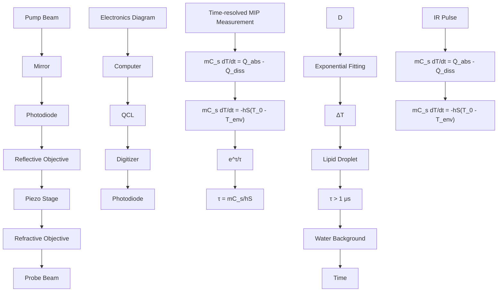

pubs.acs.org/ac

Article

# Background-Free Mid-Infrared Photothermal Microscopy via Single-Shot Measurement of Thermal Decay

Rylie Bolarinho,§ Jiaze Yin,§ Hongli Ni, Qing Xia,\* and Ji-Xin Cheng

Cite This: Anal. Chem. 2025, 97, 4299−4307

Read Online

ACCESS

Metrics & More

Article Recommendations

Supporting Information

ABSTRACT: Mid-infrared photothermal (MIP) microscopy is an emerging tool for biological imaging, offering high sensitivity, subcellular resolution, and rapid image acquisition. However, the MIP signal of low concentration molecules in biological systems is often hindered or masked by background absorption, largely contributed by water, resulting from the H−O−H scissors-bending band in the fingerprint window or the bend-libration combination band in the cell-silent window. To preserve all desired signals while suppressing the background, we report a single-shot time-resolved MIP measurement that allows differentiation between the background and analyte signal based on their distinct photothermal dynamics. The results show that the thermal decay of the background is significantly longer than that of the desired

intracellular signal, mainly due to the larger mass and heat capacity of water compared to those of intracellular features. Through two-component exponential fitting, we successfully differentiated and suppressed the background, while preserving the desired intracellular signal in both the fingerprint and cell-silent windows. By leveraging the thermal dynamics differences obtained from a single-shot measurement, we effectively remove the background and enhance the detection of small signals in a biological system.

text_image

Raw Image Stack
Exponential Fitting
τ = 300 ns
Lipid Droplet
Time
τ > 1 μs
Background
Suppress τ ≥ 1 μs
Before
10 μm
After
10 μm

## INTRODUCTION

Mid-infrared photothermal (MIP) microscopy is a highly sensitive, high-resolution biomolecular imaging tool, elucidating intracellular enzyme activity and interactions,1 protein and lipid maps inside of cancer cells and C. elegans,2,3 and polysaccharides and lipids inside of yeast cells.2 Additionally, it plays a crucial role in viral fingerprinting4,5 and provides insights into bacterial response to antibiotics and fingerprinting.6−8 MIP microscopy is a pump−probe method that uses a pulsed IR pump beam and a visible probe beam.9−11 The IR beam offers chemical specificity as each chemical bond has a unique IR vibration signature, enabling the visualization of chemical maps. The pulsed IR laser excites a specific molecule, which relaxes down to the ground state via nonradiative thermal decay. This local heating induces thermal expansion and, thus, forms a thermal lens by altering the local refractive index. The thermal lens modulates the scattering of the visible probe beam, which provides MIP chemical contrast. Unlike typical IR imaging, which is limited by the long IR wavelength and thus lower spatial resolution,12,13 MIP microscopy leverages the visible probe beam to achieve a spatial resolution of approximately 300 nm.2,14 Furthermore, MIP benefits from the large IR cross-section of 10−17 to 10−22 cm2 molecule−1 , which is approximately 8 orders of magnitude larger than the Raman scattering cross-section,9,15 offering micromolar level limits of detection.

Despite its high resolution and micromolar sensitivity, MIP microscopy faces challenges when imaging low-concentration molecules inside live cells due to water absorption in the mid IR region.16 This absorption can mask the desired signal and introduce image artifacts. Even when imaging in the cell-silent window (2000−2300 cm−1 ), water absorption remains as a significant limiting factor due to its bend-libration mode.17,18 Currently, several methods across the spectroscopic, frequency, and time domains have been developed to mitigate unwanted background. In the spectroscopic domain, on−off wavenumber subtraction is a conventional approach that uses a wavenumber lacking an analyte signal but containing similar water absorption to subtract the background.1,19−21 This is done using lock-in detection, which allows for weak signals to be detected at a fundamental frequency.22,23 However, this method may not entirely eliminate intracellular water, leading to potential image artifacts. Additionally, multivariate curve resolution (MCR) analysis has been used to suppress the background by separating overlapping signals into their

Received: July 16, 2024

Revised: January 31, 2025

Accepted: February 11, 2025

Published: February 18, 2025

flowchart

Figure 1. Schematic and principle of single-shot time-resolved MIP measurement. (A) Microscope configuration. The MIP microscope is in the counter propagation geometry. The continuous-wave visible probe beam is focused onto the sample using a water immersion objective lens. A quantum cascade laser in pulsed mode is used as the mid-IR excitation source, which is focused onto the sample via a reflective IR objective lens. Photons are collected in the forward direction, passing through the reflective objective lens to the silicon photodiode after being separated by a dichroic mirror. (B) Schematic of electronics used to obtain the time-resolved measurement. Signal obtained by the photodiode passes through a resistor, high pass filter, wideband voltage amplifier, and a low pass filter before being collected by the MHz digitizer. A computer is used to synchronously control the electronics and the IR laser. (C) Theory of photothermal dynamics. Each IR pulse induces a photothermal response. Using Newton’s Law, the thermal decay constant, $\tau _ { \nu }$ can be derived. (D) Signal extraction from background. Photothermal dynamics are measured at each pixel, and two-component exponential fitting is applied to the image to determine the thermal decay. Weight is assigned to each pixel based on its decay, allowing for long decay components to be suppressed, but fast decay components to be preserved.

individual components after hyperspectral imaging,24,25 but reference spectra may not accurately reflect cell-to-cell heterogeneity.

Apart from the spectroscopic domain, suppression of the background in the time and frequency domains leverages the differences in photothermal dynamics between the analyte and water. Photothermal dynamics involve both energy deposition and dissipation from the molecule.26 This happens in three stages: excitation of chemical bonds by the IR beam and immediate nonradiative relaxation (picoseconds), localized heat expansion and temperature increase (nanoseconds), and energy dissipation via heat diffusion (microseconds).

Intrinsic properties of the molecule allow for separation of the desired signal from the background. Since water has a larger heat capacity, its photothermal dynamics occur more slowly than those of smaller analytes, allowing for differentiation in both the time and frequency domains. Samolis et al. utilized the time domain by applying boxcar detection to suppress background from axon bundles27 and to study heat diffusion into the surrounding medium.28 While boxcar detection allows for a high signal-to-noise (SNR) ratio to be obtained,29 it is limited in its use of one gate window, which hinders dynamic imaging capabilities and necessitates multiple measurements to capture the full photothermal dynamic process. In the frequency domain, Yin et al. utilized photothermal dynamic imaging (PDI) to capture the full photothermal dynamic process with nanosecond resolution using a megahertz (MHz) digitizer.30 A fast Fourier transform (FFT) was applied to obtain harmonic images for background suppression, whereas in lock-in detection, the information obtained from high-order harmonics is lost.30 Due to the longer decay of the background compared to the lipid droplets, the low-frequency component diminishes faster than the highfrequency component, allowing for background suppression with high-order harmonics. However, it is important to note that the signal from the analyte dramatically decreases as the harmonic order increases.

In this work, we overcome the aforementioned limitations via a single-shot measurement of photothermal dynamics and two-component, pixel-by-pixel exponential fitting. This allows us to harness the benefits of MIP microscopy while primarily preserving analyte signals and simultaneously suppressing the background. The background was successfully suppressed, as its thermal decay is an order of magnitude larger than that of the analyte. After exponential fitting, fast decay signals are preserved, and the background is effectively suppressed.

## METHODS

Principle of Single-Shot Measurement of Photothermal Dynamics. The single-shot measurement of photo thermal dynamics was performed using the microscope shown in Figure 1A with a schematic of the information acquisition process in Figure 1B. The microscope operates in a counterpropagation geometry, which allows for a tightly focused visible beam for the visualization of fine details, achieving a spatial resolution of 300 nm.2,14 Additionally, the use of a MHz digitizer enables nanosecond-scale temporal resolution, allow ing for differentiation between the photothermal dynamics of the analyte and the background.

As previously mentioned, photothermal dynamics encom pass both energy deposition and dissipation, and it occurs in three stages. Heat transfer of the analyte and the environment versus time can be expressed using Newton’s Law

$$
m C _ {\mathrm{s}} \frac {\mathrm{d} T}{\mathrm{d} t} = \dot {Q} _ {\mathrm{abs}} - \dot {Q} _ {\mathrm{diss}} \tag {1}
$$

where m is mass, $C _ { s }$ is specific heat capacity, dT/dt is the change in temperature with respect to time, and Q abs $\dot { Q } _ { \mathrm { { a b s } } } - \dot { Q } _ { \mathrm { { d i s s } } }$ Q diss is the heat flux. This equation is shown in Figure 1C with an example of photothermal dynamics. The cooling process is modeled by

$$
T (t) = T _ {\text { env }} + \left(T _ {\max} - T _ {\text { env }}\right) \mathrm{e} ^ {\left(- \frac {h S}{m C _ {s}}\right) t} \tag {2}
$$

A  

text_image

IR Excitation
Water
PMMA

B  

C  

line chart

| Time (μs) | Intensity (V) for Curve 1 | Intensity (V) for Curve 2 |
|-----------|----------------------------|----------------------------|
| 0         | 0                          | 0                          |
| 1         | 1.2                        | 0.8                        |
| 2         | 0.6                        | 0.4                        |
| 3         | 0.2                        | 0.2                        |
| 4         | 0.1                        | 0.1                        |
| 5         | 0                          | 0                          |

D  

E  

F  

line chart

| Harmonic Order | a    | d    | b    | e    | c    | f    |
| -------------- | ---- | ---- | ---- | ---- | ---- | ---- |
| 0              | 1.0  | 1.0  | 1.0  | 1.0  | 1.0  | 1.0  |
| 2              | 0.8  | 0.7  | 0.6  | 0.5  | 0.4  | 0.3  |
| 4              | 0.6  | 0.5  | 0.4  | 0.3  | 0.2  | 0.15 |
| 6              | 0.4  | 0.3  | 0.25 | 0.2  | 0.15 | 0.1  |
| 8              | 0.25 | 0.2  | 0.15 | 0.15 | 0.1  | 0.05 |
| 10             | 0.15 | 0.1  | 0.1  | 0.1  | 0.05 | 0.05 |

G

line chart

| Distance (μm) | Intensity (V) ×10⁻⁴ |
| ------------- | ------------------- |
| 0             | 0                   |
| 2             | 0                   |
| 4             | 2.07                |
| 6             | 0                   |
| 8             | 0                   |
| 10            | 0                   |

H  

box plot

| Group       | SBR  |
| ----------- | ---- |
| Harmonic    | 5    |
| Time-Resolved | 60   |

Figure 2. Comparison of background suppression between exponential fitting of time-resolved measurement and the frequency domain of 1 μm PMMA beads. (A) IR excites both PMMA bead and surrounding water. Excitation volume of the IR beam is larger than the PMMA bead, which causes the background to also give signal. (B) Time-resolved image of 1 μm PMMA beads before background suppression taken at $1 7 2 9 \mathrm { c m } ^ { - 1 }$ . This is a selected image from the original stack of images depicting the photothermal dynamic at t = 720 ns. Circle 1 indicates the bead, and circle 2 indicates the ring feature. (C) Temporal dynamics of positions indicated by circles in panel (B). The black curve indicates the photothermal dynamics of the bead and the blue curve indicates the photothermal dynamics of the background. The red dashed line present on each curve indicates exponential fitting. Fitting result of area 1 is $A = 0 . 0 1 , \tau _ { \mathrm { A } } = 4 4 5 \ \mathrm { n s } , B = 0 ,$ and $\tau _ { \mathrm { B } } = \infty$ . Fitting result of area 2 is $A = 0 . 1 3 , \tau _ { \mathrm { A } } = 1 . 6 \mu s , B =$ $0 . 1 2 ,$ , and $\tau _ { \mathrm { B } } = 1 . 5 \mu s .$ (D) Exponential fitting result of PMMA beads in water. Circle 1 indicates the bead position and circle 2 indicates the position of the ring. (E) Photothermal images of the 1st (100 kHz), 4th (400 kHz), 6th (600 kHz), and 8th (800 kHz) were obtained via FFT of the original time domain data. (F) Frequency domain representation of signals from locations indicated in (E). These plots were acquired after performing an FFT on the time domain data. (G) Line plots of the time-resolved (black), 1st harmonic (red), 4th harmonic (blue), and 8th harmonic (green) images. Location of the line plots is indicated by yellow dashed line present in (E). (H) SBR comparison water suppression via the frequency domain (blue) and time domain (green). The 4th harmonic was used as comparison because it had a higher SBR than the other frequencies. $N = 4$ for both boxplots.

where $T ( t )$ is the temperature dependence on time, $T _ { \mathrm { e n v } }$ is the environment temperature, $T _ { \mathrm { m a x } }$ is the initial temperature where cooling begins, h is heat conductivity, and S is the surface area.11,30,31 The decay constant of the analyte and background is

$$
\tau = \frac {m C _ {\mathrm{s}}}{h S} \tag {3}
$$

Due to the large differences in mass and heat capacity, the background decay is much longer than that of the analyte. To extract the desired signals from the background, we further performed a two-component exponential fitting on each pixel of the image and suppressed the decays that are equal to or longer than 1 μs. Through the use of Newton’s Law, a key assumption is being made that our analyte is a small absorber immersed in a large medium, and thereby assumes that the temperature increase of the environment is negligible. If examining a more complex model, like intracellular heat transport between organelles and not simply to the environment, a more accurate model would be to use the power-law decay instead of Newton's Law.32

Experimental Setup. An MIP microscope in a counter propagation geometry was used for all experiments and can be seen in Figure 1A. It was built on an inverted microscope frame (IX71, Olympus). A pulsed, tunable $( 9 0 0 { - } 2 3 0 0 ~ \mathrm { c m } ^ { - 1 } )$ quantum cascade laser (QCL) (MIRcat-2400, Daylight Solutions) was used as the mid-IR pump source. It passes through a dichroic mirror before being focused onto the sample via a reflective objective lens (40×; NA, 0.5; LMM40X P01, Thorlabs). The repetition rate for all experiments was 100 kHz, and the pulse width was 500 ns. The probe source was a continuous wave 532 nm laser (Samba 532 nm, Cobolt) and was focused through a water immersion lens (60×; NA, 1.2 water immersion; UPlanSApo, Olympus). The pump and probe beams were coaligned in order to ensure that the focus of both beams was overlapped. A scanning piezo stage (Nano-Bio 2200, Mad City Laboratories) with a pixel dwell time of 200 μs and a moving range of 200 μm was used to scan each sample. Photons were measured in the forward direction, after going through the reflective objective and dichroic mirror, by a silicon photodiode (DET10A, Thorlabs). The current from the photodiode then passed through a 50 Ω resistor, and the current was converted to voltage. The voltage passed through a high-pass filter with a bandwidth greater than 70 MHz, and the signal passed through a wideband voltage amplifier with 46 dB gain (SA230-F5, NF corporation) before being filtered by a low-pass filter with a cutoff frequency of 10 MHz. The remaining signal was sent to a four-channel digitizer (Oscar 14, Gage Applied) installed on a computer, which has a sampling rate of 50 million samples per second and 14 bit A/D resolution. A simple schematic of the electronics used to obtain the single-shot time-resolved measurements is shown in Figure 1B. This setup is used to measure the photothermal dynamics induced by a single IR pulse from the OCL. The photothermal dynamics was then fitted using Newton’s Law to obtain a thermal decay constant, τ, as shown in Figure 1C.

Data Acquisition and Processing. The raw data from the digitizer was saved to the host computer. Any dispersion in the images was corrected via a custom-coded MATLAB program. The harmonic images were also obtained via a custom-coded MATLAB program using the FFT function. After dispersion correction, the images underwent a 3D mean filtering with a $Z \mathrm { - }$ radius of 2 in ImageJ. The images were fitted pixel-by-pixel with a two-component exponential decay using the formula

$$
F (t) = A \mathrm{e} ^ {t / \tau_ {\mathrm{A}}} + B \mathrm{e} ^ {t / \tau_ {\mathrm{B}}} \tag {4}
$$

where A is the initial amplitude of the fast component, $\tau _ { \mathrm { A } }$ is the decay of the fast component, B is the initial amplitude of the slow component, $\tau _ { \mathrm { B } }$ is the decay of the slow component, and t is time.33 A weight is assigned to each pixel based on $\tau _ { \mathrm { A } } \mathrm { , } ^ { 3 3 }$ and all pixels with a $\tau _ { \mathrm { A } }$ larger than 1 μs were suppressed. A workflow of the background suppression method can be seen in Figure S1. This was also done using custom MATLAB software. A schematic of signal extraction is shown in Figure 1D. After image processing, all images were further analyzed and displayed using ImageJ. Pseudocolor was applied to all images using ImageJ. All spectra were plotted using Origin.

PMMA Beads. Poly(methyl methacrylate) (PMMA) beads with a diameter of 1 μm were diluted in deionized water. Approximately $5 \mu \mathrm { L }$ of this solution was pipetted onto a 1 mm thick calcium fluoride $\left( \operatorname { C a F } _ { 2 } \right)$ substrate and was sandwiched under a cover glass for imaging.

U87 Cancer Cells. U87 cells, with a density of $1 \times 1 0 ^ { 6 }$ cells/mL, were seeded on CaF substrates with 2 mL Eagle’s minimum essential medium (EMEM) supplemented with 100 U/mL penicillin/streptomycin (P/S) and 10% fetal bovine serum overnight at $3 7 ~ ^ { \circ } \mathrm { C }$ and 5% $\mathrm { C O } _ { 2 } .$ After cell attachment, the cells were treated with EMEM supplemented with $\mathrm { P } / \mathrm { { { S } } }$ and 10% delipidated serum. The experimental group was further supplemented with palmitic acid-d31 (PA-d31) dissolved in medium with a final concentration of 20 μM. The cells were incubated for 48 h at $3 7 ~ ^ { \circ } \mathrm { C }$ and 5% $\mathrm { C O } _ { 2 } .$ After incubation, the cells were washed with phosphate buffer solution (PBS) and were fixed with 10% formalin. The cells were washed with PBS three times, and then the samples were sandwiched under a glass cover slide for imaging.

Pinpoint Spectroscopy. Pinpoint spectroscopy was performed on PA-d31-treated cells using lock-in detection to obtain the intracellular PA-d31 spectrum and the background spectrum. The IR laser was scanned from 2000 to $2 3 0 \mathrm { \check { 0 } } \mathrm { c m } ^ { - 1 }$ with a speed of 50 cm−1 per second. The repetition rate was 100 kHz with a 500 ns pulse width and a time constant of 10 ms.

## RESULTS AND DISCUSSION

Validation of Background Suppression by Measuring the Photothermal Dynamics of PMMA Beads in Water. To validate the efficacy of background suppression, 1 μm PMMA beads in water were studied. The excitation wave number for PMMA beads was set at $1 7 2 9 \ \mathrm { c m } ^ { - 1 }$ , targeting its carbonyl stretching mode.34 While the absorbance of water is relatively low at this wavenumber, there is a signal from the H−O−H scissors-bending band.17 As shown in Figure 2A, the IR excitation volume includes both the PMMA bead and surrounding water. The time-resolved image at 720 ns (Figure 2B) shows a signal from the bead, background, and a ring feature around each bead. The photothermal dynamics from points 1 and 2, representing the bead and the ring, respectively, reveal a 445 ns decay for the bead and a 1.6 μs decay for the ring (Figure 2C). After applying exponential fitting to retain the bead component and diminish the water component, the final result in Figure 2D shows sufficient suppression of the background and the disappearance of the ring feature. This suggests that the ring signal originated from water absorption. To confirm the superior background suppression capability of our method compared to the frequency domain approach, we applied an FFT to the time-domain data to obtain harmonic images of the beads. In Figure ${ \mathrm { 2 E } } ,$ a subset of harmonic images from the 1st−8th harmonic is shown to demonstrate progressive background suppression with increasing harmonics. This occurs due to the transformation from the time to frequency domain, where the slow decay of the background manifests as a low-frequency component and is effectively suppressed as the harmonics increase. Meanwhile, the transient, fast-decaying bead signal contributes to the higher frequency components, which persist longer as the harmonics increase. However, the bead signal also decreases with increasing harmonics, albeit at a slower rate than that of the background. This is confirmed in Figure 2F, as the spectra clearly show the decreasing signal of the bead, with all signals almost gone by the 10th harmonic. Furthermore, the ring spectrum is suppressed at the same rate as that of the background, further corroborating that this signal is from water absorption. Side-by-side intensity normalized images of all time-resolved and harmonic images can be seen in Figure S2. While harmonic imaging provides a viable method for suppressing the background, our approach aims not only to suppress the background but also to preserve the integrity of the bead signal. The success of background suppression via biexponential fitting is further confirmed in Figure $^ { 2 \mathrm { G } , }$ , which shows line plots obtained from the location of the yellow dashed line shown in the 1st harmonic image of Figure 2E. The time-resolved background suppression has a better SNR and signal-to-background ratio (SBR) than all of the harmonics. The SNR for the time-resolved data was approximately $^ { 5 1 , }$ while for the ${ \mathrm { 1 } } { \mathrm { s t } } ,$ 4th, and 8th harmonics, it was approximately $1 6 , 3 5 ,$ and $^ { 1 5 , }$ respectively. This further shows that while high-order harmonics successfully suppress the background, SNR is sacrificed. In Figure 2H, SBR is evaluated for frequency domain suppression and our new approach. Our method, utilizing the biexponential fitting of the time-resolved data, yields an average SBR of 45, which is approximately three times higher than the SBR of 15 obtained using harmonics. Notably in Figure 2H, the 4th harmonic was used to compare frequency domain suppression to that achieved via exponential fitting, as it exhibited the highest SBR among all harmonic images. SBR comparisons between harmonic orders 1−20 can be seen in Figure S3. Off-resonance time-resolved imaging of PMMA beads at 1660 $\mathrm { c m } ^ { - 1 }$ can be found in Figure S4 and shows the long decay of water in the bead and background locations due to the strong water absorption at this wavenumber. After validating the efficacy o this method in background suppression, it was applied into the cell model.

Background-Free Imaging of Lipid Droplets in the Fingerprint Window. Prior PDI of lipid droplets showed nanosecond-scale decay, contrasting with the microsecondscale decay of the background.30 However, the frequency domain was used to suppress the background against the lipid droplets. The signal from the lipid droplets also decreased with increasing harmonics.30 To address this issue, our biexponen-

A  

text_image

t = 920 ns
1
2
3
0.035
10 µm

B  

line chart

| Time (μs) | Intensity (V) for Curve 1 | Intensity (V) for Curve 2 | Intensity (V) for Curve 3 |
|-----------|-----------------------------|-----------------------------|-----------------------------|
| 0         | ~0.00                       | ~0.00                       | ~0.00                       |
| 1         | ~0.04                       | ~0.03                       | ~0.02                       |
| 2         | ~0.01                       | ~0.01                       | ~0.015                      |
| 3         | ~0.005                      | ~0.005                      | ~0.01                       |
| 4         | ~0.002                      | ~0.002                      | ~0.008                      |

C  

natural_image

Fluorescence microscopy image showing cellular structures with highlighted regions (1, 2, 3) and a color scale bar (0 to 0.035), scale bar 10 μm

D  

text_image

1st Harmonic
6th Harmonic
20th Harmonic
10 µm
Intensity (V)
0.0035

E  

line chart

| Distance (um) | 20th Harmonic | 6th Harmonic | 1st Harmonic | Time Resolved |
| ------------- | ------------- | ------------ | ------------ | ------------- |
| 0             | ~0            | ~0           | ~0           | ~0            |
| 2             | ~0            | ~0           | ~0           | ~0            |
| 4             | ~3.42         | ~1.28        | ~3.01        | ~24.8         |
| 6             | ~0            | ~0           | ~0           | ~0            |
| 8             | ~0            | ~0           | ~0           | ~0            |
| 10            | ~0            | ~0           | ~0           | ~0            |

F  

scatterplot

| Group        | SBR  |
| ------------ | ---- |
| Harmonic     | 10   |
| Time-Resolved| 70   |

Figure 3. Label-free time-resolved imaging of lipid droplets in the fingerprint window. (A) Time-resolved image of lipid droplets in a U87 cell before background suppression taken at $1 { \bar { 7 } } 4 0 \ \mathrm { c m } ^ { - 1 } .$ . Lipid droplets are indicated by circles 1 and 2, while the background is indicated by circle 3. This image is one frame from the raw image stack that reflects the photothermal dynamics at t = 920 ns. (B) Temporal dynamics of positions indicated in panel (A). The black curve indicates the photothermal dynamics of the lipid droplet indicated by circle 1, and the gold curve represents the photothermal dynamics of the lipid droplet indicated by circle 2. The blue curve represents the dynamics of the background, indicated by circle 3. The red dashed line present on each curve is indicative of the exponential fitting. The thermal decay for each component is listed to the right of the curves. The fitting result of area 1 is $A = 0 . 0 5$ , $\tau _ { \mathrm { A } } = 3 8 1$ ns, $B = 0 . 0 1 _ { . }$ , and $\tau _ { \mathrm { B } } = \infty$ . The fitting result of area 2 is $A = 0 . 0 3$ , $\tau _ { \mathrm { A } } = 3 3 8$ ns, $B = 0 ,$ and $\tau _ { \mathrm { B } } = \infty$ . The fitting result of area 3 is $A = 0 . 0 1$ , $\tau _ { \mathrm { A } } = 3 . 4 \mu s ,$ , $B = 0 . 0 1 _ { . }$ , and $\tau _ { \mathrm { B } } = 3 . 4 \mu s .$ (C) Exponential fitting result of intracellular lipid droplets. Circles 1, 2, and 3 are in the same position as they were before background suppression to highlight the efficacy of this method. (D) Photothermal images of the 1st (100 kHz), 6th (600 kHz), and 20th (2 MHz) were obtained via FFT of the original time domain data. (E) Line plots of the time resolved (black), 1st harmonic (red), 6th harmonic (blue), and 20th harmonic (green) images. Location of the line plots is indicated by the yellow dashed line indicated in (D). (F) SBR comparison of background suppression by the frequency domain (blue) and time domain (green). The 6th harmonic is used to compare to the time-resolved result as it had the highest SBR among the other harmonics. $N = 9$ for both boxplots.

tial fitting was employed to simultaneously suppress the background and preserve the lipid droplets. U87 cells underwent excitation at $1 7 4 0 ~ \mathrm { c m } ^ { - 1 } ;$ , which targets the carbonyl stretching mode of lipid droplets35,36 and the H−O−H scissors band of the water background. A time-resolved image of a U87 cell before background suppression can be seen in Figure 3A, where there is a clear signal from both the lipid droplets and the background. At the points indicated by circles 1 and 2, the photothermal dynamics from lipid droplets can be seen, while circle 3 represents the dynamics of the background. which can be seen in Figure 3B. The lipid droplet labeled with circle 1 was determined to have a decay of 381 ns, and the second lipid droplet, labeled by circle 2 was found to have a decay of 338 ns. The water background, indicated by a circle 3, was determined to have a decay of 3.4 μs. This difference in decays allows for background suppression via exponential fitting, where the result can be seen in Figure 3C. The location of the lipid droplet indicated by circle 2 has become clearer after background suppression, where it was previously challenging to discern above the background. Furthermore, both the background and intracellular water signal have been diminished. To compare this result with background suppression via the frequency domain, an FFT of the timeresolved data was performed, as depicted in the harmonic images of Figure 3D. Both the lipid droplet and background signals decrease with increasing harmonics. The 6th harmonic exhibited the highest SBR, at approximately 10. SBR comparisons between harmonic orders 1−20 can be seen in Figure S3. The SNR of the time-resolved, 1st, 6th, and 20th harmonic images obtained from the line plots in Figure 3E is 52, 10, 19, and 12, respectively. Following background suppression using our method, the SBR of lipid droplets increased to approximately 50, as shown in Figure 3F. Therefore, exponential fitting more effectively suppresses the background while preserving the lipid droplet signal for labelfree imaging in the fingerprint window.

Background Suppression in the Cell-Silent Window. Alongside label-free imaging of lipid droplets in the fingerprint window, the cell-silent window is increasingly studied to image specific analytes using small tags like nitriles,1,37 azides,19,37,38 alkynes,39,40 or deuterium labeling.41 43 The silent window experiences water absorption due to the bend-libration combination band of water.17,18 Hence, it is important to have a method to suppress the background here but retain all of the desired signal. To validate the efficacy of our method in this window, we chose to use PA-d31-treated U87 cells. As palmitic acid is a metabolite of de novo lipogenesis, it will be incorporated into the lipid droplets of the cell. Initially, we confirmed the intracellular spectrum of PA-d31 by performing pinpoint spectroscopy on PA-d31-treated and control cells.

A  

line chart

| Wavenumber (cm⁻¹) | Intracellular PA-d31 | Control |
| ----------------- | ------------------- | ------- |
| 2000              | ~1.5×10⁻⁴           | ~1.0×10⁻⁴ |
| 2100              | ~4.5×10⁻⁴           | ~3.5×10⁻⁴ |
| 2200              | ~8.0×10⁻⁴           | ~4.0×10⁻⁴ |
| 2300              | ~1.5×10⁻⁴           | ~1.0×10⁻⁴ |

B  

text_image

t = 940 ns
10 µm
O²
O¹
0.1
0
0

C  

line chart

| Time (μs) | Intensity (V) - 1 | Intensity (V) - 2 |
|-----------|-------------------|-------------------|
| 0         | 0.12              | 0.00              |
| 2         | 0.08              | 0.02              |
| 4         | 0.04              | 0.01              |
| 6         | 0.02              | 0.00              |
| 8         | 0.01              | 0.00              |
| 10        | 0.00              | 0.00              |

D  

natural_image

Fluorescence microscopy image showing green-labeled cellular structures with yellow emission regions, scale bar 10 μm (no text or symbols)

E  

text_image

1st Harmonic
10th Harmonic
21st Harmonic
10 µm
0.007

F  

line chart

| Distance (μm) | Intensity (V) - 21st Harmonic | Intensity (V) - 10th Harmonic | Intensity (V) - 1st Harmonic | Intensity (V) - Time Resolved |
| ------------- | ----------------------------- | ----------------------------- | ---------------------------- | ---------------------------- |
| 0             | ~0                            | ~0                            | ~0                           | ~0                           |
| 2             | ~0                            | ~0                            | ~0                           | ~0                           |
| 4             | ~7                            | ~2.48                         | ~1.28                        | ~15.2                        |
| 6             | ~0                            | ~0                            | ~0                           | ~0                           |
| 8             | ~0                            | ~0                            | ~0                           | ~0                           |

G  

box plot

| Group       | SBR  |
| ----------- | ---- |
| Harmonic    | 10   |
| Time-Resolved | 60   |

Figure 4. Time-resolved imaging of a PA-d31-treated U87 cell in the cell-silent window. (A) Intracellular pinpoint spectra of PA-d31-treated and control U87 cells. Pinpointed MIP spectrum of a PA-d31-treated cell (black) and control cell (blue). The control cell spectrum reflects that of water in this region. (B) Time-resolved image of PA-d31 droplets in a U87 cell before background suppression taken at 2198 $\mathrm { c m } ^ { - 1 }$ . The PA-d31 droplet is indicated by circle 1, while the background is indicated by circle 2. This image is acquired from the raw photothermal dynamic image stack at $t = 9 4 0$ ns. (C) Temporal dynamics of positions indicated in panel (B). The black curve indicates the photothermal dynamics of the PA d31 droplet, indicated by circle 1 in (A). The blue spectrum represents the dynamics of the background, indicated by circle 2 in (A). The red dashed lines present on both curves indicate exponential fitting. Thermal decays are displayed next to each curve. The position indicated by circle 1 had a fast and slow component, and the decay of the PA-d31 component is indicated by $\tau _ { \mathrm { 1 A } }$ and the decay of the water component is indicated by $\tau _ { \mathrm { 1 B } } .$ Fitting result of area 1 is $A = 0 . 0 5 , \tau _ { \mathrm { A } } = 2 8 0$ ns , $B = 0 . 0 6 ,$ and $\tau _ { \mathrm { B } } = 2 . 3 \mu s$ . Fitting result of area 2 is $A = 0 . 0 2$ , $\tau _ { \mathrm { A } } = 2 . 9 \mu s ,$ , $B = 0 . 0 1$ , and $\tau _ { \mathrm { B } } = \infty$ . (D) Exponential fitting result of PA-d31-treated U87 cell. Circle 1 indicates the position of the lipid droplet and circle 2 indicates the position of the background. (E) Photothermal images of the 1st (100 kHz), 10th (1 MHz), and 21st (2.1 MHz) were obtained via FFT of the original time domain data. (F) Line plots of the time-resolved (black), 1st harmonic (red), 10th harmonic (blue), 21st harmonic (green) images. Location of the line plots is indicated by yellow dashed line indicated in (E). (G) Background suppression by the frequency domain (blue) and time domain (green). The 10th harmonic is used to compare to the time-resolved result as it had the highest SBR among the other harmonics. $N = 7$ for both boxplots.

The resulting spectra are displayed in Figure 4A. There is clear water absorption in both spectra, and the main PA-d31 peaks were determined to be 2100 and $2 1 9 8 ~ \mathrm { { \ c m } ^ { - 1 } }$ . While this molecule has a signal above the background, these spectra illustrate the difficulty in resolving low-concentration molecules against the background. Additionally, water absorption in this window may also cause artifacts, leading to an inaccurate depiction of the true signal. The time-resolved image at 2198 $\mathrm { c m } ^ { - 1 }$ (Figure 4B), shows signal from both the PA-d31 droplet and the background. The image was subsequently fitted with a biexponential equation, and the photothermal dynamics from the positions marked by circles 1 and 2, denoting the PA-d31 droplet and the background, respectively, are shown in Figure 4C. The PA-d31 droplet was determined to have two decay components: first, the PA-d31 droplet component had a decay of 280 ns, indicated by $\tau _ { \mathrm { 1 A } }$ and second, its water component had a decay of 2.3 $\mu \mathbf { s } ,$ indicated by $\tau _ { \mathrm { 1 B } } .$ The background, labeled by circle 2, was determined to have a decay of 2.9 μs, as indicated by $\tau _ { 2 \mathrm { A } } .$ Due to these differences in temporal decays, our method can effectively suppress the background, with the final result shown in Figure 4D. The signal from the droplet indicated by circle 1 in Figure 4B is not as intense after background suppression. Importantly, this indicates the absence of the water component in our final result, revealing the true signal of PA-d31. This indicates that prior to background suppression, the signal attributed to PA-d31 is a summation of PA-d31 and water. This could have potentially led to an overestimation of signal strength, underscoring the need for effective background suppression. Furthermore, in Figure 4D, the signal from non-PA-d31 droplets and the background also disappeared, suggesting that the previous signal was solely contributed by intracellular water. The difference in decays also allows for the frequency domain to be used to suppress the background, and after performing an FFT on the time-resolved data, harmonic images were generated, as shown in Figure 4E. Consistent with the previous findings, the background and PA-d31 droplet signals decreased with increasing harmonics. Line plots (Figure 4F) were obtained for the time-resolyed data and for the 1st. 10th, and 21st harmonics, and the location is denoted by the yellow dashed line in Figure 4E. The time-resolved image had an SNR of approximately 32, while the 1st, 10th, and 21st harmonics had an SNR of approximately 8, 12, and 7, respectively. This confirms that with the increasing harmonics, SNR is sacrificed, which is evident in the noisier line plot of the 21st harmonic. The 10th harmonic was determined to have the best SBR among all harmonic images, but it clearly exhibited a higher background signal than the time-resolved image (Figure 4F). A direct comparison of SBR between the time-resolved image and 10th harmonic revealed that our method is approximately 5 times greater, with an SBR of approximately 51 compared to an SBR of approximately 10 for the 10th harmonic, as shown in Figure 4G. Time resolved images of a control U87 cell taken in the silent window can be seen in Figure S5.

Practical Background Suppression via Image Subtraction. To find a more efficient method of background suppression, a practical but less accurate alternative to the exponential fitting method involves subtracting two frames from a photothermal dynamic image stack. By selecting frames with a similar background signal but differing analyte signals, the background can be subtracted. This approach still uses the distinct photothermal dynamics between the analyte and background. Therefore, subtracting the image at 1.48 $\mu \boldsymbol { s }$ from the image at 660 ns, isolates the bead signal and suppresses the background, as shown in Figure 5A. This can be further applied to the cell model, as seen in Figure 5B,C, representing lipid droplets in the fingerprint window and PA-d31 droplets in the silent window, respectively. The background is effectively suppressed. Line plots of Figure 5A−C before and after subtraction can be found in Figure S6.

  
Figure 5. Background suppression in the fingerprint and cell-silent windows using image subtraction. (A) Time-resolved images of PMMA beads at 1729 cm−1 used for background suppression via subtraction. These left and center images were acquired from the raw photothermal dynamic image stack at t = 660 and 1480 ns, respectively. The difference between these images can be seen in the rightmost panel. (B) Time-resolved images of lipid droplets in a U87 cell at $1 7 4 \mathrm { { \bar { 0 } } c m ^ { - 1 } }$ used for background suppression via subtraction. These left and center images were acquired from the raw photothermal dynamic image stack at t = 860 and 1600 ns, respectively. The final background subtracted image can be seen in the rightmost image of this panel. (C) Time-resolved images of PA-d31 droplets in a U87 cell at 2198 cm−1 used for background suppression via subtraction. These left and center images were acquired from the raw photothermal dynamic image stack at $t = 8 8 0$ and 1140 ns, respectively. The final background subtracted image can be seen in the rightmost image of this panel.

This method of image subtraction is time-efficient, as it bypasses the time it takes for pixel-by-pixel fitting to be completed. However, practicality may compromise the accuracy of the final image. This is due to varying amounts of water content in a sample, which would shift the peak of its photothermal dynamics, affecting the results. This technique works well for a model like PMMA beads, as it has relatively consistent properties; however, it is necessary to consider the peak shift when dealing with more complex biological samples. For example, the yellow arrow in Figure 5B shows a ring artifact and decreased lipid droplet signal due to subtraction frame choice. Importantly, that is not present in Figure 3C. Similarly, in Figure 5C, the yellow arrow indicates a PA-d31 droplet with a ring feature that is not present in Figure 4D. In addition to the subtraction frame choice, this ring could also be due to thermal expansion differences between frames.

Despite these potential inaccuracies, this method of subtraction can provide a preliminary evaluation of photo thermal dynamics, offering a practical approach for assessing background suppression. It still harnesses the differences of photothermal dynamics between the analyte and background without waiting for exponential fitting. This method of subtraction is roughly analogous to boxcar detection, which can be used to subtract images from different gate windows. However, this requires multiple measurements to do so. If multiple gate windows were acquired in a single measurement, boxcar could be applied in the future to quickly suppress background with minimal postdata processing. Still, our method can capture the complete photothermal dynamics per pixel in an image, eliminating the need for multiple measurements.

## DISCUSSION

Previous photothermal imaging in the mid-IR has been hindered by water absorption, masking the true signal of the analyte. Methods like wavenumber subtraction, MCR, boxcar detection, and PDI have addressed this but still have limitations. We report successful background suppression using two-component exponential fitting in a single-shot MIP measurement of photothermal dynamics. Furthermore, we introduced an effective technique that subtracts two frames from a PDI stack to isolate analyte signals while minimizing the background. While practical, this method may sacrifice accuracy in heterogeneous samples due to potential peak shifts from varying water contents in complex samples.

Importantly, this does not occur with the exponential fitting. Overall, our method relies on the slower thermal decay of the background compared to the analyte, revealing background free images of PMMA beads, lipid droplets, and PA-d31 droplets with a majorly preserved analyte signal. We should note that analyte and background decays can vary from sample-to-sample and are influenced by the sample contents, with increased heating contributing to slower dynamics and decreased heating contributing to faster dynamics.

Notably, the measured photothermal decays can be applied to study thermal diffusion length, which is dependent upon particle size, solvent property, and repetition rate of the IR laser. The equation for thermal diffusion length is

$$
\mathrm{L} = 2 \sqrt {\alpha \tau} \tag {5}
$$

where L is the thermal diffusion length, α is the thermal diffusivity of the solvent, and τ is the decay.9 The thermal decay of a 1 μm particle in water was experimentally determined to be 445 ns, and the thermal diffusivity of water is $0 . 1 4 ~ \times ~ 1 0 ^ { - 6 }$ m2 /s. The thermal diffusion length of the PMMA particle is found to be about 270 nm. The PA d31droplet had a decay of 280 ns, and the thermal diffusion length is found to be about 200 nm. This short diffusion length allows for submicron resolution in MIP imaging.

Before suppression, visible ring artifacts around PMMA beads from water heating were observed, and our method effectively suppressed these artifacts. In the cell model, our method enhanced visibility of lipid droplets previously indiscernible above the background in the fingerprint region and also revealed true PA-d31 droplet signal in the cell-silent region. Therefore, it significantly improved the signal clarity across all samples. However, it is important to note that our time-resolved measurement could not effectively extract the signal from molecules diffused in solution or in the cell cytoplasm, as they would exhibit a long decay. In the case of diffuse molecules, a spectroscopic measurement should be employed to extract this signal.

A remaining limitation is the use of a piezo stage, which restricts the imaging speed. This could be overcome by implementing a laser-scan MIP microscope, utilizing galvo mirrors to synchronously scan the pump and probe beam across the sample, reaching a speed of up to 2 μs/pixel. This approach extends beyond methodological improvements, offering broad applicability in biomedical research for background-free MIP imaging.

## ASSOCIATED CONTENT

## \*sı Supporting Information

The Supporting Information is available free of charge at https://pubs.acs.org/doi/10.1021/acs.analchem.4c03689.

Background suppression workflow, intensity normalized side-by-side background suppression images, SBR calculations of frequency domain images, off-resonance imaging of PMMA beads, time-resolved imaging of control U87 cell, and line plots of practical background suppression (PDF)

## AUTHOR INEORMATION

## Corresponding Authors

Qing Xia − Department of Electrical and Computer Engineering, Boston University, Boston, Massachusetts 02215,

United States; orcid.org/0000-0002-5939-2972; Email: qingxia@bu.edu

Ji-Xin Cheng − Department of Chemistry, Boston University, Boston, Massachusetts 02215, United States; Department of Electrical and Computer Engineering, Boston University, Boston, Massachusetts 02215, United States; orcid.org 0000-0002-5607-6683; Email: jxcheng@bu.edu

## Authors

Rylie Bolarinho − Department of Chemistry, Boston University, Boston, Massachusetts 02215, United States Jiaze Yin − Department of Electrical and Computer Engineering, Boston University, Boston, Massachusetts 02215, United States; orcid.org/0000-0001-6080-3073 Hongli Ni − Department of Electrical and Computer Engineering, Boston University, Boston, Massachusetts 02215, United States; orcid.org/0000-0003-4323-1493

Complete contact information is available at https://pubs.acs.org/10.1021/acs.analchem.4c03689

## Author Contributions

§ R.B. and J.Y. contributed equally to the work. Rylie Bolarinho and Jiaze Yin conducted the experiments. Jiaze Yin contributed to the time-resolved measurement hardware. Rylie Bolarinho analyzed all data and Jiaze Yin helped in data analysis in feasibility data results. Hongli Ni helped in data analysis. Rylie Bolarinho wrote the manuscript with help from Qing Xia and Ji-Xin Cheng. Qing Xia and Ji-Xin Cheng guided the work.

## Notes

The authors declare no competing financial interest.

## ACKNOWLEDGMENTS

This work is supported by R35GM136223 and R33CA261726 to J.X.C.

## REFERENCES

(1) He, H.; Yin, J.; Li, M.; Dessai, C. V. P.; Yi, M.; Teng, X.; Zhang, M.; Li, Y.; Du, Z.; Xu, B.; Cheng, J. X. Nat. Methods 2024, 21 (2), 342−352.  
(2) Yin, J.; Zhang, M.; Tan, Y.; Guo, Z.; He, H.; Lan, L.; Cheng, J. X. Sci. Adv. 2023, 9 (24), No. eadg8814.  
(3) Zhang, D.; Li, C.; Zhang, C.; Slipchenko, M. N.; Eakins, G.; Cheng, J.-X. Sci. Adv. 2016, 2 (9), No. e1600521.  
(4) Xia, Q.; Guo, Z.; Zong, H.; Seitz, S.; Yurdakul, C.; Ü nlü, M. S.; Wang, L.; Connor, J. H.; Cheng, J.-X. Nat. Commun. 2023, 14 (1), 6655.  
(5) Zhang, Y.; Yurdakul, C.; Devaux, A. J.; Wang, L.; Xu, X. G.; Connor, J. H.; Unlu, M. S.; Cheng, J. X. Anal. Chem. 2021, 93 (8), 4100−4107.  
(6) Xu, J.; Li, X.; Guo, Z.; Huang, W. E.; Cheng, J. X. Anal. Chem. 2020, 92 (21), 14459−14465.  
(7) Li, X.; Zhang, D.; Bai, Y.; Wang, W.; Liang, J.; Cheng, J. X. Anal. Chem. 2019, 91 (16), 10750−10756.  
(8) Guo, Z.; Bai, Y.; Zhang, M.; Lan, L.; Cheng, J. X. Anal. Chem. 2023, 95 (4), 22382244.  
(9) Xia, Q.; Yin, J.; Guo, Z.; Cheng, J. X. J. Phys. Chem. B 2022, 126 (43), 8597−8613.  
(10) Teng, X.; Li, M.; He, H.; Jia, D.; Yin, J.; Bolarinho, R.; Cheng, J. X. Anal. Chem. 2024, 96 (20), 7895−7906.  
(11) Bai, Y.; Yin, J.; Cheng, J. X. Sci. Adv. 2021, 7 (20), No. eabg1559.  
(12) Chan, K. L. A.; Kazarian, S. G. Analyst 2006, 131 (1), 126−131.  
(13) Chan, K. L. A.; Hammond, S. V.; Kazarian, S. G. Anal. Chem. 2003, 75, 2140−2146.  
(14) Li, Z.; Aleshire, K.; Kuno, M.; Hartland, G. V. J. Phys. Chem. B 2017, 121 (37), 8838−8846.  
(15) Shi, L.; Liu, X.; Shi, L.; Stinson, H. T.; Rowlette, J.; Kahl, L. J.; Evans, C. R.; Zheng, C.; Dietrich, L. E. P.; Min, W. Nat. Methods 2020, 17 (8), 844−851.  
(16) Bertie, J. E.; Lan, Z. Appl. Spectrosc. 1996, 50 (8), 1047−1057.  
(17) Verma, P. K.; Kundu, A.; Puretz, M. S.; Dhoonmoon, C.; Chegwidden, O. S.; Londergan, C. H.; Cho, M. J. Phys. Chem. B 2018, 122 (9), 2587−2599.  
(18) Ramos, S.; Lee, J. C. Proc. Natl. Acad. Sci. U. S. A 2023, 120 (42), No. e2313133120.  
(19) Xia, Q.; Perera, H. A.; Bolarinho, R.; Piskulich, Z. A.; Guo, Z.; Yin, J.; He, H.; Li, M.; Ge, X.; Cui, Q.; Ramström, O.; Yan, M.; Cheng, J. X. Sci. Adv. 2024, 10 (34), No. eadq0294.  
(20) Tamamitsu, M.; Toda, K.; Shimada, H.; Honda, T.; Takarada, M.; Okabe, K.; Nagashima, Y.; Horisaki, R.; Ideguchi, T. Optica 2020, 7 (4), 359−366.  
(21) Tai, F.; Koike, K.; Kawagoe, H.; Ando, J.; Kumamoto, Y.; Smith, N. I.; Sodeoka, M.; Fujita, K. Analyst 2021, 146 (7), 2307− 2312.  
(22) Samolis, P. D.; Sander, M. Y. Opt. Express 2019, 27 (3), 2643− 2655.  
(23) Samolis, P. D.; Langley, D.; O’Reilly, B. M.; Oo, Z.; Hilzenrat, G.; Erramilli, S.; Sgro, A. E.; McArthur, S.; Sander, M. Y. Biomed. Opt. Express 2021, 12 (1), 303−319.  
(24) Ishigane, G.; Toda, K.; Tamamitsu, M.; Shimada, H.; Badarla, V. R.; Ideguchi, T. Light Sci. Appl. 2023, 12 (1), 174.  
(25) Tamamitsu, M.; Toda, K.; Fukushima, M.; Badarla, V. R.; Shimada, H.; Ota, S.; Konishi, K.; Ideguchi, T. Nat. Photonics 2024, 18, 738−743.  
(26) Cho, M. J. Chem. Phys. 2022, 157 (12), 124201.  
(27) Samolis, P. D.; Zhu, X.; Sander, M. Y. Anal. Chem. 2023, 95 (45), 16514−16521.  
(28) Samolis, P. D.; Sander, M. Y. Opt. Lett. 2024, 49 (6), 1457− 1460.  
(29) Fimpel, P.; Riek, C.; Ebner, L.; Leitenstorfer, A.; Brida, D.; Zumbusch, A. Appl. Phys. Lett. 2018, 112 (16), 161101.  
(30) Yin, J.; Lan, L.; Zhang, Y.; Ni, H.; Tan, Y.; Zhang, M.; Bai, Y.; Cheng, J. X. Nat. Commun. 2021, 12 (1), 7097.  
(31) Pavlovetc, I. M.; Podshivaylov, E. A.; Chatterjee, R.; Hartland, G. V.; Frantsuzov, P. A.; Kuno, M. J. Appl. Phys. 2020, 127 (16), 165101.  
(32) Samolis, P.; Hong, M. K.; Rajagopal, R.; Sander, M. Y.; Erramilli, S.; Narayan, O. J. Phys. Chem. C 2024, 128 (2), 961−967.  
(33) Ni, H.; Yuan, Y.; Li, M.; Zhu, Y.; Ge, X.; Yin, J.; Dessai, C. P.;Wang, L.; Cheng, J.-X. Nat. Photonics 2024, 18, 944−951.  
(34) Johnson, H. E.; Granick, S. Macromolecules 1990, 23 (13), 33673374.  
(35) Kochan, K.; Maslak, E.; Chlopicki, S.; Baranska, M. Analyst 2015, 140 (15), 4997−5002.  
(36) Dreissig, I.; Machill, S.; Salzer, R.; Krafft, C. Spectrochim. Acta, Part A 2009, 71 (5), 2069−2075.  
(37) Gai, X. S.; Coutifaris, B. A.; Brewer, S. H.; Fenlon, E. E. Phys. Chem. Chem. Phys. 2011, 13 (13), 5926−5930.  
(38) Bai, Y.; Camargo, C. M.; Glasauer, S. M. K.; Gifford, R.; Tian, X.; Longhini, A. P.; Kosik, K. S. Nat. Commun. 2024, 15 (1), 350.  
(39) Wei, L.; Hu, F.; Shen, Y.; Chen, Z.; Yu, Y.; Lin, C.-C.; Wang, M. C.; Min, W. Nat. Methods 2014, 11 (4), 410−412.  
(40) Yamakoshi, H.; Dodo, K.; Palonpon, A.; Ando, J.; Fujita, K.; Kawata, S.; Sodeoka, M. J. Am. Chem. Soc. 2012, 134 (51), 20681− 20689.  
(41) Ma, J.; Pazos, I. M.; Zhang, W.; Culik, R. M.; Gai, F. Annu. Rev. Phys. Chem. 2015, 66, 357−377.  
(42) Bai, Y.; Zhang, D.; Li, C.; Liu, C.; Cheng, J. X. J. Phys. Chem. B 2017, 121 (44), 10249−10255.  
(43) Park, C.; Lim, J. M.; Hong, S.-C.; Cho, M. Chem. Sci. 2024, 15 (4), 1237−1247.

natural_image

Microscopic view of red blood cells with visible blood vessels (no text or labels)

CAS BIOFINDER DISCOVERY PLATFORMTM

## CAS BIOFINDER HELPS YOU FIND YOUR NEXT BREAKTHROUGH FASTER

Navigate pathways, targets, and diseases with precision

Explore CAS BioFinder

