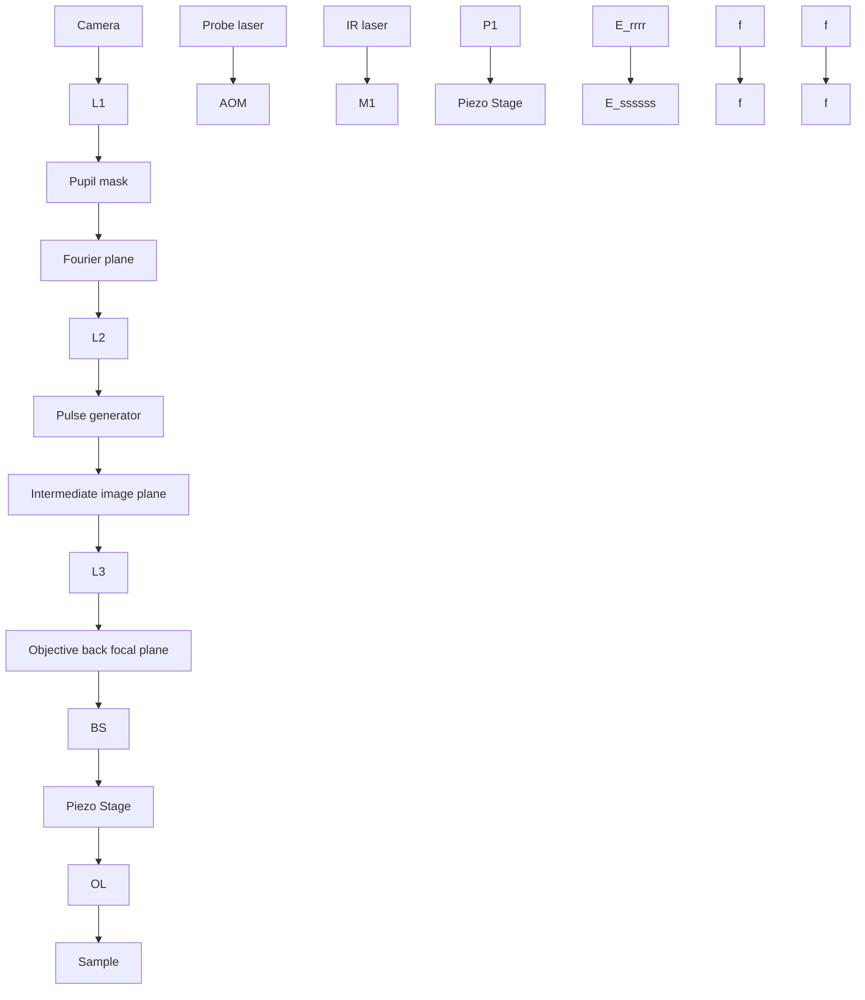

# Background-Suppressed High-Throughput Mid-Infrared Photothermal Microscopy via Pupil Engineering

Haonan Zong,§ Celalettin Yurdakul,§ Yeran Bai, Meng Zhang, M. Selim Ü nlü,\* and Ji-Xin Cheng

Cite This: 2021, 8, 3323−3336

Read Online

ACCESS

Metrics & More

Article Recommendations

Supporting Information

ABSTRACT: Mid-infrared photothermal (MIP) microscopy has been a promising label-free chemical imaging technique for functional characterization of specimens owing to its enhanced spatial resolution and high specificity. Recently developed wide-field MIP imaging modalities have drastically improved speed and enabled high-throughput imaging of micron-scale subjects. However, the weakly scattered signal from subwavelength particles becomes indistinguishable from the shot-noise as a consequence of the strong background light, leading to limited sensitivity. Here, we demonstrate background-suppressed chemical fingerprinting at a single nanoparticle level by selectively attenuating the reflected light through pupil engineering in the collection path. Our technique provides over 3 orders of magnitude background suppression by quasi-darkfield illumination in the epi-configuration without sacrificing lateral resolution. We demonstrate 6-fold signal-to-background noise ratio improvement, allowing for simultaneous detection and discrimination of hundreds of nanoparticles across a field of

view of 70 μm × 70 μm. A comprehensive theoretical framework for photothermal image formation is provided and experimentally validated with 300 and 500 nm PMMA beads. The versatility and utility of our technique are demonstrated via hyperspectral darkfield MIP imaging of S. aureus and E. coli bacteria and MIP imaging of subcellular lipid droplets inside C. albicans and cancer cells.

KEYWORDS: photothermal imaging, chemical imaging, nanoparticle detection, biosensing, bacteria detection, infrared spectroscopy

ibrational spectroscopic imaging has been an essential tool for molecular fingerprinting in biological and medical sciences.1 Intrinsic molecular vibrations in specimens can be utilized as contrast by either linear infrared absorption or inelastic Raman scattering. Therefore, the vibrational signal avoids challenges associated with fluorescence labels such as sample perturbation, photobleaching, and phototoxicity. The spontaneous Raman scattering spectromicroscopy offers submicron spatial resolution, but the nonlinear process limits sensitivity and acquisition speed.2 To boost the imaging speed, coherent Raman scattering microscopy was developed.3,4

Historically, Fourier transform infrared (FTIR) microscopy has been one of the most prevalent chemical analysis tools in various fields.5,6 However, FTIR has a low spatial resolution of several microns due to the diffraction limit of the long illumination wavelengths in the mid-IR region (2.5−25 μm). Such resolution is insufficient to study intracellular structures inside a biological cell. Atomic force microscope infrared spectroscopy (AFM-IR) techniques beat this inherent resolution limit7,8 by detecting thermal expansion with an AFM tip, and nanoscale (20 nm) resolution has been achieved.9 However, the slow scanning process in AFM-IR limits imaging throughput. Additionally, applying AFM-IR to a liquid sample is very difficult, which limits its applications to characterize live cells. To tackle these challenges, mid-infrared photothermal (MIP) microscopy was recently developed, where vibrational absorption induced chemical contrast was detected by a visible probe beam.10−12 Since the initial inception in 2016,10 MIP has been progressively evolving from lab prototypes to commercialized products and has enabled a wide range of applications.13−16 Technically, Zhang et al. first demonstrated submicron resolution mid-IR spectroscopic imaging of living cells and organisms with a point scanning approach in transmission mode.10 An epi-detection MIP was subsequently developed to extend the system capability to opaque samples including drug tablets.12 The photothermal imaging in counter propagation detection geometry was also developed to employ high-NA objectives for high-resolution (∼300 nm) and sensitive chemical detection of polymer beads down to 100 nm at a high-temperature rise (30 to 45 K).11,17,18 This geometry was extensively explored as a tool to study materials including solar cells and nanowires.19,20 More recently, confocal Raman spectroscopy is integrated into MIP microscopy,21 providing complementary chemical information by simultaneous Raman and IR spectroscopy of specimens at co-registered submicron spatial resolution.

Received: August 6, 2021

Published: October 14. 2021

Alternatively, mid-IR vibrational signatures have been extracted using a near-IR22 or shortwave IR laser probe.23

Despite its high sensitivity, the scanning MIP microscopy approaches have three main challenges: (i) limited imaging speed due to the pixel-by-pixel acquisition; (ii) wavelength dependent focused spot size mismatch between the IR and visible beams; (iii) mechanical instabilities and sample drift. Harnessing complementary metal-oxide-semiconductor (CMOS) cameras that provide ultrasensitive (>70 dB) and high-speed image (100s FPS) capturing at very low cost, the wide-field MIP systems24−29 enabled high-throughput chemical imaging with a significant speed improvement. Bai et al.24 developed a time-gated camera technique to detect the photothermal induced interferometric reflectance change of a sample placed on a silicon substrate. Similarly, Schnell et al.29 reported an interferometric method for measuring surface thermal expansion on histopathology slides using a special common-path interferometry objective, namely, a Mirau objective along with an extremely high full-well capacity camera (2 million e−). Moreover, quantitative chemical phase microscopy of living cells has been demonstrated by reconstructing a very minute optical phase path length difference.25,27,28 Despite these recent advancements, widefield MIP imaging of single subwavelength particles such as bacteria and viruses has not been demonstrated. A major limitation is that these wide-field techniques rely on bright-field sample illumination in which weakly scattered light from subwavelength (<500 nm) structures is overwhelmed by the large background arising from the strong illumination field. As the particle size decreases, the photothermal signal becomes buried under the background shot-noise from this unperturbed illumination. Thus, chemical imaging of nanoparticles becomes very difficult to achieve.

Here, we reported a background-suppressed wide-field MIP microscope via dark-field geometry in the epi-illumination configuration without sacrificing resolution. Background suppression via dark-field geometry has been proved to drastically improve the signal-to-background ratio such that the camera captures only the scattered light.30 The dark-field illumination in the epi-configuration is achieved by selectively blocking the back-reflected light in the collection arm after the objective. Our approach obviates the need for special objectives or condensers as in the off-the-shelf dark-field microscopes.31 The dark-field illumination through the objective can be performed via oblique illumination which is blocked using a field stop32,33 and on-axis illumination which is blocked by a rod mirror 34 or a circular stop.35 The objectivetype on-axis dark-field illumination blocks only the small fraction of the objective numerical aperture (NA), which is the low-NA part centered around the optical axis. Such illumination can employ high-NA objectives compared to that of the oblique, allowing for high-SNR and high-resolution detection of the backscattered light from small specimens down to single fluorescent molecules.35 And it also allows for optimization of obscuration NA. In this study, we illuminate the sample with a nearly collimated beam which is refocused at the objective back pupil after the specular reflection from the substrate surface. A custom fabricated blocker filters out this beam at the pupil’s conjugate plane; thus, nearly no reflected light reaches the camera. We demonstrate a more than 6-fold signal-to-background noise ratio improvement over a large field of view (FOV) of 70 μm × 70 μm, enabling simultaneous photothermal imaging of hundreds of particles at once. We establish a complete physical model for the photothermal image formation that utilizes boundary element methods and the angular spectrum representation framework. The theory is experimentally validated with 300 and 500 nm PMMA beads. We further provide the transient temperature response for these beads by employing the time-gated pump−probe approach.25 To highlight its potential for biological applications, we demonstrate fingerprinting of single E. coli and S. aureus in the wide-field sense. Our method advances high throughput nanoparticle imaging and characterization with chemical specificity at a single particle level.

## RESULTS AND DISCUSSION

Photothermal Contrast Mechanism in Dark-Field MIP. Figure 1 shows the photothermal contrast mechanism

text_image

a)
Erefl
Einc
Escat
n, r, T

text_image

Erefl
Einc
Escat
n',r',T'

(b)  

radar chart

| Category | Value |
| -------- | ----- |
| Cold     | 30    |
| Hot      | 0     |

radar chart

| Angle (degrees) | Value     |
| --------------- | --------- |
| 0               | 1x10⁴     |
| 30              | 2x10⁴     |
| 60              | 3x10⁴     |
| 90              | 4x10⁴     |

Figure 1. Photothermal signal formation in dark-field detection. (a) Photothermal contrast and detection mechanism for particles on top of a substrate. (b) (left) Simulated scattering polar plots of a 500 nm PMMA bead on a silicon substrate in the hot $\bar { P } _ { \mathrm { H o t } } ( \theta )$ and cold $P _ { \mathrm { C o l d } } ( \theta )$ states. (right) Corresponding photothermal polar plot obtained by subtracting hot and cold states, $P _ { \mathrm { P T } } ( \theta ) \ = \ \mathsf { \bar { P } } _ { \mathrm { H o t } } ( \theta ) \ -$ $P _ { \mathrm { C o l d } } ( \theta )$ . Signals are normalized by the maximum intensity value in the cold state. Polar plots are calculated from the far-field scattered fields obtained from the BEM simulations. The simulation parameters are as follows: $\theta _ { \mathrm { { i n c i d e n t } } } = 0 ^ { \circ } , n _ { \mathrm { { m e d i u m } } } = 1 , n _ { \mathrm { { s i l i c o n } } } = 4 . 2 , n _ { \mathrm { { P M M A } } } = 1 . 4 9 .$ , dn/ $\mathrm { d } T = - 1 . 1 \times 1 0 ^ { - 4 } \mathrm { K } ^ { - 1 } , \mathrm { d } r / \mathrm { d } T = 9 0 \times 1 0 ^ { - 6 } \mathrm { K } ^ { - 1 } , T _ { 0 } = 2 9 8 \mathrm { K }$

in dark-field illuminated MIP microscopy. A visible laser beam $E _ { \mathrm { i n c } }$ illuminates the sample placed on top of a silicon substrate in the epi-configuration (Figure 1a). The incident field scatters off the sample $E _ { \mathrm { s c a t } }$ and reflects from the substrate surface $E _ { \mathrm { r e f l } } .$ The superposition of incident and reflected light constitutes the total driving field of this scattering process. The scattered field is proportional to its optical parameters including refractive index (n) and size (r) along with the illumination wavelength (λ). The dark-field illumination rejects $1 0 ^ { 3 }$ of the reflected light in the collection path such that only the scattered fields reach the detector. A mid-infrared laser beam vibrationally excites the sample owing to the absorption bands at the IR illumination wavelength. The IR absorption generates heat and increases the sample’s temperature by ΔT. This photothermal effect results in a change in the samples refractive index and size which depends on the sample’s thermo-optic $\left( { { \mathrm { d } n } \mathord { \left/ { \vphantom { { \mathrm { d } n } T } } \right. \kern - delimiterspace } { \mathrm { d } T } } \right)$ and thermal-expansion $\left( \mathrm { d } \boldsymbol { r } / ( \boldsymbol { r } \mathrm { d } T ) \right)$ coefficients at IR-off states and hence the scattered field. To obtain the photothermal signal, the scattering field difference between IR-on and IR-off states is measured. We refer to IR pulse on and off states as, respectively, “hot” and “cold” frames throughout the manuscript. Figure 1b shows the normalized radiation profiles of scattering from a 500 nm PMMA bead on the silicon substrate. The zoomed-in region indicates a very subtle signal difference (∼0.03% for $\Delta T = 1 \mathrm { ~ K ~ }$ between the “hot” and “cold” states. It is evident that the photothermal radiation profile has a broadened angular distribution compared with the scattering profiles. This suggests a careful treatment of image formation considering imaging optics is required for accurate photothermal signal modeling. With that, theoretical analysis of illumination and collection engineering can be carried out to achieve sensitivity and resolution improvement in the imaging system.

Theory. One important parameter to describe the photothermal imaging quality is the signal to background noise ratio (SNR). The signal is the photothermal induced change at the location where there is an object, and the background noise is the background fluctuation that originates from the shot noise, detector noise, laser fluctuation, and other noises. This theory part compared the difference of the SNR in bright-field and dark-field configurations for different scattering intensities of the object and showed that the dark-field detection has a higher SNR for strong scattering objects and bright-field detection has a higher SNR for weak scattering objects.

First, the detected photothermal signal is compared. In both cases, the photothermal signal is the difference of the intensity at the pixel of the particle object of “hot” and “cold” states. In the bright-field detection case, assume the intensity at the particle object in the “hot” image, in the “cold” image, and the $I _ { \mathrm { b r i g h t } } ^ { \mathrm { o b j e c t , h o t } } , I _ { \mathrm { b r i g h t } } ^ { \mathrm { o b j e c t , c o l d } } ,$ , and $\Delta I _ { \mathrm { b r i g h t } } ^ { \mathrm { o b j e c t } } .$ Then, assume the scattered fields from the particle object in $\mathbf { \omega } ^ { \omega } \mathbf { h o t } ^ { \mathbf { \omega } _ { 0 } ^ { \mathrm { , } } }$ and $\mathrm { \ " } _ { \mathrm { c o l d } } \mathrm { \ " }$ $E _ { \mathrm { s c a t } } ^ { \mathrm { h o t } }$ $E _ { \mathrm { s c a t } } ^ { \mathrm { c o l d } }$ and assume the reflected field from the substrate is $E _ { \mathrm { r e f } } \ ( \mathrm { i . e . , }$ same for “hot” and “cold”). Then, we have

$$
\begin{array}{l} I _ {\mathrm{bright}} ^ {\mathrm{object,hot}} = (E _ {\mathrm{scat}} ^ {\mathrm{hot}} + E _ {\mathrm{refl}}) ^ {2} \\ = | E _ {\mathrm{scat}} ^ {\mathrm{hot}} | ^ {2} + | E _ {\mathrm{refl}} | ^ {2} + 2 | E _ {\mathrm{scat}} ^ {\mathrm{hot}} | | E _ {\mathrm{refl}} | \cos (\theta_ {\mathrm{hot}}) (1) \\ \end{array}
$$

$$
I _ {\text { bright }} ^ {\text { object,cold }} = (E _ {\text { scat }} ^ {\text { cold }} + E _ {\text { refl }}) ^ {2}
$$

$$
= | E _ {\mathrm{scat}} ^ {\mathrm{cold}} | ^ {2} + | E _ {\mathrm{refl}} | ^ {2} + 2 | E _ {\mathrm{scat}} ^ {\mathrm{cold}} | | E _ {\mathrm{refl}} | \cos (\theta_ {\mathrm{cold}}) (2)
$$

To simplify the discussion, we further assume the phase difference between the reflected field and the scattering field is the same and equals zero for “hot” and “cold” states. $( \mathrm { i . e . , } \theta _ { \mathrm { h o t } }$ $= \theta _ { \mathrm { c o l d } } = 0 )$ . Then, we have

$$
I _ {\mathrm{bright}} ^ {\mathrm{object,hot}} = | E _ {\mathrm{scat}} ^ {\mathrm{hot}} | ^ {2} + | E _ {\mathrm{refl}} | ^ {2} + 2 | E _ {\mathrm{scat}} ^ {\mathrm{hot}} | | E _ {\mathrm{refl}} | \tag {3}
$$

$$
I _ {\text { bright }} ^ {\text { object,cold }} = | E _ {\text { scat }} ^ {\text { cold }} | ^ {2} + | E _ {\text { refl }} | ^ {2} + 2 | E _ {\text { scat }} ^ {\text { cold }} | | E _ {\text { refl }} | \tag {4}
$$

Thus,

$$
\begin{array}{l} \Delta I _ {\text { bright }} ^ {\text { object }} = I _ {\text { bright }} ^ {\text { object,hot }} - I _ {\text { bright }} ^ {\text { object,cold }} \\ = | E _ {\mathrm{scat}} ^ {\mathrm{hot}} | ^ {2} - | E _ {\mathrm{scat}} ^ {\mathrm{cold}} | ^ {2} + 2 (| E _ {\mathrm{scat}} ^ {\mathrm{hot}} | - | E _ {\mathrm{scat}} ^ {\mathrm{cold}} |) | E _ {\mathrm{refl}} | \tag {5} \\ \end{array}
$$

Similarly, in the dark-field detection case,

$$
\Delta I _ {\text { dark }} ^ {\text { object }} = I _ {\text { dark }} ^ {\text { object,hot }} - I _ {\text { dark }} ^ {\text { object,cold }} = \left| E _ {\text { scat }} ^ {\text { hot }} \right| ^ {2} - \left| E _ {\text { scat }} ^ {\text { cold }} \right| ^ {2} \tag {6}
$$

Since the value of eqs 5 and 6 is decided by the relation of $E _ { \mathrm { s c a t } } ^ { \mathrm { c o l d } } | , | E _ { \mathrm { s c a t } } ^ { \mathrm { h o t } } |$ , and $| E _ { \mathrm { r e f l } } | ,$ we make the following definitions:

$$
M _ {\mathrm{scat}} = \frac {\Delta \left| E _ {\mathrm{scat}} \right|}{\left| E _ {\mathrm{scat}} ^ {\text {cold}} \right|} = \frac {\left| E _ {\mathrm{scat}} ^ {\text {hot}} \right| - \left| E _ {\mathrm{scat}} ^ {\text {cold}} \right|}{\left| E _ {\mathrm{scat}} ^ {\text {cold}} \right|} \tag {7}
$$

$$
S _ {\mathrm{c}} = \frac {\left| E _ {\text {scat}} ^ {\text {cold}} \right|}{\left| E _ {\text {refl}} \right|} \tag {8}
$$

$M _ { \mathrm { s c a t } }$ ,can describe the IR induced difference of the scattered field by the particle object, and it should be the same in the dark-field and bright-field cases, since the IR is the same. $S _ { \mathrm { c } }$ is the ratio between the scattered and reflected fields $( | E _ { \mathrm { s c a t } } | / |$ $E _ { \mathrm { r e f l } } | )$ , which determines the signal contrast in bright-field refl detection. $3 6 - 3 8$ If you substitute eqs 7 and 8 into eqs $\bar { 5 }$ and $^ { 6 , }$ you get

$$
\Delta I _ {\text { dark }} ^ {\text { object }} = (2 M _ {\text { scat }} + M _ {\text { scat }} ^ {2}) S _ {\text { c }} ^ {2} | E _ {\text { refl }} | ^ {2} \tag {9}
$$

$$
\Delta I _ {\text { bright }} ^ {\text { object }} = \left[ \left(2 M _ {\text { scat }} + M _ {\text { scat }} ^ {2}\right) S _ {\mathrm{c}} ^ {2} + 2 M _ {\text { scat }} S _ {\mathrm{c}} \right] \left| E _ {\text { refl }} \right| ^ {2} \tag {10}
$$

We further assume the IR induced change is small (i.e., $M _ { \mathrm { s c a t } }$ $\ll 1 )$ and then the ${ M _ { \mathrm { s c a t } } } ^ { 2 }$ term in eqs 9 and 10 can be ignored

$$
\Delta I _ {\text { dark }} ^ {\text { object }} = 2 M _ {\text { scat }} \left| E _ {\text { refl }} \right| ^ {2} S _ {\mathrm{c}} ^ {2} = 2 \left| E _ {\text { scat }} \right| \Delta \left| E _ {\text { scat }} \right| \tag {11}
$$

$$
\Delta I _ {\text { bright }} ^ {\text { object }} = 2 M _ {\text { scat }} \left| E _ {\text { refl }} \right| ^ {2} S _ {c} (S _ {c} + 1) \tag {12}
$$

From eqs 11 and 12, we can know that the photothermal signa of dark-field detection is smaller than (weak scattering case when $S _ { \mathrm { c } } \ \ll \ 1$ or $S _ { c } \sim 1 , S _ { c } \ : < \ : S _ { c } \ : + \ : 1 \big )$ or similar (strong scattering case when $S _ { c } \gg 1 , S _ { c } \approx S _ { c } + 1 )$ to bright-field detection. Eq 11 is similar to the interferometric detection of the photothermal signal which detects $\Delta | E _ { \mathrm { s c a t } } |$ with a reference field $\boldsymbol { E } _ { \mathrm { r e f } }$ such that the photothermal signal becomes $2 | E _ { \mathrm { r e f } } | \Delta |$ $E _ { \mathrm { s c a t } } | . { } ^ { 3 }$ 9

Then, the background noise is compared. In the bright-field case, the background intensity in “hot” or “cold” images is the intensity of the reflected field. Assuming the detected photons number of the reflected field intensity is $N _ { \mathrm { r e f l } } = | E _ { \mathrm { r e f l } } | ^ { 2 } .$ , the corresponding shot noise contribution in a single image becomes $\sqrt { N _ { \mathrm { r e f l } } } = | E _ { \mathrm { r e f l } } | ,$ and the shot noise in the subtracted photothermal image becomes ${ \sqrt { 2 } } \vert E _ { \mathrm { r e f l } } \vert .$ . Finally, the background noise in the bright-field case is the superposition of the shot noise $\left( \sqrt { 2 } | E _ { \mathrm { r e f } } | \right)$ and other noises $( N _ { \mathrm { o t h e r } } , \mathrm { e . g . }$ , detector noise)

$$
\text { Background\_Noise } _ {\text { bright }} = \sqrt {2 \left| E _ {\text { refl }} \right| ^ {2} + N _ {\text { other }} ^ {2}} \tag {13}
$$

In the dark-field case. the reflected field is totally blocked in the ideal case. Thus, there is no noise contribution from the reflected light shot noise and the background noise becomes as follows:

$$
\text { Background\_Noise } _ {\text { dark }} = N _ {\text { other }} \tag {14}
$$

It can be seen clearly that the background noise in the dark. field case is reduced by eliminating the shot noise of the reflected field.

To sum up the two parts of the photothermal signal and the background noise, respectively, the SNR for the dark-field and bright-field configuration is as follows:

$$
\mathrm{SNR} _ {\text {dark}} = \frac {2 M _ {\text {scat}} \left| E _ {\text {refl}} \right| ^ {2} S _ {\mathrm{c}} ^ {2}}{N _ {\text {other}}} \tag {15}
$$

flowchart

text_image

(b)
NA
Glass
Titanium
Optical density (OD)
-3 -2 -1 -0 1 2 3
Distance from optical axis (mm)
(c)
IR
Probe
Camera
Hot
... ...
...
Cold
(d)
Hot
Cold
Photothermal

Figure 2. Pupil engineering and detection concept in the wide-field MIP system. (a) Illustration of the experimental setup. AOM: acousto-optic modulator. OL: objective lens. BS: beam splitter. L1−L4: achromatic doublets. P1: parabolic gold mirror. M1: gold mirror. θ is the IR incident angle. (b) (left) The absorptive pupil filter drawing in the objective Fourier plane and (right) its optical density (OD) cross-section profile within the objective numerical aperture (NA) range. (c) The synchronized acquisition control is triggered by the pulse generator. Timing of pump (the mid-IR) pulses, probe pulses, and the camera frames. $t _ { \mathrm { d } } \mathrm { : }$ time delay between pump and probe pulses. The hot (IR-on) and cold (IR-off) frames. (d) Experimental hot, cold, and photothermal images of 500 nm PMMA beads on the silicon substrate. In the hot image, the IR wavelength is tuned to the 1729 cm−1 vibrational peak of the CO bond. IR power: 6 mW.

$$
\mathrm{SNR} _ {\text { bright }} = \frac {2 M _ {\text { scat }} \left| E _ {\text { refl }} \right| ^ {2} S _ {\mathrm{c}} (S _ {\mathrm{c}} + 1)}{\sqrt {2 \left| E _ {\text { refl }} \right| ^ {2} + N _ {\text { other }} ^ {2}}} \tag {16}
$$

Equations 15 and 16 are plotted in Figure S1. It shows that, when the scattering intensity is becoming stronger, the SNR in dark-field detection starts to be larger than that in bright-field detection at a specific signal contrast (S ). This contrast point is related to the ratio of the eliminated noise $\left( \sqrt { 2 } | E _ { \mathrm { r e f } } | \right)$ to the remaining noises $( N _ { \mathrm { o t h e r } } ) .$ As the ratio increases, the specific signal contrast becomes smaller, leading a greater advantage of dark-field detection. It should be noticed that this contrast point always exists because the slope of $\mathrm { \ S N R _ { b r i g h t } }$ is 1 while the slope of $\mathrm { S N R } _ { \mathrm { d a r k } }$ is 2 for small $\hat { S } _ { c }$ values in this plot; thus, $\mathrm { S N R } _ { \mathrm { b r i g h t } }$ will eventually be larger with decreasing $S _ { \mathrm { c } } .$ This conclusion is consistent with the photothermal imaging result of extremely weak scattering objects (i.e., virus) in ref 40, where interferometric detection is used.

Pupil Engineering for Objective-Type Dark-Field Illumination. The experimental setup is illustrated in Figure 2. The IR beam is provided by a tunable QCL (quantum cascade laser, MIRcat, Daylight solutions). The green pump beam (λ = 520 nm central wavelength, Δλ = 9 nm bandwidth) is obtained by the second-harmonic generation of a quasicontinuous femtosecond laser (1040 nm, ∼100 fs, 80 MHz, Chameleon, Coherent) using a nonlinear crystal. Such a short pulse provides a low-temporal coherence length of ∼30 μm, yielding nearly speckle-free sample illumination. The femtosecond beam is chopped to pulses (100 ns pulse width) by an acousto-optical modulator (AOM, Gooch and Housego) before entering the nonlinear crystal. The optical power after the SHG crystal becomes approximately 30 mW at the continuous AOM operation. The IR beam is weakly focused on the sample from the backside by a parabolic mirror (f = 15 mm, MPD00M9-M01, Thorlabs), illuminating nearly the FOV of 70 μm × 70 μm. We chose silicon as a substrate for two reasons: (1) silicon is transparent at the IR range and (2) backscattered light intensity from a particle on the silicon substrate is about 10 times larger compared with a glass substrate (see Figure S3). The latter comes from the fact that silicon reflectively is much larger than glass. The strong forward scattering from large dielectric nanoparticles can be collected more on top of a silicon substrate in epi-detection, achieving better collection efficiency given the illumination power. The IR illumination is delivered from the backside of the silicon substrate. The p-polarized IR beam is obliquely incident at a $\theta = 6 0 . 3 ^ { \circ }$ angle to increase the transmission rate utilizing Brewster’s angle (see Supporting Information section 3 for details). Moreover, the oblique illumination avoids the IR absorption by the objective lens. The probe beam is employed in the Köhler illumination configuration where the collimated laser is focused on the back focal plane of the objective lens (50×, 0.8 NA, Nikon) by a condenser (f = 75 mm, AC254- 075-A, Thorlabs). This provides wide-field plane wave illumination of the sample. Due to the power loss along the optical path and AOM chopping (1:50), ∼0.6 mW probe power illuminates the sample across the FOV of 190 μm × 190 μm. The objective lens is mounted on a piezo stage (MIPOS 100 SG RMS, Piezosystem Jena) for fine focus adjustment. Besides, the piezo scanner eliminates the need for defocus adjustment of the IR beam, since the sample z position remains unchanged with respect to the IR focus plane.

The objective-through dark-field illumination is implemented through pupil engineering at the objective pupil’s conjugate plane. To achieve this, the objective pupil is relayed by a unit magnification 4f system that uses two identical achromatic doublets (f = 100 mm, AC508-100-A, Thorlabs).

  
Figure 3. Comparison between dark-field MIP and bright-field MIP imaging of 500 nm PMMA beads on a silicon substrate. (a) Dark-field cold image. (b) Dark-field photothermal image at the ${ \mathrm { C } } { = } \bar { \mathrm { O } }$ absorption peak $( 1 7 2 9 ~ \mathrm { c m } ^ { - 1 } )$ . (c) Dark-field photothermal image at off-resonance 1600 cm−1 . $\left( \mathrm { e - g } \right)$ Corresponding bright-field images of the same FOV. (d) Cross-section of a selected bead in parts b and f. (h) Histograms of the signal-to-background-noise ratios calculated from part b. The images are cropped for better visualization by a factor of 2.7, showing fewer beads in the images. Photothermal image acquisition time: 5 s. IR power: 6 mW @ 1729 cm−1 , 11.7 mW @ 1600 $\mathrm { c m } ^ { - 1 }$ . Scale bar: 10 μm.

As shown in Figure 2a, the left focal plane of this 4f system (Fourier plane) becomes conjugate to the objective pupil. Since the back-reflected light from the substrate is refocused at the objective back pupil, the reflected light at the conjugate plane becomes accessible. This approach is based on the Unlu group’s earlier study in which contrast-enhanced interferometric detection is demonstrated by attenuating a small fraction (∼20:1) of the reflected light.41 To enable the darkfield detection, we instead block a large amount (1000:1) of the reflected light by a custom fabricated pupil mask placed into this Fourier plane. The pupil mask is depicted in Figure 2b. There is a dot blocker with a diameter of 1.6 mm at the center of the mask. This only filters the low-NA portion (0.2 NA) centered around the objective optical axis. The center block dot diameter is empirically determined by considering the amount of collected scattered photons as well as the alignment difficulty. The blocker blocks 6% of the pupil while passing a large fraction of the collected scattered light. Figure S5 shows the block diameter as a function of the collected power for both intensity-only and photothermal cases. According to simulation results, we estimate 83.7% collection efficiency for the 500 nm beads on a silicon substrate. Therefore, the pupil mask can provide dark-field illumination of wavelength size particles while maintaining the detector at shot-noise-limit operation. As we pointed out earlier, the photothermal effect broadens the angular distribution of the radiation, yielding a lower directivity compared to the DC signal. Consequently, the collected photothermal power is 89% for the 1.6 mm blocker, which has 5.3% higher efficiency than the DC case. One can also choose a smaller pupil diameter as long as the blocker overfills the back-reflected light at the Fourier plane. Under ideal conditions, the minimum blocker size is equal to the relay magnification times the focused/ imaged beam size at the objective back pupil. In practice, the beam divergence, optical aberrations, and system misalignment incur a larger beam size. Furthermore, we expect better collection efficiency for smaller particles, since they have a much broadened angular distribution owing to the Rayleigh scattering.42 This result also indicates that the photothermal modulation depth at high scattering angles becomes larger. Besides, our method can be implemented on most of the standard bright-field objectives which offer a wide range of availability for different applications. This obviates the need for high-cost special objectives which have the dark-field ring at their back pupil. The dark-field ring blocks the high-NA part of the objective, reducing the attainable resolution. Therefore, our technique does not possess challenges associated with the dark-field objectives for epi-detection. In the implementation, an absorptive material, titanium, is deposited at the center of optic quality quartz. The titanium thickness is about 80 nm, providing an optical density of ∼3. This is almost opaque (∼0.1% transmission) compared to the ∼80% for the glass region. We note that there is still a small fraction of the reflected light reaching the detector, allowing for quasi-dark field illumination. After the pupil mask, the dark-field image is formed on a CMOS camera (BFS-U3-17S7, FLIR, dynamic range of 72.46 dB, dark noise of 22.99 e−) by a tube lens (f = 200 mm, TTL200-A, Thorlabs). The camera region-of-interest is cropped to match the IR spot size at the sample. The camera exposure time during the experiments is set to a level that nearly saturates the camera pixels. In summary, our dark-field illumination scheme provides robust, simple, and low-cost background suppression for contrast enhancement in the epidetection arrangement.

Time-Gated Camera Detection. Photothermal images are acquired by using time-gated camera detection.24 Figure 2c shows the synchronization control of the system. A pulse generator (Emerald Pulse Generator, 9254-TZ50-US, Quantum composers) generates the master clock signal at 200 kHz and externally triggers the QCL, AOM, and CMOS camera to synchronize the IR pulses, probe pulses, and camera exposure. The pulse generator has a division function that enables separately controlling the duty cycle, frequency, amplitude, delay, and width at each output channel. The output waveforms are set to pulse waves. The time delay (t ) between the IR and visible pulses is controlled to measure the transient photothermal response via a time-gated pump−probe approach. 25 The pulse generator channel that triggers the AOM sends out one pulse at every period in the 200 kHz master clock signal. The channels that trigger the QCL and camera are set to the duty cycle mode to create hot and cold frames. The QCL pulse train is chopped electronically at 50% duty cycle, that is, sending out one pulse at every period in a 500-period sequence in the master clock signal and then not sending out any pulse in the following 500 periods. Similarly, the camera channel duty cycle is set to 0.2% (sending out one pulse in a master clock period and then not sending out any pulse in the following 499 periods) to achieve a 400 Hz frame rate at the region of interest. The camera reads out “hot” and “cold” frames sequentially and streams to the computer via USB. The predetermined frame averaging is processed in real time for computational efficiency, significantly reducing the memory requirements at a large number of frames $( O ( N ) \to$ O(1), where N is the frame number). To avoid probe laser intensity fluctuations, each image is normalized by the average intensity at a predetermined reference region which is obtained by directly reflecting the split illumination beam to the lower left of the FOV. During the image acquisition, we set the oddand even-numbered frames as “hot” and “cold” states, respectively. This allows us to extract the photothermal signal sign which has size dependency detailed in the results sections. The photothermal image is then obtained by subtracting the “hot” and “cold” images, as shown in Figure 2d. A customwritten Python code is developed to automatically control pulse delay, piezo scanner, image acquisition, and processing (detailed in Supporting Information section 5).

heatmap

| Modulation depth (a.u.) | Value     |
| ----------------------- | --------- |
| 2 x 10⁻³                | 0         |

natural_image

Pixelated orange square on black background with a white scale bar at bottom (no text or symbols)

line chart

| Distance (μm) | Experimental | Simulation |
| ------------- | ------------ | ---------- |
| -2            | ~0           | ~0         |
| -1            | ~0           | ~0         |
| 0             | 2.0e-3       | 2.0e-3     |
| 1             | ~0           | ~0         |
| 2             | ~0           | ~0         |

histogram

(d)
| Temperature change (K) | # particles |
| :--- | :--- |
| 0.0 - 0.2 | 8 |
| 0.2 - 0.4 | 25 |
| 0.4 - 0.6 | 49 |
| 0.6 - 0.8 | 54 |
| 0.8 - 1.0 | 44 |
| 1.0 - 1.2 | 29 |
| 1.2 - 1.4 | 21 |
| 1.4 - 1.6 | 5 |
| 1.6 - 1.8 | 2 |
| 1.8 - 2.0 | 1 |

line chart

| Delay, t_d (ns) | Normalized photothermal signal (a.u.) | Temperature change (K) |
| --------------- | -------------------------------------- | ---------------------- |
| -2000           | 0.0                                    | 0.0                    |
| -1500           | 0.1                                    | 0.1                    |
| -1000           | 0.0                                    | 0.0                    |
| -500            | 0.5                                    | 0.5                    |
| 0               | 1.0                                    | 2.5                    |
| 500             | 0.8                                    | 1.5                    |
| 1000            | 0.6                                    | 1.0                    |
| 1500            | 0.4                                    | 0.5                    |
| 2000            | 0.2                                    | 0.2                    |

line chart

| # frames | Experimental | Fitted curve |
| -------- | ------------ | ------------ |
| 0        | 30           | 30           |
| 1000     | 80           | 70           |
| 2000     | 110          | 100          |
| 3000     | 120          | 120          |
| 4000     | 125          | 130          |
| 5000     | 125          | 140          |

Figure 4. Experimental validation of photothermal image formation modeling. (a) Experimental and (b) simulated photothermal image of a 500 nm PMMA bead at $1 7 2 9 ~ \mathrm { c m } ^ { - 1 }$ . (c) Modulation depth (ΔI/I) cross-section profiles in parts a and b. (d) Temperature change (ΔT) histogram of the detected 500 nm PMMA beads in Figure 3. Temperature change is calculated at each bead’s peak contrast using the linear relationship with the modulation depth. (e) Experimental and simulated transient temperature response for 56 particles. The temperature decay time constant is 915.6 ns. (f) Photothermal image SNR calculated at different number of frames averaging. Experimental data is fit to the exponential function $y = \alpha x ^ { 0 . 5 } .$ , with $\alpha = 2 . 0 3 9 7 4$ . IR power: 6 mW $\textcircled { a } 1 7 2 9 \ \mathrm { c m } ^ { - 1 }$ . Scale bar: 1 μm.

Experimental Verification of Contrast Enhancement. Proof-of-principle experiments for contrast enhancement are demonstrated on 500 nm poly(methyl methacrylate) (PMMA) beads. The PMMA beads present an ideal model for the system characterization, since they resemble the particle size and dielectric (n ≈ 1.49) characteristics of bacteria used in our study. Figure 3 compares the dark-field and bright-field imaging results. The dark-field illumination is achieved by placing the blocker mask at the pupil conjugate plane detailed in the instrumentation section. For a fair comparison, bright field imaging results are obtained by the same setup under the same conditions without the pupil mask. The exposure time in both cases is adjusted to bring the camera to the saturation level. As shown in Figure 3a,e, the dark-field illumination provides background-free DC imaging, while the bright-field image has a nonzero background caused by the reflection from the silicon substrate. Although the nonzero background in the DC images can be canceled by subtraction, it still contributes to shot noise which limits the maximum attainable SNR from a single frame. Figure 3f shows the background shot noise clearly, which degrades the visibility of the PMMA beads. In the dark-field photothermal image (Figure 3b), the background shot noise is significantly eliminated. The cross-section profiles of the bead shown in Figure 3d further emphasize this significant background noise suppression. The resolution capability of the imaging system can also be calculated from these cross-sections. The full width at half-maximum (fwhm) of a 500 nm bead is 433 nm for dark-field imaging and 407 nm for bright-field imaging. This result shows that our dark-field illumination approach can achieve nearly the same resolution as in the bright-field illumination. One can expect that the dark-field fwhm would be smaller due to the fact that the interferometric signal in the bright-field case has a broader point spread function (PSF). However, the 500 nm PMMA bead scattered intensity still has a contrast level comparable to the interferometric signal, providing a sharper PSF than that of the interference term. We anticipate that the dark-field detection will provide better resolution for much smaller nanoparticles (100 nm PMMA beads) which have much weaker contrast in the bright-field imaging. After a Gaussian deconvolution with the particle size, we obtained 353 nm lateral resolution for isolated objects, which is close to the theoretical $\begin{array} { r } { \frac { \lambda } { 2 N A } = 3 2 5 } \end{array}$ nm resolution value. The experimental fwhm is slightly larger than the theoretical resolution value because the 500 nm bead is not small enough to be approximately treated to be a point source. To obtain a more quantitative analysis metric, the signal-to-backgroundratio histograms of 190 PMMA beads are compared in Figure 3h. The median signal-to-background-noise ratio for the darkfield case is about 6 times larger than the bright-field case, reaching up to 100. The signal-to-background-noise improvement of this dark-field illuminated MIP imaging system has been demonstrated for high-throughput chemical imaging of wavelength size single particles.

(a)  

radar chart

300 nm PMMA bead P_PT (θ)
| Angle (degrees) | Value |
| :--- | :--- |
| 0 | 0 |
| 30 | -30 |
| 60 | -60 |
| 90 | -90 |
|-1×10⁻⁴, -2×10⁻⁴ | -90 |
(-1×10⁻⁴, -2×10⁻⁴) | -90 |

(b)

text_image

300 nm PMMA bead @ 1729 cm⁻¹

(c)  

scatterplot

| 300 & 500 nm PMMA beads | Photothermal signal (a.u.) |
| ---------------------- | -------------------------- |
| (Data not extractable as discrete values; visual scatter points) | Red dots indicate positive signals, Blue dots indicate negative signals. |

(d)  

line chart

| Distance (μm) | Photothermal signal (a.u.) | Cold intensity (a.u.) |
| ------------- | --------------------------- | --------------------- |
| 1.0           | 0                           | 0                     |
| 1.5           | 0                           | 0                     |
| 2.0           | 40                          | 0.8                   |
| 2.5           | 0                           | 0                     |
| 3.0           | -10                         | 0                     |
| 3.5           | 0                           | 0                     |
| 4.0           | 0                           | 0                     |

Figure 5. Size dependence of the photothermal signal sign. (a) Photothermal scattered intensity polar plot of a 300 nm PMMA bead on a silicon substrate. The signal is normalized by the maximum intensity value in the cold state. Simulation parameters are the same as in Figure 1. (b) Photothermal image of 300 nm PMMA beads. (c) Cropped photothermal images of a mixture of 300 and 500 nm PMMA beads. (d) Cross-section profile of the blue dashed line in part c (top) and the corresponding profile in the cold image (bottom). The IR wavelength is tuned to 1729 cm−1 . Photothermal image acquisition time: 25 s (5000 frames). IR power: 6 mW @ $1 7 2 9 ~ \mathrm { { c m } ^ { - 1 } }$ . Scale bar: 20 μm.

Experimental Validation of Theoretical Calculations. The image formulation framework detailed in the Materials and Methods section is verified in two steps using the experimental photothermal image of a 500 nm PMMA bead. We first calculate the modulation depth from the BEM simulation using the PMMA’s optical and thermal coefficients at $\Delta T = 1 \mathrm { ~ K ~ } .$ Since the modulation depth can be linearly related to the small temperature changes., ∆T of the PMMA beads can be retrieved from the experimental results (see Supporting Information section 2 for details). The experimental photothermal modulation depth image of a 500 nm PMMA bead on the silicon substrate is shown in Figure 4a.

The modulation depth is calculated as the ratio between photothermal image and peak contrast value at the cold state. Figure 4b is a simulation photothermal modulation depth image that is scaled to the same maximum value in Figure 4a. The cross-section profiles in Figure 4c show consistency between the experimental and simulated results. We then calculate the ΔT histogram for all PMMA beads, as shown in Figure 4d. The maximum temperature rising across the FOV is calculated as ∼2 K, which is consistent with the COMSOL simulations (see Supporting Information section 4 for details).

The simulated temperature rising and the experimental photothermal signal versus delay scan of 56 individual PMMA beads with a 500 nm diameter are shown in Figure 4e. For each specific delay value, the photothermal signal is proportional to the integrated temperature change within the time window of the probe pulse, which has a 200 ns pulse width, as introduced in the previous section. In other words, the curve shape of the experimental delay scan is a convolution of the simulated temperature curve with the 200 ns probe pulse. The experimental delay scan curve is not distorted too much compared to the simulation, which means the 200 ns pulse width is short enough to probe the highest temperature change. We point out that the transient response curves depend on sample size and IR pulse shape. Considering the pulse shape and particle size in this study, the time delay is carefully determined to obtain the maximum photothermal signal during the experiments. The photothermal images are then acquired using the optimized delay scan value that corresponds to the highest photothermal signal.

The minute contrast change as a result of the photothermal effect can be detected through multiple frames averaging which reduces the noise floor by a factor of the square root of the number of averaged frames. Figure 4f shows the SNR analysis over a different number of frames averaging N. The noise is calculated as the standard deviation of the photothermal image background nearby the particles. The $\overset { \cdot } { \alpha } N ^ { 0 . 5 }$ fitting to the experimental SNR values was plotted in Figure 4f. The shape of the $\alpha N ^ { 0 . 5 }$ fitting curve and the shape of the experimental SNR curve are roughly consistent with each other. It shows the noise is mainly random electronic noise according to the central limit theorem. The photothermal image results at different frame averaging have also been shown in Figure S13. Furthermore, we obtain a photothermal spectrum of 20 individual beads in Figure S14. The IR wavenumber is scanned from 1750 to $1 4 0 0 ~ \mathrm { { c m } ^ { - 1 } }$ with a step size of $1 ~ { \mathrm { c m } } ^ { - 1 }$ , requiring nearly 29 min of total acquisition time. The image acquisition and hyperspectral analysis are detailed in the Supporting Information. The spectra show distinctive absorption peaks around the carboxyl group and C−H bonds with high spectral fidelity. Our experimental results are consistent with those obtained from the point-scan MIP imaging reported in ref 21. Overall, our characterization has shown the potential of darkfield MIP microscopy to facilitate highly sensitive hyperspectral imaging of wavelength size particles.

(a)  

text_image

Cold
i
0.25
Intensity (a.u.)
0

(b)  

natural_image

Fluorescence microscopy image showing cellular structures with green and red signals, labeled region 'ii' and scale bar 1650 cm⁻¹ (no text or symbols beyond labels)

(c)  

natural_image

Fluorescence microscopy image showing scattered red and green dots with a highlighted region labeled 'iii' and scale bar indicating 1549 cm⁻¹ (no text or symbols beyond labels)

(d)  

text_image

1729 cm⁻¹
iv
Photothermal signal (a.u.)
-27

(e)  

natural_image

Four-panel fluorescence microscopy image showing cellular structures with green and red fluorescent markers (no text or symbols)

(f)  

line chart

| Wavenumber (cm⁻¹) | Normalized photothermal signal (a.u.) |
| ----------------- | -------------------------------------- |
| 1700              | 0.3                                    |
| 1650              | 1.0                                    |
| 1600              | 0.2                                    |
| 1550              | 0.4                                    |
| 1500              | 0.1                                    |

Figure 6. Multispectral dark-field MIP imaging of S. aureus. (a) Dark-field cold image of S. aureus. (b−d) Dark-field photothermal images of S. aureus at specific wavenumbers for different chemical bonds. (e) Zoomed-in images in parts a−d indicated by the orange rectangle. (f) Dark-field MIP spectrum of S. aureus. The background standard deviation in photothermal images is around 0.84. Photothermal image acquisition time: 5 s (1000 frames). Total spectral scan time: ${ \sim } 2 1$ min. IR power: 6 mW @ $1 7 2 9 ~ \mathrm { { c m } ^ { - 1 } }$ , 11.9 mW $( \varpi 1 6 5 0 ~ \mathrm { c m } ^ { - 1 }$ , 8.7 mW @ $1 5 4 \bar { 9 } \ \mathrm { c m } ^ { - 1 }$ . The MIP spectrum is normalized by the IR power. The scale bars in parts a−d are 20 μm, and the zoomed-in areas (e) are 1 μm.

Size Dependence of Photothermal Contrast. We next investigate the size dependence of the photothermal signal using PMMA beads of 300 nm in diameter. Figure 5a shows the scattering intensity polar plot of the photothermal signal from a PMMA bead of 300 nm diameter. The radiation spreads more uniformly across the angles, indicating a lower directivity compared with the 500 nm PMMA radiation profile in Figure 1b. This stems from the well-known Mie-scattering fact that the far-field scattering angular distribution has a strong dependency on particle size. The directivity of the radiation is inversely proportional to the scatterer’s size. We note that both polar plots are normalized by the maximum intensity value at the cold state. More importantly, unlike the positive contrast in 500 nm PMMA beads. 300 nm PMMA beads have negative photothermal contrast. This could be explained by the self-interference between the backscattered and forward scattered fields from the same particle. This self interference of scattered fields occurs, since the forward scattered fields from particles reflect from the substrate surface. The forward scattered light becomes less dominant for the smaller particles due to the Mie-scattering phenomena. Therefore, the photothermal contrast sign flip is likely to happen when the amplitude of the forward scattered field decreases. Another reason for the photothermal signal sign change comes from the fact that the refractive index and thermal expansion of PMMA beads counteract each other due to the opposite sign.11 Interestingly, the photothermal signal contributions from these effects could cancel each other at a certain size depending on the magnitude of these thermal coefficients as well as the aforementioned phase relation between forward and backward scattered fields. Therefore, certain particles of interest depending on their size and material properties could be invisible which could eventually limit certain applications in scatter-based MIP techniques. Due to the complexity of such an analysis with a closed-form solution, we numerically investigate the size-dependen photothermal signal from a size range of PMMA beads on the silicon substrate in Figure S15. The inversion for the PMMA bead occurs around 350 nm in diameter. We experimentally verified the sign inversion using a 300 nm PMMA bead sample. Figure 5b shows the photothermal image of the 300 nm PMMA beads with a signal-to-background-noise ratio of 44 at a frequency of 1729 cm−1 . The cold state and offresonance images at 1600 cm−1 are provided in Figure S13. We further cross-validate our theory using a mixed 300 and 500 nm PMMA beads sample (Figure 5c). Depending on the particle size, the photothermal signals from different particles yielded positive or negative contrast in a single FOV. Our experimental findings show great agreement with the theoretical predictions. The cross-section profiles in Figure 5d demonstrate a clearer comparison of scattered intensity and contrast flip. Due to the sixth power dependence (r6 ) of the scattered signal, 300 nm beads yield lower DC contrast. Moreover, the temperature rise for smaller particles becomes less due to a faster thermal decay in the orders of a few hundreds of nanoseconds, requiring shorter pump and probe pulse widths (Figure S16). As a result, a lower photothermal SNR for 300 nm beads is obtained. To obtain high SNR images with good data fidelity in these proof-of-concept experiments, the number of frame averaging is increased by 5- fold to 5000.

(a)  

text_image

Cold
Intensity (a.u.)
0.5
0
i

(b)  

natural_image

Fluorescence microscopy image showing green-labeled cells with a 1650 cm⁻¹ scale bar, marked by an orange box and label 'ii' (no text or symbols beyond labels)

(c)  

natural_image

Fluorescence microscopy image showing green-labeled cellular structures with a 1549 cm⁻¹ scale bar (no text or symbols beyond labels)

(d)  

text_image

1729 cm⁻¹
iv
Photothermal signal (a.u.)
-17

(e)  

natural_image

Four-panel fluorescence microscopy image showing cellular structures with green and red staining (no text or symbols)

(f)  

line chart

| Wavenumber (cm⁻¹) | Normalized photothermal signal (a.u.) |
| ----------------- | -------------------------------------- |
| 1700              | 0.2                                    |
| 1650              | 1.0                                    |
| 1600              | 0.3                                    |
| 1550              | 0.4                                    |
| 1500              | 0.2                                    |

Figure 7. Multispectral dark-field MIP imaging of E. coli. (a) Dark-field cold image of E. coli. (b−d) Dark-field photothermal images of E. coli at specific wavenumbers for different chemical bonds. (e) Zoomed-in images in part a−d indicated by the orange rectangle. (f) Dark-field MIP spectrum of E. coli. The background standard deviation in photothermal images is around 0.99. Photothermal image acquisition time: 5 s (1000 frames). Total spectral scan time: ∼21 min. IR power: 6 mW @ 1729 $\mathrm { c m } ^ { - 1 }$ , 11.9 mW @ 1650 cm−1 , 8.7 mW $\textcircled { a } 1 5 4 9 \mathrm { c m } ^ { - 1 }$ . The MIP spectrum is normalized by the IR power. The scale bars in parts a−d are $2 0 \ \mu \mathrm { m } ,$ and the zoomed-in areas (e) are 1 μm.

Fingerprinting Single Bacteria. To demonstrate the utility of our method on biological specimens, we study two bacteria species with various sizes and shape distribution. The bacteria are directly immobilized on the silicon substrate at room temperature (Supporting Information section 5). We first imaged spherical S. aureus bacteria in the fingerprint region. Figure 6a demonstrates a cold image in which the single S. aureus cells appear to be round. The intensity variation across the bacteria indicates size differences of S. aureus cells. When IR frequency is tuned to the amide I band at $1 6 5 0 ~ \mathrm { { c m } ^ { - 1 } }$ , which is a characteristic band in proteins, the bacteria show a high-contrast photothermal signal with a signal-to-background-noise ratio of 93 (Figure 6b). The photothermal image indicates the rich protein in S. aureus cells. The photothermal contrasts from different bacteria cells show not only amplitude variation due to scattered intensity differences but also negative or positive contrast depending on their size. These observations are consistent with the one obtained from the PMMA beads above. One may be concerned if this different sign of photothermal signal from different bacteria cells will influence the IR spectrum accuracy. In principle. it will not have an influence. since each IR spectrum is obtained from one specific cell. It will only influence the photothermal image, and it makes the photothermal image not a direct mapping of IR absorption. We then pinpointed another major protein band of amide II at 1549 $\mathrm { c m } ^ { - 1 } \left( \mathrm { F i g u r e } \ 6 \mathrm { c } \right)$ . In contrast to amide I, amide II generates a lower photothermal contrast owing to the weaker absorption. When the IR is tuned $1 7 2 9 ~ \mathrm { c m } ^ { - 1 } ,$ , associated with the $\bar { \mathrm { C } } \mathrm { = } 0$ bond which is abundant in lipids, a very weak contrast is observed as a result of low lipid content in the S. aureus (Figure 6d). Furthermore, Figure 6e shows the spectra of 12 individual bacteria from 1700 to $1 5 0 0 ~ \mathrm { { c m } ^ { - 1 } }$ with a step size of $1 ~ \mathrm { c m } ^ { - 1 }$ . Our results show agreement with the previously reported study using the point-scan $\mathbf { M I P } . ^ { 2 1 }$ The potential IR spectrum distortion induced by different scattering profiles at different IR wavenumbers in a direct IR measurement was studied in ref 43. While here for the MIP spectrum, since the effect of different IR wavenumbers is only to induce different amounts of heat, the difference of IR scattering will not influence the measured IR spectrum in MIP. One possible reason that may cause spectrum distortion is the nonlinearity of the scattering intensity change when the temperature rising is high (Figure S2). With these results, single bacteria fingerprinting in a widefield imaging system has been demonstrated. Owing to the wide-field detection, simultaneous photothermal detection of tens of bacteria is achieved.

Next, we demonstrated hyperspectral characterization of rod-shaped E. coli bacteria in the fingerprint region. Figure 7a shows a scattered intensity image of E. coli. Unlike the S. aureus bacteria, the intensity variation across the many E. coli bacteria is small. This suggests that the diameter of each E. coli bacterium is almost monodisperse. Parts b−d of Figure 7 compare photothermal images of amide I, amide II, and off resonance bands at frequencies of 1650, 1549, and 1729 cm−1 , respectively. We obtained an about 4-fold lower photothermal signal compared with the large S. aureus cells due to the smaller diameter of E. coli bacteria. The photothermal contrast at the bacteria center is always positive owing to their uniform diameter distribution. We further obtain spectra of 10 bacteria (Figure 7e) from 1700 to 1500 cm−1 with a step size of 1 cm−1 .

  
Figure 8. Multispectral dark-field MIP imaging of C. albicans. (a) Dark-field cold image of C. albicans. The inset figure is a cross-line profile of the selected C. albicans with a 1982 nm fwhm. (b) Dark-field photothermal images of C. albicans at lipid bond. The inset figure is a cross-line profile of the selected C. albicans with a 511 nm fwhm. (c) Dark-field photothermal images of C. albicans at off-resonant bond. (d−f) Corresponding bright field images of the same FOV. Photothermal image acquisition time: 25 s (5000 frames). IR power: 1.02 mW @ 1742 cm−1 , 1.45 mW @ 2000 cm−1 . MIP images are normalized by the IR power. Scale bar: 20 μm.

  
Figure 9. Multispectral dark-field MIP imaging of cancer cells. (a) Dark-field cold image of cancer cells. (b) Dark-field photothermal images of cancer cells at lipid bond. (c) Dark-field photothermal images of cancer cells at off-resonant bond. (d−f) Corresponding bright-field images of the same FOV. Photothermal image acquisition time: 5 s (1000 frames). IR power: 0.36 mW @ 1742 cm−1 , 0.61 mW @ 2000 cm−1 . MIP images are normalized by the IR power. Scale bar: 20 μm.

The E. coli and S. aureus spectra show different curves across the amide I and II bands. These observations lead to potential applications in high-throughput single bacteria characterization and classification.

Chemical Imaging of Subcellular Structure. We also demonstrated the application on subcellular structure imaging. An alternative probe beam (Figure S12) was used to reduce the laser speckle in cell imaging. One may concern that the sharp contrast in the IR image of isolated particles (Figure 3d) is benefitted from the sharp contrast of the cold scattering image. A similar effect in AFM-IR was studied in refs 44 and 45. The photothermal imaging of the lipid droplets inside the C. albicans and human bladder cancer cells was shown in Figure 8 and Figure 9. The lipid droplets inside C. albicans showed a sharper contrast in the photothermal image (Figure 8b, fwhm: 511 nm) than in the cold image (Figure 8a, fwhm:

1982 nm). It demonstrated that the photothermal resolution for IR features is not necessarily limited by the resolution of the cold scattering image. The comparison between Figure 8b and Figure 8e shows that the dark-field configuration can reduce the background noise, and it only shows the contrast of the highly scattering subcellular structures (lipid droplets). This means that this dark-field method is only applicable to situations where people are only targeting the highly scattering subcellular structures. Figure 9 also demonstrated the same feature. The lipid droplet is a marker of the cancer cell, and the dark-field photothermal image (Figure 9b) only shows the contrast of lipid droplets. It is noteworthy that the different sign of the photothermal signal exists not only in dark-field MIP imaging (Figure 5) but also in bright-field imaging. Figure 8b and Figure 9b only show positive contrast, while Figure 8e and Figure 9e show both positive contrast and negative contrast. In bright-field microscopy, the sign of the signal essentially arises from the interference of particle-scattered photons and substrate-reflected photons. Importantly, this complexity is alleviated in dark-field MIP, where the substratereflected photons are largely blocked by the pupil.

## DISCUSSION

We have introduced a contrast-enhancement method in wide field MIP microscopy with pupil engineering that enables darkfield illumination through a bright-field high-NA objective. We achieved 3 orders of magnitude background suppression in DC images while maintaining diffraction-limited lateral resolution. Our dark-field illuminated MIP technique improved the signalto-background ratio at least 6-fold over a large FOV of 70 by 70 μm that allows for high-throughput and sensitive chemical imaging of hundreds of submicron particles simultaneously. We showed the transient temperature response of 500 nm PMMA nanoparticles at sub-200 ns temporal resolution via a time-gated pump−probe approach implemented on a commercially available CMOS camera. We experimentally demonstrated hyperspectral imaging of a single S. aureus and E. coli bacterium in the fingerprint region with high SNR and high spectral fidelity in both experiments. Single submicron bacterium fingerprinting in a wide-field manner has been demonstrated. We also demonstrated dark-field photothermal imaging of subcellular lipid droplets inside C. albicans and cancer cells. Moreover, a comprehensive analytical model for the photothermal contrast mechanism and image formation was described and experimentally validated. This physical model opens up further advancements in photothermal microscopy through careful signal characterization with the optical system’s constituent specifications, including point spread function, illumination and collection functions, and substrate.

We note that an independent study using a similar background suppression concept has been recently reported during the peer-review process of our work.46 Toda et al. used the dark-field scheme to expand the dynamic range in mid-IR photothermal quantitative phase imaging. Dark-field detection in transmission mode is realized by attenuating the strong bright-field illumination at the pupil conjugate plane by a dot blocker. Dynamic range expansion of quantitative phase imaging of micrometer-scale specimens such as 5 μm silica beads and COS cells has been successfully demonstrated. This phase imaging study used specimens that are much larger than the illumination wavelength, requiring a low refractive index difference between the surrounding medium. Therefore, single nanoparticle detection sensitivity is still challenging. Despite the methodical similarity, the detection mechanism, imaging configuration, and sensitivity draw major differences. First, detection principles of sub-diffraction-limited nanoparticles rely on elastically scattered light. Second, we demonstrate 10- fold enhanced scattered light detection using a silicon substrate in the epi-illumination configuration which is critical for successfully suppressing the background without compromising illumination power. Third, our scope of work is to study nanoscale specimens with high optical detection sensitivity down to a single 300 nm nanoparticle.

The dark-field illumination could be a natural choice for specimens that scatters enough photons to saturate the camera. There are two drawbacks to this approach. First, it does not benefit large particles that can already generate high image contrast in bright-field illumination or dense specimens such as cells and tissues that generate a large background signal. Therefore, our method is well suited for individual particles sparsely distributed across the substrate. This will be of significant importance for enabling chemical characterization at the single particle level for understanding variations in the diverse nanoparticle populations. The other limitation is the strong (sixth-power) size dependence of the scattering intensity (r6 ) which significantly drops for sub-100 nm nanoparticles. Therefore, the applications are limited to the wavelength scale of individual particles to maintain shot-noise limited detection. To push the sensitivity limit down to a single virus or exosome, common-path interferometric detection of the scattered light in tandem with pupil engineering could be a path forward in future wide-field MIP studies.37,41 This will not only improve the imaging system’s sensitivity but also the lateral resolution down to 150 nm.47 Together, our theoretically supported wide-field MIP microscopy technique could bring exciting applications in life sciences.

## MATERIALS AND METHODS

Image Field Calculations. To accurately characterize the photothermal contrast mechanism, we developed an analytical model considering imaging optics and system parameters. We employ image field representation of optical fields that provides better means for physical optical system simulations. Our model is built upon the previously developed theoretical framework for interferometric scattering calculations from an arbitrary shape and size particle near a substrate48 and extends to the photothermal signal. The photothermal imaging simulation is split into two steps: (1) numerical evaluation of far-field scattered field from a particle and (2) calculating image fields using diffraction integrals. To do so, we first define the system geometry including the substrate, medium, and particle dielectric functions as well as the illumination wavelength (λ). The vectorial scattered fields at infinity $( E _ { \mathrm { s c a t , \infty } } )$ are then calculated using the metallic nanoparticle scat,∞       boundary element method (MNPBEM) toolbox.49 This toolbox numerically solves full Maxwell equations for the dielectric environment in which the particle and surrounding medium have homogeneous and isotropic dielectric functions. In calculations, it utilizes the boundary element method (BEM)50 which is a computationally efficient approach for simple geometries. It should be noted that the MNPBEM accounts for the substrate effect on internal and driving electric fields using Green’s functions. This is very important for accurate analysis of the total backscattered field considering the reflections from the surfaces. After numerically calculating the far-field scattered field, we perform image formation integrals using angular spectrum representation (ASR) of vectorial electric fields. The ASR framework has been a powerful tool for a rigorous and accurate description of the field propagation in homogeneous media.51 The electric field distribution at the image plane can be explained by the superposition of the farfield scattered fields as follows

$$
\begin{array}{l} E _ {\text {scat}} (x, y, z) = A _ {0} \frac {j}{2 \pi} \iint_ {\sqrt {k _ {x} ^ {2} + k _ {y} ^ {2}} \leq k _ {\mathrm{NA}}} \frac {1}{k _ {z}} E _ {\text {scat}, \infty} \left(\frac {k _ {x}}{k}, \frac {k _ {y}}{k}\right) \\ \times \mathrm{e} ^ {j (k _ {x} x + k _ {y} y \pm k _ {z} z)} \mathrm{d} k _ {x} \mathrm{d} k _ {y} \tag {17} \\ \end{array}
$$

where $A _ { 0 }$ is a scaling factor associated with the far-field calculations at infinity, $k ~ = ~ 2 \pi / \lambda$ is the wavevector, and $k _ { z } = \sqrt { k ^ { 2 } - { k _ { x } } ^ { 2 } - { k _ { y } } ^ { 2 } }$ is the wavevector along the optical axis z. The integral limits impose filtering pupil function defined by the objective NA. Therefore, the scattered radiation profile is of great importance for signal calculations. The scattered light intensity is then calculated at the camera plane by taking the magnitude square of the image field. To incorporate the photothermal effect into the model, the same steps are iterated after updating the particle size and refractive index using the thermo-optic52 and thermal-expansion coefficients53 explained above. For example, in Figure 1b, the simulation geometry is defined for a 500 PMMA bead $( n = 1 . 4 9 ) ^ { 5 4 }$ placed on top of a silicon substrate ${ \left( n = 4 . 2 \right) } . ^ { 5 5 }$ We set the imaginary part of the silicon refractive index to zero, since it is negligibly small compared with the real part at the illumination wavelength (λ = 520 nm). We assumed plane wave illumination from above. This is a valid approximation for the nearly collimated sample illumination in the experiments. To speed up the successive simulations, reflected Green functions are precalculated and stored in the memory. A similar approach has been taken to calculate the photothermal signals for different particle sizes.

Photothermal Effect Simulations. The analytical model introduced in the previous section can be used to investigate the image formation of the specific sample with known size and refractive index. To investigate the photothermal process, the temperature of the “hot” and “cold” states needs to be solved. With a known size and refractive index as well as thermo-optic (dn/dT) and thermal-expansion $\left( \mathrm { d } \boldsymbol { r } / ( \boldsymbol { r } \mathrm { d } T ) \right)$ coefficients, the transient temperature profile for a particle placed on a silicon substrate can be simulated in COMSOL Multiphysics.11 We perform the simulations in two steps (see details in Supporting Information section 4). First, we numerically evaluate the absorbed mid-infrared power $P _ { \mathrm { a b s } }$ by a 500 nm PMMA particle. The total absorbed power is related to the mid-infrared beam intensity I and the absorption cross-section $\sigma _ { \mathrm { a b s } } , P _ { \mathrm { a b s } } = \sigma _ { \mathrm { a b s } } I .$ Using the particle’s optical parameters including the size and refractive index, the absorption cross-section is calculated. The mid-infrared beam intensity at the center of the IR focus is input from the experimentally measured power and beam size. The experimental details are explained in the Supporting Information. In the second step, we calculate the transient temperature rise using COMSOL’s Heat Transfer in Solids module which takes the precalculated absorbed power as an input from the initial step. To do so, we define the geometry in which the bead is placed on top of the substrate. The bead is treated as a uniform heat source, which is reasonable as a result of the roughly uniform absorbed power distribution from the simulation result in the first step. The thermal diffusion process is calculated as the following equations

$$
\rho C _ {p} \frac {\partial T}{\partial t} + \nabla \cdot q = Q \tag {18}
$$

$$
q = - k \nabla T \tag {19}
$$

where $\rho$ is the density of the material, $C _ { p }$ is the heat capacity at constant pressure, T is the temperature, t is the time, and k is the thermal conductivity. The COMSOL simulations can numerically solve these equations and obtain the temperature distribution in the time and space domain of the full system.

Sample Preparation. A 4 in. double-side polished silicon wafer with 500 μm thickness (University Wafer) is diced into 10 mm × 20 mm pieces. The 500 nm PMMA beads (MMA 500, Phosphorex) were diluted 10 times with deionized (DI) water and then spin-coated on the silicon substrate. The bacterial strains, S. aureus ATCC 6538 and E. coli BW 25113, used in this study were obtained from the Biodefense and Emerging Infections Research Resources Repository (BEI Resources) and the American Type Culture Collection (ATCC). To prepare bacterial samples for MIP imaging, bacterial strains were first cultured in cation-adjusted Mueller-Hinton Broth (MHB) (Thermo Fisher Scientific) media to reach the logarithmic phase. One mL of bacteria sample was centrifuged, washed twice with purified water, and then fixed by 10% (w/v) formalin solution (Thermo Fisher Scientific). After centrifuging and washing with the purified water, 2 μL bacteria solution was deposited on a silicon substrate and dried at room temperature. The C. albicans strain is wide-type. The fungi sample was fixed first and then washed by $\mathrm { D } _ { 2 } \mathrm { O } .$ . Then, 0.5 μL of fungi solution was dropped on a polylysine coated silicon substrate, sandwiched by a CaF coverslip, and finally sealed with nail polish (electron microscopy). The cell strain used in MIP imaging is T24, the human bladder carcinoma cell line. The cell was cultured on a silicon substrate and uptook 50 μM oleic acid for 5 h. Then, the cell was fixed and washed by a $\mathrm { D } _ { 2 } \mathrm { O }$ -based phosphate-buffered saline solution. Finally, the cell was sandwiched by a CaF coverslip and sealed with nail polish (electron microscopy).

## ASSOCIATED CONTENT

## \*sı Supporting Information

The Supporting Information is available free of charge at https://pubs.acs.org/doi/10.1021/acsphotonics.1c01197.

Bright-field and dark-field illumination photothermal signal details; temperature dependence of the photo thermal signal; backside infrared illumination optimiza tion; COMSOL simulation details; image acquisition and processing details; and Figures S1−S17 (PDF)

## AUTHOR INFORMATION

## Corresponding Authors

M. Selim Ünlü − Department of Electrical and Computer Engineering and Department of Biomedical Engineering, Boston University, Boston, Massachusetts 02215, United States; Email: selim@bu.edu  
Ji-Xin Cheng − Department of Electrical and Computer Engineering and Department of Biomedical Engineering, Boston University, Boston, Massachusetts 02215, United States; orcid.org/0000-0002-5607-6683; Email: jxcheng@bu.edu

## Authors

Haonan Zong − Department of Electrical and Computer Engineering, Boston University, Boston, Massachusetts 02215, United States

Celalettin Yurdakul − Department of Electrical and Computer Engineering, Boston University, Boston, Massachusetts 02215, United States; orcid.org/0000-0002-1755-4873

Yeran Bai − Department of Electrical and Computer Engineering, Boston University, Boston, Massachusetts 02215, United States

Meng Zhang − Department of Biomedical Engineering, Boston University, Boston, Massachusetts 02215, United States

Complete contact information is available at: https://pubs.acs.org/10.1021/acsphotonics.1c01197

## Author Contributions

§ H.Z. and C.Y. contributed equally to this work.

## Notes

The authors declare no competing financial interest.

## ACKNOWIEDGMENTS

We thank Fukai Chen for providing cell samples. This research was supported by National Institutes of Health R01AI141439, R35GM136223, R42CA224844, and R44EB027018 to J.-X.C. C.Y and M.S.U. acknowledge European Union’s Horizon 2020 Future and Emerging Technologies (No. 766466).

## REFERENCES

(1) Cheng, J.-X.; Xie, X. S. Vibrational spectroscopic imaging of living systems: An emerging platform for biology and medicine. Science 2015, 350 (6264), aaa8870.  
(2) Turrell, G.; Corset, J. Raman microscopy: developments and applications; Academic Press: 1996.  
(3) Freudiger, C. W.; Min, W.; Saar, B. G.; Lu, S.; Holtom, G. R.; He, C.; Tsai, J. C.; Kang, J. X.; Xie, X. S. Label-Free Biomedical Imaging with High Sensitivity by Stimulated Raman Scattering Microscopy. Science 2008, 322 (5909), 1857.  
(4) Hu, F.; Shi, L.; Min, W. Biological imaging of chemical bonds by stimulated Raman scattering microscopy. Nat. Methods 2019, 16 (9), 830−842.  
(5) Baker, M. J.; Trevisan, J.; Bassan, P.; Bhargava, R.; Butler, H. J.; Dorling, K. M.; Fielden, P. R.; Fogarty, S. W.; Fullwood, N. J.; Heys, K. A. Using Fourier transform IR spectroscopy to analyze biological materials. Nat. Protoc. 2014, 9 (8), 1771.  
(6) Levin, I. W.; Bhargava, R. Fourier Transform Infrared Vibrational Spectroscopic Imaging: Integrating Microscopy and Molecular Recognition. Annu. Rev. Phys. Chem. 2005, 56 (1), 429− 474.  
(7) Dazzi, A.; Prater, C. B.; Hu, Q.; Chase, D. B.; Rabolt, J. F.; Marcott, C. AFM−IR: Combining Atomic Force Microscopy and Infrared Spectroscopy for Nanoscale Chemical Characterization. Appl. Spectrosc. 2012, 66 (12), 1365−1384.  
(8) Dazzi, A.; Prater, C. B. AFM-IR: Technology and Applications in Nanoscale Infrared Spectroscopy and Chemical Imaging. Chem. Rev. 2017, 117 (7), 5146−5173.  
(9) Huth, F.; Govyadinov, A.; Amarie, S.; Nuansing, W.; Keilmann, F.; Hillenbrand, R. Nano-FTIR Absorption Spectroscopy of Molecular Fingerprints at 20 nm Spatial Resolution. Nano Lett. 2012, 12 (8), 3973−3978.  
(10) Zhang, D.; Li, C.; Zhang, C.; Slipchenko, M. N.; Eakins, G.; Cheng, J.-X. Depth-resolved mid-infrared photothermal imaging of living cells and organisms with submicrometer spatial resolution. Science Advances 2016, 2 (9), e1600521.  
(11) Li, Z.; Aleshire, K.; Kuno, M.; Hartland, G. V. Super-Resolution Far-Field Infrared Imaging by Photothermal Heterodyne Imaging. J. Phys. Chem. B 2017, 121 (37), 8838−8846.  
(12) Li, C.; Zhang, D.; Slipchenko, M. N.; Cheng, J.-X. Mid-Infrared Photothermal Imaging of Active Pharmaceutical Ingredients at Submicrometer Spatial Resolution. Anal. Chem. 2017, 89 (9), 4863−4867.  
(13) Khanal, D.; Zhang, J.; Ke, W.-R.; Banaszak Holl, M. M.; Chan, H.-K. Bulk to Nanometer-Scale Infrared Spectroscopy of Pharma ceutical Dry Powder Aerosols. Anal. Chem. 2020, 92 (12), 8323− 8332.  
(14) Qin, Z.; Dai, S.; Gajjela, C. C.; Wang, C.; Hadjiev, V. G.; Yang, G.; Li, J.; Zhong, X.; Tang, Z.; Yao, Y.; Guloy, A. M.; Reddy, R.; Mayerich, D.; Deng, L.; Yu, Q.; Feng, G.; Calderon, H. A.; Robles Hernandez, F. C.; Wang, Z. M.; Bao, J. Spontaneous Formation of 2D/3D Heterostructures on the Edges of 2D Ruddlesden−Popper Chem. Mater. 2020 32 −  
(15) Klementieva, O.; Sandt, C.; Martinsson, I.; Kansiz, M.; Gouras, G. K.; Borondics, F. Super-Resolution Infrared Imaging of Polymorphic Amyloid Aggregates Directly in Neurons. Advanced Science 2020, 7 (6), 1903004.  
(16) Olson, N. E.; Xiao, Y.; Lei, Z.; Ault, A. P. Simultaneous Optical Photothermal Infrared (O-PTIR) and Raman Spectroscopy of Submicrometer Atmospheric Particles. Anal. Chem. 2020, 92 (14), 9932−9939.  
(17) Pavlovetc, I. M.; Podshivaylov, E. A.; Chatterjee, R.; Hartland, G. V.; Frantsuzov, P. A.; Kuno, M. Infrared photothermal heterodyne imaging: Contrast mechanism and detection limits. J. Appl. Phys. 2020, 127 (16), 165101.  
(18) Pavlovetc, I. M.; Aleshire, K.; Hartland, G. V.; Kuno, M. Approaches to mid-infrared, super-resolution imaging and spectroscopy. Phys. Chem. Chem. Phys. 2020, 22 (8), 4313−4325.  
(19) Chatterjee, R.; Pavlovetc, I. M.; Aleshire, K.; Hartland, G. V.; Kuno, M. Subdiffraction Infrared Imaging of Mixed Cation Perovskites: Probing Local Cation Heterogeneities. ACS Energy Letters 2018, 3 (2), 469−475.  
(20) Pavlovetc, I. M.; Brennan, M. C.; Draguta, S.; Ruth, A.; Moot, T.; Christians, J. A.; Aleshire, K.; Harvey, S. P.; Toso, S.; Nanayakkara, S. U.; Messinger, J.; Luther, J. M.; Kuno, M. Suppressing Cation Migration in Triple-Cation Lead Halide Perovskites. ACS Energy Letters 2020, 5 (9), 2802−2810.  
(21) Li, X.; Zhang, D.; Bai, Y.; Wang, W.; Liang, J.; Cheng, J.-X. Fingerprinting a Living Cell by Raman Integrated Mid-Infrared Photothermal Microscopy. Anal. Chem. 2019, 91 (16), 10750−10756.  
(22) Totachawattana, A.; Liu, H.; Mertiri, A.; Hong, M. K.; Erramilli, S.; Sander, M. Y. Vibrational mid-infrared photothermal spectroscopy using a fiber laser probe: asymptotic limit in signal-to-baseline contrast. Opt. Lett. 2016, 41 (1), 179−182.  
(23) Samolis, P. D.; Sander, M. Y. Phase-sensitive lock-in detection for high-contrast mid-infrared photothermal imaging with sub diffraction limited resolution. Opt. Express 2019, 27 (3), 26432655  
(24) Bai, Y.; Zhang, D.; Lan, L.; Huang, Y.; Maize, K.; Shakouri, A.; Cheng, J.-X. Ultrafast chemical imaging by widefield photothermal sensing of infrared absorption. Science Advances 2019, 5 (7), eaay7127.  
(25) Zhang, D.; Lan, L.; Bai, Y.; Majeed, H.; Kandel, M. E.; Popescu, G.; Cheng, J.-X. Bond-selective transient phase imaging via sensing of the infrared photothermal effect. Light: Sci. Appl. 2019, 8 (1), 116.  
(26) Toda, K.; Tamamitsu, M.; Nagashima, Y.; Horisaki, R.; Ideguchi, T. Molecular contrast on phase-contrast microscope. Sci. Rep. 2019, 9 (1), 9957.  
(27) Tamamitsu, M.; Toda, K.; Horisaki, R.; Ideguchi, T. Quantitative phase imaging with molecular vibrational sensitivity. Opt. Lett. 2019, 44 (15), 3729−3732.  
(28) Tamamitsu, M.; Toda, K.; Shimada, H.; Honda, T.; Takarada, M.; Okabe, K.; Nagashima, Y.; Horisaki, R.; Ideguchi, T. Label-free biochemical quantitative phase imaging with mid-infrared photothermal effect. Optica 2020, 7 (4), 359−366.  
(29) Schnell, M.; Mittal, S.; Falahkheirkhah, K.; Mittal, A.; Yeh, K.; Kenkel, S.; Kajdacsy-Balla, A.; Carney, P. S.; Bhargava, R. All-digita histopathology by infrared-optical hybrid microscopy. Proc. Natl. Acad. Sci. U. S. A. 2020, 117 (7), 3388.  
(30) Horio, T.; Hotani, H. Visualization of the dynamic instability of individual microtubules by dark-field microscopy. Nature 1986, 321 (6070), 605−607.  
(31) Mertz, J. Introduction to optical microscopy; Cambridge University Press: 2019.  
(32) Braslavsky, I.; Amit, R.; Jaffar Ali, B. M.; Gileadi, O.; Oppenheim, A.; Stavans, J. Objective-type dark-field illumination for scattering from microbeads. Appl. Opt. 2001, 40 (31), 5650−5657.  
(33) Kim, S.; Blainey, P. C.; Schroeder, C. M.; Xie, X. S. Multiplexed single-molecule assay for enzymatic activity on flow-stretched DNA. Nat. Methods 2007, 4 (5), 397−399.  
(34) Sowa, Y.; Steel, B. C.; Berry, R. M. A simple backscattering microscope for fast tracking of biological molecules. Rev. Sci. Instrum. 2010, 81 (11), 113704.  
(35) Weigel, A.; Sebesta, A.; Kukura, P. Dark Field Microspectroscopy with Single Molecule Fluorescence Sensitivity. ACS Photonics 2014, 1 (9), 848−856.  
(36) Taylor, R. W.; Sandoghdar, V. Interferometric Scattering Microscopy: Seeing Single Nanoparticles and Molecules via Rayleigh Scattering. Nano Lett. 2019, 19 (8), 4827−4835.  
(37) Yurdakul, C.; Ünlü, M. S. Computational nanosensing from defocus in single particle interferometric reflectance microscopy. Opt. Lett. 2020, 45 (23), 6546−6549.  
(38) Cheng, C.-Y.; Liao, Y.-H.; Hsieh, C.-L. High-speed imaging and tracking of very small single nanoparticles by contrast enhanced microscopy. Nanoscale 2019, 11 (2), 568−577.  
(39) Huang, Y.-C.; Chen, T.-H.; Juo, J.-Y.; Chu, S.-W.; Hsieh, C.-L. Quantitative Imaging of Single Light-Absorbing Nanoparticles by Widefield Interferometric Photothermal Microscopy. ACS Photonics 2021, 8 (2), 592−602.  
(40) Zhang, Y.; Yurdakul, C.; Devaux, A. J.; Wang, L.; Xu, X. G.; Connor, J. H.; Ünlü, M. S.; Cheng, J.-X. Vibrational Spectroscopic Detection of a Single Virus by Mid-Infrared Photothermal Microscopy. Anal. Chem. 2021, 93 (8), 4100−4107.  
(41) Avci, O.; Campana, M. I.; Yurdakul, C.; Selim Ünlü, M. Pupil function engineering for enhanced nanoparticle visibility in wide-field interferometric microscopy. Optica 2017, 4 (2), 247−254.  
(42) Bohren, C. F.; Huffman, D. R. Absorption and scattering of light by small particles. John Wiley & Sons: 2008.  
(43) Mayerich, D.; Van Dijk, T.; Walsh, M. J.; Schulmerich, M. V.; Carney, P. S.; Bhargava, R. On the importance of image formation optics in the design of infrared spectroscopic imaging systems. Analyst 2014, 139 (16), 4031−4036.  
(44) Bondy, A. L.; Kirpes, R. M.; Merzel, R. L.; Pratt, K. A.; Banaszak Holl, M. M.; Ault, A. P. Atomic Force Microscopy-Infrared Spectroscopy of Individual Atmospheric Aerosol Particles: Subdiffraction Limit Vibrational Spectroscopy and Morphological Analysis. Anal. Chem. 2017, 89 (17), 8594−8598.  
(45) Kenkel, S.; Mittal, A.; Mittal, S.; Bhargava, R. Probe−Sample Interaction-Independent Atomic Force Microscopy−Infrared Spec troscopy: Toward Robust Nanoscale Compositional Mapping. Anal. Chem. 2018, 90 (15), 8845−8855.  
(46) Toda, K.; Tamamitsu, M.; Ideguchi, T. Adaptive dynamic range shift (ADRIFT) quantitative phase imaging. Light: Sci. Appl. 2021, 10 (1), 1.  
(47) Yurdakul, C.; Avci, O.; Matlock, A.; Devaux, A. J.; Quintero, M. V.; Ozbay, E.; Davey, R. A.; Connor, J. H.; Karl, W. C.; Tian, L.; Ü nlü, M. S. High-Throughput, High-Resolution Interferometric Light Microscopy of Biological Nanoparticles. ACS Nano 2020, 14 (2), 2002−2013.  
(48) Sevenler, D.; Avci, O.; Ünlü, M. S. Quantitative interferometric reflectance imaging for the detection and measurement of biological nanoparticles. Biomed. Opt. Express 2017, 8 (6), 2976−2989.  
(49) Waxenegger, J.; Trügler, A.; Hohenester, U. Plasmonics simulations with the MNPBEM toolbox: Consideration of substrates and layer structures. Comput. Phys. Commun. 2015, 193, 138−150.  
(50) García de Abajo, F. J.; Howie, A. Retarded field calculation of electron energy loss in inhomogeneous dielectrics. Phys. Rev. B: Condens. Matter Mater. Phys. 2002, 65 (11), 115418.  
(51) Novotny, L.; Hecht, B. Principles of nano-optics. Cambridge university press: 2012.  
(52) Kasarova, S. N.; Sultanova, N. G.; Nikolov, I. D. Temperature dependence of refractive characteristics of optical plastics. Journal of Physics: Conference Series 2010, 253, No. 012028.  
(53) Mark, J. E. Physical properties of polymers handbook. Springer: 2007; Vol. 1076.  
(54) Tsuda, S.; Yamaguchi, S.; Kanamori, Y.; Yugami, H. Spectral and angular shaping of infrared radiation in a polymer resonator with molecular vibrational modes. Opt. Express 2018, 26 (6), 6899−6915.  
(55) Aspnes, D. E.; Studna, A. A. Dielectric functions and optical parameters of Si, Ge, GaP, GaAs, GaSb, InP, InAs, and InSb from 1.5 to 6.0 eV. Phys. Rev. B: Condens. Matter Mater. Phys. 1983, 27 (2), 985−1009.