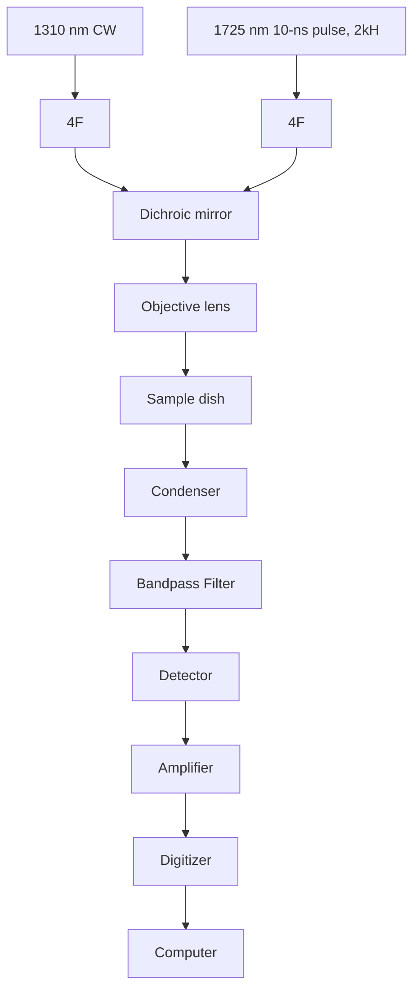
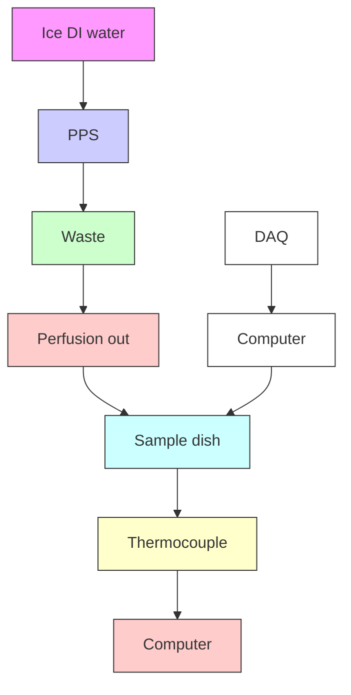

pubs.acs.org/ChemBioImaging

Article

# Background-Suppressed Infrared Photothermal Microscopy at Low Temperature

Thao N. Pham, Jiaze Yin, Yuhao Yuan, Dingcheng Sun, Bethany Weinberg, Hongli Ni, and Ji-Xin Cheng\*

Cite This: https://doi.org/10.1021/cbmi.6c00068

Read Online

ACCESS

Metrics & More

Article Recommendations

Supporting Information

ABSTRACT: The short-wave infrared region provides reduced scattering and improved penetration depth compared to visible and near-infrared wavelengths. However, strong water absorption across this spectral window generates background signals that limit the contrast and obscure weak biomolecular features. To address this challenge, we implement a low-temperature approach that exploits the temperature dependence of the water photothermal response to suppress background while preserving lipid-derived signals in photothermal microscopy. Sample cooling during imaging enhanced the signal-tobackground ratio (S/B) by up to 5.5-fold in cellular imaging and improved the contrastto-noise ratio (CNR) of weak lipid features by up to 1.6-fold at greater tissue depths, enabling reliable volumetric imaging in complex biological systems. We further show that a low-temperature approach is also applicable to mid-infrared photothermal microscopy, thus providing an effective means to enhance the photothermal contrast of aqueous specimens.

KEYWORDS: photothermal, short-wave infrared, mid-infrared, temperature, infrared spectroscopy

## 1. INTRODUCTION

The shortwave infrared (SWIR) window, typically between 1000 to 2000 nm, offers an optical window with significantly reduced photon scattering and minimal tissue autofluorescence compared to the visible and near-infrared regions.1,2 A variety of imaging strategies have been developed to harness these advantages. SWIR fluorescence imaging leverages penetration depth for tumor detection,3 whereas broader applications are limited by the biocompatible fluorophores that emit efficiently in the SWIR region. Importantly, the SWIR region provides access to overtone and combination vibrational modes of molecular bonds, presenting a unique opportunity for label-free deep imaging. SWIR spectroscopy and microscopy have garnered increasing attention for applications in deep-tissue biomedical imaging, including chemical mapping,4 tumor visualization 5- -8 and functional imaging.9 −11 However, direct SWIR imaging relies on negative contrast, where increased absorption from molecular bonds leads to decreased signal intensity, as described by the Beer−Lambert law.12,13 This absorption-based contrast is fundamentally limited by the strong background signal from water, which exhibits broad absorption across the SWIR spectrum and can mask weaker endogenous vibrational signals, reduce chemical specificity, and limit the imaging depth.

To mitigate the direct contribution of water absorption, infrared photothermal microscopy was recently developed as an alternative to conventional absorption-based detection.14 SWIP is a label-free pump−probe imaging technique that indirectly measures absorption by the photothermal effect. Specifically, a pulsed laser selectively excites certain chemical bonds in the target molecule, generating heat that increases the local temperature, which causes a change in the refractive index (RI) of the surrounding environment, detected by a probe beam. SWIP enables imaging depths of up to 1 mm while maintaining micrometer-scale resolution.14,15 This depth-resolution balance makes SWIP well-suited for resolving submicrometer structures in complex thick biological samples.

Even with the excitation wavelength tuned to the resonant absorption peaks of target biomolecules, cumulative water absorption increases with depth, overwhelming weak biomolecular signals, and ultimately reducing contrast and sensitivity in deeper layers. To solve the residual water background issue in photothermal imaging, a time-resolved measurement is proposed. By leveraging the thermal decay differences, biomolecules such as proteins and lipids can be separated from wate r.14,16,17 Although contrast is enhanced, this approach still measures the induced water photothermal signal and requires time-intensive postprocessing.

We notice that liquid water molecules exhibit a unique property: the density reaches a maximum around 4 °C.18 8 This phenomenon was explored in optoacoustic spectroscopy,19,20

Received: March 18, 2026

Revised: May 7, 2026

Accepted: May 8, 2026

(a)  

text_image

β_lipid ≈
β_water ↑
At ambient T

(d)  

line chart

| Time (μs) | Sum PT signal at room T | Lipid PT at room T | Bkg PT at room T |
| --------- | ------------------------ | ------------------ | ---------------- |
| 0         | 0.4                      | 0.2                | 0.2              |
| 5         | 0.1                      | 0.05               | 0.1              |
| 10        | 0.05                     | 0.0                | 0.05             |

(b)  

chemical

Diagram illustrating β_lipid and β_water states at low temperature (10°C-14°C)

(c)  

line chart

| Condition | Background PT | Lipid PT | S/B   |
| --------- | ------------- | -------- | ----- |
| 0°C       | Low           | Medium   | High  |
| low T     | Medium        | Medium   | Medium|
| ambient T | High          | High     | Low   |

(e)  

line chart

| Time (μs) | sum PT signal at low T | Lipid PT at low T | Bkg PT at low T |
| --------- | ---------------------- | ----------------- | --------------- |
| 0         | 0.35                   | 0.25              | 0.1             |
| 2         | 0.15                   | 0.05              | 0.08            |
| 4         | 0.08                   | 0.02              | 0.05            |
| 6         | 0.05                   | 0.01              | 0.03            |
| 8         | 0.03                   | 0.005             | 0.02            |
| 10        | 0.02                   | 0.002             | 0.01            |

Figure 1. Principle of low-temperature photothermal spectroscopy. (a) Particles and water PT response at ambient temperature. (b) Particles and water PT response at low temperature. (c) Conceptual illustration of the temperature dependence of the SWIP signal S/B. (d, e), Simulated SWIP traces and their components at ambient and low temperature, respectively, corresponding to the gray dashed line in (c). Red line represents the raw SWIP signal, which can be decomposed into two components based on their distinct thermal decay profiles: a fast decay for the lipid signal (yellow) and a slow decay for the water signal (blue). At low temperatures, water signals are suppressed while lipid signals persist, resulting in a lower total PT intensity but improved S/B. PT: photothermal. ≈: unchanged.

where water becomes optoacoustically mute at $4 ^ { \circ } \mathrm { C } .$ . Since the photothermal contrast originates from changes in RI, which is closely related to density, we report an effective strategy for background suppression in photothermal imaging by lowering the temperature of the sample to near $4 ~ ^ { \circ } \mathrm { C }$ . We hypothesized that reducing the sample temperature would suppress the nonspecific water background, thereby improving signal-to background ratio (S/B) and contrast-to-noise ratio (CNR), even in deep layers of volumetric samples. To test our hypothesis, we built a perfusion system into the microscope to cool down sample dishes and performed low-temperature SWIP imaging. We validated this approach across a range of biological models, including cultured cells, live C. elegans, and tissues sections. In all cases, our approach selectively minimizes water contributions while preserving the vibrational contrast of target biomolecules in the SWIR region.

After validating the ability to reduce water background using low temperature, we further extended this strategy into the mid infrared region, where vibrational features are more chemically informative but water-induced background is more severe. In that case, we achieved up to 2.8-fold improvement in S/B for cells in PBS when imaging the amide-I band, which spectrally overlaps with the water O−H bending mode.

## 2. TEMPERATURE DEPENDENCY OF OPTICALLYDETECTED PHOTOTHERMAL SIGNAL

Theoretically, the SWIP signal is measured as the modulated probe power $\Delta P _ { \mathrm { p r } }$ and can be described $\mathsf { a s } ^ { 2 1 }$

$$
\Delta P _ {\mathrm{pr}} \propto \Delta T \cdot \beta \cdot P _ {\mathrm{pr}} \tag {1}
$$

where ΔT is the temperature change due to photon absorption, $\beta$ is the thermo-optic coefficient, and $P _ { \mathrm { p r } }$ is the power of the probe beam. The thermo-optic coefficient $\beta$ characterizes how sensitively the RI change (∂n) responds to the temperature change (∂T) 22 $( { \dot { \partial } } T ) ^ { 2 2 }$

$$
\beta = \frac {\partial n}{\partial T} \tag {2}
$$

To further understand how RI responds to temperature, we consider the simplified Lorentz−Lorenz equation, which relates the refractive index (n) to the density $( \rho ) ^ { \ \ S 3 - 2 5 }$

$$
\frac {n ^ {2} - 1}{n ^ {2} + 2} = L \rho \tag {3}
$$

where L is the Lorentz−Lorenz coefficient, which depends on the polarizability of the molecule and remains constant within our studied temperature range.26 Then, by taking the derivative and simplifying the equation (supplementary S2), we have the relationship

$$
\frac {\partial n}{\partial T} \propto \frac {\partial \rho}{\partial T} \tag {4}
$$

By relating $\left( \mathrm { { e q } ~ 4 } \right)$ to $\left(  \mathrm { e q } \ 2 \right)$ and (eq 1), the thermo-optic coefficien $\beta ^ { \mathrm { \backslash } }$ and the SWIP intensity $\Delta P _ { \mathrm { p r } }$ are directly governed by how density changes (∂ρ) with temperature.

$$
\beta \propto \frac {\partial \rho}{\partial T} \tag {5}
$$

In SWIP imaging, we detect PT signal from lipid particles, while water mostly contributes to the background signal. We then have

$$
\Delta P _ {\text { lipid }} \propto \Delta T _ {\text { lipid }} \cdot \beta_ {\text { lipid }} \cdot P _ {\text { pr }} \tag {6}
$$

$$
\Delta P _ {\text { water }} \propto \Delta T _ {\text { water }} \cdot \beta_ {\text { water }} \cdot P _ {\text { pr }} \tag {7}
$$

Therefore, the signal-to-background ratio (S/B) in SWIP imaging is defined as the ratio of $\Delta P _ { \mathrm { l i p i d } }$ and $\Delta P _ { \mathrm { w a t e r } }$

$$
S / B = \frac {\Delta P _ {\text {lipid}}}{\Delta P _ {\text {water}}} = \frac {\Delta T _ {\text {lipid}} \cdot \beta_ {\text {lipid}}}{\Delta T _ {\text {water}} \cdot \beta_ {\text {water}}} \tag {8}
$$

(a)  

flowchart

(b)  

flowchart

Figure 2. Schematic of a low-temperature shortwave infrared photothermal (SWIP) imaging system. $\ l ( \mathfrak { a } )$ Schematic of the SWIP microscope used for photothermal imaging. (b) An independent temperature regulation setup used to cool the sample during low-temperature experiments. PPS: peristaltic perfusion system, DAQ: data acquisition.  
(a)  

line chart

| Time (μs) | 44.0°C | 35.7°C | 28.4°C | 21.4°C | 19.4°C | 16.9°C | 12.0°C | 8.9°C |
|-----------|--------|--------|--------|--------|--------|--------|--------|-------|
| 0         | 1.0    | 0.9    | 0.8    | 0.6    | 0.5    | 0.4    | 0.3    | 0.2   |
| 2         | 0.9    | 0.8    | 0.7    | 0.5    | 0.4    | 0.3    | 0.2    | 0.1   |
| 4         | 0.8    | 0.7    | 0.6    | 0.4    | 0.3    | 0.2    | 0.1    | 0.05  |
| 6         | 0.7    | 0.6    | 0.5    | 0.3    | 0.2    | 0.1    | 0.05   | 0.02  |
| 8         | 0.6    | 0.5    | 0.4    | 0.2    | 0.1    | 0.05   | 0.02   | 0.01  |
| 10        | 0.5    | 0.4    | 0.3    | 0.1    | 0.05   | 0.02   | 0.01   | 0.005 |

(b)  

scatterplot

| Temperature (°C) | Mean Intensity (V) |
| ---------------- | ------------------ |
| 10               | 0.2                |
| 20               | 0.6                |
| 30               | 0.8                |
| 40               | 1.0                |

natural_image

Thermal or intensity map image showing a bright central peak with a dashed diagonal line and a green square marker, labeled (c) at top left.

(e)  

line chart

| Intensity (V) | 12.6°C Time (μs) | 20.1°C Time (μs) |
| ------------- | ---------------- | ---------------- |
| 0.0           | 0.0              | 0.0              |
| 0.1           | 3.5              | 3.5              |
| 0.2           | 7.0              | 7.0              |
| 0.3           | 6.5              | 6.5              |
| 0.4           | 6.0              | 6.0              |
| 0.5           | 5.5              | 5.5              |
| 0.6           | 5.0              | 5.0              |
| 0.7           | 4.5              | 4.5              |
| 0.8           | 4.0              | 4.0              |
| 0.9           | 3.5              | 3.5              |
| 1.0           | 3.0              | 3.0              |

(f)  

line chart

| Time (μs) | Signal at 20.1°C | Bkg at 20.1°C |
| --------- | ---------------- | ------------- |
| 0         | 0.8              | 0.2           |
| 5         | 0.3              | 0.05          |
| 10        | 0.1              | 0.01          |

text_image

(d)
12.6°C
0
1.2

(g)  

line chart

| Time (μs) | Signal at 12.6°C | Bkg at 12.6°C |
| --------- | ---------------- | ------------- |
| 0         | 0.7              | 0.05          |
| 5         | 0.2              | 0.02          |
| 10        | 0.05             | 0.01          |

Figure 3. Low-temperature SWIP suppresses the background signal. (a) SWIP trace of DI water measured at different temperatures. (b) Linear fit of mean SWIP intensity from DI water $\overline { { ( } } \bar { N } = 2 5 0 0 )$ as a function of temperature. $( \mathbf { c } , \mathbf { d } )$ SWIP images of 2 μm polystyrene beads in DI water acquired at 20.1 and $1 2 . 6 ^ { \circ } \mathrm { C } ,$ respectively. Scale bar: 2 μm. (e) Intensity profiles along the dashed lines in panels (c) and (d). (f), (g) Mean SWIP traces of ROI of the bead shown in (c) and (d), corresponding to their respective temperatures.

$\beta _ { \mathrm { w a t e r } }$ becomes smaller as the water density reaches the inflection point at 4 $^ { \circ } C , ^ { 1 8 , 2 7 }$ while $\beta _ { \mathrm { l i p i d } }$ is unchanged28 (Figure 1a, b). Figure 1c provides a conceptual illustration of this temperature-dependent relationship, showing that cooling reduces the water background photothermal signal while relatively preserving the lipid signal, thereby increasing the signal-to-background ratio (S/B). Figure 1d and e shows representative stimulated SWIP traces acquired under ambient and low-temperature conditions. The raw SWIP signal, shown as a red solid line, can be decomposed into two components based on their distinct thermal decay profiles.14 The first component, attributed primarily to the water background, exhibits a slower thermal decay, shown as the blue solid line. The second component, representing the lipid signal, displays a faster decay, shown as the yellow solid line. Upon lowering the sample temperature, the photothermal signal from water is significantly suppressed, while the lipid signal remains detectable. These simulations led us to hypothesize that photothermal imaging at low temperatures can enhance the $\mathtt { S / B }$ by selectively suppressing the water-derived background.

text_image

(a) 14.7°C
0.8
0
50 µm

natural_image

Microscopic image of a material surface at 21.3°C, showing granular texture with two highlighted square regions and a 50 μm scale bar (no text or symbols beyond labels)

natural_image

Microscopic image of cellular or material structure at 39.9°C, with scale bar indicating 50 μm (no text or symbols beyond labels)

line chart

| Time (μs) | Lipid PT | Bkg PT |
| --------- | -------- | ------ |
| 0         | 0.7      | 0.1    |
| 2         | 0.4      | 0.08   |
| 4         | 0.3      | 0.06   |
| 6         | 0.25     | 0.05   |
| 8         | 0.2      | 0.04   |
| 10        | 0.18     | 0.03   |

line chart

| Time (μs) | Lipid PT | Bkg PT |
| --------- | -------- | ------ |
| 0         | 0.7      | 0.25   |
| 2         | 0.45     | 0.2    |
| 4         | 0.35     | 0.15   |
| 6         | 0.28     | 0.12   |
| 8         | 0.22     | 0.1    |
| 10        | 0.18     | 0.09   |

line chart

| Time (μs) | Lipid PT | Bkg PT |
| --------- | -------- | ------ |
| 0         | 0.78     | 0.40   |
| 2         | 0.55     | 0.32   |
| 4         | 0.45     | 0.26   |
| 6         | 0.38     | 0.22   |
| 8         | 0.32     | 0.18   |
| 10        | 0.28     | 0.15   |

Figure 4. Temperature-controlled SWIP imaging of U-87 MG cells treated with 100 μM OA. (a−c), SWIP images of U-87 cells acquired at $1 4 . 7 \ ^ { \circ } \mathrm { C } ,$ $2 1 . 3 ^ { \circ } \mathrm { C } , 3 9 . 9 ^ { \circ } \dot { \mathrm { C } }$ , respectively. Scale bar: 50 μm. (d−f), SWIP traces from lipid-rich regions and background areas corresponding to the temperatures in (a-c).

## 3. LOW-TEMPERATURE SHORTWAVE INFRAREDPHOTOTHERMAL IMAGING SYSTEM

Our setup integrates the SWIP microscope (Figure 2a) and a low-temperature regulation system (Figure 2b), which operate simultaneously. The SWIP microscope enables chemica imaging, while the temperature regulation system maintains a stable, low temperature within the sample dish. The SWIP microscope operates with a pump−probe configuration (Figure 2a). A 1725 nm pulsed laser is used as the excitation source to target the first overtone absorption of carbon−hydrogen (C−H) vibrational modes, while a 1310 nm continuous-wave laser serves as the probe beam. The excitation and probe beams are spatially overlapped and focused into the sample, where absorption by specific molecular bonds induces localized heating and results in a thermo-optic effect, which alters the RI and forms a transient microlens that perturbs the propagation of the probe beam. This modulation of the probe is detected through a small aperture placed at the back focal plane of the condenser, enabling the sensitive detection of the photothermal signal.

A peristaltic perfusion system (PPS2, MultiChannel Systems) was used to lower the sample temperature by continuously circulating an ice water/solution through the imaging chamber (Figure 2b). While the system does not provide active temperature control, it enables passive cooling of the sample without disturbing the optical setup. A T-type thermocouple thermal sensor was positioned near the imaging area to monitor the temperature in real time. Imaging was performed once the temperature reached a stable level. The temperature reachable with perfusion ranged from 10 to $1 4 ^ { \circ } \mathrm C ,$ which was the practical lower limit of the current cooling system. The exact temperature that can be reached depends on the ambient temperature in a specific day. To reach higher than ambient temperature, we replaced warm solution to ice solution in the perfusion system.

## 4 RESULTS

## 4.1. Performance of Low-Temperature SWIP Spectroscopy and Microscopy

With the temperature-controlled SWIP system built, we first characterized the temperature-dependent behavior of PT signals from DI water. Raw time-dependent SWIP traces of water acquired at different temperatures reveal a decrease in the SWIP intensity with decreasing temperature (Figure 3a). We then computed the mean SWIP intensity across 2500 traces (Figure 3b) and observed a linear temperature dependence $\left( \mathbb { R } ^ { 2 } > 0 . { \overset { \smile } { 9 } } 5 \right)$ , which is consistent with our theoretical framework presented in eq 7.

To evaluate the extent of water background reduction in imaging, we examined $2 \mu \mathrm m$ polystyrene beads suspended in DI water under two temperature conditions: ambient temperature $\left( 2 0 . 1 ~ ^ { \circ } \mathrm { C } \right)$ and low temperature $\left( 1 2 . 6 ~ ^ { \circ } \mathrm { C } \right)$ (Figure 3c and 3d, respectively). Lateral profiles of a single bead (Figure 3e) revealed a decrease in both the SWIP signal and background at low temperature. To further quantify this effect, we plotted the mean SWIP traces from polystyrene and water-rich regions of interest (ROIs) at ambient temperature (Figure 3f) and low temperature (Figure 3g). Although both the signal and background decrease with cooling, imaging at low temperature improves S/B by 2.3-fold compared to ambient temperature.

scatterplot

| Temperature | Z (μm) | Distance (μm) | Intensity (V) |
| ----------- | ------ | ------------- | ------------- |
| 20.0        | 95     | 0             | 0.5           |
| 20.0        | 95     | 50            | 0.3           |
| 20.0        | 95     | 100           | 0.4           |
| 20.0        | 105    | 0             | 0.2           |
| 20.0        | 105    | 50            | 0.1           |
| 20.0        | 105    | 100           | 0.2           |
| 20.0        | 120    | 0             | 0.1           |
| 20.0        | 120    | 50            | 0.2           |
| 20.0        | 120    | 100           | 0.3           |
| 11.6        | -      | 0             | 0.1           |
| 11.6        | -      | 50            | 0.2           |
| 11.6        | -      | 100           | 0.4           |
| 11.6        | -      | -             | 0.3           |
| 11.6        | -      | -             | 0.2           |
| 11.6        | -      | -             | 0.1           |
| 11.6        | -      | -             | 0.2           |
| 11.6        | -      | -             | 0.3           |
| 11.6        | -      | -             | 0.4           |
| 11.6        | -      | -             | 0.5           |
| 11.6        | -      | -             | 0.6           |
| 11.6        | -      | -             | 0.7           |
| 11.6        | -      | -             | 0.8           |
| 11.6        | -      | -             | 0.9           |
| 11.6        | -      | -             | 1.0           |

Figure 5. SWIP imaging of a mouse ear tissue at two temperature conditions. (a) SWIP image of a sebaceous gland in the mouse ear acquired at ambient temperature $( 2 \mathsf { 0 } . 0 ^ { \circ } \mathrm { C } )$ . (b) SWIP image of the same region acquired at low temperature $\left( 1 1 . 6 ^ { \circ } \mathrm { C } \right)$ . Scale bar: 20 μm. (c) Intensity profiles along the dashed line in (a) and (b), extracted at imaging depth $\mathrm { Z } = 1 2 0 \mu \mathrm { m } .$

text_image

(a)
T = 22.4 °C
#1
#2
0.6
0.3

text_image

(b)
T = 11.4 °C
#1
#2
0.4
0.1

line chart

| Pixel# | Signal at 22.4°C | Signal at 11.4°C |
| ------ | ---------------- | ---------------- |
| 1      | 0.45             | 0.27             |
| 21     | 0.48             | 0.26             |
| 41     | 0.50             | 0.28             |
| 61     | 0.52             | 0.35             |
| 81     | 0.45             | 0.30             |
| 101    | 0.40             | 0.22             |
| 121    | 0.38             | 0.20             |

line chart

| Pixel# | Signal at 22.4°C | Signal at 11.4°C |
| ------ | ---------------- | ---------------- |
| 0      | 0.4              | 0.2              |
| 20     | 0.5              | 0.3              |
| 40     | 0.6              | 0.4              |
| 60     | 0.7              | 0.5              |
| 80     | 0.4              | 0.2              |
| 100    | 0.4              | 0.1              |
| 120    | 0.4              | 0.1              |

Figure 6. Low-temperature mid-infrared photothermal (MIP) imaging of U87 MG cells. (a,b) MIP images of cells acquired at $2 2 . 4 { \ ^ { \circ } \mathrm { C } } , 1 1 . 4 { \ ^ { \circ } \mathrm { C } } ,$ respectively, while exciting the amide-I band $\left( 1 6 5 0 \thinspace { \mathrm { c m } } ^ { - 1 } \right)$ . (c) Average signal extracted from ROI #1 in the cytoplasm at two temperature conditions. (d) Intensity profile along ROI #2 across the cell nucleus at two temperature conditions. Scale bar: 20 μm.

## 4.2. Temperature-Controlled SWIP Imaging of U87 Cells

With the method established, we then evaluated the contrast dependence on temperature in a cellular imaging experiment. We imaged U-87 MG cells under varying temperature conditions after treatment with 100 μM oleic acid for 24 h to increase lipid droplet content. During imaging, we observed a shift in the focal plane across different temperatures attributed to the temperature dependence of the refractive index (RI), which alters the optical path length (OPL). To ensure accurate comparison across conditions, the focal plane was manually adjusted for each temperature setting (Figure S1). As demonstrated in Figure 4a−c, progressive cooling from 39.9 to $2 1 . 3 \mathrm { ~ \ } ^ { \circ } \mathrm { C }$ and finally to $1 4 . 7 ~ ^ { \circ } \mathrm { C }$ resulted in dramatic background suppression while preserving lipid-rich cellular features. Signal-to-background (S/B) ratios show that reducing sample temperature from 39.9 to 21.3 °C improves the ratio by

1.6-fold, with further cooling to $1 4 . 7 ~ ^ { \circ } \mathrm { C }$ achieving a 5.5-fold enhancement. Time-domain SWIP traces (Figure 4d−f) revealed the underlying mechanism: while the background photothermal signal from water decreased by 1.5-fold and 4-fold at 21.3 and $1 4 . 7 ^ { \circ } \mathrm { C } ,$ respectively (relative to $3 9 . 9 ^ { \circ } \mathrm { C } )$ , the lipidassociated photothermal signal remained remarkably stable across all temperatures. This temperature-dependent back ground suppression enables enhanced visualization of lipid distributions in vivo cell culture.

## 4.3. Low-Temperature versus Ambient Temperature SWIP Imaging of 3D Specimens

To assess the impact of temperature on deep tissue imaging contrast, we acquired SWIP images of a mouse ear tissue at various depths, focusing on a sebaceous gland (Figure 5). At ambient temperature (Figure 5a), strong background signals obscure the gland boundary, especially at greater depths, where the weak lipid signal becomes comparable to the background. In contrast, low-temperature imaging (Figure 5b) enhances the visibility of these structures by effectively suppressing background, resulting in clearer gland boundaries. The contrast-tonoise ratio (CNR), defined as the difference between the mean signal intensity and the mean background intensity divided by the standard deviation of the background, increases for a lowlipid ROI showed an increase from 0.4 to 2.0 at $Z = 9 5 \mu \mathrm { m } ,$ , from 0.9 to 1.9 at Z = 105 μm, and from 0.5 to 1.8 at $Z = 1 2 0 \mu \mathrm { m }$ under cooling. These results demonstrate that lowering temperature significantly enhances the contrast of weak lipid signals deep in tissue. Lateral intensity profiles (Figure 5c, top panels) further illustrate improved separation between the gland and the background under low-temperature conditions.

## 4.4. Low-Temperature MIP Imaging Suppresses Background in the Fingerprint Window

To demonstrate that low-temperature background suppression is a generalizable strategy across photothermal imaging platforms, we extend our approach to mid-infrared photothermal (MIP) microscopy, where the water background is severe for samples in an aqueous environment. The mid-infrared (MIR) region contains richer molecular information than the shortwave infrared regime, for example, by exciting the amide-I band, the MIR spectrum can detect subtle protein secondary structures. However, due to the strong and overlapping absorption of water at $1 6 5 0 ~ \mathrm { { c m } ^ { - 1 } }$ , high contrast MIP imaging of proteins is typically achieved only by substituting $_ { \mathrm { H } _ { 2 } \mathrm { O } }$ based PBS with $\mathrm { D } _ { 2 } \mathrm { O }$ one, making it hardly be applied in living cells. Here, by implementing the low-temperature strategy, we have improved the SBR by 2.8-fold in amide-I band imaging of cells in phosphate-buffered saline (PBS).

For performing this low-temperature MIP imaging, we integrated the same temperature regulation setup above with a counter-propagating MIP microscope. In this experiment, we imaged U-87 MG cells in PBS under two temperature conditions, which are ambient temperature $( 2 2 . 4 ^ { \circ } \mathrm { C } )$ and low temperature $( 1 1 . 4 ^ { \circ } \mathrm { C } )$ , while targeting the amide-I vibrational band at $1 6 5 0 ~ \mathrm { { c m } ^ { - 1 } }$ . The focal plane was manually adjusted between two temperature conditions.

At ambient temperature, cellular protein contents show minimal contrast (Figure 6a) as the MIP signal is dominated by water background arising from overlap between amide-I absorption and the O−H bending mode of water. By cooling to $1 1 . { \overset { - } { 4 } } \ { } ^ { \circ } \mathrm { C } ,$ , the cell contrast is markedly enhanced (Figure 6b), with water the background reduced approximately by half. As a result, subcellular features become clearly visible, including the nucleus, which is known as protein aggregation. The MIP signal profile analysis across the cytoplasm and nucleus reveals 2.6-fold and 2.8-fold improvements in ${ \bf { \bar { S } } } / { \bf B } ,$ respectively, when lowering the temperature from 22.4 to $1 1 . 4 ^ { \circ } \mathrm { C }$ (Figure 6c, d). Together, these data show effective background suppression in MIP microscopy by lowering the imaging temperature.

## 5. CONCLUSION AND DISCUSSION

Our findings demonstrate that low-temperature measurements in SWIP microscopy effectively reduce water-induce background, thereby enhancing the contrast and visibility of weak photothermal signals, particularly at deeper layers in 3D biological samples. By lowering the sample temperature using a perfusion system, we achieved substantial improvements in the signal-to-background ratio (S/B) and contrast-to-noise ratio (CNR) across multiple model systems, confirming the broad applicability of this approach for high-contrast, label-free imaging in depth-resolved applications.

This advantage is particularly important because, in previously reported 3D SWIP imaging,14 the raw signal at each pixel is assumed to contain both the desired SWIP signal and background contributions. To improve the S/B in thick biological samples, pixel-wise postprocessing is therefore required. In particular, the temporal trace at each pixel is fitted with a biexponential model, and the component with the slower photothermal decay is subtracted as background, as described in ref. 14. Although this approach can improve SBR, it is computationally intensive, and the decay threshold used to distinguish SWIP signal from background is image-dependent rather than universal. In contrast, the low-temperature approach selectively suppresses the water-induced background at the source, thereby enhancing SBR without the need for postacquisition data processing.

Beyond SWIP, the verified temperature dependency of the water photothermal signal provides foundations for developing further background reduction techniques in other types of photothermal microscopes. This concept is particularly valuable in mid-infrared photothermal microscopy, where the water absorption is a significant source of background, especially in the amide I band region and in the spectrally silent window.2

We also found that it does not improve the limit of detection in photothermal spectroscopy of liquid specimens (Supporting Information $S 4 , { \bar { \mathrm { F i g u r e } } } \ S 2 { \bar { ) } }$ . In homogeneous liquid systems such as $\mathrm { D } _ { 2 } \mathrm { O } / \mathrm { D M } \bar { \mathrm { S } } \mathrm { O }$ mixtures, cooling reduces the photothermal responses of both the solvent and solute simultaneously, resulting in a uniform decrease in the overall SWIP signal rather than selective background suppression. This observation highlights that the benefit of low-temperature operation primarily arises in heterogeneous samples, such as cells or tissues, where differential thermal responses between water and biomolecular components can be exploited to enhance contrast.

While our temperature-control approach enhances the photothermal contrast, there is space to improve. First, as noted above, $1 0 { - } 1 4 ~ ^ { \circ } \mathrm { C }$ represents the practical lower limit of the current cooling system. However, based on the temperature dependence of water’s refractive index reported by Tilton and $\mathrm { T a y l o r } , ^ { 2 9 }$ the change in water RI becomes very small $\mathsf { b e l o w } 4 ^ { \circ } \mathrm { C } .$ Therefore, we expect that achieving stable sample temperatures closer to $4 ^ { \circ } \mathrm { C }$ could further suppress the water background and improve the image contrast. Second, the current setup lacks precise temperature control; integrating active temperature regulation would enable more stable and tunable temperatureimaging conditions. A more precise and stable controlled temperature imaging experiment can be designed by employing a thermoelectric cooler with feedback. Additionally, the development of a temperature-stabilized SWIP system will allow broader applications, including high-resolution chemical mapping in intact 3D tissues, and quantitative studies of temperature-sensitive biomolecular dynamics. Future works could explore SWIP imaging of proteins via the N−H vibration band, which strongly overlaps with water absorption and would benefit from this background suppression approach.

We note that lowering the temperature for a long period would alter cell metabolism. This method is suitable for fixed cells, fresh-frozen tissues, or immediate measurements of live cells. Meanwhile, in model organisms such as C. elegans and zebrafish embryos, mild cooling reduces motion artifacts and photothermal damage, extending imaging durations withou compromising viability. With attempting to apply the lowtemperature strategy for the 3D model like C. elegans, lowtemperature SWIP significantly suppresses background and enhances contrast at increasing depths, enabling the visualization of weak lipid droplets that are otherwise obscured at ambient temperature, particularly in deeper layers (Supporting Information S5, Figure S3).

## ASSOCIATED CONTENT

## Data Availability Statement

All data in the main text and the supplementary are available via GitHub (https://github.com/pnnthao-cloud/Background suppressed-Infrared-Photothermal-Microscopy-at-Low-Temperature).

## \*sı Supporting Information

The Supporting Information is available free of charge at https://pubs.acs.org/doi/10.1021/cbmi.6c00068.

The SWIP and MIP microscope configurations, temper ature-controlled imaging using a TEC feedback system, and cell/tissue preparation methods. It presents a theoretical framework linking photothermal signal to temperature-dependent refractive index changes. Additional experiments show temperature-induced focal shifts, evaluate detection limits in DMSO/D2O solutions, and demonstrate improved contrast and deeper imaging in C. elegans at low temperatures due to effective background suppression (PDF)

## AUTHOR INFORMATION

## Corresponding Author

Ji-Xin Cheng − Department of Biomedical Engineering, Department of Electrical & Computer Engineering, and Graduate Program of Molecular Biology, Cell Biology, and Biochemistry, Boston University, Boston, Massachusetts 02215, United States; Photonics Center, Boston, Massachusetts 02215, United States; orcid.org/0000-0002-5607-6683; Email: jxcheng@bu.edu

## Authors

Thao N. Pham − Department of Biomedical Engineering, Boston University, Boston, Massachusetts 02215, United States; orcid.org/0009-0005-5579-1721  
Jiaze Yin − Department of Electrical & Computer Engineering, Boston University, Boston, Massachusetts 02215, United States; orcid.org/0000-0001-6080-3073

Yuhao Yuan − Department of Electrical & Computer Engineering, Boston University, Boston, Massachusetts 02215, United States; Photonics Center, Boston, Massachusetts 02215, United States

Dingcheng Sun − Department of Biomedical Engineering, Boston University, Boston, Massachusetts 02215, United States

Bethany Weinberg − Graduate Program of Molecular Biology, Cell Biology, and Biochemistry, Boston University, Boston, Massachusetts 02215, United States

Hongli Ni − Department of Electrical & Computer Engineering, Boston University, Boston, Massachusetts 02215, United States; orcid.org/0000-0003-4323-1493

Complete contact information is available at: https://pubs.acs.org/10.1021/cbmi.6c00068

## Author Contributions

T.N.P. conducted experiments, processed the SWIP data, helped with building PT temperature dependency theorical equation, performed experiments, and drafted the paper. J.Y. conducted the PT temperature dependency theorical equation built the temperature regulation system, collected and processed MIP data and was involved in manuscript writing and editing. Y.Y. and H.N. built the SWIP microscope. D.S. performed cell culture, treatment, and sample preparation, and was involved in manuscript writing and editing. B.W. performed all worm culture and sample preparation, as well as assisting with manuscript writing and editing. J.X.C. initiated the project, revised the manuscript, and provided scientific guidance. All authors revised the manuscript. T.P. and J.Y. contributed equally to this work.

## Notes

The authors declare no competing financial interest.

## ACKNOWLEDGMENTS

This work is supported by National Institute of General Medical Sciences under grant R35GM136223 to J.X.C. All images and artwork included in this manuscript and the Supporting Information were generated by the authors and do not contain copyrighted third-party material.

## REFERENCES

(1) Ben-Dor, E.; Inbar, Y.; Chen, Y. The Reflectance Spectra of Organic Matter in the Visible Near-Infrared and Short Wave Infrared Region (400−2500 Nm) during a Controlled Decomposition Process. Remote Sens. Environ. 1997, 61 (1), 1−15.  
(2) Hansen, M. P.; Malchow, D. S. Overview of SWIR Detectors, Cameras, and Applications. Thermosense SPIE 2008, 6939, 94−104.  
(3) Tsuboi, S.; Jin, T. Shortwave-Infrared (SWIR)Fluorescence Molecular Imaging Using Indocyanine Green−Antibody Conjugates for the Optical Diagnostics of Cancerous Tumours. RSC Adv. 2020, 10 (47), 2817128179.  
(4) Feng, J.; Rogge, D.; Rivard, B. Comparison of Lithological Mapping Results from Airborne Hyperspectral VNIR-SWIR, LWIR and Combined Data. International JoInt. J. Appl. Earth Obs. Geoinf. 2018, 64, 340−353.  
(5) O’Sullivan, T. D.; Leproux, A.; Chen, J.-H.; Bahri, S.; Matlock, A.; Roblyer, D.; McLaren, C. E.; Chen, W.-P.; Cerussi, A. E.; Su, M.-Y.; Tromberg, B. J. Optical Imaging Correlates with Magnetic Resonance Imaging Breast Density and Reveals Composition Changes during Neoadjuvant Chemotherapy. Breast Cancer Res. 2013, 15 (1), R14.  
(6) Torjesen, A.; Istfan, R.; Roblyer, D. Ultrafast Wavelength Multiplexed Broad Bandwidth Digital Diffuse Optical Spectroscopy for in Vivo Extraction of Tissue Optical Properties. J. Biomed. Opt. 2017, 22 (3), 036009.  
(7) Zhao, Y.; Pilvar, A.; Tank, A.; Peterson, H.; Jiang, J.; Aster, J. C.; Dumas, J. P.; Pierce, M. C.; Roblyer, D. Shortwave-Infrared Meso Patterned Imaging Enables Label-Free Mapping of Tissue Water and Lipid Content. Nat. Commun. 2020, 11 (1), 5355.  
(8) Horton, N. G.; Wang, K.; Kobat, D.; Clark, C. G.; Wise, F. W.; Schaffer, C. B.; Xu, C. In Vivo Three-Photon Microscopy of Subcortical Structures within an Intact Mouse Brain. Nat. Photonics 2013, 7 (3), 205−209.  
(9) Shi, L.; Zheng, C.; Shen, Y.; Chen, Z.; Silveira, E. S.; Zhang, L.; Wei, M.; Liu, C.; de Sena-Tomas, C.; Targoff, K.; Min, W. Optical Imaging of Metabolic Dynamics in Animals. Nat. Commun. 2018, 9 (1), 2995.  
(10) Salinas, C. M.; Reichel, E.; Witte, R. S.Short-Wave Infrared Photoacoustic Spectroscopy for Lipid and Water Detection2021 IEEE International Ultrasonics SymposiumIUS20211−4  
(11) Li, Z.; Huang, S.; He, Y.; Wijnbergen, J.; van, W.; Zhang, Y.; Cottrell, R. D.; Smith, S. G.; Hammond, P. T.; Chen, D. Z.; et al. A New Label-Free Optical Imaging Method for the Lymphatic System Enhanced by Deep Learning. bioRxiv 2023, 523938.  
(12) Swinehart, D. F. The Beer-Lambert Law. J. Chem. Educ. 1962, 39 (7), 333.  
(13) Bigio, I. J.; Fantini, S. Quantitative Biomedical Optics: Theory, Methods, and Applications; Cambridge Texts in Biomedical Engineering; Cambridge University Press, 2016. .  
(14) Ni, H.; Yuan, Y.; Li, M.; Zhu, Y.; Ge, X.; Yin, J.; Dessai, C. P.; Wang, L.; Cheng, J.-X. Millimetre-Deep Micrometre-Resolution Vibrational Imaging by Shortwave Infrared Photothermal Microscopy. Nat. Photonics 2024, 18 (9), 944−951.  
(15) Cheng, J.-X.; Yuan, Y.; Ni, H.; Ao, J.; Xia, Q.; Bolarinho, R.; Ge, X. Advanced Vibrational Microscopes for Life Science. Nat. Methods 2025, 22 (5), 912−927.  
(16) Yin, J.; Lan, L.; Zhang, Y.; Ni, H.; Tan, Y.; Zhang, M.; Bai, Y.; Cheng, J.-X. Nanosecond-Resolution Photothermal Dynamic Imaging via MHz Digitization and Match Filtering. Nat. Commun. 2021, 12 (1), 7097.  
(17) Bolarinho, R.; Yin, J.; Ni, H.; Xia, Q.; Cheng, J.-X. Background Free Mid-Infrared Photothermal Microscopy via Single-Shot Measure ment of Thermal Decay. Anal. Chem. 2025, 97 (8), 4299−4307.  
(18) Kell, G. S. Precise Representation of Volume Properties of Water at One Atmosphere. J. Chem. Eng. Data 1967, 12 (1), 66−69.  
(19) Prakash, J.; Seyedebrahimi, M. M.; Ghazaryan, A.; Malekzadeh-Najafabadi, J.; Gujrati, V.; Ntziachristos, V. Short-Wavelength Optoacoustic Spectroscopy Based on Water Muting. Proc. Natl. Acad. Sci. U. S. A. 2020, 117 (8), 4007−4014.  
(20) Xu, C.; Rassel, S.; Zhang, S.; Aloraynan, A.; Ban, D. Single Wavelength Water Muted Photoacoustic System for Detecting Physiological Concentrations of Endogenous Molecules. Biomed. Opt. Express 2021, 12 (1), 666−675.  
(21) Zhang, D.; Li, C.; Zhang, C.; Slipchenko, M. N.; Eakins, G.; Cheng, J.-X. Depth-Resolved Mid-Infrared Photothermal Imaging of Living Cells and Organisms with Submicrometer Spatial Resolution. Sci. Adv. 2016. 2 (9). No. e1600521.  
(22) Chapter 3 - Thermo-Optic CoefficientsHandbook of Optical Constants of SolidsPalik, E. D.Ed.Academic PressBurlington1997pp. 115−261  
(23) Kragh, H. The Lorenz-Lorentz Formula: Origin and Early History. Substantia 2018, 2 (2), 7−18.  
(24) Weiss, L.; Tazibt, A.; Tidu, A.; Aillerie, M. Water Density and Polarizability Deduced from the Refractive Index Determined by Interferometric Measurements up to 250 MPa. J. Chem. Phys. 2012, 136 (12), 124201.  
(25) Domingo, M.; Luna, R.; Satorre, M. Á.; Santonja, C.; Millán, C. Lorentz−Lorenz Coefficient of Ice Molecules of Astrophysical Interest: N2, CO2, NH3, CH4, CH3OH, C2H4, and C2H6. Astrophys. J. 2021, 906 (2), 81.  
(26) Taylor, M. S.; Becker, M. P. Quantiles of Multi-Sample Smirnov Type Statistics. J. Stat. Comput. Simul. 1982, 16 (1), 25−34.  
(27) Thormählen, I.; Straub, J.; Grigull, U. Refractive Index of Water and Its Dependence on Wavelength, Temperature, and Density. J. Phys. Chem. Ref. Data 1985, 14 (4), 933−945.  
(28) Guillory, J. K. The Merck Index: An Encyclopedia of Chemicals, Drugs, and Biologicals Edited by Maryadele J. O’Neil, Patricia E. Heckelman, Cherie B. Koch, and Kristin J. Roman. Merck, John Wiley & Sons, Inc., Hoboken, NJ. 2006. Xiv + 2564 Pp. 18 × 26 Cm. ISBN-13 978−0-911910−001. \$125.00. J. Med. Chem. 2007, 50 (3), 590−590.  
(29) Tilton, L. W.; Taylor, J. K. Refractive Index and Dispersion of Distilled Water for Visible Radiation, at Temperatures 0 to 60 Degrees C. J. Res. Natl. Bur. Stan. 1938, 20 (4), 419.

natural_image

Microscopic view of red blood cells with visible blood vessels (no text or labels)

CAS BIOFINDER DISCOVERY PLATFORMTM

## CAS BIOFINDER HELPS YOU FIND YOUR NEXT BREAKTHROUGH FASTER

Navigate pathways, targets, and diseases with precision

Explore CAS BioFinder

