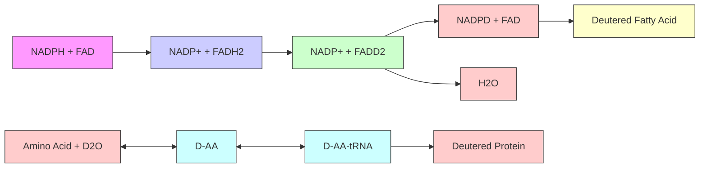

## Research Article

# Blue Light Deactivation of Catalase Suppresses Candida Hyphae Development Through Lipogenesis Inhibition

Sebastian Jusuf†1 , Yuewei Zhan†1 , Meng Zhang2 , Natalie J. Alexander3 , Adam Viens3 , Michael K. Mansour\*3,4 ID and Ji-Xin Cheng\*1,2,5 ID

1 Department of Biomedical Engineering, Boston University, Boston, MA  
2 Department of Electrical & Computer Engineering, Boston University, Boston, MA  
3 Division of Infectious Diseases, Massachusetts General Hospital, Boston, MA  
4 Harvard Medical School, Boston, MA  
5 Photonics Center, Boston University, Boston, MA

Received 8 June 2022, accepted 14 September 2022, DOI: 10.1111/php.13719

## ABSTRACT

Hyphae formation is a key step for fungal penetration into epithelial cells and escaping from macrophages or neutrophils. We found that 405 nm light-induced catalase deactivation results in the inhibition of hyphae growth in Candida albicans. The treatment is capable of inhibiting hyphae growth across multiple hyphae-producing Candida species. Metabolic studies on light-treated C. albicans reveal that light treatment results in a strong reduction in both lipid and protein metabolism. A significant decrease in unsaturated and saturated fatty acids was detected through mass spectroscopy, indicating that the suppression of hyphae through light-induced catalase deactivation may occur through inhibition of lipid metabolism. Initial in vivo tests indicate that blue light treatment can suppress the hyphae forming capabilities of C. albicans within murine abrasion infections. Together, these findings open new avenues for the treatment of Candida fungal infections by targeting their dimorphism.

## INTRODUCTION

Fungal pathogens have emerged as a severe global health risk, estimated to be responsible for over 150 million cases of severe infections and 1.7 million deaths annually (1). One key factor contributing to the rise of fungal infections is the growing population of vulnerable patients, such as the elderly people, immunocompromised and recently hospitalized (2). In the USA alone, the Candida fungal strain is estimated to be the fourth most common cause of bloodstream infections, and Candida albicans alone is estimated to be responsible for 50% to 70% of all candidiasis cases (3,4). Among the various types of Candida infections, skin and dermal infections have been found to be steadily rising over the past 30 years, especially among immunocompromised patients (5). These Candida skin infections are noteworthy due to how they can provide a possible entryway into the bloodstream, resulting in the potential development of invasive candidiasis (6). This overall increase in fungal infections has been further complicated by the growing development of antifungal resistance to all four classes of antifungal drugs (polyenes, azoles, allylamines, and echinocandins), driven in part by the agricultural industry’s overuse of antifungal chemicals and the pharmaceutical industry’s current focus on bacterial antibiotics (7,8). The rise of antifungal resistance can be best seen in the Candida fungal species with the emergence of azole-resistant Candida species alongside multidrug-resistant C. auris (9,10). The development of Candida resistance is especially concerning due to its capability of rendering fungal bloodstream infections more deadly and difficult to treat. Based on the rising trends of Candida infections and the growing risk of emergent antifungal resistance, there exists a critical need for a nonantifungal-reliant method of treating Candida infections.

Like most pathogens, fungi express a wide variety of mechanisms that allow them to increase their virulence and resist attempts by the body’s natural host immune response to eradicate them. Two of the more notable virulence factors include the expression of catalase as well as the ability to transition between a yeast form and filamentous hyphae form (11,12). The first virulence factor, catalase, is one of the most common enzymes expressed within aerobic organisms, playing a key role in protecting cells from oxidative damage by converting H O , one of the reactive oxygen species (ROS: $\mathrm { H } _ { 2 } \mathrm { O } _ { 2 } , \mathrm { O } _ { 2 } \bar { . }$ , and HO ) to oxygen and water (13). This process plays a key role in fungal virulence due to how immune cells such as neutrophils internally release ROS “bursts” to neutralize and kill phagocytosed pathogens such as fungi (14). With the presence of catalase, phagocytosed fungi can survive the initial ROS burst produced by immune cells and provide the survived pathogen with more opportunities to establish infections within a host (11,15). These survival capabilities within a phagocytosed environment can therefore enable an additional second virulence factor exclusive to C. albicans and other select strains of Candida: dimorphism, or the ability to grow as either a unicellular budding yeast form or a filamentous hyphae form (16). This dimorphism plays a key role in the virulence of C. albicans, as hyphae can utilize the mechanical force exerted by polarized hyphae growth to further penetrate deeper into epithelial cells and escape from macrophages or neutrophils following phagocytosis (17–19). In addition, hyphae formation also contributes to the formation of biofilms, further complicating treatment options for fungal skin infections (20). While there exist numerous stimuli capable of stimulating hyphae development in C. albicans such as temperature, serum presence, and pH, the actual morphological transition from yeast to hyphae form has been found to be significantly impacted by lipid biogenesis, with disruptions in sterol or sphingolipid biosynthesis resulting in impaired hyphae growth and polarization (21). Additionally, it has also been found that transition to the hyphae form results in increases in unsaturated fatty acids, indicating that lipogenesis plays a key role in hyphae development (22).

Interestingly, studies have found that both catalase and hyphae development are related, as C. albicans grown on hyphae-inducing media have been found to exhibit increased catalase activity. In addition, C. albicans with double catalase gene disruptions demonstrated suppressed hyphae development (23). This phenomenon can potentially be explained by how C. albicans are known to produce significant amount of ROS during their transition to a hyphal state (24,25). This aspect, coupled with the fact that extracellular $\mathrm { H } _ { 2 } \mathrm { O } _ { 2 }$ is capable of inducing hyphae formation, indicates that ROS presence plays a potential signaling role in hyphae development (26). Catalase has also been found to play a role in certain aspects of lipid metabolism, such as within the fatty acid ß-oxidation pathway in peroxisomes (27). Literature indicates that catalase is also used to protect proteins within the lipid metabolism pathway from damage, as ROS accumulation has been found to result in damage to key proteins involved in yeast lipid metabolism, such as fatty acid synthase (28). Thus, deactivation of catalase can provide a potential avenue for reducing virulence and infectivity of C. albicans, lowering the risk of invasive infection and improving the ability of the immune system to successfully kill engulfed fungi. However, due to the toxic nature of most chemical catalase inhibitors such as potassium cyanide and 3-amino-1,2,4- triazole, alternative solutions to induce catalase deactivation are needed (29,30).

In the past few years, phototherapy treatment via antimicrobial blue light has emerged as a potential method of treating fungal pathogens (31). However, the specific metabolic mechanisms and downstream effects responsible for this phenomenon are still unknown. Recent studies conducted by our team have revealed that catalase within both bacterial and fungal pathogens can be deactivated through exposure to blue light, therefore providing an indirect, non-agent reliant method of deactivating catalase that can sensitize fungal pathogens to external ROS sources (32). Given the relationship between catalase, hyphae development, and lipid metabolism, we hypothesize that exposure to blue light can suppress the formation and development of hyphae in Candida species through disruption of lipid metabolism. By utilizing light to inhibit hyphae formation, we can reduce the survival and invasion capabilities of C. albicans, therefore providing a non-antifungal-reliant method of treating fungal infections.

## MATERIALS AND METHODS

Blue light source. A mounted 405 nm LED (M405L4; ThorLabs, Newton, New Jersey, USA) was attached to a modifiable collimation adapter (SM2F32-A; ThorLabs) and adjusted to focus the fluence region to a \~1 cm square area. Fluence was controlled through a T-Cube LED driver (LEDD1B; ThorLabs), allowing for a wide range of blue light power outputs between 0 and 400 mW cm

Fungal strains and mammalian cells. Wild-type Candida albicans Berkhout (SC5314) was purchased from the American Type Culture Collection (ATCC). Catalase-deficient Candida albicans 2089 (Dcat1) was obtained from Dr. Alistair Brown laboratory at University of Exeter. Far-red fluorescent protein-expressing SC5314 (iRFP C. albicans) was acquired from the Mansour Lab (33). Other dimorphic Candida strains, including Candida tropicalis and Candida dubliniensis, were obtained from clinical isolates following biosafety committee and institutional review board (IRB) approval. For mammalian cells, human neutrophils were isolated from whole blood obtained from healthy donor volunteers consented under a Massachusetts General Hospital Institutional Review Board-approved protocol, while Chinese hamster ovary (CHO) cells were purchased directly from the ATCC.

Candida preparation and catalase deactivation. Candida strains were cultured overnight in yeast extract peptone dextrose (YPD) media at 30°C within either a shaking (200 rpm) or a rotating incubator. Following overnight growth, fungi were resuspended in 19 PBS and quantified through a Luna Automated Cell Counter (L10001; Logos Biosystems, Anyang, South Korea). For light-induced catalase deactivation, Candida was diluted to a cell density of $5 \times 1 0 ^ { 7 }$ CFU mL1 , after which a 10 lL aliquot of fungal suspension was placed on a glass coverslip and exposed to 60 J cm2 of 405 nm light (200 mW cm2 , 5 min). After light treatment, the aliquot was transferred to 1 mL of complete RPMI 1640 (cRPMI, containing 10% fetal bovine serum (FBS) and 1% penicillin and streptomycin) and vortexed for 10 s. The fungal suspension was transferred to a glass bottom dish and incubated at 37°C with 5% CO for between 1 and 3 h. For chemically induced catalase inactivation, Candida was diluted to a cell density of $5 \ : \dot { \times } \ : 1 0 ^ { 7 }$ CFU mL1 and incubated in PBS containing 50 mM of 3-Amino-1,2,4-triazole, or AMT (45324; Sigma Aldrich, Burlington, Massachusetts, USA) for 4 h at 30°C alongside a non–AMT-treated control. After incubation, 10 lL of the treated fungal suspension was transferred to 1 mL of cRPMI supplemented with 50 m of AMT and incubated for 1 h at 37°C with 5% CO for 1 h. Following incubation, the glass bottom dishes were removed and centrifuged at 500 g for 30 s. The cRPMI media were removed, and the fungi were washed with PBS. Following washing, dishes were centrifuged, the PBS was removed and the adherent fungal cells were fixed in 10% buffered formalin.

Neutrophil isolation and coculture. Neutrophils were isolated from the blood of healthy volunteers in the process described by Mansour et al. under an approved IRB protocol (34). To summarize, centrifugation was used to isolate the buffy coat layer from whole blood, after which the neutrophils were isolated from the layer via an EasySep Direct Human Neutrophil Isolation Kit (STEMCELL Technologies, Vancouver, Canada). The isolated neutrophils were washed and quantified with an acridine orange/propidium iodide dye through a cell counter. Purified neutrophils were then resuspended in complete RPMI at a cell density of $2 . 5 \times \mathrm { ~ \bar { 1 0 } ~ } ^ { 5 }$ cells mL1 .

For the Candida and neutrophil coculture, iRFP C. albicans was cultured overnight in YPD media. iRFP C. albicans was washed in PBS and diluted to a final concentration of $1 . 2 5 \times 1 0 ^ { 8 } \mathrm { \ C F U \ m L ^ { - 1 } } . \mathrm { A } \mathrm { \ S }$ lL aliquot of iRFP C. albicans was exposed to a total of 75 J cm2 of 405 nm light (250 mW cm2 , 5 min) and then mixed in 45 lL of 19 PBS to obtain a fungal cell density of $\dot { 1 } . 2 5 \times 1 0 ^ { 7 }$ CFU mL1 . From this stock, 2 lL of fungal dilution was mixed with 200 lL of neutrophil stock in an Eppendorf tube. After vortexing the tube, samples were transferred to a chambered #1.5 German cover-glass system. The system was centrifuged at 500 g for 30 s and then incubated for 4 h at 37°C with 5% CO . Following incuba tion, cRPMI media were removed, and the coculture was stained with Sytox Green for 15 min. After staining, the chamber was spun down at 2000 g for 5 min and then fixed in 10% buffered formalin.

Confocal and phase-contrast imaging. Imaging of Candida hyphae was performed though either confocal imaging or phase-contrast imaging. Confocal brightfield and fluoresence imaging was performed through a FV3000 Confocal Laser Scanning Microscope (Olympus, Tokyo, Japan) under a 609 Oil Objective. Sytox GREEN dye was detected at an 488 nm excitation under a PMT voltage of 450 V and a 10% ND filter, with an emission detection range from 500 to 540 nm. iRFP dye was measured through 640 nm excitation with a PMT voltage of 750 nm and a 20% ND filter, with an emission range between 650 and 750 nm. For the phase-contrast imaging, images were acquired under an IX81

Inverted Microscope (Olympus) under a 409 objective. A 1951 USAF calibration slide was used to determine the resolution of phase-contrast images. Hyphae lengths were measured and quantified through ImageJ.

$D _ { 2 } O$ metabolism stimulated Raman spectroscopy imaging. In order to determine the impact of light-induced catalase deactivation on hyphae growth, the rate of de novo lipid synthesis was indirectly quantified through the carbon-deuterium (C–D) bonds formed during incubation within a $\mathrm { D } _ { 2 } \mathrm { O }$ containing media in a imaging procedure detailed by Meng et al. (35) Stimulated Raman scattering (SRS) imaging was used to quantify the amount of C–D bonds formed within untreated and light-treated cells. $\mathrm { D } _ { 2 } \mathrm { O }$ containing complete media was prepared by dissolving 0.5 g of YPD broth powder in 10 mL of $\mathrm { D } _ { 2 } \mathrm { O } .$ The resulting solution was then sterilized by filtration using a 0.2 mm filter. 9 mL of the $\mathrm { Y P D } / \mathrm { D } _ { 2 } \mathrm { O }$ media was mixed with 1 mL of FBS, generating a serum containing YPD solution in 90% $\mathrm { D } _ { 2 } \mathrm { O } .$ Candida preparation and light-induced catalase deactivation were performed as described earlier, only instead of cRPMI, the YPD/D O media was used instead. The resulting C. albicans was incubated at 37°C with 5% CO for 1 h, after which the samples were washed with PBS and fixed in 10% buffered formalin.

To capture the SRS signal, a femtosecond (fs) pulsed InSight DeepSee laser (Spectra-Physics, Milpitas, California, USA) with a repetition rate of 80 MHz was utilized. The dual output of this system was utilized as the pump and Stokes beam. The Stokes beam was modulated through an acousto-optical modulator (AOM, 1205-C; Isomet, Manasass, Virginia, USA) at 2.4 MHz. To allow for a tunable beating frequency, the pump beam was chirped with five 15 cm SF57 glass rods, while the Stokes beam was chirped with six glass rods (Schott, Mainz, Germany). This chirping process increased the pulse durations of the beams to 2 ps. These beams were then sent into a custom laser scanning microscope with a 2D galvo mirror. The beams were focused on the sample using a 609 water objective $( \mathrm { N A } = 1 . 2 ,$ , Olympus), and an oil condenser $( \mathrm { N A } = 1 . 4 ;$ Olympus) was used to collect signal. Once the beams have passed through the sample stage, the Stokes beam was filtered out and the pump beam was measured via a photodiode. A lock-in amplifier was then used to extract the stimulated Raman signal. In order to directly quantify the C–D vibrational signal originating from the D O-treated cells, the pump beam was set at 20 mW before the microscope and centered at a 849 nm wavelength, while the stokes beam was set at 270 mW and centered at 1040 nm. $\mathbf { \bar { A } } 2 0 0 \times 2 0 0$ pixel image was acquired using a pixel dwell time of 50 ms. SRS images were processed and analyzed through ImageJ.

Gas chromatography–Mass spectroscopy. To confirm the inhibition of fatty acids within light-treated C. albicans, gas chromatography–mass spectroscopy was used to quantify the changes in saturated and unsaturated fatty acids for untreated and light-treated C. albicans in hyphae-inducing conditions. Free fatty acids were extracted from fungi using a modified version of the Bligh and Dyer fatty acid extraction and derivatization method utilizing ethyl acetate substitutes for chloroform (36). In summary, overnight cultured $C .$ albicans was resuspended in PBS, and then numerous aliquots of fungal suspension were exposed to $6 0 \ \mathrm { J \ c m } ^ { - 2 }$ of 405 nm light (200 mW cm2 , 5 min). Both untreated and light-treated C. albicans were diluted to the same OD660 absorbance of 1.570, correlating with a cell density of $5 \times 1 0 ^ { 7 }$ cells mL1 . 800 lL (4 9 107 CFU mL1 ) of suspension was then centrifuged and resuspended in 2 mL of RPMI supplemented with 10% FBS, after which samples were allowed to incubate for 1 h at 37°C within a 2 mL Eppendorf tube. Following incubation, cells were centrifuged and washed twice in PBS, after which the C. albicans was resuspended in 400 lL of PBS.

Extraction of the free fatty acids was performed by adding 50 lL of 10% NaCl, 50 lL of glacial acetic acid (AX0073; Sigma Aldrich), and 200 lL of ethyl acetate (270504; Sigma Aldrich) alongside around 350 L of 0.5 mm glass beads to reach an overall total volume of around 1 mL. For an internal standard, 1 lL of 10 mg mL1 pentadecanoic acid (P6125; Sigma Aldrich) was added to all samples. Samples were sonicated for 30 min, after which tubes were vortexed and then centrifuged for 10 min at 12 000 g. Once centrifugation was complete, 100 lL of the organic phase (top layer of supernatant) was mixed with 870 lL of methanol and $3 0 ~ \mu \mathrm { L }$ of 12 M HCl within a 2 mL Eppendorf tube. Samples were vortexed and then incubated at 50°C for 1 h to undergo derivatization process. Following derivatization, samples were allowed to cool, and 500 lL of sterile water and 500 lL of hexane (270504; Sigma Aldrich) were added to the tube. Samples were vortexed and allowed to settle, after which 250 lL of the top layer hexane was combined with 250 lL of ethyl acetate within a GC–MS vial.

GC–MS measurements were taken using an Agilent GC–MS 6890N (Agilent Technologies, Santa Clara, California, USA) instrument. Utilizing a 1 lL injection volume, samples were applied through a spitless helium inlet under a heater temperature of 250°C, a 7.91 psi pressure and a total flow of 4.8 mL min1 . Measurements were acquired under an Agilent 222-5532LTM column with capillary dimensions of 30 m by 250 lm by 0.25 lm nominally. Helium gas was flowed in under a 7.91 psi pressure at a flow rate of 0.6 mL $\dot { \operatorname* { m i n } } ^ { - 1 }$ and an average velocity of $1 7 ~ \mathrm { c m ~ s } ^ { - 1 }$ . Oven temperatures were initially set at 50°C and ramped up to a maximum temperature of 325°C at a rate of $5 ^ { \circ } { \bf C } \ \operatorname* { m i n } ^ { - 1 }$ for an overall runtime of 59 min.

In vivo murine histology. Animal studies were approved by the Institutional Animal Care and Use Committee (IACUC) at Boston University and were performed in the Animal Science Center (ASC) in the Charles River Campus (CRC). The impact of catalase deactivation on fungal invasion capabilities was determined using an abrasion model suited for phototherapy, utilizing a similar model to the one used by Dai et al. In this model, 7-week-old balb/c mice (Jackson Laboratories, Bar Harbor, Maine, USA) were acquired, and a 1 cm by 1 cm abrasion wound was generated on the back of the shaved mice using a #15 scalpel. Following wound generation, a 10 lL droplet of log phase C. albicans containing a total fungal load $\operatorname { o f } 2 \times 1 0 ^ { 6 } \mathrm { \dot { C } F U }$ was placed and evenly distributed over the wound with a pipette tip. The mice were then returned to their cage habitat for 3 h to allow for surgery recovery and infection establishment. Following recovery, the mice wound was exposed to a total of 120 J cm2 of 405 nm blue light (200 mW cm2 ). Light treatment consisted of 2 5-min light treatment sessions with a 5- min break between sessions to allow for recovery. Mice received light treatment 2 h following infection and another treatment 18 h later. Two hours after the second light treatment, mice were euthanized, and the treated wound tissue was harvested and fixed in 10% buffered formalin. Treatment groups were performed in triplicate. These samples were submitted to the Boston University Experimental Pathology Laboratory Service Core for processing and periodic acid-Schiff (PAS) staining. Histology slides were visualized under a VS120 Virtual Slide Scanner (Olympus).

Mammalian cell toxicity assay. A MTT assay was used to determine the toxicity of the blue light against mammalian CHO cells under in vitro settings. CHO cells were cultured in Eagle’s minimum essential medium (DMEM) with 10% fetal bovine serum until confluent and then removed via trypsin treatment, quantified with a cell counter and then resuspended in DMEM to a cell density of $1 \times 1 0 ^ { 6 }$ cell mL1 . Wells in a 96-well plates were then supplemented with $1 \times 1 0 ^ { 5 }$ CHO cells by adding $1 0 0 ~ \mu \mathrm { L }$ of cell suspended media. Cells were allowed to adhere to the well bottom overnight at $3 7 ^ { \circ } \mathrm { C }$ with 5% CO . Following adherence, DMEM media were removed via a vacuum tube, and the cells were washed twice with PBS. Following washing, 150 lL of PBS was added to each well, after which cells were exposed to 60 $\mathrm { J \ c m } ^ { - 2 }$ of 405 nm light (200 mW cm2 , 5 min). After light exposure, PBS was removed and replaced with serum-free DMEM. CHO cells were incubated at 37°C with $\bar { 5 } \% \mathrm { C O } _ { 2 }$ for 24 h to allow for remaining cells to recover from potential treatment-induced stress. After the recovery period had ended, the DMEM was removed, and 100 lL of fresh DMEM was added to each well alongside 10 uL of 5 mg mL−1 MTT (M6494: Life Technologies, Carlsbad, California, USA). Cells were incubated at 37°C with 5% CO for 4 h, after which the MTT/DMEM solution was removed and 100 L of filtered DMSO was mixed in and allowed to sit for 30 min to dissolve the crystalized formazan. The resulting dissolved formazan was quantified via absorbance measurements at 570 nm. This assay was performed in replicates of n = 4.

Statistics. Statistical analysis was performed through Student’s unpaired t-tests conducted through PRISM 9. Significance was set at P-values < 0.05. \* indicates a P-value < 0.05. \*\* indicates a Pvalue < 0.005. \*\*\* indicates a P-value < 0.0005. \*\*\*\* indicates a Pvalue < 0.0001. ns indicates no significant difference.

Study approval. Animal studies were approved by the Institutional Animal Care and Use Committee (IACUC) at Boston University and were performed in the Animal Science Center (ASC) in the Charles River Campus (CRC) under approved protocol PROTO201800535. The blood drawing process for neutrophil extraction was approved by the Massachusetts General Hospital Institutional Review Board under approved protocol number 2019P002840.

## RESULTS

## Blue light treatment and catalase deactivation in Candida species

Following 1 h of incubation in hyphae forming conditions, untreated C. albicans were found to exhibit strong hyphae development (Fig. 1a) while blue light-treated C. albicans exhibited significantly reduced hyphae growth (Fig. 1b). Measurements of hyphae lengths reveal that untreated C. albicans $( n = 1 0 1 )$ exhibited an average hyphae length of $1 1 . 6 2 \pm 4 . 2 2 \mu \mathrm { m }$ , while lighttreated C. albicans $( n = 1 0 8 )$ demonstrated an average hyphae length of $6 . 4 7 \pm 2 . 3 9 ~ \mu \mathrm { m }$ , correlating with an average hyphae length decrease of 44.3% (Fig. 1c). Additional histogram plotting of hyphae lengths reveals that around 72% of untreated hyphae were over 10 lm (Fig. 1d). By contrast, only 11% of lighttreated cells exhibited hyphae lengths over 10 lm. To confirm that catalase deactivation was responsible for this phenomenon, C. albicans was incubated in 50 mM of catalase inhibitor AMT. Non–AMT-treated C. albicans hyphae $( n = 1 3 4 )$ were found to exhibit an average hyphae length of $1 1 . 8 \pm 4 . 2 \mu \mathrm { m } .$ while AMT-treated C. albicans hyphae $( n = 1 4 0 )$ exhibited an average hyphae length of $8 . 4 \pm 3 . 5$ lm (Fig. 1e). Histogram data of hyphae lengths indicate that 75% of measured untreated cells had hyphae lengths over 10 lm, while AMT-treated C. albicans had 42% of light-treated cells exhibit hyphae lengths over 10 lm (Fig. 1f). The role of catalase in hyphae growth was also further examined by applying blue light to catalase-negative C. albicans Dcat1 strain. While many cells in both the untreated and lighttreated groups exhibited no hyphae growth, measurements of the detected hyphae found that untreated C. albicans Dcat1 $( n = 1 0 0 )$ expressed an average hyphae length of $3 . 7 \pm 2 . 1$ lm, while light-treated C. albicans Dcat1 $( n = 1 0 0 )$ expressed an average hyphae length of $3 . 5 \pm 1 . 8 ~ \mu \mathrm { m }$ (Fig. 1g). Histogram data of the catalase-negative mutant indicate that untreated

C. albicans Dcat1 only showed slightly longer hyphae lengths, with 23% of untreated mutant hyphae measuring >6 lm compared with 15% of the light-treated mutant hyphae (Fig. 1h). However, the vast majority of C. albicans Dcat1 hyphae in both treatment groups remained below 4 lm, amounting to 69% of untreated hyphae and 67% of the light-treated hyphae.

While C. albicans is the most prominent Candida species capable of transitioning to a hyphae form, other Candida species exhibit similar dimorphism, such as C. dubliniensis and C. tropicalis. Following incubation at $3 7 ^ { \circ } \mathrm { C }$ with $5 \% \mathrm { C O } _ { 2 }$ in complete RPMI for 1.5 h, untreated C. dubliniensis hyphae $( n = 5 0 )$ (Fig. 2a) was found to exhibit hyphae lengths of $1 6 . 8 \pm 6 . 0$ lm, while light-treated C. dubliniensis hyphae $( n = 5 0 )$ (Fig. 2b) exhibited average hyphae lengths of $3 . 4 \pm 2 . 1$ lm (Fig. 2c). Similarly, C. tropicalis incubated in hyphae forming conditions for 3 h were found to exhibit similar reductions in hyphae formation following light exposure. Untreated C. tropicalis hyphae $( n = 5 0 )$ (Fig. 2d) was found to exhibit hyphae lengths of $1 8 . 9 \pm 8 . 9$ lm, while light-treated C. tropicalis hyphae $( n = 5 0 ;$ Fig. 2e) exhibited average hyphae lengths of $3 . 2 \pm 1 . 8$ lm (Fig. 2f).

## Fungal metabolism measurements

To visualize the intracellular metabolic activity and quantify changes in metabolism at a single-cell level, SRS C–D imaging was used to quantify the incorporation of D O into biomass under hyphae forming conditions with and without light treatment. In the presence of $\mathrm { D } _ { 2 } \mathrm { O } _ { \cdot }$ , NADPH undergoes rapid enzymecatalyzed exchange between the hydrogen atom in NADPH and the deuterium isotope, forming NADPD. (Fig. 3a) Since the production of new fatty acids is dependent on NADPH, replacement of NADPH with NADPD allows for the incorporation of deuterium into fatty acids, generating the C–D bond that can be quantified through vibrational SRS imaging at the $2 1 6 2 ~ \mathrm { c m } ^ { - 1 }$

natural_image

Microscopic view of rod-shaped bacterial cells with scale bar indicating 40 μm (no text or symbols present)

bar chart

| Treatment     | Hyphae Length (µm) |
| ------------- | ------------------ |
| Untreated     | 12                 |
| 50 mM AMT     | 8                  |

natural_image

Microscopic view of scattered rod-shaped particles on a dark background, scale bar indicates 40 μm (no text or symbols present)

bar chart

| Hyphae Length (µm) | Untreated | 50 mM AMT |
| ------------------ | --------- | --------- |
| 0                  | 0         | 0         |
| 2                  | 3         | 10        |
| 4                  | 4         | 12        |
| 6                  | 13        | 20        |
| 8                  | 17        | 38        |
| 10                 | 26        | 26        |
| 12                 | 27        | 18        |
| 14                 | 27        | 12        |
| 16                 | 19        | 0         |
| 18                 | 10        | 2         |
| 20                 | 0         | 0         |
| 22                 | 0         | 0         |

bar chart

| Group      | Hyphae Length (µm) |
| ---------- | ------------------ |
| Untreated  | 12                 |
| 60 J/cm²   | 7                  |

bar chart

| Group      | Hyphae Length (µm) |
| ---------- | ------------------ |
| Untreated  | 3.5                |
| 60 J/cm²   | 3.5                |

bar chart

Histogram of Light Treated C. albicans Hyphae
| Hyphae Length (μm) | Untreated | 60 J/cm² |
|---|---|---|
| 0 | 1 | 2 |
| 2 | 1 | 9 |
| 4 | 5 | 15 |
| 6 | 15 | 38 |
| 8 | 8 | 32 |
| 10 | 15 | 9 |
| 12 | 16 | 3 |
| 14 | 19 | 0 |
| 16 | 14 | 0 |
| 18 | 7 | 0 |
| 20 | 1 | 0 |
| 22 | 0 | 0 |
| 24 | 0 | 0 |

bar chart

| Hyphae Length (μm) | Untreated | 60 J/cm² |
|---|---|---|
| 1 | 13 | 16 |
| 2 | 25 | 19 |
| 3 | 20 | 19 |
| 4 | 11 | 13 |
| 5 | 8 | 18 |
| 6 | 10 | 9 |
| 7 | 7 | 5 |
| 8 | 2 | 1 |
| 9 | 3 | 0 |
| 10 | 1 | 0 |

Figure 1. Phase-contrast imaging of (a) untreated and (b) CW-405 (60 J cm $^ { - 2 } )$ blue light-treated Candida albicans following 1 h of incubation unde hyphae-inducing conditions. (c) Average length of hyphae for untreated and light-treated C. albicans measured from confocal images. (d) Histogram distribution of average hyphae length for untreated and light-treated C. albicans. (e) Average length of hyphae for untreated and 50 mM incubated C. albicans measured from phase-contrast images. (f) Histogram distribution of average hyphae length for untreated and AMT-treated C. albicans. (g) Average length of hyphae for untreated and CW-405 $( 6 0 \mathrm { ~ J ~ c m } ^ { - 2 } )$ blue light-treated catalase deficient C. albicans Dcat1 following 1 h of incubation unde hyphae-inducing conditions measured from phase-contrast images. (h) Histogram distribution of average hyphae length for untreated and light-treated C. albicans Dcat1.

natural_image

Microscopic view of fluorescently labeled sperm cells with scale bar indicating 50 μm (no text or symbols present)

natural_image

Microscopic view of scattered white particles on a black background, scale bar indicates 50 μm (no text or symbols present)

C

C. dubliniensis Light Treated Hyphae Length 1.5 Hour Incubation  

bar chart

| Group      | Hyphae Length (µm) |
| ---------- | ------------------ |
| Untreated  | 17                 |
| 60 J/cm²   | 3                  |

natural_image

Microscopic view of elongated, rod-shaped biological structures against a black background, with a 50 μm scale bar (no text or symbols on the structures themselves)

natural_image

Microscopic view of scattered white particles on a black background with 50 μm scale bar (no text or symbols)

f

C. tropicalis Light Treated Hyphae Length 3 Hour Incubation  

bar chart

| Group      | Hyphae Length (µm) |
| ---------- | ------------------ |
| Untreated  | 19                 |
| 60 J/cm²   | 3                  |

Figure 2. Phase-contrast imaging of (a) untreated and (b) CW-405 $( 6 0 \mathrm { ~ J ~ c m } ^ { - 2 } )$ treated Candida dubliniensis following 1.5 h of incubation under hyphae-inducing conditions. (c) Average length of hyphae for untreated and light-treated C. dubliniensis measured from confocal images. Phase-contrast imaging of (d) untreated and (e) CW-405 (60 $\mathbf { J } ~ \mathrm { c m } ^ { - 2 } )$ treated Candida tropicalis following 3 h of incubation under hyphae-inducing conditions. (f) Average length of hyphae for untreated and light-treated C. tropicalis measured from confocal images.

wavenumber (35,37,38). While newly synthesized proteins are also labeled through D O metabolism, the presence of D O labeled fatty acids can be confirmed by the presence of highintensity lipid droplets, which are a key method of storing newly produced fatty acids (39). Significant changes in the presence and intensity of these lipid droplets can be used to evaluate changes in lipid metabolism. Individual nonlight-treated C. albicans $( n = 2 4 )$ incubated in 90% $\mathrm { D } _ { 2 } \mathrm { O }$ and hyphae forming conditions for 1 h (Fig. 3b) were found to exhibit a strong C–D signal (Fig. 3c). By contrast, individual light-treated C. albicans (n = 25) (Fig. 3d) were found to exhibit minimal C–D signals across the entirety of the cell body (Fig. 3e). Quantification of the average C–D SRS signal values for the $\mathrm { D } _ { 2 } \mathrm { O }$ -treated cells found individual light-treated C. albicans to experience a 58.8% decrease in C–D signal intensity (Fig. 3f). In addition, highintensity C–D signal within the untreated cells was found to exhibit small intracellular lipid droplets with high SRS intensities, while the remaining part of the yeasts cells often yielded lower intensities, mostly contributed by the protein signals. These high-intensity lipid droplets were completely absent in the light-treated fungi cells, indicating a significant disruption in lipid production. The SRS C–D imaging results confirmed that the de novo lipogenesis is significantly inhibited under light treatment in $C .$ albicans. Additional usage of GC–MS to quantify changes in lipid contents indicated that, following normalization of free fatty acid peaks via a pentadecanoic acid internal standard, significant decreases in peak heights corresponding to saturated palmitic acid as well as the unsaturated fatty acids palmitoleic acid, oleic acid, and linoleic acid were directly observed (Fig. 3g). Additional implementation of blank peak area subtraction and internal standard normalization would further reveal greater decreases in both saturated and unsaturated fatty acids. Decreases of 78.2% and 74.9% were observed in palmitic acid and stearic acid, respectively. Meanwhile, unsaturated fatty acids palmitoleic, oleic, and linoleic acids decreased by 25.7%, 23.6%, and 31.2%, respectively. These results act as further confirmation regarding the overall decrease in fatty acid metabolism observed within hyphae-producing conditions following light-induced catalase deactivation.

## Candida albicans and neutrophil coculture

To determine whether light-induced catalase inactivation would also impact hyphae development in the presence of innate immune cells, light-treated C. albicans were incubated alongside harvested neutrophils in a multiplicity of infection (MOI) of 1:20. Confocal imaging of neutrophil cocultured C. albicans found untreated C. albicans able to easily escape from neutrophil capture through hyphae formation (Fig. 4a). By contrast, lighttreated C. albicans exhibited significant reductions in overall hyphae growth and development (Fig. 4b). Measurements of average hyphae lengths in the untreated coculture $( n = 5 1 )$ were found to be $5 6 . 1 \pm 2 6 . 1 ~ \mu \mathrm { m }$ , while light-treated fungi $( n = 5 2 )$ in the coculture experienced reduced hyphae growth by around 49% to $2 8 . 6 \pm 2 0 . 4 ~ \mu \mathrm { m }$ (Fig. 4c). Further investigations into overall hyphae length reveal that around 13% of untreated hyphae within the coculture were <20 lm in length, in contrast to the 53% of light-treated hyphae (Fig. 4d). The inhibition of hyphae growth in light-treated fungi remained extremely statistically significant in both the solo-culture and the coculture conditions, with a 44% decrease in hyphae length observed in the light-treated solo-culture while a 49% decrease in hyphae length was observed in the neutrophil coculture. The presence of the neutrophils appeared to suppress hyphae growth by an additional 5% and may indicate that neutrophils can positively contribute to the inhibition of hyphae development alongside light treatment.

flowchart

text_image

b
1
2
3
4
5 µm
d
1
2
3
4
5 µm

natural_image

Microscopic image showing fluorescently labeled cells with 5 μm scale bars, no text or symbols present

scatterplot

| Condition     | Mean Signal |
| ------------- | ----------- |
| Untreated     | 1.892       |
| 60 J/cm²      | 0.78        |

line chart

| Retention Time (Min) | Normalized Abundance (Untreated) | Normalized Abundance (CW-405, 60 J/cm²) |
|----------------------|----------------------------------|------------------------------------------|
| 32.0                 | ~0.1                             | ~0.1                                     |
| 32.5                 | ~0.8                             | ~0.8                                     |
| 35.5                 | ~0.2                             | ~0.2                                     |
| 36.0                 | ~0.3                             | ~0.3                                     |
| 36.5                 | ~0.4                             | ~0.4                                     |

Figure 3. Quantification of $\mathrm { D } _ { 2 } \mathrm { O }$ metabolic incorporation can be used to determine changes in cellular metabolism. (a) Method of utilizing $\mathrm { D } _ { 2 } \mathrm { O }$ to labe proteins and lipids within cells. Stimulated Raman scattering imaging of Candida albicans treated with 90% $\mathrm { D } _ { 2 } \mathrm { O }$ for 1 h under hyphae forming condi tions reveals changes in general metabolism. (b) Transmission imaging and (c) C–D bond imaging at 2165 cm1 of untreated C. albicans. (d) Crossphase transmission imaging and (f) C–D bond imaging at $2 1 6 5 ~ \mathrm { c m } ^ { - 1 }$ of light-treated C. albicans $( 6 0 \mathrm { ~ J ~ c m } ^ { - 2 } ) .$ . (g) Change in average single-cell mean C–D bond SRS intensity between untreated and light-treated C. albicans. (f) GC–MS normalized abundance peaks of fatty acids palmitic acid (16:0), palmitoleic acid (16:1), stearic acid (18:0), oleic acid (18:1), and linoleic acid (18:2) present within untreated and light-treated C. albicans incubated under fatty acids. Peaks were normalized against a pentadecanoic acid (15:0) internal standard.

## In vivo histology

To determine whether light dosages utilized to inhibit hyphae formation had any adverse effect on the viability of mammalian cells, Chinese hamster ovary (CHO) cells were seeded in a 96- well plate and exposed to $6 0 \mathrm { ~ J ~ c m } ^ { - 2 }$ of 405 nm blue light, like the dosages applied to the in vitro samples (Fig. 5a). The light exposure was found to have no significant impact on the overall viability of the CHO cells, demonstrating that the dosages of light treatment do not impact mammalian cells long term. Thus, when applying this treatment to in vivo conditions, light treatment was applied in two $6 0 \ \mathrm { J \ c m } ^ { - 2 }$ sessions, with 5-min breaks between light sessions to allow for treated tissue to thermally cool. Due to the higher light dosages used to treat the infected wounds, the effects of the $1 2 0 \mathrm { ~ J ~ c m } ^ { - 2 }$ light treatments on healthy, noninfected murine skin was examined utilizing H&E staining (Fig. 5b). Staining of light-treated skin exhibits no significant deformation on inflammatory responses in response to the light treatment, indicating that such light treatment holds the little risk of damaging the surrounding skin during treatment.

natural_image

Microscopic view of fungal hyphae with red and green fluorescent markers, scale bar 40 μm (no text or symbols)

natural_image

Microscopic view of cellular structures with red and green fluorescent markers, scale bar 40 μm (no text or symbols)

C Light Treated C. albicans & Neutrophil Co-Culture Hyphae Length  
d Light Treated C. albicans & Neutrophil Co-Culture Hyphae Length Histogram

bar chart

| Group       | Hyphae Length (µm) |
| ----------- | ------------------ |
| Untreated   | 55                 |
| 60 J/cm²    | 25                 |

bar chart

| Hyphae Length (μm) | Untreated | 60 J/cm² |
|---|---|---|
| 0 | 3 | 5 |
| 10 | 1 | 11 |
| 20 | 3 | 11 |
| 30 | 1 | 7 |
| 40 | 7 | 5 |
| 50 | 11 | 6 |
| 60 | 10 | 2 |
| 70 | 5 | 3 |
| 80 | 2 | 1 |
| 90 | 4 | 0 |
| 100 | 3 | 0 |
| 110 | 2 | 0 |

Figure 4. Hyphae growth of Candida albicans cocultured alongside harvested neutrophils within hyphae-inducing conditions. Both (a) untreated and (b) light-treated (75 J cm $^ { - 2 } ) \thinspace C .$ albicans were cultured in complete RPMI media at $3 7 ^ { \circ } \mathrm { C }$ for 4 h and imaged under a confocal microscope. (c) Average length of hyphae for untreated and light-treated C. albicans within coculture measured from confocal images. (d) Histogram distribution of average hyphae length for untreated and light-treated C. albicans within coculture.

Usage of PAS staining to identify hyphae formation and insertion within C. albicans infected murine abrasion wounds found significant hyphae development to begin occurring in the untreated skin samples within 22 h following initial infection (Fig. 5c). Fungi exhibited penetrating hyphae growth through both the epidermis and the dermis of the skin. Strong neutrophil presence can be observed to be swarming at the site of infection in response to the penetrating hyphae. By contrast, while C. albicans within the light-treated infections can still be identified on the surface of the murine skin, the fungi exhibit little to no penetration of the epidermis (Fig. 5d). Unlike the untreated skin, neutrophil swarms are not occurring at the site of infection, indicating a failure from the fungi to penetrate and induce an acute inflammatory response.

## DISCUSSION

The ability of blue light to inactivate catalase has been previously observed by the Cheng Lab in various Candida strains. While decreased hyphae lengths were observed for light-treated C. albicans incubated in the presence of RAW 274.6 macrophages, this phenomenon was not explored further in-depth (32). Examining this phenomenon in greater detail, additional experiments conducted on the hyphae forming ability of C. albicans following treatment with catalase-inactivating blue light reveal that this hyphae-reducing phenomenon occurs independently of immune cell presence, reducing hyphae lengths by 44.3%. The contribution of catalase deactivation to the inhibition of hyphae formation was further supported by the similar inhibition patterns observed within C. albicans hyphae incubated within 50 m of the chemical catalase inhibitor AMT, resulting in a 28.8% reduction in average hyphae lengths. Previous studies have revealed that disruption of the catalase gene can suppress hyphae development in hyphae-inducing conditions (23), and while both lightinduced and chemical-induced catalase inhibition is capable of inactivating the catalase currently present within the fungi cells, the significantly shorter hyphae observed indicate that new catalase can still be developed during the culturing process. This indicates that the effects of hyphae inhibiting effects of catalase deactivation are only temporary, as the lack of catalase gene disruption ensures the fungi will eventually be able to recover the catalase it initially lost. The importance of catalase in the hyphae production process was further supported by the significantly inhibited hyphae production observed in the catalase-negative C. albicans Dcat1 mutants, where the average length of untreated mutant hyphae was 68.1% lower than the untreated hyphae of their wild-type strain. The suppressed hyphae development observed in Dcat1 mutants is consistent with the lowered

  
Figure 5. Application of CW-405 on in vivo mammalian cell environments. (a) Exposure to $6 0 \mathrm { ~ J ~ c m } ^ { - 2 }$ of blue light was found to not impact the over all viability of mammalian CHO cells, exhibiting low risk to mammalian models treated with similar dosages. (b) H&E staining on intact murine skin treated to two $6 0 \ \mathrm { J \ c m ^ { - 2 } } \ \times$ two exposure sessions within 24 h was found to result in no significant damage to the murine epidermis or dermis. PAS staining of (c) untreated and (d) light-treated Candida albicans infected murine skin wounds indicates strong hyphae formation in untreated murine wounds, while no hyphae formation was observed to develop within the light-treated skin. As indicated by the red rectangle, neutrophil swarming was observed in the untreated sample in response to the hyphae penetration, while little swarming was observed in the light-treated sample.

pathogenicity and survival capabilities of catalase-negative C. albicans within murine infection models, as the loss of catalase would render fungal cells more susceptible to the ROS burst produced by immune cells and the suppressed hyphae development would prevent the fungi from escaping immune cell phagocytosis through hyphal penetration (15,18,40). Furthermore, blue light exposure had no significant effect on the inhibited hyphae development of C. albicans Dcat1, with light-treated mutants only exhibiting a 4.8% reduction in average hyphae length. The lack of significant change between the untreated and the lighttreated mutants indicate that the ROS produced by the blue light alone is not enough to significantly damage the interior cell mechanisms and that additional sources of ROS are necessary to fully suppress hyphae growth. The fact that hyphae growth was observed at all in the catalase-negative mutants can be likely attributed to the presence of alternative antioxidant proteins such as thiol-specific antioxidant, TSA1, which could exert similar antioxidant activity at much lower effectiveness than catalase (26). Regardless, the significantly greater hyphae inhibition observed within the light-treated wild-type Candida strain and the absence of significant inhibition between the untreated and light-treated catalase deficient mutants not only confirms the importance of catalase in the development and propagation of hyphae, but it also indicates that it is the specific removal of catalase from the C. albicans and its cascading downstream effects that is primarily responsible for the hyphae suppressing effects of light treatment.

Similar trends of hyphae inhibition were observed across multiple hyphae forming Candida species such as C. dubliniensis and C. tropicalis, as indicated by Fig. 2. This indicates that the hyphae inhibiting effect of blue light is due to a specific disruption in the hyphae forming mechanism of fungi, and not due to specific interactions exclusive to C. albicans. While the presence of shorter hyphae in the light-treated C. albicans indicates that light treatment damages neither the key genes involved in hyphae production such as UME6 or EED1 nor the environmental pathways responsible for detecting hyphae-inducing environmental conditions (17), the inhibited growth observed points to a potential disruption in the polarized growth of hyphae. As previously discussed, catalase has a close association with lipid

metabolism, and studies have indicated that polarized hyphal growth is partly driven by the formation of sterol and sphingolipid-rich lipid rafts at the tips of hyphae growths (41). Inhibition in either sterol or sphingolipid biosynthesis via chemical inhibitors has been found to result in lowered membrane polarization and hyphae growth in treated C. albicans, demonstrating the vital role that lipid metabolism plays in the development of hyphae (21). Sphingolipids in general have also been found to contribute to nearly 30% of the lipid membrane in yeast cells (42), indicating that sphingolipid production is a necessary component of plasma membranes, which are heavily extended during hyphae formation. Given the significant role lipid metabolism plays in hyphae development, aspects of lipid metabolism altered through light treatment were assayed on a single-cell level through $\mathbf { D } _ { 2 } \mathbf { O }$ metabolism analysis and on a bulk level through mass spectroscopy, focusing primarily on the production of free fatty acids. In eukaryotic organisms such as fungi, fatty acids are primarily synthesized through NADPH incorporation into acetyl-CoA (43). During $\mathrm { D } _ { 2 } \mathrm { O }$ treatment, rapid FAD/FADH - catalyzed exchange between the hydrogen atom in NADPH and the deuterium atom in $\mathbf { D } _ { 2 } \mathbf { O }$ results in the formation of NADPD. This NADPD can then be utilized in fatty acid synthesis in lieu of traditional NADPH, resulting in the incorporation of deuterium into fatty acids (44). Thus, by quantifying the changes in C–D bonds formed under D O treatment, it is possible to reveal changes in fatty acid metabolism at a single-cell level. However, since C–D bonds are also capable of being incorporated within proteins under $\mathbf { D } _ { 2 } \mathbf { O }$ metabolism, additional lipid profiling and quantification are needed to better determine the impact of catalase deactivation on lipid metabolism. GC–MS was chosen not only due to its ability to identify and quantify changes in fatty acids across millions of fungal cells but also because it would also be able to specify changes in specific fatty acids produced following light treatment. For light-treated C. albicans, the C–D signal at $2 1 \dot { 6 } 5 ~ \mathrm { c m } ^ { - 1 }$ was found to decrease by 58.8%, indicating a drastic loss in lipid production activity. In addition, GC–MS findings following blank subtraction and internal standard normalization found that while 20 to 30% decreases in unsaturated fatty acids such as oleic and linoleic fatty acids were observed, their decrease paled in comparison with the 75–80% decrease observed in the saturated fatty acids palmitic and stearic acids. These drastic decreases in saturated fatty acids point to a potential disruption in the overall synthesis of saturated fatty acids following light treatment. This disruption in saturated fatty acid production would potentially explain the inhibition in hyphae production following catalase deactivation, as the reduction in palmitic acid synthesis would in turn prevent the production of sphingolipids, as sphingolipid synthesis is dependent on palmitoyl-CoA and serine (45). This sphingolipid biosynthesis inhibition would therefore in turn disrupt the overall growth and development of hyphae (21). While the direct relationship between catalase and fatty acid production has not been fully determined, the susceptibility of fatty acid synthase to ROS damage during catalase deactivation within yeast cells points to a potential pathway in which light-induced catalase deactivation can inhibit hyphae formation. These downstream effects of catalase inactivation are likely caused in part by the hyphae-inducing conditions, as the increased ROS formed within the fungal cell during the yeast to hyphae transition would likely exert a significant amount of damage on the interior of the cell machinery without catalase present to neutralize the ROS, therefore maximizing potential damage (24,25). The observed reduction in fatty acid production and synthesis, therefore, points to a cascading downstream effect induced by the deactivation of catalase and maximized by the by-products formed within hyphaeinducing conditions. While both SRS imaging and GC–MS indicate disruptions in fatty acid production, additional research will need to be conducted to determine the full impact of catalase deactivating light treatment on the lipid production pathway, such as evaluating the extent of damage exerted on specific lipid proteins such as fatty acid synthase or desaturase.

While the effects of catalase deactivation on hyphae development can be observed in vitro, there is little practical application for this phenomenon unless it can be applied to interactions with the host immune system. Thus, explorations into interactions of light-treated C. albicans with immune cells both in vitro and in vivo were necessary to determine the effectiveness of light treatment at slowing hyphae growth and, by extension, reducing $C .$ albicans virulence. As the most abundant white blood cells in circulation, neutrophils play a key role in the eradication of infections (46). As such, neutrophils act as the major effector immune cells in fungal killing, using a combination of phagocytosis and extracellular traps to capture and kill C. albicans in both yeast and hyphae form (47,48). Our studies on neutrophils treated with light-treated C. albicans cocultured with human harvested neutrophils found similar inhibition in overall hyphae growth and formation capabilities. Given that C. albicans germ tubes and hyphae formation is heavily stimulated upon neutrophil phagocytosis (49), a near 50% reduction in hyphae length within neutrophil environments is even greater than the average hyphae reductions observed without neutrophils, indicating that the neutrophil activity on the light-treated C. albicans further inhibited hyphal development. These results are also consistent with previous data collected on the interactions of light-treated $C .$ albicans with immune cells, as light-treated fungi cocultured with murine macrophages exhibit similar decreases in hyphae growth and survival (32). The reduced hyphae forming capabilities of lighttreated C. albicans can provide immune cells with more opportunities to recognize and eradicate fungi with a reduction in the risk of fungal hyphae development and escape.

However, while indications of reduced hyphae development can be observed in the presence of immune cells in vitro, it is necessary to investigate the viability of such a treatment in vivo. As such, investigations into the impact of light-treated C. albicans on infected murine skin wounds found that light-treated fungal infections exhibited little to no significant hyphae formation, especially in comparison with untreated C. albicans. From the histology images, strong neutrophil swarming can be observed in the untreated infections, indicating the hyphae development of the pathogens has triggered a strong immune response. Given that neutrophil swarming is intended to delay the growth and development of fungal clusters, the mass accumulation of neutrophils within the dermis layer indicates that the hyphae from C. albicans have significantly invaded the epidermis and dermis (50). As in untreated C. albicans, the strong initial hyphal penetration through tissue also runs the risk of further translocation which may result in bloodstream access, resulting in the potential development of candidemia (51,52). By contrast, the lack of hyphae development observed in the light-treated C. albicans infected wound is matched with low neutrophil presence, indicating a failure to successfully penetrate through the dermis. These results indicate a potential therapeutic usage of light treatment against fungal infections to suppress fungal invasion and reduce virulence in cutaneous wounds.

Based on the following results, it appears that the catalase deactivation induced through blue light exposure is not only capable of inhibiting hyphae formation across a wide spectrum of hyphae forming Candida species, but this disruption in hyphae development can be primarily attributed to disruptions in the lipid metabolism temporarily suppressing the hyphae forming capabilities of fungi. The blue light effect of hyphal suppression holds true in the setting of host immune cells, such as in the presence of neutrophils or within a murine wound model. As one of the most significant Candida virulence factors, hyphae formation has long been targeted not only due to its role in immune system invasion but also because of its capability to act as a precursor to fungal biofilm formation, potentially contributing to the development of antifungal resistance (53). While several studies have established the hyphae inhibiting effects of antifungal drugs or small-molecule inhibitors such as azoles, farnesol, and SR compounds, the usage of external agents still carries the risk of eventual resistance development, as already observed with established antifungals such as fluconazole (54,55). Utilizing catalase deactivating blue light therefore not only offers a nondrug reliant method of achieving similar hyphae inhibiting effects to small-molecule inhibitors, but it has the added benefit of allowing for the potential combination with existing treatments to achieve improved synergistic effectiveness, as observed with the improved effectiveness of amphotericin B in combination with blue light. This technology offers a noninvasive and non-antifungal-reliant method of reducing Candida infection virulence within infected wounds and therefore can play a key role in the current fight against antifungal resistance development.

Acknowledgements—This work is supported by R01 AI141439 to JXC and by R01 AI132638 to MKM. Mass spectrometer data in this publication was supported by the Boston University Chemica Instrumentation Center, with assistance from Dr. Norman Lee. Research reported in this publication was supported by the Boston University Micro and Nano Imaging Facility and the Office of the Director, National Institutes of Health of the National Institutes of Health under award Number S10OD024993. The content is solely the responsibility of the authors and does not necessarily represent the official views of the National Institute of Health.

## CONFLICT OF INTEREST

The authors declare that they have no competing interests.

## AUTHORS’ CONTRIBUTIONS

S.J. and Y.Z. contributed equally to this work. S.J. and J.-X.C. conceived the idea of exploring downstream metabolic changes in fungi in response to light treatment. M.K.M. provided all clinical fungal strains used for experiments. N.J.A. and A.V. assisted in the experimental planning as well as preparation of fungal samples and the haryesting of neutrophils. S.J.. Y.Z.. and M.Z worked on the imaging of fungal strains through stimulated Raman scattering of D O metabolism. S.J. explored the impact of both light-induced and chemical-induced catalase deactivation on multiple Candida strains. S.J. utilized GC–MS to capture metabolic changes in fatty acid composition following light treatment in Candida albicans. Y.Z. conducted the neutrophils and fungal cells co-culturing experiment imaged and analyzed changes in hyphae length within neutrophil co-cultures. Both S.J. and Y.Z. conducted in vivo mice abrasion and histology assays. Y.Z. performed the histology slide scanning and analysis. S.J. and J.-X.C. co-wrote the manuscript.

## REFERENCES

1. Bongomin, F., S. Gago, R. O. Oladele and D. W. Denning (2017) Global and multi-National Prevalence of fungal diseases-estimate precision. J. Fungi 3, 57.  
2. Kainz, K., M. A. Bauer, F. Madeo and D. Carmona-Gutierrez (2020) Fungal infections in humans: The silent crisis. Microb. Cell 7, 143– 145.  
3. Papon, N., V. Courdavault, M. Clastre and R. J. Bennett (2013) Emerging and emerged pathogenic Candida species: Beyond the Candida albicans paradigm. PLoS Pathog. 9, e1003550.  
4. Nucci, M., F. Queiroz-Telles, A. M. Tobon, A. Restrepo and A. L. Colombo (2010) Epidemiology of opportunistic fungal infections in Latin America. Clin. Infect. Dis. 51, 561–570.  
5. Sosa, L., B. Clares, H. L. Alvarado, N. Bozal, O. Domenech and A. C. Calpena (2017) Amphotericin B releasing topical nanoemulsion for the treatment of candidiasis and aspergillosis. Nanomedicine 13, 23032312.  
6. Nusbaum, A. G., R. S. Kirsner and C. A. Charles (2012) Biofilms in dermatology. Skin Therapy Lett. 17, 1–5.  
7. Chen, S. C. and T. C. Sorrell (2007) Antifungal agents. Med. J. Aust. 187, 404–409.  
8. Ghannoum, M. A. and L. B. Rice (1999) Antifungal agents: Mode of action, mechanisms of resistance, and correlation of these mechanisms with bacterial resistance. Clin. Microbiol. Rev. 12, 501–517.  
9. Whaley, S. G., E. L. Berkow, J. M. Rybak, A. T. Nishimoto, K. S. Barker and P. D. Rogers (2016) Azole antifungal resistance in Candida albicans and emerging non-albicans Candida species. Front. Microbiol. 7, 2173.  
10. Du, H., J. Bing, T. Hu, C. L. Ennis, C. J. Nobile and G. Huang (2020) Candida auris: Epidemiology, biology, antifungal resistance, and virulence. PLoS Pathog. 16, e1008921.  
11. Wysong, D. R., L. Christin, A. M. Sugar, P. W. Robbins and R. D. Diamond (1998) Cloning and sequencing of a Candida albicans catalase gene and effects of disruption of this gene. Infect. Immun. 66, 1953–1961.  
12. Calderone, R. A. and W. A. Fonzi (2001) Virulence factors of Candida albicans. Trends Microbiol. 9, 327–335.  
13. Alfonso-Prieto, M., X. Biarnes, P. Vidossich and C. Rovira (2009) The molecular mechanism of the catalase reaction. J. Am. Chem. Soc. 131, 11751–11761.  
14. El-Benna, J., M. Hurtado-Nedelec, V. Marzaioli, J. C. Marie, M. A. Gougerot-Pocidalo and P. M. Dang (2016) Priming of the neutrophi respiratory burst: Role in host defense and inflammation. Immunol. Rev, 273, 180193.  
15. Nakagawa, Y., T. Kanbe and I. Mizuguchi (2003) Disruption of the human pathogenic yeast Candida albicans catalase gene decreases survival in mouse-model infection and elevates susceptibility to higher temperature and to detergents. Microbiol. Immunol. 47, 395– 403.  
16. Sudbery, P., N. Gow and J. Berman (2004) The distinct morphogenic states of Candida albicans. Trends Microbiol. 12, 317– 324.  
17. Sudbery, P. E. (2011) Growth of Candida albicans hyphae. Nat. Rev. Microbiol. 9, 737–748.  
18. Kumamoto, C. A. and M. D. Vinces (2005) Contributions of hyphae and hypha-co-regulated genes to Candida albicans virulence. Cell. Microbiol. 7, 1546–1554.  
19. Mukaremera, L., K. K. Lee, H. M. Mora-Montes and N. A. R. Gow (2017) Candida albicans yeast, pseudohyphal, and hyphal morpho genesis differentially affects immune recognition. Front. Immunol. 8, 629.  
20. Mukherjee, P. K., G. Zhou, R. Munyon and M. A. Ghannoum (2005) Candida biofilm: A well-designed protected environment. Med. Mycol. 43, 191–208.  
21. Martin, S. W. and J. B. Konopka (2004) Lipid raft polarization contributes to hyphal growth in Candida albicans. Eukaryot. Cell 3, 675–684.  
22. Yano, K., T. Yamada, Y. Banno, T. Sekiya and Y. Nozawa (1982) Modification of lipid composition in a dimorphic fungus, Candida albicans during the yeast cell to hypha transformation. Jpn. J. Med. Mycol. 23, 159–165.  
23. Nakagawa, Y. (2008) Catalase gene disruptant of the human pathogenic yeast Candida albicans is defective in hyphal growth, and a catalase-specific inhibitor can suppress hyphal growth of wild-type cells. Microbiol. Immunol. 52, 16–24.  
24. Schroter, C., U. C. Hipler, A. Wilmer, W. Kunkel and U. Wollina (2000) Generation of reactive oxygen species by Candida albicans in relation to morphogenesis. Arch. Dermatol. Res. 292, 260–264.  
25. Rossi, D. C. P., J. E. Gleason, H. Sanchez, S. S. Schatzman, E. M. Culbertson, C. J. Johnson, C. A. McNees, C. Coelho, J. E. Nett, D. R. Andes, B. P. Cormack and V. C. Culotta (2017) Candida albicans FRE8 encodes a member of the NADPH oxidase family that produces a burst of ROS during fungal morphogenesis. PLoS Pathog. 13, e1006763.  
26. Nasution, O., K. Srinivasa, M. Kim, Y. J. Kim, W. Kim, W. Jeong and W. Choi (2008) Hydrogen peroxide induces hyphal differentiation in Candida albicans. Eukaryot. Cell 7, 2008–2011.  
27. Gabriel, F., I. Accoceberry, J. J. Bessoule, B. Salin, M. Lucas-Guerin, S. Manon, K. Dementhon and T. Noel (2014) A Fox2- dependent fatty acid ss-oxidation pathway coexists both in peroxisomes and mitochondria of the ascomycete yeast Candida lusitaniae. PLoS One 9, e114531.  
28. Cabiscol, E., E. Piulats, P. Echave, E. Herrero and J. Ros (2000) Oxidative stress promotes specific protein damage in Saccharomyces cerevisiae. J. Biol. Chem. 275, 27393–27398.  
29. Sousa, A. B., H. Manzano, B. Soto-Blanco and S. L. Gorniak (2003) Toxicokinetics of cyanide in rats, pigs and goats after oral dosing with potassium cyanide. Arch. Toxicol. 77, 330–334.  
30. Banerjee, O., S. Singh, S. K. Prasad, A. Bhattacharjee, A. Banerjee, A. Banerjee, A. Saha, B. K. Maji and S. Mukherjee (2018) Inhibition of catalase activity with 3-amino-1,2,4-triazole intensifies bisphenol a (BPA)-induced toxicity in granulosa cells of female albino rats. Toxicol. Ind. Health 34, 787–797.  
31. Zhang, Y., Y. Zhu, J. Chen, Y. Wang, M. E. Sherwood, C. K. Murray, M. S. Vrahas, D. C. Hooper, M. R. Hamblin and T. Dai (2016) Antimicrobial blue light inactivation of Candida albicans: In vitro and in vivo studies. Virulence 7, 536–545.  
32. Dong, P. T., Y. Zhan, S. Jusuf, J. Hui, Z. Dagher, M. K. Mansour and J. X. Cheng (2022) Photoinactivation of catalase sensitizes Candida albicans and Candida auris to ROS-producing agents and immune cells. Adv. Sci. 9. e2104384.  
33. Hopke, A., N. Nicke, E. E. Hidu, G. Degani, L. Popolo and R. T. Wheeler (2016) Neutrophil attack triggers extracellular trapdependent Candida cell wall remodeling and altered immune recognition. PLoS Pathog. 12, e1005644.  
34. Barros, N., N. Alexander, A. Viens, K. Timmer, N. Atallah, S. A. I. Knooihuizen, A. Hopke, A. Scherer, Z. Dagher, D. Irimia and M. K. Mansour (2021) Cytokine augmentation reverses transplant recipient neutrophil dysfunction against the human fungal pathogen, Candida albicans. J. Infect. Dis. 224, 894–902.  
35. Zhang, M., W. Hong, N. S. Abutaleb, J. Li, P. T. Dong, C. Zong, P. Wang, M. N. Seleem and J. X. Cheng (2020) Rapid determination of antimicrobial susceptibility by stimulated Raman scattering imaging of D O metabolic incorporation in a single bacterium. Adv. Sci. 7, 2001452.  
36. Breil, C., M. Abert Vian, T. Zemb, W. Kunz and F. Chemat (2017) “Bligh and dyer” and Folch methods for solid-liquid-liquid extraction of lipids from microorganisms. Comprehension of solvatation mechanisms and towards substitution with alternative solvents. Int. J. Mol. Sci. 18, 708.  
37. Kruger, N. J. and A. von Schaewen (2003) The oxidative pentose phosphate pathway: Structure and organisation. Curr. Opin. Plant Biol. 6, 236–246.  
38. Xue, J., S. Balamurugan, D. W. Li, Y. H. Liu, H. Zeng, L. Wang, W. D. Yang, J. S. Liu and H. Y. Li (2017) Glucose-6-phosphate dehydrogenase as a target for highly efficient fatty acid biosynthesis in microalgae by enhancing NADPH supply. Metab. Eng. 41, 212– 221.  
39. Walther, T. C. and R. V. Farese Jr. (2012) Lipid droplets and cellular lipid metabolism. Annu. Rev. Biochem. 81, 687–714.  
40. VanderVen, B. C., R. M. Yates and D. G. Russell (2009) Intraphagosomal measurement of the magnitude and duration of the oxidative burst. Traffic 10, 372–378.  
41. Steinberg, G. (2007) Hyphal growth: A tale of motors, lipids, and the Spitzenkorper. Eukaryot. Cell 6, 351–360.  
42. Patton, J. L. and R. L. Lester (1991) The phosphoinositol sphingolipids of Saccharomyces cerevisiae are highly localized in the plasma membrane. J. Bacteriol. 173, 3101–3108.  
43. Wakil, S. J. (1989) Fatty acid synthase, a proficient multifunctiona enzyme. Biochemistry 28, 4523–4530.  
44. Zhang, Z., L. Chen, L. Liu, X. Su and J. D. Rabinowitz (2017) Chemical basis for deuterium labeling of fat and NADPH. J. Am. Chem. Soc. 139, 14368–14371.  
45. Futerman, A. H. and H. Riezman (2005) The ins and outs of sphingolipid synthesis. Trends Cell Biol. 15, 312–318.  
46. Amulic, B., C. Cazalet, G. L. Hayes, K. D. Metzler and A. Zychlinsky (2012) Neutrophil function: From mechanisms to disease. Annu. Rev. Immunol. 30, 459–489.  
47. Gazendam, R. P., J. L. van Hamme, A. T. Tool, M. van Houdt, P. J. Verkuijlen, M. Herbst, J. G. Liese, F. L. van de Veerdonk, D. Roos, T. K. van den Berg and T. W. Kuijpers (2014) Two independent killing mechanisms of Candida albicans by human neutrophils: Evidence from innate immunity defects. Blood 124, 590–597.  
48. Urban, C. F., U. Reichard, V. Brinkmann and A. Zychlinsky (2006) Neutrophil extracellular traps capture and kill Candida albicans yeast and hyphal forms. Cell. Microbiol. 8, 668–676.  
49. Ermert, D., M. J. Niemiec, M. Rohm, A. Glenthoj, N. Borregaard and C. F. Urban (2013) Candida albicans escapes from mouse neutrophils. J. Leukoc. Biol. 94, 223–236.  
50. Hopke, A., A. Scherer, S. Kreuzburg, M. S. Abers, C. S. Zerbe, M. C. Dinauer, M. K. Mansour and D. Irimia (2020) Neutrophil swarming delays the growth of clusters of pathogenic fungi. Nat. Commun. 11, 2031.  
51. Kuhbacher, A., A. Burger-Kentischer and S. Rupp (2017) Interaction of Candida species with the skin. Microorganisms 5, 32.  
52. Brand, A. (2012) Hyphal growth in human fungal pathogens and its role in virulence. Int. J. Microbiol. 2012, 517529.  
53. Tsui, C., E. F. Kong and M. A. Jabra-Rizk (2016) Pathogenesis of Candida albicans biofilm. Pathog. Dis. 74, ftw018.  
54. Jacobsen, I. D., D. Wilson, B. Wachtler, S. Brunke, J. R. Naglik and B. Hube (2012) Candida albicans dimorphism as a therapeutic target. Expert Rev. Anti Infect. Ther. 10, 85–93.  
55. Berkow, E. L. and S. R. Lockhart (2017) Fluconazole resistance in Candida species: A current perspective. Infect. Drug Resist. 10, 237–245.