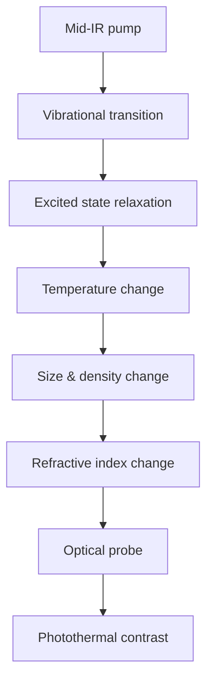
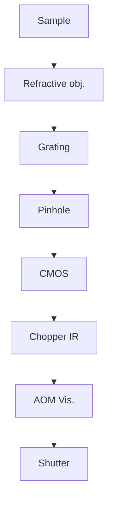

## A P P L I E D P H Y S I C S

# Bond-selective imaging by optically sensing the mid-infrared photothermal effect

Yeran Bai1,2† , Jiaze Yin1,2† , Ji-Xin Cheng1,2,3 \*

Mid-infrared (IR) spectroscopic imaging using inherent vibrational contrast has been broadly used as a powerful analytical tool for sample identification and characterization. However, the low spatial resolution and large water absorption associated with the long IR wavelengths hinder its applications to study subcellular features in living systems. Recently developed mid-infrared photothermal (MIP) microscopy overcomes these limitations by probing the IR absorption–induced photothermal effect using a visible light. MIP microscopy yields submicrometer spatial resolution with high spectral fidelity and reduced water background. In this review, we categorize different photothermal contrast mechanisms and discuss instrumentations for scanning and widefield MIP microscope configurations. We highlight a broad range of applications from life science to materials. We further provide future perspective and potential venues in MIP microscopy field.

Copyright © 2021 The Authors, some rights reserved; exclusive licensee American Association for the Advancement of Science. No claim to original U.S. Government Works. Distributed under a Creative Commons Attribution NonCommercial License 4.0 (CC BY-NC).

## INTRODUCTION

Since the publication of a high-quality spectral database by Coblentz (1) in 1905, mid-infrared (IR) spectroscopy has become a versatile mo lecular analysis tool (2), especially with the development of Fourier transform IR spectrometry (FTIR) (3–5). The FTIR imaging, enabled by the development of a focal plane array detector (6), provides a few micrometer spatial resolution at the diffraction limit of the IR photons. While the IR spectroscopic imaging finds broad applications (7–9), new light sources including synchrotron (10, 11) and quantum cascade laser (QCL) (12) have improved the measurement of IR absorption for each spatially resolved pixel. In particular, QCL enabled discrete frequency IR imaging (13), where specific vibration bands are selected to accelerate the imaging speed while offering sufficient chemical information about a specimen. On the detection side, up-conversion of mid-IR wavelengths to visible region has enabled hyperspectral IR imaging with a silicon-based camera (14–16). Despite these advances, a few fundamental limitations of IR spectroscopy prevent its application toward in situ and in vivo chemical analysis. First, an accurate measurement of the absorption in a biological sample is hard to achieve because of sample heterogeneity, where the wavelength dependence of light scattering could cause substantial baseline artifacts (2). Second, the IR imaging provides a lateral resolution of 4 to 7 m in the fingerprint region due to the long excitation wavelength and lack of high–numerical aperture (NA) microscope objectives. Such resolution is not sufficient to resolve intracellular distribution of molecules. Third, the IR imaging has limited depth-resolved capability. Last, the strong water absorption in the IR regions hinders its applications from studying living specimens in aqueous environments.

Near-field measurements have been implemented to overcome the diffraction limit in IR imaging. By recording IR scattering from an atomic force microscope (AFM) tip scanned over a polymer film, Knoll et al. (17) reported a spatial resolution of 100 nm. Later, by using the AFM tip to probe nanoscale thermal expansion induced by a pulsed IR laser, AFM-IR nanoscopy was developed (18–20). While the near-field probing IR technologies have found broad applications (21), these methods are limited to in vitro surface characterization because of the contact requirement. Alternatively, the vibration-sensitive sum frequency generation (SFG) and thirdorder SFG processes have been harnessed to perform IR-sensitive imaging with submicrometer spatial resolution by probing the sample’s nonlinear susceptibility $\chi ^ { ( 2 ) }$ or $\chi ^ { ( 3 ) }$ (22). However, these techniques have not been widely applied because of noncentrosymmetry sample requirements or the limited cross section of the nonlinear processes (23, 24).

The recently developed mid-infrared photothermal (MIP) microscopy not only overcomes the diffraction limit in far-field IR imaging but also circumvents the limitations in AFM-IR. In MIP microscopy, a visible beam probes the thermal effects induced by an intensitymodulated IR beam. The thermal effects include thermal expansion, pressure wave emission, refractive index change, and Grüneisen parameter change. Unlike the direct measurement of the absorption in IR spectroscopy, the temperature rise induced by photothermal effect is the origin of MIP signal. In addition, water background is reduced since it has a large heat capacity, resulting in a small temperature increase. Moreover, water has relatively low thermo-optic and thermal expansion coefficients, resulting in a small MIP background (25). These properties allow MIP imaging of intact specimens in liquid environment including living cells, which is beyond the reach of the direct IR and AFM-IR technologies. The MIP signals can be measured by a transmission dark-field geometry (26, 27), by reflection (28, 29), interferometrically (30), and acoustically (31, 32) in a stage scanning mode. Importantly, unlike AFM-IR, the MIP effect can be measured in a widefield manner through an interferometric reflectance microscope (33), a quantitative phase microscope (25, 34), or a low-coherence interferometric microscope (35). In the widefield MIP, the IR pump beam is weakly focused onto the sample that is illuminated by the visible probe beam in Kohler arrangement. A complementary metal-oxide semiconductor (CMOS) camera enables multiplex signal readout, which drastically improves the imaging speed. Moreover, thermal confinement after a short IR pulse excitation offers submicrometer spatial resolution (33).

Optical photothermal spectroscopy through measurement of light deflection and thermal lensing effects was reported in the

1 Department of Electrical and Computer Engineering, Boston University, Boston, MA 02215, USA. 2 Photonics Center, Boston University, Boston, MA 02215, USA. 3 Department of Biomedical Engineering, Boston University, Boston, MA 02215, USA. \*Corresponding author. Email: jxcheng@bu.edu †These authors contributed equally to this work.

1980s and 1990s (36–39). Photothermal microscopy using visible beams was developed to visualize single light-absorbing nanoparticles (40–42) and has reached the detection limit of a single dye molecule (43). A scanning photothermal IR microscope was reported by Lee and Lee (44, 45) by mechanically chopping an IR beam tuned to C─H stretching vibration. The authors imaged an oil droplet in water and lipid components in fixed 3T3-L1 cells at a resolution of 1.1 m. In a conference proceeding, Furstenberg et al. (46) reported chemical imaging of small crystals and polymer coating on microelectromechanical systems using a reflection photothermal microscope. Erramilli and Sander’s group reported photothermal IR spectra of liquid crystal and showed the nonlinear Zharov peak splitting with QCL as pump beam (47–50). Mërtiri et al. (51) demonstrated a mid-IR pump, near-IR probe photothermal imaging using a reflective objective lens and showed a photothermal image of a dried bird brain tissue slice. Li et al. (52) reported photothermal IR imaging with counterpropagation of pump and probe beams and showed the imaging of 1.1-m polystyrene beads in water, glycerin, and $\mathrm { C S } _ { 2 } .$

In 2016, Zhang et al. (26) reported a high-performance QCL-based MIP microscope that allows, for the first time, three-dimensional (3D) bond-selective imaging of biomolecules and drugs inside a living cell at submicrometer spatial resolution. Through a dark-field geometry and a resonant amplifier, an unprecedented detection limit of C═O bond at $1 0 \mu \mathrm { M }$ was reached. This platform was quickly converted into a commercial product mIRage by Photothermal Spectroscopy Corporation (Santa Barbara, CA, USA) and has allowed broad applications in biology and material science (53–57). Since the 2016 paper, the MIP microscopy field has been quickly expanded by a number of innovations made by many groups. Li et al. (28) reported a reflection MIP for submicrometer resolution analysis of nontransparent specimens such as drug tablets. Kuno and Hartland’s Li et al. (58) reported MIP imaging of 100-nm polymer beads and a single bacterium using a counterpropagation geometry. Widefield MIP imaging was developed to boost the imaging speed to over 1000 frames per second for thin polymer films (33). A MIP system with optical phase as readout was individually reported by Cheng’s and Ideguchi’s groups (25, 34, 59). MIP microscope integrated with a Raman spectrometer enabling the comprehensive characterization of biological samples was reported (29). Schnell et al. (35) has improved the spatial resolution of IR imaging by coupling a visible light-emitting diode (LED) into the system and using low-coherence interferometry to detect the surface deformation. Samolis et al. (60) showed improved MIP image contrast with the readout from lock-in amplifier phase channels and imaged protein distribution inside fibroblast cells embedded in collagen matrix (61). Shi et al. (31) recently demonstrated mid-IR imaging of tissue with a spatial resolution of 260  nm by using ultraviolet (UV)–excited photoacoustic as detection method. Pleitez et al. (32) demonstrated mid-IR photoacoustic microscopy with broad biomedical applications for monitoring carbohydrates, lipids, and proteins in cells and tissues. The Ideguchi group (62) recently reported the MIP quantitative phase imaging with depth-resolved capability and extended dynamic range (63).

Compared to spontaneous Raman microscopy and recently devel oped coherent Raman scattering microscopy (64–66), MIP microscopy provides the following unique features. First, the mid-IR absorption has a cross section $( \sim 1 \dot { 0 } ^ { - 2 2 } \ c m ^ { 2 } { \ s r } ^ { - 1 } )$ ) that is 100 million times larger than the Raman scattering cross section $( \sim 1 0 ^ { - 3 0 } \mathrm { c m } ^ { 2 } \mathrm { s r } ^ { - 1 } )$ . Second, the IR absorption is complementary to Raman scattering in selective rules. The Raman scattering scales with the molecules’ polarizability and is most sensitive to $\mathrm { C - H , C - D , C = C , }$ and C≡C stretching vibrations. The IR absorption, on the other hand, is based on dipole moment and is most sensitive to vibrations in $\mathrm { C - O } ,$ $\mathrm { C = O , C \equiv N } ,$ , and phosphate groups. Consequently, while the coherent Raman microscopy has found wide applications in the study of lipid metabolism and molecule-selective imaging with C─D and C≡C tags; the MIP microscopy can map glucose, proteins, nucleic acids, and drugs containing C≡N group with high sensitivity. Third, because the MIP microscopy relies on linear IR absorption and visible probing, the strong signal level allows use of widefield geometry to enable camera-based high-speed chemical imaging. Fourth, the photothermal effect can be induced by a compact and cost-effective QCL laser, which could facilitate translational research. Here, to flourish the growth of MIP microscopy field, we give a systematic description of contrast mechanisms, summarize various instrumentation strategies, and highlight the broad applications enabled by this emerging technology.

## CONTRAST MECHANISMS

The MIP signal originates from a nonradiative relaxation process that happens in an absorber after IR photon excitation. The absorbed energy dispersed into the form of heat results in a local temperature increase, which changes the sample’s optophysical properties (67) and is detectable by various mechanisms (Fig. 1A). Previously developed visible photothermal microscopy for imaging nano-objects with electronic absorption (41, 43) introduced comprehensive theories and physical models to explain the signal’s origin and push the sensitivity limit down to single molecules in room temperature (41, 68–71). In these models, nano-absorbers are treated as a point heat source, and a thermal transfer medium around the objects is carefully selected to enhance the signal (68, 72). Therefore, the photothermal contrast is mainly originated from the refractive index modulation of the surrounding medium, other than the nano-objects themselves. Differently, the MIP microscopy is based on vibrational absorption; the target size is typically comparable with the diffraction limit spot of the visible probe beam, and the target itself acts as a signal source. This feature enables the detection of the MIP signal by temperature-sensitive optical methods without a need for a thermal medium. On the instrumentation side, a sinusoidal modulation is typically applied to the pump beam in the electronic absorption–based photothermal systems to create a time-dependent temperature gradient (40, 43), and a lock-in amplifier is used to extract this periodically modulated signal. In comparison, the MIP systems deploy a pulsed IR source, which can provide a heat confinement that results in a larger signal and a higher spatial resolution compared with sinusoidal modulation. Therefore, an independent description of contrast mechanism is needed for MIP microscopy.

The major type of MIP mechanism is based on optical scattering, and the MIP signal is generated from the scattering intensity difference between IR on and IR off states. Therefore, a dark-field geometry can be applied to minimize the unchanged illumination background and increase the signal-to-noise ratio (SNR) accordingly (Fig. 1B). The groups of Hartland and Kuno have modeled scattering in a MIP system and compared the contribution of particle size and refractive index to signal generation (58, 73, 74). Bai et al. (33) presented an interferometric scattering model (Fig. 1C) and a transient optical phase model (Fig. 1D) (25). Another optical phase measurement based on Mirau objective interferometer has been demonstrated by Schnell et al. (35). Furthermore, other than using scattering as contrast, a photoacoustic MIP system based on Grüneisen relaxation (Fig. 1E) has been demonstrated by the Shi et al. (31). These models vary with different detection geometries and contrast origins, and it is not feasible to cover all the work with a single theory. Here, we group these models into two major categories: optical scattering (Fig. 1, B to D) and photoacoustic contrast (Fig. 1E). A detailed description of temperature rise, photothermal detection methods, and simulation results is presented below.

flowchart

text_image

B
Dark field
Es
E's'
Ei
Illumination
Vibrational
transition
V = 1
V = 0
Nonradiative
relaxation
D
Optical phase
nl
Δφ
n'l'

text_image

Interferometric scattering
E_s
E_r^T
E_i
E_r^R
E_s'
e

text_image

D
Optical phase
nl
Δφ
n'l'
Ei

text_image

E Grüneisen relaxation
US transducer
Γ
UV pulse
Γ'

Fig. 1. Schematic of MIP effects and detection mechanisms. (A) Block diagram shows the IR absorption–induced photothermal process. After the sample absorbed the incident IR photons with specific vibration frequency, the energy quickly dissipated in the form of heat, leading to local temperature increase. Depending on the IR pulse duration and sample thermal property, the thermal expansion and pressure wave emission may occur. Subsequently, the optical property such as refractive index is changed as a result of decreased density and changed polarizability. These modulated physical properties could be detected by optical or acoustical methods, as illustrated in (B to E). (B) Dark-field scattering as MIP contrast (26, 44, 80, 81). As the local temperature is periodically modulated, the amplitude and far-field distribution of absorbers’ scattering field $E _ { s }$ are influenced because of the size and refractive index changes. With dark-field illumination geometry, the scattering intensity modulation is accounted as MIP signal. (C) Interferometric scattering as MIP contrast (29, 33, 58). With a reference field introduced either from transmitted field $E _ { r } ^ { T }$ or reflected field $E _ { r } ^ { R } ,$ the detected signal is the interference between the scattered and reference fields. As a result, the weak scattered field and MIP modulation is enhanced and allows for detection. (D) Optical phase as MIP contrast (25, 34, 35, 62). The phase delay (∆) of the probe field passing through the object would change because of dimension (l) and refractive index (n) change, which can be detected interferometrically. (E) UV-excited photoacoustic signal as MIP contrast (31). Because of the increased local temperature, the Grüneisen parameter () of sample is changed, resulting in magnified photoacoustic signal that is detected by an ultrasound (US) transducer.

## IR absorption induced temperature change and photothermal effects

The photothermal effect is induced by local heating. Therefore, modeling the temperature rise is the first step for all MIP systems. The temperature modulation caused by a laser pulse can be interpreted with models in the literature (46, 74, 75). The maximum temperature change and transient temperature response depend on the IR pulse width, the pulse energy, the thermal properties of the target, and surrounding medium. The IR absorption–induced temperature profile can be calculated by solving the following heat transfer equation under a specific IR wavelength

$$
m C _ {s} \frac {\mathrm{d} T}{\mathrm{d} t} = Q _ {\mathrm{abs}} - Q _ {\mathrm{diss}} \tag {1}
$$

where m and $C _ { s }$ represent the mass and specific heat capacity of the absorber, dT/dt is the temperature change over time, and $( Q _ { \mathrm { a b s } } - Q _ { \mathrm { d i s s } } )$ denotes the rate difference between the absorbed and dissipated energies. $Q _ { \mathrm { a b s } }$ for small particles can be approximated by $I _ { \mathrm { I R } } { \sigma } _ { \mathrm { a b s } } ,$ where I represents the incident IR intensity and is assumed equal to the average intensity over the pulse duration $\tau _ { \mathrm { { > } } } \sigma _ { \mathrm { { a b s } } }$ represents the IR absorption cross section. The heat dissipation follows Newton’s law, and $Q \mathrm { d i s s }$ is driven by the temperature gradient and given by $( h S [ T ( t ) - T _ { 0 } ] )$ , where h and S represent the heat transfer coefficient and effective transfer surface area from specimen to environment, respectively. $[ T ( t ) - T _ { 0 } ]$ is the time-dependent temperature difference between the absorber and ambient environment $T _ { 0 } .$ . With the help of COMSOL Multiphysics (version 5.5, COMSOL AB, Sweden), the thermal property of a specific system can be evaluated on the basis of the model showed in Fig. 2A. The spherical particle represents the sample. The bottom of the sample is coupled with a substrate, and the other surfaces are coupled to the surrounding medium. The sample is treated as a uniform and continuous heat source with the same power of the IR absorption $I _ { \mathrm { I R } } \sigma _ { \mathrm { a b s } } .$ The temperature of substrate and medium boundaries are set to 293.15 K. Using the stationary study in heat transfer model, the sample’s heat transfer parameter hS can be evaluated by analyzing the thermal equilibrium state. As reaching the thermal steady state, the sample maintains a constant temperature difference T with the environment. The heat transfer parameter hS is then derived by calculating $I _ { \mathrm { I R } } { \sigma } _ { \mathrm { a b s } } / \Delta T _ { c }$ . With changing the size of particle, medium, and substrate material, heat transfer parameters of various conditions are acquired for subsequent simulation.

For $t \le \tau , T ( t )$ can be derived by solving Eq. 1 with the initial condition $T ( 0 ) = T _ { 0 }$

$$
T (t) = T _ {0} + \frac {I _ {\mathrm{IR}} \sigma_ {\mathrm{abs}}}{h S} (1 - e ^ {- \frac {\mathrm{hS}}{m C _ {s}} t}) \tag {2}
$$

A  

text_image

Medium
Bead
Substrate

B  

line chart

| Time (μs) | 100 nm | 300 nm | 500 nm | 1000 nm |
| --------- | ------ | ------ | ------ | ------- |
| 0         | 0      | 0      | 0      | 0       |
| 1         | 0      | 3      | 8      | 17      |
| 2         | 0      | 0      | 0      | 10      |
| 4         | 0      | 0      | 0      | 5       |
| 6         | 0      | 0      | 0      | 2       |

C  

line chart

| Diameter (μm) | Maximum ΔT (K) |
| ------------- | -------------- |
| 0             | 0              |
| 1             | 17             |
| 2             | 20             |
| 3             | 18             |
| 5             | 13             |

D  

line chart

| Time (μs) | ΔT (K) for P̄_IR = 10 mW, τ_IR = 980 ns | ΔT (K) for P̄_IR = 10 mW, τ_IR = 20 ns | ΔT (K) for P̄_IR = 6 mW, τ_IR = 600 ns |
| --------- | -------------------------------------- | -------------------------------------- | -------------------------------------- |
| 0.0       | 18.0                                   | 18.0                                   | 0.0                                    |
| 0.5       | 3.0                                    | 2.0                                    | 3.0                                    |
| 1.0       | 3.0                                    | 0.0                                    | 3.0                                    |
| 1.5       | 0.0                                    | 0.0                                    | 0.0                                    |
| 2.0       | 0.0                                    | 0.0                                    | 0.0                                    |
| 2.5       | 0.0                                    | 0.0                                    | 0.0                                    |
| 3.0       | 0.0                                    | 0.0                                    | 0.0                                    |

E  

line chart

| Time (μs) | Bead on silicon in air | Bead on CaF₂ in air |
| --------- | ---------------------- | ------------------- |
| 0.0       | 0.0                    | 0.0                 |
| 0.5       | 6.0                    | 7.0                 |
| 1.0       | 8.0                    | 8.5                 |
| 1.5       | 4.0                    | 5.0                 |
| 2.0       | 2.0                    | 2.5                 |
| 2.5       | 1.0                    | 1.5                 |
| 3.0       | 0.5                    | 0.5                 |

F  

line chart

| Time (μs) | Bead in water | Bead in glycerol |
| --------- | ------------- | ---------------- |
| 0.0       | 0.0           | 0.0              |
| 0.5       | 1.8           | 2.8              |
| 1.0       | 1.8           | 2.8              |
| 1.5       | 0.0           | 0.0              |
| 2.0       | 0.0           | 0.0              |
| 2.5       | 0.0           | 0.0              |
| 3.0       | 0.0           | 0.0              |

Fig. 2. Simulation results of localized temperature profile of a polymer bead under single IR pulse heating. (A) COMSOL model used in the simulation. (B) Simulation of thermodynamic properties of PMMA beads with different sizes under single IR pulse. This IR parameter is also used in the following simulations (C, E, and F). (C) Simulation results of maximum temperature increase of PMMA beads with different sizes under single pulse heating. (D) Simulation results of thermodynamic properties of a 300-nm PMMA bead under laser sources with different pulse duration IR and average power $\overline { { \mathbf { P } } } _ { \mid \mathsf { R } } .$ (E) Simulation results of thermodynamic properties of a 500-nm PMMA bead on different substrate. (F) Simulation results of thermodynamic properties of a 500-nm PMMA bead in different thermal medium.

For $t > \tau ,$ the IR pulse heating is finished and $Q _ { \mathrm { a b s } }$ is zero. The temperature profile can be expressed as

$$
T (t) = T _ {0} + \left(T _ {\max} - T _ {0}\right) e ^ {- \frac {\mathrm{hS}}{m C _ {s}} t} \tag {3}
$$

where $T _ { 0 }$ is the environment temperature and $T _ { \mathrm { m a x } }$ is the maximum temperature increase derived from Eq. 2. The simulation results based on Eqs. 2 and 3 are given in Fig. 2 (B to F) for polymethyl methacrylate (PMMA) beads of different sizes under several commonly used IR pump conditions and embedding mediums. In this simulation, the absorption cross section of PMMA particle at $1 7 2 9 \mathrm { c m } ^ { - 1 }$ is evaluated by using the Mie scattering theory. The used complex refractive index of PMMA is $1 . 4 1 7 6 + i 0 . 3 6 1$ , where the imaginary part represents the extinction coefficient (76). Absorption coefficient is derived from Mie theory based on a Python package (77). Several types of laser are used with difference in intensity and pulse duration and resemble the parameters of QCL and optical parametric oscillator (OPO) source correspondingly. The substrate is set to be silicon $\operatorname { o r } \operatorname { C a F } _ { 2 } .$ Air, water, and glycerol are used as different embedding mediums. The physical properties (density and heat conductivity) of used material are taken from the COMSOL material library. Collectively, the parameters used for the following simulation, including the absorption cross section $\mathtt { \Pi } _ { \mathtt { a b s } }$ heating source $I _ { \mathrm { I R } } { \sigma } _ { \mathrm { a b s } } ,$ derived heat transfer parameter hS of different conditions, and exponential decay constant $m C _ { s } / h S$ are given in table S1. The thermodynamic property of beads with different sizes is shown in Fig. 2B. For this set of simulations, IR source has a pulse duration of 980 ns and peak intensity at sample of $5 . 4 \mathrm { k W } / \mathrm { c m } ^ { 2 }$ , which resembles the QCL parameter used in MIP experiments. From the results, we can observe a temperature plateau as the absorbed energy equals to the dissipated energy. For small particles with high heat transfer capability, this plateau would be instantly reached, limiting its maximum temperature rise. As the bead size increases, the heat dissipation becomes less dominant in the heating process, leading to a gradually increased maximum temperature difference T. However, for beads with a diameter larger than 2 m, the maximum T would decrease because of the slowly increased absorption cross section $( \sigma _ { \mathrm { a b s } } \sim r ^ { 2 } )$ compared with heat capacity $( m C _ { s } { \sim } r ^ { \frac { 3 } { 3 } } )$ , as illustrated in Fig.  2C. To improve the MIP contrast of small particles, one can choose an IR source with higher peak energy and short pulse duration, as shown in Fig. 2D. For the curves of $\mathfrak { t } = 9 8 0 \mathrm { n s } .$ , the IR has the same configuration used in simulation (B), representing the QCL source. The simulation of $\tau = 2 0$ ns represents the OPO-based IR source. OPO-based IR is set to the same average power and repetition rate but with shorter pulse duration, which results in a higher peak power. A detailed discussion on laser source options is given in the following instrumentation section. Importantly, the thermal properties of the environment also influence the temperature rise of the sample. As shown in Fig. 2E, the substrate functions as a heat sink, which improves the heat dissipation of system. Because of higher thermal conductivity, silicon has been used as the substrate for MIP imaging (33), where the complete cooling is achieved before the next IR pulse arrives and there is no sample overheating by the heat accumulation. The effect of thermal medium is shown in Fig. 2F. Water and glycerol have better thermal conductivity than air, leading to faster heat diffusion and quicker temperature plateau reaching speed but a lower temperature rise. Collectively, these simulations illustrate how temperature is modulated after the pulsed IR excitation, providing a general guidance for signal level estimation, system design, and sample preparation.

The photothermal process causes several effects along with tempera ture rise ∆T, including secondary IR radiation, thermal expansion $\Delta l ,$ refractive index alternation ∆n, and photomechanical pressure change ∆P (42). Among them, methods based on $\Delta n , \Delta l ,$ and $\Delta P$ have shown excellent performance for detecting the MIP signal. The optical detector is typically used to sense the change of ∆n and ∆l. These two parameters are closely linked to the scattering processes. With the localized temperature modulation T(t) described previously, the IR absorbers would experience thermal expansion and refractive index change due to decreased density and temperatureinfluenced polarizability (78). Those two changes can be approximated as linearly proportional to the temperature change $\Delta \bar { T }$

$$
\Delta l = \frac {1}{l} \frac {\mathrm{d} l}{\mathrm{d} T} l \Delta T = \alpha l \Delta T \tag {4A}
$$

$$
\Delta n = \frac {\mathrm{d} n}{\mathrm{d} T} \Delta T = \beta \Delta T \tag {4B}
$$

where l is the dimension change, dl/dT is the derivative of dimension to temperature, and $\mathbf { \boldsymbol { a } } = ( 1 / l ) ( \mathrm { d } l / \mathrm { d } T )$ represents the linear thermal expansion coefficient. $\beta = \mathbf { d } n / \mathbf { d } T$ is the temperature dependence of refractive index, also termed as thermo-optic coefficient. Typically,  and  are on the level of $1 0 ^ { - 6 }$ to 10 $^ { - 4 } / \mathrm { K }$ for biological samples, metals, and polymers (25, 78, 79). The scattered field $E _ { s }$ from sample under the incident probe field $E _ { i }$ is expressed as $E _ { s } = | s ( n , l ) | ^ { \bf \dot { \rho } } e ^ { i \phi s ( n , l ) } E _ { i } ,$ where ∣s(n, l)∣ is the scattering amplitude and $\phi _ { s } ( n , l )$ is the scattering optical phase. With the presence of modulated ∆l and $\Delta n ,$ the $E _ { s }$ would experience a change in magnitude, far-field distribution, and optical phase retardation. As a result, the difference between the IR on and off states is the origin of scattering-based MIP contrast. These scattering modulations can be detected through dark-field (26, 80), interferometric scattering (29, 33, 58), optical phase (25, 34, 35, 62), as described below.

## Dark-field contrast (Fig. 1B)

In the dark-field geometry, the illumination and scattered photons are spatially separated in the detection path. The ballistic illumination photons are diminished by selecting detection angles (80) or adding an iris (26, 44, 81) before the detector. Therefore, pure scattering photons dominate the detector. The detected intensity $\mathrm { I _ { d e t } }$ is proportional to $\vert E _ { i } \vert ^ { 2 } \vert s ( n , l ) \vert ^ { 2 }$ . The MIP signal lies in the scattering intensity change

$$
\Delta \mathrm{I} _ {\text { det }} = | E _ {i} | ^ {2} [ | s (n + \beta \Delta T, l + \alpha l \Delta T) | ^ {2} - | s (n, l) | ^ {2} ] \tag {5}
$$

For sphere particles, Mie theory has been used for interpret the MIP signal dependency with samples’ property by calculating Eq. 5, as reported in (80).

## Interferometric scattering contrast (Fig. 1C)

For small particles in Rayleigh regime, scattering intensity is in versely proportional to the sixth power of size. Therefore, the scattering intensity will fall below the detector’s noise floor, leading to indistinguishable scattering signals. Inspired by the interferometric scattering detection of nanoparticles (82, 83), a reference field $E _ { r }$ can also be used in MIP systems to enhance the weak scattering field. In MIP, the $E _ { r }$ is selected as part of the transmitted $E _ { r } ^ { T } \mathrm { o r }$ reflected incident field $E _ { r } ^ { R } .$ , depending on the detection geometry, collectively denoted as $E _ { r } = r E _ { i }$ . Since the scattering intensity is negligible, the intensity on the detector is modified to

$$
I _ {\mathrm{det}} \approx | E _ {i} | ^ {2} [ r ^ {2} + 2 r | s (n, l) | \cos \phi_ {s} (n, l) ] \tag {6}
$$

Therefore, the MIP signal is proportional to the change on the term $| s ( n , l ) | \cos \Phi _ { s } ( n , l )$ , which is inversely proportional to the third power of the size. Compared with dark-field MIP, interferometric scattering enhances the weak scattering field with a strong reference field. However, the background noise also increases as the total photons reaching the detector increases. Therefore, the interferometric scattering would be more attractive to detect nanoparticles in which the scattered intensity is not sufficient for generating photons above the detector’s noise limit. The dark-field detection is more appealing for large particles. For quantitatively analyzing the MIP contrast of particle with the presence substrate reflection, Li et al. (58) have used finite element method calculations to solve the electromagnetic field under such an inhomogeneous environment, which shows great agreement with experimental results. Furthermore, for film sample, in which case only the interferometric reflection is considered, an analytical expression of the MIP contrast has been presented in (33). Using the interferometric enhancement, an ultrafast MIP system with imaging speed of 1250 frames per second have been achieved.

## Optical phase contrast (Fig. 1D)

Instead of measuring the scattering amplitude modulation by the two methods mentioned above, MIP contrast can be performed by retrieving the complex scattering field modulation involving both amplitude and phase information. To retrieve the forward scattering field, a common path off-axis holography arrangement can be used. The reference field $E _ { r }$ is generated by spatially separating the sample-transmitted beam with a grating and then filtering out the high-frequency components of the first-order diffracted beam with a pinhole. The second-order beam is unaffected and carries the sample information. The recombination of these two beams at the camera plane creates the interference fringes, with a spatial frequency k related to the off-axis angle $\theta , k = 2 \pi s i n ( \theta ) / \lambda$ . With detected signal $\begin{array} { r } { I _ { \mathrm { d e t } } ( x , y ) = I _ { r } + I _ { s } ( x , y ) + 2 \bar { E } _ { r } E _ { s } } \end{array}$ cos $[ k x + \phi ( x , y ) ]$ , the optical phase delay introduced by the sample can be isolated via Fourier transform and reconstructed (84). Similarly, the difference of optical phase between IR off state $\phi _ { s }$ and IR on state $\boldsymbol { \Phi } _ { s } ^ { H }$ is acquired by shining or blocking the IR illumination; hence, the optical phase contrast of MIP is expressed as (25)

$$
\Delta \phi_ {s} = \phi_ {s} ^ {H} - \phi_ {s} = \frac {2 \pi l}{\lambda} \left(n \frac {1}{l} \frac {\mathrm{d} l}{\mathrm{d} T} + \frac {\mathrm{d} n}{\mathrm{d} T}\right) \Delta T = \frac {2 \pi l}{\lambda} (n \alpha + \beta) \Delta T (7)
$$

As interferometric scattering that uses a reference field to amplify the weak scattering signal, optical phase–based MIP modalities hold the potential for imaging specimen that does not have strong scattering contrast, such as sample with similar refractive index with the medium.

On the other hand, by measuring the modulated backscattering field, a Mirau interferometer–based MIP system is demonstrated for tissue imaging (35). Under this detection strategy, an interferogram is recorded in the image plane by the phase-shifting method, which helps retrieve the modulated optical phase that is related to the sample surface height modulation, representing as (35)

$$
\Delta \phi = \frac {2 \pi}{\lambda} n _ {0} \Delta h \tag {8}
$$

where n denotes the refractive index between sample and objective lens and h is change in the height difference between the sample surface and the objective focal plane after IR heating. With the assumption that h is the result of axial expansion, h can be related to the temperature change $\Delta T ( z )$ and thermal expansion coefficient (z) along the axial direction z $: \Delta h = \int \Delta T ( z ) \mathsf { a } ( z ) \mathsf { d } z .$ . Note that both methods retrieve the optical phase information from holograms. The difference between them lies in the origin of the phase difference: Optical path length passing through the sample is changing for the first technique, while the path length from the surface to the objective focal plane is changing for the second technique.

It is interesting to compare the intensity measurement with the phase measurement. From Eq. 7, the thermal expansion ∆l and re fractive index ∆n can cancel each other if  and  have opposite signs, which makes the signal that is proportional to (n + ) diminished for certain materials and components. For scattering intensity– based contrast, opposite signs for  and   would have opposite influence on scattering amplitude s(n, l) as well but with a more complicated relationship. However, with the help of Mie theory, this complicated dependency can be numerically studied. In the literature (58, 74), the contribution of the refractive index change and thermal expansion is evaluated separately. These results reveal that under certain cases, the thermal expansion would become dominant for small particles. In most cases, the change of refractive index contributes more to the MIP signal for polymer beads (74). Further more, the depth-resolved imaging capability has been demonstrated for intensity-based scattering measurement (26, 29), which is not easy to perform in phase detection because of the integral signal along the whole path length. However, some works have shown preliminary results demonstrating the depth-resolved capability by coupling multi-angle illumination (62).

## Grüneisen relaxation contrast (Fig. 1E)

The photoacoustic signal is strongly related to the thermodynamics property of the material with the Grüneisen parameter  (85).  is approximately linearly dependent on the temperature (86), and d/dT is reported to have two orders of magnitude larger than that of the dn/dT for water-rich tissue. As a result, by measuring two subsequent UV pulse–induced photoacoustic signals at IR on and off states, the change of received photoacoustic intensity change conveys the local temperature modulation. Therefore, this method provides the IR absorption information with UV light–determined resolution (31).

On the other hand, the nanosecond IR pulse alone could generate photoacoustic signal, which can be detected by an ultrasound transducer (32). As the photothermal-induced temperature jump occurs faster than the time required for the sample to expand, part of the heat energy would dissipate in the form of pressure wave (67). Generated mid-IR photoacoustic signal intensity is proportional to the sample’s IR absorption, providing high sensitivity with detection limit of 1.5 mM for dimethyl sulfoxide at laser power at hundreds of microwatts. Furthermore, since the mid-IR pump is the only light source involved for the signal generation, it has less photo damage to the biological samples compared with the UV as the probe. However, the spatial resolution is limited to a few micrometers because of the long wavelength of mid-IR light and ultrasound.

Since the mid-IR pump power varies in different setups, it is hard to compare the detection sensitivity directly between scattering- and photoacoustic-based MIP systems. Here, we summarize the reported results and give a discussion toward the factors that affect the detection limit. The photoacoustic method using UV probe claimed a higher sensitivity in detecting small nanoparticles, where carbon beads with a diameter of 50 nm is imaged with SNR of 7 under an acquisition time of 1 s (31). This result outperforms the counterpropagation MIP system where a single polystyrene bead with diameter of 50 nm is acquired with SNR 10 to 50 under a pixel dwell time of 90 ms (74), except that the pump source used in the photoacoustic system (NT242-SH, EKSPLA) has one order of higher pulse energy than that in the scattering based MIP system (Firefly IR, M-squared). The sharply dropped scattering intensity $( \sim r ^ { 6 } )$ compared with slowly dropped photoacoustic signal $( \sim r ^ { 3 } )$ is another important reason for this sensitivity difference. However, because the probe light used in scattering-based method is chosen outside of the sample absorption range, the power incident on the sample could be higher to increase the SNR. In addition, a thermal medium can be applied to enhance the scattering MIP modulation of small molecules via forming a refractive index gradient. In another work, the reported detection limit of scattering-based MIP system reached a molar concentration of 10 M for small molecules, g-valerolactone, in carbon disulfide solution (26) with IR pulse energy of tens of nanojoules.

In terms of imaging speed, a point-by-point image acquisition needs to be performed to maintain the optical resolution for the mid-IR photoacoustic measurements, where the throughput might be a concern for certain applications. On the contrary, the optical detection enables more flexible selection between point-scan and widefield while maintaining the submicrometer spatial resolution.

## INSTRUMENTATION

The various configurations of MIP microscope are summarized in Fig. 3. The geometries of a MIP imaging system can be grouped into two categories. The first is a scanning system where the mid-IR pump and visible probe are focused onto a diffraction-limited spot and the images are created by collecting the point-by-point signal from a lateral translation stage (Fig. 3, A to C). The second category is the widefield configuration, where the IR beam is loosely focused and the visible beam illuminates the full field of view instead of a single diffraction-limited spot (Fig. 3, D to F). The essential components include a mid-IR pump, a visible or near-IR probe, a photon detector, light-focusing elements, and electronics for synchronization and data acquisition. We will first summarize the configurations and then discuss the key parameters of pump and probe beams used in various MIP systems.

In the scanning scheme, copropagating IR and visible beam are combined with a dichroic mirror and then guided to a reflective objective. The transmitted probe photons are collected and focused onto a photodiode or an avalanche photodiode (Fig. 3A). The residue of the IR reflection from the dichroic mirror is sent to a mercury cadmium telluride (MCT) to generate the power spectrum from the IR laser during the spectral measurements. To study opaque samples such as drug tablets, backscattered visible photons can be collected by adding a polarizing beam splitter and a quarter-wave plate (28). Notably, the backward-detected MIP system was quickly commercialized and turned into a product mIRage.

The counterpropagation (Fig. 3B) of the IR and visible beam was developed to address the NA limitation of the reflective objective, where the highest achievable NA is around 0.8. A high-NA refractive objective could boost the collection efficiency of scattered visible photons and increase the spatial resolution. To monitor the IR power for spectrum normalization, partial of the IR beam is sampled with a calcium fluoride (CaF ) plate and focused on the MCT detector. Superior detection sensitivity has been demonstrated with the counterpropagation scheme where a single bacterium cell can be resolved (29, 58). The spatial resolution of 300 nm is achieved after deconvolution using a probe wavelength of 532 nm and an objective NA of 1.2. Notably, with a balanced detector, imaging of 100-nm-diameter particles has been achieved recently (74).

A  

text_image

PD
Condenser
2D stage
Reflective
obj.
PBS
DM
IR
Vis.
MCT

B  

text_image

IR
MCT
CaF₂ plate
Reflective obj.
2D stage
Refractive obj.
Spectrometer
PD
DM
LPF
BS
Vis.

C  

text_image

Water tank
Ultrasound transducer
3D stage
Reflective obj.
DM
IR
UV

text_image

D
CMOS
BS
Vis.
Refractive
obj.
Sample
CaF₂
lens
Chopper
IR

E  

flowchart

text_image

F
CMOS
BS
Vis.
Mirau
obj.
Chopper
IR
Sample

Fig. 3. Typical instrumentations of MIP microscopy. (A to C) Scanning systems: An image is created by lateral translation of the sample stage. (A) Copropagation of mid-IR and visible (Vis.) beams (26, 45). The two beams are combined with a dichroic mirror (DM) and focused to the sample plane with a reflective objective. The detector photodiode (PD) on the top and bottom showed the transmission and reflection detection geometry. An additional polarizing beam splitter (PBS) and a quarter-wave plate (QWP) are used in the reflection mode. The residue reflection of the IR beam at the DM is collected with an MCT to normalize the power in spectral measurement. (B) Counterpropagated iRaman system for in situ imaging of IR and Raman at submicrometer resolution (29, 58). The backscattered photons with wavelength longer than the incident beam are reflected to pass through a long-pass filter (LPF) and focused into a spectrometer for Raman analysis. (C) UV-localized mid-IR imaging by detection of Grüneisen parameter change due to the mid-IR absorption induced local temperature increase (31). (D to F) Widefield system: An image is formed with the widefield illumination and detection. (D) Reflection intensity change detection system (33). The visible beam is a LED, and the LED emitter is projected to the back focal plane of the objective. The CMOS camera is conjugated with the sample plane. (E) Bond-selective transient phase microscope (25, 34). The IR beam is modulated with a chopper and a shutter to accommodate the sample thermal diffusion and the speed of the CMOS sensor. The quantitative phase is acquired with a common-path, off-axis diffraction phase microscope. (F) IR-optical hybrid microscope (35). The sample expansion due to the IR absorption is interferometrically detected by a Mirau interference objective.

The advantage of high-NA objective and visible probe was further exploited by coupling a spectrometer into the counterpropagated MIP system, where the visible probe was used as the excitation source for Raman spectroscopy (29). In situ pinpoint IR and Raman spectra of bacteria and 3T3 fat cells have been demonstrated with the hybrid IR + Raman system. However, the counterpropagation scheme requires delicate alignment of visible and IR beams such that their foci overlapped. A special sample preparation is needed to avoid the excess IR attenuation when IR and visible beams travel toward each other.

For example, in an application (25), the cell sample was immersed in phosphate-buffered saline, sandwiched between two sapphire plates, flipped, and then put on the sample holder.

The spatial resolution of the scanning MIP system can be further improved using a UV light (Fig. 3C). The UV photoacoustic signal is modulated by the temperature-dependent Grüneisen parameter. The photoacoustic signal detection upon IR absorption of biomolecules can achieve spatial resolution down to 260 nm in UV regime. The IR and UV beams were combined and focused with a reflective objective to the sample immersed in the acoustic coupling medium, and the generated acoustic signal was detected with an ultrasound transducer.

While successful demonstrations have been made with the scanning MIP systems, there remain a few limitations. First, most of IR photons do not contribute to the signal because of the mismatch of the IR and visible focal spot size. Second, because of the slow speed in sample scan, imaging a cancer cell with 200 × 200 pixels required \~20 s (26), which is not fast enough to capture moving objects or for high-throughput detection. To address these limitations, widefield

MIP systems have been developed (Fig. 3, D to F). In the reflected interferometric scattering measurement (Fig. 3D), a 4-f lens system is used to project the LED emitter to the objective back focal plane to create a uniform sample illumination in epi-configuration. The modulated IR pump beam is weakly focused on the sample plane with a CaF lens, and the illuminated area is around 40 m in diameter. The sample is prepared on a silicon wafer substrate to reflect back the forward-scattered visible photons, providing a reference field for interferometric scattering measurement and good thermal conductivity functions as a heat sink. The reflected visible photons are collected with the same objective and then projected on the camera with a tube lens. A shot-noise limited detection sensitivity has been demonstrated (25, 33); therefore, increasing the total photons\_ by N times could increase the SNR by √N times. While a single-pixel photodiode can receive orders of magnitude higher photons than a single pixel in a camera sensor, the widefield systems take advantage of the multiplex feature. As shown in (33), for a 200 × 200 pixel image, the widefield imaging speed is about 25 times faster than the point-scan method at the same SNR. The most critical parameter to improve the SNR and imaging speed in a widefield system is full well capacity or saturation capacity of the camera. The typical widefield MIP system (25, 33, 34) uses camera with full well capacity around 20 ke− , while, if a 2 million full well capacity camera (35) is used, the imaging speed could be increased by 100 times without sacrificing the SNR.

Since the MIP process involves the change of sample refractive index and dimension change, which are related to optical phase measurement, widefield phase imaging with chemical bond information has been demonstrated (25, 34, 62). The phase map of a sample is acquired with a common-path off-axis interferogram configuration (Fig. 3E). The modulated IR beam is shined from the top of the sample obliquely. The visible beam is produced by second harmonic generation from a near-IR beam and is pulsed by an acousto-optic modulator. With the optical phase detection method mentioned above, the MIP phase image is created by comparing the phase images at hot (IR on) and cold (IR off) state. The surface expansion can be detected through other interference methods such as using a Mirau interference objective with an axial piezo stage for phase shifting measurement (Fig. 3F).

## Mid-IR sources

Frequency down-conversion of two near-IR ultrafast picosecond pulses through difference frequency generation (DFG) to produce mid-IR pulses were used in early MIP studies (44, 45). Through the optimization of DFG process and spectral focusing of two near-IR femtosecond pulses, the maximum DFG output reached 22 mW with the spectral resolution of 29 cm−1 (27). The wavelength coverage of the DFG output is usually wider than that of a single QCL chip and is ultimately dependent on the two near-IR inputs and the specification of the DFG crystal. For laboratories using ultrafast lasers, it would be a viable choice to generate a mid-IR source. The commercial mid-IR lasers used in the MIP experiments are either mid-IR OPO or QCL. The OPOs typically produce higher pulse energies with fixed repetition rates and pulse widths, while QCLs provide fast spectral sweeping speed and flexible repletion rates and pulse width but with lower pulse energy. Clearly, high pulse energy and lower repetition rate are more suitable for a widefield MIP system. Pulse duration plays an equally important role. For small particles with high heat dissipation capability, a temperature plateau would be reached during the single IR pulse heating process and maximum T is hard to increase by heating for longer time, limiting the MIP contrast. In such cases, an IR source with higher peak power would contribute to a larger MIP signal, as illustrated in Fig. 2D. In the simulation results, the laser with the same peak power would generate similar temperature modulation for pulse durations of 600 and 980 ns. However, the maximum T can be increased five times using short IR pulse ( = 20 ns) with the same average power and repetition rate.

## IR modulation

The modulation at submegahertz frequency plays a key role in maximizing the photothermal signal, as has been demonstrated in both visible and mid-IR pumped systems (26,  68). Therefore, modulation of the IR beam is an essential part in any MIP system, and it is closely linked to the laser types and setup geometries. For the scanning systems shown in Fig. 3 (A to C), since a lock-in amplifier is used to extract the modulated signal, the mid-IR lasers are typically externally triggered at high repetition rates around 100 to 200 kHz (26, 58), using either QCL or mid-IR OPO as the pump source. For a MIP setup based on the DFG process, acousto-optic modulation on one of the input near-IR beam will transfer the modulation to the IR output (27). Some scanning MIP systems were performed at lower repetition rates of 1  kHz because of the limitation of lasers (31, 44, 45). For widefield MIP systems shown in Fig. 3 (D to F), a multipixel sensor such as a CMOS camera is used as a detector (25, 33, 35). Since off-the-shelf cameras are not fast enough to capture photothermal response induced by each IR pulse, the IR pulses are modulated into pulse trains to accommodate the camera speed, such that a captured frame is the average response to multiple IR pulses. The modulation is often achieved with a rotating chopper or shutter with desired duty cycles (33). For example, in Fig. 3D, the IR repetition rates is 20 kHz, the mechanical chopper is 1250 Hz with a duty cycle of 50%; therefore, IR is modulated into eight bursts per group.

## Probe source

The probe beam is at a wavelength outside the absorption range of the sample, such as in the visible or near-IR region. Shorter wavelength is preferred to improve the spatial resolution of MIP microscope. In most cases, the probe is a continuous wave beam, and recently developed MIP setups used a pulsed probe to improve the detection efficiency and achieve the time-resolved imaging capability. Because a lock-in amplifier is absent in widefield MIP systems, a pulsed probe is crucial for detection. The use of pulsed probe and the electronic synchronization of IR, visible, and detector compose a virtual lock-in camera, which extracts the periodically modulated signal (25,  33). The use of pulsed probe also enables the timeresolved imaging capability by controlling the relative time delay between the pump and probe. The heating and thermal decaying processes can be clearly mapped, and heating by individual IR pulses can also be observed (25). The temporal resolution of timeresolved widefield MIP imaging equals to the pulsed width of the probe beam, and submicrosecond to 50-ns temporal resolution has been demonstrated for thin film samples. The simulation of the thermal decay process for polymer beads with various sizes is shown in Fig. 2B, indicating that a shorter probe pulse is expected to improve the detection efficiency and temporal resolution. Lasers and LED have been used as the probe for MIP microscopes. Broadband lasers should be used to minimize the speckle-induced coherent noise artifacts in the widefield MIP systems.

## BROAD APPLICATIONS TOBIOMEDICAL SYSTEMS ANDMATERIALS

Providing submicrometer spatial resolution and chemical selectivity and being applicable to living systems in aqueous environment, MIP microscopes have contributed insights into various systems. Here, we highlight the applications of MIP microscope to chemical mapping of intracellular biomolecules, drug molecules, tissues, whole organisms, solar cells, and bioplastics.

Biomolecular mapping and metabolic imaging in single cells MIP imaging at a single bacterium level has been demonstrated in the fingerprint region (29, 87, 88) and the high wave number region (58). The significance of single-cell measurements when studying heterogeneous samples was clearly shown by the comparison of ensemble FTIR spectra and single-cell spectra in both fingerprint and high wave number regions (Fig. 4, A and B). This capacity allows developing an in situ tool to study metabolic activity of individual bacterium in a complex environment and to enable rapid antibiotic susceptibility testing (88–90). Among the various organelles, lipid droplets are involved in various biological processes and are good targets in MIP imaging due to the strong signal from carboxyl group in triglycerides. 3D mapping of lipid droplets inside a single living cancer cell (Fig. 4C) and a living whole Caenorhabditis elegans (Fig. 4D) has been demonstrated (26). For functional studies, mapping of palmitic acid metabolites (Fig. 4E) in mammalian cells was demonstrated by integrating MIP imaging and stable isotope probing (27). Using widefield MIP techniques, lipid and protein distribution inside a living 3T3-L1 fat cell (Fig. 4G) has been achieved at high speed with a bondselective quantitative phase microscope (25). The carbohydrate distribution inside 3T3-L1 adipocytes (Fig.  4G) was visualized with mid-IR optoacoustic microscopy at IR resolution (32).

A  

natural_image

Microscopic image showing blue fluorescent spots on a black background with a 2 μm scale bar (no text or symbols beyond scale and label)

line chart

| Wave number (cm⁻¹) | MIP nH (a.u.) |
| ------------------ | ------------- |
| 1000               | 2             |
| 1100               | 6             |
| 1200               | 4             |
| 1300               | 2             |
| 1400               | 8             |
| 1500               | 14            |
| 1600               | 16            |
| 1700               | 0             |

B  

C  

natural_image

3D visualization of a glowing red-orange particle cluster within a transparent rectangular frame, labeled '3D view' (no other text or symbols)

D  

natural_image

Microscopic image of a curved biological structure with scale bar (200 μm) and intensity legend (0.2–1.44), no readable text or symbols beyond measurement markers.

E  

F  

natural_image

Microscopic image showing cellular structures with a labeled 'Raw phase' and a 10 μm scale bar (no text beyond labels)

natural_image

Fluorescence microscopy image showing molecular structures with scale bar (2850 cm⁻¹) and label vₛ(CH₂), no readable text or symbols beyond annotations

text_image

2930 cm⁻¹
80
0
mrad
vₐₛ(CH₂)

G  

natural_image

Microscopic image showing cellular or particulate structures with a 50 μm scale bar (no text or symbols beyond scale indicator)

natural_image

Blurred grayscale image with no discernible text, symbols, or identifiable objects

natural_image

Blurred grayscale image with no discernible text, symbols, or identifiable objects

H  

natural_image

Microscopic view of cellular or tissue structures with branching patterns (no visible text or labels)

natural_image

Microscopic image showing fluorescently labeled cellular structures with scale bar (20 μm), no text or symbols present.

text_image

Particle 1
F
5 µm
Particle 2
F
5 µm
Particle 3
F
10 µm
Particle 4
M2
S
M1
5 µm

natural_image

Two microscopic images showing surface topography at 1630 cm⁻¹ and 1650 cm⁻¹, with scale bar indicating 20 μm (no text or symbols beyond labels)

line chart

| Wave number, cm⁻¹ | Photothermal amplitude, a.u. |
| ----------------- | ----------------------------- |
| 1630              | 1.0                           |

J  

text_image

IR-OH sₙₚ

natural_image

Microscopic view of cellular structures with pink and purple staining (no text or symbols visible)

natural_image

Microscopic tissue section showing glandular structures with purple staining, scale bar 100 μm (no text or symbols)

K  

natural_image

Microscopic image of a biological sample labeled MIR-PAM with a 400 μm scale bar (no other text or symbols)

natural_image

Microscopic tissue section labeled 'ULM-PAM' (no other text or symbols visible)

natural_image

Microscopic tissue section labeled 'PA histology' with green and purple staining (no additional text or symbols)

Fig. 4. Broad biological applications of MIP microscopy. (A) MIP image of single Staphylococcus aureus cells; pinpoint MIP and Raman spectrum at the arrow indicated cell. Adapted with permission from (29). Copyright (YEAR2019) American Chemical Society. a.u., arbitrary unit. (B) MIP image of a single Escherichia coli cell at 2968 cm−1 and spectrum acquired with single-cell MIP versus ensemble FTIR spectrometer. Reprinted with permission from (58). Copyright (2017) American Chemical Society. (C) 3D reconstruction of a live cancer cell lipid droplet mapping. From (26). Reprinted with permission from AAAS. (D) MIP image of lipid droplets inside a live C. elegans. From (26). Reprinted with permission from AAAS. (E) Metabolic imaging of cancer cells where the C-D signal is clear because of the addition of ${ \mathsf { d } } _ { 3 1 } .$ -palimitic acids to the culture medium. Reprinted (adapted) with permission from (27). Copyright (2017) American Chemical Society. (F) Raw phase and MIP chemical phase image of live fat 3T3 cells; the dashed circle indicates the IR illumination area. Reprinted by permission from Nature/Springer (25). Copyright (2019) Author(s) licensed under a Creative Commons Attribution 4.0 License. (G) Lipid, protein, and carbohydrate mapping of 3T3-L1 cells with mid-IR optoacoustic microscopy. Reprinted by permission from Nature/Springer (32). Copyright (2020). (H) Bright-field and MIP image at protein amide I band of live neurons and the traces of particle indicated with 1 to 4 are also shown. Adapted with permission from (81). Copyright (2019) American Chemical Society. (I) Cultured primary neuron MIP image at 1630 and 1650 cm−1; the ratio map (1630cm−1/1650cm−1) in the dashed region with higher sheet structures shown in red; the IR band corresponding to sheet structures is indicated with a red arrow. Reprinted with permission from ref. (54). Copyright (2020) Author(s) licensed under a Creative Commons Attribution 4.0 License. Copyright Wiley (2020). (J) Surface expansion–based MIP image of 5-m-thick tissue slide at 1550 cm−1 and the computed hematoxylin and eosin (H&E images) based on the stainless MIP image, which is co-registered with the conventional H&E stain of adjacent tissue. Reprinted with permission from ref. (35). (K) Mid-IR photoacoustic microscopy (MIR-PAM) image of myelin in a 300-m-thick brain slice. Higher resolution of the same region is achieved by UV-localized MIR photoacoustic microscopy (ULM-PAM); the histology image generated from the stainless photoacoustic images with green represents myelin and violet represents nucleic acids. Reprinted by permission from Nature/Springer (31). Copyright (2019).

Protein is a key building block of all organisms, and IR spectros copy is very sensitive to protein components and protein secondary structures. Targeting the protein-rich components, Cho et al. (81) reported (Fig. 4H) the time-lapse imaging of live brain cell division process and intercellular vesicle transportation. The protein IR spectrum often contains complex amide bands, and among them, amide I is the most pertinent to protein secondary structures and is composed of a series of overlapping bands corresponding to different secondary structures. The IR band range of typical  helix and  sheet structure is around 1648 to 1657 $\mathrm { c m } ^ { \frac { o } { - 1 } }$ and 1623 to 1641 $\mathrm { c m } ^ { - 1 }$ By investigating the intensity ratio between MIP signals at 1630 and 1650 cm−1 of cultured primary neurons (Fig. 4I), Klementieva et al. (54) revealed Alzheimer’s disease–related amyloid protein aggrega tion at subcellular resolution.

## High-resolution chemical histology

Digital spectral histopathology based on the inherent signature of the samples has drawn lots of interests. MIP-based histopathology has the potential to provide real hematoxylin and eosin (H&E) results with similar visible wavelength spatial resolutions. Schnell et al. (35) demonstrated the whole breast tissue microarray slide with MIP imaging at discrete IR wavelengths (Fig. 4J) and developed the classification algorithm to differentiate cell subtypes. By coupling the UV-excited photoacoustic with IR fingerprinting information, Shi et al. (31) mapped a fresh fixed mouse brain tissue and obtained myelin and nucleic acid images (Fig. 4K), where the computed two-color pathology images resemble the gold standard stained histology images.

## Imaging drug molecules in tablets and inside cells

The MIP microscope has been used to map intracellular drug distribution and characterization of drug tablets. The label-free merit of this technique is particularly suitable for this application because labeling would interfere with the function of the drug molecule. Zhang et al. (26) demonstrated the accumulation of anticancer drug JZL184 in pancreatic cancer MIA PaCa-2 by taking MIP multispectral images, and the multivariate curve resolution analysis showed lipid and lipid inhibition drug accumulation. The active pharmaceutical ingredients and excipients in a Tylenol tablet cross section was imaged with an epi-detected MIP microscope (Fig. 5A), and the weight percentage of different compositions was calculated with signal intensity map and compared with the listed value (28). These examples demonstrate the potential of applying this emerging technology to pharmaceutical industry for its nondestructive and high spatial resolution merits.

## Characterization of materials

MIP microscopy has also found applications in material science, where labeling methods are hard to apply. The Fabry-Perot type of resonance of a single gold nanowire was imaged, and the IR spectral measurements of different nanowire lengths between 2.5 and 3.8 m were performed (Fig.  5B). The authors did the finite element simulations and obtained good consistency with the experimental results (79). Local cation-related inhomogeneities in mixed cation perovskites film (Fig. 5C) were visualized by using a MIP microscope at submicrometer spatial resolution (91). The same group recently imaged cation migration of perovskite under different bias conditions and gained insights into solar cell stability (92). The interface of the bioplastics polylactic acid and polyhydroxyalkanoate laminate was imaged and characterized by a commercialized MIP microscope mIRage (53).

A  

natural_image

Fluorescence microscopy images showing cellular structures with green, red, and purple staining (no text or symbols)

B  

line chart

| Frequency (cm⁻¹) | m = 3 (L = 2.5 µm) | m = 3 (L = 2.7 µm) | m = 3 (L = 2.9 µm) | m = 3 (L = 3.1 µm) | m = 4 (L = 3.5 µm) | m = 4 (L = 3.6 µm) | m = 4 (L = 3.7 µm) | m = 4 (L = 3.8 µm) |
| ---------------- | ------------------ | ------------------ | ------------------ | ------------------ | ------------------ | ------------------ | ------------------ | ------------------ |
| 2800             | ~0.8               | ~0.7               | ~0.6               | ~0.5               | ~0.7               | ~0.6               | ~0.5               | ~0.4               |
| 3074             | ~0.9               | ~0.8               | ~0.7               | ~0.6               | ~0.8               | ~0.7               | ~0.6               | ~0.5               |
| 3393             | ~0.8               | ~0.7               | ~0.6               | ~0.5               | ~0.7               | ~0.6               | ~0.5               | ~0.4               |

c  

heatmap

| Panel | Description                     | Value |
|-------|---------------------------------|-------|
| Top   | MA (a)                          | 0.8   |
| Top   | FA (b)                          | 0.8   |
| Bottom | MA/FA (c)                       | 0.8   |
| Bottom | PHI signal (a.u.)                | 0.0   |
| Line Chart | Red Line: 1; Blue Line: 2      | 1.0   |
| Line Chart | Red Line: 1; Blue Line: 2      | 0.4   |
| Line Chart | Red Line: 2; Blue Line: 2      | 0.0   |

Fig. 5. Application of MIP microscopy in material science. (A) Backward-detected MIP image of a Tylenol tablet at 1413, 1502, 1656, and $1 7 5 0 \mathsf { c m } ^ { - 1 }$ corresponding to corn starch (red), acetaminophen (green), polyvinylpyrrolidone (cyan), and sodium starch glycolate (magenta). Reprinted with permission from (28). Copyright (2017) American Chemical Society. (B) MIP spectra of individual Au nanowires with different lengths; MIP image at 3074 $\mathsf { c m } ^ { - 1 }$ with length of 2.9 m and 3393 cm−1 with length of 3.75 m. Reprinted with permission from ref. (79). (C) MIP image of mixed cation perovskites $\mathsf { F A } _ { 0 . 1 } \mathsf { M A } _ { 0 . 9 } \mathsf { P b l } _ { 3 }$ films and MA/FA ratio map; the MIP spectra are obtained at the points shown in the ratio map. Reprinted with permission from (91). Copyright (2018) American Chemical Society.

## Comparison between MIP and Raman spectroscopy

Raman spectroscopy and microscopy have been extensively applied to study biological samples since water has minimal background in Raman spectra (93). Coherent Raman scattering microscopy, based on either coherent anti-Stokes Raman scattering or stimulated Raman scattering, has been recently developed to dramatically improve the imaging speed (66, 94–96). Video-rate imaging of protein and lipid distribution inside skin has been achieved by using Raman bands in the C─H stretching region (64, 97). The unprecedented performance in the high–wave number region enables direct visualization of membrane potential of neurons in the label-free manner with high speed (98). However, Raman scattering cross sections are 5 to 10 times weaker (99, 100) in the informative fingerprint region. In contrast, IR absorption has a larger cross section in the fingerprint region than in the high–wave number C─H and O─H stretching region. Taking PMMA as an example, the linear absorption coefficient of C─H stretching mode at 3.39 m is $1 3 9 6 \mathrm { c m } ^ { - 1 }$ ; while in the fingerprint region, the linear absorption coefficient for the C═O stretching mode at 5.78 m is about six times higher, reaching 7904 cm−1 (76). A direct comparison of IR and Raman spectra of PMMA is shown in Fig. 6. The large IR absorption cross section in the fingerprint region allowed vibrational spectroscopic detection of a single virus with an interferometric MIP microscope (30), which is hard to reach by Raman or coherent Raman spectroscopy. At single bacterium level, MIP showed much higher SNR than Raman spectroscopy under the same laser power and acquisition time (Fig. 6, B and C) (88). The high SNR in MIP spectroscopy further allowed spectroscopic detection of bacterial response to antibiotic erythromycin treatment (88). In summary, these two vibrational spectroscopic techniques are not competing but rather provide complementary information. Notably, there is a growing trend of acquiring both Raman and IR spectra for comprehensive characterization of investigated samples (29, 56, 101).

## OUTLOOK

The MIP spectroscopy and imaging field is evolving exponentially over the past few years. Many efforts have been made to improve the performance of MIP systems and to apply it to make new discoveries. With the advantages of providing IR spectroscopic information, submicrometer resolution, noncontact measurement, and minimized water absorption background, this technique sheds new light on life science and materials science. Looking into the future, we expect that this field will grow in the following directions.

On the technology side, we highlight the following challenges and possible solutions. (i) Volumetric imaging. 3D MIP imaging has been demonstrated by scanning the sample over the foci of the IR and visible beams (26). However, the depth information is lost for widefield visible illuminations. To retrieve the depth information, optical diffraction tomography with multiple illumination angles of the visible probe has been demonstrated (62). Other 3D imaging modalities, such as the optical coherence tomography, can be coupled into the MIP system to enable volumetric imaging capabilities. (ii) Multimodal imaging. Adding the visible beam provides enormous potential to perform multimodal imaging, and the hybrid IR + iRaman system has established a good start by using the visible probe as the Raman excitation source. The visible probe could also be used to perform fluorescence imaging. Such multimodal imaging is expected to speed up the adoption of MIP by the life science community. (iii) Expanding the field of view. Larger field of view is preferred when performing tissue-level studies. The current field of view is limited by the scanner in scanning MIP or the IR power density in widefield MIP. To address this limitation, mosaic stitching can be used in scanning systems as shown in (26) for the worm imaging and brain slice imaging (31). For the widefield setup, a more powerful IR laser and IR focusing optics with longer focal length can be used. The nonuniformity of IR focal spot can be corrected with a focal spot beam shaper. (iv) Pushing the detection limit. The sample sizes demonstrated with MIP techniques are usually at hundreds of nanometers to several micrometers. To see smaller organisms such as virus, the detection limit needs to be improved. As we have discussed in the mechanisms section, the interferometric methods can be introduced to enhance the detection of nano-objects. The interferometric scattering microscopy and related techniques (102) provide good reference to enhance the DC image contrast and, hence, the scattering-based MIP detection limit. On the other hand, a new contrast mechanism such as Grüneisen relaxation (31) with higher temperature dependency and smaller size dependency can potentially break the detection limit. (v) Enhancing the chemical selectivity. The specificity of MIP can be improved by coupling IR probes. The Raman probes such as alkyne have been extensively explored and have shown applications in the study of metabolic activities in cells and tissue (103). The incorporation of IR probes in various sample has also been reported with IR spatial resolution (104). Therefore, coupling the IR probes into the MIP system would enable functional studies of small molecules at high resolution. (vi) Breaking the diffraction limit. Current MIP systems have reached the diffraction limit of the visible probe beam. Borrowing methods used in existing superresolution techniques, such as structure illumination, would further break visible beam diffraction limit in a widefield MIP system. (vii) Quantitative analysis of size and concentration. Since the MIP contrast originated from local temperature rise, the microenvironment is expected to influence the MIP signal level. In addition, in the interferometricbased detection, the phase difference between scattering and reference beam would cause inaccurate interpretation of the sample dimension. To accurately correlate the MIP signal intensities with concentration or dimensions, careful calibration experiments are needed, for instance, calibration of microscale temperature by coherent Raman scattering microscopy (105).

line chart

| Wave number (cm⁻¹) | IR     | Raman  |
| ------------------ | ------ | ------ |
| 1400               | ~0.5   | ~0.8   |
| 1600               | ~0.3   | ~0.6   |
| 1700               | ~1.0   | ~0.7   |
| 2800               | ~0.2   | ~0.5   |
| 2900               | ~0.4   | ~1.5   |
| 3000               | ~0.3   | ~1.2   |
| 3200               | ~0.2   | ~0.6   |

line chart

| Wave number (cm⁻¹) | Intensity (a.u.) at 16 s (SNR ~ 111) | Intensity (a.u.) at 4 s (SNR ~ 51) | Intensity (a.u.) at 1 s (SNR ~ 25) |
| ------------------ | ------------------------------------ | ---------------------------------- | ---------------------------------- |
| 1000               | ~0.8                                 | ~0.6                               | ~0.4                               |
| 1200               | ~0.9                                 | ~0.7                               | ~0.5                               |
| 1400               | ~0.7                                 | ~0.6                               | ~0.3                               |
| 1600               | ~1.0                                 | ~0.8                               | ~0.6                               |
| 1800               | ~0.6                                 | ~0.4                               | ~0.2                               |

line chart

| Wave number (cm⁻¹) | Intensity (a.u.) |
| ------------------ | ---------------- |
| 16 s               | ~2.5             |
| 4 s                | ~1.8             |
| 1 s                | ~1.2             |

Fig. 6. Comparison between MIP and Raman spectroscopy. (A) FTIR and spontaneous Raman spectra of PMMA. The spectra are offset for clarity. The window from 1800 to 2750 cm−1 is omitted since no notable peaks are presented. (B and C) SNR comparison in single-cell MIP and single-cell Raman spectroscopy from bacteria sample with different spectral acquisition time. Reprinted with permission from (88). Copyright (2020) American Chemical Society.

On the application side, MIP has been demonstrated to achieve high-SNR chemical imaging of biomolecules including carbohy drates, proteins, and lipids. To expand the pool of the application, we envision the following aspects: (i) Single-cell metabolic imaging in neurons, cancers, and bacteria. Label-free and isotope-labeled metabolic studies based on vibrational spectroscopy and imaging have been explored (27, 89, 103, 106). Specifically, the coherent Raman scattering–based methods has provided subcellular mapping of glucose metabolism in cells and different mouse tissues (107, 108). The direct IR absorption–based imaging techniques have not been able to observe subcellular distribution of metabolites. Providing submicrometer resolution and complementary information as to Raman spectroscopy, MIP has shown single-cell metabolic imaging capabilities by fingerprinting a single bacterium in response to antibiotics (88) and by coupling deuterium-labeled palmitic acids to cancer cells (27). In addition to cancer research, the metabolic imaging lays the foundation for studying the physiology of microorganisms, where the single-cell resolvability is particularly important to understanding the heterogeneity of cellular phenotypes in bacteria (109). Compared to other metabolic imaging techniques such as nanoscale secondary mass spectrometry and microautoradiography (110, 111), MIP metabolic imaging is nondestructive and is compatible with other analytical tools such as gene sequencing. (ii) Chemical histology at subcellular resolution. Label-free chemical histology generates staining-like results based on inherent properties of the sample, such as refractive index and molecular spectroscopic information. Chemical histology based on coherent Raman scattering provides submicrometer spatial resolution and minimal sample preparation, where a fresh tissue can be used (112–114). Complementary to Raman scattering, IR absorption–based tissue mapping provides higher throughput with a coarser resolution when a focal plane array is used; however, the tissue is normally thin sliced and dried on IR transparent substrate for better spectrum interpretation (115, 116). With MIP, the sample preparation is less stringent compared to conventional IR measurement since the tolerance to water absorption is higher, and a real staining-like image can be acquired with a much improved resolution. (iii) Study of engineered materials. The AFM-IR methods have been widely applied to investigate the surface of various materials including polymer blends and polymeric fibers (21). MIP has been used for characterizing the spatial mixing of adjacent bioplastics (53). Providing higher throughput and far-field contactless capability, broader applications are expected. (iv) In vivo application through portable devices. Using a QCL laser, MIP system is highly compact. In addition, a widefield MIP setup can be used to further simplify the system by avoiding a scanner. One potential challenge of building a portable device is the delivery of IR and visible light to the sample. One possible solution is to build a hollow-core fiber-based light guide system and miniaturize the microscope optics into a handheld probe (117).

## SUPPLEMENTARY MATERIALS

Supplementary material for this article is available at http://advances.sciencemag.org/cgi/ content/full/7/20/eabg1559/DC1

## REFERENCES AND NOTES

1. W. W. Coblentz, Investigations of Infra-Red Spectra: Pt. I. Infra-Red Absorption Spectra. Pt. II. Infra-Red Emission Spectra (Carnegie Institution of Washington, 1905), vol. 35.  
2. P. R. Griffiths, J. A. De Haseth, Fourier Transform Infrared Spectrometry (John Wiley & Sons, 2007), vol. 171.  
3. P. R. Griffiths, Fourier transform infrared spectrometry. Science 222, 297–302 (1983).  
4. R. A. Dluhy, R. Mendelsohn, Emerging techniques in biophysical FT-IR. Anal. Chem. 60, 269A–278A (1988).  
5. S. G. Kazarian, K. L. A. Chan, Applications of ATR-FTIR spectroscopic imaging to biomedical samples. Biochim. et Biophys. Acta 1758, 858–867 (2006).  
6. E. N. Lewis, P. J. Treado, R. C. Reeder, G. M. Story, A. E. Dowrey, C. Marcott, I. W. Levin, Fourier transform spectroscopic imaging using an infrared focal-plane array detector. Anal. Chem. 67, 3377–3381 (1995).  
7. M. J. Baker, J. Trevisan, P. Bassan, R. Bhargava, H. J. Butler, K. M. Dorling, P. R. Fielden, S. W. Fogarty, N. J. Fullwood, K. A. Heys, C. Hughes, P. Lasch, P. L. Martin-Hirsch, B. Obinaju, G. D. Sockalingum, J. Sulé-Suso, R. J. Strong, M. J. Walsh, B. R. Wood, P. Gardner, F. L. Martin, Using Fourier transform IR spectroscopy to analyze biologica materials. Nat. Protoc. 9, 1771–1791 (2014).  
8. R. Bhargava, Infrared spectroscopic imaging: The next generation. Appl. Spectrosc. 66, 1091–1120 (2012).  
9. G. Bellisola, C. Sorio, Infrared spectroscopy and microscopy in cancer research and diagnosis. Am. J. Cancer Res. 2, 1–21 (2012).  
10. P. Dumas, L. Miller, The use of synchrotron infrared microspectroscopy in biological and biomedical investigations. Vib. Spectrosc. 32, 3–21 (2003).  
11. M. J. Nasse, M. J. Walsh, E. C. Mattson, R. Reininger, A. Kajdacsy-Balla, V. Macias, R. Bhargava, C. J. Hirschmugl, High-resolution Fourier-transform infrared chemical imaging with multiple synchrotron beams. Nat. Methods 8, 413–416 (2011).  
12. J. Faist, F. Capasso, D. L. Sivco, C. Sirtori, A. L. Hutchinson, A. Y. Cho, Quantum cascad laser. Science 264, 553–556 (1994).  
13. M. R. Kole, R. K. Reddy, M. V. Schulmerich, M. K. Gelber, R. Bhargava, Discrete frequency infrared microspectroscopy and imaging with a tunable quantum cascade laser. Anal. Chem. 84, 10366–10372 (2012).  
14. L. M. Kehlet, P. Tidemand-Lichtenberg, J. S. Dam, C. Pedersen, Infrared upconversion hyperspectral imaging. Opt. Lett. 40, 938–941 (2015).  
15. J. S. Dam, P. Tidemand-Lichtenberg, C. Pedersen, Room-temperature mid-infrared single-photon spectral imaging. Nat. Photonics 6, 788–793 (2012).  
16. D. Knez, A. M. Hanninen, R. C. Prince, E. O. Potma, D. A. Fishman, Infrared chemica imaging through non-degenerate two-photon absorption in silicon-based cameras. Light Sci. Appl. 9, 125 (2020).  
17. B. Knoll, F. Keilmann, Near-field probing of vibrational absorption for chemica microscopy. Nature 399, 134–137 (1999).  
18. M. S. Anderson, Infrared spectroscopy with an atomic force microscope. Appl. Spectrosc 54, 349–352 (2000).  
19. A. Dazzi, R. Prazeres, F. Glotin, J. M. Ortega, Local infrared microspectroscopy with subwavelength spatial resolution with an atomic force microscope tip used as a photothermal sensor. Opt. Lett. 30, 2388–2390 (2005).  
20. L. Wang, H. Wang, M. Wagner, Y. Yan, D. S. Jakob, X. G. Xu, Nanoscale simultaneous chemical and mechanical imaging via peak force infrared microscopy. Sci. Adv. 3, e1700255 (2017).  
21. A. Dazzi, C. B. Prater, AFM-IR: Technology and applications in nanoscale infrared spectroscopy and chemical imaging. Chem. Rev. 117, 5146–5173 (2017).  
22. R. W. Boyd, Nonlinear Optics (Academic Press, 2020).  
23. V. Raghunathan, Y. Han, O. Korth, N.-H. Ge, E. O. Potma, Rapid vibrational imaging with sum frequency generation microscopy. Opt. Lett. 36, 3891–3893 (2011).  
24. A. M. Hanninen, R. C. Prince, R. Ramos, M. V. Plikus, E. O. Potma, High-resolution infrared imaging of biological samples with third-order sum-frequency generation microscopy. Biomed. Opt. Express 9, 4807–4817 (2018).  
25. D. Zhang, L. Lan, Y. Bai, H. Majeed, M. E. Kandel, G. Popescu, J.-X. Cheng, Bond-selective transient phase imaging via sensing of the infrared photothermal effect. Light Sci. Appl. 8, 116 (2019).  
26. D. Zhang, C. Li, C. Zhang, M. N. Slipchenko, G. Eakins, J. X. Cheng, Depth-resolved mid-infrared photothermal imaging of living cells and organisms with submicromete spatial resolution. Sci. Adv. 2, e1600521 (2016).  
27. Y. Bai, D. Zhang, C. Li, C. Liu, J.-X. Cheng, Bond-selective imaging of cells by mid-infrared photothermal microscopy in high wavenumber region. J. Phys. Chem. B. 121, 10249–10255 (2017).  
28. C. Li, D. Zhang, M. N. Slipchenko, J.-X. Cheng, Mid-infrared photothermal imaging of active pharmaceutical ingredients at submicrometer spatial resolution. Anal. Chem. 89, 4863–4867 (2017).  
29. X. Li, D. Zhang, Y. Bai, W. Wang, J. Liang, J. X. Cheng, Fingerprinting a living cell by raman integrated mid-infrared photothermal microscopy. Anal. Chem. 91, 10750–10756 (2019).  
30. Y. Zhang, C. Yurdakul, A. J. Devauz, L. Wang, X. G. Su, J. H. Connor, M. S. Ünlü, J.-X. Cheng, Vibrational spectroscopic detection of a single virus by mid-infrared photothermal microscopy. Anal. Chem. 93, 4100–4107 (2021).  
31. J. Shi, T. T. W. Wong, Y. He, L. Li, R. Zhang, C. S. Yung, J. Hwang, K. Maslov, L. V. Wang, High-resolution, high-contrast mid-infrared imaging of fresh biological samples with ultraviolet-localized photoacoustic microscopy. Nat. Photonics 13, 609–615 (2019).  
32. M. A. Pleitez, A. A. Khan, A. Soldà, A. Chmyrov, J. Reber, F. Gasparin, M. R. Seeger, B. Schätz, S. Herzig, M. Scheideler, V. Ntziachristos, Label-free metabolic imaging by mid-infrared optoacoustic microscopy in living cells. Nat. Biotechnol. 38, 293–296 (2020).  
33. Y. Bai, D. Zhang, L. Lan, Y. Huang, K. Maize, A. Shakouri, J.-X. Cheng, Ultrafast chemical imaging by widefield photothermal sensing of infrared absorption. Sci. Adv. 5, eaav7127 (2019).  
34. K. Toda, M. Tamamitsu, Y. Nagashima, R. Horisaki, T. Ideguchi, Molecular contrast on phase-contrast microscope. Sci. Rep. 9, 9957 (2019).  
35. M. Schnell, S. Mittal, K. Falahkheirkhah, A. Mittal, K. Yeh, S. Kenkel, A. Kajdacsy-Balla, P. S. Carney, R. Bhargava, All-digital histopathology by infrared-optical hybrid microscopy. Proc. Natl. Acad. Sci. U.S.A. 117, 3388–3396 (2020).  
36. J. C. Murphy, L. C. Aamodt, Optically detected photothermal imaging. Appl. Phys. Lett. 38, 196–198 (1981).  
37. D. Fournier, F. Lepoutre, A. C. Boccara, Tomographic approach for photothermal imaging using the mirage effect. J. Phys. Colloques 44, C6-479–C476-482 (1983).  
38. J. C. Murphy, L. C. Aamodt, Photothermal spectroscopy using optical beam probing: Mirage effect. J. Appl. Phys. 51, 4580–4588 (1980)  
39. M. Harada, K. Iwamoto, T. Kitamori, T. Sawada, Photothermal microscopy with excitation and probe beams coaxial under the microscope and its application to microparticle analysis. Anal. Chem. 65, 2938–2940 (1993).  
40. D. Boyer, P. Tamarat, A. Maali, B. Lounis, M. Orrit, Photothermal imaging of nanometersized metal particles among scatterers. Science 297, 1160–1163 (2002).  
41. S. Berciaud, L. Cognet, G. A. Blab, B. Lounis, Photothermal heterodyne imaging of individua nonfluorescent nanoclusters and nanocrystals. Phys. Rev. Lett. 93, 257402 (2004).  
42. V. P. Zharov, V. S. Letokhov, Laser Optoacoustic Spectroscopy (Springer, 2013), vol. 37.  
43. A. Gaiduk, M. Yorulmaz, P. V. Ruijgrok, M. Orrit, Room-temperature detection of a single molecule’s absorption by photothermal contrast. Science 330, 353–356 (2010).  
44. E. S. Lee, J. Y. Lee, High resolution cellular imaging with nonlinear optical infrared microscopy. Opt. Express 19, 1378–1384 (2011).  
45. E. S. Lee, J. Y. Lee, Nonlinear optical infrared microscopy with chemical specificity. Appl. Phys. Lett. 94  
46. R. Furstenberg, C. A. Kendziora, M. R. Papantonakis, V. Nguyen, R. A. McGill, Chemica imaging using infrared photothermal microspectroscopy, in Next-Generation Spectroscopic Technologies, M. A. Druy, R. A. Crocombe, Eds. (SPIE, 2012), pp. 837411.  
47. A. Mërtiri, T. Jeys, V. Liberman, M. K. Hong, J. Mertz, H. Altug, S. Erramilli, Mid-infrared photothermal heterodyne spectroscopy in a liquid crystal using a quantum cascade laser. Appl. Phys. Lett. 101, 044101 (2012).  
48. A. Mertiri, H. Altug, M. K. Hong, P. Mehta, J. Mertz, L. D. Ziegler, S. Erramilli, Nonlinea midinfrared photothermal spectroscopy using zharov splitting and quantum cascade lasers. ACS Photonics 1, 696–702 (2014).  
49. A. Totachawattana, H. Liu, A. Mertiri, M. K. Hong, S. Erramilli, M. Y. Sander, Vibrational mid-infrared photothermal spectroscopy using a fiber laser probe: Asymptotic limit in signal-to-baseline contrast. Opt. Lett. 41, 179–182 (2016).  
50. A. Totachawattana, M. K. Hong, S. Erramilli, M. Y. Sander, Multiple bifurcations with signal enhancement in nonlinear mid-infrared thermal lens spectroscopy. Analyst 142, 1882–1890 (2017).  
51. A. Mërtiri, A. Totachawattana, H. Liu, M. K. Hong, T. Gardner, M. Y. Sander, S. Erramilli, Label free mid-IR photothermal imaging of bird brain with quantum cascade laser, in CLEO: 2014 (OSA, 2014), pp. AF1B.4.  
52. Z. Li, M. Kuno, G. Hartland, Super-resolution imaging with mid-IR photothermal microscopy on the single particle level, in Proceedings of SPIE Physical Chemistry of Interfaces and Nano-materials XIV, S. C. Hayes, E. R. Bittner, Eds. (SPIE, 2015), pp. 954912.  
53. C. Marcott, M. Kansiz, E. Dillon, D. Cook, M. N. Mang, I. Noda, Two-dimensional correlation analysis of highly spatially resolved simultaneous IR and Raman spectral imaging of bioplastics composite using optical photothermal Infrared and Raman spectroscopy. J. Mol. Struct. 1210, 128045 (2020).  
54. O. Klementieva, C. Sandt, I. Martinsson, M. Kansiz, G. K. Gouras, F. Borondics, Super resolution infrared imaging of polymorphic amyloid aggregates directly in neurons. Adv. Sci. 7, 1903004 (2020).  
55. A. Banas, K. Banas, M. K. F. Lo, M. Kansiz, S. M. P. Kalaiselvi, S. K. Lim, J. Loke, M. B. H. Breese, Detection of high-explosive materials within fingerprints by means of optical-photothermal infrared spectromicroscopy. Anal. Chem. 92, 9649–9657 (2020).  
56. N. E. Olson, Y. Xiao, Z. Lei, A. P. Ault, Simultaneous optical photothermal infrared (O-PTIR) and raman spectroscopy of submicrometer atmospheric particles. Anal. Chem. 92, 9932–9939 (2020).  
57. G. Bakir, B. E. Girouard, R. Wiens, S. Mastel, E. Dillon, M. Kansiz, K. M. Gough, Orientation matters: Polarization dependent IR spectroscopy of collagen from intact tendon down to the single fibril level. Molecules 25, 4295 (2020).  
58. Z. Li, K. Aleshire, M. Kuno, G. V. Hartland, Super-resolution far-field infrared imaging by photothermal heterodyne imaging. J. Phys. Chem. B. 121, 8838–8846 (2017).  
59. M. Tamamitsu, K. Toda, R. Horisaki, T. Ideguchi, Quantitative phase imaging with molecular vibrational sensitivity. Opt. Lett. 44, 3729–3732 (2019).  
60. P. D. Samolis, M. Y. Sander, Phase-sensitive lock-in detection for high-contrast mid-infrared photothermal imaging with sub-diffraction limited resolution. Opt. Express 27, 2643–2655 (2019).  
61. P. D. Samolis, D. Langley, B. M. O’Reilly, Z. Oo, G. Hilzenrat, S. Erramilli, A. E. Sgro, S. McArthur, M. Y. Sander, Label-free imaging of fibroblast membrane interfaces and protein signatures with vibrational infrared photothermal and phase signals. Biomed. Opt. Express 12, 303–319 (2021).  
62. M. Tamamitsu, K. Toda, H. Shimada, T. Honda, M. Takarada, K. Okabe, Y. Nagashima, R. Horisaki, T. Ideguchi, Label-free biochemical quantitative phase imaging with mid infrared photothermal effect. Optica 7, 359 (2020).  
63. K. Toda, M. Tamamitsu, T. Ideguchi, Adaptive dynamic range shift (ADRIFT) quantitative phase imaging. Light Sci. Appl. 10, 1 (2021).  
64. C. L. Evans, E. O. Potma, M. Puoris'haag, D. Cote, C. P. Lin, X. S. Xie, Chemical imaging of tissue in vivo with video-rate coherent anti-Stokes Raman scattering microscopy. Proc. Natl. Acad. Sci. 102, 16807–16812 (2005).  
65. C. W. Freudiger, W. Min, B. G. Saar, S. Lu, G. R. Holtom, C. He, J. C. Tsai, J. X. Kang, X. S. Xie, Label-free biomedical imaging with high sensitivity by stimulated Raman scattering microscopy. Science 322, 1857–1861 (2008).  
66. J.-X. Cheng, X. S. Xie, Vibrational spectroscopic imaging of living systems: An emerging platform for biology and medicine. Science 350, aaa8870 (2015).  
67. S. E. Bialkowski, Photothermal Spectroscopy Methods for Chemical Analysis (John Wiley & Sons, 1996), vol. 177.  
68. A. Gaiduk, P. V. Ruijgrok, M. Yorulmaz, M. Orrit, Detection limits in phototherma microscopy. Chem. Sci. 1, 343 (2010).  
69. M. Selmke, M. Braun, F. Cichos, Photothermal single-particle microscopy: Detection of a nanolens. ACS Nano 6, 2741–2749 (2012).  
70. J. Miyazaki, H. Tsurui, K. Kawasumi, T. Kobayashi, Optimal detection angle in sub diffraction resolution photothermal microscopy: Application for high sensitivity imaging of biological tissues. Opt. Express 22, 18833–18842 (2014).  
71. J. Miyazaki, H. Tsurui, K. Kawasumi, T. Kobayashi, Sensitivity enhancement of photothermal microscopy with radially segmented balanced detection. Opt. Lett. 40, 479–482 (2015).  
72. T. X. Ding, L. Hou, H. van der Meer, A. P. Alivisatos, M. Orrit, Hundreds-fold sensitivity enhancement of photothermal microscopy in near-critical xenon. J. Phys. Chem. Lett. 7, 2524–2529 (2016).  
73. I. M. Pavlovetc, K. Aleshire, G. V. Hartland, M. Kuno, Approaches to mid-infrared, super-resolution imaging and spectroscopy. Phys. Chem. Chem. Phys. 22, 4313–4325 (2020).  
74. I. M. Pavlovetc, E. A. Podshivaylov, R. Chatterjee, G. V. Hartland, P. A. Frantsuzov, M. Kuno, Infrared photothermal heterodyne imaging: Contrast mechanism and detection limits. J. Appl. Phys. 127, 165101 (2020).  
75. H. H. Richardson, M. T. Carlson, P. J. Tandler, P. Hernandez, A. O. Govorov, Experimental and theoretical studies of light-to-heat conversion and collective heating effects in metal nanoparticle solutions. Nano Lett. 9, 1139–1146 (2009).  
76. X. Zhang, J. Qiu, J. Zhao, X. Li, L. Liu, Complex refractive indices measurements of polymers in infrared bands. J. Quant. Spectros. Radiat. Trans. 252, 107063 (2020).  
77. B. J. Sumlin, A. Pandey, M. J. Walker, R. S. Pattison, B. J. Williams, R. K. Chakrabarty, Atmospheric photooxidation diminishes light absorption by primary brown carbon aerosol from biomass burning. Environ. Sci. Technol. Lett. 4, 540–545 (2017).  
78. M. Bass, C. DeCusatis, J. M. Enoch, V. Lakshminarayanan, G. Li, C. MacDonald, V. N. Mahajan, E. V. Stryland, Handbook of Optics, Volume II: Design, Fabrication and Testing, Sources and Detectors, Radiometry and Photometry (McGraw-Hill, 2009).  
79. K. Aleshire, I. M. Pavlovetc, R. Collette, X. T. Kong, P. D. Rack, S. Zhang, D. J. Masiello, J. P. Camden, G. V. Hartland, M. Kuno, Far-field midinfrared superresolution imaging and spectroscopy of single high aspect ratio gold nanowires. Proc. Natl. Acad. Sci. U.S.A. 117, 2288–2293 (2020).  
80. R. M. Sullenberger, S. M. Redmond, D. Crompton, A. M. Stolyarov, W. D. Herzog, Spatially-resolved individual particle spectroscopy using photothermal modulation of Mie scattering. Opt. Lett. 42, 203–206 (2017).  
81. J. M. Lim, C. Park, J. S. Park, C. Kim, B. Chon, M. Cho, Cytoplasmic protein imaging with mid-infrared photothermal microscopy: Cellular dynamics of live neurons and oligodendrocytes. J. Phys. Chem. Lett. 10, 2857–2861 (2019).  
82. R. W. Taylor, V. Sandoghdar, Interferometric scattering microscopy: Seeing single nanoparticles and molecules via Rayleigh scattering. Nano Lett. 19, 4827–4835 (2019).  
83. O. Avci, N. L. Ünlü, A. Y. Özkumur, M. S. Ünlü, Interferometric reflectance imaging sensor (IRIS)—A platform technology for multiplexed diagnostics and digital detection. Sensors 15, 17649–17665 (2015).  
84. S. Yoo, J.-H. Park, Y. Nam, Single-cell photothermal neuromodulation for functional mapping of neural networks. ACS Nano 13, 544–551 (2019).  
85. L. V. Wang, Photoacoustic Imaging and Spectroscopy (CRC Press, 2017).  
86. L. Gao, L. Wang, C. Li, Y. Liu, H. Ke, C. Zhang, L. V. Wang, Single-cell photoacoustic thermometry. J. Biomed. Opt. 18, 026003 (2013).  
87. C. Lima, H. Muhamadali, Y. Xu, M. Kansiz, R. Goodacre, Imaging isotopically labeled bacteria at the single-cell level using high-resolution optical infrared phototherma spectroscopy. Anal. Chem. 93, 3082–3088 (2021).  
88. J. Xu, X. Li, Z. Guo, W. E. Huang, J.-X. Cheng, Fingerprinting bacterial metabolic response to erythromycin by Raman-integrated mid-infrared photothermal microscopy. Anal. Chem. 92, 14459–14465 (2020).  
89. H. Muhamadali, M. Chisanga, A. Subaihi, R. Goodacre, Combining Raman and FT-IR spectroscopy with quantitative isotopic labeling for differentiation of E. coli cells at community and single cell levels. Anal. Chem. 87, 4578–4586 (2015).  
90. W. Hong, C. W. Karanja, N. S. Abutaleb, W. Younis, X. Zhang, M. N. Seleem, J. X. Cheng, Antibiotic susceptibility determination within one cell cycle at single-bacterium level by stimulated Raman metabolic imaging. Anal. Chem. 90, 3737–3743 (2018).  
91. R. Chatterjee, I. M. Pavlovetc, K. Aleshire, G. V. Hartland, M. Kuno, Subdiffraction infrared imaging of mixed cation perovskites: Probing local cation heterogeneities. ACS Energy Lett. 3, 469–475 (2018).  
92. I. M. Pavlovetc, M. C. Brennan, S. Draguta, A. Ruth, T. Moot, J. A. Christians, K. Aleshire, S. P. Harvey, S. Toso, S. U. Nanayakkara, J. Messinger, J. M. Luther, M. Kuno, Suppressing cation migration in triple-cation lead halide perovskites. ACS Energy Lett. 5, 2802–2810 (2020).  
93. E. Smith, G. Dent, Modern Raman Spectroscopy: A Practical Approach (Wiley, 2005).  
94. C. H. Camp Jr., M. T. Cicerone, Chemically sensitive bioimaging with coherent Raman scattering. Nat. Photonics 9, 295–305 (2015).  
95. C. Zhang, J.-X. Cheng, Perspective: Coherent Raman scattering microscopy, the future is bright. APL Photonics 3, 090901 (2018).  
96. F. Hu, L. Shi, W. Min, Biological imaging of chemical bonds by stimulated Raman scattering microscopy. Nat. Methods 16, 830–842 (2019).  
97. B. G. Saar, C. W. Freudiger, J. Reichman, C. M. Stanley, G. R. Holtom, X. S. Xie, Video-rate molecular imaging in vivo with stimulated raman scattering. Science 330, 1368–1370 (2010).  
98. H. J. Lee, D. Zhang, Y. Jiang, X. Wu, P. Y. Shih, C. S. Liao, B. Bungart, X. M. Xu, R. Drenan, E. Bartlett, J. X. Cheng, Label-free vibrational spectroscopic imaging of neuronal membrane potential. J. Phys. Chem. Lett. 8, 1932–1936 (2017).  
99. S. P. Laptenok, V. P. Rajamanickam, L. Genchi, T. Monfort, Y. Lee, I. I. Patel, A. Bertoncini, C. Liberale, Fingerprint-to-CH stretch continuously tunable high spectral resolution stimulated Raman scattering microscope. J. Biophotonics 12, e201900028 (2019).  
100. M. T. Cicerone, C. H. Camp, Histological coherent Raman imaging: A prognostic review. Analyst 143, 33–59 (2018).  
101. K. Hashimoto, V. R. Badarla, A. Kawai, T. Ideguchi, Complementary vibrational spectroscopy. Nat. Commun. 10, 4411 (2019).  
102. R. W. Taylor, V. Sandoghdar, in Label-Free Super-Resolution Microscopy, V. Astratov, Ed. (Springer International Publishing, 2019), pp. 25–65.  
103. L. Wei, F. Hu, Y. Shen, Z. Chen, Y. Yu, C. C. Lin, M. C. Wang, W. Min, Live-cell imaging of alkyne-tagged small biomolecules by stimulated Raman scattering. Nat. Methods 11, 410–412 (2014).  
104. L. Shi, X. Liu, L. Shi, H. T. Stinson, J. Rowlette, L. J. Kahl, C. R. Evans, C. Zheng, L. E. P. Dietrich, W. Min, Mid-infrared metabolic imaging with vibrational probes. Nat. Methods 17, 844–851 (2020).  
105. B. Figueroa, R. Hu, S. G. Rayner, Y. Zheng, D. Fu, Real-time microscale temperature imaging by stimulated raman scattering. J. Phys. Chem. Lett. 11, 7083–7089 (2020).  
106. J. Li, S. Condello, J. Thomes-Pepin, X. Ma, Y. Xia, T. D. Hurley, D. Matei, J.-X. Cheng, Lipid desaturation is a metabolic marker and therapeutic target of ovarian cancer stem cells. Cell Stem Cell 20, 303–314.e5 (2017).  
107. L. Zhang, L. Shi, Y. Shen, Y. Miao, M. Wei, N. Qian, Y. Liu, W. Min, Spectral tracing of deuterium for imaging glucose metabolism. Nat. Biomed. Eng. 3, 402–413 (2019).  
108. Z. Zhao, Y. Shen, F. Hu, W. J. A. Min, Applications of vibrational tags in biological imaging by Raman microscopy. Analyst 142, 4018–4029 (2017).  
109. R. Hatzenpichler, V. Krukenberg, R. L. Spietz, Z. J. Jay, Next-generation physiology approaches to study microbiome function at single cell level. Nat. Rev. Microbiol. 18, 241–256 (2020).  
110. V. J. Orphan, C. H. House, K.-U. Hinrichs, K. D. McKeegan, E. F. DeLong, Methaneconsuming archaea revealed by directly coupled isotopic and phylogenetic analysis. Science 293, 484–487 (2001).  
111. A. E. Dekas, R. S. Poretsky, V. J. Orphan, Deep-sea archaea fix and share nitrogen in methane-consuming microbial consortia. Science 326, 422–426 (2009).  
112. A. Francis, K. Berry, Y. Chen, B. Figueroa, D. Fu, Label-free pathology by spectrally sliced femtosecond stimulated Raman scattering (SRS) microscopy. PLOS ONE 12, e0178750 (2017).  
113. Y. Ozeki, W. Umemura, Y. Otsuka, S. Satoh, H. Hashimoto, K. Sumimura, N. Nishizawa, K. Fukui, K. Itoh, High-speed molecular spectral imaging of tissue with stimulated Raman scattering. Nat. Photonics 6, 845–851 (2012).  
114. M. Ji, S. Lewis, S. Camelo-Piragua, S. H. Ramkissoon, M. Snuderl, S. Venneti, A. Fisher-Hubbard, M. Garrard, D. Fu, A. C. Wang, J. A. Heth, C. O. Maher, N. Sanai, T. D. Johnson, C. W. Freudiger, O. Sagher, X. S. Xie, D. A. Orringer, Detection of human brain tumor infiltration with quantitative stimulated Raman scattering microscopy. Sci. Transl. Med. 7, 309ra163 (2015).  
115. S. Mittal, K. Yeh, L. S. Leslie, S. Kenkel, A. Kajdacsy-Balla, R. Bhargava, Simultaneous cancer and tumor microenvironment subtyping using confocal infrared microscopy for all-digital molecular histopathology. Proc. Natl. Acad. Sci. 115, E5651–E5660 (2018).  
116. D. C. Fernandez, R. Bhargava, S. M. Hewitt, I. W. Levin, Infrared spectroscopic imaging for histopathologic recognition. Nat. Biotechnol. 23, 469–474 (2005).  
117. C.-S. Liao, P. Wang, C. Y. Huang, P. Lin, G. Eakins, R. T. Bentley, R. Liang, J. X. Cheng, In vivo and in situ spectroscopic imaging by a handheld stimulated raman scattering microscope. ACS Photonics 5, 947–954 (2018).

## Acknowledgments

Funding: This work is supported by R35GM136223 to J.-X.C. Author contributions: Y.B., J.Y., and J.-X.C. conceived and wrote the manuscript. Y.B. and J.Y. contributed equally to this manuscript. Competing interests: Y.B. and J.Y. declare that they have no competing interests. J.-X.C. declares a financial interest with Photothermal Spectroscopy Corporation. Data and materials availability: All data needed to evaluate the conclusions in the paper are present in the paper and/or the Supplementary Materials. The source code of COMSOL model for heat transfer parameter evaluation and thermodynamic simulation is available at https:// github.com/yinjiazeBU/Thermodynamics-simulation.

Submitted 14 December 2020

Accepted 25 March 2021

Published 14 May 2021

10.1126/sciadv.abg1559

Citation: Y. Bai, J. Yin, J.-X. Cheng, Bond-selective imaging by optically sensing the mid-infrared photothermal effect. Sci. Adv. 7, eabg1559 (2021).

# ScienceAdvances

## Bond-selective imaging by optically sensing the mid-infrared photothermal effect

Yeran Bai, Jiaze Yin, and Ji-Xin Cheng

Sci. Adv. 7 (20), eabg1559. DOI: 10.1126/sciadv.abg1559

View the article online

https://www.science.org/doi/10.1126/sciadv.abg1559

Permissions

https://www.science.org/help/reprints-and-permissions

Use of this article is subject to the Terms of service