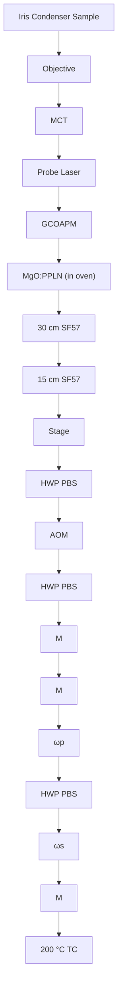

# Bond-Selective Imaging of Cells by Mid-Infrared Photothermal Microscopy in High Wavenumber Region

Yeran Bai,†,‡,§,∥ Delong Zhang, ∥ Chen Li,⊥ Cheng Liu,†,‡ and Ji-Xin Cheng\*, IiD

† National Laboratory on High Power Laser and Physics, Shanghai 201800, China  
‡ Key Laboratory of High Power Laser and Physics, Shanghai Institute of Optics and Fine Mechanics, Chinese Academy of Sciences, Shanghai 201800, China  
§ University of Chinese Academy of Sciences, Beijing 100049, China  
∥ Department of Biomedical Engineering, Electrical and Computer Engineering, Photonics Center, Boston University, Boston, Massachusetts 02215, United States  
⊥Department of Chemistry, Purdue University, West Lafayette, Indiana 47907, United States

ABSTRACT: Using a visible beam to probe the thermal effect induced by infrared absorption, mid-infrared photothermal (MIP) microscopy allows bond-selective chemical imaging at submicron spatial resolution. Current MIP microscopes cannot reach the high wavenumber region due to the limited tunability of the existing quantum cascade laser source. We extend the spectral range of MIP microscopy by difference frequency generation (DFG) from two chirped femtosecond pulses. Flexible wavelength tuning in both C−D and C−H regions was achieved with mid-infrared power up to 22.1 mW and spectral width of 29.3 cm−1 . Distribution of fatty acid in live human lung cancer cells was revealed by MIP imaging of the C−D bond at 2192 cm−1 .

text_image

PD
Mid-IR
Difference
Frequency
Generation
Near-IR
C-D
Colocalization
C-H

## INTRODUCTION

Chemical imaging with high spatial resolution and spectroscopic information opens a new window in understanding molecular behavior in a complex system, such as a live cell. Among the various modalities, vibrational spectroscopic imaging based on infrared (IR) absorption offers a way for mapping specific chemical bonds. Different molecular environments differ in spectral peaks and intensities, and through analyzing the IR spectra, these changes can be extracted to provide chemical and structural information. Combined with wide-field illumination and focal plane array, IR spectrometers can provide spatially resolved images where each pixel in the image presents an IR spectrum.1−3 Using quantum cascade lasers (QCL),4−6 wavelengths can be selected to perform noninterferometry discrete IR imaging. However, the direct IR imaging techniques suffer from poor spatial resolution due to long excitation wavelength, preventing them from resolving subcellular structures. To overcome the barrier, indirect measurements were developed, such as atomic force microscopy infrared spectroscopy (AFM-IR) that combines the chemical selectivity offered by IR absorption and high resolution of AFM.7,8

Photothermal spectroscopic imaging is another way to improve spatial resolution and has shown notable sensitivity in characterizing down to single molecules based on electronic absorption in the visible region.9,10 For vibrational absorption in the mid-IR region, the implementation involves a modulated/pulsed mid-IR laser as the pump with a continuous visible or near-IR laser as the probe. When the mid-IR beam is absorbed in certain vibrational frequency, thermal effect leads to a local temperature change and then a change of refractive index. By measuring the corresponding change in probe beam intensity, a photothermal imaging contrast is created. Furstenberg and colleagues demonstrated IR pump and visible probe photothermal imaging by scanning the edge of a calibration slide and estimated the spatial resolution to be \~2 μm.11 11 Erramilli and colleagues demonstrated photothermal spectroscopy between 1860 and 1980 cm−1 of a liquid crystal in different phases.12 Sander and co-workers imaged bird brain tissue slices and characterized cancerous and healthy mouse brain tissue using the photothermal contrast for amide I band.13,14 Zhang et al. improved the spatial resolution to 0.61 μm and demonstrated imaging of live cells and Caenorhabditis elegans in transmission mode.15 Li et al. illustrated the mapping of pharmaceutical ingredients in the fingerprint region with an epi-detected configuration.16 Using mid-IR optical parametric oscillator (OPO) output as the pump source, Hartland and colleagues demonstrated photothermal imaging of single E. coli by combining a reflective objective focusing the IR beam and a regular high numerical aperture (NA) objective focusing the visible probe beam in a counter-propagation scheme. 17

Received: September 26, 2017

Published: October 16, 2017

Thus, far, no literature has illustrated mid-infrared photothermal (MIP) imaging of live cells at the high wavenumber region. One technical barrier is the limited spectral coverage of mid-IR laser sources. Though customized QCLs can cover the $\mathrm { c m } ^ { - 1 } , { } ^ { 1 8 - 2 0 }$ the C−H region have mainly been achieved in laboratories for requirements on special design of materials.21−23 In addition, the limited tunability of individual QCL chip requires multiple units to cover the meaningful high wavenumber region, which increases the complexity of the product. Another way to generate mid-IR radiation is through frequency down-conversion from near-IR beams, among which the OPO and difference frequency generation (DFG) are most widely applied. Tunable mid-IR frequency combs based on OPO have been utilized in the spectroscopy applications, $^ { 2 4 , 2 5 }$ yet it requires resonant cavity design to lock the synchronous pump laser, drastically decreasing the stability and performance of such lasers. On the other hand, DFG utilizes single-path scheme and the output idler wavelength is determined by the input wavelengths, which simplifies the setup design and improves the wavelength stability. DFG from well-developed mode-locked Ti:sapphire lasers has been typically used to achieve stable wavelength tuning in terms of IR generation.26,27

In this work, we reported a DFG based mid-IR source and its use for photothermal imaging with submicron spatial resolution at high wavenumber region. To maximum the DFG output, we conducted theoretical calculations with different focusing parameters. Our experimental results showed a linear relationship between DFG idler powers with the input pump powers. We took the advantage of the spectral focusing scheme and decreased the spectral width by 5.5 times to $2 9 . 3 ~ \mathrm { c m } ^ { - 1 } .$ . The calibration of motorized stage positions with corresponding central wavenumbers was performed. In addition, the spectrum of deuterated glycerol acquired from Fourier-transform infrared (FTIR) and DFG-pumped MIP were compared in order to demonstrate the spectral fidelity. Furthermore, we employed deuterated fatty acid to confirm the correlation of our cell imaging results with the established metabolic pathways.

## THEORETICAL CALCULATION

The DFG process involves three interactive waves: two fundamental laser beams are focused into a nonlinear frequency conversion crystal to generate a third radiation with the frequency equal to the energy difference of fundamental beams. The efficiency of this process depends on the nonlinear frequency conversion crystal and can be optimized by carefully designing the beam coupling and focusing conditions. We used magnesium oxide doped periodically poled lithium niobate (MgO:PPLN) as the frequency conversion crystal based on the following considerations. (1) The quasi-phase matching (QPM) merit of the crystal requires the sign of nonlinear coefficient $\chi ^ { 2 }$ periodically changed. As a result, constructively interference enables continuously buildup of the generated light.28 (2) The effective nonlinear coefficient is large with typically value of 14.9 $\mathrm { { p m } / \mathrm { { V . } } ^ { 2 9 } }$ Since the phase-matching condition is satisfied by QPM, the largest component $\left( d _ { 3 3 } = 2 \bar { 5 } \right.$ pm/V) in the 2D matrix of the second-order susceptibility tensor can be used. (3) Lithium niobate is widely transparent from 0.34 to $5 ~ \mu \mathrm { m } ^ { 3 0 }$ compared AgGaS (AGS) with the transparent window in $0 . 5 { - } 1 . 3 ~ \mu \mathrm { m } . ^ { 3 1 }$ 2 (4) Doping MgO could improve the photorefractive damage threshold.30 In addition, crystal length is selected to be 5 mm in order to minimize group velocity mismatch for femtosecond laser pulses.32

We then performed a theoretical calculation of DFG output power as a function of input powers, crystal-related parameters, and focusing conditions. For Gaussian beams, under no absorption and phase-matching condition, the power of generated DFG is given $\boldsymbol { \mathrm { b y } } ^ { 3 3 }$

$$
P _ {\mathrm{i}} = P _ {\mathrm{p}} P _ {\mathrm{s}} \frac {3 2 \pi^ {2} d _ {\text {eff}} ^ {2} L}{\varepsilon_ {0} c n _ {\mathrm{i}} \lambda_ {\mathrm{i}} ^ {2} \left(n _ {\mathrm{s}} \lambda_ {\mathrm{p}} + n _ {\mathrm{p}} \lambda_ {\mathrm{s}}\right)} h (\xi , L) \tag {1}
$$

where $P _ { \mathrm { i } }$ represents the generated mid-IR “idler” beam, and $P _ { \mathrm { p } }$ and $P _ { s }$ are the powers of pump (higher frequency) and signal (lower frequency) of fundamental wave. $d _ { \mathrm { e f f } }$ and L represent the effective nonlinear coefficient and crystal length. λ is the wavelength and n is the refractive index of crystal calculated by the Sellmeier equation with the parameters given by the manufacturer. $h ( \bar { \xi } , L )$ is the focusing function

$$
h (\xi , L) = \operatorname{Re} \left(\frac {1}{4 \xi} \times \int_ {- \xi} ^ {\xi} d \tau \int_ {- \xi} ^ {\xi} d \tau^ {\prime} \frac {1}{1 + \tau \tau^ {\prime} - i \frac {1 + \mu^ {2}}{1 - \mu^ {2}} \left(\tau - \tau^ {\prime}\right)}\right) \tag {2}
$$

where ξ = ,L $\begin{array} { r } { \xi = \frac { L } { b } , \ \mu = \frac { n _ { \mathrm { s } } \lambda _ { \mathrm { p } } } { n _ { \mathrm { p } } \lambda _ { s } } , } \end{array}$ and b is the confocal parameter defined by beam waist ω: $\begin{array} { r } { b = \frac { 1 } { 2 } \big ( k _ { \mathrm { p } } \omega _ { \mathrm { p } } ^ { 2 } + k _ { \mathrm { s } } \omega _ { \mathrm { s } } ^ { 2 } \big ) } \end{array}$ . For $\lambda _ { \mathrm { p } } = 8 3 0$ nm, $\lambda _ { s } = 1 0 8 0$ nm, $L = 5$ mm and phase-matching temperature 185 ${ } ^ { \circ } \mathrm { C } ,$ a numerical calculation results of $h ( \xi )$ is shown in Figure 1. The maximum value of $h _ { \mathrm { m a x } } = 0 . 2 8 2$ is achieved at $\xi =$

line chart

| Point | ξ    | h(ξ) |
|-------|------|------|
| A     | 1.5  | 0.3  |
| B     | 1.5  | 0.3  |
| C     | 2.0  | 0.28 |
| D     | 4.0  | 0.24 |
| E     | 6.5  | 0.2  |

Figure 1. Focusing function $h ( \xi )$ versus $\xi$ calculated for $\lambda _ { \mathrm { p } } = 8 3 0$ nm, $\lambda _ { s } ~ = ~ 1 0 8 0$ nm, and crystal length of 5 mm. The typical values of 5 lenses with different focal length were labeled in the curve.

1.3 which corresponds to optimal focusing condition with a focal length of 133 mm. We have calculated the $h ( \xi )$ for 4 frequently used achromatic lenses, and the results were: h(f150 m $\dot { \mathrm { \bf ~ m } _ { } } ) = 0 . 2 7 9 , h ( f 1 0 0 \mathrm { ~ m m } ) = 0 . 2 6 9 , h ( f 7 5 \mathrm { ~ m m } ) = 0 . 2 3 4 , \dot { h } ( f 6 0 \mathrm { ~ m m } ) = 0 . 2 4 9 \times 1 0 ^ { - 1 0 } 0 ^ { - 1 } 0 ^ { - 1 } 0 ^ { - 1 } 0 ^ { - 1 } 0 ^ { - 1 } 0 ^ { - 1 } .$ 0 mm) = 0.197. With a negligible difference between $h ( f 1 5 0$ mm) and h(f133 mm), we utilized an achromatic lens with the focal length of 150 mm to focus two beams.

To gain the spectral resolution of the generated mid-IR beam, we used spectral focusing in which high refractive index glass rods are used to chirp the femtosecond pulses. Although the achievements of narrowband DFG pulses were demonstrated by grating or prism pairs,34,35 the implementation of pulse chirping by inserting highly dispersive materials in the beam path reduces the requirements on adjusting the delicate dispersion optics.36 Spectral focusing schemes have been extensively utilized for hyperspectral coherent anti-Stokes Raman scattering and SRS imaging.37−39 Here, we show the first demonstration of spectral focusing DFG for mid-infrared photothermal imaging purposes. Traditionally, DFG with narrow line width fundamental pulses achieves tunability by tuning one laser while the other remains fixed.40 After pulses are chirped, the overlapping of two pulses leads to reduced frequency bandwidth, and hence the spectral resolution of the generated mid-IR beam is improved. In the spectral focused DFG setup, varying the time delay will change the frequency overlapping of two fundamental pulses, thus the central wavelength of the generated beam will also be changed.

flowchart

Figure 2. Schematic of a DFG-pumped MIP microscope. The mid-IR source was generated by two spatially and spectrally overlapped femtosecond beams and a MgO:PPLN crystal. The thermal lensing effect was probed by a continuous 785 nm laser diode. HWP: half-wave plate. PBS: polarizing beam splitter. $\omega _ { \mathrm { { p } } } \mathrm { : }$ pump beam. ω : signal beam. M: mirror. Dashed M: flip mirror. AOM: acousto-optic modulator. SF57: SF57 glass rod. L: lens. TC: temperature control. F: filter. GCOAPM: gold coated off-axis parabolic mirror. MCT: mercury cadmium telluride. PD: photodiode. LIA: lock-in amplifier.

## EXPERIMENTAL SECTION

DFG Implementation. To generate the high wavenumber radiation for the MIP pump source, we utilized the DFG process by coupling a DFG crystal (MDFG2−5, Coversion) to a femtosecond laser system (Chameleon Vision, Coherent) and achieved flexible spectral tunability (Figure 2). The crystal is 5 mm long and has 9 adjacent poling periods in the range of 20.9 to 23.3 μm. We used two spatially and spectrally overlapped femtosecond near-IR beams, with one beam modulated by an acousto-optic modulator (AOM, 15180−1.06-LTD-GAP, Gooch & Housego) at the frequency around 100 kHz.15 A motorized stage was used as a delay line to adjust the temporal overlap of the two pulses. The oven holding the nonlinear crystal was mounted on a 2D translation stage enabling both the precise adjustment of focusing position and the switching between poling channels. A germanium window (WG91050- C9, Thorlabs) was used to remove beams with wavelength below 2 μm.

MIP Microscope. The generated mid-IR beam was collimated using a gold-coated off-axis parabolic mirror to avoid aberration and then coupled into the existing MIP microscope, serving as the pump beam for vibrational excitation of the sample (Figure 2). A flip mirror was inserted after beam collimation, guiding the mid-IR beam into a spectrometer (FT-IR Rocket, Arcoptix) and central wavelengths as well as spectral widths can be measured. A laser diode with central wavelength at 785 nm served as probe laser (LD-785-SE-400, Thorlabs). The pump and probe beams were collinearly combined with a platinum coated dichroic mirror (BSP-PD-25−2, ISP Optics) and then focused by a gold coated reflective objective with NA of 0.65 (#66589, Edmund Optics). The back-reflected mid-IR beam was recorded by a mercury cadmium telluride detector (PVM-10.6, Vigo System) for the purpose of spectrum normalization. The MIP signal was collected by a microscope condenser with a variable iris (NA = 0.55), and then detected by a photodiode (S3994−1, Hamamatsu). The modulation frequency of the pump beam in DFG processes was controlled by the lock-in amplifier (HF2LI, Zurich Instruments) by sending out triggers to the AOM, thus the generated mid-IR beam shared the same modulation frequency and the MIP signal was synchronously detected.

Spectral Focusing. We used one SF57 glass rod with a length of 15 cm in the signal $( \omega _ { s } )$ beam and two SF57 glass rods after the dichroic mirror that combined the pump $( \omega _ { \mathrm { p } } )$ and signal beams. The chirped pulse duration was measured to be about 1.48 ps using an autocorrelator. The delay between two beams was controlled by a motorized stage (T-LS, Zaber Technologies).

A549 Cell Imaging. $\mathrm { D } _ { 3 1 } .$ -palmitic acid powder (Cambridge Isotope Laboratories, Inc.) was dissolved in dimethyl sulfoxide at the final concentration of 50 mM and A549 human lung cancer cells were treated for 10 h after the cells were attached to the custom-built calcium fluoride bottom Petri dish. In the control group, the cell culture medium was supplemented with 50 mM regular palmitic acid and the cells were cultured for 10 h before MIP imaging. During the cell imaging processes, phosphate-buffered saline was supplemented every 15 min to prevent cells from drying.

## RESULTS AND DISCUSSION

DFG Output. With the configuration described in methods and by adjusting the angle of the half-wave plate to control powers, we measured DFG idler average powers as a function of pump powers with the signal power fixed at 280 mW. The fitting of data points showed a linear relationship and we got the maximum idler power of 30.2 mW with the pump power of 360 mW (Figure 3). The power density at the crystal was 2.69

scatterplot

| P_p (mW) | P_i (mW) |
|---|---|
| 200 | 16 |
| 245 | 20 |
| 310 | 24.5 |
| 360 | 30 |
The data points are plotted as black squares with error bars. The red line represents the linear trend of P_i against P_p. The x-axis is labeled P_p (mW), and the y-axis is labeled P_i (mW). There is no additional categories or trends present in the chart. The title appears to be 'Annotated' for the data series.

Figure 3. DFG average output idler powers versus input pump powers with the signal power fixed at 280 mW. Maximum of 30.2 mW was achieved with the pump power of 360 mW.

${ \mathrm { G W } } / { \mathrm { c m } } ^ { 2 } ,$ , which was below the estimated damage threshold of 4 $\mathrm { G W } / \mathrm { c m } ^ { 2 }$ . The quantum efficiency is defined as pump photons divided by idler photons, which gave 28%, and the result was comparable with the values in the literature.41 Theoretically, DFG tunable range is from 2050 to $5 3 0 0 ~ \mathrm { { c m } ^ { - 1 } }$ with various fundamental wavelength, temperature, and poling period combinations.

Improved Spectral Resolution Based on Spectral Focusing. To characterize our DFG output, we centered the IR beam at the C−D vibration of $2 0 9 2 ~ \mathrm { c m } ^ { - 1 }$ and demonstrated the spectral resolution and tuning capability of the spectral focusing system. The full width at half-maximum (fwhm) of the spectrum centered at $2 0 9 2 ~ \mathrm { c m ^ { - 1 } }$ was 29.3 $\mathrm { c m } ^ { - 1 }$ (Figure 4a) measured with the IR spectrometer and the maximum output power was 22.1 mW. In comparison, the fwhm of output DFG for unchirped pulses was $1 6 2 ~ \mathrm { { c m } ^ { - 1 } . }$ . As a result, the spectral width decreased by 5.5 times with our spectral focusing setup. Furthermore, we measured the output spectra when tuning the delay between two fundamental pulses (Figure 4a). The measured fwhm for each delay remained mostly the same. The motorized stage step position, as well as corresponding spectra, were simultaneously recorded for calibration (Figure 4b), in which the linear fitting showed a $\mathbb { R } ^ { 2 } = 0 . 9 9$ .

Spectral Fidelity of DFG-Pumped MIP Microscope. To test the spectral fidelity as well as the enhanced spectral resolution, we centered at the C−D vibrational bond and used deuterated glycerol as the sample. The FTIR spectra showed 2 peaks in the C−D region (Figure 5). For the $\bar { 2 } 0 9 2 ~ \mathrm { { c m } ^ { - 1 } }$ peak, two fundamental beams at 830 and 1005 nm were focusing at 22.4 μm poling channel with the crystal temperature at $2 0 0 \ { } ^ { \circ } { \mathrm { C } } ;$ while for $2 2 0 9 ~ \mathrm { { c m } ^ { - 1 } }$ peak, 830 and 1015 nm beams were focused at $2 1 . 8 \ \mu \mathrm { m }$ poling period with the crystal temperature at $1 9 8 \ ^ { \circ } \mathrm { C } .$ Since the spectra on the tuning edge within single poling channel were distorted, corresponding data points were abandoned, which causes the discontinuousness in the final spectrum. Overall consistency was observed between the FTIR and MIP spectra, which confirmed the spectral fidelity of DFGpumped MIP microscope.

High-Wavenumber MIP Imaging of Live A549 Cells. The performance of the DFG-pumped MIP system was evaluated by imaging the uptake of deuterium-labeled fatty acid in A549 human lung cancer cells. Inside cells, fatty acid can be converted to lipid droplets that are closely related to energy generation, membrane formation, and intracellular protein metabolism.42,43 Isotope labels enable tracking of the dynamic process of small molecules in live cells and organelles due to their small size and nontoxic merit. The deuterium isotope label has been used to investigate protein synthesis and degrada-$\mathrm { t i o n , } ^ { 4 4 }$ track lipogenesis from glucose in cancer $\mathrm { c e l l s , } ^ { 4 5 }$ probe intracellular cholesterol storage.46 Here, we demonstrate the visualization of fatty acid uptake in a single cell using the MIP imaging method. We used $\mathrm { d } _ { 3 1 } { \cdot } \mathrm { p a l m i t i c }$ acid as a testing bed. The measured FTIR spectrum of the d -palmitic acid powder showed 2092 and $2 1 9 0 ~ \mathrm { { c m } ^ { - 1 } }$ peaks in the C−D region. The MIP image at $2 9 4 0 ~ \mathrm { { c m } ^ { - 1 } }$ showed a combined concentration map of lipid and protein (Figure 6a). When tuned to 2092 $\mathrm { c m } ^ { \hat { - } 1 }$ , the C−D on MIP image depicted the distribution of the ${ \bf d } _ { 3 1 }$ -palmitic acid metabolites (Figure 6b). When tuning away from the high wavenumber region to 1850 cm−1 , no MIP contrast was observed (Figure 6c), verifying the background free capability of MIP microscopy. In the control group, no MIP contrast was revealed in either the C−D on channel or the off-resonance channel (Figure 6d−f), confirming the contrast in Figure 6b was indeed from the isotope molecule. Single lipid droplets were resolved in both C−D and C−H MIP images with submicron spatial resolution (Figure 6g−i). The probe power measured at the sample was 8.86 mW and the pump powers at the sample were 0.99 mW, 2.86 mW, and 4.7 mW for $\mathrm { \bar { 1 8 5 0 } c m ^ { - 1 } } , 2 0 9 2 \mathrm { \bar { c m } ^ { - 1 } }$ , and $2 9 4 0 ~ \mathrm { { c m } ^ { - 1 } }$ , respectively. The C−D signal appearing in the lipid droplets colocalized with the intracellular droplets, as well as in the cytoplasm, indicating of the conversion of $\mathrm { d } _ { 3 1 } - 1$ palmitic acid into triglycerides and membrane components. These observation were consistent with the established metabolic pathways of fatty acid uptake. 47

a  

line chart

| Wavenumber (cm⁻¹) | Normalized Spectra | FWHM (cm⁻¹) |
| ----------------- | ------------------ | ----------- |
| 2050              | 0.3                | 0           |
| 2100              | 1.0                | 30          |
| 2150              | 0.0                | 0           |

b  

line chart

| Moterized Stage Position | Wavenumber (cm⁻¹) |
| ------------------------ | ----------------- |
| 236000                   | 2160              |
| 237000                   | 2120              |
| 238000                   | 2080              |
| 239000                   | 2040              |

Figure 4. Performance and calibration of spectral focusing. (a) A series of DFG output spectra were recorded by changing the delay between two input pulses. (b) The calibration of generated mid-IR central wavenumber with motorized stage positions. The red line is the linear fitting result.

line chart

| Wavenumber (cm⁻¹) | MIP int. (a.u.) | % Absorption |
| ----------------- | --------------- | ------------ |
| 2050              | 1.5             | 0.08         |
| 2100              | 3.3             | 0.20         |
| 2150              | 2.7             | 0.14         |
| 2200              | 3.9             | 0.18         |
| 2250              | 1.0             | 0.05         |

Figure 5. Spectral fidelity of the DFG-pumped MIP microscope. FTIR (dashed) and MIP spectrum (solid) showed overall consistency. Raw MIP spectra were normalized by the mid-IR intensities recorded by the MCT detector.

  
Figure 6. High-wavenumber MIP image of A549 lung cancer cells. (a) MIP image at $2 9 4 0 ~ \mathrm { { c m } ^ { - 1 } }$ reveals C−H rich lipid and protein contents in $\mathrm { d } _ { 3 1 } -$ palmitic acid treated A549 cells. (b) C−D image showing the distribution of fatty acid metabolites. (c) Off-resonance image showing no MIP contrast. (d−f) Corresponding MIP images for control group treated with regular palmitic acid. (g) Expanded view of the dashed square in (b). (h− i) The intensity profiles of selected droplet indicated in $\mathbf { \eta } ( \mathbf { g } )$ along the horizontal and vertical direction, respectively. Gaussian fits and fwhm were shown. Image acquisition speed: 5 ms per pixel; Scale bars: 10 μm in (a−f), and 3 μm in (g).

We note that similar work revealing the influence of saturated and unsaturated fatty acid on cell lipotoxicity using an SRS microscope has been demonstrated.48 Due to the different physical mechanism of absorption and scattering processes, IR and Raman techniques can provide complementary information. However, lower power at sample is expected for IR methods because of the larger cross section (2.86 mW and 8.86 mW for pump and probe in MIP microscope; 10 mW and 40 mW for pump and Stokes in SRS microscope). The spatial resolution is another critical factor to resolve subcellular structures. Compared with the 0.42 μm lateral fwhm resolution of the SRS microscope, our MIP microscope achieved the submicron resolution of 0.61 μm (Figure 6g−i) and further improvement is possible by using shorter wavelength for the probe beam.

## CONCLUSIONS

We reported a mid-IR source by utilizing a femtosecond Ti:sapphire laser and a nonlinear crystal through the DFG process. Compared to QCLs which have limited tunability on a single chip, a key advantage of the DFG-based mid-IR source is its possibility to cover a broad spectral region. Spectral focusing narrowed the spectral width from 162 to 29.3 cm−1 . Using the DFG output as the pump source for the MIP microscope, we demonstrated the capability to map C−H and C−D bonds in live cells. With extended spectral window, MIP microscopy can be used to resolve more subcellular structures. Furthermore, by employing deuterium labels to small molecules, visualization of metabolic activities, such as de novo lipogenesis and protein synthesis via IR based approach is expected.

## AUTHOR INFORMATION

## Corresponding Author

\*jxcheng@bu.edu.

ORCID

Delong Zhang: 0000-0002-9734-3573

Chen Li: 0000-0002-4391-6196

Ji-Xin Cheng: 0000-0002-5607-6683

## Author Contributions

J.X.C. conceived the idea. Y.B. and D.Z. performed the experiments. All authors have given approval to the final version of the manuscript. Y.B. and D.Z. contributed equally.

## Notes

The authors declare no competing financial interest.

## ACKNOWLEDGMENTS

This work was partially supported by a Keck Foundation Science and Engineering grant to J.X.C. Y.B. acknowledges the UCAS (UCAS [2015]37) Joint Ph.D. Training Program for financial support.

## REFERENCES

(1) Lasch, P.; Boese, M.; Pacifico, A.; Diem, M. FT-IR Spectroscopic Investigations of Single Cells on the Subcellular Level. Vib. Spectrosc. 2002, 28, 147−157.  
(2) Chan, K. L.; Kazarian, S. G. Detection of Trace Materials with Fourier Transform Infrared Spectroscopy Using a Multi-Channel Detector. Analyst 2006, 131, 126−131.  
(3) Kazarian, S. G.; Chan, K. L. ATR-FTIR Spectroscopic Imaging: Recent Advances and Applications to Biological Systems. Analyst 2013, 138, 1940−1951.  
(4) Kole, M. R.; Reddy, R. K.; Schulmerich, M. V.; Gelber, M. K.; Bhargava, R. Discrete Frequency Infrared Microspectroscopy and Imaging with a Tunable Quantum Cascade Laser. Anal. Chem. 2012, 84, 10366−10372.  
(5) Bassan, P.; Weida, M. J.; Rowlette, J.; Gardner, P. Large Scale Infrared Imaging of Tissue Micro Arrays (TMAs) Using a Tunable Quantum Cascade Laser (QCL) Based Microscope. Analyst 2014, 139, 3856−3859.  
(6) Kroger, N.; Egl, A.; Engel, M.; Gretz, N.; Haase, K.; Herpich, I.; Kranzlin, B.; Neudecker, S.; Pucci, A.; Schonhals, A. Quantum Cascade Laser-Based Hyperspectral Imaging of Biological Tissue. J. Biomed. Opt. 2014, 19, 111607.  
(7) Huth, F.; Schnell, M.; Wittborn, J.; Ocelic, N.; Hillenbrand, R. Infrared-Spectroscopic Nanoimaging with a Thermal Source. Nat. Mater. 2011, 10, 352−356.  
(8) Huth, F.; Govyadinov, A.; Amarie, S.; Nuansing, W.; Keilmann, F.; Hillenbrand, R. Nano-FTIR Absorption Spectroscopy of Molecular Fingerprints at 20 nm Spatial Resolution. Nano Lett. 2012, 12, 3973− 3978.  
(9) Gaiduk, A.; Yorulmaz, M.; Ruijgrok, P. V.; Orrit, M. Room-Temperature Detection of a Single Molecule’s Absorption by Photothermal Contrast. Science 2010, 330, 353−356.  
(10) Ding, T. X.; Hou, L.; Meer, H. v. d.; Alivisatos, A. P.; Orrit, M. Hundreds-Fold Sensitivity Enhancement of Photothermal Microscopy in Near-Critical Xenon. J. Phys. Chem. Lett. 2016, 7, 2524−2529.  
(11) Furstenberg, R.; Kendziora, C. A.; Papantonakis, M. R.; Nguyen, V.; McGill, R. A. In Chemical Imaging Using Infrared Photothermal Microspectroscopy, Proceedings of SPIE Defense, Security, and Sensing,

Baltimore, MD, Apr 23−27, 2012; Druy, M., Crocombe, R., Eds.; SPIE: Baltimore, MA, 2012; p 837411.

(12) Mertiri, A.; Jeys, T.; Liberman, V.; Hong, M. K.; Mertz, J.; Altug,̈ H.; Erramilli, S. Mid-Infrared Photothermal Heterodyne Spectroscopy in a Liquid Crystal Using a Quantum Cascade Laser. Appl. Phys. Lett. 2012, 101, 044101

(13) Mertiri, A.; Totachawattana, A.; Liu, H.; Hong, M. K.; Gardner,̈ T.; Sander, M. Y.; Erramilli, S. In Label Free Mid-IR Photothermal Imaging of Bird Brain with Quantum Cascade Laser, Proceedings of Conference on Lasers and Electro-Optics, San Jose, CA, Jun 8−13, 2014; Optical Society of America: Washington, DC, 2014; p AF1B.4.

(14) Totachawattana, A.; Regan, M. S.; Agar, N. Y.; Erramilli, S.; Sander, M. Y. In Label-Free Mid-Infrared Photothermal Spectroscopy and Imaging of Neurological Tissue, Proceedings of Conference on Lasers and Electro-Optics, San Jose, CA, May 14−19, 2017; Optical Society of America: Washington, DC, 2017; p ATu4A. 3.

(15) Zhang, D.; Li, C.; Zhang, C.; Slipchenko, M. N.; Eakins, G.; Cheng, J.-X. Depth-Resolved Mid-Infrared Photothermal Imaging of Living Cells and Organisms with Submicrometer Spatial Resolution. Sci. Adv. 2016, 2, e1600521.

(16) Li, C.; Zhang, D.; Slipchenko, M. N.; Cheng, J.-X. Mid-Infrared Photothermal Imaging of Active Pharmaceutical Ingredients at Submicrometer Spatial Resolution. Anal. Chem. 2017, 89, 4863−4867.

(17) Li, Z.; Aleshire, K.; Kuno, M.; Hartland, G. V. Super-Resolution Far-Field Infrared Imaging by Photothermal Heterodyne Imaging. J. Phys. Chem. B 2017, 121, 8838−8846.

(18) Grills, D. C.; Cook, A. R.; Fujita, E.; George, M. W.; Preses, J. M.; Wishart, J. F. Application of External-Cavity Quantum Cascade Infrared Lasers to Nanosecond Time-Resolved Infrared Spectroscopy of Condensed-Phase Samples following Pulse Radiolysis. Appl. Spectrosc. 2010, 64, 563−570.

(19) Lopatik, D.; Lang, N.; Macherius, U.; Zimmermann, H.; Röpcke, J. On the Application of CW External Cavity Quantum Cascade Infrared Lasers for Plasma Diagnostics. Meas. Sci. Technol. 2012, 23, 115501.

(20) Wörle, K.; Seichter, F.; Wilk, A.; Armacost, C.; Day, T.; Godejohann, M.; Wachter, U.; Vogt, J.; Radermacher, P.; Mizaikoff, B. Breath Analysis with Broadly Tunable Quantum Cascade Lasers. Anal. Chem. 2013, 85, 2697−2702.

(21) Faist, J.; Capasso, F.; Sivco, D. L.; Hutchinson, A. L.; Chu, S.-N. G.; Cho, A. Y. Short Wavelength (l ∼ 3.4 mm) Quantum Cascade Laser Based on Strained Compensated InGaAs/AlInAs. Appl. Phys. Lett, 1998, 72. 680682.

(22) Commin, J. P.; Revin, D. G.; Zhang, S. Y.; Krysa, A. B.; Kennedy, K.; Cockburn, J. W. High Peak Power l ∼ 3.3 and 3.5 mm InGaAs/AlAs (Sb) Quantum Cascade Lasers Operating up to 400 K. Appl. Phys. Lett. 2010, 97, 031108.

(23) Revin, D. G.; Commin, J. P.; Zhang, S. Y.; Krysa, A. B.; Kennedy, K.; Cockburn, J. W. InP-Based Midinfrared Quantum Cascade Lasers for Wavelengths Below 4 mm. IEEE J. Sel. Top. Ouantum Electron. 2011, 17, 14171425.

(24) Adler, F.; Masłowski, P.; Foltynowicz, A.; Cossel, K. C.; Briles, T. C.; Hartl, I.; Ye, J. Mid-Infrared Fourier Transform Spectroscopy with a Broadband Frequency Comb. Opt. Express 2010, 18, 21861− 21872.

(25) Foltynowicz, A.; Masłowski, P.; Fleisher, A. J.; Bjork, B. J.; Ye, J. Cavity-Enhanced Optical Frequency Comb Spectroscopy in the Mid Infrared Application to Trace Detection of Hydrogen Peroxide. Appl. Phys. B: Lasers Opt. 2013, 110, 163−175.

(26) Chen, W.; Mouret, G.; Boucher, D.; Tittel, F. K. Mid-Infrared Trace Gas Detection Using Continuous-Wave Difference Frequency Generation in Periodically Poled RbTiOAsO . Appl. Phys. B: Lasers Opt. 2001, 72, 873−876.

(27) Xuan, H.; Zou, Y.; Wang, S.; Han, H.; Wang, Z.; Wei, Z. Generation of Ultrafast Mid-Infrared Laser by DFG between Two Actively Synchronized Picosecond Lasers in a MgO: PPLN Crystal. Appl. Phys. B: Lasers Opt. 2012, 108, 571−575.

(28) Boyd, R. W. Nonlinear Opt.; Academic Press: San Diego, CA, 2003.

(29) Cruz, F. C.; Maser, D. L.; Johnson, T.; Ycas, G.; Klose, A.; Giorgetta, F. R.; Coddington, I.; Diddams, S. A. Mid-Infrared Optical Frequency Combs Based on Difference Frequency Generation for Molecular Spectroscopy. Opt. Express 2015, 23, 26814−26824.  
(30) Ishizuki, H.; Taira, T. High-Energy Quasi-Phase-Matched Optical Parametric Oscillation in a Periodically Poled MgO:LiNbO Device with a 5 mm × 5 mm Aperture. Opt. Lett. 2005, 30, 2918− 2920.  
(31) Pires, H.; Baudisch, M.; Sanchez, D.; Hemmer, M.; Biegert, J. Ultrashort Pulse Generation in the Mid-IR. Prog. Quantum Electron. 2015, 43, 1−30.  
(32) Sigrist, M. W.; Wachter, H. In̈ Springer Handbook of Lasers and Optics; Trager, F., Ed.; Springer Science + Business Media: Berlin,̈ Germany, 2012; pp 801−813.  
(33) Borri, S.; Cancio, P.; De Natale, P.; Giusfredi, G.; Mazzotti, D.; Tamassia, F. Power-Boosted Difference-Frequency Source for High Resolution Infrared Spectroscopy. Appl. Phys. B: Lasers Opt. 2003, 76, 473−477.  
(34) Danielson, J. R.; Jameson, A. D.; Tomaino, J. L.; Hui, H.; Wetzel, J. D.; Lee, Y.-S.; Vodopyanov, K. L. Intense Narrow Band Terahertz Generation Via Type-II Difference-Frequency Generation in ZnTe Using Chirped Optical Pulses. J. Appl. Phys. 2008, 104, 033111.  
(35) Jin, L.; Yamanaka, M.; Sonnenschein, V.; Tomita, H.; Iguchi, T.; Sato, A.; Oh-hara, T.; Nishizawa, N. Highly Coherent Tunable Mid-Infrared Frequency Comb Pumped by Supercontinuum at 1 μm. Appl. Phys. Express 2017, 10, 012503.  
(36) Cartella, A.; Nova, T. F.; Oriana, A.; Cerullo, G.; Först, M.; Manzoni, C.; Cavalleri, A. Narrowband Carrier-Envelope Phase Stable Mid-Infrared Pulses at Wavelengths Beyond 10 mm by Chirped-Pulse Difference Frequency Generation. Opt. Lett. 2017, 42, 663−666.  
(37) Rocha-Mendoza, I.; Langbein, W.; Borri, P. Coherent Anti-Stokes Raman Microspectroscopy Using Spectral Focusing with Glass Dispersion. Appl. Phys. Lett. 2008, 93, 201103.  
(38) Langbein, W.; Rocha-Mendoza, I.; Borri, P. Single Source Coherent Anti-Stokes Raman Microspectroscopy Using Spectral Focusing. Appl. Phys. Lett. 2009, 95, 081109.  
(39) Fu, D.; Holtom, G.; Freudiger, C.; Zhang, X.; Xie, X. S. Hyperspectral Imaging with Stimulated Raman Scattering by Chirped Femtosecond Lasers. J. Phys. Chem. B 2013, 117, 4634−4640.  
(40) Theberge, F.; Chá teauneuf, M.; Dubois, J.; Villeneuve, A.;̂ Salhany, J.; Burgoyne, B. In Tunable Mid-Infrared Generation Using a Synchronized Programmable Fiber Lasers, Photonics Society Summer Topical Meeting Series, Montreal, Canada, Jul 18−20, 2011; IEEE: New York City, NY, 2011; pp 71−72.  
(41) Erny, C.; Moutzouris, K.; Biegert, J.; Kühlke, D.; Adler, F.; Leitenstorfer, A.; Keller, U. Mid-Infrared Difference-Frequency Generation of Ultrashort Pulses Tunable between 3.2 and 4.8 mm from a Compact Fiber Source. Opt. Lett. 2007, 32, 1138−1140.  
(42) Farese, R. V.; Walther, T. C. Lipid Droplets Finally Get a Little R-E-S-P-E-C-T. Cell 2009, 139, 855−860.  
(43) Welte, M. A. Expanding Roles for Lipid Droplets. Curr. Biol. 2015, 25, R470−R481.  
(44) Wei, L.; Yu, Y.; Shen, Y.; Wang, M. C.; Min, W. Vibrational Imaging of Newly Synthesized Proteins in Live Cells by Stimulated Raman Scattering Microscopy. Proc. Natl. Acad. Sci. U. S. A. 2013, 110, 11226−11231.  
(45) Li, J.; Cheng, J.-X. Direct Visualization of De novo Lipogenesis in Single Living Cells. Sci. Rep. 2014, 4, 6807.  
(46) Alfonso-García, A.; Pfisterer, S. G.; Riezman, H.; Ikonen, E.; Potma, E. O. D38-Cholesterol as a Raman Active Probe for Imaging Intracellular Cholesterol Storage. J. Biomed. Opt. 2016, 21, 061003.  
(47) Kuhajda, F. P. Fatty Acid Synthase and Cancer: New Application of an Old Pathway. Cancer Res. 2006, 66, 5977−5980.  
(48) Zhang, D.; Slipchenko, M. N.; Cheng, J.-X. Highly Sensitive Vibrational Imaging by Femtosecond Pulse Stimulated Raman Loss. J. Phys. Chem. Lett. 2011, 2, 1248−1253.