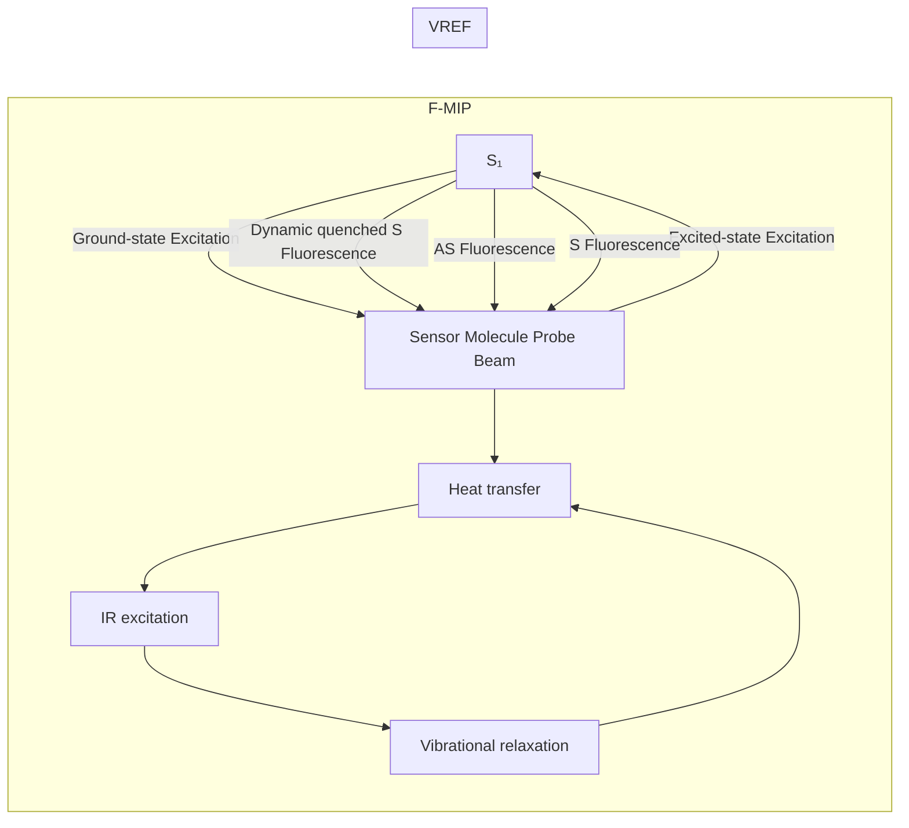
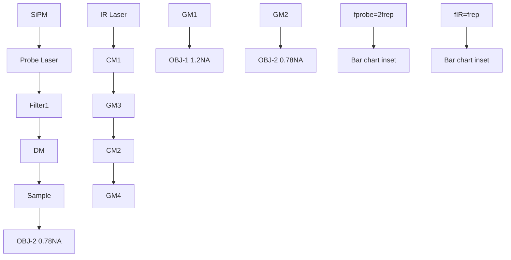
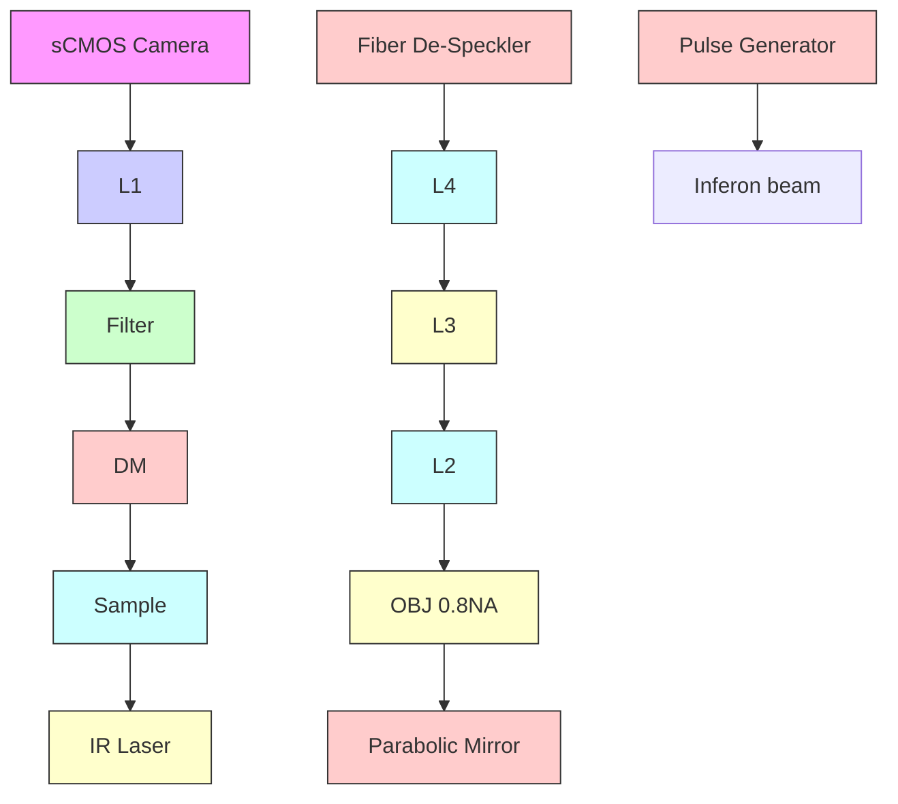

pubs.acs.org/JPCL

Letter

# Bond-Selective Imaging via Vibrational Relaxation Encoded Fluorescence

George Abu-Aqil,⊥ Dashan Dong,⊥ Jiaze Yin,⊥ Jianpeng Ao, Hongjian He, Guangrui Ding, Qing Xia, and Ji-Xin Cheng\*

Cite This: J. Phys. Chem. Lett. 2025, 16, 12401−12410

Read Online

ACCESS

Metrics & More

Article Recommendations

Supporting Information

ABSTRACT: Fluorescence microscopy visualizes cells and organelles but lacks molecular specificity. To overcome this, we report Vibrational Relaxation Encoded Fluorescence (VREF) microscopy, a photothermal chemical imaging approach that encodes vibrational selectivity into fluorescence. A laser excites molecular vibrations within cells or organelles, and subsequent vibrational relaxation into heat raises the local temperature. This thermal effect alters the Boltzmann equilibrium of nearby reporters, resulting in a thermally activated fluorescence. Unlike methods that suppress fluorescence quantum yield through thermally accelerated dynamic quenching, VREF utilizes an anti-Stokes excitation scheme, producing positive fluorescence modulation, and offers compatibility with common, thermal-

insensitive dyes. Applications to mammalian cells and bacteria demonstrate its potential for high-quality functional imaging with reduced background noise. Importantly, VREF detects subtle biochemical and metabolic changes in bacteria exposed to antibiotics, including concentrations below the minimum inhibitory concentration. These findings establish VREF as a unique tool for live-cell imaging, functional single-cell analysis, and characterization of antibiotic resistance.

text_image

Fluorescence
excitation
Anti-Stokes
Fluorescence
Sample
Mid-infrared
pulses
Heat transfer
s₁
s₂
Single cell chemical imaging

luorescence microscopy has revolutionized life science and biomedical research by enabling the visualization of cells, organelles, and biomolecules with high specificity and spatial resolution.1 Targeted fluorescent probes can track biological processes in real time, establishing fluorescence microscopy as the most widely used optical imaging tool in biology and medicine.1,2 Single molecule sensitivity and versatility have made fluorescence indispensable in studies ranging from basic cell biology to clinical diagnostics.3 Despite these strengths, fluorescence microscopy lacks chemical information, limiting functional analysis such as metabolic activity, antibiotic response, disease progression, and organellar heterogeneity.

To address these limitations, vibrational spectroscopic imaging techniques based on infrared (IR) absorption and Raman scattering have been developed to directly probe chemical bonds in molecules.5−8 While these approaches enable molecular fingerprinting and have been applied in studies of drug response,9,10 fungal infections,11 metabolism,12 and cancer identification,13 their weak signals, limited sensitivity, and trade-offs between speed and spatial resolution restrict broader application. Nonlinear vibrational microscopy overcomes this challenge by providing nonlinear optical or thermal readouts of molecular vibrations.14−17 In particular, recently developed mid-IR photothermal (MIP) microscopy combines the large absorption cross sections of mid-IR with pump−probe detection to achieve submicron resolution and live-cell compatibility.18−22 Furthermore, fluorescence-de tected MIP (F-MIP) takes advantage of the thermal sensitivity of fluorescence quantum yield23 to enhance modulation depth by over 2 orders of magnitude, enabling high-contrast organelle-level chemical imaging with thermal-sensitive dyes.24−26

Here, we introduce vibrational relaxation-encoded fluorescence (VREF) microscopy, a new photothermal chemical imaging approach that encodes vibrational selectivity into fluorescence emission while ensuring broad dye compatibility. The underlying principle of VREF is rooted in the Boltzmann distribution of the vibrational states. At thermal equilibrium, a fraction of molecules in the ground electronic state occupy higher vibrational levels, with a population that decreases exponentially as energy increases.27 The ratio of populations between the excited and ground vibrational states is determined by the Boltzmann equilibrium, establishing a statistical connection between vibrational populations and

Received: October 17, 2025

Revised: November 14, 2025

Accepted: November 17, 2025

Published: November 20. 2025

(a)  

flowchart

(b)  

line chart

| Time | IR | Visible laser | F-MIP | Detected Fluorescence | VREF |
| --- | --- | --- | --- | --- | --- |
| 0 | 1 | 1 | 1 | 1 | 1 |
| Hot | 1 | 1 | 1 | 1 | 1 |
| Cold | 1 | 1 | 1 | 1 | 1 |
| Hot | 1 | 1 | 1 | 1 | 1 |
| Cold | 1 | 1 | 1 | 1 | 1 |
| Hot | 1 | 1 | 1 | 1 | 1 |
| Cold | 1 | -1 | -1 | -1 | -1 |
| Hot | -1 | -1 | -1 | -1 | -1 |
| Cold | -1 | -1 | -1 | -1 | -1 |
| Hot | -1 | -2 | -2 | -2 | -2 |
| Cold | -2 | -2 | -2 | -2 | -2 |
| Hot | -2 | -2 | -2 | -2 | -2 |
| Cold | -2 | -2 | -2 | -2 | -2 |
| Hot | -3 | -3 | -3 | -3 | -3 |
| Cold | -3 | -3 | -3 | -3 | -3 |
| Hot | -3 | -3 | -3 | -3 | -3 |
| Cold | -3 | -3 | -3 | -3 | -3 |
| Hot | -4 | -4 | -4 | -4 | -4 |
| Cold | -4 | -4 | -4 | -4 | -4 |
| Hot | -4 | -4 | -4 | -4 | -4 |
| Cold | -4 | -4 | -4 | -4 | -4 |
| Hot | -5 | -5 | -5 | -5 | -5 |
| Cold | -5 | -5 | -5 | -5 | -5 |
| Hot | -5 | -5 | -5 | -5 | -5 |
| Cold | -5 | -5 | -5 | -5 | -5 |
| Hot | -6 | -6 | -6 | -6 | -6 |
| Cold | -6 | -6 | -6 | -6 | -6 |
| Hot | -6 | -6 | -6 | -6 | -6 |
| Cold | -6 | -6 | -6 | -6 | -6 |
| Hot | -7 | -7 | -7 | -7 | -7 |
| Cold | -7 | -7 | -7 | -7 | -7 |
| Hot | -7 | -7 | -7 | -7 | -7 |
| Cold | -7 | -7 | -7 | -7 | -7 |
| Hot | -8 | -8 | -8 | -8 | -8 |
| Cold | -8 | -8 | -8 | -8 | -8 |
| Hot | -8 | -8 | -8 | -8 | -8 |
| Cold | -8 | -8 | -8 | -8 | -8 |
| Hot | -9 | -9 | -9 | -9 | -9 |
| Cold | -9 | -9 | -9 | -9 | -9 |
| Hot | -9 | -9 | -9 | -9 | -9 |
| Cold | -9 | -9 | -9 | -9 | -9 |
| Hot | +1 | +1 | +1 | +1 | +1 |
| Cold | +1 | +1 | +1 | +1 | +1 |
| Hot | +1 | +1 | +1 | +1 | +1 |
| Cold | +1 | +1 | +1 | +1 | +1 |
| Hot | +2 | +2 | +2 | +2 | +2 |
| Cold | +2 | +2 | +2 | +2 | +2 |
| Hot | +2 | +2 | +2 | +2 | +2 |
| Cold | +2 | +2 | +2 | +2 | +2 |

(c)

line chart

| Temperature (K) | Population Ratio (N₂/N₁) | Modulation depth (%/K) |
| --------------- | ------------------------- | ----------------------- |
| 200             | 0.0000                    | 6                       |
| 250             | 0.0005                    | 4                       |
| 300             | 0.0010                    | 3                       |
| 350             | 0.0020                    | 2                       |
| 400             | 0.0030                    | 1                       |

Figure 1. Vibrational relaxation encoded fluorescence (VREF) theory, principle, and spectral reliability. (a) Working principle of VREF and F-MIP. The target molecule is excited by IR and relaxes in a nonradiative way, transferring heat to the nearby sensor molecule. In F-MIP, the sensor molecule undergoes ground-state excitation, while in VREF, the sensor molecule undergoes excited-state excitation. S: Stokes; AS: anti-Stokes. (b) Fluorescence excitation records the entire IR-induced photothermal signal in F-MIP and only signal at the “hot” state in VREF, thus reducing the photobleaching. (c) Calculations based on Boltzmann distribution highlighting the exponential population ratio and modulation depth sensitivity per Kelvin.

temperature.28,29 The concept of exciting a system with lowerenergy photons and detecting higher-energy emission has been recognized in spectroscopic methods such as anti-Stokes fluorescence and coherent anti-Stokes Raman spectroscopy. 30,31

We note that VERF is different from stimulated Raman excited fluorescence32,33 or fluorescence-encoded infrared spectroscopy,34−36 in which up-converting fluorescence is used to retrieve vibrational information from a fluorescent molecule. Instead, VREF microscopy employs an anti-Stokes excitation scheme to generate thermally activated fluorescence and retrieve information from molecules surrounding the fluorescent reporter. Unlike F-MIP that is restricted to thermally sensitive dyes and constrained by photobleaching as the modulation relies on excited fluorophores,25,26 the VREF approach enhances the photon yield via off-resonance excitation, creating a positive contrast while reducing photo bleaching. Importantly, it extends compatibility to a wider range of common dyes that are otherwise thermal insensitive.

This approach enables chemically resolved imaging of live cells, organelles, and bacteria, expanding fluorescence microscopy into the domain of functional chemical analysis with a direct relevance to cellular physiology.

The principle of VREF can be understood in relation to F MIP, which couples IR absorption to fluorescence via the photothermal effect. F-MIP imaging couples IR absorption to fluorescence emission by photothermal modulation of fluorescence quantum yield, thereby revealing the chemical signatures of biomolecules.25 As can be seen in Figure 1a, the working principle behind F-MIP relies on mid-IR photons, which excite vibrational modes of target molecules. and the subsequent relaxation generates localized heating. This local heating enhances the nonradiative decay pathways of nearby fluorescent probes, reducing their quantum yield through thermally induced nonradiative relaxation. The increase in temperature intensifies the dynamic quenching process of fluorophores, resulting in reduced fluorescence emission. This effect was implemented by exciting the fluorescent molecules with a continuous-wave visible laser to record fluorescence changes correlated with molecular vibrational absorption features. 25

flowchart

line chart

| Wavenumber (cm⁻¹) | FAM    | FITC   | Nile Red | FTIR   |
| ----------------- | ------ | ------ | -------- | ------ |
| 0                 | 1.0    | 1.0    | 1.0      | 1.0    |
| 1100              | 0.1    | 0.1    | 0.1      | 0.1    |
| 1200              | 0.0    | 0.0    | 0.0      | 0.0    |
| 1300              | 0.1    | 0.1    | 0.1      | 0.1    |
| 1400              | 0.3    | 0.3    | 0.3      | 0.3    |
| 1500              | 0.0    | 0.0    | 0.0      | 0.0    |

line chart

| Wavenumber (cm⁻¹) | BSA    | DNA    | Glycogen | TAG    |
| ----------------- | ------ | ------ | -------- | ------ |
| 1000              | 0.0    | 0.0    | 0.0      | 0.0    |
| 1100              | 0.8    | 1.0    | 0.9      | 0.4    |
| 1200              | 0.3    | 0.4    | 0.2      | 0.3    |
| 1300              | 0.2    | 0.2    | 0.1      | 0.2    |
| 1400              | 0.3    | 0.1    | 0.1      | 0.2    |
| 1500              | 0.7    | 0.2    | 0.1      | 0.1    |
| 1600              | 1.0    | 0.3    | 0.1      | 0.1    |
| 1700              | 0.9    | 0.2    | 0.1      | 0.9    |
| 1800              | 0.0    | 0.0    | 0.0      | 0.0    |

Figure 2. VREF microscope and spectral reliability. (a) Schematic of the point-scanning VREF microscope. GM: galvo mirrors; CM: concave mirrors; DM: dichroic mirrors; SiPM: silicon photomultiplier. (b) Averaged VREF spectra of DMSO supplemented with various fluorescent dyes. FTIR spectrum was used for comparison. (c) Averaged VREF spectra of different supplements with Nile Red dye representing the different biological spectral features. The errors were calculated as the standard deviation of three independent measurements at each wavenumber and presented as shadow areas.

VREF follows a similar excitation−detection scheme but with an anti-Stokes mechanism, where thermally populated vibrational states are excited by the probe beam, leading to enhanced fluorescence emission. As illustrated in Figure 1a, the process begins with thermal activation to promote a fraction of molecules in the ground electronic state into higher vibrational levels of the sensor molecule, as determined by the Boltzmann distribution.29 Then, a visible probe excites these thermally populated states into the electronic excited state. As a result, the emission includes conventional Stokes fluorescence at longer wavelengths as well as anti-Stokes fluorescence at shorter wavelengths, thus, encoding vibrational population information into the fluorescence signal. This mechanism enables chemical imaging with broad compatibility across dyes, including thermally insensitive ones.

While both F-MIP and VREF rely on modulation by the pulsed IR beam, their fluorescence intensity differs in contrast, as shown in Figure 1b. Whereas a negative modulation is produced in F-MIP, VREF produces fluorescence only when the IR is on (“hot” state), while negligible emission occurs when the IR is off (“cold” state), resulting in a positive modulation. Technically, chopping the probe into pulses could reduce the overall excitation dose, thereby mitigating photobleaching while preserving signal fidelity.

The temperature-dependent population ratio between excited and ground vibrational states, $N _ { 2 } / N _ { 1 } ,$ follows the Boltzmann distribution:

$$
\frac {N _ {2}}{N _ {1}} = \exp \left(- \frac {\Delta E}{k _ {B} T}\right)
$$

Where $N _ { 2 } / N _ { 1 }$ denotes the ratio of populations in the excited and ground vibrational states, respectively; ΔE is the energy difference between these states (in electronvolts, $\mathrm { e V } ) ; k _ { B }$ is the Boltzmann constant $( 8 . 6 1 7 ~ \times ~ 1 0 ^ { - 5 } ~ \mathrm { e V / K } )$ ; and $T$ is the absolute temperature in kelvin (K). This ratio decreases exponentially with the vibrational energy gap and determines how thermal activation modulates the available population for excitation. Figure 1c illustrates this relationship, showing how population ratios vary with transition energy ΔE and temperature T as well as the corresponding sensitivity per K. F-MIP exhibits approximately 1% per K modulation of fluorescence intensity.25 For VREF, assuming a transition energy of 0.2 eV corresponding to $1 6 1 3 . 1 ~ \mathrm { c m } ^ { - 1 }$ and a room temperature of 300 K, the calculated change in population corresponds to a modulation depth of ∼3% per K (Figure 1c). This relatively large modulation ensures the high sensitivity of VREF for vibrational imaging. While the anti-Stokes excitation scheme of VREF enhances the sensitivity to ∼3% per $\mathrm { K } ,$ about twice that of conventional Stokes-based detection, this improvement comes with an intrinsic trade-off. Since only a small fraction of thermally populated molecules contributes to anti-Stokes emission, the absolute photon count is ∼1000 times lower, resulting in a theoretical ∼30-fold reduction in signal-to-noise ratio (SNR) under Poisson statistics.37 In practice, this reduction is compensated by stronger fluorescence excitation or averaging over repeated excitation cycles to allow reliable detection without excessive excitation power. Thus, VREF provides a fayorable balance between enhanced sensitivity and manageable photon-statistical limitations.

Based on the above principle, we have developed a scanning VREF microscope as shown in Figure 2a. The microscope integrated a tunable mid-IR quantum cascade laser (QCL) for vibrational excitation and a visible laser for fluorescence excitation, enabling synchronized counterpropagating dualbeam excitation. The fluorescence collected in epi-detection mode was filtered and detected by a SiPM. Hyperspectral imaging was performed by tuning the QCL across the fingerprint region. Scanning is performed by two synchronized galvo pairs. Details are provided in the Experimental Section.

  
Figure 3. Hyperspectral VREF imaging of live cells labeled with Nile Red. (a) Fluorescence images of live HeLa cells acquired with the scanning system at 1649 $\mathrm { c m } ^ { - 1 }$ and at $\mathrm { ( b ) 1 7 9 7 ~ c m ^ { - 1 } . ~ ( c ) }$ Corresponding VREF images at 1649 $\mathrm { c m } ^ { - 1 }$ and at (d) 1797 $\mathrm { c m } ^ { - 1 }$ , with three ROIs selected from the nucleus and three from the cytoplasm of the same cell. (e) Normalized VREF spectra from the nucleus and cytoplasm. Errors are calculated as standard deviations and shown as shaded areas. (f) Ratios of phosphate/amide I for cytoplasm and nucleus, respectively (t test: $* * * * P < 0 . 0 0 0 1 \big )$ . Scale bar: 10 μm.

To validate the spectral fidelity of VREF, the 1000 to 1500 $\mathrm { c m } ^ { - 1 }$ region was scanned. Two thermal sensitive dyes (FITC38 and Nile $\operatorname { R e d } ^ { 3 9 } )$ and a thermal insensitive dye $\left( \dot { \mathrm { F A M } } ^ { 3 8 } \right)$ dissolved in DMSO were used as testbeds. As shown in Figure 2b, the obtained VREF spectra for all dyes accurately reproduced the characteristic absorption bands of DMSO, with excellent agreement in both peak position and width. Notably, since the dye concentration (100 μM) was far lower than that of the solvent, the presence of the fluorophores did not distort the spectra. For validation, the corresponding FTIR spectrum of pure DMSO is included, demonstrating that VREF reliably captures the same vibrational features as FTIR spectroscopy.

Although the thermally populated fraction contributing to anti-Stokes fluorescence is small, it is sufficient to yield a measurable emission for all tested dyes. Taking Nile Red as a representative example, for a vibrational energy of 0.2 eV at 300 K, the population in the v = 1 state is approximately $1 0 ^ { - 3 }$ of that in the ground state. Considering typical Franck− Condon overlaps and fluorescence quantum yields (∼0.3 and ∼0.4 for Nile Red), the effective fraction of molecules contributing to detectable anti-Stokes photons is estimated to be on the order of $1 0 ^ { - 4 } – 1 0 ^ { - 3 }$ of the total fluorescent population. Other fluorophores tested follow the same principle, with variations arising from differences in spectral bandwidth and vibrational coupling strength. The broad vibrational manifold of Nile Red provides a clear example of this overlap, explaining its strong experimentally observed anti-

Stokes emission.40 Quantitative assessment of this emission fraction is underway through a calibrated comparison of anti Stokes and Stokes intensities.

To show that VREF can capture vibrational spectra of the surrounding biomolecules, we acquired VREF spectra in the IR fingerprint region from different biomolecular compounds stained with Nile Red (Figure 2c). These samples were selected as chemical markers of major biomolecular classes, including Bovine Serum Albumin (BSA) to represent proteins, DNA for nucleic acids, glycogen for carbohydrates, and glyceryl trioleate (TAG) for lipids. Each compound exhibits distinct spectral features at characteristic wavenumbers that correspond closely to known IR vibrational bands, such as amide modes in proteins, phosphate vibrations in DNA, and C−O or C−H vibrational modes in carbohydrates and lipids.41,42 Together, the agreement of these spectral signatures with conventional IR assignments demonstrates both molec ular specificity and spectral fidelity of VREF spectroscopy in capturing chemically meaningful vibrational fingerprints. 43 45

Based on the spectral validation, we further applied the VREF system to image live cell samples beyond model compounds to evaluate its performance in a biologically relevant context. We show that by probing intracellular vibrational signatures through fluorescence signals, the method enables visualization of molecular distributions in living systems. Live HeLa cells were stained with Nile Red and subsequently imaged with VERF microscopy to acquire hyperspectral images across the mid-IR fingerprint region (1000−1800 cm−1 ). A probe laser at 632.8 nm was used to excite fluorophores from thermally populated higher vibra tional states, thereby generating both normal and anti-Stokes fluorescence. A pixel integration time of 30 μs was used, enabling rapid data acquisition while maintaining a sufficient SNR to resolve vibrationally specific features at the single-cell level.

flowchart

line chart

| Wavenumber (cm⁻¹) | Hot S. aureus | Cold S. aureus | Hot E. coli | Cold E. coli |
| ----------------- | ------------- | -------------- | ----------- | ------------ |
| 900               | 350           | 350            | 320         | 320          |
| 1000              | 340           | 340            | 310         | 310          |
| 1100              | 330           | 330            | 300         | 300          |
| 1200              | 320           | 320            | 290         | 290          |
| 1300              | 310           | 310            | 280         | 280          |
| 1400              | 300           | 300            | 270         | 270          |
| 1500              | 290           | 290            | 260         | 260          |
| 1600              | 280           | 280            | 250         | 250          |
| 1700              | 270           | 270            | 240         | 240          |
| 1800              | 260           | 260            | 230         | 230          |

line chart

| Wavenumber (cm⁻¹) | S. aureus | E. coli |
| ----------------- | --------- | ------- |
| 900               | 0.0       | 0.0     |
| 1000              | 0.2       | 0.1     |
| 1100              | 0.3       | 0.2     |
| 1200              | 0.2       | 0.1     |
| 1300              | 0.2       | 0.1     |
| 1400              | 0.2       | 0.1     |
| 1500              | 0.3       | 0.2     |
| 1600              | 0.5       | 0.4     |
| 1700              | 1.0       | 1.0     |
| 1800              | 0.0       | 0.0     |

box plot

| Species   | Ratio of Phosphate / Amide |
| --------- | --------------------------- |
| S. aureus | 0.35                        |
| E. coli   | 0.25                        |

line chart

| Wavenumber (cm⁻¹) | VREF  | F-MIP |
| ----------------- | ----- | ----- |
| 900               | 0.00  | 0.00  |
| 1000              | 0.02  | 0.00  |
| 1100              | 0.04  | 0.00  |
| 1200              | 0.02  | 0.00  |
| 1300              | 0.02  | 0.00  |
| 1400              | 0.02  | 0.00  |
| 1500              | 0.08  | 0.00  |
| 1600              | 0.14  | -0.02 |
| 1700              | 0.12  | -0.02 |
| 1800              | 0.02  | 0.00  |

line chart

| Wavenumber (cm⁻¹) | VREF  | F-MIP |
| ----------------- | ----- | ----- |
| 900               | 0.00  | 0.00  |
| 1000              | 0.01  | 0.00  |
| 1100              | 0.015 | -0.005|
| 1200              | 0.01  | -0.005|
| 1300              | 0.01  | -0.005|
| 1400              | 0.01  | -0.005|
| 1500              | 0.02  | -0.01 |
| 1600              | 0.04  | -0.015|
| 1700              | 0.07  | -0.02 |
| 1800              | 0.00  | 0.00  |

bar chart

| Cell Type | VREF | F-MIP |
| --------- | ---- | ----- |
| S. aureus | 35   | 82    |
| E. coli   | 28   | 75    |

Figure 4. Hyperspectral widefield VREF imaging of E. coli and S. aureus bacteria labeled with Nile Red and dried on $\mathbf { C a F } _ { 2 }$ coverslip. (a) Schematic of the widefield VREF microscope. (b) Widefield fluorescence images of bacterial cells. (c) VREF images acquired at the amide I − onresonance $\left( 1 6 4 8 ~ \mathrm { c m } ^ { - 1 } \right)$ . (d) VREF images acquired off-resonance $( 1 7 5 6 ~ \mathrm { c m } ^ { - 1 } )$ . (e) Average fluorescence intensity comparison between hot (IR excitation on) and cold (IR excitation off) frames from 12 bacterial cells from each of S. aureus and E. coli. (f) Normalized VREF spectra of S. aureus and E. coli obtained from the same 12 cells. (g) Phosphate/amide I ratio of both bacteria $\big ( t \mathrm { t e s t } { } ; { } ^ { * * * * } P < 0 . 0 0 0 1 \big )$ . (h) Modulation depth of 10 S. aureus samples measured by VREF and F-MIP. (i) Modulation depth of 10 E. coli samples measured by VREF and F-MIP. (j) Photobleaching percentage of the same 10 samples of each bacterium measured by VREF and F-MIP $\left( t { \mathrm { ~ t e s t . ~ } } * * * * P < 0 . 0 0 0 1 \right)$ . Errors are shown as standard deviations (shaded areas in spectra, error bars in plots). Scale bars: 10 μm.

Figures 3a and 3b display the conventional fluorescence images of a single living HeLa cell obtained with the IR pump tuned to $1 6 4 8 ~ \mathrm { { c m } ^ { - 1 } }$ (on-resonance) and to $1 7 9 7 ~ \mathrm { { c m } ^ { - 1 } }$ (offresonance). In both cases. the fluorescence intensity excited at 632.8 nm appears nearly identical, highlighting that the probe dye itself does not provide a direct vibrational contrast. In contrast, the corresponding VREF images shown in Figure 3c and 3d reveal a striking difference: at $\overline { { 1 6 4 9 } } \ c m ^ { - 1 }$ , the cell can be clearly visualized, demonstrating vibrationally encoded fluorescence, whereas at $1 7 9 7 ~ \mathrm { c m } ^ { - \mathrm { Y } } .$ , the signal disappears, consistent with the absence of absorption band at this offresonance wavenumber.41,42 This on/off resonance behavior confirms that VREF selectively reports vibrational absorption and directly links the fluorescence modulation to the underlying molecular vibrational fingerprint.

To demonstrate intracellular VREF spectroscopy, the regions of interest (ROIs) in Figure 3c were selected to compare nuclear and cytoplasmic signals within the same cells. Three ROIs corresponding to the nucleus (blue circles) and three corresponding to the cytoplasm (red circles) were chosen for each cell. Figure 3e presents the averaged spectra from seven individual HeLa cells, where, for each cell, three nuclear and three cytoplasmic ROIs were selected. The extracted spectra were subsequently processed by baseline correction, power normalization, and spectral normalization to the highest peak, followed by offset adjustment to facilitate comparison. The resulting vibrational spectra clearly reveal distinct chemical contributions to nuclear and cytoplasmic regions, enabling direct ratiometric analysis of key chemical groups, most notably the amide I band $\stackrel { . } { \left( { 1 6 4 9 } \ { \mathrm { c m } } ^ { - 1 } \right) }$ and the nucleic acid-associated phosphate band (1080 cm−1 ).41,42 $( 1 0 8 0 ~ \mathrm { c m } ^ { - 1 } ) . ^ { 4 1 , 4 2 }$

To quantify these differences, the ratio of 21 selected ROIs�three from the nucleus and three from the cytoplasm of each of the seven cells�is presented in Figure 3f. The phosphate $\left( 1 0 8 0 ~ \mathrm { c m } ^ { - 1 } \right)$ to amide I $\left( 1 6 4 9 \thinspace \mathrm { c m } ^ { - 1 } \right)$ intensity ratio was calculated for each ROI, providing a direct metric to compare protein with nucleic acid content between subcellular compartments.46,47 The results show that nuclear regions consistently yield higher phosphate (nucleic acid)/amide I (protein) ratios compared to cytoplasmic regions, reflecting the phosphate-enriched material in the nucleus.48,49 This quantitative ratio metric analysis demonstrates the ability of VREF to resolve chemical heterogeneity at the subcellular scale, enabling functional insights beyond qualitative imaging.

(a)  

bar chart

| Erythromycin concentration (μg/mL) | Bacterial Growth (%) | OD600nm |
|---|---|---|
| 0 | 100 | 0.65 |
| 0.06 | 76 | 0.52 |
| 0.12 | 71 | 0.48 |
| 0.25 | 35 | 0.38 |
| 0.5 | 24 | 0.15 |
| 1 | 21 | 0.13 |

(b)  

line chart

| Wavenumber (cm⁻¹) | 1 µg/mL | 0.50 µg/mL | 0.25 µg/mL | 0.12 µg/mL | 0.06 µg/mL | Control (0 µg/mL) |
| ----------------- | ------- | ---------- | ---------- | ---------- | ---------- | ----------------- |
| 1000              | ~0.9    | ~0.7       | ~0.6       | ~0.5       | ~0.4       | ~0.3              |
| 1200              | ~0.8    | ~0.6       | ~0.5       | ~0.4       | ~0.3       | ~0.2              |
| 1400              | ~0.7    | ~0.5       | ~0.4       | ~0.3       | ~0.2       | ~0.1              |
| 1600              | ~0.8    | ~0.6       | ~0.5       | ~0.4       | ~0.3       | ~0.2              |
| 1800              | ~0.9    | ~0.7       | ~0.6       | ~0.5       | ~0.4       | ~0.3              |

(c)  

box plot

| Group | Min  | Q1   | Median | Q3   | Max  |
|-------|------|------|--------|------|------|
| Amide I | 0.90 | 1.00 | 0.98   | 0.96 | 1.02 |

(d)  

box plot

| Group | Ratio (Min) | Ratio (Q1) | Ratio (Median) | Ratio (Q3) | Ratio (Max) |
|-------|-------------|------------|----------------|------------|-------------|
| 1     | 0.47        | 0.48       | 0.49           | 0.50       | 0.51        |
| 2     | 0.48        | 0.49       | 0.50           | 0.51       | 0.52        |
| 3     | 0.49        | 0.50       | 0.51           | 0.52       | 0.53        |
| 4     | 0.50        | 0.51       | 0.52           | 0.53       | 0.54        |
| 5     | 0.51        | 0.52       | 0.53           | 0.54       | 0.55        |
| 6     | 0.52        | 0.53       | 0.54           | 0.55       | 0.56        |
| 7     | 0.53        | 0.54       | 0.55           | 0.56       | 0.57        |
| 8     | 0.54        | 0.55       | 0.56           | 0.57       | 0.58        |
| 9     | 0.55        | 0.56       | 0.57           | 0.58       | 0.59        |
| 10    | 0.56        | 0.57       | 0.58           | 0.59       | 0.60        |

box plot

| Group | Peak Intensity (a.u.) |
|-------|------------------------|
| 1     | 0.62                   |
| 2     | 0.61                   |
| 3     | 0.58                   |
| 4     | 0.57                   |
| 5     | 0.55                   |
| 6     | 0.54                   |
| 7     | 0.53                   |
| 8     | 0.52                   |
| 9     | 0.51                   |
| 10    | 0.50                   |

box plot

| Erythromycin Concentration (μg/mL) | Ratio |
| ---------------------------------- | ----- |
| 0                                  | 0.75  |
| 0.06                               | 0.80  |
| 0.12                               | 0.90  |
| 0.25                               | 1.00  |
| 0.5                                | 1.05  |
| 1                                  | 1.10  |

box plot

| Erythromycin Concentration (µg/mL) | Phosphate |
| ---------------------------------- | --------- |
| 0                                  | 0.48      |
| 0.06                               | 0.49      |
| 0.12                               | 0.52      |
| 0.25                               | 0.55      |
| 0.5                                | 0.56      |
| 1                                  | 0.57      |

Figure 5. Bacterial response to different concentrations of antibiotic. (a) MIC measurement of erythromycin against S. aureus. Optical density at 600 nm $\left( \mathrm { O D } _ { 6 0 0 } \right)$ was measured after 2 h of incubation, and bacterial growth percentage was calculated from colony counts after 24 h, across five erythromycin concentrations $\left( 0 . 0 6 , 0 . 1 2 , 0 . 2 5 , 0 . 5 0 , \right.$ , and 1.0 $\mu \mathbf { g } / \mathrm { m L } )$ and a control (no antibiotic). (b) Average VREF spectra $\left( n = 1 0 \right.$ single cells) of S. aureus under the same five concentrations and control. (c) Quantification of VREF peak intensities corresponding to amide $\mathrm { ~ I ~ } \big ( 1 6 4 \bar { 8 } \mathrm { ~ c m } ^ { - 1 } \big )$ amide II $\left( 1 5 4 8 \ \mathrm { c m } ^ { - 1 } \right) .$ , and phosphate $\left( 1 0 8 0 ~ \mathrm { c m } ^ { - 1 } \right)$ from the same 10 samples, across all concentrations and control. (d) Ratios of phosphate/ amide I and phosphate/amide II, calculated from the peaks shown in (c) for all concentrations and control. Errors bars are shown as standard deviations (box plots).

By pulsed excitation and camera-based detection, widefield VREF enhances spectral fidelity in hyperspectral imaging by averaging a larger number of IR-pump/fluorescence-probes cycles within single frames, providing field-of-view wide consistency for quantitative comparisons. The optical arrangement of the widefield system is shown in Figure 4a and described in detail in the Experimental Section. As a focused application, the widefield VREF system was harnessed to examine bacteria dried on $\textsf { a C a F } _ { 2 }$ substrate. Nile Red labeled bacterial cells were imaged across the mid-IR fingerprint region $( 9 0 0 { - } 1 8 0 0 ~ \mathrm { c m ^ { - 1 } } )$ . Similar to the scanning system, a probe laser at 638 nm was employed to excite fluorophores from thermally populated higher vibrational states, enabling the generation of both normal and anti-Stokes fluorescence.

Figure 4b presents the wide-field fluorescence images of Staphylococcus aureus (S. aureus) and Escherichia coli (E. coli), which serve as reference signals for the subsequent vibrationally encoded fluorescence analysis. The wide-field VREF images of S. aureus and E. coli are presented at two IR excitation wavenumbers: $1 6 4 8 ~ \mathrm { c m } ^ { - 1 } ,$ , corresponding to the amide I band and representing the on-resonance state (Figure 4c), and at $1 7 5 6 ~ \mathrm { c m } ^ { - 1 }$ , an off-resonance state outside the major absorption feature (Figure 4d). The VREF images reveal strong bacterial contrast at $1 6 4 8 ~ \mathrm { { c m } ^ { - 1 } , }$ , and the contrast disappears at $1 7 5 6 ~ \mathrm { c m } ^ { - 1 } .$ . This clear on/off resonance behavior demonstrates the specificity of VREF for vibrational absorption signatures and highlights its capability to resolve functional group-associated bands in bacterial samples. Importantly, the approach is not limited to Nile Red: comparable VREF signals were also observed with other common fluorophores, including $\mathrm { C y } 2 , \mathrm { F I T C } ,$ and rhodamine 6G (R6G), as shown in Figure S1.

Figure 4e presents the fluorescence counts of both S. aureus and E. coli under hot and cold frames across the entire fingerprint region. As shown, the fluorescence intensity decreases gradually over time, and in both species, the hot signal remains consistently higher than the cold signal. This behavior confirms the positive contrast of VREF, in which measurable modulation occurs only when the IR pump is resonant and synchronized with the probe laser. The plotted curves represent an average of 12 individual bacterial cells for each species. The VREF spectra was obtained by subtracting the cold curve from the hot curve. For comparison, similar plots for F-MIP are presented in Figure S2.

Figure 4f shows the VREF spectra in the fingerprint region, revealing distinct vibrational features for the two bacterial types after IR normalization and weighted least-squares normal ization. Notably, clear differences are observed in the nucleic acid region, consistent with the structural differences between Gram-positive S. aureus and Gram-negative E. coli. The thicker peptidoglycan layer of S. aureus contains more carbohydrate components, leading to higher relative intensity in this spectral region and providing a biochemical basis for species differentiation.50 For quantitative analysis to differentiate between the two bacterial species, the intensity ratio of phosphate $\left( 1 0 8 0 \ \mathrm { c m } ^ { - 1 } \right)$ to amide I $\left( 1 6 4 8 ~ \mathrm { c m } ^ { - 1 } \right)$ was calculated for the same 12 bacterial cells of each type. The results, presented in Figure 4g, show a clear separation between S. aureus and E. coli. This difference is consistent with the spectral features observed in the VREF spectra (Figure 4f) and confirms that ratiometric analysis of VREF signals can provide a reliable metric for distinguishing bacterial species based on their biochemical composition.

Using the wide-field system, we evaluated the performance of VREF against F-MIP by analyzing modulation depth and photostability, using a set of 10 bacterial cells for each species. The VREF and F-MIP signals were obtained by fluorescence excitation of the same Nile Red dye at 638 and 520 nm, respectively. The modulation depth, defined as $\frac { I _ { h o t } - I _ { c o l d } } { I _ { c o l d } } ,$ inherently negative in F-MIP due the thermal reduction of fluorescence quantum yield. In contrast, VREF yields a positive contrast, since fluorescence arises only when the IR pump is resonant and synchronized with the probe laser. As shown in Figures 4h and 4i, the VREF modulation depth for Nile Red was \~7-fold higher in S. aureus and \~3-fold higher in E. coli than F-MIP, demonstrating its superior signal contrast.

Figure 4j compares the photobleaching percentages for the same set of 10 bacterial cells. In VREF, the bleaching average percentages were 34.6% for S. aureus and 28.1% for E. coli, corresponding to photostability values of 65.4% and 71.9%, respectively. By contrast, F-MIP showed greater photobleaching�83.9% in S. aureus and 75.1% in E. coli�leaving photostability at 16.1% and 24.9%, respectively. Thus, VREF improves the photostability by approximately 4-fold in S. aureus and 3-fold in E. coli, highlighting a major practical advantage of the technique for prolonged hyperspectral imaging.

The growing misuse of antibiotics has accelerated the emergence of multidrug-resistant bacteria, posing a major global health challenge.51,52 Conventional susceptibility tests typically require up to 48 h, delaying appropriate treatment and encouraging empirical use of broad-spectrum antibiotics.53 Rapid and accurate determination of the bacterial response to antibiotics is therefore critical for guiding timely therapy, reducing resistance development and improving patient outcomes. Furthermore, since bacteria exhibit significant cell to-cell heterogeneity,54 assessing single bacterial response to antibiotics is crucial.

We applied hyperspectral VREF imaging to rapidly assess bacterial response to antibiotics at the single cell level. To investigate the antibiotic response, S. aureus cultures were exposed to erythromycin at a range of concentrations and then labeled with Nile Red for spectroscopic analysis. In parallel, the minimum inhibitory concentration (MIC) of erythromycin against S. aureus was determined by following the standard broth dilution method. The MIC was defined as the lowest concentration at which no visible bacterial growth occurred after 24 h of antibiotic exposure, which in our experiments was 0.25 $\mu \mathrm { g / m L }$ . Growth inhibition was quantified by measuring optical density at 600 nm $\left( \mathrm { O D } _ { 6 0 0 } \right)$ and by counting colonyforming units (CFUs), with growth percentages normalized to untreated controls (Figure 5a). As shown, the $\mathrm { O D } _ { 6 0 0 }$ measurements closely matched the CFU-based growth percentages across concentrations, validating the consistency of the assay. A detailed description of the experiment is provided in the Experimental Section.

Using VREF, we recorded vibrational spectra of S. aureus treated with a series of erythromycin concentrations (Figure 5b). The quantified intensities of the amide I $( 1 6 4 8 ~ \mathrm { c m } ^ { - 1 } )$ , amide II (1548 cm−1 ), and phosphate (1080 cm−1 ) bands are shown in Figure 5c. With increasing antibiotic concentration, the amide II band showed a clear gradual decrease, while the amide I band decreased more modestly, both indicating reduced protein synthesis. In contrast, the phosphate increased progressively reflecting the buildup of untranslated RNA and reached a plateau near the MIC (0.25 μg/mL). This is in close agreement with the $\mathrm { O D } _ { 6 0 0 }$ measurements and growth percentage shown in Figure 5a. To further quantify these spectral changes, we calculated two ratiometric markers of bacterial activity: phosphate/amide I and phosphate/amide II. Both ratios decreased steadily from the control to the MIC and then remained at similar levels up to 4 × MIC (highest concentration), reflecting suppressed bacterial replicative activity (Figure 5d).

These results correlate well with $\mathrm { O D } _ { 6 0 0 }$ measurements, and growth percentages obtained by traditional assays. Importantly, while standard AST requires at least 24 h of incubation, VREF enabled detection of antibiotic-induced metabolic changes within only 2 h. This demonstrates the potential of VREF as a rapid and sensitive approach for determining bacterial susceptibility to antibiotics.

This study demonstrates VREF as a versatile photothermal imaging approach that offers chemical specificity and the convenience of fluorescence detection. VREF achieves a higher modulation depth, improved photostability, and broader dye compatibility compared to F-MIP, enabling vibrational imaging with both thermally sensitive and insensitive dyes. Compared to the recently developed BonFIRE technique,34 which relies on direct electronic−vibrational coupling within specifically engineered fluorophores to retrieve vibrational information from the dye itself, VREF operates through intermolecular heat transfer between the target molecules and nearby dye reporters. This mechanism allows VREF to probe the chemical bond dynamics of the surrounding molecular environment rather than the fluorophore alone. As a result, VREF is not limited to fluorophores with tailored vibronic coupling and is compatible with a wide range of common, thermally insensitive dyes. This flexibility represents a major practical advantage of the VREF for biological and chemical imaging applications.

The intermolecular heat transfer allows VREF to bridge the gap between fluorescence microscopy and vibrational spectroscopy. In this sense, VREF can be compared with Förster resonance energy transfer (FRET), a widely used fluorescencebased method for probing local molecular environments. In FRET, energy is transferred nonradiatively from a donor to an acceptor fluorophore, a process that requires spectral overlap and operates over nanoscale distances (<10 nm). In contrast, VREF encodes vibrational information into fluorescence through heat transfer from host molecules to surrounding dye reporters, eliminating the need for donor−acceptor pairs (Figure S3). In FRET, the energy transfer occurs between the electronically excited states, while in VREF, the heat transfer occurs between the electronic ground states. Like single molecule FRET, single molecule VREF is possible with picosecond pump/probe pulses.

On the application side, the ability to resolve protein-tonucleic acid ratios in nuclei and cytoplasm highlights its capacity to probe functional heterogeneity in living cells (Figure 3d). Species-level discrimination between Grampositive and Gram-negative bacteria demonstrates its robustness in capturing biologically meaningful differences in molecular composition (Figure 4g). Moreover, VREF is able to detect antibiotic-induced metabolic alterations within 2 h, a time scale far shorter than conventional AST, underscoring its potential as a rapid diagnostic tool (Figure 5d). While further optimization of imaging throughput and in vivo compatibility remains necessary, the present findings demonstrate that VREF extends the scope of fluorescence microscopy into functional chemical analysis, opening new opportunities for studying dynamic biological processes and accelerating antibiotic susceptibility testing.

It is worth noting that the spatial resolution of VREF microscopy follows the diffraction limit of fluorescence emission (∼250 nm), while the effective chemical-contrast resolution is further influenced by the thermal diffusion of mid IR-deposited heat. In our current systems, short-gate detection and high-frequency modulation help to minimize this thermal blurring, improving the sharpness of the vibrational contrast. Looking ahead, the thermally driven fluorescence modulation intrinsic to VREF can also serve as a mechanism for super resolution imaging. Recent advances in structured-illumination fluorescence-detection mid-IR photothermal microscopy55 and active fluorescence-modulation-based super-resolution microscopy 56 suggest that similar modulation principles can be applied to VREF to achieve subdiffraction, super-resolved vibrational imaging.

In summary, VREF microscopy is a new platform that encodes vibrational spectroscopy into fluorescence through infrared pump, heat transfer, and anti-Stokes fluorescence probe. By converting vibrational population dynamics into fluorescence intensity modulation. VREF achieves broad dye compatibility, enhanced modulation depth, and improved photostability compared to those of fluorescence-detected MIP microscopy. We demonstrated high spectral fidelity in both solution-phase and biomolecular model systems, validated subcellular chemical heterogeneity in live HeLa cells, and distinguished Gram-positive from Gram-negative bacteria based on their biochemical composition. Furthermore, VREF enabled rapid assessment of antibiotic response in S. aureus, detecting metabolic changes within only 2 h. Together, these results highlight VREF as a chemical imaging strategy that extends the reach of fluorescence microscopy into functional vibrational analysis, offering new opportunities for live-cell biology, diagnostics, and rapid antibiotic susceptibility testing.

## ASSOCIATED CONTENT

## Data Availability Statement

All relevant codes, including FISTA fitting, spectral normal ization, and SPEND denoising, can be accessed at the Cheng Lab GitHub page (https://github.com/buchenglab). All data supporting this study, included in the article and its Supporting Information, are available from the corresponding authors upon reasonable request.

## \*sı Supporting Information

The Supporting Information is available free of charge at https://pubs.acs.org/doi/10.1021/acs.jpclett.5c03266.

A complete description of all experimental procedures, instrumental configurations, and data-processing meth ods used in this study. Figure S1 presents widefield VREF imaging of S. aureus and E. coli bacteria labeled with Cy2, FITC, and R6G. Figure S2 shows fluorescence-intensity comparisons of both bacterial species acquired using VREF and F-MIP modalities. Figure S3 compares the operating principles of VREF and FRET (PDF)

## AUTHOR INFORMATION

## Corresponding Author

Ji-Xin Cheng − Photonics Center, Boston University, Boston, Massachusetts 02215, United States; Department of Electrical and Computer Engineering, Department of Biomedical Engineering, and Department of Chemistry, Boston University, Boston, Massachusetts 02215, United States; orcid.org/0000-0002-5607-6683; Email: jxcheng@bu.edu

## Authors

George Abu-Aqil − Photonics Center, Boston University, Boston, Massachusetts 02215, United States; Department of Electrical and Computer Engineering, Boston University, Boston, Massachusetts 02215, United States; orcid.org 0000-0002-7532-5833  
Dashan Dong − Photonics Center, Boston University, Boston, Massachusetts 02215, United States; Department of Electrical and Computer Engineering, Boston University, Boston, Massachusetts 02215, United States  
Jiaze Yin − Photonics Center, Boston University, Boston, Massachusetts 02215, United States; Department of Electrical and Computer Engineering, Boston University, Boston, Massachusetts 02215, United States; orcid.org 0000-0001-6080-3073  
Jianpeng Ao − Photonics Center, Boston University, Boston, Massachusetts 02215, United States; Department of Electrical and Computer Engineering, Boston University, Boston, Massachusetts 02215, United States  
Hongjian He − Photonics Center, Boston University, Boston, Massachusetts 02215, United States; Department of Electrical and Computer Engineering, Boston University, Boston, Massachusetts 02215, United States  
Guangrui Ding − Photonics Center, Boston University, Boston, Massachusetts 02215, United States; Department of

Electrical and Computer Engineering, Boston University, Boston, Massachusetts 02215, United States

Qing Xia − Photonics Center, Boston University, Boston, Massachusetts 02215, United States; Department of Electrical and Computer Engineering, Boston University, Boston, Massachusetts 02215, United States; orcid.org 0000-0002-5939-2972

Complete contact information is available at:

https://pubs.acs.org/10.1021/acs.jpclett.5c03266

## Author Contributions

⊥G.A., D.D., and J.Y. contributed equally. The manuscript was written through contributions of all authors. All authors have given approval to the final version of the manuscript. J.Y. and J.X.C. initiated the concept. G.A. performed experiments and data analysis. D.D. built the widefield VREF system. J.Y. built the scanning VREF system. D.D. and J.A. contributed to system debugging and data analysis. G.D. developed the SPEND algorithm. J.A. and H.H. performed mammalian cell culture. J.A., H.H., and $\mathrm { Q . X . }$ assisted with manuscript editing and discussion.

## Notes

The authors declare no competing financial interest.

## ACKNOWLEDGMENTS

This work was supported by R35GM136223 and R01AI141439 to J.X.C.

## REFERENCES

(1) Dean, K. M.; Palmer, A. E. Advances in fluorescence labeling strategies for dynamic cellular imaging. Nat. Chem. Biol. 2014, 10 (7), 512−523.  
(2) Drummen, G. P. Fluorescent probes and fluorescence (microscopy) techniques�illuminating biological and biomedical research. Molecules 2012, 17 (12), 14067−14090.  
(3) Shahzad, A.; Edetsberger, M.; Koehler, G. Fluorescence spectroscopy: an emerging excellent diagnostic tool in medical sciences. Appl. Spectrosc. Rev. 2010, 45 (1), 1−11.  
(4) Kesharwani, A.; Gujrati, V. Multimodal techniques and strategies for chemical and metabolic imaging at the single-cell level. Curr. Opin. Biotechnol. 2024, 88, 103149.  
(5) Stöckel, S.; Kirchhoff, J.; Neugebauer, U.; Rösch, P.; Popp, J. The application of Raman spectroscopy for the detection and identification of microorganisms. J. Raman Spectrosc. 2016, 47 (1), 89−109.  
(6) Cheng, J.-X.; Xie, X. S. Vibrational spectroscopic imaging of living systems: An emerging platform for biology and medicine. Science 2015, 350 (6264), aaa8870.  
(7) Abramczyk, H.; Brozek-Pluska, B. Raman imaging in biochemical and biomedical applications. Diagnosis and treatment of breast cancer. Chem. Rev. 2013, 113 (8), 5766−5781.  
(8) Petibois, C.; Déléris, G. Chemical mapping of tumor progression by FT-IR imaging: towards molecular histopathology. TRENDS in Biotechnology 2006, 24 (10), 455−462.  
(9) Athamneh, A.; Alajlouni, R.; Wallace, R.; Seleem, M.; Senger, R. Phenotypic profiling of antibiotic response signatures in Escherichia coli using Raman spectroscopy. Antimicrob. Agents Chemother. 2014, 58 (3), 1302−1314.  
(10) Münchberg, U.; Rösch, P.; Bauer, M.; Popp, J. Raman spectroscopic identification of single bacterial cells under antibiotic influence. Anal. Bioanal. Chem. 2014, 406 (13), 3041−3050.  
(11) Abu-Aqil, G.; Adawi, S.; Huleihel, M. Early and swift identification of fungal-infection using infrared spectroscopy. Spectrochimica Acta Part A: Molecular and Biomolecular Spectroscopy 2025, 325, 125101.  
(12) Shi, L.; Liu, X.; Shi, L.; Stinson, H. T.; Rowlette, J.; Kahl, L. J.; Evans, C. R.; Zheng, C.; Dietrich, L. E.; Min, W. Mid-infrared metabolic imaging with vibrational probes. Nat. Methods 2020, 17 (8), 844−851.  
(13) Surmacki, J.; Musial, J.; Kordek, R.; Abramczyk, H. Raman imaging at biological interfaces: applications in breast cancer diagnosis. Molecular cancer 2013, 12 (1), 48.  
(14) Yin, J.; Lyu, P.-T.; Bolarinho, R.; Zhu, Y.; Ge, X.; Ni, H.; Cheng, J.-X. Vibrational photothermal imaging: theory, instrumentation, and applications. Optica 2025, 12 (9), 1367−1387.  
(15) Freudiger, C. W.; Min, W.; Saar, B. G.; Lu, S.; Holtom, G. R.; He, C.; Tsai, J. C.; Kang, J. X.; Xie, X. S. Label-free biomedical imaging with high sensitivity by stimulated Raman scattering microscopy. Science 2008, 322 (5909), 1857−1861.  
(16) Du, J.; Su, Y.; Qian, C.; Yuan, D.; Miao, K.; Lee, D.; Ng, A. H.; Wijker, R. S.; Ribas, A.; Levine, R. D.; Heath, J. R.; Wei, L. Raman guided subcellular pharmaco-metabolomics for metastatic melanoma cells. Nat. Commun. 2020, 11 (1), 4830.  
(17) Lin, H.; Cheng, J.-X. Computational coherent Raman scattering imaging: breaking physical barriers by fusion of advanced instrumentation and data science. eLight 2023, 3 (1), 6.  
(18) Zhang, D.; Li, C.; Zhang, C.; Slipchenko, M. N.; Eakins, G.; Cheng, J.-X. Depth-resolved mid-infrared photothermal imaging of living cells and organisms with submicrometer spatial resolution. Science advances 2016, 2 (9), No. e1600521.  
(19) Li, Z.; Aleshire, K.; Kuno, M.; Hartland, G. V. Super-resolution far-field infrared imaging by photothermal heterodyne imaging. J. Phys. Chem. B 2017, 121 (37), 8838−8846.  
(20) He, H.; Yin, J.; Li, M.; Dessai, C. V. P.; Yi, M.; Teng, X.; Zhang, M.; Li, Y.; Du, Z.; Xu, B.; Cheng, J.-X. Mapping enzyme activity in living systems by real-time mid-infrared photothermal imaging of nitrile chameleons. Nat. Methods 2024, 21 (2), 342−352.  
(21) Xia, Q.; Perera, H. A.; Bolarinho, R.; Piskulich, Z. A.; Guo, Z.; Yin, J.; He, H.; Li, M.; Ge, X.; Cui, Q.; Ramström, O.; Yan, M.; Cheng, J.-X. Click-free imaging of carbohydrate trafficking in live cells using an azido photothermal probe. Science Advances 2024, 10 (34), No. eadq0294.  
(22) Xia, Q.; Yin, J.; Guo, Z.; Cheng, J.-X. Mid-infrared photothermal microscopy: principle, instrumentation, and applications. J. Phys. Chem. B 2022, 126 (43), 8597−8613.  
(23) Zhou, J.; Del Rosal, B.; Jaque, D.; Uchiyama, S.; Jin, D. Advances and challenges for fluorescence nanothermometry. Nat. Methods 2020, 17 (10), 967−980.  
(24) Prater, C. B.; Kjoller, K. J.; Stuart, A. P.; Grigg, D. A.; Limurn, R.; Gough, K. M. Widefield super-resolution infrared spectroscopy and imaging of autofluorescent biological materials and photosynthetic microorganisms using fluorescence detected photothermal infrared (FL-PTIR). Applied spectroscopy 2024, 78 (11), 1208−1219.  
(25) Zhang, Y.; Zong, H.; Zong, C.; Tan, Y.; Zhang, M.; Zhan, Y.; Cheng, J.-X. Fluorescence-detected mid-infrared photothermal microscopy. J. Am. Chem. Soc. 2021, 143 (30), 11490−11499.  
(26) Li, M.; Razumtcev, A.; Yang, R.; Liu, Y.; Rong, J.; Geiger, A. C.; Blanchard, R.; Pfluegl, C.; Taylor, L. S.; Simpson, G. J. Fluorescence detected mid-infrared photothermal microscopy. J. Am. Chem. Soc. 2021, 143 (29), 10809−10815.  
(27) Qin, F.; Zhao, H.; Cai, W.; Zhang, Z.; Cao, W. A precise Boltzmann distribution law for the fluorescence intensity ratio of two thermally coupled levels. Appl. Phys. Lett. 2016, 108 (24), 241907.  
(28) Yang, Y.; Deng, Y.; Zhang, L.; He, Y.; Zhao, S.; Xiao, T.; Dang, S.; Bai, Y. Fluorescence enhancement and inverse Boltzmann distribution in Li+/Er3+ co-doped Y2O3 nanocrystals. Ceram. Int. 2022, 48 (19), 27295−27301.  
(29) Hui, J.; Li, R.; Phillips, E. H.; Goergen, C. J.; Sturek, M.; Cheng, J.-X. Bond-selective photoacoustic imaging by converting molecular vibration into acoustic waves. Photoacoustics 2016, 4 (1), 11.  
(30) Tsoraev, G. V.; Protasova, E. A.; Klimanova, E. A.; Ryzhykau, Y. L.; Kuklin, A. I.; Semenov, Y. S.; Ge, B.; Li, W.; Qin, S.; Friedrich, T.; Sluchanko, N. N.; Maksimov, E. G. Anti-Stokes fluorescence  
excitation reveals conformational mobility of the C-phycocyanin chromophores. Structural Dynamics 2022, 9 (5), 054701.  
(31) Cheng, J.-X.; Xie, X. S. Coherent anti-Stokes Raman scattering microscopy: instrumentation, theory, and applications. J. Phys. Chem. B 2004, 108 (3), 827−840.  
(32) Qian, N.; Xiong, H.; Wei, L.; Shi, L.; Min, W. Merging vibrational spectroscopy with fluorescence microscopy: combining the best of two worlds. Annu. Rev. Phys. Chem. 2025, 76, 279.  
(33) Xiong, H.; Shi, L.; Wei, L.; Shen, Y.; Long, R.; Zhao, Z.; Min, W. Stimulated Raman excited fluorescence spectroscopy and imaging. Nat. Photonics 2019, 13 (6), 412−417.  
(34) Wang, H.; Lee, D.; Cao, Y.; Bi, X.; Du, J.; Miao, K.; Wei, L. Bond-selective fluorescence imaging with single-molecule sensitivity. Nat. Photonics 2023, 17 (10), 846−855.  
(35) Whaley-Mayda, L.; Guha, A.; Penwell, S. B.; Tokmakoff, A. Fluorescence-encoded infrared vibrational spectroscopy with single molecule sensitivity. J. Am. Chem. Soc. 2021, 143 (8), 3060−3064.  
(36) Yan, C.; Wang, C.; Wagner, J. C.; Ren, J.; Lee, C.; Wan, Y.; Wang, S. E.; Xiong, W. Multidimensional widefield infrared-encoded spontaneous emission microscopy: distinguishing chromophores by ultrashort infrared pulses. J. Am. Chem. Soc. 2024, 146 (3), 1874− 1886.  
(37) Tanner, M. Shorter signals for improved signal to noise ratio, the influence of Poisson distribution. Journal of Analytical Atomic Spectrometry 2010, 25 (3), 405−407.  
(38) Liu, W.-T.; Wu, J.-H.; Li, E. S.-Y.; Selamat, E. S. Emission characteristics of fluorescent labels with respect to temperature changes and subsequent effects on DNA microchip studies. Applied and environmental microbiology 2005, 71 (10), 6453−6457.  
(39) Koegl, M.; Mull, C.; Baderschneider, K.; Wislicenus, J.; Will, S.; Zigan, L. Characterization of Nile red as a tracer for laser-induced fluorescence spectroscopy of gasoline and kerosene and their mixture with biofuels. Sensors 2019, 19 (12), 2822.  
(40) Kostjukova, L. O.; Leontieva, S. V.; Kostjukov, V. V. The vibronic absorption spectrum and electronic states of Nile red in aqueous solution. ChemistrySelect 2021, 6 (6), 1297−1304.  
(41) Baker, M. J.; Trevisan, J.; Bassan, P.; Bhargava, R.; Butler, H. J.; Dorling, K. M.; Fielden, P. R.; Fogarty, S. W.; Fullwood, N. J.; Heys, K. A.; et al. Using Fourier transform IR spectroscopy to analyze biological materials. Nature protocols 2014, 9 (8), 1771−1791.  
(42) Barth, A.; Haris, P. I. Biological and biomedical infrared spectroscopy; IOS press, 2009.  
(43) Baltazar, C.; Mun, R.; Tajmir-Riahi, H.; Bariyanga, J. Spectroscopic studies on the interaction of mimosine with BSA and DNA. J. Mol. Struct. 2018. 1161, 273278  
(44) Parkash, S.; Blanshard, J. Infrared spectra of selected ultra-pure triglycerides. Spectrochimica Acta Part A: Molecular Spectroscopy 1975, 31 (7), 951−957.  
(45) Toepel, J. r.; Welsh, E.; Summerfield, T. C.; Pakrasi, H. B.; Sherman, L. A. Differential transcriptional analysis of the cyanobacterium Cyanothece sp. strain ATCC 51142 during lightdark and continuous-light growth. Journal of bacteriology 2008, 190 (11), 3904−3913.  
(46) Villanueva, E.; Smith, T.; Pizzinga, M.; Elzek, M.; Queiroz, R. M.; Harvey, R. F.; Breckels, L. M.; Crook, O. M.; Monti, M.; Dezi, V.; Willis, A. E.; Lilley, K. S. System-wide analysis of RNA and protein subcellular localization dynamics. Nat. Methods 2024, 21 (1), 60−71.  
(47) Wollman, A. J.; Leake, M. C. Millisecond single-molecule localization microscopy combined with convolution analysis and automated image segmentation to determine protein concentrations in complexly structured. functional cells. one cell at a time. Farada1 Discuss. 2015, 184, 401−424.  
(48) Stocks. J.i Gilbert. N. Nuclear RNA: a transcription-dependent regulator of chromatin structure. Biochem. Soc. Trans. 2024, 52 (4), 16051615.  
(49) Quinodoz, S. A.; Jachowicz, J. W.; Bhat, P.; Ollikainen, N.; Banerjee, A. K.; Goronzy, I. N.; Blanco, M. R.; Chovanec, P.; Chow, A.; Markaki, Y.; Thai, J.; Plath, K.; Guttman, M. RNA promotes the

formation of spatial compartments in the nucleus. Cell 2021, 184 (23), 5775−5790.

(50) Rohde, M. The Gram-positive bacterial cell wall. Microbiology spectrum 2019, 7 (3), GPP3-0044-2018.

(51) Daniels, R. Antibiotic resistance: a crisis in the making. Emerg Nurse 2012, 20 (5), 11.

(52) Coxeter, P.; Looke, D.; Hoffmann, T.; Lowe, J.; Del Mar, C. The antibiotic crisis: charting Australia’s path towards least resistance. Aust N Z. J. Public Health 2013, 37 (5), 403−404.

(53) Abu-Aqil, G.; Suleiman, M.; Lapidot, I.; Huleihel, M.; Salman, A. Infrared spectroscopy-based machine learning algorithms for rapid detection of Klebsiella pneumoniae isolated directly from patients urine and determining its susceptibility to antibiotics. Spectrochimica Acta Part A: Molecular and Biomolecular Spectroscopy 2024, 314, 124141.

(54) Xu, J.; Li, X.; Guo, Z.; Huang, W. E.; Cheng, J.-X. Fingerprinting bacterial metabolic response to erythromycin by Raman-integrated mid-infrared photothermal microscopy. Analytical chemistry 2020, 92 (21), 14459−14465.

(55) Fu, P.; Chen, B.; Zhang, Y.; Chen, L.; Jeong Lee, H.; Zhang, D. Breaking the diffraction limit in molecular imaging by structured illumination mid-infrared photothermal microscopy. Advanced Photonics 2025, 7 (3), 036003.

(56) Cheng, X.; Li, Q.; Duan, Y.; Chen, Y.; Teng, J.; Chu, S.; Yang, H.; Wang, S.; Gong, Q. Active fluorescent modulation for low-noise super-resolution microscopy. Opt. Lett. 2023, 48 (10), 2655−2658.