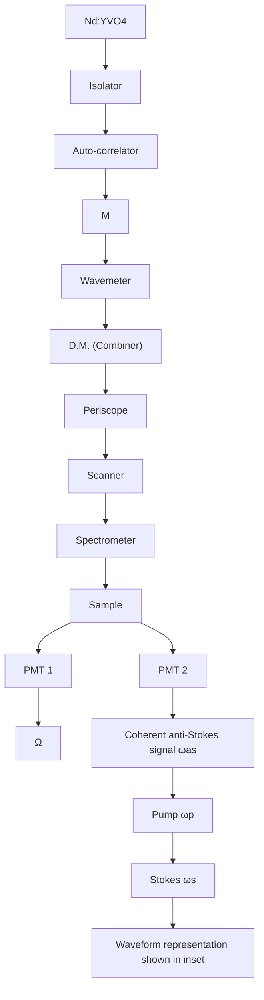

# Chasing lipids in health and diseases by coherent anti-Stokes Raman scattering microscopy

Han-Wei Wang a , Yan Fu a , Terry B. Huff b , Thuc T. Le a , Haifeng Wang a , Ji-Xin Cheng a,b, \*

a Weldon School of Biomedical Engineering, Purdue University, West Lafayette, IN 47907, USA

b Department of Chemistry, Purdue University, West Lafayette, IN 47907, USA

## A R T I C L E I N F O

Article history:

Received 3 February 2008

Received in revised form 16 November 2008

Accepted 17 November 2008

Available online 28 November 2008

Keywords:

Coherent anti-Stokes Raman scattering

Vibrational imaging

Microscopy

Lipid

## ABSTRACT

The integration of near IR picosecond pulse excitation, collinear beam geometry, epi-detection, and laser-scanning has produced a coherent anti-Stokes Raman scattering (CARS) microscope with a detection sensitivity of 105 vibrational oscillators, sub-micron 3D resolution, and video-rate acquisition speed. The incorporation of spectral detection and other imaging modalities has added versatility to the CARS microscope. These advances allowed sensitive interrogation of biological samples, particularly lipids that have a high density of CH groups. With initial applications to membrane domains, lipid bodies, demyelinating diseases, obesity, and cardiovascular diseases, CARS microscopy is poised to become a powerful bio-imaging tool with the availability of a multifunctional, affordable, easy-tooperate CARS microscope, and the development of CARS endoscopy for in vivo diagnosis.

\- 2008 Elsevier B.V. All rights reserved.

## 1. Introduction

Coherent anti-Stokes Raman scattering (CARS) microscopy is a nonlinear optical (NLO) imaging technique that allows high-speed vibrational imaging of molecules [1,2]. In a CARS process, three electromagnetic fields provided by lasers at the pump $( \omega _ { \mathrm { p } } )$ , Stokes $( \omega _ { s } ) ,$ , and probe $( \omega _ { \mathbf { p } } ^ { \prime } )$ frequencies interact with a medium to generate a new field at the anti-Stokes frequency $\omega _ { \mathrm { a s } } = \left( \omega _ { \mathrm { p } } - \omega _ { \mathrm { s } } \right) + \omega _ { \mathrm { p } } ^ { \prime } .$ In most experiments, the pump field $E _ { \mathrm { p } }$ and probe field $E _ { \textrm { p } } ^ { \prime }$ come from the same laser beam. When the beating frequency $( \omega _ { \mathbf { p } } - \omega _ { s } )$ is in resonance with a molecular vibration, the mixed pump and Stokes field can effectively drive the molecule to a vibrationally excited state [3]. The efficiency of CARS is then significantly enhanced because the molecular vibration facilitates the energy exchange between light fields. Therefore, the molecules in resonance produce a larger signal than those off resonance, providing a vibrational contrast in a CARS image. On the other hand, without vibrational resonance CARS can still happen through electronic motions, which produces the nonresonant background. As a formal description, the CARS signal arises from the third-order-induced polarization, $P ^ { ( 3 ) } = \chi ^ { ( 3 ) } E _ { \mathrm { p } } \bar { E _ { s } ^ { * } } E _ { \mathrm { p } } ,$ where the susceptibility $\chi ^ { ( 3 ) }$ has a nonresonant component and a Raman resonant component. Because of the interference between the resonant and nonresonant components, the CARS spectrum is dispersed comparing with the spontaneous Raman spectrum, with a shift of the peak to lower frequency and appearance of a dip at higher frequency [3]. CARS microscopy offers several unique advantages.

 CARS imaging is nondestructive so that it can be applied to live cells, live animals, and biologically active tissues.  
 As a coherent process, the CARS fields from different molecules have a well-defined phase relationship and they add up like the emission from an antenna array. The emission is concentrated in one direction defined by the constructive interference, which greatly facilitates the signal collection. The coherent addition also results in a quadratic signal increase with respect to the density of molecular oscillators, versus the linear increase of spontaneous Raman signal. For a bulk liquid, the CARS signal was larger than the spontaneous Raman signal by nine orders of magnitude [3]. Therefore a CARS image can be acquired in 1 s or less while a confocal Raman image may take hours.  
 CARS signal appears at a wavelength shorter than the excitation wavelengths, spectrally separated from the one-photon fluorescence background that Raman microscopy suffers from.  
 The nonlinear dependence on excitation intensity ensures that the CARS signal is only generated in the focal center, providing an inherent sub-micron 3D spatial resolution, which is favorable for studying cells and tissues.

been developed for suppressing the nonresonant background and pushing the detection sensitivity (for reviews, see [1,2]), making CARS microscopy a mature imaging technique for biological applications, especially for chasing the roles of lipids in health and diseases.

In a traditional view, lipids serve as structural components of membranes, energy storage, and hormones. Recent studies of membrane microdomains have revealed important roles of lipids in signal transduction and membrane trafficking in cells. Lipids contribute up to 70% dry weight of the central nervous system in the form of myelin sheath, while the etiology of many demyelinating diseases such as multiple sclerosis remains elusive. The significance of lipids to health has dramatically increased with obesity reaching an epidemic proportion in the United States. Because the Raman-resonance enhancement of $\chi ^ { ( 3 ) }$ is significant due to the high density of C–H bonds in lipid molecules, CARS is a naturally sensitive imaging tool for lipids. Li et al. have demonstrated the sensitivity of selectively probing 20,000 lipid molecules inside the focal area with epi-detected CARS [4].

This article reviews recent developments of CARSmicroscopy and applicationstolipidbiologyand lipid-relateddiseases.The restof the paper is organized as follows. Section 2 presents the development of CARS microscopy. Section 3 describes the application of CARS microscopy to various lipid-related biological systems. Section 4 summarizes other applications. Section 5 presents an outlook.

## 2. CARS microscope

The first CARS microscope was made by Duncan et al. in 1982 using a noncollinear beam geometry [5] based on the conventional wisdoms from CARS spectroscopy. Xie and coworkers revived CARS microscopy in 1999 using a collinear beam geometry under the tight focusing condition [6]. In the past several years, significant advances in instrumentation have been made. Different types of CARS microscope are described below.

## 2.1. Laser-scanning CARS

The most significant advantage of CARS over spontaneous Raman is its large signal level to allow for high-speed vibrational imaging. This advantage has been realized by the construction of a laser-scanning CARS microscope as shown Fig. 1. The key features of the microscope are:

## 2.1.1. Near IR laser excitation

Near IR lasers first used by Zumbusch et al. for CARS imaging avoids two-photon electronic enhancement of the nonresonant background [6], reduces the photodamage induced by multiphoton absorption [7], and diminishes tissue scattering leading to increased optical penetration depth [8].

## 2.1.2. Picosecond pulse excitation

Femtosecond pulses are generally used in NLO imaging for the high peak power. However, the spectral width of a femtosecond pulse is much broader than the width of most Raman lines, therefore most of the energy does not couple with molecular vibration but contributes to the nonresonant background. Instead, the spectral width of a picosecond pulse matches the Raman line width, so that the excitation energy can be focused on a single Raman band to provide good spectral resolution and excellent vibrational contrast [9].

## 2.1.3. Collinear beam geometry

Noncollinear beam geometry was used in CARS spectroscopy to fulfil the phase matching condition [3]. When the interaction length became very small (1 mm) under the tight focusing condition in microscopy, the phase matching condition could be fulfilled with a collinear beam geometry for forward-detected CARS (F-CARS) [6]. The collinear beam geometry greatly simplified the optical alignment and has been a key step in producing highquality CARS images.

## 2.1.4. Epi(i.e., backward)-detection

For objects smaller than the excitation wavelengths, the phase matching condition was fulfilled in both forward and backward direction [10]. Systematic study showed that epi-detected CARS (E-CARS) could arise from small objects, discontinuity of $\chi ^ { ( 3 ) }$ at an interface, and back-reflection of forward CARS [11]. Because the CARS signal from a bulk medium goes forward, E-CARS provides an effective way to detect small objects [10]. E-CARS is also important for live animal imaging where the F-CARS signal cannot pass through a thick tissue [12,13].

flowchart

Fig. 1. Schematic of a laser-scanning CARS microscope that allows imaging with forward-detected CARS (F-CARS), epi-detected CARS (E-CARS), two-photon excitation fluorescence (TPEF), and sum frequency generation (SFG) signals produced by two synchronized pulsed lasers at frequencies $\omega _ { \mathsf { p } }$ and v . The energy diagram of CARS is shown above the setup.

## 2.1.5. Laser-scanning on a confocal microscope platform

High-sensitivity imaging was achieved by scanning picosecond lasers of high repetition rates (in MHz), with an image acquisition speed of a frame per second [14]. Video-rate imaging has been realized by laser-scanning with a polygon mirror [12].

## 2.1.6. Multimodal NLO imaging on a laser-scanning CARS microscope

Multimodality is important because different NLO imaging methods have their distinctive advantages: two-photon excitation fluorescence (TPEF) can be used to visualize proteins, ions with fluorescent labeling or specific autofluorescent structures; sumfrequency generation (SFG) is selective to noncentrosymmetric molecular assemblies such as collagen fibrils; CARS is naturally sensitive to lipid-enriched structures such as adipocytes. The picosecond laser beams for CARS could also be used for TPEF and electronic SFG. Fu et al. demonstrated multimodal NLO imaging of ex vivo spinal tissues by CARS imaging of myelin sheath, SFG imaging of astrocyte processes, and TPEF imaging of calcium indicators on the same platform [15].

In summary, combination of the above strategies has produced a CARS microscope with high detection sensitivity, high imaging speed, and multichannel information. Laser-scanning CARS microscopy has been applied to various systems including lipid bilayers [4,16–19], cells [14,20–24], myelin sheath [25,26], tumor [27,28], artery and atherosclerosis [29,30], drug delivery system [31,32], materials [33,34], and in vivo [12,13,35].

## 2.2. Multiplex CARS (M-CARS)

M-CARS utilizes a narrowband and a broadband excitation field to achieve simultaneous acquisition of a vibrational spectrum. M-CARS microscopy was first demonstrated with pico- and femto second pulse excitation [36,37]. Recently the super continuum from a photonic crystal fiber has been extensively used for M-CARS development [38–42]. By utilizing the heterodyne approach, the signal-to-noise ratio is increased in M-CARS and theoretically only limited by Poisson noise [43]. The full spectrum obtained in M-CARS is a complex combination of contributions from different vibrational modes and the nonresonant contribution. Leastsquares-fit can be used to extract the required information from the blended spectrum, but priori information of vibrational spectrum of each element is required [44]. Recently, Vartiainen et al. has demonstrated a numerical algorithm to extract Raman line-shapes hidden in the complex spectra derived in M-CARS [45]. Employing the maximum entropy method [46], phase function of the nonlinear susceptibility tensor elements, responsible for the CARS line-shape, can be retrieved without any previous information. In a recent work, the heterogeneity and thermodynamic phase in cellular lipid bodies were interrogated by M-CARS with both microscopic and spectroscopic information [47].

M-CARS microscopy is generally implemented with a samplescanning scheme. A M-CARS spectrum at each pixel can be obtained with an acquisition time of 20 ms or so [43]. The M-CARS imaging rate is not yet sufficient for the study of highly dynamic systems such as living cells.

## 2.3. Wide-field CARS

By using nanosecond pulses at low repetition rate, Heinrich et al. demonstrated wide-field CARS microscopy using two counter-propagating beams [48]. The nanosecond laser pulses offer high spectral resolution [49] and high pulse energy necessitated for wide-field illumination. Based on the configuration of dark-field microscopy with a folded beam geometry to fulfil the phase matching condition, wide-field CARS images can be acquired with a single-shot of pulsed fields. Recently, Heinrich et al. demonstrated single-shot imaging of adipocytes and spectral analysis of different lipids with wide-field CARS microscopy [50]. The single-shot imaging accomplished an ultra-fast acquisition speed of 3 ns per image. Such capability could be applied to fast varying systems such as chemical reactions. However, the counter propagating beam geometry prohibited the study of thick tissue samples.

## 2.4. Near-field CARS

By employing an apertureless metallic probe tip, near-field CARS microscopy has been demonstrated to reach a resolution beyond the diffraction limitation of light [51]. In near-field CARS, incident fields (pump, probe, and Stokes fields) are strongly amplified by the metallic tip in a tightly focused spot and induce a CARS field from the molecules located near the tip. To optimize the effectiveness of coupling incident fields and tip-enhanced field, the tip has to be aligned in a position where the incident electric field in the axial direction is strong. By scanning the sample while keeping the tip at the focused spot, Ichimura et al. demonstrated two-dimensional tip-enhanced CARS images with a resolution determined by the size of the tip end rather than the diffraction limited focused spot [51]. DNA cluster and network structure can be visualized at a specific vibrational frequency (1337 cm-1 ), corresponding to the ring-breathing mode of diazole of adenine molecules. The smallest detectable volume of DNA was estimated to be 1/4 zeptoliter. It should be cautious that the coherent addition advantage of CARS is lost at a very small excitation volume, in which case Raman scattering becomes a competitive alternative.

## 3. CARS imaging of lipids in health and diseases

## 3.1. Elucidating demyelination mechanism

Myelin sheath is a multiple-layer membrane (Fig. 2A) wrapping the long extensions of neurons called axons [52]. The myelin sheath is interrupted at intervals called the nodes of Ranvier which are rich in sodium channels. This organization makes the nerve impulses move in a stepwise fashion called ‘‘saltatory conduction’’. Being of high resistance, myelin is crucial for the high saltatory conduction speed. Numerous neurological diseases specifically attack the myelin sheath causing demyelination with disabling and often fatal results. The most common demyelination disease is multiple sclerosis affecting the 2.5 million people worldwide. The lamellar structure of myelin sheath has been well characterized by polarized light microscopy, electron microscopy, and X-ray diffraction. However, these techniques necessitate fixed tissues which prevent the examination of cellular activities in real time. Magnetic resonance imaging is used for in vivo imaging of white matter, but its resolution is too poor for single cell observation.

The myelin contains about 70% lipid and 30% protein by weight. The high density of $\mathrm { C H } _ { 2 }$ groups in the myelin membrane (Fig. 2A) leads to a large and directional CARS signal, making CARS microscopy a sensitive tool for imaging myelin sheath in its natural state. Using the resonant CARS signal from CH , our group has performed a systematic imaging study of intact neuronal myelin in ex vivo tissues [25] and live animals [13]. The sample used in our ex vivo study was the spinal cord white matter isolated from guinea pigs. The tissue was kept in the oxygen-bubbled Krebs’ solution. Fig. 2B shows an E-CARS spectrum of a single axonal myelin. The peak for the symmetric $\mathrm { C H } _ { 2 }$ stretch vibration appears at 2840 cm-1 , with a resonant signal to nonresonant background ratio of 10:1. High CARS contrast of parallel myelin wrapping around the axons was shown in Fig. 2C. With a lateral resolution of 0.28 mm and an axial resolution of 0.70 mm, we were able to probe the detailed myelin structures such as the paranodal myelin [25]. Moreover, the inherent 3D resolution allowed us to visualize the 3D organization of myelin tubes (Fig. 2D).

text_image

(A)
Oligodendrocyte
Myelin sheath
Axon
Node of Ranvier
Cytoplasmic
Extracellular
MBP
PLP
H H H H H H H H H H H H H H
C C C C C C C C C C C C C C C C C C C C C C C C C C C C C C C C C C C C C C C C C C C C C C C C C C C C C C C C C C
H H H H H H H H H H H H H H H H H H H H H H H H H H H H H H H H H H H H H H H H H H H H H H H H H H H H H H H H H H H H H H H H H H H H H H H H H H H H H H H H H H H H H H H H H H H H H H H H H H H H H

line chart

(B)
| Wavenumber (cm⁻¹) | CARS Int. (a.u.) |
| :--- | :--- |
| 2700 | 3 |
| 2750 | 4 |
| 2800 | 10 |
| 2850 | 45 |
| 2900 | 15 |
| 2950 | 6 |
| 3000 | 5 |

text_image

(C)
Ax Ax
Ax
Ax

natural_image

Microscopic image of elongated biological structures with red fluorescent staining, labeled (D) and XYZ axis indicators (no readable text or symbols)

natural_image

Fluorescent microscopy image showing green and red stained cellular structures (no text or symbols)

Fig. 2. (A) Diagram shows the myelin sheath in the central nervous system. The myelin is a multiple-layer membrane formed by oligodendrocytes, containing a high lipid to protein ratio. MBP: myelin basic protein. PLP: proteolipid protein. (B) E-CARS spectrum of a single axonal myelin sheath measured by manually tuning the Stokes laser wavelength. The pump laser frequency was fixed at $1 4 { , } 0 8 1 \mathrm { c m } ^ { - 1 }$ . (C) E-CARS image of myelin sheath wrapping around the axons when the Raman shift was tuned to 2840 cm- $^ { \cdot 1 } \cdot \mathrm { B a r } = 1 0 \mu \mathrm { m } .$ . (D) Reconstruction of 3D CARS imaging of myelin sheath in spinal tissue. The inset is XZ images showing the transverse section of myelin sheath. Bar = 10 mm. (E) In vivo E-CARS imaging of myelinated axons and SHG imaging of collagen fibrils surrounding sciatic nerve and between the axons. Bar = 20 mm.

Recently our group has applied laser-scanning CARS microscopy to in vivo imaging of deep tissues [13]. In vivo imaging is crucial to the study of biological systems under the most natural condition. The label-free advantage of CARS is particularly important for in vivo studies where the labeling is complicated by inefficient diffusion and nonspecific binding. By using minimal surgery to cut open the skin, Huff et al. demonstrated in vivo E-CARS imaging of sciatic nerve and surrounding adipocytes [13]. The in vivo E-CARS signal could arise from interfaces as well as back scattering of forward CARS signal [11]. Fig. 2E shows the E-CARS image of myelin sheath and second harmonic generation image of collagen fibrils around the sciatic nerve in a live mouse.

The capability of imaging myelin in its natural state allowed us to investigate the mechanisms of demyelination which are stil poorly understood. The demyelination model we have studied is lysophosphatidylcholine (lyso-PtdCho)-induced acute myelin vesiculation [26]. After injection of lyso-PtdCho into the spinal tissue, we observed extensive and acute myelin degradation which was characterized by decrease of CARS intensity (Fig. 3A–C) and loss of dependence on excitation polarization (Fig. 3D–F). The loss of lamellar structure and reduction of packing density correspond to myelin vesiculation observed by electron microscopy. With these capabilities, we have examined the enzymatic activities involved in lyso-PtdCho-induced myelin degradation. The degradation lesion dimensions were significantly reduced with $\mathsf { C a } ^ { 2 + } .$ -free solution. It was further found that the degradation size was effectively reduced by inhibiting the $\mathsf { c P L A } _ { 2 }$ or calpain activity. These results demonstrate that the observed acute myelin swelling is largely mediated by ${ \mathsf { C a } } ^ { 2 + }$ activated $\mathsf { c P L A } _ { 2 }$ and calpain [26].

The capability of imaging intact myelin sheath makes CARS microscopy a unique tool for investigating demyelination mechanism in the ex vivo and in vivo environment, which cannot be performed by traditional methods. In future work, real-time imaging of animal models for multiple sclerosis by combined CARS and TPEF imaging will be performed to clarify the sequence and causality of multiple events (e.g. immune response, damage of oligodendrocyte, release of toxin, demyelination). These studies will contribute to a deeper understanding of the pathology of demyelination diseases.

## 3.2. Lipid domains in single bilayers

Biological membranes contain multiple microdomains that are believed to be critical structures for regulating biological and pathological processes [53]. Lipid domains in model membranes provide analogs for physical and possibly functional studies. A series of papers have shown that CARS is capable of probing molecular compositions and thermodynamic states of lipid domains. Wurpel et al. acquired CARS spectra from single lipid monolayers and bilayers with M-CARS [43]. Potma and Xie demonstrated CARS imaging of lipid domains and phase segregation in giant unilamellar vesicles [17]. A quantitative study of specific lipid domains in supported bilayers of deuterated acyl chains has been conducted by Li et al. with epi-detected CARS [4]. Recent work demonstrated Label-free CARS imaging of coexisting domains based on the different lipid packing density for the solid, liquid-ordered, and liquid-disordered thermodynamic states [19]. Such capability can be potentially used to visualize domains in live cell membranes.

(A)  

text_image

Ax
Ax

(B)  

text_image

Ax
Ax

(C)  

line chart

| Position (µm) | Normal | Swollen |
| ------------- | ------ | ------- |
| 0             | 0.0    | 0.0     |
| 5             | 2.5    | 2.8     |
| 10            | 0.5    | 0.3     |
| 15            | 0.2    | 1.0     |

(D)  
$\mathsf { E } _ { \mathsf { p } } \mathsf { E } _ { \mathsf { s } } \updownarrow$  

natural_image

Abstract black-and-white pattern with vertical wavy lines and a small sphere (no text or symbols)

$\mathsf { E } _ { \mathsf { p } } \mathsf { E } _ { \mathsf { s } } $  

natural_image

Microscopic view of fibrous structures with x-y coordinate axes labeled (no text or symbols beyond axis labels)

(E)  
Ep Es ↑  

natural_image

Microscopic view of a textured surface with irregular dark and light regions (no visible text or symbols)

Ep Es ←→  

natural_image

Microscopic view of cellular or tissue structures with dark regions and a scale bar (no text or symbols)

(F)

bar chart

| Condition | I_W/I_V |
|---|---|
| Normal | 3.6 |
| Swollen | 0.9 |

Fig. 3. Characterization of lyso-PtdCho-induced myelin swelling by CARS microscopy. For all images, bar = 10 mm. (A) CARS image of normal myelin sheath wrapping two parallel axons. (B) CARS image of partially swollen myelin sheath acquired at 5 min after injecting 2 mL of 10 mg/mL lyso-PtdCho into the tissue. (C) CARS intensity profiles of normal and swollen myelin fibers. Green: taken along the green line in (A). Red: taken along the red line in (B). The intensity profiles clearly showed that the CARS intensity from the swollen region was approximately 1/3 of that from the compact region, indicating a reduction of the lipid packing density in the membrane. (D and E) CARS images of normal myelin sheath and totally swollen myelin sheath with vertical (l) and horizontal (\$) excitation polarization. (F) The ordering degree characterized by $I _ { \parallel } / I _ { \perp }$ ? of intramyelin lipids for normal and swollen myelin sheath. Here Ik and I? are defined as the CARS intensities with the excitation polarization parallel with or perpendicular to the myelin length. The ratio o $\textnormal { f } I _ { \parallel } \ \mathbf { t o } \ I _ { \perp }$ measures the ordering degree of the myelin lipids. For healthy myelin along y-oriented axons (D), the average CARS intensity from the equatorial plane generated with y-polarized beams (I ) is 3.53 (0.09) times that with x-polarized beams $( I _ { \perp } ) _ { \perp } I _ { \| }$ is larger than I because the symmetry axis of the $\mathrm { C H } _ { 2 }$ groups in the equatorial plane of the myelin is perpendicular to the x direction. For the swollen myelin (E), the value of $I _ { \parallel } / I _ { \perp }$ was measured to be 0.98  0.09. Such independence on the excitation polarization $\left( I _ { \parallel } = I _ { \perp } \right)$ ) indicates a complete degradation of the lamellar structure in the swollen myelin sheath. (For interpretation of the references to color in this figure legend, the reader is referred to the web version of the article.)

## 3.3. Intracellular lipid storage

Lipid droplets are highly dynamic and ubiquitous organelles in various cells. The lipid droplets have crucial and functional roles in lipid metabolism, including the storage of energy, the biosynthesis of membrane lipids, the regulation of cholesterol homeostasis, the production of steroid hormones, and the breakdown of triacylglycerol [54–56]. With a remarkable contrast from lipid bodies, CARS microscopy has been a powerful tool for vibrational imaging and spectral analysis of intracellular lipid storage. Cheng et al. investigated the merits and characteristics of CARS microscopy for live cell imaging with the use of NIH 3T3 cells [14]. This pilot study also demonstrated CARS imaging of mitosis and apoptosis in unstained live cells. Nan et al. monitored lipid droplet accumulation during adipogenesis in 3T3-L1 cells [21]. Further study explored the ability of CARS microscopy to track the transport of lipid droplets in Y-1 cells [23]. Intracellular distribution and transport of lipid droplets with respect to organelles was imaged by combining CARS with TPEF (Fig. 4 A–C).

With the use of M-CARS, Rinia et al. investigated the compositional and physical state of intracellular lipid droplets according to spectral imaging analysis. The heterogeneity in lipid composition of cellular lipid droplets was resolved quantitatively [57]. More recently, CARS imaging of lipid stores has been demonstrated at single cell level in vivo with the use of C. elegans [35]. CARS spectra and the volume of lipid storage in C. elegans were measured (Fig. 4 D–F). The result indicated that the lipid order shifted from gel to liquid state when the lipid storage was promoted. With 3D imaging capability, spectral information, and no need of labeling, it is evident that CARS microscopy has become a powerful tool for understanding the fundamental mechanisms involved in lipid metabolism.

## 3.4. Obesity associated health risks

Obesity is a disorder resulting from the imbalance in energy homeostasis where energy intake exceeds expenditure. When excess energy stored in the form of adipose tissues accumulates such that the body fat mass index rises above 30 kg/m2 , obesity condition is diagnosed. In the US, obesity has reached an epidemic proportion. According to the Center for Disease Control and Prevention, 66 million American adults are obese.

Being highly sensitive to lipid-rich bio-molecular structures, CARS microscopy serves as an ideal tool for the studies of obesity and associated diseases. At the level of cultured cells, CARS microscopy has been applied to study lipid droplets formation in fibroblast 3T3-L1 cells [21]. Combining CARS and other NLO imaging modalities on the same microscope platform, detailed composition and structural organization of molecular structures within a tissue can be visualized without labeling [15]. In mammary tumor tissues, CARS allows visualization of adipocytes, tumor cells, and blood capillaries while second harmonic generation imaging allows visualization of collagen fibrils [28]. Intrinsic 3D imaging capability of NLO microscopy enables quantitative analysis of spatial arrangements of such mammary stromal components. In particular, a tumor mass can be readily identified based on the lack of collagen fibrils within the tumor and the abundance of collagen fibrils surrounding the tumor. Additionally, multimodal NLO imaging allows quantitative evaluations of the impacts of obesity on the size of adipocytes in mammary gland and on the collagen fibril content in tumor stroma [28]. Such evaluations are normally inaccessible to standard histological analysis.

natural_image

Fluorescent microscopy image showing green and red cellular structures with a dark central region (no text or symbols)

natural_image

Fluorescent microscopy image showing green-stained cellular structures with scattered white particles, labeled (B) in top-left corner (no text or symbols within the image content)

natural_image

Fluorescent microscopy image showing red and green labeled cellular structures against a dark background (no text or symbols)

line chart

| Raman shift (cm⁻¹) | N2 L4 | N2 L1 | pha-3 | Dauer | Tissue matrix |
| ------------------ | ----- | ----- | ----- | ----- | ------------- |
| 2770               | ~0.8  | ~0.6  | ~0.4  | ~0.1  | ~0.05         |
| 2790               | ~0.9  | ~0.7  | ~0.5  | ~0.15 | ~0.05         |
| 2810               | ~1.0  | ~0.8  | ~0.6  | ~0.2  | ~0.05         |
| 2830               | ~1.1  | ~0.9  | ~0.7  | ~0.25 | ~0.05         |
| 2850               | ~1.2  | ~1.0  | ~0.8  | ~0.3  | ~0.05         |
| 2870               | ~1.1  | ~0.9  | ~0.7  | ~0.2  | ~0.05         |
| 2890               | ~1.0  | ~0.8  | ~0.6  | ~0.15 | ~0.05         |
| 2910               | ~0.9  | ~0.7  | ~0.5  | ~0.1  | ~0.05         |

natural_image

Microscopic image showing fluorescently labeled cellular structures with a color scale bar (10 μm) and scale bar (10 μm), no readable text or symbols present.

natural_image

Microscopic image showing fluorescently labeled cells with a 10 μm scale bar (no text or symbols beyond label)

Fig. 4. CARS images and spectra of intracellular lipid bodies. (A) Collocalized image of CARS (red) and TPEF (green) in a Y-1 Cell. CARS contrast comes from lipid droplets and TPEF contrast shows the mitochondria labeled by MitoTracker. (B) Trajectories of LDs over a period of 24 s. LDs underwent active transport movement of 2 mm within 24 s. (C) Collocalized image of lipid droplets and mitochondria in 3T3-L1 cells shows very different distribution from Y-1 cells. Bars are 2 mm in (A)–(C) (from Ref. [23]. Used with permission). (D) CARS Spectra of wild-type and mutant C. elegans in vivo. (N2 L1 and L4: wild-type early and late stage larva; pha-3: feeding-deficient mutant nematode; Dauer: daf-4 mutant of promoted lipid store). Spectra at symmetric CH vibration $( 2 8 4 5 \thinspace \mathrm { c m } ^ { - 1 } )$ and asymmetric CH vibration $( 2 8 8 0 \mathsf { c m } ^ { - 1 } )$ indicate lipid order shifted from gel to liquid when lipid storage is promoted. (E) Resonant at 2845 cm-1 and (F) nonresonant at 2790 cm-1 images of lipid storage in wild-type late-stage (N2 L4) larva in vivo. Bars are 10 mm in (E) and (F) (from Ref. [35]. Used with permission). (For interpretation of the references to color in this figure legend, the reader is referred to the web version of the article.)

Most recently, CARS microscopy has also been applied to visualize molecular composition of arterial walls and atherosclerotic lesions (Fig. 5) [29,30]. Based on vibrational signals arising from CH -rich membrane lipid bilayer, endothelial cells and smooth muscle cells of the arterial walls can be visualized with CARS [30]. Fibrous protein structures including elastin and collagen can also be visualized with CARS due to the abundance of $\mathrm { C H } _ { 2 }$ bonds at the cross-linking regions [30]. Additionally, foam cells rich in lipid droplets and lipid accumulation in the extracellular matrix of an atheroma is readily observable with CARS microscopy [29]. To distinguish CARS signals arising from lipid versus those arising from protein, SHG imaging of collagen fibrils and TPEF imaging of elastin are employed simultaneously with CARS imaging [29]. Multimodal image acquisition of the same area significantly improves the sensitivity and accuracy in visualizing arterial molecular composition. More importantly, label-free multimodal NLO imaging of atheroma allows identification of areas vulnerable to rupture risks [29,58], where there is a significant increase in foam cell accumulation coupled with a drastic reduction in collagen fibrils near arterial lumen [59]. Such compositional imaging capability of CARS and other modalities suggests their powerful potential application to the clinical diagnosis of stages of atherosclerotic lesions.

## 4. Applications other than C–H

In addition to the vibrational contrast from C–H, CARS microscopy has been applied to a variety of subjects, including biological, pharmaceutical, and material systems, by using different vibrational modes. With the O–H stretching mode to monitor $\mathrm { H } _ { 2 } 0 / \mathrm { D } _ { 2 } 0$ exchange, Potma et al. measured the intracellular water diffusion coefficient in single living cells [20]. Li et al. used the C–D bonds in deuterated lipids in a quantitative study of lipid partition between coexisting domains [4]. The C–D stretching vibration at around $2 1 0 0 \mathrm { c m } ^ { - 1 }$ is well isolated from the Raman bands of endogenous biological molecules, which facilitates quantitative studies. Similar concept has been used for investigating the effect of fish oil on lipid metabolism inside cells [22]. Other vibrational bands have been used for drug release studies. Kang et al. have conducted research in paclitaxel release from different polymer films by using vibrational frequencies specific to the drug and films [31,32]. CARS microscopy has also shown exciting potential in materials research, such as the study of orientational order of liquid crystals at the CN stretching frequency (2215 cm-1 ) [33] and chemically selective imaging of photoresist [34]. It is foreseeable that applications of CARS microscopy will keep expanding.

text_image

(A)
Lumen

text_image

(B)
Adventitia

text_image

(C)
Tunica Media
Internal Elastic Lamina

natural_image

Fluorescent microscopy image showing cellular structures with blue and green staining (no text or symbols)

Fig. 5. Cross-sectional CARS (gray), SFG (blue), and TPEF (green) images of a coronary artery bearing early atherosclerotic lesion. (A) CARS image of the arterial wall. The red square shows thickened intima with scattered lipid rich cells. (B) Collagen distribution of the arterial wall imaged by SFG. (C) Elastic lamellae imaged by TPEF. Bar = 300 mm for $( \mathsf { A } ) \mathsf { - } ( \mathsf { C } ) . \mathsf { \Gamma } ( \mathsf { D } )$ Zoomed-in image at the red square in (A) shows the distribution of lipid-rich cells within collagen matrix in thickened intima. Bar = 30 mm in (D). (For interpretation of the references to color in this figure legend, the reader is referred to the web version of the article.)

## 5. Conclusions and outlook

With chemical selectivity, inherent 3D resolution and capability for high-speed data acquisition, CARS microscopy is poised to become a potent tool for biological imaging. Additionally, the ability to couple CARS with other modalities such as TPEF, SFG and electrophysiological recording provides a powerful multimodal platform to spread the range of applications. Though in this review we have discussed a few areas in which CARS microscopy has shown great promise, the applications for CARS imaging are still in their infancy and will continue to grow for the years to come. For example, development of CARS probes [24] that completely eliminate the photobleaching problem could provide a new way for 3D sub-micron biological imaging.

A prohibitive factor in CARS imaging remains the cost and complexity associated with synchronizing two pulsed lasers and effectively coupling them into a scanning microscope. The development of compact, cost-effective laser sources and alternatives to free-space coupling, such as by fiber delivery [60], will make such a system more attractive to researchers in the biological sciences.

One area in which CARS will prove greatly useful would be in vivo imaging of live animals. As magnetic resonance imaging lacks single cell resolution and electron microscopy is incompatible with live tissues, in vivo CARS imaging will fill an important niche for study of disease processes. Currently, there are several technical hurdles such as minimizing surgery, compensating for animal motion, and increasing imaging depth which have to be overcome. The development of new technologies such as miniaturization of microscope objective [61], high-speed scanning [12], and longer wavelength excitation [8], will help to facilitate CARS imaging of live animals.

The demonstrated capability of CARS microscopy in live tissue imaging is expected to stir interests in the development of CARS endoscopy [62] for in vivo diagnosis. The advantages of label-free molecular imaging of CARS endoscopy are abundantly obvious. First, label-free imaging overcomes the challenges of inefficient diffusion and nonspecific targeting of exogenous fluorophores in the complex in vivo environment. Second, because CARS does not require electronic resonance, longer excitation wavelengths can be used to minimize multiphoton absorption-induced photodamage. Third, the intrinsic 3D sectioning capability of CARS imaging enables the analysis of spatial organization of bio-structures with molecular details. We anticipate that CARS endoscopy can be coupled with existing imaging modalities such as optical coherent tomography and intravascular ultrasound on the same catheterbased platform. This combination would create a multimodal imaging tool that is capable of 2D morphology mapping with optical coherent tomography and intravascular ultrasound, and 3D sub-micrometric imaging of molecular composition with CARS endoscopy. Such in vivo imaging capability would tremendously advance the application of biomedical optics to the diagnosis of cardiovascular diseases.

## Acknowledgments

The authors thank professors Riyi Shi, Ignacio Camarillo, and Michael Sturek for collaborative work on biomedical applications of CARS microscopy. This work is supported by NSF grant 0416785- MCB, NIH grants R21 EB004966 and R01 EB007243.

## References

[1] J.X. Cheng, X.S. Xie, J. Phys. Chem. B 108 (2004) 827–840.  
[2] J.X. Cheng, Appl. Spectrosc. 61 (2007) 197A–206A.  
[3] M.D. Levenson, S.S. Kano, Introduction to Nonlinear Laser Spectroscopy, Academic Press, San Diego, 1988.  
[4] L. Li, H. Wang, J.X. Cheng, Biophys. J. 89 (2005) 3480–3490.  
[5] M.D. Duncan, J. Reintjes, T.J. Manuccia, Opt. Lett. 7 (1982) 350–352.  
[6] A. Zumbusch, G.R. Holtom, X.S. Xie, Phys. Rev. Lett. 82 (1999) 4142–4145.  
[7] Y. Fu, H. Wang, R. Shi, J.X. Cheng, Opt. Exp. 14 (2006) 3942–3951  
[8] F. Ganikhanov, S. Carrasco, X.S. Xie, M. Katz, W. Seitz, D. Kopf, Opt. Lett. 31 (2006) 1292–1294.  
[9] J.X. Cheng, A. Volkmer, L.D. Book, X.S. Xie, J. Phys. Chem. B 105 (2001) 1277–1280.  
[10] A. Volkmer, J.X. Cheng, X.S. Xie, Phys. Rev. Lett. 87 (2001) 023901.  
[11] J.X. Cheng, A. Volkmer, X.S. Xie, J. Opt. Soc. Am. B 19 (2002) 1363–1375.  
[12] C.L. Evans, E.O. Potma, M. Puoris’haag, D. Coˆte´, C.P. Lin, S. Xie, Proc. Natl. Acad. Sci. U.S.A. 102 (2005) 16807–16812.  
[13] T.B. Huff, J.X. Cheng, J. Microsc. 225 (2007) 190–197.  
[14] J.X. Cheng, Y.K. Jia, G. Zheng, X.S. Xie, Biophys. J. 83 (2002) 502–509.  
[15] Y. Fu, H. Wang, R. Shi, J.X. Cheng, Biophys. J. 92 (2007) 3251–3259.  
[16] E.O. Potma, X.S. Xie, J. Raman Spectrosc. 34 (2003) 642–650.  
[17] E.O. Potma, X.S. Xie, ChemPhysChem 6 (2005) 77–79  
[18] L. Li, J.X. Cheng, Biochemistry 45 (2006) 11819–11826.  
[19] L. Li, J.X. Cheng, J. Phys. Chem. 112 (2008) 1576–1579.  
[20] E.O. Potma, W.P.D. Boeij, P.J.M.v. Haastert, D.A. Wiersma, Proc. Natl. Acad. Sci. U.S.A. 98 (2001) 1577–1582.  
[21] X. Nan, J.X. Cheng, X.S. Xie, J. Lipid Res. 40 (2003) 2202–2208.  
[22] X.S. Xie, J. Yu, W.Y. Yang, Science 312 (2006) 228–230.  
[23] X. Nan, E.O. Potma, X.S. Xie, Biophys. J. 91 (2006) 728–735.  
[24] L. Tong, Y. Lu, R.J. Lee, J.X. Cheng, J. Phys. Chem. B 111 (2007) 9980–9985.  
[25] H. Wang, Y. Fu, P. Zickmund, R. Shi, J.X. Cheng, Biophys. J. 89 (2005) 581–591.  
[26] Y. Fu, H. Wang, T.B. Huff, R. Shi, J.X. Cheng, J. Neurosci. Res. 85 (2007) 2870–2881.  
[27] C.L. Evans, X. Xu, S. Kesari, X.S. Xie, S.T.C. Wong, G.S. Young, Opt. Exp. 15 (2007) 12076–12087.  
[28] T.T. Le, C.W. Rehrer, T.B. Huff, M.B. Nichols, I.G. Camarillo, J.X. Cheng, Mol. Imaging 6 (2007) 205–211.  
[29] T.T. Le, I.M. Langohr, M.J. Locker, M. Sturek, J.X. Cheng, J. Biomed. Opt. 12 (2007) 054007.  
[30] H.W. Wang, T.T. Le, J.X. Cheng, Opt. Commun. 281 (2008) 1813–1822.  
[31] E. Kang, H. Wang, I.K. Kwon, J. Robinson, K. Park, J.X. Cheng, Anal. Chem. 78 (2006) 8036–8043.  
[32] E. Kang, J. Robinson, K. Park, J.-X. Cheng, J. Control. Rel. 122 (2007) 261–268  
[33] B.G. Saar, H.-S. Park, X.S. Xie, O.D. Lavrentovich, Opt. Exp. 15 (2007) 13585–13596  
[34] E.O. Potma, X.S. Xie, L. Muntean, J. Preusser, D. Jones, J. Ye, S.R. Leone, W.D. Hinsberg, W. Schade, J. Phys. Chem. 108 (2004) 1296–1301.  
[35] T. Hellerer, C. Axang, C. Brackmann, P. Hillertz, M. Pilon, A. Enejder, Proc. Natl. Acad. Sci. U.S.A. 104 (2007) 14658–14663.  
[36] M. Mu¨ ller, J.M. Schins, J. Phys. Chem. B 106 (2002) 3715–3723.  
[37] J.X. Cheng, A. Volkmer, L.D. Book, X.S. Xie, J. Phys. Chem. 106 (2002) 8493– 8498.  
[38] H.N. Paulsen, K.M. Hilligsoe, J. Thogersen, S.R. Keiding, J.J. Larsen, Opt. Lett. 28 (2003) 1123–1125.  
[39] T.W. Kee, M.T. Cicerone, Opt. Lett. 29 (2004) 2701–2703.  
[40] H. Kano, H. Hamaguchi, Opt. Exp. 13 (2005) 322–1327  
[41] H. Kano, H.O. Hamaguchi, Appl. Phys. Lett. 86 (2005) 121113–121123.  
[42] G.I. Petrov, V.V. Yakovlev, Opt. Exp. 13 (2005) 1299–1306.  
[43] G.W.H. Wurpel, J.M. Schins, M. Mu¨ ller, J. Phys. Chem. 2004 (2004) 3400–3403  
[44] H.A. Rinia, M. Bonn, M. Muller, J. Phys. Chem. B 110 (2006) 4472–4479.  
[45] E.M. Vartiainen, H.A. Rinia, M. Muller, M. Bonn, Opt. Exp. 14 (2006) 3622–3630  
[46] E.M. Vartiainen, K.-E. Peiponen, H. Kishida, T. Koda, J. Opt. Soc. Am. B 13 (1996) 2106–2114.  
[47] H. Rinia, K.N.J. Burger, M. Bonn, M. Muller, Biophys. J. (2008), biophysi.108.137737.  
[48] C. Heinrich, C. Meusburger, S. Bernet, M. Ritsch-Marte, J. Raman Spectrosc. 37 (2006) 675–679.  
[49] C. Heinrich, S. Bernet, M. Ritsch-Marte, New J. Phys. 8 (2006) 1–8.  
[50] C. Heinrich, A. Hofer, A. Ritsch, C. Ciardi, S. Bernet, M. Ritsch-Marte, Opt. Exp. 16 (2008) 2699–2708.  
[51] T. Ichimura, N. Hayazawa, M. Hashimoto, Y. Inouye, S. Kawata, Phys. Rev. Lett. 92 (2004) 220801.  
[52] A. Hirano, J.F. Liena, in: S.G. Waxman, J.D. Kocsis, P.K. Stys (Eds.), The Axon Structure Function and Pathophysiology, Oxford University Press, New York, 1995 , pp. 49–67.  
[53] M. Edidin, Annu. Rev. Biophys. Biomol. Struct. 32 (2003) 257–283.  
[54] M.A. Welte, Trends Cell Biol. 17 (2007) 363–369.  
[55] P.T. Bozza, R.C.N. Melo, C. Bandeira-Melo, Pharmacol. Ther. 113 (2007) 30–49.  
[56] N.E. Wolins, D.L. Brasaemle, P.E. Bickel, FEBS Lett. 580 (2006) 5484–5491.  
[57] C.S. Raine, in: G.J. Siegel, B.W. Agranoff, R.E. Albers, S.K. Fisher, M.D. Uhler (Eds.), Basic Neurochemistry: Molecular, Cellular, and Medical Aspects, Raven Press, New York, 1998.  
[58] M.B. Lilledahl, O.A. Haugen, C.D.L. Davies, L.O. Svaasand, J. Biomed. Opt. 12 (2007) 044005–044012.  
[59] P. Libby, M. Aikawa, Nat. Med. 8 (2002) 1257–1262.  
[60] H. Wang, T.B. Huff, J.X. Cheng, Opt. Lett. 31 (2006) 1417–1419.  
[61] H. Wang, T.B. Huff, Y. Fu, K.Y. Jia, J.X. Cheng, Opt. Lett. 32 (2007) 2212–2214.  
[62] F. Le´gare´, C.L. Evans, F. Ganikhanov, X.S. Xie, Opt. Exp. 14 (2006) 4427–4432.