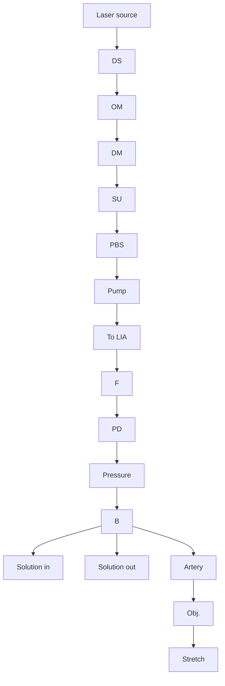

# Chemical imaging of fresh vascular smooth muscle cell response by epi-detected stimulated Raman scattering

Delong Zhang1 | Wei Chen2 | Huan Chen3 | Han-Qing Yu2 | Ghassan Kassab3\* | Ji-Xin Cheng1\* ID

1 Weldon School of Biomedical Engineering, Purdue University, West Lafayette, Indiana  
2 Department of Chemistry, University of Science and Technology of China, Hefei, P.R. China  
3 California Medical Innovations Institute, San Diego, California  
Ghassan Kassab, California Medical Innovations Institute, San Diego, CA 92121.  
Email: gkassab@calmi2.org  
Ji-Xin Cheng, Weldon School of Biomedica  
Engineering, Purdue University, West Lafayette, IN 47906.  
Email: jcheng@purdue.edu

## \*Correspondence

## Funding information

National Institutes of Health, Grant/Award number: HL117990; China Scholarship Council, Grant/Award number: 201506340011

An understanding of deformation of cardiovascular tissue under hemodynamic load is crucial for understanding the health and disease of blood vessels. In the present work, an epidetected stimulated Raman scattering (epi-SRS) imaging platform was designed for in situ functional imaging of vascular smooth muscle cells (VMSCs) in fresh coronary arteries.

text_image

Scientific diagram illustrating a microfluidic device with stress analysis, including 3D surface plots and a corresponding orientation graph.

For the first time, the pressure-induced morphological deformation of fresh VSMCs was imaged with no fixation and in a label-free manner. The relation between the loading pressure and the morphological parameters, including angle and length of the VSMCs, were apparent. The morphological responses of VMSCs to drug treatment were also explored, to demonstrate the capability of functional imaging for VSMCs by this method. The time-course imaging revealed the drug induced change in angle and length of VSMCs. The present study provides a better understanding of the biomechanical framework of blood vessels, as well as their responses to external stimulations, which are fundamental for developing new strategies for cardiovascular disease treatment.

## KEYWORDS

biomechanics, epi-SRS, functional imaging, label-free imaging, vascular smooth muscle cells

## 1 | INTRODUCTION

Recent decades show cardiovascular disease ascending as a major cause of mortality and morbidity Worldwide, especially in Western countries [1, 2]. Induced by plaque buildup that narrows the vessel lumen and blocks blood flow to the myocardium, coronary artery lesions may lead to myo cardial infarction, which may further progress to heart failure [3]. To understand the atherogenesis that is strongly affected by the stresses and strains in the cells and fibers of the arteries, knowledge of the mechanical properties of coronary arteries is fundamental [4]. In addition, insights into mechanical responses of fresh arteries to external stimulations can also greatly clarify vascular physiology which can serve as a reference for understanding initiation, progression and clinical treatment of vascular disease.

The mechanical properties of an artery tissue are determined by its 3 major components: collagen fibers, elastins and vascular smooth muscle cells (VSMCs) [5, 6]. The collagen fibers are stiff to protect the artery from excessive dilation, and elastin fibrils support blood vessels at low pressures with lower stiffness [7, 8], while VSMCs are the predominate contributors of active behavior [9, 10]. For individual layers (intima, media and adventitia) of vascular tissues, their mechanical properties have been studied extensively by both experimental and modeling methods, especially with the emergence of non-invasive, nonlinear optical microscopy techniques [4, 8, 11–13]. The active properties, however, are still not well developed due to the complex microenvironment of VSMC and the coupled mechanica and chemical kinetics. Furthermore, microstructural deformation studies which reflect the local environment of vascular tissue under physiological state have been limited due to difficulties in simultaneous mechanical loading-imaging of fresh and un-labeled tissues at the microscopic level.

Coherent Raman scattering (CRS) microscopy, based on either coherent anti-Stokes Raman scattering or stimulated Raman scattering (SRS), is an emerging vibrational imaging technique for biomedical tissues in living systems [14]. With significantly improved imaging speed and detection sensitivity, CRS techniques have been recently reported to allow real-time non-invasive imaging of living cells and organisms with chemical selectivity in a label-free manner [15, 16]. Generally, to acquire high quality images during commonly used forward CRS imaging, the samples should be transparent or ultrathin. CRS imaging in the epi-mode offers an alternative way for surface study of non-transparent and thick tissue samples [17–20]. In addition, without a condenser, epi-CRS imaging leaves flexible room for sample stage modifica tion. VSMCs have abundant amounts of vimentin and actin [21], both of which contain strong protein C─H bond signal in the SRS spectrum. Therefore, epi-SRS imaging technique provides an elegant platform for functional imaging of opaque and thick VSMCs. Alternatively, 2-photon excited fluorescence of intrinsic cellular species such as NADH, may be a good contrast for visualizing cell morphology, as demonstrated extensively on cells and tissue samples [22].

The major aim of this work is to understand the specific geometries of VSMC microstructure under physiologic state and their responses to external stimulations, to understand the overall mechanical behaviors of vessel wall. To achieve this, a water bath-based epi-SRS microscopic platform was designed for simultaneous mechanical loading-functional imaging to quantify the deformation of VSMCs in living coronary arteries. The present study clarifies the overall deformation behaviors of VSMCs based on the microstructure under physiological loadings and provides new insights for fresh vascular tissue mechanics.

## 2 | RESULTS AND DISCUSSION

The schematic illustration of epi-SRS setup is shown in Figure 1. A femtosecond laser (Insight DeepSee, Spectra Physics Inc., Santa Clara, CA) with dual output at 1040 nm (fixed) and tunable at 798 nm, served as the Stokes and the pump lasers for SRS excitation. The Stokes beam was sent into an acousto-optic modulator (1205C, Isomet Inc., Springfiled, VA) for an intensity modulation at 2.3 MHz. The pump and the Stokes beams were collinearly aligned and sent to an upright microscope (IX71, Olympus Inc., Waltham, MA) with customized galvo scanner, passing through spectral focusing unit (SF57, Lattice Optics Inc., Fullerton, CA). A 25× long working distance dipping objective lens (NA 1.05, LUMPlanFL, Olympus Inc.) with large clear aperture was used, and a polarizing beam splitter was placed before the objective lens to allow forward light passing through and the output signals being reflected to a photodiode (S3994-01, Hamamatsu Inc., Hamamatsu, Japan) with a home-built resonant amplifier. To improve the collection efficiency, an additional collection lens was installed after the polarizing beam splitter. A lock-in amplifier (HF2LI, Zurich Instruments Inc., Zurich, Switzerland) was used to demodulate the SRS signal from the photodiode. As a tradeoff between the optimization of the SRS signal and potential photo-damage, the laser powers used for artery tube samples were adjusted as 100 mW for the pump beam, and 200 mW for the Stokes beam before the microscope. A balloon catheter connected to a pressure gauge system was inserted into the artery tube to control the pressure applied to the sample. The balloon was made from a soft and flexible thin polymer film with circumference sufficiently larger than that of the artery. Hence, the pressure was applied completely and uniformly to the whole artery for homogeneous expansion with no tension taken up by the balloon at the distension pressures used. The imaging dwell time was 10 μs per pixel. For Z-stack imaging, the depth step was 2 μm and 6 slices were recorded.

flowchart

FIGURE 1 Schematic of the epi-SRS setup for VSMC imaging in fresh coronary artery with controlled loading pressures (not to scale for illustration purpose). DS, delay stage; OM, optical modulator; DM, dispersion medium; SU, scanning unit; PBS, polarizing beam splitter; Obj, objective lens; B, balloon; F, optical filter; PD, Photodiode; LIA, Lock-in amplifier

The system Raman shift with respect to pump-Stokes pulse delay was calibrated using a set of known Raman peaks of standard chemicals, including dimethyl sulfoxide and methanol, after being normalized with the 2-photon absorption signal of Rhodamine 6G (Figure S1, Supporting Information) [23]. After calibration, the SRS spectral profile of VSMCs was recorded (Figure 2A). The Raman peak at around $2 9 3 0 ~ \mathrm { c m } ^ { - 1 }$ , was attributed to the stretching vibration of $\mathrm { \mathrm { - C H } } _ { 3 }$ bonds in proteins [24, 25]. Since VSMCs have abundant proteins, including vimentins, actins and myosins, all of which provide strong protein C─H signals at $2 9 3 0 ~ \mathrm { { c m } ^ { - 1 } }$ . Meanwhile, there is little or no lipid content in VSMCs, thus no peak is shown at the lipid ${ \mathrm { - C H } } _ { 2 }$ stretching vibration at 2845 $\mathrm { c m } ^ { - 1 }$ (Figure 2A). Therefore, it is necessary to selected the $2 9 3 0 ~ \mathrm { c m } ^ { - 1 }$ protein peak to visualize the VSMC distribution in the tissue. Three-dimensiona (3D) reconstruction of the image stacks collected during epi-SRS imaging showed clear, highly ordered and elongated morphology of VSMCs with spindled tails (Figure 2B). Since VSMC is part of non-homogeneous vascular tissue, which also contains other protein-rich internal elastin, collagen fibers, and ground substance [26], it is important to distinguish VSMCs from these substances when using SRS imaging based on protein C─H bond. It should be noted that these different substances are distributed in different layers of the vascular tissue. Therefore, the optical sectioning capability of SRS imaging will allow the visualization of VSMCs. To confirm this, we performed simultaneous SRS and TPEF imaging (Figure 2C). SRS imaging of VSMCs and TPEF imaging of DNA in VSMCs correlated very well with clear boundaries, confirming that the elongated shapes from SRS imaging were from VSMCs, other than internal elastin or collagen fiber.

To explore the pressure-induced structural variation of VSMCs, epi-SRS imaging of VSMCs at various loading pressures (0, 20, 40, 80, 120, 160 mm Hg) were performed in the same location of the sample, as shown in Figure 3A– F. Apparently, the VSMCs showed deformation with an increase in distention pressure. At elevated loading pressure, VSMCs reoriented toward the circumferential direction and were significantly stretched in the major axial direction; that is, became more spindled. We found that the cell parameters

line chart

| Raman shift (cm⁻¹) | Normalized SRS intensity (a.u.) |
| ------------------ | ------------------------------- |
| 2750               | ~0.01                           |
| 2800               | ~0.01                           |
| 2850               | ~0.05                           |
| 2900               | ~0.10                           |
| 2950               | ~0.13                           |
| 3000               | ~0.08                           |
| 3050               | ~0.02                           |

natural_image

Microscopic image showing green fluorescent structures with scale bar (10 μm) and red reference lines, no text or symbols present.

natural_image

Microscopic image of green fibrous material with scale bar indicating 10 μm (no text or symbols beyond label)

natural_image

Microscopic image showing red fluorescent structures with scale bar indicating 10 μm (no text or symbols present)

natural_image

Microscopic image showing green and orange fluorescent patterns with no visible text or symbols

FIGURE 2 Multimodal imaging with SRS, TPEF of VMSCs stained with propidium iodide. (A) SRS spectral profile of VSMCs. (B) Cross-sectional view of the image stack taken by the epi-SRS microscope. (C) SRS, TPEF and overlay images of VSMCs in the media layer

(G)  

line chart

| Pressure (mmHg) | Orientation (Degree) | Length (μm) | Width (μm) |
| --------------- | -------------------- | ----------- | ---------- |
| 0               | 20                   | 45          | 3.5        |
| 20              | 12                   | 52          | 3.0        |
| 40              | 11                   | 54          | 2.8        |
| 80              | 10                   | 55          | 2.7        |
| 120             | 9                    | 56          | 2.6        |
| 160             | 8                    | 57          | 2.6        |

FIGURE 3 Deformation of fresh VSMCs under various distension pressures: 3D reconstructed images of VSMCs at the pressure of (A) 0, (B) 20, (C) 40 (D) 80, (E) 120 and (F) 160 mm Hg, respectively. The directions of x- and y-axis are indicated in (A), and z-axis represents depth. Stack size: 35 μm × 80 μm × 10 μm. (G) Geometric responses of fresh VSMCs to distension pressure (average of 10 cells)

(length, width and orientation angle) were changed back to the initial values after the loading experiments when the pressure was reduced to the baseline value, indicating elastic deformation which was reversible.

Change of geometries showed linear dependency on distension pressure as fitted by a logarithm equation (Table S1). The orientation angle of VSMCs decreased significantly with pressure changing from no load state $( 1 9 . 8 \pm 3 . 5 ^ { \circ } )$ to 80 mm Hg $( 1 0 . 5 \pm 2 . 6 ^ { \circ } )$ , and became plateaued when the pressure was higher than 80 mm Hg. This demonstrates that VSMCs align slightly off the circumferential direction of vessels at physiological pressure. The length of VSMCs also increased from $4 6 . 5 \pm 4 . 4$ to $5 5 . 2 \pm 4 . 2$ μm with pressure from 0 to 80 mm Hg, and plateaued thereafter. Meanwhile, the width of VSMCs showed a decrease from $3 . 6 \pm 0 . 7 \ \mathrm { t o } \ 2 . 7 \pm 0 . 3 \ \mu \mathrm { m }$ . These results suggest that the VSMCs are protected from overstretch at high pressure, most likely by the adjoining collagen fibers in the media [6, 8, 27].

It has been reported that the deformation of individual VSMC followed that of blood vessel, because VSMCs connect with the extracellular matrix of blood vessels through focal adhesion [6]. The pliable actin filaments in VSMCs are the predominant constituents of cellular cytoskeleton, and thus likely contribute to VSMC deformation through dense bodies in passive tissue. Similarly, the collagen and elastin fibers also follow affine deformation [28, 29]. VSMCs show distinct contraction during pressure-induced stress as discussed below.

To further validate the feasibility of this epi-SRS imaging platform for functional imaging of active VSMCs, the morphological responses of VSMCs to drug treatment were also investigated. Fresh VMSCs in media layer was treated with 0.2 mM isosorbide dinitrate as a vasodilator. Timecourse SRS imaging of VMSCs was then recorded, and the results are shown in Figure 4A. Deformation of VSMCs in response to vasodilation was observed. VSMCs reoriented away from the circumferential direction, and the length of VSMCs decreased overtime. The VSMC width increased from $2 . 8 \pm 0 . 4 \ \mathrm { t o } \ 3 . 8 \pm 0 . 5 \ \mu \mathrm { m }$ , indicating the relaxation of cells. Changes of geometries of VSMCs versus time were quantified and plotted in Figure 4B, and an exponential model was used to fit the non-linear relationship between VSMC geometries and time after the addition of the drug (Table S2). The most significant change occurred within 20 min after the drug was added. During drug treatment, the values for orientation angle and length change were 7.7 and 8.2 μm, respectively, as deduced from Figure 4B. The values were similar to the geometric differences at no load state and at 80 mm Hg, suggesting significant relaxation of

(A)  

(B)  

(C)  
  
FIGURE 4 Real-time responses of VSMCs to drug treatment. (A) Time-course imaging of the deformation of fresh VSMCs after addition of 0.2 mM isosorbide dinitrate. The time points are indicated in each image. (B) Corresponding angle and length changes (average of 10 cells). (C) Control. Loading pressure: 80 mm Hg. The directions of x- and y-axis are the axial and circumferential directions of the vessel, respectively. z-Axis represents depth. Size: 35 μm × 80 μm × 10 μm

VSMCs after drug treatment. In the meantime, no significant changes were observed in the control group where no drug was added in the medium (Figure 4C).

Vasodilation occurs mainly either by lowering intracellular calcium concentration or by dephosphorylation (i.e., substitution of ATP for ADP) of myosin [30]. VSMCs become less stiff during vasodilation due to the weakened forces generated by actin-myosin interaction (i.e., tensile properties of cytoskeletal filaments decrease significantly in relaxation). From the 3D reconstructed epi-SRS images, time-dependent geometric changes of VSMCs were obtained, and showed vasodilation-induced relaxation of VSMCs. These results demonstrated the capability of functional imaging of this epi-SRS technique for active VSMCs.

## 3 | MATERIALS AND METHODS

All fresh porcine heart samples were obtained from a slaughterhouse (Monon, Indiana), and transported to the lab (in 1 h) in saline in a foam box filled with ice. Immediately, the coronary arteries were carefully dissected away from the heart. The adventitia layers were then peeled off using micro-scissors and forceps under a 5× zoom stereoscope (SZX7, Olympus Inc.). All processes were conducted in PBS (1×) solutions. The arteries were then dissected into 2.5 to 4 cm sections and stored in Eagle’s Minimum Essential Medium buffer solutions at $4 ^ { \circ } \mathrm { C }$ for the subsequent SRS imaging. The SRS microscope setup is detailed in Figure 1.

The artery tube segments were rinsed thoroughly with 1× PBS and mounted on a pair of cylindrical cannulae, with the right side fixed and the left side movable. The movable end was fixed to a linear stage with a micro-actuator for axially stretching the artery tube precisely. The artery tube was longitudinally stretched by 30% to mimic physiological stretch ratio, and immersed in PBS buffer solutions throughout the measurement to ensure physiologic activity. Six pressures at 0, 20, 40, 80, 120 and 160 mm Hg were chosen for epi-SRS imaging to monitor the geometrical response. The solution temperature was controlled at $3 7 \pm 0 . 1 ^ { \circ } \mathrm { C }$ by a water bath. At least 10 min was reserved after changing the loading pressure to ensure equilibrium.

To explore the mechanical response of VSMCs to drug treatment, the initial loading pressure was fixed at 80 mm Hg. Isosorbide dinitrate (0.2 mM, Sigma, European Pharmacopeia Reference Standard), a medicine used as a vasodilator for angina (heart-related chest pain), congestive heart failure and esophageal spasms, was added to the solution. Then, epi-SRS imaging of VSMCs were recorded at 0, 5, 10, 20, 30, 40, 50, 60 min.

For TPEF imaging, the artery tissues were fixed with 0.8% methanol-free paraformaldehyde solution with osmolarity of 292 mOsm and pH of 7.4 at room temperature for 48 h, and then incubated with 0.1% Triton X-100 solution (prepared in PBS) for 5 min to permeabilize the cell membrane. After 3 times rinsing with PBS (300 mOsm, pH 7.4, 5 min each wash), the samples were incubated with 1% BSA in PBS for 20 min to decrease nonspecific interactions. They were then incubated with the DNA staining buffer propidium iodide (Invitrogen, 0.1 mg/mL) for 20 min, followed by extensive rinsing in PBS. The sections were then mounted on microscope slides for imaging.

To simultaneously record the SRS imaging and TPEF imaging of VSMCs, the SRS signals were collected forward and the TPEF were collected in the epi-mode. TPEF imaging of DNA in VSMCs was excited by the 1040 nm beam with a 60× long working distance dipping objective lens (NA 1.2, LUMPlanFL, Olympus Inc.), and detected by a photomultiplier tube (PMT; Hamamatsu) through a dichroic mirror and a short-pass filter (600/50 nm).

All images were denoised by removing brighter outliers, with the threshold and radius set as 2 and 25 pixels, respectively. To remove the signal fall-off at the edge of the images, FFT filter of 64-pixel high-pass were applied to the images. All the processes were performed in ImageJ software (National Institute of Health), and 3D reconstruction of image stacks was obtained through the volume viewer plugin. The display intensity was adjusted for optimal image contrast for each individual image. The size of a single pixel in the image was determined using a 1951 USAF resolution target.

For morphology analysis, the images were imported to ImageJ and performed Enhance Contrast command with 10% of pixels set to saturation (Figure S2), following a lowpass two-dimensional fast Fourier transform filter to remove the large varying components (cutoff at 20% of the long edge). The image was then processed by a watershed method, H-Watershed [31], in which a robust H-maxima in an image was selected for segmentation (Figure S2). The artifacts were then removed based on VSMC morphology to isolate individual cells. The resulting binary image was then sent to statistical analysis. The orientation angle was defined as the angle between the direction of cell major axis and circumferential direction of vessel, and the length of single VSMC was determined by the major axis of each cell. Both orientation angle and length were measured by the measurement tools in ImageJ. The angle between the major axis and circumferential direction of vessel was measured as the orientation angle. Ten cells in each image were selected for an average value.

## 4 | CONCLUSION

In summary, we present an epi-SRS imaging platform for functional imaging of VSMCs in fresh coronary arteries. The morphologic deformation of VSMCs in response to mechanical stress, and the relaxation of VSMCs during vasodilation, were revealed for the first time. Knowledge on active VSMC deformation under stress is essential for better understanding of VSMC functions in arteries and for development of new strategies for cardiovascular disease treatment. This work provides a more accurate framework for the biomechanics of blood vessels, and may open a new door for functional imaging of blood vessel tissues under physiologic and pathologic conditions.

## ACKNOWLEDGMENTS

This work was supported by grants from the National Institutes of Health (HL117990 to G.K. and J.X.C.). W.C. acknowledges the financial support from the China Scholarship Council (No. 201506340011) and Shanghai Tongji Gao Tingyao Environmental Science & Technology Development Foundation (STGEF).

## ORCID

Ji-Xin Cheng http://orcid.org/0000-0002-5607-6683

## REFERENCES

[1] D. Mozaffarian, E. J. Benjamin, A. S. Go, D. K. Arnett, M. J. Blaha, M. Cushman, S. R. Das, S. de Ferranti, J.-P. Després, H. J. Fullerton, V. J. Howard, M. D. Huffman, C. R. Isasi, M. C. Jiménez, S. E. Judd, B. M. Kissela, J. H. Lichtman, L. D. Lisabeth, S. Liu, R. H. Mackey, D. J. Magid, D. K. McGuire, E. R. Mohler, C. S. Moy, P. Muntner, M. E. Mussolino, K. Nasir, R. W. Neumar, G. Nichol, L. Palaniappan, D. K. Pandey, M. J. Reeves, C. J. Rodriguez, W. Rosamond, P. D. Sorlie, J. Stein, A. Towfighi, T. N. Turan, S. S. Virani, D. Woo, R. W. Yeh, M. B. Turner, Circulation 2016, 133, 447.  
[2] I. S. Okwuosa, S. C. Lewsey, T. Adesiyun, R. S. Blumenthal, C. W. Yancy, Int. J. Cardiol. 2016, 202, 433.  
[3] L. Klein, M. Gheorghiade, Med. Clin. North Am. 2004, 88, 1209.  
[4] H. Chen, G. S. Kassab, J. Biomech. 2016, 49, 2548.  
[5] T. Azuma, S. Oka, Am. J. Physiol. 1971, 221, 1310.  
[6] H. Chen, T. Luo, X. Zhao, X. Lu, Y. Huo, G. S. Kassab, Biomaterials 2013, 34, 7575.  
[7] S. Glagov, R. Vito, D. P. Giddens, C. K. Zarins, J. Hypertens. 1992, 10, S101.  
[8] A. Zoumi, X. Lu, G. S. Kassab, B. J. Tromberg, Biophys. J. 2004, 87, 2778.  
[9] Y. Huo, Y. Cheng, X. Zhao, X. Lu, G. S. Kassab, Am. J. Physiol. 2012, 302, H2058.  
[10] T. Matsumoto, K. Nagayama, J. Biomech. 2012, 45, 745.  
[11] A. Zoumi, A. Yeh, B. J. Tromberg, Proc. Natl. Acad. Sci. U. S. A. 2002, 99, 11014.  
[12] T. Boulesteix, A. M. Pena, N. Pagès, G. Godeau, M. P. Sauviat, E. Beaurepaire, M. C. Schanne-Klein, Cytometry Part A 2006, 69, 20.  
[13] T. Luo, H. Chen, G. S. Kassab, PLoS One 2016, 11, e0147272.  
[14] J.-X. Cheng, X. S. Xie, Science 2015, 350, aaa8870.  
[15] D. Zhang, P. Wang, M. N. Slipchenko, J.-X. Cheng, Acc. Chem. Res. 2014, 47, 2282.  
[16] C.-S. Liao, J.-X. Cheng, Annu. Rev. Anal. Chem. 2016, 9, 69.  
[17] A. Volkmer, J.-X. Cheng, X. S. Xie, Phys. Rev. Lett. 2001, 87, 023901.  
[18] M. N. Slipchenko, H. Chen, D. R. Ely, Y. Jung, M. T. Carvajal, J.- X. Cheng, Analyst 2010, 135, 2613.  
[19] P. Wang, M. N. Slipchenko, B. Zhou, R. Pinal, J. X. Cheng, IEEE J. Sel. Top. Quantum Electron. 2012, 18, 384.  
[20] F.-K. Lu, S. Basu, V. Igras, M. P. Hoang, M. Ji, D. Fu, G. R. Holtom, V. A. Neel, C. W. Freudiger, D. E. Fisher, X. S. Xie, Proc. Natl. Acad. Sci. U. S. A. 2015, 112, 11624.  
[21] G. Gabbiani, E. Schmid, S. Winter, C. Chaponnier, C. de Ckhastonay, J. Vandekerckhove, K. Weber, W. W. Franke, Proc. Natl. Acad. Sci. U. S. A. 1981, 78, 298.  
[22] W. R. Zipfel, R. M. Williams, R. Christie, A. Y. Nikitin, B. T. Hyman, W. W. Webb, Proc. Natl. Acad. Sci. U. S. A. 2003, 100, 7075.  
[23] B. Liu, H. J. Lee, D. Zhang, C.-S. Liao, N. Ji, Y. Xia, J.-X. Cheng, Appl. Phys. Lett. 2015, 106, 173704.  
[24] M. Ji, D. A. Orringer, C. W. Freudiger, S. Ramkissoon, X. Liu, D. Lau, A. J. Golby, I. Norton, M. Hayashi, N. Y. R. Agar, G. S. Young, C. Spino, S. Santagata, S. Camelo-Piragua, K. L. Ligon, O. Sagher, X. S. Xie, Sci. Transl. Med. 2013, 5, 201ra119.  
[25] Y. Ozeki, W. Umemura, Y. Otsuka, S. Satoh, H. Hashimoto, K. Sumimura, N. Nishizawa, K. Fukui, K. Itoh, Nat. Photon 2012, 6, 845.  
[26] H. Chen, M. N. Slipchenko, Y. Liu, X. Zhao, J.-X. Cheng, Y. Lanir, G. S. Kassab, J. Appl. Physiol. 2013, 115, 1683.  
[27] H. Chen, Y. Liu, M. N. Slipchenko, X. Zhao, J.-X. Cheng, G. S. Kassab, Biophys. J. 2011, 101, 2555.  
[28] M. S. Sacks, J. Biomech. Eng. 2003, 125, 280.  
[29] J. A. Stella, J. Liao, Y. Hong, W. D. Merryman, W. R. Wagner, M. S. Sacks, Biomaterials 2008, 29, 3228.  
[30] R. C. Webb, Adv. Physiol. Educ. 2003, 27, 201.  
[31] L. Vincent, P. Soille, IEEE Trans. Pattern Anal. Mach. Intell. 1991, 13, 583.

How to cite this article: Zhang D, Chen W, Chen H, Yu H, Kassab G, Cheng J-X. Chemical imaging of fresh vascular smooth muscle cell response by epi-detected stimulated Raman scattering. J. Biophotonics. 2018;11: e201700005. https://doi.org/10.1002/jbio.201700005