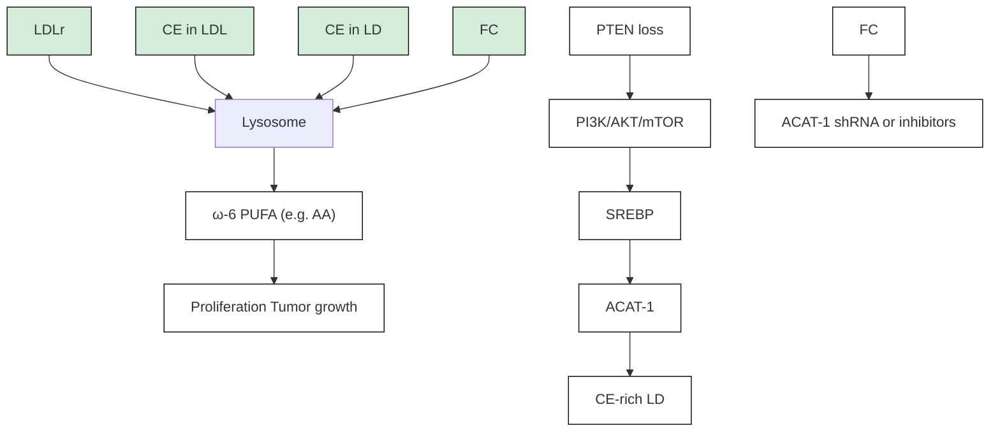

# Cholesteryl Ester Accumulation Induced by PTEN Loss and PI3K/AKT Activation Underlies Human Prostate Cancer Aggressiveness

Shuhua Yue,1 Junjie Li,2 Seung-Young Lee,1 Hyeon Jeong Lee,3 Tian Shao,4 Bing Song,2 Liang Cheng, Timothy A. Masterson,6 Xiaoqi Liu,4,7 Timothy L. Ratliff,3,7 and Ji-Xin Cheng1,7,

1Weldon School of Biomedical Engineering

2Department of Biological Sciences

3Department of Comparative Pathobiology

4Department of Biochemistry

Purdue University, West Lafayette, IN 47907, USA

5Department of Pathology and Laboratory Medicine

6Department of Urology

Indiana University School of Medicine, Indianapolis, IN 46202, USA

7Center for Cancer Research, Purdue University, West Lafayette, IN 47907, USA

\*Correspondence: jcheng@purdue.edu

http://dx.doi.org/10.1016/j.cmet.2014.01.019

## SUMMARY

Altered lipid metabolism is increasingly recognized as a signature of cancer cells. Enabled by label-free Raman spectromicroscopy, we performed quantitative analysis of lipogenesis at single-cell level in human patient cancerous tissues. Our imaging data revealed an unexpected, aberrant accumulation of esterified cholesterol in lipid droplets of high-grade prostate cancer and metastases. Biochemical study showed that such cholesteryl ester accumulation was a consequence of loss of tumor suppressor PTEN and subsequent activation of PI3K/AKT pathway in prostate cancer cells. Furthermore, we found that such accumulation arose from significantly enhanced uptake of exogenous lipoproteins and required cholesterol esterification. Depletion of cholesteryl ester storage significantly reduced cancer proliferation, impaired cancer invasion capability, and suppressed tumor growth in mouse xenograft models with negligible toxicity. These findings open opportunities for diagnosing and treating prostate cancer by targeting the altered cholesterol metabolism.

## INTRODUCTION

Cancer cells adopt metabolic pathways that differ from their normal counterparts by high rates of glycolysis and biosynthesis of essential macromolecules to fuel rapid growth (Schulze and Harris, 2012). Among dysregulated metabolic pathways, increased de novo synthesis of lipids has become a common characteristic of human cancers (Santos and Schulze, 2012). For instance, fatty acid synthase, the key enzyme that catalyzes the terminal steps in fatty acid synthesis, is frequently upregulated in human malignancies and plays important roles in cancer pathogenesis (Menendez and Lupu, 2007; Migita et al., 2009). In parallel with lipogenesis, lipolysis has also been shown to be elevated in multiple human cancers (Nomura et al., 2010). Specifically, monoacylglycerol lipase, the lipolytic enzyme that hydrolyzes monoacylglycerols to release free fatty acids, was found to be overexpressed in aggressive cancer cells. Based on the findings of upregulated expressions of both lipogenic and lipolytic enzymes, it is conceivable that cancer cells require reservoirs for lipids, namely lipid droplets (LDs), to store newly synthesized lipids on one hand and provide lipids for hydrolysis on the other hand. Indeed, as early as the 1970s, LDs were reported in clinical studies of mammary carcinoma (Ramos and Taylor, 1974). Since then, lipid accumulation has been described in many types of human cancers, including breast, brain, colon, and others (Accioly et al., 2008; Hakuma¨ ki and Kauppinen, 2000; Rosen, 2008). Nonetheless, lipid accumulation has not, to date, been used as a prognostic factor or therapeutic target of cancer. In particular, because compositions of LDs are not readily accessible with traditional methods, the exact role of lipid accumulation in cancer progression remains elusive.

LDs are visualized mainly through labeling with lipophilic dyes, which lacks compositional information. To assay for lipid composition, analytical tools, such as mass spectrometry and nuclear magnetic resonance spectroscopy, are commonly used. Because such techniques analyze tissue homogenates, it is impossible to obtain compositional information of individua LDs inside cells. The recently developed coherent Raman scattering microscopy (Cheng and Xie, 2012) has shed new light on the study of LD biology (Le et al., 2010; Zumbusch et al., 2013), with its label-free detection capability, high imaging speed, and submicron spatial resolution. Using this technique, high-speed vibrational imaging of LD dynamics in live cells and embryos has been demonstrated (Dou et al., 2012; Hellerer et al., 2007; Lyn et al., 2010; Nan et al., 2006; Paar et al., 2012). Multiplex coherent anti-Stokes Raman scattering microscopy has been used to study phase separation in LDs of 3T3- L1 cells (Rinia et al., 2008). Raman spectromicroscopy, which combines the high-speed imaging capability of coherent Raman scattering microscopy and the full spectral analysis capability of spontaneous Raman spectroscopy, allowed quantitation of not only the amount but also the composition of individual LDs in live cells (Slipchenko et al., 2009).

  
Figure 1. Aberrant CE Accumulation in Human PCa Tissues  
(A–D) Large-area SRL images and benign prostate, low-grade PCa (Gleason grade 3), high-grade PCa (Gleason grade 4), and metastatic PCa (liver), respectively. (E–H) Hematoxylin and eosin (H&E) staining of the adjacent slices. Scale bar, 100 mm. (I–L) High-magnification SRL and two-photon fluorescence images of the lesions shown in (A)–(D) (gray, SRL; green, two-photon fluorescence). Autofluorescent granules and LDs are indicated by red arrows. Scale bar, 20 mm.  
(legend continued on next page)

Here, we report quantitative analysis of lipogenesis at the single-cell level in intact tissues from a spectrum of human prostate pathologies. Our label-free Raman spectromicroscopy study revealed an unexpected accumulation of cholesteryl ester (CE) in high-grade and metastatic human prostate cancer (PCa) tissues, but not in normal prostate, benign prostatic hyperplasia (BPH), prostatitis, or prostatic intraepithelial neoplasia (PIN) tissues. Our biochemical study further showed that such CE accumulation was induced by loss of tumor suppressor PTEN, upregulation of PI3K/AKT/mTOR pathway, and consequent activation of sterol regulatory element-binding protein (SREBP) and low-density lipoprotein receptor (LDLr). Inhibition of cholestero esterification significantly suppressed cancer proliferation, migration, invasion, and tumor growth in vivo. These data collectively herald the potential of using CE as a marker for diagnosis of aggressive PCa and open a way of treating advanced PCa by targeting the altered cholesterol metabolism.

## RESULTS

## Aberrant Accumulation of Esterified Cholesterol in Advanced Human PCa Revealed by Raman Spectromicroscopy

We examined a spectrum of human prostate pathologies, including normal prostate from healthy donors and normal adjacent tissues from PCa patients (n = 19), BPH (n = 10), prostatitis $( \mathsf { n } = 3 ) , \mathsf { P } | \mathsf { N } ( \mathsf { n } = 3 )$ , low-grade (Gleason grade 3, n = 12), and highgrade (Gleason grade 4 or 5, n = 12) PCa from patients who had not received hormone therapy, and metastases $( \mathsf { n } = 9 )$ from patients who had failed hormone therapy. By tuning the laserbeating frequency to be resonant with C-H stretching vibration, substantial stimulated Raman loss (SRL) signals arose from the lipid-rich cell membranes and intracellular LDs, whereas weak SRL signals were derived from the lipid-poor cell nuclei. Morphologically, the SRL images provided information identical to that from hematoxylin and eosin-stained slides. In normal prostate (Figure 1A and see Figure S1A available online), BPH (Figure S1B), and PIN (Figure S1C), single layers of epithelia cells facing large lumens were identified by SRL imaging. In cancerous specimens, the SRL signals revealed small glandular structures in low-grade PCa (Figure 1B) and cell clusters without any glandular structures in high-grade PCa (Figure 1C). SRL image of metastasis is shown in Figure 1D. All diagnoses were confirmed by pathologic assessment of the neighboring slices stained with hematoxylin and eosin (Figures 1E–1H and S1D– S1F). By combining SRL with two-photon fluorescence on the same microscope, we found that the intracellular granules present in normal prostate (Figures 1I and S1G), BPH (Figure S1H), and PIN (Figure S1I) expressed both SRL and fluorescence signals, which peaked at 520 nm (Figure S1J). These autofluores cent granules were consistently seen in all 19 normal prostates, 10 BPH, and 3 PIN lesions (Table S1), and were determined to be lipofuscin according to previous reports on pigments in benign prostate (Ablin et al., 1973). No LDs or autofluorescent granules were observed in prostatitis specimens (Figures S1K–S1M). In contrast, with the exception of 4 borderline cases, the 20 primary PCa and all 9 metastases contained a significant amount of LDs, but no autofluorescent granules (Figures 1J–1L; Table S1). By large-area mapping and quantitation, the area fraction of LDs in human PCa tissues was found to be $0 . 7 8 \% \pm 0 . 6 5 \%$ for low-grade PCa, $3 . 9 3 \% \pm \ : 1 . 7 4 \%$ for high-grade PCa, and 2.76% ± 1.19% for metastatic PCa (Figure 1M; Table S1). The high-grade PCa has significantly higher LD area fraction b 5-fold $( | \mathsf { p } = 8 . 9 \mathsf { E } . 5 )$ compared to low-grade PCa.

To evaluate the lipid composition, we performed confoca Raman spectral analysis of individual autofluorescent granules or LDs accumulated in each lesion type. Figure 1N show representative spectra collected from normal prostate, lowgrade PCa (Gleason grade 3), high-grade PCa (Gleason grade $^ { 4 ) , }$ , metastatic PCa (liver), and pure cholesteryl oleate. The autofluorescent granules seen in normal prostate consis tently showed bands for lipid $( 1 , 2 0 0 - 1 , 8 0 0 \mathsf { c m } ^ { - 1 } )$ , phenylalanine $( \sim 1 , 0 0 0 \ c m ^ { - 1 } )$ ), and prominent CH stretching $( \sim 2 , 9 3 0 ~ \mathsf { c m } ^ { - 1 } )$ but lacked the characteristic C=O ester stretching band at $1 , 7 4 2 \mathsf { c m } ^ { - 1 }$ (Figure S1N). These data suggest that the autofluor escent granules are primarily composed of unesterified lipids and proteins. Similar Raman profiles were seen in both BPH and PIN lesion (Figure S1O). Importantly, the spectra of intracellular LDs in low-grade, high-grade, and metastatic PCa (Fig ure 1N) were distinctly different from those collected in norma prostate, BPH, and PIN lesions but nearly identical to the spectrum of pure cholesteryl oleate, with characteristic bands for cholesterol rings at 428, 538, 614, and $7 0 2 ~ { \mathsf { c m } } ^ { - 1 }$ and for ester bond at $1 , 7 4 2 \ c m ^ { - 1 }$ (Movasaghi et al., 2007). Spectra taken from various LDs in the same cancer specimen were nearly iden tical (Figure S1P), which allowed quantitation of CE percentage. Given that neutral lipids in LDs are predominantly triacylglycerol (TG) and CE (Farese and Walther, 2009), we recorded Raman spectra of mixed emulsions containing cholesteryl oleate and glyceryl trioleate (Figure S1Q). We found that the height ratio between the most prominent cholesterol band a $7 0 2 \mathsf { c m } ^ { - 1 }$ and the $\mathsf { C H } _ { 2 }$ bending band at $1 , 4 4 2 \mathsf { c m } ^ { - 1 }$ was linearly proportional to the molar percentage of CE present in the total lipids (Figure S1R). Based on this calibration curve, we found that LDs were ubiqui tously rich in CE in all stages of PCa, specifically 90.2% ± 9.1% for low grade, 90.6% ± 4.9% for high grade, and $7 0 . 3 \% \pm 1 8 . 5 \%$ for metastasis (Figure 1O; Table S1). Electrospray ionization mass spectrometry analysis of extracted lipids from tissues confirmed that CE accumulated in high-grade PCa, but not in normal prostate. The mass data further showed that cholestery oleate (CE 18:1) was the dominant species (Figure S1S). To complete the analysis, we measured TG levels by enzymatic assay and did not find significant difference between the cancer tissue (0.77 ± 0.10 mg per gram of tissue) and the normal one (0.78 ± 0.02 mg per gram of tissue). Taken together, our analyses indicate that CE is the dominant form of neutral lipids accumulated in human PCa tissues, and it presents a promising molecular marker to improve the current PCa diagnosis.

## CE Accumulation in PCa Is Not Correlated with Androgen Signaling

Because androgen receptor (AR) remains transcriptionally active in castration-resistant PCa (Debes and Tindall, 2004), and cholesterol is the precursor of the entire androgen synthesis cascade, we first speculated that CE accumulation was associated with androgen signaling in PCa. To test this hypothesis, we examined the LDs in nontransformed human prostate epithelium and a panel of human PCa cells (Figures 2A and 2B), with various AR status and androgen dependence (Table S2). As shown in Figure 2C, the LDs in nontransformed prostate RWPE1 cells showed a low CE level (<20%), and the CE level remained low upon addition of 10% fetal bovine serum (Figure S2A). For ARnegative cancer cells, we examined bone metastasis-derived PC-3 and brain metastasis-derived DU145 and found that CE level was high in PC-3 (>90%) but low in DU145 (<20%). For AR-positive cancer cells, we used low-passage LNCaP (LNCaP-LP) and high-passage LNCaP (LNCaP-HP) as models for PCa progression (Igawa et al., 2002). The CE level was high (>80%) in the androgen-independent LNCaP-HP but low (<20%) in the androgen-dependent LNCaP-LP. Notably, it was reported that LD accumulation in LNCaP-LP was due to the upregulation of fatty acid synthase (Swinnen et al., 1996, 1997). Our data showed a dramatic increase of CE levels during progression of LNCaP cells from androgen-dependent to androgen-independent stage. Meanwhile, a key step of androgen signaling, nuclear translocation of AR, was seen in CE-poor LNCaP-LP cells, but not in CE-rich LNCaP-HP cells (Figure 2D). Finally, we found, in AR-positive and androgen-independent C4-2 and 22Rv-1 cells, that CE level was low (<20%) in C4-2 (Figure 2C) and that LD accumulation remained low upon dihydrotestosterone treatment in 22Rv-1 (Figure S2B). These data collectively imply that CE accumulation may be linked to a pathway that is independent of androgen signaling.

## CE Accumulation Is Driven by Loss of PTEN and Consequent Upregulation of PI3K/AKT/mTOR/SREBP Pathway

The finding that CE accumulated in PC-3 cells (PTEN null) but not in DU145 cells (PTEN wild-type) then triggered us to ask whether CE accumulation resulted from loss of tumor suppressor PTEN, which is known to activate a pathway bypassing the AR (Debes and Tindall, 2004). Loss of PTEN has been widely observed in both localized and metastatic PCa and is correlated with high Gleason grade (McMenamin et al., 1999). With PTEN loss, PI3K signaling is hyperactivated, which leads to AKT activation. The upregulated PI3K/AKT pathway has been implicated in carcinogenesis and metastasis of PCa (Sarker et al., 2009; Vivanco and Sawyers, 2002). To determine the extent to which PTEN is involved, we first reintroduced wild-type PTEN into PC-3 cells (Figure S3A) and found that CE levels were significantly reduced (Figure 3A). Then we inhibited PTEN by the inhibitor BPV in DU145 cells and found a significant increase in CE levels (Figure 3B). Because BPV is not sufficiently specific to abrogate PTEN, we stably knocked down PTEN using shRNA in DU145 cells. As expected, PTEN knockdown resulted in a significant reduction of PTEN expression level and a significant increase in AKT phosphorylation (Figure 3C). We then analyzed the LDs in the PTEN knockdown DU145 cells (Figure S3B) and found a significant increase in CE levels (Figure 3D). In consistency, we found higher expression levels of p-AKT in CE-rich PCa cells (PC-3 and LNCaP-HP) compared to CE-poor PCa cells (LNCaP-LP, C4-2, and DU145) (Figure S3C). To determine the role of the PI3K/AKT/mTOR pathway in regulating CE accumulation, we treated both PC-3 and LNCaP-HP cells with LY294002 (a selective PI3K inhibitor), MK2206 (a selective AKT inhibitor), and rapamycin (a selective mTOR inhibitor), respectively. SRL imaging (Figure S3D) showed that total LD amounts were not markedly reduced upon inhibitor treatments (Figure 3E). Spectral analysis (Figure S3E), however, showed that CE levels were significantly reduced in PC-3 cells (Figure 3E). The inhibition of PI3K/AKT/mTOR pathway significantly reduced both LD amount (Figure S3F) and CE levels (Figure S3G) in LNCaP-HP cells. Taken together, these results suggest that CE accumulation is driven by the loss of PTEN and consequent upregulation of PI3K/AKT pathway.

It is known that AKT mediates the activation of mTOR complex 1 that plays a critical role in regulating the function of SREBPs (Porstmann et al., 2008). The SREBPs are transcription factors that function to control lipid and cholesterol homeostasis by sensing cellular cholesterol (Brown and Goldstein, 1997). Increased activation of SREBPs was found in advanced PCa (Ettinger et al., 2004). Using RNA interference, we found that knockdown of both SREBP-1 and SREBP-2 (Figure S3H) led to significantly reduced CE levels in PC-3 cells without affecting LD amount, and knockdown of SREBP-1 resulted in a stronger effect than knockdown of SREBP-2 (Figure 3E). Using immunoblotting, we further found that inhibition of the PI3K/AKT/mTOR pathway significantly suppressed both the expression level and cleavage of SREBP-1 in PC-3 cells (Figure 3F), indicating that CE accumulation is closely related to the activity of SREBP-1 isoforms. These results collectively show an essential role of SREBP in regulating CE accumulation

## CE Accumulation in PCa Cells Arises from Enhanced Uptake of Exogenous LDL

Because cholesterol can be either de novo synthesized via the mevalonate pathway or taken up from exogenous lipoproteins, we investigated the source of cholesterol used for CE accumulation. We first treated PC-3 cells with simvastatin, an inhibitor of 3-hydroxy-3-methylglutaryl coenzyme A reductase, the rate-limiting enzyme of the mevalonate pathway. As shown in Figure 4A, simvastatin neither decreased LD amount nor significantly reduced CE levels. In contrast, after treating cells with lipoprotein-deficient serum, LDs nearly disappeared in CE-rich PC-3 cells (Figure 4B) but remained the same amount in CEpoor cells, including LNCaP-LP, DU145, and C4-2 (Figures S4A and S4B). Readdition of LDL into the lipoprotein-deficient medium restored the LD amount (Figure 4B) with a CE level of $9 3 . 6 \% \pm 5 . 5 \%$ in PC-3 cells. By treating cells with DiI-labeled

A  

text_image

RWPE1
LNCaP-LP
LNCaP-HP
PC-3
DU145
C4-2

bar chart

| Protein     | CE percentage (%) | LD amount |
|-------------|-------------------|---------|
| RWPE1       | 18                | 1       |
| LNCaP-LP    | 17                | 7       |
| LNCaP-HP    | 82                | 3       |
| PC-3        | 92                | 7       |
| DU145       | 13                | 7       |
| C4-2        | 13                | 5       |

line chart

| Raman shift (cm⁻¹) | RWPE1 | LNCaP-LP | LNCaP-HP | PC-3 | DU145 | C4-2 |
| ------------------ | ----- | -------- | -------- | ---- | ----- | ---- |
| 400                | ~0.2  | ~0.1     | ~0.1     | ~0.1 | ~0.1  | ~0.05|
| 600                | ~0.3  | ~0.2     | ~0.2     | ~0.2 | ~0.2  | ~0.1 |
| 800                | ~0.4  | ~0.3     | ~0.3     | ~0.3 | ~0.3  | ~0.2 |
| 1000               | ~0.5  | ~0.4     | ~0.4     | ~0.4 | ~0.4  | ~0.3 |
| 1200               | ~0.6  | ~0.5     | ~0.5     | ~0.5 | ~0.5  | ~0.4 |
| 1400               | ~0.7  | ~0.6     | ~0.6     | ~0.6 | ~0.6  | ~0.5 |
| 1600               | ~0.8  | ~0.7     | ~0.7     | ~0.7 | ~0.7  | ~0.6 |
| 1800               | ~0.9  | ~0.8     | ~0.8     | ~0.8 | ~0.8  | ~0.7 |

D

text_image

DAPI
DAPI
AR
AR
Merge
Merge
LNCaP-LP
LNCaP-HP

Figure 2. CE Accumulation Is Not Correlated with Androgen Signaling  
(A) SRL images of various types of cells, including RWPE1, LNCaP-LP, LNCaP-HP, PC-3, DU145, and C4-2. LDs are indicated by green arrows.  
(B) Raman spectra of LDs in cells shown in (A). Spectral intensity was normalized by the peak at 1,442 cm1 . Black arrows indicate the bands of cholesterol rings at 702 cm1 .  
(C) Quantitation of LD amount and CE percentage. LD amount was normalized by the RWPE1 group. Error bars represent SEM, n > 5. \*\*p < 0.005, \*\*\*p < 0.0005  
(D) Nuclear translocation of androgen receptor (AR) in LNCaP-LP and LNCaP-HP cells. Blue, DAPI; red, AR immunofluorescence. Scale bar, 10 m.

LDL, it was found that LDL uptake was the most prominent in the CE-rich PC-3 cells compared to CE-poor PCa cells (Figures S4C and S4D). Inhibition of the PI3K/AKT/mTOR pathway significantly reduced expression levels of LDLr (Figure 4C) and blocked the uptake of DiI-labeled LDL in PC-3 cells (Figure 4D). Knockdown of SREBP using siRNA also reduced the LDL uptake in PC-3 cells (Figure 4E). These results collectively support the notion that CE accumulation in PCa cells is a consequence of enhanced uptake of LDL.

## CE Accumulation in PCa Cells Requires Cholesterol Esterification by ACAT-1

LDL is known to enter a cell via LDLr and traffic to the late endo some and lysosome to be hydrolyzed to free fatty acids and free cholesterol. The excess free cholesterol, together with the fatty acyl CoA substrate, is then converted to CE by acyl coenzyme A: cholesterol acyltransferase (ACAT) and stored in LDs (Chang et al., 2006). Thus, we treated cells separately with avasimibe and Sandoz 58-035, two different ACAT inhibitors. Both

A  

line chart

| Raman shift (cm⁻¹) | Intensity (a.u.) - PC-3 PTEN | Intensity (a.u.) - PC-3 PTEN overexpression |
| ------------------ | ---------------------------- | ------------------------------------------ |
| 400                | ~0                           | ~0                                         |
| 500                | ~0                           | ~0                                         |
| 600                | ~0                           | ~0                                         |
| 700                | ~1.5                         | ~0.5                                       |
| 800                | ~0                           | ~0.5                                       |

B  

line chart

| Raman shift (cm⁻¹) | DU145 Control | DU145 PTEN inhibitor BPV |
| ------------------ | ------------- | ------------------------ |
| 400                | ~0.8          | ~0.2                     |
| 500                | ~0.9          | ~0.3                     |
| 600                | ~0.8          | ~0.4                     |
| 700                | ~0.9          | ~1.0                     |
| 800                | ~0.8          | ~0.3                     |

C  

text_image

DU145
PTEN-WT PTEN-KD
PTEN
p-AKT
β-Actin

bar chart

| PTEN | CE percentage (%) | LD amount |
| ---- | ----------------- | --------- |
| PC-3 | 95                | 1.0       |
| PTEN | 40                | 0.8       |

bar chart

| Group      | CE percentage (%) | LD amount |
| ---------- | ----------------- | --------- |
| DU145 Control | 15                | 0.95      |
| DU145 BPV   | 65                | 0.98      |

D  

bar chart

| Group    | CE percentage (%) | LD amount |
| -------- | ----------------- | --------- |
| DU145 PTEN-WT | 15                | 0.9       |
| DU145 PTEN-KD | 65                | 0.9       |

E  

bar chart

| Treatment | CE percentage (%) | LD amount |
| :--- | :--- | :--- |
| Control | 94 | 0.88 |
| LY294002 | 26 | 0.87 |
| MK2206 | 51 | 0.95 |
| Rapamycin | 50 | 0.85 |
| SREBP-1 siRNA | 33 | 0.91 |
| SREBP-2 siRNA | 54 | 0.90 |
*** indicates statistical significance. The asterisks (***) denote statistical significance compared to Control.

text_image

P
Ctl Rapa MK LY
p-AKT
p-S6
SREBP-1
←P
←C
SREBP-2
←P
←C
β-Actin

Figure 3. CE Accumulation Is Induced by PTEN Loss and PI3K/AKT Activation  
(A) Raman spectra of LDs in PTEN null and PTEN-overexpressed PC-3 cells (3 day transfection) are shown. The band of cholesterol rings at $7 0 2 \mathsf { c m } ^ { - 1 }$ nearly disappeared after the treatment, as indicated by the arrows. Quantitation of CE percentage and LD amount is shown below the spectra. ${ \mathsf n } > 5 .$  
(B) CE levels in DU145 cell treated with PTEN inhibitor BPV (10 mM) for 3 days. Raman spectra of LDs in control and treated cells are shown. The band of cholesterol rings $\mathsf { a t } 7 0 2 \mathsf { c m } ^ { - 1 }$ significantly increased after the treatment, as indicated by the arrows. Quantitation of CE percentage and LD amount is shown below the spectra. ${ \mathsf { n } } > 5 .$ . Spectral intensity was normalized by the peak at $1 , 4 4 2 \mathsf { c m } ^ { - 1 } \mathsf { i n } ( \mathsf { A } )$ and (B)  
(C) Immunoblot of antibodies against ${ \mathsf { P T E N } } , { \mathsf { p } } { \mathsf { - A K T } } ,$ , and -actin in PTEN-WT and PTEN-KD DU145 cells.  
(D) CE percentage and LD amount in PTEN-WT and PTEN-KD DU145 cells.  
(E) CE percentage and LD amount in cells treated with DMSO as control, LY294002 (50 mM, 3 day), MK2206 (10 mM, 2 day), rapamycin (100 nM, 2 day), and SREBP-1 and SREBP-2 siRNA (2 day transfection). n > 5. LD amount was normalized by the control group in $( { \mathsf { A } } ) , ( { \mathsf { B } } ) , ( { \mathsf { D } } ) ,$ , and (E)  
(F) Immunoblot of antibodies against p-AKT, p-S6, SREBP-1 and SREBP-2, and b-actin in PC-3 cells treated with DMSO as control (Ctl), LY294002 (LY), MY220 (MK), and rapamycin (Rapa). P, precursor form; C, cleaved form. The expression levels of p-AKT and ${ \mathsf { p } } { \mathsf { - } } { \mathsf { S } } { \mathsf { 6 } }$ were reduced after inhibitor treatments as expected. WT, wild-type; KD, knockdown. Error bars represent $\mathbb { S } \mathsf { E } \mathsf { M } . \mathsf { \Omega } ^ { \star \star \star } \mathsf { p } < 0 . 0 0 0 5 .$

avasimibe (Figure 4F) and Sandoz 58-035 (Figure S4E) effectively suppressed CE accumulation in PC-3 cells, with the amount of LDs slightly decreased (Figure 4F). The significan reduction of CE accumulation upon avasimibe treatment was verified by biochemical assay (Figure S4F) and mass spectrometry of extracted lipids from PC-3 cells (Figure S4G). The mass data (Figure 4G) further showed that cholesteryl oleate (CE 18:1) was the dominant species present. Because ACAT inhibitors inhibits both ACAT-1 and ACAT-2 isoforms, we knocked down ACAT-1 using shRNA (Figure S4H) and found significant reduction of the CE level in PC-3 cells (Figure 4F). In addition, inhibition of PI3K/AKT/mTOR pathway significantly reduced expression levels of ACAT-1 (Figure 4C). These results collectively confirm the involvement of ACAT-1 in CE storage in PCa cells.

bar chart

| Group      | CE percentage (%) | LD amount |
| ---------- | ----------------- | --------- |
| Control    | 88                | 0.9       |
| Simvastatin| 73                | 0.95      |

bar chart

| Condition | LD amount |
|---|---|
| Control | 1.0 |
| LPDS | 0.05 |
| LPDS + LDL | 0.95 |

text_image

C
Ctl LY MK Rapa
LDLr
ACAT-1
β-Actin

bar chart

| Group      | Dil-LDL intensity |
| ---------- | ----------------- |
| Control    | 1.0               |
| LY294002   | 0.1               |
| Rapamycin  | 0.2               |

bar chart

| Group        | Dil-LDL intensity |
| ------------ | ----------------- |
| Control      | 1.0               |
| SREBP-1 siRNA | 0.15              |
| SREBP-2 siRNA | 0.35              |

line chart

| Sample     | Peak Label | Mass to Charge (m/z) |
| ---------- | ---------- | -------------------- |
| Control    | CE 18:1    | 668.6                |
| Control    | 640.6      | 642.6                |
| Control    | 690.6      | 714.6                |
| Control    | 742.6      | 770.4                |
| Avasimibe  | CE 18:1    | 656.4                |
| Avasimibe  | 668.4      | 668.4                |
| Avasimibe  | 714.6      | 744.0                |

Figure 4. CE Accumulation Arises from Enhanced Uptake of LDL and Involves Cholesterol Esterification by ACAT-1  
(A) LD amount and CE percentage in PC-3 cells treated with or without simvastatin (10 mM, 1 day), n > 5.  
(B) SRL images and quantitation of LD amount in PC-3 cells treated with lipoprotein-deficient serum (LPDS, 10%, 1 day) and subsequent LDL readdition (45 g/ml, 1 day), ${ \mathsf { n } } = 6 .$ LDs are indicated by the green arrow.  
(C) Immunoblot of antibodies against LDLr, ACAT-1, and b-actin in PC-3 cells treated with DMSO as control (Ctl), LY294002 (LY, 50 mM, 3 day), MK2206 (MK, 10 mM, 2 day), and rapamycin (Rapa, 100 nM, 2 day).  
(D and E) Quantitation of DiI-LDL uptake by PC-3 cells treated with DMSO as control, LY294002, and rapamycin $\left( \mathsf { n } = 5 \right) \left( \mathsf { D } \right)$ , and transfected with SREBP-1 or SREBP-2 siRNA $( \mathsf { n } = 5 )$ (E). DiI-LDL intensity was normalized by the control group.  
(F) Raman spectra of LDs and quantitation of LD amount and CE percentage in PC-3 cells treated with avasimibe $( 7 . 5 \mu \mathsf { M } ,$ 1 day) and ACAT-1 shRNA (3 day transfection). ${ \mathsf n } > 5 .$ Spectral intensity was normalized by the peak at $1 , 4 4 2 \ c m ^ { - 1 }$ . The bands of cholesterol rings at $7 0 2 ~ { \mathsf { c m } } ^ { - 1 }$ nearly disappeared after the treatments, as indicated by the arrows. LD amount was normalized by the control group in $( \mathsf { A } ) , ( \mathsf { B } )$ ), and (F).  
(G) Mass spectra of lipids extracted from control and avasimibe-treated PC-3 cells $( 7 . 5 ~ \mu \mathsf { M } , 2 ~ \mathsf { d a y } )$ ). The m/z 668 peak stands for cholesteryl oleate (CE 18:1). DiI-LDL, DiI-labeled LDL. Error bars represent SEM. ${ } ^ { \star \star } \mathsf { p } < 0 . 0 0 5 , { } ^ { \star \star \star } \mathsf { p } < 0 . 0 0 0 5$ . Scale bar, 10 m.

line chart

| Concentration (μM) | Viability (% of control) |
| ------------------ | ------------------------ |
| 1                  | 100                      |
| 10                 | 50                       |
| 100                | 0                        |

line chart

| PI fluorescence | Value |
| --------------- | ----- |
| Sub-G1          | 0     |
| G1              | 500   |
| S               | 100   |
| G2/M            | 250   |

line chart

| PI fluorescence | Value |
| --------------- | ----- |
| Sub-G1          | 150   |
| G1              | 140   |
| S               | 60    |
| G2/M            | 30    |

bar chart

| Category | Ctl (%) | Ava (%) |
|---|---|---|
| sub-G1 | 6 | 21 |
| G1 | 29 | 34 |
| S | 32 | 29 |
| G2/M | 18 | 8 |

bar chart

| Group        | Migrated cells (% of control) | Invaded cells (% of control) |
| ------------ | ---------------------------- | --------------------------- |
| Control      | 100                          | 100                         |
| Avasimibe    | 20                           | 25                          |
| Sandoz 58-035| 65                           | 60                          |
| ACAT-1 shRNA | 55                           | 25                          |

bar chart

| Avasimibe | Condition | Migrated cells (% of PTEN-WT) | Invaded cells (% of PTEN-WT) |
| :--- | :--- | :--- | :--- |
| - | DU145 PTEN-WT | 100 | 100 |
| - | DU145 PTEN-KD | 185 | 165 |
| + | DU145 PTEN-WT | 125 | 95 |
D

line chart

| Time of treatment (day) | Veh Relative tumor volume | Ava Relative tumor volume |
| ----------------------- | ------------------------- | ------------------------- |
| 0                       | 0                         | 0                         |
| 5                       | ~1.5                      | ~1.0                      |
| 10                      | ~2.5                      | ~1.5                      |
| 15                      | ~3.5                      | ~2.0                      |
| 20                      | ~5.0                      | ~2.5                      |
| 25                      | ~7.0                      | ~3.5                      |
| 30                      | ~10.0                     | ~4.5                      |

bar chart

| Group | Tumor weight (g) |
| ----- | ---------------- |
| Veh   | 1.2              |
| Ava   | 0.8              |

line chart

| Time of treatment (day) | Veh Body weight (g) | Ava Body weight (g) |
| ----------------------- | ------------------- | ------------------- |
| 0                       | 28.0                | 28.0                |
| 10                      | 29.0                | 28.5                |
| 20                      | 30.0                | 29.0                |
| 30                      | 30.5                | 29.5                |

bar chart

| Group | CE percentage (%) |
| ----- | ----------------- |
| Veh   | 25                |
| Ava   | 13                |

line chart

| Time of treatment (day) | Veh Relative tumor volume | Ava Relative tumor volume |
| ----------------------- | ------------------------- | ------------------------- |
| 0                       | 0                         | 0                         |
| 5                       | ~2                        | ~1                        |
| 10                      | ~8                        | ~3                        |
| 15                      | ~16                       | ~5                        |
| 20                      | ~25                       | ~7                        |

bar chart

| Treatment | Tumor weight (g) |
| --------- | ---------------- |
| Veh       | 0.8              |
| Ava       | 0.3              |

line chart

| Time of treatment (day) | Veh Body weight (g) | Ava Body weight (g) |
| ----------------------- | ------------------- | ------------------- |
| 0                       | 25                  | 26                  |
| 5                       | 25                  | 26                  |
| 10                      | 25                  | 25                  |
| 15                      | 25                  | 26                  |
| 20                      | 25                  | 26                  |

bar chart

| Group | % Ki67 positive cells (%) | % TUNEL positive cells (%) |
|---|---|---|
| Veh Ava | 68 | 2 |
| Veh Ava (with ***) | 20 | 5 |

Figure 5. CE Depletion Impairs PCa Aggressiveness  
(A) $| \mathsf { C } _ { 5 0 }$ curve of avasimibe treatments (3 day) on PC-3 cells $( \mathsf { I C } _ { 5 0 } = 7 . 3 \mu \mathsf { M } ) . \mathsf { n } = 6 .$ . The control group (DMSO) was used for normalization.  
(B) Flow cytometry analysis of cell cycle in control and avasimibe-treated $( 7 . 5 \mu \mathsf { M } ,$ 3 day) PC-3 cells (n = 3). PI, propidium iodide.  
(C) Quantitation of migrated and invaded PC-3 cells that were pretreated with avasimibe (5 M), Sandoz 58-035 (10 M), or ACAT-1 shRNA for 2 days $( \mathsf { n } = 3 ) .$ The control group was used for normalization.  
(D) Quantitation of migrated and invaded PTEN-WT or PTEN-KD DU145 cells that were pretreated with DMSO as control or avasimibe (5 mM) for 1 day $( \mathsf { n } = 3 ) .$ ). The PTEN-WT DU145 group was used for normalization.  
(E) Relative tumor volume of PC-3 xenograft (n = 9) upon daily avasimibe treatments (15 mg/kg). Representative tumors harvested on day 30 are shown in the inset. Scale bar, 1 cm.

## Depletion of CE Storage Impairs PCa Aggressiveness

Because CE accumulation was found in PCa but was not detectable in normal prostate, we evaluated how cell viability could be affected by regulating CE levels. Separate treatments by avasimibe (Figure 5A) and Sandoz 58-035 (Figure S5A) significantly reduced viability of PC-3 cells, with $| \mathsf { C } _ { 5 0 }$ value of 7.3 mM and 17.2 mM, respectively. Avasimibe treatment also significantly reduced viability of LNCaP-HP cells, with $| \mathsf { C } _ { 5 0 }$ value of 9.6 mM (Figure S5B). The inhibitory effect of avasimibe on the growth of nontransformed RWPE1 cells and CE-poor PCa cells, including LNCaP-LP, DU145, and C4-2, was considerably smaller than that in PC-3 and LNCaP-HP cells (Figure S5C). To confirm the inhibitory effect was ACAT-1 specific, we knocked down ACAT-1 using shRNA, and observed significantly reduced viability in PC-3 cells (Figure S5D). Results from flow cytometry analysis (Figure 5B) revealed that exposure of PC-3 cells to avasimibe resulted in both cell-cycle arrest and apoptosis; i.e., the G2/M phase population was approximately two times smaller, whereas the sub-G1 population was approximately three times larger in avasimibe-treated group compared to control group. Because the lipids in LDs are primarily composed of CE and TG, we treated PC-3 cells with a selective inhibitor of diacylglycerol acyltransferase (DGAT)-1, which catalyzes the termina step of TG formation. Our data showed that DGAT inhibition by A922500 did not affect cell viability until high doses (Figure S5A).

To evaluate whether CE depletion affects tumor aggressiveness, we conducted standard transwell assays (Figure S5E). Our results showed that both migration and invasion capabilities of PC-3 cell were markedly suppressed upon ACAT inhibition by avasimibe or Sandoz 58-035, and ACAT-1 knockdown using shRNA (Figure 5C). In contrast, DGAT inhibition slightly increased PC-3 cell migration (Figure S5F) and invasion (Figure S5G). As a positive control, PTEN knockdown in DU145 cells led to significantly greater capabilities of growth (Figure S5H), migration, and invasion (Figure 5D) compared to the CE-poor PTEN wild-type DU145 cell. This result is consistent with the previous study (Dubrovska et al., 2009), where PTEN knockdown led to increased clonogenic and tumorigenic potential of DU145 cell. Importantly, ACAT inhibition by avasimibe significantly suppressed viability (Figure S5H), migration, and invasion capabilities (Figure 5D) of PTEN knockdown DU145 cells. These results collectively show that CE depletion suppresses aggressiveness of CE-rich PCa cells in vitro.

To test the potential of treating advanced PCa in vivo by ACAT inhibition, we separately administered avasimibe and Sandoz 58-035 (15 mg/kg) to athymic nude mice bearing PC-3 xenografts. Daily treatment of mice with avasimibe inhibited the growth of PC-3 tumors by 2-fold (Figure 5E) and significantly reduced weight of tumor tissues (Figure 5F). Similar result were observed from the mice treated with Sandoz 58-035 (Figures S5I and S5J). In contrast, daily treatments of mice with DGAT inhibitor A922500 (3 mg/kg) did not reduce PC-3 growth in vivo (Figures S5I and S5J). To confirm the efficacy of ACAT inhibition in tumors with inactivated PTEN, we transplanted the stable PTEN knockdown DU145 cells into mice. The results showed that ACAT inhibition by avasimibe suppressed the growth of PTEN knockdown DU145 tumors by 4-fold (Figure 5G) and reduced weight of tumor tissues by 3-fold (Figure 5H). Importantly, the ACAT inhibitors did not cause general toxicity to animals, as indicated by the fact that no changes in body weight were observed in the mice treated with avasimibe (Figures 5I and 5J) or Sandoz 58-035 (Fig ure S5K). Pathological review of sections of heart, kidney, liver, lung, and spleen harvested from mice receiving avasimibe showed no detectable signs of toxicity (Figure S5L). Spectro scopic analysis of extracted tissues revealed that CE levels significantly dropped in avasimibe-treated tumors compared to vehicle-treated ones (Figure 5K), even though LD area fraction was not affected (Figure S5M), indicating that ACAT inhibitor worked to inhibit CE formation in tumor cells in vivo. Immunohis tochemistry using markers for proliferation (Ki67) and apoptosi (TUNEL) (Figure S5L) showed that avasimibe significantly reduced tumor proliferation by 70% and increased apoptosi by 2-fold (Figure 5L).

## CE Depletion Impairs PCa Growth by Limiting Uptake of Essential Fatty Acids

We first suspected that CE storage might act as a pool of fatt acid and cholesterol which can be released from LDs for cancer cell proliferation. The result that inhibition of CE hydrolysis using diethylumbelliferyl phosphate, a selective cholesterol esterase inhibitor, slightly enhanced PC-3 cell growth (Figure S6A) did not support such hypothesis. We then asked whether CE deple tion suppressed PCa proliferation by downregulation of the upstream pathways including LDL uptake. We notice that LDL is the primary carrier of essential polyunsaturated fatty acids, including arachidonic acid (AA) (Habenicht et al., 1990). Inside cells, AA is released from LDL and converted to a range of eicosanoids that have been implicated in various pathological pro cesses, including inflammation and cancer (Wang and Dubois, 2010). Because cholesterol esterification is known to play a vital role in maintaining intracellular cholesterol homeostasis (Chang et al., 2006), we hypothesized that abrogating ACAT activity can inhibit PCa growth by elevating free cholestero levels, downregulating expression levels of SREBP and LDLr, and consequently reducing the uptake of LDL. To test this hypothesis, we measured free cholesterol levels in PC-3 cells with a biochemical assay and found that avasimibe treatment significantly increased the free cholesterol levels (Figure 6A). Moreover, knockdown of ACAT-1 (Figure 6B) or inhibition of

A  

bar chart

| Group      | Free cholesterol (μg/mg protein) |
| ---------- | --------------------------------- |
| Control    | 8                                 |
| Avasimibe  | 12                                |

B  

text_image

Control
ACAT-1
shRNA
SREBP-1
P
C
SREBP-2
P
C
LDLr
p-AKT
β-Actin

text_image

C
Control	Avasimibe
SREBP-1	↔P
	↔C
SREBP-2	↔P
	↔C
LDLr
p-AKT
β-Actin

D  

bar chart

| Group      | Dil-LDL intensity |
| ---------- | ----------------- |
| Control    | 1.0               |
| Avasimibe  | 0.1               |

natural_image

Fluorescence microscopy image showing cellular structures with green fluorescent markers, labeled 'Control' on the right (no additional text or symbols)

natural_image

Fluorescence microscopy image of cells labeled 'Avasimibe' showing green fluorescent signals (no text or symbols beyond label)

E  

bar chart

| Group       | AA level (ng / 10⁶ cells) |
| ----------- | ------------------------- |
| Control     | 60                        |
| Avasimibe   | 38                        |
| ACAT-1 shRNA | 37                        |

F  

line chart

| AA (μM) | Viability (% of control) |
| ------- | ------------------------ |
| 0       | 100                      |
| 1       | 110                      |
| 2       | 120                      |
| 3       | 120                      |
| 4       | 125                      |
| 5       | 125                      |
| 6       | 130                      |
| 7       | 130                      |
| 8       | 130                      |

G  

bar chart

| Ava | AA | Viability (% of control) |
| --- | --- | --- |
| - | - | 100 |
| + | - | 58 |
| + | + | 95 |

Figure 6. CE Depletion Reduces PCa Cell Proliferation by Limiting the Uptake of Essential Fatty Acids  
(A) Free cholesterol level in control and avasimibe-treated PC-3 cells $( \mathsf { n } = 3 ) .$  
(B and C) Immunoblot of antibodies against SREBP-1 and SREBP-2, LDLr, p-AKT, and b-actin in PC-3 cells treated with ACAT-1 shRNA (B) or avasimibe (C). P, precursor form; C, cleaved form.  
(D) Quantitation and representative images and of DiI-LDL uptake in control and avasimibe-treated PC-3 cells (n = 5). Gray, SRL; green, two-photon fluorescence. Scale bar, $1 0 ~ { \mu \mathrm { m } }$ . DiI-LDL intensity was normalized by the control group.  
(E) AA levels in PC-3 cells treated with avasimibe or ACAT-1 shRNA (n = 3). In (A)–(E), avasimibe treatment was as follows: 7.5 mM, 2 day; ACAT-1 shRNA, 3 day transfection.  
(F) Dose-dependent growth of PC-3 cells upon AA treatments (3 day).  
(G) PC-3 cell viability upon avasimibe treatment (7.5 mM) in the absence or presence of AA (7.5 mM) for 3 days. The control groups were used for normalization. AA, arachidonic acid: Ava, avasimibe. Error bars represent SEM. ${ } ^ { \star } \mathsf { p } < 0 . 0 5 , { } ^ { \star \star } \mathsf { p } < 0 . 0 0 5 , { } ^ { \star \star \star } \mathsf { p } < 0 . 0 0 0 5 .$

ACAT using avasimibe (Figure 6C) or Sandoz 58-035 (Figure S6B) resulted in reduced expression levels of SREBP-1 and LDLr and also reduced SREBP-1 cleavage. Quantification of the western blots further confirmed that expression levels of both precursor and cleaved forms of SREBP-1 were significantly reduced upon ACAT-1 knockdown or inhibition (Figure S6C). The LDLr expression level in implanted PC-3 tumor was also reduced in avasimibe-treated group compared to the vehicle group (Figure S6D). By monitoring cellular uptake of DiI-LDL, we found that avasimibe treatment resulted in reduced LDL uptake by 10-fold (Figure 6D). Furthermore, liquid chromatography-tandem mass spectrometry analysis of PC-3 cell lysates revealed that avasimibe treatment or ACAT-1 knockdown significantly reduced the level of AA in PC-3 cells (Figure 6E) and LNCaP-HP cells (Figure S6E). As shown elsewhere (Ghosh and Myers, 1997; Hughes-Fulford et al., 2001) and confirmed herein, AA (Figure 6F) and LDL (Figure S6F) separately promoted the growth of PC-3 cells in a dose-dependent manner. AA was also shown

flowchart

Figure 7. Molecular Pathways Underlying Accumulation of CE in Advanced Human PCa and Suppression of Cancer Proliferation upon CE Depletion

The schematic shows that loss of PTEN activates PI3K/AKT/mTOR pathway, which in turn upregulates SREBP and LDLr. LDL is then hydrolyzed to free fatty acids and free cholesterol (FC) in lysosome. The excess FC together with the fatty acyl CoA substrate is converted to CE by ACAT-1 and stored in LDs. LDL also serves as an important carrier of u-6 polyunsaturated fatty acid (PUFA), such as AA, which promotes cell proliferation and tumor growth. The red arrows depict the consequences of CE depletion. Depletion of CE storage by ACAT-1 knockdown or ACAT inhibition disturbs cholesterol homeostasis by elevating FC levels and consequently downregulating expression levels o SREBP and LDLr. Subsequently reduced uptake of -6 PUFA from LDL suppresses cancer proliferation.

to rescue the inhibitory effect of avasimibe on PC-3 cell viability (Figure 6G). Moreover, expression levels of p-AKT were significantly reduced in PC-3 cells upon ACAT-1 knockdown (Figure 6B) or avasimibe treatment (Figure 6C). This reduction is consistent with the role of AA as an activator of PI3K/AKT signaling in PCa (Hughes-Fulford et al., 2006). These data collectively provide evidence that ACAT inhibition might hinder proliferation of CE-rich PCa cells by limiting the uptake of a critica proliferative factor, AA, via downregulation of LDLr.

## DISCUSSION

Through integrated analyses of PCa clinical samples, cell lines, and mouse xenograft model, we have revealed an essentia role of CE, a lipid metabolite, in human PCa progression. CE accumulation is known to be a hallmark of atherosclerosis and hormone-producing organ (Farese and Walther, 2009; Murphy, 2001); however, its exact role in cancer progression remains elusive. In this study, prominent CE accumulation that only occurs in advanced PCa is shown to be a consequence of the loss of tumor suppressor PTEN and subsequent activation of

PI3K/AKT/mTOR pathway. Blockage of CE accumulation signif icantly impairs PCa aggressiveness without inducing toxicity to normal cells. As discussed below, these findings improve current understanding of the role of cholesterol in cancer and also open opportunities for treatment of aggressive PCa.

First, our study extends the current understanding of metabolic pathways that drive PCa progression. Increasing evidence supports that androgen signaling pathways remain active throughout every stage of PCa progression (Debes and Tindall, 2004). However, expression levels of AR are heterogeneous and even absent in some metastases (Shah et al., 2004). Such clinical observations suggest that PCa cells may also depend on other compensatory signaling pathways to survive and grow. One of the most important pathways that bypasses AR is the PI3K/AKT/mTOR pathway, which is negatively regulated by the tumor suppressor PTEN. PTEN has been identified as one of the most commonly lost or mutated tumor suppressor genes in human cancers (Chalhoub and Baker, 2009). In particular, nearly 70% of advanced PCa exhibits loss of PTEN or consequent activation of the PI3K/AKT pathway (Mulholland et al., 2011), which leads to enhanced cell survival, metastasis, and castration-resistant growth (Liu et al., 2011; Mulholland et al., 2011; Vivanco and Sawyers, 2002). Our results, as illustrated in Figure 7, show that PTEN loss induces CE accumulation by upregulating the PI3K/AKT/mTOR pathway and subsequently activating SREBP and LDLr. This finding elucidates the mechanism by which PTEN regulates metabolic pathways to meet the increased demand of aggressive PCa cell for LDL cholesterol uptake. Our study further shows that such enhanced LDL uptake is linked to AA. Increasing evidence has shown that one key risk factor of PCa is dietary fat (Kolonel et al., 1999), particularly the high u6/u3 fatty acid ratio (Kobayashi et al., 2006). These findings are consistent with our data about AA-enhanced PCa growth.

Whereas alterations to metabolism of glucose, amino acids, and fatty acids have been extensively studied (Schulze and Har ris, 2012), cholesterol metabolism in cancer is a relatively under studied field (Santos and Schulze, 2012). Inside cells, cholestero is an essential molecule that plays important roles in the mainte nance of membrane structure, signal transduction, and provision of precursor to hormone synthesis (Ikonen, 2008). As early as 1942, increased level of free cholesterol in the adenoma of enlarged prostates was reported by analysis of tissue homogenates (Swyer, 1942). More recently, immunohistochemical staining of PCa bone metastases showed intense staining of the LDLr (Thysell et al., 2010), which supports the important role of LDL uptake in PCa progression. However, the molecular mechanisms by which advanced PCa cells obtain sufficient cholestero and meanwhile maintain intracellular cholesterol homeostasi remain poorly understood. Our imaging study of human tissues identified a possible culprit—that is, accumulation of esterified cholesterol in LDs of advanced PCa cells. Advanced PCa cells take advantage of the esterified form not only to avoid toxicity of excess cholesterol (Chang et al., 2006), but also to keep free cholesterol at relatively low level so that SREBP, which control cholesterol biogenesis, is always active. This mechanism explains why PCa cells could maintain high expression levels of LDLr even in the presence of exogenous cholesterol (Chen and Hughes-Fulford, 2001). Although it is known that LDLr gene transcription is under the control of SREBP-2 in the liver, it has also been reported that LDLr is responsive to SREBP-1 (Horton et al., 2003; Sekar and Veldhuis, 2004; Yokoyama et al., 1993), specifically SREBP-1a, in certain contexts including glioblastoma (Guo et al., 2011). Our result that ACAT inhibition leads to reduced levels of SREBP-1 and LDLr, together with the finding that SREBP-1 knockdown leads to reduced LDL uptake, suggests that SREBP-1 plays an important role in LDLr regulation in human prostate cancer PC-3 cells.

We note that statin use has been linked to a decreased risk of advanced PCa (Platz et al., 2006), and its benefits were found to be based on systemic cholesterol-lowering effect rather than direct effect on de novo cholesterol synthesis (Murtola et al., 2011). In accordance, our cellular studies reveal that cholestero stored in the LDs of advanced PCa cells is not synthesized de novo, but rather derived from enhanced uptake of exogenous LDL. Using mass spectrometry, we find that cholesteryl oleate is the dominant species of CE inside the LDs. This result suggests that LDL with cholesteryl linoleate as the dominant form is hydrolyzed into free cholesterol and then re-esterified to CE by ACAT-1. Together, our finding offers a biological founda tion that supports the beneficial effect of cholesterol-lowering drugs.

Second, our study heralds the potential of using CE as a therapeutic target for advanced PCa. While often diagnosed in clinically localized stages, PCa remains the second leading cause of cancer-related mortality in American men (Siegel et al., 2012). For men with advanced PCa, androgen deprivation therapy is an accepted standard therapy. Despite initial disease control, androgen deprivation therapy alone is noncurative, and the sub sequent development of castration-resistant PCa occurs in the lifespan of almost all men who do not succumb to noncancer deaths (Debes and Tindall, 2004). There has been a tremendous increase in treatment options available for metastatic castration resistant PCa patients, including novel antiandrogen therapy (de Bono et al., 2011) and others. Nevertheless, the effectiveness of current therapies is palliative, with an improvement in overall sur vival of 2–5 months compared to placebo. In this study, we show that CE depletion by abrogating ACAT activity significantly hin ders advanced PCa growth. One possible explanation for such anticancer effect, as illustrated in Figure 7, is that depleting CE storage disrupts intracellular cholesterol homeostasis and consequently reduces the uptake of essential fatty acids, such as AA, a proliferation factor of PCa (Ghosh and Myers, 1997; Hughes-Fulford et al., 2001). Because CE depletion leads to elevation of free cholesterol levels, apoptosis induced by ACAT inhibition could be due to free cholesterol toxicity. The alteration of cholesterol metabolism might also be linked to regulation of lipid rafts in PCa (Hager et al., 2006). Importantly, the CEdepleting drug does not cause detectable toxicity to norma cells. Thus, cholesterol esterification may be a cancer-specific target for developing an effective, nontoxic, anticancer therapy. Blockage of cholesterol esterification was used to treat cells of lymphocytic leukemia (Mulas et al., 2011), glioblastoma (Bemlih et al., 2010), and breast cancer (Antalis et al., 2009) in vitro. In this work, we demonstrate its effectiveness in suppressing growth of aggressive tumor in vivo. We note that avasimibe was previously used to treat atherosclerosis (Llaverı´as et al., 2003) but failed due to the lack of effectiveness in reducing plaque size. Together, this study offers a potentially effective way of treating advanced PCa by abrogating ACAT-1 activity.

Finally, given that the PI3K pathway is hyperactivated not only in advanced PCa but also in many other human cancers, including brain, breast, renal, lymphocyte, cervical, and lung (Luo et al., 2003), CE accumulation might be a common characteristic of PI3K-driven cancers. Indeed, CE was found to be a proliferative factor for leukemia (Mulas et al., 2011), and dysregulation of cholesterol metabolism was reported in glioblastoma (Guo et al., 2011). Future elucidation of the molecular mechanisms by which the PI3K pathway differentially regulates cholesterol metabolism in cancer cells from multiple tissues of origin will determine whether cholesterol esterification is a compelling drug target across multiple cancer types. Such studies will further improve the current understanding of how metabolic reprogramming is linked to oncogenic transformation.

## EXPERIMENTAL PROCEDURES

## Human Prostate Tissue Specimens, Cell Culture, and Chemicals

This study was approved by an institutional review board. Frozen specimens of human prostate tissues were obtained from Indiana University Simon Cancer Center Solid Tissue Bank and Johns Hopkins Hospital. Cell lines were obtained from the American Type Culture Collection. Details are described in Supplemental Experimental Procedures.

## Label-free Raman Spectromicroscopy

Label-free Raman spectromicroscopy was performed on unfixed and unstained tissue slices ( 20 mm) and live cells without any processing or labeling. SRL imaging was performed on a femtosecond SRL microscope, with the laser-beating frequency tuned to the C-H stretching vibration band at 2,845 cm1 , as described previously (Zhang et al., 2011). Compositional analysis of individual LDs and autofluorescent granules was performed by integration of high speed coherent anti-Stokes Raman scattering imaging and confocal Raman spectral analysis on a single platform (Slipchenko et al., 2009). More details are described in Supplemental Experimental Procedures.

We profiled lipogenesis in two aspects, LD amount and CE percentage in individual LDs. By using ImageJ ‘‘Threshold’’ function, LDs in the cells can be selected due to their significantly higher signal intensities compared to other cellular compartments. Then, by using ImageJ ‘‘Analyze Particles’’ function, area fraction of LDs out of total image area can be quantified. For tissue specimen, the area fractions of LDs from the two different locations were averaged to obtain the final value of LD area fraction. For cultured cells, the area fraction of LDs was further normalized by cell number to obtain LD amount, and 50 cells were analyzed. The percentage of CE in individual LDs was linearly correlated with the height ratio of the 702 cm1 peak to the 1,442 cm1 peak (I702/ I ). Specifically, I /I = 0.00255 3 CE percentage (%) (Figure S1R). CE percentage for each specimen or cell culture was obtained by averaging the CE percentage of LDs in 5–10 cells, given that Raman profiles of LDs in different cells in the same specimen or cell culture were nearly the same (Figure S1P).

## Cell Aggressiveness Assays, Cell-Cycle Analysis, and Tumor Xenograft Studies

Cell migration, invasion, viability, cell-cycle, and tumor xenograft studies of cancer cells were performed as described in the Supplemental Experimenta Procedures. Invasion and migration assays were performed in Transwel chambers (Corning) coated with and without Matrigel (BD Bioscience), respectively. Cell-viability assays were performed using Thiazolyl Blue Tetrazolium Blue (MTT) colorimetric assay (Sigma). Human cancer xenografts were established by transplanting PC-3 or PTEN knockdown DU145 cells subcutaneously into the flank of athymic nude mice. Intraperitoneal drug injections started 2 weeks after implantation (day 0). Relative tumor volume = tumor volume / initial tumor volume (day 0) for each mouse. Details are described in Supplemental Experimental Procedures. The protocol for the animal study was approved by the Purdue Animal Care and Use Committee.

## Lipid Extraction and Measurements

Lipids in cells and tissues were extracted and measured as described previously (Folch et al., 1957; Liebisch et al., 2006; Yang et al., 2007). Details are described in Supplemental Experimental Procedures.

## Immunoblotting, Immunohistochemistry, and RNA Interference

Immunoblotting, immunohistochemistry, and RNA interference were performed as described in the Supplemental Experimental Procedures.

## Statistical Analysis

One-way ANOVA and Student’s t test were used for comparisons between groups, and p < 0.05 was considered statistically significant. Details are described in the Supplemental Experimental Procedures.

## SUPPLEMENTAL INFORMATION

Supplemental Information includes six figures, two tables, and Supplementa Experimental Procedures and can be found with this article at http://dx.doi. org/10.1016/j.cmet.2014.01.019.

## ACKNOWLEDGMENTS

This work was supported by the Walther Cancer Foundation (T.L.R. and J.-X.C.), NIH R21 CA182608 (J.-X.C.), NIH R01 CA157429 and NSF 1049693 (X.L.), and Department of Defense Predoctoral Traineeship Award BC100572 (S.Y.). We greatly appreciate the help from Michael O. Koch, Kimberly K. Buhman, Chang-Deng Hu, Scott A. Crist, James C. Fleet, and Beth R. Pflug for their insightful comments; R. Graham Cooks for sharing the tissue specimens; Zhiguo Li for his expert help in the western blot experiment; and Sandra Torregrosa-Allen and Leelyn Chong for their expert help in the anima experiments.

Received: June 18, 2013

Revised: November 24, 2013

Accepted: January 23, 2014

Published: March 4, 2014

## REFERENCES

Ablin, R.J., Guinan, P., and Bush, I.M. (1973). Lipofuscin granules in normal, benign and malignant human prostatic tissue. Urol. Res. 1, 149–151.  
Accioly, M.T., Pacheco, P., Maya-Monteiro, C.M., Carrossini, N., Robbs, B.K., Oliveira, S.S., Kaufmann, C., Morgado-Diaz, J.A., Bozza, P.T., and Viola, J.P.B. (2008). Lipid bodies are reservoirs of cyclooxygenase-2 and sites o prostaglandin-E2 synthesis in colon cancer cells. Cancer Res. 68, 1732–1740.  
Antalis, C., Arnold, T., Rasool, T., Lee, B., Buhman, K., and Siddiqui, R. (2009). High ACAT1 expression in estrogen receptor negative basal-like breast cancer cells is associated with LDL-induced proliferation. Breast Cancer Res. Treat. 122, 661–670.  
Bemlih, S., Poirier, M.-D., and Andaloussi, A.E. (2010). Acyl-coenzyme A: cholesterol acyltransferase inhibitor Avasimibe affects survival and proliferation of glioma tumor cell lines. Cancer Biol. Ther. 9, 1025–1032.  
Brown, M.S., and Goldstein, J.L. (1997). The SREBP pathway: regulation o cholesterol metabolism by proteolysis of a membrane-bound transcription factor. Cell 89, 331–340.  
Chalhoub, N., and Baker, S.J. (2009). PTEN and the PI3-kinase pathway in cancer. Annu. Rev. Pathol. 4, 127–150.  
Chang, T.Y., Chang, C.C.Y., Ohgami, N., and Yamauchi, Y. (2006). Cholesterol sensing, trafficking, and esterification. Annu. Rev. Cell Dev. Biol. 22, 129–157.  
Chen, Y., and Hughes-Fulford, M. (2001). Human prostate cancer cells lack feedback regulation of low-density lipoprotein receptor and its regulator, SREBP2. Int. J. Cancer 91, 41–45.  
Cheng, J.-X., and Xie, X.S. (2012). Coherent Raman Scattering Microscopy. (Boca Raton, FL: CRC Press).  
de Bono, J.S., Logothetis, C.J., Molina, A., Fizazi, K., North, S., Chu, L., Chi, K.N., Jones, R.J., Goodman, O.B., Saad, F., et al. (2011). Abiraterone and  
increased survival in metastatic prostate cancer. N. Engl. J. Med. 364, 1995–2005.  
Debes, J.D., and Tindall, D.J. (2004). Mechanisms of androgen-refractor prostate cancer. N. Engl. J. Med. 351, 1488–1490.  
Dou, W., Zhang, D., Jung, Y., Cheng, J.-X., and Umulis, D.M. (2012). Label-free imaging of lipid-droplet intracellular motion in early Drosophila embryos using femtosecond-stimulated Raman loss microscopy. Biophys. J. 102, 1666– 1675.  
Dubrovska, A., Kim, S., Salamone, R.J., Walker, J.R., Maira, S.-M., Garcı´a Echeverrı´a, C., Schultz, P.G., and Reddy, V.A. (2009). The role of PTEN/Akt PI3K signaling in the maintenance and viability of prostate cancer stem-like cell populations. Proc. Natl. Acad. Sci. USA 106, 268–273.  
Ettinger, S.L., Sobel, R., Whitmore, T.G., Akbari, M., Bradley, D.R., Gleave, M.E., and Nelson, C.C. (2004). Dysregulation of sterol response element-bind ing proteins and downstream effectors in prostate cancer during progression to androgen independence. Cancer Res. 64, 2212–2221.  
Farese, R.V., and Walther, T.C. (2009). Lipid droplets finally get a little R-E-S-P-E-C-T. Cell 139, 855–860.  
Folch, J., Lees, M., and Stanley, G.H.S. (1957). A simple method for the isolation and purification of total lipids from animal tissues. J. Biol. Chem. 226, 497–509.  
Ghosh, J., and Myers, C.E. (1997). Arachidonic acid stimulates prostate cancer cell growth: critical role of 5-lipoxygenase. Biochem. Biophys. Res. Commun. 235, 418–423.  
Guo, D., Reinitz, F., Youssef, M., Hong, C., Nathanson, D., Akhavan, D., Kuga, D., Amzajerdi, A.N., Soto, H., Zhu, S., et al. (2011). An LXR agonist promotes glioblastoma cell death through inhibition of an EGFR/AKT/SREBP-1/LDLRdependent pathway. Cancer Discov. 1, 442–456.  
Habenicht, A.J.R., Salbach, P., Goerig, M., Zeh, W., Janssen-Timmen, U., Blattner, C., King, W.C., and Glomset, J.A. (1990). The LDL receptor pathway delivers arachidonic acid for eicosanoid formation in cells stimulated by platelet-derived growth factor. Nature 345, 634–636.  
Hager, M.H., Solomon, K.R., and Freeman, M.R. (2006). The role of cholestero in prostate cancer. Curr. Opin. Clin. Nutr. Metab. Care 9, 379–385  
Hakuma¨ ki, J.M., and Kauppinen, R.A. (2000). 1H NMR visible lipids in the life and death of cells. Trends Biochem. Sci. 25, 357–362.  
Hellerer, T., Axa¨ ng, C., Brackmann, C., Hillertz, P., Pilon, M., and Enejder, A (2007). Monitoring of lipid storage in Caenorhabditis elegans using coherent anti-Stokes Raman scattering (CARS) microscopy. Proc. Natl. Acad. Sci. USA 104, 14658–14663.  
Horton, J.D., Shah, N.A., Warrington, J.A., Anderson, N.N., Park, S.W., Brown, M.S., and Goldstein, J.L. (2003). Combined analysis of oligonucleotide micro array data from transgenic and knockout mice identifies direct SREBP targe genes. Proc. Natl. Acad. Sci. USA 100, 12027–12032.  
Hughes-Fulford, M., Chen, Y.F., and Tjandrawinata, R.R. (2001). Fatty acid regulates gene expression and growth of human prostate cancer PC-3 cells. Carcinogenesis 22, 701–707.  
Hughes-Fulford, M., Li, C.-F., Boonyaratanakornkit, J., and Sayyah, S. (2006) Arachidonic acid activates phosphatidylinositol 3-kinase signaling an induces gene expression in prostate cancer. Cancer Res. 66, 1427–1433.  
Igawa, T., Lin, F.F., Lee, M.S., Karan, D., Batra, S.K., and Lin, M.F. (2002) Establishment and characterization of androgen-independent human prostate cancer LNCaP cell model. Prostate 50, 222–235.  
Ikonen, E. (2008). Cellular cholesterol trafficking and compartmentalization Nat. Rev. Mol. Cell Biol. 9, 125–138.  
Kobayashi, N., Barnard, R.J., Henning, S.M., Elashoff, D., Reddy, S.T., Cohen, P., Leung, P., Hong-Gonzalez, J., Freedland, S.J., Said, J., et al. (2006). Effec of altering dietary u-6/u-3 fatty acid ratios on prostate cancer membrane composition, cyclooxygenase-2, and prostaglandin E2. Clin. Cancer Res. 12, 4662–4670.  
Kolonel, L.N., Nomura, A.M., and Cooney, R.V. (1999). Dietary fat and prostat cancer: current status. J. Natl. Cancer Inst. 91, 414–428.  
Le, T.T., Yue, S., and Cheng, J.-X. (2010). Shedding new light on lipid biolog with CARS microscopy. J. Lipid Res. 51, 3091–3102.  
Liebisch, G., Binder, M., Schifferer, R., Langmann, T., Schulz, B., and Schmitz, G. (2006). High throughput quantification of cholesterol and cholestery ester by electrospray ionization tandem mass spectrometry (ESI-MS/MS). Biochim. Biophys. Acta 1761, 121–128.  
Liu, X.S., Song, B., Elzey, B.D., Ratliff, T.L., Konieczny, S.F., Cheng, L., Ahmad, N., and Liu, X. (2011). Polo-like kinase 1 facilitates loss of PTEN tumor suppressor-induced prostate cancer formation. J. Biol. Chem. 286, 35795–35800.  
Llaverı´as, G., Laguna, J.C., and Alegret, M. (2003). Pharmacology of the ACAT inhibitor avasimibe (CI-1011). Cardiovasc. Drug Rev. 21, 33–50.  
Luo, J., Manning, B.D., and Cantley, L.C. (2003). Targeting the PI3K-Akt pathway in human cancer: rationale and promise. Cancer Cell 4, 257–262.  
Lyn, R.K., Kennedy, D.C., Stolow, A., Ridsdale, A., and Pezacki, J.P. (2010). Dynamics of lipid droplets induced by the hepatitis C virus core protein. Biochem. Biophys. Res. Commun. 399, 518–524.  
McMenamin, M.E., Soung, P., Perera, S., Kaplan, I., Loda, M., and Sellers, W.R. (1999). Loss of PTEN expression in paraffin-embedded primary prostate cancer correlates with high Gleason score and advanced stage. Cancer Res. 59, 4291–4296.  
Menendez, J.A., and Lupu, R. (2007). Fatty acid synthase and the lipogenic phenotype in cancer pathogenesis. Nat. Rev. Cancer 7, 763–777.  
Migita, T., Ruiz, S., Fornari, A., Fiorentino, M., Priolo, C., Zadra, G., Inazuka, F., Grisanzio, C., Palescandolo, E., Shin, E., et al. (2009). Fatty acid synthase: a metabolic enzyme and candidate oncogene in prostate cancer. J. Natl. Cancer Inst. 101, 519–532.  
Movasaghi, Z., Rehman, S., and Rehman, I.U. (2007). Raman spectroscopy of biological tissues. Appl. Spectrosc. Rev. 42, 493–541.  
Mulas, M.F., Abete, C., Pulisci, D., Pani, A., Massidda, B., Dessı\`, S., and Mandas, A. (2011). Cholesterol esters as growth regulators of lymphocytic leukaemia cells. Cell Prolif. 44, 360–371.  
Mulholland, D.J., Tran, L.M., Li, Y., Cai, H., Morim, A., Wang, S., Plaisier, S., Garraway, I.P., Huang, J., and Graeber, T.G. (2011). Cell autonomous role of PTEN in regulating castration-resistant prostate cancer growth. Cancer Cell 19, 792–804.  
Murphy, D.J. (2001). The biogenesis and functions of lipid bodies in animals, plants and microorganisms. Prog. Lipid Res. 40, 325–438.  
Murtola, T.J., Syva¨ la¨ , H., Pennanen, P., Bla¨ uer, M., Solakivi, T., Ylikomi, T., and Tammela, T.L.J. (2011). Comparative effects of high and low-dose simvastatin on prostate epithelial cells: the role of LDL. Eur. J. Pharmacol. 673, 96–100.  
Nan, X., Potma, E.O., and Xie, X.S. (2006). Nonperturbative chemical imaging of organelle transport in living cells with coherent anti-Stokes Raman scattering microscopy. Biophys. J. 91, 728–735.  
Nomura, D.K., Long, J.Z., Niessen, S., Hoover, H.S., Ng, S.-W., and Cravatt, B.F. (2010). Monoacylglycerol lipase regulates a fatty acid network that promotes cancer pathogenesis. Cell 140, 49–61.  
Paar, M., Ju¨ ngst, C., Steiner, N.A., Magnes, C., Sinner, F., Kolb, D., Lass, A., Zimmermann, R., Zumbusch, A., Kohlwein, S.D., et al. (2012). Remodeling of lipid droplets during lipolysis and growth in adipocytes. J. Biol. Chem. 287, 11164–11173.  
Platz, E.A., Leitzmann, M.F., Fisvanathan, K., Rimm, E.B., Stampfer, M.J., Willett, W.C., and Giovannucci, E. (2006). Statin drugs and risk of advanced prostate cancer. J. Natl. Cancer Inst. 98, 1819–1825.  
Porstmann, T., Santos, C.R., Griffiths, B., Cully, M., Wu, M., Leevers, S., Griffiths, J.R., Chung, Y.L., and Schulze, A. (2008). SREBP activity is regulated by mTORC1 and contributes to Akt-dependent cell growth. Cell Metab. 8, 224–236.  
Ramos, C.V., and Taylor, H.B. (1974). Lipid-rich carcinoma of breast—a clinicopathologic analysis of 13 examples. Cancer 33, 812–819.  
Rinia, H.A., Burger, K.N.J., Bonn, M., and Mu¨ ller, M. (2008). Quantitative labelfree imaging of lipid composition and packing of individual cellular lipid droplets using multiplex CARS microscopy. Biophys. J. 95, 4908–4914.  
Rosen, P.P. (2008). Rosen’s Breast Pathology. (New York: Lippincott, Williams & Wilkins).  
Santos, C.R., and Schulze, A. (2012). Lipid metabolism in cancer. FEBS J. 279, 2610–2623.  
Sarker, D., Reid, A.H., Yap, T.A., and de Bono, J.S. (2009). Targeting the PI3K/ AKT pathway for the treatment of prostate cancer. Clin. Cancer Res. 15, 4799– 4805.  
Schulze, A., and Harris, A.L. (2012). How cancer metabolism is tuned for proliferation and vulnerable to disruption. Nature 491, 364–373.  
Sekar, N., and Veldhuis, J.D. (2004). Involvement of Sp1 and SREBP-1a in transcriptional activation of the LDL receptor gene by insulin and LH in cultured porcine granulosa-luteal cells. Am. J. Physiol. Endocrinol. Metab. 287, E128– E135.  
Shah, R.B., Mehra, R., Chinnaiyan, A.M., Shen, R., Ghosh, D., Zhou, M., MacVicar, G.R., Varambally, S., Harwood, J., Bismar, T.A., et al. (2004). Androgen-independent prostate cancer is a heterogeneous group of diseases: lessons from a rapid autopsy program. Cancer Res. 64, 9209–9216.  
Siegel, R., Naishadham, D., and Jemal, A. (2012). Cancer statistics, 2012. CA Cancer J. Clin. 62, 10–29.  
Slipchenko, M.N., Le, T.T., Chen, H.T., and Cheng, J.-X. (2009). High-speed vibrational imaging and spectral analysis of lipid bodies by compound Raman microscopy. J. Phys. Chem. B 113, 7681–7686.  
Swinnen, J.V., VanVeldhoven, P.P., Esquenet, M., Heyns, W., and Verhoeven, G. (1996). Androgens markedly stimulate the accumulation of neutral lipids in the human prostatic adenocarcinoma cell line LNCaP. Endocrinology 137, 4468–4474.  
Swinnen, J.V., Esquenet, M., Goossens, K., Heyns, W., and Verhoeven, G (1997). Androgens stimulate fatty acid synthase in the human prostate cancer cell line LNCaP. Cancer Res. 57, 1086–1090.  
Swyer, G. (1942). The cholesterol content of normal and enlarged prostates. Cancer Res. 2, 372–375.  
Thysell, E., Surowiec, I., Hornberg, E., Crnalic, S., Widmark, A., Johansson, A.J., Stattin. P.. Bergh. A., Moritz, T.. Antti, H., et al. (2010), Metabolomic characterization of human prostate cancer bone metastases reveals increased levels of cholesterol. PLoS ONE 5, e14175.  
Vivanco, I., and Sawyers, C.L. (2002). The phosphatidylinositol 3-kinase-AKT pathway in human cancer. Nat. Rev. Cancer 2, 489–501.  
Wang, D.Z., and Dubois, R.N. (2010). Eicosanoids and cancer. Nat. Rev. Cancer 10, 181–193.  
Yang, W.-C., Adamec, J., and Regnier, F.E. (2007). Enhancement of the LC/ MS analysis of fatty acids through derivatization and stable isotope coding. Anal. Chem. 79, 5150–5157.  
Yokoyama, C., Wang, X., Briggs, M.R., Admon, A., Wu, J., Hua, X., Goldstein, J.L., and Brown, M.S. (1993). SREBP-1, a basic-helix-loop-helix-leucine zipper protein that controls transcription of the low density lipoprotein receptor gene. Cell 75, 187–197.  
Zhang, D., Slipchenko, M.N., and Cheng, J.-X. (2011). Highly sensitive vibrational imaging by femtosecond pulse stimulated Raman loss. J. Phys. Chem. Lett. 2, 1248–1253.  
Zumbusch, A., Langbein, W., and Borri, P. (2013). Nonlinear vibrational microscopy applied to lipid biology. Prog. Lipid Res. 52, 615–632.