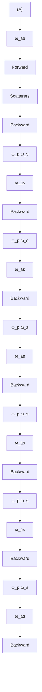
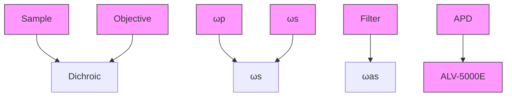

# Coherent Anti-Stokes Raman Scattering Correlation Spectroscopy: Probing Dynamical Processes with Chemical Selectivity

Ji-xin Cheng, Eric O. Potma, and Sunney X. Xie\*

Department of Chemistry and Chemical Biology, Har ard Uni ersity, Cambridge, Massachusetts 02138

Recei ed: March 17, 2002; In Final Form: July 15, 2002

We report coherent anti-Stokes Raman scattering correlation spectroscopy (CARS-CS) that measures the fluctuation of the CARS signal from scatterers in a subfemtoliter excitation volume. This method probes dynamical processes with chemical selectivity based on vibration spectroscopy. High-sensitivity CARS-CS measurements are carried out with epi-detection or polarization-sensitive detection. Theoretical expressions of CARS intensity autocorrelation functions are derived and supported by experimental data. The properties of CARS-CS are characterized with measurements of diffusion dynamics of small polystyrene spheres.

## 1. Introduction

Coherent anti-Stokes Raman scattering (CARS) is a thirdorder nonlinear optical process in which a pump excitation field at frequency $\omega _ { \mathrm { p } }$ and a Stokes excitation field at frequency ωs are mixed in a sample to generate an anti-Stokes signal field at frequency $\omega _ { \mathrm { a s } } = 2 \omega _ { \mathrm { p } } - \omega _ { \mathrm { s } }$ . CARS microscopy is a new tool ) -for three-dimensional vibrational imaging. The vibrational contrast mechanism of CARS microscopy is based on the enhancement of the signal when $\omega _ { \mathrm { p } } - \omega _ { \mathrm { s } }$ is tuned to a Raman--active molecular vibration. CARS microscopy was put forward with a noncollinear beam geometry in 19821 and was revived by use of tightly focused laser beams with a collinear beam geometry in 1999.2 A series of recent advances3 9 significantly improved the detection sensitivity and spectral selectivity of this technique.

Unlike Raman microscopy, the strong coherent signal in CARS microscopy allows vibrational imaging studies of living cells with a high scanning speed. For instance, CARS microscopy was applied to visualizing intracellular hydrodynamics by use of a line-scanning scheme.10 High-speed imaging of unstained cells undergoing apoptosis and chromosome distribution in mitotic cells has been carried out using a laser-scanning CARS microscope at an acquisition rate of several seconds per frame.6 CARS microscopy opens up exciting possibilities of visualizing dynamical changes in living cells and tissues with chemical selectivity, complementary to multiphoton fluorescence microscopy.11

Fast dynamical processes, such as diffusion and chemical reactions, can be probed by optical intensity correlation spectroscopy. Dynamic light scattering (DLS)12 and fluorescence correlation spectroscopy (FCS)13 are two major types of correlation spectroscopy. DLS measures the fluctuation of quasielastic scattering intensity and is extensively used for particle sizing. However, this technique lacks chemical specificity. FCS provides chemical selectivity by measurement of the concentration fluctuation of specific fluorescent molecules. The theory of FCS has been well developed.14 Aided by sensitive fluorescence detection with a confocal microscope, FCS has found wide applications.15 19 Recent developments include the implementation of multiphoton excitation in $\mathrm { F C S } ^ { 2 0 , 2 1 }$ and Raman correlation spectroscopy (RCS).22

Incorporation of the correlation technique with CARS microscopy opens a new way of investigating dynamical processes by measuring the fluctuation of CARS signals from a small focal volume. CARS correlation spectroscopy (CARS-CS) possesses several advantages shared by CARS microscopy: chemical selectivity without labeling, small excitation volume, highsensitivity, and no spectral overlap with fluorescence background of one-photon excitation. It is important to point out that, unlike the fluorescence intensity, which is a sum of the fluorescence intensities of individual fluorophores, the CARS intensity is the squared modulus of the coherent summation of the anti-Stokes fields from individual scatterers and has a quadratic dependence on the number of scatterers. Consequently, the FCS theory cannot be directly applied for analysis of CARS-CS data.

The CARS signal arising from the third-order susceptibility contains a vibrationally resonant contribution and a nonresonant electronic contribution independent of vibrational frequencies;23 the latter limits detection sensitivity and spectral selectivity and needs to be suppressed. For CARS microscopy, a schematic of the radiation pattern of CARS signals from a solvent medium and from a small particle is shown in Figure 1. The CARS signal from a bulk solvent goes forward, the propagating direction of the collinear pump and Stokes beams (Figure 1A), because of the constructive and destructive interferences in the forward and backward directions, respectively. However, the CARS radiation from a particle with a diameter much smaller than the excitation wavelength goes equally forward and backward (Figure 1B). Consequently, when such a small particle diffuses into the excitation volume, the CARS signal from the particle is buried in the huge solvent background in the forward direction but can be easily detected in the backward direction where the solvent background is absent. Epi-detected CARS microscopy has been demonstrated as an efficient and easy way for highsensitivity imaging of small scatterers.3,4 In the forward direction, it has been shown that polarization-sensitive CARS (P-CARS) microscopy suppresses the nonresonant background from the scatterers and the solvent and provides a high vibrational contrast.5 In this work, epi-detection and polarizationsensitive detection will be used for implementation of CARS-CS.

flowchart

Figure 1. Schematic of the far-field radiation pattern of CARS (A) from a bulk solvent and (B) from a scatterer with size much smaller than the excitation wavelengths.

Preliminary experiments on epi-detected CARS-CS have been reported recently $\cdot ^ { 2 4 , 2 5 }$ In this work, we present a systematic investigation of CARS correlation spectroscopy. This paper is organized as follows. In section 2, we describe the experimental implementation. In section 3, we derive the forward- and backward-detected CARS intensity autocorrelation functions. In section 4, we use measurements of diffusion dynamics of small particles to characterize the properties of CARS-CS, including spectral selectivity, coherence property, concentration and viscosity dependence, and particle-size effect. In section 5, we make a conclusion of CARS-CS.

## 2. Experiments

The pump $( \omega _ { \mathrm { p } } )$ and the Stokes (ωs) beams were generated from a pair of picosecond Ti sapphire lasers (Spectra-physics, Tsunami) synchronized to an 80 MHz external clock (Spectraphysics, Lok-to-Clock). The full width at half-maximum (fwhm) of the transform-limited pump and Stokes pulses was 5.0 ps, corresponding to a spectral width of $2 . 9 ~ \mathrm { c m ^ { - 1 } }$ . Details of the laser system can be found elsewhere.3 The pulse repetition rate was reduced from 80 MHz to 400 kHz by use of a Pockel’s cell (Conoptics, model 350-160) in each beam. Both linearly polarized laser beams were collinearly combined in an inverted microscope (Nikon, TE300) and focused into a sample with a water immersion objective (Olympus, $\mathrm { N A } = 1 . 2 )$ . The CARS )signal was detected either in the forward or in the backward direction.

In the backward-detection (epi-detection) scheme (Figure 2A), parallel-polarized pump and Stokes beams were used. The CARS signal was collected by the same water immersion objective. The dichroic mirror in the microscope reflects the excitation beams and transmits the CARS signal. The excitation beams were further blocked with two band-pass filters (Coherent, 42 7336, 65-nm bandwidth) before an avalanche photo--diode (APD, EG&G, SPCM-AQR-14) detector.

In the forward detection scheme (Figure 2B), the CARS signal was parfocally collected with an oil immersion objective (Nikon, $\mathrm { N A } = 1 . 4 )$ , spectrally separated from the excitation beams using )three band-pass filters (Coherent, 42 7393, 40-nm bandwidth) -and detected with another APD. The resonant CARS signal from the scatterers was selectively detected by use of polarizationsensitive detection based on the polarization difference between the resonant and the nonresonant CARS fields. Details of P-CARS can be found elsewhere.5,26,27 To implement P-CARS, the polarization direction of the pump beam was rotated from that of the Stokes beam by $\phi = 7 1 . 6 ^ { \circ }$ with a half-wave plate. A polarization analyzer was used before the APD to reject the linearly polarized nonresonant CARS background and to transmit partially the resonant CARS signal. A quarter-wave plate was used to compensate for the depolarization of the pump beam mainly induced by the dichroic mirror.

flowchart

text_image

(B)
Analyzer
E_s
P_NR
φ
P_R
x
0
E_p
APD
ALV-
5000E
ω_as
Filter
Polarizer
Objective
Sample
Objective
HW QW
ω_p →
ω_s →
Dichroic

Figure 2. Schematic of (A) a CARS-CS setup with epi-detection (APD avalanche photodiode) and (B) a CARS-CS setup with polarization sensitive detection (HW  half-wave plate; QW  quarter-wave plate). ) )Inset is the diagram of the polarization vectors of the pump $( E _ { \mathrm { p } } )$ and Stokes (Es) fields, the nonresonant $( P _ { \mathrm { N R } } )$ and resonant $( P _ { \mathrm { R } } )$ parts of the induced polarization, and the polarization analyzer.

In both the epi-detection and polarization-sensitive detection schemes, the APD output was connected to a multiple-τ correlator card (ALV, Germany, ALV-5000E), which recorded the photon counts at a bin time of 0.2 $\mu \mathrm { s }$ and performed autocorrelation of the signal in real time. A count-rate trace was simultaneously recorded at a temporal resolution of T/256, where T is the duration time of the trajectory. We note that the measured autocorrelation curves were modulated at the repetition rate (400 kHz) of the excitation pulse trains in the short time region $( t ~ < ~ 0 . 0 1 ~ \mathrm { m s } )$ . The amplitude of such modulation is <however negligible in the time region of interest (t 0.05 ms).

>Aqueous suspensions of polystyrene beads with diameters of $0 . 1 7 5 \pm 0 . 0 1 0$ and $0 . 1 0 9 \pm 0 . 0 0 8 \mu \mathrm { m }$ (Polysciences Inc., ( (Warrington, PA) were used to characterize CARS-CS. The number density of the original 0.175-µm bead suspension (2.65% in weight) and 0.109-µm bead suspension (2.73% in weight) was calculated to be 9.0 and $3 8 . 3 \ \mu \mathrm { m } ^ { - 3 }$ , respectively. The original suspensions were diluted with distilled water by 10 500 times and sandwiched between two cover slips separated by a 100-µm spacer for the CARS-CS measurements. The suspensions were sonicated for 5 s prior to the measurements to eliminate the possible clusters. All of the CARS-CS experiments were carried out at a room temperature of $2 1 \pm$ $0 . 5 ~ ^ { \circ } \mathrm { C }$ .

CARS spectra of polystyrene films coated on a coverslip were recorded by tuning the Stokes beam frequency point by point. The CARS signals were normalized by the Stokes beam power and the transmission curve of the band-pass filters used in our experiments. Spontaneous Raman spectra were recorded on a Raman microspectrometer (Jobin Yvon/Spec, LabRam) equipped with a 1800 grooves/mm grating and a 632.8 nm HeNe laser with a power of 15 mW.

## 3. Theoretical Description

CARS is distinctively different from fluorescence because of its coherence property. It is therefore desirable to derive the intensity autocorrelation function of CARS-CS and compare it with that of FCS. In the following, we make several assumptions to simplify our model.

We consider the collinear beam geometry2 that has been widely adopted in CARS microscopy. We assume that the excitation amplitude, $A ( \mathbf { r } )$ , has a Gaussian profile with a peak intensity of $A _ { 0 } ,$ ,

$$
A (\mathbf {r}) = A _ {0} \exp [ - 2 (x ^ {2} + y ^ {2}) / r _ {0} ^ {2} ] \exp (- 2 z ^ {2} / z _ {0} ^ {2}) \tag {1}
$$

where $r _ { 0 }$ and z0 are the lateral and axial $e ^ { - 2 }$ widths, respectively. $A ( \mathbf { r } )$ is the product of the Stokes $( E _ { \mathrm { s } } ( \mathbf { r } ) )$ and the squared pump $( E _ { \mathrm { p } } ( { \bf r } ) )$ field amplitude, $A ( \mathbf { r } ) = E _ { \mathrm { p } } { } ^ { 2 } ( \mathbf { r } ) E _ { \mathrm { s } } ( \mathbf { r } )$ . The assumption by )eq 1 is not strict because the pump and Stokes fields are at different wavelengths and the tightly focused fields are more accurately described by the diffraction theory.28 However, it is a reasonable approximation that is commonly used in the FCS theory, which enables an intuitive comparison of the form of the autocorrelation function between CARS-CS and FCS. As for the sample, we assume that each particle (or scatterer) undergoes Brownian diffusion independently and can be treated as a point scatterer.

The phase of the optical excitation fields and the wave vector mismatch affect the coherent summation of anti-Stokes fields from an ensemble of scatterers. Under the tight focusing condition, there exists a Gouy phase shift across the foci of the excitation fields $\cdot ^ { 2 9 }$ In CARS microscopy, the phase mismatch induced by the Gouy phase shift of the focused excitation fields is partially canceled by the interaction of the pump and the conjugate Stokes fields.9 In the forward detection scheme, the wave vector mismatch induced by the dispersion of the refractive indices is negligible for the collinear beam geometry because of the very small interaction volume under the tight focusing condition.4,30 Under the assumption that forward CARS signals are completely phase matched, the forward-detected CARS intensity from the scatterers at a concentration of c(r,t) can be written as

$$
I _ {\mathrm{f}} (t) = \left| \int \chi_ {\mathrm{sca}} ^ {(3)} A (\mathbf {r}) c (\mathbf {r}, t) \mathrm{d} V \right| ^ {2} \tag {2}
$$

where $\chi _ { \mathrm { s c a } } ^ { ( 3 ) }$ øsca is the third-order susceptibility of the scatterer. The autocorrelation function of $I _ { \mathrm { f } } ( t )$ is written as

$$
\langle I _ {\mathrm{f}} (\tau) I _ {\mathrm{f}} (0) \rangle =
$$

$$
\left| \chi_ {\mathrm{sca}} ^ {(3)} \right| ^ {4} \int \int \int \int \langle c (\mathbf {r} _ {1}, \tau) c (\mathbf {r} _ {2}, \tau) c (\mathbf {r} _ {3}, 0) c (\mathbf {r} _ {4}, 0) \rangle \left(\prod_ {i = 1} ^ {4} A (\mathbf {r} _ {i}) \mathrm{d} V _ {i}\right) \tag {3}
$$

In the epi-detection scheme, the phase mismatch for the backward CARS field from a scatterer at $\mathbf { r } ( x , y , z )$ is assumed to be $- 2 k _ { \mathrm { a s } } z$ , where $k _ { \mathrm { a s } } = 2 \pi n / \lambda _ { \mathrm { a s } }$ is the wave vector of the anti-- )Stokes signal field. This approximation is strict only for the CARS radiation along the axial direction. However, it provides a reasonable description as the maximum of the backward CARS radiation is along the axial direction.9 Under this approximation, the backward-detected CARS intensity reads as

$$
I _ {\mathrm{b}} (t) = \left| \int \chi_ {\mathrm{sca}} ^ {(3)} A (\mathbf {r}) \exp (- i 2 k _ {\mathrm{as}} z) c (\mathbf {r}, t) \mathrm{d} V \right| ^ {2} \tag {4}
$$

The autocorrelation function of $I _ { \mathrm { b } } ( t )$ can be expressed in the similar way as eq 3.

We shall derive the autocorrelation functions of forward- and backward-detected CARS-CS on the basis of the above assumptions. Although we focus on the diffusion dynamics, the following formulation can be easily extended to describe chemical reaction dynamics.

3.1. Forward-Detected CARS-CS. As in $\mathrm { F C S } , ^ { 1 5 - 1 8 }$ we define the normalized CARS intensity autocorrelation function as

$$
G _ {\mathrm{f}} (\tau) = \left[ \left\langle I _ {\mathrm{f}} (\tau) I _ {\mathrm{f}} (0) \right\rangle - \left\langle I _ {\mathrm{f}} (\tau) \right\rangle \left\langle I _ {\mathrm{f}} (0) \right\rangle \right] / \left\langle I _ {\mathrm{f}} (\tau) \right\rangle^ {2} \tag {5}
$$

By using eq $^ 3$ and $c ( \mathbf { r } , t ) = \langle c \rangle + \delta c ( \mathbf { r } , t )$ , we can write $G _ { \mathrm { f } } ( \tau )$ as ) +a sum of autocorrelation functions of different orders,

$$
G _ {\mathrm{f}} (\tau) = 4 G _ {1 1} ^ {\mathrm{f}} (\tau) + 4 G _ {1 2} ^ {\mathrm{f}} (\tau) + G _ {2 2} ^ {\mathrm{f}} (\tau) \tag {6}
$$

where $G _ { m n } ^ { \mathrm { f } } ( \tau ) ~ ( m , n = 1 , 2 )$ assumes

$$
\begin{array}{l} G _ {m n} ^ {\mathrm{f}} (\tau) = \langle I (\tau) \rangle^ {- 2} | \chi_ {\mathrm{sca}} ^ {(3)} | ^ {4} (\langle c \rangle \int A (\mathbf {r}) \mathrm{d} V) ^ {4 - m - n} \int \dots \\ \int A (\mathbf {r} _ {1})... A (\mathbf {r} _ {m + n}) g _ {m n} (\mathbf {r} _ {1},..., \mathbf {r} _ {m + n}, \tau) d V _ {1} ... d V _ {m + n} \tag {7} \\ \end{array}
$$

The function $g _ { m n } ( \mathbf { r } _ { 1 } , . . . , \mathbf { r } _ { m + n } , \tau )$ in eq $^ { 7 }$ reads $\mathrm { a s } ^ { 3 1 }$

$$
g _ {m n} \left(\mathbf {r} _ {1}, \dots , \mathbf {r} _ {m + n}, \tau\right) = \langle \delta c \left(\mathbf {r} _ {1}, \tau\right) \dots \delta c \left(\mathbf {r} _ {m}, \tau\right) \delta c \left(\mathbf {r} _ {m + 1}, 0\right) \dots
$$

$$
\left. \delta c \left(\mathbf {r} _ {m + n}, 0\right) \right\rangle - \left\langle \delta c \left(\mathbf {r} _ {1}, \tau\right) \dots \delta c \left(\mathbf {r} _ {m}, \tau\right) \right\rangle \left\langle \delta c \left(\mathbf {r} _ {m + 1}, 0\right) \dots \delta c \left(\mathbf {r} _ {m + n}, 0\right) \right\rangle \tag {8}
$$

On the basis of the work by Palmer et al. $\mathbf { \Phi } _ { , } ^ { 3 1 } \ g _ { m n } ( \mathbf { r } _ { 1 } , . . . , \mathbf { r } _ { m + n } , \tau )$ can be expressed as

$$
g _ {1 1} (\mathbf {r} _ {1}, \mathbf {r} _ {2}, \tau) = P (\mathbf {r} _ {1}, \mathbf {r} _ {2}, \tau) \tag {9a}
$$

$$
g _ {1 2} (\mathbf {r} _ {1}, \mathbf {r} _ {2}, \mathbf {r} _ {3}, \tau) = \delta c (\mathbf {r} _ {2} - \mathbf {r} _ {3}) P (\mathbf {r} _ {1}, \mathbf {r} _ {2}, \tau) \tag {9b}
$$

$$
g _ {2 2} \left(\mathbf {r} _ {1}, \mathbf {r} _ {2}, \mathbf {r} _ {3}, \mathbf {r} _ {4}, \tau\right) = \delta c \left(\mathbf {r} _ {1} - \mathbf {r} _ {2}\right) \delta c \left(\mathbf {r} _ {3} - \mathbf {r} _ {4}\right) P \left(\mathbf {r} _ {1}, \mathbf {r} _ {3}, \tau\right) +
$$

$$
P \left(\mathbf {r} _ {1}, \mathbf {r} _ {3}, \tau\right) P \left(\mathbf {r} _ {2}, \mathbf {r} _ {4}, \tau\right) + P \left(\mathbf {r} _ {1}, \mathbf {r} _ {4}, \tau\right) P \left(\mathbf {r} _ {2}, \mathbf {r} _ {3}, \tau\right) (9 c)
$$

The function $P ( \mathbf { r } _ { j } , \mathbf { r } _ { k } , \tau )$ in eqs $9 \mathrm { a - } 9 \mathrm { c }$ is the product of the average -concentration and the probability density for a particle in $\mathbf { r } _ { j }$ at time t to diffuse to $\mathbf { r } _ { k }$ at time $t + \tau ^ { 3 1 }$ and assumes the following forms for 3D free diffusion,

$$
P \left(\mathbf {r} _ {j}, \mathbf {r} _ {k}, \tau\right) = \langle \delta c \left(\mathbf {r} _ {j}, 0\right) \delta c \left(\mathbf {r} _ {k}, \tau\right) \rangle = \frac {\langle c \rangle}{(4 \pi D \tau) ^ {3 / 2}} \exp \left[ - \frac {\left| \mathbf {r} _ {j} - \mathbf {r} _ {k} \right| ^ {2}}{4 \pi D \tau} \right] \tag {9d}
$$

$$
P (\mathbf {r} _ {j}, \mathbf {r} _ {k}, 0) = \langle c \rangle \delta (\mathbf {r} _ {j} - \mathbf {r} _ {k}) \tag {9e}
$$

When we define the effective excitation volume, $V _ { \mathrm { e f f } } = ( \itGamma / A ( \bf { r } )$ $\mathrm { d } V ) ^ { 2 } / ( \int A ^ { 2 } ( \mathbf { r } ) \ \mathrm { d } V ) = \pi ^ { 3 / 2 } r _ { 0 } ^ { 2 } z _ { 0 } ,$ ), and the average number of the )particles in the effective excitation volume, $\langle N \rangle = \langle c \rangle V _ { \mathrm { e f f } }$ , it follows that

$$
\langle c \rangle \int A (\mathbf {r}, t) \mathrm{d} V = 2 \sqrt {2} A _ {0} \langle N \rangle \tag {10}
$$

$$
\int \int A ^ {m} (\mathbf {r} _ {j}) A ^ {n} (\mathbf {r} _ {k}) P (\mathbf {r} _ {j}, \mathbf {r} _ {k}, \tau) \mathrm{d} V _ {j} \mathrm{d} V _ {k} = (2 \sqrt {2}) ^ {- 1} A _ {0} ^ {m + n} \langle N \rangle f _ {m n} (\tau) \tag {11}
$$

The function $f _ { m n } ( \tau ) ~ ( m , n = 1 , 2 )$ is defined as

$$
f _ {m n} (\tau) =
$$

$$
(m + n + 2 m n \tau / \tau_ {\mathrm{D}}) ^ {- 1} [ m + n + 2 m n r _ {0} ^ {2} \tau / (z _ {0} ^ {2} \tau_ {\mathrm{D}}) ] ^ {- 1 / 2} \tag {12}
$$

where $\tau _ { \mathrm { D } }$ is the lateral diffusion time defined as $\tau _ { \mathrm { { D } } } = r _ { 0 } { } ^ { 2 } / ( 4 D )$ . )The diffusion coefficient D is related to the particle diameter d by the Stokes Einstein relation, $D = k T / ( 3 \pi \eta d ) .$ , where k is - )the Boltzmann constant, T is the absolute temperature, and η is the viscosity of the medium.

From eq 2, the average forward CARS intensity is calculated as

$$
\langle I _ {\mathrm{f}} (t) \rangle = \langle c \rangle^ {2} | \chi_ {\mathrm{sca}} ^ {(3)} | ^ {2} (\int A (\mathbf {r}) \mathrm{d} V) ^ {2} +
$$

$$
\left\langle \delta c (\mathbf {r} _ {1}, t) \delta c (\mathbf {r} _ {2}, t) \right\rangle | \chi_ {\mathrm{sca}} ^ {(3)} | ^ {2} \int A ^ {2} (\mathbf {r}) \mathrm{d} V
$$

$$
= A _ {0} ^ {2} \left| \chi_ {\mathrm{sca}} ^ {(3)} \right| ^ {2} (\langle N \rangle^ {2} + \langle N \rangle) / 8 \tag {13}
$$

The first term in the right side of eq 13 arises from the coherent addition of the anti-Stokes fields from the scatterers. The second term arises from the fluctuation of number density of scatterers. Combining eqs 6 11 and 13 gives the expression for $G _ { \mathrm { f } } ( \tau )$ ,

$$
G _ {\mathrm{f}} (\tau) = (\langle N \rangle + 1) ^ {- 2} [ 4 \langle N \rangle (2 \sqrt {2}) ^ {5} f _ {1 1} (\tau) + 4 (2 \sqrt {2}) ^ {4} f _ {1 2} (\tau) +
$$

$$
\left. 2 (2 \sqrt {2}) ^ {2} f _ {1 1} ^ {2} (\tau) + \langle N \rangle^ {- 1} (2 \sqrt {2}) ^ {3} f _ {2 2} (\tau) \right] \tag {14}
$$

Equation 14 is different from the form of the fluorescence autocorrelation function15 18 because of the coherence property of CARS. In the case of $\langle N \rangle \ll 1 , G _ { \mathrm { f } } ( \tau )$ is governed by the last term in eq 14. Defining $\tau _ { \mathrm { D } } ^ { \prime } = ( r _ { 0 } / \sqrt { 2 } ) ^ { 2 } / ( 4 D ) , \ V _ { \mathrm { e f f } } ^ { \prime } = \pi ^ { 3 / 2 } ( r _ { 0 } /$ ${ \sqrt { 2 } } ) ^ { 2 } ( z _ { 0 } / { \sqrt { 2 } } )$ , and $\langle N ^ { \prime } \rangle = \langle c \rangle V _ { \mathrm { e f f } } ^ { \prime } ,$ we obtain

$$
G _ {\mathrm{f}, \langle N \rangle \ll 1} (\tau) = \frac {1}{\langle N ^ {\prime} \rangle} \left(1 + \frac {\tau}{\tau_ {\mathrm{D}} ^ {\prime}}\right) ^ {- 1} \left(1 + \frac {(r _ {0} / \sqrt {2}) ^ {2} \tau}{(z _ {0} / \sqrt {2}) ^ {2} \tau_ {\mathrm{D}} ^ {\prime}}\right) ^ {- 1 / 2} \tag {15}
$$

Equation 15 has exactly the same form as the FCS autocorrelation function16 with the excitation volume described by $A ^ { 2 } ( \mathbf { r } )$ .

3.2. Backward-Detected CARS-CS. The normalized intensity autocorrelation function for epi-detected CARS, $G _ { \mathrm { b } } ( \tau )$ , is defined in the same way as eq $5 . \ G _ { \mathrm { b } } ( \tau )$ can be decomposed into several terms of different orders similar to eq 6. It is found that, because of the large wave vector mismatch in epi-detected CARS, $G _ { \mathrm { b } } ( \tau )$ is dominated by $G _ { 2 2 } ^ { \mathrm { b } } ( \tau )$ , which can be written as

$$
G _ {2 2} ^ {\mathrm{b}} (\tau) = \left\langle I _ {\mathrm{b}} (\tau) \right\rangle^ {- 2} A _ {0} ^ {4} \left| \chi_ {\mathrm{sca}} ^ {(3)} \right| ^ {4} \left\{\left(\frac {\langle N \rangle}{2 \sqrt {2}}\right) ^ {2} \times \right.
$$

$$
\left. \exp \left[ - \frac {2 k _ {\mathrm{as}} {} ^ {2} r _ {0} {} ^ {2} \tau / \tau_ {\mathrm{D}}}{1 + r _ {0} {} ^ {2} \tau / (z _ {0} {} ^ {2} \tau_ {\mathrm{D}})} \right] f _ {1 1} ^ {2} (\tau) + \frac {\langle N \rangle}{2 \sqrt {2}} f _ {2 2} (\tau) \right\} \tag {16}
$$

Similar to the derivation of eq 13, the average epi-detected CARS intensity is calculated as

$$
\langle I _ {\mathrm{b}} (\tau) \rangle = \langle N \rangle^ {2} A _ {0} ^ {2} \left| \chi_ {\mathrm{sca}} ^ {(3)} \right| ^ {2} \exp \left(- k _ {\mathrm{as}} ^ {2} z _ {0} ^ {2}\right) / 8 + \langle N \rangle A _ {0} ^ {2} \left| \chi_ {\mathrm{sca}} ^ {(3)} \right| ^ {2} / 8 \tag {17}
$$

The first term in eq 17 is negligible because ex $\scriptstyle ( - k _ { \mathrm { a s } } ^ { 2 } z _ { 0 } ^ { 2 } )$ < - ,1 and the second term is linearly proportional to 〈N〉. Combining eqs 12, 16, and 17 gives the final expression for Gb(τ),

$$
G _ {\mathrm{b}} (\tau) = \exp \left(- \frac {2 k _ {\mathrm{as}} {} ^ {2} r _ {0} {} ^ {2} \tau / \tau_ {\mathrm{D}}}{1 + r _ {0} {} ^ {2} \tau / (z _ {0} {} ^ {2} \tau_ {\mathrm{D}})}\right) \left(1 + \frac {\tau}{\tau_ {\mathrm{D}}}\right) ^ {- 2} \left(1 + \frac {r _ {0} {} ^ {2} \tau}{z _ {0} {} ^ {2} \tau_ {\mathrm{D}}}\right) ^ {- 1} +
$$

$$
\frac {2 \sqrt {2}}{\langle N \rangle} \left(1 + \frac {2 \tau}{\tau_ {\mathrm{D}}}\right) ^ {- 1} \left(1 + \frac {2 r _ {0} {} ^ {2} \tau}{z _ {0} {} ^ {2} \tau_ {\mathrm{D}}}\right) ^ {- 1 / 2} \tag {18}
$$

In the case of $\langle N \rangle \ll 1 , G _ { \mathrm { b } } ( \tau )$ can be recast as

$$
G _ {\mathrm{b}, N \ll 1} = \frac {2 \sqrt {2}}{\langle N \rangle} \left(1 + \frac {2 \tau}{\tau_ {\mathrm{D}}}\right) ^ {- 1} \left(1 + \frac {2 r _ {0} {} ^ {2} \tau}{z _ {0} {} ^ {2} \tau_ {\mathrm{D}}}\right) ^ {- 1 / 2} \tag {19}
$$

which is identical to $G _ { \mathrm { f } , N \ll 1 } ( \tau )$ shown in eq 15. This is consistent ,with the picture that the CARS radiation pattern of a single scatterer is symmetric in the forward and backward directions.9 When 〈N〉 is comparable to or larger than 1, the first term in eq 18 plays an important role by introducing a fast decay in the autocorrelation curve. It is noteworthy that $G _ { \mathrm { b } } ( 0 )$ is independent of $\langle N \rangle$ in the case of $\langle N \rangle \gg 1$ . This opens up the possibility of .detecting scatterers at high concentrations by CARS-CS, in contrast to FCS that necessitates a very low concentration of fluorescent molecules.

The above formulation does not consider the non-CARS background intensity, $I _ { \mathrm { B g } } ( t )$ . In practice, $I _ { \mathrm { B g } } ( t )$ could arise from the residual laser intensity, which is not correlated with the CARS intensity. Similar to that in $\mathrm { F C S } , ^ { 1 5 } ~ G _ { \mathrm { f } } ( \tau )$ in eq 14 and Gb(τ) in eq 18 should be multiplied by a factor of $I _ { \mathrm { f ( b ) } } { } ^ { 2 } / ( I _ { \mathrm { f ( b ) } } +$ $I _ { \mathrm { B g } } ) ^ { 2 }$ , where $I _ { \mathrm { f ( b ) } }$ and $I _ { \mathrm { B g } }$ +denote the average forward (backward) CARS and background intensities, respectively.

## 4. Characterization of CARS-CS

First, we estimate the excitation volume $( V _ { \mathrm { e f f } } )$ from the lateral and axial widths (fwhmr and fwhmz) of the excitation intensity profile. The value fwhm 0.28 µm was obtained from the )lateral CARS intensity profile of a $0 . 2 \mathrm { - } \mu \mathrm { m }$ polystyrene bead embedded in agarose $\mathrm { g e l . } ^ { 9 }$ The value fwhm 1.1 µm was obtained from the epi-detected axial CARS intensity profile of a glass/immersion oil interface with $\omega _ { \mathsf { p } } - \omega _ { \mathsf { s } }$ tuned to the $\mathrm { C - H }$ -stretching vibration (data not shown). The parameters $r _ { 0 }$ -and z0 in $_ \mathrm { e q }$ 1 are related to fwhm and fwhm by $r _ { 0 } = \mathrm { f w h m } _ { r } / \sqrt { \mathrm { l n } 2 }$ and $z _ { 0 } = \mathrm { f w h m } _ { z } / \sqrt { \mathrm { l n } 2 }$ , respectively. The effective excitation )volume was calculated to be $0 . 8 3 \ \mu \mathrm { m } ^ { 3 }$ according to $V _ { \mathrm { e f f } } =$ $\pi ^ { 3 / 2 } r _ { 0 } { } ^ { 2 } z _ { 0 }$ ). The average number of particles in the focal volume, $\langle N \rangle$ , was estimated as the product of the effective excitation volume and the number density of the polystyrene beads. In the following, we experimentally characterize CARS-CS and test our theory with the experimental data.

4.1. Spectral Selectivity. To demonstrate the spectral selec tivity of epi-detected CARS-CS, we recorded the CARS spectrum of polystyrene in the $2 7 5 0 { - } 3 2 0 0 \ \mathrm { c m } ^ { - 1 }$ region (Figure $3 \mathrm { A } )$ -where the aromatic and aliphatic C H stretching vibrational bands reside. The aromatic $( 3 0 5 2 \mathrm { c m } ^ { - 1 } )$ -, the symmetric aliphatic $( 2 8 5 2 ~ \mathrm { c m ^ { - 1 } } )$ , and the asymmetric aliphatic (2907 cm 1) C H -stretching vibrational bands exhibit a high signal to background in the CARS spectrum. The CARS line profile for the aromatic $\mathrm { C - H }$ band coincides with the spontaneous Raman line profile with a small peak shift $( - 2 ~ \mathrm { c m } ^ { - 1 } )$ and a characteristic dip at $3 1 0 0 ~ \mathrm { c m } ^ { - 1 }$ -, which are known to result from the interference between the resonant CARS signal and the nonresonant background.32

Figure 3B displays a clear spectral dependence of the fluctuation of the epi-detected CARS signals from a diluted 0.175-µm bead suspension $( \left. N \right. \approx 0 . 0 4 )$ . Prominent fluctuations were observed when $\omega _ { \mathrm { p } } - \omega _ { \mathrm { s } }$ was tuned to the aromatic C H band at $3 0 5 0 ~ \mathrm { c m } ^ { - 1 }$ and the aliphatic C H band at $2 8 4 3 ~ \mathrm { c m ^ { - 1 } }$ . -However, such fluctuations disappeared when $\omega _ { \mathrm { p } } ~ - ~ \omega _ { \mathrm { s } }$ was -tuned away from any Raman resonance. The spectral selectivity of the CARS intensity autocorrelation curves can be clearly seen from Figure 3C. The autocorrelation curves of the CARS signals from the $3 0 5 0 ~ \mathrm { c m } ^ { - 1 }$ band and the $2 8 4 3 ~ \mathrm { c m ^ { - 1 } }$ band display the same time dependence, with diffusion times $( \tau _ { \mathrm { D } } )$ of $2 7 . 3 \pm 0 . 7$ and $2 8 . 6 \pm 1 . 0$ ms fitted with eq 19. The parameter $r _ { 0 } / z _ { 0 }$ (was (fixed as 0.28/1.1 in the fitting. The residual autocorrelation at 3146 $\mathrm { c m } ^ { - 1 }$ is 18 times weaker than that at $3 0 5 0 \mathrm { c m } ^ { - 1 }$ and shows a much longer diffusion time of $1 6 0 \pm 6$ ms fitted with eq 19 with $r _ { 0 } / z _ { 0 } = 0 . 2 8 / 1 . 1$ (. This indicates that the residual intensity )fluctuation in the bottom trace in Figure 3B was not contributed by the nonresonant CARS signal from the beads. Instead, we attribute it to the nonresonant CARS signal of water backreflected by the diffusing scatterers. The back reflection by the out-of-focus beads results in an apparently larger probe volume and thus a longer diffusion time, which explains our observation.

line chart

| Raman shift (cm⁻¹) | CARS intensity (a.u.) | Spontaneous Raman intensity (a.u.) | kcps | G_b(t) |
| ------------------ | --------------------- | ---------------------------------- | ---- | ------ |
| 2800               | ~0.5                  | ~0.5                               | ~0   | ~10    |
| 2900               | ~1.5                  | ~1.5                               | ~0   | ~8     |
| 3000               | ~2.0                  | ~2.0                               | ~0   | ~6     |
| 3100               | ~6.0                  | ~4.0                               | ~0   | ~2     |
| 3200               | ~0.5                  | ~0.5                               | ~0   | ~0     |

Figure 3. CARS and spontaneous Raman spectra (A) of a polystyrene film coated on a coverslip. The CARS spectrum was recorded with parallel-polarized pump and Stokes beams. The pump frequency was fixed at 14 $0 4 7 ~ \mathrm { c m ^ { - 1 } }$ . The average pump power was $1 4 0 \mu \mathrm { W }$ , and the average Stokes power was around $6 5 \mu \mathrm { W }$ . Panel B shows epi-detected CARS signal traces of a diluted aqueous suspension of $0 . 1 7 5  – \mu \mathrm { m }$ polystyrene spheres $( \left. N \right. \approx 0 . 0 4 )$ . The average pump and Stokes power were 1.3 and 0.6 mW (measured after the beam combiner), respectively. Panel C shows epi-detected CARS intensity autocorrelation curves corresponding to the signal traces in panel B. The amplitude of the curve at 3146 $\mathrm { c m } ^ { - 1 }$ is multiplied by a factor of 18.

Epi-detected CARS-CS works very well for C H stretching vibrations because of their high mode density. However, for Raman bands in the fingerprint region $( 5 0 0 { - } 1 7 0 0 \ \mathrm { c m } ^ { - 1 } )$ with -low mode densities, the spectral selectivity is limited by the nonresonant background from the scatterers. In this case, one can achieve high spectral selectivity by use of polarizationsensitive detection, which suppresses the nonresonant background from both the scatterers and the solvent.5 Figure 4 shows a proof of principle demonstration of polarization-sensitive CARS-CS. The CARS and P-CARS spectra of polystyrene in the $9 6 0 { - } 1 0 6 0 \ \mathrm { c m ^ { - 1 } }$ region are displayed in Figure 4A. The -signal-to-background ratio for the benzene ring breathing vibrational band at $1 0 0 0 ~ \mathrm { c m } ^ { - 1 }$ is 14:1 in the CARS spectrum recorded with parallel-polarized excitation beams. Owing to an effective suppression of the nonresonant background, the signalto-background ratio of the $1 0 0 0 ~ \mathrm { c m } ^ { - 1 }$ band is increased by 30 times in the P-CARS spectrum. In addition, the P-CARS line profiles coincide with the corresponding Raman line profiles. For the same $0 . 1 7 5  – \mu \mathrm { m }$ bead suspension $( \left. N \right. \approx 0 . 0 4 )$ used for the epi-detected CARS-CS measurement (see Figure 3), the nonresonant background from both the beads and water was effectively rejected by polarization-sensitive detection. When $\omega _ { \mathsf { p } } \mathrm { ~ - ~ } \omega _ { \mathsf { s } }$ was tuned to the $1 0 0 0 ~ \mathrm { { c m } ^ { - 1 } }$ band, CARS intensity -fluctuation (Figure 4B) and autocorrelation (Figure 4C) that characterize the diffusion of the beads were clearly seen. Tuning $\omega _ { \mathrm { p } } ~ - ~ \omega _ { \mathrm { s } }$ away from Raman resonance resulted in a small -residual nonresonant background from water. The lower trace in Figure 4B shows a small intensity fluctuation of less than 0.2 kcps caused by the timing jitter between the synchronized pump and Stokes pulses trains, which did not show any autocorrelation (Figure 4C). We found that the forward-detected CARS intensity autocorrelation curve at $1 0 0 2 ~ \mathrm { c m } ^ { - 1 }$ overlaps well with the epi-detected CARS intensity autocorrelation curve (dashed line in Figure 4C) at $3 0 5 0 \mathrm { c m } ^ { - 1 }$ with amplitude scaled by a factor of 0.013. This means that the forward- and backwarddetected signals give the same information about the diffusion dynamics in the cases of $\langle N \rangle \ll 1 . 0$ , in consistence with our ,theoretical description (cf. eqs 15 and 19).

  
Figure 4. CARS, P-CARS, and spontaneous Raman (with an offset) spectra (A) of a polystyrene film coated on a coverslip. The CARS spectrum was recorded with parallel-polarized pump and Stokes beams. The pump frequency was fixed at $1 3 5 7 9 \ \mathrm { c m ^ { - 1 } }$ . The average pump and Stokes power were 120 and 80 $\mu \mathrm { W }$ , respectively. Panel B shows P-CARS signal traces of a diluted aqueous suspension of 0.175-µm polystyrene spheres $( \left. N \right. \approx 0 . 0 4 )$ . The average pump and Stokes power were 1.4 and 0.7 mW, respectively. Panel C shows measured P-CARS intensity autocorrelation curves (solid) at Raman shifts of 1002 and 1020 $\mathrm { c m } ^ { - 1 }$ . The dashed line is the epi-detected CARS intensity autocorrelation curve (Figure 3C) of the same sample measured at 3050 $\mathrm { c m } ^ { - 1 }$ with amplitude multiplied by a factor of 0.013.

line chart

| Condition | ⟨N⟩    |
| --------- | ------ |
| (A)       | ≈ 0.06 |
| (B)       | ≈ 0.3  |
| (C)       | ≈ 3    |

Figure 5. Epi-detected CARS intensity autocorrelation curves (solid) of aqueous suspensions of $0 . 1 0 9 \ – \mu \mathrm { m }$ polystyrene spheres with $\left( \mathrm { A } \right) \left. N \right.$ ≈ 0.06, (B) $\langle N \rangle \approx 0 . 3 ,$ , and $\left( \mathbf { C } \right) \left. N \right. \approx 3 . 0 \dot { . }$ The pump and Stokes beams were at frequency 14 046 and 10 996 cm 1 with average powers of 1.3 and 0.7 mW, respectively. The dashed and dotted curves represent the fits with eq 18 and the residuals of the fitting, respectively.

4.2. Coherence Property. In section 4.1, we only investigated the cases in which 〈N〉 is smaller than 1.0. When 〈N〉 is larger than 1.0, we have shown theoretically that the coherence property of CARS plays an important role in CARS-CS measurements. To examine the coherence effect experimentally, we carried out epi-detected CARS-CS measurements of different $0 . 1 0 9 \ – \mu \mathrm { m }$ bead suspensions with $\langle N \rangle \approx 0 . 0 6$ (Figure 5A), 〈N〉 0.3 (Figure 5B), and $\langle N \rangle \approx 3$ (Figure 5C). In the cases of $\langle N \rangle < 1 . 0$ , the obtained autocorrelation curves shown in Figure <5A,B resemble the measurements in FCS. However, when 〈N〉 was increased to 3, a prominent fast decay was observed in the region from 0.05 to 1.0 ms (Figure 5C). Such a decay is absent in FCS measurements of free diffusion processes. It results from the large wave vector mismatch of epi-detected CARS and is consistent with our theoretical description (cf. eq 18).

To evaluate our model quantitatively, we performed a leastsquares fitting of the autocorrelation curves by eq 18. One can see from Figure 5 that the fits follow the experimental curves very well. For the curves shown in Figure $5 \mathrm { A } { - } \mathrm { C }$ , the fitted 〈N〉 are $0 . 1 0 \pm 0 . 0 2 , 0 . 3 1 \pm 0 . 0 3$ and $2 . 2 \pm 0 . 3$ -and the fitted $\tau _ { \mathrm { d } }$ are $9 . 0 \pm 0 . 2 , 9 . 2 \pm 0 . 2$ , and $9 . 0 \pm 0 . 8$ ms, respectively. ( ( (The fitted values of 〈N〉 are close to the estimated values. An average diffusion time of 9.1 ms with a small variance of 0.1 ms was obtained from the fitted values. This indicates that our model well describes the time dependence of the epi-detected CARS-CS measurements.

From $D = r _ { 0 } { } ^ { 2 } / ( 4 \tau _ { \mathrm { { D } } } )$ , the diffusion coefficient (D) is calculated )to be 3.1 µm2/s by use of the average diffusion time of 9.1 ms for the 0.109-µm beads. Meanwhile, D can be estimated from the Stokes Einstein relation, $D = k T / ( 3 \pi \eta d )$ . With $T = 2 9 4$ K, $\mathrm { \Delta } \eta = 0 . 0 1 1 \mathrm { \Delta } 1$ P for water,12 and $d = 0 . 1 0 9 \mu \mathrm { m }$ ), D is estimated )to be 3.6 $\mu \mathrm { m } ^ { 2 } / \mathrm { s } ,$ ), close to the value measured by CARS-CS.

4.3. Concentration and Viscosity Dependence. One important application of FCS is to determine the concentration of certain fluorescent species from the value of $G ( 0 ) . ^ { 1 5 - 1 8 }$ To explore the capability of CARS-CS in determining the concentration of Raman scatterers, we carried out a series of epidetected CARS-CS measurements of 0.175-µm bead suspensions at different concentrations. The measured autocorrelation curves shown in Figure 6A display the same time dependence but with different values of $G ( 0 )$ . The non-CARS background with epi-detection was measured to be less than 0.2 kcps, which is negligible compared to the epi-detected CARS signal. Figure 6B shows a good linear relationship between the reciprocal of particle concentration, $\langle c \rangle ^ { - 1 } = V _ { \mathrm { e f f } } / \langle N \rangle$ , and the fitted values of G(0) in the range of $\langle N \rangle = 0 . 0 1 5 \ – 0 . 7 5$ . This result verifies eq ) -19 and demonstrates that CARS-CS can be used to characterize the concentration of scatterers under the condition of $\langle N \rangle < 1 . 0 $

From $D = r _ { 0 } { } ^ { 2 } / ( 4 \tau _ { \mathrm { D } } )$ and the Stokes Einstein relation, $D =$ $k T / ( 3 \pi \eta d )$ ) - ), it follows that the relative viscosity of a solution can be obtained from the diffusion time by $\eta / \eta _ { 0 } = \tau _ { \mathrm { D } } / \tau _ { \mathrm { D } , 0 } ,$ , where η and $\tau _ { \mathrm { D } , 0 }$ )are the viscosity of water and the diffusion time of the scatterers in water. To investigate the relation between the relative viscosity and the diffusion time measured by CARS-CS, we prepared $0 . 1 0 9 \ – \mu \mathrm { m }$ bead suspensions $( \left. N \right. \approx 0 . 3 )$ using sucrose solutions of different weight percentages. The slowing of the Brownian motion with increasing weight percentage of sucrose can be seen from the intensity autocorrelation curves (inset of Figure $7 ) .$ The values of $\eta / \eta _ { 0 }$ were calculated from the diffusion times fitted with eq 19. It can be seen from Figure 7 that the relative viscosities measured by CARS-CS correspond well to the literature values.33

line chart

| <C> (μm⁻³) | G_b(t) at t=10⁻¹ ms | G_b(t) at t=10⁰ ms | G_b(t) at t=10¹ ms | G_b(t) at t=10² ms | G_b(t) at t=10³ ms | G_b(t) at t=10⁴ ms |
|------------|---------------------|--------------------|--------------------|--------------------|--------------------|--------------------|
| 0.018      | ~18                 | ~15                | ~12                | ~8                 | ~5                 | ~3                 |
| 0.030      | ~17                 | ~14                | ~10                | ~6                 | ~4                 | ~2                 |
| 0.045      | ~16                 | ~13                | ~9                 | ~5                 | ~3                 | ~1.5               |
| 0.090      | ~15                 | ~12                | ~8                 | ~4                 | ~2.5               | ~1                 |
| 0.18       | ~14                 | ~11                | ~7                 | ~3                 | ~2                 | ~0.5               |
| 0.90       | ~13                 | ~10                | ~6                 | ~2.5               | ~1.5               | ~0.5               |

line chart

| <C>⁻¹ (μm³) | G_b(0) |
| ------------ | ------ |
| 0            | 0      |
| 10           | 2      |
| 20           | 4      |
| 30           | 8      |
| 40           | 12     |
| 50           | 16     |
| 60           | 20     |

Figure 6. Epi-detected CARS intensity autocorrelation curves $( \mathrm { A } )$ of aqueous suspensions of 0.175-µm polystyrene spheres with different number density, $\langle c \rangle ~ ( \mu \mathrm { m } ^ { - 3 } )$ . The laser frequencies and powers were the same as in Figure 5. Panel B shows the dependence of the values of G(0) on $\langle c \rangle ^ { - 1 }$ .

4.4. Size Effect. The particle-size effect in FCS has been carefully investigated by Starchev et al.34 They pointed out that the characteristic diffusion time of particles with size comparable to the excitation volume is larger than that expected from the theory dealing with a point diffuser. It is interesting to examine the size effects in our CARS-CS measurements of the 0.175- µm beads of which the diameter is comparable to the lateral width $( \mathrm { f w h m } _ { r } = 0 . 2 8 \mu \mathrm { m } )$ of the excitation intensity profile. A least-squares fitting of the CARS intensity autocorrelation curve at $3 0 5 0 ~ \mathrm { c m } ^ { - 1 }$ (Figure 3C) with eq 19 is shown in Figure 8. Discrepancies between the fit and the experimental curve can be seen. We attribute these discrepancies to the particle-size effect. We note that the fitting reproduced very well the measured autocorrelation curves for the 0.109-µm beads (Figure 5) because of the smaller size of the particles. The fitting in Figure 8 produced a diffusion time $( \tau _ { \mathrm { d } } = 2 7 . 3 \mathrm { m s } )$ for the 0.175- )µm beads. In comparison with the diffusion time $( \tau _ { \mathrm { d } } = 9 . 1 \ \mathrm { m s } )$ for the $0 . 1 0 9 \ – \mu \mathrm { m }$ ) beads, we do not see a linear relation between $\tau _ { \mathrm { d } }$ and the bead diameter. This can be explained by the particlesize effect, similar to FCS.34 However, the particle-size effect does not affect the characterization of the scatterer concentration from the values of G(0), as shown in Figure 6.

line chart

| Sucrose weight (%) | η/η₀ |
| ------------------ | ---- |
| 0                  | 1.0  |
| 10                 | 1.2  |
| 20                 | 1.8  |
| 30                 | 2.8  |
| 40                 | 5.5  |

Figure 7. Comparison of the relative viscosities (solid circles) of sucrose aqueous solutions measured by CARS-CS and the values (solid curve) from the literature.33 Sucrose solutions containing 0.109-µm polystyrene spheres with 〈N〉 0.3 were used in the CARS-CS measurements. The laser frequencies and powers were the same as in Figure 5. Shown in the inset are three autocorrelation curves with normalized amplitudes at different sucrose concentrations.

line chart

| t(ms) | Experiment | Fit | Residual |
|-------|------------|-----|----------|
| 0.1   | 8.0        | 8.0 | 0.0      |
| 1.0   | 7.5        | 7.5 | 0.2      |
| 10.0  | 6.0        | 6.0 | 0.1      |
| 100.0 | 3.0        | 3.0 | 0.0      |
| 1000.0| 0.5        | 0.5 | 0.0      |
| 10000.0| 0.1       | 0.1 | 0.0      |

Figure 8. Least-squares fit (dashed) with eq 19 of the epi-detected CARS intensity autocorrelation curve (solid) of the 0.175-µm beads measured at $3 0 5 0 ~ \mathrm { c m } ^ { - 1 }$ shown in Figure 3C.

## 5. Conclusion

We have demonstrated CARS-CS for probing diffusion dynamics. We implemented two detection schemes, epi-detected CARS-CS and polarization-sensitive CARS-CS. The epi-detection method gives high detection sensitivity via an effective rejection of the solvent CARS background. Our epi-detected CARS-CS measurements show a high spectral selectivity for the aliphatic and aromatic C H stretching vibration bands with -high mode densities. We have shown theoretically and experimentally that the large phase mismatch in epi-detected CARS-CS results in a fast decay in the intensity autocorrelation curve at high concentration, which is not present in FCS. We have shown that CARS-CS can be used to determine the scatterer concentration and the relative viscosity of the medium in diluted solutions. For Raman bands with low mode densities, the nonresonant background from the scatterers limits the spectral selectivity and sensitivity. The polarization-sensitive detection method can be used to suppress the nonresonant background from both the scatterer and the solvent. We have demonstrated that polarization-sensitive CARS-CS provides a high spectral selectivity in the fingerprint region.

Compared to DLS and FCS, the advantages of CARS-CS lie in the fact that it provides spectrally selective information without labeling of the sample. This provides the potential of CARS-CS for investigating dynamical processes in biological samples. For example, the CARS signal arising from the aliphatic C H vibration of lipids is particularly strong because of the high density of C H bonds in lipid membranes. CARS--CS could be used for direct measurement of lipid dynamics in cell membranes without using dyes that often introduce perturbations to cell functions. Because of the coherence property of CARS, that is, the quadratic dependence of signal intensity on the number of vibrational modes, CARS-CS is inherently sensitive for detecting clusters and aggregates, similar to highorder FCS.31 The CARS signal level can be enhanced by several orders of magnitude using one-photon electronic resonance CARS.23 Unlike resonance Raman, resonance CARS can be easily detected in the presence of strong one-photon fluorescence. Thus, resonance CARS-CS may provide a sensitive method to study the dynamics of some chemical species with absorption in the visible or near-IR wavelength range.

In conclusion, CARS-CS provides a new type of optical fluctuation spectroscopy based on nonlinear optical scattering and vibrational characteristics. This technique offers new possibilities for investigating dynamical processes in chemical and biological systems in a chemically selective and noninvasive manner.

Note Added in Proof. After the finalization of this paper, a report by Hellerer et al. on CARS-CS using the epi-detection geometry was published in ChemPhysChem, 2002, 7, 630 633.

Acknowledgment. This work was supported by a NIH grant (Grant GM62536-01). The authors acknowledge Andreas Volkmer, Xiaolin Nan, Erik J. Sanchez, and Guobin Luo for their help. E.O.P. acknowledges financial support from the Netherlands Organization for Scientific Research (NWO).

## References and Notes

(1) Duncan, M. D.; Reintjes, J.; Manuccia, T. J. Opt. Lett. 1982, 7, 350 352.  
-(2) Zumbusch, A.; Holtom, G. R.; Xie, X. S. Phys. Re . Lett. 1999, 82, 4142 4145.  
-(3) Cheng, J. X.; Volkmer, A.; Book, L. D.; Xie, X. S. J. Phys. Chem. B 2001, 105, 1277 1280.  
-(4) Volkmer, A.; Cheng, J. X.; Xie, X. S. Phys. Re . Lett. 2001, 87, 0239011 0239014.  
-(5) Cheng, J. X.; Book, L. D.; Xie, X. S. Opt. Lett. 2001, 26, 1341 1343.  
(6) Cheng, J. X.; Jia, Y. K.; Zheng, G.; Xie, X. S. Biophys. J. 2002, 83, 502 509.  
-(7) Volkmer, A.; Book, L. D.; Xie, X. S. Appl. Phys. Lett. 2002, 80, 1505 1507.  
-(8) Potma, E. O.; Jones, D. J.; Cheng, J. X.; Xie, X. S.; Ye, J. Opt. Lett. 2002, 27, 1168 1170.  
-(9) Cheng, J. X.; Volkmer, A.; Xie, X. S. J. Opt. Soc. Am. B 2002, 19, 1363 1375.  
-(10) Potma, E. O.; Boeij, W. P. D.; Haastert, P. J. M. v.; Wiersma, D. A. Proc. Natl. Acad. Sci. U.S.A. 2001, 98, 1577 1582.  
-(11) Denk, W.; Strickler, J. H.; Webb, W. W. Science 1990, 248, 73 76.  
(12) Berne, B. J.; Pecora, R. Dynamic Light Scattering; John Wiley & Sons: New York, 1976.  
(13) Magde, D.; Elson, E.; Webb, W. W. Phys. Re . Lett. 1972, 29, 705 708.  
-(14) Elson, E. L.; Magde, D. Biopolymers 1974, 13, 1 27.  
-(15) Thompson, N. L. In Topics in Fluorescence Spectroscopy; Lakow icz, J. R., Ed.; Plenum Press: New York, 1991; Vol. 1, pp 337 378.  
-(16) Eigen, M.; Rigler, R. Proc. Natl. Acad. Sci. U.S.A. 1994, 91, 5740 5747.  
(17) Maiti, S.; Hapts, U.; Webb, W. W. Proc. Natl. Acad. Sci. U.S.A. 1997, 94, 11753 11757.  
-(18) Schwille, P. Cell Biochem. Biophys. 2001, 34, 383 408.  
-(19) Krichevsky, O.; Bonnet, G. Rep. Prog. Phys. 2002, 65, 251 297.  
(20) Berland, K. M.; So, P. T. C.; Gratton, E. Biophys. J. 1995, 68, 694 701.  
-(21) Schwille, P.; Haupts, U.; Maiti, S.; Webb, W. W. Biophys. J. 1999, 77, 2251 2265.  
-(22) Schrof, W.; Klingler, J. F.; Rozouvan, S.; Horn, D. Phys. Re . E 1998, 57, R2523 2526.  
-(23) Maeda, S.; Kamisuki, T.; Adachi, Y. In Ad ances in Nonlinear VSpectroscopy; Clark, R. J. H., Hester, R. E., Ed.; John Wiley and Sons Ltd.: New York, 1988; p 253.  
(24) Cheng, J. X.; Potma, E. O.; Xie, X. S. Proc. SPIE 2002, 4620, 248 258.  
-(25) Jung, G.; Hellerer, T.; Heinz, B.; Zumbusch, A. Proc. SPIE 2002, 4620, 48 53.  
-(26) Oudar, J.-L.; Smith, R. W.; Shen, Y. R. Appl. Phys. Lett. 1979, 34, 758 760.  
(27) Brakel, R.; Schneider, F. W. In Ad ances in Nonlinear Spectros-Vcopy; Clark, R. J. H., Hester, R. E., Ed.; John Wiley & Sons Ltd: New York, 1988; p 149.  
(28) Richards, B.; Wolf, E. Proc. R. Soc. A 1959, 253, 358 379.  
-(29) Siegman, A. E. Lasers; University Science Books: Mill Valley, CA, 1986.  
(30) Potma, E. O.; Boeij, W. P. D.; Wiersma, D. A. J. Opt. Soc. Am. B 2000, 17, 1678 1684.  
-(31) Palmer, A. G.; Thompson, N. L. Biophys. J. 1987, 52, 257 270.  
-(32) Shen, Y. R. The Principles of Nonlinear Optics; John Wiley and Sons Inc.: New York, 1984.  
(33) Weast, R. C. CRC Handbook of Chemistry and Physics, 69th ed.; CRC Press: Boca Raton, FL, 1988.  
(34) Starchev, K.; Zhang, J.; Buffle, J. J. Colloid Interface Sci. 1998, 203, 189 196.