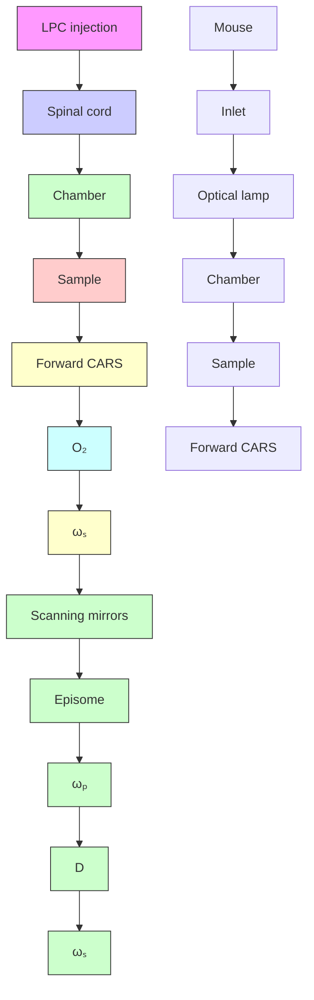

# Coherent Anti-Stokes Raman Scattering Imaging of Myelin Degradation Reveals a Calcium-Dependent Pathway in Lyso-PtdCho-Induced Demyelination

Yan Fu,1 Haifeng Wang,1 Terry B. Huff,2 Riyi Shi,1,3 and Ji-Xin Cheng1,2\*

1 Weldon School of Biomedical Engineering, Purdue University, West Lafayette, Indiana  
2 Department of Chemistry, Purdue University, West Lafayette, Indiana  
3 Department of Basic Medical Sciences, Institute for Applied Neurology, and Center for Paralysis  
Research, Purdue University, West Lafayette, Indiana

Coherent anti-Stokes Raman scattering (CARS) microscopy, which allows vibrational imaging of myelin sheath in its natural state, was applied to characterize lysophosphatidylcholine (lyso-PtdCho)-induced myelin degradation in tissues and in vivo. After the injection of lyso-PtdCho into ex vivo spinal tissues or in vivo mouse sciatic nerves, myelin swelling characterized by the decrease of CARS intensity and loss of excitation polarization dependence was extensively observed. The swelling corresponds to myelin vesiculation and splitting observed by electron microscopy. The demyelination dynamics were quantified by the increase of g ratio measured from the CARS images. Treating spinal tissues with ${ \mathsf { C } } { \mathsf { a } } ^ { 2 + }$ ionophore A23187 resulted in the same kind of myelin degradation as lyso-PtdCho. Moreover, the demyelination lesion size was significantly reduced upon preincubation of the spinal tissue with $\dot { \mathsf { C } } \mathsf { a } ^ { 2 + }$ free Krebs’ solution or a cytosolic phospholipase $\mathsf { A } _ { 2 } \left( \mathsf { c P l } \mathsf { A } _ { 2 } \right)$ inhibitor or a calpain inhibitor. In accordance with the imaging results, removal of ${ \mathsf { C a } } ^ { 2 + }$ or addition of cP $\mathsf { A } _ { 2 }$ inhibitor or calpain inhibitor in the Krebs’ solution remarkably increased the mean compound action potential amplitude in lyso-PtdCho treated spinal tissues. Our results suggest that lyso-PtdCho induces myelin degradation via $\breve { \mathsf { C } } \mathsf { a } ^ { 2 + }$ influx into myelin and subsequent activation of $\mathsf { c P L A } _ { 2 }$ and calpain, which break down the myelin lipids and proteins. The current work also shows that CARS microscopy is a potentially powerful tool for the study of demyelination. VC 2007 Wiley-Liss, Inc.

Key words: coherent anti-Stokes Raman scattering microscopy; demyelination; phospholipase $\mathsf { A } _ { 2 } ;$ lyso-PtdCho; calpain

Demyelination, the loss of normal myelin sheath, is responsible for long-term neurologic disability (Waxman, 1998; Lazzarini, 2004). Myelin degradation under clinical and experimental conditions has been extensively studied by electron microscopy (EM) and immunofluorescence. For example, myelin vesiculation was observed in the acute lesions of multiple sclerosis (MS) and experimental autoimmune encephalomyelitis (EAE; Genain et al., 1999). Although EM provided a vast amount of information about myelin ultrastructure (Morell and Quarles, 1999), and immunofluorescence allowed the visualization of specific myelin components (Erne et al., 2002), the need for fixed tissue samples with these techniques prevents real-time monitoring of enzymatic activities and demyelination dynamics. To alleviate such difficulties, we have recently demonstrated coherent anti-Stokes Raman scattering (CARS) imaging of myelin sheath in its natural state (Wang et al., 2005). In a CARS process, the interaction of a pump field $\mathrm { E } _ { \mathrm { p } } ( \omega _ { \mathrm { p } } )$ and a Stokes field $\mathrm { E } _ { \mathrm { s } } ( \omega _ { \mathrm { s } } )$ with a sample generates an anti-Stokes field $\mathrm { E _ { a s } }$ at frequency $2 \omega _ { \mathrm { p } } - \omega _ { \mathrm { s } }$ (Maker and Terhune, 1965; Shen, 1984). The CARS signal can be significantly enhanced when $\omega _ { \mathrm { p } } - \omega _ { \mathrm { s } }$ is tuned to the resonant frequency of a Raman band, creating a vibrational contrast. Moreover, the CARS signal increases quadratically with the number of vibrational oscillators in the focal volume, permitting high-speed molecular imaging with low excitation power (Cheng and Xie, 2004). Additionally, the nonlinear nature of CARS provides a lateral resolution of 0.28 lm and an axial resolution of 0.70 lm. The myelin membranes contains about 70% lipid by weight (Morell and Quarles, 1999), where the high-density CH2 groups produce a large CARS signal (Wang et al., 2005). Importantly, the capability of probing intact myelin in the live tissue environment allows examination of enzymatic and cellular activities involved in demyelination.

Contract grant sponsor: NSF; Contract grant number: 0416785; Contract grant sponsor: NIH; Contract grant number: R21 EB004966-01; Contract grant number: R01 EB007243-01; Contract grant sponsor: State of Indiana.

\*Correspondence to: Ji-Xin Cheng, Weldon School of Biomedical Engineering, Purdue University, 206 South Intramural Drive, West Lafayette, IN 47907. E-mail: jcheng@purdue.edu

Received 2 April 2007; Revised 2 April 2007; Accepted 11 April 2007

Published online 5 June 2007 in Wiley InterScience (www. interscience.wiley.com). DOI: 10.1002/jnr.21403

flowchart

Fig. 1. Illustrations of live spinal tissue preparation, injection of lyso-PtdCho into a spinal tissue, and schematic of our CARS microscope. PDMS, polydimethylsiloxane; D, dichroic mirror.

In this study, CARS microscopy was applied to examine lyso-PtdCho induced demyelination. First observed by EM in the 1970s (Hall and Gregson, 1971; Blakemore et al., 1977), lysophosphatidylcholine (lyso-PtdCho)-induced acute myelin vesiculation is one of the most widely used demyelination models (Pavelko et al., 1998; Jean and Fressinaud, 2003; Arnett et al., 2004; Woodruff et al., 2004). Lyso-PtdCho as an extensively used lysis agent has been shown to solubilize brain myelin completely in vitro (Webster, 1957). Moreover, the area of lyso-PtdCho-induced demyelination was found to be dose dependent (Hall and Gregson, 1971). These observations led to the hypothesis that myelin vesiculation results from the lytic action of lyso-PtdCho (Gregson and Hall, 1973). However, the dosage of the injected lyso-PtdCho was argued to be inadequate to account for the extent of demyelination if lytic action is the main mechanism (Gregson, 1989). To date, the mechanism for lyso-PtdCho-induced myelin degradation remains unclear. By using CARS microscopy, we show that lyso-PtdCho induces myelin swelling in guinea pig spinal tissues and mouse sciatic nerves. Our EM characterization confirms that the swelling corresponds to vesiculation and splitting of the myelin membranes. By combining CARS imaging with electrophysiological recording, a Ca2þ-dependent pathway that involves the activation of cPL $\mathbf { A } _ { 2 }$ and calpain is identified for lyso-PtdCho-induced myelin degradation.

## MATERIALS AND METHODS

All animals used in this study were handled in strict accordance with NIH guidelines for the care and use of laboratory animals. The experimental protocol was approved by the Purdue Animal Care and Use Committee.

## Preparation of Ex Vivo Spinal Tissue

The following procedure was used to isolate the spinal cord from the animal (Shi et al., 1999). Adult female guinea pigs of 350–500 g body weight were anesthetized deeply with 80 mg/kg ketamine, 0.8 mg/kg acepromazine, and 12 mg/kg xylazine and perfused transcardially with cold Krebs’ solution (NaCl 124 mM, KCl 2 mM, $\mathrm { K H } _ { 2 } \mathrm { P O } _ { 4 } \ 1 . 2$ mM, $\mathrm { M g S O _ { 4 } }$ 1.3 mM, $\mathrm { C a C l } _ { 2 } \ 2 \ \mathrm { m M }$ , dextrose 10 mM, $\mathrm { N a H C O } _ { 3 }$ 26 mM, and sodium ascorbate 10 mM). The vertebral column was rapidly excised, and the laminae from the lumbosacral to the cervical levels were removed in a continuous strip by cutting through the pedicles on either side. The roots on either side were cut carefully as the cord was gently removed from the inverted vertebral column and placed in cold Krebs’ solution. The extracted spinal cord was first split into two halves by sagittal division and then cut radially to separate the ventral white matter from the gray matter. Cords were maintained in continuously oxygenated Krebs’ solution for at least 1 hr prior to the experiment.

In the imaging experiment, the isolated ventral white matter strip was mounted on a polydimethylsiloxane (PDMS) chambered glass coverslip and kept in oxygen bubbled Krebs’ solution (Fig. 1). The axons maintained good morphology (monitored by CARS microscopy) and function (monitored by electrophysiological recording) for at least 10 hr in the chamber.

## Lyso-PtdCho Treatment of Spinal Tissues

A 100 mg/ml lyso-PtdCho stock solution was prepared by dissolving 50 mg egg lyso-PtdCho (L4129; Sigma, St. Louis, MO) into 450 ll saline (0.8% sodium chloride) via sonication. Solutions of 50, 20, and 10 mg/ml were prepared by diluting the stock solution with saline. A Hamilton syringe was used to inject a certain amount (1.0–10 ll) of lyso-PtdCho solution into the spinal tissue. To avoid localized traumatic injury caused by injection, incubation with a Krebs’ solution supplemented with lyso-PtdCho saline was also carried out. Control experiments were performed by injecting the same amount of Krebs’ solution or saline into a native tissue sample from the same animal.

## Animal Surgery and Treatments for In Vivo Imaging

Adult Balb/C mice were used to analyze lyso-PtdChoinduced myelin degradation in vivo. Mice were anesthetized by intraperitoneal injection of ketamine (50 mg/kg) and xylazine (5 mg/kg). The skin of the upper thigh was shaved, and a small longitudinal incision was made. Dissection scissors were used to open the skin above the sciatic nerve. The exposed tissue was gently rinsed with Milli-Q water to remove the hair clippings from the incision. To minimize image distortion induced by blood pulsing, the femoral artery was temporarily ligated on the upper thigh with silk sutures during the imaging period. A heating pad was used to maintain the body temperature at $3 7 ^ { \circ } \mathrm { C } .$ To induce acute demyelination, 1 ll of 20 mg/ml lyso-PtdCho saline solution was injected beneath the exposed sciatic nerve and allowed to incubate for 1 hr prior to CARS imaging. The anesthetized mouse was placed on a homebuilt stage, with the exposed nerve tissue facing the bottom coverslip. The stage was mounted on an inverted microscope. A 340 water objective was directly under the coverslip with the exposed tissue to collect the backward CARS signal. Upon completion of the imaging procedure, animals were euthanized by a 23 ketaminexylazine injection (ketamine 100 mg/kg, xylazine 10 mg/kg). Once respiratory function had ceased, cervical dislocation was performed to ensure euthanasia.

## CARS Imaging

A diagram of our microscope is shown in Figure 1. The two beams at frequency $\omega _ { \mathrm { p } }$ and ${ \mathfrak { O } } _ { \mathrm { s } }$ were generated from two tightly synchronized Ti:sapphire lasers (Mira 900/Sync-Lock; Coherent Inc.). Both lasers have pulse duration of 2.5 psec. The two beams were polarized in a parallel fashion and collinearly combined. A Pockels’ cell was used to reduce the repetition rate from 78 MHz to 7.8 MHz. The overlapped beams were directed into a laser scanning microscope (FV300/IX70; Olympus Inc.) and focused into a sample through a 360 water immersion objective lens $( \mathrm { N A } = 1 . \overset { \cdot } { 2 } )$ . For spinal tissues, the CARS signal was collected in the forward direction with an air condenser $( \mathrm { N A } = 0 . 5 5 )$ . Photomultiplier tubes (PMTs) were used for CARS detection with two 600/65-nm bandpass filters (46-7332; Ealing Catalog Inc.). The frequency difference between the pump and Stokes beams, $\mathrm { { \sc ~ \omega ~ } _ { p } - \mathrm { { \sc ~ \omega ~ } _ { o } } }$ , was tuned to the symmetric CH vibration at $2 , 8 4 0$ cm–1 to produce resonant CARS from the myelin. For in vivo imaging of mouse sciatic nerve, a 340 water immersion objective was used. The backward CARS signal was collected by the same objective and detected by an external PMT mounted at the back port of the same CARS microscope. The average pump and Stokes laser power at the sample were around 3.6 mW and 1.2 mW, respectively. No photodamage to myelin was observed. All the imaging experiments were carried out at room temperature (238C).

## EM Characterization

The ultrastructural change of myelin induced by lyso-PtdCho was characterized by transmission electron microscopy (TEM). The spinal tissue was incubated with 10 mg/ml lyso-PtdCho for 90 min. Both the lyso-PtdCho-treated and the control tissues from the same guinea pig were immersed into a fixative solution (3% glutaraldehyde in 0.1 M cold cacodylate buffer containing 2 mM MgCl , 1 mM CaCl , 0.25% NaCl, pH 7.4) for 10 min. The tissues were then dissected into small pieces and fixed for an additional 80 min. The dissected samples were rinsed with 0.1 M cacodylate buffer three times and water once, then postfixed in aqueous reduced osmium [1% $\mathrm { O s O _ { 4 } }$ and 1.5% $\mathrm { \bar { K } } _ { 3 } \mathrm { F e } ( \mathrm { C N } ) _ { 6 } ]$ for 90 min at room temperature. After three times washing with water, the fixed specimens were dehydrated through a graded ethanol series, embedded in Epon, and polymerized at $6 0 ^ { \circ } \mathrm { C }$ for 48 hr. Finally, the specimens were dissected into thin sections (90– 100 nm), stained with uranyl acetate and lead citrate, and imaged on an FEI/Philips CM-10 bio-twin transmission electron microscope.

## Examination of the Roles of $\mathbf { C a } ^ { 2 + }$ , $\mathbf { P L A } _ { 2 } ,$ and Calpain in Lyso-PtdCho-Induced Demyelination

To examine the role of $\mathrm { C a } ^ { 2 + }$ influx in myelin degradation, 10 ll of 20 lg/ml $\mathrm { C a } ^ { 2 + }$ ionophore A23187 (Sigma) was injected into the spinal tissue. After incubation in normal Krebs’ solution for 6 hr, the sample was examined by CARS microscopy. For real-time imaging, CARS microscopy was used to monitor myelin changes in the spinal tissue during incubation in a Krebs’ solution supplemented with 500 lg/ml A23187. A cytosolic $\mathrm { P L A } _ { 2 }$ (cPLA ) inhibitor, methyl arachidonyl fluorophosphonate (MAFP; Cyaman Chemical Co, Ann Arbor, MI); a secretory $\mathrm { P L A } _ { 2 } ( \mathrm { s P L A } _ { 2 } )$ inhibitor, $2 , 4 ^ { \prime } -$ dibromoacetophenone (p-BPB; Sigma); and a calpain inhibitor III, MDL 28170 (EMD Biosciences Inc., San Diego, CA) were used separately to examine the roles of calcium-dependent $\mathrm { P L A } _ { 2 }$ enzymes and calpain in lyso-PtdCho-induced demyelination. Spinal tissues were incubated with Krebs’ solution supplemented with 100 lM MAFP or 100 lM p-BPB or 500 lM MDL 28170 for 2 hr prior to lyso-PtdCho injection. After incubation with MAFP or p-BPB or MDL 28170, the myelin was imaged by CARS microscopy, and no morphological change was observed. After the lyso-PtdCho treatment, the whole tissue was checked by CARS microscopy to determine the longitudinal (along the axon) and transverse dimensions of the myelin degradation area. To investigate further the role of $\mathrm { s P L A } _ { 2 } ,$ spinal tissues were incubated with a Krebs’ solution supplemented with 10 mg/ml sPLA2 (Sigma) for up to 2 hr, followed by CARS imaging of myelin morphology.

## Electrophysiological Recording

Compound action potential (CAP) measurement of the isolated spinal cord ventral white matter was carried out by using a double sucrose gap chamber described previously (Shi et al., 1999). Briefly, a strip of spinal cord ventral white matter approximately 40 mm in length was placed across the chamber with the central compartment receiving a continuous perfusion of oxygenated Krebs’ solution (2 ml/min). The stimulating and recording electrodes were not in direct contact with the spinal cord tissue. The temperature of the Krebs’ solution was maintained at $3 7 ^ { \circ } \mathrm { C } .$ . The free ends of the white matter strip were placed across the sucrose gap channels to side compartments filled with isotonic (120 mM) potassium chloride. The sucrose gap was perfused with isotonic sucrose solution at a rate of 1 ml/min. The white matter strip was sealed with a thin plastic sheet and vacuum grease on either side of the sucrose gap channels to prevent the exchange of solutions. The axons were stimulated at one end of the strip, and the CAP was recorded at the opposite end.

## RESULTS

## CARS Imaging of Myelin Degradation in Ex Vivo Spinal Tissues

The resonant CARS signal from symmetric CH2 stretch vibration (2,840 cm ) was used to characterize lyso-PtdCho-induced myelin sheath changes. The normal myelin sheath displayed clear CARS contrast (Fig. 2A) because of the high-density CH2 groups in lipids. Five minutes after injecting 2 ll of 10 mg/ml lyso-PtdCho saline into the spinal tissue, swelling of myelin sheath from the outer surface was observed (Fig. 2B). The swollen region and the compact region can be clearly distinguished. The CARS intensity from the swollen region was approximately one-third of that from the compact region (Fig. 2C), indicating a decrease of the lipid packing density. We also investigated the dependence of CARS intensity on the excitation polarization for normal myelin and swollen myelin (Fig. 2D,E). The lipid molecules inside a normal myelin sheath have been shown to be highly ordered (Wang et al., 2005). The ordering degree of intramyelin lipids is characterized by the ratio of $\bar { \mathrm { I _ { \parallel } } }$ to $\mathrm { I _ { \perp } }$ (Fig. 2F), where $\mathrm { I } _ { \parallel }$ and $\mathrm { I _ { \perp } }$ are the CARS intensities with the excitation polarization parallel with or perpendicular to the myelinated fiber, respectively. The value of $\mathrm { I } _ { \parallel } / \mathrm { I } _ { \perp }$ was measured to be $3 . 5 3 \pm \mathrm { { \hat { 0 } } . 0 9 }$ for normal myelin and $\overline { { 0 } } . 9 8 \pm \ : 0 . 0 9$ for swollen myelin. The independence on the excitation polarization $( \bar { \mathrm { I } _ { \parallel } } = \mathrm { I } _ { \perp } )$ indicates a complete degradation of the lamellar structure in the swollen myelin sheath. To confirm that the observed loss of lamellar structure and reduction of packing density correspond to previously observed myelin vesiculation (Hall and Gregson, 1971; Gregson and Hall, 1973), we acquired TEM images of normal and lyso-PtdCho-treated spinal tissues. The normal myelin sheath displayed a compact lamellar structure (Fig. 2G). The lyso-PtdCho treatment caused vesiculation as well as splitting of myelin membranes (Fig. 2H).

The live tissue imaging capability of CARS microscopy allowed us to follow lyso-PtdCho-induced myelin degradation in real time. An acute swelling process is shown in Figure 3A. The swelling was observed after 10 min of incubation with a Krebs’ solution supplemented with lyso-PtdCho. The whole myelin became totally swollen within the following 4 min. This demyelination process was further quantified by the change of $\mathrm { g }$ ratio defined as $\mathrm { g } = \mathrm { a } / \mathrm { b }$ , where a and b are the inner and outer diameters of the compact region of a myelinated fiber (Fig. 3B). The $\mathrm { g }$ ratio represents the precise relationship between the axon diameter and the thickness of normal myelin sheath (Morell and Quarles, 1999). With myelin swelling, the g ratio was increased because of a decrease of the compact myelin thickness. In the demyelination process described above, the g ratio increased from 0.68 to 1.0 (totally swollen).

## CARS Imaging of Myelin Degradation In Vivo

Lyso-PtdCho-induced myelin vesiculation was first observed in sciatic nerves (Hall and Gregson, 1971). To verify the generality of our method, in vivo epidetected CARS imaging of lyso-PtdCho-induced myelin degradation in the mouse sciatic nerve was carried out. One hour after injecting 1 ll of 20 mg/ml lyso-PtdCho beneath the sciatic nerve, we observed significant myelin swelling (Fig. 4A). The intensity profile across the axons shows regions of tightly compact myelin surrounding the axons and regions of swollen myelin on the outside. Figure 4B and C are CARS images obtained with vertically and horizontally polarized excitation beams, respectively, in which there is axon ‘‘1’’ with complete myelin swelling as well as axons ‘‘2’’ and ‘‘3’’ with compact myelin. Whereas the compact myelin showed a clear CARS signal dependence on incident polarization, as mentioned above, such polarization dependence was lost for swollen myelin, indicating disintegration of the myelin lamellar structure. These results indicate that lyso-PtdCho causes the same type of myelin degradation in both spinal tissues of the central nervous system (CNS) and sciatic nerves of the peripheral nervous systems (PNS). It is noteworthy that the myelin-forming cells in PNS and CNS are different. Our results suggest that lyso-PtdCho induces myelin degradation through a pathway that is not specific to oligodendrocytes or Schwann cells.

## Myelin Swelling Can Be Induced by ${ \bf { C } } { \bf { \dot { a } } } ^ { 2 + }$ Ionophores

Myelin vesiculation was also observed by EM after intraneural injections of $\mathrm { C a } ^ { 2 + }$ ionophore A23187 or ionomycin (Schlaepfer, 1977; Smith et al., 1985). We have examined $\mathrm { C a } ^ { 2 + }$ -ionophore-induced myelin degradation by CARS microscopy. Myelin swelling throughout the tissue was observed at 6 hr after injecting 10 ll of 20 lg/ ml A23187 into spinal tissue. For the swollen region, the CARS intensities with parallel (Fig. 5A) or perpendicular (Fig. 5B) excitation polarization were found to be the same, identical to lyso-PtdCho-induced myelin swelling.

A  

text_image

Ax
Ax

B  

text_image

Ax
Ax

c  

line chart

| Position (μm) | Normal | Swollen |
| ------------- | ------ | ------- |
| 0             | 0.0    | 0.0     |
| 5             | 2.5    | 2.8     |
| 10            | 0.2    | 0.1     |
| 15            | 0.1    | 0.3     |

D  

natural_image

Abstract black-and-white pattern with wavy and blurred shapes, no text or symbols present

natural_image

Microscopic view of cellular or fibrous structures with white arrows indicating specific regions (no text or symbols present)

E  

natural_image

Microscopic grayscale image showing fibrous or cellular structures with a white arrow pointing to a specific region (no text or symbols present)

natural_image

Microscopic grayscale image showing fibrous tissue structure with a white arrow pointing to a specific region and a scale bar (no text or symbols)

F  

bar chart

| Condition | Value |
| --------- | ----- |
| Normal    | 3.5   |
| Swollen   | 1.0   |

G  

natural_image

Microscopic view of a biological cell structure showing nucleus and cytoplasm (no text or labels)

H  

natural_image

Microscopic view of cellular structures with red and green markers indicating specific regions (no text or symbols present)

Fig. 2. Characterization of lyso-PtdCho-induced myelin swelling by CARS microscopy and EM. The laser beams were focused into the equatorial plane of axons. A: CARS image of normal myelin sheath wrapping two parallel axons acquired at a speed of 1.13 sec/frame. The same speed was used for other images. B: CARS image of partially swollen myelin sheath acquired at 5 min after injecting 2 ll of 10 mg/ml lyso-PtdCho into the tissue. C: CARS intensity profiles of normal and swollen myelin fibers. Green: taken along the green line in A. Red: taken along the red line in B. Note the decrease of CARS intensity in the swollen region. D: CARS images of normal myelin sheath with vertical (vertical arrows) and horizontal (horizontal  
arrows) excitation polarization. E: CARS images of totally swollen myelin sheath with vertical (vertical arrows) and horizontal (horizontal arrows) excitation polarization. F: The ordering degree characterized by $\mathrm { I } _ { \parallel } / \mathrm { I } _ { - }$ \ of intramyelin lipids for normal and swollen myelin sheath. The CARS intensity from the swollen myelin showed no dependence on the excitation polarization. $\mathbf { G } , \mathbf { H } ;$ TEM images of normal myelin $( \mathrm { G } , \times 3 0 , 0 0 0 )$ and degraded myelin induced by incubating the spinal tissue with 10 mg/ml lyso-PtdCho for 90 min $\left( \mathrm { H } , \ \times 6 , 3 0 0 \right)$ . In $\mathrm { H , }$ green stars indicate myelin vesiculation and red arrows indicate myelin splitting. Scale bars ¼ 10 lm. [Color figure can be viewed in the online issue, which is available at www.interscience.wiley.com.]

natural_image

Microscopic images of cellular or tissue structures at 10, 12, and 14 minutes (no text or symbols present)

line chart

| Time (min) | g ratio |
| ---------- | ------- |
| 0          | 0.6     |
| 10         | 0.8     |
| 15         | 1.0     |

Fig. 3. Real-time CARS imaging of myelin degradation. A: Timelapse CARS images of myelin swelling in the spinal tissue incubated with a Krebs’ solution containing 10 mg/ml lyso-PtdCho. B: Diagram of measuring the g ratio of a partially swollen myelin fiber based on the remaining compact region. C: The increase of $^ \mathrm { g }$ ratio during the process of myelin swelling. Scale bar ¼ 10 lm.

We further performed real-time CARS imaging of live spinal tissue incubated with a Krebs’ solution containing 500 lg/ml A23187. The compact myelin sheath (Fig. 5C) became swollen after 315 min (Fig. 5D). The swelling was accompanied by a significant drop of the CARS signal as shown in the intensity profiles below the images. The same kind of myelin degradation induced by both lyso-PtdCho and $\bar { \mathrm { C a } } ^ { 2 \bar { + } }$ ionophores supports the idea that Ca2þ $\dot { \mathrm { C a } } ^ { 2 + }$ overloading is involved in lyso-PtdCho-induced demyelination.

## Lyso-PtdCho-Induced Myelin Swelling Is Ca21 $\mathbf { C a } ^ { 2 + }$ Dependent

To inspect directly the role of $\mathrm { C a } ^ { 2 + }$ in lyso-PtdCho-induced myelin swelling, we compared the size of the myelin degradation lesion induced by lyso-PtdCho in normal (2 mM $\mathrm { C a } ^ { 2 + } )$ and ${ \mathrm { C a } } ^ { 2 + } .$ -free Krebs’ solutions. After lyso-PtdCho treatment, we acquired CARS images of the spinal tissue continuously from one end to the other in both longitudinal and transverse directions. We found that myelin swelling appeared only in a certain region, which is referred to as demyelination lesion. The lesion size was described by the longitudinal and transverse lengths of that region (inset in Fig. 6A), which can be calculated by counting the CARS images with myelin swelling (the size of each image times the number of images). With normal Krebs’ solution, the longitudinal and transverse lengths of the lesion were measured to be about $6 . 5 ~ \pm ~ 1 . 0$ mm and $1 . 4 ~ \pm ~ 0 . 4$ mm, respectively. With a ${ \mathrm { C a } } ^ { 2 + } { \mathrm { - f r e e } }$ Krebs’ solution supplemented with 0.5 mM EGTA as an extracellular $\mathrm { C a } ^ { 2 + ^ { \bf { \underline { { \bf } } } } }$ chelator, the lesion size was observed to be reduced by 4.85 times longitudinally and 1.58 times transversely (Fig. $6 \mathrm { A } )$ . This result confirms the involvement of extracellular $\stackrel { \prime } { \mathrm { C a } } ^ { 2 + }$ in lyso-PtdCho-induced demyelination.

## Lyso-PtdCho-Induced Myelin Swelling Is Mediated by $\mathbf { c } \mathbf { P } \mathbf { L } \mathbf { A } _ { 2 }$ and Calpain

Among the $\mathrm { C a } ^ { 2 + }$ -dependent enzymes, PLA enzymes are hydrolytic enzymes, which catalyze the cleavage of the sn-2 ester bond of a phospholipid (Balsinde et al., 1999). The $\mathrm { C a } ^ { 2 + }$ dependent mammalian PL $. \mathsf { A } _ { 2 }$ enzymes include $\mathrm { c P L A } _ { 2 }$ and sPL $\mathbf { A } _ { 2 }$ . To test the role of cPL $\mathbf { \nabla } . \operatorname { A } _ { 2 } ,$ we preincubated the tissue with a cPLA inhibitor, MAFP (Lucas et al., 2005), before lyso-PtdCho injection. As shown in Figure 6A, MAFP diminished the demyelination lesion size by 3.10 times longitudinally and 1.65 times transversely. Preincubation with both MAFP and EGTA in a $\mathrm { C a } ^ { 2 \mathrm { + } }$ -free Krebs’ solution led to more efficient elimination of demyelination, with the longitudinal and transverse lengths of swelling reduced by 12.7 times and 17.0 times, respectively. On the other hand, preincubation with an $\mathrm { s P L A } _ { 2 }$ inhibitor, p-BPB (Balsinde et al., 1999), did not reduce the extent of demyelination (Fig. 6A). We have also found that incubation with a Krebs’ solution supplemented with purified sPL ${ \bf A } _ { 2 }$ for 2 hr did not result in myelin swelling (data not shown). These results demonstrate that the observed acute swelling is largely mediated by $\mathrm { C a } ^ { 2 + }$ -activated $\mathrm { c P L A } _ { 2 }$ but not sPLA .

In the above-described experiment, MAFP was used as a $\mathrm { c P L A } _ { 2 }$ inhibitor. We would note that MAFP inhibits not only $\mathrm { c P L A } _ { 2 }$ but also calcium-independent $\mathrm { P L A } _ { 2 }$ $( \mathrm { i } \mathrm { P L } \mathrm { A } _ { 2 } ;$ Lio et al., 1996). Because our data have shown that lyso-PhtCho-induced myelin breakdown is calcium dependent (Fig. 6), the iPL $\mathbf { A } _ { 2 }$ should play a minor role in the observed myelin degradation. MAFP was also shown to be a potent inhibitor of fatty acid amide hydrolase (FAAH; Deutsch et al., 1997) and an irreversible cannabinoid receptor antagonist (Fernando and Pertwee, 1997). However, it is unlikely that the inhibition of FAAH or blockade of cannabinoid receptor is able to prevent the severe myelin breakdown in the time period of our observation. Therefore, it is reasonable to consider that the reduction of lyso-PhdCho-induced myelin breakdown by MAFP is due mainly to its inhibition of cP $. \mathsf { A } _ { 2 }$ .

We have also tested the role of calpain, a ${ \mathrm { C a } } ^ { 2 + } .$ - dependent proteinase that breaks down myelin through degrading myelin basic proteins (MBPs; Schaecher et al., 2001). Before lyso-PtdCho treatment, we preincubated the tissue with calpain inhibitor III MDL 28170, a cellpermeable inhibitor of calpains I and II (Markgraf et al., 1998; Huang and Wang, 2001). Figure 6A shows that MDL 28170 diminished the demyelination size by 2.47 times longitudinally and 1.67 times transversely. This result implies that calpain is also involved in lyso-PtdChoinduced myelin degradation. Taken together, the abovedescribed results show that, during the $\mathrm { C a } ^ { 2 + }$ influx into myelin induced by Lyso-PtdCho, $\mathrm { c P L A } _ { 2 }$ and calpain were activated and caused myelin breakdown through their respective pathways.

A  

natural_image

Microscopic view of elongated biological structures with a red horizontal line indicating a measurement or reference point (no text or symbols present)

line chart

| Position (μm) | Intensity (a.u.) |
| ------------- | ---------------- |
| 0             | 1.0              |
| 2             | 2.5              |
| 4             | 3.5              |
| 6             | 1.0              |
| 8             | 2.5              |
| 10            | 3.5              |
| 12            | 1.0              |
| 14            | 3.5              |
| 16            | 1.0              |

Fig. 4. In vivo epidetected CARS imaging of lyso-PtdCho-induced myelin degradation in a mouse sciatic nerve. A: Image of partially swollen myelin. Intensity profile along the red line in A is shown below the image. The PMT signal from the compact myelin region (flat peaks) had to be saturated to allow for clear visualization of the swollen region displayed as shoulders on the sides of the flat peaks. B,C: Swollen myelin sheath imaged with vertically and horizontally

## Electrophysiological Characterization of Lyso-PtdCho-Treated Spinal Tissues

It was reported that lyso-PtdCho-induced demyelination blocked the nerve conduction in vivo (Smith and

text_image

B
1 2 3
Ep
Es

text_image

c
1 2 3
Ep
Es

line chart

| Position (μm) | Horizontal | Vertical |
| ------------- | ---------- | -------- |
| 0             | 0.5        | 1.0      |
| 5             | 0.8        | 1.5      |
| 10            | 1.2        | 3.0      |
| 15            | 0.6        | 3.5      |
| 20            | 0.4        | 2.5      |

polarized excitation, respectively. Loss of myelin lamellar structure resulted in an excitation polarization-independent CARS signal as shown in the intensity profiles for the swollen myelin surrounding axon $" ~ 1 "$ in B and C. Scale bar ¼ 5 lm. [Color figure can be viewed in the online issue, which is available at www.interscience. wiley.com.]

Hall, 1980; Smith et al., 1982). Using a double sucrose gap chamber, we have quantified the effect of lyso-PtdCho treatment on impulse conduction along the spinal cord white matter. As shown in Figure 6C, 0.5 hr of incubation of spinal tissues with 10 mg/ml lyso-PtdCho reduced the mean CAP amplitude to 20% of the control. In the control experiment, the tissue was incubated with normal oxygen-bubbled Krebs’ solution without perfusion for 1 hr, and the mean CAP amplitude showed <5% change.

The CAP recording was further used to verify the participation of $\mathrm { C a } ^ { 2 + }$ and calcium-activated $\mathrm { c P L A } _ { 2 } ^ { \cdot }$ and calpain in lyso-PtdCho-induced demyelination. To study the role of ${ \mathrm { C a } } ^ { 2 + } ,$ we incubated the spinal tissue in oxygen-bubbled $\mathrm { C a } ^ { 2 + } .$ with 0.5 mM EGTA and 10 mg/ml lyso-PtdCho for 0.5 hr, then washed and perfused the tissue with $\mathrm { C a } ^ { 2 + } \mathrm { _ { - } }$ free Krebs’ solution supplemented with 0.5 mM EGTA. As shown in Figure 6B,C, lyso-PtdCho only reduced the mean CAP amplitude to 65% of the control. This result further confirms the important role of $\dot { \mathrm { C a } } ^ { 2 + }$ in lyso-PtdCho-induced demyelination. To study the role of cPL ${ \bf A } _ { 2 }$ and calpain, the spinal tissue was first incubated with oxygenated 100 lM MAFP $( \mathrm { c P L A } _ { 2 }$ inhibitor) or 500 lM MDL 28170 (calpain inhibitor) solution for 0.5 hr, then treated with a Krebs’ solution supplemented with 10 mg/ml lyso-PtdCho and 100 lM MAFP or 500 lM MDL 28170 for another 0.5 hr. The CAP was measured after washing and perfusion with normal Krebs’ solution. Figure 6C shows that MAFP improved the mean CAP amplitude to 66% of the control and that MDL 28170 improved the mean CAP amplitude to 49% of the control. These results confirm the involvement of cPL ${ \bf A } _ { 2 }$ and calpain in the insulting of myelin by lyso-PtdCho.

A  

natural_image

Microscopic view of fibrous or cellular structures with a white arrow indicating a specific region (no text or symbols present)

B  

natural_image

Microscopic view of fibrous or filamentous structures with a white arrow indicating a specific region (no text or symbols present)

C 5min  

natural_image

Microscopic view of parallel fibrous structures with a white diagonal line overlay (no text or symbols)

D 315min  

natural_image

Medical scan image showing internal anatomical structures with a white diagonal line overlay (no text or symbols)

line chart

| Position (μm) | CARS (a.u.) |
| ------------- | ----------- |
| 0             | 15          |
| 4             | 2           |
| 8             | 15          |
| 12            | 3           |
| 16            | 15          |

line chart

| Position (μm) | CARS (a.u.) |
| ------------- | ----------- |
| 0             | 0           |
| 4             | 3           |
| 8             | 5           |
| 12            | 9           |
| 16            | 1           |

Fig. 5. CARS imaging of $\mathrm { C a } ^ { 2 + }$ ionophore induced myelin degradation. A,B: CARS images of swollen myelin sheath with horizontal (horizontal arrows; A) and vertical (vertical arrows; B) excitation polarization, respectively. The myelin swelling was induced by injecting  
10 ll of 20 lg/ml $\mathrm { C a } ^ { 2 + }$ ionophore A23187 into the spinal tissue. The images were taken 6 hr after the injection. C,D: Real-time imaging of myelin degradation induced by incubation with 500 lg/ml $\check { \mathrm { C a } } ^ { 2 \mp }$ 2þ ionophore at 5 min (A) and 315 min (B). Scale bar ¼ 10 lm.

bar chart

| Condition | Demyelination Length (mm) |
|---|---|
| Normal Krebs' solution | 1.5 |
| Ca²⁺free & EGTA | 1.3 |
| cPLA2 inhibitor MAFP | 1.4 |
| Ca²⁺ free & EGTA & MAFP | 0.1 |
| sPLA2 inhibitor p-BPB | 1.6 |
| Calpain inhibitor MDL28170 | 1.3 |

line chart

| Condition | Current (mV) |
| --------- | ------------ |
| Ctrl      | 5mV          |
| LPC       | 5ms          |
| Ca²⁺ free& EGTA+LPC | 5ms        |
| MAFP+LPC   | 5ms          |
| MDL28170 +LPC | 5ms        |

bar chart

| Group | Normalized amplitude |
|-------|----------------------|
| Ctrl | 100 |
| LPC | 25 |
| Ca²⁺ free& EGTA+LPC | 65 |
| MAFP+LPC | 65 |
| MDL28170 +LPC | 50 |

Fig. 6. Lyso-PtdCho-induced demyelination is ${ \mathrm { C a } } ^ { 2 + } , { \mathrm { c P L A } } _ { 2 } ,$ and calpain dependent. LPC represents lyso-PtdCho. A: The sizes of demyelination lesion induced by lyso-PtdCho under different conditions. The inset illustrates a spinal cord sample with the lesion size defined by the longitudinal and transverse lengths of myelin swelling. The lesion size was measured by CARS microscopy at 30 min after injecting 10 ll of 10 mg/ml lyso-PtdCho into the tissues preincubated with indicated chemicals. The histogram data are presented as mean 6 SD of three independent measurements. Statistical differences were calculated by ANOVA with Turkey’s test. $^ { \star \star p } < 0 . 0 1$  
compared with longitudinal dimension in normal Krebs’ solution. B,C: Effects of $\mathrm { C a } ^ { 2 + }$ removal and $\mathrm { c P L A } _ { 2 }$ and calpain inhibition on lyso-PtdCho-induced CAP reduction of spinal cord ventral white matter. B shows representative CAP tracings of the control spinal tissue under different conditions. C shows the statistical analysis of 10 independent measurements. Lyso-PtdCho in normal Krebs’ solution induced 80% reduction of the mean CAP amplitude but only 40% reduction in ${ \mathrm { C a } } ^ { 2 + } { \mathrm { - f r e e } }$ Krebs’ solution or with MAFP and 51% reduction with MDL 28170. $^ { \star \star p } < 0 . 0 1$ compared with the CAP reduction by lyso-PtdCho in normal Krebs’ solution.

## DISCUSSION

Through CARS imaging of ex vivo guinea pig spinal tissues and in vivo mouse sciatic nerves (Figs. 2, 4), we have shown that lyso-PtdCho causes acute myelin swelling. The swollen myelin displays the decrease of CARS intensity and loss of polarization dependence, consistent with myelin vesiculation observed by our EM characterization. With the high acquisition speed (1 frame per sec) of CARS microscopy, we have followed the acute myelin degradation in real time (Fig. 3). We have revealed a $\mathrm { C a } ^ { 2 \mp } .$ -dependent mechanism by combining CARS imaging and electrophysiological recordings with biochemical treatments (Fig. 6). $\mathrm { C a } ^ { 2 + }$ influx has been proposed to be a key intermediate step in myelin degradation (Stys, 2004). Lyso-PtdCho has been found to be able to increase the membrane permeability for $\mathrm { C a } ^ { 2 + }$ entry into cells (Yu et al., 1998; Le´gra´di et al., 2004). Therefore, it is likely that lyso-PtdCho treatment increases the myelin membrane permeability, leading to extracellular $\mathrm { C a } ^ { 2 + }$ influx into the myelin and subsequent activation of cPL $. \mathsf { A } _ { 2 }$ and calpain. Although a sufficient amount of lyso-PtdCho might not exist in diseases or injury, a recent study showed that $\mathrm { C a } ^ { 2 + }$ accumulation in myelin could be mediated by N-methyl-D-aspartate (NMDA) glutamate receptors during chemical ischemia (Micu et al., 2006).

This $\mathrm { C a } ^ { 2 \# }$ -dependent pathway in demyelination helps us to understand the nociceptive pain, such as tactile allodynia and hyperalgesia, occurred in demyelinating diseases. Lyso-PtdCho as a selective demyelinating agent is reported to cause focal demyelination of peripheral afferents, which results in neuropathic pain behavior (Wallace et al., 2003). Intracerebroventricular injections of lyso-PtdCho were also observed to increase allodynia and behavioral responses to von Frey hair stimulation in a mouse model of inflammatory pain mediated by carrageenan (Vahidy et al., 2006). Lyso-PtdCho-induced calcium influx into cells is a possible reason for the nociceptive pain. It is known that elevation of intracellular calcium activates several protein kinases, such as protein kinase C and calcium/calmodulin-dependent protein kinase II. Activation of these protein kinases leads to the phosphorylation of ionotropic glutamate receptors, increasing synaptic efficacy (Woolf and Salter, 2000; Ji and Strichartz, 2004). Our results and results of other studies (Kalyvas and David, 2004) also showed that cPL $. \mathsf { A } _ { 2 }$ plays an important role in demyelination. Hydrolysis of neural membrane phospholipids by $\mathrm { c P L A } _ { 2 } ^ { \cdot }$ generates fatty acids and lysophospholipids. Many of these products are substrates for the synthesis of more potent lipid mediators, such as eicosanoids and platelet-activating factor, which are known to be involved in pain transmission (Ji et al., 2003; Farooqui and Horrocks, 2006). Recently, intracerebroventricular injection of cPL $\mathbf { A } _ { 2 }$ inhibitors has been demonstrated to reduce allodynia and behavioral responses after facial carrageenan injection (Yeo et al., 2004). Therefore, it is conceivable that both calcium influx and cPL $. \mathsf { A } _ { 2 }$ activation are able to cause the nociceptive pain in demyelinating diseases.

Our results shown in Figure 6 are consistent with the specific function of calpain, a calcium-activated neutral proteinase that is able to degrade the MBP (Takahashi, 1990). As the function of MBP is to bind to the apposing cytoplasmic faces of the myelin membrane and maintain its compaction, the breakdown of MBP is expected to cause myelin splitting, which is consistent with our EM observations of lyso-PtdCho-treated samples (indicated by red arrows in Fig. 2H). The existence of calpain in myelin (Banik et al., 1985) further supports our observation that lyso-PtdCho-induced myelin breakdown is an acute process. Figure 6 is also supported by the specific function of $\mathrm { c P L } \mathbf { \breve { A } } _ { 2 }$ and the molecular composition of myelin sheath. It has been shown that $\mathrm { \dot { c P L A } } _ { 2 }$ preferentially hydrolyzes phospholipids containing arachidonate chains in its $\mathrm { s n } { - 2 }$ position (Clark et al., 1991). It is also known that nearly 20% of the phospholipids in myelin are composed of plasmalogen (Nagan and Zoeller, 2001). Moreover, mass spectroscopy measurements showed that a significant portion of myelin plasmalogen stores arachidonate in its sn-2 position (Han et al., 2001). Therefore, the myelin sheath could be particularly vulnerable to ${ \mathrm { c P L A } } _ { 2 }$ attack, which generates lyso-phospholipids and fatty acids (De et al., 2003). These nonbilayer-forming products are able to disrupt the membrane lamellar structure, leading to myelin vesiculation. In a recent study (Kalyvas and David, 2004), it has been shown that cPLA2 is highly expressed in experimental autoimmune encephalomyelitis (EAE) lesions, and blocking this enzyme leads to a remarkable reduction in the onset and progression of EAE. Consistently, we observed in Figure 6 that inhibiting cPLA2 significantly reduced the lesion size of lyso-PtdChoinduced myelin swelling. Our results together with the study by Kalyvas et al. suggest a pivotal role of $\mathrm { c P L A } _ { 2 }$ in demyelination.

In conclusion, we have shown that CARS microscopy is able to characterize lyso-PtdCho-induced myelin degradation based on the reduction of CARS intensity and loss of excitation polarization dependence. Combining real-time CARS imaging and electrophysiological recording, we have revealed a ${ \mathrm { C a } } ^ { 2 + } - ,$ , calpain-, and cPLA2-dependent pathway for lyso-PtdCho-induced myelin breakdown. Although the demyelination pathway evoked by lyso-PtdCho is not directly relevant to demyelinating diseases, the action mechanisms revealed by the current work are important for the growing amount of research that utilizes this model system. More importantly, CARS microscopy can be applied to examine the mechanisms of inflammation- and trauma-induced myelin damage, which we believe will contribute to a deeper understanding of the pathogenesis of demyelination.

## ACKNOWLEDGMENTS

The authors thank Jennifer McBride and Kristin Hamann for their help in tissue preparation.

## REFERENCES

Arnett HA, Fancy SP, Alberta JA, Zhao C, Plant SR, Kaing S, Raine CS, Rowitch DH, Franklin RJM, Stiles CD. 2004. bHLH transcription factor olig1 is required to repair demyelinated lesions in the CNS. Science 306:2111–2115.  
Balsinde J, Balboa MA, Insel PA, Dennis EA. 1999. Regulation and inhibition of phospholipase A . Annu Rev Pharmacol Toxicol 39:175–189.  
Banik NL, McAlhaney WW, Hogan EL. 1985. Calcium-stimulated proteolysis in myelin: evidence for a Ca2þ-activated neutral proteinase associated with purified myelin of rat CNS. J Neurochem 45:581–588.  
Blakemore WF, Eames RA, Smith KJ, McDonald WI. 1977. Remyelination in the spinal cord of the cat following intraspinal injections of lysolecithin. J Neurol Sci 33:31–43.  
Cheng JX, Xie XS. 2004. Coherent anti-Stokes Raman scattering microscopy: instrumentation, theory, and applications. J Phys Chem B 108:827–840.  
Clark JD, Lin LL, Kriz RW, Ramesha CS, Sultzman LA, Lin AY, Milona N, Knopf JL. 1991. A novel arachidonic acid-selective cytosolic PLA2 contains a $\check { \mathrm { C a } } ^ { 2 + }$ -dependent translocation domain with homology to PKC and GAP. Cell 65:1043–1051.  
De S, Trigueros MA, Kalyvas A, David S. 2003. Phospholipase A2 plays an important role in myelin breakdown and phagocytosis during Wallerian degeneration. Mol Cell Neurosci 24:753–765.  
Deutsch DG, Omeir R, Arreaza G, Salehani D, Prestwich GD, Huang Z, Howlett A. 1997. Methyl arachidonyl fluorophosphonate: a potent irreversible inhibitor of anandamide amidase. Biochem Pharmacol 53:255–260.  
Erne B, Sansano S, Frank M, Schaeren-Wiemers N. 2002. Rafts in adult peripheral nerve myelin contain major structural myelin proteins and myelin and lymphocyte protein (MAL) and CD59 as specific markers. J Neurochem 82:550–562.  
Farooqui AA, Horrocks LA. 2006. Phospholipase A -generated lipid mediators in the brain: the good, the bad, and the ulgy. Neuroscientist 12:245–260.  
Fernando SR, Pertwee RG. 1997. Evidence that methyl arachidonyl fluorophosphonate is an irreversible cannabinoid receptor antagonist. Br J Pharmacol 121:1716–1720.  
Genain CP, Cannella B, Hauser SL, Raine CS. 1999. Identification of autoantibodies associated with myelin damage in multiple sclerosis. Nat Med 5:170–175.  
Gregson NA. 1989. Lysolipids and membrane damage: lysolecithin and its interaction with myelin. Biochem Soc Trans 17:280–283.  
Gregson NA, Hall SM. 1973. A quantitative analysis of the effects of the intraneural injection of lysophosphatidyl choline. J Cell Sci 13:257–277.  
Hall SM, Gregson NA. 1971. The in vivo and ultrastructural effects of injection of lysophosphatidyl choline into myelinated peripheral nerve fibres of the adult mouse. J Cell Sci 9:769–780.  
Han X, Holtzman DM, McKeel DW. 2001. Plasmalogen deficiency in early Alzheimer’s disease subjects and in animal models: molecular characterization using electrospray ionization mass spectrometry. J Neurochem 77:1168–1180.  
Huang Y, Wang KKW. 2001. The calpain family and human disease. Trends Mol Med 7:355–362.  
Jean I, Fressinaud C. 2003. Spontaneous central nervous system remyeli nation is not altered in NFH-lacZ transgenic mice after chemical demyelination. J Neurosci Res 73:54–60.  
Ji R-R, Strichartz G. 2004. Cell signaling and the genesis of neuropathic pain. Sci STKE 252:re14.  
Ji R-R, Kohno T, Moore KA, Woolf CJ. 2003. Central sensitization and LTP: do pain and memory share similar mechanisms? Trends Neurosci 26:696–705.  
Kalyvas A, David S. 2004. Cytosolic phospholipase A2 plays a key role in the pathogenesis of multiple sclerosis-like disease. Neuron 41:323–335.  
Lazzarini RA. 2004. Myelin biology and its disorders. San Diego, CA: Elsevier Academic Press.  
Le´gra´di A, Chitu V, Szukacsov V, Fajka-Boja R, Szu¨cs KS, Monostori E. 2004. Lysophosphatidylchoine is a regulator of tyrosine kinase activity and intracellular $\mathrm { { C a } } ^ { \dot { 2 } + }$ level in Jurkat T cell line. Immunol Lett 91:17–21.  
Lio YC, Reynolds LJ, Balsinde J, Dennis EA. 1996. Irreversible inhibition of $\mathrm { C a } ^ { 2 + } .$ -independent phospholipase A by methyl arachidonyl fluorophosphonate. Biochim Biophys Acta 1302:55–60.  
Lucas KK, Svensson CI, Hua XY, Yaksh TL, Dennis EA. 2005. Spinal phospholipase A in inflammatory hyperalgesia: role of group IVA cPLA2. Br J Pharmacol 144:940–952.  
Maker PD, Terhune RW. 1965. Study of optical effects due to an induced polarization third order in the electric field strength. Phys Rev 137:A801–A818.  
Markgraf CG, Velayo NL, Johnson MP, McCarty DR, Medhi S, Koehl JR, Chmielewski PA, Linnik MD, Clemens JA. 1998. Six-hour window of opportunity for calpain inhibition in focal cerebral ischemia in rats. Stroke 29:152–158.  
Micu I, Jiang Q, Coderre E, Ridsdale A, Zhang L, Woulfe J, Yun X, Trapp BD, McRory JE, Rehak R, Zamponi GW, Wang W, Stys PK. 2006. NMDA receptors mediate calcium accumulation in myelin during chemical ischemia. Nature 439:988–992.  
Morell P, Quarles RH. 1999. Myelin formation, structure, and biochemistry. In: Siegel GJ, Agranoff BW, Alberts RW, Molinoff PB, editors. Basic neurochemistry: molecular, cellular, and medical aspects, 5th ed. Philadelphia: Lippincott Williams & Wilkins.  
Nagan N, Zoeller RA. 2001. Plasmalogens: biosynthesis and functions. Prog Lipid Res 40:199–229.  
Pavelko KD, van Engelen BGM, Rodriguez M. 1998. Acceleration in the rate of CNS remyelination in lysolecithin-induced demyelination. J Neurosci 18:2498–2505.  
Schaecher KE, Shields DC, Banik NL. 2001. Mechanism of myelin breakdown in experimental demyelination: a putative role for calpain. Neurochem Res 26:731–737.  
Schlaepfer WW. 1977. Vesicular disruption of myelin simulated by exposure of nerve to calcium ionophore. Nature 265:734–736.  
Shen YR. 1984. The principles of nonlinear optics. New York: John Wiley & Sons Inc.  
Shi R, Borgens RB, Blight AR. 1999. Functional reconnection of severed mammalian spinal cord axons with polyethylene glycol. J Neurotrauma 16:727–738.  
Smith KJ, Hall SM. 1980. Nerve conduction during peripheral demyelination and remyelination. J Neurol Sci 48:201–219.  
Smith KJ, Bostock H, Hall SM. 1982. Saltatory conduction precedes remyelination in axons demyelinated with lysophosphatidyl choline. J Neurol Sci 54:13–31.  
Smith KJ, Hall SM, Schauf CL. 1985. Vesicular demyelination induced by raised intracellular calcium. J Neurol Sci 71:19–37.  
Stys PK. 2004. White matter injury mechanisms. Curr Mol Med 4:113– 130.  
Takahashi K. 1990. Calpain substrate specificity. In: Mellgren RL, Murachi T, editors. Intracellular calcium-dependent proteolysis. Boca Raton, FL: CRC Press. p 55–74.  
Vahidy WH, Ong W-Y, Farooqui AA, Yeo J-F. 2006. Effects of intracerebroventricular injections of free fatty acids, lysophospholipids, or platelet activating factor in a mouse model of orofacial pain. Exp Brain Res 174:781–785.  
Wallace VCJ, Cottrell DF, Brophy PJ, Fleetwood-Walker SM. 2003. Focal lysolecithin-induced demyelination of peripheral afferents results in neuropathic pain behavior that is attenuated by cannabinoids. J Neurosci 23:3221–3233.  
Wang H, Fu Y, Zickmund P, Shi R, Cheng JX. 2005. Coherent anti-Stokes Raman scattering imaging of live spinal tissues. Biophys J 89:581–591.  
Waxman SG. 1998. Demyelinating diseases—new pathological insights, new therapeutic targets. N Engl J Med 338:323–325.  
Webster GR. 1957. Clearing action of lysolecithin on brain homogenates. Nature 180:660–661.  
Woodruff RH, Fruttiger M, Richardson WD, Franklin RJM. 2004. Platelet-derived growth factor regulates oligodendrocyte progenitor numbers in adult CNS and their response following CNS demyelination. Mol Cell Neurosci 25:252–262.  
Woolf CJ, Salter MW. 2000. Neuronal plasticity: increasing the gain in pain. Science 288:1765–1769.  
Yeo J-F, Ong W-Y, Ling S-F, Farooqui AA. 2004. Intracerebroventricular injection of phospholipase A inhibitors modulates allodynia after facial carrageenan injection in mice. Pain 112:148–155.  
Yu L, Netticadan T, Xu YJ, Panagia V, Dhalla NS. 1998. Mechanisms of lysophosphatidylcholine-induced increase in intracellular calcium in rat cardiomyocytes. J Pharmacol Exp Ther 286:1–8.