## Optics Letters

# Coherent anti-Stokes Raman scattering imaging under ambient light

Yinxin Zhang, 1,2 Chien-Sheng Liao,² WEili Hong,² Kai-Chih Huang,² Huaidong Yang,3 YINXIN ZHANG, CHIEN-SHENG LIAO,

1 Key Laboratory of Opto-electronics Information Technology of the Ministry of Education, College of Precision Instrument and Opto-Electronics Engineering, Tianjin University, Tianjin 300072, China

2 Weldon School of Biomedical Engineering, Purdue University, West Lafayette, Indiana 47907, USA

3 State Key Laboratory of Precision Measurement Technology and Instruments, Tsinghua University, Beijing 100084, China

4 Department of Chemistry, Purdue University, West Lafayette, Indiana 47907, USA

5 Birck Nanotechnology Center, Purdue University, West Lafayette, Indiana 47907, USA

6 Purdue Institute of Inflammation, Immunology and Infectious Disease, West Lafayette, Indiana 47907, USA

\*Corresponding author: jcheng@purdue.edu

Received 29 June 2016; accepted 18 July 2016; posted 29 July 2016 (Doc. ID 269281); published 12 August 2016

We demonstrate an ambient light coherent anti-Stokes Raman scattering microscope that allows CARS imaging to be operated under environmental light for field use. The CARS signal is modulated at megahertz frequency and detected by a photodiode equipped with a lab-built resonant amplifier, then extracted through a lock-in amplifier. The filters in both the spectral domain and the frequency domain effectively blocked the room light contamination of the CARS image. In situ hyperspectral CARS imaging of tumor tissue under ambient light is demonstrated. © 2016 Optical Society of America

OCIS codes: (300.6230) Spectroscopy, coherent anti-Stokes Raman scattering; (300.6380) Spectroscopy, modulation; (170.1610) Clinica applications.

http://dx.doi.org/10.1364/OL.41.003880

Coherent anti-Stokes Raman scattering (CARS) microscopy is a recently developed vibrational spectroscopic imaging technology with broad applications in biology and medicine [1–4]. CARS is a third-order nonlinear optical process in which a pump–probe beam $( \omega _ { p } )$ and a Stokes beam (ω ) interact with molecules in the specimen. When the beat frequency $( \omega _ { p } - \omega _ { s } )$ is tuned to be resonant with a given vibrational mode, a strong anti-Stokes signal is generated at the frequency of $\omega _ { a s } = 2 \omega _ { p } -$ ω [1,4]. CARS microscopy holds the promise for noninvasively imaging complex systems with high spatial resolution, high sensitivity, and label-free chemical specificity. Its clinical applications have been promoted by advanced developments [5], including epi-detection [6], multiplex acquisition [7–9], single-beam excitation [10,11], spectral focusing [12,13], nonlinear fiber wavelength conversion [14], time-resolved probing [15], and interferometry [16,17]. Despite these advances, the current CARS microscope can only be operated in a dark environment because the CARS signal currently relies on highly sensitive photomultiplier tube (PMT) which can be easily saturated by room light. This remaining challenge has blocked the in situ applications of CARS microscopy in an operation room and in the field.

Here, we address this challenge through the development of ambient light coherent anti-Stokes Raman scattering (AL-CARS) microscopy. In our scheme, the laser is modulated at megahertz frequency. Under ambient light, a photodiode equipped with a lab-built resonant amplifier selectively picks up the CARS signal at the same modulation frequency. Bandpass filters are further used to spectrally block the laser and the room light. Together, by filtering in both the frequency domain and the spectral domain, we have succeeded in blocking the environmental light and sensing a CARS signal with a sufficient signal-to-noise ratio (SNR). By our AL-CARS setup, spectroscopic images of human breast cancerous tissue in situ were obtained. Through a multi variate curve resolution (MCR) analysis [18], the fibrosis and cytoplasm were distinguished.

In AL-CARS, both bandpass filters and the modulation serve as the obstacle to ambient light. The bandpass filter block the excitation laser and most of the ambient light, re leasing only the CARS signal and the room light around th CARS wavelength to the detector. By modulation of the laser and demodulation of the signal at megahertz, we further reject the environmental light in the frequency domain. The ambient light entering the detector has an optical frequency of about several hundred terahertz and is accompanied with the alternating current frequency of 60 Hz. Since the modulation frequency is quite different from either the optical frequency of the ambient light or the alternating current frequency, we are able to extract the CARS signal selectively by a resonant circuit and a lock-in amplifier.

The system is depicted in Fig. 1(a). An ultrafast laser (InSight, Spectra Physics) with dual outputs provides two synchronized pulse trains. The tunable beam with 120 fs pulse duration served as the pump beam and was tuned to 798 nm for excitation of C–H bonds. The 1040 nm beam with 200 fs

```mermaid
graph TD
  A["Insight DeepSee"] --> B["Pump"]
  B --> C["HWP"]
  C --> D["PBS"]
  D --> E["AOM"]
  E --> F["Time delay"]
  F --> G["DM"]
  G --> H["SF57"]
  H --> I["Condenser"]
  I --> J["Objective"]
  J --> K["PS"]
  K --> L["L"]
  L --> M["GM"]
  M --> N["PS"]
  N --> O["L"]
  O --> P["PS"]
  P --> Q["HWP"]
  Q --> R["PBS"]
  R --> S["AOM"]
  S --> T["Time delay"]
  T --> U["DM"]
  U --> V["SF57"]
  V --> W["Condenser"]
  W --> X["Objective"]
  X --> Y["PS"]
  Y --> Z["HWP"]
  Z --> AA["PBS"]
  AA --> AB["AOM"]
  AB --> AC["Time delay"]
  AC --> AD["DM"]
  AD --> AE["SF57"]
  AE --> AF["Condenser"]
  AF --> AG["Objective"]
  AG --> AH["L"]
  AH --> AI["PS"]
  AI --> AJ["HWP"]
  AJ --> AK["PBS"]
  AK --> AL["AOM"]
  AL --> AM["Time delay"]
  AM --> AN["DM"]
  AN --> AO["SF57"]
  AO --> AP["Condenser"]
  AP --> AQ["Objective"]
  AQ --> AR["L"]
  AR --> AS["PS"]
  AS --> AT["HWP"]
  AT --> AU["PBS"]
  AU --> AV["AOM"]
  AV --> AW["Time delay"]
```

flowchart

(b)  

natural_image

Interior view of an electronic device showing a green circuit board with components like USB, capacitors, and wires (no visible text or symbols)

natural_image

Close-up of a green printed circuit board with visible components and wiring (no readable text or symbols)

(c)  

scatterplot

| Step numbers | Raman shift (cm⁻¹) |
| :--- | :--- |
| 13 | 2995 |
| 20 | 2945 |
| 27 | 2915 |
| 33 | 2895 |
| 38 | 2865 |
| 42 | 2835 |
R²=0.99

Schematic and performance of an AL-CARS imaging setup. Fig. 1.(a) Schematic of a lab-built hyperspectral AL-CARS imaging setup. HWP, half wave plate; PBS, polarizing beam splitter; L, lens; M, mirror; AOM, acousto-optic modulator; DM, dichroic mirror; SF57, SF57 glass; GM, galvo mirror; MS, motored stage; PD&RA, photodiode and resonant amplifier. (b) Pictures of the lab-built photodiode and the resonant amplifier model. (c) Correlation of the Raman shift with respect to the motor step numbers. The relation was fitted by a linear curve $( R ^ { 2 } = 0 . 9 9 )$ .

pulse duration serves as the Stokes beam and is modulated by an acousto-optic modulator (AOM, 1205-C, Isomet) at the frequency of 2.34 MHz. The two beams are combined and chirped by two 15 cm long SF57 glass rods. In this way, the Raman shift can be controlled by the time delay between the pump and the Stokes beams. The pump and the Stokes beams are sent into a lab-built microscope [19]. A 60 × water immersion objective lens $( \mathrm { N A } = 1 . 2 $ , UPlanApo/IR, Olympus) is used to focus the light onto the sample, and an oil condenser (NA 1.4, U-AAC, Olympus) is employed to collect the scattering signal. Two bandpass filters (D680/100, HQ650/60, Chroma) are housed in a lens tube and attached to the photodiode case. The signal is collected by a large-area photodiode (S3994-01, Hamamatsu) and amplified by a lab-built resonant circuit with a 2.34 MHz central frequency and 200 kHz bandwidth [Fig. 1(b)]. The lock-in amplifier (HF2LI, Zurich Instrument) extracts the modulated CARS signal. Hyperspectral CARS images are acquired by scanning the temporal delay between the chirped pump and the Stokes beams [12,20]. By this spectral focusing scheme, the Raman shift of each fram in hyperspectral images varies as the time delay changes.

The calibration of the Raman shift with respect to the temporal delay was completed by using Raman peaks of known chemicals. A modified Kramers–Kronig method [21–23] was employed to extract the equivalent Raman spectra from measured CARS spectra which contain a vibrationally resonant signal and a nonresonant background. By comparing the phase-retrieved CARS spectral profile of known chemicals with their spontaneous Raman spectra, the relation between the motor step position and the Raman shift is obtained and shown in Fig. 1(c). The relation can be described by a linear fitting with $\mathbf { \bar { \boldsymbol { R } } } ^ { 2 } = 0 . 9 9$ .

To compare our AL-CARS setup with the “dark” CARS de tected by a PMT, we recorded the AL-CARS image of dimethyl sulfoxide (DMSO) [Fig. 2(a)] and the “dark” CARS image of the same sample [Fig. 2(b)] under the 60 Hz room light. The photodiode in the AL-CARS setup was not saturated, and the modulated CARS signal was successfully extracted from the ambient light. In contrast, Fig. 2(b) revealed that the PMT was saturated by the lamp light when the voltage for the PMT was 250 V. Because the CARS signal from a biomedical sample is much weaker than that of DMSO, for CARS imaging of the tissues, the voltage for PMT must be much higher than 250 V. Under such a condition, the environmental light will saturate the PMT or even damage the detector. However, the photodiode we used has a high saturation threshold, which is satu rated, even illuminated, by a laser of about 8 mW. The room light reaching the detector has much lower power and, thus, does not saturate the photodiode.

We note that the recently developed stimulated Raman scattering (SRS) [24] microscopy intrinsically allows vibrational imaging under ambient light. However, the SRS measurement suffers from the laser noise for the signal being extracted from the laser beam itself; thus, SRS requires a high-quality solid state laser as the excitation source. When excited by a compact fiber laser, a sophisticated balance detection is needed to maintain a good SRS contrast [25]. In contrast, the CARS signal appears at a new wavelength, and high-quality CARS images can be directly obtained from a fiber laser [26]. To verify the value of our approach, we introduced a noise to the pump beam by an AOM and compared ambient light SRS images and CARS images (Fig. 3). The artificial noise had frequencies of 2.3, 2.32, 2.34, 2.36, and 2.38 MHz; the noise level at 2.34 MHz was measured −70 dBm, as a regular fiber laser has [25]. When the artificial noise was added, the SNR of the SRS image dropped from 904 to 6.6 [Fig. 3(a) and 3(b)], whereas the AL-CARS image showed little deterioration [Fig. 3(c) and 3(d)]. To suppress the laser noise in a SRS image generated by a fiber laser, Freudiger et al. [25] utilized the balanced detection method. In comparison, our AL-CARS microscope is robust to laser noise and can be operated under ambient environment.

natural_image

Grayscale image of a curved surface with gradient shading, labeled (a) in top-left corner (no other text or symbols)

natural_image

Abstract grayscale pattern with diagonal gradient and vertical streaks (no text or symbols)

Comparison between CARS images of a DMSO solution Fig. 2.detected by the photodiode and the PMT. The microscope was illu minated by a 40 W lamp of 60 Hz alternating current frequency from about 30 cm distance. (a) Image detected by the photodiode in a AL-CARS setup. The power of the pump and Stokes beams was 200 and 100 mW, respectively. (b) Image detected by the PMT. The PMT was saturated by the lamp light when the voltage for the PMT was 250 V.

To characterize the signal and the source of noise in AL-CARS, we measured the CARS signal and noise level as a function of the excitation laser power. The intensity of CARS signal can be expressed as [4]

$$
I _ {\text { CARS }} \propto | \chi^ {(3)} | ^ {2} I _ {p} ^ {2} I _ {s}. \tag {1}
$$

$\chi ^ { ( 3 ) }$ is the third-order nonlinear susceptibility containing a vibrationally resonant and a nonresonant component. Figure $\mathrm { 4 ( a ) }$ shows that the CARS intensity is proportion to $I _ { \ P } ^ { 2 } I _ { S } ,$ , which is in agreement with Eq. (1). There are three major noise resources in a CARS microscopic system, namely the shot noise, the laser intensity noise, and the detector electronic noise [4]. The relationship between these noise resources can be written as

$\mathrm { t o t a l n o i s e } = \sqrt { \mathrm { s h o t n o i s e } ^ { 2 } + \mathrm { l a s e r i n t e n s i t y n o i s e } ^ { 2 } + \mathrm { e l e c . \ n o i s e } ^ { 2 } } .$ (2)

The electronic noise is a constant, and the shot noise is known to be proportional to the square root of the power, here, the intensity of the CARS signal. In our AL-CARS microscope, the total noise in the signal increases with the increase of the excitation intensity [Fig. 4(b)]. When $I _ { \rho } ^ { 2 } I _ { S }$ is below $5 \times 1 0 ^ { 5 } \ \mathrm { m W } ^ { 3 }$ , the electronic noise is dominant, and the total noise increases slowly with the laser intensity. As $I _ { \phi } ^ { 2 } I _ { S }$ exceeds $5 \times 1 0 ^ { 5 } \ \mathrm { m W } ^ { 3 }$ , the total noise level increases linearly with the laser intensity. As the CARS signal level has a linear relationship with $I _ { \phi } ^ { 2 } I _ { S } ,$ , the shot noise is proportional to the square root of $I _ { \rho } ^ { 2 } I _ { S }$ accordingly. Thus, the linear relationship between the noise and $I _ { \rho } ^ { 2 } { \bar { I _ { S } } } ^ { * }$ in Fig. 4(b) indicates that the AL-CARS setup is laser noise dominant when $I _ { \rho } ^ { 2 } I _ { S }$ exceeds $5 \times 1 0 ^ { 5 } ~ \mathrm { m W } ^ { \hat { 3 } }$ . Consistently, the SNR increases quickly at the very beginning and becomes a constant as the excitation intensity is raised [Fig. 4(c)].

To evaluate the detection sensitivity of our AL-CARS imaging setup, we used DMSO at different volume concentrations as a test bed. Figure 5(a) shows a representative phase-retrieved image of a DMSO solution diluted by deuterium oxide $( \mathrm { D } _ { 2 } \mathrm { O } )$ ). The CARS spectra of different concentrated DMSO samples can be found in Fig. 5(b). When the DMSO volume concentration is as low as 1%, the peak of the $2 9 1 3 ~ \mathrm { c m ^ { - 1 } }$ Raman shift is still clear, which indicates that the detection limit of the setup can reach 1% DMSO.

  
Comparison between the SRS images and the AL-CARS Fig. 3.images when an artificial noise was introduced to the pump beam. The sample was DMSO, and the modulation frequency was 2.34 MHz. (a) SRS image when the noise was turned off. The $\mathrm { S N R } = 9 0 4 .$ (b) SRS image when the noise was on. The $\mathrm { S N R } = 6 . 6 .$ (c) CARS image when the noise was turned off. The SNR 239. (d) CARS image when the noise was on. The $\mathrm { S N R } = 2 2 8 .$

line chart

| I_P² × I_S (mW³) | CARS Intensity (a.u.) |
| ----------------- | --------------------- |
| 0                 | 0.0                   |
| 1×10⁶             | 0.2                   |
| 2×10⁶             | 0.4                   |
| 3×10⁶             | 0.6                   |
| 4×10⁶             | 0.8                   |

line chart

| I_P^2 × I_S (mW^3) | Total noise in signal (Volt) | Linear fitting (I_p^2 × I_s ≥ 5×10^5 mW^3) | Electronics noise (Volt) |
| ------------------ | ---------------------------- | ------------------------------------------ | ------------------------ |
| 0                  | ~0                           | ~0                                         | ~0                       |
| 1x10^6             | ~0.01                        | ~0.01                                      | ~0                       |
| 2x10^6             | ~0.02                        | ~0.02                                      | ~0                       |
| 3x10^6             | ~0.03                        | ~0.03                                      | ~0                       |
| 4x10^6             | ~0.04                        | ~0.04                                      | ~0                       |

scatterplot

| I_P² × I_S (mW³) | SNR in signal |
| ---------------- | ------------- |
| 0                | 5             |
| 50000            | 25            |
| 100000           | 35            |
| 150000           | 40            |
| 200000           | 45            |
| 250000           | 48            |
| 300000           | 47            |
| 350000           | 49            |
| 400000           | 52            |

Signal and noise characteristics of our AL-CARS setup. The Fig. 4.experiments were performed under fluorescent lamp lighting. Six stan dard fluorescent lamps of 60 W, each illuminating the room of $3 6 ~ \mathrm { m } ^ { 2 }$ from the ceiling. All the results were obtained under the same ambien condition. (a) Measured (dot) and linear fitting (line) relationship be tween the excitation intensity and the CARS emission. (b) The nois level of the setup, which was laser noise dominant when $I _ { P } ^ { 2 } I _ { S }$ exceeds $5 \times 1 0 ^ { 5 } \ \mathrm { m W } ^ { 3 }$ . (c) SNR as a function of $I _ { P } ^ { 2 } I _ { S }$ .

(a)  

natural_image

Abstract grayscale texture with a curved band at the bottom (no text or symbols)

(b)  

line chart

| Raman shift (cm⁻¹) | 5% DMSO | 3% DMSO | 2% DMSO | 1% DMSO | 0.5% DMSO | 0% DMSO |
| ------------------ | ------- | ------- | ------- | ------- | --------- | ------- |
| 3000               | ~0      | ~0      | ~0      | ~0      | ~0        | ~0      |
| 2950               | ~0      | ~0      | ~0      | ~0      | ~0        | ~0      |
| 2900               | ~2×10⁻² | ~5×10⁻³ | ~1×10⁻³ | ~5×10⁻⁴ | ~1×10⁻⁴   | ~1×10⁻⁴ |

(c)  

line chart

| DMSO density (%) | CARS intensity (a.u.) |
| ---------------- | --------------------- |
| 0                | 0.00                  |
| 2                | 0.005                 |
| 4                | 0.015                 |
| 6                | 0.03                  |
| 8                | 0.05                  |
| 10               | 0.07                  |

(d)  

line chart

| DMSO density (%) | SNR  |
| ---------------- | ---- |
| 0                | 2    |
| 2                | 5    |
| 4                | 8    |
| 6                | 11   |
| 8                | 14   |
| 10               | 17   |

Detection sensitivity of AL-CARS determined by measuring Fig. 5.different concentrations of DMSO in $\mathrm { D } _ { 2 } \mathrm { O }$ . Pump, 400 mW; Stokes, 200 mW before the microscope. (a) Phase-retrieved CARS image (5% DMSO diluted by $_ { \mathrm { D _ { 2 } O } ) }$ ). (b) CARS spectra of different DMSO concentrations. (c) Measured (dot) and polynomial fitting (line) relationship between the DMSO density and the CARS signal intensit at $\textrm { a } 2 9 1 3 ~ \mathrm { c m } ^ { - 1 }$ Raman peak. (d) Measured (dot) and linear fitting (line) relationship between the DMSO density and the SNRs of CARS images at 2913 $\mathrm { c m ^ { - 1 } }$ Raman peak.

(a)  

natural_image

Fluorescence microscopy image showing red and green stained cellular structures with a 50μm scale bar (no text or symbols beyond scale indicator)

(b)  

line chart

| Raman Shift (cm⁻¹) | cytoplasm | fibrosis |
| ------------------ | --------- | -------- |
| 3000               | 0.00      | 0.00     |
| 2950               | 0.04      | 0.12     |
| 2900               | 0.03      | 0.08     |
| 2850               | 0.01      | 0.00     |

In situ mapping of human patient breast cancer and stroma Fig. 6.by ambient light hyperspectral CARS. (a) MCR concentration maps of fibrosis (red) and cytoplasm (green). (b) MCR output spectra of two components.

In Eq. $( 1 ) , \chi ^ { ( 3 ) }$ is the term that generates a CARS signal. From microscopic view of molecules, $\chi ^ { ( 3 ) }$ is proportional to the bulk number density [27]. Connecting the macroscopic tensors and molecular tensors, there should be a quadratic relationship between the CARS signal intensity and the DMSO density. The results in Fig. 5(c) are consistent with the theory. Meanwhile, the SNR of each image is related to the DMSO concentration by linear fitting, resulting in a linear correlation with $R ^ { 2 } = 0 . 9 9$ [Fig. 5(d)].

Finally, we demonstrated the capability of a AL-CARS scheme for in situ spectroscopic imaging of breast tissue. Forward-detected hyperspectral CARS imaging mapped the human breast cancer cells and the stroma based on their distinct chemical composition. By phase retrieval and MCR analysis, we were able to decompose the hyperspectral CARS data set into a chemical map containing two major components [Fig. 6(a)]. The spectral profile [Fig. 6(b)] with a strong peak around 2930 $\mathrm { c m ^ { - 1 } }$ is assigned to the fibrosis in the stroma, and the weaker and broader peak is assigned to the protein-rich cytoplasm. The nuclei showed a dark contrast.

In summary, this Letter demonstrates a new scheme that allows CARS imaging under ambient light, in which a photodiode with a lab-built resonant amplifier is used as the detector. The bandpass filters in the spectral domain and the modulation in the frequency domain block the environmental light. Our AL-CARS microscope resolves the “dark” problem and can image biological samples under ambient light. Meanwhile, superior to SRS microscopy, the insensitivity to the laser noise allows a commercial fiber laser to be used as its excitation source. Moreover, epi-detected CARS imaging can be done easily. These features collectively render AL-CARS a promising tool for in situ and in vivo clinical applications and field uses.

Funding. National Institutes of Health (NIH) (GM104681, CA182608); National Natural Science Foundation of China (NSFC) (61505143); China Scholarship Council (CSC) (201406255077).

Acknowledgment. The authors thank Professor Masanobu Yamamoto of Purdue University for constructive suggestions on the signal detection, and Chi Zhang and Delong Zhang of Purdue University for helpful discussions. Y. Zhang is grateful to the China Scholarship Council (CSC) for the fi nancial support in the United States.

## REFERENCES

1. C. L. Evans and X. S. Xie, Annu. Rev. Anal. Chem. , 883 (2008).  
12. C. Krafft, B. Dietzek, M. Schmitt, and J. Poppa, J. Biomed. Opt. , 040801 (2012).  
3. C. H. Camp, Jr. and M. T. Cicerone, Nat. Photonics , 295 (2015).  
94. C. Zhang, D. Zhang, and J.-X. Cheng, Annu. Rev. Biomed. Eng. , 415 (2015).  
5. H. Tu and S. A. Boppart, J. Biophoton. , 9 (2014).  
6. C. L. Evans, E. O. Potma, M. Puoris’haag, D. Côté, C. P. Lin, and X. S. Xie, Proc. Natl. Acad. Sci. USA , 16807 (2005).  
1027. C. H. Camp, Jr., Y. J. Lee, J. M. Heddleston, C. M. Hartshorn, A. R. H. Walker, J. N. Rich, J. D. Lathia, and M. T. Cicerone, Nat. Photonics , 627 (2014).  
88. J.-X. Cheng, A. Volkmer, L. D. Book, and X. S. Xie, J. Phys. Chem. B , 8493 (2002).  
1069. M. Müller and J. M. Schins, J. Phys. Chem. B , 3715 (2002)  
10610. O. Katz, J. M. Levitt, E. Grinvald, and Y. Silberberg, Opt. Express , 22693 (2010).  
11. N. Dudovich, D. Oron, and Y. Silberberg, Nature , 512 (2002)  
41812. T. Hellerer, A. M. K. Enejder, and A. Zumbusch, Appl. Phys. Lett. , 25 (2004).  
13. G. W. Jones, D. L. Marks, C. Vinegoni, and S. A. Boppart, Opt. Lett , 1543 (2006).  
3114. M. Baumgartl, M. Chemnitz, C. Jauregui, T. Meyer, B. Dietzek, J. Popp, J. Limpert, and A. Tünnermann, Opt. Express , 4484 (2012).  
2015. A. Volkmer, L. D. Book, and X. S. Xie, Appl. Phys. Lett. , 1505 (2002).  
16. E. O. Potma, C. L. Evans, and X. S. Xie, Opt. Lett. , 241 (2006)  
3117. D. L. Marks and S. A. Boppart, Phys. Rev. Lett. , 123905 (2004).  
9218. P. Wang, B. Liu, D. Zhang, M. Y. Belew, H. A. Tissenbaum, and J.-X. Cheng, Angew. Chem. , 11787 (2014).  
5319. P. Wang, J. Li, P. Wang, C. R. Hu, D. Zhang, M. Sturek, and J. X. Cheng, Angew. Chem. , 13042 (2013).  
5220. A. F. Pegoraro, A. Ridsdale, D. J. Moffatt, Y. Jia, J. P. Pezacki, and A. Stolow, Opt. Express , 2984 (2009).  
1721. Y. Liu, Y. J. Lee, and M. T. Cicerone, J. Raman Spectrosc. , 726 (2009).  
22. Y. Liu, Y. J. Lee, and M. T. Cicerone, Opt. Lett. , 1363 (2009).  
3423. C. H. Camp, Jr., Y. J. Lee, and M. T. Cicerone, J. Raman Spectrosc. , 408 (2016).  
4724. C. W. Freudiger, W. Min, B. G. Saar, S. Lu, G. R. Holtom, C. He, J. C. Tsai, J. X. Kang, and X. S. Xie, Science , 1857 (2008).  
32225. C. W. Freudiger, W. Yang, G. R. Holtom, N. Peyghambarian, X. S. Xie, and K. Q. Kieu, Nat. Photonics , 153 (2014).  
826. W. Hong, C. Liao, H. Zhao, W. Younis, Y. Zhang, M. N. Seleem, and J.-X. Cheng, Chem. Sel. , 513 (2016).  
127. C. Zhang, J. Wang, B. Ding, and J. Jasensky, J. Phys. Chem. B , 7647 (2014).