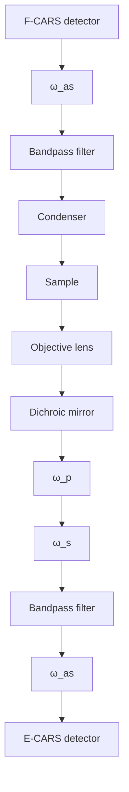

# Coherent Anti-Stokes Raman Scattering Microscopy: Instrumentation, Theory, and Applications

Ji-Xin Cheng† and X. Sunney Xie\*

Department of Chemistry and Chemical Biology, Har ard Uni ersity, 12 Oxford Street, Cambridge, Massachusetts 02138

Recei ed: June 14, 2003; In Final Form: October 2, 2003

Coherent anti-Stokes Raman scattering (CARS) microscopy permits vibrational imaging with high-sensitivity, high speed, and three-dimensional spatial resolution. We review recent advances in CARS microscopy, including experimental design, theoretical understanding of contrast mechanisms, and applications to chemical and biological systems. We also review the development of multiplex CARS microspectroscopy, which allows high-speed characterization of microscopic samples, and CARS correlation spectroscopy, which probes fast diffusion dynamics with vibrational selectivity.

## 1. Introduction

Investigation of molecular properties in complex systems such as living cells is a subject of wide interest. For a heterogeneous system, one needs spatial resolution to focus on the object of interest, and chemical selectivity to probe particular species. The combination of optical spectroscopy and microscopy provides a direct and noninvasive approach to visualizing nucleic acids, proteins, and other molecules at work in living cells. Chemically selective imaging can be implemented with fluorescence or vibrational microscopy. The development of various fluorescent probes1,2 and realization of three-dimensional (3D) resolution by confocal detection3 has made fluorescence microscopy a powerful and widely used imaging method. Twophoton fluorescence microscopy offers an alternative way to achieve 3D spatial resolution because the nonlinear signal is only generated at the tight focus of a femtosecond laser beam.4 The use of laser wavelengths in the near-IR region reduces Rayleigh scattering and increases the penetration depth in a thick sample, making two-photon fluorescence microscopy a useful tool for in vivo imaging.

Chemical imaging by use of inherent molecular vibration signals avoids the photobleaching problem and perturbations to cell functions induced by fluorophore labeling. Vibrational microscopy based on spontaneous Raman scattering and infrared (IR) absorption permits direct chemical imaging of unstained samples.5,6 The spatial resolution of IR microscopy is, however, limited by the long excitation wavelength (several micrometers) and the IR absorption of water hinders its application to live cell studies.7 The use of a shorter wavelength in spontaneous Raman microscopy avoids these problems. Confocal Raman microscopy8 provides 3D spatial resolution. On the other hand, Raman imaging necessitates a high average power because of the small cross section of Raman scattering. As a result, it takes several hours to acquire a Raman image of cells and tissues.9

text_image

Phase matching condition
k_s
k_as
k_p
k_p
Electronically
excited state
ω'_p
ω_s
ω_p
ω_s
ω'_p
ω_as
v=1
v=0
Ω
(A) Resonant
contribution
(B) Nonresonant
contribution
C) Two-photon enhanced
nonresonant contribution

Figure 1. Energy diagram of CARS. (A) Resonant CARS characterized by $A _ { \mathrm { R } } / [ \Omega \ - \ ( \omega _ { \mathrm { p } } \ - \ \omega _ { \mathrm { s } } ) \ - \ \mathrm { i } \Gamma _ { \mathrm { R } } ] .$ (B) Nonresonant CARS from an electronic contribution $( \chi _ { \mathrm { n r } } ^ { ( 3 ) } )$ , where the dotted lines indicate virtual states. (C) Electronic contribution $( A _ { \mathrm { t } } / [ \omega _ { \mathrm { t } } - 2 \omega _ { \mathrm { p } } - \mathrm { i } \Gamma _ { \mathrm { t } } ] )$ enhanced by - -a two-photon resonance of the pump beam associated with an excited electronic state.

Such a long exposure time limits the application of Raman microscopy to the study of dynamic living systems.

The above difficulties in spontaneous Raman microscopy can be circumvented by multiphoton vibrational microscopy based on coherent anti-Stokes Raman scattering (CARS). CARS is a four-wave mixing process in which a pump field $E _ { \mathrm { p } } ( \omega _ { \mathrm { p } } )$ , a Stokes field $E _ { \mathrm { s } } ( \omega _ { \mathrm { s } } )$ , and a probe field $E _ { \mathrm { p } } ^ { \prime } ( \omega _ { \mathrm { p } } ^ { \prime } )$ interact with a sample and generate an anti-Stokes field $E _ { \mathrm { a s } }$ at the frequency of $\omega _ { \mathrm { a s } } = \omega _ { \mathrm { p } } - \omega _ { \mathrm { s } } + \omega _ { \mathrm { p } } ^ { \prime } .$ The energy diagrams of CARS are ) - +shown in Figure 1. In most experiments, the pump and the probe fields derive from the same laser beam. The CARS intensity is a squared modulus of the induced nonlinear polarization, $P ^ { ( 3 ) } = \stackrel { \circ } { \chi } { } ^ { ( 3 ) } E _ { \mathrm { p } } { } ^ { 2 } E _ { \mathrm { s } } . \mathrm { ~ } \chi ^ { ( 3 ) }$ is the third-order susceptibility, for which )a general expression was given by Lotem et al.,10

$$
\chi^ {(3)} = \frac {A _ {\mathrm{R}}}{\Omega - (\omega_ {\mathrm{p}} - \omega_ {\mathrm{s}}) - \mathrm{i} \Gamma_ {\mathrm{R}}} + \chi_ {\mathrm{nr}} ^ {(3)} + \frac {A _ {\mathrm{t}}}{\omega_ {\mathrm{t}} - 2 \omega_ {\mathrm{p}} - \mathrm{i} \Gamma_ {\mathrm{t}}} (1)
$$

Ω in eq 1 is the vibrational frequency. $\Gamma _ { \mathrm { R } }$ and $\Gamma _ { \mathrm { t } }$ are the halfwidth at half-maximum of the Raman line and that of the twophoton electronic transition, respectively. $A _ { \mathrm { R } }$ and $A _ { \mathrm { t } }$ are constants representing the Raman scattering and the two-photon absorption cross sections. The first term is a vibrationally resonant contribution (Figure 1A). The second term is a nonresonant contribution that is independent of Raman shift (Figure 1B). The third term is an enhanced nonresonant contribution due to two-photon electronic resonance (Figure 1C). CARS signal generation needs to fulfill the phase-matching condition, $l < l _ { \mathrm { c } }$ $= \pi / | \Delta \mathbf { k } | = \pi / | \mathbf { k } _ { \mathrm { a s } } - ( 2 \mathbf { k } _ { \mathrm { p } } - \mathbf { k } _ { \mathrm { s } } ) |$ , where $\mathbf { k } _ { \mathrm { p } } , \mathbf { k } _ { \mathrm { s } } ,$ and $\mathbf { k } _ { \mathrm { a s } }$ <are ) ) - -wave vectors of the pump, Stokes, and CARS fields, respectively, and ∆k is the wave vector mismatch. Constructive interference of CARS occurs when the field-sample interaction length l is less than the coherent length $l _ { \mathrm { c } } ,$ at which the CARS signal reaches the first maximum. $1 1 - \bar { 1 4 }$ Since the first systematic study of CARS carried out by Maker and Terhune at Ford Motor Co.,15 CARS spectroscopy has become the most extensively used nonlinear Raman technique.11 14

The application of the CARS process to microscopy opens up a new method for chemical imaging. In CARS microscopy, the temporally and spatially overlapped pump and Stokes laser pulses are tightly focused into a sample to generate a signal in a small excitation volume ( 1 µm3). A CARS image is acquired by raster scanning the sample or the laser beams. The vibrational contrast in CARS microscopy arises from the signal enhancement when $\omega _ { \mathrm { p } } - \omega _ { \mathrm { s } }$ is tuned to a Raman-active vibrational band. Because the CARS intensity has a quadratic dependence on the pump field intensity and a linear dependence on the Stokes field intensity, the signal is generated from a small volume in the central focal region, providing CARS microscopy with a high 3D sectioning capability. The coherent summation of the CARS fields from a sizable sample results in a large and directional signal, which permits low excitation powers and fast scanning rates accordingly. Another advantage of CARS is that its signal frequency is blue-shifted from the excitation frequencies; thus, the CARS signal can be easily detected in the presence of the one-photon fluorescence background.

It must be noted that CARS microscopy is not without shortcomings. First, the intrinsically weak induced nonlinear polarizability requires sophisticated laser excitation sources with high peak power and moderate average power. Second, unlike fluorescence imaging, CARS measurement is not background free. The nonresonant background, the second and third terms in eq 1, from any objects of interest and surrounding solvent limits the image contrast and spectral selectivity. Fortunately, as shown below, the continuous developments of ultrafast laser sources and methods for suppressing the nonresonant background have circumvented these difficulties.

Duncan et al. reported the first CARS microscope in 1982.16 Using two picosecond dye lasers with a noncollinear beam geometry and detecting the signal in the phase matching direction, they acquired CARS images of onion skin cells in $\mathrm { D } _ { 2 } \mathrm { O }$ and of deuterated liposomes.17 However, the noncollinear beam geometry used in their work limited the image quality and the excitation with visible wavelengths resulted in a large nonresonant background. By using near-infrared laser beams that avoid two-photon electronic enhancement of the nonresonant background, Zumbusch et al. revived CARS microscopy in 1999.18 This work demonstrated 3D CARS imaging by using tightly focused collinear-propagating pump and Stokes beams. This advance immediately triggered interest within several research groups.19 21

Rapid development in the past few years has pushed the state of the art of CARS microscopy to the next level. The femtosecond pulses used in the 1999 work are not optimal for vibrational spectroscopy because their spectral widths are broader than Raman bandwidths. In 2001, Cheng et al. constructed a new CARS microscope with two synchronized picosecond Ti:Sapphire lasers, which not only provided high spectral resolution but also improved the signal background ratio.22 Volkmer et al. demonstrated that epi-detection (backward detection) permits efficient rejection of the solvent background.22,23 Other methods including polarization-sensitive detection,24 pulse sequenced detection,25 and phase control of excitation pulses26 were also developed. Another advance involved the improvement of the image acquisition speed. Cheng et al. developed a laser-scanning CARS microscope with two near-IR picosecond pulse trains and achieved a rapid acquisition rate,27 allowing visualization of fast cellular processes. A combination of CARS microscopy and correlation spectroscopy permits investigation of even faster dynamical processes in a chemically selective and noninvasive manner.28,29 By use of a picosecond and a femtosecond Ti:sapphire laser, multiplex CARS imaging30,31 and microspectroscopy with polarizationsensitive detection32 were also demonstrated. A combination of CARS with near-field scanning optical microscopy was reported.33 Two major improvements of laser sources for CARS microscopy have come about recently, including reduction of temporal jitter between two synchronized Ti:sapphire oscillators,34,35 and demonstration of a passive picosecond pulse amplifier.36

CARS microscopy is intrinsically different from fluorescence and spontaneous Raman microscopy. Theoretical understanding of its contrast mechanisms is critical for image interpretation. Cheng et al. developed a general theoretical formulation for nonlinear coherent optical microscopy by using the Green’s function method, in which the coherent radiation field from a 3D object was derived from the nonlinear optical wave equation.37,38 The contrast mechanisms of the forward and backward detected CARS microscopy with copropagating and counterpropagating pump and Stokes beams were systematically investigated.37 Using other methods, Mu¨ller et al. studied CARS signal generation from a bulk sample under the plane wave approximation.19 Potma et al. calculated the CARS intensity from a slab sample under the tight focusing condition.39 Hashimoto et al. derived the optical transfer function of CARS microscopy.40

Because of the above advances, CARS microscopy is becoming a powerful technique for vibrational imaging of unstained samples. CARS microscopy is a highly sensitive probe of lipids because of the large number of C H bonds in a lipid -molecule. Detection sensitivity of single lipid bilayers or single cellular membranes has been achieved by using the resonant CARS signal from the symmetric CH stretching mode.27,41 Chemical mapping of proteins in live cells has been carried out by using the CARS signals from the protein amide I band.24 Besides chemical mapping of molecular distribution, CARS microscopy has proved useful in probing orientation of localized molecules or functional groups based on its polarization sensitivity. One example is the demonstration of ordering of water molecules at the phospholipid bilayer membrane. $\cdot ^ { 4 2 }$ The high sensitivity and consequently high imaging speed of a CARS microscope permits real time monitoring of intracellular dynamics with chemical selectivity. Potma et al. measured the water diffusion rate in living cells.21 Cheng et al. monitored the morphology evolution of membranes in NIH3T3 cells undergoing apoptosis.27 Nan et al. followed the growth of triglyceride droplets during the differentiation of 3T3-L1 cells into adipocytes.43 CARS microscopy has also been used for mapping chemical composition in emulsions44 and visualizing water evaporation in a silica gel system.45 These applications in chemical and biological systems demonstrated the unique advantages of CARS microscopy over spontaneous Raman microscopy: high sensitivity, high-speed, and low photodamage.

In addition to CARS microscopy, other nonlinear optical processes, including second-harmonic generation $( \mathrm { S H G } ) , ^ { \overline { { 4 6 - 5 2 } } }$ sum frequency generation $( \mathrm { S F G } ) , ^ { 5 3 - 5 5 }$ and third-harmonic generation (THG),38,56 59 have also been incorporated with scanning microscopy. High-harmonic microscopy (SHG and THG) is advantageous in that it uses one laser beam and can be easily implemented on a two-photon fluorescence microscope.52,59 SHG arises from scatterers lacking inversion symmetry. SHG microscopy has been used for imaging biological membranes labeled with styryl dyes49,50 and endogenous structural proteins such as collagen.60 THG arises from electronic contributions to the third-order susceptibility and has essentially no chemical specificity. CARS microscopy is more informative than SHG and THG microscopy in that it contains rich information about molecular vibration. SFG microscopy also provides vibrational contrast but it is surface-sensitive instead of bulk-sensitive.

In this article, we review the recent advances in CARS microscopy. Sections 2 through 5 discuss the fundamental properties of CARS microscopy. Sections 6 and 7 present its applications to model systems and live cells. Sections 8 and 9 describe multiplex CARS microspectroscopy and CARS correlation spectroscopy. Section 10 presents the summary.

## 2. New Features of CARS under the Tight Focusing Condition

CARS microscopy is distinguished from CARS spectroscopy in that the laser beams are tightly focused with a high numerical aperture (NA) objective lens. In CARS spectroscopy with a forward-detected collinear beam geometry, the dispersion of the refractive index $( n _ { \mathrm { j } } , \mathrm { j } = { \tt p } , { \tt s } ,$ and as) introduces a wave vector mismatch of $\begin{array} { r } { ( n _ { \mathrm { a s } } \omega _ { \mathrm { a s } } - 2 n _ { \mathrm { p } } \omega _ { \mathrm { p } } + n _ { \mathrm { s } } \omega _ { \mathrm { s } } ) / c } \end{array}$ . Noncollinear beam - +geometries such as BOXCARS geometry61 were used to minimize the wave vector mismatch and thus maximize the interaction length. Under the tight focusing condition, however, the phase matching condition is relaxed and fulfilled in the collinear beam geometry because of the small interaction volume and the large cone angles of the wave vectors of the excitation beams. Improvement of CARS signal generation efficiency upon tight focusing in the collinear beam geometry was realized theoretically.62 Experimentally, CARS microscopy has been implemented using the collinear beam geometry18 and two different noncollinear beam geometries.16,19 The collinear beam geometry provides superior spatial resolution and imaging quality and has been widely adapted.20,22 25,27,39 The noncollinear beam geometry is difficult to implement and results in poor lateral resolution. The tight focusing condition is also advantageous for multiplex CARS microspectroscopy implemented with a narrow band pump beam and a broadband Stokes beam. For tightly focused beams, the phase matching condition is no longer sensitive to the Raman shift so that CARS spectra can be recorded using the collinear beam geometry in a broad spectral region without changing the alignment.30,32,63

For incoherent imaging methods including fluorescence and spontaneous Raman microscopy, the image profile is the convolution of the objects with the intensity point-spread function of the excitation field. However, CARS microscopy is a coherent imaging method in which the induced polarization assumes a well-defined phase relation with the excitation fields. The image intensity is a squared modulus of the coherently superimposed radiation fields from different parts of the sample in the focal volume. Consequently, the standard deconvolution method for fluorescence microscopy is no longer valid. Signal generation in CARS and THG microscopy has been formulated using the Green’s function method, in which the CARS signal is calculated as a coherent addition of the radiation fields from the induced dipoles in the focal region.37,38 This model permits calculation of nonlinear optical signals from a 3D sample of arbitrary size and shape under the assumption that the scatterer and the surrounding medium are index-matched.

heatmap

| z / λ | -2 | -1 | 0 | 1 | 2 |
| --- | --- | --- | --- | --- | --- |
| 2 |  |  |  |  |  |
| 1 |  |  |  |  |  |
| 1 |  |  |  |  |  |
| 0 |  |  |  |  |  |
| -1 |  |  |  |  |  |
| -2 |  |  |  |  |  |

line chart

| z / λ | Intensity | phase shift |
|-------|-----------|-------------|
| -4    | ~90       | ~0          |
| -2    | ~90       | ~0          |
| 0     | ~90       | ~0          |
| 2     | ~90       | ~0          |
| 4     | ~90       | ~0          |

line chart

| D / λ_p | CARS signal (a.u.) |
| ------- | ------------------ |
| 0       | 0                  |
| 2       | ~150               |
| 4       | ~250               |
| 6       | ~280               |
| 8       | ~290               |
| 10      | ~295               |

line chart

| D / λ_p | THG signal (a.u.) |
| ------- | ----------------- |
| 0       | 0                 |
| 1       | 22                |
| 2       | 10                |
| 4       | 3                 |
| 6       | 1                 |
| 8       | 0.5               |
| 10      | 0                 |

Figure 2. (A) Intensity distribution on a log scale and (B) axial intensity and phase shift in the focal region of a fundamental Gaussian beam focused by an objective lens of $\begin{array} { r } { \mathrm { { N A } } = 1 . 4 . \ \rho = \sqrt { x ^ { 2 } + y ^ { 2 } } . } \end{array}$ (C) ) F ) +Forward-detected CARS and (D) forward-detected THG signals calculated as a function of the diameter D of a spherical sample centered at the focus.

The tightly focused excitation fields were described by Richards and Wolf using the diffraction theory.64 The intensity distribution in the focal region of a Gaussian beam at wavelength λ focused by a NA 1.4 objective lens is depicted in Figure )2A. The fwhm (full width at half-maximum) of the lateral profile $\mathrm { a t } \ z = 0$ and of the axial profile is 0.4λ and 1.0λ, respectively. A negative phase shift along the axial direction can be seen from Figure 2B. It is known as the Gouy phase shift.65

The Gouy phase shift generates a phase delay around the foci of the excitation fields and thus plays an important role in nonlinear coherent optical microscopy. A revised phase matching condition is useful for interpretation of signal generation under the tight focusing condition. The revised phase matching condition for CARS and THG microscopy is

$$
\begin{array}{l} \left| \mathbf {k} _ {\mathrm{as}} - 2 \left(\mathbf {k} _ {\mathrm{p}} + \Delta \mathbf {k} _ {\mathrm{p}, \mathrm{g}}\right) + \left(\mathbf {k} _ {\mathrm{s}} + \Delta \mathbf {k} _ {\mathrm{s}, \mathrm{g}}\right) \right| l <   \pi \quad \text { and } \\ | \pmb {k} _ {3} - (3 \mathbf {k} _ {\mathrm{p}} + 3 \Delta \mathbf {k} _ {\mathrm{p,g}}) | l <   \pi \\ \end{array}
$$

respectively. Here $\Delta \mathbf { k } _ { \mathrm { p , g } }$ and $\Delta \mathbf { k } _ { \mathrm { s , g } }$ are the contributions to the wave vector mismatch by the Gouy phase shift of the pump and Stokes beam, respectively. k3 is the wave vector of the third harmonic field $E _ { 3 \omega }$ that is generated by a single pump field $E _ { \mathrm { p } } .$ The accumulation of the CARS and THG signals with the increasing size of a spherical sample centered at the focus is displayed in Figure 2C,D, respectively.66 Although both CARS and THG are four-wave mixing processes, the effect of the Gouy phase shift on $E _ { \mathrm { a s } } = \chi ^ { ( 3 ) } E _ { \mathrm { p } } { ^ 2 E _ { \mathrm { s } } ^ { * } }$ is partially canceled through the )interaction of the pump field $( E _ { \mathrm { p } } )$ and the conjugate Stokes field $( E _ { \mathrm { s } } ^ { * } )$ . On the other hand, the effect of the Gouy phase shift on $E _ { 3 \omega } = \chi ^ { ( 3 ) } E _ { \mathrm { p } } ^ { 3 }$ is much larger. The large wave vector mismatch )of THG results in a coherence length much smaller than the focal size. Consequently, THG signal from an isotropic bulk sample is zero because of destructive interference.67 On the other hand, constructive interference of CARS generated in the focal volume within a bulk sample results in a large signal. Details about the effect of the Gouy phase shift on SHG, CARS, and THG microscopy can be found elsewhere.37,38,50

## 3. Wavelength, Width, Energy, and Synchronization of Excitation Pulses

CARS microscopy has been implemented with visible excitation beams from dye lasers and near-IR beams from Ti:sapphire lasers. It is known that the nonresonant electronic contribution can be enhanced by two-photon electronic resonance.68 The use of near-IR laser beams avoided the two-photon enhancement $\chi _ { \mathrm { n r } } ^ { ( 3 ) }$ example, it was found that CARS images of liposomes taken with visible dye lasers were dominated by the nonresonant background.69 The CARS band of the lipid $\mathrm { C H } _ { 2 }$ stretching vibration recorded with near-IR beams exhibits a high signalto-background ratio.32 Additionally, heating is minimized by near-IR excitation because water has little absorption in the near-IR wavelength region.70 On the other hand, excitation with visible laser beams can take advantage of electronically resonant $\mathrm { C A R S } ^ { 7 1 - 7 9 }$ for chemical species with absorption in the visible wavelength range, such as cytochrome $c , ^ { 7 \hat { 4 } , 7 6 } \ \beta \mathrm { - c a r o t e n e , } ^ { 7 2 , 7 4 }$ bateriorhodopsin,78 and haemoglobin.79 Electronically resonant CARS provides a way to beat the nonresonant solvent background by enhancement of the signal from the scatterer. The signal enhancement and the photodamage associated with onephoton electronically resonant CARS has yet to be investigated.

The dependence of CARS signals on the excitation pulse widths is depicted in Figure 3. The vibrationally nonresonant CARS signal increases quadratically with the pulse spectral width $\Delta \omega$ (Figure 3A). The vibrationally resonant signal also increases with ∆ω but is gradually saturated when $\Delta \omega$ becomes larger than the Raman line width $( \sim 1 0 ~ \mathrm { c m } ^ { - 1 }$ in condensed phase).22 This has been experimentally demonstrated by using the CARS signal from the 883 $\mathrm { c m } ^ { - 1 }$ band of ethanol.80 As a result, the ratio of the resonant signal to the nonresonant background decreases with $\Delta \omega .$ . Figure 3B displays the CARS line profiles at different pulse widths. The use of two 200 fs pump and Stokes beams results in a broad CARS band superimposed on a large nonresonant background. With two 2 ps beams, the signal-to-background ratio is significantly improved. Further increasing the pulse width to 10 ps does not improve the signal-to-background ratio obviously but reduces the signal level by more than 10 times. As a balance between the absolute signal level and the signal-to-background ratio, the optimal pulse spectral width is $_ { 1 - 2 }$ ps for a typical Raman band. -The residual background can be suppressed by other methods that will be discussed later. Experimentally, CARS imaging with high spectral resolution and high sensitivity has been demonstrated by use of two synchronized near-IR picosecond pulse trains.22,24,27,34 Because two-photon fluorescence imaging has been demonstrated with picosecond pulses,81 simultaneous twophoton fluorescence and CARS imaging with the same picosecond pulses is feasible.

Because CARS is a third-order nonlinear process, sufficient pulse energies are necessary to ensure a high conversion efficiency. Given the same average power, the signal intensity can theoretically be enhanced by a factor of $m ^ { 2 }$ if the pulse energies are increased by a factor of m and the repetition rate is lowered by the same factor. On the other hand, a high repetition rate is beneficial for fast image acquisition. Amplified femtosecond Ti:sapphire laser systems that produce microjoulescale pulse energies can be used for CARS microscopy, but the pulse energy needs to be significantly lowered in practice to avoid nonlinear photodamage of the samples.18 Picosecond pulses from a Ti:sapphire oscillator typically have an energy of several nanojoules at a repetition rate of around 80 MHz. Such laser pulses have been successfully applied for high-speed CARS imaging.27 Pulses with higher energies can be obtained from the oscillator through long-cavity designs and cavity dumping. Cavity dumping of a Ti:sapphire laser can boost pulse energies by up to 10 times.82 A long-cavity laser has been reported that provides pulse energies of 90 nJ at a repetition rate of 4 $\mathbf { M H z } ^ { 8 3 }$ Recently, Jones and Ye have shown that enhancement of pulse energy can be realized through coherent storage of radiation in a high finesse cavity without a gain medium.84 Using a high finesse cavity equipped with a cavity dumper, Potma et al. demonstrated amplification of mode-locked picosecond pulses that is greater than a factor of 30 at a repetition rate of $2 5 3 \mathrm { k H z } . ^ { 3 6 }$ These new sources provide exciting possibilities for improving the CARS imaging speed and sensitivity.

line chart

| Pulse spectral width (cm⁻¹) | Signal / background | CARS intensity (a.u.) |
| --------------------------- | ------------------- | --------------------- |
| 3                           | 1.0                 | 0                     |
| 50                          | 0.4                 | 0                     |
| 100                         | 0.6                 | 0                     |
| 150                         | 0.8                 | 0                     |

line chart

| (ω_p - ω_s) - Ω (cm⁻¹) | CARS intensity (a.u.) |
| ---------------------- | --------------------- |
| -150                   | ~600                  |
| -100                   | ~400                  |
| -50                    | ~200                  |
| 0                      | ~650                  |
| 50                     | ~200                  |
| 100                    | ~250                  |

Figure 3. (A) Resonant and nonresonant CARS signals and their ratio as a function of the transform-limited pulse width. The resonant and the nonresonant CARS intensities were calculated based on the first $2 \Gamma _ { \mathrm { R } }$ $A _ { \mathrm { R } } / \chi _ { \mathrm { n r } } ^ { ( 3 ) }$ were chosen as $9 . 2$ and $4 . 0 ~ \mathrm { c m } ^ { - 1 }$ , respectively according to the 1601 $\mathrm { c m } ^ { - 1 }$ band of polystyrene. $ { { } ^ { 2 2 } } \left( \mathbf { B } \right)$ CARS line profile as a function of the pulse width. $2 \Gamma _ { \mathrm { R } }$ and $A _ { \mathrm { R } } / \chi _ { \mathrm { n r } } ^ { ( 3 ) }$ was set as 10 and $5 \mathrm { c m } ^ { - 1 }$ 1, respectively. The theoretical model can be found elsewhere.22

Because CARS is a multicolor process, its signal strength depends on the temporal overlap of the incident pulses. The timing jitter between the pump and the Stokes pulses introduces fluctuation of the CARS intensity and limits the image acquisition rate. In a CARS microscope using two synchronized Ti: sapphire oscillators, the repetition rate difference between the two pulses trains is measured with fast photodiodes and used to minimize the laser cavity length difference via a feedback control scheme. In practice, the temporal jitter is around 700 fs by locking onto the fundamental repetition frequency.22 Tight synchronization with a jitter of 20 fs has been demonstrated by use of a high-harmonic locking technique,34,35 in which one laser serves as the “master” and the other “slave” laser is synchronized to the “master”. The jitter was reduced to less than 100 fs by use of the ninth harmonic of the pulse repetition frequency, which permits acquisition of high-quality CARS images with 2 ps excitation pulses.41

## 4. Forward and Backward Detection

Figure 4 shows the schematic of a CARS microscope with simultaneous forward and epi-detection. The collinearly overlapped pump and Stokes laser beams are tightly focused into a sample using a high-NA objective. A condenser lens (or objective lens) is used to collect the forward CARS signal. The forward signal is an addition of the CARS radiation from the scatterers and that from the solvent and is always highly directional. Therefore, an air condenser is enough for efficient signal collection.27 The large working distance of the air condenser facilitates handling of live cell samples grown on a chambered coverglass. The CARS signal is separated from the excitation beams using band-pass filters. The backward CARS signal is collected with the same objective used for focusing the laser beams. For epi-detection, a dichroic beam splitter is used to reflect the excitation beams and transmit the signal.

Unlike fluorescence emission and spontaneous Raman scattering, the radiation pattern of CARS is dependent on both the size and the shape of a scatterer as a consequence of the summation of the CARS radiation from an ensemble of coherently induced Hertzian dipoles inside the scatterer.37 When the diameter of the scatterer is much smaller than the pump wavelength, the phase matching condition is relaxed and the CARS radiation goes forward and backward symmetrically (Figure 5A), as that from a single Hertzian dipole. With increasing sample size, the CARS radiation is confined to a small cone propagating in the forward direction (Figure 5B). The CARS signal from the bulk goes forward with a radiation pattern depicted in Figure 5C. For a scatterer with the same volume, the CARS radiation pattern is dependent on its shape. When shaped like a long rod along the axial (z) direction, the signal predominantly goes forward (Figure 5D). When shaped like a thin disk, the signal goes in both forward and backward directions with a smaller cone angle than the rod-shaped scatterer (Figure 5F). The shape dependence can in principle be used to monitor the tumbling motions or conformation changes of a scatterer.

Figure 5 indicates that forward and backward CARS signals provide complementary information about a sample. Forwarddetected CARS (F-CARS) microscopy is suitable for imaging objects of a size comparable to or larger than the excitation wavelength. For smaller objects, the F-CARS contrast is limited by the large nonresonant background from the solvent. Epi-detected CARS (E-CARS) microscopy provides a sensitive means of imaging objects having an axial length much smaller than the excitation wavelength because it avoids the large background from the solvent.22,23,37 Figure 6 displays the calculated F-CARS and E-CARS signals from two different kinds of samples generated with parallel-polarized pump and Stokes beams. For a spherical scatterer centered in the focus, the epi-detected signal only appears in the region of a small sample size (Figure 6A). The first maximum is reached when the diameter D equals 0.3λp. The intensity oscillation results from the large wave vector mismatch in the backward direction. At $\begin{array} { r } { D = 8 . 0 \lambda _ { \mathrm { p } } , } \end{array}$ the epi-detected signal is $1 0 ^ { 5 }$ times )smaller than the forward-detected signal. For a scatterer with $\chi _ { \mathrm { s c a } } ^ { ( 3 ) }$ $\chi _ { \mathrm { s o l } } ^ { ( 3 ) } .$ exhibits the same behavior but with a modified sample $\chi _ { \mathrm { { s c a } } } ^ { ( 3 ) } - \chi _ { \mathrm { { s o l } } } ^ { ( 3 ) } .$ .

flowchart

Figure 4. CARS microscope with both forward and backward detection.

scatterplot

| Category | Diameter (λp) | Shape | Color |
| -------- | ------------- | ----- | ----- |
| Sphere   | 0.1           | ×1.9  | ×10⁴  |
| Sphere   | 0.2           | ×800  | ×800  |
| Sphere   | 3.0           | ×1.0  | ×1.0  |
| Rod      | ×2.2          | ×2.2  | ×2.2  |
| Sphere   | ×1.0          | ×1.0  | ×1.0  |
| Disk     | ×53.0         | ×53.0 | ×53.0 |

Figure 5. (A) (C) Calculated far-field CARS radiation pattern from -spherical scatterers of different diameters. (D) (F) Far-field CARS -radiation pattern from scatterers of the same volume but different shapes. The rod sample has a diameter of $0 . 2 \lambda _ { \mathrm { p } }$ and an axial length of $2 . 0 \lambda _ { \mathrm { p } } .$ The sphere sample has a diameter of $0 . { \dot { 7 } } 8 \lambda _ { \mathrm { p } }$ . The disk sample has a diameter of $0 . 8 9 \lambda _ { \mathrm { p } }$ and an axial length of $0 . 1 { \dot { \lambda } } _ { \mathrm { p } } .$ All the scatters are assumed to be centered at the focus. Shown in parentheses are the coefficients for intensity normalization.

line chart

| D / λp | forward (a.u.) | backward (a.u.) |
| ------ | -------------- | --------------- |
| 0      | ~10^3          | ~10^3           |
| 2      | ~10^1          | ~10^1           |
| 4      | ~10^-1         | ~10^-1          |
| 6      | ~10^-3         | ~10^-3          |
| 8      | ~10^-5         | ~10^-5          |

Figure 6. (A) Forward- and backward-detected CARS signals as a function of the diameter D of a spherical sample centered at the focus. (B) The same as in (A) but for a hemispherical sample located in the $z > 0$ region.

Figure 6B shows the second source of the epi-detected CARS signal that arises from an interface perpendicular to the optical axis. In this case the $\chi ^ { ( 3 ) }$ discontinuity between two media breaks the symmetry regarding the focal plane and thus blocks the cancellation of backward CARS. It should be mentioned that the back-reflection of the forward signal at an index-mismatched interface also contributes to the contrast in an epi-detected CARS image. In practice, the back-reflected signal can be minimized with confocal detection.

Both F- and E-CARS images can be recorded by raster scanning either the sample with a 3D scanner or the laser beams with a pair of galvanometer mirrors. With the collinear beam geometry, both sample-scanning18,20,22 25 and laser-scanning21,27 schemes have been implemented. In the sample-scanning scheme, laser pulses at a repetition rate of several hundred kilohertz are used. The imaging speed is principally limited by the scanning rate. When an avalanche photodiode (APD) is used as the detector, the imaging speed is also limited by the low photon counting rate, which needs to be kept below 5% of the laser repetition rate.18 By raster scanning a sample, the acquisition time for a cell image of $5 1 2 \times 5 1 2$ pixels is about 10 min using two near-IR picosecond pulses with a total average power of about $2 \mathrm { \ m W } . ^ { 2 2 , \bar { 2 } 4 }$ With a laser-scanning CARS microscope using two near-IR laser beams of high repetition $\mathrm { r a t e } ^ { 2 7 }$ simultaneously forward- and epi-detected images $( 5 1 2 \times 5 1 2$ pixels) from the same sample can be taken in less than 1 s. In the laser-scanning scheme, the depth scan was realized by moving the focusing objective lens with a stepping motor.

The imaging properties of F-CARS and E-CARS have been characterized by use of the laser-scanning CARS images of polymer beads embedded in agarose gel.27 Figure 7A displays the E-CARS and F-CARS depth image of 1 µm melamine beads. The water background is effectively rejected and the scatterers exhibit a high contrast in the E-CARS image. The F-CARS signal is an addition of the CARS radiation from the bead and from the water. The different E-CARS and F-CARS intensity profiles highlight the difference of coherent microscopy from incoherent microscopy and indicate that the convolution method is not suitable for interpretation of CARS images. From the images and the intensity profiles, one can see that the peak position for the E-CARS signal is higher than that for the F-CARS signal long the z axis. This reveals the insights into the signal contrast mechanisms for a sizable object: The E-CARS signal is maximized when the beams are focused on the upper bead/water interface, whereas the F-CARS signal is attenuated because of the backward scattering of the excitation beams and the blurring of the foci by the bead. Figure 7A also shows that laser-scanning CARS microscopy has an imaging depth of more than 100 µm. The separation of the two foci with increasing imaging depth occurs because of the index mismatch between water and the coverslip, and results in attenuation of the E-CARS signal. This effect is more pronounced for E-CARS than for F-CARS signal and can be reduced by adjusting the collimation of the two input laser beams separately.

Figure 7B displays the E-CARS depth image of 0.2 µm polystyrene beads. The diameter of 0.2 µm is near $0 . 3 \lambda _ { \mathrm { p } } \left( \lambda _ { \mathrm { p } } = \right.$ )0.71 µm in this experiment), where the first maximum of the

(A) E- and F-CARS XZ images of 1-μm beads  

text_image

E-CARS
F-CARS
z (µm)
125
100
75
50
25
0
1
2
3
Intensity (a.u.)
Z
X
Z
X

(B) E-CARS XZ image of 0.2-μm beads  

line chart and area plot

| x (μm) | Intensity (a.u.) |
| ------ | ---------------- |
| 0      | 0                |
| 5      | 2                |
| 10     | 0                |
| 15     | 0                |
| 20     | 0                |

Figure 7. (A) Laser-scanning E-CARS (left) and F-CARS (right) depth images of 1 µm melamine beads embedded in an agarose gel (2% in weight). The pump frequency was 10 450 $\mathrm { c m } ^ { - 1 ^ { \smile } }$ and the Stokes frequency was 11 $1 \dot { 7 } 7 \mathrm { c m } \dot { ^ { - 1 } }$ . Shown beside the images are the intensity profiles along the depth lines. The dashed line indicates the position of the glass/water interface. The dotted line marks the peak position of the E-CARS intensity profile, which is higher than that of the F-CARS intensity profile. (B) Laser-scanning E-CARS depth (XZ) image of 0.1 µm polystyrene beads embedded in an agarose gel. The pump frequency was $1 4 0 5 4 ~ \mathrm { c m } ^ { - 1 }$ and the Stokes frequency was 11 009 cm-1 . All the images were acquired in 49.3 s. The average pump and Stokes powers were 20 and 10 mW, respectively, at a pulse repetition rate of 80 MHz. Shown below and beside the images are the intensity profiles along the lines indicated in the images.

E-CARS signal is reached (cf. Figure 6A). Figure 7B characterizes the CARS excitation volume that determines the 3D spatial resolution of CARS microscopy. The typical fwhms of the lateral and axial intensity profiles for a 0.2 µm bead are 0.28 µm and 0.75 µm, respectively. The lateral fwhm for 0.1 µm beads is 0.23 µm, which is better than the one-photon confocal resolution of 0.29 µm calculated as 0.61λ/(1.4NA) by assuming λ of 0.8 µm and NA of 1.2.85

The E-CARS signal can arise from an interface because of a discontinuity in $\chi ^ { ( 3 ) }$ (Figure 6B). An experimental demonstration of this mechanism is displayed in Figure 8. When $\omega _ { \mathrm { p } } - \omega _ { \mathrm { s } }$ is tuned to $2 8 4 3 ~ \mathrm { c m ^ { - 1 } }$ -, the symmetric CH stretching vibrational frequency, a strong E-CARS signal is generated from the coverglass/oil interface. The axial intensity profile is peaked at the interface with an fwhm of 1.1 µm. The E-CARS signal becomes 15 times weaker when $\omega _ { \mathrm { p } } - \omega _ { \mathrm { s } }$ is tuned to $2 7 4 8 \mathrm { c m } ^ { - 1 }$ , -away from any Raman resonance. The back-reflected forward CARS signal because of the index difference between the oil $( n = 1 . 4 8 )$ and the coverglass $( n = 1 . 5 2 )$ is peaked 2.2 µm )below the interface.

## 5. Suppression of Nonresonant Background

The key to improving the detection sensitivity and spectral selectivity of CARS microscopy lies in the suppression of both the nonresonant background from the solvent and that from the scatterers. Several schemes for background suppression are summarized as follows.

  
Figure 8. (A) E-CARS depth image of an interface between an immersion oil (Cargille Lab, FF-type) and a coverglass. The image of $2 5 6 ~ \times ~ 2 5 6$ pixels was acquired by raster scanning the sample at a acquisition rate of 1 ms/pixel. The average pump and Stokes powers were 1.4 and 0.8 mW, respectively, at a pulse repetition rate of 400 kHz. The pump and the Stokes frequencies were 14 048 and 11 205 cm-1 , respectively. Shown on the right side of the image is the depth intensity profile. (B) The same as (A) except that the Stokes frequency was tuned to 11 300 cm 1 .

Detection with Large Wave Vector Mismatch. This method introduces a large wave vector mismatch, which acts as a size filter that rejects the signal from the bulk solvent and allows high-sensitivity imaging of small objects. E-CARS microscopy has been demonstrated as an effective way to reject solvent background.22,23 Another way to reject the solvent signal is counterpropagating CARS (C-CARS), in which the pump and the Stokes beams propagate collinearly but in opposite directions.37 For C-CARS, destructive interference occurs for the bulk solvent in both directions and the signal is only generated from a small scatterer or at an interface as in E-CARS. Both E-CARS and C-CARS are suitable for imaging small dense particles in a nonlinear medium. E-CARS has been successfully applied to image the lipid-rich features in unstained cells.27 For weak resonant signals (e.g., from the protein amide I band), the vibrational selectivity of E-CARS and C-CARS is restricted by the nonresonant background from the scatterer. For example, E-CARS images of cells in the fingerprint region were limited by the nonresonant background from the cytoplasmic organelles.22,23

Polarization-Sensitive Detection. This method is based on the different polarization properties of the electronic $( P ^ { ( 3 ) \mathrm { N R } } )$ and resonant $\bar { ( P ^ { ( 3 ) \mathrm { R } } ) }$ portions of the third-order polarization.86 88 Away from one-photon electronic resonance, the depolarization ratio of the nonresonant CARS field, NR  ø1221(3)NR/ø1111(3)NR, $\rho _ { \mathrm { N R } } ~ = ~ \chi _ { 1 2 2 1 } ^ { ( 3 ) \mathrm { N R } } / \chi _ { 1 1 1 1 } ^ { ( 3 ) \mathrm { N R } } ,$ F )equals 1/3 following the Kleinman’s symmetry conjecture.89 The depolarization ratio of the vibrationally resonant CARS field, $\rho _ { \mathrm { R } } = \chi _ { 1 2 2 1 } ^ { ( 3 ) \mathrm { R } } / \chi _ { 1 1 1 1 } ^ { ( 3 ) \mathrm { R } }$ R ø1221(3)R /ø1111(3)R , is equal to the spontaneous Raman depolar- F )ization ratio of the same band and is in the range 0 0.75. By use of linearly polarized pump and Stokes beams whose polarization differs by angle φ (Figure 9A), the polarization direction of $P ^ { ( 3 ) \mathrm { N R } }$ and $P ^ { ( 3 ) { \mathbb { R } } }$ is given by $\mathfrak { a } = \tan ^ { - 1 } ( \rho _ { \mathrm { N R } }$ tan φ) and $\beta = \tan ^ { - 1 } ( \rho _ { \mathrm { R } }$ R ) Ftan φ), respectively. Figure 9B depicts the ) Fschematic of a polarization CARS (P-CARS) microscope. An analyzer polarizer is placed before the detector to reject the linearly polarized nonresonant background. The polarization difference (angle φ) is adjustable with a half-wave plate in the pump (or Stokes) beam. It was shown that the highest signalto-background ratio could be obtained when φ equals 71.6°.88 P-CARS microscopy with collinear beam geometry has been demonstrated.24

text_image

(A)
y
E_S
P^(3)NR
φ
α
β
0
E_P
x
P^(3)R
Analyzer
ω_s →

text_image

(B)
Detector
ωas
F
P
OL
S
OL
ωp
P
HW
P
D

Figure 9. (A) Polarization vectors for the pump $( E _ { \mathrm { p } } )$ and the Stokes (Es) fields, the vibrationally resonant $( P _ { \mathrm { { R } } } )$ ) and nonresonant $( P _ { \mathrm { N R } } )$ CARS signals, and the polarizer analyzer. (B) Schematic of a P-CARS microscope: P, polarizer; HW, half-wave plate; D, dichroic beam splitter; S, sample; OL, objective lens.

Figure 10 exemplifies the advantage of polarization-sensitive detection in CARS microscopy. For the CARS images of 1 µm polystyrene beads acquired with parallel-polarized beams, the spectral selectivity is limited by the nonresonant background from water and the beads. This can be seen from the similar contrast in Figure 10A,B. With P-CARS, the two Raman bands at 1600 and 1582 cm 1 display a high signal-to-background ratio in the P-CARS spectrum (Figure 10). Accordingly, the P-CARS image of the same polystyrene beads with $\omega _ { \mathrm { p } } \mathrm { ~ - ~ } \omega _ { \mathrm { s } }$ tuned to $1 6 0 \bar { 1 } \mathrm { c m } ^ { - 1 }$ -displays a signal-to-background ratio of 50:1 (Figure 10C). When $\omega _ { \mathsf { p } } \mathrm { ~ - ~ } \omega _ { : }$ was tuned to $1 6 5 2 ~ \mathrm { c m } ^ { - 1 }$ , the contrast was reduced by 20 times (Figure 10D), indicating an effective suppression of the nonresonant background from both the beads and water. The P-CARS signal from the bending vibration of water is not detectable in our experiment. We attribute the residual contrast to the limited extinction ratio (600:1 for the nonresonant CARS signal in this experiment) that results from scrambling of the excitation polarization at the focus and to the polarization variation due to the index mismatch at the bead/ water interface. Another possibility for such residual contrast could be the birefringence of the sample, which is the contrast mechanism of linear polarization microscopy. This contrast, however, is frequency independent and can be distinguished from the vibrational contrast by tuning the laser wavelength. Polarization-sensitive detection potentially can be combined with epi-detection as a method for detecting small objects with a high spectral selectivity.

Detection by Time-Resolved CARS. With femtosecond pulse excitation, the vibrationally resonant signal can be separated from the nonresonant electronic contribution by use of pulse-sequenced detection.90,91 In this method, the temporally overlapped pump and Stokes beams interact with a sample and generate a signal that contains both electronic and vibrational contributions. With a flat response in the frequency domain, the nonresonant background has a zero dephasing time and an instantaneous spike in time domain. The resonant part involves a transition to a vibrational state and has a longer dephasing time that is related to the spectral width of the corresponding spontaneous Raman band. The dephasing time for a vibrational state in condensed phase is usually several hundred femtoseconds.92 The nonresonant background can be eliminated by introducing a suitable time delay between the femtosecond pump/Stokes pulses and the probe pulse. Using pump, Stokes, and probe beams of three different colors, Volkmer et al. demonstrated elimination of the nonresonant background and improvement of the vibrational contrast.25 This approach is suitable for vibrational imaging of an isolated Raman line. In the case of multiple Raman bands in the laser bandwidth, a timeresolved trace needs to be recorded at each pixel. Then the contribution from different Raman bands can be resolved via Fourier transformation of the traces into the frequency domain.

line chart

| ωp−ωs (cm⁻¹) | CARS | P-CARS | Raman |
| ------------ | ---- | ------ | ----- |
| 1550         | 30   | 5      | 0     |
| 1575         | 35   | 10     | 0     |
| 1600         | 40   | 20     | 10    |
| 1625         | 20   | 0      | 0     |
| 1650         | 25   | 0      | 0     |

line chart

| Distance (μm) | Counts (F-CARS, 1600 cm⁻¹) | Counts (F-CARS, 1652 cm⁻¹) |
| ------------- | -------------------------- | -------------------------- |
| 0             | ~0                         | ~0                         |
| 1             | ~50                        | ~100                       |
| 2             | ~300                       | ~250                       |
| 3             | ~50                        | ~50                        |
| 4             | ~0                         | ~0                         |

scatterplot

| Distance (μm) | Counts |
| ------------- | ------ |
| 0             | 0      |
| 1             | 40     |
| 2             | 20     |
| 3             | 10     |
| 4             | 5      |

Figure 10. (A), (B) Forward-detected CARS images of polystyrene beads embedded in agarose gel (2% in weight) by use of parallelpolarized pump and Stokes beams. The average pump and the Stokes powers were 1.2 and 0.6 mW, respectively, with a pulse width of 5 ps and pulse repetition rate of 400 kHz. (C), (D) P-CARS images of the same beads. The pump and the Stokes powers were 0.6 and 0.3 mW, respectively. The acquisition time was 160 s for each image. Shown below each image is the intensity profile along the lines indicated by arrows. Shown above the images is the P-CARS spectrum of a 1 µm polystyrene bead spin coated on a coverslip and covered with water. The CARS spectrum with parallel-polarized beams and the spontaneous Raman spectrum of a polystyrene film are also shown. The two Raman bands at 1600 and $1 \dot { 5 } 8 2 \mathrm { ~ c m } ^ { - 1 }$ correspond to the quadrant stretching vibration of the monosubstituted benzene ring in polystyrene.

Phase Control of Excitation Pulses. With femtosecond lasers, another way to reduce the electronic contribution is phase shaping of the pulses. Phase shaping of femtosecond pump and Stokes pulses introduces a phase mismatch in the coherent addition of different spectral components, which suppresses the nonresonant background.93 The phase shaping method was applied for CARS spectroscopy and microscopy with single femtosecond pulses.26 Recently, Oron et al. reported a combination of phase and polarization shaping for background-free single pulse CARS spectroscopy.94

natural_image

Two grayscale scientific images labeled (A) and (B), showing a circular ring structure with coordinate axes (x, y, z) and scale bars (4 μm and 2 μm respectively), no textual annotations or symbols beyond labels.

Figure 11. (A) E-CARS image taken in the xz plane of a giant unilamellar phospholipid vesicle close to a supported lipid bilayer with $\omega _ { \mathsf { p } } - \omega _ { \mathsf { s } }$ tuned to 2849 cm 1 . The image contains $2 2 \dot { 4 } \times 1 2 \dot { 0 }$ pixels -and the pixel dwell time is 2 ms. (B) F-CARS image taken in the equatorial plane of an erythrocyte vesicle with $\omega _ { \mathrm { p } } - \omega _ { \mathrm { s } }$ tuned to 2845 cm 1 . The image contains $2 5 6 \times 2 5 6$ -pixels and the pixel dwell time is 1 ms. Adapted from a paper by Potma et al.41

## 6. CARS Imaging of Model Systems

CARS microscopy provides a powerful tool for visualizing molecular distribution, diffusion dynamics, and orientation in a composite sample with high 3D spatial resolution. CARS microscopy was applied to map the chemical composition of phospholipid “onions” that contain multiple concentric lipid bilayers.44 These “onions” were spontaneously formed in the oil phase when a water droplet was injected into phospholipidcontaining dodecane. The aliphatic CH stretching vibration at $2 8 4 5 ~ \mathrm { c m } ^ { - 1 }$ and the OH stretching vibration in the range 3100 $3 6 0 0 ~ \mathrm { c m ^ { - 1 } }$ -were used to map the distribution of phospholipids and water. The aliphatic C D stretching vibration at $2 1 2 5 \mathrm { c m } ^ { - 1 }$ -was used to image the distribution of the deuterated dodecane solvent.44 Although the multilamellar structure of the onions can be confirmed by polarization microscopy studies, its formation mechanism was still not clear because the chemical composition could not be derived from bright field images. With CARS microscopy, it was found that the core of the “onions” was filled with oil, indicating that they were not formed by diffusion of water into the oil phase.44 In another work, CARS microscopy was used to visualize directional water evaporation in a silica colloidal gel sample. The CARS images clearly show that water does not evaporate through the cracks in the sample.45

With the significant improvement of detection sensitivity achieved via the use of tightly synchronized picosecond Ti: sapphire lasers, Potma et al. acquired CARS images (Figure 11) of single lipid membranes based on the resonant signals from the symmetric $\mathrm { C H } _ { 2 }$ stretching vibration.41 For a lipid bilayer perpendicular to the optical (z) axis (Figure 11A), the CARS emission from the bilayer equally goes forward and backward whereas the solvent background is dominant in the forward direction. Epi-detection provides high sensitivity in this case. The number of CH groups in the excitation volume was estimated to be $4 . 4 \times 1 0 ^ { 6 }$ . For a lipid membrane parallel with the optical axis (Figure 11B), constructive interference of the CARS radiations builds up a large signal in the forward direction, and thus F-CARS provides a high contrast. With the sensitivity to image a single lipid bilayer, CARS microscopy opens up a new way of investigating segregated phase domains in biological membranes.

Because of its polarization sensitivity, CARS microscopy provides a unique means for visualizing the orientation of specific molecules or functional groups, complimentary to SHG and SFG spectroscopy.95,96 In a CARS imaging study of phospholipid onions containing multiple concentric lipid bilayers with water molecules residing between adjacent bilayers, the relation between the excitation field polarization and the Raman tensor ( ) was used to characterize the orientation of a Rsymmetric molecule such as H O or a symmetric functional group such as $\mathrm { C H } _ { 2 } . ^ { 4 2 }$ With the pump and Stokes beams polarized parallel or perpendicular to the molecular symmetry axis, the Raman signal arises from the $\bf q  _ { 1 1 }$ or 22 components (1 and 2 R Rdenote the direction along and perpendicular to the molecular symmetry axis, respectively), where $\bf { { a } } _ { 1 1 }$ is usually much larger than $\mathbf { \alpha } _ { \mathrm { { ~ \normalfont ~ Q ~ 2 ~ } ~ } }$ .

Combining the polarization sensitivity and the vibrational specificity of CARS microscopy, the orientation of the interlamellar water molecules relative to that of the CH groups in the lipid hydrocarbon chains is determined. Parts A and B of Figure 12 display the lateral CARS images of two POPS “onions” with the x-polarized laser beams focused into the equatorial plane. With $\omega _ { \mathrm { p } } \mathrm { ~ - ~ } \omega _ { \mathrm { s } }$ tuned to the symmetric $\mathrm { C H } _ { 2 }$ -stretching vibration, a strong contrast from lipid molecules is observed and is maximized along the y axis (Figure 12A). For the symmetric $\mathrm { C H } _ { 2 }$ stretching mode, the CARS signal is maximized when the excitation polarization is along the CH2 group symmetry axis that is perpendicular to the lipid hydrocarbon chain (Figure 12C). With $\omega _ { \mathrm { p } } \mathrm { ~ - ~ } \omega _ { \mathrm { s } }$ tuned to the $_ \mathrm { H _ { 2 } O }$ stretching vibration, the maximum direction of the water contrast is perpendicular to that of the $\mathrm { C H } _ { 2 }$ contrast under the same excitation condition (Figure 12B). These results demonstrate that water molecules confined between adjacent lipid bilayers are highly ordered with the symmetry axis along the direction normal to the bilayers, which is consistent with the presence of a hydration force between two contacting membranes.97 This work can be extended to study the properties of protein/lipid and DNA/lipid complexes.

## 7. CARS Imaging of Lipids, Proteins, and DNA in Live Cells

CARS imaging of various types of cells by using the signal from the aliphatic C H vibrational band has been demon--strated.18,27,98 Parts A D of Figure 13 display CARS images -of NIH3T3 cells at different depths with $\omega _ { \mathsf { p } } - \omega _ { \mathsf { s } }$ tuned to the -symmetric CH2 stretching vibrational band. The nuclear envelope membrane can be clearly seen because its long axial length (approximately several microns) builds up a large CARS signal in the forward direction. The asymmetric shape of the envelope membrane indicates that the nucleus is not parallel with the glass substrate. Instead, it is lower on one side (Figure 13A) and higher by $2 - 3 \mu \mathrm { m }$ on the other side (Figure 13C and D). In the -cytoplasm surrounding the nucleus, one can see many connected rod-shaped features, which we assigned as the network of mitochondria.99 In a control experiment, we carried out simultaneous CARS and confocal fluorescence imaging of an interphase NIH3T3 cell with mitochondria fluorescently labeled with mitotracker Red. The similarity in the cytoplasm in the CARS (Figure 13E) and fluorescence images (Figure 13F) indicates that mitochondria were clearly detected with CARS microscopy. Meanwhile, more features are visible in the CARS image. There are two possible reasons for this observation. One is that other cytoplasmic organelles rich in lipids were also detected in the CARS image. The other is that the mitotracker dye localized to a specific region of a mitochondrion,100 whereas CARS microscopy detects the entire organelle.

  
Figure 12. (A), (B) CARS images of POPS (1-palmitoyl-2-oleoyl sn-glycero-3-phospho-L-serine) multilamellar onions prepared at $2 7 { } ^ { \circ } \mathrm { C } .$ $\omega _ { \mathrm { p } } - \omega _ { \mathrm { s } }$ was tuned to $2 8 4 5 \ \mathrm { c m ^ { - 1 } \left( A \right) }$ and 3445 $\mathrm { c m } ^ { - 1 } \left( \mathbf { B } \right)$ . The number -of bilayers was estimated to be around 500. Each image of $2 5 0 \times 2 5 0$ pixels was acquired at a dwell time of $1 0 ~ \mu \mathrm { s }$ per pixel and the final image was an average of $^ { 5 }$ scans. The polarization direction of the parallel-polarized pump and Stokes beams is marked above each image. The pump frequency was fixed at 14 $2 1 2 ~ \mathrm { c m ^ { - 1 } }$ . The average powers of the pump and the Stokes beam were 100 and 50 mW, respectively, at a repetition rate of 80 MHz. The onion core is composed of deuterated dedecane on the basis of the CARS images with $\omega _ { \mathrm { p } } - \omega _ { \mathrm { s } }$ tuned to the $\mathrm { C - D }$ stretching vibration at $2 1 2 5 ~ \mathrm { c m } ^ { - 1 }$ (not shown). $\mathrm { ( C ) }$ Schematic of -a multilamellar vesicle in an equatorial plane. Note that the orientation of O H symmetric stretching vibrational mode is perpendicular to the -polarization direction of $E _ { \mathrm { p } }$ and $E _ { \mathrm { s } }$ for the top and bottom parts of the image, and parallel to the polarization direction for the left and right parts of the image. In contrast, the orientation of $\mathrm { C - H }$ symmetric -stretching vibrational mode is parallel with the polarization direction of $E _ { \mathrm { p } }$ and $E _ { \mathrm { s } }$ for the top and bottom parts of the image, and perpendicular to the polarization direction for the left and right parts of the image. Orientation of the water molecule and the CH group in the hydrocarbon chain is illustrated.

Lipid droplets, typically found in adipocytes and hepatocytes as energy reservoirs, are being considered to play important roles in cellular processes.101 Traditionally, lipid droplets can be labeled with Oil Red O in fixed cells and imaged with fluorescence microscopy. Because lipid droplets are aggregates of neutral lipids, mainly triglycerides and some sterol esters, they are rich in C H bonds. Consequently, CARS microscopy -allows selective imaging of lipid droplets in unstained live cells with a very high contrast. In a recent study, Nan et al. applied CARS microscopy to monitor the growth of triglyceride droplets during the differentiation process of 3T3-L1 cells.43 In addition to the traditional picture of lipid accumulation in the differentiation process, the P-CARS images shown in Figure 14 indicate an intermediate stage, i.e., the removal of cytoplasmic lipid droplets after addition of the induction medium. This reduction of lipid droplets was attributed to an increased activity of hormone sensitive lipase, the enzyme responsible for hydrolyzing intracellular triglyceride and sterol esters.102

(A) $Z { + } 0 \mu \mathsf { m }$  

natural_image

Close-up of a starfish with visible internal structures and water droplets (no text or symbols)

(B) Z+1 μm  

natural_image

Microscopic view of cellular or particulate structures with a central circular feature (no visible text or symbols)

(C) Z+2 μm  

natural_image

Microscopic view of a cellular structure with granular texture and a highlighted circular region (no text or symbols)

(D) Z+3 μm  

natural_image

Microscopic view of a biological cell with visible nucleus and cytoplasm (no text or labels)

(E) CARS  

natural_image

Microscopic view of a cellular or particulate structure with granular texture (no visible text or symbols)

(F) Fluorescence  

natural_image

Microscopic image of a cellular or particulate structure with 10 μm scale bar (no text or symbols)

Figure 13. (A) (D) Laser-scanning CARS images of live, unstained -NIH3T3 cells at different depths. The 5 ps pump and Stokes beams were at frequencies of 14 050 and 11 $2 0 2 { \mathrm { ~ c m } } ^ { - 1 } ,$ , with average powers of 50 and 25 mW, respectively. The acquisition time was 13.4 s for each image. (E) Laser-scanning CARS image of a live NIH3T3 cell labeled with MitoTracker Red 594 (Molecular Probe). The pump and Stokes beams were tuned to 14 062 and 11 176 $\mathrm { c m } ^ { - 1 }$ , with average powers of 40 and 20 mW, respectively. The acquisition time was $2 2 \thinspace \thinspace \thinspace s .$ (F) Confocal fluorescence image of the same cell in (E) acquired with a 542 nm HeNe laser at an excitation power of 10 µW. The acquisition time was 5 s.

(A) 0 hour  

natural_image

Dark background with scattered white specks, no visible text or symbols

(B) 48 hours  

natural_image

Microscopic image showing cellular or particulate structures with a 10 μm scale bar (no text or symbols beyond the scale marker)

(C) 192 hours  

natural_image

Microscopic view of spherical particles or bubbles on a dark background (no text or symbols)

Figure 14. P-CARS images of 3T3-L1 cells at different stages of differentiation, (A) 0 h (growth stage), (B) 48 h, and (C) 192 h, after adding the induction media. All the images were taken at 2845 cm 1 . The scale bar is 10 µm. Adapted from a paper by Nan et $\mathrm { a l . } ^ { 4 3 }$

When cells enter mitosis, the chromatin is condensed into well-defined chromosomes. CARS images of a rounded NIH3T3 cell in metaphase are shown in Figure 15. $\omega _ { \mathrm { p } } - \omega _ { \mathrm { s } }$ was tuned to the DNA backbone vibrational band, the $\mathrm { P O } _ { 2 } { } ^ { - }$ symmetric stretching vibration at $1 0 9 0 ~ \mathrm { { c m } ^ { - 1 } . }$ 103 The chromosomes at two different depths display a high contrast. The cytoplasmic organelles are also visible because of their nonresonant CARS signals.

Cheng et al. demonstrated that P-CARS microscopy permits vibrational imaging of intracellular proteins via an effective suppression of nonresonant background.24 Figure 16A shows the P-CARS spectrum of N-methylacetamide, a model compound containing the characteristic amide vibration of peptides and proteins. The P-CARS band positions coincide with the corresponding Raman band positions, which allows assignment of the P-CARS bands based on Raman literature. The difference in relative band intensities in the P-CARS spectrum and the

(A) z+0 μm  

natural_image

Close-up of a textured, irregularly shaped object with no visible text or symbols

(B) z+2 μm  

natural_image

Microscopic view of a biological cell or vesicle with a 5 μm scale bar (no text or symbols present)

Figure 15. Laser-scanning CARS images of a mitotic NIH3T3 cell at two different depths. The acquisition time was 16.9 s for each image. The pump and Stokes beams were tuned 15 393 and 12 503 cm 1 , with average powers of 40 and 20 mW, respectively.

line chart

| ωp−ωs (cm⁻¹) | Raman | P-CARS |
| ------------ | ----- | ------ |
| 1300         | 20    | 30     |
| 1400         | 60    | 90     |
| 1500         | 30    | 20     |
| 1600         | 10    | 5      |
| 1700         | 5     | 2      |
| 1800         | 2     | 1      |

text_image

(B)
ωp - ωs=1649cm-1

text_image

(C)
10 µm
ωp - ωs=1745cm-1

line chart

| Distance (μm) | Counts |
| ------------- | ------ |
| 10            | 180    |
| 38            | 90     |

line chart

| Distance (μm) | Counts |
| ------------- | ------ |
| 10            | ~10    |
| 20            | ~15    |
| 30            | ~20    |
| 40            | ~15    |

Figure 16. (A) P-CARS and spontaneous Raman spectra of pure N-methylacetamide liquid recorded at room temperature. (B), (C) Polarization CARS images of an unstained epithelial cell with $\omega _ { \mathsf { p } } -$ ωs tuned to 1650 and 1745 $\mathrm { c m } ^ { - 1 } .$ -, respectively. Each image was acquired by raster scanning the sample with an acquisition time of 8 min. The pump and Stokes powers were 1.8 and 1.0 mW, respectively, at a repetition rate of 400 kHz.

Raman spectrum arises because P-CARS band intensities have a quadratic dependence on the number of vibrational oscillators and are determined by different Raman depolarization ratios of the bands. The amide I band at $1 6 5 2 \mathrm { c m } ^ { - 1 }$ shows a high signalto-background ratio. Parts B and C of Figure 16 show the P-CARS images of an unstained epithelial cell. The nonresonant background was effectively diminished. Some cytoplasmic features that are rich in proteins exhibit a high contrast with $\omega _ { \mathrm { p } }$ $- \ \omega _ { \mathrm { s } }$ tuned to the amide I band (Figure 16B). Tuning $\omega _ { \mathrm { p } } - \omega _ { \mathrm { s } }$ - -away from the amide I band to 1745 cm 1 resulted in a faint contrast (Figure 16C), proving that the image contrast was contributed by the resonant CARS signal.24

In the above examples, the C H stretching band, the amide -I band, and the phosphate stretching band were used to image aggregates of lipids (membranes and droplets), proteins, and DNA (chromosomes) in cells. To follow the distribution and diffusion of specific molecules in live cells, isotopic substitution provides a good strategy to enhance molecular selectivity. For example, the Raman shift of the aliphatic and the aromatic C D vibration bands lies in the region $2 1 0 0 { - } 2 3 0 0 ~ \mathrm { c m } ^ { - 1 }$ -, isolated -from the Raman bands of endogenous molecules. In an early work using picosecond dye lasers, Duncan et al. showed that CARS microscopy could distinguish deuterated liposomes from nondeuterated ones.69 The deuteration method has been applied to living cells by Holtom et al. who demonstrated selective mapping of deuterated lipid vesicles in a macrophage cell.98

(A) CARS, z+0 μm  

natural_image

Microscopic image showing cellular or particulate structures with a 15 μm scale bar (no text or symbols beyond the scale marker)

(B) CARS, z+12 μm  

natural_image

Microscopic view of circular cellular structures with a 15 μm scale bar (no text or symbols beyond the scale indicator)

(C) Fluorescence  

natural_image

Microscopic view of three irregularly shaped particles with a 15 μm scale bar (no text or symbols on particles)

Figure 17. (A) Laser-scanning E-CARS images of apoptotic NIH3T3 cells in the early stage. (B) Laser-scanning F-CARS images of apoptotic NIH3T3 cells in the later stage. The pump and Stokes beams were tuned to 14 054 $\mathrm { c m } ^ { - 1 }$ and 11 184 cm 1 , with average powers of 40 and 20 mW, respectively. The acquisition time was 8.5 s per image. (C) Confocal fluorescence image of fixed apoptotic NIH3T3 cells with nuclei counterstained with propidium iodide. The excitation wavelength was 543 nm, and the excitation power was 65 µW. The acquisition time was 2.8 s. For all images, the cells were treated with -asparaginase (5 IU/ml) for 24 h prior to observation.

The large signal level in CARS microscopy permits highspeed imaging of intracellular dynamics. Potma et al. used the resonant CARS signal from water to visualize intracellular hydrodynamics.21 By line scanning the laser beams, they measured the intracellular water diffusion coefficient and the membrane permeability. By use of laser-scanning CARS microscopy, Cheng et al. characterized apoptosis in unstained NIH3T3 fibroblasts induced by L-asparaginase.27 They tuned $\omega _ { \mathrm { p } } - \omega _ { \mathrm { s } }$ to the aliphatic C H vibrational frequency. Two stages - -of apoptosis were identified from the images at two different focal planes. In the earlier stage (Figure 17A), the cells were still flat and the nuclei kept the original shape. Numerous bright spots rich in lipid membranes showed up in the cytoplasm. They were assigned to membrane-enclosed compaction of cytoplasmic organelles.104 In the later stage (Figure 17B), the cells became rounded and the nuclei were shrunken. On can see a high contrast from the envelope plasma membrane of the rounded cells (cf. Figure 11B). The apoptosis in the asparaginase-treated NIT3T3 cells was verified by the confocal fluorescence image of shrunken nuclei (Figure 17C) taken with the same microscope.27

## 8. Multiplex CARS Microspectroscopy

While CARS microscopy allows high-sensitivity vibrational imaging of particular molecules, CARS microspectroscopy provides molecular structure information about microscopic samples. Although picosecond excitation permits high-sensitivity CARS imaging based on a particular band, it is time-consuming to record a CARS spectrum by tuning the Stokes frequency point by point.20,22,24 Multiplex CARS (M-CARS) spectroscopy first demonstrated by Akhamnov et al.105 permits fast data acquisition. In previous work, a narrowband and a broadband dye laser were used for the pump and the Stokes beams, respectively.78,106,107 Recently, M-CARS microspectroscopy has been developed for fast spectral characterization of microscopic samples.30,32,63

Figure 18A shows the schematic of a M-CARS microscope using a picosecond and a femtosecond laser. In a theoretical investigation by Cheng et al.,32 it was shown that the frequency chirp in the femtosecond Stokes pulse slightly reduces the width of the nonresonant CARS spectral profile. In the time domain, the chirp effect can be explained as a reduction of temporal overlap between the pump pulse and the frequency components away from the central carrier frequency in the Stokes pulse. However, the chirp induces little distortion to the CARS spectrum of a sample normalized with the nonresonant CARS spectrum recorded with the same laser pulses. The chirped pulses are desirable because of the reduced sample damage. Cheng et al. have demonstrated that polarization-sensitive detection can be incorporated into a M-CARS microscope to suppress the nonresonant background. Parts B and C of Figure 18 show the M-CARS spectra of the C H stretching vibrational bands in a -DSPC liposome recorded with parallel-polarized beams and with polarization-sensitive detection, respectively. The symmetric CH2 vibrational band at 2847 cm 1 displays a high signal-tobackground ratio and has been used for CARS imaging of lipids in vesicles and in live cells, as shown in Figures 11 14.

flowchart

line chart

| ωp−ωs (cm⁻¹) | CARS Intensity (a.u.) |
| ------------ | --------------------- |
| 2800         | ~0.8                  |
| 2850         | ~2.7                  |
| 2900         | ~1.2                  |
| 2950         | ~0.4                  |
| 3000         | ~0.5                  |

line chart

| ω_p−ω_s (cm⁻¹) | Value |
| -------------- | ----- |
| 2800           | 0.00  |
| 2850           | 0.08  |
| 2900           | 0.01  |
| 2950           | 0.00  |
| 3000           | 0.00  |

Figure 18. (A) Schematic of the setup for multiplex CARS microspectroscopy using a pump beam with a narrow spectral profile and Stokes beam with a broad spectral profile. (B) Multiplex CARS spectrum of a DSPC (1,2-distearoyl-sn-glycero-3-phosphocholine) liposome. The pump and Stokes beam were centered at 713 and 900 nm, with average powers of 0.6 and 0.3 mW at a repetition rate of 400 kHz. The integration time was 2 s. (C) Polarization-sensitive multiplex CARS spectrum of the same liposome sample. The average powers of the pump and the Stokes beams were 1.2 and 0.6 mW, respectively. The other parameters are the same as in (B).

-M-CARS microspectroscopy has been applied to distinguish the gel and the liquid crystalline phases in liposomes. Mu¨ller et al. have shown that it is possible to distinguish the two different phases by use of the CARS spectra of the C C -stretching vibration.30 Cheng et al. have shown the CARS spectral difference in the C H stretching vibration region for -liposomes in the gel and the liquid crystalline phases.32

Mu¨ller et al. reported multiplex CARS imaging by fitting the multiplex CARS spectrum for each pixel of an image.30 This method is able to identify two or more chemical species in one scan using their Raman band lines in the CARS spectral profile.31 Multiplex CARS permits ratio imaging with one wavelength tuned to a Raman resonance and the other off resonance. This is an approach that allows subtraction of the nonresonant background and a concomitant improvement in imaging sensitivity.

  
Figure 19. (A) CARS and spontaneous Raman spectra of a polystyrene film coated on a coverslip. The CARS spectrum was recorded with parallel-polarized pump and Stokes beams. The pump frequency was fixed at $1 4 0 4 7 ~ \mathrm { c m ^ { - 1 } }$ 1. The average pump power was 140 µW and the average Stokes power was around 65 $\mu \mathrm { W } .$ . (B) Epi-detected CARS signal traces of a diluted aqueous suspension of $0 . 1 \bar { 7 } 5$ µm polystyrene spheres $( \left. N \right. \approx 0 . 0 4 )$ . The average pump and Stokes powers measured after the beam combiner were 1.3 and 0.6 mW, respectively. (C) Epidetected CARS intensity autocorrelation curves corresponding to the signal traces in (B).

## 9. CARS Correlation Spectroscopy

Fast dynamical processes can be probed by optical intensity correlation spectroscopy. Fluorescence correlation spectroscopy (FCS) measures the concentration fluctuation of specific fluorescent molecules.108,109 FCS has found wide applications with the development of confocal detection.110,111 For probing diffusion processes with vibrational selectivity, CARS correlation spectroscopy (CARS-CS) has been developed recently.28,29 This technique measures the fluctuation of the CARS signal from a sub-femtoliter excitation volume. CARS-CS was carried out with epi-detection and/or polarization-sensitive detection that suppresses the nonresonant background and improves detection sensitivity. Figure 19 shows the epi-detected CARS intensity fluctuations and autocorrelation curves that characterize the diffusion of $0 . 1 7 5  – \mu \mathrm { m }$ polystyrene beads in water. The spectral selectivity is illustrated by the CARS spectrum of polystyrene, in which the aromatic C H $( 3 0 5 2 ~ \mathrm { ~ c m ^ { - 1 } } )$ , the symmetric aliphatic $\mathrm { C - H } ( 2 8 5 2 \mathrm { c m } ^ { - 1 } )$ , and the asymmetric aliphatic C H $( 2 9 0 7 ~ \mathrm { ~ c m } ^ { - 1 } )$ - stretching bands display a high signal-tobackground ratio. With $\omega _ { \mathrm { p } } \mathrm { ~ - ~ } \omega _ { \mathrm { s } }$ tuned to the aromatic C H band at $3 0 5 0 ~ \mathrm { c m } ^ { - 1 }$ -and the aliphatic C H band at $2 8 4 3 ~ \mathrm { c m } ^ { - 1 }$ , the intensity autocorrelation was clearly detected with a diffusion time of $2 7 . 3 \pm 0 . 7$ and $2 8 . 6 \pm 1 . 0$ ms, respectively, fitted with (a CARS-CS model.29 Tuning $\omega _ { \mathrm { p } } - \omega _ { \mathrm { s } }$ to $3 \bar { 1 } 4 6 \mathrm { c m } ^ { - \bar { 1 } }$ , away from -any Raman resonance, resulted in an autocorrelation curve that is smaller by 16 times in amplitude than the curve at $3 0 5 0 \mathrm { c m } ^ { - 1 }$ . The residual intensity autocorrelation with a diffusion time of $1 6 0 ( \pm 6 )$ ms was attributed to the water signal back reflected by the diffusing beads. It has been demonstrated that CARS-CS can provide quantitative information about the diffusion coefficient, particle concentration, and viscosity of a medium in a chemically selective and noninvasive manner.29

The autocorrelation amplitude in FCS is inversely proportional to the average number of diffusing particles in the excitation volume, making it difficult to probe high-concentration particles. The intensity autocorrelation function of CARS-CS is distinctively different from that of FCS because of the coherent property of CARS. The E-CARS autocorrelation function contains two contributions,29

$$
\begin{array}{l} G (\tau) = \frac {2 \sqrt {2}}{\langle N \rangle} \left(1 + \frac {2 \tau}{\tau_ {\mathrm{D}}}\right) ^ {- 1} \left(1 + \frac {2 r _ {0} {} ^ {2} \tau}{z _ {0} {} ^ {2} \tau_ {\mathrm{D}}}\right) ^ {- 1 / 2} + \\ \exp \left(- \frac {2 k _ {\mathrm{as}} ^ {2} r _ {0} ^ {2} \tau / \tau_ {\mathrm{D}}}{1 + r _ {0} ^ {2} \tau / z _ {0} ^ {2} \tau_ {\mathrm{D}}}\right) \left(1 + \frac {\tau}{\tau_ {\mathrm{D}}}\right) ^ {- 2} \left(1 + \frac {r _ {0} ^ {2} \tau}{z _ {0} ^ {2} \tau_ {\mathrm{D}}}\right) ^ {- 1} \tag {2} \\ \end{array}
$$

where $\langle N \rangle$ is the average number of particles in the excitation volume. $\tau _ { \mathrm { D } }$ is the lateral diffusion time. $r _ { 0 }$ and $z _ { 0 }$ are the lateral and axial $e ^ { - 2 }$ widths of the excitation profile, respectively. The first contribution assumes the same form as the fluorescence correlation function. The second contribution arises from interference of CARS signals from different particles in the focal volume and contains an exponential decay factor because of the large wave vector mismatch in E-CARS. Such an exponential decay component was observed when the average number of 0.1 µm polystyrene beads in the focal volume was increased from 0.06 to $\dot { 3 } . \dot { 2 9 }$ The independence of the coherence contribution on 〈N〉 provides a way of probing diffusion of objects at high concentration.29

## 10. Conclusions and Perspectives

CARS microscopy is a new approach for chemical imaging of unstained samples with vibrational selectivity and 3D spatial resolution. On the method development side, various schemes including picosecond excitation, epi-detection, and polarization sensitive detection significantly improved the ratio of the resonant signal to the nonresonant background. High imaging speed has been achieved with a laser-scanning microscope. New developments in laser technologies including jitter reduction and the picosecond amplifier are pushing the imaging sensitivity to the next stage. Meanwhile, a rigorous theoretical model based on the Green’s function method interprets the contrast mechanisms of nonlinear coherent microscopy. Multiplex CARS microspectroscopy for localized structure characterization and CARS correlation spectroscopy for probing fast diffusion dynamics have also been developed. On the application side, CARS microscopy has been used for mapping the distribution, orientation, and diffusion of specific molecules in dynamic samples, for imaging lipids, proteins, and chromosomes in unstained live cells, and for monitoring cellular processes such as apoptosis and lipogenesis.

Looking into the future, CARS microscopy provides exciting possibilities for tackling a broad range of problems in chemical and biological systems. CARS microscopy is especially advantageous in imaging small molecules such as lipids, hormones, and drug molecules for which fluorescence labeling is prone to alter their functions in cells and tissues. Moreover, a combination of CARS microscopy with confocal or two-photon fluorescence microscopy permits simultaneous vibrational and fluorescence imaging of the same sample. CARS microscopy is expected to have potential applications in the fields of membrane biology, neurobiology, pathology, pharmacology, and composite materials. In the meantime, there are many opportunities to push the fundamental limits of CARS microscopy to the next level.

Acknowledgment. We are indebted to previous and current group members, A. Zumbusch, G. R. Holtom, A. Volkmer, L. Book, G. Zheng, E. O. Potma, X. Nan, L. Kaufman, and C. Evans for their contributions to CARS microscopy. It is our pleasure to acknowledge our collaborators, J. Ye, D. Jones, J. Jones, Y. Pang, B. Burfeindt, K. Jia, D. Weitz, and S. Pautot for fruitful collaborations. We thank L. Novotny, E. Sanchez, and P. Champion for helpful discussions. This work was supported by a National Institutes of Health grant (GM62536- 01) and in part by the Materials Research Science and Engineering Center at Harvard University.

## References and Notes

(1) Haugland, R. P. Handbook of Fluorescent Probes and Research Chemicals, 6th ed.; Molecular Probes: Eugene, OR, 1996.

(2) Sullivan, K. F.; Kay, S. A. In Green Fluorescent Proteins; Wilson, L., Matsudaira, P., Eds.; Academic: San Diego, 1999; Vol. 58.

(3) Pawley, J. B. Handbook of Biological Confocal Microscopy; Plenum: New York, 1995.

(4) Denk, W.; Strickler, J. H.; Webb, W. W. Science 1990, 248, 73 76.

-(5) Humecki, H. J. In Practical Guide to Infrared Microspectroscopy; Brame, J., Ed.; Marcel Dekker: New York, 1995; Vol. 19.

(6) Turrell, G.; Corset, J. Raman Microscopy: De elopment and Applications; Academic Press Inc.: San Diego, 1996.

(7) Jamin, N.; Dumas, P.; Moncuit, J.; Fridman, W. H.; Teilland, J. L.; Carr, G. L.; Williams, G. P. Proc. Natl. Acad. Sci. U.S.A. 1998, 95, 4837 4840.

-(8) Puppels, G. J. Confocal Raman Microscopy, 2nd ed.; Mason, W. T., Ed.; Academic Press: New York, 1999; p 377.

(9) Shafer-Peltier, K. E.; Haka, A. S.; Fitzmaurice, M.; Crowe, J.; Myles, J.; Dasari, R. R.; Feld, M. S. J. Raman Spectrosc. 2002, 33, 2002.

(10) Lotem, H.; R. T. Lynch, J.; Bloembergen, N. Phys. Re . A 1976, 14, 1748 1755.

-(11) Shen, Y. R. The Principles of Nonlinear Optics; John Wiley and Sons Inc.: New York, 1984.

(12) Levenson, M. D.; Kano, S. S. Introduction to Nonlinear Laser Spectroscopy; Academic Press: San Diego, 1988.

(13) Clark, R. J. H.; Hester, R. E. Ad ances in Nonlinear Spectroscopy; VJohn Wiley and Sons Ltd.: New York, 1988; Vol. 15.

(14) Mukamel, S. Principles of Nonlinear Optical Spectroscopy; Oxford University Press: New York, 1995.

(15) Maker, P. D.; Terhune, R. W. Phys. Re . 1965, 137, A801 818.

V -(16) Duncan, M. D.; Reintjes, J.; Manuccia, T. J. Opt. Lett. 1982, 7, 350 352.

-(17) Duncan, M. D.; Reintjes, J.; Manuccia, T. J. Opt. Eng. 1985, 24, 352 355.

-(18) Zumbusch, A.; Holtom, G. R.; Xie, X. S. Phys. Re . Lett. 1999, 82, 4142 4145.

-(19) Mu¨ller, M.; Squier, J.; Lange, C. A. d.; Brakenhoff, G. J. J. Microsc. 2000, 197, 150 158.

-(20) Hashimoto, M.; Araki, T.; Kawata, S. Opt. Lett. 2000, 25, 1768 1770.

(21) Potma, E. O.; Boeij, W. P. D.; Haastert, P. J. M. v.; Wiersma, D. A. Proc. Natl. Acad. Sci. U.S.A. 2001, 98, 1577 1582.

-(22) Cheng, J. X.; Volkmer, A.; Book, L. D.; Xie, X. S. J. Phys. Chem. B 2001, 105, 1277 1280.

-(23) Volkmer, A.; Cheng, J. X.; Xie, X. S. Phys. Re . Lett. 2001, 87, 023901.

(24) Cheng, J. X.; Book, L. D.; Xie, X. S. Opt. Lett. 2001, 26, 1341 1343.

(25) Volkmer, A.; Book, L. D.; Xie, X. S. Appl. Phys. Lett. 2002, 80, 1505 1507.

-(26) Dudovich, N.; Oron, D.; Silberberg, Y. Nature 2002, 418, 512 514.

-(27) Cheng, J. X.; Jia, Y. K.; Zheng, G.; Xie, X. S. Biophys. J. 2002, 83, 502 509.

(28) Hellerer, T.; Schiller, A.; Jung, G.; Zumbusch, A. ChemPhysChem 2002, 7, 630 633.

-(29) Cheng, J. X.; Potma, E. O.; Xie, X. S. J. Phys. Chem. A 2002, 106, 8561 8568.

-(30) Mu¨ller, M.; Schins, J. M. J. Phys. Chem. B 2002, 106, 3715 3723.

-(31) Wurpel, G. W. H.; Schins, J. M.; Mu¨ller, M. Opt. Lett. 2002, 27, 1093 1095.

-(32) Cheng, J. X.; Volkmer, A.; Book, L. D.; Xie, X. S. J. Phys. Chem. B 2002, 106, 8493 8498.

-(33) Schaller, R. D.; Ziegelbauer, J.; Lee, L. F.; Haber, L. H.; Saykally, R. J. J. Phys. Chem. B 2002, 106, 8489 8492.

-(34) Potma, E. O.; Jones, D. J.; Cheng, J. X.; Xie, X. S.; Ye, J. Opt. Lett. 2002, 27, 1168 1170.

-(35) Jones, D. J.; Potma, E.; Cheng, J. X.; Burfeindt, B.; Pang, Y.; Ye, J.; Xie, X. S. Re . Sci. Instrum. 2002, 73, 2843 2848.

V -(36) Potma, E. O.; Evans, C.; Xie, X. S.; Jones, R. J.; Ye, J. Opt. Lett. 2003, 19, 1835 1837.

-(37) Cheng, J. X.; Volkmer, A.; Xie, X. S. J. Opt. Soc. Am. B 2002, 19, 1363 1375.

-(38) Cheng, J. X.; Xie, X. S. J. Opt. Soc. Am. B 2002, 19, 1604 1610.

-(39) Potma, E. O.; Boeij, W. P. D.; Wiersma, D. A. J. Opt. Soc. Am. B 2000, 17, 1678 1684.

-(40) Hashimoto, M.; Araki, T. J. Opt. Soc. Am. A 2001, 18, 771 776.

-(41) Potma, E. O.; Xie, X. S. J. Raman. Spectrosc. 2003, 34, 642 650.

-(42) Cheng, J. X.; Pautot, S.; Weitz, D. A.; Xie, X. S. Proc. Natl. Acad. Sci. U.S.A. 2003, 100, 9826 9830.

-(43) Nan, X. L.; Cheng, J. X.; Xie, X. S. J. Lipid. Res. 2003, 44, 2202 2208.

(44) Pautot, S.; Frisken, B. J.; Cheng, J. X.; Xie, X. S.; Weitz, D. A. Langmuir 2003, 19, 10281 10287.

-(45) Dufresne, E. R.; Corwin, E. I.; Greenblatt, N. S.; Ashmore, J.; Wang, D. Y.; Dinsmore, A. D.; Cheng, J. X.; Xie, X. S.; Hutchinson, J. W.; Weitz, D. A. Phys. Re . Lett. 2003, 91, 224501.

V(46) Hellwarth, R.; Christensen, P. Opt. Commun. 1974, 12, 318 322.

-(47) Gannaway, J. N.; Sheppard, C. J. R. Opt. Quantum Elect. 1978, 10, 435 439.

-(48) Gauderon, R.; Lukins, P. B.; Sheppard, C. J. R. Opt. Lett. 1998, 23, 1209 1211.

-(49) Campagnola, P. J.; Wei, M.-D.; Lewis, A.; Loew, L. M. Biophys. J. 1999, 77, 3341 3349.

-(50) Moreaux, L.; Sandre, O.; Mertz, J. J. Opt. Soc. Am. B 2000, 17, 1685 1694.

-(51) Moreaux, L.; Sandre, O.; Charpak, S.; Blanchard-Desce, M.; Mertz, J. Biophys. J. 2001, 80, 1568 1574.

-(52) Zoumi, A.; Yeh, A.; Tromberg, B. J. Proc. Natl. Acad. Sci. U.S.A. 2002, 99, 11 14 11019.

- -(53) Flo¨rsheimer, M.; Brillert, C.; Fuchs, H. Langmuir 1999, 15, 5437 5439.

(54) Shen, Y.; Swiatkiewicz, J.; Winiarz, J.; Markowicz, P.; Prasad, P. N. Appl. Phys. Lett. 2000, 77, 2946 2948.

-(55) Schaller, R. D.; Saykally, R. J. Langmuir 2001, 17, 2055 2058.

-(56) Barad, Y.; Eisenberg, H.; Horowitz, M.; Silberberg, Y. Appl. Phys. Lett. 1997, 70, 922 924.

-(57) Mu¨ller, M.; Squier, J.; Wilson, K. R.; Brakenhoff, G. J. J. Microsc. 1998, 191, 266 274.

-(58) Yelin, D.; Silberberg, Y. Opt. Express 1999, 5, 169 175.

-(59) Yelin, D.; Oron, D.; Korkotian, E.; Segal, M.; Silberberg, Y. Appl. Phys. B 2002.

(60) Campagnola, P. J.; Millard, A. C.; Terasaki, M.; Hoppe, P. E.; Malone, C. J.; Mohler, W. A. Biophys. J. 2002, 81, 493 508.

-(61) Shirley, J. A.; Hall, R. J.; Eckbreth, A. C. Opt. Lett. 1980, 5, 380 382.

(62) Bjorklund, G. C. IEEE J. Quantum Electron. 1975, QE-11, 287 296.

(63) Otto, C.; Voroshilov, A.; Kruglik, S. G.; Greve, J. J. Raman. Spectrosc. 2001, 32, 495 501.

-(64) Richards, B.; Wolf, E. Proc. R. Soc. A 1959, 253, 358 379.

-(65) Siegman, A. E. Lasers; University Science Books: Mill Valley, CA, 1986.

(66) For all the calculation results shown in sections 2 and 4, the NA of the objective lens for focusing the excitation beams and for collecting the signal is assumed to be 1.4. The relation $\lambda _ { \mathrm { p } } = 0 . 9 \lambda _ { \mathrm { s } } = 1 . 1 \lambda _ { \mathrm { a s } }$ is assumed for calculation of the CARS signal. The same $\lambda _ { \mathrm { p } }$ )is used for calculation of the THG signal. The incident beams propagating along the z axis are both polarized along the x axis.

(67) Boyd, R. W. Nonlinear Optics; Academic Press: Boston, 1992.

(68) Maeda, S.; Kamisuki, T.; Adachi, Y. In Condensed Phase CARS; Clark, R. J. H., Hester, R. E., Eds.; John Wiley and Sons: New York, 1988; p 253.

(69) Duncan, M. D. Opt. Commun. 1984, 50, 307 312.

-(70) Hale, G. M.; Querry, M. R. Appl. Opt. 1973, 12, 555 563.

-(71) Hudson, B.; Hetherington, W.; Cramer, S.; Chabay, I.; Klauminzer, G. K. Proc. Natl. Acad. Sci. U.S.A. 1976, 73, 3798 3802.

(72) Carreira, L. A.; Goss, L. P.; T. B. Malloy, J. J. Chem. Phys. 1977, 69, 855 862.  
-(73) Dutta, P. K.; Spiro, T. G. J. Chem. Phys. 1978, 69, 3119 3123.  
-(74) Dutta, P. K.; Dallinger, R.; Spiro, T. G. J. Chem. Phys. 1980, 73, 3580 3585.  
-(75) Igarashi, R.; Iida, F.; Hirose, C.; Fujiyama, T. Bull. Chem. Soc. Jpn. 1981, 54, 3691 3695.  
-(76) Andrews, J. R.; Hochstrasser, R. M.; Trommsdorff, H. P. Chem. Phys. 1981, 62, 87 101.  
-(77) Schneider, S.; Baumann, F.; Klu¨ter, U.; Gege, P. Croat. Chem. Acta 1988, 61, 505 527.  
-(78) Ujj, L.; Volodin, B. L.; Popp, A.; Delaney, J. K.; Atkinson, G. H. Chem. Phys. 1994, 182, 291 311.  
-(79) Voroshilov, A.; Lucassen, G. W.; Otto, C.; Greve, J. J. Raman Spectrosc. 1995, 26, 443 450.  
-(80) Yakovlev, V. V. In Ad ances in real-time nonlinear Raman Vmicroscopy; Vo-Dinh, T., Grundfest, W. S., Benaron, D. A., Eds.; SPIE: San Jose, 2001; Vol. 4254, pp 97 105.  
-(81) Bewersdorf, J.; Hell, S. W. J. Microsc. 1998, 191, 28 38.  
-(82) Pshenichnikov, M. S.; Boeij, W. P. d.; Wiersma, D. A. Opt. Lett. 1994, 19, 572 574.  
-(83) Cho, S. H.; Kartner, F. X.; Morgner, U.; Ippen, E. P.; Fujimoto, J. G.; Cunningham, J. E.; Knox, W. H. Opt. Lett. 2001, 26, 560 562.  
(84) Jones, R. J.; Ye, J. Opt. Lett. 2002, 27, 1848 1850.  
-(85) Wilson, T. In The role of the pinhole in confocal imaging system, 2nd ed.; Pawley, J. B., Ed.; Plenum Press: New York, 1995.  
(86) Akhmanov, S. A.; Bunkin, A. F.; Ivanov, S. G.; Koroteev, N. I. JETP Lett. 1977, 25, 416 420.  
-(87) Oudar, J.-L.; Smith, R. W.; Shen, Y. R. Appl. Phys. Lett. 1979, 34, 758 760.  
-(88) Brakel, R.; Schneider, F. W. In Polarization CARS spectroscopy; Clark, R. J. H., Hester, R. E., Eds.; John Wiley & Sons Ltd.: New York, 1988; p 149.  
(89) Kleinman, D. A. Phys. Re . 1962, 126, 1977 1979.  
V -(90) Laubereau, A.; Kaiser, W. Re . Mod. Phys. 1978, 50, 607.  
V(91) Kamga, F. M.; Sceats, M. G. Opt. Lett. 1980, 5, 126 128.  
(92) Fickenscher, M.; Purucker, H.-G.; Laubereau, A. Chem. Phys. Lett. 1992, 191, 182 188.  
-(93) Oron, D.; Dudovich, N.; Yelin, D.; Silberberg, Y. Phys. Re . A 2002, 65, 0434081 0434084.  
-(94) Oron, D.; Dudovich, N.; Silberberg, Y. Phys. Re . Lett. 2003, 90, 213902.  
(95) Shen, Y. R. Annu. Re . Phys. Chem. 1989, 40, 327 350.  
V(96) Eisenthal, K. B. Chem. Re . 1996, 96, 1343 1360.  
V -(97) Leikin, S.; Parsegian, V. A.; Rau, D. C.; Rand, R. P. Annu. Re . Phys. Chem. 1993, 44, 369 395.  
-(98) Holtom, G. R.; Thrall, B. D.; Chin, B.-Y.; Wiley: H. S.; Colson, S. D. Traffic 2001, 2, 781 788.  
-(99) Skulachev, V. P. Trends Biochem. Sci. 2001, 26, 23 29.  
-(100) Poot, M.; Zhang, Y. Z.; Kra¨mer, J. A.; Wells, K. S.; Jones, L. J.; Hanzel, D. K.; Lugade, A. G.; Singer, V. L.; Haugland, R. P. J. Histochem. Cytochem. 1996, 44, 1363 1372.  
-(101) Murphy, D. J. Prog. Lipid Res. 2001, 40, 325 438.  
-(102) Kawamura, M.; Jennis, D. F.; Wancewicz, E. V.; Joy, L. L.; Khoo, J. C.; Steinberg, D. Proc. Natl. Acad. Sci. U.S.A. 1981, 78, 732 736.  
(103) Thomas, G. J. Annu. Re . Biophys. Biomol. Struct. 1999, 28, 1 27.  
V -(104) Wyllie, A. H.; Kerr, J. F. R.; Currie, A. R. Int. Re . Cytol. 1980, 68, 251 305.  
-(105) Akhamnov, A. S.; Koroteev, N. I.; Kholodnykh, A. I. J. Raman Spectrosc. 1974, 2, 209.  
(106) Toleutaev, B. N.; Tahara, T.; Hamaguchi, H. Appl. Phys. B 1994, 59, 369 375.  
-(107) Voroshilov, A.; Otto, C.; Greve, J. Appl. Spectrosc. 1996, 50, 78 85.  
(108) Magde, D.; Elson, E.; Webb, W. W. Phys. Re . Lett. 1972, 29, 705 708.  
-(109) Elson, E. L.; Magde, D. Biopolymers 1974, 13, 1 27.  
-(110) Eigen, M.; Rigler, R. Proc. Natl. Acad. Sci. U.S.A. 1994, 91, 5740 5747.  
-(111) Maiti, S.; Hapts, U.; Webb, W. W. Proc. Natl. Acad. Sci. U.S.A. 1997, 94, 11753 11757.