## REVIEW

## Open Access

# Computational coherent Raman scattering imaging: breaking physical barriers by fusion of advanced instrumentation and data science

Haonan Lin and Ji‑Xin Cheng\*

## Abstract

Coherent Raman scattering (CRS) microscopy is a chemical imaging modality that provides contrast based on intrinsic biomolecular vibrations. To date, endeavors on instrumentation have advanced CRS into a powerful analytical too for studies of cell functions and in situ clinical diagnosis. Nevertheless, the small cross-section of Raman scattering sets up a physical boundary for the design space of a CRS system, which trades of speed, signal fdelity and spectral bandwidth. The synergistic combination of instrumentation and computational approaches ofers a way to break the trade-of. In this review, we frst introduce coherent Raman scattering and recent instrumentation developments, then discuss current computational CRS imaging methods, including compressive micro-spectroscopy, computational volumetric imaging, as well as machine learning algorithms that improve system performance and decipher chemical information. We foresee a constant permeation of computational concepts and algorithms to push the capability boundary of CRS microscopy.

Keywords: Coherent anti-Stokes Raman scattering, Stimulated Raman scattering, Computational imaging, Hyperspectral imaging, Deep learning

## 1 Introduction

## 1.1 Brief history of CRS

Te Raman scattering, frst reported by Dr. C.V. Raman in 1928 [1], is an inelastic scattering process that exchanges energies between photons and molecules to carry information on molecular vibrations. Since the development of lasers in the 1960s, Raman micro-spectroscopy has become an indispensable analytical tool in biology and medical surgery mainly due to its two "frees": label-free and water background-free. Tese benefts enable us to study living samples without endogenous perturbation. In addition, Raman peaks have a much narrower spectral bandwidth than fuorescent dyes’ emission spectrum, which enables the simultaneous study of various metabolic species in the same environment.

Despite its signifcant advantages, one fundamental drawback of Raman scattering lies in its severely limited cross-sections. A typical Raman cross-section is on the level of $1 0 ^ { - 3 0 }$ cm [2] per molecule, which results in a very long signal integration time from seconds to minutes per focal spot. Such limited speed makes it impractical to perform pixel-by-pixel imaging of dynamic systems. To break the fundamental cross-section limits, nonlinear optical process has been introduced to coherently enhance the Raman signals [2]. With two synchronized ultrafast lasers, coherent Raman signals arise in the forms of coherent anti-Stokes Raman scattering (CARS) and stimulated Raman scattering (SRS). In CRS, two laser felds, namely pump $( \omega _ { \mathrm { p } } )$ and Stokes $( \omega _ { \mathrm { { S } } } )$ , synchronously interact with the target molecule. When the beating frequency $( \omega _ { \mathsf { p } } - \omega _ { \mathsf { S } } )$ matches the Raman vibrational mode $\omega _ { \mathrm { v } }$ a coherently amplifed energy transfer process occurs, which annihilates the pump photon (stimulated Raman loss, SRL), converts it to the Stokes beam (stimulated Raman gain, SRG), and generates photons at a new frequency at $\omega _ { \mathrm { p } } - \omega _ { \mathrm { S } } + \omega _ { \mathrm { p } }$ (CARS) (Fig. 1a). Te SRL and SRG are together termed SRS. More detailed descriptions can be found in recently published CRS books [3, 4].

(a)  

bar chart

| Category | Value |
| -------- | ----- |
| ω_S      | 1     |
| ω_p      | 1     |

line chart

| ω       | Value |
| ------- | ----- |
| ω_s     | SRG   |
| ω_p     | SRL   |
| 2ω_p - ω_s | CARS |

(c)  

line chart

| t    | ω₁   | ω₂   | ω₃   |
| ---- | ---- | ---- | ---- |
| 0    | 0    | 0    | 0    |
| 1    | 0    | 0    | 0    |
| 2    | 0    | 0    | 0    |
| 3    | 0    | 0    | 0    |
| 4    | 0    | 0    | 0    |
| 5    | 0    | 0    | 0    |
| 6    | 0    | 0    | 0    |
| 7    | 0    | 0    | 0    |
| 8    | 0    | 0    | 0    |
| 9    | 0    | 0    | 0    |
| 10   | 0    | 0    | 0    |
| 11   | 0    | 0    | 0    |
| 12   | 0    | 0    | 0    |
| 13   | 0    | 0    | 0    |
| 14   | 0    | 0    | 0    |
| 15   | 0    | 0    | 0    |
| 16   | 0    | 0    | 0    |
| 17   | 0    | 0    | 0    |
| 18   | 0    | 0    | 0    |
| 19   | 0    | 0    | 0    |
| 20   | 0    | 0    | 0    |
| 21   | 0    | 0    | 0    |
| 22   | 0    | 0    | 0    |
| 23   | 0    | 0    | 0    |
| 24   | 0    | 0    | 0    |
| 25   | 0    | 0    | 0    |
| 26   | 0    | 0    | 0    |
| 27   | 0    | 0    | 0    |
| 28   | 0    | 0    | 0    |
| 29   | 0    | 0    | 0    |
| 30   | 0    | 0    | 0    |
| 31   | 0    | 0    | 0    |
| 32   | 0    | 0    | 0    |
| 33   | 0    | 0    | 0    |
| 34   | 0    | 0    | 0    |
| 35   | 0    | 0    | 0    |
| 36   | 0    | 0    | 0    |
| 37   | 0    | 0    | 0    |
| 38   | 0    | 0    | 0    |
| 39   | 0    | 0    | 0    |
| 40   | 0    | 0    | 0    |
| 41   | 0    | 0    | 0    |
| 42   | 0    | 0    | 0    |
| 43   | 0    | 0    | 0    |
| 44   | 0    | 0    | 0    |
| 45   | 0    | 0    | 0    |
| 46   | 0    | 0    | 0    |
| 47   | 0    | 0    | 0    |
| 48   | 0    | 0    | 0    |
| 49   | 0    | 0    | 0    |
| 50   | 0    | 0    | 0    |
| Note: The actual values for ω₁ and ω₂ are not provided in the code. The rest of the chart is a visual representation based on the given constraints. The y-axis label 'ω' appears to be the corresponding variable.

(b)  

flowchart

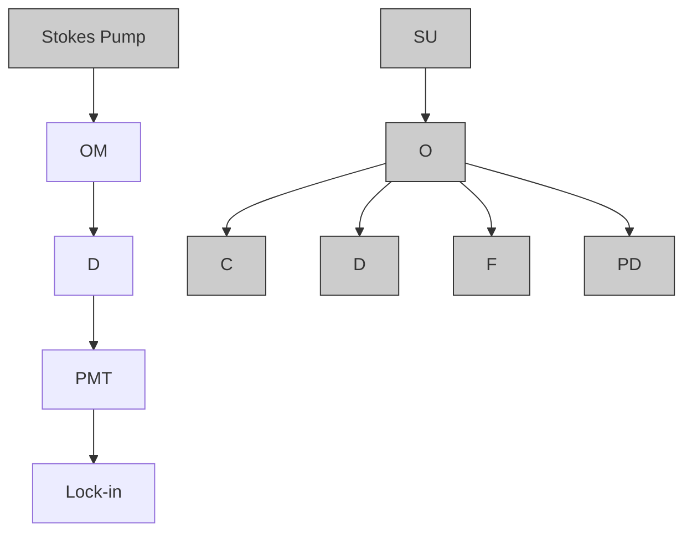

(d)  

energy level diagram

| t | ω₁ | ω₂ | ω₃ |
| --- | --- | --- | --- |
| t=0 | - | - | - |
| t=1 | - | - | - |
| t=2 | - | - | - |
| t=3 | - | - | - |
| t=4 | - | - | - |
| t=5 | - | - | - |
| t=6 | - | - | - |
| t=7 | - | - | - |
| t=8 | - | - | - |
| t=9 | - | - | - |
| t=10 | - | - | - |
| t=11 | - | - | - |
| t=12 | - | - | - |
| t=13 | - | - | - |
| t=14 | - | - | - |
| t=15 | - | - | - |
| t=16 | - | - | - |
| t=17 | - | - | - |
| t=18 | - | - | - |
| t=19 | - | - | - |
| t=20 | - | - | - |
| t=21 | - | - | - |
| t=22 | - | - | - |
| t=23 | - | - | - |
| t=24 | - | - | - |
| t=25 | - | - | - |
| t=26 | - | - | - |
| t=27 | - | - | - |
| t=28 | - | - | - |
| t=29 | - | - | - |
| t=30 | - | - | - |
| t=31 | - | - | - |
| t=32 | - | - | - |
| t=33 | - | - | - |
| t=34 | - | - | - |
| t=35 | - | - | - |
| t=36 | - | - | - |
| t=37 | - | - | - |
| t=38 | - | - | - |
| t=39 | - | - | - |
| t=40 | - | - | - |
| t=41 | - | - | - |
| t=42 | - | - | - |
| t=43 | - | - | - |
| t=44 | - | - | - |
| t=45 | - | - | - |
| t=46 | - | - | - |
| t=47 | - | - | - |
| t=48 | - | - | - |
| t=49 | - | - | - |
| t=50 | - | - | - |
| t=51 | - | - | - |
| t=52 | - | - | - |
| t=53 | - | - | - |
| t=54 | - | - | - |
| t=55 | - | - | - |
| t=56 | - | - | - |
| t=57 | - | - | - |
| t=58 | - | - | - |
| t=59 | - | - | - |
| t=60 | - | - | - |
| t=61 | - | - | - |
| t=62 | - | - | - |
| t=63 | - | - | - |
| t=64 | - | - | - |
| t=65 | - | - | - |
| t=66 | - | - | - |
| t=67 | - | - | - |
| t=68 | - | - | - |
| t=69 | - | - | - |
| t=70 | - | - | - |
| t=71 | - | - | - |
| t=72 | - | - | - |
| t=73 | - | - | - |
| t=74 | - | - | - |
| t=75 | - | - | - |
| t=76 | - | - | - |
| t=77 | - | - | - |
| t=78 | - | - | - |
| t=79 | - | - | - |
| t=80 | - | - | - |

(e)  

text_image

ω
ωp
ω1
ω2
ω3
ωs
t

Fig. 1 Overview of CRS microscopy. a Energy transfer diagram of CRS. b A typical CRS setup. OM optical modulator, D dichroic, SU scanning unit, O objective, C condenser, F flter, PD photodiode, PMT photo-multiplier tube, Lock-in Lock-in amplifer. Hyperspectral CRS by c frequency tuning or pulse shaping, d multiplex, and e spectral focusing

CARS and SRS were first observed back in the 1960s [5, 6], yet the burgeon of CRS for biomedical imaging started in the 2000s with the development of ultrafast lasers. Te frst CARS microscope was reported in 1982 through a non-collinear geometry [7]. In 1999, Xie and coworkers introduced synchronized high-repetitionrate ultrafast laser pairs in a co-propagating and tight focusing geometry [8]. Since CARS signal arises in a new frequency, highly sensitive photodetectors such as photomultiplier tube (PMT) and single-photon avalanche photodiode (SPAD) are used. One major issue with CARS is the non-resonant background, which distorts the CARS spectrum and overwhelms the CARS peak under low concentrations, limiting the chemical specifcity and sensitivity. One route to address the nonresonant background is through analytical post-processing. Vartiainen et. al. pioneered phase retrieval methods based on maximum entropy model to ft and extract Raman line-shapes from raw CARS spectra [9, 10]. Cicerone group developed time-domain Kramers–Kronig (TDKK) [11] for phase retrieval and proved its equivalence with maximum entropy [12]. Experimentally, the non-resonant background can be circumvented by SRS, which directly probes the imaginary part of the Raman susceptibility that matches the spontaneous Raman line shapes. In 2007, a broadband SRS microscope with a 1 kHz laser was developed [13]. Next year, Freudiger et al. reported a high-speed high-sensitivity SRS system based on a high-repetition-rate narrowband laser [14]. In this pioneering work, the SRS signal was detected by modulating one beam and measuring the periodic intensity fuctuations on the other beam through a lock-in amplifer. A high-saturation silicon photodiode (PD) is preferable since the measured SRS signal is a weak modulation over an intense laser feld. Unlike CARS, SRS has spectral line shapes consistent with spontaneous Raman counterparts, and its intensity scales linearly with the molecular concentration, which facilitates the identifcation and quantification of target molecules. Yet, SRS is not completely background-free, as transient absorption, cross-phase modulation, photothermal lensing and twophoton absorption can contribute to the overall modulated signals [15], complicating the analysis of SRS at low molecular concentrations. A typical CRS microscope is illustrated in Fig.  1b, in which synchronized pump and Stokes beams are combined and sent to a laser-scanning microscope. CARS signal is fltered and detected by a PMT, while the SRS signal is detected on the unmodulated probe beam (SRL on the pump is detected in the case of Fig. 1b) via a PD and a lock-in amplifer.

## 1.2 Instrumentation advances toward pushing the physical limits of CRS imaging

In early developments, CRS microscopes employed narrowband lasers to target a single Raman band [14, 16]. Such a single-color scheme can enable high-speed imaging of known species with distinct spectral peaks, such as lipid and myelin in living samples [17, 18]. Yet, its ability to study unknown and spectrally overlapped species is severely limited. To expand the spectral bandwidth, hyperspectral CRS has been developed to generate a spectrum at each pixel. Hyperspectral imaging can be implemented through various instrumentation approaches. One simple way is through wavelength tuning of narrowband laser to obtain CRS images sequentially over a spectral window [19, 20] (Fig.  1c). Yet the imaging speed is limited due to the slow frequency tuning speed of the laser. An alternative approach employs pulse shaping of femtosecond pulses. A mechanical stage [21] or scanning mirror [22] can be used as the pulse shaper, which is faster and more robust compared with laser tuning. Te third scheme is multiplex CRS (Fig. 1d), in which a pair of broadband and narrowband lasers are used to excite all Raman peaks simultaneously. Te signals are then collected by an array detector in a parallel fashion [23–25] to avoid spectral distortion by sample movement. Te last method, termed spectral focusing (Fig.  1e), involves two broadband femtosecond pulses which are both chirped to disperse frequency components in the time domain [26–28]. Likewise, a mechanical delay scanner is used to tune the temporal overlap between the two pulses which translates to the change in the vibrational frequency. Compared with pulse shaping, spectral focusing ofers an advantage in photon efciency as all energies of the femtosecond pulses are used. Another key aspect of a hyperspectral CRS system is the coverage range of the spectral window, which afects the resolving power. To that end, Cicerone and coworkers implemented an ultra-broadband supercontinuum laser source to achieve hyperspectral CARS with 500–3500 cm−1 spectral coverage [29], and its advantage in sophisticated compositional analysis of lipid particles in Caenorhabditis elegans is demonstrated [30] (Fig. 2a). Figueroa et  al. reported a broadband hyperspectral SRS system, which incorporated a fber amplifer on a commercial femtosecond laser system [31], expanding the spectral coverage from 200 to 600 cm−1.

Imaging speed is fundamental in determining whether the microscope can faithfully capture dynamic or highthroughput events. In fact, the development of CRS microscopy is driven by the broad interest in improving the speed of spontaneous Raman microscopy. Using high-speed resonant or polygon mirrors, CRS has achieved video rate with single color [17, 19]. Ultrafast multicolor SRS imaging was reported using laser pulse trains with periodic wavelength switching [32]. To perform high-speed hyperspectral CRS, an additional challenge in high-speed spectral acquisition arises. Ozeki et al. reported a tunable bandpass flter based on a highspeed galvo scanner and demonstrated high throughput compositional imaging of tissue [29] and live cells [33] (Fig.  2b). High-speed hyperspectral SRS has also been implemented in the spectral focusing scheme. Trough the use of galvo [34], resonant [35] or polygon scanners [36] to tune the temporal delay, microsecond-level spectral acquisition speed has been achieved. Ultrafast delay-line tuning is also reported in Fourier-transform CARS (FT-CARS) using polygon [37] or resonant mirror [38]. Changing from a single element detector to an array detector can drastically improve the speed performance. Cheng and coworkers reported multiplexed hyperspectral SRS using a 32-channel tune-amplifer (TAMP) array that achieved 5  µs per spectrum [39] (Fig.  2c). Besides spectral acquisition, such one-dimensional detector arrays have also been used to simultaneously record a line illumination in space, enabling speed-demanding applications such as stimulated Raman imaging fow cytometry [40] and ultrafast imaging of chemical kinetics at two-kilohertz frame rate [41] (Fig.  2d). Further parallelizing the detection to wide feld is challenging due to the insufcient laser power.

Sensitivity is the foundation that defines all aspects of the system performance. Teoretical analysis and experimental validation have demonstrated that CARS and SRS share a similar millimolar sensitivity at microsecond-scale dwell time [42]. For example, based on signals from C-H stretching vibration, a typical CARS system can reach the detection limit of 70 mM (mM) dime thyl sulfoxide (DMSO) at 10 µs pixel dwell time [43] while SRS can reach 21 mM DMSO detection limit at

(a)  

text_image

4
3
5
2
1

line chart

| Wavenumber (cm⁻¹) | ROI 1 | ROI 2 | ROI 3 | ROI 4 | ROI 5 |
| ----------------- | ----- | ----- | ----- | ----- | ----- |
| 700: (I) cholesterol | ~0.01 | ~0.01 | ~0.01 | ~0.01 | ~0.01 |
| 870: (I) C-C | ~0.03 | ~0.02 | ~0.02 | ~0.02 | ~0.02 |
| 1,002: (p) Phe. | ~0.01 | ~0.01 | ~0.01 | ~0.01 | ~0.01 |
| 1,080: (I) C-C | ~0.02 | ~0.03 | ~0.03 | ~0.03 | ~0.03 |
| 1,440 | ~0.18 | ~0.12 | ~0.08 | ~0.06 | ~0.05 |
| 1,640 | ~0.19 | ~0.13 | ~0.10 | ~0.08 | ~0.07 |
| 1,740: (I) C=O | ~0.18 | ~0.14 | ~0.12 | ~0.10 | ~0.09 |
| 1,800 | ~0.05 | ~0.03 | ~0.03 | ~0.02 | ~0.02 |

line chart

| Energy | 2,845: (l) CH₂ sym. str. | 2,925: (p,l) CH₃ sym. str. | 3,010: (l) =CH str. |
| ------ | ------------------------ | -------------------------- | --------------------- |
| 2,800  | ~0.0                     | ~0.0                       | ~0.0                  |
| 2,900  | ~2.5                     | ~1.5                       | ~0.5                  |
| 3,000  | ~1.5                     | ~1.0                       | ~0.5                  |
| 3,100  | ~0.5                     | ~0.5                       | ~0.5                  |

(b)  

stacked bar chart

| Wavenumber (cm⁻¹) | Value |
| ----------------- | ----- |
| 30 μm             | 110 f.p.s. |
| 60 μm             | 4 frames |
| 2,850             | 2,937 |
| 2,910             | 3,050 |
| 2,937             | 2,937 |

(c)  

flowchart

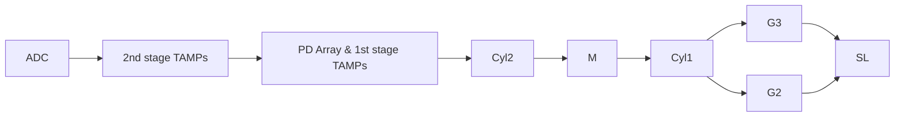

(d)  

text_image

AOD RF inputs:
TD: 0
FD: 62 68 73 78 MHz
AOD diffra. angles (46-ch):
Pump Stokes
1 9 mrad
Pump Stokes
1 23 46
F
316.5 ms 333.0 ms 350.0 ms 366.5 ms 383.5 ms

line chart

| Raman Shift (cm⁻¹) | Flow Intensity |
| ------------------ | -------------- |
| 2900               | 1.8 ms         |
| 2950               | 1.8 ms         |
| 3000               | 1.8 ms         |
| 3050               | 1.8 ms         |
| 3100               | 1.8 ms         |

line chart

| Raman Shift (cm⁻¹) | PS Raman | PS SRS |
| ------------------ | -------- | ------ |
| 2900               | 0.3      | 0.2    |
| 2950               | 0.1      | 0.1    |
| 3000               | 0.0      | 0.0    |
| 3050               | 1.0      | 1.0    |
| 3100               | 0.0      | 0.0    |

Fig. 2 Instrumentation advances toward pushing the physical limits of CRS microscopy. a Ultra-broadband hyperspectral CARS imaging of Caenorhabditis elegans. CARS spectra from fve diferent lipid particle regions are shown in the $6 0 0 { - } 3 1 0 0 \mathrm { c m } ^ { - \mathrm { i } }$ spectral region. Scale bar, 10 μm. b Video-rate 4-color SRS imaging of Euglena gracillis. Chemical maps of lipids, paramylon, chlorophyll and protein nucleic acid are generated. Scale bar, 10 μm. c Multiplex SRS and its application to fow cytometry. A spectrum-time window SRS fow data in 1.8 ms showed 8 PMMA and 5 PS beads. SL slit, G Grating, Cyl cylindrical lens, M mirror. TAMP tuned amplifer. PD photodiode. d Ultrafast stimulated Raman scattering microscopy based on collinear multiple beams. Top inset: AOD input waveform to generate laser combs. Bottom inset, AOD difraction angles and images of the 46-channel laser combs for both beams. Selected frames from 2-kHz label-free imaging of the polymerization process at 3043 $\mathsf { c m } ^ { - 1 }$ are shown. Scale bar, 5 μm. AOD acousto-optic defector, RF radio frequency; TD time domain, FD frequency domain; PA photodiode array, F flter. a–d are adapted from references [30], [33], [39] and [41], respectively

83 us [35], corresponding to a detection limit of 60 mM DMSO under 10 us dwell time. To push the detection limit below millimolar, various schemes have been proposed. Plasmonic enhancement with nanostructures has been reported on both CARS [44] and SRS [45] with single-molecule sensitivity. With minimal requirement on laser powers, plasmonic CARS could be implemented with a wide-feld confguration [46]. Tis opens doors to imaging at unprecedented speeds if combined with stateof-the-art high-speed cameras. Near-field approaches have also been applied to boost the sensitivity of CRS. An atomic force tip can induce local field enhancement and measure CRS-generated changes optically [47] or mechanically [48], achieving a near-single-molecule detection limit. Near field also significantly improves the spatial resolution to \~ 10  nm, enabling the study of fne structures beyond the reach of far-feld optical microscopes. Min et  al. proposed electronic pre-resonance SRS to enhance sensitivity by tuning the excitation wavelength to optimal conditions that both receive electronic resonance enhancement and maintain chemical specifcity [49]. Te scheme has achieved sub-micromolar sensitivity on chromophores. More recently, SRS has been coupled with fuorescence detection to reach singlemolecule sensitivity [50]. With fuorescence detection, far-feld super-resolution SRS has been achieved through stimulated emission depletion [51].

## 1.3 Unmixing of hyperspectral CRS images

CRS has enabled high-speed chemical imaging on biological samples based on intrinsic Raman peaks. However, biological samples are sophisticated microsystems that consist of various metabolites which often have spectral overlaps, especially in the strong yet crowded carbon-hydrogen (CH) region. Tis hinders the quantitation and identification of chemicals in cells and tissues using narrowband single-color CRS. Over the past years, signifcant endeavors have been made to develop hyperspectral CRS that produces a Raman spectrum at each pixel. Hyperspectral image ofers the potential for deciphering the information on chemical compositions and abundance in a complex environment. However, due to the high dimensionality of the raw image, such information is not readily available. Algorithms are required to identify major pure components and decompose concentration maps. Parallel with instrumentation developments in hyperspectral CRS, various hyperspectral image unmixing methods have been reported. Depending on whether prior information is given on the composition of pure components, we categorize them into either supervised or unsupervised methods.

In unsupervised unmixing methods, the algorithm frst performs data mining on the spectral domain to identify pure components. Since the raw spectra are high-dimensional data points and are correlative in many spectral bands, feature extraction and dimension reduction are commonly used. Principal component analysis (PCA) is a widely used dimension reduction method that aims at fnding lower-dimensional orthogonal projections that maximize data variance. An example of PCA for component identifcation is demonstrated in hyperspectral SRS flow cytometry [39]. The authors used a 32-channel resonant tuned amplifier array to record SRS spectra from the samples passing through a fow chamber. Te resulting data was a 2D matrix with a collection of spectra, which was projected by PCA to a lower dimension space for pure components identification using clustering analysis. Spectral phasor [52] is another prevalent dimension reduction method. which takes the real and the imaginary parts of the frst harmonic of the Fouriertransformed spectral data. It transforms the data into a polar coordinate system where the position and width of the original peak correspond to the radius and polar angle, respectively. More importantly, combining two peaks results in a position on a line between the two individual peaks. Te linearity greatly facilitates downstream clustering analysis. Spectral phasor has been widely adopted for fuorescence lifetime imaging [53] and pump-probe micro-spectroscopy [54], where the decay curves are transformed into points falling on a half circle in the phasor domain. Fu et al. reported spectral phasor for hyperspectral SRS image segmentation [55]. Te performance under a sophisticated environment was validated using hyperspectral SRS images of mammalian cells (Fig.  3a–c), facilitating the segmentation of seven subcellular organelles. One limitation of the spectral phasor is the lack of robustness to noise. To address the issue, Zhang et al. introduced Markov Random Field (MRF) to phasor analysis [56]. MRF is a forward term that encourages adjacent pixel correlations of each class to suppress spurious salt-and-pepper noise. Segmentation quality improved by incorporating the prior with the forward model calculating the maximum a posteriori (MAP) estimation of the label maps.

PCA and spectral phasor are dimension reduction tools that enhance features for better identifcation of spectral components. Downstream data segmentation or decomposition algorithms are required to generate label or concentration maps. Alternatively, nonnegative matrix factorization (NMF) aims at directly decomposing the hyperspectral data matrix as the multiplication of two submatrices, including the spectral profles of pure components and the concentration maps. One challenge of NMF is the non-convexity of its inverse problem with two unknowns. Multivariate curve resolution (MCR) solves the problem by performing alternating leastsquares (ALS) ftting on one variable while keeping the other fxed, and vice versa [57] (Fig. 3d). In 2013, Zhang et  al. applied MCR-ALS to hyperspectral SRS analysis and demonstrated unmixing of cancer cell images into lipid, protein/nucleotide and water in the CH region [21]. Because it does not require prior information on chemical components, MCR has been widely adopted for discovery-driven biological research. An example of MCR-ALS analysis of fngerprint SRS imaging on Caenorhabditis elegans is shown in Fig. 3e, f in which four components were distinguished and mapped without prior knowledge [58]. Similar to phasor, MCR does not incorporate information on spatial and spectral feature correlations that could be used as priors to improve algorithm robustness. Lin et al. added neighboring pixel correla tions to both spectral profles and concentration maps

natural_image

Microscopic image of two cellular structures with fluorescent spots, scale bar 10 μm (no text or symbols)

natural_image

Color-coded 3D heat map or density distribution visualization with a yellow rectangular boundary and a magenta arrow pointing to a specific region (no text or symbols present)

natural_image

Fluorescently stained biological cell structure with colored regions (no text or symbols)

(d)  

flowchart

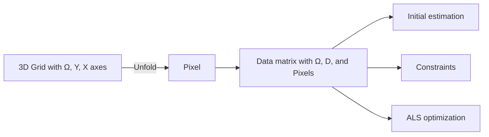

Concentrations

flowchart

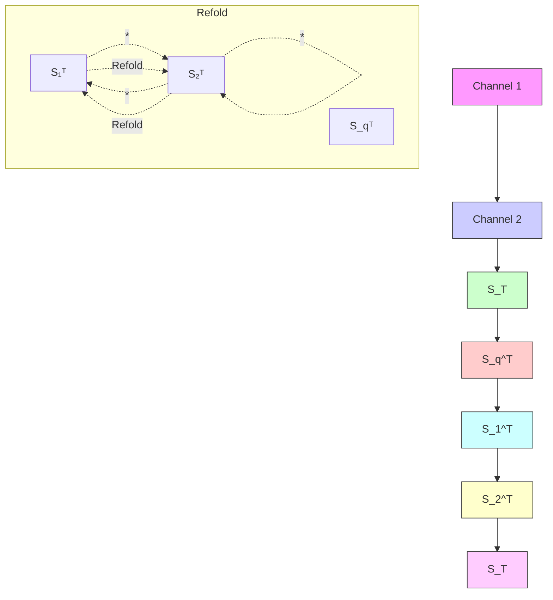

natural_image

Fluorescent microscopy image showing red, green, and purple cellular structures against a dark background (no text or symbols)

natural_image

Fluorescence microscopy images showing green-labeled LROs and pink-labeled oxidized lipids (no text or symbols)

text_image

Fat droplets
Protein

(f)  

line chart

| Raman shift (cm⁻¹) | Oxidized lipids | Fat droplets | LROs | Protein |
| ------------------ | --------------- | ------------ | ---- | ------- |
| 1680               | 2.5             | 2.0          | 1.7  | 0.9     |
| 1740               | 1.5             | 0.5          | 0.3  | 0.2     |
| 1800               | 0.5             | 0.1          | 0.1  | 0.1     |

Fig. 3 Hyperspectral CRS image analysis methods. a Maximum intensity projection of a hyperspectral CH SRS image on mammalian cells. b Phasor plot of the hyperspectral image. Yellow boxes indicate manual segmentation. c Color-coded maps of cellular components based on phasor segmentation. d Flowchart of hyperspectral CRS image unmixing using MCR-ALS. e Concentration maps and f spectra after MCR-ALS analysis of a hyperspectral SRS image on Caenorhabditis elegans in the fngerprint region. LROs, lysosome-related organelles. a–c are from reference [55], d is from reference [21] and e–f are from reference [58]

through generalized Gaussian Markov Random Field (ggMRF) [59]. Tis regularized MCR has achieved better performance under noisy conditions or with missing values. Factorization into Susceptibilities and Concentrations of Chemical Components (FSC3 ) is another NMFbased algorithm for unsupervised quantitative chemical imaging [60]. Developed initially for hyperspectral CARS unmixing, the algorithm is also applicable to SRS with modifcations to pre-processing procedures. $\mathsf { F S C } ^ { 3 }$ solves the optimization of two variables using an Iterative fast block principal pivoting algorithm [61] and adds a physical constraint that ensemble concentrations sum up to one. Te physical constraint enhances downstream quantitation of absolute concentrations. An improved version, weighted FCS3 , was proposed in 2015 [62]. In this work, the authors added weights to emphasize the contribution of spectral errors over random noise and systematic errors at compound aggregated positions. Weighted $\mathrm { F C S } ^ { 3 }$ is advantageous in processing sparse chemical species whose contributions would be overlooked if we use global optimization of the entire image. Ozeki et al. proposed independent component analysis (ICA) [22], another NMF which assumes measured spectral data is a linear summation of independent components with maximum non-Gaussianity. After PCA analysis of the raw hyperspectral data, it operates with principal component images to fnd an unmixing matrix that maximizes the skewness. Each independent component image is then reconstructed to map a pure component.

We have discussed unsupervised methods that decipher the chemical composition of unknown systems. However, even with advances in algorithms, such a task is still inherently challenging, as the output is prone to the infuence of non-resonant background, noise corruption and spectral crosstalk. In some cases, prior information on the chemical composition can be obtained from modalities such as mass spectroscopy and fuorescent labeling. Hyperspectral CRS aims to provide label-free, multiplexed chemical imaging that is not achievable otherwise. With spectral information on pure components, hyperspectral CRS images can be decomposed in a robust and efcient manner. Te simple least-square ftting has been applied to unmix hyperspectral SRS images into chemical maps [20]. However, its performance is limited under high spectral crosstalk or low SNR. Lin et al. addressed the issue by incorporating a pixel-wise l1 norm regularization to promote sparsity on the number of contributing species at each pixel [36]. Such "chemical sparsity" is based on the observation that at each pixel, only a few components have signifcant concentrations.

## 1.4 Computational methods to break the design space trade‑ofs

As said above, instrumentation innovations have pushed CRS imaging to the speed of up to 2  kHz frame rate, spectral coverage of up to $3 5 0 0 \mathrm { c m } ^ { - 1 }$ , and spectral acquisition speed of up to 5 µs per spectrum. However, these conditions cannot be realized simultaneously due to the physical limit determined by the sensitivity limit of CRS. For example, further increasing the speed will deteriorate the setup’s signal-to-noise ratio (SNR), rendering it inapplicable to biomedical applications. Under the constraint of photodamage, this trade-of can be conveyed as a design space—a hyperplane intersecting with three axes representing speed, spectral bandwidth and SNR. Optimization on instrumentation enables the system to reach an optimal condition point on the hyperplane, yet going beyond it remains challenging.

One appealing way to overcome the barrier is through computational methods. In conventional CRS microscopy, the focus is on the design of instruments that generates data. Computational methods go one step further by treating the raw data not as the results but as measurements that can be further processed to provide signals with more desirable information. A typical computational imaging problem can be described as an inverse problem, in which a forward model is used to describe the physical process that generates experimental measurements from signals (e.g., the addition of measurement noise, the modulation from signal to measurement). Inversion of the forward process then yields the desired signals from measurements. When the inversion of the forward model does not yield optimal results, prior models (or regularizations) are incorporated to stabilize the inversion problem. Tese prior models assume certain properties of the signal based on existing knowledge (e.g., image smoothness, signal sparsity, etc.). One straightforward example is denoising [63, 64], which models the noise distribution and adds prior knowledge of spatial correlations to extract signals from noisy measurements. Algorithms can also synergistically guide the design of instrumentation to facilitate reconstruction. Fourier ptychography [65] and structured illumination microscopy [66] are examples that surpass the physical limits of the space-bandwidth product or spatial resolution.

In the following sections, we highlight recent advances in computational CRS imaging. First, we review compressive methods to improve the speed without loss of information by utilizing sparsity in the spatial and spectral domains. We then discuss computational methods for volumetric CRS imaging, including digital holography, computed tomography and spatial frequency encoding. Lastly, we survey applications of deep learning in CRS micro-spectroscopy, including denoising, background removal, chemical label segmentation, etc.

## 2 Compressive CRS micro‑spectroscopy

As CRS is evolving towards high spectral bandwidth and high speed, challenges arise in both system performance and data handling. On the one hand, trade-ofs in the design space inevitably lead to compromises between parameters. On the other hand, data recording and processing becomes overwhelming as frame rate and spectral bandwidth increase. Compressive sensing, a concept in signal processing, is a promising approach to address the issues. Compressive sensing aims at acquiring data below the Nyquist sampling rate while preserving the same information as conventional sampling. Tis is possible because the data is sparse, and measurements are random and dispersed in the sample space [67]. Images are highly sparse signals as the "information $\mathrm { { r a t e } " }$ is often much lower than the raw data bandwidth. Namely, images contain many low spatial frequency signals that can be concisely expressed with a proper transformation (e.g., wavelet transform). Te sparsity condition is even more entrenched for hyperspectral images as spectra also contain highly compressive features such as broad Raman peaks. With fewer sampled points, the system can achieve a higher image speed. Alternatively, each sampled point can share a longer signal integration time which leads to an increased SNR. Due to its nonlinear nature, tight-focusing laser scanning is generally required for CRS, which makes the most prevalent compressive imaging approach (wide-feld spatial random multiplexing single-pixel detection) unviable or underperformed. Terefore, sampling approaches without loss of power density on the sample are required.

Te frst compressive strategy focuses on the spectral domain since random multiplexing in the spectral domain does not confict with the tight-focusing condition. In 2017, Berto et  al. reported a compressive spectral SRS scheme [68]. As shown in Fig. 4a, a narrowband pump and a broadband Stokes were combined and interacted with the sample, generating a spectrum of Raman peaks simultaneously. To record the spectrum with a single photodiode, a digital micromirror device (DMD) was placed after the grating at the collection side. Te DMD served as a programmable spectral flter. A spectrum could either be recorded via conventional raster scan or compressive multiplexing with a Hadamard compressive basis (Fig.  4b). Compressive data reconstruction with l1 norm regularization was implemented for compressive multiplexing measurements. Compared to raster scanning, compressive multiplexing achieved a 30% compression rate with \~ 60% fdelity. Te second compressive CRS was implemented by Takizawa et al. in FT-CARS spectroscopy [69], in which the spectral information was recorded by taking the Fourier transform of a time-domain interferogram. As depicted in Fig.  4c, a resonant mirror was used to scan the temporal delay to generate the interferogram. As a prerequisite for compressive sensing, the reconstructed signal (i.e., the target spectrum) must be sparse. Raman spectra over a broad window (e.g., the whole fngerprint region) are generally sparse since they consist of narrow Raman peaks. Due to the nonlinear scanning speed of the resonant mirror, random measurement was elegantly achieved by temporally uniform sparse sampling below the Nyquist rate.

Reconstruction was implemented using standard compressive sensing algorithms with l1-norm regularization on the signal. Figure 4d demonstrates the results of compressive sensing as compared with interpolation under the same sampling rate and full sampling. At 30% compression rate, compressive sensing maintained high fdelity, free of spurious artifacts as shown in interpolation.

Compressive CRS can also be implemented jointly in the spatial and spectral dimensions. Conventional spatial compressive sensing requires each measurement to be a random multiplexing of the entire feld of view. Tis is challenging for a laser-scanning system like CRS as each spatial measurement can only be contributed from a difraction-limited focal spot. Lin et al. proposed a compressive hyperspectral SRS scheme based on matrix completion [59]. Closely related to compressive sensing, matrix completion claims that a low-rank matrix can recover the complete information from a subset of randomly sampled entries [70]. Hyperspectral images are naturally low-rank matrices since the number of spectral frames is much greater than the number of pure components. More importantly, for the matrix completion problem, each measurement is a single matrix entry instead of random ensembles of the entire view, making it compatible with the laser-scanning scenario. Te authors adopted spectral focusing SRS with a galvo-based delay tuner (Fig. 4e) such that all three axes could be tuned at similar speeds. To achieve random sampling over the entire hyperspectral image stack with microsecond pixel dwell time, a three-dimensional scanning scheme based on a triangular Lissajous trajectory was proposed. Scanning frequencies of the three scanning axes were designed to deviate slightly from each other, achieving a 3D pseudorandom trajectory which randomly sampled across the hyperspectral stack, as shown in Fig. 4f. A model-based matrix factorization algorithm was implemented to decompose the sub-sampled hyperspectral image into the multiplication of two submatrices: pure components spectra and concentration maps. Prior models on both submatrices were added to promote correlations on adjacent entries. As depicted in Fig.  4g, a compression ratio of 20% was achieved on freely moving biological samples, reaching a speed of 0.8 s per hyperspectral stack.

Since compressive CRS primarily involves the spectral domain, having prior knowledge of the spectral

(See fgure on next page.)

Fig. 4 Compressive CRS micro-spectroscopy. a Setup of compressive spectral SRS. b Programmable spectral flter using DMD, which can be either programmed for conventional raster scanning or multiplex compressive sensing using a Hadamard basis. Quantifcation of spectral fdelity between full sampling and compressive sensing at diferent compression rates is shown. c Setup of compressive FT-CARS. d Comparison between compressive sensing, sparse sampling interpolation and fully sampled spectrum. e Setup of compressive hyperspectral SRS based on matrix completion. f Laser scanning and frequency tuning using 3D triangular Lissajous trajectory. Sampled pixels from three spectrally adjacent frames are projected and color-indexed. g Model-based matrix factorization algorithm to decompose sparsely sampled hyperspectral SRS image into concentration maps and spectra of pure components. a–b are from reference [68], c–d are from reference [69] and e–g are from reference [59]

(a)  

flowchart

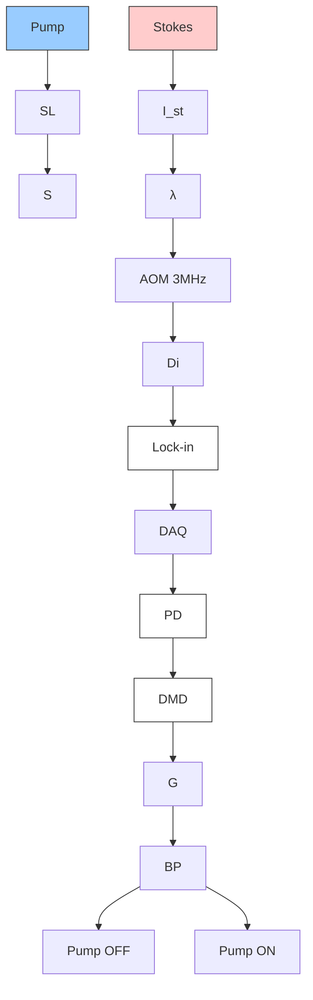

(b)  

text_image

Raster scanning
Multiplex
Shown in the DMD

line chart

| Compression / (m/n) | Fidelity |
| ------------------- | -------- |
| 0.3                 | 0.5      |
| 0.4                 | 0.6      |
| 0.5                 | 0.7      |
| 0.6                 | 0.8      |
| 0.7                 | 0.9      |
| 0.8                 | 0.95     |
| 0.9                 | 0.98     |
| 1.0                 | 1.0      |

(  

flowchart

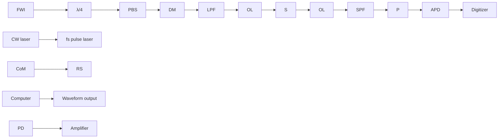

(d)

line chart

| Raman shift [cm⁻¹] | Sparsely sampled spectrum (Compressed sensing) | Sparsely sampled spectrum (Interpolation & NDFT) | Fully sampled spectrum |
| ------------------ | --------------------------------------------- | ----------------------------------------------- | ---------------------- |
| 200                | ~2.2                                          | ~1.2                                            | ~0.0                   |
| 400                | ~2.2                                          | ~1.2                                            | ~0.0                   |
| 600                | ~2.2                                          | ~1.2                                            | ~0.0                   |
| 800                | ~3.0                                          | ~2.0                                            | ~1.0                   |
| 1000               | ~2.5                                          | ~1.5                                            | ~0.5                   |
| 1200               | ~2.2                                          | ~1.2                                            | ~0.0                   |
| 1400               | ~2.2                                          | ~1.2                                            | ~0.0                   |
| 1600               | ~2.2                                          | ~1.2                                            | ~0.0                   |
| 1800               | ~2.2                                          | ~1.2                                            | ~0.0                   |

(e)  

flowchart

(f)  

text_image

Ω
Y
X
→

(g)  

text_image

Ω
= ×

line chart

| Raman shift (cm⁻¹) | Lipid | Cytoplasm | Nucleus | PBS |
| ------------------ | ----- | --------- | ------- | --- |
| 3000               | ~0.2  | ~0.1      | ~0.1    | ~0.1 |
| 2925               | ~0.8  | ~0.4      | ~0.3    | ~0.1 |
| 2850               | ~0.4  | ~0.2      | ~0.1    | ~0.1 |

Fig. 4 (See legend on previous page.)

information can lead to supervised compression schemes that are more robust and efcient. In 2011, Freudiger and coworkers published a spectrally tailored excitationstimulated Raman scattering (STE-SRS) scheme [71]. In this work, a broadband pump beam was spectrally dispersed onto a spatial light modulator (SLM) and was combined with a narrowband Stokes beam to excite all the Raman bands allowed by the SLM. With information on the Raman spectra of all the species, the authors reduced measurements from tens of frames to two for each component. Two SLM patterns were applied to maximize the transmission from target peaks and suppress crosstalks from overlapping components. A similar implementation was reported by Bae et al. with a diferent approach to SLM pattern design and signal recovery [72]. For compressive hyperspectral CARS, a two-step approach was reported by Masia and coworkers [73], where a spatially under-sampled, spectrally fully-sampled image was frst acquired to calculate the sparse spectral bins able to reconstruct the full spectral information. In the second step, spatially fully-sampled images with few spectral frames were acquired, achieving a 25 times speed enhancement. For narrowband CRS systems, each measurement is confned to a certain Raman band. In this case, selective targeting of signifcant peaks can be performed via feature selection algorithms such as the Least Absolute Shrinkage and Selection Operator (LASSO) regression [74].

## 3 Computational volumetric CRS imaging

Similar to multiphoton microscopy, CRS is inherently a nonlinear process with axial sectioning capability. In a standard CRS system, pump and Stokes beams are collinearly focused on the sample as a Gaussian shape and form a planar image through laser raster scanning. For volumetric imaging using such a conventional scheme, one needs to perform axial scanning of either the objective or the sample. Nevertheless, mechanical scanning sufers from high data throughput and low speed, which is unsuitable for large volume or in-vivo 3D imaging. Computational volumetric imaging, such as digital holography [75], light field microscopy [76] and optical diffraction tomography [77] provide scanless 3D information of the sample, but they typically require wide-field illumination, which is detrimental to nonlinear optical processes such as CRS. For SRS, wide field is further undesirable, as existing cameras do not have sufciently high dynamic range and saturation power to detect tiny fuctuations on a strong laser field.

Regardless of the limitations of wide-feld CRS, digital holographic CARS has been reported [78] for 3D imaging. As depicted in Fig.  5a, the authors applied widefeld illumination of the combined pump and Stokes on the sample to generate CARS images at $2 \omega _ { \mathrm { p } } \mathrm { ~ - ~ } \omega _ { \mathrm { S } } .$ . Meanwhile, a reference beam at the same $2 \omega _ { \mathsf { p } } - \omega _ { \mathsf { S } }$ frequency interfered with the CARS signal at the camera plane, creating an of-axis hologram that contains both the amplitude and phase of the complex CARS feld. Te raw hologram was then separated into amplitude and phase in the Fourier domain based on diferences in spatial frequencies. Te phase was then mapped into sample thickness using digital propagation equations. An example of the raw hologram, intensity, phase, and digitally propagated CARS feld at diferent depths for polystyrene microbeads in water are shown in Fig.  5b. Further improvement has been reported for reconstruction of sparse signals, which adopted compressive reconstruction to reduce out-of-focus background [79]. CARS holography enables fast single-shot volumetric imaging without scanning with a large depth of feld. However, the sensitivity and detection depth are incommensurate with laser scanning CRS, which hinders its further applications on biological samples.

An alternative approach to performing volumetric imaging is tomography. By collecting projection images from diferent angles, a 3D volume can be rendered with isotropic spatial resolution. Chen et al. proposed Besselbeam-based volumetric stimulated Raman projection (SRP) tomographic imaging [80]. To extend the collection volume, both pump and Stokes beams were transformed from Gaussian to Bessel shape to maintain focus over an extended range. Using a two-dimensional beam scanner and single-element detector, a projection image was recorded. As depicted in Fig. 5c, with a rotational sample stage, a series of projection images were recorded from diferent incident angles. A fltered back projection algorithm was applied to reconstruct volumetric SRS images with isotropic spatial resolution in all directions. SRP volumetric imaging of a single adipose cell demonstrates its depth-resolving performance and low background level. Te scheme is ideal for studying 3D structures of cells as it provides isotropic spatial resolution. However, due to the need for sample rotation in a capillary glass, it is too cumbersome to perform volumetric imaging on living cells or large tissue samples. Lin et  al. proposed a simplifed approach, tilt-angle stimulated Raman projection tomography (TSRPT) [81], which acquires projection images from diferent azimuth angles by tilting the under-flled incident beams at the back pupil (Fig.  5d). Tilting and scanning were achieved by two scanning mirror pairs, avoiding mechanical movements of the sample. A vector-feld-based back-projection algorithm was applied to reconstruct a volume. Volumetric rendering with four tilting angle projections on PS beads is shown in Fig. 5d. Compared with SRP, the system has higher throughput as it requires fewer projection images.

text_image

(a)
2ωP
ωP
τ
L1
750mm
ωS
L2
150mm
Sample
L3
F
2ωP-ωS
BS
L4
CCD
(b)

(c)  

text_image

Condenser
180°
Objective

(d)  

text_image

Scientific diagram showing a 3D conical structure with coordinate axes and a corresponding 2D spectroscopy image of X-Y and Z-X modes.

(e)  

text_image

(f)
ωp
ωS
sample
Objective
Condenser
ωp
ωS
ωp and ωS on sample:

text_image

SRST
z = 20 µm
100 µm
z = 50 µm
100 µm
z = 80 µm
100 µm
z = 110 µm
100 µm
Conventional SRS
z = 20 µm
100 µm
z = 50 µm
100 µm
z = 80 µm
100 µm
z = 110 µm
100 µm

Fig. 5 Computational volumetric CRS imaging. a Setup of wide-feld CARS holography. b From top left to bottom right, raw CARS hologram, amplitude, phase and digitally propagated CARS feld at three diferent depths (z 7.92 µm, 2.92 µm and -15.6 µm) of polystyrene microbeads in water. c Schematic of stimulated Raman projection (SRP) tomography with a rotational stage. SRP volumetric imaging of a single adipose cell is demonstrated. d tilt-angle stimulated Raman projection tomography (TSRPT). Tilt-angle beams incident at four diferent angles are focused by the objective. Volumetric reconstruction from four tilt-angle SRS projection images of PS beads is shown. e Principles of stimulated Raman scattering tomography (SRST) with frequency encoding. f SRST and conventional SRS imaging of mouse ear skin at diferent depth sections are illustrated. a, b are from reference [78], c, d are from references [80] and [81], respectively, e, f are from reference [85]

However, the limited projection angle reduces the axial resolution and creates missing-cone issues.

In projection tomography, the purpose of sample rotation or beam tilting is to decode depth information from individual projection angles. Alternatively, such an encoding–decoding process can be performed in the frequency domain. Frequency domain encoding has been reported to capture spectral information in SRS without a spectrometer [82, 83]. Spatial frequency modulation was also used to record lateral line-scan profiles in

CARS with a single detector [84]. In a recent work by Li et al. [85], spatial frequency encoding was performed in the axial direction to achieve high-speed volumetric SRS imaging. As in Fig.  5e, the authors engineered the Stokes to Bessel beam to extend the imaging volume. Meanwhile, the pump was modulated by an SLM to form Bessel "light beads" with diferent beating frequencies. By varying the spatial frequency to record a series of projection images using laser scanning and a single detector, a depth-resolved SRS image was reconstructed using a robust inverse fast Fourier transform. A comparison between conventional SRS and the new scheme is shown in Fig.  5f. Owning to the self-reconstructing nature of Bessel beams, a two-fold enhancement in imaging depth is achieved. Like TSRPT, the system is free of sample rotation, making it accessible for live cell and tissue imaging.

## 4 Deep‑learning CRS microscopy

For computational imaging schemes, it is essential to establish the forward model of the system and develop algorithms to solve the inverse problems for reconstruction. However, characterizing the forward model operation matrix is both labor-intensive and prone to system perturbations. Plus, the inverse problems are often illposed with multiple solutions, requiring additional regularization terms based on assumptions of the underlying images, such as smoothness or sparsity. Deep learning is a revolutionary method that can directly learn to perform sophisticated tasks on image reconstruction using adequately annotated training data [86]. Knowledge of the specifc tasks and properties of the data are embedded in the training of a multi-layered neural network, with minimal requirements for the human design of the system. Deep learning has been widely used in optical microscopy, such as image denoising [87], cross-modality image transformations [88], fuorescence prediction from transmission images [89, 90], image-based cell profling [91, 92], speed enhancement [93] and PSF engineering [94] in super-resolution localization microscopy. In this section, we focus on CRS and discuss various deep learning applications that either improve the fundamental performance of CRS or strengthen the downstream CRS image analysis.

Denoising is an image restoration procedure that aims at decoupling noise from an image to enhance signal fidelity. Statistical denoising methods, such as total variation [95], block-matching 3D fltering [63], non-local means [64], solve the problem by modeling noise distribution and signal structure. However, the models are not universal in diferent scenarios, and tedious hyperparameters tuning is often necessary. In CRS microscopy, system noise is mainly contributed by laser noise, electronic noise and shot noise. Laser noise follows a 1/f trend and can be minimized through modulating at a higher frequency in SRS. Electronic noise, i.e., Johnson-Nyquist noise, is related to the input impedance and is irrelevant to laser power. Te third and major source of noise is the shot noise which is proportional to the square root of the input laser power. It statistically follows Poisson distribution but can be approximated by Gaussian at high laser power conditions. For denoising a hyperspectral CRS image, one needs to further consider diferent noise levels of spectral frames due to inhomogeneous laser powers. Treatment for this problem was demonstrated by Liao et al., in which a spectrally varying total-variation denoiser frst estimated noise levels at all frames and then performed total variation minimization [96]. Deep learning has shown the potential in denoising microscopic images of various modalities, outperforming traditional denoising algorithms [87]. Several research groups have reported using deep learning to recover the SNR of CRS images in diferent contexts. Using the same U-Net structure as in ref [87], Manifold et al. demonstrated the denoising of 2D SRS images of cells and tissues under low exposure powers [97]. CNN denoising of 2D endoscopic CARS images has been reported by Yamato and coworkers [98]. As illustrated in Fig.  6a, Lin et at. reported a Spatial-Spectral Residual Net (SS-ResNet) for denoising of hyperspectral images [36] and developed a downstream hyperspectral image unmixing scheme. Inspired by work in the video-processing community [99], the authors implemented a pseudo-3D convolution kernel using the combination of a 2D spatial and a 1D spectral kernel. Because SS-ResNet has a smaller model size compared to 3D CNN, a very deep network can be implemented to enhance the denoising performance. With an ultrafast hyperspectral SRS setup, the authors achieved high-speed hyperspectral SRS in the fngerprint region. After denoising, the image fdelity on spatial and spectral dimensions was validated by spectral unmixing the hyperspectral images into three chemical maps (Fig.  6b). Abdolghader et  al. treated hyperspectral SRS images as a collection of spectra that can be processed by a convolutional autoencoder with 1D kernels [100]. Using noisy images as both input and output, unsupervised image denoising was reported but with a sacrifce in spectral fdelity. Te authors further applied a k-means clustering algorithm after denoising to yield chemical segmentation maps in an automatic and unsupervised manner. Denoising of hyperspectral CARS images with a 1D spectral network has also been achieved [101] for high-speed fngerprint CARS imaging.

As a high-speed label-free chemical imaging scheme that operates under ambient light, SRS has emerged as a promising candidate for real-time intraoperative histopathology [102]. However, performing real-time decision-making with SRS is a challenging task for pathologists due to the following challenges. First, the histoarchitectural contrast in SRS originates from intrinsic Raman peaks of the tissue, which difers from conventional hematoxylin-and-eosin (H&E) staining contrast familiarized by pathologists. Second, the high volume of SRS images during surgery can overwhelm the pathologists during operation, making it challenging to provide intraoperative consultation. Supervised methods for medical image segmentation and classif cation are efective tools to alleviate human labor. Traditional statistical classifers can automatically fnd the optimal decision boundary in the high-dimensional feature space. Yet, extraction of discriminative features from medical images requires input from experienced researchers, which lacks robustness for intraoperative decision-making. Deep learning is an ideal solution for robust biomedical image segmentation [103], as feature extraction is implemented automatically during the learning process. SRS histology has been closely integrated with deep learning over the past years. In 2017, Orringer et al. reported a portable fber-laser-based SRS microscope for intraoperative imaging of unprocessed surgical brain tumor specimens [104]. Te setup generates 2-color SRS images $( 2 8 5 0 \ \mathrm { c m } ^ { - 1 } \ \& \ 2 9 3 0 { - } 2 8 5 0 \ \mathrm { c m } ^ { - 1 } )$ that simulate the contrast of H&E staining. A multi-layer perceptron was used for classifying SRS images into nonlesional, low-grade glial, high-grade glial, or non-glial tumors. Te performance was validated through leaveone-out cross-validation. Te classifer achieved 100% accuracy in distinguishing lesional from non-lesional and 90% in diferentiating glial from non-glial among lesional specimens. In 2020, with the same portable SRS histology setup for intraoperative brain tumor diagnosis, the authors applied CNN for the prediction and achieved 94.6% overall accuracy, which is comparable to pathologist-based interpretation using conventional H&E staining [105]. Zhang et al. reported two-color SRS $( 2 8 5 0 ~ \mathrm { c m } ^ { - 1 } + 2 9 3 0 ~ \mathrm { c m } ^ { - 1 } )$ to highlight protein and lipid and added second harmonic generation (SHG) to reveal collagen [106]. As demonstrated in Fig.  6c, a residual network with a CNN kernel was trained to identify neoplastic regions from normal regions with the three-color SRS histology images. Figure  6d illustrates SRS histology imaging of laryngeal SCC tissue and normal tissue, followed by the network prediction on either neoplastic (red) or normal (grey). An accuracy of 90% was achieved on the dataset, and further testing on 33 independent specimens yielded near-perfect diagnostic concordance between SRS-based prediction and standard histology readings. Deep learning segmentation of SRS images also facilitated discovery-driven biomedical research.

(a)  
1. Acquiring training data  

flowchart

3. Prediction  

text_image

ω₁
ωₙ
x̂ = gθ(y')
ω₁
ωₙ

2. Training  

flowchart

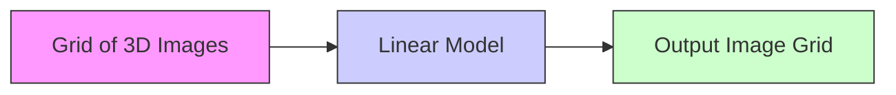

4. Chemical mapping  

text_image

ω₁
ωₙ
C₃
C₂
C₁
×
Int. (a.u.)
Raman shift (cm⁻¹)
S₁
S₂
S₃

(b  

text_image

1650 cm⁻¹
Raw
SS-ResNet
GT

line chart

| Raman shift (cm⁻¹) | Triglyceride | Cholesterol | BSA |
| ------------------ | ------------ | ----------- | --- |
| 1600               | 0.0          | 0.0         | 0.0 |
| 1650               | 1.0          | 0.8         | 0.8 |
| 1700               | 0.1          | 0.1         | 0.1 |
| 1750               | 0.0          | 0.0         | 0.0 |

text_image

Protein
Cholesterol
Fatty acid
Raw
SS-ResNet
GT

(c)  

flowchart

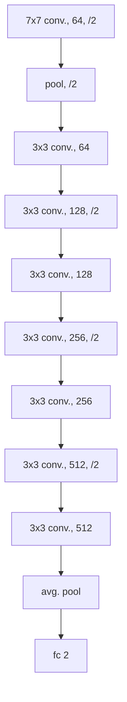

line chart

| Dataset | Training Loss | Validation Loss |
|---------|---------------|-----------------|
| Training | 0.128 ± 0.014 | 0.959 ± 0.004   |

(d)

heatmap

| Category | Normal (%) | Neoplastic (%) |
| -------- | ---------- | -------------- |
| 75/81    | 92.6       | -              |
| 3/81     | 3.7        | -              |

Fig. 6 Deep learning for CRS image denoising and segmentation. a Principles of SS-ResNet image restoration and spectral unmixing. GT, ground truth. b Comparison between raw, SS-ResNet denoising and GT. The hyperspectral images are decomposed into chemical maps of protein, cholesterol and fatty acid. Scale bars, 20 µm. c Structure and workfow of training and validation of ResNet34 for the segmentation of SRS histology images. d SRS histological images of neoplastic (top) and normal (bottom) larynx tissue and the network classifcation results. a, b are from reference [36] and c, d are from reference [106]

Feizpour et. al. reported visualization of drug uptake in the skin with SRS and deep-learning-based image segmentation [107]. Parallel with SRS, deep learning for classifcation and clinical decision-making has been combined with CARS. Broadband CARS spectral classifcation has been reported by Manescu et. al. using a tandem artifcial neural network with a decision rule model [108]. Te rule assumes each target class is a linear combination of input spectra, achieving high prediction accuracy with interpretable results. Diagnosis of cervical cancer using single-color CARS microscopic images of pap smears of patient samples has been demonstrated with CNN [109]. A cross-validation with Raman microspectroscopy classifcation was performed, demonstrating the high prediction accuracy of the method. Weng et al. applied transfer learning on a pretrained CNN using CARS images of lung cancer for automated diferential diagnosis, achieving 89.2% accuracy in identifying normal and cancerous tissue [110].

Deep learning has also been used for CARS non-resonant background removal. In CARS micro-spectroscopy, one major drawback is the dispersive line shape due to the interference between the resonant and non-resonant components of $\chi ^ { ( 3 ) } { } _ { ; }$ , leading to a peak shift and a dip at higher wavenumbers. As mentioned earlier, numerical phase retrieval algorithms have been developed to extract Raman line shapes from raw CARS spectra, including time-domain Kramers–Kronig (TDKK) transform [11] and maximum entropy method (MEM) [9, 10]. However, they require knowledge of the non-resonant background which needs separate measurements, and the computation speed is insufficient for applications with real-time display requirements. Several groups reported deep learning phase retrieval [111–113]. Figure 7a demonstrates an example where a 1D network for CARS non-resonant background removal was used. Successful training could be achieved through simulated CARS spectra owing to the robust generalizability of neural networks. Deep-learning-based background removal is advantageous in that it requires no experimental measurement of the non-resonant background and has a fast processing speed of milliseconds. A similar approach has also been demonstrated to remove cross-phase modulation background in spectroscopic SRS [114] using the peak width diferences between the Raman band and the background.

Besides outperforming traditional algorithms in areas such as image segmentation and denoising, deep learning can tackle problems where analytical modeling is impossible due to our limited perception of underlying physical processes. Examples include the prediction of fluorescent labels from a stack of bright-field transmission images [89, 90], super-resolution localization image

(a)  

flowchart

line chart

| Normalized frequency ν̂ | ŷ pred. Im(χ_R^(3)) Intensity [A.U.] | y true Im(χ_R^(3)) Intensity [A.U.] | x simulated input Intensity [A.U.] |
| ---------------------- | ------------------------------------- | ------------------------------------ | ---------------------------------- |
| 0.0                    | ~2.0                                  | ~1.0                                 | ~0.0                               |
| 0.5                    | ~2.4                                  | ~1.5                                 | ~0.4                               |
| 1.0                    | ~2.0                                  | ~1.0                                 | ~0.0                               |

(  

flowchart

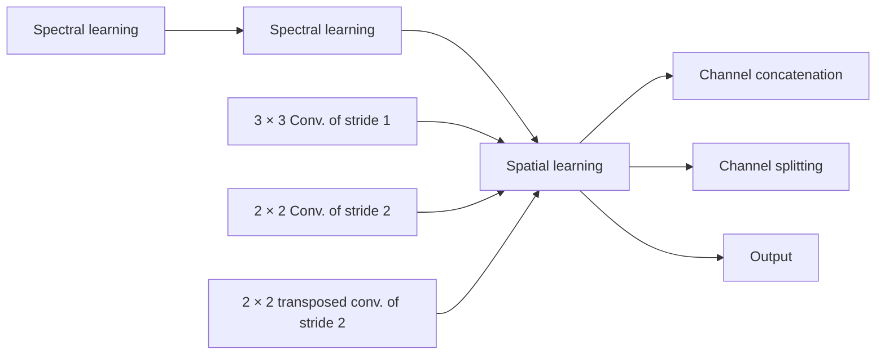

(c)  

natural_image

Fluorescence microscopy images of cells with different staining intensities (orange, cyan, green, magenta), showing cellular structures without any text or symbols.

(d)  

flowchart

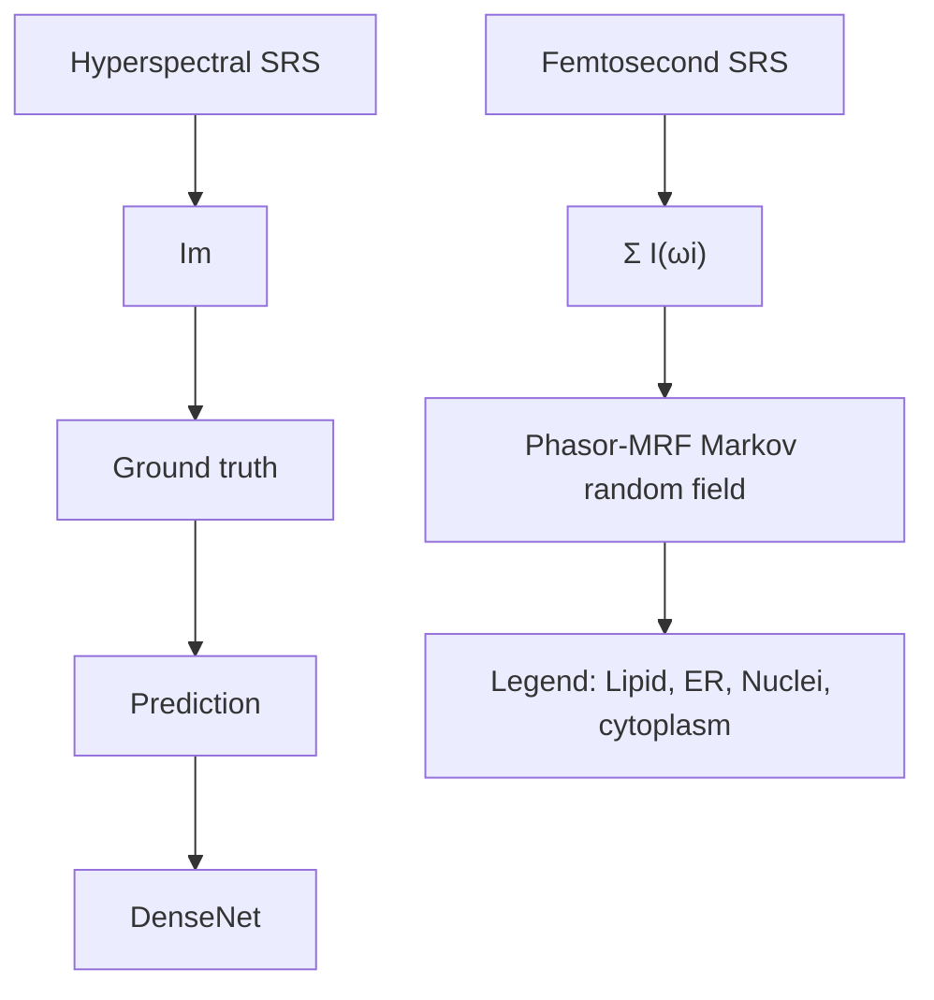

(e)  

flowchart

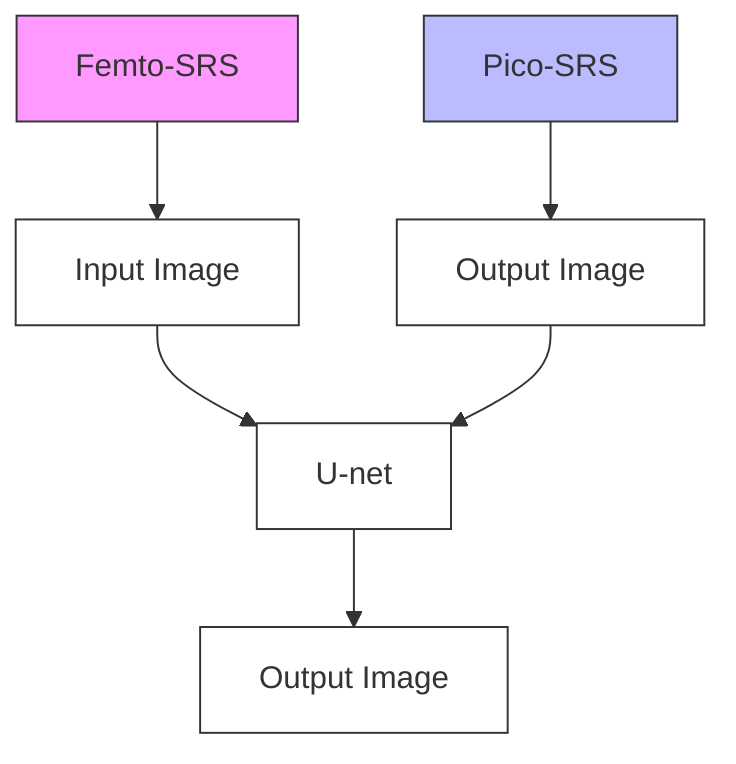

Fig. 7 Deep learning for CRS-specifc applications. a A 1D neural network for non-resonant CARS background removal. Examples of simulated raw CARS spectra (blue), true $\mathsf { I m } ( \mathsf { X } _ { \mathsf { R } } ^ { \mathsf { ^ { * } ( 3 ) } } )$ (green) and network-predicted $\mathsf { I m } ( \mathsf { X _ { R } } ^ { ( 3 ) } )$ (red) are shown. CL convolutional layers, FC fully connected layers. b Schematic of the U-within-U network. c Left, hyperspectral SRS image (maximum intensity projection) of an unlabeled live lung cancer cell. Right top row, network predicted fuorescence labels of nuclei, mitochondria and endoplasmic reticulum. Right bottom row, fuorescence images after staining. Scale bar, 25 μm. d Schematic of single-shot femtosecond SRS mapping of intracellular organelles using deep learning. Orange arrows indicate training set generation, green arrows represent training validation, and blue arrows stand for testing. (e) Illustration of U-net prediction of two-color picosecond SRS images $( 2 8 4 5 8 2 9 3 0 0 ^ { - 1 } )$ using single-shot femtosecond SRS. Example prediction results on gastric tissue are shown. Scale bars, 50 µm. a is from reference [112], panels b, c are from reference [116], d is from reference [56] and e is from reference [118]

prediction using wide-feld fuorescent images [93] and fusion of low and high-resolution images to break the space-bandwidth-product [115]. Manifold et  al. proposed using hyperspectral SRS images to generate fuorescent-labeled images [116]. A U-within-U network was developed for hyperspectral image processing to produce label-free multiplexed fuorescent images without physical constraints on fuorescent emission overlap (Fig. $7 \mathrm { b } , \mathrm { c } )$ . Zhang et al. reported using deep learning to map intracellular organelles using single-shot femtosecond SRS images [56]. As shown in Fig. 7d, in femtosecond SRS, since both pump and Stokes are broadband lasers, the chemical contrast in one single shot is contributed by all Raman bands in the spectral window. Due to the variation in chemical composition, major intracellular organelles such as lipids, nuclei and cytoplasm exhibit intensity diferences. Together with morphological signatures, segmentation of organelles can be achieved with femtosecond SRS despite the lack of spectral profles. Nevertheless, the task is challenging for analytical segmentation algorithms since extensive feature selection is required to utilize spatial and intensity signatures for optimizing the performance. In this work, a neural network with DenseNet [117] structure was applied for segmentation. To obtain training data, the authors used spectral-focusing-based hyperspectral SRS imaging on the target samples. On the one hand, simulated femtosecond SRS was generated through the summation of the stack along the spectral dimension. On the other hand, organelle maps were calculated through phasor analysis of the hyperspectral data. A trained network successfully mapped organelle maps of lipid, nucleus, cytoplasm and endoplasmic reticulum (ER) with femtosecond SRS, which enabled high-speed imaging of lipid motility and lipid-ER interaction. Similarly, Liu et al. used single-shot femtosecond SRS images as input to train a U-Net generating two-color picosecond SRS images at 2845 and 2930  cm−1 (Fig.  7e) [118]. Another diagnostic network was used in conjunction with the chemical mapping network to provide instant diagnosis of gastroscopic biopsy with > 96% accuracy.

## 5 Outlook

In this review, as summarized in Table 1, we have introduced various computational methods that have been used to push the boundary of CRS chemical microscopy in the aspects of compressive sensing, volumetric imaging, denoising, segmentation and others. Meanwhile, one needs to pay attention to the applicable range of computational algorithms to avoid erroneous interpretations of the measurements. For conventional statistical computational imaging, it is crucial to evaluate whether the forward model can appropriately describe the underlying physical process. Tis involves the statistical distribution of measurement noise, the image convolution kernel of the imaging system, etc. Rigorous experiments should be taken to characterize the forward model and calibrate model parameters. When prior models/regularizations are used, a comprehensive understanding of the signal is necessary. For example, whether the signal is sparse, whether the signal is smooth, etc. Hyperparameter tuning for the prior models is crucial for yielding correct results and may require iterative updates and validations. For deep learning applications, although the task of sophisticated modeling on the inverse problem is alleviated, an appropriate selection of network structures and sufciently large training and validation datasets are necessary.

Looking into the future, we expect instrumentation advances will continue to increase the data throughput on temporal, spatial and spectral dimensions, which provides more features on data structures such as sparsity and correlation. Meanwhile, new computational methods can be harnessed to break the design space trade-ofs and provide enriched chemical compositions for biomedical research. With rapid advances in computational optical microscopy, we expect more ideas to infltrate CRS. However, since most computational methods focus on wide-field implementations, the translation into CRS microscopy is nontrivial. Extensive modeling, system design and algorithm development need to be performed to ensure applicability to CRS imaging. In the future, with improvements in detection sensitivity, computational methods will play an even more important role as existing methods remain viable to boost the newly established design space, and new methods may arise to achieve breakthroughs in aspects such as feld of view, imaging depth, and spatial resolution.

Table 1 Summary of computational CRS methods

<table><tr><td>CRS methods Algorithms</td><td>SRS</td><td>CARS/FT-CARS</td></tr><tr><td>Compressive sensing</td><td>Berto [68]</td><td>Takizawa [69]</td></tr><tr><td>Matrix completion</td><td>Lin [59]</td><td></td></tr><tr><td>Supervised spectral sub-sampling</td><td>Freudiger [71], Bae [72], Pence [74]</td><td>Masia [73]</td></tr><tr><td>Digital holography</td><td></td><td>Shi [78], Cocking [79]</td></tr><tr><td>Projection tomography</td><td>Chen [80], Lin [81], Gong [85]</td><td></td></tr><tr><td>Deep learning denoising</td><td>Manifold [97], Lin [36], Abdolghader [100]</td><td>Yamato [98], Vernuccio [101]</td></tr><tr><td>Deep learning segmentation &amp; Clinical decision making</td><td>Orringer [104], Hollon [105], Zhang [106], Feizpour [107]</td><td>Manuscu [108], Aljakouch [109], Weng [110]</td></tr><tr><td>Deep learning background removal</td><td>Bresci [114]</td><td>Houhou [111], Valensise [112], Wang [113]</td></tr><tr><td>Deep learning chemical maps prediction</td><td>Zhang [56], Liu [118], Manifold [115]</td><td></td></tr></table>

## Acknowledgements

Not applicable.

## Author contributions

HL and JXC conceived the topic. HL wrote the manuscript with input from JXC. Both authors read and approved the fnal manuscript.

## Funding

NIH R35GM136223 and R01EB032391 to J.X.C.

## Availability of data and materials

Not applicable.

## Declarations

## Competing interests

The authors claim no conficts of interest.

Received: 17 September 2022 Revised: 8 November 2022 Accepted: 1

December 2022

Published online: 20 March 2023

## References

1. C.V. Raman, K.S. Krishnan, A new type of secondary radiation. Nature 121, 501–502 (1928)  
2. R.W. Boyd, Nonlinear optics (Academic press, Cambridge, 2020)  
3. J.-X. Cheng, X.S. Xie, Coherent Raman scattering microscopy (CRC Press, Boca Raton, 2016)  
4. J.-X. Cheng, W. Min, Y. Ozeki, D. Polli, Stimulated Raman scattering micros copy: techniques and applications (Elsevier, Amsterdam, 2021)  
5. R. Terhune, P. Maker, C. Savage, Measurements of nonlinear light scatter ing. Phys. Rev. Lett. 14, 681 (1965)  
6. E. Woodbury, W. Ng, Ruby laser operation in near IR. Proc. Inst. Radio Eng. 50, 2367–3000 (1962)  
7. M.D. Duncan, J. Reintjes, T.J. Manuccia, Scanning coherent anti-stokes raman microscope. Opt. Lett. 7, 350–352 (1982)  
8. A. Zumbusch, G.R. Holtom, X.S. Xie, Three-dimensional vibrational imaging by coherent anti-Stokes Raman scattering. Phys. Rev. Lett. 82, 4142–4145 (1999)  
9. E.M. Vartiainen, Phase retrieval approach for coherent anti-Stokes Raman scattering spectrum analysis. J. Opt. Soc. Am. B 9, 1209–1214 (1992)  
10. E.M. Vartiainen, H.A. Rinia, M. Muller, M. Bonn, Direct extraction of Raman line-shapes from congested CARS spectra. Opt. Express 14, 3622–3630 (2006)  
11. Y.X. Liu, Y.J. Lee, M.T. Cicerone, Broadband CARS spectral phase retrieval using a time-domain Kramers-Kronig transform. Opt. Lett. 34, 1363–1365 (2009)  
12. M.T. Cicerone, K.A. Aamer, Y.J. Lee, E. Vartiainen, Maximum entropy and time-domain Kramers-Kronig phase retrieval approaches are functionally equivalent for CARS microspectroscopy. J. Raman Spectrosc. 43, 637–643 (2012)  
13. E. Ploetz, S. Laimgruber, S. Berner, W. Zinth, P. Gilch, Femtosecond stimu lated Raman microscopy. Appl. Phys. B 87, 389–393 (2007)  
14. C.W. Freudiger et al., Label-free biomedical imaging with high sensitivity by stimulated raman scattering microscopy. Science 322 1857–1861 (2008)  
15. D.L. Zhang, M.N. Slipchenko, D.E. Leaird, A.M. Weiner, J.X. Cheng, Spectrally modulated stimulated Raman scattering imaging with an angleto-wavelength pulse shaper. Opt. Express 21, 13864–13874 (2013)  
16. J.-X. Cheng, L.D. Book, X.S. Xie, Polarization coherent anti-Stokes Raman scattering microscopy. Opt. Lett. 26, 1341–1343 (2001)  
17. B.G. Saar et al., Video-rate molecular imaging in vivo with stimulated raman scattering. Science 330, 1368–1370 (2010)  
18. H.F. Wang, Y. Fu, P. Zickmund, R.Y. Shi, J.X. Cheng, Coherent anti-stokes Raman scattering imaging of axonal myelin in live spinal tissues. Biophys. J. 89, 581–591 (2005)  
19. C.L. Evans et al., Chemical imaging of tissue in vivo with video-rate coherent anti-Stokes Raman scattering microscopy. Proc. Natl. Acad. Sci USA 102, 16807–16812 (2005)  
20. F.K. Lu et al., Label-free DNA imaging in vivo with stimulated Raman scattering microscopy. Proc. Natl. Acad. Sci. USA 112, 11624–11629 (2015)  
21. D.L. Zhang et al., Quantitative vibrational imaging by hyperspectral stimulated raman scattering microscopy and multivariate curve resolution analysis. Anal. Chem. 85, 98–106 (2013)  
22. Y. Ozeki et al., High-speed molecular spectral imaging of tissue with stimulated Raman scattering. Nat. Photonics 6, 844–850 (2012)  
23. J.X. Cheng, A. Volkmer, L.D. Book, X.S. Xie, Multiplex coherent anti-stokes Raman scattering microspectroscopy and study of lipid vesicles. J. Phys. Chem. B 106, 8493–8498 (2002)  
24. K. Seto, Y. Okuda, E. Tokunaga, T. Kobayashi, Development of a multiplex stimulated Raman microscope for spectral imaging through multichannel lock-in detection. Rev. Sci. Instrum. 84, 083705 (2013)  
25. C.S. Liao et al., Microsecond scale vibrational spectroscopic imaging by multiplex stimulated Raman scattering microscopy. Light Sci. Appl. 4, e265 (2015)  
26. T. Hellerer, A.M.K. Enejder, A. Zumbusch, Spectral focusing: high spectra resolution spectroscopy with broad-bandwidth laser pulses. Appl. Phys. Lett. 85, 25–27 (2004)  
27. D. Fu, G. Holtom, C. Freudiger, X. Zhang, X.S. Xie, Hyperspectral imaging with stimulated raman scattering by chirped femtosecond lasers. J. Phys. Chem. B 117, 4634–4640 (2013)  
28. E.R. Andresen, P. Berto, H. Rigneault, Stimulated Raman scattering microscopy by spectral focusing and fber-generated soliton as Stokes pulse. Opt. Lett. 36, 2387–2389 (2011)  
29. C.H. Camp et al., High-speed coherent Raman fngerprint imaging of biological tissues. Nat. Photonics 8, 627–634 (2014)  
30. W.W. Chen et al., Spectroscopic coherent Raman imaging of Caenorhabditis elegans reveals lipid particle diversity. Nat. Chem. Biol. 16, 1087–1095 (2020)  
31. B. Figueroa et al., Broadband hyperspectral stimulated Raman scattering microscopy with a parabolic fber amplifer source. Biomed. Opt. Express 9, 6116–6131 (2018)  
32. Y. Suzuki et al., Label-free chemical imaging fow cytometry by highspeed multicolor stimulated Raman scattering. Proc. Natl. Acad. Sci. USA 116, 15842–15848 (2019)  
33. Y. Wakisaka et al., Probing the metabolic heterogeneity of live Euglena gracilis with stimulated Raman scattering microscopy. Nat. Microbiol. 1, 16124 (2016)  
34. R.Y. He et al., Stimulated Raman scattering microscopy and spectros copy with a rapid scanning optical delay line. Opt. Lett. 42, 659–662 (2017)  
35. C.S. Liao et al., Stimulated Raman spectroscopic imaging by microsecond delay-line tuning. Optica 3, 1377–1380 (2016)  
36. H.N. Lin et al., Microsecond fngerprint stimulated Raman spectroscopic imaging by ultrafast tuning and spatial-spectral learning. Nat. Commun. 12, 1–2 (2021)  
37. M. Tamamitsu et al., Ultrafast broadband Fourier-transform CARS spectroscopy at 50,000 spectra/s enabled by a scanning Fourier-domain delay line. Vib. Spectrosc. 91, 163–169 (2017)  
38. K. Hiramatsu et al., High-throughput label-free molecular fngerprinting fow cytometry. Sci. Adv. (2019). https://doi.org/10.1126/sciadv.aau0241  
39. C. Zhang et al., Stimulated Raman scattering fow cytometry for label free single-particle analysis. Optica 4, 103–109 (2017)  
40. N. Nitta et al., Raman image-activated cell sorting. Nat. Commun. 11, 1–6 (2020)  
41. H.Z. Li et al., Imaging chemical kinetics of radical polymerization with an ultrafast coherent Raman microscope. Adv. Sci. 7, 1903644 (2020)  
42. Y. Ozeki, F. Dake, S. Kajiyama, K. Fukui, K. Itoh, Analysis and experimenta assessment of the sensitivity of stimulated Raman scattering microscopy. Opt. Express 17, 3651–3658 (2009)  
43. W.L. Hong et al., In situ detection of a single bacterium in complex envi ronment by hyperspectral CARS imaging. ChemistrySelect 1, 513–517 (2016)  
44. S. Yampolsky et al., Seeing a single molecule vibrate through time resolved coherent anti-Stokes Raman scattering. Nat. Photonics 8, 650–656 (2014)  
45. C. Zong et al., Plasmon-enhanced stimulated Raman scattering micros copy with single-molecule detection sensitivity. Nat. Commun. 10, 1 (2019)  
46. C. Zong et al., Wide-feld surface-enhanced coherent anti-Stokes Raman scattering microscopy. ACS Photonics 9, 1042–1049 (2022)  
47. H.K. Wickramasinghe, M. Chaigneau, R. Yasukuni, G. Picardi, R. Ossiko vski, Billion-fold increase in tip-enhanced Raman signal. ACS Nano 8, 3421–3426 (2014)  
48. I. Rajapaksa, H.K. Wickramasinghe, Raman spectroscopy and micros copy based on mechanical force detection. Appl. Phys. Lett. 99, 161103 (2011)  
49. L. Wei, W. Min, Electronic preresonance stimulated Raman scattering microscopy. J. Phys. Chem. Lett. 9, 4294–4301 (2018)  
50. H.Q. Xiong et al., Stimulated Raman excited fuorescence spectroscopy and imaging. Nat. Photonics 13, 412 (2019)  
51. H.Q. Xiong et al., Super-resolution vibrational microscopy by stimulated Raman excited fuorescence. Light Sci. Appl. 10, 1 (2021)  
52. F. Fereidouni, A.N. Bader, H.C. Gerritsen, Spectral phasor analysis allows rapid and reliable unmixing of fuorescence microscopy spectral images. Opt. Express 20, 12729–12741 (2012)  
53. A.H.A. Clayton, Q.S. Hanley, P.J. Verveer, Graphical representation and multicomponent analysis of single-frequency fuorescence lifetime imaging microscopy data. J. Microsc. 213, 1–5 (2004)  
54. F.E. Robles, J.W. Wilson, M.C. Fischer, W.S. Warren, Phasor analysis fo nonlinear pump-probe microscopy. Opt. Express 20, 17082–17092 (2012)  
55. D. Fu, X.S. Xie, Reliable cell segmentation based on spectral phasor analysis of hyperspectral stimulated Raman scattering imaging data. Anal. Chem. 86, 4115–4119 (2014)  
56. J. Zhang, J. Zhao, H.N. Lin, Y.Y. Tan, J.X. Cheng, High-speed chemica imaging by dense-net learning of femtosecond stimulated raman scattering. J. Phys. Chem. Lett. 11, 8573–8578 (2020)  
57. J. Jaumot, R. Gargallo, A. de Juan, R. Tauler, A graphical user-friendly interface for MCR-ALS: a new tool for multivariate curve resolution in MATLAB. Chemometr. Intell. Lab. 76, 101–110 (2005)  
58. P. Wang et al., Imaging lipid metabolism in live caenorhabditis elegans using fngerprint vibrations. Angew. Chem. Int. Ed. 53, 11787–11792 (2014)  
59. H.N. Lin, C.S. Liao, P. Wang, N. Kong, J.X. Cheng, Spectroscopic stimulated Raman scattering imaging of highly dynamic specimens through matrix completion. Light Sci. Appl. 7, 17179 (2018)  
60. F. Masia, A. Glen, P. Stephens, P. Borri, W. Langbein, Quantitative chemical imaging and unsupervised analysis using hyperspectral coherent anti-Stokes Raman scattering microscopy. Anal Chem 85, 10820–10828 (2013)  
61. J. Kim, H. Park, Fast nonnegative matrix factorization: an active-set-like method and comparisons. SIAM J. Sci. Comput. 33, 3261–3281 (2011)  
62. F. Masia, A. Karuna, P. Borri, W. Langbein, Hyperspectral image analysis for CARS, SRS, and Raman data. J. Raman Spectrosc, 46, 727734 (2015  
63. K. Dabov, A. Foi, V. Katkovnik, K. Egiazarian, Image denoising by sparse 3-D transform-domain collaborative fltering. IEEE Trans. Image Process 16, 2080–2095 (2007)  
64. A. Buades, B. Coll, J.M. Morel, A non-local algorithm for image denoising. Proc. CVPR IFFF 2, 60-65 (2005)  
65. G.A. Zheng, R. Horstmeyer, C.H. Yang, Wide-feld, high-resolution Fourier ptychographic microscopy. Nat. Photonics 7, 739–745 (2013)  
66. M.G.L. Gustafsson, Surpassing the lateral resolution limit by a factor of two using structured illumination microscopy. J. Microsc. 198, 82–87 (2000)  
67. E.J. Candes, M.B. Wakin, An introduction to compressive sampling. IEEE Signal Proc. Mag. 25, 21–30 (2008)  
68. P. Berto, C. Scotte, F. Galland, H. Rigneault, H.B. de Aguiar, Programmable single-pixel-based broadband stimulated Raman scattering. Opt. Lett. 42, 1696–1699 (2017)  
69. S. Takizawa, K. Hiramatsu, K. Goda, Compressed time-domain coherent Raman spectroscopy with real-time random sampling. Vib. Spectrosc. 107, 103042 (2020)  
70. E.J. Candes, Y. Plan, Matrix completion with noise. Proc. IEEE 98, 925–936 (2010)  
71. C.W. Freudiger et al., Highly specifc label-free molecular imaging with spectrally tailored excitation-stimulated Raman scattering (STE-SRS) microscopy. Nat Photonics 5, 103–109 (2011)  
72. K. Bae, W. Zheng, Z.W. Huang, Spatial light-modulated stimulated Raman scattering (SLM-SRS) microscopy for rapid multiplexed vibrational imaging. Theranostics 10, 312–322 (2020)  
73. F. Masia, P. Borri, W. Langbein, Sparse sampling for fast hyperspectra coherent anti-Stokes Raman scattering imaging. Opt. Express 22, 4021–4028 (2014)  
74. I.J. Pence, B.A. Kuzma, M. Brinkmann, T. Hellwig, C.L. Evans, Multi-window sparse spectral sampling stimulated Raman scattering microscopy. Biomed. Opt. Express 12, 6095–6114 (2021)  
75. X. Yu, J.S. Hong, C.G. Liu, M.K. Kim, Review of digital holographic microscopy for three-dimensional profling and tracking. Opt. Eng. 53, 12306 (2014)  
76. M. Levoy, R. Ng, A. Adams, M. Footer, M. Horowitz, Light feld micros copy. ACM Trans. Graphic 25, 924–934 (2006)  
77. Y.J. Sung et al., Optical difraction tomography for high resolution live cell imaging. Opt Express 17, 266–277 (2009)  
78. K.B. Shi, H.F. Li, Q. Xu, D. Psaltis, Z.W. Liu, Coherent anti-Stokes Raman holography for chemically selective single-shot nonscanning 3D imaging. Phys. Rev. Lett. (2010). https://doi.org/10.1103/PhysRevLett.104. 093902  
79. A. Cocking, N. Mehta, K.B. Shi, Z.W. Liu, Compressive coherent anti Stokes Raman scattering holography. Opt. Express 23, 24991–24996 (2015)  
80. X.L. Chen et al., Volumetric chemical imaging by stimulated Raman projection microscopy and tomography. Nat. Commun. (2017). https:// doi.org/10.1038/ncomms15117  
81. P. Lin et al., Tilt-angle stimulated Raman projection tomography. Opt. Express 30, 37112–37123 (2022)  
82. D. Fu et al., Quantitative chemical imaging with multiplex stimulated Raman scattering microscopy. J. Am. Chem. Soc. 134, 3623–3626 (2012)  
83. C.S. Liao et al., Spectrometer-free vibrational imaging by retrieving stimulated Raman signal from highly scattered photons. Sci. Adv. (2015). https://doi.org/10.1126/sciadv.1500738  
84. S. Heuke et al., Spatial frequency modulated imaging in coherent anti-Stokes Raman microscopy. Optica 7, 417–424 (2020)  
85. L. Gong, S.L. Lin, Z.W. Huang, Stimulated Raman scattering tomography enables label-free volumetric deep tissue imaging. Laser Photonics Rev. 15, 2100069 (2021)  
86. G. Barbastathis, A. Ozcan, G. Situ, On the use of deep learning for computational imaging. Optica 6, 921–943 (2019)  
87. M. Weigert et al., Content-aware image restoration: pushing the limits of fuorescence microscopy. Nat. Methods 15, 1090 (2018)  
88. H.D. Wang et al., Deep learning enables cross-modality super-resolution in fuorescence microscopy. Nat. Methods 16, 103 (2019)  
89. C. Ounkomol, S. Seshamani, M.M. Maleckar, F. Collman, G.R. Johnson, Label-free prediction of three-dimensional fuorescence images from transmitted-light microscopy. Nat. Methods 15, 917 (2018)  
90. E.M. Christiansen et al., In silico labeling: predicting fuorescent labels in unlabeled images. Cell 173, 792 (2018)  
91. J.C. Caicedo et al. Data-analysis strategies for image-based cell profiling. Nat. Methods 14, 849–863 (2017)  
92. J.B. Lugagne, H.N. Lin, M.J. Dunlop, DeLTA: Automated cell segmentation, tracking, and lineage reconstruction using deep learning. Plos Comput. Biol. (2020). https://doi.org/10.1371/journal.pcbi.1007673  
93. W. Ouyang, A. Aristov, M. Lelek, X. Hao, C. Zimmer, Deep learning massively accelerates super-resolution localization microscopy. Nat. Biotechnol. 36, 460 (2018)  
94. E. Nehme et al., DeepSTORM3D: dense 3D localization microscopy and PSF design by deep learning. Nat. Methods 17, 734 (2020)  
95. C.R. Vogel, M.E. Oman, Iterative methods for total variation denoising. SIAM J. Sci. Comput. 17, 227–238 (1996)  
96. C.S. Liao, J.H. Choi, D.L. Zhang, S.H. Chan, J.X. Cheng, Denoising stimulated raman spectroscopic images by total variation minimization. J. Phys Chem. C. 119, 19397–19403 (2015)  
97. B. Manifold, E. Thomas, A.T. Francis, A.H. Hill, D. Fu, Denoising of stimulated Raman scattering microscopy images via deep learning. Biomed. Opt. Express 10, 3860–3874 (2019)  
98. N. Yamato, H. Niioka, J. Miyake, M. Hashimoto, Improvement of nerve imaging speed with coherent anti-Stokes Raman scattering rigid endoscope using deep-learning noise reduction. Sci. Rep. (2020). https://doi. org/10.1038/s41598-​020-​72241-x  
99. Qiu, Z.F., Yao, T. & Mei, T. Learning spatio-temporal representation with pseudo-3d residual networks. In: Proceedings of the IEEE International Conference on Computer Vision 2017, pp. 5533–41  
100. P. Abdolghader et al., Unsupervised hyperspectral stimulated Raman microscopy image enhancement: denoising and segmentation via one-shot deep learning. Opt Express 29, 34205–34219 (2021)  
101. F. Vernuccio et al., Fingerprint multiplex CARS at high speed based on supercontinuum generation in bulk media and deep learning spectral denoising. Opt Express 30, 30135–30148 (2022)  
102. M. Lee et al., Recent advances in the use of stimulated Raman scattering in histopathology. Analyst 146, 789–802 (2021)  
103. G. Litjens et al., A survey on deep learning in medical image analysis. Med Image Anal 42, 60–88 (2017)  
104. D.A. Orringer et al., Rapid intraoperative histology of unprocessed surgical specimens via fbre-laser-based stimulated Raman scattering microscopy. Nat. Biomed. Eng. (2017). https://doi.org/10.1038/ s41551-​016-​0027  
105. T.C. Hollon et al., Near real-time intraoperative brain tumor diagnosis using stimulated Raman histology and deep neural networks. Nat Med 26, 52–58 (2020)  
106. L.L. Zhang et al., Rapid histology of laryngeal squamous cell carcinoma with deep-learning based stimulated Raman scattering microscopy. Theranostics 9, 2541–2554 (2019)  
107. A. Feizpour, T. Marstrand, L. Bastholm, S. Eirefelt, C.L. Evans, Label-free quantifcation of pharmacokinetics in skin with stimulated raman scattering microscopy and deep learning. J. Invest. Dermatol. 141, 395–403 (2021)  
108. P. Manescu et al., Accurate and interpretable classifcation of microspectroscopy pixels using artifcial neural networks. Med. Image Anal. 37, 37–45 (2017)  
109. K. Aljakouch et al., Fast and noninvasive diagnosis of cervical cancer by coherent anti-stokes raman scattering. Anal. Chem 91, 13900–13906 (2019)  
110. S. Weng, X.Y. Xu, J.S. Li, S.T.C. Wong, Combining deep learning and coherent anti-Stokes Raman scattering imaging for automated diferential diagnosis of lung cancer. J. Biomed. Opt. (2017). https://doi.org/10. 1117/1.JBO.22.10.106017  
111. R. Houhou et al., Deep learning as phase retrieval tool for CARS spectra. Opt. Express 28, 21002–21024 (2020)  
112. C.M. Valensise et al., Removing non-resonant background from CARS spectra via deep learning. APL Photonics 5, 061305 (2020)  
113. Z.W. Wang et al., VECTOR: Very deep convolutional autoencoders for non-resonant background removal in broadband coherent anti-Stokes Raman scattering. J. Raman Spectrosc. 53, 1081–1093 (2022)  
114. A. Bresci et al., Removal of cross-phase modulation artifacts in ultrafast pump-probe dynamics by deep learning. APL Photonics 6, 076104 (2021)  
115. Y. Rivenson et al., Deep learning microscopy. Optica 4, 1437–1443 (2017)  
116. B. Manifold, S.Q. Men, R.Q. Hu, D. Fu, A versatile deep learning architecture for classifcation and label-free prediction of hyperspectral images Nat. Mach. Intell. 3, 306 (2021)  
117. Huang, G., Liu, Z., van der Maaten, L. & Weinberger, K.Q. Densely connected convolutional networks. 30th Ieee Conference on Computer Vision and Pattern Recognition (CVPR 2017), (2017), pp. 2261–9  
118. Z.J. Liu et al., Instant diagnosis of gastroscopic biopsy via deep-learned single-shot femtosecond stimulated Raman histology. Nat. Commun. (2022). https://doi.org/10.1038/s41467-​022-​31339-8