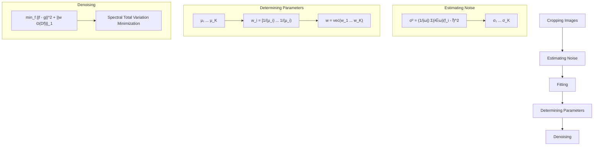

# Denoising Stimulated Raman Spectroscopic Images by Total Variation Minimization

Chien-Sheng Liao,† Joon Hee Choi,‡ Delong Zhang,† Stanley H. Chan,\*,‡,§ and Ji-Xin Cheng\*,†,‡,∥,⊥,#

† Weldon School of Biomedical Engineering, ‡ School of Electrical and Computer Engineering, § Department of Statistics, ∥ Department of Chemistry, ⊥Purdue University Center for Cancer Research, and # Birck Nanotechnology Center, Purdue University, West Lafayette, Indiana 47907, United States

\*S Supporting Information

ABSTRACT: High-speed coherent Raman scattering imaging is opening a new avenue to unveil cellular machinery by visualizing the spatiotemporal dynamics of target molecules or intracellular organelles. By extracting signals from the laser at megahertz modulation frequency, current stimulated Raman scattering (SRS) microscopy has reached shot-noise-limited detection sensitivity. The laser-based local oscillator in SRS microscopy not only generates high levels of signal but also delivers a large shot noise that degrades image quality and spectral fidelity. Here, we demonstrate a denoising algorithm that removes the noise in both spatial and spectral domains by total variation minimization. The signal-to-noise ratio of SRS spectroscopic images was improved by up to 57 times for diluted dimethyl sulfoxide solutions and by 15 times for biological tissues. Weak Raman peaks of target molecules originally buried in the noise were unraveled. Coupling the denoising algorithm with multivariate curve resolution allowed discrimination of fat stores from protein-rich organelles in Caenorhabditis elegans. Together, our method significantly improved detection sensitivity without frame averaging, which can be useful for in vivo spectroscopic imaging.

## 1. INTRODUCTION

Coherent Raman scattering microscopy is an emerging platform for compositional and/or dynamic analysis of living cells or tissues. Single-color coherent Raman techniques, including coherent anti-Stokes Raman scattering (CARS) and stimulated Raman scattering (SRS), have reached video rate imaging speed1,2 and allowed mapping of known species. CARS and SRS spectroscopic imaging enabled by multiplex excitation/detection6−12 and Raman shift sweeping13−18 acquires a vibrational spectrum at each pixel within milliseconds or microseconds, thus allowing compositional analysis of a living system. While CARS microscopy requires further spectral retrieval process to extract the Raman signal from the nonresonant background, SRS microscopy generates vibrational spectra that reproduce spontaneous Raman spectral profiles. Current SRS detection schemes modulate one laser at megahertz frequency and demodulate the tiny intensity change in the other laser (defined as the local oscillator), usually on the order of 0.01% or smaller, by a lock-in amplifier19 or resonant circuit.20 The strong local oscillator, usually several milliwatts on a photodiode, not only boosts the signal level but also contributes a significant amount of shot noise that degrades the image quality and the spectral fidelity. Longer integration time per pixel or frame averaging could increase the signal-to-noise ratio (SNR) but at the price of sacrificing the imaging speed. In this work, we demonstrate a postprocessing algorithm that effectively reduces the noise in both spectral and spatial dimensions, while preserving the SRS signal.

Denoising is a well-studied subject in the image-processing literature. Over the past decades, numerous algorithms have been proposed, e.g., bilateral filter,21 nonlocal (NL) means,22 3D block matching (BM3D),23 and others.24,25 Most denoising algorithms were designed for 2D images. For higher dimensional data, e.g., videos, the consistency along the third dimension is a challenge. To resolve this issue, Chan et al. reported a space−time total variation method to ensure the temporal consistency of a video.26 By assuming a constant noise level across all frames, the algorithm used a global parameter to regulate the least-squares objective function and the total variation regularization.

In this study, we generalize the space−time total variation method by Chan et al. to a space−wavelength total variation method for denoising SRS spectroscopic images. The challenge is that for SRS spectroscopic images the constant noise assumption made in space−time total variation26 no longer holds, since the shot noise of each spectral channel is proportional to the square root of the laser power. We overcome the problem by developing a spectrally varying totalvariation denoising algorithm. The new algorithm, called spectral total variation (STV), estimates the noise of each frame automatically and applies a novel regularization according to the noise levels. We show that STV is able to increase the SNR of an SRS image by up to 57 times and spectrally unravel

Received: July 19, 2015

Revised: July 28, 2015

Published: July 29, 2015

the weak Raman peak from target molecules that are originally buried in the noise. Compared to other denoising methods, including the benchmark singular value decomposition $( \mathrm { S V D } ) , ^ { 2 \breve { 7 } , 2 8 }$ STV shows significantly better performance.

## 2. THEORY OF SPECTRAL TOTAL VARIATION

The concept of our STV algorithm is based on the spatial spectral correlation of the signals and the statistical independence of the noise. The flowchart of the overall denoising algorithm is shown in Figure 1. Details of each

flowchart

Figure 1. Flowchart of the denoising algorithm.

building block are discussed as follows: section 2.1 reviews the principle of total variation denoising, section 2.2 presents our STV algorithm in detail, and section 2.3 illustrates the approach of STV algorithm using the alternating direction method of multipliers.

2.1. Total Variation Denoising. First we introduce a brief review of the space−time total variation method reported by Chan et al. This method is a numerical optimization algorithm to solve the problem

$$
\min _ {\mathbf {f}} \frac {\mu}{2} \| \mathbf {f} - \mathbf {g} \| ^ {2} + \| \mathbf {f} \| _ {\mathrm{TV}} \tag {1}
$$

Here g is a vector of the observed (noisy) image and f is a vector of the desired (clean) image. The goal of the optimization is to find a minimizer of the objective function in eq 1. The objective function consists of two terms: (i) a quadratic term for the residue between the observed image and the solution and (ii) a total variation term for the solution. The relative emphasis of each term is balanced by the parameter $\mu ,$ which has been discussed in previous image-processing literature.29 Generally, for a large $\mu ,$ the total variation term exhibits insignificant influence and then the solution is dominated by the quadratic term. The quadratic term is considered as the data fidelity because of the continuity and differentiability in calculus. The total variation term is regarded as the statistical prior distribution of the clean image. Here we adapt the three-dimensional anisotropic total variation defined as

$$
\left\| \mathbf {f} \right\| _ {\mathrm{TV}} = \sum_ {i} \left(\beta_ {x} \left| \left[ \mathbf {D} _ {x} \mathbf {f} \right] _ {i} \right| + \beta_ {y} \left| \left[ \mathbf {D} _ {y} \mathbf {f} \right] _ {i} \right| + \beta_ {\lambda} \left| \left[ \mathbf {D} _ {\lambda} \mathbf {f} \right] _ {i} \right|\right) \tag {2}
$$

where $\mathbf { D } _ { x } , \mathbf { D } _ { y } ,$ and $\mathbf { D } _ { \lambda }$ are matrices representing the first-order forward finite-difference operators along the horizontal, vertical, and wavelength directions, respectively. The results of multiplying the matrices $\mathbf { D } _ { x } , \mathbf { D } _ { y } ,$ and $\mathbf { D } _ { \lambda }$ to a vector f are

$$
\mathbf {D} _ {x} \mathbf {f} = \mathbf {f} _ {x + 1, y, \lambda} - \mathbf {f} _ {x, y, \lambda} \tag {3a}
$$

$$
\mathbf {D} _ {y} \mathbf {f} = \mathbf {f} _ {x, y + 1, \lambda} - \mathbf {f} _ {x, y, \lambda} \tag {3b}
$$

$$
\mathbf {D} _ {\lambda} \mathbf {f} = \mathbf {f} _ {x, y, \lambda + 1} - \mathbf {f} _ {x, y, \lambda} \tag {3c}
$$

The total variation defined in eq 2 is the sum of the absolute gradients of the image. If a pixel consists of pure noise, the total variation of that pixel is dominated by the noise. However, if a pixel lies on an edge of an object, the total variation is dominated by the edge. Since signals from edges are typically stronger than noise in magnitude, by calculating the total variation, we can differentiate these two.

We further define the operator D in eq 2 as

$$
\mathbf {D} = \left[ \begin{array}{l} \beta_ {x} \mathbf {D} _ {x} \\ \beta_ {y} \mathbf {D} _ {y} \\ \beta_ {\lambda} \mathbf {D} _ {\lambda} \end{array} \right] \tag {4}
$$

where the relative emphasis of $\mathbf { D } _ { x } , \mathbf { D } _ { y } ,$ and $\mathbf { D } _ { \lambda . }$ are determined by parameters $\beta _ { x } , \ \beta _ { y } ,$ and $\beta _ { \lambda } ,$ respectively. ∥f∥ can be rewritten as $\| \mathbf { D } \mathbf { f } \| _ { 1 } ,$ the vector 1-norm on the gradient Df. Therefore, the total variation problem in eq 1 can be rewritten as

$$
\min _ {\mathbf {f}} \frac {\mu}{2} \| \mathbf {f} - \mathbf {g} \| ^ {2} + \| \mathbf {D f} \| _ {1} \tag {5}
$$

Equation 5 is the minimization problem reported by Chan et $\mathrm { a l . } ^ { 2 6 }$ for video denoising.

2.2. Spectral Total Variation. The original space−time total variation is limited to homogeneous noise over the entire time dimension. For SRS spectroscopic images, we introduce a vector $\mathbf { w } = \left( w _ { 1 } , . . . , w _ { n } \right)$ to address individual noise levels along the spectral dimension. First we scale the objective function in eq 5 by a constant

$$
\min _ {\mathbf {f}} \frac {\mu}{2} \| \mathbf {f} - \mathbf {g} \| ^ {2} + \| \mathbf {D f} \| _ {1} \tag {6a}
$$

$$
= \min _ {\mathbf {f}} \frac {1}{\mu} \left\{\frac {\mu}{2} \| \mathbf {f} - \mathbf {g} \| ^ {2} + \| \mathbf {D f} \| _ {1} \right\} \tag {6b}
$$

$$
= \min _ {\mathbf {f}} \frac {1}{2} \| \mathbf {f} - \mathbf {g} \| ^ {2} + \frac {1}{\mu} \| \mathbf {D f} \| _ {1} \tag {6c}
$$

Then we relax the assumption that μ is a fixed constant for all spectral frames and replace $1 / \mu \| \mathbf { D } \mathbf { f } \| _ { 1 }$ in eq $6 \mathsf { c } ,$ , which is also 1/ $\scriptstyle { \bar { \mu } } \sum _ { i = 1 } ^ { n } | ( \mathbf { D } \mathbf { f } ) _ { i } | ,$ , by a sum of individual terms, $\textstyle \sum _ { i = 1 } ^ { n } 1 / \mu _ { i } | ( \mathbf { D } \mathbf { f } ) _ { i } |$ . Consequently, by replacing $1 / \mu _ { i }$ with $w _ { i } , \mathrm { e q }$ 6c can be written as

$$
\min _ {\mathbf {f}} \frac {1}{2} \| \mathbf {f} - \mathbf {g} \| ^ {2} + \sum_ {i = 1} ^ {n} \frac {1}{\mu_ {i}} | (\mathbf {D f}) _ {i} | \tag {7a}
$$

$$
= \min _ {\mathbf {f}} \frac {1}{2} \| \mathbf {f} - \mathbf {g} \| ^ {2} + \sum_ {i = 1} ^ {n} \left| \frac {1}{\mu_ {i}} (\mathbf {D f}) _ {i} \right| \tag {7b}
$$

$$
= \min _ {\mathbf {f}} \frac {1}{2} \| \mathbf {f} - \mathbf {g} \| ^ {2} + \sum_ {i = 1} ^ {n} \left| w _ {i} (\mathbf {D f}) _ {i} \right| \tag {7c}
$$

where the first equality holds, since $\mu _ { i } \ > \ 0 .$ . Because the elements of w are $w _ { 1 } ,$ ..., $w _ { n }$ eq $7 c$ can be represented as

$$
\min _ {\mathbf {f}} \frac {1}{2} \| \mathbf {f} - \mathbf {g} \| ^ {2} + \| \mathbf {w} \odot (\mathbf {D f}) \| _ {1} \tag {8}
$$

where ⊙ denotes an element-wise multiplication. Equation 8 is a generalized term compared with eq $^ { 5 , }$ since it allows different parameters for individual frames. This is the key for our STV algorithm, which is capable of denoising spectrally varying noise in SRS spectroscopic images.

The determination of parameter $\mathbf { w } = \left( w _ { 1 } , . . . , w _ { n } \right)$ is important to the performance of our denoising algorithm. We know that for single image denoising, the parameter $\mu$ is a function depending on the noise level σ. An image with a large noise level requires more smoothing, and therefore, μ should be small. The relationship between $\mu$ and $\sigma$ can be determined empirically, and we found a reciprocal relation

$$
\mu \approx \frac {1}{\sigma^ {\alpha}} \tag {9}
$$

with power constant $1 \leq \alpha \leq 1 . 2 .$ As a result, the estimation of the noise level σ determines the optimization parameter μ and thus $\mathbf { w } .$ The noise level σ can be estimated by measuring the noise variance within a small neighborhood of a background region. A graphic−user interface was created to facilitate this process by allowing users to choose the neighborhood and estimate the noise level in MATLAB (The Mathworks, Inc., Natick, MA). Letting Ω be the region selected by the user, we can compute the noise level as

$$
\sigma = \left(\frac {1}{| \Omega |} \sum_ {i \in \Omega} (f _ {i} - \overline {{f}}) ^ {2}\right) ^ {1 / 2} \tag {10}
$$

where $\overline { { f } }$ is the mean of the pixels in Ω. The validation of our noise estimation is shown in Figure S1 (Supporting Information). On the basis of the estimated noise levels of al frames, $\sigma _ { 1 } , . . . , \sigma _ { K }$ we determine the corresponding parameters $\mu _ { 1 } , . . . , \mu _ { K }$ and define the matrix w as

$$
\mathbf {w} = \left(\left[ \begin{array}{c c c} \frac {1}{\mu_ {1}} & \dots & \frac {1}{\mu_ {1}} \\ \vdots & \ddots & \vdots \\ \frac {1}{\mu_ {1}} & \dots & \frac {1}{\mu_ {1}} \end{array} \right], \left[ \begin{array}{c c c} \frac {1}{\mu_ {2}} & \dots & \frac {1}{\mu_ {2}} \\ \vdots & \ddots & \vdots \\ \frac {1}{\mu_ {2}} & \dots & \frac {1}{\mu_ {2}} \end{array} \right], \dots , \left[ \begin{array}{c c c} \frac {1}{\mu_ {K}} & \dots & \frac {1}{\mu_ {K}} \\ \vdots & \ddots & \vdots \\ \frac {1}{\mu_ {K}} & \dots & \frac {1}{\mu_ {K}} \end{array} \right]\right) \tag {11}
$$

where each submatrix has the same dimension as each frame of the spectroscopic images.

Finally, the parameters of $\begin{array} { r } { { \beta _ { x } } , \beta _ { y } , } \end{array}$ and $\beta _ { \lambda }$ in operator D in $\mathrm { e q } \ 2$ can be determined by the spatial and spectral dimensions of the input images. In our SRS spectroscopic images, the lateral spatial resolution of ∼0.5 μm corresponded to 1.28 pixels in x and y directions. The spectral resolution of ${ \stackrel { \bullet } { \sim } } 1 2 ~ \mathrm { c m } ^ { - 1 }$ corresponded to 3.3 frames. Therefore, $( \beta _ { x } , \ \beta _ { y } , \ \beta _ { \lambda } )$ equals (1.28, 1.28, 3.3) in our case.

2.3. The Alternating Direction Method of Multipliers (ADMM). We solve eq 6 using the ADMM, which is also called the augmented Lagrangian method.30,31 The augmented Lagrangian method has been used to solve an equalityconstrained optimization problem in convex analysis.32 To apply ADMM in our case, we first modify eq 6 using an intermediate variable u to generate an equality constrained problem

$$
\min _ {\mathbf {f}, \mathbf {u}} \frac {1}{2} \| \mathbf {f} - \mathbf {g} \| ^ {2} + \| \mathbf {w} \odot \mathbf {u} \| _ {1} \tag {12}
$$

$\mathbf { \ s u b j e c t { t o } } \mathbf { u } = \mathbf { D } \mathbf { f }$

Note that introducing the intermediate variable does not change the optimization solution because at optimum the constraint must be satisfied. Then the augmented Lagrangian method introduces an augmented Lagrangian function

$$
\begin{array}{l} L (\mathbf {f}, \mathbf {u}, \mathbf {y}) = \frac {1}{2} \| \mathbf {f} - \mathbf {g} \| ^ {2} + \| \mathbf {w} \odot \mathbf {u} \| _ {1} - \mathbf {y} ^ {\mathrm{T}} (\mathbf {u} - \mathbf {D f}) \\ + \frac {\rho}{2} \| \mathbf {u} - \mathbf {D f} \| ^ {2} \tag {13} \\ \end{array}
$$

where the vector y is the Lagrange multiplier associated with the constraint $\bf { u } = \bf { D } \bf { f }$ and $\rho$ is a regularization parameter to control the rate of convergence.33 The ADMM algorithm approaches the solution of eq 13 by iteratively solving three subproblems of f, u, and ${ \bf y } ,$ respectively. Each subproblem is an optimization problem with respect to one variable, and the algorithm proceeds as follows:

for $k = { \bar { 1 } } , 2 ,$ ...

$$
\mathbf {f} _ {k + 1} = \underset {\mathbf {f}} {\operatorname{argmin}} L (\mathbf {f}, \mathbf {u} _ {k}, \mathbf {y} _ {k}) \tag {14a}
$$

$$
\mathbf {u} _ {k + 1} = \underset {\mathbf {u}} {\operatorname{argmin}} L (\mathbf {f} _ {k + 1}, \mathbf {u}, \mathbf {y} _ {k}) \tag {14b}
$$

$$
\mathbf {y} _ {k + 1} = \mathbf {y} _ {k} - \rho (\mathbf {u} _ {k + 1} - \mathbf {D f} _ {k + 1}) \tag {14c}
$$

end for

Equations 14a−14c can be further rewritten as

$$
\begin{array}{l} \mathbf {f} _ {k + 1} = \underset {\mathbf {f}} {\operatorname{argmin}} \frac {1}{2} \| \mathbf {f} - \mathbf {g} \| ^ {2} - \mathbf {y} _ {k} ^ {\mathrm{T}} (\mathbf {u} _ {k} - \mathbf {D f}) \\ + \frac {\rho}{2} \| \mathbf {u} _ {k} - \mathbf {D f} \| ^ {2} \tag {15a} \\ \end{array}
$$

$$
\begin{array}{l} \mathbf {u} _ {k + 1} = \arg \min \| \mathbf {w} \odot \mathbf {u} \| ^ {2} - \mathbf {y} _ {k} ^ {\mathrm{T}} (\mathbf {u} - \mathbf {D f} _ {k + 1}) \\ + \frac {\rho}{2} \| \mathbf {u} - \mathbf {D f} _ {k + 1} \| ^ {2} \tag {15b} \\ \end{array}
$$

$$
\mathbf {y} _ {k + 1} = \mathbf {y} _ {k} - \rho (\mathbf {u} _ {k + 1} - \mathbf {D f} _ {k + 1}) \tag {15c}
$$

Equation 15a is a quadratic minimization problem that can be solved by the following solution

$$
\mathbf {f} _ {k + 1} = \left(\mathbf {I} + \rho \mathbf {D} ^ {\mathrm{T}} \mathbf {D}\right) ^ {- 1} \left(\mathbf {g} + \rho \mathbf {D} ^ {\mathrm{T}} \mathbf {u} _ {k} - \mathbf {D} ^ {\mathrm{T}} \mathbf {y} _ {k}\right) \tag {16}
$$

where I is an identity matrix. Equation 15b is a shrinkage minimization problem with a solution given by30 $ { \mathrm { b y } } ^ { 3 0 }$

$$
\mathbf {u} _ {k + 1} = \max \left\{\left| \mathbf {D f} _ {k + 1} + \frac {\mathbf {y} _ {k}}{\rho} \right| - \frac {\mathbf {w}}{\rho}, 0 \right\} \odot \operatorname{sign} \left(\mathbf {D f} _ {k + 1} + \frac {\mathbf {y} _ {k}}{\rho}\right) \tag {17}
$$

## 3. RESULT AND DISCUSSION

3.1. Denoising SRS Spectroscopic Images of Diluted Dimethyl Sulfoxide Solution. We first evaluated the performance of our algorithm by denoising spectroscopic SRS images of a diluted dimethyl sulfoxide (DMSO) solution. The images were collected by our SRS spectroscopic microscope at close to shot-noise-limited detection sensitivity in the C−H stretching region $( 2 8 0 0 - 3 0 0 0 ~ \mathrm { c m } ^ { - 1 } ) . ^ { 3 4 }$ The DMSO molecules show Raman peaks at 2912 and 2999 cm−1 , while water exhibits a tail at $3 0 0 0 \mathrm { \bar { c m } ^ { - 1 } }$ (Figure S2a, Supporting Information). The raw spectral images of 0.2% DMSO solution (Figure S3, Supporting Information) showed a SNR of ∼2.3 at 2912 cm−1 (Figure 2a,b). Via our denoising algorithm, we reduced the

text_image

Raw data
2912 cm⁻¹

text_image

Denoising by STV
2912 cm⁻¹

line chart

| Pixel | Int. (a.u.) |
|-------|-------------|
| 0     | ~0.0        |
| 50    | ~0.0        |
| 100   | ~0.0        |
| 150   | ~0.6        |
| 200   | ~0.0        |
| 250   | ~0.0        |

line chart

| Pixel | Int. (a.u.) |
|-------|-------------|
| 0     | 0.0         |
| 50    | 0.0         |
| 100   | 0.0         |
| 125   | 0.6         |
| 150   | 0.4         |
| 200   | 0.4         |
| 250   | 0.3         |

line chart

| Raman shift (cm⁻¹) | Int. (a.u.) - 0.2% | Int. (a.u.) - 0% |
| ------------------ | ------------------ | ---------------- |
| 3000               | ~0.1               | ~0.3             |
| 2950               | ~0.8               | ~0.6             |
| 2900               | ~0.1               | ~0.4             |
| 2850               | ~0.1               | ~0.1             |

line chart

| Raman shift (cm⁻¹) | Int. (a.u.) |
| ------------------ | ----------- |
| 2912               | 2912        |

Figure 2. Denoising SRS images in spatial and spectral domains by STV. (a) Raw spectroscopic image at $\mathsf { \bar { 2 9 1 2 ~ c m } ^ { - 1 } }$ . (b) Intensity cross section indicated in part a. (c) Denoised spectroscopic image by STV algorithm. (d) Intensity cross section indicated in part c. (e) Raw SRS spectra of 0.2% and 0% DMSO solutions. (f) Denoised SRS spectra by STV. Scale bar: 10 μm.

noise levels of all frames (Figure S4, Supporting Information) and improved the SNR by 57 times at 2912 cm−1 (Figure 2c,d). The noise in the spectral domain was also significantly suppressed. Figure 2e shows the raw SRS spectra of 0.2% DMSO solution and pure water measured from a single pixel. The Raman signal of DMSO molecules in the 0.2% solution was completely buried in the noise. After denoising, the 2912 $\mathrm { c m ^ { - 1 } }$ Raman peak from DMSO molecules was clearly distinguished from water (Figure 2f). These data collectively showed that our algorithm is capable of improving the SNR in both spatial and spectral domains.

3.2. Denoising SRS Spectroscopic Images of Caenorhabditis elegans. We further studied whether our denoising algorithm is applicable to real biological specimens. We performed spectroscopic imaging of living C. elegans in the C−H bending region using our multiplex SRS microscope that has reached close to shot-noise-limited detection sensitivity. 12 The raw images showed organelles inside C. elegans exhibiting a C−H bending Raman signal around $1 4 4 5 ~ \mathrm { { c m } ^ { - 1 } }$ with a SNR of

13 (Figure 3a,b and Figure S5, Supporting Information). After denoising, these organelles became clearly visible with a SNR of

text_image

a
Raw data
1445 cm⁻¹
B
C
A
h

text_image

C
Denoising by STV
1445 cm⁻¹
B
C +
A
d

line chart

| Pixel | Int. (a.u.) |
|-------|-------------|
| 0     | 0.0         |
| 20    | 0.4         |
| 40    | 0.7         |
| 60    | 0.5         |
| 80    | 0.3         |
| 100   | 0.0         |

line chart

| Pixel | Int (a.u.) |
|-------|------------|
| 0     | 0.0        |
| 20    | 0.0        |
| 40    | 0.4        |
| 60    | 0.7        |
| 80    | 0.1        |
| 100   | 0.0        |

line chart

| Raman shift (cm⁻¹) | Int. (a.u.) |
| ------------------ | ----------- |
| 1500               | 0.0         |
| 1450               | 0.6         |
| 1400               | 0.0         |
| 1350               | 0.0         |

line chart

| Raman shift (cm⁻¹) | Int. (a.u.) - B | Int. (a.u.) - C |
| ------------------ | --------------- | --------------- |
| 1500               | 0.0             | 0.0             |
| 1450               | 0.6             | 0.2             |
| 1400               | 0.0             | 0.0             |
| 1350               | 0.0             | 0.0             |

Figure 3. Denoising SRS spectroscopic images of C. elegans by STV. (a) Raw spectroscopic image at $1 4 4 5 ~ \mathrm { { c m } ^ { - 1 } . }$ . (b) Intensity cross section indicated in part a. (c) Denoised spectroscopic image by STV. (d) Intensity cross section indicated in part c. (e) Raw SRS spectra of locations indicated in part a. The spectra were averaged from nine pixels. (f) Denoised SRS spectra by STV indicated in part c. Scale bar: 10 μm.

∼200 and no reduction of spatial resolution (Figure 3c,d and Figure S6, Supporting Information). In the spectral domain, two selected compartments A and B containing nine pixels had undistinguishable spectral profiles with big standard deviations (Figure 3e). After denoising, these two spectral profiles can be distinguished (Figure 3f). The spectra from compartments A and B highly reproduced the spontaneous Raman spectra of triglyceride (rich in CH ) and bovine serum albumin (rich in CH ), respectively (Figure S2b, Supporting Information). Therefore, compartment A was assigned to the fat store, while compartment B was assigned to the protein-rich organelle. This result was consistent to our previous study in which frame averaging was necessary in order to improve the SNR and spectral fidelity.12 Here, with the aid of STV denoising, we improved the SNR by 15 times, and therefore, these intracellular compartments can be distinguished without the need of averaging.

3.3. Comparison of STV with State of the Art Denoising Methods. 3.3.1. Comparison with Singular Value Decomposition. Singular value decomposition has been widely used for noise reduction in spectroscopic images.35−37 This method first factorizes the data matrix D into three matrix factors, $\mathbf { D } = \mathbf { U } \mathbf { S } \mathbf { V } ^ { \mathrm { { T } } }$ , where the unitary matrix U corresponds to an array of spectral vectors, S is a diagonal matrix composed of singular values, and V corresponds to an array of spatial vectors. Then the number of significant singular values in S is objectively determined, and the rest of the singular values are considered to be noise-dominated and set to zero to generate a new diagonal matrix S′. The noise-reduced data D′ can be reconstructed using $\mathbf { D } ^ { \prime } = \mathbf { U } \mathbf { S } ^ { \prime } \mathbf { V } ^ { \mathrm { T } }$ . Several criteria have been reported to determine the number of significant singular values, including the decline in the slope of singular values, the first-order autocorrelation function of spectral and spatial matrices, and the randomness of residual plots for the difference between the original and reconstructed spectroscopic image data.27,38 To compare the performance of STV to SVD, we first performed SVD on the SRS spectroscopic images of 0.2% and 0% DMSO solutions using MATLAB. The singular values are shown in Figure S7a,b (Supporting Information). In our case, the slope decline from the third to the fourth singular value was more than 80% (Figure $s 7 c , \mathrm { d } ,$ Supporting Information). Therefore, we assumed that the singular values from the 4th to the 50th corresponded to noise and replaced these values with zeros. The reconstructed spectroscopic images showed 5 times SNR improvement compared with the raw images (Figure 4a−c and Figure S8, Supporting Information). In comparison, our STV algorithm improved the SNR by up to 57 times.

We further compared STV and SVD for samples with spatially varying spectral features, such as C. elegans. The singular values and the corresponding derivative of the SRS spectroscopic images of C. elegans are shown in Figure S7e,f (Supporting Information), in which four major singular values were distinguished from the total of 32 values. Therefore, we replaced the singular values from the 5th to the 32th with zeros and reconstructed the spectroscopic images. The image at 1445 $\mathrm { c m } ^ { - 1 }$ showed a 1.4 times SNR improvement by SVD (Figure 4d,f and Figure S9, Supporting Information). In comparison, our STV improved the SNR by 15 times (Figure 3e). Collectively, these results suggested that our algorithm is able to denoise spectroscopic images and improve the SNR better than the SVD denoising approach by 1 order of magnitude.

text_image

Denoising by SVD
a
2912 cm⁻¹
+

text_image

Denoising by SVD
1445 cm⁻¹
B
C
A
e

line chart

| Pixel | Int. (a.u) |
|-------|------------|
| 0     | ~0.0       |
| 50    | ~0.0       |
| 100   | ~0.0       |
| 125   | ~0.6       |
| 150   | ~0.3       |
| 200   | ~0.3       |
| 250   | ~0.3       |

line chart

| Pixel | Int. (a.u.) |
|-------|-------------|
| 0     | 0.0         |
| 20    | 0.3         |
| 40    | 0.5         |
| 60    | 0.7         |
| 80    | 0.3         |
| 100   | 0.0         |

line chart

| Raman shift (cm⁻¹) | Int. (a.u.) - 0.2% | Int. (a.u.) - 0% |
| ------------------ | ------------------ | ---------------- |
| 3000               | ~0.1               | ~0.1             |
| 2950               | ~0.4               | ~0.4             |
| 2900               | ~0.3               | ~0.3             |
| 2850               | ~0.1               | ~0.1             |

line chart

| Raman shift (cm⁻¹) | Int (a.u.) - B | Int (a.u.) - C |
| ------------------ | -------------- | -------------- |
| 1500               | 0.0            | 0.0            |
| 1450               | 0.6            | 0.3            |
| 1400               | 0.0            | 0.0            |
| 1350               | 0.0            | 0.0            |

Figure 4. Denoising SRS spectroscopic images of 0.2% DMSO solution and C. elegans by SVD. (a) Denoised SRS spectroscopic image of 0.2% DMSO solution by SVD. (b) Intensity cross section indicated in part a. (c) Denoised SRS spectra by SVD. (d) Denoised SRS spectroscopic image of C. elegans at 1445 cm−1 by SVD. (e) Intensity cross section indicated in part d. (f) Denoised SRS spectra by STV indicated in part d.

3.3.2. Comparison with Other Denoising Methods Used for Single Images and Videos. To further compare our STV denoising algorithm with other existing methods, we denoised the hypersepectral SRS images of 100% DMSO solution, in which two different synthetic spectrally varying noise patterns (Figure S1a,b, Supporting Information) were added, by our STV algorithm and the following video and image denoising algorithms: (1) the original space−time total variation proposed by Chan et $\mathrm { a l . , } ^ { 2 6 ^ { \circ } }$ (2) the video version of 3D block matching,39 (3) the original 3D block matching,23 and (4) nonlocal means.22 For each method, we compared the peak signal-to-noise ratio (PSNR) between the denoised image and the ground truth. PSNR, a common metric to compare image quality in image processing, is defined as the logarithm of the standard mean-squared error (MSE): PSNR = 10 log 10 (1/ MSE). Typically, an image with a PSNR higher than 40 dB is quite close to the ground truth. Experiment 1 in Table 1

Table 1. PSNR Value of Denoised Images by STV Method and Other Algorithms

<table><tr><td rowspan="2"></td><td colspan="3">video</td><td colspan="2">image</td></tr><tr><td>spectral TV</td><td>original TV</td><td>VBM3D</td><td>BM3D</td><td>NL means</td></tr><tr><td>experiment 1</td><td>44.88</td><td>44.83</td><td>39.70</td><td>40.38</td><td>43.75</td></tr><tr><td>experiment 2</td><td>41.58</td><td>37.54</td><td>31.70</td><td>32.36</td><td>30.14</td></tr></table>

a The methods were categorized into “video” and “image” according to the nature of the methods.

summarized the PSNR of the denoised SRS spectroscopic images in which the synthetic noise pattern shown in Figure S1a (Supporting Information) was added. The PSNR of the denoised result in experiment 2 of Table 1 corresponded to the synthetic noise pattern in Figure S1b (Supporting Informa tion). Table 1 suggested that STV consistently provided higher PSNR than the other methods. Moreover, the performance was tremendously improved when the fluctuation of the noise level was significant, e.g., in experiment 2 where the noise level fluctuated up to 25% of the peak signal magnitude.

We also measured the run times by our STV and the above mentioned methods in Table 2. While original TV and VBM3D are “video” methods that denoise the entire spectroscopic images simultaneously, BM3D and NL means are “image” methods that denoise each frame individually. Since the image methods calculated the run times for one frame, it is necessary to multiply the run times by the number of frames (in our case the frame number was 50) for the “image” methods. As shown in Table 2, we found that the run time of our STV algorithm was on the same level as other denoising methods. We remark that our STV method supersedes the original TV and inherits the distributive properties. This property enables parallel implementation on graphics processing units (GPU). The GPU run time of the original TV has achieved 30 frames per second on a 320 × 240 video.26 Therefore, with sufficient implementations, we expect our STV algorithm can be sped up for real-time computation.

Table 2. Run Times (s) of the STV Method and Other Algorithmsa

<table><tr><td rowspan="2"></td><td colspan="3">video</td><td colspan="2">image</td></tr><tr><td>spectral TV</td><td>original TV</td><td>VBM3D</td><td>BM3D</td><td>NL means</td></tr><tr><td>experiment 1</td><td>16.74</td><td>13.57</td><td>16.52</td><td>0.36</td><td>7.96</td></tr><tr><td>experiment 2</td><td>27.18</td><td>24.18</td><td>14.53</td><td>0.26</td><td>7.87</td></tr></table>

a The run times of image methods are for each frame.

3.4. STV-Aided Multivariate Curve Resolution Analysis. SRS spectroscopic images can be decomposed into chemical maps of major components by methods including linear unmixing,8 multivariate curve resolution (MCR), independent component analysis,18 and spectral phasor analysis.40 For images suffering from low SNR, these methods might lead to false spectral results. To examine whether the employment of our denoising algorithm before the unmixing analysis could improve the spectral fidelity, we analyzed the raw and denoised images by MCR and compared the results. For the raw images, two initial spectra estimations of compartments A and B shown in Figure 3e were used. MCR analysis assigned every compartment to component 1, while component 2 was mainly contributed by the background noise (Figure 5a). The

natural_image

Fluorescence microscopy image showing MCR output with orange and yellow fluorescent spots against a dark background (no text or symbols)

text_image

c From denoised
MCR output

b  

line chart

| Raman shift (cm⁻¹) | Component 1 Int. (a.u) | Component 2 Int. (a.u) |
| ------------------ | ---------------------- | ---------------------- |
| 1500               | 0.0                    | 0.0                    |
| 1450               | 0.8                    | 1.2                    |
| 1400               | 0.3                    | 0.1                    |
| 1350               | 0.0                    | 0.0                    |

d  

line chart

| Raman shift (cm⁻¹) | Component 1 Int. (a.u) | Component 2 Int. (a.u) |
| ------------------ | ---------------------- | ---------------------- |
| 1500               | 0                      | 0                      |
| 1450               | ~0.8                   | ~0.3                   |
| 1400               | ~0                     | 0                      |
| 1350               | 0                      | 0                      |

Figure 5. Denoising-aided MCR analysis. (a) MCR analysis of raw spectroscopic images outputs concentration maps of components 1 (red) and 2 (green). (b) MCR spectra of components 1 and 2. (c) MCR outputs of denoised spectroscopic images. (d) Denoised MCR spectra. Scale bar: 10 μm.

output spectrum of component 2 shown in Figure 5b provided no physical meaning. In comparison, by denoising the spectral images and then performing MCR analysis with two initial spectra estimations of compartments A and B (Figure 3f), we were able to distinguish fat stores from protein-rich organelles (Figure 5c) with their output spectra highly reproducing the spontaneous Raman spectra of $\mathrm { C H } _ { 2 }$ and $\mathrm { C H } _ { 3 }$ groups (Figure 5d). These results show that our algorithm is capable of improving the spectral fidelity of the unmixing analysis.

## 4. CONCLUSION

In summary, by STV minimization, our denoising algorithm suppressed the noise in both spatial and spectral domains, which improved the SNR of SRS spectroscopic images by up to 57 times and unraveled the weak Raman peaks of target molecules originally buried in the noise. These advantages allowed us to analyze in vivo spectroscopic imaging data and distinguish fat stores from protein-rich organelles in live C. elegans. Furthermore, our algorithm effectively improved the spectral fidelity of MCR analysis. Collectively, we have demonstrated a numerical method that denoises a spectroscopic image without sacrificing the imaging speed. We expect its wide use for spectroscopic analysis of living systems.

## ASSOCIATED CONTENT

## Supporting Information

The Supporting Information is available free of charge on the ACS Publications website at DOI: 10.1021/acs.jpcc.5b06980.

All raw and denoised spectroscopic images mentioned in the text (Figures S1−S9) (PDF)

## AUTHOR INFORMATION

## Corresponding Authors

\*S.H.C.: phone, +1-765-496-0230; fax, +1-765-494-3544; email, stanleychan@purdue.edu.  
\*J.-X.C.: phone, +1-765-494-4335; fax, +1-765-494-1193; email, jcheng@purdue.edu.

## Author Contributions

${ \mathrm { C . - S . L . , J . H . C . } } ,$ and D.Z. contributed equally.

## Notes

The authors declare no competing financial interests.

## ACKNOWIEDGMENTS

This work was supported by NIH grants CA182608 and GM114853 and a Keck Foundation grant to J.X.C.

## REEERENCES

(1) Evans, C. L.; Potma, E. O.; Puoris’haag, M.; Cote, D.; Lin, C. P.; Xie, X. S. Chemical Imaging of Tissue in Vivo with Video-Rate Coherent Anti-Stokes Raman Scattering Microscopy. Proc. Natl. Acad. Sci. U. S. A. 2005, 102, 16807−16812.  
(2) Saar, B. G.; Freudiger, C. W.; Reichman, J.; Stanley, C. M.; Holtom, G. R.; Xie, X. S. Video-Rate Molecular Imaging in Vivo with Stimulated Raman Scattering. Science 2010, 330, 1368−1370.  
(3) Hong, S. L.; Chen, T.; Zhu, Y. T.; Li, A.; Huang, Y. Y.; Chen, X. Live-Cell Stimulated Raman Scattering Imaging of Alkyne-Tagged Biomolecules. Angew. Chem., Int. Ed. 2014, 53, 5827−5831.  
(4) Wei, L.; Hu, F. H.; Shen, Y. H.; Chen, Z. X.; Yu, Y.; Lin, C. C.; Wang, M. C.; Min, W. Live-Cell Imaging of Alkyne-Tagged Small Biomolecules by Stimulated Raman Scattering. Nat. Methods 2014, 11, 410.  
(5) Lee, H. J.; Zhang, W. D.; Zhang, D. L.; Yang, Y.; Liu, B.; Barker, E. L.; Buhman, K. K.; Slipchenko, L. V.; Dai, M. J.; Cheng, J. X. Assessing Cholesterol Storage in Live Cells and C-Elegans by Stimulated Raman Scattering Imaging of Phenyl-Diyne Cholesterol. Sci. Rep. 2015, 5, 7930.  
(6) Muller, M.; Schins, J. M. Imaging the Thermodynamic State of Lipid Membranes with Multiplex CARS Microscopy. J. Phys. Chem. B 2002, 106, 3715−3723.  
(7) Kee, T. W.; Cicerone, M. T. Simple Approach to One-Laser, Broadband Coherent Anti-Stokes Raman Scattering Microscopy. Opt. Lett. 2004, 29, 2701−2703.  
(8) Camp, C. H., Jr.; Lee, Y. J.; Heddleston, J. M.; Hartshorn, C. M.; Walker, A. R. H.; Rich, J. N.; Lathia, J. D.; Cicerone, M. T. High-Speed  
Coherent Raman Fingerprint Imaging of Biological Tissues. Nat. Photonics 2014, 8, 627−634.  
(9) Seto, K.; Okuda, Y.; Tokunaga, E.; Kobayashi, T. Development of a Multiplex Stimulated Raman Microscope for Spectral Imaging through Multi-Channel Lock-in Detection. Rev. Sci. Instrum. 2013, 84, 083705.  
(10) Rock, W.; Bonn, M.; Parekh, S. H. Near Shot-Noise Limited Hyperspectral Stimulated Raman Scattering Spectroscopy Using Low Energy Lasers and a Fast CMOS Array. Opt. Express 2013, 21, 15113− 20.  
(11) Marx, B.; Czerwinski, L.; Light, R.; Somekh, M.; Gilch, P. Multichannel Detectors for Femtosecond Stimulated Raman Microscopy - Ideal and Real Ones. J. Raman Spectrosc. 2014, 45, 521−527.  
(12) Liao, C. S.; Slipchenko, M. N.; Wang, P.; Li, J. J.; Lee, S. Y.; Oglesbee, R. A.; Cheng, J. X. Microsecond Scale Vibrational Spectroscopic Imaging by Multiplex Stimulated Raman Scattering Microscopy. Light: Sci. Appl. 2015, 4, e265.  
(13) Lin, C. Y.; Suhalim, J. L.; Nien, C. L.; Miljkovic, M. D.; Diem, M.; Jester, J. V.; Potma, E. O. Picosecond Spectral Coherent Anti-Stokes Raman Scattering Imaging with Principal Component Analysis of Meibomian Glands. J. Biomed. Opt. 2011, 16, 021104.  
(14) Garbacik, E. T.; Herek, J. L.; Otto, C.; Offerhaus, H. L. Rapid Identification of Heterogeneous Mixture Components with Hyperspectral Coherent Anti-Stokes Raman Scattering Imaging. J. Raman Spectrosc. 2012, 43, 651−655.  
(15) Ozeki, Y.; Umemura, W.; Otsuka, Y.; Satoh, S.; Hashimoto, H.; Sumimura, K.; Nishizawa, N.; Fukui, K.; Itoh, K. High-Speed Molecular Spectral Imaging of Tissue with Stimulated Raman Scattering. Nat. Photonics 2012, 6, 845−851.  
(16) Fu, D.; Holtom, G.; Freudiger, C.; Zhang, X.; Xie, X. S. Hyperspectral Imaging with Stimulated Raman Scattering by Chirped Femtosecond Lasers. J. Phys. Chem. B 2013, 117, 4634−4640.  
(17) Zhang, D. L.; Wang, P.; Slipchenko, M. N.; Ben-Amotz, D.; Weiner, A. M.; Cheng, J. X. Quantitative Vibrational Imaging by Hyperspectral Stimulated Raman Scattering Microscopy and Multivariate Curve Resolution Analysis. Anal. Chem. 2013, 85, 98−106.  
(18) Masia, F.; Glen, A.; Stephens, P.; Borri, P.; Langbein, W. Quantitative Chemical Imaging and Unsupervised Analysis Using Hyperspectral Coherent Anti-Stokes Raman Scattering Microscopy. Anal. Chem. 2013, 85, 10820−10828.  
(19) Freudiger, C. W.; Min, W.; Saar, B. G.; Lu, S.; Holtom, G. R.; He, C. W.; Tsai, J. C.; Kang, J. X.; Xie, X. S. Label-Free Biomedical Imaging with High Sensitivity by Stimulated Raman Scattering Microscopy. Science 2008, 322, 1857−1861.  
(20) Slipchenko, M. N.; Oglesbee, R. A.; Zhang, D. L.; Wu, W.; Cheng, J. X. Heterodyne Detected Nonlinear Optical Imaging in a Lock-in Free Manner. J. Biophotonics 2012, 5, 801−807.  
(21) Paris, S.; Durand, F. A Fast Approximation of the Bilateral Filter Using a Signal Processing Approach. Int. J. Comput. Vision 2009, 81, 24−52.  
(22) Buades, A.; Coll, B.; Morel, J. M. A Review of Image Denoising Algorithms, with a New One. Multiscale Model. Simul. 2005, 4, 490− 530.  
(23) Dabov, K.; Foi, A.; Katkovnik, V.; Egiazarian, K. Image Denoising by Sparse 3-D Transform-Domain Collaborative Filtering. IEEE Transactions on Image Processing 2007, 16, 2080−2095.  
(24) Chan, S. H.; Zickler, T.; Lu, Y. M. Monte Carlo Non-Local Means: Random Sampling for Large-Scale Image Filtering. IEEE Transactions on Image Processing 2014, 23, 3711−3725.  
(25) Luo, E. M.; Chan, S. H.; Nguyen, T. Q. Adaptive Image Denoising by Targeted Databases. IEEE Transactions on Image Processing 2015, 24, 2167−2181.  
(26) Chan, S. H.; Khoshabeh, R.; Gibson, K. B.; Gill, P. E.; Nguyen, T. O. An Augmented Lagrangian Method for Total Variation Video Restoration. IEEE Transactions on Image Processing 2011, 20, 3097− 3111.  
(27) Lee, Y. J.; Moon, D.; Migler, K. B.; Cicerone, M. T. Quantitative Image Analysis of Broadband CARS Hyperspectral Images of Polymer Blends. Anal. Chem. 2011, 83, 2733−2739.  
(28) Day, J. P. R.; Domke, K. F.; Rago, G.; Kano, H.; Hamaguchi, H. O.; Vartiainen, E. M.; Bonn, M. Quantitative Coherent Anti-Stokes Raman Scattering (CARS) Microscopy. J. Phys. Chem. B 2011, 115, 7713−7725.  
(29) Krishnan, D.; Fergus, R. Fast Image Deconvolution Using Hyper-Laplacian Priors. In Advances in Neural Information Processing Systems 22; NIPS: La Jolla, CA, 2009; pp 1033−1041.  
(30) Boyd, S.; Parikh, N.; Chu, E.; Peleato, B.; Eckstein, J. Distributed Optimization and Statistical Learning Via the Alternating Direction Method of Multipliers. Foundations and Trends in Machine Learning 2010, 3, 1−122.  
(31) Bertsekas, D. P. Constrained Optimization and Lagrange Multiplier Methods; Athena Scientific: Belmont, MA, 1996.  
(32) Bertsekas, D. P.; Nedic, A.; Ozdaglar, A. E.́ Convex Analysis and Optimization; Athena Scientific: Belmont, MA, 2003.  
(33) Powell, M. J. D. In Optimization; Academic: London, 1969; pp 283−298.  
(34) Wang, K.; Zhang, D. L.; Charan, K.; Slipchenko, M. N.; Wang, P.; Xu, C.; Cheng, J. X. Time-Lens Based Hyperspectral Stimulated Raman Scattering Imaging and Quantitative Spectral Analysis. J. Biophotonics 2013, 6, 815−820.  
(35) Onogi, C.; Hamaguchi, H. O. Photobleaching of the ″Raman Spectroscopic Signature of Life″ and Mitochondrial Activity in Rho(−) Budding Yeast Cells. J. Phys. Chem. B 2009, 113, 10942− 10945.  
(36) Uzunbajakava, N.; Lenferink, A.; Kraan, Y.; Volokhina, E.; Vrensen, G.; Greve, J.; Otto, C. Nonresonant Confocal Raman Imaging of DNA and Protein Distribution in Apoptotic Cells. Biophys. J. 2003, 84, 3968−3981.  
(37) Liu, X. R.; Eusterhues, K.; Thieme, J.; Ciobota, V.; Hoschen, C.; Mueller, C. W.; Kusel, K.; Kogel-Knabner, I.; Rosch, P.; Popp, J.; Totsche, K. U. STXM and NanoSIMS Investigations on EPS Fractions before and after Adsorption to Goethite. Environ. Sci. Technol. 2013, 47, 3158−3166.  
(38) Haq, I.; Chowdhry, B. Z.; Chaires, J. B. Singular Value Decomposition of 3-D DNA Melting Curves Reveals Complexity in the Melting Process. Eur. Biophys. J. 1997, 26, 419−426.  
(39) Dabov, K.; Foi, A.; Egiazarian, K. Video Denoising by Sparse 3D Transform-Domain Collaborative Filtering. Proceedings of the 15th European Signal Processing Conference; PTETiS Poznań: Poznań, Poland, 2007; Vol. 1, pp 145−149.  
(40) Fu, D.; Xie, X. S. Reliable Cell Segmentation Based on Spectral Phasor Analysis of Hyperspectral Stimulated Raman Scattering Imaging Data. Anal. Chem. 2014, 86, 4115−4119.