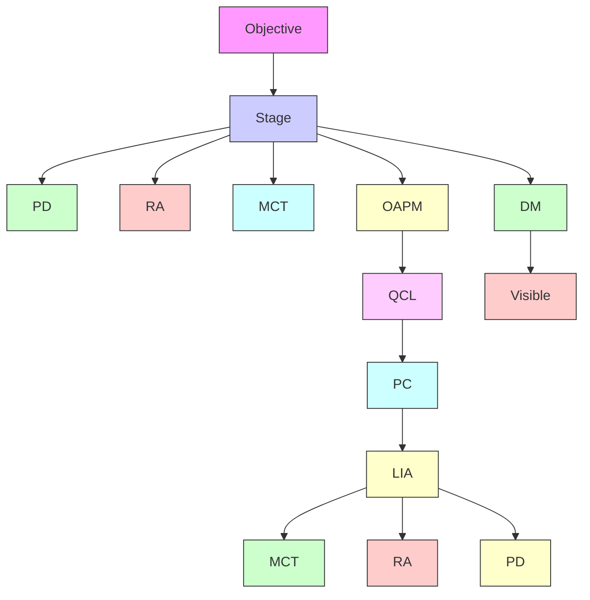

## IMAGING

# Depth-resolved mid-infrared photothermal imaging of living cells and organisms with submicrometer spatial resolution

2016 © The Authors, some rights reserved; exclusive licensee American Association fo the Advancement of Science. Distributed under a Creative Commons Attribution NonCommercial License 4.0 (CC BY-NC). 10.1126/sciadv.1600521

Delong Zhang,1 Chen Li,2 Chi Zhang,1 Mikhail N. Slipchenko,1,3 Gregory Eakins,4 Ji-Xin Cheng1,2,5\*

Chemical contrast has long been sought for label-free visualization of biomolecules and materials in complex living systems. Although infrared spectroscopic imaging has come a long way in this direction, it is thus far only applicable to dried tissues because of the strong infrared absorption by water. It also suffers from low spatial resolution due to long wavelengths and lacks optical sectioning capabilities. We overcome these limitations through sensing vibrational absorption–induced photothermal effect by a visible laser beam. Our mid-infrared photothermal (MIP) approach reached 10 mM detection sensitivity and submicrometer lateral spatial resolution. This performance has exceeded the diffraction limit of infrared microscopy and allowed label-free three-dimensional chemical imaging of live cells and organisms. Distributions of endogenous lipid and exogenous drug inside single cells were visualized. We further demonstrated in vivo MIP imaging of lipids and proteins in Caenorhabditis elegans. The reported MIP imaging technology promises broad applications from monitoring metabolic activities to high-resolution mapping of drug molecules in living systems, which are beyond the reach of current infrared microscopy.

## INTRODUCTION

Today, infrared spectroscopic imaging has broad applications, ranging from heritage material characterization to cancer grading (1–4). Since the publication of Coblentz’s high-quality spectral database in 1905 (5), technological advances, including the development of Fourier transform infrared (FTIR) spectroscopy (6), FTIR imaging (7), a focal plane array detector (8), and new light sources such as synchrotron (9, 10) and quantum cascade laser (QCL) (11, 12), have improved the measurement of infrared absorption for each spatially resolved pixel. In particular, modern QCL has enabled discrete frequency infrared imaging, where specific vibrational bands are pinpointed to accelerate the imaging speed while offering sufficient chemical information (12). Despite these advances, a few fundamental limitations of infrared microspectroscopy have prevented its application in in vivo imaging and diagnosis. First, accurate measurement of absorption in biological samples is hard to achieve because of sample heterogeneity, where the wavelength dependence of light scattering could also cause significant baseline artifacts (13). Second, infrared imaging provides low spatial resolution, which is 4 to 7 m for the fingerprint region, due mto the long excitation wavelength and the lack of high numerical aperture (NA) objectives. This resolution is far from being sufficient for intracellular imaging. Third, infrared imaging, carried out in the transmission mode, has no depth-resolving power. Finally, the strong water absorption at the infrared region hinders its use for functional analysis of living systems in aqueous environments.

We overcome these limitations by vibrational excitation with a mid infrared light and probing the absorption with a visible light through harnessing the thermal lensing effect. In this mid-infrared photothermal (MIP) scheme, infrared absorption at the focus causes a temperature increase that locally changes the refractive index, which consequently affects the propagation of the probe beam. This perturbation to the probe beam is effectively detected via a dark-field geometry. Our MIP scheme avoids the abovementioned problems encountered in infrared imaging. First, because we probe a visible beam at a fixed wavelength, the artifact due to wavelength-dependent scattering of the infrared beam is eliminated. Second, the spatial resolution in MIP microscopy is determined by the wavelength of the probe beam, which is much shorter than that of the mid-infrared beam. Third, MIP provides three-dimensional (3D) sectioning capabilities through nonlinear signal generation via a pump-probe mechanism, which is out of reach by linear absorption– based infrared imaging. Finally, water absorption of the visible probe beam is negligible, whereas mid-infrared light can penetrate water up to 100 m (depth, 1/e2 ) on the basis of the absorption coefficient in the m1000- to 3000-cm−1 window (14), with a minimum depth of 16 m at mthe 1645-cm−1 bending peak. This penetration would allow MIP imaging of living cells and small organisms cultured in a medium. Moreover, the weak temperature dependence of the refractive index of water at room temperature (15) further reduces the background signal.

The first photothermal deflection experiments were reported in the 1980s and the 1990s (16, 17). On the basis of electronic or plasmonic absorption of visible light, photothermal microscopy has been demonstrated for the imaging of mitochondria (18) and has reached the detection sensitivity of individual nanomaterials (19) and single molecules (20). More recently, Furstenberg et al. (21) performed chemical imaging of small crystals and polymer coating on MEMS (microelectromechanical systems) devices using a reflected light photothermal microscope with a QCL. Mërtiri et al. (22) demonstrated the use of a mid-infrared pump, nearinfrared probe photothermal microscope with a silicon objective lens and showed dried bird brain tissue slice imaging (23). Li et al. (24) demonstrated photothermal imaging of 1.1- m polystyrene beads in

1 Weldon School of Biomedical Engineering, Purdue University, West Lafayette, IN 47907, USA. 2 Department of Chemistry, Purdue University, West Lafayette, IN 47907, USA. 3 Department of Mechanical Engineering, Purdue University, West Lafayette, IN 47907, USA. 4 Jonathan Amy Facility for Chemical Instrumentation, Purdue University, West Lafayette, IN 47907, USA. 5 Purdue Institute of Inflammation, Immunology and Infectious Disease, Purdue University, West Lafayette, IN 47907, USA. \*Corresponding author. Email: jcheng@purdue.edu

water, glycerin, and $\mathrm { C S } _ { 2 }$ using a counterpropagation scheme. Meanwhile, advanced photothermal spectroscopy techniques have been demonstrated, including nonlinear Zharov splitting in 50- m homogeneous mliquid crystal layers (25) and probe power asymptotic limit in signalto-baseline contrast (26). Despite similarities in the use of the pumpprobe scheme, our MIP microscope differs in various technological advances (as detailed below) that enabled previously unseen highperformance chemical imaging of living systems. We note that indirect measurement of vibrational absorption has led to atomic force microscopy–based infrared nanoscopy, which greatly improved the spatial resolution (27, 28). Nevertheless, this method is limited to in vitro surface characterization. In contrast, our approach offers penetration capacity through the optical detection of the photothermal effect using visible light. Here, we report, for the first time, infrared absorption–based photothermal imaging of molecules in living cells and Caenorhabditis elegans with submicrometer spatial resolution and microsecond-scale pixel dwell time.

## RESULTS

Theoretically, the MIP signal level, measured as the modulated probe power $\Delta P _ { \mathrm { p r } }$ can be described as (29)

$$
\Delta P _ {\mathrm{pr}} \propto \frac {\sigma N}{\kappa C _ {\mathrm{p}}} \frac {\partial n}{\partial T} P _ {\mathrm{pr}} P _ {\mathrm{IR}} \tag {1}
$$

where denotes the absorption cross section, N is the number density, is the heat conductivity, $C _ { \mathrm { p } }$ is the heat capacity, n is the refractive index, T is the temperature, $P _ { \mathrm { p r } }$ is the probe power, and $P _ { \mathrm { I R } }$ is the infrared power. According to Eq. 1, the MIP signal is linearly proportional to the number density of molecules and to the power of each laser beam, allowing quantitative measurements. Furthermore, it is important to note that water has a large heat capacity [4.18 $\mathrm { J ~ g ^ { - 1 } ~ K ^ { - 1 } }$ , compared to that of tripalmitin (1.51 $\bf { \check { J } } \cdot \bf { g } ^ { - 1 } \bf { K } ^ { - 1 } )$ , a triglyceride, at 281 K (30)] and a weak temperature dependence of refractive index at room temperature $[ d n / d T = - 1 . 0 4 \times 1 0 ^ { - 4 } / \mathrm { K }$ at 633 nm (15)]. Thus, unlike direct absorption measurements in infrared microscopy, the background caused by nonresonant water absorption is minimal in the MIP mode. To measure the power modulation of the probe beam, we deployed phase-sensitive detection, where the trigger signal synchronized with the QCL pulse was used as a phase reference to the lock-in amplifier. Thus, the modulation frequency is simply the repetition rate of the QCL.

Compared to the electronic absorption induced by a visible beam, the relatively small cross section of infrared absorption and the relatively large focal volume of an infrared beam make it difficult to efficiently detect the thermal lensing effect. We deployed two approaches to mitigating this difficulty. First, we used dark-field geometry to maximize the intensity modulation in the probe beam (Fig. 1, A and B). Second, we designed and fabricated a high–Q factor resonant amplifier (fig. S1), which selectively amplifies the MIP signal at the repetition rate of the QCL while keeping electronic noise low. Previously, we demonstrated a narrow-band amplifier via a resonant circuit design for stimulated Raman scattering microscopy at a frequency of a few megahertz (31). For MIP imaging, we first measured the frequency dependence of the MIP signal and the laser noise (fig. S2) and found that the signal-tonoise ratio increased toward lower frequencies. To ensure the imaging speed, we chose a frequency of 100 kHz for MIP imaging and redesigned and manufactured a new resonant amplifier. The measured bandwidth is 1.44 kHz with a Q factor of 71.2 (fig. S1). This high Q factor, combined with a low-noise amplifier, enabled high-quality MIP spectroscopic imaging.

text_image

A
PD
Iris
IR off

text_image

B
PD
Iris
IR on

flowchart

Fig. 1. Principle and schematic of MIP imaging. (A) Probe beam propagation through the sample via a dark-field objective (not to scale; condenser was omitted for simplicity). PD, photodiode; IR, infrared. (B) The probe beam propagation is perturbed by the addition of an infrared pump beam due to infrared absorption and the development of a thermal lens. (C) Setup. A pulsed mid-infrared pump beam is provided by a ${ \mathsf { Q C L } } ,$ and a continuous probe beam is provided by a visible laser, both of which are collinearly combined by a silicon dichroic mirror (DM) and sent into a reflective objective. The residual reflection of the infrared beam from the dichroic mirror is measured by a mercury cadmium telluride (MCT) detector. The probe beam is collected by a condenser with a variable iris and sent to a silicon PD connected to a resonant amplifier (RA). Inset: The photothermal signal is selectively amplified by the RA and detected by a lock-in amplifier (LIA). A computer is used for control and data acquisition. OAPM, off-axis parabolic mirror.

A schematic of our MIP microscope is shown in Fig. 1C (detailed in Materials and Methods). The laser source comprises a pulsed QCL for mid-infrared excitation and a continuous wave laser at a wavelength of 785 nm for probing the photothermal effect. The two laser beams are collinearly combined by a silicon dichroic mirror and directed to an inverted microscope. A dark-field illumination, gold-coated reflective objective with an NA of 0.65 allows broadband transmission of the excitation beam from visible to mid-infrared wavelengths. A variable aperture condenser with a maximum NA of 0.55 collects the probe photons and directs them to a photodiode. The photothermal signal, which appears at the pulse repetition frequency of the QCL, is selected by the high–Q factor resonant amplifier and then further amplified by a lock-in amplifier. The mid-infrared laser power is monitored by a mercury cadmium telluride detector through a second lock-in channel. A computer is used to synchronize data acquisition, stage scanning, and QCL wavelength selection (Fig. 1C, inset).

We first examined the spectral fidelity of MIP signals by comparing the MIP spectral profile to the reference spectra collected by an attenuated total reflection FTIR spectrometer. The raw MIP spectra were normalized by the infrared laser power at each wave number (experimental details in fig. S3). Figure 2A compares the MIP and FTIR spectra of polystyrene film and olive oil, which were used as solid and liquid samples, respectively. A good consistency was observed in the entire fingerprint region. Furthermore, to confirm the photothermal origin of the signal, we measured the laser power dependence of MIP intensity and found the signal level to be linear to either infrared or probe laser power (fig. S4), which agrees with Eq. 1.

line chart

| Wave number (cm⁻¹) | MIP int. (a.u.) | FTIR abs. (%) |
| ------------------ | --------------- | ------------- |
| 1400               | ~0.5            | ~0.2          |
| 1500               | ~4.0            | ~0.1          |
| 1600               | ~2.0            | ~0.0          |
| 1700               | ~50             | ~25           |
| 1800               | ~0              | ~0            |

scatterplot

| FWHM (μm) | Distance (μm) |
| --------- | ------------- |
| 0.61      | 4             |

scatterplot

| Concentration (mM) | MIP int. |
| ------------------ | -------- |
| 0.01               | 1        |
| 0.1                | 10       |
| 1                  | 100      |
| 10                 | 1000     |
| 100                | 10000    |

line chart

| Distance (μm) | MIP int. (a.u.) |
| ------------- | --------------- |
| 0             | 0.0             |
| 1             | 0.0             |
| 2             | 0.5             |
| 3             | 1.0             |
| 4             | 0.0             |

Fig. 2. Performance of the MIP microscope. (A) Spectral fidelity. Comparison of MIP spectral profiles (red) and FTIR spectra (black) of polystyrene film (top) and olive oil (bottom). The FTIR spectra were acquired by an attenuated total reflection FTIR spectrometer. The spectra are offset for clarity. The MIP signal was normalized by the QCL power measured simultaneously via the same lock-in amplifier (see fig. S3). Note that the unit for FTIR spectra is percent absorption, rather than the conventional absorbance, so that it is proportional to the infrared energy absorbed by the sample. int., intensity; abs., absorption; a.u., arbitrary units. (B) Sensitivity. MIP signal of -valerolactone in carbon disulfide at various concentrations. Inset shows the molecular structure. The limit of detection is found to be $1 0 \mu \mathsf { M }$ when the SD is equal to the solution-solvent difference. The time constant of the lock-in amplifier was set to 50 ms, and the spectral scan mspeed was set to 50 ms cm−1 . (C) Spatial resolution. MIP imaging of a 500-nm PMMA bead. The horizontal and vertical intensity profiles are plotted at the bottom and on the right side of the image. The measured FWHM is 0.63 and 0.61 m, respectively. Pixel dwell time, 5 ms.

We then evaluated the sensitivity of MIP imaging by measuring the $1 7 7 5  – \mathrm { c m } ^ { - 1 } \mathrm { C = O }$ bond vibration of a small molecule, -valerolactone, in gcarbon disulfide solution (Fig. 2B). The detection limit in terms of molar concentration was found to be 10 M, with an infrared power of 2 mW mand a probe power of 10 mW at the sample. This sensitivity is beyond the reach of current Raman scattering–based vibrational microscopes widely used for label-free imaging at the intracellular level. As a comparison, the detection limit by stimulated Raman scattering microscopy was reported to be 200 M for the strongest Raman band produced by C≡C mbonds (32), which was achieved with 120 mW for the pump and 130 mW for the Stokes beam. For MIP imaging, we note that water absorption at the bending vibration weakens the infrared beam around 1645 cm−1 . Alternatively, deuterated water can be used to circumvent this difficulty. For ascorbic acid/D O, we found that the detection sensitivity at the 1759-cm−1 peak was 6.7 mM under the same laser powers (fig. S5).

To determine the spatial resolution of MIP, we imaged 500-nm poly (methyl methacrylate) (PMMA) beads at the $1 7 3 0 \mathrm { - c m } ^ { \underline { { \sim } } 1 }$ peak (Fig. 2C). The measured full width at half maximum (FWHM) was 0.63 m in the mx direction and 0.61 m in the y direction. In comparison, the diffraction limit of a $1 7 3 0 \mathrm { - c m } ^ { - 1 }$ infrared beam with the same NA objective (0.65) is 5.5 m, which is the theoretically best resolution achievable mby an infrared microscope. The ninefold improvement in resolution by MIP microscopy offers the opportunity of unveiling subcellular structures in living cells, as shown below.

On the basis of the above characterizations, we explored the potential of MIP microscopy for live cell imaging. Because increased lipogenesis is a known marker for cancer (33), we performed depth-resolved MIP imaging of lipid droplets stored in PC-3 prostate cancer cells (Fig. 3, A to C; see movie S1). The image profile of a lipid droplet (Fig. 3D) shows 0.83- m FWHM, indicating the submicrometer spatial mresolution of MIP for live cell imaging. The infrared laser was tuned to the $1 7 5 0 { \mathrm { - c m } } ^ { - 1 }$ vibrational peak of the C=O bond, which is abundant in lipid droplets. The 3D representation is shown in Fig. 3E (see movie S2), where individual droplets are visible. The depth resolution was measured to be 3.5 m according to the depth intensity mprofile of the smallest lipid droplet. As a control, no MIP contrast was observed at off-resonance (1850 cm−1 ) (Fig. 3F). To our knowledge, this is the first demonstration of 3D imaging of live cells using infrared spectroscopy as contrast.

As another single-cell application, we performed multispectral MIP imaging to locate drug molecules in living cancer cells. The monoacylglycerol lipase inhibitor JZL184 is found to be effective in decreasing cancer cell migration and tumor growth (34), yet its intracellular transportation and accumulation remain unknown. Infrared spectrum of the drug shows distinctive peaks at 1720 and 1480 cm−1 (Fig. 4A, top curve). To map the drug inside the cells, we treated MIA PaCa-2 pancreatic cancer cells with JZL184 for 24 hours, replaced the medium with D O saline, and performed multispectral MIP imaging at the following wave numbers: 1380, 1400, 1480, 1700, 1720, 1724, 1750, 1800, and $1 8 5 0 ~ \mathrm { c m } ^ { - 1 }$ (raw stack shown in fig. S6). For quantitative analysis, multivariate curve resolution (MCR) (35, 36), previously used for the decomposition of hyperspectral stimulated Raman scattering data, was applied here to extract both the spectral profile and the concentration map of the drug and the lipid content (Fig. 4, B and C). Agreement is observed between the MCR output spectral points and the corresponding FTIR spectra (Fig. 4A). The JZL184 map shows a distribution different from that of the lipid map, in which the drug accumulates in the center of the cell body, whereas lipid droplets are scattered around. This result, which is the first visual evidence of JZL184 accumulation, provides an insight into spatial-temporal dynamics of lipid inhibition inside cancer cells.

  
Fig. 3. 3D MIP imaging of lipids in live cells. (A to C) Depth-resolved MIP imaging of PC-3 cells at the $1 7 5 0 { \mathrm { - c m } } ^ { - 1 } \ \mathsf { C } { \mathrm { = } } 0$ band at different Z positions. (D) The line profile indicated in (A), showing an FWHM of 0.83 m of a small lipid droplet. (E) The reconstructed 3D view of the same mcell, showing individual lipid droplets over the cell body. (F) Off-resonance image at $1 8 5 0 ~ \mathrm { c m } ^ { - 1 }$ , showing no contrast. Pixel dwell time, 1 ms. Scale bars, $2 0 \ \mu \mathrm { m } .$ See movies S1 and S2.

line chart

| Wave number (cm⁻¹) | MIP int. (a.u.) | FTIR abs. (%) |
| ------------------ | --------------- | ------------- |
| 1400               | ~0.3            | ~5            |
| 1500               | ~2.0            | ~30           |
| 1600               | ~0.8            | ~10           |
| 1700               | ~2.2            | ~35           |
| 1800               | ~0.5            | ~5            |
| 1900               | ~0.2            | ~2            |

natural_image

Microscopic image showing a bright fluorescent spot against a blue background, with scale bar and label 'B' in top-left corner (no other text or symbols)

natural_image

Microscopic image showing red fluorescent spots against a dark background, with a scale bar in the corner (no text or symbols)

Fig. 4. Multispectral MIP imaging of cellular drug uptake. (A) Infrared spectra of the lipid inhibitor JZL184 (top, line) and olive oil (bottom, line). Squares indicate the MCR results for drug and lipid content. Dashed lines indicate the characteristic peaks for drug (blue) and lipid (orange) content. Inset shows the molecular structure of the drug. (B and C) MCR output of multispectral MIP imaging of JZL184-treated MIA PaCa-2 cells for drug (B) and lipid (C) content. Pixel dwell time, 500 s. Scale bars, 20 m. (Raw stack can be found in fig. S6.).

Finally, we explored the potential of our MIP microscope for the in vivo imaging of biomolecules in C. elegans (Fig. 5). The wavelength was tuned to the $1 7 5 0 { \mathrm { - c m } } ^ { - 1 } \mathrm { C = O }$ band (Fig. 5A) and the $1 6 5 5 \mathrm { - c m ^ { - 1 } }$ amide I band (Fig. 5B). The lipid droplets and proteins are visible in the MIP images. To verify the chemical contents, pinpoint spectra were acquired at a lipid droplet, the worm body, and the medium (Fig. 5, C to E). The spectra at the droplets show a strong $1 7 5 0 \mathrm { - c m } ^ { - 1 }$ peak, indicating a high C=O content. Both the amide I band at 1655 cm−1 and the water O–H band at $1 6 4 5 ~ \mathrm { c m } ^ { - 1 }$ contributed to Fig. 5B, whereas the intensity of the amide I band is stronger than that of water, indicating that water did not obscure the protein signal. Depth-resolved MIP imaging of C. elegans (fig. S7) showed a penetration depth of up to 80 m. These results col mlectively demonstrate the capacity of MIP microscopy for in vivo infrared spectroscopic imaging.

  
Fig. 5. In vivo MIP imaging of lipid and protein in . (A) MIP imaging of the worm body at the $1 7 5 0 \ – \mathsf { c m } ^ { - 1 }$ lipid C=O band. 1, Lipid droplet. (B) MIP imaging of the same area at the $1 6 5 5 \mathrm { - c m } ^ { - 1 }$ elegansprotein amide I band. 2, Worm body; 3, medium. (C to E) Pinpoint spectra of locations 1, 2, and 3, as indicated in (A) and (B). Blue and red lines indicate the wavelengths used in (A) and (B), respectively. Pixel dwell time, 500 s. Scale bar, 200 m.

## DISCUSSION

The emerging field of in vivo vibrational spectroscopic imaging (37), which deploys molecular vibrational fingerprint as a signal, opens new opportunities for functional analysis of living cells and for molecule-based diagnosis of diseases. Here, we have demonstrated a novel spectroscopic imaging platform based on photothermal detection of mid-infrared absorption. The micromolar sensitivity and submicrometer spatial resolution of our MIP microscope enabled depth-resolved imaging of lipids, proteins, and drug molecules in live cells and/or organisms. The current system is readily extendable to the full spectral range of using the wealth of infrared spectra data sets developed over the past century. These features promise broad applications ranging from chemical mapping of organelles inside single living cells to in situ detection of cancer margins using fresh tissues. With its superb spatial resolution, our MIP imaging platform also promises wide applications in pharmaceutical and material research fields.

Spatial resolution is an important topic for photothermal imaging. Spatial resolution in electronic absorption–based photothermal lens imaging of nanostructures has been well studied (38, 39). In these cases, the excitation and probe volume are similar, and the medium contributes to the major part or even the whole lensing effect. Baffou et al. defined a dimensionless parameter $\xi = { p ^ { 2 } } / { ( P R ) } .$ , where N particles with diameter xR and average distance p are distributed in the range P. When $\xi \gg 1$ , the temperature increase is confined around each particle; hence, the resolution is determined by the probe focal size. When $\xi \ll 1$ , the xtemperature increase from each particle will start to overlap, resulting in a resolution that is worse than the probe beam point spread function. In our MIP scheme, the infrared excitation volume is much larger than the visible probe volume. Meanwhile, water is the dominating medium in live cells and tissues, and its high heat capacity and the weak temperature dependence of the refractive index minimize the medium contribution to the thermal lensing effect. Therefore, the spatial resolution of our MIP microscope largely depends on the focal size of the probe beam. Experimentally, given the infrared focal size of 5.5 m, the lipid droplets in cells (Fig. 3) and C. elegans (Fig. 5), with $\xi = 0 . 8 1$ and 2.16, respecxtively, can be resolved well in the MIP image (fig. S8).

Our modality is complementary to recently developed coherent Raman scattering microscopy (40), which boosts the speed of conventional

Raman imaging through coherent amplification. The detection sensitivity of Raman-based vibrational microscopy is ultimately limited by its small cross section, typically 10−30 cm2 /sr. On the contrary, infrared absorption (with a typical cross section at the 10−22-cm2 /sr level) benefits from a fundamental cross section more than eight orders of magnitude larger and provides sufficient contrast for indirect measurements such as our MIP imaging. Moreover, infrared absorption–based MIP microscopy is highly sensitive to vibrational modes (for example, C=O stretching) that are weak in Raman microscopy.

We note that all the MIP images were recorded at very low laser powers, \~2 mW for the infrared beam and \~10 mW for the probe beam, because of laser source limitations. Thus, we have much space to improve the signal level in the future. The current imaging speed was determined by our sample scanning stage, which had a minimum dwell time of 200 s. Future adoption of a laser-scanning scheme will allow faster imaging speeds at pixel dwell time of a few microseconds. With new infrared laser sources, the spectral window of MIP microscopy can be extended to the high–wave number region for C≡N, C–D, C–H, N– H, and O–H stretching vibrations, as well as to the low–wave number region for bending and intermolecular vibrational modes.

## MATERIALS AND METHODS

## MIP microscope

A QCL with 2-mW average power operating at 102-kHz pulse repetition rate (Block Engineering, LaserTune LT2000), tunable from 1345 to 1905 cm−1 , was expanded through a pair of off-axis parabolic mirrors and combined collinearly with a continuous-wave 785-nm probe laser (Thorlabs, LD785-SE400) by a silicon-based dichroic mirror (Edmund Optics, #68654). The combined beams were sent to an inverted microscope (Olympus, IX71). A reflective objective lens (52×; NA, 0.65; Edmund Optics, #66589) with gold coating was used for focusing. The samples were mounted using calcium fluoride cover glasses with a thickness of 0.5 or 1 mm. The probe laser was collected through a microscope condenser with an NA of 0.55 for forward detection by a silicon photodiode (Hamamatsu, S3994-01). A scanning stage (Mad City Labs, Nano-Bio 2200) was used for sample scanning at a maximum speed of 200 s per pixel. The entire imaging system was purged by dry nitrogen to eliminate water vapor absorption.

The photocurrent from the silicon photodiode detector was sent to a laboratory-built resonant amplifier and then to a lock-in amplifier (Zurich Instruments, HF2LI) for phase-sensitive detection to acquire the MIP signal. A fast mercury cadmium telluride detector (Vigo Inc., PVM-10.6) was used to monitor the QCL power through a second lockin channel. A computer was used to (i) control the tuning of the QCL wavelength, (ii) control the movement and read the real-time position of the piezo stage for sample scanning, and (iii) collect spectroscopic data and reconstruct the images. A multichannel data acquisition card (National Instruments, PCIe-6363) was used for real-time data acquisition.

## Detection sensitivity evaluation

Two calcium fluoride cover glasses (Eksma Optics, 530-6121) were used to sandwich two borosilicate capillary glass tubes, acting as the inlet and the outlet of the flow. The space was confined with additional no. 1 cover glasses with silicone-based glue. The whole unit was put under the MIP microscope for a sensitivity test with a flow rate about 1 ml/min using manual push. -Valerolactone (Sigma-Aldrich, W310301-1KG-K) was used as the analyte and dissolved into carbon disulfide. Concentrations of -valerolactone were determined by the volume used for preparation. The MIP intensities were calculated on the basis of the 1775-cm−1 peak area after subtraction of the solvent spectrum.

## Spatial resolution evaluation

PMMA beads (Phosphorex, #MMA500) with a nominated diameter of 500 nm were spread to the surface of a CaF2 cover glass for MIP imaging. The pixel dwell time was 5 ms.

## Live cell imaging on the MIP microscope

PC-3 and MIA PaCa-2 cell lines were cultured on home-built calcium fluoride glass–bottom petri dishes, which were autoclaved before planting. The PC-3 cells were cultured for 24 hours before imaging. The MIA PaCa-2 cells were treated with JZL184 with a final concentration of 20 M for 24 hours. The medium was washed three times by phosphatembuffered saline and replaced by 0.9% NaCl/D O solution for MIA PaCa-2 cells before imaging. The pixel dwell time was 1 ms for PC-3 and 500 s for MIA PaCa-2 cells.

## imaging on the MIP microscope

C. elegansLive C. elegans was transferred with liquid culture medium and mixed with 200 mM sodium azide solution with a 1:1 mix ratio for anesthesia. The worms were then transferred to a calcium fluoride glass–bottom dish for immediate MIP imaging. The pixel dwell time was 500 s.

## FTIR measurements

All FTIR spectra were measured on an attenuated total reflection FTIR spectrometer (Thermo Nicolet). The spectrometer was purged with dry nitrogen for 20 min before the measurement. All data were directly normalized by the spectrometer’s internal baseline correction.

## Image analysis

All MIP images were imported to ImageJ (National Institutes of Health) for analysis. For bead imaging, the intensity profiles were plotted at the center of the bead in the horizontal and vertical directions. Gaussian fitting was used to determine the FWHM of the bead. For PC-3 imaging, the Z stack was taken with a step of 1 m and imported to the 3D viewer in ImageJ for 3D reconstruction.

For multispectral MIP imaging of MIA PaCa-2 cells, the multispectral stacks were saved in TIFF format and imported to MATLAB (MathWorks Inc.) using home-built codes. MCR-ALS (alternating least squares) toolbox was used to perform MCR analysis and export the concentration map, along with the spectrum for each component, as two separate matrices. The concentration matrix was then refolded and exported as a tif stack. The spectral matrix was plotted along with the FTIR spectra.

For the MIP imaging of C. elegans, individual images of 200 × 200 pixels were taken and then stitched using MosaicJ in ImageJ. For visual clarity, blank areas of the final stitched images were filled with computergenerated random numbers with the same mean and SD as the blank areas in the original images.

## SUPPLEMENTARY MATERIALS

Supplementary material for this article is available at http://advances.sciencemag.org/cgi/ content/full/2/9/e1600521/DC1

fig. S1. Resonant amplifier for MIP imaging.

fig. S2. Frequency dependence of MIP signal, laser noise, and signal-to-noise ratio.

fig. S3. MIP data processing.

fig. S4. Power dependence of MIP signal.

fig. S5. Concentration measurement in D2O

fig. S6. Multispectral MIP imaging stack of treated MIA PaCa-2 cells.

fig. S7. Depth-resolved MIP imaging of live C. elegans at 1750 cm−1 .

fig. S8. Spatial resolution of MIP microscope.

movie S1. Depth-resolved stack of MIP imaging of a PC-3 cell.

movie S2. Dynamic illustration of 3D reconstructed MIP imaging of a PC-3 cell.

## REFERENCES AND NOTES

1. S. Prati, E. Joseph, G. Sciutto, R. Mazzeo, New advances in the application of FTIR microscopy and spectroscopy for the characterization of artistic materials. Acc. Chem. Res. 43, 792–801 (2010).  
2. R. Bhargava, Infrared spectroscopic imaging: The next generation. Appl. Spectrosc. 66, 1091–1120 (2012).  
3. G. Bellisola, C. Sorio, Infrared spectroscopy and microscopy in cancer research and diagnosis. Am. J. Cancer Res. 2, 1–21 (2012).  
4. M. J. Baker, J. Trevisan, P. Bassan, R. Bhargava, H. J. Butler, K. M. Dorling, P. R. Fielden, S. W. Fogarty, N. J. Fullwood, K. A. Heys, C. Hughes, P. Lasch, P. L. Martin-Hirsch, B. Obinaju, G. D. Sockalingum, J. Sulé-Suso, R. J. Strong, M. J. Walsh, B. R. Wood, P. Gardner, F. L. Martin, Using Fourier transform IR spectroscopy to analyze biological materials. Nat. Protoc. 9, 1771–1791 (2014).  
5. W. W. Coblentz, Investigations of Infra-red Spectra (Carnegie Institution of Washington, 1905).  
6. P. R. Griffiths, Fourier transform infrared spectrometry. Science 222, 297–302 (1983).  
7. R. A. Dluhy, R. Mendelsohn, Emerging techniques in biophysical FT-IR. Anal. Chem. 60, 269A–278A (1988).  
8. E. N. Lewis, P. J. Treado, R. C. Reeder, G. M. Story, A. E. Dowrey, C. Marcott, I. W. Levin, Fourier transform spectroscopic imaging using an infrared focal-plane array detector. Anal. Chem. 67, 3377–3381 (1995).  
9. P. Dumas, L. Miller, The use of synchrotron infrared microspectroscopy in biological and biomedical investigations. Vib. Spectrosc. 32, 3–21 (2003).  
10. M. J. Nasse, M. J. Walsh, E. C. Mattson, R. Reininger, A. Kajdacsy-Balla, V. Macias, R. Bhargava, C. J. Hirschmugl, High-resolution Fourier-transform infrared chemical imaging with multiple synchrotron beams. Nat. Methods 8, 413–416 (2011).  
11. J. Faist, F. Capasso, D. L. Sivco, C. Sirtori, A. L. Hutchinson, A. Y. Cho, Quantum cascade laser. Science 264, 553–556 (1994).  
12. M. R. Kole, R. K. Reddy, M. V. Schulmerich, M. K. Gelber, R. Bhargava, Discrete frequency infrared microspectroscopy and imaging with a tunable quantum cascade laser. Anal. Chem. 84, 10366–10372 (2012).  
13. J. M. Chalmers, P. Griffiths, Eds., Handbook of Vibrational Spectroscopy (John Wiley & Sons Ltd., 2006).  
14. J.-J. Max, C. Chapados, Isotope effects in liquid water by infrared spectroscopy. III. H O and D O spectra from 6000 to 0 cm–1 . J. Chem. Phys. 131, 184505 (2009).  
15. P. Schiebener, J. Straub, J. M. H. Levelt Sengers, J. S. Gallagher, Refractive index of water and steam as function of wavelength, temperature and density. J. Phys. Chem. Ref. Data 19, 677–717 (1990).  
16. D. Fournier, F. Lepoutre, A. Boccara, Tomographic approach for photothermal imaging using the mirage effect. J. Phys. 44, 479–482 (1983).  
17. M. Harada, K. Iwamoto, T. Kitamori, T. Sawada, Photothermal microscopy with excitation and probe beams coaxial under the microscope and its application to microparticle analysis. Anal. Chem. 65, 2938–2940 (1993).  
18. D. Lasne, G. A. Blab, F. De Giorgi, F. Ichas, B. Lounis, L. Cognet, Label-free optical imaging of mitochondria in live cells. Opt. Express 15, 14184–14193 (2007).  
19. D. Boyer, P. Tamarat, A. Maali, B. Lounis, M. Orrit, Photothermal imaging of nanometer-sized metal particles among scatterers. Science 297, 1160–1163 (2002).  
20. A. Gaiduk, M. Yorulmaz, P. V. Ruijgrok, M. Orrit, Room-temperature detection of a single molecule’s absorption by photothermal contrast. Science 330, 353–356 (2010).  
21. R. Furstenberg, C. A. Kendziora, M. R. Papantonakis, V. Nguyen, R. McGill, Chemical imaging using infrared photothermal microspectroscopy, in Proceedings of SPIE Defense, Security, and Sensing, Baltimore, MD, 1 May 2012.  
22. A. Mërtiri, A. Totachawattana, H. Liu, M. K. Hong, T. Gardner, M. Y. Sander, S. Erramilli, Label free mid-IR photothermal imaging of bird brain with quantum cascade laser, in Conference on Lasers and Electro-Optics (CLEO’14), San Jose, CA, 8 to 13 June 2014.  
23. M. Y. Sander, Mid-infrared photothermal imaging, in Frontiers in Optics 2015, San Jose, CA, 18 to 22 October 2015.  
24. Z. Li, M. Kuno, G. Hartland, Super-resolution imaging with mid-IR photothermal microscopy on the single particle level, in Proceedings of SPIE Physical Chemistry of Interfaces and Nano materials XIV, San Diego, CA, 20 August 2015.  
25. A. Mertiri, H. Altug, M. K. Hong, P. Mehta, J. Mertz, L. D. Ziegler, S. Erramilli, Nonlinear midinfrared photothermal spectroscopy using Zharov splitting and quantum cascade lasers. ACS Photonics 1, 696–702 (2014).  
26. A. Totachawattana, H. Liu, A. Mertiri, M. K. Hong, S. Erramilli, M. Y. Sander, Vibrational mid-infrared photothermal spectroscopy using a fiber laser probe: Asymptotic limit in signal-to-baseline contrast. Opt. Lett. 41, 179–182 (2016).  
27. B. Knoll, F. Keilmann, Near-field probing of vibrational absorption for chemical microscopy. Nature 399, 134–137 (1999).  
28. F. Lu, M. Jin, M. A. Belkin, Tip-enhanced infrared nanospectroscopy via molecular expansion force detection. Nat. Photonics 8, 307–312 (2014).  
29. R. A. Meyers, Encyclopedia of Analytical Chemistry: Applications, Theory, and Instrumentation (Wiley, 2000).  
30. J. C. Phillips, M. M. Mattamal, Correlation of liquid heat-capacities for caboxylic esters. J. Chem. Eng. Data 21, 228–232 (1976).  
31. M. N. Slipchenko, R. A. Oglesbee, D. Zhang, W. Wu, J.-X. Cheng, Heterodyne detected nonlinea optical imaging in a lock-in free manner. J. Biophotonics 5, 801–807 (2012).  
32. L. Wei, F. Hu, Y. Shen, Z. Chen, Y. Yu, C.-C. Lin, M. C. Wang, W. Min, Live-cell imaging of alkyne tagged small biomolecules by stimulated Raman scattering. Nat. Methods 11, 410–412 (2014).  
33. J. A. Menendez, R. Lupu, Fatty acid synthase and the lipogenic phenotype in cancer patho genesis. Nat. Rev. Cancer 7, 763–777 (2007).  
34. J. Z. Long, W. Li, L. Booker, J. J. Burston, S. G. Kinsey, J. E. Schlosburg, F. J. Pavón, A. M. Serrano, D. E. Selley, L. H. Parsons, A. H. Lichtman, B. F. Cravatt, Selective blockade of 2-arachidonoylglycerol hydrolysis produces cannabinoid behavioral effects. Nat. Chem. Biol. 5, 37–44 (2009).  
35. A. de Juan, R. Tauler, Multivariate curve resolution (MCR) from 2000: Progress in concepts and applications. Crit. Rev. Anal. Chem. 36, 163–176 (2006).  
36. D. Zhang, P. Wang, M. N. Slipchenko, D. Ben-Amotz, A. M. Weiner, J.-X. Cheng, Quantitative vibrational imaging by hyperspectral stimulated Raman scattering microscopy and multivariate curve resolution analysis. Anal. Chem. 85, 98–106 (2013).  
37. J.-X. Cheng, X. S. Xie, Vibrational spectroscopic imaging of living systems: An emerging platform for biology and medicine. Science 350, aaa8870 (2015).  
38. G. Baffou, P. Berto, E. Bermúdez Ureña, R. Quidant, S. Monneret, J. Polleux, H. Rigneault, Photoinduced heating of nanoparticle arrays. ACS Nano 7, 6478–6488 (2013).  
39. P. Berto, M. S. A. Mohamed, H. Rigneault, G. Baffou, Time-harmonic optical heating of plasmonic nanoparticles. Phys. Rev. B 90, 035439 (2014).  
40. C. Zhang, D. Zhang, J.-X. Cheng, Coherent Raman scattering microscopy in biology and medicine. Annu. Rev. Biomed. Eng. 17, 415–445 (2015).

Acknowledgments: We thank H. J. Lee for help in cell preparation and Y. Cao and P. Wang fo productive discussions. Funding: This work was supported by a Keck Foundation grant to J.-X.C. Author contributions: J.-X.C. and D.Z. conceived and designed the experiments; D.Z. built the imaging platform and coded the program for image scan and data acquisition. D.Z., C.L., and C.Z. performed the experiments; M.N.S. provided suggestions and constructive discussions; D.Z. and C.L. analyzed the data; G.E., C.Z., and M.N.S. contributed materials and analysis tools; and D.Z. and J.-X.C. cowrote the paper. Competing interests: The authors declare that they have no competing interests. Data and materials availability: All data needed to evaluate the conclusions in the paper are present in the paper and/or the Supplementary Materials. Additional data related to this paper may be requested from the authors.

Submitted 14 March 2016

Accepted 20 August 2016

Published 28 September 2016

10.1126/sciadv.1600521

Citation: D. Zhang, C. Li, C. Zhang, M. N. Slipchenko, G. Eakins, J.-X. Cheng, Depth-resolved mid-infrared photothermal imaging of living cells and organisms with submicrometer spatial resolution. Sci. Adv. 2, e1600521 (2016).

# ScienceAdvances

## Depth-resolved mid-infrared photothermal imaging of living cells and organisms with submicrometer spatial resolution

Delong Zhang, Chen Li, Chi Zhang, Mikhail N. Slipchenko, Gregory Eakins, and Ji-Xin Cheng

Sci. Adv. 2 (9), e1600521. DOI: 10.1126/sciadv.1600521

View the article online

https://www.science.org/doi/10.1126/sciadv.1600521

Permissions

https://www.science.org/help/reprints-and-permissions

Use of this article is subject to the Terms of service