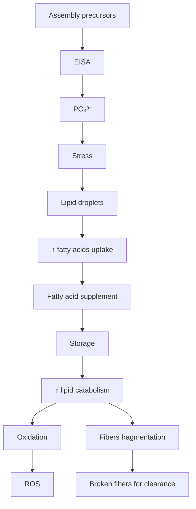

# Enzyme-Instructed Self-Assembly Reprograms Fatty Acid Metabolism for Cancer Therapeutics

Hongjian He, Haonan Lin, Le Wang, Xinyan Teng, Samar Aldahan, Meng Zhang, Meihui Yi, Guangrui Ding, Bing Xu,\* and Ji-Xin Cheng\*

Enzyme-instructed self-assembly (EISA) is actively explored as a promising therapeutic approach for cancer treatment. However, the metabolic response of cancer cells to EISA remains under-studied. Here, by stimulated Raman scattering (SRS) imaging in C─H, fingerprint, and silent windows, it is found that the formation of peptide assemblies within and around cancer cells significantly enhances both lipids catabolism and fatty acids (FAs) uptake. It is further found that the increased uptake of FAs aids the resistance of cancer cells under EISA treatment, likely to cope with the stress induced by the peptide assemblies. Combining EISA with FAs uptake inhibition leads to enhanced cancer suppression compared to EISA alone, while additional FAs supplementation rescue cancer cells from EISA treatment, both in vitro and in 3D-culture spheroid models. These findings shed new light on the impact of EISA on the metabolic activities of cancer cells and suggest a new approach for improved cancer therapy.

## 1. Introduction

Cancer remains one of the most life-threatening diseases globally, despite extensive research and numerous efforts have been

H. He, H. Lin, L. Wang, M. Zhang, G. Ding, J.-X. Cheng

Department of Electrical and Computer Engineering

Boston University

Boston, MA 02215, USA

E-mail: jxcheng@bu.edu

H. He, H. Lin, L. Wang, X. Teng, M. Zhang, G. Ding, J.-X. Cheng

Photonics Center

Boston University

Boston, MA 02215, USA

X. Teng, J.-X. Cheng

Department of Chemistry

Boston University

Boston, MA 02215, USA

S. Aldahan, J.-X. Cheng

Department of Biomedical Engineering

Boston University

Boston, MA 02215, USA

M. Yi, B. Xu

Department of Chemistry

Brandeis University

Waltham, MA 02453, USA

E-mail: bxu@brandeis.edu

The ORCID identification number(s) for the author(s) of this article can be found under https://doi.org/10.1002/adhm.202500469

DOI: 10.1002/adhm.202500469 put into the development of treatment strategies. Recently, EISA has attracted significant attention as a promising therapeutic approach for cancer.[1] EISA offers a remarkable improvement over conventional chemotherapy through high cancer cell selectivity and reduced cytotoxicity toward normal cells.[1,2] However, further improvements in the cancer suppression efficacy of EISA are critical to fully realize its therapeutic potential.[3] Cancer cells constantly reprogram cell metabolism to survive under stress.[4] Thus, disrupting the metabolic processes that are essential for the survival of cancer cells in the presence of EISA could enhance the cancer inhibition efficacy of the therapeutic agents through increasing cell stress.[5] Therefore, investigating the metabolic reprogramming, particularly in FAs and glucose metabolism, in

cancer cells in response to EISA is essential for developing more potent and targeted cancer treatment strategies using EISA. However, such studies remain underexplored.

The study of small molecule metabolism in cells is challenging. Traditional strategies such as fluorescence imaging, mass spectrometry imaging (MSI), and magnetic resonance imaging (MRI), though widely used, exhibit limitations in visualizing the metabolism of small nutrient molecules in cells. Fluorescencelabeled derivatives of nutrient molecules, like 2-NBDG as the analog of glucose[6] and BODIPY-labeled fatty acids,[7] have been employed to investigate the metabolic processes of glucose and various fatty acids. However, the incorporation of bulky fluorophore labels inherently alters the properties of these molecules,[8] resulting in findings that probably deviate from the true biological behaviors. Besides fluorescence, MSI is also commonly utilized to map the metabolism of small molecules in tissues.[9] However, The spatial resolution of MRI, exceeding 10 μm,[9,10] hardly provides the subcellular details required for single-cell analysis. Similarly, while MRI is extensively applied to visualize metabolic activities in vivo,[11] the micrometer-level spatial resolution hardly delivers the subcellular information required for single-cell analysis.[12]

SRS microscopy, a chemical imaging technology that detects the vibrations of chemical bonds, provides a new approach to observe the metabolism of small molecules at the singlecell level.[13] Hyperspectral SRS imaging combined with spectral unmixing algorism allows a label-free imaging of multiple components,[14] enabling a direct observation of the molecules of interest without extra labeling. Additionally, deuterium (D)- labeled analogs of small molecules can be utilized in SRS imaging with many advantages.[15] First, deuterium labeling is significantly smaller and less invasive than fluorophore labeling, thus, preserving the intrinsic characteristics of the molecules, resulting in more accurate and reliable observations. Second, the SRS signal of C─D bonds locates within the cell silence region,[16] where cellular molecules barely produce Raman signals, pro viding a clean background for signal detection. Furthermore, SRS offers sub-micrometer spatial resolution,[13] which is sufficient to resolve subcellular structures, enabling detailed analy sis of metabolic pathways within individual cells. These advantages make SRS microscopy a powerful tool for studying cellular metabolism with precision and accuracy that exceeds conventional imaging techniques. Multiple groups have deployed SRS microscopy to elucidate altered lipid metabolism during cancer progression[17] and in response to chemotherapy,[5a,14,18] where an increased intracellular lipid content is a common signature.

flowchart

Scheme 1. Enhanced lipid catabolism, FAs uptake, and FAs anabolism in cancer cells in response to EISA.

In this study, by label-free SRS imaging of EISA and lipids in the fingerprint and C H window, and SRS imaging of deuterated FAs and glucose in the silent window, we show that the formation of peptide nano-assemblies within and around cancer cells triggers significantly enhanced intracellular lipids catabolism, FAs uptake, and FAs anabolism, indicating a metabolism reprogramming to cope with the stress caused by EISA. It is found that this upregulated FAs uptake contributes to the resistance of cancer cells to EISA treatment by promoting the clearance of peptide nano-assemblies from cells through enhanced fatty acid oxidation (FAO) likely for energy production, peptide nanofibers fragmentation, and fibrillogenesis inhibition. Conversely, the re liance on glucose metabolism decreases significantly in cancer cells following the EISA treatment. Notably, the combination of EISA with FAs uptake inhibitors (e. g. BMS 309 403)[19] resulted in synergistically improved suppression on cancer cells proliferation. In contrast, additional supplement of FAs rescue cancer cells from EISA treatment. This phenomenon was observed both in vitro and in 3D spheroid culture models. These findings uncover the metabolic response of cancer cells to EISA, illuminate the roles of FAs in cancer cell resistance to EISA (shown in ), and underscore the potential of EISA to modulate Scheme 1cancer cell metabolism, offering a novel and promising strategy for a more effective cancer therapy.

## 2. Results and Discussion

## 2.1. EISA Drastically Decreases Lipid Droplet Content in Cancer Cells

To investigate the effects of EISA on cancer cell metabolism, we designed and synthesized a class of EISA precursors based on a classic self-assembling motif,[20] which includes a 2- naphthaleneacetic acid ( ) moiety at N-terminal, followed Napby two D-phenylalanine ( ). A D-lysine ( ) is inserted after f kwith the side chain connecting to a 2-Naphthaleneacetic Nap-ffacid or D-2-Naphthylalanine for enhancing intermolecular ??–?? stacking[21] and increasing the Raman signal from the naphthalene group. A D-phosphotyrosine $\left( _ { \mathsf { p } } \mathsf { y } \right)$ is conjugated to the Cpyterminal of the peptides as a substrate for alkaline phosphatase (ALP), an enzyme overexpressed in many cancer cell lines.[22] The peptide with 2-naphthaleneacetic acid at the side chain is named

A  

chemical

Chemical reaction scheme showing phosphorylation of a compound from P-1 and P-2 precursors via aldehyde intermediate

B  

line chart

| cm⁻¹   | SRS intensity/A.U. |
| ------ | ------------------ |
| 1380   | 1.25               |

C  

text_image

SJS-1 cells
PBS control	P-1	P-2
Sum C-H
Sum fingerprint
40 µm

line chart

| cm⁻¹   | SRS intensity/A.U. |
| ------ | ------------------ |
| 1380   | 1.2                |

D  

heatmap

| Category | PBS control | P-1 | P-2 |
| -------- | ----------- | --- | --- |
| EISA     | 0.4         | 0.4 | 0.4 |
| Protein  | 0.4         | 0.4 | 0.4 |
| Lipids   | 0.4         | 0.4 | 0.4 |

E  

bar chart

| Group   | SRS intensity/A. U. |
|---------|---------------------|
| Control | 4.0                 |
| P-2     | 1.5                 |
| P-1     | 1.0                 |

Figure 1. Lipid contents drastically decrease in cancer cells in respond to EISA treatment. A) Molecular structures of P-1 and P-2 and their structural transformations following enzymatic reactions. B) SRS spectra of P-1 and P-2 in fingerprint region (1200–1550 cm−1). C) Sum stacks of hyperspectral SRS images of SJSA-1 cells incubated with P-1, P-2, and PBS (control) in $\mathsf { C } \mathrm { - } \mathsf { H } ( 2 8 0 0 \mathrm { - } 3 0 0 0 \mathsf { c m } ^ { - 1 } )$ and fingerprint region $( 7 2 0 0 - 7 5 5 0 c m ^ { - 1 } )$ . D) LASSO unmixing results of peptide drugs, lipid, and protein in SJSA-1 cells. E) Statistic analysis of lipid contents in SJSA-1 cells treated by P-1, P-2, and PBS (control). $n = 2 0 ,$ data are presented as mean ± standard deviation, \*\*\* means p <0.001.

and the one with D-2-naphthylalanine at the side chain is P-1named , as shown in A. The ALP-catalyzed dephos-P-2phorylation of $\mathbf { p } ^ { \mathbf { y } }$ Figure 1in the peptides initiates the molecular assempybly process, generating in situ nanofibers (Figure S1, Supporting Information). To obtain the SRS spectra of and in the fingerprint region $( 1 2 0 0 { - } 1 5 5 0 \ \mathrm { c m } ^ { - 1 } )$ P-1 P-2, we performed hyperspectral SRS imaging on the powders of these compounds. As shown in Figure 1B, a distinct peak at $1 3 8 0 \mathrm { c m } ^ { - 1 }$ , attributed to the naphthalene group,[23] is clearly observed, along with two shoulder peaks at 1283 and $1 4 4 0 \mathrm { c m } ^ { - 1 }$ , corresponding to unsaturated CH stretching, asymmetric $\delta ( \mathrm { C H } _ { 2 } )$ and $\delta ( \mathrm { C H } _ { 3 } )$ vibrations, respectively. Notably, we found that the SRS spectra of and show iden-P-1 P-2tical features to the corresponding dephosphorylated enzymatic products in the fingerprint region $( 1 2 0 0 - 1 5 5 0 ~ \mathrm { c m ^ { - 1 } }$ , Figure S2, Supporting Information), likely because the Raman signal of the phosphate group primarily appears below $1 2 0 0 \mathrm { c m } ^ { - 1 }$ .

To examine how EISA affects the lipid metabolism in cancer cells, an osteosarcoma cell line named SJSA-1 with a high ALP expression level[24] is used. After incubating SJSA-1 cells with and for 24 h, we acquired stacks of hyperspec-P-1 P-2tral SRS images of the cells in C─H (2800–3000 cm−1) and fingerprint (1200–1550 cm−1) region as shown in Figure 1C and Videos S1–S4 (Supporting Information). The hyperspectral SRS images in the fingerprint region were then analyzed using the least absolute shrinkage and selection operator (LASSO, see Figure S3, Supporting Information for principle) spectral unmix ing algorithm,[14] generating the maps of Nap-containing peptides, lipids, and proteins (Figure 1D), based on corresponding spectral references[14] (Figure 1B; Figure S4, Supporting Information). Notably, because the SRS spectra of and show P-1 P-2identical features to the corresponding dephosphorylated enzymatic products in fingerprint region (1200–1550 cm−1, Figure S2, Supporting Information), all Nap-tagged peptide constituents, including both assembly precursors and enzymatic products, can be distinguished by using the spectra of and as references P-1 P-2in LASSO unmixing. Finally, we performed a quantitative analysis of lipid content by measuring the integrated intensity within each individual cell (Figure 1E).

As shown in Figure 1C, the sum stacks of hyperspectral SRS images in the C─H and fingerprint regions clearly reveal the cell morphology. The cells treated by or demonstrate P-1 P-2higher integrated SRS intensity compared to the untreated control (Figure S5, Supporting Information), likely due to the cellular uptake of Nap-tagged peptides which bring in extra SRS signals. These results suggest an efficient internalization of the peptide into cancer cells. To distinguish between the Nap-tagged peptides, lipid, and protein components in the hyperspectral images, we performed LASSO spectral unmixing algorithm on the data. As shown in Figure 1D, the protein component is distributed throughout the cells, while the lipid content is primarily localized in lipid droplets, as indicated by a punctate shape (Figure 1D). LASSO analysis also reveals that the cells treated with and P-1 show strong SRS signal from these Nap-tagged peptides in-P-2side the cells and around the cell periphery (Figure 1D). Notably, the chunky appearance of these Nap-tagged peptides suggests the formation of molecular assemblies. These results confirm an internalization of the Nap-tagged peptides into SJSA-1 cells as well as an efficient process of EISA inside the cells and on the cell surface, which is facilitated by the endogenous ALPcatalyzed dephosphorylation of $\mathbf { \nabla } _ { \mathbf { p } } \mathbf { y } .$ A closer examination of the pycell area reveals a strong peptide assembly signal in the central region, likely corresponding to the nucleus, along with a wormlike structure extending outside the nucleus, possibly within the endoplasmic reticulum. Future studies integrating two-photon fluorescence imaging with organelle-specific fluorescence trackers would provide more precise insights into the subcellular localization of these peptide assemblies. In contrast, the cells in peptide-free group (control) rarely displays SRS signal from the Nap-tagged peptides (Figure 1D), demonstrating a minimal signal leakage between different channels during the spectral unmixing process, validating the accuracy of LASSO algorithm in isolating different molecular components from the hyperspectral images.

Interestingly, a substantial decrease in lipid content is ob served in the cells pretreated with or compared to the control group (Figure 1D,E), suggesting a lipid metabolism reprogramming in response to EISA. This reduction in lipid content points to a potential mechanism of metabolic reprogramming: In the presence of EISA, lipid catabolism increases significantly, surpassing the rate of fatty acids uptake and anabolism when fatty acids supply is limited, especially in standard culture medium,[25] which leads to an overall decrease in cellular lipid levels. This finding contrasts with previous reports which indicated that an increased intracellular lipid content is a common signature in response to chemotherapy.[5a,14,18] This unexpected observation suggests that EISA induces a previously underexplored mechanism of lipid metabolism reprogramming in cancer cells.

## 2.2. EISA Significantly Increases the Lipid Catabolism, FAs Uptake and FAs Anabolism in Cancer Cells

To investigate how lipid metabolism gets modulated in cancer cells, we followed the procedure shown in A. Briefly, cells Figure 2were first incubated with the culture medium, extra supplied with fully deuterated palmitic acid (PA-d31, 50 μm, 24 h) which serves as the tracker of FAs internalization and anabolism. After washing with PBS, the cells were treated with , (200 μm, 6 h), or an equivalent volume of PBS (control), respectively, in a PAd31-free medium. Finally, the cells were fixed by formalin and analyzed using SRS imaging. As shown in Figure 2B, the SRS images in the C─H region reveal the overall cell morphology. In the control group, SRS images in the cell silence window[26] show strong C─D signal within the cells (Figure 2B), indicating an efficient internalization of PA-d31. The punctate appearance of C─D signal (Figure 2B) suggests that PA-d31 was predominantly converted to glycolipids and stored in lipid droplets. Interestingly, SJSA-1 cells followed the treatment with Nap-tagged peptides exhibit a statistically significant reduction in the intracellular C D signal compared to the ones in control group (Figure 2B,C). This finding suggests a substantial increase in lipid catabolism or lipid consumption in SJSA-1 cells under the stress induced by EISA. The upregulated lipid catabolism also indicates an increased demand for free FAs to support the survival of SJSA-1 cells in the presence of EISA.

Because cells tend to maintain homeostasis, the enhanced lipid catabolism should lead to increased FAs uptake and FAs anabolism when FAs supply is sufficient. To further confirm that EISA treatment increases lipid catabolism, we treated the cells by the procedure shown in Figure 2D. Briefly, the cells were first pretreated with or (200 μm, 24 h) or equal volume of PBS P-1 P-2(control) and then washed with PBS. Afterward, the cells were incubated in the medium supplemented with extra PA-d31 (50 μm, 24 h). Here, PA-d31 served two purposes: 1) to compensate for any FAs deficiency in culture medium, as the FAs content in basic culture medium is limited,[25] and 2) to track FAs uptake and anabolism. Finally, the cells were fixed with formalin and analyzed using SRS imaging. As shown in Figure 2E, the SRS imaging in C─H region reveals the cell morphology. Notably, the intracellular SRS signal of C D bond in the cells treated with or is significantly higher than that in the control group P-1 P-2(Figure 2E,F), suggesting an enhanced FAs uptake and storage in the presence of EISA. Interestingly, the average SRS signal intensity of C─D in the cells incubated with is higher than

A  

flowchart

B  

text_image

SJSA-1 cells
PBS control	P-1	P-2
Sum stack (C-H)
Sum stack (C-D)
15 µm

C  

bar chart

| Group   | SRS intensity/A.U. |
|---------|---------------------|
| Control | 7                   |
| P-1     | 1                   |
| P-2     | 3                   |

D  

flowchart

text_image

SJSA-1 cells + PA-d32 (24 h)
Pretreated: PBS control	P-1	P-2
Sum stack (C-H)
Sun stack (C-D)
50
15 µm

F  

bar chart

| Group   | SRS intensity/A. U. |
|---------|---------------------|
| P-1     | 40                  |
| P-2     | 20                  |
| Control | 5                   |

Figure 2. The lipid catabolism, FAs uptake, and FAs anabolism in cancer cells significantly increases after EISA treatment. A) Schematic illustration of the PA-d31-pretreated procedure. B) SRS images of the deuterium-labeled FAs and lipids in SJSA-1 cells. C) Statistics of the SRS signal intensity of C─D bond in the cells in (B), $n = 3 0$ , data are presented as mean ± standard deviation, \*\*\* means p <0.001. D) Schematic illustration of the peptide drug-pretreated procedure. E) SRS images of the deuterium-labeled FAs and lipids in SJSA-1 cells. F) Statistics of the SRS signal intensity of C D bond in the cells in $( \mathsf { E } ) , n = 3 0$ , data are presented as mean ± standard deviation, \*\*\* means $p < 0 . 0 0 1$ .

in those treated with (Figure 2E,F), indicating that in-P-2 P-1duces more stress on cancer cells than through EISA. We P-2also utilized fully deuterated oleic acid (OA-d34) to assess the reliance of cancer cells on unsaturated fatty acids in response to EISA, following the same procedure shown in Figure 2D. Consistently, cells pretreated with and exhibited higher SRS P-1 P-2signal intensity of C D bond compared to the cells in control group (Figure S6, Supporting Information). However, the relative increase in the SRS signal of OA-d34 was less pronounced than that of PA-d31 (Figure 2E,F; Figure S6, Supporting Information). These findings suggest that SJSA-1 cells preferentially internalize more PA than OA in the presence of EISA, possibly because OA can be synthesized from PA through fatty acid elongation and desaturation.[27] The same scenario was observed in Hela cells (Figure S7, Supporting Information), another cancer cell line overexpressing ALP.[28] Thus, the above results suggest that EISA reprograms the lipid metabolism in cancer cells by increasing the demand for FAs.

## 2.3. Cancer Metabolism is More FAs-Dependent and Less Glucose-Dependent After EISA Treatment

The increased demand for free FAs in SJSA-1 cells implies that, in response to EISA, cancer cells rely more heavily on FAs as a nutrient source. To support this hypothesis, we cul-

A  
SJSA-1 cells in delipidated medium  

text_image

PBS control
P-1
P-2
Anti-LC3B
15 µm

B

SJSA-1 cells  

text_image

PBS control
P-1
P-2
DCFDA
50 µm

C

Average Fl intensity  

box plot

| Group | Fluorescence intensity/A. U. |
|-------|-----------------------------|
| Ctrl  | ~40                         |
| P-1   | ~100                        |
| P-2   | ~120                        |

D  
Fatty acid oxidation assay  

line chart

| Time/min | P-1   | P-2   | Ctrl  |
| -------- | ----- | ----- | ----- |
| 0        | 0     | 0     | 0     |
| 5        | 100   | 80    | 60    |
| 10       | 200   | 180   | 140   |
| 15       | 280   | 240   | 180   |
| 20       | 350   | 320   | 220   |
| 25       | 400   | 360   | 230   |
| 30       | 420   | 380   | 240   |

E  

text_image

Sum C-H
Sum C-D
Control
P-1
P-2
40 µm

F  
Mean CD intensity

bar chart

| Group | C-D intensity per cell/A.U. |
|-------|-----------------------------|
| Ctrl  | 4.0                         |
| P-1   | 0.3                         |
| P-2   | 0.4                         |

Figure 3. Cancer metabolism becomes more FAs-dependent and less glucose-dependent after EISA treatment. A) Immunofluorescence images of LC3 protein in SJSA-1 cells with/without the treatment of EISA. B) Fluorescence images of the oxidative stress in SJSA-1 cells with/without the treatment of EISA. C) Statistics of the fluorescence signal intensity in the cells in (B), n = 30, data are presented as mean ± standard deviation, \*\*\* means $p < 0 . 0 0 1$ . D) Fatty acid oxidation assay of SJSA-1 cells with/without the treatment of EISA. n = 3, data are presented as mean ± standard deviation. E) SRS images of the anabolism of the deuterium-labeled glucose in SJSA-1 cells with/without the treatment of EISA. F) Statistics of the SRS signal intensity of $C - D$ bond in the cells in (E), n = 20, data are presented as mean ± standard deviation, \*\* means p <0.01.

tured SJSA-1 cells in delipidated medium with and without the Nap-tagged peptides. Immunofluorescence imaging of LC3 protein, an autophagosome marker,[29] revealed little autophagosome formation within 24 h in SISA-1 cells incubated in the delipidated medium alone ( A). However, numerous au-Figure 3tophagosomes (indicated by arrows) appeared in the cancer cells that were cultured in the same medium with the addition of P-1 P-1or (Figure 3A). These results suggest that while lipids deprivation alone rarely trigger autophagy in SJSA-1 cells within 24 h, autophagy occurs in the cells treated with or under delip-P-1 P-2idated conditions. Thus, the results above further support that FAs become more critical for cancer cells as a nutrient source in the presence of EISA. Additionally, we observed increased oxidative stress in SJSA-1 cells treated with  or  (Figure 3B,C) P-1 P-2compared to the cells in a drug-free group (control), suggesting heightened oxidative activity, like fatty acid oxidation, in cancer cells in response to EISA. To verify this hypothesis, we conducted a FAO assay in SJSA-1 cells with and without the treatment of P-1and . As shown in Figure 3D, the FAO levels in cells treated P-2with or were significantly higher than those in cells from P-1 P-2EISA-free group. The results above indicate that, under the EISAinduced stress, cancer cells require more FAs as a nutrient for energy production through FAO.

In addition to fatty acids, we also investigate glucose metabolism in cancer cells under EISA-induced stress, because glucose is as well a crucial nutrient for cellular function. To visualize glucose metabolism using SRS imaging, we employ D-Glucose-1,2,3,4,5,6,6-d7 (Glu-d7) as a tracker to monitor glucose anabolism in cancer cells. As shown in Figure 3E, the SRS images of C H bond display cell morphology. Notably, cancer cells incu bated with Glu-d7 alone (control) exhibit observable SRS signal of C─D bond in 3 days (Figure 3E), although the total intracellular SRS signal intensity is weaker compared to the PA-d31 fed cells (Figures 3E,2E). The above results indicate an active glucose anabolism in SJSA-1 cells which is detectable by SRS imaging. However, cells incubated with Glu-d7 in the presence of and P-1display a markedly reduced intracellular SRS signal of C─D P-2bond (Figure 3E,F), suggesting a significant decrease in glucose anabolism. Thus, these results probably imply a downregulation of glucose metabolism in cancer cells under the EISA-induced stress.

## 2.4. Enhanced FAs Uptake Aids the Clearance of Peptide Assemblies

The substantial surge in the demand of FAs in cancer cells suggests that FAs plays a crucial role in supporting cancer cell survival under the stress caused by EISA, probably more than a nutrient for energy production. Given that one of the predominant mechanisms of drug resistance is the efflux of therapeutic agents from cells,[30] we hypothesized that FAs may facilitate the removal of Nap-tagged peptides from cancer cells. To validate this hypothesis, we preincubated SJSA-1 cells with P-1and subsequently exposed the cells to either a delipidated culture medium, a standard culture medium, or a standard medium supplemented with additional palmitic acid (PA). The cells were then analyzed using hyperspectral SRS imaging. As depicted in A, the sum stacks of hyperspectral SRS images in the Figure 4C─H and fingerprint regions clearly revealed the cell morphology. Again, LASSO unmixing algorithm was performed to distinguish the Nap-tagged peptides from the hyperspectral images in fingerprint region. As shown in Figure 4A,B, the SJSA-1 cells incubated in delipidated medium retained the highest levels of the peptide assemblies, followed by those in standard medium, with the lowest retention of peptide assemblies observed in cells incubated in the medium supplemented with extra PA. Thus, the results above indicate that fatty acids, such as PA, contribute to the clearance of EISA in cancer cells.

It has been reported that FAs interact with amyloid peptides to induce assemblage fragmentation[31] and inhibit fibrillogenesis.[32] Since shorter peptide nanofibers are likely easier for cells to clear than the longer ones, based on the above reports,[31,32] we hypothesized that PA may assist in the clearance of EISA in cancer cells by inhibiting a further growth of nanofibers and, simultaneously, breaking down pre-formed nanofibers into shorter fragments through its interaction with EISA. To test this hypothesis, we used transmission electron microscopy (TEM) to observe the peptide nanofibers formed by P-1after ALP-catalyzed dephosphorylation, both with and without the addition of PA in PBS. As shown in Figure 4C, the phosphorylated form of self-assembled into small nanoparticles in P-1PBS. Upon the addition of ALP, long nanofibers were observed in both 24 and 48 h in TEM images (Figure S1, Supporting Information for 24 h; and Figure 4C for 48 h), confirming the ALP-induced self-assembly of . Interestingly, much shorter P-1and sparser nanofibers were observed by TEM when and P-1ALP were premixed for 24 h, followed by the addition of PA (50 μm) and another 24 h incubation (Figure 4C). Moreover, we quantified the peptide nanofibrils formation via Thioflavin T (ThT) assay.[33] Results show that the mixture of and ALP P-1exhibit much stronger ThT fluorescence compare to the one with PA addition (Figure 4D), indicating that PA reduced the extent of peptide assembly formation. These findings suggest that PA likely interacts with EISA, inhibiting further fibrillogenesis while simultaneously breaking down the pre-formed long fibers into shorter ones. Because shorter peptide nanofibers are probably easier to get cleared by cells than the longer ones, the combined effects of fibrillogenesis inhibition and nanofiber fragmentation may facilitate the clearance of nanofibers from cancer cells (Figure 4A). Moreover, the clearance of peptide nanofibers from cells is likely an energy-consuming process, which corresponds with the increased FAO observed in cancer cells in response to EISA (Figure 3D).

## 2.5. Inhibition of FAs Uptake Aids EISA in the Suppression of Cancer Proliferation

Recognizing the essential role of FAs in supporting cancer cell survival under EISA-induced stress, we investigated whether inhibiting FA internalization could enhance the anticancer efficacy of EISA. As shown in A, treatments with either or Figure 5 P-1 P-alone in a 2D cell culture model reduced the viability of SJSA-1 2cells to 26% and 44%, respectively. Notably, when combine either or with BMS309403, a selective inhibitor of fatty P-1 P-2acid binding protein 4 (FABP4) that blocks FA uptake, the cell viability significantly further reduced to 11% and 28%, respectively (Figure 5A). Computational analysis[34] indicated that such combination exhibited a synergistic improvement in cancer inhibition (Figure S8, Supporting Information). This result indicates that FAs deprivation intensifies the suppressive effects of EISA on cancer cell viability, although BMS309403 (20 μm) show very little toxicity to cells (Figure S9A, Supporting Information). Interestingly, adding PA to either or treatment rescued P-1 P-2SJSA-1 cells from the EISA-induced stress with the cell viability increased to 40% and 57%, respectively (Figure 5A). Same trends were observed in the 2D culture using HeLa cells (Figure S9B, Supporting Information). These findings highlight the essential role of FAs as a necessary nutrient for cancer cell resilience under EISA-induced therapeutic stress. However, the additional supply of D-glucose had little effect on the cancer suppression efficiency of (Figure S10, Supporting Information), likely due to a re-P-1duction in glucose uptake, a transporter-mediated process, which limits the intracellular glucose concentration regardless of extracellular availability.

heatmap

| Sample Type | Condition     | Value |
|-------------|---------------|-------|
| Sum C-H     | Delipidated   | 75    |
| Sum C-H     | Standard      | 75    |
| Sum C-H     | +PA           | 75    |
| Sum fingerprint | Delipidated | 75    |
| Sum fingerprint | Standard | 75    |
| Sum fingerprint | +PA          | 75    |
| P-1 (LASSO) | Delipidated | 75    |
| P-1 (LASSO) | Standard | 75    |
| P-1 (LASSO) | +PA          | 75    |

violin chart

| Group      | Mean Intensity (n) |
| ---------- | ------------------ |
| Delipidated | 30                 |
| Standard   | 30                 |
| +PA        | 30                 |

text_image

C
P-1
P-1+ALP
P-1+ALP+PA
100 nm
Long dense
nanofibers
Short sparse
nanofibers

bar chart

| Condition     | ThT intensity/A. U. |
| ------------- | ------------------ |
| No PA         | 2.8×10⁴            |
| 100 µM PA     | 0.9×10⁴            |
| 50 µM PA      | 1.2×10⁴            |

Figure 4. Enhanced FAs uptake aids the clearance of peptide assemblies in cancer cells by fragmentizing the nanofibers formed by EISA. A) LASSO unmixing results of the peptide assemblies from the hyperspectral SRS images of the P-1-pretreated SJSA-1 cells. B) Statistics of the SRS signal intensity $( { \mathsf { A } } ) , n = 3 0 ,$ $p < 0 . 0 0 1 , ^ { \ast \ast }$ $p < 0 . 0 1 . \mathsf { C } )$ TEM images of P-1, the peptide assemblies formed by the ALP-catalyzed dephosphorylation of P-1 (48 h), and the peptide assemblies formed by the dephosphorylation of P-1 (24 h) followed by the addition of PA (50 μm) for another 24 h. D) ThT assay of the extent of peptide assemblies formed by the dephosphorylation of P-1 in the presence or absence of $\mathsf { P A } . n = 3 ,$ , data are presented as mean ± standard deviation, \* means p <0.05.

Since the inhibition of FAs uptake improved the anticancer efficacy of EISA in 2D cell culture, to evaluate this strategy in a more tumor-like environment, we extended the treatment method to 3D cell spheroid model which more closely mimic the conditions within solid tumors.[35] Here, SJSA-1 cells were chosen to form tumor spheroids. Consistent with our findings on 2D cell culture, the anti-cancer effect of against the spheroids P-1of SJSA-1 cells exhibited a similar trend (Figure 5B–D). In a live/dead cell viability assay, we observed that the cancer suppression by was enhanced (66% dead) when BMS309403 was combined with P-1 compared to the treatment with P-1 alone (45% dead. Figure 5B.C). Furthermore. adding PA rescued the cancer cells in the spheroids from treatment (34% dead), as P-1shown in Figure 5D. Moreover, the inhibitory effect of on the

3D tumor spheroids formed by HeLa cells exhibits a comparable trend to that observed in SJSA-1 cells (Figure S11, Supporting Information). These results in both 2- and 3D models provide strong evidence that targeting FA metabolism in combination with EISA could offer a robust approach to cancer therapy.

## 3. Conclusion

EISA represent a promising way to generate in situ nanomedicine[36] for targeted cancer therapy, yet the metabolic adaptations of cancer cells in response to EISA remain largely unexplored. In this study, using SRS imaging, we revealed a metabolic reprogramming in cancer cells induced by EISA, which is feature by a significant increase in FAs uptake and an FA-dependent metabolic state. Vibrational imaging techniques like SRS are remarkably valuable for studying cellular

bar chart

| Treatment | P-1 (200 µM) | P-2 (200 µM) |
| --------- | ------------ | ------------ |
| BMS + PA - | 10%          | 25%          |
| BMS + PA + | 25%          | 40%          |
| PA -       | 35%          | 55%          |

scatterplot

| Condition | Percentage |
| --------- | ---------- |
| Live      | 55%        |
| Dead      | 45%        |

C SJSA-1 cell spheroids: P-1 + BMS  

scatterplot

| Condition | Percentage |
| --------- | ---------- |
| Live      | 34%        |
| Dead      | 66%        |

scatterplot

| Condition | Percentage |
| --------- | ---------- |
| Live      | 66%        |
| Dead      | 34%        |

Figure 5. Combining FAs uptake inhibition with EISA enhances the suppression on cancer proliferation while PA rescue cancer cells from EISA treatment. A) MTT cell viability assay of SJSA-1 cells incubated with P-1 (200 μm, 48 h) or P-2 (200 μm, 48 h) in the presence of BMS309403 (20 μm), equal volum of PBS, or PA (50 μm), n = 3, data are presented as mean ± standard deviation. B–D) Live/dead cell viability assay of SJSA-1 cell spheroids incubated with (B) P-1 (200 μm, 48 h) alone, (C) P-1 (200 μm, 48 h) and BMS309403 (20 μm), or (D) P-1 (200 μm, 48 h) and PA (50 μm).

metabolism via allowing the observation with minimal disturbance to the natural properties of molecules and providing high spatial resolution. This capability is particularly valuable by offering precise observation of molecular dynamics and metabolic changes in response to EISA without the need for bulky labels which can alter molecular behaviors. While sensitivity continues to be a key challenge in vibrational imaging, recently, mid-infrared photothermal (MIP) microscopy has emerged as a promising technique, offering enhanced sensitivity in imaging the fingerprint region.[37] This advancement presents exciting potential for further exploration in the imaging of biomolecules within the fingerprint region. The metabolic reprogramming observed in this work underscores FAs metabolism as a promising target for the combination therapy using EISA in cancer treatment to enhance the therapeutic efficiency. While the signaling pathway that drives lipid metabolism reprogramming in cancer cells in the presence of EISA remains underexplored in this work, it warrants further investigation, which may uncover new biological insights with significant biomedical implications. Moreover, locally enhanced protein signals were observed in the protein map of EISA-treated cells compared to control cells (Figure 1D). This phenomenon may be associated with EISAinduced ER stress, leading to increased protein condensation, which is worth a further investigation. These findings suggest a new direction for enhancing the efficacy of EISA-based therapies. By understanding the metabolic changes that cancer cells undergo in response to EISA, researchers can design treatment strategies that disrupt the uptake of essential nutrient molecules beyond FAs, such as cholesterol, amino acids, ions, and vitamins. Combining EISA-based approaches with therapies that interfere these metabolic adaptations may offer a potent strategy to limit cancer cell survival and resistance, ultimately enhancing treatment efficacy. While EISA drugs show great potential for in vivo applications due to their demonstrated efficacy in tumor spheroids, key challenges remain in optimizing delivery efficiency to tumor sites and evading macrophage-mediated clearance, which could affect their therapeutic effectiveness. Overcoming these hurdles will be essential for the successful clinical translation of EISA-based strategies.

## Supporting Information

Supporting Information is available from the Wiley Online Library or from the author.

## Acknowledgements

This work was supported by R01CA142746 and R35GM136223.

## Conflict of Interest

The authors declare no conflict of interest.

## Data Availability Statement

The data that support the findings of this study are available from the corresponding author upon reasonable request.

## Keywords

cancer treatment, lipid metabolism, peptide, self-assembly

Received: January 27, 2025

Revised: March 29, 2025

Published online: April 28, 2025

[1] B. J. Kim, B. Xu, Bioconjug. Chem. 2020, 31, 492.  
[2] a) L. Hu, Y. Li, X. Lin, Y. Huo, H. Zhang, H. Wang, Angew. Chem., Int. Ed. 2021, 60, 21807; b) X. Liu, W. Zhan, G. Gao, Q. Jiang, X. Zhang, H. Zhang, X. Sun, W. Han, F.-G. Wu, G. Liang, J. Am. Chem. Soc. 2023, 145, 7918; c) X. Yang, B. Wu, J. Zhou, H. Lu, H. Zhang, F. Huang, H. Wang, Nano Lett. 2022, 22, 7588; d) D. Zheng, Y. Chen, S. Ai, R. Zhang, Z. Gao, C. Liang, L. Cao, Y. Chen, Z. Hong, Y. Shi, Research 2019, 2019. e) H. He, S. Liu, D. Wu, B. Xu, Angew. Chem., Int. Ed. 2020, 132, 16587.  
[3] a) J. Zhou, B. Xu, Bioconjug. Chem. 2015, 26, 987; b) Q. Yao, Z. Huang, D. Liu, J. Chen, Y. Gao, Adv. Mater. 2019, 31, 1804814; c) H. Liu, H. Wang, Adv. Drug Delivery Rev. 2024, 209, 115327.  
[4] M. Ren, X. Zheng, H. Gao, A. Jiang, Y. Yao, W. He, Front. Bioeng. Biotechnol. 2022, 10, 943906.  
[5] a) Y. Tan, J. Li, G. Zhao, K.-C. Huang, H. Cardenas, Y. Wang, D. Matei, J.-X. Cheng, Nat. Commun. 2022, 13, 4554; b) G. Zhao, Y. Tan, H. Cardenas, D. Vayngart, Y. Wang, H. Huang, R. Keathley, J.-J. Wei, C. R. Ferreira, S. Orsulic, Proc. Natl. Acad. Sci 2022, 119, 2203480119.  
[6] C. Zou, Y. Wang, Z. Shen, J. Biochem. Biophys. Methods. 2005, 64, 207.  
[7] a) K. Kolahi, S. Louey, O. Varlamov, K. Thornburg, PLoS One 2016, 11, 0153522; b) D. L. Marks, R. Bittman, R. E. Pagano, Histochem. Cell Biol. 2008, 130, 819; c) M. C. Madonna, J. E. Duer, J. V. Lee, J. Williams, B. Avsaroglu, C. Zhu, R. Deutsch, R. Wang, B. T. Crouch, M. D. Hirschey, Cancers 2021, 13, 148.  
[8] a) F. Hu, Z. Chen, L. Zhang, Y. Shen, L. Wei, W. Min, Angew. Chem., Int. Ed. 2015, 54, 9821; b) R. Alford, H. M. Simpson, J. Duberman, G. C. Hill, M. Ogawa, C. Regino, H. Kobayashi, P. L. Choyke, Mol. Imaging 2009, 8, 7290; c) P. Wang, B. Liu, D. Zhang, M. Y. Belew, H. A. Tissenbaum, J. X. Cheng, Angew. Chem., Int. Ed. 2014, 126, 11981.  
[9] X. Guo, W. Cao, X. Fan, Z. Guo, D. Zhang, H. Zhang, X. Ma, J. Dong, Y. Wang, W. Zhang, Angew. Chem., Int. Ed. 2023, 62, 202214804.  
[10] A. Römpp, S. Guenther, Z. Takats, B. Spengler, Anal. Bioanal. Chem. 2011, 401, 65.  
[11] a) M. Schneider, G. Janas, F. Lugauer, E. Hoppe, D. Nickel, B. M. Dale, B. Kiefer, A. Maier, M. R. Bashir, Magnetic resonance in medicine 2019, 81, 2330; b) L. M. De Leon-Rodriguez, A. J. M. Lubag, C. R. Malloy, G. V. Martinez, R. J. Gillies, A. D. Sherry, Acc. Chem. Res. 2009, 42, 948.  
[12] H.-Y. Chen, C. B. Wilson, R. Tycko, Proc. Natl. Acad. Sci 2022, 119, 2201644119.  
[13] J.-X. Cheng, W. Min, Y. Ozeki, D. Polli, Stimulated Raman scattering microscopy: Techniques and applications, Elsevier, Amsterdam, Netherlands, 2021.  
[14] Y. Tan, H. Lin, J.-X. Cheng, Sci. Adv. 2023, 9, adg6061.  
[15] a) S. J. Spratt, K. Oguchi, K. Miura, M. Asanuma, H. Kosakamoto, F. Obata, Y. Ozeki, J. Phys. Chem. B 2022, 126, 1633; b) L. Zhang, L. Shi, Y. Shen, Y. Miao, M. Wei, N. Qian, Y. Liu, W. Min, Nat. Biomed. Eng. 2019, 3, 402.  
[16] a) L. Wei, Y. Yu, Y. Shen, M. C. Wang, W. Min, Proc. Natl. Acad. Sci 2013, 110, 11226; b) S. Hong, T. Chen, Y. Zhu, A. Li, Y. Huang, X. Chen, Angew. Chem., Int. Ed. 2014, 53, 5827.  
[17] a) H. Jia, S. Yue, J. Phys. Chem. B B 2023, 127, 2381; b) Y. Li, W. Zhang, A. A. Fung, L. Shi, Aging Cell 2022, 21, 13586; c) A. S. Mutlu, T. Chen, D. Deng, M. C. Wang, J. Vis. Exp 2021, 171, 61870.  
[18] K.-C. Huang, J. Li, C. Zhang, Y. Tan, J.-X. Cheng, Iscience 2020, 23, 100953.  
[19] X. Zhu, X. Zhang, X. Cong, L. Zhu, Z. Ning, Iranian Journal of Basic Medical Sciences 2022, 25, 1260.  
[20] Y. Zhang, Y. Kuang, Y. Gao, B. Xu, Langmuir 2011, 27, 529.  
[21] K. Carter-Fenk, J. M. Herbert, Phys. Chem. Chem. Phys. 2020, 22, 24870.  
[22] a) S. Narayanan, Ann. Clin. Lab. Sci. 1983, 13, 133; b) S. M. Lim, Y. N. Kim, K. H. Park, B. Kang, H. J. Chon, C. Kim, J. H. Kim, S. Y. Rha, BMC Cancer 2016, 16, 1.  
[23] V. Librando, A. Alparone, Polycyclic Aromat. Compd. 2007, 27, 65.  
[24] S. Liu, Q. Zhang, H. He, M. Yi, W. Tan, J. Guo, B. Xu, Angew. Chem., Int. Ed. 2022, 61, 202210568.  
[25] P. L. Else, Progress in lipid research 2020, 77, 101017.  
[26] a) L. Wei, F. Hu, Y. Shen, Z. Chen, Y. Yu, C.-C. Lin, M. C. Wang, W. Min, Nat. Methods 2014, 11, 410; b) L. Wei, F. Hu, Z. Chen, Y. Shen, L. Zhang, W. Min, Acc. Chem. Res. 2016, 49, 1494.  
[27] a) M. Miyazaki, J. M. Ntambi, in Biochemistry of lipids, lipoproteins and membranes, Elsevier, Amsterdam, Netherlands, 2008, pp. 191–211; b) L. M. Bond, M. Miyazaki, L. M. O’Neill, F. Ding, J. M. Ntambi, in Biochemistry of lipids, lipoproteins and membranes, Elsevier, Amsterdam, Netherlands, 2016, pp. 185–208.  
[28] S. I. Deutsch, N. K. Ghosh, R. P. Cox, Bioch. Biophys. Acta 1977, 499, 382.  
[29] I. Tanida, T. Ueno, E. Kominami, Autophagosome and phagosome 2008, 7729.  
[30] a) X. Xue, X.-J. Liang, Chin. J. Cancer. 2012, 31, 100; b) S. Modok, H. R. Mellor, R. Callaghan, Curr. Opin. Pharmacol. 2006, 6, 350.  
[31] M. J. Widenbrant, J. Rajadas, C. Sutardja, G. G. Fuller, Biophys. J. 2006, 91, 4071.  
[32] a) A. El Shatshat, A. T. Pham, P. P. Rao, Arch. Biochem. Biophys. 2019, 663, 34; b) J. Pallbo, U. Olsson, E. Sparr, Biophys. J. 2021, 120, 4536.  
[33] a) M. Biancalana, S. Koide, Biochimica et Biophysica Acta (BBA)- Proteins and Proteomics 2010, 1804, 1405; b) C. Xue, T. Y. Lin, D. Chang, Z. Guo, R. Soc. Open Sci. 2017, 4, 160696.  
[34] T. Chou, N. Martin, ComboSyn, Paramus, NJ 2005.  
[35] A. S. Nunes, A. S. Barros, E. C. Costa, A. F. Moreira, I. J. Correia, Biotechnol. Bioeng. 2019, 116, 206.  
[36] a) Z. Feng, X. Han, H. Wang, T. Tang, B. Xu, Chem 2019, 5, 2442; b) M. D. Wang, G. T. Lv, H. W. An, N. Y. Zhang, H. Wang, Angew. Chem., Int. Ed. 2022, 61, 202113649; c) Z. Feng, H. Wang, S. Wang, Q. Zhang, X. Zhang, A. A. Rodal, B. Xu, J. Am. Chem. Soc. 2018, 140, 9566.  
[37] D. Zhang, C. Li, C. Zhang, M. N. Slipchenko, G. Eakins, J.-X. Cheng, Sci. Adv. 2016, 2, 1600521.