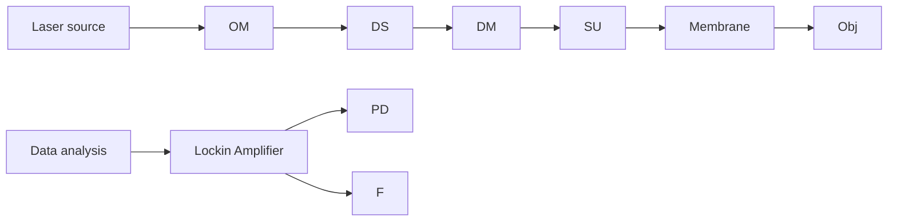

## Article

# Evolution of Membrane Fouling Revealed by Label-Free Vibrational Spectroscopic Imaging

Wei Chen, Chen Qian, Weili Hong, Ji-Xin Cheng, and Han-Qing Yu

Environ. Sci. Technol., Just Accepted Manuscript • DOI: 10.1021/acs.est.7b02775 • Publication Date (Web): 10 Aug 2017

Downloaded from http://pubs.acs.org on August 10, 2017

## Just Accepted

“Just Accepted” manuscripts have been peer-reviewed and accepted for publication. They are posted online prior to technical editing, formatting for publication and author proofing. The American Chemical Society provides “Just Accepted” as a free service to the research community to expedite the dissemination of scientific material as soon as possible after acceptance. “Just Accepted” manuscripts appear in full in PDF format accompanied by an HTML abstract. “Just Accepted” manuscripts have been fully peer reviewed, but should not be considered the official version of record. They are accessible to all readers and citable by the Digital Object Identifier (DOI®). “Just Accepted” is an optional service offered to authors. Therefore, the “Just Accepted” Web site may not include all articles that will be published in the journal. After a manuscript is technically edited and formatted, it will be removed from the “Just Accepted” Web site and published as an ASAP article. Note that technical editing may introduce minor changes to the manuscript text and/or graphics which could affect content, and all legal disclaimers and ethical guidelines that apply to the journal pertain. ACS cannot be held responsible for errors or consequences arising from the use of information contained in these “Just Accepted” manuscripts.

# Evolution of Membrane Fouling Revealed by Label-Free Vibrational Spectroscopic Imaging

Wei Chen1, Chen Qian1, Wei-Li Hong2, Ji-Xin Cheng2\*, Han-Qing Yu1\*

1CAS Key Laboratory of Urban Pollutant Conversion, Department of Chemistry,

University of Science and Technology of China, Hefei, 230026, China

2Weldon School of Biomedical Engineering, Purdue University, West Lafayette, IN

47906, USA

1 Membrane fouling is the bottleneck that restricts the sustainability of membrane  
2 technology for environmental applications. Therefore, the development of novel  
3 analytical tools for characterizing membrane fouling processes is essential. In this  
4 work, we demonstrate a capability of probing the chemical structure of foulants and  
5 detecting their 3-dimentional spatial distribution on membranes based on stimulated  
6 Raman scattering (SRS) microscopy as a vibrational spectroscopic imaging approach.  
7 The adsorption process of foulants onto membrane surfaces and their aggregation  
8 process within membrane pores during the micro-filtration of protein and  
9 polysaccharide solutions were clearly monitored. Pore constriction and cake layer  
10 formation were found to be the coupled membrane fouling mechanisms. This work  
11 establishes an ultrafast, highly sensitive, non-destructive and label-free imaging  
12 platform for the characterization of membrane fouling evolution. Furthermore, this  
13 work provides new insights into membrane fouling and offers a powerful tool for  
14 membrane-based process exploration.

## INTRODUCTION

Water pollution and energy scarcity are among the most critical challenges of modern society. The development of efficient and sustainable techniques for tapping unconventional sources of water and energy is therefore of great importance. In recent decades, membrane-based technologies have become a rising star in the areas of water purification and sustainable energy regeneration.1-3 Membrane filtration systems, such as microfiltration, ultrafiltration, nanofiltration, and forward/reverse osmosis, can effectively remove colloidal particles and dissolved organics with excellent disinfection capability for water cleaning.4, 5 Furthermore, taking advantage of membrane platforms, low-grade heat energy can be converted into mechanical work for energy harvesting.5, 6 However, the widespread application of membrane technologies is still limited because of membrane fouling, an accumulation of organic, inorganic, or biological foulants on the membrane surface and/or inside the membrane pores, which reduces membrane permeation flux, deteriorates product quality, and increases energy consumption.7-9 Proteins and polysaccharides are the key components of most substances in natural and engineered systems, e.g., dissolved organic matter (DOM)8-10 and microbial extracellular polymeric substances (EPS)11, 12 , and are thus recognized as the main factor for membrane fouling. The mechanism behind the membrane fouling induced by proteins and polysaccharides remains unclear due to the complexity of fouling behaviours, coupled mechanical and chemical kinetics, and the lack of effective analytical tools to sufficiently explore the membrane fouling process.

Membrane fouling is affected by a variety of factors, including membrane materials and structure, feed properties, and operating conditions.5, 7, 8, 13-15 Different types of fouling forms have been proposed, including pore constriction, pore blockage, and deposit-forming cake layers.7, 16-18 In addition to the conventional approaches, various new techniques have been utilized to characterize membrane fouling processes, such as ultrasonic time domain reflectometry,19, 20 electrical impedance spectroscopy,21, 22 and 3-dimentional (3D) optical coherence tomography (OCT) imaging.23 Some of them can provide real-time information on membrane fouling, such as change in porosity and fouling layer formation, but fail to discriminate the different chemical compositions of foulants, which is considered crucial to the evaluation of the roles of foulant species in fouling process.

Optical and spectroscopic techniques have been extensively used to explore the chemical structure of foulants, and various modifications have been performed to enhance the sensitivity and resolution of these techniques. For example, confocal scanning laser microscopy was used to explore the fouling behavior of EPS components on polycarbonate and mixed ester membranes, and a lower-molecularweight dextran was found to enhance fouling.24 Surface-enhanced Raman scattering (SERS) has been used as a sensitive tool to probe the blocking of membrane pore at initial fouling stages and to monitor the development of biofilms.25-28 However, these techniques require fluorophores or SERS substrates, which themselves cause fouling. Raman spectroscopy has been demostrated as an effective technique for real-time fouling monitoring.29, 30 Another spectroscopic technique, infrared attenuated total reflection spectroscopy, is a label-free method that has been used to reveal the structural information of foulants and examine membrane porosity changing profiles.31-33 However, this technique is time-consuming, offers poor spatial resolution and lacks the ability to provide depth information. Recently, synchrotron Fourier transform infrared mapping was applied as a novel approach for membrane fouling characterization, and has been proven to have a potential for both qualitative and quantitative characterizations of membrane fouling layer.34 There remains a need for the development of a fast and label-free analytical tool with a high sensitivity and spatial resolution to reveal the real-time chemical information of foulants and elucidate the fouling mechanisms.

Stimulated Raman scattering (SRS) microscopy, based on non-linear optics, is an emerging vibrational spectroscopic imaging method with ultrafast, highly sensitive, label-free and non-invasive characteristics, and has been recently applied for the qualitative and quantitative analyses of tissue samples in biomedical engineering. 35-38 Coupled with multivariate curve resolution-alternative least square (MCR-ALS) analysis, hyperspectral SRS imaging is a powerful tool for investigating cellular machinery, disease diagnoses, and drug discovery in complicated microenvironments.36, 39, 40 With an SRS microscope, the penetration depth of samples can be as far as 200 µm. While MCR-ALS analysis can discriminate proteins, polysaccharides, and nucleic acids because of their characteristic Raman peaks, its spectral resolution is above 20 cm-1 , which may not be sufficient for resolving the spectral contributions of protein and polysaccharide species in membrane fouling processes. If integrated, however, SRS microscopy might become an elegant platform for 3D chemical imaging of membrane fouling. However, SRS imaging has not been applied in membrane studies yet.

Therefore, the main objective of this work was to rapidly differentiate the chemical compositions of membrane foulants and precisely detect their 3D distributions in a label-free manner. A vibrational spectroscopy-based SRS microscopic platform was established for non-invasive membrane fouling imaging. The results can be applied to, but not limited to, membrane fouling study. Bovine serum albumin (BSA) and dextran were respectively selected as the model proteins and polysaccharides for membrane fouling tests. The capabilities of the SRS imaging approach for spectroscopic, spatial and temporal characterization of membrane fouling were evaluated. Also, the corresponding membrane fouling mechanisms caused by proteins and polysaccharides were elucidated.

## EXPERIMENTAL SECTION

Reagents and Filtration Procedures. Analytical grade BSA (66 kDa), phycocyanin, dextran (70 kDa), and dextran-Fluorescein (FITC) were purchased from Sigma-Aldrich, USA. BSA and dextran were dissolved in 1X PBS solution (pH 7.4) with different mass ratios (1:0, 5:3, 1:1, 3:5, 0:1), and the total concentration was 1 g/L.

The membrane filtration system is illustrated in Figure S1. PVDF microfiltration membranes (GVWP02500) with 0.22 µm-pore sizes and 25 mm-diameters were purchased from Millipore Inc., USA. The effective filtration area was 4.1 cm2. A stirring cell with a volume of 10 mL (Amicon 8200, Millipore Inc., USA) was used for the filtration experiments. The flow rate and stirring speed were kept constant at 2.4 mL/min/cm2 and 250 rpm, respectively, during filtration. Prior to filtration, each fresh membrane was primed by filtering with ultrapure water for 20 min. After the filtration, the membrane was rinsed with deionized water and then clamped by two microscopic slides for the subsequent SRS imaging.

Raman Microspectroscopy. Spontaneous Raman measurements were conducted using a spectrometer (Shamrock SR-303i-A, Andor Technology, Belfast, UK) mounted to a microscope setup described in previous study.41 the pump laser was tuned to 707 nm with 100 mW power for Raman excitation. The Raman signal was reflected to the spectrometer by a long-pass dichroic mirror (720DCSP, Chroma Co., USA). The spectrometer was equipped with a 1200 g/mm grating, and the integration time was 30 s.

SRS Imaging Platform for Membrane Fouling Imaging. In the SRS system, two beams at 798 and 1040 nm from a femtosecond laser (Insight Deepsee, Spectra Physics Inc., USA) served as the pump and Stokes lasers for SRS excitation, and their powers before entering the microscope were adjusted to 20 and 80 mW, respectively. For the measurement of retinoic acid, the pump laser was tuned to 893 nm. The Stokes beam was modulated by an acousto-optic modulator (1205C, Isomet Inc., USA) at 2.3 MHz. A motorized optical delay stage (T-LS28E, Zaber Co., USA) was placed in the pump light path to scan the delay between two beams. The pump and Stokes beams were collinearly aligned by a dichroic mirror and chirped by four 12.7-cm long SF57 glass rods, in place of two rods to improve the spectral resolution. The Raman shift was thus controlled by the temporal delay of these two chirped beams. The beams were sent to an upright microscope (IX71, Olympus Inc., Japan) with customized galvo scanner, passing through a spectral focusing unit (SF57, Lattice Optics Inc., USA). A 60X water immersion objective lens (N.A. 1.2, LUMPlanFL, Olympus Inc., Japan) was used to focus the light onto the membrane sample. An oil condenser (N.A. 1.4, U-AAC, Olympus Inc., Japan) was used to collect the signal. The stimulated Raman loss of pump beam was detected by a Si photodiode (S3994-01, Hamamatsu Inc., Japan) with a lab-built resonant circuit and extracted using a digital lock-in amplifier (HF2LI, Zurich Instruments Inc., Switzerland). The Stokes signal was blocked by a filter (825/150 nm, Chroma Technologies Co., USA) before the photodiode.

The hyperspectral SRS imaging of membrane samples were recorded from approximately 2800 to $3 0 5 0 ~ \mathrm { c m } ^ { - 1 }$ over 70 frames. The imaging dwell time was 10 µs per pixel, and each image consisted of $2 0 0 \times 2 0 0$ pixels with a pixel length of 0.6 µm. Thus, the total acquisition time for each hyperspectral SRS image was approximately 1 min. For Z-stack imaging, the depth step was $2 \ \mu \mathrm { m } ;$ 11 slices were recorded for a total penetration depth of 20 µm from the membrane surface.

Imaging Data Processing. The images were denoised and the signal fall-off at the edge of the images was removed by FFT filter. All processes were performed using Image J software (National Institute of Health, USA), and a 3D reconstruction of image stacks was carried out using the volume viewer plugin. The display intensity was adjusted for optimal image contrast for each individual image.

The original hyperspectral SRS stacks were decomposed by MCR-ALS analysis to differentiate the membrane substrate and the foulants. The spectral profiles of the components and their concentration matrices were retrieved by a Matlab-based MCR-ALS toolbox. The concentration and spectrum values were set non-negative as constraints, and 0.01% as the convergence criterium, ensuring that small deviations in the initial estimations did not cause inconsistencies within the results. Detailed descriptions about the procedures of MCR-ALS algorithm can be found elsewhere.42

## RESULTS AND DISCUSSION

Development of SRS Imaging Platform. A schematic illustration of our membrane fouling imaging platform is shown in Figure 1. The frequency difference between the pump and Stokes pulses was centred at $2 9 1 6 ~ \mathrm { { c m } ^ { - 1 } }$ , i.e., the stretching vibration of C-H bonds, which are prevalent in membrane filtration systems. The system Raman shift with respect to the pump-Stokes pulse delay was calibrated before SRS imaging by using a set of known Raman peaks of standard chemicals, including dimethyl sulfoxide and methanol, after normalizing with the two-photon absorption signal of Rhodamine 6G (Figure S2). A linear fit between delay stage and Raman shifts indicated that these two laser pulses were linearly chirped. Using a 1951 USAF resolution test grid, the spatial resolution of our imaging system was estimated to be $0 . 5 0 \mu \mathrm { m }$ in the x direction and 0.57 µm in the y direction (Figure S3).

A spontaneous Raman spectrum of standard retinoic acid (RA) is presented in Figure 2a. An isolated RA vibrational resonance was observed at $1 5 8 0 ~ \mathrm { c m } ^ { - 1 }$ with a $9 . 6 ~ \mathrm { c m } ^ { - 1 }$ full width at half maximum (FWHM). Figure 2b shows the comparison of RA SRS spectral profiles collected using the present system with 4 rods and using a previous setup with 2 rods; their FWHMs were 17.2 and $2 8 . 5 ~ \mathrm { c m } ^ { - 1 }$ , respectively. The FWHM of RA in the SRS spectra was wider than that in the spontaneous Raman spectra. This was attributed to a high order chirp for SRS technique, which sacrificed spectral resolution as a tradeoff for a higher sensitivity. The spectral resolution of our modified system was estimated to be $1 4 ~ \mathrm { { c m } ^ { - 1 } }$ , which was greatly improved compared with the original setup $( 2 5 \mathrm { c m } ^ { - 1 } )$ .43 Such a resolution is sufficient for interrogating the molecular vibrations of chemical species in membrane fouling process.

To validate the feasibility of SRS imaging for membrane fouling, the spontaneous Raman and SRS spectral profiles of polyvinylidene fluoride (PVDF) membrane, BSA, and dextran were compared. The spontaneous Raman spectra of these three species (Figure 2c) showed strong signals in the C-H vibration region with distinct differences in both shape and peak position. PVDF polymer exhibited a stretching vibration of $\left. - \mathrm { C H } _ { 2 ^ { - } } \right.$ framework at $2 9 6 9 ~ \mathrm { c m ^ { - 1 } }$ , whereas the C-H bond stretching vibrations of proteins and polysaccharides were located at 2920 and $2 8 8 5 ~ \mathrm { c m ^ { - 1 } }$ , respectively. In the SRS spectra (Figure 2d), the peaks were broadened, but the positions remained the same when compared with the spontaneous Raman spectra. Furthermore, the peak shapes were substantially different. These comparisons are the foundation for discriminating different foulants and the membrane substrate in the SRS imaging of membrane fouling.

SRS Imaging of BSA/Dextran-Induced Membrane Fouling. Hyperspectral SRS imaging of the pure and BSA/dextran filtrated membranes was carried out. The SRS spectral profiles of the pure PVDF, BSA- and dextran-filtrated membranes at the end of the filtration period (100 min) are shown in Figure 3a. Compared with the pure PVDF membrane, which only exhibited one characteristic peak of PVDF at 2969 $\mathrm { c m } ^ { - 1 }$ , additional peaks appeared at 2910 and $2 8 9 0 ~ \mathrm { c m } ^ { - 1 }$ , for the BSA- and dextranfiltrated membranes, respectively. These results suggest that foulants adsorbed or deposited onto the surface or inside the membranes during filtration.

The SRS imaging of the pure PVDF membrane at $2 9 6 9 ~ \mathrm { c m } ^ { - 1 }$ showed uniformly distributed membrane pores (Figure 3b), indicating the capability for morphological characterization of membrane surfaces by SRS imaging. After BSA filtration, the SRS imaging of BSA foulant and membrane substrate were displayed at 2920 and 2969 $\mathrm { c m } ^ { - 1 }$ (Figure 3c), respectively. The BSA foulants were thready and unevenly distributed on the membrane, indicating that the foulants aggregated at the membranesolution interface. The membrane substrate was agglomerated, suggesting the collapse and contraction of membrane pores due to foulant adsorption. In comparison, the dextran foulants exhibited a much weaker intensity and smaller size. Furthermore, the agglomeration of membrane substrate was less severe, as shown in Figure 3d. Since the spectral intensity of the membrane substrate is a function of the local porosity of the membrane, a higher absorbance indicates a lower porosity.31, 33 Therefore, the SRS intensities of PVDF membrane at $2 9 6 9 ~ \mathrm { c m ^ { - 1 } }$ before and after the filtration of BSA/dextran solution (Figure 3c, d, and e) were compared (Table S1). Clearly, after the membrane fouling, the SRS intensity of PVDF increased, indicating the decrease in membrane porosity and the occurrence of pore blockage. Thus, pore constriction was mainly responsible for the membrane fouling during the individual filtration of BSA or dextran. Furthermore, the BSA-fouled PVDF membrane exhibited a much higher intensity than the dextran-fouled membrane, suggesting more severe membrane fouling caused by BSA than by dextran. This result is confirmed by the pure water permeability change before and after the filtration, and the flux declined by 90% and 85% after the filtration of BSA and dextran, respectively.

To obtain the thickness of the fouling layer, we performed SRS imaging of the fouled membranes along the z-direction to a depth of $2 0 ~ { \mu \mathrm { m } }$ . Cross-sections along the xz plane and 3D reconstructed images of BSA/dextran are shown in Figure 4. The display images of PVDF substrate with moderate intensities along this depth range (Figure S4) demonstrate the capability of this SRS imaging method for depth studies. The BSA and dextran foulants were mainly distributed on the membrane surface within $1 0 \ \mu \mathrm { m } ,$ and the BSA foulant exhibited a slightly deeper penetration depth than the dextran foulant. These results suggest that SRS imaging could successfully reveal the 3D spatial distribution of foulants on membranes in a label-free manner.

SRS Imaging Coupled with MCR-ALS Analysis of Membrane Fouling Caused by BSA and Dextran Mixture. To explore the ability of SRS imaging for discriminating membrane foulants with different chemical structures, we imaged the membrane fouling caused by a BSA and dextran mixture at the end of the filtration period (100 min). Since the Raman bands of BSA and dextran were close, only two peaks appeared in the SRS spectral profiles of the fouled membrane (Figure 5a). The

Raman peak at $2 9 6 9 ~ \mathrm { c m } ^ { - 1 }$ was attributed to the PVDF substrate, whereas the peak centered at $2 9 0 5 ~ \mathrm { c m ^ { - 1 } }$ was an overlap of BSA and dextran foulants. Lorentz peak fitting results showed three major peaks at 2900, 2910, and $2 9 7 0 ~ \mathrm { { c m } ^ { - 1 } }$ , corresponding to the C-H Raman bands of dextran, BSA, and the PVDF substrate, respectively. Thus, the identification of foulants was impossible simply based on the direct spectra information. To resolve the overlapping peaks and identify specific chemicals and extract useful structural information, MCR-ALS was applied to analyze the hyperspectral SRS imaging data. The SRS spectral profiles of the pure PVDF, BSA, and dextran were used as the input spectra. After decomposing the original imaging data, three output SRS spectral profiles of the components were generated (Figure 5b), which perfectly matched the SRS spectral profiles of the pure PVDF, BSA, and dextran. These results suggest that the spectral information of different foulants and the membrane substrate could be successfully differentiated by coupling hyperspectral SRS imaging with MCR-ALS analysis.

The concentration maps of these three components are shown in Figure 5c. The agglomeration of membrane substrate was more considerable and the aggregates of dextran foulants were enlarged when compared with those obtained after the individual filtration of BSA or dextran. These results indicate more severe membrane fouling caused by the filtration of the BSA and dextran mixture than those by their individual filtration. The cross-section views of the BSA and dextran foulants on the membrane along xz-plane and the corresponding 3D reconstructed images of the foulants and membrane substrate are shown in Figure S5. The foulants were primarily distributed on the membrane surface to a 10 µm depth, similar to that observed during the individual filtration of BSA or dextran. The 3D image of the PVDF substrate exhibited no signal at the top of the surface, implying that a thin cake layer (approximately 2 µm thick) was formed after the filtration of the BSA and dextran mixture.

Influence of BSA/Dextran Mass Ratio on Membrane Fouling. As shown above, the composition of the feed solution had a substantial effect on membrane fouling. To confirm this finding, membrane filtration experiments were conducted at different BSA/dextran mass ratios. Under each ratio, the hyperspectral SRS images of the membranes were collected at three time points, i.e., 30, 60, and 100 min. The SRS intensity ratio of the foulants and membrane substrate, which were located at 2905 and $2 9 6 9 ~ \mathrm { c m } ^ { - 1 }$ , respectively, was used to characterize the fouling degree. A higher intensity ratio indicates more foulants formed on the membrane. As shown in Figure 5d, the intensity ratio increased with the filtration time, demonstrating the occurrence of fouling during filtration. On the other hand, the intensity ratio of the BSA/dextran mixture filtration was higher than those of the individual BSA or dextran filtrations at all time points, and reached the highest when the BSA/dextran mass ratio was 1:1. This might be because BSA and dextran in the mixture could interact with each other and thereby synergistically resulted in more severe membrane fouling.

The above results clearly demonstrate that SRS microscopic imaging can provide very useful information on the evolution of membrane fouling induced by proteins and polysaccharides. Because of an improved spectral resolution, this technique was capable of resolving the chemical structures of protein/polysaccharide foulants from the membrane substrate and locating these foulants inside or on the membrane. The chemical imaging results showed that proteins and polysaccharides tended to adsorb inside the membrane within a $1 0 \mathrm { - } \mu \mathrm { m }$ depth from the membrane surface, occupy pore surfaces and cause pore constrictions in their individual filtration. Furthermore, proteins caused more severe membrane fouling than polysaccharides. A mixture of these two species synergistically induced more serious membrane fouling, in which the fouling extent was governed by the mass ratio. Over time, a thin cake layer was formed on the membrane. In general, for the individual protein or polysaccharide filtration, the main fouling mechanism was attributed to pore constriction, whereas pore constriction and cake layer formation were considered as the mechanism responsible for the protein/polysaccharide mixture-induced membrane fouling.

To validate the SRS imaging technique with a different and well established technique, we also used a fluorescence confocal microscopy to characterize membrane fouling. Fluorescent phycocyanin was used as the protein foulant, and dextran was labeled with FITC as the polysaccharide foulant. After filtration, the membrane was imaged using a fluorescence confocal microscopy (FV1000, Olympus Co., Japan), and the results are shown in Figure S6. Clearly, both protein and polysaccharide foulants were mainly distributed on the membrane surface within 10 µm (Figure S6a, b), and the protein aggregates were much larger than the polysaccharide counterpart (Figure S6c). These results are in consistent with our findings using the SRS imaging method. Since the laser wavelengths (488 nm for polysaccharide and 635 nm for protein) in confocal fluorescence microscopy were shorter than that in the SRS microscopy, the fluorescence confocal microscopy showed a higher sensitivity and better spatial resolution than the SRS microscopy. It should be noted, however, that fluorescence confocal microscopy technique must use fluorescent compounds, and the fouling extent could be influenced by labeling proteins or dextrans. In addition, fluorescence confocal microscopy fails to describe the change of membrane substrates, which could be readily probed by SRS microscopy.

The development of novel analytical tools for the characterization of membrane fouling evolution is critical for the development of membrane technologies. In most cases, chemical information of the foulants and their distribution cannot be simultaneously obtained during membrane fouling by conventional approaches (e.g., IR, SEM, and OCT).10, 20, 23, 26, 33 While confocal fluorescence microscopy may achieve this goal, fluorescent probes are required and affect the fouling process.24, 44 In the present work, an ultrafast, highly sensitive, non-invasive and label-free vibrational imaging platform with a sufficient spectral and spatial resolution was established for membrane fouling evolution characterization. Compared with the previously reported analytical methods, this novel approach is able to simultaneously reveal the chemical structure of foulants and their temporal/spatial distributions without labeling (Table S2).

Implications of This Work. Overall, the present SRS microscopic imaging method successfully discriminated the spectral contributions of BSA and dextran foulants from membrane substrate, and enabled the diagnosis of fouling origin. Furthermore, this method is capable of probing the pore change of membrane substrate and recognizing the fouling tendencies of protein and polysaccharide foulants based on their 3D spatial distribution. Currently, the membrane fouling is measured offline after filtration. By designing the filtration system that solves the membrane immobilization problem in filtration process with referring to other microscopes such as confocal laser scanning microscopy, real-time monitoring of membrane fouling is feasible using such an SRS imaging platform. By selecting the appropriate SRS spectral window, this approach will also have a potential for the vibrational imaging of other membrane fouling processes induced by inorganic and organic contaminants and even microorganisms. Thus, this method will also be useful in designing anti-fouling membranes and developing anti-fouling strategies.

## AUTHOR INFORMATION

\*Corresponding authors: Prof. Han-Qing Yu, E–mail: hqyu@ustc.edu.cn; Prof. Ji-Xin Cheng, E-mail: jcheng@purdue.edu

## ACKNOWLEDGEMENTS

We thank the National Natural Science Foundation of China (51538011) for the support. W.C. acknowledges the financial support from the China Scholarship Council (201506340011) and Shanghai Tongji Gao Tingyao Environmental Science & Technology Development Foundation (STGEF), China.

## ASSOCIATED CONTENT

Supporting Information Available. Averages of SRS intensity at $2 9 6 9 ~ \mathrm { c m ^ { - 1 } }$ before and after membrane fouling (Table S1), Comparison between our SRS imaging approach with previous methods for characterizing memebrane fouling process (Table S2), Schematic illustration of membrane filtration system (Figure S1), Calibration of Raman shifts in the spectral focusing system (Figure S2), Spatial resolution estimation of the imaging system (Figure S3), 3D reconstructed SRS imaging of PVDF membrane substrate (Figure S4), Cross-section view of foulants on the membrane during BSA/dextran mixture (1:1) filtration and the corresponding 3D reconstructed SRS images (Figure S5), Cross-section view of protein and polysaccharide foulants on the membrane along xz plane and the overlay image along xy plane using fluorescence confocal microscopy (Figure S6). This information is available free of charge via the Internet at http://pubs.acs.org/.

## REFERENCES

(1) Shannon, M. A.; Bohn, P. W.; Elimelech, M.; Georgiadis, J. G.; Marinas, B. J.; Mayes, A. M. Science and technology for water purification in the coming decades. Nature 2008, 452 (7185), 301-310.  
(2) Elimelech, M.; Phillip, W. A. The Future of Seawater Desalination: Energy, Technology, and the Environment. Science 2011, 333 (6043), 712-717.  
(3) Zhang, R.; Liu, Y.; He, M.; Su, Y.; Zhao, X.; Elimelech, M.; Jiang, Z. Antifouling membranes for sustainable water purification: strategies and mechanisms. Chem. Soc. Rev. 2016, 45 (21), 5888-5924.  
(4) Kovalova, L.; Siegrist, H.; Singer, H.; Wittmer, A.; McArdell, C. S. Hospital wastewater treatment by membrane bioreactor: Performance and efficiency for organic micropollutant elimination. Environ. Sci. Technol. 2012, 46 (3), 1536- 1545.  
(5) Wang, X.; Chang, V. W. C.; Tang, C. Y. Osmotic membrane bioreactor (OMBR) technology for wastewater treatment and reclamation: Advances, challenges, and prospects for the future. J. Membrane Sci. 2016, 504, 113-132.  
(6) Logan, B. E.; Elimelech, M. Membrane-based processes for sustainable power generation using water. Nature 2012, 488 (7411), 313-319.  
(7) Le-Clech, P.; Chen, V.; Fane, T. A. G. Fouling in membrane bioreactors used in wastewater treatment. J. Membrane Sci. 2006, 284 (1–2), 17-53.  
(8) Meng, F.; Liao, B.; Liang, S.; Yang, F.; Zhang, H.; Song, L. Morphological visualization, componential characterization and microbiological identification of membrane fouling in membrane bioreactors (MBRs). J. Membrane Sci. 2010, 361 (1–2), 1-14.  
(9) She, Q.; Wang, R.; Fane, A. G.; Tang, C. Y. Membrane fouling in osmotically driven membrane processes: A review. J. Membrane Sci. 2016, 499, 201-233.  
(10) Lin, H.; Zhang, M.; Wang, F.; Meng, F.; Liao, B.-Q.; Hong, H.; Chen, J.; Gao, W. A critical review of extracellular polymeric substances (EPSs) in membrane bioreactors: Characteristics, roles in membrane fouling and control strategies. J. Membrane Sci. 2014, 460, 110-125.  
(11) Sheng, G.-P.; Yu, H.-Q.; Li, X.-Y. Extracellular polymeric substances (EPS) of microbial aggregates in biological wastewater treatment systems: A review. Biotechnol. Adv. 2010, 28 (6), 882-894.  
(12) Wang, L.-L.; Wang, L.-F.; Ren, X.-M.; Ye, X.-D.; Li, W.-W.; Yuan, S.-J.; Sun, M.; Sheng, G.-P.; Yu, H.-Q.; Wang, X.-K. pH dependence of structure and surface properties of microbial EPS. Environ. Sci. Technol. 2012, 46 (2), 737-744.  
(13) Bar-Zeev, E.; Passow, U.; Romero-Vargas Castrillón, S.; Elimelech, M. Transparent exopolymer particles: From aquatic environments and engineered systems to membrane biofouling. Environ. Sci. Technol. 2014, 49 (2), 691-707.  
(14) Zheng, X.; Ernst, M.; Jekel, M. Identification and quantification of major organic foulants in treated domestic wastewater affecting filterability in dead-end ultrafiltration. Water Res. 2009, 43 (1), 238-244.  
(15) Juang, Y.-C.; Adav, S. S.; Lee, D.-J.; Lai, J.-Y. Influence of internal biofilm growth on residual permeability loss in aerobic granular membrane bioreactors. Environ. Sci. Technol. 2010, 44 (4), 1267-1273.  
(16) Katsoufidou, K. S.; Sioutopoulos, D. C.; Yiantsios, S. G.; Karabelas, A. J. UF membrane fouling by mixtures of humic acids and sodium alginate: Fouling mechanisms and reversibility. Desalination 2010, 264 (3), 220-227.  
(17) Chan, R.; Chen, V. Characterization of protein fouling on membranes: opportunities and challenges. J. Membrane Sci. 2004, 242 (1–2), 169-188.  
(18) Gamage, N. P.; Chellam, S. Mechanisms of physically irreversible fouling during surface water microfiltration and mitigation by aluminum electroflotation pretreatment. Environ. Sci. Technol. 2013, 48 (2), 1148-1157.  
(19) Sim, S. T. V.; Chong, T. H.; Krantz, W. B.; Fane, A. G. Monitoring of colloidal fouling and its associated metastability using ultrasonic time domain reflectometry. J. Membrane Sci. 2012, 401–402 (0), 241-253.  
(20) Sim, S. T. V.; Suwarno, S. R.; Chong, T. H.; Krantz, W. B.; Fane, A. G. Monitoring membrane biofouling via ultrasonic time-domain reflectometry enhanced by silica dosing. J. Membrane Sci. 2013, 428, 24-37.  
(21) Sim, L. N.; Wang, Z. J.; Gu, J.; Coster, H. G. L.; Fane, A. G. Detection of reverse osmosis membrane fouling with silica, bovine serum albumin and their mixture using in-situ electrical impedance spectroscopy. J. Membrane Sci. 2013, 443 (0), 45-53.  
(22) Hu, Z.; Antony, A.; Leslie, G.; Le-Clech, P. Real-time monitoring of scale formation in reverse osmosis using electrical impedance spectroscopy. J. Membrane Sci. 2014, 453, 320-327.  
(23) Li, W.; Liu, X.; Wang, Y.-N.; Chong, T. H.; Tang, C. Y.; Fane, A. G. Analyzing the evolution of membrane fouling via a novel method based on 3D optical coherence tomography imaging. Environ. Sci. Technol. 2016, 50 (13), 6930-6939.  
(24) Zator, M.; Ferrando, M.; López, F.; Güell, C. Membrane fouling characterization by confocal microscopy during filtration of BSA/dextran mixtures. J. Membrane Sci. 2007, 301 (1–2), 57-66.  
(25) Cui, L.; Yao, M.; Ren, B.; Zhang, K.-S. Sensitive and versatile detection of the fouling process and fouling propensity of proteins on polyvinylidene fluoride membranes via surface-enhanced Raman spectroscopy. Anal. Chem. 2011, 83 (5), 1709-1716.  
(26) Chen, P.; Cui, L.; Zhang, K. Surface-enhanced Raman spectroscopy monitoring the development of dual-species biofouling on membrane surfaces. J. Membrane Sci. 2015, 473, 28-35.  
(27) Cui, L.; Chen, P.; Zhang, B.; Zhang, D.; Li, J.; Martin, F. L.; Zhang, K. Interrogating chemical variation via layer-by-layer SERS during biofouling and cleaning of nanofiltration membranes with further investigations into cleaning efficiency. Water Res. 2015, 87, 282-291.  
(28) Lamsal, R.; Harroun, S. G.; Brosseau, C. L.; Gagnon, G. A. Use of surface enhanced Raman spectroscopy for studying fouling on nanofiltration membrane. Sep. Purif. Technol. 2012, 96, 7-11.  
(29) Virtanen, T.; Reinikainen, S.-P.; Kögler, M.; Mänttäri, M.; Viitala, T.; Kallioinen, M. Real-time fouling monitoring with Raman spectroscopy. J. Membrane Sci. 2017, 525, 312-319.  
(30) Kögler, M.; Zhang, B.; Cui, L.; Shi, Y.; Yliperttula, M.; Laaksonen, T.; Viitala, T.; Zhang, K. Real-time Raman based approach for identification of biofouling. Sens. Actuat. B-Chem. 2016, 230, 411-421.  
(31) Kiefer, J.; Rasul, N. H.; Ghosh, P. K.; von Lieres, E. Surface and bulk porosity mapping of polymer membranes using infrared spectroscopy. J. Membrane Sci. 2014, 452 (0), 152-156.  
(32) Delaunay, D.; Rabiller-Baudry, M.; Gozálvez-Zafrilla, J. M.; Balannec, B.; Frappart, M.; Paugam, L. Mapping of protein fouling by FTIR-ATR as experimental tool to study membrane fouling and fluid velocity profile in various geometries and validation by CFD simulation. Chem. Eng. Process. 2008, 47 (7), 1106-1117.  
(33) Chen, W.; Liu, X. Y.; Huang, B. C.; Wang, L. F.; Yu, H. Q.; Mizaikoff, B. Probing membrane fouling via infrared attenuated total reflection mapping coupled with multivariate curve resolution. Chemphyschem 2016, 17 (3), 358-363.  
(34) Xie, M.; Luo, W.; Gray, S. R. Synchrotron Fourier transform infrared mapping: A novel approach for membrane fouling characterization. Water Res. 2017, 111, 375-381.  
(35) Zhang, D.; Wang, P.; Slipchenko, M. N.; Cheng, J.-X. Fast vibrational imaging of single cells and tissues by stimulated Raman scattering microscopy. Acc. Chem. Res. 2014, 47 (8), 2282-2290.  
(36) Lu, F.-K.; Basu, S.; Igras, V.; Hoang, M. P.; Ji, M.; Fu, D.; Holtom, G. R.; Neel, V. A.; Freudiger, C. W.; Fisher, D. E.; Xie, X. S. Label-free DNA imaging in vivo with stimulated Raman scattering microscopy. Proc. Nat. Acad. Sci. 2015, 112 (37), 11624-11629.  
(37) Cheng, J.-X.; Xie, X. S. Vibrational spectroscopic imaging of living systems: An emerging platform for biology and medicine. Science 2015, 350 (6264), aaa8870.  
(38) Tipping, W. J.; Lee, M.; Serrels, A.; Brunton, V. G.; Hulme, A. N. Stimulated Raman scattering microscopy: an emerging tool for drug discovery. Chem. Soc. Rev. 2016, 45 (8), 2075-2089.  
(39) Wang, P.; Liu, B.; Zhang, D.; Belew, M. Y.; Tissenbaum, H. A.; Cheng, J. X. Imaging lipid metabolism in live Caenorhabditis elegans using fingerprint vibrations. Angew. Chem. Int. Edit. 2014, 53 (44), 11787-92.  
(40) Lee, S. S.-Y.; Li, J.; Tai, J. N.; Ratliff, T. L.; Park, K.; Cheng, J.-X. Avasimibe encapsulated in human serum albumin blocks cholesterol esterification for selective cancer treatment. ACS Nano 2015, 9 (3), 2420-2432.  
(41) Slipchenko, M. N.; Le, T. T.; Chen, H.; Cheng, J.-X. High-speed vibrational imaging and spectral analysis of lipid bodies by compound Raman microscopy. J. Phy. Chem. B 2009, 113 (21), 7681-7686.  
(42) Felten, J.; Hall, H.; Jaumot, J.; Tauler, R.; de Juan, A.; Gorzsás, A. Vibrational spectroscopic image analysis of biological material using multivariate curve resolution–alternating least squares (MCR-ALS). Nat. Protocols 2015, 10 (2), 217-240.  
(43) Liu, B.; Lee, H. J.; Zhang, D.; Liao, C.-S.; Ji, N.; Xia, Y.; Cheng, J.-X. Labelfree spectroscopic detection of membrane potential using stimulated Raman scattering. Appl. Phys. Lett. 2015, 106 (17), 173704.  
(44) Hao, Y.; Liang, C.; Moriya, A.; Matsuyama, H.; Maruyama, T. Visualization of protein fouling inside a hollow fiber ultrafiltration membrane by fluorescent microscopy. Ind. Eng. Chem. Res. 2012, 51 (45), 14850-14858.

## Figure captions

Figure 1. Schematic illustration of the SRS setup for membrane fouling imaging. DS: delay stage, OM: optical modulator, DM: dispersion medium, SU: scanning unit, Obj: objective (60X), F: optical filter, PD: photodiode.

Figure 2. Comparison of spontaneous Raman and SRS spectra. (a) Spontaneous spectrum of RA and Lorentz fitting; (b) SRS spectral profiles of RA with 4 rods and with original setup; (c) Spontaneous spectra of PVDF membrane, BSA, and dextran; and (d) their SRS spectral profiles.

Figure 3. SRS imaging of membrane fouling during individual filtration of BSA/dextran. (a) SRS spectral profiles of pure, BSA- and dextran-fouled membranes; (b) SRS imaging of pure membrane at $2 9 6 9 ~ \mathrm { c m } ^ { - 1 }$ ; and (c, d) SRS imaging of (c) BSA- and (d) dextran-fouled membrane. SNR: 600.

Figure 4. Cross-section view of the foulants on membrane. Foulants along xz plane during (a) BSA filtration and (b) dextran filtration, and the corresponding 3D reconstructed SRS imaging of BSA (c); and dextran (d) foulants. Size: $1 2 0 ~ { \mu \mathrm { m } } \times 1 2 0 ~ { \mu \mathrm { m } } \times 2 0 ~ { \mu \mathrm { m } }$ .

Figure 5. Hyperspectral SRS imaging and MCR analysis of the BSA/dextran mixture fouled membrane. (a) SRS spectrum of the fouled membrane and Lorentz peak fitting; (b) Decomposed spectral profiles of components by MCR analysis; (c) Reconstructed concentration images of PVDF (grey), BSA (red), dextran (green), and the overlay image; and (d) Intensity ratio change at $2 9 0 5 / 2 9 6 9 \mathrm { c m } ^ { - 1 }$ during filtration at various BSA/dextran ratios.

flowchart

Figure 1

line chart

| Raman shift (cm⁻¹) | Intensity (a.u.) |
| ------------------ | ---------------- |
| 1500               | 0                |
| 1550               | ~500             |
| 1600               | ~3000            |
| 1650               | 0                |

line chart

| Raman shift (cm⁻¹) | Original | 4 rods |
| ------------------ | -------- | ------ |
| 1500               | 0.0      | 0.0    |
| 1550               | 0.2      | 0.1    |
| 1600               | 0.9      | 0.8    |
| 1650               | 0.0      | 0.0    |

line chart

| Raman shift (cm⁻¹) | PVDF   | BSA    | Dextran |
| ------------------ | ------ | ------ | ------- |
| 2800               | ~2500  | ~8500  | ~10500  |
| 2850               | ~2500  | ~9000  | ~11000  |
| 2900               | ~2500  | ~10000 | ~12000  |
| 2950               | ~3000  | ~11000 | ~11500  |
| 3000               | ~3500  | ~9500  | ~11000  |
| 3050               | ~2500  | ~8500  | ~11000  |

line chart

| Raman shift (cm⁻¹) | PVDF | BSA | Dextran |
| ------------------ | ---- | --- | ------- |
| 2800               | 0.0  | 0.0 | 0.0     |
| 2850               | 0.0  | 0.0 | 0.0     |
| 2900               | 0.0  | 1.0 | 1.0     |
| 2950               | 0.0  | 1.0 | 0.5     |
| 3000               | 1.0  | 0.5 | 0.0     |
| 3050               | 0.0  | 0.1 | 0.0     |

Figure 2

(a)  

line chart

| Raman Shift (cm⁻¹) | PVDF | BSA-PVDF | Dextran-PVDF |
| ------------------ | ---- | -------- | ------------ |
| 2800               | 0.0  | 0.1      | 0.0          |
| 2850               | 0.0  | 0.3      | 0.1          |
| 2900               | 0.1  | 0.8      | 0.5          |
| 2950               | 0.4  | 1.1      | 0.6          |
| 3000               | 0.8  | 0.6      | 0.4          |
| 3050               | 0.0  | 0.0      | 0.0          |

(b)  

natural_image

Microscopic texture image with 20 μm scale bar, showing granular surface structure (no text or symbols)

(c)  

text_image

BSA 2920 cm⁻¹

text_image

PVDF 2969 cm⁻¹

natural_image

Microscopic view of a granular material with red and black speckles, labeled 'Merge' in top-left corner (no other text or symbols)

(d)  

text_image

Dextran 2885 cm⁻¹

text_image

PVDF 2969 cm⁻¹

text_image

Merge

Figure 3

(a)  

text_image

BSA
PVDF
20 µm
Dextran
PVDF

(b)

natural_image

3D rendering of a dense cluster of red and gray spheres forming a pyramid-like structure (no text or symbols)

(d)  

natural_image

3D rendered green and gray pattern resembling a 3D surface or terrain with no visible text or symbols

Figure 4

line chart

| Raman shift (cm⁻¹) | Fouled membrane by BSA/dextran mixture | Peak 1 | Peak 2 | Peak 3 | PeakSum |
| ------------------ | -------------------------------------- | ------ | ------ | ------ | ------- |
| 2800               | 0.06                                   | 0.06   | 0.06   | 0.06   | 0.06    |
| 2850               | 0.06                                   | 0.06   | 0.06   | 0.06   | 0.06    |
| 2900               | 0.07                                   | 0.07   | 0.07   | 0.07   | 0.07    |
| 2950               | 0.10                                   | 0.10   | 0.10   | 0.10   | 0.10    |
| 3000               | 0.06                                   | 0.06   | 0.06   | 0.06   | 0.06    |
| 3050               | 0.06                                   | 0.06   | 0.06   | 0.06   | 0.06    |

line chart

| Raman shift (cm⁻¹) | PVDF | BSA | Dextran |
| ------------------ | ---- | --- | ------- |
| 2800               | 0.1  | 0.1 | 0.1     |
| 2850               | 0.1  | 0.2 | 0.3     |
| 2900               | 0.1  | 0.6 | 0.8     |
| 2950               | 0.1  | 1.0 | 0.6     |
| 3000               | 0.3  | 0.4 | 0.2     |
| 3050               | 0.1  | 0.1 | 0.1     |

text_image

(c)
PVDF
BSA
20 µm
Dextran
Merge

line chart

| BSA/Dextran ratio | 0 min | 30 min | 60 min | 100 min |
| ----------------- | ----- | ------ | ------ | ------- |
| 1:0               | 0.4   | 0.45   | 0.75   | 0.85    |
| 5:3               | 0.4   | 0.45   | 0.78   | 0.88    |
| 1:1               | 0.4   | 0.45   | 0.82   | 0.92    |
| 3:5               | 0.4   | 0.45   | 0.8     | 0.88    |
| 0:1               | 0.4   | 0.45   | 0.75   | 0.85    |

Figure 5

Table of Contents (TOC) art  

text_image

SRS Imaging
PVDF
BSA
Dextran

