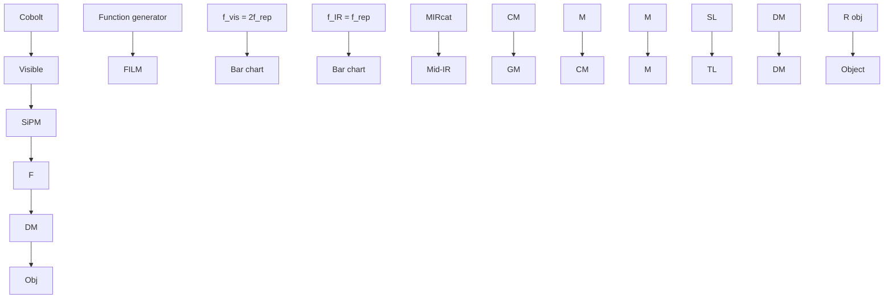
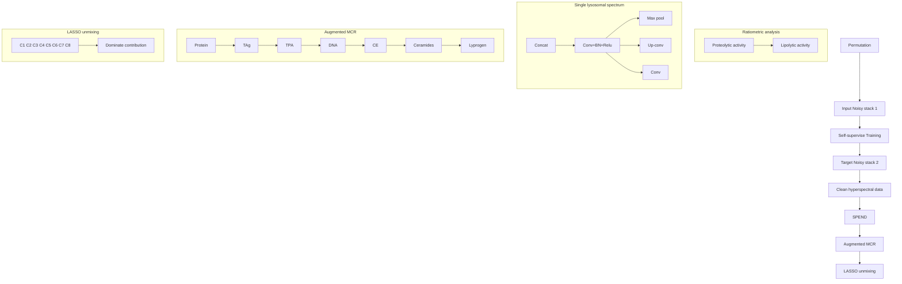

# FILM: mapping organellar metabolism by mid-infrared photothermal-modulated fluorescence

Received: 19 March 2025

Accepted: 30 March 2026

Published online: 7 May 2026

Check for updates

Jianpeng Ao  1,2,3,8, Jiaze Yin  1,2,8, Haonan Lin  1,2,3, Guangrui Ding1,2, Youchen Guan4 , Marzia Savini  4 , Bethany Weinberg3,5, Dashan Dong  1,2, Qing Xia  1,2, Zhongyue Guo2,6, Bowen Liu1 , Biwen Gao  7 , Ji-Xin Cheng  1,2,3,5,6,7 & Meng C. Wang  4

Metabolism unfolds within specifc organelles in eukaryotic cells. Lysosomes are highly metabolically active organelles, and their metabolic states dynamically infuence signal transduction, cellular homeostasis and organismal physiopathology. Despite the importance of lysosomal metabolism, a method for its in vivo measurement is currently lacking. Here we report a fuorescence-detected mid-infrared photothermal microscope (FILM) implemented with optical boxcar demodulation, artifcial intelligence-assisted data denoising and spectral deconvolution, to map metabolic activity and composition of individual lysosomes in living cells and organisms. Using this method, we uncovered lipolysis and proteolysis heterogeneity across lysosomes within the same cell, as well as early-onset lysosomal dysfunction during organismal aging. In addition, we discovered organelle-level metabolic changes associated with diverse lysosomal storage diseases. This method holds the broad potential to profle metabolic fngerprints of individual organelles within their native context and quantitatively assess their dynamic changes under diferent physiological and pathological conditions, providing a high-resolution chemical cellular atlas.

Metabolism is essential for biological systems to sustain their physiological activities, and its dysfunction contributes to diverse diseases1,2 . In multicellular organisms, metabolic processes are compartmen talized across multiple levels, from organelles to tissues. Therefore, understanding the spatial organization of metabolism is crucial for both biological and biomedical research. However, this remains technically challenging, particularly at the scale of organelles. Organelles are fundamental structural and functional units within eukaryotic cells, each specializing in distinct metabolic processes. Organelle-specific immunoprecipitation has facilitated the enrichment of specific organelles from different tissues for mass spectrometry (MS)-based metabolic profiling3–6 . However, spatial information within the organelles’ native cellular context is lost during this process. Microscopic imaging of fluorescence-labeled organelles has revealed their structural organization, dynamics and heterogeneity in vivo7–9 ; however, even with specific metabolite sensors, it provides limited insight into their metabolic complexity10–12

Infrared (IR) absorption spectroscopy simultaneously fingerprints a wide range of molecules on the basis of their vibrational signatures13,14. Mid-IR photothermal (MIP) microscopy, which measures the

1 Department of Electrical and Computer Engineering, Boston University, Boston, MA, USA. 2 Photonics Center, Boston University, Boston, MA, USA. 3 HHMI Janelia Visiting Scholar Program, Ashburn, VA, USA. 4 HHMI Janelia Research Campus, Ashburn, VA, USA. 5 Graduate Program in Molecular Biology, Cell Biology, and Biochemistry, Boston University, Boston, MA, USA. 6 Department of Biomedical Engineering, Boston University, Boston, MA, USA. 7 Department of Chemistry, Boston University, Boston, MA, USA. 8 These authors contributed equally: Jianpeng Ao, Jiaze Yin.  e-mail: jxcheng@bu.edu; mengwang@janelia.hhmi.org

photothermal effects caused by IR absorption, has further advanced IR spectroscopic imaging to submicron resolution15–17, enabling chemical imaging of biomolecules in living cells18–20. Leveraging thermal sensitivity of fluorescent reporters21,22, fluorescence-detected MIP (F-MIP, termed as FILM here) enables organelle-level imaging of certain molecules23–25. However, the reported work23,24 suffers from substantial photobleaching and requires an exposure time three orders of magnitude longer than conventional fluorescence microscopy to capture a full fingerprint spectrum. This limitation makes it nearly impossible to comprehensively map metabolic activity in vivo across a broad spectral range and substantially hinders in-depth mapping of organellar complexity in relation to their metabolic states.

Here, we developed an optical boxcar demodulation scheme, together with a synchronized IR-visible laser scanner and an artificial intelligence (AI)-assisted self-supervised hyperspectral denoiser, to simultaneously enhance the photothermal signal, reduce the fluores cence exposure time and mitigate the photobleaching issue. The FILM signal is followed by an unmixing algorithm to quantify biomolecular contents. This upgraded FILM system enables hyperspectral imaging of organelles in the entire fingerprint window (1,000–1,800 cm−1). We have applied this system for in vivo metabolic profiling of lysosomes— organelles that play vital roles in nutrient sensing, macromolecular recycling, signaling transduction, diseases and aging26–29, revealing their distinctive metabolic fingerprints and changes during physiological aging and under various disease conditions.

## Results

## FILM

FILM bridges fluorescence emission with IR absorption by probing photothermal changes across a broad range of IR wavelengths that encode the chemical signatures of biomolecules. Mid-IR photons excite molecular vibrational modes, which subsequently relax into heat (Fig. 1a). The resulting local temperature increase enhances nonradiative relaxation in nearby fluorescent probes, reducing their quantum yield for fluorescence emission via dynamic quench. This modulation in fluorescence intensity serves as an indicator of IR absorption.

In the previous point-scan system23,24, a continuous-wave (CW) visible laser is used to excite fluorescent molecules (Fig. 1b). The fluo rescence intensity changes are then demodulated using a lock-in amplifier (LIA) at the IR repetition rate. However, owing to the low duty-cycle nature of the pulsed photothermal process, most fluorescence photons contribute to shot noise rather than photothermal signal. More importantly, prolonged CW exposure leads to substantial photobleaching. To overcome these limitations, we implemented frequency-demodulated optical boxcar detection to eliminate photons that do not contribute to the photothermal signal, thereby reducing photobleaching (Fig. 1c). In addition to demodulation at the IR pump frequency, a pair of pulsed visible probes, synchronized with IR excitation, was used to selectively gate emission events at the peak of the temperature rise, referred to as the ‘hot’ state, and the subsequent cooled ‘cold’ state. The system is shown in Fig. 1d. High-speed laser scanning geometry was implemented at 30 µs per pixel to further minimize photobleaching. A multichannel pulse generator synchronized the IR laser at a repetition rate $f _ { \mathrm { I R } }$ of 200 kHz and the visible lase $f _ { \mathrm { v i s } } \mathbf { a } \mathbf { 1 }$ t 400 kHz. Fluorescence was detected using a silicon photomultiplier (SiPM), and the signal was directly demodulated at $f _ { \mathrm { I R } }$ using LIA.

We first evaluated photobleaching reduction by modulating the duty cycle of the visible excitation while maintaining constant peak power (Fig. 1e). After 100 frames of scanning, pulsed excitation at 40% and 20% duty cycle reduced photobleaching to 29.3% and 16.6% of the CW condition, respectively (Fig. 1e). We then assessed signal intensity as a function of duty cycle and observed a ‘stable zone’ in which the signal remained nearly unchanged when the duty cycle was reduced from 100% (that is, CW) to 30% (Fig. 1f). We therefore selected a 30% duty cycle, corresponding to a 750-ns pulse duration, which preserved the signal while reducing photobleaching. Overall, optical boxcar-enhanced FILM reduces fluorescence excitation time by over 100 times compared to the previously reported point-scan system23,24 (Supplementary Fig. 1).

In addition, the pulsed excitation light served as a 2f carrier, shifting high odd-order harmonic signals into the demodulation frequency, thereby enhancing signal amplitude relative to CW condition, while maintaining the same average power (Extended Data Fig. 1, Supplementary Fig. 2 and Supplementary Note 1). The two gating windows of the excitation light used in optical boxcar inherently function as a time-resolved measurement, making it less sensitive to slow heat-diffusion background that universally exists in a water environment (Extended Data Fig. 2 and Supplementary Note 2).

Using this system, we performed hyperspectral FILM on rhodamine 6G (R6G)-labeled Staphylococcus aureus (Fig. 1g), acquiring 160 frames spanning 980–1,780 cm−1. The extracted spectrum resolved characteristic peaks from nucleic acids and protein amide II and amide I bands (Fig. 1h). Spectral fidelity was further validated by comparing FILM spectra of bacteria with scattering-based MIP spectra, as well as FILM spectra of LysoSensor DND-189-stained dimethyl sulfoxide with reference attenuated total reflection–Fourier transform infrared spectroscopy (ATR–FTIR) spectra (Extended Data Fig. 3), confirming reliable fingerprinting of fluorescently labeled objects.

## Hyperspectral FILM imaging of lysosomes and AI-assisted data analysis

To image lysosomes with optical boxcar-enhanced FILM, we identified a lysosome-specific thermosensitive dye, LysoSensor DND-189, whose fluorescence intensity decreased by 12% upon a 10-K temperature increase (Supplementary Fig. 3). Lysosomes in intestinal cells of wild-type (WT) Caenorhabditis elegans were labeled with this dye and imaged to capture lysosome-specific hyperspectral datasets (Supplementary Video 1). As the pixel integration time was reduced to 30 µs to avoid photobleaching, the photothermal signal exhibited a relatively low signal-to-noise ratio (SNR).

To recover SNR without increasing integration time, we harnessed a self-supervised deep-learning denoising algorithm, Selfpermutation Noise2Noise Denoising (SPEND)30. SPEND generates two image stacks from a single low-SNR hyperspectral dataset by permuting the hyperspectral stack along the ω dimension into odd and even slices that were alternately concatenated to form independent measurements of the same field of view (FOV) (Fig. 2a). A 3D U-Net is then trained using these paired stacks as input and target, enabling effective learning of noise statistics and object priors while avoiding information leakage between adjacent pixels due to point-scan imaging (Supplementary Fig. 4 and Supplementary Note 3). Once trained, the model can be applied in batch to denoise hyperspectral datasets acquired under the same conditions.

Lysosomes were visible in the raw FILM image at 1,711 cm−1 but disappeared at 1,797 cm−1 (Fig. 2b), confirming chemical selectivity of FILM, which is further supported by the complete set of wavenumber frames in Supplementary Fig. 5. Intensity profiles along the marked line revealed that lysosomes with weaker signals were nearly obscured by noise fluctuations in raw images (Fig. 2c). After SPEND processing, noise in nonlysosomal regions was effectively suppressed, enabling clear visualization of weak lysosomal signal (Fig. 2b,c), which was further validated by hyperspectral stack projection and d.c. fluorescence images (Supplementary Fig. 6). Noise reduction was also evident in the spectral dimension, where SPEND yielded smoother single-lysosome hyperspectral profiles and reduced frame-to-frame fluctuations (Fig. 2d). Quantitatively, SPEND improved image SNR 26.9 times and the spectral SNR 5.3 times (Fig. 2e and Supplementary Note 4), outperforming alternative denoising methods for analyzing FILM data (Extended Data Fig. 4).

a  

text_image

Vibrational
(chemical contents)
PT effect
(bridge)
Biochemicals
v2
v1
Mid-IR
v0
Temperature
Fluorescence
(organelle specificity)
S1
Dynamic quench
Fluorescence
Dyes

b  

line chart

| Waveform                  | Description                     |
| ------------------------- | ------------------------------- |
| IR and induced temperature rising | Peak at ~3.5 GHz with red shaded region |
| CW visible excitation      | Horizontal blue line           |
| Detected fluorescence      | Lower green waveform             |

c  

flowchart

line chart

| Duty cycle (%) | Intensity (a.u.) |
| -------------- | ---------------- |
| 0              | 0.15             |
| 20             | 0.65             |
| 40             | 0.95             |
| 60             | 0.98             |
| 80             | 0.95             |
| 100            | 0.90             |

e  

line chart

| Frames | 20% duty cycle | 40% duty cycle | 60% duty cycle | 80% duty cycle | 100% duty cycle - CW |
| ------ | -------------- | -------------- | -------------- | -------------- | -------------------- |
| 0      | 1.0            | 1.0            | 1.0            | 1.0            | 1.0                  |
| 20     | ~0.98          | ~0.97          | ~0.95          | ~0.93          | ~0.90                |
| 40     | ~0.97          | ~0.95          | ~0.92          | ~0.88          | ~0.85                |
| 60     | ~0.96          | ~0.94          | ~0.90          | ~0.85          | ~0.82                |
| 80     | ~0.95          | ~0.93          | ~0.88          | ~0.83          | ~0.80                |
| 100    | ~0.94          | ~0.92          | ~0.87          | ~0.82          | ~0.79                |

g  

natural_image

Fluorescence microscopy images showing cellular structures at two different IR concentrations (1,650 cm⁻¹ and 1,780 cm⁻¹), with no visible text or symbols.

h  

line chart

| Wavenumber (cm⁻¹) | Intensity (a.u.) |
| ----------------- | ---------------- |
| ~1100             | ~0.35            |
| ~1200             | ~0.1             |
| ~1550             | ~0.3             |
| ~1650             | ~1.0             |
| ~1750             | ~0.0             |

Fig. 1 | FILM principle, instrumentation and spectral fidelity. a, Principle of FILM microscopy depicted by energy diagram. b, The previous CW fluorescence excitation schematic recorded the entire IR-induced photothermal (PT) dynamics. c, The optical boxcar schematic selectively recorded the ‘hot and ‘cold’ states to remove noncontributing photons. d, Schematic of the experimental setup for the FILM microscope. CM, concave mirrors; F, filter; GM, galvo mirrors; M, reflection mirrors; Obj, objective; R obj, reflective objective; SL, scan lens; TL, tube lens. e, Photobleaching curves of standard fluorescence  
beads (n = 3) under different excitation duty cycles. Data are presented as mean ± s.d. Solid line represents the mean value and the shaded area indicates the s.d. of photobleaching measurements. f, FILM signal of Shigella flexneri expressing GFP measured with different visible light duty cycles (n = 5 independent measurements). Statistical data are presented as mean ± s.d. g, FILM images of S. aureus at 1,650 cm−1 and 1,780 cm−1. Representative results are shown from five independent experiments. h, FILM spectrum of single S. aureus. Scale bar, 10 µm.

After baseline correction, power normalization and spectral inter nal normalization, fingerprint spectra of individual lysosomes were extracted. While ratiometric analysis of specific chemical bands was feasible for qualitative visualization, quantitative decomposition of multiple biomolecular contents required spectral unmixing (Fig. 2a). We first constructed a spectral matrix from calibrated lysosomal spectra and performed least absolute shrinkage and selection operator (LASSO)-based31,32 unmixing using eight reference spectra acquired from pure standards on the same system (Fig. 2a, Supplementary Fig. 7 and Supplementary Table 1). Reconstruction of lysosomal spectra using LASSO alone revealed noticeable mismatches relative to the measured spectra (Fig. 2f), reflecting the high chemical complexity of lysosomes, which contain hundreds of molecular species33.

To improve the unmixing performance, we introduced multivariate curve resolution (MCR)34 before LASSO to refine the reference spectra using lysosomal data. An augmented MCR strategy incorporating initial reference spectra was implemented to stabilize spectral updates and maintain physical interpretability. The resulting reconstructed spectra showed improved agreement with lysosomal spectra (Fig. 2g). Quantitative evaluation using cosine similarity and Euclidean distance confirmed superior spectral fitting with MCR–LASSO compared to LASSO alone (Fig. 2h and Supplementary Note 5). Together, these AI-driven analyses enabled us to quantitatively measure biomolecular contents within individual lysosomes and compare them between conditions.

a  

flowchart

text_image

b Before SPEND After SPEND
IR at 1,711 cm⁻¹
IR at 1,797 cm⁻¹

c  

line chart

| Distance (μm) | Before SPEND | After SPEND |
| ------------- | ------------ | ----------- |
| 30            | ~0.04        | ~0.04       |
| 50            | ~0.08        | ~0.08       |
| 60            | ~0.02        | ~0.02       |

bar chart

| Material   | Intensity (a.u.) |
| ---------- | ---------------- |
| Protein    | 0.025            |
| TAG        | 0.001            |
| FA         | 0.023            |
| CE         | 0.001            |
| DNA        | 0.004            |
| Ceramides  | 0.002            |
| Glycogens  | 0.002            |
| AA         | 0.008            |

d  

heatmap

| Wavenumber (cm⁻¹) | Before SPEND Intensity | After SPEND Intensity |
| ----------------- | ---------------------- | --------------------- |
| 1000              | 0.0039                 | 0.0170                |
| 1200              | 0.0040                 | 0.0165                |
| 1400              | 0.0045                 | 0.0160                |
| 1600              | 0.0050                 | 0.0155                |
| 1800              | 0.0055                 | 0.0150                |

e  

box plot

| SNR Type | Before SPEND | After SPEND |
| -------- | ------------ | ----------- |
| Image SNR | 11.4         | 306.7       |
| Spectral SNR | 19.5       | 103.1       |

bar chart

| Material   | Intensity (a.u.) |
| ---------- | ---------------- |
| Protein    | 0.020            |
| TAG        | 0.005            |
| FA         | 0.025            |
| CE         | 0.003            |
| DNA        | 0.004            |
| Ceramides  | 0.010            |
| Glycogens  | 0.002            |
| AA         | 0.006            |

h  

box plot

| Group       | Cosine similarity |
| ----------- | ----------------- |
| Without MCR | 0.95              |
| With MCR    | 0.99              |

box plot

| Group        | Median | Q1   | Min  | Max  |
| ------------ | ------ | ---- | ---- | ---- |
| Without MCR  | 0.16   | 0.13 | 0.12 | 0.18 |
| With MCR     | 0.07   | 0.06 | 0.05 | 0.12 |

Fig. 2 | AI-assisted FILM hyperspectral imaging and analysis. a, Workflow of AI-assisted hyperspectral data analysis. Left: a deep learning-based self supervised denoising algorithm, called SPEND. The raw noisy hyperspectral data were first rearranged into two different sequences with permutation process. Next, the two sets of noisy data were served as the input and target for a U-Net training. The trained network was then applied to denoise raw hyperspectral data. In the schematic, concat denotes concatenate, conv(+BN)+ReLU indicates convolution followed by batch normalization and rectified linear unit activation, max pool represents max pooling, up-conv refers to up-convolution (transposed convolution) and conv denotes convolution. Right: the ratiometric analysis and MCR–LASSO spectral unmixing process. Reference spectrum of pure chemicals, acquired with the same instrument, were modified with augmented MCR on the basis of the lysosomal data and then fed to LASSO for spectral unmixing  
and quantification. b, The comparison of FILM images of lysosomes acquired with IR at 1,711 cm−1 and 1,797 cm−1 before and after SPEND denoising. c, Intensity profiles along the dotted red lines marked in b. d, The comparison of raw FILM spectrum without calibration before and after SPEND processing. e, Quantification of image SNR and spectral SNR before and after SPEND denoising (n = 13 lysosomes). f, LASSO unmixing with unmodified references and comparison of original calibrated input and reconstructed spectrum (n = 13 lysosomes). g, LASSO unmixing with MCR-modified references and comparison of original calibrated input and reconstructed spectrum (n = 13 lysosomes). h, The comparison of cosine similarity and Euclidean distance with and without augmented MCR modification (n = 13 lysosomes). Scale bar, 10 µm. In e, f, g and $\mathbf { h } ,$ the boxes show the interquartile range (IQR), the center lines indicate medians and the lines outside the boxes extend to 1.5 times the IQR.

## FILM reveals hydrolytic heterogeneity of lysosomes

Using the AI-assisted FILM system, we imaged lysosomes in live C. elegans (Supplementary Video 2). Fluorescence imaging localized individual lysosomes (Fig. 3a), while hyperspectral FILM revealed a previously inaccessible chemical dimension of these organelles through IR spectra (Fig. 3b). Lysosomes exhibited spectral features distinct from surrounding regions visualized by autofluorescence (Fig. 3b, Supplementary Fig. 8 and Supplementary Note 6). Spectral phasor analysis further enabled robust segmentation of lysosomes from their surroundings (Supplementary Fig. 9). Strikingly, the spectra varied among different lysosomes (Fig. 3b), indicating a highly heterogeneous lysosomal population even within the same cell.

a  

scatter plot

| Point | Value |
|-------|-------|
| #1    | 1     |
| #2    | 1     |
| #3    | 1     |
| #4    | 1     |
| #5    | 1     |
| #6    | 1     |
| #7    | 1     |
| #8    | 1     |
| #9    | 1     |
| #0    | 1     |

b

line chart

| x    | Intensity (a.u.) |
| ---- | ---------------- |
| 1500 | 0.1              |
| 1600 | 0.5              |
| 1700 | 1.0              |
| 1800 | 0.0              |

line chart

| x    | y    |
| ---- | ---- |
| 1500 | 0.0  |
| 1600 | 0.5  |
| 1700 | 1.0  |
| 1800 | 0.0  |

line chart

| x    | y    |
| ---- | ---- |
| 1500 | 0.1  |
| 1600 | 0.8  |
| 1700 | 1.0  |
| 1800 | 0.0  |

line chart

| x    | Intensity (a.u.) |
| ---- | ---------------- |
| 1500 | 0.1              |
| 1600 | 0.5              |
| 1700 | 1.0              |
| 1800 | 0.0              |

line chart

| x    | y     |
| ---- | ----- |
| 1500 | 0.1   |
| 1600 | 0.6   |
| 1700 | 1.0   |
| 1800 | 0.0   |

line chart

| x    | y     |
| ---- | ----- |
| 1500 | 0.1   |
| 1600 | 0.8   |
| 1700 | 1.0   |
| 1800 | 0.0   |

line chart

| Wavenumber (cm⁻¹) | Intensity (a.u.) |
| ----------------- | ---------------- |
| 1500              | 0.2              |
| 1600              | 0.8              |
| 1700              | 0.3              |
| 1800              | 0.1              |

line chart

| Wavenumber (cm⁻¹) | Intensity (a.u.) |
| ----------------- | ---------------- |
| 1500              | 0.1              |
| 1600              | 0.6              |
| 1700              | 1.0              |
| 1800              | 0.0              |

line chart

| Wavenumber (cm⁻¹) | Value |
| ----------------- | ----- |
| 1500              | 0.1   |
| 1600              | 0.6   |
| 1700              | 1.0   |
| 1800              | 0.0   |

line chart

| Wavenumber (cm⁻¹) | Value |
| ----------------- | ----- |
| 1500              | 0.1   |
| 1600              | 0.6   |
| 1700              | 1.0   |
| 1800              | 0.0   |

c  

heatmap

| Intensity Level | Value        |
| --------------- | ------------ |
| High            | High         |
| Low             | Low          |

1,711 cm–1/1,741 cm–1  

natural_image

Thermal or heat map image showing scattered bright spots against a dark blue background, with a color scale ranging from low (dark blue) to high (red-yellow) indicating intensity.

d  

text_image

Subpopulation
High proteolytic activity
High lipolytic activity
High activity in both

e

text_image

Subpopulation
High proteolytic activity
High lipolytic activity
High activity in both

Fig. 3 | Hydrolytic heterogeneity of lysosomes revealed by FILM.  
a, Fluorescence image of C. elegans labeled with LysoSensor DND-189.  
b, FILM spectra of individual lysosomes and surrounding region marked in a.  
c, Ratiometric mapping of intensity ratios at 1,587 and 1,649 cm−1 (proteolytic activity) and 1,711 and 1,741 cm−1 (lipolytic activity), representing proteolysis  
activity and lipolysis activities, respectively. d, Classification of lysosomal subpopulations on the basis of the two ratios shown in c. e, Classification of lysosomal subpopulations of mammalian lysosomes. Scale bars, 10 µm. Representative results are shown from three independent experiments.

Control experiments comparing lysosomal spectra with that of the dye itself, together with dye concentration estimates based on fluorescence intensity, confirmed that the observed spectral features did not originate from the thermosensitive probe (Supplementary Fig. 10).

Comparison of lysosomal and surrounding-region spectra revealed two characteristic lysosomal peaks around 1,587 cm−1 and 1,711 cm−1. By examining FILM spectra of standard mixtures, including proteins, amino acids (AA), triglycerides (TAG, lipid ester) and free fatty acids (FFA), we tentatively assigned these features to AA and FFA (Supplementary Fig. 8c and Supplementary Note 7). To independently validate these assignments, we inactivated CTNS-1 transporter that exports cysteine from the lysosome35, which led to increased AA accumulation and produced a modest but substantial enhancement at 1,587 cm−1 (Extended Data Fig. 5a). In addition, overexpression of LIPL-4 lipase that hydrolyzes TAG into FFA36 resulted in a pronounced increase at 1,711 cm−1 (Extended Data Fig. 5b). These perturbations provided biological support for the assignment of the 1,587 cm−1 and 1,711 cm−1 feature to AAs and FFAs, respectively. Our results revealed that the lysosomal spectrum exhibits a higher presence of AAs and FFAs, which are consistent with the active hydrolytic function of lysosomes37,38 and thus support the ability of FILM to specifically profile the metabolic composition of lysosomes in vivo.

Building on these assignments, we defined the ratio of 1,587 cm−1 and 1,649 cm−1 (AAs/proteins) as a proxy for proteolytic activity and the ratio of 1,711 cm−1 and 1,741 cm−1 (FFAs/lipid esters) as a proxy for lipolytic activity, leveraging the distinct IR signatures of macromolecules and their degradation products. Consistent with prior lysosome-targeted lipidomics studies showing enhanced lipolysis in worms with LIPL-4 overexpression (lipl-4 Tg) 36, FILM imaging revealed an increased 1,711 and 1,741 cm−1 ratio in lysosomes of lipl-4 Tg worms (Extended Data Fig. 5c), supporting this ratio as a qualitative readout for lysosomal lipolysis in vivo. Pixel-wise ratio maps and parallel-set visualizations further highlighted stronger hydrolytic activities in lysosomes compared to surrounding regions (Extended Data Fig. 6).

More importantly, lysosomes exhibiting high proteolytic activity did not fully overlap with those showing high lipolytic activity (Fig. 3c), suggesting metabolic heterogeneity within the lysosomal population. On the basis of the two activity ratios, lysosomes were categorized into three groups: high proteolytic activity, high lipolytic activity and high activity in both (Fig. 3d). Correlation analysis shows only weak relationships between hydrolytic activity and lysosomal size (Extended Data Fig. 7a,b), as well as activity and fluorescence intensity (Extended Data Fig. 7c,d), indicating that the observed metabolic signatures were not driven by probe concentration or size effects. This metabolic heterogeneity was also detected in mammalian lysosomes by FILM (Fig. 3e and Extended Data Fig. 8). In addition to intracellular heterogeneity, we observed substantial intercellular heterogeneity in lysosomal metabolism under normal physiological conditions (Extended Data Fig. 9). These results define the metabolic landscape of lysosomes in WT cells and reveal the functional basis of lysosomal heterogeneity.

## FILM tracks lysosomal metabolic changes during aging

Metabolic dysfunction is a hallmark of aging2 . To investigate age-related metabolic changes at the organellar level in lysosomes, we generated the ratiometric images of 1,587 and 1,649 cm−1 (proteolytic activity) as well as 1,711 and 1,741 cm−1 (lipolytic activity) in C. elegans at adulthood day 2, day 4, day 6 and day 10 (Fig. 4a) with corresponding quantitative analysis shown in Fig. 4b. Notably, both hydrolytic activities declined with age (Fig. 4b), with the decrease occurring early in life, as early as day 4 of adulthood, before the onset of aging-related mortality, indicating early-onset lysosomal metabolic dysfunction during aging.

To capture age-dependent changes across the entire fingerprint spectrum, we extracted dozens of lysosomal spectra from each age group and generated heat maps (Fig. 4c,d). Clear spectral differences were observed across ages. To further highlight these differences, we performed z-score analysis relative to the total average spectrum (Fig. 4e). Lysosomes from day 2 animals exhibited enriched AA and FFA signatures, whereas those from day 4 showed stronger amide I and amide II features. Lysosomes from day 6 and day 10 animals displayed more prominent features in the lower wavenumber region (1,060–1,350 cm−1) that can be attributed to nucleic acids and carbohydrates.

Dimensionality reduction using t-distributed stochastic neigh bor embedding (t-SNE) revealed that lysosomal spectra from day 2 formed a compact and well-separated cluster from those of later ages (Fig. 4f). Day 4 spectra also clustered distinctly from day 6 and day 10, whereas the latter two showed greater overlap (Fig. 4f). Euclidean distance analysis confirmed that spectra from each age group were most similar within their own group, with the smallest intergroup difference observed between day 6 and day 10 (Supplementary Fig. 11), indicating relatively minor spectral divergence at late ages. By contrast, intragroup variability increased from day 4 compared to day 2 (Fig. 4g), suggesting that lysosomal metabolic heterogeneity becomes more pronounced with aging.

To quantitatively interpret these spectral changes, we performed spectral decomposition using eight reference components, including protein, AA, FFA, TAG, ceramide, glycogen, deoxyribonucleic acid (DNA) and cholesterol ester (CE). We found that average levels of macromolecules, including DNA, ceramides, TAGs and glycogens, increase with age (Fig. 4h), suggesting their age-related accumulation within lysosomes.

## FILM profiles metabolic changes associated with LSDs

Metabolic dysfunction of lysosomes underlies lysosomal storage diseases (LSD), leading to the accumulation of undegraded macromolecules within lysosomes27. So far, it remains challenging to assess metabolic changes at the lysosomal level under those pathological conditions. We hypothesized that FILM provides an avenue to address this challenge. To test this hypothesis, we knocked down several well-conserved LSD genes using RNA interference (RNAi) in C. elegans.

We first fingerprinted the lysosomes of five day 2 RNAi groups together with their controls, whose lysosomal profiles represent the normal metabolic state (Fig. 5a,b). Heat-map visualization revealed pronounced alterations in lysosomal metabolic composition following RNAi-mediated inactivation of each LSD gene (Fig. 5a). Consistent with the results shown in Fig. 4d, control lysosomes exhibited dominant peaks near 1,587 cm−1 and 1,711 cm−1, corresponding to AA and FFA, respectively. Compared to controls, nuc-1 RNAi led to a substantial increase in spectral intensity near 1,100 cm−1 and 1,294 cm−1, with milder increases observed in other RNAi conditions (Fig. 5b). In the 1,530–1,730 cm−1 range, all RNAi groups displayed altered peak shapes and relative intensities at 1,587, 1,649 and 1,711 cm−1.

To quantitatively interpret these changes, we decomposed the lysosomal spectra to resolve eight chemical components (Fig. 5c). RNAi inactivation of nuc-1 and asah-2 led to the accumulation of DNA, ceramides and TAG in lysosomes, while the level of FFA decreased. Similarly, aagr-2 RNAi increased ceramide, TAG and glycogen content. lipl-3 and ncr-1 RNAi caused accumulation of TAG and glycogens, while FFA levels decreased. These results suggest the lysosomal accumulation of TAG as shared metabolic dysfunction among the RNAi conditions. In addition to the negative correlation between protein and AA (Pearson’s r = −0.74) and between TAG and FFA (Pearson’s r = −0.65), consistent with proteolysis and lipolysis, FFA and DNA also exhibit a negative correlation (Pearson’s r = −0.63), suggesting that defects in DNA degradation may impact the lipolytic activity of lysosomes (Fig. 5d).

We next applied FILM to investigate metabolic changes of lysosomes in mammalian cells with NPC1 knockout (NPC1KO), a well-established model of Niemann–Pick disease type C characterized by lysosomal accumulation of cholesterol and glycosphingolipids39. Lysosomal fingerprint spectra were acquired from both WT and NPC1KO cells (Fig. 5e,f). In contrast to C. elegans, mammalian lysosomes were dominated by amide I and amide II bands, reflecting higher protein content. Compared to WT, lysosomes in the NPC1KO cells exhibited stronger signals between 1,100 cm−1 and 1,250 cm−1, as well as changes in the 1,530–1,730 cm−1 range (Fig. 5f).

Quantitative analysis revealed that NPC1KO lysosomes exhibited reduced levels of FFA, alongside increased accumulation of DNA, ceramides, TAG, CE and glycogen (Fig. 5g), indicating globally impaired macromolecular degradation. Correlation analysis showed a positive correlation between TAG and glycogen (Pearson’s r = 0.64), suggesting coordinated accumulation, whereas FFA exhibit negative correlations with DNA (Pearson’s r = −0.67), ceramide (Pearson’s r = −0.78) and glycogen (Pearson’s r = −0.63) (Fig. 5h). These relationships indicate

Fig. 4 | Age-related metabolic changes at lysosomal scale. a, Ratiometric mapping of intensity ratios at 1,587 and 1,649 cm−1 and 1,711 and 1,741 cm−1 across worms of different ages. b, Quantitative comparison of the two intensity ratios of lysosomes among four age groups (n = 81 for day 2, n = 61 for day 4, n = 28 for day 6 and n = 61 for day 10 (two-sided two-sample t-test compared to the day 2 group: for the ratio of 1,587 and $1 , 6 4 9 \mathrm { c m } ^ { - 1 } , P _ { \mathrm { D 4 } } \mathrm { v e r s u s } _ { \mathrm { D 2 } } { = } 1 . 4 1 \times 1 0 ^ { - 1 1 } ,$ $P _ { \mathrm { D e v e r s u s D } ^ { 2 } } = 1 . 2 6 \times 1 0 ^ { - 5 } , P _ { \mathrm { D l o v e r s u s D } ^ { \prime } } = 0 . 7 1 0 ; \mathrm { f o r ~ t h e ~ r a t i o ~ o f 1 } , 7 1 1 \mathrm { a n d } 1 , 7 4 1 \mathrm { c m } ^ { - 1 }$ , $P _ { \mathrm { D 4 v e r s u s { D 2 } } } = 2 . 4 0 \times 1 0 ^ { - 3 7 } , P _ { \mathrm { D 6 v e r s u s { D 2 } } } = 2 . 9 8 \times 1 0 ^ { - 1 8 } , P _ { \mathrm { D 1 0 v e r s u s { D 2 } } } = 3 . 0 1 \times 1 0 ^ { - 3 4 } ) .$ . c, Heat map of lysosomal fingerprint spectra extracted from worms in four age groups $\scriptstyle ( n = 6 9$ for day 2 $, n = 9 7$ for day $4 , n = 6 8$ for day 6 and $n = 8 0$ for day 10 derived from five to seven independent biological experiments). Each row represents a lysosomal spectrum. d, Representative average spectra for each age group. Data are presented as mean ± s.d. Solid line represents the mean value, and shaded area indicates the s.d. e, Z-score heat map of different age groups. Red boxes highlight signal regions with the higher intensity for the day 2 group. Orange boxes indicate signal regions with the higher intensity for the day 4 group. Yellow boxes highlight signal regions with the higher intensity for the day 6 and day 10 groups. f, t-SNE visualization of all spectra. Each dot indicates a lysosomal spectrum. Shaded area indicates 85% confidence interval. g, Intracluster distance analysis from t-SNE, where larger distances indicate poorer clustering and greater heterogeneity within the data. h, High-content analysis of metabolic profiles across the four age groups (n = 69 for day 2, n = 97 for day 4, n = 68 for day 6 and n = 80 for day 10 derived from five to seven independent biological experiments). All comparisons were made relative to the day 2 group, whose lysosomal profiles are representative of a normal metabolic state (two-sided two-sample t-test, $\mathrm { F F A s } \mathrm { : } P _ { \mathrm { D 4 v e r s u s D 2 } } = 4 . 8 9 \times 1 0 ^ { - 4 0 } ,$ $P _ { \mathrm { D e v e r s u s D } ^ { 2 } } = 8 . 2 9 \times 1 0 ^ { - 5 6 } , P _ { \mathrm { D l o v e r s u s D } ^ { 2 } } = 3 . 7 4 \times 1 0 ^ { - 2 5 } ; \mathrm { p r o t e i n } ; P _ { \mathrm { D 4 v e r s u s D } ^ { 2 } } = 6 . 6 7 \times 1 0 ^ { - 9 } ,$ $P _ { \mathrm { D 6 v e r s u s { D 2 } } } = 1 . 1 6 \times 1 0 ^ { - 1 3 } , P _ { \mathrm { D 1 0 v e r s u s { D 2 } } } = 1 . 8 4 \times 1 0 ^ { - 9 } ; \mathrm { A A s } : P _ { \mathrm { D 4 v e r s u s { D 2 } } } = 0 . 7 2 6 ,$ $P _ { \mathrm { D 6 v e r s u s { D 2 } } } = 1 . 2 3 \times 1 0 ^ { - 2 7 } , P _ { \mathrm { D 1 o v e r s u s { D 2 } } } = 1 . 9 4 \times 1 0 ^ { - 9 } ; \mathrm { { D N A } } \colon P _ { \mathrm { D 4 v e r s u s { D 2 } } } = 5 . 4 3 \times 1 0 ^ { - 1 1 } ,$ $\begin{array} { r } { P _ { \mathrm { D e v e r s u s } \mathbf { D } ^ { 2 } } = \mathbf { 1 } . 0 2 \times \mathbf { 1 0 } ^ { - 1 2 } , P _ { \mathrm { D I O v e r s u s } \mathbf { D } ^ { 2 } } = 2 . 9 5 \times \mathbf { 1 0 } ^ { - 1 0 } ; \mathbf { c e r a m i d e s } \colon P _ { \mathrm { D 4 v e r s u s } \mathbf { D } ^ { 2 } } = 5 . 0 9 \times \mathbf { 1 0 } ^ { - 1 3 } , } \end{array}$ $P _ { \mathrm { D 6 v e r s u s { D 2 } } } = 1 . 0 2 \times 1 0 ^ { - 3 } , P _ { \mathrm { D 1 0 v e r s u s { D 2 } } } = 1 . 3 3 \times 1 0 ^ { - 3 } ; \mathrm { T A G s } : P _ { \mathrm { D 4 v e r s u s { D 2 } } } = 1 . 9 7 \times 1 0 ^ { - 4 } ,$ $P _ { \mathrm { D 6 v e r s u s { D 2 } } } = 3 . 1 6 \times 1 0 ^ { - 2 7 } , P _ { \mathrm { D 1 0 v e r s u s { D 2 } } } = 2 . 5 8 \times 1 0 ^ { - 1 5 } ; { \mathrm { g } } { \mathrm { l y c o g e n s } } ; P _ { \mathrm { D 4 v e r s u s { D 2 } } } = 1 . 8 1 \times 1 0 ^ { - 1 1 } ,$ $P _ { \mathrm { D 6 v e r s u s D 2 } } = 1 . 7 6 \times 1 0 ^ { - 1 4 } , P _ { \mathrm { D 1 0 v e r s u s D 2 } } = 7 . 5 7 \times 1 0 ^ { - 7 } ; \mathrm { C E } : P _ { \mathrm { 0 4 v e r s u s D 2 } } = 0 . 0 6 2 ,$ $P _ { \mathrm { D e v e r s u s D } ^ { 2 } } = 1 . 1 7 \times 1 0 ^ { - 4 } , P _ { \mathrm { D 1 0 v e r s u s { D } 2 } } = 5 . 9 2 \times 1 0 ^ { - 3 } ) . 5 \mathrm { c a l e b a r } , 1 0 \mu \mathrm { m } . \mathrm { l n } \ b \mathrm { a n d } \mathbf { h } , \mathrm { t h e a l e c a l e s } , \mathrm { a n d f i v e r s a l e s } .$ boxes show the IQR, the center lines indicate medians and the lines outside the boxes extend to 1.5 times the IQR.

a  

text_image

Day 2
Day 4
Day 6
Day 10
1,587 / 1,649
1,711 / 1,741

c  

heatmap

| Wavenumber (cm⁻¹) | Number | Value  |
| ----------------- | ------ | ------ |
| 1,000             | 20     | 0.00   |
| 1,000             | 40     | 0.01   |
| 1,000             | 60     | 0.02   |
| 1,200             | 20     | 0.03   |
| 1,200             | 40     | 0.04   |
| 1,200             | 60     | 0.04   |
| 1,400             | 20     | 0.03   |
| 1,400             | 40     | 0.04   |
| 1,400             | 60     | 0.04   |
| 1,600             | 20     | 0.03   |
| 1,600             | 40     | 0.04   |
| 1,600             | 60     | 0.04   |
| 1,800             | 20     | 0.02   |
| 1,800             | 40     | 0.03   |
| 1,800             | 60     | 0.03   |
| 1,800             | 80     | 0.04   |

heatmap

| Wavenumber (cm⁻¹) | 20   | 40   | 60   | 80   |
| ----------------- | ---- | ---- | ---- | ---- |
| 1,000             | 0.01 | 0.02 | 0.03 | 0.04 |
| 1,200             | 0.01 | 0.02 | 0.03 | 0.04 |
| 1,400             | 0.01 | 0.02 | 0.03 | 0.04 |
| 1,600             | 0.01 | 0.02 | 0.03 | 0.04 |
| 1,800             | 0.01 | 0.02 | 0.03 | 0.04 |

b  

box plot

| Group | Ratio (cm⁻¹) |
|-------|--------------|
| Day 2 | 1,587        |
| Day 4 | 1,649        |
| Day 6 | 1,711        |
| Day 10| 1,741        |

Day 6  

heatmap

| Wavenumber (cm⁻¹) | 1,000 | 1,200 | 1,400 | 1,600 | 1,800 |
| ----------------- | ----- | ----- | ----- | ----- | ----- |
| Number            | 0.01  | 0.02  | 0.03  | 0.04  | 0.04  |
| 1,000             | 0.01  | 0.02  | 0.03  | 0.04  | 0.04  |
| 1,200             | 0.01  | 0.02  | 0.03  | 0.04  | 0.04  |
| 1,400             | 0.01  | 0.02  | 0.03  | 0.04  | 0.04  |
| 1,600             | 0.01  | 0.02  | 0.03  | 0.04  | 0.04  |
| 1,800             | 0.01  | 0.02  | 0.03  | 0.04  | 0.04  |

Day 10  

heatmap

| Wavenumber (cm⁻¹) | 20   | 40   | 60   | 80   |
| ----------------- | ---- | ---- | ---- | ---- |
| 1,000             | 0.04 | 0.03 | 0.02 | 0.01 |
| 1,200             | 0.03 | 0.02 | 0.01 | 0.01 |
| 1,400             | 0.02 | 0.01 | 0.01 | 0.01 |
| 1,600             | 0.01 | 0.01 | 0.01 | 0.01 |
| 1,800             | 0.01 | 0.01 | 0.01 | 0.01 |

d  

line chart

| Wavenumber (cm⁻¹) | Intensity (a.u.) - Day 2 | Intensity (a.u.) - Day 4 |
| ----------------- | ------------------------ | ------------------------ |
| 1000              | ~0.00                    | ~0.00                    |
| 1200              | ~0.005                   | ~0.01                    |
| 1400              | ~0.01                    | ~0.02                    |
| 1600              | ~0.03                    | ~0.03                    |
| 1800              | ~0.00                    | ~0.00                    |

line chart

| Wavenumber (cm⁻¹) | Intensity (a.u.) - Day 6 (n=68) | Intensity (a.u.) - Day 10 (n=80) |
| ----------------- | ------------------------------- | -------------------------------- |
| 1000              | ~0.005                          | ~0.002                           |
| 1200              | ~0.012                          | ~0.01                            |
| 1400              | ~0.02                           | ~0.025                           |
| 1600              | ~0.025                          | ~0.03                            |
| 1800              | ~0.005                          | ~0.002                           |

e  

heatmap

| Wavenumber (cm⁻¹) | Day 2 | Day 4 | Day 6 | Day 10 |
| ----------------- | ----- | ----- | ----- | ------ |
| 1,555             | 2.5   | 1.5   | 1.0   | 0.5    |
| 1,782             | 2.5   | 1.5   | 1.0   | 0.5    |

f  

scatterplot

| Day    | t-SNE dimension 1 | t-SNE dimension 2 (a.u.) |
| ------ | ----------------- | ------------------------ |
| Day 2  | -25               | 0                        |
| Day 4  | -15               | -10                      |
| Day 6  | -5                | 10                       |
| Day 10 | 0                 | 5                        |

bar chart

| Day    | Distance (a.u.) |
| ------ | --------------- |
| Day 2  | 3.3             |
| Day 4  | 6.5             |
| Day 6  | 6.3             |
| Day 10 | 5.3             |

h  

box plot

| Day    | Intensity (a.u.) |
| ------ | ---------------- |
| Day 2  | 0.45             |
| Day 4  | 0.25             |
| Day 6  | 0.15             |
| Day 10 | 0.30             |

Protein  

box plot

| Day    | Value |
| ------ | ----- |
| Day 2  | 0.30  |
| Day 4  | 0.45  |
| Day 6  | 0.28  |
| Day 10 | 0.27  |

AAs  

box plot

| Day    | Value |
| ------ | ----- |
| Day 2  | 0.05  |
| Day 4  | 0.05  |
| Day 6  | 0.12  |
| Day 10 | 0.08  |

box plot

| Day    | Value |
| ------ | ----- |
| Day 2  | 0.03  |
| Day 4  | 0.08  |
| Day 6  | 0.12  |
| Day 10 | 0.11  |

Ceramides  

box plot

| Day   | Intensity (a.u.) |
|-------|------------------|
| Day 2 | 0.05             |
| Day 4 | 0.15             |
| Day 6 | 0.10             |
| Day 10| 0.10             |

Triglycerides  

box plot

| Day    | Value |
| ------ | ----- |
| Day 2  | 0.10  |
| Day 4  | 0.15  |
| Day 6  | 0.25  |
| Day 10 | 0.20  |

Glycogens  

box plot

| Day    | Value |
| ------ | ----- |
| Day 2  | 0.04  |
| Day 4  | 0.06  |
| Day 6  | 0.08  |
| Day 10 | 0.07  |

Cholesterol ester  

box plot

| Day    | Value |
| ------ | ----- |
| Day 2  | 0.03  |
| Day 4  | 0.04  |
| Day 6  | 0.07  |
| Day 10 | 0.05  |

a  

heatmap

| Sample   | Wavenumber (cm⁻¹) Range | Color Intensity |
|----------|--------------------------|-----------------|
| Control  | 1,000 - 1,800            | ~0.04           |
| nuc-1    | 1,000 - 1,800            | ~0.04           |
| aagr-2   | 1,000 - 1,800            | ~0.04           |
| asah-2   | 1,000 - 1,800            | ~0.04           |
| lipl-3   | 1,000 - 1,800            | ~0.04           |
| ncr-1    | 1,000 - 1,800            | ~0.04           |

b  

line chart

| Sample   | n   | Wavenumber (cm⁻¹) | Intensity (a.u.) |
|----------|-----|-------------------|------------------|
| Control  | 22  | ~1000             | ~0.005           |
| Control  | 22  | ~1200             | ~0.008           |
| Control  | 22  | ~1400             | ~0.015           |
| Control  | 22  | ~1600             | ~0.03            |
| Control  | 22  | ~1800             | ~0.04            |
| nuc-1    | 32  | ~1000             | ~0.02            |
| nuc-1    | 32  | ~1200             | ~0.01            |
| nuc-1    | 32  | ~1400             | ~0.03            |
| nuc-1    | 32  | ~1600             | ~0.02            |
| nuc-1    | 32  | ~1800             | ~0.01            |
| aagr-2   | 35  | ~1000             | ~0.005           |
| aagr-2   | 35  | ~1200             | ~0.01            |
| aagr-2   | 35  | ~1400             | ~0.02            |
| aagr-2   | 35  | ~1600             | ~0.04            |
| aagr-2   | 35  | ~1800             | ~0.03            |
| asah-2   | 21  | ~1000             | ~0.005           |
| asah-2   | 21  | ~1200             | ~0.01            |
| asah-2   | 21  | ~1400             | ~0.02            |
| asah-2   | 21  | ~1600             | ~0.03            |
| asah-2   | 21  | ~1800             | ~0.02            |
| lipl-3   | 34  | ~1000             | ~0.005           |
| lipl-3   | 34  | ~1200             | ~0.01            |
| lipl-3   | 34  | ~1400             | ~0.03            |
| lipl-3   | 34  | ~1600             | ~0.04            |
| lipl-3   | 34  | ~1800             | ~0.03            |
| ncr-1    | 24  | ~1000             | ~0.005           |
| ncr-1    | 24  | ~1200             | ~0.01            |
| ncr-1    | 24  | ~1400             | ~0.02            |
| ncr-1    | 24  | ~1600             | ~0.03            |
| ncr-1    | 24  | ~1800             | ~0.04            |

c  
  
d

radial bar chart

| Category   | Value |
| ---------- | ----- |
| Protein    | 1     |
| TAG        | 2     |
| FFA        | 1     |
| CE         | 1     |
| DNA        | 1     |
| Ceramides  | 1     |
| Glycogens  | 1     |
| AA         | 1     |

e  

heatmap

| Wavenumber (cm⁻¹) | WT Number | NPC1KO Number |
| ----------------- | --------- | ------------- |
| 1,000             | 50        | 50            |
| 1,200             | 10        | 10            |
| 1,400             | 20        | 20            |
| 1,600             | 30        | 30            |
| 1,800             | 40        | 40            |
| 1,000             | 60        | 60            |
| 1,200             | 1,600     | 1,600         |
| 1,400             | 1,800     | 1,800         |
| 1,600             | 1,800     | 1,800         |
| 1,800             | 1,800     | 1,800         |

h  

sankey diagram

| Category   | Value |
| ---------- | ----- |
| AA         | 1     |
| Protein    | 2     |
| TAG        | 3     |
| FFA        | 2     |
| CE         | 1     |
| DNA        | 1     |
| Ceramides  | 2     |
| Glycogens  | 1     |

f  

line chart

| Wavenumber (cm⁻¹) | WT Intensity (a.u.) | NPC1KO Intensity (a.u.) |
| ----------------- | ------------------- | ----------------------- |
| 1000              | ~0.002              | ~0.001                  |
| 1200              | ~0.003              | ~0.002                  |
| 1400              | ~0.005              | ~0.003                  |
| 1600              | ~0.015              | ~0.02                   |
| 1800              | ~0.03               | ~0.04                   |

g  

bar chart

| Category   | WT    | NPC1KO |
| ---------- | ----- | ------ |
| Protein    | 0.55  | 0.40   |
| FFA        | 0.20  | 0.10   |
| DNA        | 0.10  | 0.05   |
| AA         | 0.15  | 0.10   |
| Ceramides  | 0.15  | 0.15   |
| TAG        | 0.05  | 0.05   |
| CE         | 0.05  | 0.05   |
| Glycogens  | 0.05  | 0.05   |

Fig. 5 | Profiling of metabolic changes associated with LSDs. a, Heat map of fingerprint spectra extracted from lysosomes under different RNAi conditions $( n = 2 2 { \mathrm { ~ f o r ~ c o n t r o l } } , n = 3 2 { \mathrm { ~ f o r ~ } } n u c - l , n = 3 5 { \mathrm { ~ f o r ~ } } a a g r 2 , n = 2 1 { \mathrm { ~ f o r ~ } } a s a h - 2 , n = 3 4$ for lipl-3 and n = 24 for ncr-1 derived from two to four independent biological experiments). Each row represents a lysosomal spectrum. b, Representative average spectrum for each RNAi condition. Data are presented as mean ± s.d. Solid line represents the mean value, and shaded area indicates the s.d. c, High-content analysis of lysosomal contents across RNAi groups $( n = 2 2 { \mathrm { ~ f o r ~ c o n t r o l } } , n = 3 2 { \mathrm { ~ f o r ~ } } n u c - l , n = 3 5 { \mathrm { ~ f o r ~ } } a a g r 2 , n = 2 1 { \mathrm { ~ f o r ~ } } a s a h - 2 , n = 3 4$ for lipl-3 and n = 24 for ncr-1 derived from two to four independent biologica experiments). All comparisons were made relative to the day 2 control group, whose lysosomal profiles represent the normal metabolic state (two-sided two-sample $\cdot { \mathrm { t e s t } } , { \mathrm { F F A s } } ; P _ { n u c . l { \mathrm { v e r s u s ~ c o n t r o l } } } = 3 . 2 3 \times 1 0 ^ { - 1 4 } , P _ { a a g r 2 { \mathrm { v e r s u s ~ c o n t r o l } } } = 0 . 2 5 8 ,$ $\begin{array} { r l } & { P _ { a s a h . 2 \mathrm { v e r s u s c o n t r o l } } = 2 . 6 7 \times 1 0 ^ { - 7 } , P _ { l i p l . 3 \mathrm { v e r s u s c o n t r o l } } = 2 . 9 7 \times 1 0 ^ { - 4 } , P _ { n e r t . 7 \mathrm { v e r s u s c o n t r o l } } = 1 . 6 5 \times 1 0 ^ { - 5 } ; } \\ & { \mathrm { p r o t e i n } ; P _ { n u c . l \mathrm { v e r s u s c o n t r o l } } = 5 . 4 9 \times 1 0 ^ { - 6 } , P _ { a a g r . 2 \mathrm { v e r s u s c o n t r o l } } = 0 . 4 9 4 , P _ { a s a h . 2 \mathrm { v e r s u s c o n t r o l } } = 0 . 3 0 6 , } \end{array}$ $\begin{array} { r l } & { P _ { l i p l ; \mathrm { 3 v e r s u s c o n t r o l } } = 0 . 5 7 3 , P _ { n c r . \mathrm { l v e r s u s c o n t r o l } } = 0 . 0 6 2 ; \mathrm { A A s : } P _ { n u c . l v e r s u s c o n t r o l } = 1 . 2 2 \times 1 0 ^ { - 6 } , } \\ & { P _ { a a g r . \mathrm { 2 v e r s u s c o n t r o l } } = 0 . 4 5 1 , P _ { a s a h 2 \mathrm { v e r s u s c o n t r o l } } = 6 . 9 5 \times 1 0 ^ { - 5 } , P _ { l i p l ; \mathrm { 3 v e r s u s c o n t r o l } } = 0 . 0 3 5 , } \end{array}$ $P _ { n c r . I \mathrm { v e r s u s c o n t r o l } } = 0 . 1 3 4 ; \mathrm { D N A } \colon P _ { n u c . I \mathrm { v e r s u s c o n t r o l } } = 6 . 6 2 \times 1 0 ^ { - 6 } , P _ { a a g r . 2 \mathrm { v e r s u s c o n t r o l } } = 0 . 1 1 8 ,$ $P _ { a s a h 2 \mathrm { v e r s u s c o n t r o l } } = 5 . 8 8 \times 1 0 ^ { - 5 } , P _ { l i p l . 3 \mathrm { v e r s u s c o n t r o l } } = 0 . 2 4 1 , P _ { n e r . l i p l . 3 \mathrm { v e r s u s c o n t r o l } } = 0 . 0 7 2 ;$ $\mathrm { c e r a m i d e s : } P _ { n u c . l i p l . 3 \mathrm { v e r s u s c o n t r o l } } = 2 . 5 1 \times 1 0 ^ { - 4 } , P _ { a a g r 2 \ : l i p l . 3 \mathrm { v e r s u s c o n t r o l } } = 0 . 0 1 8 ,$ $P _ { a s a h 2 l i p l 3 v e r s u s c o n t r o 1 } = 0 . 0 3 2 , P _ { l i p l ; \lambda i p l ; \lambda v e r s u s c o n t r o 1 } = 0 . 0 6 6 , P _ { n c r . l i p l ; \lambda v e r s u s c o n t r o 1 } = 0 . 1 1 1 ;$ $\mathsf { T A G S : } P _ { n u c . l i p l . 3 \mathrm { v e r s u s : c o n t r o l } } = 4 . 5 5 \times 1 0 ^ { - 1 0 } , P _ { a a g r . 2 l i p l . 3 \mathrm { v e r s u s : c o n t r o l } } = 6 . 2 7 \times 1 0 ^ { - 4 } ,$ $P _ { a s a h . 2 l i p l . 3 \mathrm { v e r s u s c o n t r o l } } = 1 . 4 4 \times 1 0 ^ { - 3 } , P _ { l i p l . 3 l i p l . 3 \mathrm { v e r s u s c o n t r o l } } = 8 . 3 5 \times 1 0 ^ { - 3 } ,$ $P _ { n c r . I i p l i ; 3 \mathrm { v e r s u s c o n t r o l } } = 3 . 4 4 \times 1 0 ^ { - 3 } ; { \mathrm { g l y c o g e n s } } ; P _ { n u c . I i p l i ; 3 \mathrm { v e r s u s c o n t r o l } } = 3 . 9 9 \times 1 0 ^ { - 3 } ,$

$\begin{array} { r l } & { P _ { a a g r , 2 l i p l ; 3 \mathrm { ~ v e r s u s c o n t r o l } } = 0 . 0 4 3 , P _ { a s a h 2 l i p l ; 3 \mathrm { ~ v e r s u s c o n t r o l } } = 0 . 2 5 2 , P _ { l i p l ; 3 l p l y ; 6 \mathrm { ~ r s u s c o n t r o l } } = 0 . 0 1 7 , } \\ & { P _ { n c r l i p l ; 3 \mathrm { ~ v e r s u s c o n t r o l } } = 0 . 0 1 5 ; \mathrm { C E } : P _ { n u c h l i p l ; 3 \mathrm { ~ v e r s u s c o n t r o l } } = 0 . 0 6 5 , P _ { a a g r 2 l i p l ; 3 \mathrm { ~ v e r s u s c o n t r o l } } = 7 . 0 6 \times 1 0 ^ { - 4 } , } \\ & { P _ { a s a h 2 l i p l ; 3 \mathrm { ~ v e r s u s c o n t r o l } } = 0 . 0 1 1 , P _ { l i p l ; 3 l p l ; 3 \mathrm { ~ v e r s u s c o n t r o l } } = 0 . 0 2 0 , P _ { n c r l i p l ; 3 \mathrm { ~ v e r s u s c o n t r o l } } = 6 . 8 4 \times 1 0 ^ { - 3 } ) . } \end{array}$ d, Pearson correlation analysis of eight lysosomal contents from C. elegans samples visualized using a chord diagram. Blue curves represent negative correlations lower than −0.5, and red curves represent positive correlations higher than 0.5, with curve thickness indicating the strength of the correlation. e, Heat map of fingerprint spectra extracted from WT and NPC1KO of HEK293T cells (n = 59 for WT, n = 61 for NPC1KO derived from five independent biological experiments). f, Representative average spectra of WT and NPC1KO cell lines. Data are presented as mean ± s.d. Solid line represents the mean value, and shaded area indicates the s.d. g, High-content analysis with statistical comparison of lysosomal chemical contents between WT (n = 59 from five independent biological experiments) and NPC1KO groups (n = 61 from five independent biological experiments) (two-sided two-sample t-test. $P _ { \mathrm { P r o t e i n } } = 6 . 4 1 \times 1 0 ^ { - 1 2 } , P _ { \mathrm { F F A } } = 5 . 2 6 \times 1 0 ^ { - 1 1 } , P _ { \mathrm { D N A } } = 1 . 4 9 \times 1 0 ^ { - 1 1 } , P _ { \mathrm { A A } } = 0 . 0 7 8 ,$ $P _ { \mathrm { C e r } } = 3 . 4 5 \times 1 0 ^ { - 1 5 } , P _ { \mathrm { T A G } } = 2 . 2 6 \times 1 0 ^ { - 6 } , P _ { \mathrm { C E } } = 9 . 0 5 \times 1 0 ^ { - 4 } , P _ { \mathrm { G l y } } = 4 . 0 1 \times 1 0 ^ { - 3 } )$ . h, Pearson correlation analysis of eight lysosomal contents from mammalian cells visualized using a chord diagram. Blue curves indicate negative correlations lower than −0.5, and red curves indicate positive correlations higher than 0.5, with curve thickness reflecting correlation strength. In c and g, the boxes show the IQR, the center lines indicate medians and the lines outside the boxes extend to 1.5 times the IQR.

that lysosomal lipolysis may be modulated by defects in nucleic acid and sphingolipid degradation, as well as by glycogen accumulation.

## FLIM images mitochondria and lipid droplets

FILM is applicable to other metabolically active organelles beyond lysosomes. In HeLa cells, lipid droplets and mitochondria were labeled with Lipi-Red and MitoTracker Green, respectively, yielding clearly distinguishable spectral signatures under FILM (Extended Data Fig. 10). Lipid droplets exhibited a dominant peak at 1,741 cm−1, attributable to esterified C=O stretching, consistent with their TAG-rich composition. However, mitochondria displayed protein-dominated spectra accompanied by phosphate-associated features, probably arising from ATP and other phosphorylated metabolites linked to tricarboxylic acid cycle activity. These results demonstrate that FILM enables chemical profiling of diverse organelles, underscoring its generalizability as a platform for organelle-resolved metabolic imaging in living systems.

## Discussion

FILM equipped with optical boxcar demodulation, AI-based denoising and spectral decomposition provides a technical platform for profiling organelle-level metabolism in living cells and organisms and capturing their dynamic changes under different physiological and pathological conditions. MIP microscopy with electronic boxcar detection has been implemented to extract signals from water background by harnessing the photothermal dynamics40. Our optical boxcar strategy, implemented with a pulsed probe beam synchronized with the IR pulses, effectively mitigates the photobleaching issues that were prevalent in early point-scan F-MIP studies23,24. It also reduces the solvent background interference, particularly in aqueous environments, beyond the wide-field geometry primarily confined to dry samples25. Together with SPEND-associated denoising and optimized MCR–LASSO spectral decomposition, these methodological advancements collectively ensure high sensitivity, specificity and robustness of FILM.

Vibrational microspectroscopy techniques, leveraging coherent Raman scattering or optical photothermal detection of vibrational absorption, offer powerful tools for spatial metabolic profiling19,41–44 with high spatial resolution but typically lack organelle specificity. FILM bridges vibrational and fluorescence imaging modalities, which provides chemical fingerprints and organellar specificity simultaneously.

Unlike stimulated Raman or IR upconversion fluorescence45–47, which rely on the coexcitation of specific fluorophores to achieve superior sensitivity but confine chemical information to the dye itself, FILM operates as a decoupled process, where fluorescent molecules function as reporters to sense the surrounding molecules. In comparison, fluorescence-guided MIP for colocalizing vibrational imaging48,49often suffers from spatial mismatches caused by focal plane shifts, and scattering-based MIP is prone to ring artifacts that are heightened by environmental solvent interference.

In this study, we chose lysosomes to demonstrate the application of FILM, given their involvement in diverse macromolecular processing and their highly dynamic metabolic activities50,51. Interpreting the rich vibrational information obtained from these organelles requires spectral decomposition. Although MCR was used to refine references using measured data, MCR–LASSO remains a reference-guided, supervised spectral decomposition approach, with components interpreted relative to predefined standards. Accurate quantitative interpretation thus depends on contextually appropriate reference spectra, making reliable standards crucial for robust results. The quantitative findings here are based on carefully selected references but should not be seen as definitive descriptions of lysosomal composition. In addition, incorporating analysis beyond the mid-IR fingerprint region to include CH-, NH-, and OH-stretch vibrational modes could further improve chemical specificity and provide more comprehensive insights into organelle metabolic heterogeneity in future work. Further advancements in instrumentation, such as enhancing hyperspectral acquisition speed through thermal deposition multiplexing, could also enhance imaging efficiency and throughput52.

Overall, as a proof-of-principle study, this work demonstrates that FILM holds pronounced promise for advancing in vivo metabolic investigation across scales. This precise and versatile imaging technology will provide critical insights into cellular mechanisms underlying aging, metabolic disorders and disease pathogenesis.

## Online content

Any methods, additional references, Nature Portfolio reporting summaries, source data, extended data, supplementary information, acknowledgements, peer review information; details of author contributions and competing interests; and statements of data and code availability are available at https://doi.org/10.1038/s41592-026-03090-1.

## References

1. DeBerardinis, R. J. & Thompson, C. B. Cellular metabolism and disease: what do metabolic outliers teach us?. Cell 148, 1132–1144 (2012).  
2. Amorim, J. A. et al. Mitochondrial and metabolic dysfunction in ageing and age-related diseases. Nat. Rev. Endocrinol. 18, 243–258 (2022).  
3. Abu-Remaileh, M. et al. Lysosomal metabolomics reveals V-ATPase- and mTOR-dependent regulation of amino acid eflux from lysosomes. Science 358, 807–813 (2017).  
4. Laqtom, N. N. et al. CLN3 is required for the clearance of glycerophosphodiesters from lysosomes. Nature 609, 1005–1011 (2022).  
5. Yu, Y. et al. Organelle proteomic profiling reveals lysosomal heterogeneity in association with longevity. eLife 13, e85214 (2024).  
6. Chen, W. W., Freinkman, E., Wang, T., Birsoy, K. & Sabatini, D. M. Absolute quantification of matrix metabolites reveals the dynamics of mitochondrial metabolism. Cell 166, 1324–1337 (2016).  
7. Chow, A., Toomre, D., Garrett, W. & Mellman, I. Dendritic cel maturation triggers retrograde MHC class II transport from lysosomes to the plasma membrane. Nature 418, 988–994 (2002).  
8. Johnson, D. E., Ostrowski, P., Jaumouillé, V. & Grinstein, S. The position of lysosomes within the cell determines their luminal pH. J. Cell Biol. 212, 677–692 (2016).  
9. Deng, D. et al. Quantitative profiling pH heterogeneity of acidic endolysosomal compartments using fluorescence lifetime imaging microscopy. Mol. Biol. Cell 36, br8 (2025).  
10. Valm, A. M. et al. Applying systems-level spectral imaging and analysis to reveal the organelle interactome. Nature 546, 162–167 (2017).  
11. Marvin, J. S. et al. iATPSnFR2: a high-dynamic-range fluorescent sensor for monitoring intracellular ATP. Proc. Natl Acad. Sci. USA 121, e2314604121 (2024).  
12. Zhang, M. et al. Monitoring the dynamic regulation of the mitochondrial GTP-to-GDP ratio with a genetically encoded fluorescent biosensor. Angew. Chem. Int. Ed. Engl. 61, e202201266 (2022).  
13. Liu, X., Shi, L., Zhao, Z., Shu, J. & Min, W. VIBRANT: spectral profiling for single-cell drug responses. Nat. Methods 21, 501–511 (2024).  
14. Shi, L. et al. Mid-infrared metabolic imaging with vibrational probes. Nat. Methods 17, 844–851 (2020).  
15. Zhang, D. et al. Depth-resolved mid-infrared photothermal imaging of living cells and organisms with submicrometer spatial resolution. Sci. Adv. 2, e1600521 (2016).  
16. Fu, P. et al. Super-resolution imaging of non-fluorescent molecules by photothermal relaxation localization microscopy. Nat. Photonics 17, 330–337 (2023).  
17. Tamamitsu, M. et al. Mid-infrared wide-field nanoscopy. Nat. Photonics 18, 738–743 (2024).  
18. Yin, J. et al. Video-rate mid-infrared photothermal imaging by single-pulse photothermal detection per pixel. Sci. Adv. 9, eadg8814 (2023).  
19. He, H. et al. Mapping enzyme activity in living systems by real-time mid-infrared photothermal imaging of nitrile chameleons. Nat. Methods 21, 342–352 (2024).  
20. Xia, Q. et al. Click-free imaging of carbohydrate traficking in live cells using an azido photothermal probe. Sci. Adv. 10, eadq0294 (2024).  
21. Sakaguchi, R., Kiyonaka, S. & Mori, Y. Fluorescent sensors reveal subcellular thermal changes. Curr. Opin. Biotechnol. 31, 57–64 (2015).  
22. Zhou, J., del Rosal, B., Jaque, D., Uchiyama, S. & Jin, D. Advances and challenges for fluorescence nanothermometry. Nat. Methods 17, 967–980 (2020).  
23. Zhang, Y. et al. Fluorescence-detected mid-infrared photothermal microscopy. J. Am. Chem. Soc. 143, 11490–11499 (2021).  
24. Li, M. et al. Fluorescence-detected mid-infrared photothermal microscopy. J. Am. Chem. Soc. 143, 10809–10815 (2021).  
25. Prater, C. B. et al. Widefield super-resolution infrared spectroscopy and imaging of autofluorescent biological materials and photosynthetic microorganisms using fluorescence detected photothermal infrared (FL-PTIR). Appl. Spectrosc. 78, 1208–1219 (2024).  
26. Folick, A. et al. Lysosomal signaling molecules regulate longevity in Caenorhabditis elegans. Science 347, 83–86 (2015).  
27. Platt, F. M., d’Azzo, A., Davidson, B. L., Neufeld, E. F. & Tift, C. J. Lysosomal storage diseases. Nat. Rev. Dis. Primers 4, 27 (2018).  
28. Ballabio, A. & Bonifacino, J. S. Lysosomes as dynamic regulators of cell and organismal homeostasis. Nat. Rev. Mol. Cell Biol. 21, 101–118 (2020).  
29. Settembre, C. & Perera, R. M. Lysosomes as coordinators of cellular catabolism, metabolic signalling and organ physiology. Nat. Rev. Mol. Cell Biol. 25, 223–245 (2024).  
30. Ding, G. et al. Self-supervised elimination of non-independent noise in hyperspectral imaging. Newton 1, 100195 (2025).  
31. Lin, H. et al. Microsecond fingerprint stimulated Raman spectroscopic imaging by ultrafast tuning and spatial-spectral learning. Nat. Commun. 12, 3052 (2021).  
32. Lin, H. et al. Label-free nanoscopy of cell metabolism by ultrasensitive reweighted visible stimulated Raman scattering. Nat. Methods 22, 1040–1050 (2025).  
33. Zhu, H. et al. Metabolomic profiling of single enlarged lysosomes. Nat. Methods 18, 788–798 (2021).  
34. Jaumot, J., de Juan, A. & Tauler, R. MCR-ALS GUI 2.0: new features and applications. Chemometr. Intell. Lab. Syst. 140, 1–12 (2015).  
35. Jamalpoor, A., Othman, A., Levtchenko, E. N., Masereeuw, R. & Janssen, M. J. Molecular mechanisms and treatment options of nephropathic cystinosis. Trends Mol. Med. 27, 673–686 (2021).  
36. Savini, M. et al. Lysosome lipid signalling from the periphery to neurons regulates longevity. Nat. Cell Biol. 24, 906–916 (2022).  
37. Yim, W. W. & Mizushima, N. Lysosome biology in autophagy. Cell Discov. 6, 6 (2020).  
38. Byrnes, K. et al. Therapeutic regulation of autophagy in hepatic metabolism. Acta Pharm. Sin. B 12, 33–49 (2022).  
39. Lloyd-Evans, E. et al. Niemann–Pick disease type C1 is a sphingosine storage disease that causes deregulation of lysosomal calcium. Nat. Med. 14, 1247–1255 (2008).  
40. Samolis, P. D., Zhu, X. & Sander, M. Y. Time-resolved mid-infrared photothermal microscopy for imaging water-embedded axon bundles. Anal. Chem. 95, 16514–16521 (2023).  
41. Zhang, L. et al. Spectral tracing of deuterium for imaging glucose metabolism. Nat. Biomed. Eng. 3, 402–413 (2019).  
42. Chen, W. W. et al. Spectroscopic coherent Raman imaging of Caenorhabditis elegans reveals lipid particle diversity. Nat. Chem. Biol. 16, 1087–1095 (2020).  
43. Tan, Y., Lin, H. & Cheng, J. X. Profiling single cancer cell metabolism via high-content SRS imaging with chemical sparsity. Sci. Adv. 9, eadg6061 (2023).  
44. Bi, S. et al. Imaging metabolic flow of water in plants with isotope-traced stimulated Raman scattering microscopy. Adv. Sci. 11, e2407543 (2024).  
45. Xiong, H. et al. Stimulated Raman excited fluorescence spectroscopy and imaging. Nat. Photonics 13, 412–417 (2019).  
46. Whaley-Mayda, L., Guha, A., Penwell, S. B. & Tokmakof, A. Fluorescence-encoded infrared vibrational spectroscopy with single-molecule sensitivity. J. Am. Chem. Soc. 143, 3060–3064 (2021).  
47. Wang, H. et al. Bond-selective fluorescence imaging with single-molecule sensitivity. Nat. Photonics 17, 846–855 (2023).  
48. Zhao, J. et al. Mid-infrared chemical imaging of intracellular tau fibrils using fluorescence-guided computational photothermal microscopy. Light Sci. Appl. 12, 147 (2023).  
49. Guo, Z. et al. Structural mapping of protein aggregates in live cells modeling Huntington’s disease. Angew. Chem. Int. Ed. Engl. 63, e202408163 (2024).  
50. Gros, F. & Muller, S. The role of lysosomes in metabolic and autoimmune diseases. Nat. Rev. Nephrol. 19, 366–383 (2023).  
51. Shen, D. et al. Lipid storage disorders block lysosomal traficking by inhibiting a TRP channel and lysosomal calcium release. Nat. Commun. 3, 731 (2012).

52. Yin, J. et al. Mid-infrared energy deposition spectroscopy. Phys. Rev. Lett. 134, 093804 (2025).

Publisher’s note Springer Nature remains neutral with regard to jurisdictional claims in published maps and institutional afiliations.

Springer Nature or its licensor (e.g. a society or other partner) holds exclusive rights to this article under a publishing agreement with the author(s) or other rightsholder(s); author self-archiving of the accepted manuscript version of this article is solely governed by the terms of such publishing agreement and applicable law.

© The Author(s), under exclusive licence to Springer Nature America, Inc. 2026

## Methods

## FILM hyperspectral imaging

The pulsed mid-IR pump beam is generated by a wavelength-tunable quantum cascade laser (Daylight Solutions, MIRcat-QT-Z-2400). Fluorescence excitation light is provided by either a 488-nm fixed-wavelength diode laser module (Cobolt, 06-MLD 488 nm) or a femtosecond laser (Insight DeepSee, Spectral Physics, Insight DS DUAL), depending on the fluorophore used. The 1,040-nm output of the femtosecond laser is frequency-doubled using a lithium triborate (LBO) crystal and temporally broadened with SF57 rods to generate picosecond 520 nm light. The 488-nm laser can be digitally modulated into pulsed light via an external trigger, while the 520-nm laser is modulated using an acousto-optic modulator. A function generator synchronizes the visible excitation light and the mid-IR pump beam, with their modulation frequencies set to 2f (400 kHz) and f (200 kHz), respectively. The IR pulse width is set to 200 ns, and the visible light operates with a 30% duty cycle. The fluorescence excitation light is rapidly scanned using a pair of dual-axis galvo mirrors (GVS002, Thorlabs). After passing through a scan lens (f = 100 mm; a pair of AC508-100-A, Thorlabs) and a tube lens (f = 200 mm; TTL200-A, Thorlabs), the beam is reflected by a dichroic mirror (DM) into a water-immersion objective (UPlanSApo, Olympus, 60×, numerical aperture (NA) of 1.2) and focused onto the sample. The IR beam is scanned independently with another pair of X–Y galvanometer mirrors (GVS002, Thorlabs). The IR beam path uses a concave mirror as the scan lens (f = 200 mm; CM508-200-P01, Thorlabs) and a tube lens (f = 500 mm; CM508-500-P01, Thorlabs) to relay the scan to the back pupil of a reflective objective (PIKE, 40×, NA of 0.78), achieving counter-propagation alignment with the visible excitation light. Before imaging, the IR beam is carefully aligned to overlap with the visible focus. During imaging, the IR and visible foci are synchronously scanned, ensuring uniform excitation and detection over the FOV. The two galvanometer pairs are synchronized with the focal lengths of the visible and IR objectives and scaled on the basis of the beam expansion ratio of the relay system. This scaling factor is calibrated at the start of the experiment. The backward fluorescence emitted from the sample is collected by the water-immersion objective and directed through the DM. After further filtering with a bandpass or long-pass filter, the fluorescence signal is detected by an SiPM (Hamamatsu, C13366-3050GA). The resulting electrical signal is fed into Moku:Pro (Liquid Instrument, Multi-instrument Mode), filtered and input into the slots of two LIAs for demodulation at 2f and f frequencies, corresponding to the FILM and fluorescence d.c. signals, respectively. These demodulated signals are simultaneously acquired through two input ports of an acquisition card, enabling real-time dual-channel imaging. To perform hyperspectral imaging, the quantum cascade laser operates in multispectral mode using a preset scanning list that that spans the entire fingerprint region. For S. aureus imaging, the hyperspectral range covers 980–1,780 cm−1 with 160 frames, while for organelle imaging, including lysosomes, lipid droplets and mitochondria, it covers 1,000–1,800 cm−1 with 126 frames.

## IR spectral calibration

As the signal of FILM is proportional to the d.c. fluorescence intensity, IR light power and IR absorption cross section of the molecules as described below:

$$
\text { Signal } \alpha \text { Fluorescence } _ {\mathrm{DC}} \times I _ {\mathrm{IR}} \times \sigma_ {\mathrm{IR}}.
$$

To obtain the IR absorption spectrum of the molecules, $\sigma _ { \scriptstyle \mathrm { I R } } ,$ , we need to calibrate the spectrum of the collected FILM.

As shown in Supplementary Fig. 12, the raw FILM spectra were initially corrected for the noise-induced baseline and then divided by the fluorescent photobleaching curve. The baseline was estimated using the average intensity under the IR-off condition and approximated by the wavenumber at the IR power dip. Subsequently, the spectra were divided by the IR power spectrum to calibrate the peak resulting from the power profile. Finally, the spectra were smoothed with 3–5 pixels neighboring average and normalized with the area under the curve. As there is a power dip around 1,450 cm−1 caused by the switching of laser chips, which may introduce artifacts during power calibration, the spectral band from 1,380 to 1,480 cm−1 was excluded from the quantification analysis.

## Self-supervised hyperspectral denoising

To suppress the spatially correlated and spectrally varied noise intrinsic to hyperspectral FILM imaging, we implemented a self-supervised denoising framework termed SPEND30. In contrast to conventional approaches that depend on explicit noise modeling or on high-SNR reference data for training, SPEND can be trained directly from a single noisy hyperspectral stack.

The key of SPEND is to learn the noise characteristics using two independent measurements of the same FOV. To achieve this, we proposed a permutation-based method accompanied by correlation identification. As the scanning step size is much smaller than the features of interest both spectrally and spatially, adjacent pixels or frames can be treated as independent measurements of the same FOV. However, chemical imaging often contains correlated noise, which violates the independence assumption. In our case, noise correlation was primarily observed along the spatial domain (Supplementary Fig. 4). Comparison along the spectral axis, which is perpendicular to the correlation axis, can help to avoid the noise leakage into signals. Accordingly, the raw hyperspectral stack was split into odd and even frames along the spectral axis, recombined into two complementary sequences and used as input–target pairs for network training. These paired sequences could thus be regarded as independent noisy measurements of the same underlying signal.

A 3D U-Net architecture was adopted as the backbone network. Its encoder–decoder structure, comprising convolution, max-pooling and upsampling layers, efficiently captures both spatial and spectral features even with limited training data. During training, the network learns to map one noisy sequence onto its paired counterpart, thereby suppressing noise while retaining consistent structural and spectral information.

In the prediction phase, the original (nonpermuted) hyperspectral stack is fed into the trained model, thereby preserving both spectral continuity and spatial integrity. This approach enables effective removal of spatially correlated and spectrally heterogeneous noise, yielding denoised hyperspectral datasets with substantially improved SNR. The enhanced data quality facilitates downstream analyses, including ratiometric mapping, spectral unmixing and quantitative profiling of biochemical contents.

As a self-supervised method based on a permutation strategy, SPEND does not require external labels during training. The trained model can then be applied to new hyperspectral datasets with similar SNR, including those involving different dyes or biological samples, without the need to modify the network architecture. In our implementation, the training set consists of six FOVs, each with dimensions of 200 × 200 × 126 pixels. The training process takes \~30 min on an NVIDIA RTX 4090 24GB GPU. Once trained, SPEND performs inference on new hyperspectral image stacks efficiently, requiring \~2 s per stack.

## Construction of an eight-standard reference library for spectral unmixing

Lysosomes are widely recognized as the primary catabolic centers of the cell, responsible for degrading various macromolecules. Accordingly, these macromolecules and their building blocks represent the major chemical constituents of lysosomes. To construct a comprehensive and biologically relevant reference spectral library, the standards were selected on the basis of the four major classes of biomolecules: proteins, lipids, carbohydrates and nucleic acids. For proteins and lipids, we included both the macromolecules and their respective monomers (protein and AAs, TAGs and FFAs). By contrast, for carbohydrates and nucleic acids, we did not include the monomers of glycogen and DNA. This decision was based on the fact that, unlike proteins and lipids, their monomers (glucose and nucleotides) exhibit minimal spectral differences from the polymers, lacking clear peak shifts that could serve as reliable diagnostic markers. Moreover, glycogen and DNA better represent the biological context of lysosomal dysfunction, which primarily involves defective macromolecule degradation, as demonstrated in RNAi studies targeting NUC-1 and AAGR-2. Finally, ceramide and CEs were included because they are well-known metabolites that frequently accumulate in lysosomal storage disorders, making them essential for accurately modeling pathological lysosomal metabolism.

Detailed information for the eight compounds, including their chemical identities and commercial suppliers, is presented in Supplementary Table 1. To obtain FILM spectra of the nonfluorescent standards, we used 50 µM R6G as a fluorescence reporter by dissolving powdered compounds or mixing liquid samples with R6G, followed by measurement on air-dried gels for powdered compounds or on solutions for liquid samples. The characteristic wavenumbers for each standard, together with the corresponding vibrational mode assignments, are presented in Supplementary Table 2.

## MCR–LASSO spectral unmixing

To enhance unmixing performance, we input the spectrum of the original standard as the initial estimate into the MCR. In addition, to mitigate the overadjustment of the reference spectrum by MCR, we adopted an augmentation MCR strategy, incorporating the reference spectrum into the lysosome spectral dataset as an additional constraint. Following this, the corrected spectrum output by the augmented MCR was used as input for the LASSO spectral unmixing. We segmented individual organelles (for example, lysosomes) and extracted their fingerprinting spectra. Following photobleaching correction and IR power calibration, the calibrated spectra were reshaped into a 2D matrix, with rows representing individual spectra, for LASSO-based concentration decomposition32.

## C. elegans strains

C. elegans N2 strain was obtained from Caenorhabditis Genetics Center (CGC). C. elegans strains were maintained at 20˚ C on standard NGM agar plates seeded with OP50 Escherichia coli (HT115 E. coli for RNAi experiments) using standard protocols53.

## C. elegans RNAi treatments

RNAi clones used in this study were sourced from the RNAi library generated by Dr. Marc Vidal’s laboratory54, including aagr-2, asah-2, ncr-1, lipl-3 and nuc-1. Specifically, nuc-1 encodes acid deoxyribonuclease and its deficiency contributes to autoinflammatory pancytopenia syndrome; aagr-2 encodes acid alpha-glucosidase, whose loss causes Pompe disease; asah-2 encodes acid ceramidase and its defect is associated with Farber disease; lipl-3 encodes lysosomal acid lipase, which is involved in Wolman disease; and ncr-1 encodes lysosomal cholesterol transporter and its deficiency results in Niemann–Pick disease type C.

All RNAi colonies were selected for resistance to both 50 µg ml−1 carbenicillin and 50 µg ml−1 tetracycline and verified by Sanger sequencing. RNAi bacteria were cultured for 14 h in LB with 25 µg ml−1 carbenicillin, then seeded onto RNAi agar plates containing 1 mM IPTG and 50 µg ml−1 carbenicillin. Each RNAi bacteria clone was allowed to dry on the plates before overnight incubation at room temperature to induce double-stranded RNA expression. RNAi-based experiments were conducted using E. coli HT115 bacteria, with L4440 empty vector bacteria used as controls. For RNAi plates containing LysoSensor, LysoSensor was added to RNAi plates at 0.5 µM final concentration.

Synchronized L1 N2 worms were added onto 6-cm RNAi plates and raised at 20 °C for 2 days until the L4 stage. Around 50 L4 worms were transferred to the RNAi plates containing LysoSensor. At day 2, worms were anesthetized with 1% NaN and imaged using FILM, mounted between a glass coverslip and a CaF2 substrate.

## C. elegans aging experiments

Synchronized L1 N2 worms were added onto 6-cm plates and raised at $2 0 ^ { \circ } \mathrm { C }$ . Around 50 worms at L4, day 2, day 4 and day 8 were transferred to LysoSensor-containing plates and imaged at days 2, 4, 6 and 10, respectively.

## Physiological validation of the 1,587 and 1,711 cm− spectral features

A functional perturbation experiment by knocking down the lysosomal cystine transporter cystinosin (CTNS-1)35, whose loss is known to cause cystine accumulation in the lysosome, was performed to further validate the $1 { , } 5 8 7 { \cdot } \mathsf { c m } ^ { - 1 }$ 1 assignment of AAs. As shown in Extended Data Fig. 5a, FILM imaging revealed a modest but statistically notable increase in the lysosomal AA signal following CTNS-1 knockdown $( P { = } 0 . 0 1 3$ , two-sided two-sample t-tests). This effect probably reflects the selective impact of CTNS-1 loss on cystine rather than a global change in all AAs. This physiological validation provides independent evidence supporting our interpretation of this spectral feature as a readout of lysosomal AA levels.

A transgenic C. elegans strain with upregulated lysosomal lipase LIPL-4 (lipl-4 Tg), which is known to enhance lysosomal lipolysis, based on lysosome-targeted lipidomics using MS36, was used to validate the ratiometric measurement of lipolytic activity and the 1,711-cm−1 assignment of fatty acids. As shown in the Extended Data Fig. 5b,c, FILM imaging reveals higher levels of fatty acids $( P = 2 . 1 4 \times 1 0 ^ { - 5 2 }$ , two-sided two-sample t-tests) and increased lipolytic activity $( P = 3 . 1 1 \times 1 0 ^ { - 1 8 }$ , two-sided two-sample t-tests) in the lysosomes of lipl-4 Tg worms compared to WT controls. The consistency with the MS-based lysosome-targeted lipidomics results supports the validity of the FILM approach for in vivo assessment of lysosomal metabolic activity.

## Cell line

HeLa cells were purchased from the American Type Culture Collection (ATCC). HEK293T sgNT (NPC1+/+, control) and sgNPC1 (NPC1−/−, knockout) cells were a gift from Dr. Roberto Zoncu (University of California, Berkeley; PMID: 3330848055). Mycoplasma contamination was regularly tested, and cells were confirmed to be mycoplasma free using the MycoAlert Mycoplasma Detection Kit (Lonza, LT07-318).

## Bacteria strains

Shigella flexneri expressing GFP was grown overnight at $3 7 ^ { \circ } \mathrm { C }$ on a tryptic soy agar plate. Colonies with green fluorescence were picked up by sterile inoculation loops and then resuspended in PBS. The bacterial solution was diluted by optical density at 600 nm $\left( \mathrm { O D } _ { 6 0 0 } \right)$ to 0.1. The bacteria were then fixed in 10% formalin for 30 min at room temperature. The bacterial solution was washed twice with deionized water, dried on CaF and sandwiched with a coverslip. The samples were then observed using the FILM setup with a DM (500 LP, Edmund, #69-899) and a filter (520/36, Edmund, #67-016).

S. aureus was incubated in an MHB medium for 10 h. After centri fuging and washing in PBS, the bacteria were fixed in formalin solution for 30 min. R6G at 10−4 M was then added to the bacteria pellet, which was subsequently resuspended and incubated for 1 h. Following the final washing steps with deionized water, the bacterial suspension was dried on CaF and sandwiched with a coverslip for FILM imaging with a DM (550 LP, Edmund, #69-900) and filter (575/27, Edmund, #33-333).

## Spectral phasor analysis

In spectral phasor analysis, the spectrum of each pixel was interpreted through the discrete Fourier transform of first-order harmonics. By scattering the pixels of the entire image across the complex plane, we were able to identify specific clusters that represented target chemical channels. Phasor analysis was performed with the standardized phasor analysis plug-in in ImageJ (1.49v). The phasor domain segmentation is shown in Supplementary Fig. 9.

## Fluorescence labeling of mammalian cells

HeLa cells labeled with Lipi-Red. HeLa cells purchased from the ATCC were seeded on ${ \mathrm { C a f } } _ { 2 }$ substrates at a density of $\mathsf { \Omega } \times \mathsf { 1 0 ^ { 5 } }$ cells ml−1 in 2 ml high-glucose DMEM supplemented with 10% fetal bovine serum (FBS) and penicillin–streptomycin and incubated for 24 h at $3 7 ^ { \circ } \mathrm { C }$ in a humidified atmosphere with 5% CO . The following day, the medium was replaced with fresh serum-free medium containing 6 µM Lipi-Red (LD03, DOJINDO), and the cells were incubated at $3 7 ^ { \circ } \mathrm { C }$ for 30 min. After incubation, the cells were gently washed three times with warm PBS to remove excess dye. For imaging, the cells on CaF were sandwiched with coverslip, maintained in PBS and observed using FILM setup with DM (550 LP, Edmund, #69-900) and filter (600 LP, Edmund, #62-985).

HeLa cells labeled with MitoTracker Green. HeLa cells purchased from the ATCC were seeded on CaF substrates at a density of $1 \times 1 0 ^ { 5 }$ cells ml−1 in 2 ml high-glucose DMEM supplemented with 10% FBS and penicillin–streptomycin and incubated for 24 h at $3 7 ^ { \circ } \mathrm { C }$ in a humidified atmosphere with 5% ${ \mathrm { C O } } _ { 2 } .$ . The following day, the medium was replaced with fresh serum-free medium containing 100 nM MitoTracker Green (M7514, Thermo Fisher Scientific), and the cells were incubated at 37 °C for 15 min. After incubation, the cells were gently washed three times with warm PBS to remove excess dye. For imaging, the cells on CaF were sandwiched with coverslip, maintained in PBS and observed using FILM setup with DM (500 LP, Edmund, #69-899) and filter (520/36, Edmund, #67-016).

HEK293T cells labeled with LysoSensor DND-189. WT and NPC1KO HEK293 cells were seeded on CaF substrates at a density of 1 × 105 cells ml−1 in 2 ml high-glucose DMEM supplemented with 10% FBS and penicillin–streptomycin and incubated for overnight at $3 7 ^ { \circ } \mathrm { C }$ in a humidified atmosphere with 5% CO . The following day, the medium was replaced with medium containing 1 µM LysoSensor DND-189 (L7535, Thermo Fisher Scientific), and the cells were incubated at $3 7 ^ { \circ } \mathrm { C }$ for 20 min. After incubation, the cells were gently washed three times with warm PBS to remove excess dye. For imaging, the cells on CaF were sandwiched with coverslip, maintained in PBS and observed using FILM setup with DM (500 LP, Edmund, #69-899) and filter (520/36, Edmund, #67-016).

## ATR–FTIR spectroscopy

The FTIR spectra of all samples were measured on an ATR–FTIR spectrometer (Nicolet Nexus 670, Thermo Fisher Scientific). The measurements were conducted with a spectral resolution of 2 cm−1, and each spectrum was measured with 32 scans. Before measurement, the ATR crystal was carefully cleaned with ethanol and dried to prevent contamination between samples. All spectra were automatically normalized using the built-in baseline correction feature of the spectrometer.

## Thermal sensitivity measurement of fluorescence dye

The thermal sensitivity of fluorescent dye was measured with the setup shown in Supplementary Fig. 3a. A small droplet of fluorescent dye solution was placed on a silicon wafer, which served as the substrate. A coverslip was then positioned on top to ensure that the sample was securely enclosed and evenly distributed. The sample was excited by light from a light-emitting diode (SOLIS-3C, Thorlabs), which passes through an excitation filter to select the specific wavelength required to excite the dye. The excitation light was directed toward the sample through the optical setup. The emitted fluorescence was collected and passed through an emission filter, which blocks any residual excitation light and isolates the specific fluorescence wavelength of interest. This filtered emission light was then detected by camera (Hamamatsu, C13440). As the sample was placed on a temperature-controlled plate (Bioscience Tools, TC-1-100s), we can control the temperature and analyze the corresponding changes in fluorescence intensity.

## Statistical analysis

In the aging studies, we analyzed lysosomal function over time in live, anesthetized WT worms at four different ages (day 2, day 4, day 6 and day 10). This analysis revealed age-dependent metabolic changes at the lysosomal level. Approximately six worms were imaged per age group, and approximately ten lysosomes per intestinal cell were analyzed to provide sufficient statistical capability. For disease-associated studies, all comparisons were made relative to carefully matched WT controls. Control data are shown in all panels, labeled as ‘control’ in panels a, b and c and as ‘WT’ in panels e, f and g. For each condition, three to five independent biological replicates were performed, with five to ten lysosomes analyzed per replicate, ensuring statistical robustness of the comparisons. All significance analyses were performed using two-sided two-sample t-tests. $^ { * } P < 0 . 0 5 ; ^ { * * } P < 0 . 0 1 ; ^ { * * * } P < 0 . 0 0 1 ; ^ { * * * * } P < 0 . 0 0 0 1 ; ^ { * * * } P < 0 . 0 0 0 1 ;$ n.s., not significance.

## Reporting summary

Further information on research design is available in the Nature Portfolio Reporting Summary linked to this article.

## Data availability

All data are available in this article and its Supplementary Information and via Figshare at https://doi.org/10.6084/m9.figshare.31302607 (ref. 56).

## Code availability

Code supporting the current study, including SPEND denoising and spectral unmixing, can be accessed via GitHub at https://github.com/ buchenglab under the GNU General Public License v3.0. The SPEND is also available via Zenodo at https://doi.org/10.5281/zenodo.19236367 (ref. 57).

## References

53. Stiernagle, T. Maintenance of C. elegans. In WormBook: The Online Review of C. elegans Biology (ed. Fay, D.) 1–11 (WormBook, 2006).  
54. Rual, J. F. et al. Toward improving Caenorhabditis elegans phenome mapping with an ORFeome-based RNAi library. Genome Res. 14, 2162–2168 (2004).  
55. Davis, O. B. et al. NPC1–mTORC1 signaling couples cholesterol sensing to organelle homeostasis and is a targetable pathway in Niemann–Pick type C. Dev. Cell 56, 260–276 (2021).  
56. Ao, J. Data for ‘FILM: mapping organellar metabolism by mid-infrared photothermal modulated fluorescence’. Figshare https://doi.org/10.6084/m9.figshare.31302607 (2026).  
57. Ao, J. SPEND code for ‘FILM: mapping organellar metabolism by mid-infrared photothermal modulated fluorescence’. Zenodo https://doi.org/10.5281/zenodo.19236367 (2026).

## Acknowledgements

We thank L. Chantranupong and E. Ozsen (Boston University) for helpful discussions on lysosomal metabolism, R. Zoncu (University of California, Berkeley) for providing the HEK293 NPC1KO and HEK293 WT cell lines and D. Kim and S. Fischer (Boston Children’s Hospital) for lending us a stereo microscope. This work was supported by the National Institutes of Health (NIH) R35GM136223 (to J.-X.C.) and

Howard Hughes Medical Institute (to M.C.W.). The authors thank the Visiting Scientist Program at HHMI Janelia Research Campus.

## Author contributions

J.A., J.Y., J.-X.C. and M.C.W. conceived the project. J.A. and J.Y. constructed the FILM system. M.C.W., Y.G. and M.S. prepared the C. elegans samples. J.A. prepared mammalian cell samples. B.W. prepared the S. flexneri sample. B.G. prepared the S. aureus sample. J.A. collected and analyzed data. H.L. and G.D. aided the SPEND and MCR–LASSO analysis. D.D., Q.X. and Z.G. contributed to the data analysis. B.L. contributed to the standards measurement during the revision. J.A., J.Y., J.-X.C. and M.C.W. wrote the paper with input and approval from all authors. J.-X.C. and M.C.W. supervised the project.

## Competing interests

J.-X.C. declares financial interest with Photothermal Spectroscopy Corp. at Santa Barbara. The other authors declare no competing interests.

## Additional information

Extended data is available for this paper at https://doi.org/10.1038/s41592-026-03090-1.

Supplementary information The online version contains supplementary material available at https://doi.org/10.1038/s41592-026-03090-1.

Correspondence and requests for materials should be addressed to Ji-Xin Cheng or Meng C. Wang.

Peer review information Nature Methods thanks the anonymous reviewer(s) for their contribution to the peer review of this work. Primary Handling Editor: Nina Vogt, in collaboration with the Nature Methods team. Peer reviewer reports are available.

Reprints and permissions information is available at www.nature.com/reprints.

a  

bar chart

| Category             | Value |
|----------------------|-------|
| Temperature change    | Peak 1 |
| Time-gated pulse trains | Bar 1  |
| Fluorescence         | Bar 2  |
| Lock-in picked signal | Line 1 |
| Odd-order high harmonics | Line 2 |

b  

bar chart

| Duty cycle (percent) | Intensity (a.u.) |
| ------------------- | ---------------- |
| 10                  | 0.35             |
| 20                  | 1.0              |
| 30                  | 0.9              |
| 40                  | 0.8              |
| 50                  | 0.6              |

Extended Data Fig. 1 | Optical boxcar strategy enhances the signal by shifting high odd-order harmonics to detected frequency. a, Principle of the higher orde harmonics shifting. b, FILM signal of Shigella flexneri expressing GFP at different duty cycle (n = 10 independent measurements). Statistical data are presented as mean ± s.d. Scale bar: 10 µm.

line chart

| Time (μs) | Intensity (a.u.) - 1740 cm⁻¹ | Intensity (a.u.) - 1650 cm⁻¹ |
|-----------|------------------------------|------------------------------|
| 0         | 1.0                          | 1.0                          |
| 5         | ~0.3                         | ~0.6                         |
| 10        | ~0.15                        | ~0.3                         |
| 15        | ~0.08                        | ~0.15                        |
| 20        | ~0.05                        | ~0.08                        |

b Fast decay process with difference in two gating window (fluorescence excitation pulses) can be detected  

line chart

| Time | Value |
|------|-------|
| 0    | 1     |
| 1    | 0.5   |
| 2    | 0.25  |
| 3    | 0.75  |
| 4    | 0.5   |
| 5    | 0.25  |
| 6    | 0.75  |
| 7    | 0.5   |
| 8    | 0.25  |
| 9    | 0.75  |
| 10   | 0.5   |
| 11   | 0.25  |
| 12   | 0.75  |
| 13   | 0.5   |
| 14   | 0.25  |
| 15   | 0.75  |
| 16   | 0.5   |
| 17   | 0.25  |
| 18   | 0.75  |
| 19   | 0.5   |
| 20   | 0.25  |
| 21   | 0.75  |
| 22   | 0.5   |
| 23   | 0.25  |
| 24   | 0.75  |
| 25   | 0.5   |
| 26   | 0.25  |
| 27   | 0.75  |
| 28   | 0.5   |
| 29   | 0.25  |
| 30   | 0.75  |
| 31   | 0.5   |
| 32   | 0.25  |
| 33   | 0.75  |
| 34   | 0.5   |
| 35   | 0.25  |
| 36   | 0.75  |
| 37   | 0.5   |
| 38   | 0.25  |
| 39   | 0.75  |
| 40   | 0.5   |
| 41   | 0.25  |
| 42   | 0.75  |
| 43   | 0.5   |
| 44   | 0.25  |
| 45   | 0.75  |
| 46   | 0.5   |
| 47   | 0.25  |
| 48   | 0.75  |
| 49   | 0.5   |
| 50   | 0.25  |
| 51   | 0.75  |
| 52   | 0.5   |
| 53   | 0.25  |
| 54   | 0.75  |
| 55   | 0.5   |
| 56   | 0.25  |
| 57   | 0.75  |
| 58   | 0.5   |
| 59   | 0.25  |
| 60   | 0.75  |
| 61   | 0.5   |
| 62   | 0.25  |
| 63   | 0.75  |
| 64   | 0.5   |
| 65   | 0.25  |
| 66   | 0.75  |
| 67   | 0.5   |
| 68   | 0.25  |
| 69   | 0.75  |
| 70   | 0.5   |
| 71   | 0.25  |
| 72   | 0.75  |
| 73   | 0.5   |
| 74   | 0.25  |
| 75   | 0.75  |
| 76   | 0.5   |
| 77   | 0.25  |
| 78   | 0.75  |
| 79   | 0.5   |
| 80   |<fcel>

Slow decay process with little difference in two gating window (fluorescence excitation pulses) shows less contrast  

line chart

| Point | Value |
|---|---|
| 1 | 0.5 |
| 2 | 0.8 |
| 3 | 0.6 |
| 4 | 0.7 |
| 5 | 0.9 |
| 6 | 0.8 |
| 7 | 0.6 |
| 8 | 0.7 |
| 9 | 0.9 |
| 10 | 0.8 |
| 11 | 0.7 |
| 12 | 0.6 |
| 13 | 0.8 |
| 14 | 0.9 |
| 15 | 0.8 |
| 16 | 0.7 |
| 17 | 0.6 |
| 18 | 0.8 |
| 19 | 0.9 |
| 20 | 0.8 |
| 21 | 0.7 |
| 22 | 0.6 |
| 23 | 0.8 |
| 24 | 0.9 |
| 25 | 0.8 |
| 26 | 0.7 |
| 27 | 0.6 |
| 28 | 0.8 |
| 29 | 0.9 |
| 30 | 0.8 |
| 31 | 0.7 |
| 32 | 0.6 |
| 33 | 0.8 |
| 34 | 0.9 |
| 35 | 0.8 |
| 36 | 0.7 |
| 37 | 0.6 |
| 38 | 0.8 |
| 39 | 0.9 |
| 40 | 0.8 |
| 41 | 0.7 |
| 42 | 0.6 |
| 43 | 0.8 |
| 44 | 0.9 |
| 45 | 0.8 |
| 46 | 0.7 |
| 47 | 0.6 |
| 48 | 0.8 |
| 49 | 0.9 |
| 50 | 0.8 |
| 51 | 0.7 |
| 52 | 0.6 |
| 53 | 0.8 |
| 54 | 0.9 |
| 55 | 0.8 |
| 56 | 0.7 |
| 57 | 0.6 |
| 58 | 0.8 |
| 59 | 0.9 |
| 60 | 0.8 |
| 61 | 0.7 |
| 62 | 0.6 |
| 63 | 0.8 |
| 64 | 0.9 |
| 65 | 0.8 |
| 66 | 0.7 |
| 67 | 0.6 |
| 68 | 0.8 |
| 69 | 0.9 |
| 70 | 0.8 |
| 71 | 0.7 |
| 72 | 0.6 |
| 73 | 0.8 |
| 74 | 0.9 |
| 75 | 0.8 |
| 76 | 0.7 |
| 77 | 0.6 |
| 78 | 0.8 |
| 79 | 0.9 |
| 80 | 0.8 |
| 81 | 0.7 |
| 82 | 0.6 |
| 83 | 0.8 |
| 84 | 0.9 |
| 85 | 0.8 |
| 86 | 0.7 |
| 87 | 0.6 |
| 88 | 0.8 |
| 89 | 0.9 |
| 90 | 0.8 |
| 91 | 0.7 |
| 92 | 0.6 |
| 93 | 0.8 |
| 94 | 0.9 |
| 95 | 0.8 |
| 96 | 0.7 |
| 97 | 0.6 |
| 98 | 0.8 |
| 99 | 0.9 |
| (Note: The values in the chart are estimated based on the provided code) and not explicitly labeled for the data series.

Extended Data Fig. 2 | Optical boxcar strategy suppressed solvent background by harnessing the differential thermal dynamics between particles and water medium. a, Photothermal dynamics of LipiRed labelled lipid droplets under different IR absorption peaks. Data are presented as mean ± s.d. The shaded area  
represents the standard deviation from three independent measurements, and the solid line indicates an exponential fit to the mean curve. b, The pulse pair serves as the gating windows to capture the time-resolved fluorescence signal, which is less sensitive to slow dynamic processes. Scale bar: 10 µm.

  
b

DMSO stained with 1 mM LysoSensor DND189  

line chart

| Wavenumber (cm⁻¹) | Intensity (a.u.) |
| ----------------- | ---------------- |
| 1000              | 1.0              |
| 1200              | 0.0              |
| 1400              | 0.1              |
| 1600              | 0.1              |
| 1800              | 0.0              |

line chart

| Wavenumber (cm⁻¹) | Intensity (a.u.) |
| ----------------- | ---------------- |
| 1000              | 1.0              |
| 1200              | 0.1              |
| 1400              | 0.1              |
| 1600              | 0.1              |
| 1800              | 0.0              |

Extended Data Fig. 3 | Spectral fidelity verification. a, Spectral comparison of FILM and scattering-based MIP (Sc-MIP) with Rhodamine 6 G labelled S. aureus. b, Spectral comparison of FILM and ATR-FTIR with LysoSensor DND189 stained DMSO.

a  

b  

line chart

| Distance (µm) | SPEND | BM4D | N2V | Raw |
| ------------- | ----- | ---- | --- | --- |
| 0             | 0.20  | 0.15 | 0.10 | 0.02 |
| 60            | 0.20  | 0.15 | 0.10 | 0.02 |

line chart

| Distance (µm) | SPEND | BM4D | N2V | Raw |
| ------------- | ----- | ---- | --- | --- |
| 0             | 0.22  | 0.15 | 0.10 | 0.03 |
| 60            | 0.22  | 0.15 | 0.10 | 0.03 |

C  

line chart

| Wavenumber (cm⁻¹) | SPEND | BM4D | N2V | Raw |
| ----------------- | ----- | ---- | --- | --- |
| 1000              | 0.032 | 0.023 | 0.015 | 0.006 |
| 1200              | 0.031 | 0.024 | 0.016 | 0.007 |
| 1400              | 0.032 | 0.025 | 0.017 | 0.008 |
| 1600              | 0.038 | 0.030 | 0.021 | 0.012 |
| 1800              | 0.032 | 0.024 | 0.015 | 0.005 |

Extended Data Fig. 4 | Head-to-head comparison of SPEND with BM4D and Noise2Void (N2V). a, FILM images of lysosomes were acquired with IR at 1711 cm−1 and 1797 cm−1 before and after three denoising algorithms. b, the intensity profiles along the red dotted lines indicated in a. c, compares the raw, uncalibrated FILM spectra before and after three denoising algorithms. d, the

d  

box plot

| Method | Image SNR |
| ------ | --------- |
| Raw    | ~10       |
| N2V    | ~15       |
| BM4D   | ~150      |
| SPEND  | ~300      |

box plot

| Group  | Median | Q1   | Q3   | Min  | Max  |
|--------|--------|------|------|------|------|
| Raw    | 20     | 10   | 15   | 5    | 40   |
| N2V    | 25     | 15   | 20   | 5    | 50   |
| BM4D   | 70     | 60   | 90   | 30   | 100  |
| SPEND  | 120    | 110  | 140  | 60   | 220  |

quantification of image SNR and spectral SNR before and after three denoising algorithms (n = 13 lysosomes). In d, the boxes show the IQR, the centerlines indicate medians and the lines outside the boxes extend to 1.5 times the IQR. Scale bar: 10 µm.

scatterplot

| Group   | Intensity of 1587 cm⁻¹ |
|---------|------------------------|
| L4440   | 0.015                  |
| L4440   | 0.016                  |
| L4440   | 0.017                  |
| L4440   | 0.018                  |
| L4440   | 0.019                  |
| L4440   | 0.020                  |
| L4440   | 0.021                  |
| L4440   | 0.022                  |
| L4440   | 0.023                  |
| L4440   | 0.024                  |
| L4440   | 0.025                  |
| L4440   | 0.026                  |
| L4440   | 0.027                  |
| L4440   | 0.028                  |
| L4440   | 0.029                  |
| L4440   | 0.030                  |
| ctns-1  | 0.015                  |
| ctns-1  | 0.016                  |
| ctns-1  | 0.017                  |
| ctns-1  | 0.018                  |
| ctns-1  | 0.019                  |
| ctns-1  | 0.020                  |
| ctns-1  | 0.021                  |
| ctns-1  | 0.022                  |
| ctns-1  | 0.023                  |
| ctns-1  | 0.024                  |
| ctns-1  | 0.025                  |
| ctns-1  | 0.026                  |
| ctns-1  | 0.027                  |
| ctns-1  | 0.028                  |
| ctns-1  | 0.029                  |
| ctns-1  | 0.030                  |

scatterplot

| Group    | Intensity of 1711 cm⁻¹ |
| -------- | ---------------------- |
| WT       | 0.03                   |
| WT       | 0.04                   |
| WT       | 0.05                   |
| WT       | 0.06                   |
| WT       | 0.07                   |
| lip-l-4 Tg | 0.03                   |
| lip-l-4 Tg | 0.04                   |
| lip-l-4 Tg | 0.05                   |
| lip-l-4 Tg | 0.06                   |
| lip-l-4 Tg | 0.07                   |

scatterplot

| Group     | Ratio of 1711 cm⁻¹ and 1741 cm⁻¹ |
| --------- | -------------------------------- |
| WT        | 2.0                              |
| lip-l-4 Tg| 2.5                              |

Extended Data Fig. 5 | Physiological validation of the 1587 and 1711 cm−1 features. a, Quantification of the 1587 cm−1 intensity for individual lysosomes (n = 114 for L4440, n = 161 for ctns-1 derived from six to eight independen biological experiments; Two-sided two-sample t-test: $^ { * } , P = 0 . 0 1 3 )$ . b, Quantification of the 1711 cm−1 peak intensity for individual lysosomes (n = 177 for WT, n = 200 for lipl-4 Tg derived from six to eight independent  
biological experiments; Two-sided two-sample t-test: \*\*\*\*, $P { = } 2 . 1 4 \times 1 0 ^ { - 5 2 } )$ . c, Ratio of the 1711 cm−1 (free fatty acids) to 1741 cm−1 (lipid ester) peaks $\mathbf { \rho } ( \mathsf { n } = 1 7 7$ for WT $, \mathsf { n } = 2 0 0$ for lipl-4 Tg derived from six to eight independent biological experiments; Two-sided two-sample t-test $^ { * * * * } , P { = } 3 . 1 1 \times 1 0 ^ { - 1 8 } )$ . Each point represents a single lysosome, with box plots indicating the median, interquartile range, and whiskers representing 1.5× IQR.

a  

scatterplot

| Ratio of 1587 and 1649 cm⁻¹ | Ratio of 1711 and 1741 cm⁻¹ | Region        |
| -------------------------- | -------------------------- | ------------- |
| 0.8                        | 0.8                        | Surrounding regions |
| 1.0                        | 1.2                        | Surrounding regions |
| 1.2                        | 1.6                        | Surrounding regions |
| 1.4                        | 2.0                        | Lysosomes      |
| 1.6                        | 2.4                        | Lysosomes      |

b  

sankey diagram

| Class          | Ratio of 1587 and 1649 cm⁻¹ | Ratio of 1711 and 1741 cm⁻¹ |
| -------------- | -------------------------- | --------------------------- |
| Lysosomes      | 0.7                        | 0.8                         |
| Surrounding regions | 1.5                        | 2.8                         |

Extended Data Fig. 6 | Visualization of two ratios and class discrimination.  
a, Pixel-wise scatter plot of two calculated intensity ratios (200 × 200 pixels) (n = 3546 pixels for lysosomes, n = 32907 pixels for surrounding regions). b, The parallel set shows the relationship between two spectral ratios (1587 cm−1/1649 cm−1 and 1711 cm−1/1741 cm−1) and the class separation of  
lysosomes (red) and surrounding region (blue). The curves represent different data points from the corresponding classes. In a, the boxes show the IQR, the centerlines indicate medians and the lines outside the boxes extend to 1.5 times the IQR.

scatterplot

| Size (μm²) | Lysosomal proteolysis |
| ---------- | --------------------- |
| 0.5        | 0.9                   |
| 1.0        | 1.0                   |
| 1.5        | 1.1                   |
| 2.0        | 1.2                   |
| 2.5        | 1.3                   |
| 3.0        | 1.2                   |
| 3.5        | 1.1                   |
| 4.0        | 1.0                   |
| 4.5        | 1.2                   |
| 5.0        | 1.1                   |
| 5.5        | 1.0                   |
| 6.0        | 1.3                   |
| 6.5        | 1.2                   |
| 7.0        | 1.3                   |

scatterplot

| Size (μm²) | Lysosomal lipolysis |
| ---------- | ------------------- |
| 0.5        | 1.8                 |
| 1.0        | 1.6                 |
| 1.5        | 1.7                 |
| 2.0        | 1.9                 |
| 2.5        | 2.1                 |
| 3.0        | 2.3                 |
| 3.5        | 2.0                 |
| 4.0        | 2.2                 |
| 4.5        | 1.8                 |
| 5.0        | 2.1                 |
| 5.5        | 1.9                 |
| 6.0        | 1.5                 |
| 6.5        | 1.7                 |
| 7.0        | 2.0                 |
| 7.5        | 2.2                 |

scatterplot

| Fluorescence intensity | Lysosomal proteolysis |
| ---------------------- | --------------------- |
| 0.4                    | 1.2                   |
| 0.5                    | 1.0                   |
| 0.6                    | 1.3                   |
| 0.7                    | 1.3                   |
| 0.8                    | 1.3                   |
| 0.9                    | 1.3                   |

scatterplot

| Fluorescence intensity | Lysosomal lipolysis |
| ---------------------- | ------------------- |
| 0.4                    | 1.8                 |
| 0.5                    | 1.6                 |
| 0.6                    | 1.9                 |
| 0.7                    | 2.2                 |
| 0.8                    | 2.5                 |
| 0.9                    | 2.2                 |

Extended Data Fig. 7 | Correlations of lysosomal hydrolytic activity with lysosomal size and fluorescence intensity. a, The correlation between lysosomal proteolytic activity and size is not notable with a Pearson coefficient of 0.48. b, The Pearson coefficient of lysosomal lipolytic activity and size is 0.44.  
c, The correlation between lysosomal proteolytic activity and fluorescence intensity is not notable with a Pearson coefficient of 0.49. d, The Pearson coefficient of lysosomal lipolytic activity and fluorescence intensity is 0.43.

b  

heatmap

| Surface Density | Color Intensity |
| --------------- | --------------- |
| 1587 cm⁻¹ / 1649 cm⁻¹ | ~1.0 (approx) |
| 1711 cm⁻¹ / 1741 cm⁻¹ | ~2.5 (approx) |

Extended Data Fig. 8 | Hydrolytic heterogeneity of lysosomes in mammalian cells. a, Fluorescent and FILM images at 1587 and 1649 cm-1 of LysoSensor DND189 labelled HEK293T cells. b, Ratio-metric mapping of intensity ratios at 1587/1649 cm-1 and 1711/1741 cm-1. Scale bar: 10 µm. Representative results are shown from three independent experiments.

bar chart

| Worm ID | Mean SD (×10⁻³) |
| ------- | --------------- |
| 1       | 1.3             |
| 2       | 1.25            |
| 3       | 1.45            |
| 4       | 1.48            |
| 5       | 2.1             |
| 6       | 1.42            |
| 7       | 1.95            |
| 8       | 1.88            |
| 9       | 1.82            |
| 10      | 1.9             |
| 11      | 1.78            |
| 12      | 2.2             |
| 13      | 2.4             |
| 14      | 1.85            |
| 15      | 2.1             |
| 16      | 1.3             |
| 17      | 1.48            |
| 18      | 1.25            |
| 19      | 1.18            |
| 20      | 1.6             |
| 21      | 1.38            |

scatter plot

| t-SNE Dimension 1 | t-SNE Dimension 2 | Worm ID |
| ----------------- | ----------------- | ------- |
| -15               | 0                 | 1       |
| -10               | 4                 | 2       |
| -5                | 8                 | 3       |
| 0                 | 6                 | 4       |
| 5                 | 4                 | 5       |
| 10                | 2                 | 6       |
| 15                | 0                 | 7       |
| 20                | -2                | 8       |
| 25                | -4                | 9       |
| 30                | -6                | 10      |
| 35                | -8                | 11      |
| 40                | -10               | 12      |
| 45                | -12               | 13      |
| 50                | -14               | 14      |
| 55                | -16               | 15      |
| 60                | -18               | 16      |
| 65                | -20               | 17      |
| 70                | -22               | 18      |
| 75                | -24               | 19      |
| 80                | -26               | 20      |
| 85                | -28               | 21      |

box plot

| Group | Ratio of 1587 cm⁻¹ and 1649 cm⁻¹ | Ratio of 1711 cm⁻¹ and 1741 cm⁻¹ |
|-------|----------------------------------|----------------------------------|
| C1    | ~1.0                             | ~1.5                             |
| C2    | ~0.9                             | ~1.8                             |
| C3    | ~1.0                             | ~1.8                             |

stacked bar chart

| Worm ID | C1: High proteolytic activity | C2: High lipolytic activity | C3: High activity in both |
| ------- | ----------------------------- | --------------------------- | ------------------------- |
| 1       | 0                             | 75                          | 25                        |
| 2       | 5                             | 75                          | 25                        |
| 3       | 7                             | 48                          | 52                        |
| 4       | 40                            | 25                          | 40                        |
| 5       | 46                            | 30                          | 25                        |
| 6       | 0                             | 84                          | 25                        |
| 7       | 50                            | 0                           | 48                        |
| 8       | 33                            | 0                           | 77                        |
| 9       | 60                            | 0                           | 38                        |
| 10      | 50                            | 48                          | 38                        |
| 11      | 33                            | 35                          | 45                        |
| 12      | 6                             | 65                          | 35                        |
| 13      | 14                            | 48                          | 38                        |
| 14      | 22                            | 10                          | 77                        |
| 15      | 3                             | 87                          | 20                        |
| 16      | 10                            | 68                          | 35                        |
| 17      | 24                            | 32                          | 62                        |
| 18      | 30                            | 62                          | 20                        |
| 19      | 0                             | 92                          | 15                        |
| 20      | 6                             | 82                          | 25                        |
| 21      | 5                             | 98                          | 0                         |

Extended Data Fig. 9 | t-SNE–based classification of WT lysosomal spectra and identification of functional subtypes. a, Within-individual heterogeneity. For each spectrum, the standard deviation (SD) across wavenumbers was calculated; Mean\_SD denotes the average SD per worm (y-axis × 10-3, x-axis = Worm ID). b, t-SNE embedding (one dot per spectrum) colored by individual worm. Three regions are drawn: C1 (red), C2 (blue), C3 (green), corresponding to three clusters of ‘high proteolytic activity’, ‘high lipolytic activity’, and ‘high activity in both’. c, Cluster-specific quantitative analysis of activity ratios at 1587/1649 cm−1  
(proteolytic activity) and 1711/1741 cm−1 (lipolytic activity) of lysosomes (n = 71 for C1 group, n = 211 for C2 group, n = 110 for C3 group; Two-sided two-sample t-test. Ratio of 1587 and 1649 cm $^ { - 1 } \colon P _ { C 2 v s , C l } = 2 . 1 2 \times 1 0 ^ { - 8 } , P _ { C 3 v s , C l } = 1 . 6 3 \times 1 0 ^ { - 5 } , P _ { C 3 v s , C l } = 0 . 2 8 1 ;$ Ratio of 1711 and 1741 cm $\mathrm { ^ { - 1 } } \mathrm { ^ { : } } P _ { C 2 v s . C l } = 5 . 0 6 \times 1 0 ^ { - 4 } , P _ { C 3 v s . C 2 } = 0 . 9 9 5 , P _ { C 3 v s . C l } = 0 . 0 0 5 . ) ;$ colors match panel b. d, Per-worm composition across regions. For each worm, the fraction of its spectra falling into C1/C2/C3 is shown as a stacked bar; colors match panels b-c. In c, the boxes show the IQR, the centerlines indicate medians and the lines outside the boxes extend to 1.5 times the IQR.

a  

text_image

Fluorescence
LipiRed labelling
0.18
0
10 µm
FILM
IR: 1741 cm⁻¹
0.01
0
10 µm
IR: 1797 cm⁻¹
0.01
0
10 µm

b  

line chart

| Wavenumber (cm⁻¹) | Intensity (a.u.) |
| ----------------- | ---------------- |
| 1741              | 0.08             |

C  

chart content

| Image Panel | Description                     | Value     |
|-------------|---------------------------------|-----------|
| MitoTracker Green labelling | Fluorescence (Green)          | 0.03      |
| MitoTracker Green labelling | IR: 1649 cm⁻¹                   | 0.005     |
| Film        | IR: 1797 cm⁻¹                   | 0.005     |

d  

line chart

| Wavenumber (cm⁻¹) | Intensity (a.u.) |
| ----------------- | ---------------- |
| 1649              | 0.03             |

Extended Data Fig. 10 | Hyperspectral FILM imaging of lipid droplet and mitochondria. a, Fluorescence and FILM images at 1741 (ester C = O, on resonance) and 1797 cm-1 (off-resonance) of LipiRed labelled HeLa cells. b, FILM spectral of lipid droplet marked by red circle and arrowhead in a. c, Fluorescence  
and FILM images at 1649 (Amide I, on-resonance) and 1797 cm-1 (off-resonance) of MitoTracker Green labelled HeLa cells. d, FILM spectral of mitochondria marked by red circle and arrowhead in c. Scale bar: 10 µm. Representative result are shown from three independent experiments.

## Reporting Summary

Nature Portfolio wishes to improve the reproducibility of the work that we publish. This form provides structure for consistency and transparency in reporting. For further information on Nature Portfolio policies, see our Editorial Policies and the Editorial Policy Checklist.

## Statistics

For all statistical analyses, confirm that the following items are present in the figure legend, table legend, main text, or Methods section.

n/a Confirmed

The exact sample size (n) for each experimental group/condition, given as a discrete number and unit of measurement  
A statement on whether measurements were taken from distinct samples or whether the same sample was measured repeatedly  
X

A description of all covariates tested

A description of any assumptions or corrections, such as tests of normality and adjustment for multiple comparisons

A full description of the statistical parameters including central tendency (e.g. means) or other basic estimates (e.g. regression coefficient) X AND variation (e.g. standard deviation) or associated estimates of uncertainty (e.g. confidence intervals)

X

For Bayesian analysis, information on the choice of priors and Markov chain Monte Carlo settings

For hierarchical and complex designs, identification of the appropriate level for tests and ful reporting of outcomes

Estimates of effect sizes (e.g. Cohen's d, Pearson's r), indicating how they were calculated

Our web collection on statistics for biologists contains articles on many of the points above.

## Software and code

Policy information about availability of computer code

Data collection

Data collection was performed using custom code written in LabViEW 2024.

Data analysis

SPEND denoiser was implemented in Python with Tensorflow. Data analysis was performed using custom code written in MATLAB 2021, Origin Lab 2021. ImageJ 1.54p was used to generate the colored images, line profiles and extract raw, uncalibrated OBF-MIP spectrum.

For manuscripts utilizing custom algorithms or software that are central to the research but not yet described in published literature, software must be made available to editors and reviewers. We strongly encourage code deposition in a community repository (e.g. GitHub). See the Nature Portfolio guidelines for submitting code & software for further information.

## Data

Policy information about availability of data

All manuscripts must include a data availability statement. This statement should provide the following information, where applicable:

- Accession codes, unique identifiers, or web links for publicly available datasets  
- A description of any restrictions on data availability  
- For clinical datasets or third party data, please ensure that the statement adheres to our policy

All data are available in the main paper or supplementary materials or have been deposited via figshare.

## Research involving human participants, their data, or biological material

Policy information about studies with human participants or human data. See also policy information about sex, gender (identity/presentation), and sexual orientation and race, ethnicity and racism.

<table><tr><td>Reporting on sex and gender</td><td>N/A</td></tr><tr><td>Reporting on race, ethnicity, or other socially relevant groupings</td><td>N/A</td></tr><tr><td>Population characteristics</td><td>N/A</td></tr><tr><td>Recruitment</td><td>N/A</td></tr><tr><td>Ethics oversight</td><td>N/A</td></tr></table>

## Field-specific reporting

Please select the one below that is the best fit for your research. If you are not sure, read the appropriate sections before making your selection.

Life sciences

Behavioural & social sciences

Ecological, evolutionary & environmental sciences

For a reference copy of the document with all sections, seenature.com/documents/nr-reporting-summary-flat.pdf

## Life sciences study design

All studies must disclose on these points even when the disclosure is negative.

<table><tr><td>Sample size</td><td>The sample size for individual experiment was determined based on sample availability and the balance between experiment and data standard deviation. Representative images from three or more independent experiments were shown and the sample size (n) of each experiment is provided in the figure legends.</td></tr><tr><td>Data exclusions</td><td>No data was excluded from analysis.</td></tr><tr><td>Replication</td><td>All samples were chosen randomly. All attempts to replication were successful.</td></tr><tr><td>Randomization</td><td>All imaged worms were picked up from plate randomly. The samples that were treated by the same conditions were allocated into the same experiment or control group. Microscopic images were acquired randomly.</td></tr><tr><td>Blinding</td><td>The same person performed data collection and analysis. No blinding was performed. However, data collection was randomized to avoid potential operator bias.</td></tr></table>

## Reporting for specific materials, systems and methods

We require information from authors about some types of materials, experimental systems and methods used in many studies. Here, indicate whether each material system or method listed is relevant to your study. If you are not sure if a list item applies to your research, read the appropriate section before selecting a response.

Materials & experimental systems

<table><tr><td>n/a</td><td>Involved in the study</td><td>n/a</td><td>Involved in the study</td></tr><tr><td>☒</td><td>Antibodies</td><td>☒</td><td>ChIP-seq</td></tr><tr><td>☐</td><td>Eukaryotic cell lines</td><td>☒</td><td>Flow cytometry</td></tr><tr><td>☒</td><td>Palaeontology and archaeology</td><td>☒</td><td>MRI-based neuroimaging</td></tr><tr><td>☐</td><td>Animals and other organisms</td><td></td><td></td></tr><tr><td>☒</td><td>Clinical data</td><td></td><td></td></tr><tr><td>☒</td><td>Dual use research of concern</td><td></td><td></td></tr><tr><td>☒</td><td>Plants</td><td></td><td></td></tr></table>

Policy information about cell lines and Sex and Gender in Research

<table><tr><td>Cell line source(s)</td><td>WT and NPC1KO HEK293 cells were provided by Dr. Roberto Zoncu (University of Berkley). HeLa cell line was purchased from ATCC.</td></tr><tr><td>Authentication</td><td>HeLa cell line was purchased from ATCC and not independently authenticated. For NPC1KO cell line, clones showing endosomal filipin staining were selected for further validation of NPC1 expression by immunoblotting.</td></tr><tr><td>Mycoplasma contamination</td><td>All cell lines were tested negative for mycoplasma contamination.</td></tr><tr><td>Commonly misidentified lines (See ICLAC register)</td><td>No commonly misidentified cell lines were used in the study.</td></tr></table>

## Animals and other research organisms

Policy information about studies involving animals; ARRiVE guidelines recommended for reporting animal research, and Sex and Gender in Research

<table><tr><td>Laboratory animals</td><td>C. elegans (caenorhabditis genetics center). RNAi clones used in this study were sourced from the RNAi library generated by Dr. Marc Vidal&#x27;s lab.</td></tr><tr><td>Wild animals</td><td>There is no wild animals involved in this study.</td></tr><tr><td>Reporting on sex</td><td>Sex was not considered in this study.</td></tr><tr><td>Field-collected samples</td><td>No field collected samples were used in this study.</td></tr><tr><td>Ethics oversight</td><td>Animal studies were approved by the Institutional Animal Care and Use Committee (IACUC) at Boston university and HHMI Janelia Research Campus.</td></tr></table>

Note that full information on the approval of the study protocol must also be provided in the manuscript.

Plants

<table><tr><td>Seed stocks</td><td>Report on the source of all seed stocks or other plant material used. If applicable, state the seed stock centre and catalogue number. If plant specimens were collected from the field, describe the collection location, date and sampling procedures.</td></tr><tr><td>Novel plant genotypes</td><td>Describe the methods by which all novel plant genotypes were produced. This includes those generated by transgenic approaches, gene editing, chemical/radiation-based mutagenesis and hybridization. For transgenic lines, describe the transformation method, the number of independent lines analyzed and the generation upon which experiments were performed. For gene-edited lines, describe the editor used, the endogenous sequence targeted for editing, the targeting guide RNA sequence (if applicable) and how the editor was applied.</td></tr><tr><td>Authentication</td><td>Describe any authentication procedures for each seed stock used or novel genotype generated. Describe any experiments used to assess the effect of a mutation and, where applicable, how potential secondary effects (e.g. second site T-DNA insertions, mosaicism, off-target gene editing) were examined.</td></tr></table>