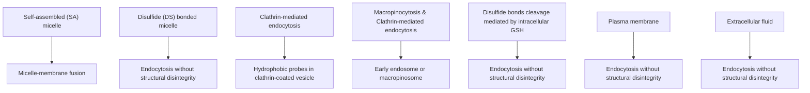

# FRET Imaging Reveals Different Cellular Entry Routes of Self-Assembled and Disulfide Bonded Polymeric Micelles

Seung-Young Lee,† Jacqueline Y. Tyler,† Sungwon Kim,‡ Kinam Park,\*,†,‡ and Ji-Xin Cheng\*,†,§

† Weldon School of Biomedical Engineering, ‡ Department of Industrial and Physical Pharmacy, and § Department of Chemistry, Purdue University, West Lafayette, Indiana 47907, United States

\*S Supporting Information

ABSTRACT: Although nanocarriers hold promise for cancer chemotherapy, their intracellular drug delivery pathways are not fully understood. In particular, the influence of nanocarrier stability on cellular uptake is stil uncertain. By physically loading hydrophobic FRET probes, we revealed different intracellular drug delivery routes of self-assembled and disulfide bonded micelles. The self-assembled micelles were structurally dissociated by micelle−membrane interactions, and the hydrophobic probes were distributed on the plasma membrane. Alternatively, intact disulfide bonded micelles carrying hydrophobic probes were internalized into cancer cells via multiple endocytic pathways. Following internalization, disulfide bonded micelles were decomposed in early endosomes by glutathione-mediated disulfide bond reduction, exposing the probes to intracellular organelles.

text_image

Self-assembled (SA)
micelle
Disulfide (DS)
bonded micelle
Extracellular
fluid
? Cellular uptake ?
? Plasma
membrane
Cytoplasm

KEYWORDS: disulfide bonded micelles, fluorescence resonance energy transfer (FRET), intracellular drug delivery, glutathione, cancer, nanomedicine

## INTRODUCTION

Nanocarrier-based chemotherapy has been studied not only for maximizing the therapeutic effect of chemodrugs, but also for minimizing nonselective toxicity to normal tissue.1−4 In order to achieve such goals, the nanocarrier must effectively deliver a chemoagent to the intracellular pharmacological target organelle in a cancer cell.5,6 For instance, paclitaxel and doxorubicin, as representative chemotherapeutics, can provide anticancer effects only by acting on microtubules and the nucleus, respectively.7,8 Thus, a comprehensive understanding of the cellular uptake and intracellular trafficking of a drugloaded nanocarrier is essential for successful chemotherapy.9−12 To date, the influences of physiochemical properties (e.g., size, shape, and surface charge) of nanocarriers on cellular uptake have been studied using various formulation and surface modification methods.13−16

The size of a nanocarrier is one of the key parameters determining its cellular entry rate and route. For example, spherical gold and silica nanoparticles with a 50 nm diameter have shown higher cellular uptake kinetics and intracellular concentration than smaller or larger nanoparticles because their wrapping time and, thus, the free energy required to drive the nanoparticles into the cells are minimized.17−19 In another study, larger carboxyl-modified polystyrene nanoparticles (>42 nm) were taken up by HeLa cells through clathrin-mediated endocytosis, while smaller particles (<25 nm) were internalized via nondegradative/nonacidic pathway.20,21 To give another example, cellular accumulation of 20 and 40 nm BSA-coated nanoparticles through caveolae-mediated endocytosis was 5−10 times greater than that of 100 nm BSA-coated nanoparticles.22

Size is not the only important factor; the shape of a nanocarrier also directly influences cellular internalization. Cylindrical PRINT particles with a high aspect ratio (3, diameter = 150 nm, height = 450 nm) used broad internalization pathways and rapidly accumulated in HeLa cells, compared to symmetric particles with a low aspect ratio (1, diameter = 200 nm, height = 200 nm).23 Conversely, the internalization of Au rods in MCF-7 cells decreased as the aspect ratio of the Au rods increased from 1.1 (diameter = 30 nm, length = 33 nm) to 4.0 (diameter = 14 nm, length = 55 nm).24 Spherical nanoparticles that have a low aspect ratio (2.3, polar axis ∼191 nm, equatorial axis ∼84 nm) also demonstrated higher internalization in HeLa cells than quasi-ellipsoid nanoparticles that have a higher aspect ratio (5.9, polar axis ∼381 nm, equatorial axis ∼65 nm) because their small average curvature radius favorably interacts with the surface of the cells.25 The surface charge of a nanocarrier also indirectly affects cellular uptake through protein opsonization. Cerium oxide nanoparticles with a positive zeta potential adsorb more BSA and thus have a lower cellular internalization into A549 cells compared to nanoparticles with a negative zeta potential.26 However, greater adsorption of serum protein to positively charged, PDDAC-coated Au rods triggered preferential internalization into MCF-7 cells relative to negatively charged, CTAB or PSS-coated Au rods.24

Received: June 5, 2013

Revised: July 18, 2013

Accepted: August 1, 2013

Published: August 1, 2013

In spite of these extensive efforts to find the factors that influence cellular internalization of nanocarriers, there still remain unknown and missing parameters, such as nanocarrier stability. In order to precisely control the physiochemical properties of nanocarriers, the studies mentioned above have used nondissociative and nondegradative nanoparticles $( \mathrm { e . g . } ,$ Au, iron oxide, and polystyrene nanoparticles) without drug encapsulation. Thus, these studies could not consider the influence of nanocarrier stability on cellular uptake. However, the majority of drug delivery system tested for cancer therapy are hydrophobically self-assembled nanocarriers, such as micelles,27 liposomes,28 polymersomes,29 and multilayer polymeric nanoparticles,30 which are readily dissociated by interactions with serum proteins in physiological environments.31−35 Recent reports on cellular uptake of hydrophobic fluorescent dye-loaded PEG-PDLLA micelles,36 PLGA nanoparticles,37 and DOPE/DOTAP liposomes38 have demonstrated that instability of the nanocarriers triggered not only nanocarrier-plasma membrane fusion but also premature release of the fluorescent dye to the cell membrane. Therefore, it is necessary to elucidate the influence of nanocarrier stability on cellular uptake to achieve successful intracellular drug delivery.

We performed comparative studies between self-assembled and disulfide bonded micelles, representing unstable and stable nanocarriers respectively, to understand the role of stability in their cellular internalization. The incorporation of disulfide bonds into self-assembled micelles improves not only the stability of the micelles in physiological conditions but also the cancer targeting efficacy of chemotherapeutics by using highly concentrated glutathione (GSH)-mediated reduction for drug release.39,40 Li et al.41,42 demonstrated that disulfide crosslinked, $\mathrm { P E G ^ { 5 k }  – C y s _ { 4 } – C A _ { 8 } }$ micelles could better retain their structural integrity and payload in serum protein solutions compared to non-cross-linked $\mathrm { P E G ^ { 5 k } { - } C A _ { 8 } }$ micelles. Furthermore, in the presence of a reduction agent which cleaves the disulfide bonds, the micelles exhibit rapid release of the payload. Herlambang et ${ \mathrm { a l . } } ^ { 4 3 }$ reported that the introduction of disulfide cross-linking in a dendrimer phthalocyanine-loaded polyion micelles (DPc/m) enhanced the production of reactive oxygen species (ROS) by preventing the invasion of serum protein to the micelle core, resulting in an increase of photocytotoxicity in A549 cells. Kim et ${ \mathrm { a l . } } ^ { 4 4 }$ established disulfide bonds into the ionic core of PEO-b-PMA micelles which then exhibited higher loading efficiency of doxorubicin (50% w/w) and more potent cytotoxicity against A2780 cells as compared to non-cross-linked micelles. Also, in our recent study, disulfide bonded mPEG-(Cys) -PDLLA micelles stably retained doxorubicin in blood circulation and increased the drug concentration in tumors up to 7 times greater than that of tumors treated with non-cross-linked, self-assembled mPEG-PDLLA micelles.45 While it is clear that disulfide bonded micelles have great potential in drug delivery, the intracellular uptake mechanism is still unclear. To address this, we prepared disulfide bonded methoxypoly(ethylene glycol)-(cysteine) - poly(D,L-lactic acid) (mPEG-(Cys) -PDLLA) and self-assembled mPEG-PDLLA micelles. By using fluorescence resonance energy transfer (FRET) imaging, we characterized the cellular entry routes and intracellular fates of the selfassembled (SA) and disulfide (DS) bonded micelles.

## EXPERIMENTAL SECTION

Polymer Synthesis and Micelle Preparation. The micelles were prepared and characterized as described previously.45 In brief, mPEG-PDLLA copolymer was synthesized by ring-opening polymerization of lactide in the presence of mPEG-OH (MW 5kDa). Also, mPEG-(Cys) -PDLLA copolymer was synthesized by sequential linking of methoxy poly(ethylene glycol) amine (mPEG- $\mathrm { \cdot N H } _ { 2 } ,$ MW 5kDa), oligocysteine4 (Fmoc·NH-CCCC-COOH), and carboxyl poly(D,Llactic acid) (PDLLA-COOH). SA micelles made of mPEG-PDLLA and DS micelles made of mPEG-(Cys) -PDLLA were prepared using the membrane dialysis method. Both micelles were loaded with a FRET pair, DiO and DiI.

Cell Culture. LNCaP, MCF-7, and M109 cells were cultured at $3 7 ~ ^ { \circ } \mathrm { C }$ in a humidified atmosphere containing 5% $\mathrm { C O } _ { 2 }$ and grown continuously in RPMI 1640 or DMEM medium supplemented with 10% FBS, 100 unit/mL penicillin, and 100 μg/mL streptomycin. Coverslip-bottomed Petri dishes (MatTek, Ashland, MA) were used for high-resolution imaging. Prior to each experiment, $6 \times 1 0 ^ { 4 }$ cells in 1 mL of growth medium were deposited into a Petri dish and incubated for 1 to 2 days to encourage adherence and cell confluence.

Cellular FRET Imaging. LNCaP, MCF-7, and M109 cells were incubated with FRET micelles at 500 μg/mL (in the culture medium with 10% FBS) at $3 7 ^ { \circ } \mathrm { C }$ for 2 h. Cellular FRET imaging was performed using FV1000 confocal system (Olympus, Tokyo, Japan) equipped with Argon (488 nm) and HeNe (543, 633 nm) lasers and a 60×/1.2 NA water objective. FRET images were acquired with 488 nm excitation and spectral filters of 500−530 nm and 555−655 nm for DiO and DiI detections. Microspectroscopy at pixels of interest was performed using a spectral detector, with emission scanning from 490 to 590 nm. FLUOVIEW software (Olympus) was utilized for image processing. The FRET ratio was calculated as follows:

$$
\mathrm{FRET} \text { ratio } = I _ {\mathrm{DiI}} / (I _ {\mathrm{DiI}} + I _ {\mathrm{DiO}})
$$

where $I _ { \mathrm { D i I } }$ and $I _ { \mathrm { D i O } }$ were the fluorescence intensities of DiI at 570 nm and DiO at 508 nm.

Endocytic Trafficking. After LNCaP cells were incubated with Dil-loaded SA or DS micelles (50 μg/mL in the culture medium with 10% FBS) at 4 or $3 7 ^ { \circ } \mathrm { C } ,$ the endocytic internalization of core-loaded hydrophobic probe (DiI) in the micelles was examined using confocal imaging. Transferrin-Alexa Fluor 633 (Tf) and fluorescein dextran (MW 70 kDa, Dex) were used as tracers for clathrin-mediated endocytosis and macropinocytosis, respectively. DiI-loaded micelles at 100 μg/mL (in the culture medium with 10% FBS) were treated to LNCaP cells and incubated with Tf (25 μg/mL) or Dex (100 μg/mL) for 2 h at $3 7 ^ { \circ } \mathrm { C }$ before imaging. The cells were washed twice with cold PBS (pH 7.4), fixed with 4% paraformaldehyde for 15 min at room temperature, and mounted with Fluoromount-G (SouthernBiotech, Birmingham, AL). A Nikon C1+ confocal system (Nikon, Tokyo, Japan) equipped with argon (488 nm) and diode (405, 561, 639 nm) lasers and 60×/1.4 NA oil objective was used for fluorescence imaging. The imaging analysis was carried out using EZ-C1 software (Nikon). The filter sets (Dex (Ex488/Em500−530), DiI (Ex561/Em568−643), and Tf (Ex639/Em660−720)) were utilized. Colocalization ratios of core-loaded hydrophobic molecule (DiI) with the endocytic tracers were derived as follows:

$$
\text { colocalization   ratio } (\%)
$$

$$
= \left(\text { DiI   FL   pixels } _ {\text { colocalization }} / \text { DiI   FL   pixels } _ {\text { total }}\right) \times 1 0 0
$$

where DiI FL $\mathrm { p i x e l s } _ { \mathrm { c o l o c a l i z a t i o n } }$ indicates the number of DiI fluorescence pixels colocalizing with Tf or Dex pixels, and DiI FL pixels $\mathrm { \dot { \ t o t a l } }$ represents the number of total DiI fluorescence pixels in the confocal images. ImageJ software (NIH) was used for the image analysis.

Exploring Entry Routes Using Endocytic Inhibitors. LNCaP cells were pretreated with chlorpromazine (CPZ, 10 μg/mL) to inhibit clathrin-mediated endocytosis or amiloride (Amil, 50 μM) to inhibit macropinocytosis for 1 h at $3 7 ~ ^ { \circ } \mathrm { C } .$ Then, DiI-loaded SA and DS micelles (100 $\mu \mathrm { g / m L ) }$ were treated to the cells for 2 h at $3 7 ~ ^ { \circ } \mathrm { C }$ Confocal imaging was performed using FV1000 confocal system (Olympus, Tokyo, Japan). ImageJ software (NIH) was used for quantitative analysis of DiI accumulation in the cells.

Intracellular Glutathione (GSH) and Disulfide Bond Reduction. In order to reduce intracellular glutathione (GSH), buthionine sulfoximine (BSO, 10 mM) was pretreated to LNCaP cells for 24 h at $3 7 ^ { \circ } \mathrm { C } .$ . DS FRET micelle (500 μg/mL) then was added and incubated for 2 h. FRET imaging was performed using an FV1000 confocal system with the same conditions as mentioned above. The content of intracellular GSH was determined according to a modified Ellman assay. Briefly, LNCaPs cells $( \sim 5 \times 1 0 ^ { \overline { { 6 } } }$ cells) were incubated without or with 10 mM BSO for 24 h. The cells were then washed in fresh RPMI 1640 to remove the BSO, trypsinized, and harvested by centrifugation. The cells were resuspended in 100 $\mu \mathrm { L }$ of PBS (10 mM, pH 7.4) and lysed by sonication. Proteins were precipitated in metaphoshoric acid (2%) at $4 ~ ^ { \circ } \mathrm { C }$ for 15 min and removed by centrifugation (10000g, 10 min). Supernatants were stored $\mathrm { a t } - 8 0 ~ ^ { \circ } \mathrm { C }$ until the time of analysis. The concentration of intracellular GSH was determined by Ellman assay (λ = 412 nm). A linear standard curve of reduced L-glutathione (GSH) ranging from 5 to 0.04 mM was created. Cell viability for the treatment of 10 mM BSO was evaluated by MTT assay.

Endocytic Cleavage of Disulfide Bonds. To investigate subcellular reduction of disulfide bonds. DS FRET micelles (100 μg/mL in the culture medium with 10% FBS) were treated to LNCaP cells with transferrin-Alexa Fluor 633 (Tf) (25 μg/mL) and LysoSensor Blue DND-167 (Lyso) (30 μM) as organelle markers for early endosome and lysosome together for 2 h at $3 7 ~ ^ { \circ } \mathrm { C } .$ The endocytic cleavage of disulfide bonds in DS micelles was visualized using the Nikon C1+ confocal system as described above. The filter sets (DiO (Ex488/ Em500−530), DiI (Ex561/Em568−643), Lyso (Ex405/ Em435−465), Tf (Ex639/Em660−720)) were used. Colocalization ratios of DiO with the organelle markers were determined by following the same method as explained above.

Data Analysis. Values are expressed as mean $\pm \mathrm {  ~ \ } S { \mathrm { D } } ,$ statistical comparisons between groups were made using Student’s t test, and a P value of <0.05 was considered significant.

## RESULTS

DS Micelles Retain Payloads during Cellular Entry Whereas SA Micelles Lose Payloads at Plasma Membrane. Self-assembled (SA) and disulfide (DS) bonded FRET micelles were prepared by physically loading the hydrophobic FRET probes (DiO and DiI) into the cores of both micelles microscopy. MCF-7 (human breast cancer), M109 (mouse lung cancer), and LNCaP (human prostate cancer) cells were incubated with SA or DS FRET micelles for 2 h, and the cellular distribution of FRET probes (DiO and DiI) was visualized via excitation at 488 nm. Unlike cells treated with DS micelles, a strong green fluorescence (DiO signal) was observed on the plasma membrane for the cells incubated with SA micelles (Figure 2A). For both SA and DS micelle treatments, a red fluorescence (DiI signal) was observed outside the cells, and a yellow fluorescence from overlaid green (DiO signal) and red (DiI signal) was visualized inside the cells. The spectra outside and inside LNCaP cells is consistent with these observations (Figure 2B). Intact SA micelles in media produced high FRET efficiency, resulting in the red fluorescence (DiI signal) outside the cells. However, the translocation of hydrophobic probes from the micelle core to plasma membrane by micelle polymer−plasma membrane fusion caused low FRET efficiency, resulting in notable green fluorescence (DiO signal) on the plasma membrane.36,38 Released FRET probes (DiO and DiI) easily attached to the cell membrane because of the direct interaction between their hydrocarbon chains and the membrane lipid bilayer.46 The probes were then internalized into the cells by endocytic vesicles, in which DiO and DiI were adjacent to each other. Condensation of the probes in endocytic vesicles partially recovered FRET efficiency and created a yellow fluorescence (by merging DiO (green) and DiI (red) signals) inside the cells.36 After 2 h of incubation with SA micelles, the FRET ratio ${ \left( = I _ { \mathrm { D i I } } / \left( I _ { \mathrm { D i I } } + I _ { \mathrm { D i O } } \right) \right) }$ outside and inside LNCaP cells was 0.72 and 0.32, respectively. In contrast to cells incubated with SA micelles, there was no detectable fluorescence on the cell membrane for cells treated with DS micelles, indicating no structural decomposition of DS micelles during cellular internalization. After the internalization, DS micelles may be dissociated by cellular reducing agents, such as glutathione, which caused a lower FRET efficiency as well as a yellow fluorescence inside the cells. The FRET ratio $( { = } I _ { \mathrm { D i I } } / ( I _ { \mathrm { D i I } }$ $\dot { + } \ I _ { \mathrm { D i O } } ) )$ decreased from 0.76 to 0.49 after uptake of the DS micelles by LNCaP cells. These results demonstrate that DS micelles stably retain payloads during cellular entry, whereas SA micelles lose their payloads as their structure is decomposed upon interaction with the plasma membrane.

(Figure 1, Table S1 in the Supporting Information). The cellular uptake of SA and DS micelles was visualized by FRET  

text_image

Self-assembled (SA)
FRET micelle
Hydrophilic
surface (PEG)
Hydrophobic
core (PDLLA)
FRET probe dyes
(DiO and Dil)
Disulfide (DS) bonded
FRET micelle
Disulfide bonds
(Cysteine₄)

Figure 1. Schematic illustrations of SA and DS micelles with FRET dyes (DiO and DiI).

Payloads in SA and DS Micelles Enter Cells via Different Endocytic Pathways. We next evaluated the influence of micelle stability on the cellular uptake of a payload. During 2 h of incubation at $3 7 \ ^ { \circ } \mathrm { C } ,$ the payloads (DiI) in SA and DS micelles were internalized into LNCaP cells with different rates (Figure 3A,B). The cellular uptake rate of DiI (red fluorescence) in DS micelles was much slower than the

  
Figure 2. Different cellular internalizations of SA and DS micelles. (A) Confocal FRET images of MCF7, M109, and LNCaP cells after 2 h incubation with SA and DS FRET micelles. The green and red colors represent DiO and DiI signals, respectively, and the yellow color indicates overlapped signals of the both FRET dyes. The concentration of each FRET micelle was 500 μg/mL, and the excitation wavelength was 488 nm. (Scale bars: 10 μm.) (B) Spectra measured outside (red) and inside (green) of LNCaP cells treated with SA and DS FRET micelles.

text_image

A
30 min	60 min	120 min
SA micelle
DS micelle

line chart

| Incubation time (min) | SA micelle (Intensity a.u./cell) | DS micelle (Intensity a.u./cell) |
|---|---|---|
| 0 | 0 | 0 |
| 30 | 12 | 2 |
| 60 | 24 | 6 |
| 120 | 41 | 15 |

Figure 3. Different cellular uptake rates of hydrophobic probes in SA and DS micelles. (A) Time-dependent cellular uptake of DiI (red) loaded in SA and DS micelles to LNCaP cells (scale bar: 20 μm). (B) Quantification of intracellular accumulation of DiI in a single cell, as a function of incubation time. Data are expressed as means $\pm \ S \mathrm { D } \ ( n =$ 20).

uptake rate in SA micelles. This difference may be attributed to different cellular uptake pathways for payloads (DiI) in SA and DS micelles. In order to characterize the endocytic pathways, transferrin-Alexa Fluor 633 (Tf) and fluorescein dextran (MW 70 kDa, Dex) were employed as a clathrin-mediated endocytic tracer47 and a macropinocytic tracer,48 respectively. DiI-loaded SA or DS micelles were applied to $\mathrm { L N C a \bar { P } }$ cells and incubated with Tf or Dex for 2 h at 37 $^ \circ \mathrm { C } .$ Confocal imaging demonstrated the colocalization of DiI (red) with Tf (left column, green) or Dex (right column, green) (Figure 4A). High colocalization of red (DiI signal) and green (tracer signal) fluorescence is represented by yellow fluorescence over the cells. The cells treated with the DiI-loaded SA micelles and Dex showed low colocalization of red (DiI signal) and green (Dex signal) (white arrows indicates the unoverlaid spots in the right upper image). The colocalization was quantitatively analyzed and demonstrates the different endocytic pathways of a payload in the SA and DS micelles (Figure 4B). The colocalization ratios show that the payload in SA micelles was mainly internalized by clathrin-mediated endocytosis, whereas the payload in DS micelles was taken up simultaneously by both clathrin-mediated endocytosis and macropinocytosis. Additionally, we confirmed the different cellular entry routes between SA and DS micelle payloads using endocytic inhibitors. We employed chlorpromazine (CPZ), inhibiting clathrin-mediated endocytosis, and amiloride (Amil), inhibiting macropinocyto-$\mathrm { s i s } . ^ { 4 9 , 5 0 }$ After pretreating LNCaP cells with the inhibitors for 1 ${ \mathrm { h } } ,$ the cells were subsequently treated with DiI-loaded SA and DS micelles for 2 h at ${ \bar { 3 } } 7 \ { } ^ { \circ } { \mathrm { C } } .$ . The fluorescence signal (red) of DiI in the cells was observed by confocal imaging (Figure 4C). The relative fluorescence intensity was determined by comparison with cells not treated with endocytic inhibitors (Figure 4D). For the SA micelles, the intensities of DiI in the cells pretreated with CPZ and Amil were decreased up to 70% and $1 5 \% ,$ respectively, compared to the control. This indicates that the cellular uptake of payload in the SA micelles significantly relies on clathrin-mediated endocytosis. On the other hand, for the DS micelles, the fluorescence intensities in both the cells pretreated with CPZ and Amil were similarly reduced by 45%. This suggests that both clathrin-mediated endocytosis and macropinocytosis are equally involved in the cellular uptake of DS micelle payloads. These data were consistent with the endocytic trafficking study using endocytic tracers described above. Together, these results indicate that the introduction of disulfide bonds allows the cellular internalization of micelles without structural dissociation, and thus redirects the cellular entry routes of the payloads.

B  

bar chart

SA micelle
| Treatment | Colocalization (%) |
| :--- | :--- |
| Tf/Dil | 65 |
| Dex/Dil | 28 |
P < 0.001

bar chart

DS micelle
| Treatment | Colocalization (%) |
| :--- | :--- |
| Tf/Dil | 58 |
| Dex/Dil | 56 |

D  

bar chart

| Group  | Relative intensity |
| ------ | ------------------ |
| Control | 1.0                |
| CPZ    | 0.3                |
| Amil   | 0.8                |

bar chart

| Group   | Relative intensity |
| ------- | ------------------ |
| Control | 1.0                |
| CPZ     | 0.5                |
| Amil    | 0.5                |

Figure 4. Different cellular entry routes of hydrophobic probes in SA and DS micelles (A) Colocalization of DiI (red) encapsulated in the micelles with Tf (left column, green) or Dex (right column, green) in LNCaP cells after 2 h incubation. The yellow color shows the colocalized signals, and white arrows (in upper right image) indicate representative non-colocalizations of DiI with Dex. (Scale bar: 10 μm.) (B) Colocalization percentage (%) of DiI in SA and DS micelles with Tf or Dex. Data are expressed as means ± SD (n = 20). (C, D) The effect of endocytic inhibitors on the cellular entry of DiI in SA and DS micelles. LNCaP cells were either untreated or pretreated with CPZ and Amil for 1 h. Subsequently, the cells were incubated with DiI-loaded SA and DS micelles for 2 h. (C) Fluorescence images of DiI (red) in the LNCaP cells. (Scale bar: 10 μm.) (D) Quantification of intracellular accumulation of DiI in a single cell. Data are expressed as means ± SD (n = 20).

DS Micelles Are Intracellularly Decomposed via Glutathione. We further tracked the fate of DS micelles beyond cellular uptake using FRET imaging. After internalization in LNCaP cells, the FRET efficiency of DS micelles diminished (Figure 2B). This might be due to the structural disintegration of the DS micelles by an intracellular redox component, such as glutathione (GSH). To prove this hypothesis, we used buthionine sulfoximine (BSO) to reduce the concentration of intracellular GSH, which prevents GSH synthesis by inhibiting γ-glutamylcysteine synthetase.51−53 Before incubation with the DS micelles, LNCaP cells were pretreated with 10 mM BSO for 24 h to reduce intracellular GSH. After 2 h incubation with DS FRET micelles, LNCaP cells with or without pretreatment of BSO were observed by FRET imaging (Figure 5A). In contrast to the FRET image of the LNCaP cells without BSO pretreatment, the green fluorescence (DiO signal) in the GSH-reduced cells was faded, resulting in predominant red fluorescence (DiI signal) throughout the cells. The spectral measurement for the GSHreduced LNCaP cells showed a similar spectrum inside (green curve) and outside (red curve) of the cells, unlike the spectra for the normal LNCaP cells (Figure 5B). After internalization of the DS micelles into the normal LNCaP cells, the FRET ratio decreased from 0.69 (outside, red curve) to 0.33 (inside, green curve). This is opposite of the GSH-reduced LNCaP cells, in which the FRET ratios increased from 0.72 (outside, red curve) to 0.79 (inside, green curve). This is likely due to the accumulation of intact DS micelles in the GSH-reduced cells. Treating LNCaP cells with 10 mM BSO for 24 h reduced the concentration of intracellular GSH without any cytotoxicity (Figure 5C,D). These observations evidenced that intracellular GSH is primarily responsible for cleaving the disulfide bonds and leads the structural disintegrity of internalized DS micelles in a cancer cell, allowing payload release.

Intracellular Disintegration of DS Micelles Occurs in Early Endosomes. We next investigated the organelle where DS micelle disulfide bond cleavage takes place using transferrin Alexa Fluor 633 (Tf) and LysoSensor Blue DND-167 (Lyso) as early endosome and lysosome makers, respectively. LNCaP cells were incubated with DS FRET micelles (with DiO and DiI), Tf, and Lyso for 2 h, after which confocal fluorescence images were acquired (Figure 6A,B). The DiO (green) and DiI (red) signals in the same location were visualized with distinct excitation for each probe. Notably, a higher degree of DiO (green) and Tf (purple) colocalization was observed than DiO and Lyso (blue) colocalization. This was further confirmed by calculating the colocalization ratio of DiI and either Tf or Lyso (Figure 6C). These results reveal that the disulfide bonds in DS micelles were predominantly cleaved in early endosomes after cellular internalization.

A  
  
B  
C  
Figure 5. Intracellular GSH-mediated disulfide bond cleavage of DS micelles. (A) Confocal FRET images of normal and GSH-reduced LNCaP cells after 2 h incubation with DS FRET micelles. Intracellular GSH in LNCaP cells was decreased by pretreatment with 10 mM BSO for 24 h. (Scale bars: 10 μm.) The green and red colors represent DiO and DiI signals, respectively, and the yellow color indicates overlapped signals of the both FRET dyes. (B) Spectra measured outside (red) and inside (green) of the cells in the images. (C) Quantitative analysis of Intracellular GSH in LNCaP cells after treatment of 10 mM BSO for 24 h (mean ± SD (n = 3)). (D) Cell viability test after treatment of 10 mM BSO for 24 h (mean ± SD (n = 8)).

A  

natural_image

Fluorescent microscopy image showing green-labeled DiO protein expression in cells (no text or symbols present)

natural_image

Microscopic image showing red fluorescent spots against a black background, labeled 'Dil' in the top-left corner (no other text or symbols)

natural_image

Fluorescence microscopy image showing scattered bright spots against a dark background, labeled 'DiO/Dil' in top-left corner (no other text or symbols)

E  

text_image

Tf/DiO

natural_image

Fluorescence microscopy image showing Lyso/DiO protein expression in cells (no text or symbols present)

C  

bar chart

| Condition | Colocalization (%) |
|---|---|
| Tf/DiO | 48 |
| Lyso/DiO | 17 |
P < 0.0001

Figure 6. Endosomal degradation of DS FRET micelles. (A) Confocal fluorescence images of DiO (green) and DiI (red) escaped from DS micelles in LNCaP cells after 2 h incubation. The yellow color (in right merged image) represents overlapped signals of the both FRET dyes. (B) Colocalization of DiO (green) with Tf (purple) or Lyso (blue). The white arrows (in left image) indicate representative colocalization spots of DiO with Tf. (Scale bar: 5 μm.) (C) Colocalization percentage (%) of DiO with Tf or Lyso. Data are expressed as means ± SD (n = 20).

The results gleaned from these studies were summarized and illustrated (Figure 7). To summarize intracellular delivery of our hydrophobic molecules, SA micelles lost their structural integrity on the cell membrane due to micelle−plasma membrane fusion. The hydrophobic molecules were disseminated on the plasma membrane after dissociation of the SA micelles and were rapidly taken up through clathrin-mediated endocytosis. In contrast. whole intact DS micelles with hydrophobic probes were internalized slowly through both macropinocytosis and clathrin-mediated endocytosis. Immedi ately following internalization, the DS micelles were decomposed in early endosomes by intracellular GSH-mediated cleavage of disulfide bonds. Finally, the hydrophobic probes were released from the DS micelles and exposed to the cell organelles. This redirection in internalization route of the hydrophobic probes was ultimately attributed to the improvement of micelle stability by disulfide linkage.

## DISCUSSION

In spite of the great potential for nanocarrier-based intracellular drug delivery to achieve sufficient effects for cancer therapy, the mechanism and key parameters remain elusive.54−56 Selfassembled (SA) micelles composed of amphiphilic block copolymers have been widely used as a nanodrug carrier for cancer therapy, owing to their high drug loading capacity and readily modifiable chemical structure.57−60 However, the instability of SA micelles in physiological conditions has been an issue.61,62 To solve this problem, disulfide (DS) bonded micelles have recently been introduced for efficient intracellular drug delivery, utilizing their high stability and structural decomposition in response to highly concentrated glutathione (GSH) in cancer cells.63−66 Here we described how SA and DS micelles carry a hydrophobic molecule into a cancer cell, and also how the hydrophobic molecule is released from DS micelles inside the cancer cell using FRET imaging. The different cellular entry routes of hydrophobic probes loaded in SA and DS micelles were demonstrated (Figure 2, 3, and 4). The intracellular cleavage of disulfide bonds in DS micelles by GSH in the early endosome was also confirmed (Figure 5 and 6).

flowchart

Figure 7. Schematic diagram of cellular entry routes and intracellular fates of SA and DS micelles.

For the SA micelles, the apparent green fluorescence on the plasma membrane indicates that the hydrophobic molecules (DiO and DiI) have been transmitted from the micelle core to the cell membrane due to the micelle-membrane fusion. Although the PEG polymer on the micelle surface helps to prevent opsonization and extend the blood-circulation time,67,68 the PEG layer on unstable micelles can provide adverse effects, such as PEG−plasma membrane interaction, which triggers structural decomposition of the SA micelles and subsequent loss of encapsulated drug molecules.36,69 The hydrophobic drug molecules are dispersed on the plasma membrane after this dissociation of the SA micelles, and internalized into the cells by endocytosis. However, DS micelles stabilized by disulfide bonding can steadily hold the hydrophobic molecules inside of the core, overcome the PEG− membrane interactions, and directly deliver them into cancer cells.

We also observed a higher cellular uptake rate for hydrophobic probes in SA micelles compared to that in DS micelles. Clathrin-mediated endocytosis was dominant in cellular uptake of the hydrophobic probes in SA micelles, whereas the hydrophobic probes in DS micelles used simultaneously clathrin-mediated endocytosis and macropinocytosis to enter the cancer cells. It has been well-known that nanocarriers employ multiple endocytic pathways with different recycling times of endocytic vesicles for cellular internalization .9,11,70 Endocytic vesicles in clathrin-dependent endocytosis have a rapid recycling time as compared to that in clathrin independent endocytosis such as macropinocytosis, due to its short recycling route that requires Rab4 and Rab35.71 The cellular uptake of transferrin by clathrin-mediated endocytosis was faster than that of dextran by macropinocytosis.48 Therefore, the hydrophobic probes distributed on plasma membrane by dissociation of the SA micelles could be rapidly internalized by clathrin-mediated endocytosis. On the other hand, intact DS micelles with probes were nonspecifically taken up by both clathrin-mediated endocytosis and macropinocytosis due to their large-sized endocytic vesicles (clathrin mediated endocytosis ∼120 nm and macropinocytosis >1 μm).5,11 Since slower macropinocytosis contributes to a larger percentage of payload uptake in DS micelles compared to SA micelles, the overall uptake rate of the DS micelle payload is slower. We did not consider caveolae-mediated endocytosis and phagocytosis for the following reasons. First, caveolae-mediated endocytosis generally allows cellular internalization of small molecules (less than 5060 nm)5 that are much smaller than our micelles (about 110−150 nm); second, phagocytosis normally occurs in macrophages, but does not commonly occur in cancer cells,

Lysosomes have been believed to be a main organelle involved in reduction of disulfide bonds because they contains free cysteine and gamma-interferon inducible lysosomal thiol reductase (GILT).72 Thus, it has been speculated that disulfide cross-linked nanocarriers might stably hold drugs after the cellular entry, and then specifically release the drugs by reduction of disulfide bonds in lysosomes.39,73 Our results, however, demonstrate that the DS micelle disulfide bonds were cleaved in the early endosome. This observation is consistent with our previous report where, using a disulfide-linked folate-FRET reporter, we showed reduction of the disulfide bonds in the early endosome.74 Other recent work also has exhibited that degradation of disulfide cross-linked PEO-b-PMA micelles began at the early stage of endocytosis.44 We also identified that intracellular glutathione (GSH) is the main redox component reducing disulfide bonds using a γ-glutamylcysteine synthetase inhibitor, buthionine sulfoximine (BSO). Since GSH/glutathione disulfide (GSSG) is a major redox couple in animal cells and determines the antioxidative capacity of the cells, GSH at around 2−10 mM exists in cytosol.75,76 Although the actual concentration of GSH in endocytic vesicles has not yet been determined, our results evidence the existence of sufficient GSH for reduction of disulfide bonds in early endosomes.

In summary, we have demonstrated the influence of nanocarrier stability on intracellular drug delivery; the improvement of micelle stability by incorporation of disulfide bonds altered the cellular entry route of a hydrophobic molecule. We also investigated the fate of disulfide bonded micelles after the cellular uptake; internalized DS micelles in cancer cells were structurally decomposed by GSH-mediated reduction of disulfide bonds in early endosome. Our studies provide a new understanding of not only the influence of nanocarrier stability on cellular entry route of a drug but also the mechanism of intracellular drug delivery using disulfide bonded nanocarriers.

## ASSOCIATED CONTENT

## \*S Supporting Information

Physiochemical characteristics of SA and DS micelles with FRET probes. This material is available free of charge via the Internet at http://pubs.acs.org.

## AUTHOR INFORMATION

## Corresponding Author

\*Phone: +1 765 494 4335. Fax: +1 765 496 1912. E-mail: jcheng@purdue.edu (J.-X.C.); kpark@purdue.edu (K.P.).

## Notes

The authors declare no competing financial interest.

## ACKNOWLEDGMENTS

This work was supported by R01 CA129287.

## REFERENCES

(1) Hammond, P. T. Virtual issue on nanomaterials for drug delivery. ACS Nano 2011, 5, 681−684.  
(2) Wang, A. Z.; Langer, R.; Farokhzad, O. C. Nanoparticle delivery of cancer drugs. Annu. Rev. Med. 2012, 63, 185−198.  
(3) Cabral, H.; Nishiyama, N.; Kataoka, K. Supramolecular nanodevices: From design validation to theranostic nanomedicine. Acc. Chem. Res. 2011, 44, 999−1008.  
(4) Barreto, J. A.; O’Malley, W.; Kubeil, M.; Graham, B.; Stephan, H.; Spiccia, L. Nanomaterials: Applications in cancer imaging and therapy. Adv. Mater. 2011, 23, H18−H40.  
(5) Petros, R. A.; DeSimone, J. M. Strategies in the design of nanoparticles for therapeutic applications. Nat. Rev. Drug Discovery 2010, 9, 615−627.  
(6) Rajendran, L.; Knolker, H.-J.; Simons, K. Subcellular targeting strategies for drug design and delivery. Nat. Rev. Drug Discovery 2010, 9, 29−42.  
(7) Jordan, M. A.; Wilson, L. Microtubules as a target for anticancer drugs. Nat. Rev. Cancer 2004, 4, 253−265.  
(8) Hanusovǎ , V.; Bouś ovǎ , I.; Ská lová , L. Possibilities to increase thé effectiveness of doxorubicin in cancer cells killing. Drug Metab. Rev. 2011, 43, 540−557.  
(9) Duncan, R.; Richardson, S. C. W. Endocytosis and intracellular trafficking as gateways for nanomedicine delivery: Opportunities and challenges. Mol. Pharmaceutics 2012, 9, 2380−2402.  
(10) Sahay, G.; Alakhova, D. Y.; Kabanov, A. V. Endocytosis of nanomedicines. J. Controlled Release 2010, 145, 182−195.  
(11) Conner, S. D.; Schmid, S. L. Regulated portals of entry into the cell. Nature 2003, 422, 37−44.  
(12) Bonner, D. K.; Leung, C.; Chen-Liang, J.; Chingozha, L.; Langer, R.; Hammond, P. T. Intracellular trafficking of polyamido amine−poly(ethylene glycol) block copolymers in DNA delivery. Bioconjugate Chem. 2011, 22, 1519−1525.  
(13) Zhao, F.; Zhao, Y.; Liu, Y.; Chang, X.; Chen, C.; Zhao, Y. Cellular uptake, intracellular trafficking, and cytotoxicity of nanoma terials. Small 2011, 7, 1322−1337.  
(14) Mitragotri, S.; Lahann, J. Physical approaches to biomaterial design. Nat. Mater. 2009, 8, 15−23.  
(15) Venkataraman, S.; Hedrick, J. L.; Ong, Z. Y.; Yang, C.; Ee, P. L. R.; Hammond, P. T.; Yang, Y. Y. The effects of polymeric nanostructure shape on drug delivery. Adv. Drug Delivery Rev. 2011, 63. 12281246  
(16) Albanese, A.; Tang, P. S.; Chan, W. C. W. The effect of nanoparticle size, shape, and surface chemistry on biological systems. Annu. Rev. Biomed. Eng. 2012, 14, 1−16.  
(17) Chithrani, B. D.; Chan, W. C. W. Elucidating the mechanism of cellular uptake and removal of protein-coated gold nanoparticles of different sizes and shapes. Nano Lett. 2007, 7, 1542−1550.  
(18) Lu, F.; Wu, S.-H.; Hung, Y.; Mou, C.-Y. Size effect on cel uptake in well-suspended, uniform mesoporous silica nanoparticles. Small 2009, 5, 1408−1413.  
(19) Gao, H.; Shi, W.; Freund, L. B. Mechanics of receptor-mediated endocytosis. Proc. Natl. Acad. Sci. U.S.A. 2005, 102, 9469−9474.  
(20) Lai, S. K.; Hida, K.; Man, S. T.; Chen, C.; Machamer, C.; Schroer, T. A.; Hanes, J. Privileged delivery of polymer nanoparticles to the perinuclear region of live cells via a non-clathrin, nondegradative pathway. Biomaterials 2007, 28, 2876−2884.  
(21) Lai, S. K.; Hida, K.; Chen, C.; Hanes, J. Characterization of the intracellular dynamics of a non-degradative pathway accessed by polymer nanoparticles. J. Controlled Release 2008, 125, 107−111.  
(22) Wang, Z.; Tiruppathi, C.; Minshall, R. D.; Malik, A. B. Size and dynamics of caveolae studied using nanoparticles in living endothelial cells. ACS Nano 2009, 3, 4110−4116.  
(23) Gratton, S. E. A.; Ropp, P. A.; Pohlhaus, P. D.; Luft, J. C.; Madden, V. J.; Napier, M. E.; DeSimone, J. M. The effect of particle design on cellular internalization pathways. Proc. Natl. Acad. Sci. U.S.A. 2008, 105, 11613−11618.  
(24) Qiu, Y.; Liu, Y.; Wang, L.; Xu, L.; Bai, R.; Ji, Y.; Wu, X.; Zhao, Y.; Li, Y.; Chen, C. Surface chemistry and aspect ratio mediated cellular uptake of Au nanorods. Biomaterials 2010, 31, 7606−7619.  
(25) Florez, L.; Herrmann, C.; Cramer, J. M.; Hauser, C. P.; Koynov, K.; Landfester, K.; Crespy, D.; Mailander, V. How shape influences̈ uptake: Interactions of anisotropic polymer nanoparticles and human mesenchymal stem cells. Small 2012, 8, 2222−2230.  
(26) Patil, S.; Sandberg, A.; Heckert, E.; Self, W.; Seal, S. Protein adsorption and cellular uptake of cerium oxide nanoparticles as a function of zeta potential. Biomaterials 2007, 28, 4600−4607.  
(27) Li, W.; Feng, S.; Guo, Y. Tailoring polymeric micelles to optimize delivery to solid tumors. Nanomedicine 2012, 7, 1235−1252.  
(28) Malam, Y.; Loizidou, M.; Seifalian, A. M. Liposomes and nanoparticles: nanosized vehicles for drug delivery in cancer. Trends Pharmacol. Sci. 2009, 30, 592−599.  
(29) Christian, D. A.; Cai, S.; Bowen, D. M.; Kim, Y.; Pajerowski, J. D.; Discher, D. E. Polymersome carriers: From self-assembly to siRNA and protein therapeutics. Eur. J. Pharm. Biopharm. 2009, 71, 463−474.  
(30) Poon, Z.; Lee, J. B.; Morton, S. W.; Hammond, P. T. Controlling in vivo stability and biodistribution in electrostatically assembled nanoparticles for systemic delivery. Nano Lett. 2011, 11, 2096−2103.  
(31) Savic, R.; Azzam, T.; Eisenberg, A.; Maysinger, D. Assessment of́ the integrity of poly(caprolactone)-b-poly(ethylene oxide) micelles under biological conditions: A fluorogenic-based approach. Langmuir 2006, 22, 3570−3578.  
(32) Letchford, K.; Burt, H. M. Copolymer micelles and nanospheres with different In vitro stability demonstrate similar paclitaxel pharmacokinetics. Mol. Pharmaceutics 2011, 9, 248−260.  
(33) Lu, J.; Owen, S. C.; Shoichet, M. S. Stability of self-assembled polymeric micelles in serum. Macromolecules 2011, 44, 6002−6008.  
(34) Kim, S.; Shi, Y.; Kim, J. Y.; Park, K.; Cheng, J.-X. Overcoming the barriers in micellar drug delivery: loading efficiency, in vivo stability, and micelle−cell interaction. Expert Opin. Drug Delivery 2010, 7, 49−62.  
(35) Chen, H.; Kim, S.; He, W.; Wang, H.; Low, P. S.; Park, K.; Cheng, J.-X. Fast release of lipophilic agents from circulating PEG-PDLLA micelles revealed by in vivo Förster resonance energy transfer imaging. Langmuir 2008, 24, 5213−5217.  
(36) Chen, H.; Kim, S.; Li, L.; Wang, S.; Park, K.; Cheng, J.-X. Release of hydrophobic molecules from polymer micelles into cell membranes revealed by Förster resonance energy transfer imaging. Proc. Natl. Acad. Sci. U.S.A. 2008, 105, 6596−6601.  
(37) Xu, P.; Gullotti, E.; Tong, L.; Highley, C. B.; Errabelli, D. R.; Hasan, T.; Cheng, J.-X.; Kohane, D. S.; Yeo, Y. Intracellular drug delivery by poly(lactic-co-glycolic acid) nanoparticles, revisited. Mol. Pharmaceutics 2008, 6, 190−201.  
(38) Csiszar, A.; Hersch, N.; Dieluweit, S.; Biehl, R.; Merkel, R.;́ Hoffmann, B. Novel fusogenic liposomes for fluorescent cell labeling and membrane modification. Bioconjugate Chem. 2010, 21, 537−543.  
(39) Cheng, R.; Feng, F.; Meng, F.; Deng, C.; Feijen, J.; Zhong, Z. Glutathione-responsive nano-vehicles as a promising platform for targeted intracellular drug and gene delivery. J. Controlled Release 2011, 152, 2−12.  
(40) Zhang, Q.; Re, Ko, N.; Kwon, Oh, J. Recent advances in stimuliresponsive degradable block copolymer micelles: synthesis and controlled drug delivery applications. Chem. Commun. 2012, 48, 7542−7552.  
(41) Li, Y.; Budamagunta, M. S.; Luo, J.; Xiao, W.; Voss, J. C.; Lam, K. S. Probing of the assembly structure and dynamics within nanoparticles during interaction with blood proteins. ACS Nano 2012, 6, 9485−9495.  
(42) Li, Y.; Xiao, K.; Luo, J.; Xiao, W.; Lee, J. S.; Gonik, A. M.; Kato, J.; Dong, T. A.; Lam, K. S. Well-defined, reversible disulfide crosslinked micelles for on-demand paclitaxel delivery. Biomaterials 2011, 32, 6633−6645.  
(43) Herlambang, S.; Kumagai, M.; Nomoto, T.; Horie, S.; Fukushima, S.; Oba, M.; Miyazaki, K.; Morimoto, Y.; Nishiyama, N.; Kataoka, K. Disulfide crosslinked polyion complex micelles encapsulating dendrimer phthalocyanine directed to improved efficiency of photodynamic therapy. J. Controlled Release 2011, 155, 449−457.  
(44) Kim, J. O.; Sahay, G.; Kabanov, A. V.; Bronich, T. K. Polymeric micelles with ionic cores containing biodegradable cross-links for delivery of chemotherapeutic agents. Biomacromolecules 2010, 11, 919−926.  
(45) Lee, S.-Y.; Kim, S.; Tyler, J. Y.; Park, K.; Cheng, J.-X. Blood stable, tumor-adaptable disulfide bonded mPEG-(Cys)4-PDLLA micelles for chemotherapy. Biomaterials 2013, 34, 552561.  
(46) Li, Y.; Song, Y.; Zhao, L.; Gaidosh, G.; Laties, A. M.; Wen, R. Direct labeling and visualization of blood vessels with lipophilic carbocyanine dye DiI. Nat. Protoc. 2008, 3, 1703−1708.  
(47) Le Roy, C.; Wrana, J. L. Clathrin- and non-clathrin-mediated endocytic regulation of cell signalling. Nat. Rev. Mol. Cell Biol. 2005, 6, 112−126.  
(48) Falcone, S.; Cocucci, E.; Podini, P.; Kirchhausen, T.; Clementi, E.; Meldolesi, J. Macropinocytosis: regulated coordination of endocytic  
and exocytic membrane traffic events. J. Cell Sci. 2006, 119, 4758− 4769.  
(49) Wang, L. H.; Rothberg, K. G.; Anderson, R. G. Mis-assembly of clathrin lattices on endosomes reveals a regulatory switch for coated pit formation. J. Cell Biol. 1993, 123, 1107−1117.  
(50) Hewlett, L.; Prescott, A.; Watts, C. The coated pit and macropinocytic pathways serve distinct endosome populations. J. Cell Biol. 1994, 124, 689−703.  
(51) Griffith, O. W.; Meister, A. Potent and specific inhibition of glutathione synthesis by buthionine sulfoximine (S-n-butyl homocysteine sulfoximine). J. Biol. Chem. 1979, 254, 7558−7560.  
(52) Won, Y.-W.; Yoon, S.-M.; Lee, K.-M.; Kim, Y.-H. Poly(oligo-D arginine) with internal disulfide linkages as a cytoplasm-sensitive carrier for siRNA delivery. Mol. Ther. 2011, 19, 372−380.  
(53) Gross, C.; Innace, J.; Hovatter, R.; Meier, H.; Smith, W. Biochemical manipulation of intracellular glutathione levels influences cytotoxicity to isolated human lymphocytes by sulfur mustard. Cell Biol. Toxicol. 1993, 9, 259−267.  
(54) Bae, Y. H.; Park, K. Targeted drug delivery to tumors: Myths, reality and possibility. J. Controlled Release 2011, 153, 198−205.  
(55) Ruenraroengsak, P.; Cook, J. M.; Florence, A. T. Nanosystem drug targeting: Facing up to complex realities. J. Controlled Release 2010, 141, 265−276.  
(56) Gullotti, E.; Yeo, Y. Beyond the imaging: Limitations of cellular uptake study in the evaluation of nanoparticles. J. Controlled Release 2012, 164, 170−176.  
(57) Siegwart, D. J.; Whitehead, K. A.; Nuhn, L.; Sahay, G.; Cheng, H.; Jiang, S.; Ma, M.; Lytton-Jean, A.; Vegas, A.; Fenton, P.; Levins, C. G.; Love, K. T.; Lee, H.; Cortez, C.; Collins, S. P.; Li, Y. F.; Jang, J.; Querbes, W.; Zurenko, C.; Novobrantseva, T.; Langer, R.; Anderson, D. G. Combinatorial synthesis of chemically diverse core-shell nanoparticles for intracellular delivery. Proc. Natl. Acad. Sci. U.S.A. 2011, 108, 129963001.  
(58) Kim, J. Y.; Kim, S.; Pinal, R.; Park, K. Hydrotropic polymer micelles as versatile vehicles for delivery of poorly water-soluble drugs. J. Controlled Release 2011, 152, 13−20.  
(59) Oerlemans, C.; Bult, W.; Bos, M.; Storm, G.; Nijsen, J. F. W.; Hennink, W. E. Polymeric micelles in anticancer therapy: Targeting, imaging and triggered release. Pharm. Res. 2010, 27, 2569−2589.  
(60) Matsumura, Y. Preclinical and clinical studies of NK012, an SN 38-incorporating polymeric micelles, which is designed based on EPR effect. Adv. Drug Delivery Rev. 2011, 63, 184−192.  
(61) Kastantin, M.; Missirlis, D.; Black, M.; Ananthanarayanan, B.; Peters, D.; Tirrell, M. Thermodynamic and kinetic stability of DSPE PEG(2000) micelles in the presence of bovine serum albumin. J. Phys. Chem. B 2010, 114, 12632−12640.  
(62) Miller, T.; Rachel, R.; Besheer, A.; Uezguen, S.; Weigandt, M.; Goepferich, A. Comparative investigations on in vitro serum stability of polymeric micelle formulations. Pharm. Res. 2012, 29, 448−459.  
(63) Christie, R. J.; Matsumoto, Y.; Miyata, K.; Nomoto, T.; Fukushima, S.; Osada, K.; Halnaut, J.; Pittella, F.; Kim, H. J.; Nishiyama, N.; Kataoka, K. Targeted polymeric micelles for siRNA treatment of experimental cancer by intravenous injection. ACS Nano 2012, 6, 51745189.  
(64) Koo, A. N.; Min, K. H.; Lee, H. J.; Lee, S.-U.; Kim, K.; Chan Kwon, I.; Cho, S. H.; Jeong, S. Y.; Lee, S. C. Tumor accumulation and antitumor efficacy of docetaxel-loaded core-shell-corona micelles with shell-specific redox-responsive cross-links. Biomaterials 2012, 33, 1489−1499.  
(65) Wang, K.; Luo, G.-F.; Liu, Y.; Li, C.; Cheng, S.-X.; Zhuo, R.-X.; Zhang, X.-Z. Redox-sensitive shell cross-linked PEG-polypeptide hybrid micelles for controlled drug release. Polym. Chem. 2012, 3, 10841090.  
(66) Dai, J.; Lin, S.; Cheng, D.; Zou, S.; Shuai, X. Interlayer crosslinked micelle with partially hydrated core showing reduction and pH dual sensitivity for pinpointed intracellular drug release. Angew. Chem., Int. Ed. 2011, 50, 9404−9408.  
(67) Joralemon, M. J.; McRae, S.; Emrick, T. PEGylated polymers for medicine: from conjugation to self-assembled systems. Chem. Commun. 2010, 46, 1377−1393.  
(68) Singh, Y.; Gao, D.; Gu, Z.; Li, S.; Stein, S.; Sinko, P. J. Noninvasive detection of passively targeted poly(ethylene glycol) nanocarriers in tumors. Mol. Pharmaceutics 2011, 9, 144−155.  
(69) Furumoto, K.; Yokoe, J.-I.; Ogawara, K.-i.; Amano, S.; Takaguchi, M.; Higaki, K.; Kai, T.; Kimura, T. Effect of coupling of albumin onto surface of PEG liposome on its in vivo disposition. Int. J. Pharm. 2007, 329, 110−116.  
(70) Sahay, G.; Alakhova, D. Y.; Kabanov, A. V. Endocytosis of nanomedicines. J. Controlled Release 2010, 145, 182−195.  
(71) Grant, B. D.; Donaldson, J. G. Pathways and mechanisms of endocytic recycling. Nat. Rev. Mol. Cell Biol. 2009, 10, 597−608.  
(72) Saito, G.; Swanson, J. A.; Lee, K.-D. Drug delivery strategy utilizing conjugation via reversible disulfide linkages: role and site of cellular reducing activities. Adv. Drug Delivery Rev. 2003, 55, 199−215.  
(73) Wang, Y.-C.; Wang, F.; Sun, T.-M.; Wang, J. Redox-responsive nanoparticles from the single disulfide bond-bridged block copolymer as drug carriers for overcoming multidrug resistance in cancer cells. Bioconjugate Chem. 2011, 22, 1939−1945.  
(74) Yang, J.; Chen, H.; Vlahov, I. R.; Cheng, J.-X.; Low, P. S. Evaluation of disulfide reduction during receptor-mediated endocytosis by using FRET imaging. Proc. Natl. Acad. Sci. U.S.A. 2006, 103, 13872−13877.  
(75) Schafer, F. Q.; Buettner, G. R. Redox environment of the cell as viewed through the redox state of the glutathione disulfide/glutathione couple. Free Radical Biol. Med. 2001, 30, 1191−1212.  
(76) Wu, G.; Fang, Y.-Z.; Yang, S.; Lupton, J. R.; Turner, N. D. Glutathione metabolism and its implications for health. J. Nutr. 2004, 134, 489−492.