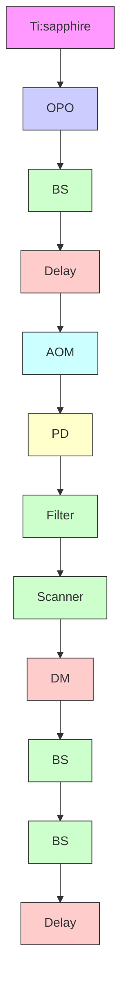

# Far-field imaging of non-fluorescent species with subdiffraction resolution

Pu Wang1†, Mikhail N. Slipchenko1†, James Mitchell2, Chen Yang3, Eric O. Potma4, Xianfan Xu2 and Ji-Xin Cheng1,3\*

Super-resolution optical microscopy is providing a new means by which to view as yet unseen details on a nanoscopic scale. Current far-field super-resolution techniques rely on fluorescence as the readout1–5. Here, we demonstrate a scheme for breaking the diffraction limit in far-field imaging of nonfluorescent species by using spatially controlled saturation of electronic absorption. Our method is based on a pump–probe process where a modulated pump field perturbs the charge carrier density in a sample, thus modulating the transmission of a probe field. A doughnut-shaped laser beam is then added to transiently saturate the electronic transition in the periphery of the focal volume, so the induced modulation in the sequential probe pulse only occurs at the focal centre. By raster-scanning the three collinearly aligned beams, high-speed subdiffractionlimited imaging of graphite nanoplatelets is performed. This technique has the potential to enable super-resolution imaging of nanomaterials and non-fluorescent chromophores, which may remain out of reach to fluorescence-based methods.

The recently developed pump–probe microscopy technique has allowed label-free imaging of melanin6,7, chromoproteins and chromogenic reporters8 , epitaxial graphene9 and carbon nanotubes10 by perturbing the sample of interest with a modulated pump field and detecting the subsequent material response with an interrogating probe field. Contrast mechanisms in pump–probe microscopy are based on transient absorption processes, including stimulated emission8,10, ground-state bleaching11 and excited-state absorption6 . The existence of a nonlinear optical response in the sample offers the opportunity to break the diffraction limit2,12. The method we describe here, which we term ‘saturated transient absorption’, is related to a group of super-resolution techniques generalized under the concept of reversible saturable optical fluorescence transitions (RESOLFT), in which resolution enhancement is achieved by spatially tailoring the fluorescence emission volume to a subdiffraction-limited size1–3,13. Here, we show the first experimental implementation of this concept for super-resolution imaging of non-fluorescent species using a pump–probe technique. In particular, we demonstrate a diffraction-limit-breaking scheme by groundstate depletion of the charge carrier in graphene-like structures.

Considering a two-state system (shown in the left panel of Fig. 1a), probe photons at $\omega _ { \mathrm { p r } }$ are absorbed to excite the system from $L _ { 0 }$ to $L _ { \mathrm { 1 } } ,$ leading to a transmission decrease. When a pump field at $\omega _ { \mathrm { p } }$ is introduced, the pump excitation depletes the population of $\dot { \mathbf { \xi } } _ { L _ { 0 } } ,$ thus decreasing the absorption of the probe light accordingly (Fig. 1a, middle panel). When the intensity of the pump field is high enough, it saturates the electronic transition, either by depleting the population at $L _ { 0 }$ or by filling the $L _ { 1 }$ energy states. As a result, the transient absorption of probe photons is sup pressed (Fig. 1a, right panel). Based on this concept, saturated transient absorption microscopy is designed to decrease the probe area to below the diffraction limit in a pump–probe microscope by collinearly adding a non-modulated saturation beam $( \omega _ { \mathrm { s a t } } ) _ { \mathrm { : } }$ , which has the same wavelength as the pump beam but with much higher intensity (Fig. 1b). At the doughnut-shaped region of the focus where the intensity of the saturation beam is high, the transmission of the probe beam remains unchanged due to saturation of the electronic transition. Under such conditions, the pumpto-probe modulation transfer only occurs at the very centre of the focus where the intensity of the saturation beam is close to zero (Fig. 1c). Subdiffraction-limited images can be obtained by raster scanning the three collinearly aligned beams simultaneously across the sample.

We used graphene-like structures, whose saturable absorption properties have been studied14–16, to demonstrate the concept of saturated transient absorption microscopy. Epitaxial graphene has been investigated by pump–probe microscopy, where the pump induced charge carriers fill the states near the edges of conduction and valence bands, thus reducing probe absorption9 . As the power of the pump increases, saturable absorption of the pump or absorp tion bleaching of the probe has been reported as a result of the Pauli blocking process17. The relaxation time of the photo-excited charge carriers determines the optimal condition for the pump–probe contrast in graphene-like systems. In brief, the excited carriers first experience a fast carrier–carrier recombination process on a timescale of 20–30 fs (ref. 18), and then interact with optical phonons in a relatively slow process on a timescale ranging from 100 fs to a few picoseconds19. As a result, a reasonable contrast from a pump–probe measurement of graphene can be achieved by using pump and probe pulses that have a duration and temporal delay on a subpicosecond scale. To actively suppress the pump–probe signal, an unmodulated, intense saturation pulse is temporally inserted between the pump and probe pulses.

The saturated transient absorption microscope is illustrated in Fig. 2 (for details see Methods). Briefly, a 1,064 nm beam with 260 fs pulse duration was split into pump and saturation beams. An 830 nm beam with 140 fs pulse duration was collinearly aligned with the pump and saturation beams. A spatial light modulator (SLM) was used to engineer the focus of the saturation beam by applying selected phase patterns. All three beams were initially set to be linearly polarized.

Using this set-up, we identified the parameters for effective sup pression of the pump–probe signal. We first performed time resolved pump–probe spectroscopy to characterize the relaxation

text_image

Probe only
L₁
L₀

text_image

Pump-probe
(unsaturated)

text_image

Pump-probe
(saturated)

b

text_image

ωsat
ωp
ωpr

text_image

C
At the doughnut region
At the very centre of the focal spot
Pump (ωp)
Saturation (ωsat)
Probe (ωpr)
t
t
T'
T0
Unmodulated
Pump
Saturation
Modulated
Probe

Figure 1 | Principle of saturated transient absorption microscopy. a, Illustration of the saturation effect in a two-level electronic transition. Pump and prob photons are indicated by red and green arrows, respectively. b, Simple layout of the set-up. The dashed line indicates that the pump beam is modulated. c, The pulse train of pump, saturation and probe beams at the focused doughnut-shaped region (left panel) and at the very centre of the focal spot (middle panel). The modulation transfer from pump to probe only occurs at the centre where the saturation field intensity is close to zero (right panel)

flowchart

Figure 2 | Diagram of the saturated transient absorption microscope. OPO, optical parametric oscillator; AOM, acousto-optic modulator; BS, beamsplitter; SLM, spatial light modulator; PD, photodiode; DM, dichroic mirror. Upper-right inset: the helix phase pattern sent to the SLM to generate a doughnut-shaped focus of the saturation beam. Lower-left inset: the measured PSF of the saturation beam using second-harmonic imaging of 20 nm ZnO nanocrystals. Scale bar, 500 nm.

time of the photo-excited charge carriers, under the condition such that the powers of the pump and probe beams on the sample were both 0.16 MW cm22 . The transient absorption spectrum of graphene was fitted by a two-component exponential decay model with time constants of 0.4 and 2.0 ps and relative amplitudes of 1.6 and 1.0, respectively (black symbols in Fig. 3a). Because the fast carrier–carrier recombination process (sub-100 fs timescale) cannot be resolved by our system, the fast decay constant represent

line chart

| Pump-probe delay (ps) | Saturation OFF | Saturation ON |
| --------------------- | -------------- | ------------- |
| -0.5                  | 2              | 3             |
| 0                     | 25             | 24            |
| 0.5                   | 18             | 15            |
| 1                     | 10             | 6             |
| 2                     | 5              | 3             |
| 3                     | 3              | 2             |
| 4                     | 1              | 1             |

scatterplot

| Power density (MW cm⁻²) | ΔT/T (×10⁻⁴) |
| ------------------------ | ------------ |
| 0.0                      | 15.0         |
| 0.5                      | 8.0          |
| 0.7                      | 5.0          |
| 0.9                      | 4.0          |
| 1.0                      | 3.5          |
| 1.2                      | 2.5          |
| 1.5                      | 2.0          |
| 2.5                      | 1.0          |

line chart

| Pump-probe delay (ps) | Saturation OFF | Saturation ON |
| --------------------- | -------------- | ------------- |
| -0.5                  | 0.5            | 0.3           |
| -0.2                  | 2.0            | 1.5           |
| 0.0                   | 18.0           | 16.0          |
| 0.2                   | 15.0           | 14.0          |
| 0.5                   | 10.0           | 8.0           |
| 1.0                   | 5.0            | 4.0           |
| 1.5                   | 2.0            | 1.5           |
| 2.0                   | 1.0            | 0.5           |
| 2.5                   | 0.5            | 0.2           |
| 3.0                   | 0.2            | 0.1           |

scatterplot

| Power density (MW cm⁻²) | ΔT/T (×10⁻⁴) |
| ------------------------ | ------------ |
| 0.0                      | 13.0         |
| 0.3                      | 8.5          |
| 0.4                      | 8.0          |
| 0.6                      | 6.5          |
| 0.8                      | 5.0          |
| 1.0                      | 4.0          |
| 1.2                      | 3.5          |
| 1.4                      | 3.0          |
| 1.6                      | 2.5          |
| 2.0                      | 2.0          |

natural_image

Microscopic image showing dark granular structures with a white scale bar (no text or symbols)

natural_image

Microscopic view of a material surface with dark irregular regions and scattered particles (no text or symbols)

scatterplot

| Time (s) | ΔT/T (a.u.) |
| -------- | ----------- |
| 0        | 85          |
| 5        | 85          |
| 10       | 85          |
| 15       | 85          |
| 20       | 15          |
| 25       | 15          |
| 30       | 85          |
| 35       | 85          |
| 40       | 15          |
| 45       | 15          |
| 50       | 85          |
| 55       | 85          |

Figure 3 | Suppression of the pump–probe signal by saturation of the electronic transition in graphene and graphite nanoplatelets. a, Time-resolved transient absorption spectroscopy on graphene sample with (grey circles) and without (black circles) saturation beam. b, Pump–probe signal as a function of peak power density of the saturation beam on graphene. The fit generates a saturation constant at $0 . 2 8 \mathsf { M } \mathsf { W } \mathsf { c m } ^ { - 2 } .$ . c,d, The same measurements as in a and b, but for graphite nanoplatelets. e, Transient absorption image of graphene with the saturation beam switched on (left) and off (middle). The average intensity for graphene is plotted as a function of time (right). Scale bars, 20 mm.

the instrument response time in these measurements. The slow decay process is attributed to carrier–phonon interaction. We then introduced a saturation pulse with a Gaussian mode and power density of $0 . 8 \mathrm { M W } \mathrm { c m } ^ { - 2 }$ . The delay between the pump and saturation pulses was set to 0.4 ps to avoid interference (Fig. 3a). The pump–probe signal remained unaffected in the first 100 fs, and was quenched significantly after 0.4 ps when the saturation pulse was introduced. The pump–probe signal from graphene as a function of the power density of the saturation beam is plotted in Fig. 3b. The data were fitted by Supplementary equation (S4) and the value of $I _ { 0 } ,$ the power density for saturated absorption, was obtained as 0.28 MW $\cdot \mathrm { c m } ^ { - 2 }$ . The same experiments were performed on graphite nanoplatelets, and characteristics similar to those for graphene were found (Fig. 3c,d). The time constant of the carrier– phonon interaction on graphite nanoplatelets was found to be ${ \sim } 0 . 6 \ \mathrm { p s } ,$ and $I _ { 0 }$ was $0 . 4 3 \mathrm { \ : M W \ : c m } ^ { - 2 } .$ . The recovery of the pump– probe signal was also tested using the graphene sample. As shown in the right panel of Fig. 3e, the signal recovered to nearly 100% when the saturation beam was switched off. No signal degradation was observed during the imaging period of 60 s, under the condition that the power density of the saturation beam was 1.2 MW cm2 and the dwell time was ${ \sim } 2 s$ for an image of $5 1 2 \times 5 1 2$ pixels. The photodamage began to appear at 2.4 MW cm22 for the graphite nanoplatelets sample if we repeatedly imaged the same area for 60 s. We therefore applied a saturation beam power lower than the damage threshold for the resolution enhancement experiments.

With these parameters, we conducted label-free far-field imaging of graphite nanoplatelets by applying the doughnut-shaped saturation beam. Conventional pump–probe imaging and saturated transient absorption imaging were performed in the same region (Fig. 4a,b) and visualized by atomic force microscopy (AFM) (Fig. 4c). The power for the saturation beam was set at $2 . 0 \mathrm { \ : M W \ : c m } ^ { - 2 }$ . The intensity shown in the pump–probe images is proportional to the difference transmission of the probe beam, $\bar { \Delta } T _ { \mathrm { p r } } ^ { \mathrm { ^ { - } } }$ , between pump field on and off states. The nanoplatelets indicated in the AFM images (white arrows in Fig. 4c) could not be resolved in the conventional pump–probe image (Fig. 4a), but were successfully resolved by saturated transient absorption microscopy (Fig. 4b). To quantify the resolution enhancement, we imaged an area where isolated nanoplatelets can be found (Fig. 4d,e). The averaged full-width at half-maximum (FWHM)

  
Figure 4 | Subdiffraction-limited imaging of graphite nanoplatelets. a,d, Images obtained by conventional pump–probe microscopy. b,e, Images of the same areas obtained by saturated transient absorption microscopy. c, AFM images of the graphite nanoplatelets. f, Intensity profiles along the lines indicated by the arrows in d and e. Solid curves represent Gaussian fitting. For comparison of resolution, the peak intensities were normalized to the same value. TA, transien absorption. Scale bars, 1 mm (scale bar in a applies to b and c; scale bar in d applies to e).

measured in the selected platelets is 249+31 nm (Supplementary Fig. S1). We selected one of the smallest features in the image to characterize the resolution. The line profiles across the selected nanoplatelet (white arrows) obtained by conventional pump– probe and saturated transient absorption are shown in Fig. 4f. By Gaussian fitting of the line profiles (Fig. 4f ), the FWHM values for the same isolated object in the conventional pump–probe and saturated transient absorption images were found to be 385 nm and 225 nm, respectively. The line profile is theoretically a convolution of the effective pointspread function (PSF) of the system with the object (Supplementary Section S2). Assuming the average size of the nanoplatelets to be 100 nm, deconvolution of the line profile and object function using the Gaussian approximation resulted in FWHMs of 370 nm and 200 nm for the effective PSF of conventional pump–probe and saturated transient absorption microscopy, respectively. Given the nonlinear nature of the pump–probe process and the aperture-free detection scheme, the effective PSF of our pump–probe microscope under diffractionlimited conditions is calculated to be 300 nm (Supplementary Section S2). These results collectively demonstrate that subdiffrac tion-limited imaging is achievable by the saturated transient absorp tion microscopy technique.

In summary, we have demonstrated far-field subdiffraction limited imaging of non-fluorescent samples through spatially con trolled saturation of the transient absorption signal. The resolution can be improved further by optimization of the imaging conditions, for example by applying a shorter excitation wavelength and increasing the photodamage threshold with a faster scanning speed. We note that saturated transient absorption microscopy is applicable to other nanomaterials with saturable absorption, such as single-walled carbon nanotubes20–22 or iron oxide and zinc oxide nanoparticles23,24, which are considered to be biocompatible imaging agents25,26. Compared to previously reported pump– probe nanoscopy, which is based on scanning tunnelling microscopy or near-field scanning optical microscopy27, our method offers a much faster imaging speed in a contact-free manner. Moreover, the intrinsic optical sectioning capability of saturated transient absorption microscopy enables three-dimen sional imaging with a lateral resolution below the diffraction limit. Resolution enhancement in the axial direction is also possible by applying a z-doughnut beam28. These advantages open new opportunities for studying nanostructures in biological environments or inside functional materials.

## Methods

Experiment set-up. A Ti:sapphire laser at 830 nm (80 MHz, 140 fs pulse width, Chameleon, Coherent) pumped an optical parametric oscillator (OPO, APE, Coherent), providing a 1,064 nm output with 260 fs pulse width. The 1,064 nm beam was split into two arms as pump and saturation beams, respectively. The pump beam was modulated by an acousto-optic modulator (AOM, Gooch & Housego) at 7 MHz. The saturation beam was directed to a phase-only SLM (PLUTO, Holoeye) and a doughnut shape was produced by inputting a helical phase ramp from 0 to 2p (Fig. 2, top inset). Relay optics were applied to project the doughnut shaped beam to the back aperture of the objective. The 830 nm beam was used as th probe and was collinearly combined with the pump and saturation beams. The three beams were sent to a laser scanning microscope (IX71, Olympus) and focused into a sample by a water immersion objective (NA ¼ 1.2, Olympus). The transmitted probe beam was collected by another water immersion objective, filtered by two bandpass filters (825/150 Chroma), and detected by a photodiode (S3994-01, Hamamatsu) followed by a resonant amplifier29. A lock-in amplifier (HF2LI, Zurich Instrument) was used to extract the probe signal at the modulation frequency. The pixel dwell time was 4 ms. For imaging, the delay between the pump and saturation pulses was 0.4 ps. The probe pulse was temporally overlapped with the saturation pulse.

Synthesis and AFM imaging of graphite nanoplatelets. A 1:6 diluted S-1805 photoresist film was spin-coated onto the quartz wafer at 10,000 r.p.m. to achieve a coat thickness of less than 100 nm. The substrates were then baked for 5 min at

120 8C. The coated quartz wafer was covered by another piece of quartz wafer, then mounted on a sample stage in a vacuum chamber. Before growing graphite nanoplatelets, the chamber was pumped and purged by high-purity N gas, and maintained at a pressure below 0.1 torr. A continuous-wave (c.w.) Nd:YAG laser with a wavelength of 532 nm was focused on the S-1805 film through the transparent quartz substrate using a lens with a focal length of 150 mm. With this optical set-up, the graphite nanoplatelet sample was produced with a laser power of 2.8 W, irradiated for 3–5 min. The size and coverage of graphene platelets were determined by the growth parameters. Raman spectroscopy was performed to confirm the composition of the sample (Supplementary Fig. S2). AFM (Veeco Dimension 3100) images were taken in tapping mode under ambient conditions.

Synthesis of graphene. Graphene was grown by thermal chemical vapour deposition on a copper foil, at a temperature of 1,000 8C and under 1 atm pressure, with methane as the precursor gas30. Raman spectroscopy was performed to confirm the composition of the sample (Supplementary Fig. S3).

## Received 3 September 2012; accepted 21 March 2013; published online 28 April 2013

## References

1. Hell, S. W. & Wichmann, J. Breaking the diffraction resolution limit by stimulated emission: stimulated-emission–depletion fluorescence microscopy. Opt. Lett. 19, 780–782 (1994).  
2. Bretschneider, S., Eggeling, C. & Hell, S. W. Breaking the diffraction barrier in fluorescence microscopy by optical shelving. Phys. Rev. Lett. 98, 218103 (2007).  
3. Gustafsson, M. G. L. Nonlinear structured-illumination microscopy: wide-field fluorescence imaging with theoretically unlimited resolution. Proc. Natl Acad. Sci. USA 102, 13081–13086 (2005).  
4. Rust, M. J., Bates, M. & Zhuang, X. Sub-diffraction-limit imaging by stochastic optical reconstruction microscopy (STORM). Nat. methods 3, 793–796 (2006).  
5. Betzig, E. et al. Imaging intracellular fluorescent proteins at nanometer resolution. Science 313, 1642–1645 (2006).  
6. Fu, D., Ye, T., Matthews, T. E., Yurtsever, G. & Warren, W. S. Two-color, two-photon, and excited-state absorption microscopy. J. Biomed. Opt. 12, 054004–054008 (2007).  
7. Matthews, T. E., Piletic, I. R., Selim, M. A., Simpson, M. J. & Warren, W. S. Pump–probe imaging differentiates melanoma from melanocytic nevi. Sci. Transl. Med. 3, 71ra15 (2011).  
8. Min, W. et al. Imaging chromophores with undetectable fluorescence by stimulated emission microscopy. Nature 461, 1105–1109 (2009).  
9. Huang, L. et al. Ultrafast transient absorption microscopy studies of carrier dynamics in epitaxial graphene. Nano Lett. 10, 1308–1313 (2010).  
10. Jung, Y. et al. Fast detection of the metallic state of individual single-walled carbon nanotubes using a transient-absorption optical microscope. Phys. Rev. Lett. 105, 217401 (2010).  
11. Chong, S., Min, W. & Xie, X. S. Ground-state depletion microscopy: detection sensitivity of single-molecule optical absorption at room temperature. J. Phys. Chem. Lett. 1, 3316–3322 (2010).  
12. Bouwhuis, G. & Spruit, J. H. M. Optical storage read-out of nonlinear disks. Appl. Opt. 29, 3766–3768 (1990).  
13. Hell, S. W. Toward fluorescence nanoscopy. Nat. Biotechnol. 21, 1347–1355 (2003).  
14. Sun, Z. et al. Graphene mode-locked ultrafast laser. ACS Nano 4, 803–810 (2010).  
15. Bao, Q. et al. Atomic-layer graphene as a saturable absorber for ultrafast pulsed lasers. Adv. Funct. Mater. 19, 3077–3083 (2009).  
16. Vasko, F. T. Saturation of interband absorption in graphene. Phys. Rev. B 82, 245422 (2010).  
17. Zitter, R. N. Saturated optical absorption through band filling in semiconductors. Appl. Phys. Lett. 14, 73–74 (1969).  
18. Breusing, M., Ropers, C. & Elsaesser, T. Ultrafast carrier dynamics in graphite. Phys. Rev. Lett. 102, 086809 (2009).  
19. Wang, H. et al. Ultrafast relaxation dynamics of hot optical phonons in graphene. Appl. Phys. Lett. 96, 081917 (2010).  
20. Rozhin, A. G. et al. Anisotropic saturable absorption of single-wall carbor nanotubes aligned in polyvinyl alcohol. Chem. Phys. Lett. 405, 288–293 (2005).  
21. Avouris, P., Freitag, M. & Perebeinos, V. Carbon-nanotube photonics and optoelectronics. Nature Photon. 2, 341–350 (2008).  
22. Baek, I. H. et al. Single-walled carbon nanotube saturable absorber assisted high-power mode-locking of a Ti:sapphire laser. Opt. Express 19, 7833–7838 (2011).  
23. Singh, C. P., Bindra, K. S., Bhalerao, G. M. & Oak, S. M. Investigation of optica limiting in iron oxide nanoparticles. Opt. Express 16, 8440–8450 (2008).  
24. Irimpan, L., Nampoori, V. P. N. & Radhakrishnan, P. Spectral and nonlinear optical characteristics of ZnO nanocomposites. Sci. Adv. Mater. 2, 117–137 (2010).  
25. Jain, T. K., Reddy, M. K., Morales, M. A., Leslie-Pelecky, D. L. & Labhasetwar, V. Biodistribution, clearance, and biocompatibility of iron oxide magnetic nanoparticles in rats. Mol. Pharmacol. 5, 316–327 (2008).  
26. Zhou, J., Xu, N. S. & Wang, Z. L. Dissolving behavior and stability of ZnO wires in biofluids: a study on biodegradability and biocompatibility of ZnO nanostructures. Adv. Mater. 18, 2432–2435 (2006).  
27. Terada, Y., Yoshida, S., Takeuchi, O. & Shigekawa, H. Real-space imaging of transient carrier dynamics by nanoscale pump-probe microscopy. Nature Photon. 4, 869–874 (2010).  
28. Hein, B., Willig, K. I. & Hell, S. W. Stimulated emission depletion (STED) nanoscopy of a fluorescent protein-labeled organelle inside a living cell. Proc. Natl Acad. Sci. USA 105, 14271–14276 (2008).  
29. Slipchenko, M. N., Oglesbee, R. A., Zhang, D., Wu, W. & Cheng, J-X. Heterodyne detected nonlinear optical imaging in a lock-in free manner. J. Biophoton. 5, 801–807 (2012).  
30. Cao, H. et al. Electronic transport in chemical vapor deposited graphene synthesized on Cu: quantum Hall effect and weak localization. Appl. Phys. Lett 96, 122106 (2010)

## Acknowledgements

This work was supported by National Institutes of Health (grant R21EB015901 to J-X.C.), the National Science Foundation (grant CHE-0847097 to E.O.P.) and the Defense Advanced Research Project Agency (grant no. N66001-08-1-2037, Program Manager T. Kenny and T. Akinwande) to X.X. The authors thank Yong Chen and Jack Chung for providing the graphene sample, and Delong Zhang for technical support.

## Author contributions

P.W., M.N.S. and J.-X.C. designed the experiment. P.W. and M.N.S. performed the experiments. P.W. carried out the data analysis. J.M. synthesized the graphite nanoplatelets. E.O.P. provided the spatial light modulator. J.-X.C., C.Y., E.O.P. and X.X. provided overall guidance to the project. All authors discussed the results and contributed to the manuscript.

## Additional information

Supplementary information is available in the online version of the paper. Reprints and permissions information is available online at www.nature.com/reprints. Correspondence and requests for materials should be addressed to I -X C

## Competing financial interests

The authors declare no competing financial interests