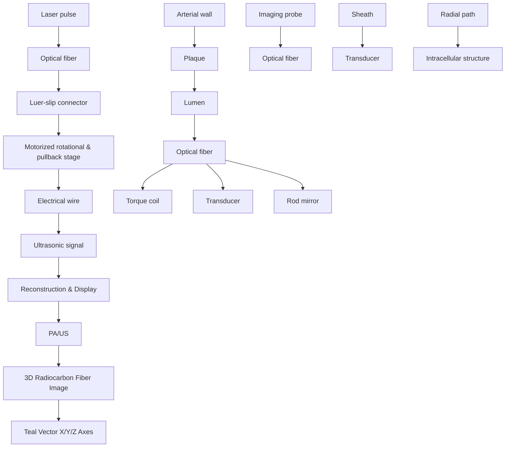

# SCIENTIFIC REPORTS

OPEN

Received: 11 December 2017

Accepted: 25 January 2018

Published: xx xx xxxx

# Fast assessment of lipid content in arteries in vivo by intravascular photoacoustic tomography

Yingchun Cao1, Ayeeshik Kole1,2, Jie Hui 3, Yi Zhang4, Jieying Mai1, Mouhamad Alloosh2, Michael Sturek1,2 & Ji-Xin Cheng1,5,6,7

Intravascular photoacoustic tomography is an emerging technology for mapping lipid deposition within an arterial wall for the investigation of the vulnerability of atherosclerotic plaques to rupture. By converting localized laser absorption in lipid-rich biological tissue into ultrasonic waves through thermoelastic expansion, intravascular photoacoustic tomography is uniquely capable of imaging the entire arterial wall with chemical selectivity and depth resolution. However, technical challenges, including an imaging catheter with sufcient sensitivity and depth and a functional sheath material without signifcant signal attenuation and artifact generation for both photoacoustics and ultrasound, have prevented in vivo application of intravascular photoacoustic imaging for clinical translation. Here, we present a highly sensitive quasi-collinear dual-mode photoacoustic/ultrasound catheter with elaborately selected sheath material, and demonstrated the performance of our intravascular photoacoustic tomography system by in vivo imaging of lipid distribution in rabbit aortas under clinically relevant conditions at imaging speeds up to 16 frames per second. Ex vivo evaluation of fresh human coronary arteries further confrmed the performance of our imaging system for accurate lipid localization and quantifcation of the entire arterial wall, indicating its clinical signifcance and translational capability.

Coronary artery disease is the leading cause of mortality worldwide1 . Te disease refers to the pathologic devel opment of atheromatous plaques in the coronary arterial tree and the subsequent narrowing of the lumen or even formation of thrombus due to plaque rupture, leading to restriction of blood fow and life-threatening acute cor onary syndrome2 . Plaques that are considered most susceptible to rupture, or vulnerable plaques, are those with a large lipid-rich necrotic core, covered by a thin fbrous cap, and dense infammatory infltrate3,4 . Reliable and accurate detection of vulnerable plaques would ideally include not only morphological information of the artery wall, but also chemical composition of the suspected lesion5 . Intravascular ultrasound (IVUS)6 and optical coher ence tomography7 can provide important morphological information of an artery. However, they lack chemical selectivity to accurately assess plaque composition8,9 . Near-infrared spectroscopy combined with IVUS has been shown to detect the presence of lipid-rich plaques and quantify them with a lipid core burden index10,11, yet lack depth resolution to quantify and localize the cholesterol accumulation in lipid-rich plaques.

Intravascular photoacoustic (IVPA) tomography is an emerging catheter-based technology for the localization, quantifcation, and characterization of lipid deposition while simultaneously complementing traditional IVUS12. Te biggest advantage is that it can provide lipid-specifc detection with depth resolution over the entire arterial wall by converting light absorption into ultrasound (US) detection13,14. Over the past several years, eforts have been made towards technical improvement of IVPA technique to meet clinical requirements including the report of various catheter designs14–18, the development of laser sources for increased lipid sensitivity and imaging speeds18–22, and diferentiation of multiple tissue components23–25. Nevertheless, catheter sensitivity in current designs has been the biggest obstacle for in vivo demonstration. Front-and-back designs exhibit insufcient depth

1 Weldon School of Biomedical Engineering, Purdue University, West Lafayette, Indiana, 47907, USA. 2 Department of Cellular & Integrative Physiology, Indiana University School of Medicine, Indianapolis, Indiana, 46202, USA. 3 Department of Physics and Astronomy, Purdue University, West Lafayette, Indiana, 47907, USA. 4 Department of Physics, Boston University, Boston, Massachusetts, 02215, USA. 5 Department of Chemistry, Purdue University, West Lafayette, Indiana, 47907, USA. 6 Department of Electrical and Computer Engineering, Boston University, Boston, Massachusetts, 02215, USA. 7 Department of Biomedical Engineering, Boston University, Boston, Massachusetts, 02215, USA. Correspondence and requests for materials should be addressed to J.-X.C. (email: jxcheng@bu.edu)

a  

flowchart

b  

text_image

Sheath
Imaging probe
Fiber connector
Electrical connector
Luer-slip connector
Imaging window
Protective sheath

Figure 1. Illustration of IVPA imaging and fabricated catheter. (a) Implementation of IVPA imaging. Optical pulses from the excitation laser are coupled to the imaging catheter through a multimode fber and a rotary joint, and directed to the arterial wall for PA excitation. Te generated sound wave from optical absorption by lipid is collected by a transducer installed in the catheter tip. Simultaneously, a delayed ultrasonic pulse is delivered and its echo is received by the same transducer to produce a co-registered US image. Te rotational and pullback stages are used to constantly rotate and linearly pull back the IVPA catheter inside a protective sheath for 3D imaging. Te reconstructed PA and US images are displayed on a monitor in real time. 3D images of the artery are reconstructed from the cross-sectional image stacks in a pullback. (b) Photograph of quasicollinear IVPA catheter with a complete sheath. Te unit scale of the ruler in the lef inset of b is 1 mm.

range to encompass the entire artery wall15–17,26; co-axial designs are limited by transducer dimensions making the catheter too large for coronary artery access19; Co-linear catheter designs have shown improved photoacous tic (PA) sensitivity and depth, but poor US resolution due to considerable signal loss at multiple refective sur faces14,22. In addition, a proper protective sheath material that is transparent to both PA and US signals is essential for in vivo application, but has yet to be identifed. In vivo IVPA imaging was previously attempted in animal models27–30, however, incomplete technical preparations, such as lack of a protective sheath27,28, lack of morphological feature provided by US29, and artifcial plaque, blood clearance and unsuitable sheath material30, prevent them from functioning well and providing valuable information under clinically relevant conditions.

In this work, we developed a quasi-collinear IVPA catheter with high sensitivity and sufcient depth and selected a sheath material with minimal PA and US attenuation and artifact generation. Tese advantages enabled in vivo IVPA imaging of native arteries in a rabbit model under clinically-relevant conditions with real-time dis play up to 16 frames per second (fps). We performed localization and quantifcation of lipid content along the full depth of the arterial wall from intima to perivascular adipose tissue for pullback lengths up to 80 mm.

## Results

Performance of quasi-collinear IVPA catheter. IVPA tomography is a hybrid intravascular imaging technology that combines the advantages of optical absorption-based contrast for depth-resolved lipid-specifc mapping and traditional US detection for deep tissue morphology (Fig. 1a). Currently, sensitivity remains the most important technical challenge for IVPA to be applied to in vivo study. To address this problem, we developed a quasi-collinear catheter (see Methods, Figs 1b and 2a), the diameter of which including outer sheath was measured to be 1.6 mm at the tip (Fig. 1b), and integrated it with our high-speed IVPA imaging system (Supplementary Fig. S1)22. Te spatial resolution and imaging depth of the catheter with protective sheath was evaluated by imaging a 7-µm carbon fber placed at diferent distances from the probe as shown in Fig. 2b. To maintain a detectable PA signal for a small target, the experiments were performed in deuterium oxide (D O) to reduce optical attenuation in the medium. Te axial resolutions are measured to range from 85 to 100 µm, while the lateral resolutions are found to increase from 170 to 450 µm with increased depth, attributed to the divergence of the US propagation (Fig. 2c,d). Te PA amplitude, afected by both the light intensity and overlap between optical beam and ultrasonic wave, was detected within a depth range from 1.4 to 4.6 mm (Fig. 2e), sufcient to image the entire arterial wall.

Performance of sheath material. A sheath for IVPA catheter is used to provide necessary protection to endothelia from damage by fast-rotating catheter as well as to the catheter from mechanical damage due to blood, thrombus, or the catheterization procedure. A functional IVPA sheath material should be optically and acoustically transparent, to reduce attenuation of PA and US signals to a minimum and induce minimal artifacts, which is still under discovery. To fnd a proper sheath material, we carefully selected a series of sheath material candidates based on their optical and acoustic properties (Supplementary Table S1) and tested their performance by imaging a heat-shrink tube with our quasi-collinear catheter. Te imaging results are shown in Supplementary Fig. S2 with comparison with a bare catheter. Teir performance in term of induced artifacts by the sheath and transmission over the sheath for PA and US signals was also summarized in Fig. 3a–d. Although fuorinated ethylene propylene, polytetrafuoroethylene, and polyimide induced minimal artifacts for PA images, their overwhelming US artifacts make them difcult to be selected as proper sheath materials (Supplementary Fig. S2b–d). Compared with polyethylene, polyurethane (PU) exhibits a smaller PA artifact, a larger PA transmission and comparable US behavior (Supplementary Fig. S2e,f and Fig. 3a–d), thus was selected as our material of choice for the sheath in imaging window section (Fig. 1b).

text_image

a
Optical beam
Overlapped region
Ultrasonic wave
Housing
Multimode fiber
Electrical wire
θ=10°
Mirror
Transducer
Overlap range: from 0.6 to >6 mm

text_image

b
1 mm
Axial
Lateral
0.5 mm

line chart

| Axial distance (mm) | PA axial resolution (mm) |
| ------------------- | ------------------------ |
| 3.9                 | 0.09                     |
| 4.0                 | 0.09                     |
| 4.1                 | 0.09                     |
| 4.2                 | 0.09                     |
| 4.3                 | 0.09                     |

line chart

| Axial distance (mm) | PA lateral resolution (mm) |
| ------------------- | -------------------------- |
| 1.0                 | 0.18                       |
| 2.0                 | 0.23                       |
| 3.0                 | 0.35                       |
| 4.0                 | 0.45                       |
| 5.0                 | 0.47                       |

line chart

| Axial distance (mm) | PA amplitude (a.u.) |
| ------------------- | ------------------- |
| 1                   | 280                 |
| 2                   | 260                 |
| 3                   | 270                 |
| 4                   | 340                 |
| 5                   | 310                 |

Figure 2. Design and evaluation of a quasi-collinear IVPA catheter. (a) Schematic of quasi-collinear IVPA catheter design showing PA imaging depth ranging from 0.6 to >6 mm based on estimated divergence angles of $3 ^ { \circ }$ and ${ { 6 } ^ { \circ } }$ for ultrasound and optical beams, respectively. (b) Combined PA images of a 7-µm carbon fber at diferent distances from the catheter center from 1.4 to 4.6 mm. Te insets showing the photo of the catheter tip and enlarged image of the target at a distance of 4.1 mm. (c) PA axial and (d) lateral resolutions, and (e) amplitude with insets in c and d showing the PA signals across the target at an axial distance of 4.1 mm along axial and lateral directions, respectively. Error bars in c-e were generated from three repeated measurements at each location.

PU sheath with dimension adapted to the imaging catheter was further evaluated by ex vivo imaging of a human coronary artery in diferent environments (Fig. 3e–g). Te catheter with a D O-flled PU sheath demonstrated comparable or even stronger PA intensity and moderate US attenuation as compared to imaging with the bare catheter in phosphate bufered saline (PBS) (Fig. 3e,f). In other words, the optical loss across the sheath material was compensated by flling the sheath with D O, which has a much smaller absorption coefcient than water at $1 . 7 \mu \mathrm { m } ^ { 3 1 }$ . Furthermore, IVPA imaging with PU sheath in the presence of luminal blood (Fig. 3g) demonstrated the capability of our imaging system for in vivo intravascular imaging without luminal blood fushing or occlusion, which is an important advantage over other optical imaging modalities such as optical coherence tomography in clinical applications. The following in vivo imaging experiments were based on the scheme described in Fig. 3g.

In vivo IVPA imaging of rabbit aorta. To validate the feasibility and performance of our imaging system in vivo, we imaged the thoracic aorta of three lean, male New Zealand White (NZW) rabbits. Te catheter was placed through femoral artery under x-ray angiography (Fig. 4d). We recorded in vivo IVPA images of the aorta with 80-mm pullbacks at diferent rotational and pullback speeds, up to 16 fps and 1 mm/s (Supplementary Videos S1 and S2), respectively. Figure 4a–c shows representative cross-sectional PA (I), merged PA/US images (II), and histology results (III) at diferent positions corresponding to the distal, upper and proximal sections of thoracic aorta (Supplementary Fig. S3a). Te PA images show the presence of lipid within the aorta wall (Fig. 4a) and perivascularly at depths greater than 4 mm (Fig. 4b,c). Te US images provide important morphological information about the artery, such as luminal area and thickness of artery wall. Given the young age and lean diet of the NZW rabbits, we did not expect to see any vascular pathology and indeed the histology shows this. Te abundance of perivascular adipose tissue agrees with the strong PA signals detected peripherally in the corresponding sections (Fig. 4b,c). Reconstructed 3-dimensional (3D) PA/US merged image with a 20-mm pull back length (Fig. 4e and Supplementary Fig. S4) illustrates the detection and presence of perivascular adipose tissue at the proximal end of the pullback, close to the femoral artery.

bar chart

| Category | PA artifact (a.u.) |
| -------- | ------------------ |
| FEP      | 200                |
| PTFE     | 250                |
| PI       | 100                |
| PE       | 1200               |
| PU       | 400                |

bar chart

| Category | PA transmission (%) |
| -------- | ------------------- |
| FEP      | 65                  |
| PTFE     | 35                  |
| PI       | 85                  |
| PE       | 45                  |
| PU       | 78                  |

bar chart

| Category | US artifact (a.u.) |
| -------- | ------------------ |
| FEP      | 14000              |
| PTFE     | 14000              |
| PI       | 17000              |
| PE       | 2000               |
| PU       | 4000               |

bar chart

| Category | US transmission (%) |
| -------- | ------------------- |
| FEP      | 45                  |
| PTFE     | 10                  |
| PI       | 90                  |
| PE       | 40                  |
| PU       | 35                  |

text_image

e
PA/US
PBS
Bare catheter

text_image

f
PA/US
Catheter with
PU sheath
PBS
D₂O

text_image

g
PA/US
Catheter with
PU sheath
Blood
D₂O

Figure 3. Performance of sheath material candidates. (a–d) Performance of fve sheath material candidates by IVPA imaging of a heat-shrink tube to evaluate the signal transmission and artifact generation from the sheath. Te value of artifact is regarded as the maximum signal from the sheath and the transmission is determined by comparing with bare catheter situation. Te detailed imaging results can be found in Supplementary Fig. S2. (e–g) Comparative IVPA images of a human coronary artery imaged ex vivo in diferent environments: (e) bare catheter without a sheath and with luminal PBS, (f) catheter with D2O-filled PU sheath and luminal PBS, and (g) catheter with D O-flled PU sheath and luminal blood. Te scale bar is 1 mm for cross-sectional images. Error bars in (a–d) were resulted from fve consecutive measurements of the target. FEP: fuorinated ethylene propylene, PTFE: polytetrafuoroethylene, PI: polyimide, PE: polyethylene, PU: polyurethane, PBS: phosphatebufered saline.

We further compared imaging performance by imaging the thoracic aorta of another rabbit in terms of lipid core depth, observation angle and lipid area (Supplementary Fig. S5) at diferent rotational and pullback speeds (4 fps and 0.25 mm/s vs. 16 fps and 1 mm/s). Similar results were observed (Fig. 5a-c and Supplementary Fig. S6), confrming the reproducibility of our imaging system and protocol. Te averaged results for two rabbits along 60-mm pullbacks further confrmed the healthy aorta of the rabbits on lean diet (Fig. 5d–f).

Ex vivo imaging of human coronary artery. To validate the performance of our imaging system for the detection of true coronary pathology and future translational applications, we further implemented our imaging system on a human right coronary artery ex vivo. Te IVPA catheter with sheath was advanced 40 mm into the distal artery and imaged at 16 fps and pullback speed of 0.5 mm/s with constant perfusion with PBS. Results are shown as cross-sectional PA (Fig. 6a,e), US (Fig. 6b,f) and merged PA/US (Fig. 6c,g) images. Corresponding his topathology result (Fig. 6d,h) with Movat’s pentachrome stain (see Methods) at representative locations was also displayed to confrm our observation. A short movie composed of merged PA/US images and their pullback view was provided in Supplementary Video S3. Strong PA signals were observed outside the vessel from perivascular adipose tissue, while obvious PA signal was detected from the thickened intima layer (7 o’clock) as well (Fig. 6e–g), which is very likely from lipid-rich plaque as highlighted by color outlines in Fig. 6g and confrmed by histology result in Fig. 6h (arrows). Additionally, ex vivo angiography with contrast shows a small lesion (indicated by arrowhead) approximately 10 mm from the introducer sheath (indicated by arrow) (Supplementary Video S4), corresponding to the thickened region in the histology section shown in Fig. 6h (arrows). Te 2-dimensional lipid distribution and depth maps at the peaks of PA A-lines are shown for a 40-mm segment of the artery (Fig. 6i,j). Dense lipid distribution along the entire pullback was observed with a depth ranging from 1 mm to 3 mm. Angular ratio of the maximum lipid pools, i.e. the angle of view over 2π in percentage, at each individual depth was calculated frame by frame for the entire pullback (Fig. 6k and Supplementary Fig. S5), which further helps to quantify the lipid core size and depth in lipid-rich plaque identifcation. Te total lipid area was quantitated for each cross-section along the artery (Supplementary Fig. S5) and presented with alignment to lipid distribution maps (Fig. 6i–k) to show the variation of lipid accumulation within and outside the vessel wall (Fig. 6l). Te reconstructed 3D images in diferent views (Supplementary Fig. S7 and Supplementary Video S5) illustrate lipid distribution pattern in relation to the artery morphology.

a  
  
b  
C  
d  
Figure 4. In vivo IVPA imaging of a rabbit aorta. (a–c) Intravascular PA and US images, and corresponding Verhoef-van Gieson stained histopathology at diferent positions along aorta. Labels I-III correspond to PA, merged PA/US images, and histopathology, respectively. 1 mm grid scale was marked in PA/US images. (d) X-ray angiogram of IVPA catheter in the thoracic aorta, with forceps and ruler to locate the position of the catheter externally. (e) Reconstructed 3D merged PA/US image for a pullback segment of 20-mm length of the aorta. Images in this fgure were collected at 4 fps and a pullback speed of 0.25 mm/s.

scatterplot

| Depth (mm) | 4 fps, 0.25 mm/s | 16 fps, 1 mm/s |
| ---------- | ---------------- | -------------- |
| 0          | ~1.0             | ~1.0           |
| 10         | ~1.0             | ~1.0           |
| 20         | ~1.2             | ~1.2           |
| 30         | ~1.6             | ~1.6           |
| 40         | ~1.0             | ~1.0           |
| 50         | ~1.2             | ~1.2           |
| 60         | ~1.2             | ~1.2           |

bar chart

| Rabbit Type | Average depth (mm) |
| ----------- | ------------------ |
| Rabbit #2   | 1.3                |
| Rabbit #3   | 1.1                |

scatterplot

| Time (fps) | Condition | Angle (°) |
| ---------- | --------- | --------- |
| 0.25       | Blue      | ~50       |
| 0.25       | Red       | ~60       |
| 1          | Blue      | ~40       |
| 1          | Red       | ~50       |
| 16         | Blue      | ~30       |
| 16         | Red       | ~40       |

bar chart

| Rabbit     | Average angle (°) |
| ---------- | ----------------- |
| Rabbit #2  | 12                |
| Rabbit #3  | 15                |

line chart

| z (mm) | Area of lipids (mm²) - 4 fps, 0.25 mm/s | Area of lipids (mm²) - 16 fps, 1 mm/s |
| ------ | -------------------------------------- | ------------------------------------- |
| 0      | 0.0                                    | 0.0                                   |
| 10     | ~0.05                                  | ~0.08                                 |
| 20     | ~0.03                                  | ~0.05                                 |
| 30     | ~0.02                                  | ~0.07                                 |
| 40     | ~0.15                                  | ~0.22                                 |
| 50     | ~0.05                                  | ~0.28                                 |
| 60     | ~0.0                                   | ~0.24                                 |

bar chart

| Rabbit | Average volume (mm³) |
| ------ | -------------------- |
| Rabbit #2 | 0.03 |
| Rabbit #3 | 0.03 |

Figure 5. Quantifcation of lipid core in rabbit aortas in vivo. (a–c) Comparative result of quantitated lipid core depth (a), angle (b) and area of lipids (c) in a rabbit aorta (#3) at each frame along a pullback length of 60 mm with diferent rotational and pullback speeds (4 fps and 0.25 mm/s vs. 16 fps and 1 mm/s). Lipid core depth corresponds to the depth to catheter center where PA signal shows a maximum amplitude; angle of lipid core means the observation angle of the maximum lipid core from catheter center; area of lipids is obtained by counting all the lipids in and surrounding the arterial wall. (d–f) Average lipid core depth (d), angle (e), and volume of lipids in a 1 mm artery length (f) for two rabbit aortas (#2 and #3). Te error bars are resulted from all the frames during entire pullbacks.

## Discussion

IVPA imaging brings forth novel capabilities for the detection of lipid-rich atherosclerotic plaques and perivas cular adipose tissue without displacement or occlusion of blood fow. To address the challenges of in vivo implementation, we developed a high-sensitivity quasi-collinear IVPA catheter and performed a comprehensive study on the selection of a sheath material. Tese advances enabled in vivo demonstration of IVPA imaging of rabbit aortas under clinically relevant conditions, i.e. imaging with a catheter sheath in presence of luminal blood and real-time display at 16 fps, which presents a key step towards clinical translation. Ex vivo evaluation on human artery exhibited the signifcance of our imaging system in the localization and quantifcation of lipid deposition across the entire arterial wall, including perivascular adipose tissue. It is increasingly accepted that atherosclerotic lesions primarily develop in arteries with perivascular adipose32 and surgical removal of the adipose encasing the arteries attenuates atherogenesis33.

Several further improvements are necessary to achieve clinical application. First, the diameter of our current imaging catheter and sheath needs to be further reduced from 1.6 mm to \~1.0 mm for safe coronary artery access. Tis can be achieved with a thinner optical fber and rod mirror, smaller diameter torque coil, better integration of catheter components, and thinner catheter sheath. Second, the sheath material can be further optimized from more polymer candidates to further improve the imaging quality by reducing the transmission losses and avoid ing unnecessary artifacts from the sheath. Tird, a broadband transducer covering the low-frequency PA signal, typically in several MHz range34, while maintaining US resolution needs to be developed for better imaging quality. In addition, all materials used for catheter fabrication should adhere to regulatory control for biosafety. Te clinical goals of IVPA imaging will be within reach by implementing these technical improvements.

heatmap

| Longitude | Latitude | Amplitude |
| --------- | -------- | --------- |
| 0°        | 0°       | Min       |
| 5         | 5        | Min       |
| 10        | 10       | Min       |
| 15        | 15       | Min       |
| 20        | 20       | Min       |
| 25        | 25       | Min       |
| 30        | 30       | Min       |
| 35        | 35       | Min       |
| 40        | 40       | Min       |

heatmap

| Longitude | Latitude | Depth (mm) |
| --------- | -------- | ---------- |
| 0°        | 90°      | 3.0        |
| 90°       | 180°     | 1.0        |
| 180°      | 270°     | 3.0        |
| 270°      | 360°     | 1.0        |

text_image

k
0
z
Within catheter
1
r
2
3
10
Ratio (%)
0

line chart

| z (mm) | Lipid area (mm²) |
| ------ | ---------------- |
| 0      | 1.5              |
| 5      | 1.0              |
| 10     | 0.5              |
| 15     | 0.7              |
| 20     | 0.8              |
| 25     | 0.9              |
| 30     | 0.6              |
| 35     | 0.4              |
| 40     | 0.5              |

Figure 6. Ex vivo IVPA imaging of a human right coronary artery. (a,e) Representative cross-sectional PA images, (b,f) US images, (c,g) merged PA/US images and (d,h) their corresponding Movat’s pentachromestained histopathology sections. Te frame locations along the artery are indicated by individual color lines in panel i–l. In panel g, the boundaries of lumen and external elastic membrane are outlined by yellow and green lines, respectively, to illustrate the intimal thickening observed on US image. Intimal thickening having lipid is shown by the arrows in panel h. (i) Maximum PA amplitude at each radial direction (ϕ) from 0 to 360° along pullback direction (z) from 0 to 40 mm, and (j) their corresponding depth from the center of the catheter. (k) Angular ratio of maximum lipid pool at individual depth along the artery. (l) Quantitated lipid area at each cross-section of the artery for the 40-mm pullback.

As intraplaque hemorrhage is deemed as a common phenomenon in advanced coronary atherosclerotic lesions and could be an important indicator for plaque rupture35, integrating intraplaque blood detection in the future IVPA system design could be benefcial. Tis can be implemented by involving another laser wavelength with strong absorption for blood, for example 532 nm. However, such development may increase the complexity of the system and slow down the imaging speed, as well as raise the necessity of temporal luminal blood clearance during intravascular imaging due to strong optical attenuation.

Te broad goal of IVPA imaging is to provide a foundation for building a multimodal platform for imaging lipid-laden, vulnerable plaque36 due to its unique capabilities of chemically-specifc and depth-resolved detection of lipids. Signifcant value of IVPA imaging may be seen in several areas: 1) Characterization of the natural history and progression of vulnerable plaque; 2) Identifcation of solitary vulnerable plaque to determine the efcacy of treatment interventions; 3) Determination of the efcacy of preventative therapies (e.g. statins) to reduce lipid-core size37. Multimodal IVPA-IVUS imaging could open opportunities beyond the reach of other intravascular imaging tools36,38.

## Methods

A portable high-speed IVPA tomography system. Te high-speed IVPA tomography system developed by our group provided dual-modality intravascular photoacoustic and ultrasound imaging at speed up to 16 fps with real-time display (Supplementary Fig. S1)22. A Nd:YAG pumped OPO (Nanjing Institute of Advanced Laser Technology) emitting \~10-ns pulse with 2-kHz repetition rate at a wavelength of 1730 nm served as the excitation laser source. Te laser beam was coupled to the imaging catheter via a multimode fber and then directed to the arterial wall for lipid-specifc excitation. A customer-designed hybrid optical and electrical rotary joint allowed for efcient optical coupling and radiofrequency signal transmission at fast rotation. A self-designed and -assembled quasi-collinear IVPA catheter with an outer sheath was used for intravascular PA/US imaging (Fig. 1b). For safety, the output pulse energy from the catheter tip was controlled around 100 µJ, corresponding to a laser fuence of 50 mJ/cm2 and below the ANSI laser safety standard of 1 J/cm2 at 1730 nm. Delayed (5 µs in this work) ultrasound pulses triggered by a pulse generator (Model 9512, Quantum Composers, Inc.) were sent/received by a pulser/receiver (5073PR, Olympus, Inc.) to provide co-registered ultrasound image of the artery. A computer with 500-MS/s 12-bit DAQ card (ATS9350, AlazarTech, Inc.) was used for control, processing, real-time display, and data collection. Te entire system was installed in a portable cart for easy movement (Supplementary Fig. S1b).

Quasi-collinear IVPA catheter design. A quasi-collinear IVPA catheter design was developed for high sensitivity in vivo application (Figs 1b and 2a). A multimode fber (FG365LEC, Torlabs) was used for high-power laser pulse delivery. A fber-end mirror polished to 45° and coated with gold was used for optical direction to the artery wall. An US transducer (0.5 × 0.6 × 0.2 mm3 , 42 MHz, 50% bandwidth) (AT23730, Blatek Industries, Inc.) served for PA detection and US pulsing/receiving. Te transducer was positioned next to the rod mirror and tilted by 10° forward to maximize the overlap between US and optical waves to realize a quasi-collinear PA detection, and to reduce the multiple US refection from the protective sheath. Te overlap depth is estimated from 0.6 to >6 mm by geometrical calculation considering the dimension of components and reasonable divergence angles of 6° for optical beam and 3° for US wave. Te components were positioned in a 3D printed plastic housing (Proto Labs) and further protected by a stainless steel tube. Te catheter rotation was transferred to the tip via a torque coil. A custom-designed sheath was used to protect the entire sheath for in vivo application.

Selection of sheath material. In order to fnd a proper sheath material, we selected fve diferent polymers as candidate based on their optical and acoustic properties, i.e. low optical absorption at 1.7 μm and matched acoustic impedance with aqueous medium (Supplementary Table S1). To test their PA and US behavior, the polymers were fabricated into tubes with proper dimension to ft the IVPA catheter, and a heat-shrink tube was imaged with/without these sheath material (Supplementary Fig. S2). PA/US artifact generated from and transmission over the sheath were analyzed to provide criteria for sheath material selection.

Lipid quantifcation. Cross-sectional PA images was reconstructed according to Supplementary Fig. S5. Te maximum PA intensity along the radial direction and its corresponding depth from the catheter center were calculated for each frame (Supplementary Fig. S5b,c) to generate two-dimensional maps of lipid presence and depth (Supplementary Fig. S5d,e), which provides an overview of depth-resolved lipid distribution. A binary lipid index image (i.e. 0 for background and 1 for lipid) was generated by applying a predefned threshold (4 times of background noise in this work) to the PA images (Supplementary Fig. S5f). Te value of the threshold was selected from a series of integral times of the background noise and determined by optimal match between resulted lipid index map and PA image. Te angular ratio of biggest lipid pool at each depth, i.e. angle of feld of view over 2π, was generated for every frame (Supplementary Fig. S5g,h) and plotted for the entire pullback length (Supplementary Fig. S5i) to give complementary information about the lipid-core size and depth. Te lipid area in each frame was calculated based on the binary lipid index image and plotted against the pullback length to visualize the total lipid deposition longitudinally (Supplementary Fig. S5j).

Procedure for in vivo IVPA imaging of rabbit aortas. Tis protocol was performed according to the Animal Studies for Cardiovascular and Intestinal Imaging and approved by the Purdue Animal Care and Use Committee. Tree male NZW rabbits (Charles River Laboratories), aged eight months old and fed with a normal chow diet, were used for in vivo IVPA imaging. Before imaging procedure, the rabbit was anesthetized with a proper dose of ketamine (35 mg/kg) and xylazine (5–10 mg/kg) through ear vein injection and maintained on 1–5% isofurane mixed with 100% O via endotracheal intubation during the entire imaging process. A cutdown procedure was used to identify the lef femoral artery for intravascular access. A 6 Fr introducer sheath was inserted in the femoral artery, through which the IVPA catheter was advanced to the thoracic aorta (Supplementary Fig. S3a,b), guided by x-ray angiography. Te catheter sheath was fushed with D O to reduce optical loss and remove laser heating during IVPA imaging. Diferent rotational and pullback speed combinations (4 fps and 0.25 mm/s, 16 fps and 1 mm/s) were used to confrm the reproducibility of our imaging system. A total length of 80 mm was recorded for each pullback. Following imaging, the rabbit was euthanized by using intravenous euthanasia solution (390 mg/ml) and the aorta was harvested for histology (Supplementary Fig. S3c).

Human coronary artery preparation. The experiments of human tissue samples were approved by Human Research Protection Program of Purdue University and performed in accordance with the approved guidelines. Te informed consent was obtained from all subjects. A fresh, human heart was harvested from a 44-year-old female undergoing transplant surgery within 24 hours. Immediately, the coronary arteries were excised and cannulated with a 6 Fr introducer sheath, sutured in place (Supplementary Fig. S7a). Te artery was then pinned fat into a container and submerged in 1 × PBS. Te IVPA catheter with sheath was advanced dis tally, approximately 40 mm past the introducer sheath. During imaging, the artery was perfused with 1 × PBS at room-temperature and catheter was fushed with D O. Pullback was recorded at 16 fps and 0.5 mm/s for a total length of 40 mm.

Histology approaches. All arteries were pressure fxed in 10% w/v formalin at approximately 25 mL/min for 30 minutes to maintain lumen as close to in vivo morphology as possible. Te arteries were then grossly sectioned in 3–4 mm segments and parafn embedded, sectioned, and stained for Verhoef-van Gieson and Russel-Movat’s pentachrome.

## References

1. Cannon, B. Cardiovascular disease: Biochemistry to behaviour. Nature 493, S2–S3 (2013).  
2. Libby, P., Ridker, P. M. & Hansson, G. K. Progress and challenges in translating the biology of atherosclerosis. Nature 473, 317–325 (2011).  
3. Yahagi, K. et al. Pathophysiology of native coronary, vein graft, and in-stent atherosclerosis. Nat. Rey. Cardiol. 13, 79-98 (2016).  
4. Virmani, R., Burke, A. P., Farb, A. & Kolodgie, F. D. Pathology of the vulnerable plaque. J. Am. Coll. Cardiol. 47, C13–C18 (2006).  
5. Schaar, J. A., van der Steen, A. F. W., Mastik, F., Baldewsing, R. A. & Serruys, P. W. Intravascular palpography for vulnerable plaque assessment. J. Am. Coll. Cardiol. 47, C86–C91 (2006).  
6. Tarkin, J. M. et al. Imaging atherosclerosis. Circ. Res. 118, 750–769 (2016).  
7. Jang, I. K. et al. Visualization of coronary atherosclerotic plaques in patients using optical coherence tomography: Comparison with intravascular ultrasound. J. Am. Coll. Cardiol. 39, 604–609 (2002).  
8. Garcia-Garcia, H. M., Costa, M. A. & Serruys, P. W. Imaging of coronary atherosclerosis: intravascular ultrasound. Eur. Heart J. 31, 2456–2469 (2010).  
9. Tearney, G. J. et al. Consensus standards for acquisition, measurement, and reporting of intravascular optical coherence tomography studies J. Am, Coll Cardiol 59 10581072 (2012  
10. Brugaletta, S. & Sabate, M. Assessment of plaque composition by intravascular ultrasound and near-infrared spectroscopy - from PROSPECT I to PROSPECT II. Circ. J. 78, 1531–1539 (2014)  
11. Gardner, C. M. et al. Detection of lipid core coronary plaques in autopsy specimens with a novel catheter-based near-infrared spectroscopy system. J Am Coll Cardiol Imag 1, 638648 (2008).  
12. Jansen, K., van der Steen, A. F. W., van Beusekom, H. M. M., Oosterhuis, J. W. & van Soest, G. Intravascular photoacoustic imaging of human coronary atherosclerosis. Opt. Lett. 36, 597–599 (2011).  
13. Wang, L. V. & Hu, S. Photoacoustic tomography: In vivo imaging from organelles to organs. Science 335, 1458–1462 (2012).  
14. Cao, Y. et al. High-sensitivity intravascular photoacoustic imaging of lipid–laden plaque with a collinear catheter design. Sci. Rep. 6, 25236 (2016).  
15. Karpiouk, A. B., Wang, B. & Emelianoy, S. Y. Development of a catheter for combined intravascular ultrasound and photoacoustic imaging. Rev. Sci. Instrum. 81, 014901 (2010).  
16. Bai, X. S. et al. Intravascular Optical-Resolution Photoacoustic Tomography with a 1.1 mm Diameter Catheter. Plos One 9, e92463 (2014).  
17. Ji, X., Xiong, K., Yang, S. & Xing, D. Intravascular confocal photoacoustic endoscope with dual-element ultrasonic transducer. Opt. Express 23, 9130–9136 (2015).  
18. Li, Y. et al. High-speed intravascular spectroscopic photoacoustic imaging at 1000 A-lines per second with a 0.9-mm diameter catheter. J. Biomed. Opt. 20, 065006–065006 (2015).  
19. Wang, P. et al. High-speed intravascular photoacoustic imaging of lipid-laden atherosclerotic plaque enabled by a 2-kHz barium nitrite raman laser. Sci. Rep. 4, 6889 (2014)  
20. Piao, Z. et al. High speed intravascular photoacoustic imaging with fast optical parametric oscillator laser at 1.7 μm. Appl. Phys. Lett. 107, 083701 (2015).  
21. Hui, J. et al. High-speed intravascular photoacoustic imaging at 1.7 µm with a KTP-based OPO. Biomed. Opt. Express 6, 4557–4566 (2015).  
22. Hui, J. et al. Real-time intravascular photoacoustic-ultrasound imaging of lipid-laden plaque in human coronary artery at 16 frames per second. Sci. Rep. 7, 1417 (2017).  
23. Jansen, K., Wu, M., van der Steen, A. F. W. & van Soest, G. Photoacoustic imaging of human coronary atherosclerosis in two spectral bands. Photoacoustics 2, 1220 (2014).  
24. Wu, M., Jansen, K., van der Steen, A. F. W. & van Soest, G. Specifc imaging of atherosclerotic plaque lipids with two-wavelength intravascular photoacoustics. Biomed. Opt. Express 6, 3276–3286 (2015).  
25. Cao, Y. et al. Spectral analysis assisted photoacoustic imaging for lipid composition diferentiation. Photoacoustics 7, 12–19 (2017).  
26. Wu, M., Jansen, K., Springeling, G., van der Steen, A. F. W. & van Soest, G. Impact of device geometry on the imaging characteristic of an intravascular photoacoustic catheter. Appl Optics 53, 8131–8139 (2014).  
27. Karpiouk, A. B., Wang, B., Amirian, J., Smalling, R. W. & Emelianov, S. Y. Feasibility of in vivo intravascular photoacoustic imaging using integrated ultrasound and photoacoustic imaging catheter. J. Biomed. Opt. 17, 096008 (2012).  
28. Wang, B. et al. In vivo intravascular ultrasound-guided photoacoustic imaging of lipid in plaques using an animal model of atherosclerosis. Ultrasound Med. Biol. 38, 2098–2103 (2012).  
29. Zhang, J., Yang, S. H., Ji, X. R., Zhou, Q. & Xing, D. Characterization of lipid-rich aortic plaques by intravascular photoacoustic tomography ex vivo and in vivo validation in a rabbit atherosclerosis model with histologic correlation. J. Am. Coll. Cardiol. 64, 385–390 (2014).  
30. Wu, M. et al. Real-time volumetric lipid imaging in vivo by intravascular photoacoustics at 20 frames per second. Biomed. Opt. Express 8, 943–953 (2017).  
31. Wang, P., Rajian, J. R. & Cheng, J. X. Spectroscopic imaging of deep tissue through photoacoustic detection of molecular vibration. J. Phys. Chem. Lett. 4, 2177–2185 (2013).  
32. Padilla, J., Vieira-Potter, V. J., Jia, G. & Sowers, J. R. Role of perivascular adipose tissue on vascular reactive oxygen species in type 2 diabetes: A give-and-take relationship. Diabetes 64, 1904 (2015),  
33. McKenney, M. L. et al. Epicardial adipose excision slows the progression of porcine coronary atherosclerosis. J. Cardiothorac. Surg. 9, 2 (2014).  
34. Daeichin, V., Wu, M., De Jong, N., van der Steen, A. F. W. & van Soest, G. Frequency analysis of the photoacoustic signal generated by coronary atherosclerotic plaque. Ultrasound Med. Biol. 42, 2017–2025 (2016).  
35. Kolodgie, F. D. et al. Intraplaque Hemorrhage and Progression of Coronary Atheroma. N. Engl. J. Med. 349, 2316–2325 (2003).  
36. Garcia-Garcia, H. M. et al. Imaging plaques to predict and better manage patients with acute coronary events. Circ. Res. 114, 1904 (2014).  
37. Libby, P. How does lipid lowering prevent coronary events? New insights from human imaging trials. Eur. Heart J. 36, 472–474 (2015).  
38. Danek, B. A. et al. Experience with the multimodality near-infrared spectroscopy/intravascular ultrasound coronary imaging system: Principles, clinical experience, and ongoing studies. Curr. Cardiovasc. Imaging Rep. 9, 7 (2016).

## Acknowledgements

Te authors thank William E. Schoenlein and Melissa Bible for assistance with the NZW rabbit animal care and interventional procedure. We thank Dr. Pu Wang for helpful discussion on imaging system improvement. Tis work was supported by NIH R01HL125385 to J.-X.C. and M.S., Center of Excellence in Cardiovascular Research Grant and Fortune-Fry Ultrasound Research Fund to M.S., AHA Postdoctoral Fellowship 16POST27480018 to Y.C., and IUPUI Graduate Student Imaging Research Fellowship to A.K.

## Author Contributions

Y.C. designed and fabricated the catheter, sheath, and hybrid rotary joint. J.H. and Y.C. constructed the imaging system. Y.C. and Y.Z. programed the LabView code. Y.C. planned the in vivo rabbit imaging. Y.C., A.K., J.H. and J.M. performed the in vivo rabbit protocol. A.K. and M.A. performed human tissue harvesting and dissection. A.K. performed histology preparation and interpretation. Y.C. processed the data and wrote the manuscript. J.- X.C. and M.S. provided overall direction on this project. All the authors contributed to the manuscript.

## Additional Information

Supplementary information accompanies this paper at https://doi.org/10.1038/s41598-018-20881-5.

Competing Interests: Te authors declare that they have no competing interests.

Publisher's note: Springer Nature remains neutral with regard to jurisdictional claims in published maps and institutional afliations.

Open Access This article is licensed under a Creative Commons Attribution 4.0 International License, which permits use, sharing, adaptation, distribution and reproduction in any medium or

format, as long as you give appropriate credit to the original author(s) and the source, provide a link to the Cre ative Commons license, and indicate if changes were made. Te images or other third party material in this article are included in the article’s Creative Commons license, unless indicated otherwise in a credit line to the material. If material is not included in the article’s Creative Commons license and your intended use is not permitted by statutory regulation or exceeds the permitted use, you will need to obtain permission directly from the copyright holder. To view a copy of this license, visit http://creativecommons.org/licenses/by/4.0/.

© Te Author(s) 2018