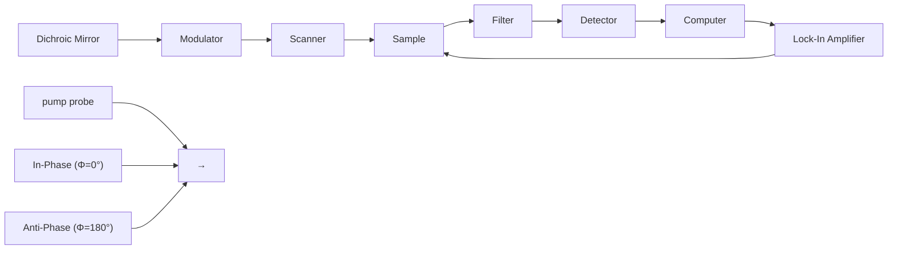

# Fast Detection of the Metallic State of Individual Single-Walled Carbon Nanotubes Using a Transient-Absorption Optical Microscope

Yookyung Jung,1 Mikhail N. Slipchenko,2 Chang Hua Liu,3 Alexander E. Ribbe,4

1 Department of Physics, Purdue University, West Lafayette, Indiana 47907, USA

2 Weldon School of Biomedical Engineering, Purdue University, West Lafayette, Indiana 47907, USA

3 Department of Electrical Engineering and Computer Science, University of Michigan, Ann Arbor, Michigan 48109, USA

4 Department of Chemistry, Purdue University, West Lafayette, Indiana 47907, USA (Received 28 July 2010; published 15 November 2010)

In spite of the outstanding properties of single-walled carbon nanotubes (SWNTs), the coexistence of metallic and semiconducting SWNTs as a result of synthesis has hindered their electronic and photonic applications. We demonstrate a pump-probe microscopy method for fast, contact-free mapping of metallicity in individual SWNTs. We employ the phase of transient absorption as a contrast to discriminate metallic and semiconducting SWNTs. Furthermore, we have clarified the phase dependence on the pump or probe wavelengths and the energy structure of SWNTs. Our imaging method holds the potential of serving as a high-speed metallicity-mapping tool to assist the development of SWNT-based nanoelectronics.

DOI: 10.1103/PhysRevLett.105.217401

PACS numbers: 78.67.Ch, 78.40.Ri

Transient-absorption spectroscopy is an established method widely used to study the electronic energy structure and energy relaxation process of materials such as bulk solutions of single-walled carbon nanotubes (SWNTs) [1–3] using a pump and a probe field. In this method, the pump light perturbs the electronic states of the material and the probe light responds to the changed electronic states, resulting in a transiently enhanced or reduced absorption of the probe field compared to the case of no perturbation by the pump field [4]. The pumpprobe signal has recently been used as a contrast in nonlinear optical imaging of hemoglobin and melanin in biological tissues [5–7], and the potential for characterization of nanomaterials such as graphene is emerging [8]. Despite these advances, no one has exploited the phase of the pump-probe signal as an imaging contrast. Here, we employ the phase of the transient-absorption signal to discriminate metallic and semiconducting SWNTs. In our setup shown in Fig. 1, the transient-absorption signal is obtained by intensity modulation of the pump field and phase-sensitive detection of the probe field. We define the phase of transient absorption as $\bar { \phi } = \tan ^ { - 1 } ( Y / X )$ where X and Y are signals from the in-phase and quadrature channels of the lock-in amplifier (cf. supplementary material [9]). Our method provides the sensitivity of imaging individual SWNTs by tightly focusing two collinearly overlapped picosecond (ps) lasers on a laser-scanning microscope platform, and by modulating the pump field at MHz frequency to avoid the laser intensity noise at low frequency. We have minimized the thermal lens effect [10] by using a high numerical aperture objective for signal collection and by placing the sample at the focal center. We found that the stimulated Raman scattering signal [11], which can arise from the G band of SWNTs, was negligible compared to the transient-absorption signal. Our timeresolved measurements further showed that the transientabsorption signals were maximized at zero time delay between the pump and probe fields (cf. supplementary material [9]).

To determine whether the transient-absorption signal can be used to map metallicity, we studied pure metallic (m-SWNTs) and semiconducting (s-SWNTs) nanotubes

flowchart

FIG. 1 (color online). Schematic drawing of a transientabsorption microscope. A pump laser and a probe laser are collinearly combined. The pump laser intensity is modulated by an acousto-optic modulator at 1.13 MHz. The forward probe beam is detected by a photodiode detector. A lock-in amplifier is used to extract the amplitude and phase of the transientabsorption signal. The rectangular box shows that the in-phase and antiphase modulations of the probe field, relative to the modulation of the pump field, corresponds to a negative and a positive transient absorption, respectively.

separated by density gradient ultracentrifugation [12] and dispersed on coverslips. A pump field at 707 nm and a probe field at 885 nm were used for imaging. Figures 2(a) and 2(b) show the images of s-SWNTs by the lock-in inphase- and quadrature-channel signals, respectively. We observed a positive contrast in the in-phase-channel image [Fig. 2(a)] and little contrast in the quadrature-channel image. Therefore, the signals from the s-SWNTs have the phase of $0 ^ { \circ }$ , which corresponds to an in-phase modulation of the probe (or reduced transient absorption). Quantitative phase information is shown in Fig. 2(c), where the in-phase signal with $\phi = 0 ^ { \circ }$ is indicated by light grey (aqua) color. The in-phase channel, quadrature channel, and phase images of m-SWNTs are obtained in the same way and shown in Figs. 2(d)–2(f), respectively. Different from the s-SWNTs, the m-SWNTs show a negative contrast in the in-phase-channel image [Fig. 2(d)] and little contrast in the quadrature-channel image [Fig. 2(e)]. These signals correspond to the phase of $1 8 0 ^ { \circ }$ , which indicates an antiphase modulation of the probe field (or enhanced transient absorption). Accordingly, all the m-SWNTs are indicated with grey (red) color in the phase image [Fig. 2(f)]. Collectively, we observed opposite contrast in the in-phase-channel and phase images between s- and m-SWNTs. To confirm the assignments, we recorded the spontaneous Raman spectra of the s- and m-SWNTs indicated with a cross mark in Figs. 2(c) and 2(f). The Raman spectrum of s-SWNTs shows a sharp $G ^ { + }$ mode peaked at $1 5 8 7 . 6 ~ \mathrm { c m } ^ { - 1 } ~ [ \mathrm { F i g } . ~ 2 ( \mathrm { g } ) ]$ . The Raman spectrum of m-SWNTs shows a broad $G ^ { - }$ mode peaked at $1 5 5 9 . 4 ~ \mathrm { c m } ^ { - 1 }$ and a $G ^ { + }$ mode peaked at $1 5 { \mathrm { 8 5 . 1 ~ c m } } ^ { - 1 }$ [Fig. 2(h)]. These results are consistent with previous studies [13–15] and validate our transient-absorption data.

  
FIG. 2 (color online). (a),(b) In-phase and quadrature-channel image of semiconducting SWNTs, respectively. (c) Phase image of semiconducting SWNTs. (d),(e) In-phase and quadraturechannel image of metallic SWNTs, respectively. (f ) Phase image of metallic SWNTs. (g),(h) Raman spectrum of the G band in semiconducting and metallic SWNTs, respectively. The data acquisition positions are indicated by cross in (c) and (f ). The images in (a),(b) and $\mathbf { \rho } ( \mathrm { d } ) , ( \mathrm { e } )$ were acquired with a speed of 50 $\mu \mathrm { s }$ per pixel, resulting in 13 s per frame. Scale bar 2 -m for all images.

To elucidate the different phases in the transientabsorption signals, we studied the electronic energy structures of the SWNTs used in our experiments and measured the dependence of the in-phase-channel signal on the pump or probe wavelengths. Figure 3(a) shows the extinction spectra of the m- and s-SWNTs in an aqueous solution. The m-SWNTs show a broad absorption peak near 700 nm, which corresponds to the transition between the first valence and the first conduction van Hove singularity, $E _ { 1 1 } ^ { M } .$ , in m-SWNTs [12]. The s-SWNTs show a broad absorption peak near 1000 nm, which corresponds to the transition between the second valence and the second conduction van Hove singularity, $E _ { 2 2 } ^ { S } .$ , in s-SWNTs [12]. Because SWNTs with different chiralities contribute to the averaged absorption, both s- and m-SWNTs show broad absorption peaks. The dependence of the transient-absorption signal on the probe wavelength is shown in Figs. 3(b) and 3(c). In Fig. 3(b), the wavelength of the pump beam was fixed to 707 nm and the probe beam was scanned from 820 to 960 nm based on the tunability of the laser. Two important results were obtained. First, the in-phase-channel signal from s-SWNTs is positive through the scanned wavelength range, while the signal from m-SWNTs is negative. Second, the magnitude of the signal for the s-SWNTs increases with increasing probe wavelength until 960 nm. We further studied the signal dependence on the probe energy with the pump field wavelength tuned to 885 nm, which is off resonance with $E _ { 1 1 } ^ { M }$ and near resonance with $E _ { 2 2 } ^ { S }$ . The dependence of the signal on the probe wavelength from 707 nm to 790 nm was shown in Fig. 3(c). The signal from s-SWNTs became negligible when the probe energy is above $E _ { 2 2 } ^ { S }$ . On the contrary to the result shown in Fig. 3(b), the m-SWNTs show a positive sign, corresponding to an in-phase modulation (or reduced absorption) through the scanned probe wavelength range. Moreover, $E _ { 1 1 } ^ { M }$ The corresponding phase image and time-resolved measurement indicate in-phase signals for all m-SWNTs (cf. supplementary material [9]).

For $s { \mathrm { - } } S \mathbf { W } \mathbf { N } \mathbf { T s } ,$ the increase of the signal with the probe energy approaching $E _ { 2 2 } ^ { S }$ [Fig. 3(b)] indicates a contribution from stimulated emission [16], as depicted in Fig. 3(d). In this process the excited electrons by the pump field which has a higher energy than $E _ { 2 2 } ^ { S }$ relax to the band edge. The probe field which has an energy close to $E _ { 2 2 } ^ { S }$ then produces the stimulated emission. Such process enhances the intensity of the probe beam and results in a positive phase of the signal. To elucidate other contributions to the inphase modulation, we further studied the dependence of the in-phase-channel signal on the pump and probe laser intensity. We found a linear relationship at the low power regime and a saturation when the pump and probe power exceeds 1.9 and 5.8 mW, respectively, (cf. supplementary material [9]). Thus, for the pump power of 0.7 mW used for imaging, it is possible the in-phase modulation of the probe is partly due to ground state bleaching [17].

line chart

| Wavelength (nm) | m-SWNT | s-SWNT |
| --------------- | ------ | ------ |
| 600             | 0.12   | 0.20   |
| 700             | 0.22   | 0.15   |
| 800             | 0.10   | 0.14   |
| 900             | 0.08   | 0.18   |
| 1000            | 0.07   | 0.28   |
| 1100            | 0.06   | 0.22   |

line chart

| Probe wavelength (nm) | s-SWNT Signal (a.u.) | m-SWNT Signal (a.u.) |
| --------------------- | ------------------- | ------------------- |
| 840                   | 0                   | -5                  |
| 880                   | 5                   | -5                  |
| 920                   | 15                  | -5                  |
| 960                   | 25                  | -5                  |

line chart

| Probe wavelength (nm) | s-SWNT | m-SWNT |
| --------------------- | ------ | ------ |
| 720                   | -2     | 14     |
| 730                   | -2     | 16     |
| 740                   | -2     | 14     |
| 750                   | -2     | 12     |
| 760                   | -2     | 8      |
| 770                   | -2     | 4      |
| 780                   | -2     | 2      |
| 790                   | -2     | 0      |
| 800                   | -2     | 0      |

text_image

(d)
s-SWNT
Energy
C₂
C₁
V₁
V₂
Density of States

line chart

| Wavelength | Absorption (With out pump) | Absorption (With pump) |
| ---------- | -------------------------- | ---------------------- |
| 0          | 0                          | 0                      |
| Peak       | ~1.0                       | ~0.8                   |
| 1          | ~0.5                       | ~0.3                   |
| 2          | ~0.2                       | ~0.1                   |
| 3          | ~0.1                       | ~0.05                  |
| 4          | ~0.05                      | ~0.02                  |
| 5          | ~0.02                      | ~0.01                  |
| 6          | ~0.01                      | ~0.005                 |
| 7          | ~0.005                     | ~0.002                 |
| 8          | ~0.002                     | ~0.001                 |
| 9          | ~0.001                     | ~0.0005                |
| 10         | ~0.0005                    | ~0.0002                |
| 11         | ~0.0002                    | ~0.0001                |
| 12         | ~0.0001                    | ~0.00005               |
| 13         | ~0.00005                   | ~0.00002               |
| 14         | ~0.00002                   | ~0.00001               |
| 15         | ~0.00001                   | ~0.000005              |
| 16         | ~0.000005                  | ~0.000002              |
| 17         | ~0.000002                  | ~0.000001              |
| 18         | ~0.000001                  | ~0.0000005             |
| 19         | ~0.0000005                 | ~0.0000002             |
| 20         | ~0.0000002                 | ~0.0000001             |
| 21         | ~0.0000001                 | ~0.00000005            |
| 22         | ~0.00000005                | ~0.00000002            |
| 23         | ~0.00000002                | ~0.00000001            |
| 24         | ~0.00000001                | ~0.000000005           |
| 25         | ~-                            | ~-                      |
| 26         | ~-                            | ~-                      |
| 27         | ~-                            | ~-                      |
| 28         | ~-                            | ~-                      |
| 29         | ~-                            | ~-                      |
| 30         | ~-                            | ~-                      |
| 31         | ~-                            | ~-                      |
| 32         | ~-                            | ~-                      |
| 33         | ~-                            | ~-                      |
| 34         | ~-                            | ~-                      |
| 35         | ~-                            | ~-                      |
| 36         | ~-                            | ~-                      |
| 37         | ~-                            | ~-                      |
| 38         | ~-                            | ~-                      |
| 39         | ~-                            | ~-                      |
| 40         | ~-                            | ~-                      |
| 41         | ~-                            | ~-                      |
| 42         | ~-                            | ~-                      |
| 43         | ~-                            | ~-                      |
| 44         | ~-                            | ~-                      |
| 45         | ~-                            | ~-                      |
| 46         | ~-                            | ~-                      |
| 47         | ~-                            | ~-                      |
| 48         | ~-                            | ~-                      |
| 49         | ~-                            | ~-                      |
| 50         | ~-                            | ~-                      |
| 51         | ~-                            | ~-                      |
| 52         | ~-                            | ~-                      |
| 53         | ~-                            | ~-                      |
| 54         | ~-                            | ~-                      |
| 55         | ~-                            | ~-                      |
| 56         | ~-                            | ~-                      |
| 57         | ~-                            | ~-                      |
| 58         | ~-                            | ~-                      |
| 59         | ~-                            | ~-                      |
| 60         | ~-                            | ~-                      |
| 61         | ~-                            | ~-                      |
| 62         | ~-                            | ~-                      |
| 63         | ~-                            | ~-                      |
| 64         | ~-                            | ~-                      |
| 65         | ~-                            | ~-                      |
| 66         | ~-                            | ~-                      |
| 67         | ~-                            | ~-                      |
| 68         | ~-                            | ~-                      |
| 69         | ~-                            | ~-                      |
| 70         | ~-                            | ~-                      |
| 71         | ~-                            | ~-                      |
| 72         | ~-                            | ~-                      |
| 73         | ~-                            | ~-                      |
| 74         | ~-                            | ~-                      |
| 75         | ~-                            | ~-                      |
| 76         | ~-                            | ~-                      |
| 77         | ~-                            | ~-                      |
| 78         | ~-                            | ~-                      |
| 79         | ~-                            | ~-                      |
| 80         | ~-                            | ~-                      |
| 81         | ~-                            | ~-                      |
| 82         | ~-                            | ~-                      |
| 83         | ~-                            | ~-                      |
| 84         | ~-                            | ~-                      |
| 85         | ~-                            | ~-                      |
| 86         | ~-                            | ~-                      |
| 87         | ~-                            | ~-                      |
| 88         | ~-                            | ~-                      |
| 89         | ~-                            | ~-                      |
| 90         | ~-                            | ~-                      |
| 91         | ~-                            | ~-                      |
| 92         | ~-                            | ~-                      |
| 93         | ~-                            | ~-                      |
| 94         | ~-                            | ~-                      |
| 95         | ~-                            | ~-                      |
| 96         | ~-                            | ~-                      |
| 97         | ~-                            | ~-                      |
| 98         | ~-                            | ~-                      |
| 99         | ~-                            | ~-                      |
| 1        | -                          | -                      |
| Peak       | -                          | -                      |
| E₁₁ᴹ       | -                          | -                      |
| Peak       (with pump) - Peak label: "m-SWNT" is not explicitly labeled in the code; it is also labeled as "E₁₁ᴹ". The text in the code is "Absorption".

FIG. 3 (color online). (a) Extinction spectrum of the metallic and semiconducting SWNTs. (b),(c) Dependence of the transientabsorption signal on the probe wavelength with the pump field at 707 nm and 885 nm, respectively. The probe wavelength of 885 nm used to acquire the phase image in Fig. 2 is indicated with two dotted lines in (b). (d) Electronic energy density state of s-SWNTs and diagram showing stimulated emission from s-SWNTs. c and v represent conduction and valence bands, respectively. (e) Broadening of the $\mathbf { \bar { \rho } } _ { E _ { 1 1 } ^ { M } }$ transition in m-SWNTs due to excitation of free electrons by the pump field. When the probe energy is resonant with $E _ { 1 1 } ^ { M }$ , the decrease of the oscillator strength leads to in-phase modulation of the probe. When the probe energy is off resonance with $E _ { 1 1 } ^ { \dot { M } }$ , the increase of the oscillator strength leads to antiphase modulation of the probe.

For m-SWNTs, the in-phase modulation of the probe beam shown in Fig. 3(c) cannot be explained as a stimulated emission because the pump field at 885 nm is below $E _ { 1 1 } ^ { M }$ . Instead, this in-phase modulation can be interpreted by the photoinduced broadening of the transition width [3,18]. In m-SWNTs, a laser field with energy lower than $E _ { 1 1 } ^ { M }$ is still able to vary the oscillator strength due to the absorption of light by the free electrons [1,19,20]. For our case, the presence of the pump field at 885 nm decreases the oscillator strength at the transition peak of $E _ { 1 1 } ^ { M }$ and reduces the transient absorption of the probe around 720 nm accordingly [Fig. 3(e)]. The same mechanism can be applied to interpret the negative phase for m-SWNTs shown in Fig. 3(b). In this case, the transition broadening induced by the pump field leads to an increase of the oscillator strength at the off-resonance energy, which results in an enhanced absorption of the probe field.

Based on the characterizations of m- and s-SWNTs, we further demonstrated transient-absorption imaging of aligned SWNTs (cf. supplementary material [9]) grown on special-cut quartz substrate [21]. Because the SWNTs were on a transparent plate, the forward signal from the SWNTs can be collected using an objective lens as shown in Fig. 4(a). To locate the individual SWNTs, atomic force microscope (AFM) image of the sample was taken as shown in Fig. 4(b). The vertical lines indicated with numbers (1), (2), and (3) are SWNTs. The height profile [inset in Fig. 4(b)] shows a height of approximately 1.0 nm for the SWNTs, indicating their singularity. Figure 4(c) shows the in-phase-channel transient-absorption image of the SWNTs corresponding to the AFM image. The wavelength of the pump and the probe were 707 and 885 nm, respectively. The locations of the SWNTs exactly match those in the AFM image. The transient-absorption image clearly shows the sensitivity to recognize individual SWNTs. Furthermore, the SWNT at location (1) shows a negative signal while the SWNTat location (3) shows a positive signal. According to discussion on Fig. 2, SWNTs at (1) and (3) are expected to be a m-SWNT and a s-SWNT, respectively. After the pump and the probe wavelengths were switched to 885 and 707 nm, the signal from the m-SWNT at (1) changed its sign to positive and the signal from the s-SWNT at (3) was too weak to determine its sign [Fig. 4(d)]. This result is consistent with our observation in Fig. 3(c), further confirming our assignment for SWNTs (1) and (3). The transientabsorption signals from the closely located two SWNTs at (2) do not show the same wavelength dependence as (1) and (3), possibly because the two SWNTs located within the focus of excitation have different metallicity, leading to a cancellation of the total transient-absorption signal. It should be noted the band gap energy of SWNTs highly depends on the tube diameter [22]. For SWNTs of different diameters, different pump and probe energies are needed to obtain the same phase contrast between the semiconducting and metallic species. If a sample contains SWNTs of various diameters, one could determine the metallicity by scanning the pump and probe wavelengths.

text_image

(a)
SWNT
Fe pad
Quartz

text_image

(b)
2 µm
(1) (2) (3)
Height (nm)
1.5
1.0
0.5
0.0
0.0

natural_image

Microscopic image showing three labeled regions (1), (2), and (3) with a 2 μm scale bar, no textual annotations or symbols beyond labels.

natural_image

Microscopic image showing three vertical bands labeled (1), (2), and (3) with a color scale bar indicating intensity from -1 to +1, scale bar marked 2 μm (no text or symbols beyond labels)

FIG. 4 (color online). (a) Schematic drawing of the aligned SWNTs on the quartz substrate and excitation and collection of the light. (b) AFM image of aligned individual SWNTs indicated by (1), (2), and (3). At location (2) there are two individual SWNTs separated by 200 nm. Embedded are the height profiles for each SWNT. (c),(d) Transient-absorption images of the same location where the AFM image is taken, with the pump and probe wavelengths at 707 and 885 nm (c), and of 885 and 707 nm (d), respectively. The transient-absorption signals have a lateral resolution of 440 nm, defined as the full width at half maximum of the intensity profile cross the SWNT. The SWNT at (3) shows slightly wider intensity profile at the bottom than at the upper part (c), possibly due to the presence of another short SWNT at the bottom as shown in the AFM image.

In phase contrast microscopy with one excitation beam, the optical image phase is described as nd=, where n is the refractive index, d is the thickness of an object, and  is the light wavelength. The diameter of SWNTs ranges from 0.7 nm to 4 nm. Because the diameter is very small compared to the optical wavelength of approximately 800 nm, the optical phase contrast due to variation of nanotube diameter is negligible. For this reason, SWNTs are not visible in traditional phase contrast microscopy. In our method, the pump field perturbs the electronic state of the SWNT and the probe field senses the changed electronic state in the form of stimulated emission or enhanced absorption, which gives in-phase and antiphase signals, respectively. By selecting proper pump and probe field energies, this pump-probe signal allows us to visualize individual SWNTs and determine their metallicity as well.

To summarize, our results demonstrate that the metallicity of an individual SWNT can be determined by the phase of the transient-absorption signal. Our mapping method could potentially assist the screening of nanotubes when coupled with laser ablation to remove unwanted nanotubes. Further development of the transient-absorption imaging platform with extended wavelength tunability and timeresolved measurement will provide great potential to investigate metallicity, chirality, and carrier dynamics within single nanotubes and other nanostructures.

This work was supported by a NSF grant CBET-0828832 to J. X. C., a NSF grant DMR087523 to C. Y., and by a startup fund provide by the University of Michigan to Z. Z. Nanotube CVD synthesis was performed at the Lurie Nanofabrication Facility at University of Michigan, a member of the National Nanotechnology Infrastructure Network funded by the National Science Foundation.

[1] J. S. Lauret et al., Phys. Rev. Lett. 90, 057404 (2003).  
[2] O. J. Korovyanko et al., Phys. Rev. Lett. 92, 017403 (2004).  
[3] R. J. Ellingson et al., Phys. Rev. B 71, 115444 (2005).  
[4] S. Mukamel, Principles of Nonlinear Optical Spectroscopy (Oxford University Press, New York, 1995).  
[5] D. Fu et al., J Biomed. Opt. 12, 054004 (2007).  
[6] T. Ye, D. Fu, and W. Warren, Photochem. Photobiol. 85, 631 (2009).  
[7] W. Min et al., Nature (London) 461, 1105 (2009).  
[8] L. Huang et al., Nano Lett. 10, 1308 (2010).  
[9] See supplementary material at http://link.aps.org/ supplemental/10.1103/PhysRevLett.105.217401.  
[10] K. Uchiyama et al., Jpn. J. Appl. Phys. 39, 5316 (2000).  
[11] C. W. Freudiger et al., Science 322, 1857 (2008).  
[12] M. S. Arnold et al., Nature Nanotech. 1, 60 (2006).  
[13] M. S. Dresselhaus et al., Carbon 40, 2043 (2002).  
[14] A. Jorio et al., New J. Phys. 5, 139 (2003).  
[15] R. Krupke et al., Science 301, 344 (2003).  
[16] M. S. Arnold et al., Nano Lett. 3, 1549 (2003).  
[17] R. Berera, R. Van Grondelle, and J. Kennis, Photosynth. Res. 101, 105 (2009).  
[18] J. Lefebvre, P. Finnie, and Y. Homma, Phys. Rev. B 70, 045419 (2004).  
[19] Z. M. Li et al., Phys. Rev. Lett. 87, 127401 (2001).  
[20] L. Huang, H. N. Pedrosa, and T. D. Krauss, Phys. Rev. Lett. 93, 017403 (2004).  
[21] S. Kang et al., Nature Nanotech. 2, 230 (2007).  
[22] S. Bachilo et al., Science 298, 2361 (2002).