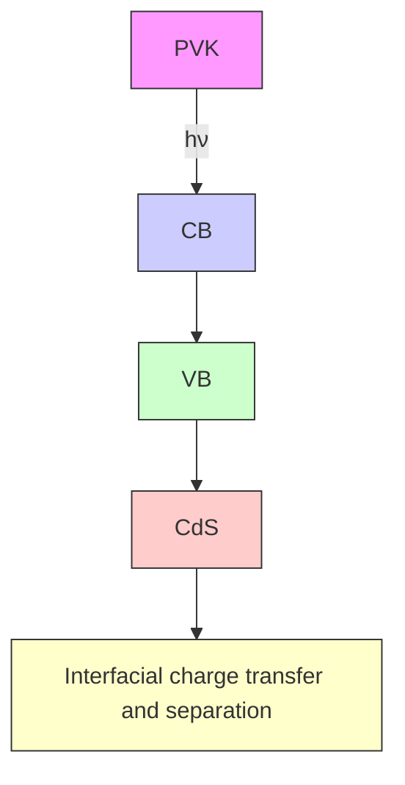

# Fast interfacial charge separation in chemically hybridized CdS-PVK nanocomposites studied by photoluminescence and photoconductivity measurements

Jixin Cheng $^{a}$ , Suhua Wang $^{a}$ , Xiao-Yuan Li $^{a}$ , YiJing Yan $^{a}$ , Shihe Yang $^{a,*}$ , C.L. Yang $^{b}$ , J.N. Wang $^{b}$ , W.K. Ge $^{b}$

$^{a}$ Department of Chemistry, The Hong Kong University of Science and Technology, Clear Water Bay, Kowloon, Hong Kong

$^{b}$ Department of Physics, The Hong Kong University of Science and Technology, Clear Water Bay, Kowloon, Hong Kong

Received 15 September 2000; in final form 16 November 2000

## Abstract

Photoinduced charge transfer and separation in chemically hybridized CdS-PVK nanocomposites is investigated by steady-state and time-resolved photoluminescence as well as photoconductivity measurements. The chemically hybridized CdS-PVK composites display a longer luminescence lifetime than the pure CdS nanoparticles. At the same time, they show an enhanced photoconductivity as compared with PVK. It is also found that the chemically hybridized Cd-PVK nanocomposites exhibit a higher photoconductivity than the CdS/PVK nano-blends at the same molar ratio. The photoluminescence and photoconductivity results are explained by fast interfacial charge transfer between the Q-CdS and PVK. © 2001 Elsevier Science B.V. All rights reserved.

## 1. Introduction

As a new class of photoconductive materials, nanocomposites consisting of organic polymers and semiconductor nanocrystals (e.g., the CdS/PVK nanocomposites) have recently attracted much attention $[1-9]$ . Given that photoconductivity is a convolution of the carrier generation efficiency and transport mobility in the material $[2]$ , one has to keep both performance parameters in mind in the development of new photoconductors. Semiconductor nanocrystals are good candidates as dopants in organic polymers in view of their relatively high charge generation efficiency. Charge generation efficiency depends on the competition between the charge separation into free carriers and other decay pathways of singlet excitons produced by photoexcitation. A facilitated charge separation and delayed recombination after photo-excitation is therefore desirable for a good photoconductor.

Since PVK has a relatively low charge generation efficiency $[1,2]$ , it is necessary to incorporate various photoactive dopants capable of charge injection into the polymer to enhance the photoconductivity. Wang et al. found that the presence of a low concentration of CdS nanocrystals in PVK has little effect on the hole mobility of the PVK matrix $[1,2]$ . The improvement of the charge generation efficiency rather than carrier transport is believed to be the dominant factor in the enhancement of the photoconductivity. Indeed, it has been demonstrated that the dispersion of CdS nanocrystals in PVK enhances the photo-induced charge generation efficiency and extends the sensitivity range $[1,2,7–9]$ . The photoluminescence lifetime was measured for the CdS/PVK nanocomposites prepared by mixing thiophenol-capped CdS nanoparticles and PVK polymer $[1,2]$ . However, there has been no report so far on the correlation between exciton decays and photoconductivity in these novel nanocomposites.

Recently, we have succeeded in the preparation of CdS-PVK nanocomposites through chemical hybridization $[7–9]$ . A significant improvement in photoconductivity has been demonstrated. In this Letter, we investigate the interfacial charge separation process in these chemically hybridized CdS-PVK nanocomposites by steady-state and picosecond time-resolved photoluminescence and photoconductivity measurements.

## 2. Experimental

## 2.1. Sample preparation

The preparation of chemically hybridized CdS-PVK nanocomposites was described previously in detail $[7–9]$ . Two samples labeled as PVK-10-CdS and PVK-15-CdS were used in the experiment. The molar ratio of CdS to PVK was 1:80 and 1:34 for the PVK-10-CdS and PVK-15-CdS samples, respectively. The average particle size of Q-CdS was estimated to be $\sim3.0$ nm for PVK-10-CdS and $\sim3.8$ nm for PVK-15-CdS based on UV–Vis absorption spectra and TEM measurements. The size distribution of these nanoparticles is relatively broad. Sodium AOT capped CdS nanoparticle dispersion with an average particle size of $\sim3.0$ nm was also prepared, and these nanoparticles have a much more narrow size distribution. For comparison, nano-blends of CdS/PVK were prepared as well, in which the molar ratio of CdS to PVK was kept the same as that for PVK-10-CdS.

## 2.2. Measurements

UV–Vis absorption spectra were recorded using a Milton Roy 300 spectrometer. The steady-state luminescence spectra were measured on a Hitachi

F-4500 fluorescence spectrometer equipped with a 150 W Xe lamp and a Hamamatsu 928F photomultiplier tube operated at 950 V. The excitation and emission slits were set at a resolution of 2.5 nm.

Time-resolved photoluminescence experiments were performed at room temperature on a streak camera (Hamamatsu, C4334) equipped with a 250is spectrograph (Chromax). A 300 g/mm grating was used. The sweeping range was set as 10 ns. The excitation source was a Clark-XMR femtosecond Ti:Sapphire laser at a repetition rate of 100 MHz. The 800 nm pulse from the oscillator was frequency doubled with a BBO crystal. 200 scans were co-added to improve the signal-to-noise ratio. The samples were coated on quarts slides and dried in vacuum for 12 h at room temperature before measurements.

In photoconductivity measurements, glass slides with patterned ITO were used as substrates of the nanocomposite films. Aluminum was evaporated on the films as the opposite electrodes. The sample thickness was $\sim$ 150–200 nm. A 150 W Xe lamp was used as the source of white light chopped at a frequency of 400 Hz before being focused onto the sample surface. Short-circuit current between the two electrodes of the sample was measured by a SR830 lock-in amplifier. An external bias voltage of 3 V was used.

## 3. Results and discussion

Fig. 1 shows the absorption and the steady-state photoluminescence spectra of the samples. The pure PVK has little absorption beyond 370 nm, while the absorption of pure Q-CdS extends to $\sim$ 440 nm. The absorption spectra of the CdS/PVK nano-blends and the chemically hybridized CdS-PVK nanocomposites are virtually superpositions of the absorption spectra of pure Q-CdS and pure PVK. The photoluminescence of PVK excited at 400 nm shows one peak at 440 nm. The photoluminescence of the pure Q-CdS sample excited at 400 nm covers the spectral range from 410 to 700 nm and peaks at 530 nm. This broad band can be attributed to broad size distributions and trap recombinations [10]. The photoluminescence from

line chart

| Condition | Peak Absorbance (a.u.) | Luminescence Intensity (a.u.) |
|-----------|--------------------------|-------------------------------|
| pure Q-CdS (solid) | ~350 | ~0.8 |
| pure Q-CdS (solid) | ~450 | ~0.6 |
| pure Q-CdS (solid) | ~500 | ~0.4 |
| pure Q-CdS (solid) | ~550 | ~0.2 |
| pure Q-CdS (solid) | ~600 | ~0.1 |
| pure Q-CdS (solid) | ~650 | ~0.05 |
| pure Q-CdS (solid) | ~700 | ~0.02 |
| PVK (dash) | ~350 | ~0.9 |
| PVK (dash) | ~450 | ~0.7 |
| PVK (dash) | ~500 | ~0.5 |
| PVK (dash) | ~550 | ~0.3 |
| PVK (dash) | ~600 | ~0.1 |
| PVK (dash) | ~650 | ~0.05 |
| PVK (dash) | ~700 | ~0.02 |
| PVK/CdS blend | ~350 | ~0.8 |
| PVK/CdS blend | ~450 | ~0.6 |
| PVK/CdS blend | ~500 | ~0.4 |
| PVK/CdS blend | ~550 | ~0.2 |
| PVK/CdS blend | ~600 | ~0.1 |
| PVK/CdS blend | ~650 | ~0.05 |
| PVK/CdS blend | ~700 | ~0.02 |
| PVK-10-CdS (dash) | ~350 | ~0.9 |
| PVK-10-CdS (dash) | ~450 | ~0.7 |
| PVK-10-CdS (dash) | ~500 | ~0.5 |
| PVK-10-CdS (dash) | ~550 | ~0.3 |
| PVK-10-CdS (dash) | ~600 | ~0.1 |
| PVK-10-CdS (dash) | ~650 | ~0.05 |
| PVK-10-CdS (dash) | ~700 | ~0.02 |
| PVK-15-CdS (solid) | ~350 | ~0.8 |
| PVK-15-CdS (solid) | ~450 | ~0.6 |
| PVK-15-CdS (solid) | ~500 | ~0.4 |
| PVK-15-CdS (solid) | ~550 | ~0.2 |
| PVK-15-CdS (solid) | ~600 | ~0.1 |
| PVK-15-CdS (solid) | ~650 | ~0.05 |
| PVK-15-CdS (solid) | ~700 | ~0.02 |

Fig. 1. The UV–Vis absorption (a) and photoluminescence (b) spectra of the samples used in our experiments. For photoluminescence measurements, the excitation wavelength is 400 nm.

the PVK/CdS nano-blend displays two peaks, corresponding to the emission from pure PVK and pure Q-CdS, respectively. However, the chemically hybridized CdS-PVK nanocomposites show only one luminescence peak between the 440 nm peak from pure PVK and the 530 nm peak from pure Q-CdS. This indicates a rapid charge transfer at the interface of PVK and CdS nanoparticles. As the HOMO of PVK is higher than that of Q-CdS [9], the generated holes in the CdS nanoparticles may migrate to the PVK molecules as depicted in Fig. 2. At the same time, the photo-excited electrons in PVK can move to the surface of the CdS nanoparticles because the LUMO of Q-CdS is lower than that of PVK. It can be expected that such interfacial charge separation process can slow down the exciton recombination and thus increase the photoluminescence lifetime.

flowchart

Fig. 2. A schematic illustration of the interfacial charge generation, transfer, and separation between PVK and Q-CdS in the chemically hybridized nanocomposites.

As shown in Fig. 1, the photoluminescence profile of the chemically hybridized nanocomposites is narrower than that from the pure Q-CdS sample. The peak emission wavelength is around 488 nm (2.55 eV) for PVK-10-CdS and $\sim$ 497 nm (2.53 eV) for PVK-15-CdS. The band-gap energy for the CdS nanoparticles in PVK-10-CdS was estimated to be $\sim$ 2.79 eV [9]. Therefore, the emission may come mainly from exciton recombination. As the average CdS nanoparticle size in PVK-10-CdS is smaller than that in PVK-15-CdS, a blue shift of 9 nm is observed in the emission profile. From the bottom panel of Fig. 1, it can be seen that CdS-10-PVK has higher luminescence intensity than CdS-15-PVK.

Fig. 3 presents the luminescence decays at 460 and 540 nm of the Q-CdS and the chemically hybridized CdS-PVK nanocomposites. The solid line in the bottom panel is the excitation pulse profile. It is found that all the decays show two components. The decay curves are fitted by a bi-exponential function

$$
I = a _ {1} \mathrm{e} ^ {- t / \tau_ {1}} + a _ {2} \mathrm{e} ^ {- t / \tau_ {2}}, \tag {1}
$$

where I is the intensity of the photoluminescence, $\tau_{1}$ and $\tau_{2}$ are the lifetimes of two components with relative intensity of $a_{1}$ and $a_{2}$ . The average lifetime $\langle\tau\rangle$ , defined as the time when the peak intensity has decayed to $e^{-1}$ times its original value, was also calculated. $\tau_{1}, \tau_{2}, a_{1}/a_{2}$ and the average lifetimes at 460 and 540 nm are listed in Table 1. For the pure Q-CdS sample, it can be seen from Table 1 that the emission at 460 nm has a shorter lifetime. This

line chart

| Material     | Peak Intensity (a.u.) |
| ------------ | --------------------- |
| Q-CdS        | ~1.5                  |
| PVK-10-CdS   | ~1.2                  |
| PVK-15-CdS   | ~1.0                  |

Fig. 3. Time-resolved photoluminescence of Q-CdS and the chemically hybridized CdS-PVK nanocomposites. The solid line shown in the bottom panel is the excitation pulse profile. (○): decays detected at 460 nm; (●): decays detected at 540 nm.

indicates a significant coulomb interaction between the trap sites of electrons and those of holes on the surface [11]. The significant coulomb interaction is not favorable for the separation of the electron–hole pairs into free charges. The chemically hybridized CdS-PVK nanocomposites show longer photoluminescence lifetimes at both 460 and 540 nm. This is consistent with a slower recombination of the photo-induced charges spatially separated at the interface of Q-CdS and PVK. Furthermore, the emission at the shorter wavelength has longer lifetimes than that at the longer wavelength, suggesting that the coulomb interaction between the electrons and holes is weakened. This is an indication of the charge migration to the interface between PVK and the CdS nanoparticles.

line chart

| Time (s) | δσ/σ₀ |
| -------- | ----- |
| 100      | 0.6   |
| 200      | 0.5   |
| 300      | 0.5   |
| 400      | 0.4   |
| 500      | 0.0   |

Fig. 4. The photoconductivity of the devices fabricated from pure PVK and the chemically hybridized CdS-PVK nanocomposites. Shown in the upper panel is the device configuration used for the photocurrent measurements.

Table 1
Photoluminescence lifetimes at the indicated emission wavelengths for the Q-CdS and the chemically hybridized CdS-PVK nano-composites

<table><tr><td>Emission wavelength (nm)</td><td>Components</td><td>Q-CdS</td><td>PVK-15-CdS</td><td>PVK-10-CdS</td></tr><tr><td rowspan="4">460</td><td> $\tau_1$ (ns)</td><td>0.16</td><td>0.49</td><td>0.75</td></tr><tr><td> $\tau_2$ (ns)</td><td>7.17</td><td>2.98</td><td>4.86</td></tr><tr><td> $a_1/a_2$ </td><td>29.3</td><td>3.2</td><td>0.7</td></tr><tr><td> $\langle\tau\rangle$ </td><td>0.16</td><td>0.67</td><td>1.76</td></tr><tr><td rowspan="4">540</td><td> $\tau_1$ (ns)</td><td>0.32</td><td>0.49</td><td>0.57</td></tr><tr><td> $\tau_2$ (ns)</td><td>13.3</td><td>3.06</td><td>4.24</td></tr><tr><td> $a_1/a_2$ </td><td>5.8</td><td>3.1</td><td>1.3</td></tr><tr><td> $\langle\tau\rangle$ </td><td>0.45</td><td>0.72</td><td>1.38</td></tr></table>

Table 2
Comparison of photoconductivity performance of pure PVK and the CdS/PVK nanocomposites

<table><tr><td></td><td>PVK</td><td>PVK-15-Cds</td><td>PVK-10-Cds</td><td>PVK/Cds Blend</td></tr><tr><td> $\delta\sigma/\sigma_0$ </td><td>0.29</td><td>0.46</td><td>0.62</td><td>0.47</td></tr><tr><td>Response (s) $^a$ </td><td>22</td><td>6</td><td>4</td><td>12</td></tr></table>

$^{a}$ Time needed for the conductivity increase to the maximum after light is turned on.

Shown in Fig. 4 is the photoconductivity response of the devices fabricated from pure PVK, PVK-10-CdS, PVK-15-CdS, and the CdS/PVK nano-blend. For all the samples, the conductivity increases quickly upon white light irradiation. The photoconductivity is evaluated by $\delta\sigma/\sigma_0$ , where $\delta\sigma$ is the difference of the photocurrent of the device upon white light irradiation ( $\sigma$ ) and the photocurrent of the same device without irradiation ( $\sigma_0$ ). The response time is defined as the time needed for the photoconductivity to reach the maximum after the start of the irradiation. The results are summarized in Table 2. As can be seen from Fig. 4 and Table 2 the samples doped with CdS nanoparticles exhibit significant photoconductivity enhancement and shorter response time than pure PVK. PVK-10-CdS shows a higher photoconductivity than PVK-15-CdS although it contains less CdS. Furthermore, at the same molar ratio of CdS to PVK, the chemically hybridized nanocomposite shows a higher photoconductivity and a shorter response time than the simply blended nanocomposite.

We can expect that the interfacial charge transfer between the CdS nanoparticles and PVK plays an important role in the photoconductivity enhancement upon doping PVK with Q-CdS. The interfacial charge separation can reduce the recombination probability of the photoexcited electrons and holes, and thus increase the chance of the hole migration from the HOMO of PVK. As a result, the chemically hybridized CdS-PVK nanocomposites exhibit a higher photoconductivity. It is reasonable that charge transfer is more efficient between the covalently connected Q-CdS and the surrounding PVK, which accounts for the higher photoconductivity observed in the chemically hybridized nanocomposites.

The photoconductivity difference between PVK-10-CdS and PVK-15-CdS is also consistent with the photoluminescence measurement. First, as shown in Fig. 1, the steady-state luminescence from PVK-10-CdS is much stronger than that from PVK-15-CdS. Furthermore, for PVK-10-CdS, the luminescence lifetime at 540 nm is much longer than at 460 nm, while the lifetimes at 540 and 460 nm are quite close for PVK-15-CdS. This means a weaker coulomb interaction and larger separation of the photo-excited electrons and holes in PVK-10-CdS. As discussed by Wang et al., for larger nanoparticles, bulk carrier trapping by defects can diminish the charge generation efficiency [2]. This agrees with our observation of a shorter luminescence lifetime for PVK-15-CdS as compared with that for PVK-10-CdS.

## 4. Conclusions

We studied the charge transfer and separation processes in the chemically hybridized CdS-PVK nanocomposites. The steady-state and time-resolved photoluminescence measurements suggest that there exists a fast interfacial charge transfer between the CdS nanoparticles and the surrounding PVK matrix, which supports the photoconductivity enhancement of the chemically hybridized CdS-PVK nanocomposites. A slower photoluminescence decay favors a higher charge generation efficiency and thus a higher photoconductivity.

## Acknowledgements

This work is supported by RGC and NNSF-RGC grants administered by the UGC of Hong

Kong, and by the Hong Kong University of Science and Technology.

## References

[1] Y. Wang, N. Herron, Chem. Phys. Lett. 200 (1992) 71.  
[2] Y. Wang, N. Herron, J. Luminescence 70 (1996) 48.  
[3] Y. Wang, N. Herron, J. Caspar, Mater. Sci. Eng. B 19 (1993) 61.  
[4] N.C. Greenham, X. Peng, A.P. Alivisatos, Phys. Rev. B 54 (1996) 17628.  
[5] W.U. Huynh, X. Peng, A.P. Alivisatos, Adv. Mater. 11 (1999) 923.  
[6] J.G. Winiarz, L. Zhang, M. Lal, C.S. Friend, P.N. Prasad, Chem. Phys. 245 (1999) 417.  
[7] S.H. Wang, S.H. Yang, L.-T. Weng, P.C.L. Wong, K. Ho, Macromolecules 33 (2000) 3232.  
[8] L.-T. Weng, P.C.L. Wong, K. Ho, S.H. Wang, Z.H. Zeng, S.H. Yang, Anal. Chem. 72 (2000) 4908.  
[9] S.H. Wang, S.H. Yang, C.L. Yang, J.N. Wang, W.K. Ge, J. Phys. Chem. B 104 (2000) 11853.  
[10] A. Hasselbarth, A. Eychmuller, H. Weller, Chem. Phys. Lett. 203 (1993) 271.  
[11] N. Chestnoy, T.D. Harris, R. Hull, L.E. Brus, J. Phys. Chem. 90 (1986) 3393.