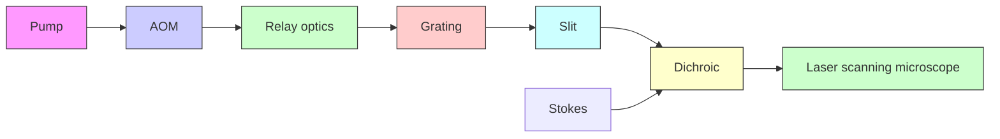
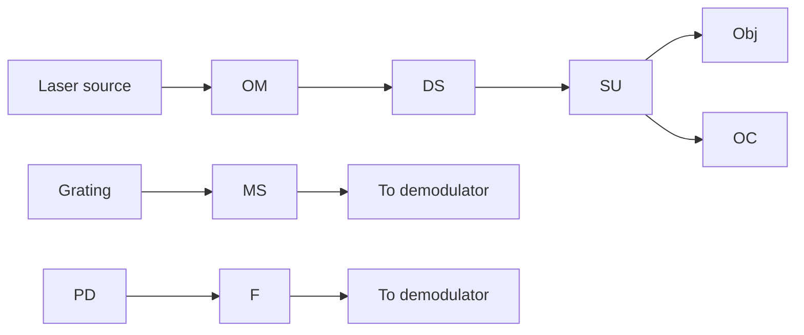
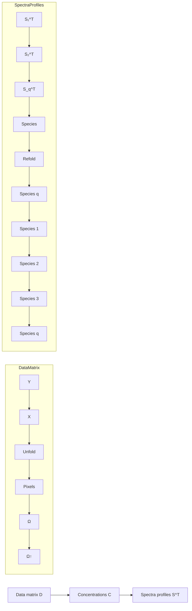

# Fast Vibrational Imaging of Single Cells and Tissues by Stimulated Raman Scattering Microscopy

Delong Zhang,† Ping Wang,‡ Mikhail N. Slipchenko,‡ and Ji-Xin Cheng\*,†,‡

† Department of Chemistry, ‡ Weldon School of Biomedical Engineering, Purdue University, West Lafayette, Indiana 47907, United States

CONSPECTUS: Traditionally, molecules are analyzed in a test tube. Taking biochemistry as an example, the majority of our knowledge about cellular content comes from analysis of fixed cells or tissue homogenates using tools such as immunoblotting and liquid chromatography−mass spectrometry. These tools can indicate the presence of molecules but do not provide information on their location or interaction with each other in real time, restricting our understanding of the functions of the molecule under study. For realtime imaging of labeled molecules in live cells, fluorescence microscopy is the tool of choice. Fluorescent labels, however, are too bulky for small molecules such as fatty acids, amino acids, and cholesterol. These challenges highlight a critical need for development of chemical imaging platforms that allow in situ or in vivo analysis of molecules. Vibrational spectroscopy based on spontaneous Raman scattering is widely used for label-free analysis of chemical content in cells and tissues. However, the Raman process is a weak effect, limiting its application for fast chemical imaging of a living system.

text_image

Stimulated
Raman
Spontaneous
Raman

With high imaging speed and 3D spatial resolution, coherent Raman scattering microscopy is enabling a new approach for realtime vibrational imaging of single cells in a living system. In most experiments, coherent Raman processes involve two excitation fields denoted as pump at $\omega _ { \mathsf { p } }$ and Stokes at $\omega _ { s } .$ When the beating frequency between the pump and Stokes fields $( \omega _ { \mathrm { p } } - \omega _ { \mathrm { s } } )$ is resonant with a Raman-active molecular vibration, four major coherent Raman scattering processes occur simultaneously, namely, coherent anti-Stokes Raman scattering (CARS) at $( \omega _ { \mathrm { p } } - \omega _ { \mathrm { s } } ) + \omega _ { \mathrm { p } } ,$ coherent Stokes Raman scattering (CSRS) at $\omega _ { s } -$ $( \omega _ { \mathrm { p } } - \omega _ { \mathrm { s } } )$ , stimulated Raman gain (SRG) at $\omega _ { s } ,$ and stimulated Raman loss (SRL) at $\omega _ { \mathsf { p } } .$ In SRG, the Stokes beam experiences a gain in intensity, whereas in SRL, the pump beam experiences a loss. Both SRG and SRL belong to stimulated Raman scattering (SRS), in which the energy difference between the pump and Stokes fields is transferred to the molecule for vibrational excitation. The SRS signal appears at the same wavelengths as the excitation fields and is commonly extracted through a phasesensitive detection scheme. The detected intensity change because of a Raman transition is proportional to Im $\begin{array} { r } { \hat { U } ^ { ( 3 ) } \breve { \mathrm { J } } _ { \mathrm { p } } I _ { \mathrm { s } } , } \end{array}$ where χ(3) $\chi ^ { ( 3 ) }$ represents the third-order nonlinear susceptibility, $\dot { I _ { \mathrm { p } } }$ and $I _ { s }$ stand for the intensity of the pump and Stokes fields. In this Account, we discuss the most recent advances in the technical development and enabling applications of SRS microscopy. Compared to CARS, the SRS contrast is free of nonresonant background. Moreover, the SRS intensity is linearly proportional to the density of target molecules in focus. For single-frequency imaging, an SRS microscope offers a speed that is ∼1000 times faster than a line-scan Raman microscope and 10 000 times faster than a point-scan Raman microscope. It is important to emphasize that SRS and spontaneous Raman scattering are complementary to each other. Spontaneous Raman spectroscopy covers the entire window of molecular vibrations, which allows extraction of subtleties via multivariate analysis. SRS offers the speed advantage by focusing on either a single Raman band or a defined spectral window of target molecules. Integrating singlefrequency SRS imaging and spontaneous Raman spectroscopy on a single platform allows quantitative compositional analysis of objects inside single live cells.

## 1. INTRODUCTION

Acquiring a spectrum at every pixel, so-called spectroscopic imaging, occurs in our daily life. The photoreceptor cells in the human eye perceive three colors (yellow, green, and violet), and our brain processes the information for us to see the world in all colors.1 Nevertheless, most intracellular biomolecules, including lipids and nucleic acids, neither absorb nor emit photons in the visible wavelength region and therefore are invisible under a bright-field microscope. Fortunately, molecules are not “quiet”; the chemical bonds vibrate, and their interaction with photons produces fingerprint spectra of molecules in the infrared wavelength region. Infrared spectroscopy is a powerful tool for molecular analysis, but its imaging application to living systems is hampered by the strong infrared absorption of water. The relatively long excitation wavelength used in infrared spectroscopy also limits the spatial resolution of infrared microscopy to a few micrometers,2 which is not sufficient for visualization of subcellular structure. These shortcomings can be avoided using molecular spectroscopy based on inelastic Raman scattering (Figure 1a).3 First, water is known to be a weak Raman scatterer and produces little interference. Moreover. the use of visible/near-infrared excitation wavelength offers submicrometer spatial resolution,

Received: January 6, 2014

Published: May 28, 2014

a. Spontaneous Raman scattering  

text_image

ωp
ωs
Ω
ν = 1
ν = 0

line chart

| Category     | Value |
| ------------ | ----- |
| Stokes       | 10    |
| Pump         | 100   |
| Anti-Stokes  | 5     |

b. Coherent Raman scattering (broadband)

text_image

ωp
ωs
Ω
ν=1
ν=0

line chart

| Condition     | Value |
| ------------- | ----- |
| SRG           | 10    |
| SRL           | 20    |
| CARS          | 5     |

Figure 1. Spontaneous Raman scattering and coherent Raman scattering processes. (a) Spontaneous Raman scattering. Left: energy diagram. Right: representative spectra. The solid vertical arrows indicate laser excitation; the dashed arrow indicates the spontaneous scattering process. (b) Broadband coherent Raman scattering induced by a pump field at $\omega _ { \mathrm { { p } } }$ and a Stokes field at ω . Ω denotes the vibrational energy.

allowing for chemical imaging of single cells by confocal Raman microscopy.4 Nevertheless, because of the extremely small cross-section of spontaneous Raman scattering, the data acquisition speed of current Raman microscopes for cell imaging is limited to tens of minutes per frame $\mathrm { o f } \sim 2 4 0 \times 1 0 0$ pixels.5 Such speed is insufficient to capture the dynamics in a vital system.

Recently developed coherent Raman scattering microscopy,6 based on either coherent anti-Stokes Raman scattering (CARS)

or stimulated Raman scattering (SRS) (Figure 1b), overcomes the low signal level limitation and allows real-time vibrational imaging of living cells and organisms. The SRS and CARS phenomena were first reported in $1 9 6 2 ^ { 7 }$ and $1 9 6 5 , ^ { 8 }$ respectively, and CARS microscopy was first reported in $1 9 8 2 . ^ { 9 }$ The need for high-speed cellular imaging and advances in laser technologies spurred the development of CARS microscopy in $1 9 9 9 . ^ { 1 0 }$ Over the past decade, CARS microscopy has found important biological applications in label-free imaging of biomolecules, especially lipids.11 Of particular note, multiplex CARS imaging has achieved spectral acquisition times on the order of a few milliseconds per pixel for biological samples.12,13

Single-frequency SRS imaging was reported in 2005 by Volkmer et al.14 In 2007, Ploetz et al. reported broadband SRS microscopy using a 1 kHz laser.15 Since 2008, the use of megahertz-rate modulation of 80 MHz lasers has circumvented the laser noise and significantly improved imaging speed and detection sensitivity.16−19 A demodulation approach that requires no lock-in amplifier has simplified the implementation of SRS imaging.20 To harness the spectroscopic information, Raman spectromicroscopy was developed, where high-speed, single-frequency SRS or CARS imaging was coupled with spontaneous Raman spectral analysis of the pixels of interest.21−25 As a more quantitative approach, hyperspectral SRS microscopy, which collects an SRS spectrum for each pixel, has been recently developed for analysis of complex biological specimens. 26−31

We herein discuss the most recent advances in SRS microscopy in terms of instrumentation characteristics and image analysis methods, along with enabled applications. An outlook of SRS microscopy is presented at the end.

## 2. NOISE, BACKGROUND, AND PHOTODAMAGE INSRS MICROSCOPY

The quality of SRS imaging is affected by factors including noise, non-Raman background, and photodamage to the specimen. These are also common factors in spontaneous Raman imaging. However, because SRS signals are extracted from the local oscillator by a phase-sensitive detection, the noise issues in SRS are different from that in spontaneous Raman. In this section, we discuss the nature of these issues and present various ways that have been used to reduce noise, background, and photodamage.

a. Stimulated Raman scattering  

text_image

mħωp
ωp
ωs
(m-1)ħωp
kħωs
Ω
ν=1
ν=0
(k+1)ħωs

b. Cross-phase modulation  

text_image

mħωp
ωp ωpr
kħωpr
n2
n1
mħωp
ωp
ωpr
knω'pr

c. Transient absorption  

text_image

mħωp
kħωpr
ωp
ωpr
(m-1)ħωp
(k-1)ħωpr

d. Photothermal lensing  

chemical

Energy level diagram showing transitions between mħωp, kħωpr, and n0' with ΔT label

Figure 2. Pump−probe modalities associated with the SRS process. (a) SRS process involves energy transfer from the pump field to the Stokes field via excitation of molecular vibration. (b) Cross-phase modulation: the pump beam (ω ) changes the nonlinear refractive index at the focus through optical Kerr effect, thus affecting the probe beam (ω ) propagation and frequency. (c) Transient absorption: a pump−probe process that involves excitation of electronic energy levels. (d) Thermal lensing effect: the change of refractive index at the focus induced by the local heating after absorption of the pump photons, affecting the propagation of the probe beam.

flowchart

flowchart

text_image

Intensity modulation
Air
Hair
d-DMSO
Spectral modulation
0 1000
0 300

text_image

Intensity modulation
d
0 700

natural_image

Fluorescence microscopy image showing cellular structures with red and yellow emission, scale bar 0–120 (no text or symbols)

Figure 3. Background-free SRS imaging through spectral modulation. (a, b) Schematic of the spectral modulator with the acousto-optic modulator switched on (a) and off (b). $( \mathbf { c } , \mathbf { d } )$ Comparison of SRS imaging by intensity modulation to that by spectral modulation. The sample in panel c is a dark hair at the interface between air and liquid, deuterated dimethyl sulfoxide. The sample in panel d is a sebaceous gland under black mouse skin. Scale bars: 20 μm.

The noise in SRS microscopy is composed of the laser noise, shot noise, and electronic noise. The laser noise is linearly proportional to the laser power, has a distribution similar to 1/f noise, and is dominant over the signal below 1 MHz. Therefore, adopting a megahertz modulation rate in SRS imaging significantly circumvents the laser noise. The fundamental electronic noise, the Johnson−Nyquist noise, is independent of laser power but proportional to the square root of input impedance, assuming minimal environmental noise such as that from a power supply. To increase the ratio of SRS signal to electronic noise, a resonant circuit with a high quality factor can be used to amplify the SRS signal.20

The shot noise is the result of the intrinsic Poisson distribution of photon detection. Because the phase-sensitive detection scheme in SRS detects only the varying portion of the laser intensity, ΔI, the minimum detectable modulation depth, ΔI/I, cannot be smaller than $I _ { \mathrm { s h o t } } / I = 1 / I ^ { 1 / 2 }$ , where $I _ { \mathrm { s h o t } }$ stands for the shot-noise-equivalent intensity and I is the detected laser intensity. Shot-noise-limited detection is indicated by a square-root dependence of noise on the incident power at the photodetector and has been extensively demonstrated in SRS microscopy.18,19

It is important to note that the SRS signal is accompanied by Raman-independent pump−probe background signals. These pump−probe-type signals arise from transient absorption, cross-phase modulation, and photothermal effects (Figure 2).32 Here, the terms pump and probe refer to the modulated beam and unmodulated beam, respectively. Spectral modulation offers a promising approach to diminish the pump− probe background in SRS microscopy. The transient absorption and photothermal effects are based on electronic transitions and therefore exhibit relatively small wavelength dependence (tens of nanometers). Cross-phase modulation is a third-order nonlinear process involving only virtual energy states, and its intensity has an inverse dependence on the probe beam wavelength. Therefore, for a small spectral range, the crossphase modulation signal can be considered to be wavelength independent. In contrast, the SRS signal arises from vibrational transitions, which have very sharp spectral features (on the order of 1 nm in width). Thus, by modulating the wavelength of a laser beam within a few nanometers, one could selectively detect the SRS process. On the basis of this concept, early work demonstrated the suppression of background signal in absorption spectroscopy33 and SRS spectroscopy.34,35 Recent work by Zhang et al. demonstrated a frequency modulation implementation that switches the excitation wavelengths at a megahertz rate, as shown in Figure 3a,b.32 The intensitymodulation induced pump−probe signals are effectively removed, whereas the pure Raman resonant components are detected. This removal of transient absorption background enables the visualization of lipid bodies in the presence of strong melanin pigments (Figure 3c,d). Alternatively, SRS and transient absorption signals can be distinguished on the basis of their different dependence on the excitation laser fields.36 Mansfield et al. used electronic phase information to separate the transient absorption signal and the SRL signal.37 Meanwhile, it is worth mentioning that the pump−probe backgrounds are not encountered in CARS microscopy because the CARS signal is detected at a new wavelength.

Another challenge associated with ultrafast pulse excitation is the increased potential of photodamage. To address this issue, an SRL configuration has been widely adopted, where most of the excitation power is carried by the longer wavelength Stokes beam.16,19,31,37−40 It was shown that photodamage in nonlinear microscopy is largely induced by two-photon and higher order multiphoton absorption of molecules.41,42 Thus, the photodamage can be significantly reduced by excitation at longer near-infrared wavelengths that has much less two-photon absorption. By examination of cell blebbing and embryo growth, Zhang et al. found negligible photodamage with 7.8 MW/cm2 fs pulses around 1.0 μm excitation in the SRL imaging experiments.19,43

flowchart

Figure 4. High-speed SRS microscope. OM, optical modulator, typically an acousto-optic modulator or an electro-optic modulator; DS, delay stage; SU, scanning unit; F, optical filter; PD, photodiode; Obj, objective lens; OC, oil condenser; MS, mechanical stage. The laser source can be either a dual-color picosecond laser or a dual-color femtosecond laser. If femtosecond lasers are used, then a pulse shaper (dashed box) is necessary for intrapulse spectral scan.

## 3. SRS IMAGING MODALITIES

A schematic of a high-speed SRS microscope is shown in Figure 4. Key components needed for SRS imaging include a dualcolor laser source, an optical modulator, a laser scanner, a detector, and an electronic demodulator. To date, SRS imaging has been demonstrated in single-frequency, hyperspectral, and multiplex modes. In this section, we review strategies that have been used for these modalities.

## 3.1. Single-Frequency SRS Imaging

Single-frequency SRS imaging focuses all the laser energy into a specific Raman mode to gain the signal level. The width of a Raman band is typically at the level of 10−100 cm−1 . Therefore, to ensure the chemical specificity, excitation of several wavenumbers of spectral width or isolated Raman bands are preferred. Today, automatic wavelength tuning is possible on a synchronously pumped OPO system. Kong et al. recently reported a rapidly tunable OPO system that can perform fast wavelength tuning for SRS imaging at multiple Raman shifts.44 SRS imaging of a single Raman mode has shown its capabilities 16,19,39,40,45 in the characterization of cells and tissues.

It is important to recognize that stimulated Raman scattering and spontaneous Raman scattering are complementary techniques. Integrating single-color SRS imaging and spontaneous Raman spectroscopy on a single platform has allowed quantitative compositional analysis of single lipid droplets in live cells.21 This capability led to the recent discovery of an aberrant accumulation of cholesteryl ester in aggressive prostate cancer cells but not in normal prostate tissues. 25

## 3.2. Wavelength-Scanning Hyperspectral SRS Microscopy

Data acquisition in hyperspectral SRS imaging can be performed by either wavelength scanning over a stack of frames, lines, or at each pixel. Several types of spectral tuning have been demonstrated over the past few years, including wavelength tuning of picosecond laser sources,26,37 intrapulse tuning of femtosecond lasers,27,29,30 and chirping of femtosecond lasers.28

Wavelength scanning is a widely adopted approach for hyperspectral SRS.26,37 Suhalim et al. demonstrated hyper spectral SRS imaging using point-by-point tuning of the excitation picosecond laser.26 The spectral tuning was accomplished through computer control of the crystal temperature and cavity length of the OPO. The fastest implementation of their system produced >50 spectrally resolved frames in ∼10 min. Faster scanning OPO with a 1.1 frames per second tuning rate was demonstrated by Garbacik et al. in CARS microscopy.46

As compared to tweaking the laser cavity, spectral tuning of a broadband femtosecond laser by the pulse-shaping technique provides an alternative approach (Figure 4, inset). Ozeki et al. developed fiber-amplified spectral filtering of a Ti:sappire laser, in which a galvo mirror was relayed to a grating surface for fast spectral tuning and a fiber tip was used for spectral filtering.29,30 The sub-mW filtered pulse was then amplified by a home-built Yb fiber amplifier. Zhang et al. utilized direct intrapulse spectral scan of femtosecond pulses, based on a synchronously pumped OPO system.27 An automated slit was placed at the Fourier plane of a 4f pulse shaper for controllable spectral filtering and intrapulse spectral scanning.

Alternatively, the spectral focusing method provides a relatively simple and robust method to improve spectral resolution of broadband femtosecond lasers.47 In this method, positive chirp is introduced by inserting glass rods into the laser beams, and spectral tuning is essentially the tuning of timing between the pulse trains. The complexity of the chirping method lies in the measurement of Raman shift and the higher order dispersion. Fu et al. recently demonstrated hyperspectral SRS imaging utilizing chirped femtosecond pulses, in which the SRS imaging data over a 270 cm−1 spectral window was acquired within a minute.28

## 3.3. Multiplex Detection

Spectral scanning over a stack of frames is subjected to long term fluctuation and can result in spectral and spatial distortions. Therefore, the ideal approach for hyperspectral imaging would be acquisition of an SRS spectrum at each pixel. Parallel detection of multiple spectral channels allows spectrum acquisition within a single modulation cycle, thus eliminating spectral artifacts caused by pulse-to-pulse fluctuations. Also, parallel detection allows SRS imaging of a larger spectral window without increasing the acquisition time. Fu et al.

flowchart

Figure 5. Flowchart of multivariate curve resolution (MCR). The hyperspectral stack is unfolded to data matrix D for MCR to obtain concentration matrix C and spectra matrix $S ^ { \mathrm { T } } .$ Matrix C is then refolded into concentration maps for each component.

natural_image

Microscopic image showing scattered bright spots on a black background, with a scale bar labeled '2100 cm⁻¹' (no text or symbols beyond labels)

natural_image

Microscopic image of a cellular structure with scale bar indicating 5 μm and concentration label (2870 cm⁻¹), no readable text or symbols beyond labels.

natural_image

Fluorescence microscopy image of stained cells showing blue nuclei and cytoplasmic structures, with scale bar indicating 2133 cm⁻¹ (no text or symbols beyond labels)

natural_image

Fluorescence microscopy image of cellular structures with red-orange fluorescence, scale bar 10 μm, no text or symbols present

natural_image

Stacked dark rectangular blocks with a central circular pattern, no visible text or symbols

natural_image

Microscopic image of red-labeled lipid cells with scale bar (no text or symbols)

natural_image

Microscopic image showing green fluorescent spots on a dark background, with scale bar indicating 20 μm and intensity value 2845 cm⁻¹ (no text or symbols beyond labels)

natural_image

Microscopic image showing fluorescently labeled cells with a scale bar of 1655 cm⁻¹ (no text or symbols beyond label)

natural_image

Fluorescent microscopy image showing green-labeled protein/nucleotide structures (no text or symbols)

natural_image

Microscopic image showing water surface with dark spots, scale bar indicating 20 μm (no text or symbols beyond label)

natural_image

Microscopic image showing a red fluorescent cell cluster with scale bar indicating 785 cm⁻¹ (no text or symbols present)

natural_image

Microscopic image showing a red fluorescent cell cluster with scale bar indicating 1090 cm⁻¹ (no text or symbols present)

Figure 6. Cellular imaging applications. (a, b) C−D (a) and C−H (b) SRS images of CHO cells treated with palmitic acid and oleate. Adapted from ref 19. Copyright 2011 American Chemical Society. $( \mathbf { c } , \mathbf { d } )$ SRS images of HeLa cells treated with a deuterated set of all amino acids. Adapted with permission from ref 39. Copyright 2013 National Academy of Sciences. (e) Label-free hyperspectral SRS imaging of MCF7 cells from 2830 to 3010 $\mathsf { \bar { c } m } ^ { - 1 }$ . (f−h) MCR results of the spectral stack from panel e, including lipid content $\mathbf { \Pi } ( \mathbf { f } ) ,$ protein/nucleotide $( \underline { { \mathsf { J } } } ) ,$ and water (h). Adapted from ref 27. Copyright 2013 American Chemical Society. (i−l) Label-free SRS images of nucleic acids in live cells at C−H band $\mathrm { ( i ) _ { \it \cdot } }$ , amide-I band (j), and nucleic acid (k, l). Adapted with permission from ref 55. Copyright 2012 Wiley-VCH Verlag GmbH and $\mathbf { \boldsymbol { C } } \mathbf { \boldsymbol { o } } .$

recently demonstrated parallel detected three-channel SRS imaging by frequency coding, with a data acquisition rate at ${ \sim } 5$ kHz.48 Conventionally, SRS imaging requires a high-frequency lock-in amplifier to demodulate the signal, which makes parallel detection difficult, as each spectral channel would require a separate lock-in amplifier. CCD detectors used in multiplex CARS are not applicable for extraction of megahertz signal because of low dynamic range. Cost-effective resonant amplifiers20 provide the possibility for multiplex SRS imaging through parallel detection of spectrally dispersed signals.

## 4. QUANTITATIVE IMAGE ANALYSIS

The goal of SRS image analysis is to produce a concentration map of each species along with the corresponding Raman spectrum. By means of hyperspectral SRS imaging, a stack of XY images at each Raman shift Ω is obtained (i.e., an XYΩ stack). This three-dimensional matrix contains spectral and spatial information, which can be analyzed by chemometric approaches.49 In general, the more prior knowledge of the sample in hand, the less difficult it is to analyze the data. From a completely known system to a completely unknown system, analytical approaches for SRS imaging span from least-squares fitting 48 to principal component analysis26 to multivariate analysis,27,30,31 as discussed below.

  
Figure 7. Hyperspectral SRS imaging and MCR analysis of a mouse liver tissue. (a−c) Concentration maps of lipid droplets, proteins, and water produced by MCR analysis of SRS images. Scale bar: 20 μm. (d) Composite image: green, lipid droplets; purple, protein; and blue, water. (e) MCR resolved spectra.

## 4.1. Least-Squares Fitting

For samples with known compositions (e.g., a pharmaceutical formulation), least-squares fitting provides a solid and rapid means to generate concentration maps. For instance, Fu et al. used least-squares fitting-based analysis to extract the concentration of a three-component system, where oleic acid, cholesterol, and cyclohexane with difference ratios were identified.48

## 4.2. Principal Component Analysis

Principal component analysis (PCA) is a widely used approach to identify the major components of a data set and has been used for both CARS13,50 and SRS26 image analysis. The PCA method rotates the coordinates of the original data set and transforms it into a new space, where the principal components is classified, and a binary map can be obtained by clustering the data points. The concentration maps are, however, difficult to interpret, which makes PCA a qualitative rather than quantitative method.

## 4.3. Multivariate Analysis

Multivariate analysis focuses on extracting the spectrum of each component along with the concentration map with limited prior knowledge. Multivariate curve resolution (MCR), as an example, decomposes the data matrix (D) into concentration matrix (C) and spectra matrix (S), as shown in Figure 5.51 Certain constraints can be applied to the analysis, such as positive concentration and spectrum values. In work by Zhang et al., MCR analysis enabled the mapping of the major components in a single cell based on their spectral features in the overlapped C−H region.27 By analyzing the hyperspectral SRS matrix in the fingerprint region, Wang et al. found that the unsaturation ratio is not uniform among the lipid droplets in an intact atherosclerotic tissue.31 Meanwhile, Ozeki et al. developed a multivariate approach for SRS spectral imaging based on independent component analysis.30 Similar methods were developed for CARS imaging by Cicerone and coworkers52 and Langbein and co-workers,53 respectively.

## 5. APPLICATIONS OF SRS MICROSCOPY

Various demonstrations of SRS microscopy have shown it to be a capable platform for high-speed spectral imaging of samples ranging from single cells to human patient tissues. The journey has begun for SRS imaging to address important biological questions. Below, we discuss such recent applications enabled by SRS imaging.

Single-cell analysis has become a new frontier in molecular biology.54 SRS microscopy has demonstrated its ability to map chemical species with subcellular resolution. Cellular uptake and intracellular fate of fatty acids were visualized by SRS imaging of deuterated fatty acids, revealing that oleic fatty acid facilitates the conversion of palmitic fatty acid into lipid bodies (Figure 6a,b).19 Likewise, deuterated amino acids were administered to cells as substrates for protein synthesis, and newly synthesized proteins were mapped in real time (Figure 6c,d).39 As well, label-free hyperspectral SRS imaging of cells showed the capability for mapping major cellular contents (Figure 6e−h).27−29 SRS imaging of nucleic acids was demonstrated for studying metabolic processes (Figure 6i− l).55 Collectively, these examples demonstrate the potential from in vitro analysis of molecules in a test tube to in vivo analysis of molecules in a single live cell.

SRS mapping at the tissue level opens a new door for medical applications, such as cancer detection56,57 and drug screendrug for skin treatment and imaged the adipose tissue in the hypodermis, unraveling the drug content from the overlapped Raman bands in the C−H vibration region.27 Mansfield et al. demonstrated SRS imaging of fresh articular cartilage tissue to visualize subcellular lipids and proteins as well as the mineral contents.59 Their hyperspectral SRS imaging in the C−H vibration region showed variations in protein and lipid contents in different cells, whereas by using the phosphate band at 959 cm−1 and the carbonate band at 1070 cm−1 , mineral content of the cartilage could be imaged. Therefore, the visualization of mineral content by SRS offers new opportunities for osteoarthritis research. Furthermore, SRS imaging of live model organisms such as Caenorhabditis elegans opens new opportunities for lipid metabolism research.19,60−62

To illustrate the power of SRS for tissue analysis, hyperspectral SRS imaging and MCR analysis of a fatty liver tissue are shown in Figure 7. The SRS images were taken in a spectral window from 1620 to 1700 cm−1 , where there is a C C stretching band contributed by lipid peaks at 1655 cm−1 , a broad amide-I band from proteins/nucleotides around 1660 cm−1 , and a weak O−H bending band from water around 1640 cm−1 . By MCR analysis, maps of these major components were constructed (Figure 7a−d). The corresponding Raman spectra are shown in Figure 7e.

An important application is selective imaging of cholesterol, which plays important roles in cardiovascular disease, cancer, and other disorders. Mapping cholesterol and its derivatives in situ and in vivo is a remaining challenge. Lim et al. and Suhalim et al. demonstrated hyperspectral CARS and SRS imaging of cholesterol crystal in cells and tissues.26,63 Wang et al. recently demonstrated hyperspectral SRS imaging in the fingerprint region to map cholesterol storage in an arterial tissue.31 Although the Raman bands for fat, cholesterol, and protein reside in the same spectral window (around the 1600 cm−1 region), their spectral peaks and widths differ for the sterol C C band, acyl CC band, ester CO band, and the amide-I band. Quantitative chemical maps were obtained by MCR analysis of the SRS spectral imaging stack in the 1620 to 1800 cm−1 window.

Label-free, noninvasive SRS imaging also allows translational medical imaging applications. A recent study by Ji et al. demonstrated the potential of SRS imaging for intraoperative in which qualitative maps based on protein/collagen contrast were obtained in real time for determination of tumor presence.

While imaging of animal tissues plays an important role in biomedical research, plant tissues are of great significance for agricultural sciences. Recent work performing SRS imaging of cell wall components, including biomass conversion45 and epicuticular waxes in plants,37 has created new possibilities in botanical and agricultural research.

## 6. OUTLOOK

Although SRS microscopy is still in its early stages, this technique has shown great promise in single-cell imaging, tissue analysis, and medical diagnosis. We anticipate several new directions in the future development of SRS microscopy. First, the imaging capability can be significantly enhanced by coupling SRS microscopy with the development of Raman tags. For example, the C−D bonds have been used for SRS imaging of fatty acid metabolism19 and amino acid metabolism.39 Second, multiplex SRS microscopy, which records a Raman spectrum in a defined spectral window on a microsecond time scale, has the potential to become a powerfu platform for live cell imaging. With multiplex SRS, important spectral information other than Raman intensity, including Raman shift and line width, can be used as contrast to “watch” biochemistry in real time in live cells. Third, the field of SRS microscopy will be promoted by the development of new laser sources. Current SRS microscopes are largely based on single box, two-color picosecond or femtosecond solid-state lasers. Highly compact, cost-effective, low-noise fiber laser sources (e.g., the time-lens source38) will lead to wider adaption of this new imaging modality. Finally, together with the fiber laser source development,64 miniature SRS imaging systems65 have the potential of finding use in operating rooms for diagnosis of residual cancerous tissues.

## AUTHOR INFORMATION

## Corresponding Author

\*E-mail: jcheng@purdue.edu.

## Author Contributions

The manuscript was written through contributions of all authors. All authors have given approval to the final version of the manuscript.

## Notes

The authors declare no competing financial interest.

## Biographies

Delong Zhang received his B.S. degree from the Department of Chemical Physics, University of Science and Technology of China, Hefei, China, in 2009. Zhang is currently a research assistant, pursuing his Ph.D. degree in chemistry at Purdue University, West Lafayette, Indiana. His research focuses on multimodal nonlinear optical imaging and spectroscopy.

Ping Wang received his B.S. degree from the Department of Physics, Wuhan University, Wuhan, China, in 2002 and his Ph.D. degree from the Chinese Academy of Science in 2007. Ping is currently a Post Doctotal Research Associate in the Weldon School of Biomedical Engineering, Purdue University. His research focuses on the development of hyperspectral nonlinear optical imaging.

Mikhail Slipchenko is currently a Research Scientist in the Department of Biomedical Engineering, Purdue University, West Lafayette, Indiana. He obtained his Ph.D. in Physical Chemistry from the University of Southern California in 2005. His research expertise includes nonlinear and linear spectroscopy and optical microscopy. He focuses on the development of linear and nonlinear optical tools for chemical imaging.

Ji-Xin Cheng received his B.S and P.h.D degrees from the Department of Chemical Physics, University of Science and Technology of China, Hefei, China, in 1994 and 1998, respectively. He is currently a Professor in the Department of Chemistry and Weldon School of Biomedical Engineering at Purdue University, West Lafayette, Indiana. His research lab develops label-free optical imaging tools and nanotechnologies for challenging applications in biomedicine.

## ACKNOWLEDGMENTS

This work was supported by NIH grants R21 GM104681 and R21 CA182608. The mouse liver tissue was provided by Jiandie Lin at the University of Michigan. The authors thank Evan Phillips for proof reading.

## ABBREVIATIONS

CARS, coherent anti-Stokes Raman scattering SRG, stimulated Raman gain ${ \mathrm { S R L } } ,$ stimulated Raman loss ${ \mathrm { S R S } } ,$ stimulated Raman scattering

## REFERENCES

(1) Schnapf, J. L.; Kraft, T. W.; Baylor, D. A. Spectral sensitivity of human cone photoreceptors. Nature 1987, 325, 439−441.  
(2) Lasch, P.; Naumann, D. Spatial resolution in infrared microspectroscopic imaging of tissues. Biochim. Biophys. Acta, Biomembr. 2006, 1758, 814−829.  
(3) Raman, C. V.; Krishnan, K. S. A new type of secondary radiation. Nature 1928, 121, 501−502.  
(4) Puppels, G.; De Mul, F.; Otto, C.; Greve, J.; Robert-Nicoud, M.; Arndt-Jovin, D.; Jovin, T. Studying single living cells and chromosomes by confocal Raman microspectroscopy. Nature 1990, 347, 301−303.  
(5) Yamakoshi, H.; Dodo, K.; Palonpon, A.; Ando, J.; Fujita, K.; Kawata, S.; Sodeoka, M. Alkyne-tag Raman imaging for visualization of mobile small molecules in live cells. J. Am. Chem. Soc. 2012, 134, 20681−20689.  
(6) Cheng, J.-X.; Xie, X. S.: Coherent Raman Scattering Microscopy; CRC Press: Boca Raton, FL, 2013.  
(7) Woodbury, E. J.; Ng, W. K. Ruby operation in the near IR. Proc. Inst. Radio Eng. 1962, 50, 2367.  
(8) Terhune, R. W.; Maker, P. D.; Savage, C. M. Measurements of nonlinear light scattering. Phys. Rev. Lett. 1965, 14, 681−684.  
(9) Duncan, M. D.; Reintjes, J.; Manuccia, T. J. Scanning coherent anti-Stokes Raman microscope. Opt. Lett. 1982, 7, 350−352.  
(10) Zumbusch, A.; Holtom, G. R.; Xie, X. S. Three-dimensional vibrational imaging by coherent anti-Stokes Raman scattering. Phys. Rev. Lett. 1999, 82, 4142−4145.  
(11) Zumbusch, A.; Langbein, W.; Borri, P. Nonlinear vibrational microscopy applied to lipid biology. Prog. Lipid Res. 2013, 52, 615− 632.  
(12) Bonn, M.; Müller, M.; Rinia, H. A.; Burger, K. N. J. Imaging of chemical and physical state of individual cellular lipid droplets using multiplex CARS microscopy. J. Raman Spectrosc. 2009, 40, 763−769.  
(13) Parekh, S. H.; Lee, Y. J.; Aamer, K. A.; Cicerone, M. T. Label free cellular imaging by broadband coherent anti-stokes Raman scattering microscopy. Biophys. J. 2010, 99, 2695−2704.  
(14) Nandakumar, P.; Kovalev, A.; Muschielok, A.; Volkmer, A. Vibrational imaging and microspectroscopies based on coherent anti-Stokes Raman scattering (CARS); French−Israeli Symposium on Non-Linear and Quantum Optics: Ein Bokek, Israel, February 2005.  
(15) Ploetz, E.; Laimgruber, S.; Berner, S.; Zinth, W.; Gilch, P. Femtosecond stimulated Raman microscopy. Appl. Phys. B: Laser Opt. 2007, 87, 389−393.  
(16) Freudiger, C. W.; Min, W.; Saar, B. G.; Lu, S.; Holtom, G. R.; He, C.; Tsai, J. C.; Kang, J. X.; Xie, X. S. Label-free biomedical imaging with high sensitivity by stimulated Raman scattering microscopy. Science 2008, 322, 1857−1861.  
(17) Nandakumar, P.; Kovalev, A.; Volkmer, A. Vibrational imaging based on stimulated Raman scattering microscopy. New J. Phys. 2009, 11, 033026-1−033026-10.  
(18) Ozeki, Y.; Kitagawa, Y.; Sumimura, K.; Nishizawa, N.; Umemura, W.; Kajiyama, S. i.; Fukui, K.; Itoh, K. Stimulated Raman scattering microscope with shot noise limited sensitivity using subharmonically synchronized laser pulses. Opt. Express 2010, 18, 13708−13719.  
(19) Zhang, D.; Slipchenko, M. N.; Cheng, J.-X. Highly sensitive vibrational imaging by femtosecond pulse stimulated Raman loss. J. Phys. Chem. Lett. 2011, 2, 1248−1253.  
(20) Slipchenko, M. N.; Oglesbee, R. A.; Zhang, D.; Wu, W.; Cheng, J.-X. Heterodyne detected nonlinear optical imaging in a lock-in free manner. J. Biophotonics 2012, 5, 801−807.  
(21) Slipchenko, M. N.; Le, T. T.; Chen, H.; Cheng, J.-X. High-speed vibrational imaging and spectral analysis of lipid bodies by compound Raman microscopy. J. Phys. Chem. B 2009, 113, 7681−7686.  
(22) Le, T. T.; Duren, H. M.; Slipchenko, M. N.; Hu, C.-D.; Cheng, J.-X. Label-free quantitative analysis of lipid metabolism in living Caenorhabditis elegans. J. Lipid Res. 2010, 51, 672−677.  
(23) Yue, S.; Cardenas-Mora, J. M.; Chaboub, L. S.; Lelié vre, S. A.;̀ Cheng, J.-X. Label-free analysis of breast tissue polarity by Raman imaging of lipid phase. Biophys. J. 2012, 102, 1215−1223.  
(24) Galli, R.; Uckermann, O.; Winterhalder, M. J.; Sitoci-Ficici, K. H.; Geiger, K. D.; Koch, E.; Schackert, G.; Zumbusch, A.; Steiner, G.; Kirsch, M. Vibrational spectroscopic imaging and multiphoton microscopy of spinal cord injury. Anal. Chem. 2012, 84, 8707−8714.  
(25) Yue, S.; Li, J.; Lee, S.-Y.; Lee, H. J.; Shao, T.; Song, B.; Cheng, L.; Masterson, T. A.; Liu, X.; Ratliff, T. L.; Cheng, J.-X. Cholestery ester accumulation induced by PTEN loss and PI3K/AKT activation underlies human prostate cancer aggressiveness. Cell Metab. 2014, 19, 393−406.  
(26) Suhalim, J. L.; Chung, C.-Y.; Lilledahl, M. B.; Lim, R. S.; Levi, M.; Tromberg, B. J.; Potma, E. O. Characterization of cholesterol crystals in atherosclerotic plaques using stimulated Raman scattering and second-harmonic generation microscopy. Biophys. J. 2012, 102, 1988−1995.  
(27) Zhang, D.; Wang, P.; Slipchenko, M. N.; Ben-Amotz, D.; Weiner, A. M.; Cheng, J.-X. Quantitative vibrational imaging by hyperspectral stimulated Raman scattering microscopy and multi variate curve resolution analysis. Anal. Chem. 2012, 85, 98−106.  
(28) Fu, D.; Holtom, G.; Freudiger, C.; Zhang, X.; Xie, X. S. Hyperspectral imaging with stimulated Raman scattering by chirped femtosecond lasers. J. Phys. Chem. B 2012, 117, 4634−4640.  
(29) Ozeki, Y.; Umemura, W.; Sumimura, K.; Nishizawa, N.; Fukui, K.; Itoh, K. Stimulated Raman hyperspectral imaging based on spectral filtering of broadband fiber laser pulses. Opt. Lett. 2012, 37, 431−433.  
(30) Ozeki, Y.; Umemura, W.; Otsuka, Y.; Satoh, S.; Hashimoto, H.; Sumimura, K.; Nishizawa, N.; Fukui, K.; Itoh, K. High-speed molecular spectral imaging of tissue with stimulated Raman scattering. Nat. Photonics 2012, 6, 845−851.  
(31) Wang, P.; Li, J.; Wang, P.; Hu, C.-R.; Zhang, D.; Sturek, M.; Cheng, J.-X. Label-free quantitative imaging of cholesterol in intac tissues by hyperspectral stimulated Raman scattering microscopy. Angew. Chem., Int. Ed. 2013, 13042−13046.  
(32) Zhang, D.; Slipchenko, M. N.; Leaird, D. E.; Weiner, A. M.; Cheng, J.-X. Spectrally modulated stimulated Raman scattering imaging with an angle-to-wavelength pulse shaper. Opt. Express 2013, 21, 13864−13874.  
(33) Bjorklund, G. C. Frequency-modulation spectroscopy: a new method for measuring weak absorptions and dispersions. Opt. Lett. 1980, 5, 15−17.  
(34) Levine, B. F.; Bethea, C. G. Frequency-modulated shot noise limited stimulated Raman gain spectroscopy. Appl. Phys. Lett. 1980, 36, 245−247.  
(35) Levenson, M. D.; Moerner, W. E.; Horne, D. E. FM spectroscopy detection of stimulated Raman gain. Opt. Lett. 1983, 8, 108−110.  
(36) Garbacik, E. T.; Korterik, J. P.; Otto, C.; Mukamel, S.; Herek, J. L.; Offerhaus, H. L. Background-free nonlinear microspectroscopy with vibrational molecular interferometry. Phys. Rev. Lett. 2011, 107, 253902.  
(37) Mansfield, J. C.; Littlejohn, G. R.; Seymour, M. P.; Lind, R. J.; Perfect, S.; Moger, J. Label-free chemically specific imaging in planta with stimulated Raman scattering microscopy. Anal. Chem. 2013, 85, 5055−5063.  
(38) Wang, K.; Zhang, D.; Charan, K.; Slipchenko, M. N.; Wang, P.; Xu, C.; Cheng, J.-X. Time-lens based hyperspectral stimulated Raman scattering imaging and quantitative spectral analysis. J. Biophotonics 2013, 815−820.  
(39) Wei, L.; Yu, Y.; Shen, Y.; Wang, M. C.; Min, W. Vibrational imaging of newly synthesized proteins in live cells by stimulated Raman scattering microscopy. Proc. Natl. Acad. Sci. U.S.A. 2013, 110, 11226−11231.  
(40) Wei, L.; Hu, F.; Shen, Y.; Chen, Z.; Yu, Y.; Lin, C.-C.; Wang, M. C.; Min, W. Live-cell imaging of alkyne-tagged small biomolecules by stimulated Raman scattering. Nat. Methods 2014, 11, 410−412.  
(41) Hopt, A.; Neher, E. Highly nonlinear photodamage in twophoton fluorescence microscopy. Biophys. J. 2001, 80, 2029−2036.  
(42) Fu, Y.; Wang, H.; Shi, R.; Cheng, J.-X. Characterization of photodamage in coherent anti-Stokes Raman scattering microscopy. Opt. Express 2006, 14, 3942−3951.  
(43) Dou, W.; Zhang, D.; Jung, Y.; Cheng, J.-X.; Umulis, D. M. Label-free imaging of lipid-droplet intracellular motion in early drosophila embryos using femtosecond-stimulated Raman loss microscopy. Biophys. J. 2012, 102, 1666−1675.  
(44) Kong, L.; Ji, M.; Holtom, G. R.; Fu, D.; Freudiger, C. W.; Xie, X. S. Multicolor stimulated Raman scattering microscopy with a rapidly tunable optical parametric oscillator. Opt. Lett. 2013, 38, 145−147.  
(45) Saar, B. G.; Zeng, Y.; Freudiger, C. W.; Liu, Y.-S.; Himmel, M. E.; Xie, X. S.; Ding, S.-Y. Label-free, real-time monitoring of biomass processing with stimulated Raman scattering microscopy. Angew. Chem., Int. Ed. 2010, 49, 5476−5479.  
(46) Garbacik, E. T.; Herek, J. L.; Otto, C.; Offerhaus, H. L. Rapid identification of heterogeneous mixture components with hyperspectral coherent anti-Stokes Raman scattering imaging. J. Raman Spectrosc. 2012, 43, 651−655.  
(47) Hellerer, T.; Enejder, A. M. K.; Zumbusch, A. Spectral focusing: high spectral resolution spectroscopy with broad-bandwidth laser pulses. Appl. Phys. Lett. 2004, 85, 25−27.  
(48) Fu, D.; Lu, F.-K.; Zhang, X.; Freudiger, C.; Pernik, D. R.; Holtom, G.; Xie, X. S. Quantitative chemical imaging with multiplex stimulated Raman scattering microscopy. J. Am. Chem. Soc. 2012, 134, 3623−3626.  
(49) Reddy, R.; Bhargava, R. Chemometric methods for biomedical Raman spectroscopy and imaging. In Emerging Raman Applications and Techniques in Biomedical and Pharmaceutical Fields; Matousek, P., Morris, M. D., Eds.; Springer: Heidelberg, 2010; pp 179−213.  
(50) Lin, C.-Y.; Suhalim, J. L.; Nien, C. L.; Miljkovic, M. D.; Diem, M.; Jester, J. V.; Potma, E. O. Picosecond spectral coherent anti-Stokes Raman scattering imaging with principal component analysis of meibomian glands. J. Biomed. Opt. 2011, 16, 021104-1−021104-9.  
(51) de Juan, A.; Tauler, R. Multivariate curve resolution (MCR) from 2000: progress in concepts and applications. Crit. Rev. Anal. Chem. 2006, 36, 163−176.  
(52) Lee, Y. J.; Moon, D.; Migler, K. B.; Cicerone, M. T. Quantitative image analysis of broadband CARS hyperspectral images of polymer blends. Anal. Chem. 2011, 83, 2733−2739.  
(53) Masia, F.; Glen, A.; Stephens, P.; Borri, P.; Langbein, W. Quantitative chemical imaging and unsupervised analysis using hyperspectral coherent anti-Stokes Raman scattering microscopy. Anal. Chem. 2013, 85, 10820−10828.  
(54) Wang, D.; Bodovitz, S. Single cell analysis: the new frontier in ‘omics’. Trends Biotechnol. 2010, 28, 281−290.  
(55) Zhang, X.; Roeffaers, M. B. J.; Basu, S.; Daniele, J. R.; Fu, D.; Freudiger, C. W.; Holtom, G. R.; Xie, X. S. Label-free live-cell imaging of nucleic acids using stimulated Raman scattering microscopy. ChemPhysChem 2012, 13, 1054−1059.  
(56) Saar, B. G.; Freudiger, C. W.; Reichman, J.; Stanley, C. M.; Holtom, G. R.; Xie. X. S. Video-rate molecular imaging in viyo with stimulated Raman scattering. Science 2010, 330, 1368−1370.  
(57) Ji, M.; Orringer, D. A.; Freudiger, C. W.; Ramkissoon, S.; Liu, X.; Lau, D.; Golby, A. J.; Norton, I.; Hayashi, M.; Agar, N. Y. R.; Young, G. S.; Spino, C.; Santagata, S.; Camelo-Piragua, S.; Ligon, K. L.; Sagher, O.; Xie, X. S. Rapid, label-free detection of brain tumors

with stimulated Raman scattering microscopy. Sci. Transl. Med. 2013, 5, 201ra119.

(58) Saar, B. G.; Contreras-Rojas, L. R.; Xie, X. S.; Guy, R. H. Imaging drug delivery to skin with stimulated Raman scattering microscopy. Mol. Pharmaceutics 2011, 8, 969−975.

(59) Mansfield, J.; Moger, J.; Green, E.; Moger, C.; Winlove, C. P. Chemically specific imaging and in-situ chemical analysis of articular cartilage with stimulated Raman scattering. J. Biophotonics 2013, 803− 814.

(60) Wang, M. C.; Min, W.; Freudiger, C. W.; Ruvkun, G.; Xie, X. S. RNAi screening for fat regulatory genes with SRS microscopy. Nat. Methods 2011, 8, 135−138.

(61) Freudiger, C. W.; Min, W.; Holtom, G. R.; Xu, B.; Dantus, M.; Sunney Xie, X. Highly specific label-free molecular imaging with spectrally tailored excitation-stimulated Raman scattering (STE-SRS) microscopy. Nat. Photonics 2011, 5, 103−109.

(62) Hu, F.; Wei, L.; Zheng, C.; Shen, Y.; Min, W. Live-cell vibrational imaging of choline metabolites by stimulated Raman scattering coupled with isotope-based metabolic labeling. Analyst 2014, 139, 2312−2317.

(63) Lim, R. S.; Suhalim, J. L.; Miyazaki-Anzai, S.; Miyazaki, M.; Levi, M.; Potma, E. O.; Tromberg, B. J. Identification of cholesterol crystals in plaques of atherosclerotic mice using hyperspectral CARS imaging. J. Lipid Res. 2011, 52, 2177−2186.

(64) Freudiger, C. W.; Yang, W.; Holtom, G. R.; Peyghambarian, N.; Xie, X. S.; Kieu, K. Q. Stimulated Raman scattering microscopy with a robust fibre laser source. Nat. Photonics 2014, 8, 153−159.

(65) Saar, B. G.; Johnston, R. S.; Freudiger, C. W.; Xie, X. S.; Seibel, E. J. Coherent Raman scanning fiber endoscopy. Opt. Lett. 2011, 36, 2396−2398.