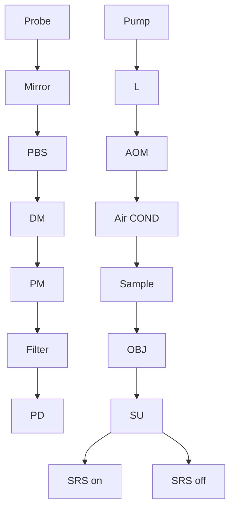
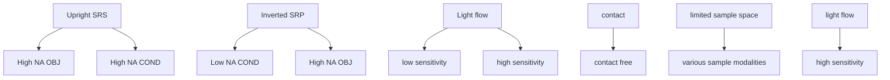

## RESEARCH

## Open Access

# Fiber laser based stimulated Raman photothermal microscopy towards a high-performance and user-friendly chemical imaging platform

Xiaowei Ge1†, Yifan Zhu1†, Dingcheng Sun2 , Hongli Ni1 , Yueming Li1 , Chinmayee V. Prabhu Dessai2 and Ji‑Xin Cheng1,2,3,4\*

† Xiaowei Ge and Yifan Zhu contributed equally to this work.

\*Correspondence: jxcheng@bu.edu

1 Department of Electrical & Computer Engineering, Boston University, Boston, MA, USA  
2 Department of Biomedical Engineering, Boston University, Boston, MA, USA  
3 Department of Chemistry, Boston University, Boston, MA, USA  
4 Photonics Center, Boston University, Boston, MA, USA

## Abstract

Stimulated Raman scattering (SRS) microscopy is a highly sensitive chemical imaging technique. However, the SRS imaging performance hinges on two key factors: the reli ance on low-noise but bulky solid-state laser sources and stringent sample requirements necessitated by high numerical aperture (NA) optics. Here, we present a fber laser based stimulated Raman photothermal (SRP) microscope that addresses these limitations. While appreciating the portability and compactness of a noisy source, fber laser SRP enables a two-order-of-magnitude improvement in signal to noise ratio over fber laser SRS without balance detection. Furthermore, with the use of low NA, long working distance optics for signal collection, SRP expands the allowed sample space from millimeters to centimeters, which diversifes the sample formats to multiwell plates and thick tissues. The sensitivity and imaging depth are further amplifed by using urea for both thermal enhancement and tissue clearance. Together, fber laser SRP microscopy provides a robust, user-friendly platform for diverse applications.

Keywords: Stimulated Raman, Photothermal microscopy, Chemical imaging, Labelfree

## Introduction

Bond-selective chemical imaging technologies are opening a new window to scrutinize molecular events in biological, environmental, and energy related systems  [1]. Of the various modalities, stimulated Raman scattering (SRS) microscopy allows high-throughput vibrational imaging, ofering linearity of signal intensity with chemical bond concentration [2, 3]. SRS microscope uses two synchronized pump and Stokes laser beams with their energy diference matching the Raman-active bond vibrational frequency [4]. Life science applications of SRS imaging include rapid label-free tissue diagnostics via stimulated Raman histology [4–6], imaging of altered cell metabolism in cancers, aging and neurodegenerative diseases [7–11], resolving microbial heterogeneity and drug response in a microbiome [12–15], and super-multiplex bio-imaging [16, 17].

Despite these advances, broader use of SRS microscopy is limited by the laser noise and the strict requirement for high numerical aperture (NA) light collection  [18]. Te shot noise originating from the local oscillator in SRS often dominates when a solidstate laser is used as the excitation source. With the recent trend of translational applications, ultrafast fber lasers ofer a solution with its portability and insensitivity to the environment [19]. However, the laser intensity noise in fber lasers poses a more prominent problem compared with shot noise, which signifcantly limits the imaging sensitivity  [20]. To address the noise problem, innovations such as balanced detection and quantum enhanced SRS have been developed [20–25]. Te balance detection approach could suppress the laser noise with the trade of increasing the shot noise by 3 dB [20]. However, this approach involves a complicated setup and is sensitive to environmental electronic noise, often yielding suboptimal performance, which limits the application to dense tissue samples. Quantum enhanced SRS with squeezed photons is a nice way to suppress the shot noise and 3.6 dB improvement was achieved [23]. However, with the setup complexity and vulnerability to optical loss characteristics, it is not capable of wide implementation, especially for translational usage in clinic.

Te second challenge in SRS microscopy lies in the requirement for a high NA objective for excitation and a high NA condenser for light collection. Te high NA objective is essential for achieving sufcient SRS intensity and subcellular resolution, while the high NA condenser ensures the full capture of the SRS signal, minimizes the cross-phase modulation (XPM), and maintaining the spectral fdelity [26, 27]. Typically, NAs greater than 1 are used, necessitating the use of immersion objectives and condensers with media such as water or oil. Tis setup restricts sample thickness to the millimeter scale and eliminates any air gap, limiting the adaptability of SRS microscopy to diverse sample types [28], including fow cytometer, multi-well plates, and cell ejection chips [28–30]. Furthermore, the intricate alignment required to overlap the tight foci of the objective and condenser during sample replacement is time-consuming and demands signifcant expertise.

Recently developed stimulated Raman photothermal (SRP) microscope [31] is a new form of stimulated Raman microscopy that leverages the high sensitivity of photothermal detection [31, 32]. In the SRS process, the pump and Stokes beams undergo intensity loss and gain, respectively, with the energy diference $( \hbar \omega _ { \mathrm { p } } - \hbar \omega _ { \mathrm { S } } )$ being transferred to the target molecule. Te subsequent vibrational relaxation generates heat, which negatively modulates the refractive index in the focus. In an SRP microscope, a third beam is employed to measure the resulting thermal lensing efect. Versatile applications on viral particles, cells, and tissues were demonstrated [31]. However, current SRP microscope deplovs a bulky free-space optical parametric oscillator (OPO) laser not suitable for clinical use. In addition, a high NA objective and an oil condenser was used for signal collection, making the SRP system not applicable to imaging live cells cultured in multiwell plates for high throughput measurements.

In this work, we report a fber laser SRP microscope that ofers both high sensitivity with operational simplicity, leveraging the three key advantages of SRP microscopy. First, the noise in SRP measurements is independent of the pump or Stokes beam, making the system highly resilient to the inherent laser noise of the compact fber laser sources. Tis eliminates the need for complex noise cancellation setups while enabling highly sensitive detection with fber laser system. Second, SRP detection does not require high NA light collection. Accordingly, our fber laser SRP system employs an inverted microscope confguration with low NA, long working distance light collection optics, enabling contactfree measurement of versatile samples and greatly improving the operational efciency. Tird, SRP enhances vibrational signal contrast and signifcantly boosts signal levels through thermal lensing detection, particularly in thermal enhancement media  [31, 33]. We found that urea, a tissue clearing agent, acts as an efective thermal enhancement medium for SRP, providing both signal amplifcation and imaging depth improvement  [34, 35]. Collectively, these advances establish a new platform technology with signifcant potential for both basic and clinical research.

## Results

## A fber laser SRP microscope

We developed the design (Fig. 1a) to utilize the advantages of SRP technology to push this next-generation chemical imaging microscope toward broad applications. For the laser source, we selected a compact, dual output, picosecond tunable fber laser (Picus Duo, Refned Laser Systems)  [36]. Te fber laser system Generates synchronized and tunable pump and Stokes beams, fast sweeping molecular vibrational frequency ranging from $7 0 0 ~ \mathrm { c m ^ { - 1 } }$ to 3100  cm−1 without any beam pointing issues (detailed benefts in Materials and methods). After the output of the  laser, both beams were expanded with a pair of lenses composite Keplerian beam expander. At the beam expander focus, acousto-optic modulators (AOM) modulated both beam with aligned frequency and phase, controlled by a function Generator. Te modulation on both beams can be controlled independently on and of, to fexibly adapt to avoid pump or Stokes non-resonant absorption-induced photothermal background contribution during SRP measurement.

flowchart

flowchart

text_image

C
33~160 pulses pair/cycle
Stokes
Pump
SRP on
Probe

Fig. 1 Schematic of a fber laser SRP microscope. a Fiber laser SRP setup. L: lens. AOM: acousto-optic modulator TL : translational lens. BS: polarized beam splitter. DM: dichroic mirror. SU: scanning unit. OB.J objective. COND: condenser. PD: photodiode. The red dashed line box illustrated the SRP optical contrast by detailed light path alternation due to the presence of the SRP induced thermal lens. b Comparison with upright SRS and inverted implemented SRP. c Modulated Stokes and pump pulses induced SRP signal detected by the probe beam. The SRP signal shows a clear thermal heat accumulation and decay signature

Ten the two beams were colinearly combined together with a dichroic mirror. A 765 nm continuous wave (CW) probe laser, ofering signifcantly improved noise performance compared to the fber laser source, was frst expanded through a Keplerian beam expander. Te second lens of this expander was mounted on a translational stage, allowing control over the distance between the two lenses and, consequently, the divergence of the probe laser and its relative focal position to the pump and Stokes beams foci of the objective. Te ofset allows the probe beam to experience a spatially varying phase shift, which maximizes the interaction between the thermal induced refractive index gradient and the probe beam, thus amplifying the thermal lensing efect and improving the detection of small temperature variations or weak absorptions  [31, 32, 37]. Te probe laser was then combined with the pump and Stokes beams using a polarization beam splitter and the same dichroic mirror used for pump and Stokes beams. Te three collimated beams were directed into a scanning unit equipped with a pair of galvo mirrors, conjugated to the back aperture of the objective in the microscope by a four focal length relay (4f ) system, to facilitate laser scanning imaging.

To confgure the microscope favorably for clinical use, versatile sample types, and ensure the compatibility with commercialized microscopy systems such as confocal fuorescence microscopes, an inverted microscope confguration was implemented [38, 39]. To leverage the advantage that SRP does not require high NA collection, a low NA, long working distance air condenser was used on the top for light collection. Te long working distance simplifes sample change without necessitating optical adjustments. It also accommodates thick samples, dry samples or more advanced multi-well cell culture plates (Fig. S1), ensuring that the SRP microscope is well suited for both research and clinical applications. Tis confguration is advantageous over SRS microscopes (Fig. 1b), which typically requires high NA oil condenser for signal collection, to avoid crossphase modulation [26]. In the inverted SRS microscope confguration, oil condenser is on the top. It impedes the measurement on cell culture dishes containing aqueous solutions which are crucial for biology study. While in the upright SRS microscope confguration, the system will be limited to water obiective when measuring cell culture dish samples (Fig. 1b) and tend to cause sample contaminations. Under both schemes, SRS needs to re-adjust the optics each time changing the sample, due to the narrow sample space caused by the two high NA optics. More details are provided in a later session. Te microscope includes a 3-dimension motorized sample stage, enabling automated sample imaging and large-area mapping. After the light collection by the low NA condenser, the probe beam was fltered out optically and electronically, and fnally input into a lock-in amplifer to detect the modulation transfer from the pump and/or Stokes beams (Fig. 1c).

## Thermal lensing simulation to determine the optimal NA for SRP signal collection

To examine the NA required for optimal contrast in SRP microscopy and to estimate the performance of SRP under the conditions provided by a fber laser system, we conducted thermal lensing simulations (Fig.  2). To provide the energy deposition information for SRP simulation, frst, we measured the SRS modulation depth in a fber laser system at its normal operation power, which usually does not cause any biological sample burning or detector saturation. With the fber laser 40 MHz dual output, an unmodulated 28 mW pump beam and a 90 mW 50%-duty cycle modulated Stokes beam on the sample, the SRS modulation on pump beam was measured to be 0.72% when targeting the carbonhydrogen (C-H) bond in pure dimethyl sulfoxide (DMSO) at $2 9 1 2 \ \mathrm { c m } ^ { - 1 } \left( \mathrm { F i g } . \mathrm { S } 2 \mathrm { a } \right)$ . Tis corresponds to an energy deposition of 2.33 pJ per pulse pair with this 40  MHz fber laser source.

line chart

| Angle (degree) | SRS on (arb. unit) | SRS off (arb. unit) | Diff (arb. unit) |
| -------------- | ------------------ | ------------------- | ---------------- |
| -50            | ~0                 | ~0                  | ~0               |
| 0              | ~6×10⁻⁷            | ~6×10⁻⁷             | ~2×10⁻⁸          |
| 50             | ~0                 | ~0                  | ~0               |

Fig. 2 Simulated SRP induced temperature increasement and probe light far feld distribution. a SRS induced focus temperature increase with 28 mW pump and 180 mW stokes on sample for 8 μs. b Far feld distribution of the probe beam with SRS on (blue solid line), of (blue dashed line), and diference (Dif ) between on and of states (red line)

Using this energy deposition through stimulated Raman vibrational absorption, we calculated the induced temperature increase as a function of space, based on the thermal properties of DMSO (Table S1). Te results indicate that the temperature increase can reach up to 4 Kelvins at the center of the focus (Fig. 2a), demonstrating signifcant thermal efects induced by the SRS process using a fber laser system. By converting the temperature change to a refractive index change $\begin{array} { r } { ( \Delta n = \Delta T \cdot \frac { d n } { d T } } \end{array}$ , where $\frac { d n } { d T }$ is the thermo-optic coefcient), we were able to map the refractive index changes as a function of space, which efectively constituted a thermal lens. By simulating a focused beam of light propagating through the thermal lens, we obtained the changes in the far-feld probe light distribution resulting from thermal lens efects induced by SRS [31]. Te farfeld probe light distribution was then simulated under conditions of SRS on and SRS of to determine the necessary NA for efective SRP measurement (Fig. 2b, see details in Materials and methods section). The simulations revealed that an NA of 0.32 is required to achieve the maximum contrast between the SRS on and of conditions in the DMSO C-H measurement. With this confguration, SRP measurement on the probed beam could have a modulation depth of 3.3% (Fig. S2b) at 125  kHz modulation frequency, which shows a decent modulation depth increment by implementing SRP on the fber laser system.

Tis information is critical for guiding the confguration of the SRP system to ensure optimal signal detection and contrast, thereby enhancing the overall performance of SRP microscopy for various applications. Te condenser used in our setup is a 28 mm long working distance air condenser, with a tunable NA up to 0.55 (Nikon), providing fexibility for testing various samples while maintaining the long working distance feature.

## Performance of the fber laser SRP microscope

To optimize the measurement conditions for our SRP system and compare its sensitivity with previous fber laser-based, autobalanced detected SRS [22], we conducted a series of tests to characterize SRP sensitivity. Specifcally, we examined the SRP on DMSO for signal-to-noise ratio (SNR) dependence on duty cycle and modulation frequency. With conserved laser peak power, the optimal performance was achieved with a 50% duty cycle. Notably, the laser peak power is conserved in this comparison, due to the relatively low available laser power and negligible photodamage of the fber laser. In this case, higher excitation duty cycle, although leads to insufcient cooling, could provide higher total energy deposition hence better signal. Te optimal modulation frequency in fber laser SRP is 600 kHz, infuenced by the probe laser’s performance. Tese conditions provided the highest SNR, demonstrating the system’s sensitivity and potential for various applications (Fig. 3a, b). Te comparison with fber laser SRS showed that our SRP system ofers signifcantly improved sensitivity, achieving an \~ 12-fold improvement over autobalanced detected SRS and \~ 105-fold improvement over SRS in terms of SNR for DMSO (Fig. S3). With the serial dilution measurement, we determined the C-H and carbon-deuterium bond (C-D) region limit of detection (LOD) by DMSO and its deuterated counterpart (DMSO-d6) when diluting with each other (Fig. 3c, d). Te LOD of a 20 us/wavenumber measurement in C-H region is 11.13 mM with DMSO diluted with DMSO-d6. Te LOD in C-D region is 13.77 mM with DMSO-d6 diluted with DMSO.

SRP microscopy benefits from the confined nonlinear excitation at the SRS focus and the third beam probing geometry, leading to improved resolution that can reveal fne structures in biological samples. To characterize the system’s resolution, we measured and deconvoluted the point spread function using 100  nm polymethyl methacrylate (PMMA) beads at $2 9 5 0 \mathrm { c m } ^ { - 1 }$ in the C-H region. Te results demonstrated a spatial resolution of 240 nm and an axial resolution of 0.82 um (Fig. 3e-h, Fig. S4). These results are consistent with the high-resolution capabilities observed in the previous study [31], where SRP showed superior spatial resolution compared to SRS, providing sharper imaging of fne structures such as tiny microbiome and subcellular organelles. Tis high resolution underscores the capability of SRP microscopy to provide detailed imaging of small features, making it a valuable tool for studying intricate biological structures and potentially enhancing the understanding of cellular and subcellular processes.

## SRP preserves spectral fdelity under low NA light collection condition

To demonstrate the capability of fber laser SRP for imaging under low NA light collection conditions, we conducted spectral fdelity characterization of SRP and SRS (in stimulated Raman loss regime) microscopy. Using an air condenser with a NA of 0.55, we imaged 500 nm polymethyl methacrylate (PMMA) beads dried on a coverslip (Fig. 4a). The SRP imaging clearly resolved the beads and maintained their profile for size and shape (Fig. 4b). In contrast, the autobalanced-detected SRS image (Fig. 4c) of the same beads within the same feld of view exhibited blurred spatial information and artifacts arising from other non-energy-absorbing parametric processes, such as four-wave mixing. Te spectral data obtained from SRP and SRS imaging of the PMMA beads were compared to the spontaneous Raman spectrum of PMMA. Te results (Fig. 4d) show that only SRP preserves the spectral information well under low NA light collection conditions, closely matching the spontaneous Raman reference. Collectively, these data demonstrate that SRP can maintain spectral fdelity and imaging quality when operating with low NA, large working distance light collection optics, making it suitable for various applications where thin or contact sample is not feasible.

a  

line chart

| Duty cycle (%) | SNR   | Intensity (a.u.) |
| -------------- | ----- | ---------------- |
| 1              | 500   | 0.005            |
| 5              | 1500  | 0.007            |
| 10             | 2000  | 0.008            |
| 15             | 2500  | 0.010            |
| 20             | 3000  | 0.012            |
| 25             | 3500  | 0.014            |
| 30             | 4000  | 0.016            |
| 35             | 4500  | 0.018            |
| 40             | 5000  | 0.020            |
| 45             | 5500  | 0.022            |
| 50             | 6000  | 0.024            |

b  

bar-line hybrid chart

| Modulation frequency (kHz) | SNR (Signal) | SNR (Noise) | std (a.u.) |
| -------------------------- | ------------ | ----------- | ---------- |
| 100                        | 4000         | 70          | 0.02       |
| 200                        | 5000         | 50          | 0.015      |
| 300                        | 5500         | 35          | 0.01       |
| 400                        | 5200         | 25          | 0.008      |
| 500                        | 5800         | 20          | 0.007      |
| 600                        | 6000         | 15          | 0.006      |
| 700                        | 5500         | 12          | 0.005      |
| 800                        | 5200         | 10          | 0.004      |

C  

line chart

| Wavenumber (cm⁻¹) | Intensity (a.u.) |
| ----------------- | ---------------- |
| 2110              | 0.45             |
| 2130              | 0.45             |

d  

line chart

| Wavenumber (cm⁻¹) | 1260 mM | 420 mM | 140 mM | 46.62 mM | 15.54 mM | 5.18 mM | 1.68 mM | 0 mM |
| ----------------- | ------- | ------ | ------ | -------- | -------- | ------- | ------- | ---- |
| 2800              | ~0      | ~0     | ~0     | ~0       | ~0       | ~0      | ~0      | ~0   |
| 2850              | ~0      | ~0     | ~0     | ~0       | ~0       | ~0      | ~0      | ~0   |
| 2900              | ~9.5    | ~3.5   | ~1.5   | ~1.5     | ~1.5     | ~1.5    | ~1.5    | ~1.5 |
| 2950              | ~1.5    | ~1.5   | ~1.5   | ~1.5     | ~1.5     | ~1.5    | ~1.5    | ~1.5 |
| 3000              | ~1.5    | ~1.5   | ~1.5   | ~1.5     | ~1.5     | ~1.5    | ~1.5    | ~1.5 |
The inset zooms into the 2900–2920 range, showing a zoomed-in view of the 2900–2920 region. The right panel displays a linear trend on the y-axis labeled 'Intensity (a.u.)' against 'Concentration (mM)'. The data points are labeled with their respective concentrations.

e  

line chart

| Spatial (nm) | Intensity (a.u.) |
| ------------ | ---------------- |
| 0            | 0.0              |
| 500          | 1.0              |
| 1000         | 0.0              |

g  
  
h

  
Fig. 3 Sensitivity and spatial resolution of fber laser SRP. a SRP signal duty cycle and modulation frequency dependency. b SNR under diferent modulation frequency. c Spectral fdelity (left) and intensity-concentration relation (right) of serial diluted dimethyl sulphoxide-d6 (DMSO-d6) dissolved in DMSO. Data represents 400-pixel averages from measurements with a 20 μs pixel dwell time. d Spectral fdelity (left) and intensity-concentration relation (right) of serial diluted DMSO dissolved in DMSO-d6. Data represents 400-pixel averages from measurements with a 20 μs pixel dwell time. e SRP lateral imaging of 100 nm PMMA beads in glycerol-d8 agar. Scale bar: 300 nm. f Gaussian ftting of profle by the white dash line in e. g SRP axial imaging of 100 nm PMMA beads in glycerol-d8 agar. Scale bar: 300 nm. h Gaussian ftting of profle by the white dash line in g

## SRP imaging cellular composition and dynamics in aqueous environment

To show biological applications of fber laser SRP, we applied our system to image intracellular cellular composition and dynamics of live cells in an aqueous environment, as demonstrated in Fig. 5. Samples were prepared in glass-bottom dishes with an open top, using phosphate-bufered saline (PBS) as the immersion medium to maintain cell shape and viability (see Materials and Methods). In SRS, cell imaging is often performed using an upright microscope equipped with a water immersion objective (Fig.  1b). Te SRS setup typically requires the objective to be dipped into the sample to achieve the necessary working distance, which can lead to sample contamination. Additionally, the objective must be elevated to change samples, which disrupts the optical path and necessitates readjustments with each sample change. In contrast, our fber laser SRP system is designed with an inverted microscope confguration (Fig. 1b), providing a 28 mm air gap between the sample and the light collection optics. Tis design allows for contact-free imaging, minimizing the risk of contamination and simplifying the process of changing samples without the need to adjust the optics.

a  

text_image

2 3 4
NA O 0.55
Air condenser
Sample
Objective

b  

c  

d  

line chart

| Wavenumber (cm⁻¹) | SRS   | SRP   | Raman |
| ----------------- | ----- | ----- | ----- |
| 2850              | 0.6   | 0.1   | 0.0   |
| 2875              | 0.6   | 0.1   | 0.0   |
| 2900              | 0.8   | 0.2   | 0.1   |
| 2925              | 1.0   | 0.4   | 0.3   |
| 2950              | 0.8   | 0.9   | 0.7   |
| 2975              | 0.5   | 0.4   | 0.3   |
| 3000              | 0.3   | 0.2   | 0.4   |
| 3025              | 0.1   | 0.1   | 0.1   |
| 3050              | 0.1   | 0.1   | 0.1   |
| 3075              | 0.1   | 0.1   | 0.1   |
| 3100              | 0.1   | 0.1   | 0.1   |
| 3125              | 0.1   | 0.1   | 0.1   |
| 3150              | 0.1   | 0.1   | 0.1   |
| 3175              | 0.1   | 0.1   | 0.1   |
| 3200              | 0.1   | 0.1   | 0.1   |
| 3225              | 0.1   | 0.1   | 0.1   |
| 3250              | 0.1   | 0.1   | 0.1   |
| 3275              | 0.1   | 0.1   | 0.1   |
| 3300              | 0.1   | 0.1   | 0.1   |
| 3325              | 0.1   | 0.1   | 0.1   |
| 3350              | 0.1   | 0.1   | 0.1   |
| 3375              | 0.1   | 0.1   | 0.1   |
| 3400              | 0.1   | 0.1   | 0.1   |
| 3425              | 0.1   | 0.1   | 0.1   |
| 3450              | 0.1   | 0.1   | 0.1   |
| 3475              | 0.1   | 0.1   | 0.1   |
| 3500              | 0.1   | 0.1   | 0.1   |
| 3525              | 0.1   | 0.1   | 0.1   |
| 3550              | 0.1   | 0.1   | 0.1   |
| 3575              | 0.1   | 0.1   | 0.1   |
| 3600              | 0.1   | 0.1   | 0.1   |
| 3625              | 0.1   | 0.1   | 0.1   |
| 3650              | 0.1   | 0.1   | 0.1   |
| 3675              | 0.1   | 0.1   | 0.1   |
| 3700              | 0.1   | 0.1   | 0.1   |
| 3725              | 0.1   | 0.1   | 0.1   |
| 3750              | 0.1   | 0.1   | 0.1   |
| 3775              | 0.1   | 0.1   | 0.1   |
| 3800              | 0.1   | 0.1   | 0.1   |
| 3825              | 0.1   | 0.1   | 0.1   |
| 3850              | 0.1   | 0.1   | 0.1   |
| 3875              | 0.1   | 0.1   | 0.1   |
| 3900              | 0.1   | 0.1   | 0.1   |
| 3925              | 0.1   | 0.1   | 0.1   |
| 3950              | 0.1   | 0.1   | 0.1   |
| 3975              | 0.1   | 0.1   | 0.1   |
| 4000              | 0.1   | 0.1   | 0.1   |
| Note: The data is already in the required format for visual comparison of SRS and SRP data points at specific wavenumbers (e.g., cm⁻¹). The values for SRS and SRP are estimated based on the provided code.

Fig. 4 Spectral fdelity characterization of SRP and SRS under low NA light collection condition. a Imaging condition of SRP or SRS (in stimulated Raman loss regime) using an air condenser. b SRP imaging of 500 nm PMMA beads dried on the coverslip. Scale bar: 500 nm. c SRS with autobalanced detection imaging of 500 nm PMMA beads dried on the coverslip with the same FOV as in a. Scale bar: 500 nm. d Spectrum of PMMA beads measured by SRP and SRS in a and b in white dashed circles with the comparison to the spontaneous Raman spectrum of PMMA

a  

natural_image

Fluorescent microscopy image showing a cell nucleus with green fluorescent markers, labeled 'Sum' (no text or symbols beyond label)

c  

natural_image

Fluorescence microscopy image showing green-labeled cholesterol protein structures against a black background (no text or symbols)

e  

natural_image

Microscopic image of red-stained biological cells with a vertical 'Protein' label on the right side (no other text or symbols)

g  

natural_image

Fluorescent microscopy image of a biological specimen with scattered colorful spots, color-coded by 15s time scale (no text or symbols)

b  

natural_image

Fluorescent microscopy image of a composite tissue sample showing purple-stained cells with green cytoplasmic markers (no text or symbols)

text_image

Fatty acid

natural_image

Fluorescent microscopy image showing blue-stained cell nuclei against a dark background, with 'Nucleus' label on the right side (no other text or symbols)

Fig. 5 SRP imaging of cellular composition and dynamics in aqueous environment. a-f Fixed cell imaging in PBS immersion condition with LASSO provided chemical maps. Scale bar: 8 μm. g Live cell SRP imaging with color coded Lipid movement at 2930 cm−1, plot with logarithmic scale to feature weak features on membrane. Scale bar: 8 μm

Using hyperspectral SRP in the C-H region $( 2 7 9 0 ~ \mathrm { c m } ^ { - 1 } \mathrm { t o } ~ 3 0 3 0 ~ \mathrm { c m } ^ { - 1 } ) \mathrm { { \Omega } _ { \mathrm { m } } ^ { - 1 } \mathrm { { t o } ~ 3 0 3 0 ~ \mathrm { c m } ^ { - 1 } ) _ { \mathrm { { t } } } } }$ , we mapped key biochemical components—including cholesterol, proteins, lipids, and nuclear-specifc regions—in fxed T24 bladder cancer cells. Te chemical maps generated through least absolute shrinkage and selection operator (LASSO) analysis exhibited high spatial and chemical contrast  [40], ofering a detailed view of subcellular organization (Fig.  5a-f, Fig. S5, see Materials and Methods). Moreover, the fber laser SRP system proved its robustness by enabling real-time imaging of live cell dynamics, specifcally capturing lipid movement  [41]. In live cell imaging, we achieved a speed of 1 frame per second with a 20 µs pixel dwell time, imaging a 200 by 200 pixels area. Tis setup allowed us to clearly visualize the live cells subcellular components, as well as the dynamic trajectories of lipids (Fig. 5g). Te ability to perform live cell imaging while maintaining cell viability underscores the advantages of SRP over traditional methods, particularly in preserving cellular integrity and monitoring dynamic processes in vitro.

## Highly sensitive SRP imaging of cell metabolism

Understanding metabolism at single cell level is crucial to biological research, and vibrational imaging has become a key technique for this purpose [2, 42]. Fiber laser SRP ofers a highly sensitive tool for studying cellular metabolism. We demonstrate that immersing biological samples in a biocompatible medium with low heat capacity and high thermooptic coefcients, such as glycerol and urea, can signifcantly enhance SRP contrast. Tis enhancement allows for sensitive imaging of metabolites, particularly in the silent window where carbon-deuterium bond (C-D) stretching vibration resides.

Figure 6a-h illustrates the application of SRP imaging to investigate lipid metabolism in oleic $\mathrm { a c i d - d _ { 3 4 } \ ( O A \mathrm { - } d _ { 3 4 } ) }$ -treated T24 bladder cancer cells (see Materials and Methods). Te SRP images (Fig. 6a-d) of $\mathrm { O A } { \cdot } \mathrm { d } _ { 3 4 }$ treated T24 cells immersed in glycerol reveal subtle features in the cytoplasm and the membrane when captured with both parallel and orthogonal pump and probe beam polarizations at $2 1 0 5 ~ \mathrm { c m } ^ { - 1 }$ and $2 2 0 5 ~ \mathrm { c m } ^ { - 1 }$ . Te logarithmic scale plots highlight the contrast diference across diferent polarization conditions. Te spectra of lipid droplet in white dashed circle in Fig. 6a-d under these conditions is presented in Fig. 6e, showing the polarization dependence of the symmetric and asymmetric stretching bands, providing insights into the molecular orientation and environment within the cell [43].

We further explored the cell metabolic activity by imaging newly synthesized C-D bonds in the treated cells, using urea as the immersion medium, to monitor C-D and C-H in the same cell [34]. Te silent region at 2105 cm−1 (Fig. 6f ) and the C-H region at $2 9 3 0 \mathrm { c m } ^ { - 1 }$ , corresponding to proteins and lipids (Fig. 6g), were used to reveal the distribution of these biomolecules. Te overlay of these images (Fig. 6h) confrms the colocalization of newly synthesized lipids, demonstrating the capability of SRP to capture metabolic processes in both C-D and C-H regions simultaneously.

Te advantages of SRP in thermal-enhancing media are further highlighted by the detailed imaging of two connected T24 cells (Fig.  6i). Immersion in urea solution allowed us to visualize intricate membrane connections and lipid distributions within cell protrusions (Fig. 6j). Te intensity profle along a selected line (Fig. 6k) quantitatively confrms the enhanced signal achieved with urea, reinforcing its utility in SRP imaging.

a  

text_image

2105 cm⁻¹
Pump ↑ Stokes ↑

b  

text_image

2205 cm⁻¹
Pump ↑ Stokes ↓
Pump ↑ Stokes ↓

e  

line chart

| Wavenumber (cm⁻¹) | C-D₂ asymmetrist stretching | Cross polarized |
| ----------------- | --------------------------- | -------------- |
| 2000              | ~0.0                        | ~0.0           |
| 2105              | ~1.8                        | ~0.3           |
| 2205              | ~0.3                        | ~0.3           |

c  

text_image

2105 cm⁻¹
Pump ↓ Stokes ↔

d  

text_image

2205 cm⁻¹
Pump ↓ Stokes ↔
Pump ↑ Stokes ↓

h  

text_image

C-H 2930 cm-1
C-D
C-H

4  

natural_image

Microscopic image showing scattered green fluorescent dots against a black background (no text or symbols)

g  

natural_image

Microscopic image of red fluorescent cells with scale bar indicating C-D 2105 cm⁻¹ (no text or symbols beyond label)

line chart

| Profile (nm) | Intensity (arb. unit) |
| ------------ | --------------------- |
| 0            | 0.1                   |
| 500          | 0.3                   |
| 1000         | 0.35                  |
| 1500         | 0.25                  |
| 2000         | 0.65                  |
| 2500         | 0.3                   |
| 3000         | 0.35                  |
| 3500         | 0.4                   |
| 4000         | 0.15                  |
| 4500         | 0.15                  |

i  

natural_image

Fluorescent microscopy image of cells with green-labeled nuclei, showing cytoplasmic structures (no text or symbols)

natural_image

Microscopic image of a biological structure with fluorescent staining (no visible text or symbols)

k  
Fig. 6 Silent window metabolism imaging by SRP in a photothermal enhancing medium. a-d Oleic acid- $\cdot { \mathrm d } _ { 3 4 }$ $\mathrm { ( O A - d _ { 3 4 } ) }$ ) treated T24 bladder cancer cells with parallel (a,b) or orthogonal (c,d) pump and probe beams excite at 2105 cm−1 (a,c) or $2 2 0 5 \mathrm { c m } ^ { - 1 }$ (b,d). Plot with logarithmic scale to feature weak features on the cytoplasm and membrane. The contrast is the same under same polarization condition. Scale bar: 10 μm. e The spectra of the lipid droplet in the dashed circle in a-d inside $\mathrm { O A - d } _ { 3 4 }$ treated T24 cell under diferent polarization condition. f Silent region imaging of the newly synthesized lipid droplets of the $O A \cdot d _ { 3 4 }$ treated T24 bladder cancer cell at 2105 cm−1. Urea solution was used as the immersion medium. g C-H region imaging of the same cell in f, mapping the protein and Lipids distribution at 2930 cm−1. h Composite of f and g, show colocalization of the newly synthesized biomolecules. Scale bar: 10 μm. i C-H region imaging at $2 9 3 0 { \ c m } ^ { - 1 }$ of a connected T24 cell immersed in urea solution. Scale bar: $1 0 \mu \mathrm { m } .$ j Zoom in of the box in i, showing detailed membrane connection and Lipid allocation in the cell protrusion. Scale bar: 10 μm. k Profle intensity of the line in j

Together, these fndings highlight the sensitivity of SRP imaging in detecting subtle spectral diferences, such as those observed in OA-d34-treated cells under diferent polarization excitations, while also demonstrating the capability for simultaneous C-D and C-H imaging. Te use of the immersion medium further enhances sensitivity, enabling the detailed observation of fne cellular features, particularly in membranes and lipid droplets.

## Volumetric SRP histology with tissue cleared rat brain

Vibrational chemical microscopy plays a crucial role in tissue imaging by enabling the label-free visualization of molecular structures, allowing researchers to capture intricate chemical compositions of biological tissues without the need for external dyes or markers [44, 45]. Tis technique is especially valuable for revealing detailed spatial distributions of biomolecules, such as lipids and proteins, in both healthy and diseased tissues, ofering profound insights into cellular processes and disease pathology at a subcellular level  [6]. To demonstrate the SRP system’s potential to achieve high-resolution, three-dimensional histological mapping of complex tissue structures, we implemented volumetric SRP imaging of urea-cleared rat brain slices. Tis approach leverages SRP’s strong spatial and axial sectioning abilities. Moreover, the use of a tissue-clearing agent urea [34], not only improves the imaging depth but also increases signal sensitivity due to its favorable thermal properties compared to water. Te developed fber laser SRP system employs a sequential scanning strategy, beginning with spatial x-y scanning by galvo mirrors, followed by wavenumber-specifc imaging, FOV adjustments for large area mapping, and fnally depth scanning in the z-direction, as outlined in Fig. 7a.

Te fber laser SRP system accommodates multiple scanning modes, including singlecolor, two-color, and hyperspectral imaging, enabled by the fast wavelength tuning fber laser source (see Materials and Methods) [36]. Each mode provides distinct insights into the urea cleared brain’s microarchitecture. Te single-color mode at $2 9 3 0 \ \mathrm { c m } ^ { - 1 } \left( \mathrm { F i g . 7 b } \right)$ highlights the general structure of the brain tissue by targeting C-H bonds prevalent in biomolecules, ofering an overview of the biological matrix with fne resolution to even visualize the axions and dendrites of neurons (Fig. S6). We can see the diferent distribution of proteins and lipids in axon and dendrite, which is clear reflection of the fact that neurons have a highly diferentiated structure with a preference for diferent molecule transportation. Tese regions are morphologically and functionally distinct, so the transport of substances must be precisely directed to specifc locations to ensure proper nerve cell function. Te two-color mode $( 2 8 5 0 ~ \mathrm { c m } ^ { - 1 }$ and $2 9 3 0 ~ \mathrm { c m } ^ { - 1 } )$ facilitates the diferentiation of cell bodies from the extracellular matrix by analyzing the ratio of these two signals, thus generating a detailed histological map of diferent brain regions (Fig. 7c). Te hyperspectral mode, which fully samples the C-H stretching region, enables comprehensive biomolecular decomposition by referencing standard spectra of key components including cholesterol, proteins, fatty acids, and nucleic acids, thereby enhancing the specifcity of cellular and subcellular mapping (Fig. 7d and Fig. S7). Furthermore, the fber laser enabled fast scanning of the whole Raman spectral region $( 7 0 0 - 3 2 0 0 ~ \mathrm { c m } ^ { - 1 } )$ , including the fngerprint region (Fig. S8), which could provide more insight into subtype lipids and other biomolecules [46, 47]. This level of detail is crucial in neuroscience, where distinguishing between diferent cell types, such as neurons and glial cells, ofer a way for understanding functional brain organization and pathology [6].

Te 300 μm thick rat brain tissue was cleared using an 8 M urea solution, following a protocol established by Mian Wei et al. [34] Tis approach extended the SRP imaging depth to over 200 μm (Fig. 7e, f, Video S1), constrained mainly by the working distance of the imaging objective. Urea, with its lower heat capacity relative to water, also contributes to the enhanced SRP signal strength, thereby improving overall imaging sensitivity. In Fig.  7g-h, the system’s histological capabilities are exemplifed through imaging the

a  

text_image

Stage scan
x-y Galvo scan
z
λ

e  

natural_image

3D fluorescent microscopy image showing green-labeled cellular structures against a dark background, with XYZ axis indicators (no text or symbols)

line chart

| Depth (μm) | Intensity (arb. unit) |
| ---------- | --------------------- |
| 0          | 0.6                   |
| 50         | 0.4                   |
| 100        | 0.3                   |
| 150        | 0.2                   |
| 200        | 0.1                   |

b  

natural_image

Fluorescence microscopy image showing cellular structures with green emission, scale bar 2930 cm⁻¹ (no text or symbols)

c  

natural_image

Fluorescence microscopy image showing green and orange cellular structures labeled 'Cell body Extracellular Matrix' (no text or symbols beyond labels)

d  

natural_image

Fluorescence microscopy image showing cellular structures with labeled components: Cholesterol, Fatty acid, Protein, and Nucleus (no text or symbols beyond labels)

g  

natural_image

Microscopic cross-section images of two biological samples showing green fluorescent cells on a brown matrix, with no visible text or symbols.

h

natural_image

Microscopic images of two material surfaces showing elongated structures with color-coded depth scale (0–20 μm), no text or symbols present.

Fig. 7 Volumetric SRP imaging of rat brain slice with tissue clearance. a Illustration of volumetric SRP imaging sequence: spatial x-y (galvo scan) λ scan large FOV (stage scan) z scan. b Single-color SRP image of a urea-cleared rat brain sample at 2930 cm−1. c Two-color SRP histology at the same FOV as in b. d Biomolecule decomposition by hyperspectral SRP in C-H region. Scale bar: 5 μm. e Depth-resolved SRP imaging of urea-cleared rat brain at 2930 cm−1. Depth: 200 μm. Scale bar: 10 μm. f Average intensity of each frame in the depth-resolved image in e. g Two-color SRP histology of one layer in cerebral cortex. Region 1: V2MM outer region, closer to scalp. Region 2: V2MM inner region, close to corpus callosum. Locations are illustrated in a. Scale bar: 50 μm. h Single-color depth-resolved SRP image of V2MM at 2930 cm−1 in the same location as in g. Depth scan range: 20 μm. Scale bar: 50 μm

V2MM region of the rat brain, with distinct views of the outer region near the scalp (Region 1) and the inner region adjacent to the corpus callosum (Region 2). Te twocolor SRP histology clearly delineates cell bodies from the extracellular matrix (Fig. 7g), providing crucial information on neuron density across diferent brain layers (Fig. S9). Other brain functional regions are examined and showed distinct cell distributions (Fig. S10). Moreover, with depth-resolved information (Fig. 7h, Video S2, Video S3), a comprehensive view of the brain map could be visualized without the need of slicing the brain layer by layer. In particular, the myelin sheath and Schwann cell could be clearly visualized as it has high amount of lipids. To summarize, volumetric SRP provides a fast way visualizing the complex neural network inside the brain without the need for physical sectioning. Our results demonstrate that with tissue clearance, the fiber laser SRP system successfully extends the imaging depth, allowing clear visualization of features across diferent brain regions in a three-dimensional context. Tis approach not only captures fne subcellular structures but also ofers a non-invasive method to explore intricate brain architectures, ofering the potential of understanding neural functions and pathologies with high speed.

## Fiber laser SRP tissue imaging with low NA, long working distance objective

Although the incorporation of low NA condenser has relaxed the sample format requirements on the detection side, the high NA objective on the illumination side still only allows shallow working distance. A low NA, long working distance objective in fber laser SRP could provide sufcient space on both sides of the sample, making it more fexible for the format of samples. To demonstrate the compatibility of fber laser SRP with low NA, objectives, we performed SRP imaging with a 0.45 NA, 6.6 mm working distance objective (Olympus LUCPLFLN20X). It is interesting to note that, with reduced illumination NA, the focal spot size of SRS excitation increases drastically, which leads to a reduced cooling rate. Terefore, a lower modulation frequency (60 kHz) is chosen to allow sufcient cooling and improve the signal. As shown in Fig. S11a-b, with 3 μm PMMA particle as a test bed, low NA fber laser SRP could resolve the particles very well with the Raman spectrum at C-H region well captured. We then demonstrated low NA fber laser SRP on mouse brain slice, as shown in Fig. S11c-e. Te contrast is majorly from myelin sheath in the brain, where the protein rich (e.g. ROI1) and lipid rich (e.g. ROI2) regions could be well-diferentiated from their spectrum. Notably, the very bright spots in the FOVs are arising from the linear absorption photothermal signals of residual red blood cells in brain blood vessels. Collectively, fber laser SRP is compatible with low NA, long working distance objectives, allowing more fexibility sample formats.

## Discussion

We have reported a fber laser SRP microscope with high sensitivity, ease of operation, and broad compatibility with various biological samples. Fiber laser SRP ofers 1 \~ 2 orders SNR improvement over SRS using the same fber laser. Our results highlight the fber laser SRP system’s ability to perform metabolic analysis of cells in aqueous environment. Moreover, synergistic integration with tissue clearance agent as a thermal enhancing medium allows volumetric SRP imaging with enhanced depth and resolution, achieving three-dimensional histological mapping in cleared rat brain.

Te fber laser SRP system addresses a few challenges associated with SRS microscopy, including the laser intensity noise and the need for high NA Light collection. Unlike SRS counterpart, which often sufers from noise in the excitation laser, fber laser SRP leverages a third probe beam for thermal lensing detection, making the measurement less sensitive to noise in the pump and Stokes beams. Tis noise resilience simplifes the detection, eliminating the need for complex noise cancellation strategies such as autobalanced detection. Consequently, this fber laser SRP system achieves a superior signal-to-noise ratio and sensitivity with a fber laser. Tis technology ofers several key strengths. First, the use of a fber laser source makes the fber laser SRP system compact, robust, and portable, suitable for both laboratory and clinical environments. Second, the rapid wavelength tuning capability, covering the Raman spectral range from 700 to $3 2 0 0 ~ \mathrm { c m } ^ { - 1 }$ within milliseconds, facilitates comprehensive chemical mapping, including functional studies and phenotypic linkage identifcation through fngerprint region imaging. Tird, the inverted microscope confguration with low NA and long working distance optics allows for contact-free imaging, signifcantly reducing sample handling challenges and enabling easy integration with commercialized confocal microscopy setups. Fourth, the scattering nature of SRP measurement permits epi-detection, paving the way towards in vivo coherent Raman imaging without cross-phase modulation background. Te system’s compatibility with various advanced testing methods, such as fow cytometry, multi-well-plate-based assays, and cell ejection setups, enhances its versatility. Tese features collectively position the fber laser SRP microscope as a platform for a wide range of applications, from single-cell analysis to tissue diagnostics.

Tere are spaces to further improve the system performance. First, due to the laser availability in lab, a narrow Linewidth 765 nm CW laser with a long coherence length was used as the probe laser and introduced interference patterns when imaging samples with abrupt refractive index changes, such as at water-cell interfaces. Tis issue was mitigated by spatial oversampling and median fltering, while short coherence length laser could avoid this pattern from generation [31]. Second, the power limitations of the fber laser used in the paper restrict the ability to employ lower duty cycles [31], which could enhance the SRP efect with the same average power on sample but higher energy deposition with higher peak power due to the nonlinearity of the SRS process. Adjusting the laser confguration, such as utilizing lower repetition rates or burst modes, could improve the sensitivity and overall performance of the SRP system [31]. Tird, the heat caused from dissipative processes, such as multiphoton absorption, transient absorption, overtone absorption involved with the modulated beam will contribute to the background [48–50]. For the samples that sufer from other absorption processes, we only modulated pump or Stokes to fexibly avoid one of the beams contributed photothermal signal. For further reduction of the background, separating pump and Stokes pulse in time by delay modulation could eliminate the absorption from both beams. Post background removal will also be helpful, as other absorption features are mostly slow varying in the spectral domain [51]. For deeper penetration, current 200 μm imaging depth is limited by the working distance of the focusing objective. It has been demonstrated [34] that \~ 1  mm SRS imaging depth could be achieved with the same tissue clearing protocol; therefore we expect substantial improvements once a longer working distance objective is applied.

In conclusion, the fber laser SRP microscope represents a signifcant advancement in the field of vibrational imaging, offering high sensitivity, operational simplicity, and broad applicability. Tis system has the potential to facilitate novel applications including high-throughput screening, in vivo tissue diagnostics, and studies of cellular metabolism and dynamics. Further optimization of the laser source and detection setup will continue to enhance the system's performance, paving the way for its wider adoption in research labs and clinical practice.

## Materials and methods

## Fiber laser SRP microscope

A picosecond tunable fber laser (Picus Duo, Refned Laser Systems) was used to Generate synchronized pump and Stokes beams, with a tunable range covering vibrationa frequencies from 700 cm−1 to 3100 cm−1 within 100 ms. It provided wide spectral coverage and fast wavenumber tuning speeds. It can be tuned to a wide range of wavenumbers in less than 100 ms, compared to over 10 s with solid-state lasers. Te pump and Stokes beam powers were adjusted using a combination of half-wave plates and polarized beam splitters following the laser output. Two 1.5 Keplerian beam expanders were installed on the pump and Stokes beams, respectively, with acousto-optic modulators (1205c-1 with coating for pump or Stokes beam, Isomet Corporation) placed at the focal points of the expanders. A function generator controlled the modulation of the AOMs on the pump and/or Stokes beams. When both beams were modulated to lower the power on sample, modulations on both beams need to be in-phase to overlap the duty on period of pump and Stokes in time. Te generator signal also served as a reference for the lockin amplifer (HF2LI, Zurich Instruments) for subsequent signal demodulation. Te probe beam (TLB6712-D, Spectral Physics) was expanded using a 2 × Keplerian beam expander, with its second lens mounted on a manual delay stage. Te probe beam was frst combined with the pump beam via a polarized beam splitter, and then both were merged with the Stokes beam using a long-pass dichroic mirror (DMLP1000, Torlabs). Te combined beams were directed into a galvo system (GVSK2-US, Torlabs), conjugated by a 3 expansion 4f system to the back aperture of the objective (UPlan-Apo 60XW, NA 1.2, Olympus) mounted on an inverted microscope (IX71, Olympus). A tunable NA air condenser (NA 0.55, Nikon) collected the transmission Light through the sample. A 75 mm focusing lens then directed the collected light from the condenser onto a silicon photodiode (S3590-08) with a 64  V bias, equipped with mounted optical flters (FBH770-10, FESH1000, Torlabs). Te photocurrent was converted to voltage by a 50 ohms resistor (VT2, Torlabs) and then fltered by 0.12 MHz high pass flter (ZFHP-0R12-s , Mini-Circuits). Te output alternative current voltage was pre-amplifed (SA230-F5; NF Corporation) before sending to the lock-in amplifer for magnitude demodulation at the reference frequency provided by the function generator. Te lock-in amplifer output was digitized by NI-DAQ card (PCIe-6363). LabVIEW (Ni LabVIEW 2023 Q3, National Instruments) and MATLAB (R2023a, MathWorks) were used for the system control, synchronization and image real time display.

## SRP thermal lensing efect simulations

Te thermal lens efect in SRP microscopy was simulated by calculating the energy deposition based on the modulation depth of the SRS signal. Te energy deposition data was used to model the localized heating within the sample. Assuming a 3D Gaussian Point Spread Function (PSF) to represent the SRS excitation, the resulting temperature distribution was derived, which characterizes the thermal lens effect. This 3D Gaussianshaped thermal profle was generated using MATLAB by applying the energy deposition information to the Gaussian PSF model. Te resulting thermal lens, due to diferent thermo-optic coefcient of the medium, was then exported as a spatial temperature distribution map.

Subsequently, the temperature-induced refractive index changes were mapped, and the data was imported into Lumerical FDTD (Finite-Difference Time-Domain) software (Ansys, USA). In Lumerical FDTD, the thermal lens profle was used to modify the refractive index distribution within the material, simulating the impact of the thermal lens on the optical wavefront. Tis enabled the calculation of the far-feld light distribution, allowing for a detailed analysis of how the SRP-induced thermal efects infuence light propagation and far-feld patterns.

## Beads sample preparation

Two diferent methods were employed to prepare the 100 nm bead samples used in this study. For dry bead samples, a 2 μL drop of 100 nm polymethyl methacrylate (PMMA) beads (MMA100, Degradex, Phosphorex, USA) was spread onto a coverslip and allowed to dry. Once dried, the sample was ready for SRP imaging on an inverted microscope.

For volumetric bead sample imaging in the C-H region, a 1% glycerol-d8-agar solution was prepared by mixing agar powder with glycerol-d8 and heating intermittently in a microwave until the agar was fully dissolved. Te 100 nm PMMA beads were then added to the glycerol-d8 agar mixture once the temperature had lowered but before it solidifed. A droplet of the glycerol-d8 agar and PMMA bead mixture was placed onto a coverslip, and another coverslip was sealed on top using double-sided tape as a spacer, creating a stable environment for volumetric SRP imaging.

## Cancer cell lines, chemicals, and cell culture

T24 cells were obtained from the American Type Culture Collection (ATCC) and authenticated accordingly. Te cells were cultured in high-glucose Dulbecco’s modifed Eagle’s medium (DMEM, Gibco), supplemented with 10% fetal bovine serum (FBS, Gibco) and 100 U/ml penicillin/streptomycin (P/S). Cultures were maintained in a humidifed incubator at 37 °C with a 5% $\mathrm { C O } _ { 2 }$ atmosphere. For imaging experiments, cells were seeded into 35 mm glass-bottom dishes.

Oleic $\mathrm { a c i d - d _ { 3 4 } \ ( O A \mathrm { - d _ { 3 4 } , \ C A S } }$ Number: 350671–54-4) was purchased from Sigma-Aldrich. To create a high-lipid environment model, $\mathrm { O A } { \cdot } \mathrm { d } _ { 3 4 }$ was dissolved in DMSO and then added to the culture medium at the desired concentrations. Cells were seeded for at least 24 h before being exposed to fresh medium containing $1 0 0 \mu \mathrm { M O A – d } _ { 3 4 } ,$ , followed by a 24-h incubation. For the control experiments, cells were treated with an equivalent volume of fresh medium without $\mathrm { O A } { \cdot } \mathrm { d } _ { 3 4 }$ for 48-h.

## Procedure of biological sample imaging in diferent immersion medium

For imaging fxed cells, the cells were frst washed with PBS (1 , pH 7.4, Termo Fisher Scientifc) and then fxed with 10% neutral bufered formalin, followed by three washes with PBS. Unless otherwise specifed, PBS was used as the imaging medium. For imaging in optimized photothermal media, PBS was removed from the culture dish and replaced with the appropriate immersion medium before imaging.

## Preparation of rat brain slice with tissue clearance

All animal procedures adhered to the ethical guidelines and were approved by the Institutional Animal Care and Use Committee of Boston University. Te experiment utilized an adult Long-Evans rat, which was anesthetized with 5% isoflurane before being euthanized for brain tissue collection. Transcardial perfusion was performed frst with 1 phosphate-bufered saline (PBS, pH 7.4, Termo Fisher Scientifc) to remove blood, followed by 10% neutral buffered formalin (Sigma-Aldrich) to initiate tissue fxation. Te brain was then extracted and further immersed in 10% neutra bufered formalin for 24 h to ensure complete fxation. After fxation, the brain tissue was transferred to 1 PBS solution and sectioned into 300  μm thick coronal slices using an Oscillating Tissue Slicer (OST-4500, Electron Microscopy Sciences), making them suitable for imaging. Te brain slices were subsequently immersed in a clearing solution of 8 M urea (U5378, Sigma-Aldrich) supplemented with 0.2% Triton X-100 (X100, Sigma-Aldrich) for more than 3 d at room temperature, following the protocol described by Mian Wei et al. [34], prior to imaging.

## LASSO‑Based Spectral Unmixing for SRP Hyperspectral Imaging

To analyze the SRP hyperspectral imaging data of fxed T24 bladder cancer cells, we employed a LASSO algorithm for spectral unmixing. Tis approach was chosen for its ability to handle the complex overlapping spectra typical of biological samples, allowing for the decomposition of SRP spectra into distinct contributions from specifc molecular components. Te reference spectra used in the LASSO analysis included key biochemical components relevant to cancer cell metabolism: cholesterol, bovine serum albumin (BSA) for protein, triacylglycerol (TAG) for fatty acid, and nuclearspecifc signals. Tese reference spectra were acquired independently from pure samples, ensuring they accurately represent the molecular fngerprints within the SRP spectra.

Te LASSO model was employed to solve the spectral unmixing problem by minimizing the residual sum of squares subject to an L1-norm constraint. Tis approach efectively suppresses non-relevant spectral contributions, enhancing the accuracy of the resulting concentration maps. Let $N _ { \lambda }$ denote the wavenumber dimension of the SRP hyperspectral image and $K$ represent the number of pure components. Te mathematical formulation of the LASSO problem is given by:

$$
m i n _ {C} \frac {1}{2} \| D - C \cdot S \| _ {2} ^ {2} + \beta \| C \| _ {1}
$$

where $D \in \mathbb { R } ^ { N _ { \lambda } }$ represents the observed SRP spectrum at each pixel, $S \in \mathbb { R } ^ { K \times N _ { \lambda } }$ is the matrix of reference spectra, $C \in \mathbb { R } ^ { K }$ is the concentration vector corresponding to each reference, and $\beta \in \mathbb { R }$ is the regularization parameter that controls the sparsity of the solution. Te parameter $\beta$ was empirically optimized to ensure accurate spectral decomposition while suppressing non-specifc signals and minimizing the impact of background noise. Te LASSO analysis was applied on a pixel-by-pixel basis, yielding concentration maps for each molecular component. Tese maps provided spatially resolved information on the distribution of cholesterol, proteins (BSA), fatty acid (TAG), and nuclear components within the fixed T24 bladder cancer cells

## Supplementary Information

The online version contains supplementary material available at https://doi.org/10.1186/s43074-​025-​00196-1.

Supplementary Material 1

Supplementary Material 2.

Supplementary Material 3.

Supplementary Material 4.

## Authors’ contributions

J.-X.C., X.G., Y.Z. conceived the idea. X.G. and H.N. designed and constructed the setup. X.G., D.S. and conducted the experiments. D.S., Y.L, and C.V.P.D. contributed resources. X.G. analyzed the data. X.G. and J.-X.C. wrote the manuscript. All authors read and discussed the results.

## Funding

This work is supported by NIH grants R35GM136223, R01EB032391, R01EB035429 to JXC.

## Data availability

The data generated and/or analyzed during the current study are available from the corresponding author upon reason able request.

## Declarations

## Competing interests

The authors declare no competing interests.

Received: 4 June 2025 Revised: 26 August 2025 Accepted: 6 September 2025

Published online: 29 September 2025

## References

1. Cheng J-X, Yuan Y, Ni H, Ao J, Xia Q, Bolarinho R, et al. Advanced vibrational microscopes for life science. Nat Meth ods. 2025;22:912.  
Cheng J-X, Xie XS. Vibrational spectroscopic imaging of living systems: an emerging platform for biology and medicine. Science. 2015. https://doi.org/10.1126/science.aaa8870.  
3. Gao X, Li X, Min W. Absolute stimulated raman cross sections of molecules. J Phys Chem Lett. 2023. https://doi.org/ 10.1021/acs.jpclett.3c01064.  
4. Freudiger CW, Min W, Saar BG, Lu S, Holtom GR, He C, et al. Label-free biomedical imaging with high sensitivity by stimulated raman scattering microscopy. Science. 2008;322:1857.  
5. Ji M, et al. Detection of human brain tumor infltration with quantitative stimulated Raman scattering microscopy. Sci Transl Med. 2015;7:309ra163.  
6. Oh S, et al. Protein and lipid mass concentration measurement in tissues by stimulated raman scattering microscopy. Proc Natl Acad Sci USA. 2022;119:e2117938119.  
7. Shen Y, Xu F, Wei L, Hu F, Min W. Live-cell quantitative imaging of proteome degradation by stimulated raman scat tering. Angew Chem Int Ed. 2014;53:5596  
8. Yue S, et al. Cholesteryl ester accumulation induced by PTEN loss and PI3K/AKT activation underlies human prostate cancer aggressiveness. Cell Metab. 2014;19:393.  
9. Shi L, et al. Optical imaging of metabolic dynamics in animals. Nat Commun. 2018. https://doi.org/10.1038 s41467-​018-​05401-3  
10. Zhao G, et al. Ovarian cancer cell fate regulation by the dynamics between saturated and unsaturated fatty acids. Proc Natl Acad Sci U S A. 2022;119:e2203480119.  
11. Li Y, et al. Microglial lipid droplet accumulation in tauopathy brain is regulated by neuronal AMPK. Cell Metabolism. 2024;36:1351.  
12. Hong W, Karanja CW, Abutaleb NS, Younis W, Zhang X, Seleem MN, et al. Antibiotic susceptibility determination within one cell cycle at single-bacterium level by stimulated raman metabolic imaging. Anal Chem. 2018;90:3737.  
13. Zhang M, Hong W, Abutaleb NS, Li J, Dong P-T, Zong C, et al. Rapid determination of antimicrobial susceptibil ity by stimulated raman scattering imaging of D2O metabolic incorporation in a single bacterium. Adv Sci. 2020;7:2001452.  
14. Ge X, Pereira FC, Mitteregger M, Berry D, Zhang M, Hausmann B, et al. SRS-FISH: a high-throughput platform linking microbiome metabolism to identity at the single-cell level. Proc Natl Acad Sci U S A. 2022;119:e2203519119.  
15. Pereira FC, et al. The Parkinson’s drug entacapone disrupts gut microbiome homeostasis via iron sequestration, bioRxiv. 2023;11;12–566429.  
16. Wei L, Chen Z, Shi L, Long R, Anzalone AV, Zhang L, et al. Super-multiplex vibrational imaging. Nature. 2017;544:465.  
17. Shi L, Wei M, Miao Y, Qian N, Shi L, Singer RA, Benninger RKP, Min W. Highly-multiplexed volumetric mapping with Raman dye imaging and tissue clearing. Nat Biotechnol. 2022;40:364.  
18. Prince RC, Frontiera RR, Potma EO. Stimulated raman scattering: from bulk to nano. Chem Rev. 2017;117:5070.  
19. Xu C, Wise FW. Recent advances in fbre lasers for nonlinear microscopy. Nat Photon. 2013;7:875.  
20. Freudiger CW, Yang W, Holtom GR, Peyghambarian N, Xie XS, Kieu KQ. Stimulated raman scattering microscopy with a robust fbre laser source. Nat Photon. 2014. https://doi.org/10.1038/nphoton.2013.360  
21. Nose K, Ozeki Y, Kishi T, Sumimura K, Nishizawa N, Fukui K, et al. Sensitivity enhancement of fber-laser-based stimulated Raman scattering microscopy by collinear balanced detection technique. Opt Express. 2012;20:13958.  
22. Ni H, Lin P, Zhu Y, Zhang M, Tan Y, Zhan Y, et al. Multiwindow SRS imaging using a rapid widely tunable fber laser. Anal Chem. 2021:93:15703  
23. de Andrade RB, Kerdoncuf H, Berg-Sørensen K, Gehring T, Lassen M, Andersen UL. Quantum-enhanced continuous wave stimulated Raman scattering spectroscopy. Optica, OPTICA. 2020;7:470  
24. Casacio CA, Madsen LS, Terrasson A, Waleed M, Barnscheidt K, Hage B, et al. Quantum-enhanced nonlinear micros copy. Nature. 2021. https://doi.org/10.1038/s41586-​021-​03528-w.  
25. Xu Z, Oguchi K, Taguchi Y, Takahashi S, Sano Y, Mizuguchi T, et al. Quantum-enhanced stimulated Raman scattering microscopy in a high-power regime. Opt Lett. 2022;47:5829.  
26. Bertoncini A, Laptenok SP, Genchi L, Rajamanickam VP, Liberale C. 3D-printed high-NA catadioptric thin lens for suppression of XPM background in stimulated Raman scattering microscopy. J Biophotonics. 2021;14:e202000219.  
27. Tsikritsis D, Legge EJ, Belsey NA. Practical considerations for quantitative and reproducible measurements with stimulated Raman scattering microscopy. Analyst. 2022;147:4642.  
28. Zhang J, Lin H, Xu J, Zhang M, Ge X, Zhang C, Huang WE, Cheng JX. High-throughput single-cell sorting by stimu lated Raman-activated cell ejection, bioRxiv. 2023;10:16–562526.  
29. Suzuki Y, et al. Label-free chemical imaging fow cytometry by high-speed multicolor stimulated Raman scattering. Proc Natl Acad Sci U S A. 2019;116:15842.  
30. Yu Y, Mutlu AS, Liu H, Wang MC. High-throughput screens using photo-highlighting discover BMP signaling in mitochondrial lipid oxidation. Nat Commun. 2017. https://doi.org/10.1038/s41467-​017-​00944-3.  
31. Zhu Y, et al. Stimulated raman photothermal microscopy toward ultrasensitive chemical imaging. Sci Adv. 2023;9:eadi2181.  
32. Gaiduk A, Yorulmaz M, Ruijgrok PV, Orrit M. Room-temperature detection of a single molecule’s absorption by photothermal contrast. Science. 2010;330:353.  
33. Gaiduk A, Ruijgrok PV, Yorulmaz M, Orrit M. Detection limits in photothermal microscopy. Chem Sci. 2010;1:343.  
34. Wei M, Shi L, Shen Y, Zhao Z, Guzman A, Kaufman LJ, et al. Volumetric chemical imaging by clearing-enhanced stimulated raman scattering microscopy. Proc Natl Acad Sci U S A. 2019;116:6608.  
35. Ueda HR, Ertürk A, Chung K, Gradinaru V, Chédotal A, Tomancak P, et al. Tissue clearing and its applications in neuro science. Nat Rev Neurosci. 2020;21:61.  
36. Brinkmann M, et al. Portable all-fber dual-output widely tunable light source for coherent raman imaging. Biomed Opt Express. 2019;10:4437.  
37. Adhikari S, Spaeth P, Kar A, Baaske MD, Khatua S, Orrit M. Photothermal microscopy: imaging the optical absorption of single nanoparticles and single molecules. ACS Nano. 2020;14:16414  
38. Thorn K. A quick guide to light microscopy in cell biology. MBoC. 2016;27:219.  
39. Zhang Y, Gross H. Systematic design of microscope objectives. Part I: System review and analysis. Adv Opt Technol. 2019;8:313.  
40. Lin H, et al. Microsecond fngerprint stimulated Raman spectroscopic imaging by ultrafast tuning and spatial-spec tral learning. Nat Commun. 2021. https://doi.org/10.1038/s41467-​021-​23202-z.  
41. Zhang C, Li J, Lan L, Cheng J-X. Quantifcation of lipid metabolism in living cells through the dynamics of lipid drop lets measured by stimulated raman scattering imaging. Anal Chem. 2017;89:4502.  
42. Chen T, Yavuz A, Wang MC. Dissecting lipid droplet biology with coherent Raman scattering microscopy. J Cell Sci. 2021;135:jcs252353.  
43. Shou J, Ozeki Y. Dual-polarization hyperspectral stimulated raman scattering microscopy. Appl Phys Lett. 2018;113:033701.  
44. Tuck M, et al. Multimodal imaging based on vibrational spectroscopies and mass spectrometry imaging applied to biological tissue: a multiscale and multiomics review. Anal Chem. 2021;93:445.  
45. Vanna R, De la Cadena A, Talone B, Manzoni C, Marangoni M, Polli D, et al. Vibrational imaging for label-free cance diagnosis and classifcation. Riv Nuovo Cim. 2022;45:107.  
46. Shen Y, Hu F, Min W. Raman imaging of small biomolecules. Annu Rev Biophys. 2019;48:347.  
47. Zhang W, et al. Multi-molecular hyperspectral PRM-SRS microscopy. Nat Commun. 2024;15:1599.  
48. Durst ME, Mertz J. Multiphoton Photothermal Imaging in Scattering Samples, in Optics in the Life Sciences (OSA, Monterey, California, 2011), p. NMD6.  
49. Wang L, Lin H, Zhu Y, Ge X, Li M, Liu J, et al. Overtone photothermal microscopy for high-resolution and high-sensi tivity vibrational imaging. Nat Commun. 2024;15:5374.  
50. Ni H, Yuan Y, Li M, Zhu Y, Ge X, Yin J, et al. Millimetre-deep micrometre-resolution vibrational imaging by shortwave infrared photothermal microscopy. Nat Photon. 2024:18:944  
51. Zhang D, Slipchenko MN, Leaird DE, Weiner AM, Cheng J-X. Spectrally modulated stimulated Raman scattering imaging with an angle-to-wavelength pulse shaper. Opt Express. 2013;21:13864.

## Publisher’s Note

Springer Nature remains neutral with regard to jurisdictional claims in published maps and institutional afliations.