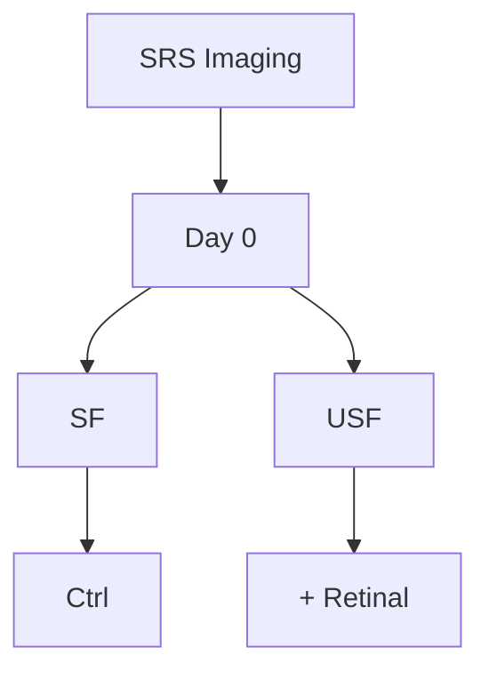

A EUROPEAN JOURNAL

# CHEMPHYSCHEM

OF CHEMICAL PHYSICS AND PHYSICAL CHEMISTRY

## Accepted Article

Title: Fingerprint Stimulated Raman Scattering Imaging Reveals Retinoid Coupling Lipid Metabolism and Survival

Authors: Andy Jing Chen, Junjie Li, Amber Jannasch, Sena Ozseker, Meng C. Wang, and Ji-Xin Cheng

This manuscript has been accepted after peer review and appears as an Accepted Article online prior to editing, proofing, and formal publication of the final Version of Record (VoR). This work is currently citable by using the Digital Object Identifier (DOI) given below. The VoR will be published online in Early View as soon as possible and may be different to this Accepted Article as a result of editing. Readers should obtain the VoR from the journal website shown below when it is published to ensure accuracy of information. The authors are responsible for the content of this Accepted Article.

To be cited as: ChemPhysChem 10.1002/cphc.201800545

Link to VoR: http://dx.doi.org/10.1002/cphc.201800545

# Full Title: Fingerprint Stimulated Raman Scattering Imaging Reveals Retinoid Coupling Lipid Metabolism and Survival

## Authors:

Andy J. Chen1&, Junjie Li2, 6&, Amber Jannasch3, Senna Ozseker4, Meng C. Wang4\* and Ji-Xin Cheng2, 5, 6\*

## Author Affiliations:

1Department of Biological Sciences, Purdue University, West Lafayette, IN, 47907, USA.  
2Department of Electrical & Computer Engineering, Boston University, Boston, MA, 02215, USA.  
3Bindley Bioscience Center, Purdue University, West Lafayette, IN, 47907, USA.  
4Huffington Center on Aging, Baylor College of Medicine, Houston, TX, 77030, USA.  
5Department of Biomedical Engineering, Boston University, Boston, MA, 02215, USA.  
6Photonics Center, Boston University, Boston, MA, 02215, USA.

\*Correspondence: Ji-Xin Cheng, Email: jxcheng@bu.edu; Meng C. Wang: wmeng@bcm.edu &Contributed equally.

## Summary

Retinoids play critical roles in development, immunity and lipid metabolism, and their deficiency leads to various human disorders. Yet, tools for sensing retinoids in vivo are lacking, which limits the understanding of retinoid distribution, dynamics and functions in living organisms. Here, using hyperspectral stimulated Raman scattering microscopy, we discover a previously unknown cytoplasmic store of retinoids in Caenorahbditis elegans. Following the temporal dynamics of retinoids, we reveal that their levels are positively correlated with fat storage, and their supplementation slows down fat loss during dauer starvation. We also discover that retinoids promote fat unsaturation in response to high-glucose stress, and improve organism survival. Together, our studies report a new method for tracking the spatiotemporal dynamics of retinoids in living organisms, and suggest the crucial roles of retinoids in maintaining metabolic homeostasis and enhancing organism fitness upon developmental and dietary stresses.

Key words: retinoids, stimulated Raman scattering, C. elegans, lipid

## Introduction

Retinoids include vitamin A and its biological derivatives such as retinal and retinoic acids 1. Animals acquire pro-vitamin A and vitamin A solely from dietary uptake and metabolize them to active retinoids 1. Retinoids play crucial roles in a variety of biological processes, such as development, stem cell differentiation, immunity, cancer progression and lipid metabolism 2-7. As a leading cause of childhood blindness, retinoid deficiency comprises phototransduction and attenuates the immune system, which cause about half a million children suffer each year globally 8. The major mechanism of action by retinoids is via two nuclear receptors --- retinoic acid receptor (RAR) and retinoid X receptor (RXR). Upon activation by retinoids in the nucleus, RAR/RXR orchestrate to regulate the expression of various target genes, which consequently execute the cellular functions of retinoids 9. Interestingly, the cytoplasmic action of retinoids has also been recently reported as an alternative mechanism to exert their cellular effects 10. Although retinoids have been the topic of research for decades, tools capable of directly imaging and tracing retinoids in vivo are currently lacking. Retinoids do not emit light when excited using visible light, nor catalyze chemiluminescent reactions, and their small molecule size also limits labeling strategies with bulky fluorescent dyes. Therefore, retinoids are invisible to conventional fluorescence microscopy. A recent study reported using CARS to map the distribution of vitamin A in liver tissues 11. However, there are two potential limitations of using CARS in live cell imaging of retinoids. Liver is rich in retinoid so it is insensitive to the non-resonant background of CARS microscopy. The signal intensity of CARS microscopy is not proportional to the concentration of substrate, thus complicating the quantification process. The shortage of proper imaging techniques for retinoids has hindered the understanding of the spatiotemporal dynamics of retinoids at the sub-cellular resolution in living cells and organisms.

Here, we exploited hyperspectral stimulated Raman scattering (hSRS) microscopy to override this technical challenge. In our hSRS microscope, two chirped femto-second pulsed lasers, namely pump and Stokes, are deployed to excite vibrations of intrinsic chemical bonds within a spectral window spanning \~300 wavenumbers 12. Through hyperspectral analysis based on multivariate curve resolution (MCR), chemical components can be identified by taking advantage of their characteristic Raman bands 12. Based on hSRS, we developed a method to directly image retinoids in live animals and track their changes under physiological conditions. To our surprise, we discovered a previously unknown cytoplasmic store of retinoids in C. elegans, whose dynamics is tightly associated with developmental stages. Importantly, we further revealed that retinoids are crucial to retain lipid reservoir and improve lipid unsaturation, which contribute to animals’ survival upon dauer starvation and high-glucose stress, respectively. This work demonstrates the significance of hSRS as a new analytic tool for quantitatively tracking retinoids in space and time and for revealing their unknown physiological functions.

## Results and Discussion

When we applied hSRS microscopy to scan live C. elegans, we discovered an unknown species (red pseudo-colored) in addition to previously characterized lipid (green pseudo-colored) and protein (cyan pseudo-colored) signals, and lysosome-related organelles (blue pseudo-colored) (Figure 1A). The spectrum of this new species is distinct to that of lipids, proteins or lysosomal components, which has a major peak around $1 5 8 0 ~ \mathrm { c m ^ { - 1 } }$ and a minor peak around $1 6 5 5 ~ \mathrm { { c m } ^ { - 1 } }$ (Figure 1B). Interestingly, the peak at $1 5 8 0 ~ \mathrm { c m ^ { - 1 } }$ resembles a characteristic peak of retinoids 13. To confirm this assignment, we measured the Raman spectra of three major members of retinoids, including vitamin A, retinal, and retinoic acid. Indeed, the spontaneous Raman spectra of all three compounds show a characteristic peak at $1 5 8 0 ~ \mathrm { c m ^ { - 1 } }$ (Figure 1C), which is attributed to the stretch vibration of C=C bonds in the retinoic chain 14. Furthermore, the hSRS spectra of pure vitamin A, retinal and retinoic acid compounds all show a strong peak around $1 5 8 0 ~ \mathrm { c m ^ { - 1 } }$ (Figure 1D, yellow area), which closely resemble the spontaneous Raman spectra of these compounds (Figure 1E). On the other hand, the minor peak around $1 6 5 5 ~ \mathrm { { c m } ^ { - 1 } }$ in the spectrum (Figure 1C, red arrowhead) likely originates from the alkanal group in retinal 14. Together, these results reveal a previously unknown store of retinoids in C. elegans, demonstrating the power of hSRS imaging for in vivo metabolite fingerprinting.

The intensity of SRS signals is linearly correlated with the concentration of their targeted molecules [17]. To examine whether SRS imaging provides a direct, quantitative measurement of retinoid levels in vivo, we imaged wild type (WT) animals grown on either regular conditions or high retinoid conditions with access vitamin A supplementation (Figure 2A), and then used the signal intensity at $1 5 8 0 ~ \mathrm { c m ^ { - 1 } }$ for quantification. At the same time, the SRS images at 1655 cm-1 that are attributed to alkyl C=C bonds were acquired to shows the outline and morphology of animals (Figure 2A). Compared to the controls, there is a significant increase of SRS signals at $1 5 8 0 \mathrm { c m } ^ { - 1 }$ in animals supplemented with vitamin A (Figure 2B, $\mathbf { p } < 0 . 0 1 )$ ), supporting that SRS imaging can directly track changes of retinoid levels in live animals.

Importantly, biochemical analysis of three retinoid species, retinoic acid, retinal, and vitamin A using Liquid Chromatography coupled with tandem Mass Spectrometry (LC/MS/MS) confirms the SRS-based quantification results. In animals grown on regular conditions, no clear peaks of any retinoid species were detected (Figure 2C and Figure S1), and only trace amount of retinal was identified after close examination (Figure 2C and Figure S1). Strikingly, upon access vitamin A supplementation, levels of retinal and retinoic acid, but not vitamin A are significantly increased (Figure 2C). These results not only validate the quantification results based on SRS imaging, but also suggest that supplemented vitamin A is predominantly metabolized into retinal and retinoic acid in C. elegans. Therefore, we reason that retinal and retinoic acid are the active, preferential forms of retinoid reservoir.

In addition, our initial imaging of retinoids in WT and the insulin/IGF-1 receptor mutant, daf-$2 ( e I 3 7 0 )$ using hSRS showed that the daf-2 mutant has a higher level of retinoids that WT (Figure 2D, E). We thus create a retinoid deprivation condition in the daf-2 mutant to further validate the quantitative capability of SRS imaging. To deplete retinoids in the diet as much as possible, OP50 Escherichia coli, the food source of worms, was cultured in defined M9 medium. Moreover, NGM plates where the worms are raised on were prepared without adding peptone, which is the only source of retinoids from the plate. Collectively, we define this combination (M9 + peptone-free NGM plate) as a low retinoid dietary condition. The $d a f { - } 2$ mutant worms were synchronized and kept on conditions with a normal diet, a low retinoid diet, or a low retinoid diet supplemented with vitamin A. SRS images at $1 5 8 0 ~ \mathrm { c m ^ { - 1 } }$ and $1 6 5 5 ~ \mathrm { { c m } ^ { - 1 } }$ were captured in worms at the L2 developmental stage (Figure 2D). The result, as quantified based on the SRS signal intensity, shows that the retinoid level is significantly decreased with a low retinoid diet (Figure 2E, $\mathsf { p } < 0 . 0 0 1 )$ , but fully rescued by the vitamin A supplementation (Figure 2E, $\mathsf { p } < 0 . 0 0 1 )$ . Altogether, these data demonstrate the SRS signal intensity at $1 5 8 0 ~ \mathrm { c m ^ { - 1 } }$ as a quantitative measurement of retinoids in live organisms.

Upon the discovery of retinoid reservoir, we next investigate its physiological functions in vivo. We applied the SRS imaging method to monitor retinoid levels during development and at adulthood. We found that retinoid levels increase with developmental time (Figure 3A, B), and surprisingly exhibit a dramatic induction in dauer larvae (Figure 3A, B). In C. elegans, mutations in insulin/IGF-1 receptor/daf-2, TGF-β receptor/daf-4, and guanylyl cyclase/daf-11 lead to constitutive dauer formation at $2 5 \mathrm { ^ \circ C }$ non-permissive temperature 15, 16. We found that increased levels of retinoids in all three mutants compared to controls (Figure 3A-D), suggesting that retinoid accumulation is a general phenomenon associated with dauer formation and maintenance, but not restricted to a specific dauer inducing mechanism.

At the dauer stage, animals can survive for months without food intake, which is supported by access accumulation and effective usage of fat storage. SRS signals at $2 8 5 7 ~ \mathrm { c m ^ { - 1 } }$ , which are attributed to $\mathrm { C } { \cdot } \mathrm { H } _ { 2 }$ vibration, are quantitative measurements of fat storage in live animals (17). Based on these signals, we measured fat content levels in the dauer constitutive mutants, daf-4(ok827), daf-4(m63) and daf-11(m47). Interestingly, fat storage increases in all three mutants, and their induction levels are positively correlated with the retinoid levels (Figure 3D, E). Based on these results, we hypothesize that retinoids might regulate fat storage in dauer animals.

To test this hypothesis, we first monitored changes in the levels of retinoids $( 1 5 8 0 ~ \mathrm { c m ^ { - 1 } } ;$ ) and fat storage (2857 cm-1) simultaneously using SRS microscopy during dauer maintenance. We found that fat storage levels gradually decrease with increasing time in the $d a f { - } 4 ( m 6 3 )$ dauer mutants (Figure 3F), and by day 16, less than 20% of fat stores are retained compared to day 0 (Figure 3F). Consistently, retinoid levels also decrease with time and show similar dynamics as fat stores do (Figure 3F). This result indicates that retinoid and lipid reservoirs exhaust in a correlated manner as dauer animals age.

Next, to investigate whether retinoids can directly regulate fat storage, we kept dauer animals in either M9 buffer or M9 buffer supplemented with retinal, which is the predominant form of retinoids in C. elegans (Figure 2C), and monitored their fat storage levels at different dauer ages using SRS microscopy. We found that at day 0, fat stores are not significantly different between two groups (Figure 3G), but at day 14, fat stores are much better maintained in the dauer animals supplemented with retinal (Figure 3G). Strikingly, after 2 months, when more than 90% of fat stores are exhausted in the controls, retinal supplemented animals maintain 75% of their fat storage (Figure 3G). Together, these results suggest that retinoid levels play crucial roles in regulating fat mobilization, which is essential for organism survival, during dauer maintenance.

Metabolic balance is a key factor for organism health and survival. In particular, glucose metabolism, lipid metabolism and their interactions are implicated in the longevity regulation 17, 18. High glucose diets lead to metabolic disorders in mammals 19, and shorten lifespan in C. elegans through altering lipid homeostasis 18, 20. Given the close association between retinoids and lipid metabolism, we ask whether retinoids could influence organism lifespan under high glucose stress. Consistent with the previous studies 18, 20, we found that high glucose diets shorten the lifespan of WT animals (Figure 4A, B). Interestingly, retinal supplementation is sufficient to extend the lifespan of those animals with high glucose diets (Figure 4B), although it slightly shortens the lifespan of WT animals with normal diets (Figure 4A).

Next, to investigate whether this lifespan regulatory effect conferred by retinoids is associated with changes in lipid metabolism, we profiled both total fat content levels and unsaturated fat content levels using SRS microscopy. For lipids containing unsaturated fatty acids, SRS signals at $3 0 0 5 ~ \mathrm { c m } ^ { - 1 }$ derived from the C-H vibration of alkene (-C=C-H) are linearly correlated with their levels 14. Together with the SRS signals at $2 8 5 7 ~ \mathrm { c m ^ { - 1 } }$ for total lipids, the ratio of SRS signals at $3 0 0 5 ~ \mathrm { c m ^ { - 1 } }$ over those at $2 8 5 7 ~ \mathrm { c m ^ { - 1 } }$ provide a direct measurement of unsaturation levels of fat storage in vivo 21. Using this method, we found that retinal supplementation significantly increases the level of unsaturated fat storage (Figure 4C, D, $\mathsf { p } < 0 . 0 1 )$ . Excessive glucose uptake provokes de novo synthesis of saturated fatty acids, which can lead to lipotoxicity if lacking sufficient desaturation and subsequent storage into lipid droplets. Our results show that retinoids can facilitate fatty acid desaturation and incorporation into lipid droplets for storage, which reduces lipotoxicity caused by excessive glucose uptake, and protects organisms against highglucose stress during aging.

## Conclusions

Together, these studies demonstrate a chemical imaging method to visualize retinoids at the subcellular level in live organisms. Interestingly, single-color SRS imaging indicates that retinoids exist as granules in the cytosol that are distinct from lipid droplets and lysosome-related organelles. Further studies, using simultaneous SRS and two-photon excited fluorescence microscopy and fluorescent labeling for different cellular compartments, are expected to reveal the identity of these retinoid-enriched organelles. Our studies also discover the beneficial effect of retinoids in attenuating high-glucose-induced toxicity by regulating lipid composition. High carbohydrates diet is tightly linked with the increase risk of obesity, diabetes and cardiovascular diseases in the current modern society 22, 23. Our discovery suggests dietary supplementation of retinoids as an effective nutraceutical strategy to combat these health issues associated with high carbohydrates diets.

## Experiment Section

Spontaneous Raman spectroscopy. Spontaneous Raman spectroscopy was performed on Horiba confocal Raman microscope (Horiba Scientific Labram HR Evolution) in accordance with the user’s manual. Key parameters: pinhole size: 50 μm; dwell time: 1 s. Laser wavelength: 532 nm; laser power: 1%; pinhole size: 50 μm; dwell time: 5 s; objective: 40X air; grating: 600 l/mm.

Stimulated Raman scattering microscopy and data analysis. Single color and hyperspectral stimulated Raman Scattering microscopy were performed in accordance with protocol in previous publication 12. In single color SRS, the wavelength of stokes laser was fixed at 1040 nm, and that of pump laser was tuned to match desired Raman shifts. Stokes beam was modulated at megahertz rate, and combined with pump beam colinearly before reaching specimen. Interaction with specimen induced SRS effect and resulted in intensity attenuation in pump beam at megahertz rate, which was extracted using lock-in amplifier. Forward detection mode was adopted. Hyperspectral SRS collected a series of single color SRS images with gradual increase or decrease of Raman shift ranging about $2 0 0 ~ \mathrm { c m ^ { - 1 } }$ . Multivariate curve resolution analysis was applied to analyze hyperspectral SRS data. Images of major components and the corresponding spectra were generated 12. In all experiments, the first two pair of intestine cells were imaged, since they are the most metabolically active. Laser power and pixel dwell time were specified in captions. No photodamage was observed in any of the experiments.

LC/MS/MS. Retinoids were extracted using hexane extraction according to the protocol described in previous studies 24. Lipid chromatography was performed to separate the retinoid fraction from lipids and other hydrophobic component. Next, the retinoid fraction was mixed with trans deuterium-labeled retinoic acid for quantification before it was loaded onto QQQ mass spectrometry analyzer. Each retinoid species was represented by a unique product ion. The absolute level of individual retinoid species was quantified by comparing the frequency of its unique product ion to that of internal reference (d5-retinol, Cambridge isotope). Protein level was determined by Bradford assay and used for normalization between different treatments.

C. elegans husbandry and handling. C. elegans husbandry and handling were proceeded according to the protocol documented in wormbook 25. Worms were maintained on NGM plates and kept in $1 5 \mathrm { { ^ \circ C } }$ incubator (Tritech research DT2-MP-47L). Worms treated on conditioned plates for SRS imaging were kept in $2 0 \mathrm { { ^ \circ C } }$ incubator. Worm synchronization was proceeded by bleaching and L1 arrest in M9 buffer.

Conditioned plates preparation. Preparation of standard plates and solutions followed protocol presented in wormbook 25. Vitamin A supplement plate was prepared by adding 10 μl 0.5 M vitamin A stock onto 60 mm petri dish when E. coli was seeded, solution was streaked out evenly. Plates were kept in dark to avoid degradation by light exposure. Retinal supplement plate was added prepared in the same way, 150 mM stock solution was used instead. To prepare low retinoids plate, NGM plate was prepared without peptone. OP50 E. coli was cultured overnight in LB medium before twice washed, and transferred at 1:100 ratio to M9 medium supplemented with 0.5% glucose and 1X amino acids mixture (Sigma M5550). After culturing for 2 days, bacteria were condensed and seeded onto peptone-free NGM plates to form lawn at $2 0 ~ ^ { \circ } \mathrm { C }$ .

Lifespan assay. To assess worm lifespan, worms were synchronized by bleaching and L1 arrest overnight before seeded onto NGM plates. Worms reached L4/adult stage after about 48 hours development at $2 0 ^ { \circ } \mathrm { C } ,$ late L4 were picked onto assay plates containing 40 $\mu \mathrm { M }$ FUDR. 30-40 worms were placed on each plate and each condition included 3-4 plates. Assay plates were kept in $2 0 ^ { \circ } \mathrm { C }$ incubator and examined every two days. The number of total worms alive, dead, censored were counted. Data were analyzed using Prism 7.0 and presented in the format of survival curve. Log-rank test was applied for the statistical significance test.

Dauer induction and maintenance. To induce dauers, daf-c mutant strains were synchronized by bleaching and L1 arrest overnight before they were seeded onto NGM plates and kept at $2 5 \mathrm { ^ \circ C }$ . Almost 100% daf-c strains formed dauers. To assess retinoid and lipid level in dauer worms at different ages, dauer was induced and kept on NGM plates at $2 5 ^ { \circ } \mathrm { C } .$ . To assess the impact of retinal supplement on lipid consumption during dauer aging, dauer was induced, and kept in M9 buffer or M9 buffer supplemented with retinal at $2 5 \mathrm { ^ \circ C }$ .

Quantification and statistical analysis. Retinoid images collected using single SRS microscopy were quantified using area fraction. Specifically, after background subtraction, the remaining number of pixels were counted in ImageJ and normalized with the area of the worm in the field of view. Lipid stores were quantified either by area fraction or intensity. When normalized using intensity, total intensity after background subtraction was recorded and normalized using the area of the worm. Quantification by area fraction and intensity yielded equivalent results. For retinoid and lipid store images, one tailed student’s t test was used for testing statistical significance. For C. elegans survival curves, log-rank test, performed using Prism 7.0, was used.

## Acknowledgement

This work was supported by grants from NIH, R21 GM114853 (J.C.), R01 GM118471 (J.C.), R01AG045183 (M.C.W.), R01AT009050 (M.C.W.), DP1DK113644 (M.C.W.), and HHMI (M.C.W.). The author thanks Micah Belew and Dr. Heidi Tissenbaum (University of Massachusetts Medical School) for sharing daf-2(e1370) strain and protocols, and providing trainings in lifespan assays.

## Conflict of interest

The author declares no competing interest.

## References

[1] G. M. V. Vogel S., Blaner W.S. Handbook of Experimental Pharmacology. 1999, 139.  
[2] A. L. Means, L. J. Gudas Annu Rev Biochem. 1995, 64, 201-233.  
[3] L. Altucci, H. Gronemeyer Nature Reviews Cancer. 2001, 1, 181-193.  
[4] R. Blomhoff, H. Blomhoff Journal of Neurobiology. 2006, 66, 606-630.  
[5] L. J. Gudas, J. A. Wagner J Cell Physiol. 2011, 226, 322-330.  
[6] C. Stephensen Annual Review of Nutrition. 2001, 21, 167-192.  
[7] M. Bonet, J. Ribot, A. Palou Biochimica Et Biophysica Acta-Molecular and Cell Biology of Lipids. 2012, 1821, 177-189.  
[8] J. Dickerson Journal of the Royal Society of Health. 1996, 116, 133-133.  
[9] P. Chambon Faseb Journal. 1996, 10, 940-954.  
[10] M. Dawson, Z. Xia Biochimica Et Biophysica Acta-Molecular and Cell Biology of Lipids. 2012, 1821, 21-56.  
[11] F. B. Legesse, S. Heuke, K. Galler, P. Hoffmann, M. Schmitt, U. Neugebauer, M. Bauer, J. Popp Chemphyschem. 2016, 17, 4043-4051.  
[12] D. Zhang, P. Wang, M. N. Slipchenko, D. Ben-Amotz, A. M. Weiner, J. X. Cheng Anal Chem. 2013, 85, 98-106.  
[13] K. Marzec, K. Kochan, A. Fedorowicz, A. Jasztal, K. Chruszcz-Lipska, J. Dobrowolski, S. Chlopicki, M. Baranska Analyst. 2015, 140, 2171-2177.  
[14] Z. Movasaghi, S. Rehman, I. Rehman Applied Spectroscopy Reviews. 2007, 42, 493-541.  
[15] N. Fielenbach, A. Antebi Gene Dev. 2008, 22, 2149-2165.  
[16] H. PJ Wormbook. 2007, 8, 1-19.  
[17] T. Schulz, K. Zarse, A. Voigt, N. Urban, M. Birringer, M. Ristow Cell Metab. 2007, 6, 280-293.  
[18] S. J. Lee, C. T. Murphy, C. Kenyon Cell Metab. 2009, 10, 379-391.  
[19] J. Baur, K. Pearson, N. Price, H. Jamieson, C. Lerin, A. Kalra, V. Prabhu, J. Allard, G. Lopez-Lluch, K. Lewis, P. Pistell, S. Poosala, K. Becker, O. Boss, D. Gwinn, M. Wang, S. Ramaswamy, K. Fishbein, R. Spencer, E. Lakatta, D. Le Couteur, R. Shaw, P. Navas, P. Puigserver, D. Ingram, R. de Cabo, D. Sinclair Nature. 2006, 444, 337-342.  
[20] K. Kimura, H. Tissenbaum, Y. Liu, G. Ruvkun Science. 1997, 277, 942-946.  
[21] J. J. Li, S. Condello, J. Thomes-Pepin, X. X. Ma, Y. Xia, T. D. Hurley, D. Matei, J. X. Cheng Cell Stem Cell. 2017, 20, 303-+.  
[22] L. Wang, A. Folsom, Z. Zheng, J. Pankow, J. Eckfeldt, A. S. Investigators, A. S. Investigators American Journal of Clinical Nutrition. 2003, 78, 91-98.  
[23] S. M. Hirabara, R. Curi, P. Maechler J Cell Physiol. 2010, 222, 187-194.  
[24] M. Kitagawa, K. Hosotani Journal of Nutritional Science and Vitaminology. 2000, 46, 42-45.  
[25] T. Stiernagle Nucleic Acids Res. 2006, 35, D472-475.

## Figure Legends:

Figure 1. Stores of retinoids in WT C. elegans revealed by hyperspectral SRS imaging.

A) and B) Hyperspectral SRS and MCR analysis of WT C. elegans yielded the images A) and Raman spectra B) of lipids, lysosome-related organelle (LRO), proteins/background and a new component later found to be retinoids. C) Spontaneous Raman spectra of Vitamin A, retinal and retinoic acid. D) and E) Raman spectra of vitamin A, retinal and retinoic acid were generated using hyperspectral SRS and spontaneous Raman spectroscopy, respectively. In D), $1 5 8 0 ~ \mathrm { c m ^ { - 1 } }$ region was highlighted in brown. Laser power: pump beam = 50 mW, stokes beam = 50 mW. Pixel dwell time: 10 µs.

Figure 2. Validation of SRS microscopy for retinoid quantification in live C. elegans.

A) WT worms kept in normal condition or condition supplemented with vitamin A were imaged using SRS microscope at $1 5 8 0 ~ \mathrm { { c m } ^ { - 1 } }$ (retinoid C=C) and $1 6 5 5 ~ \mathrm { { c m } ^ { - 1 } }$ (alkyl C=C bond). B) Quantification of retinoids in A). A threshold was applied to filter out background, the remaining pixel numbers were counted, and normalized using the area of worm; N=5; \*\* denotes $\mathfrak { p } < = 0 . 0 1$ . C) Mass spectrometry quantification of vitamin A, retinal and retinoic acid in WT worms kept in normal and vitamin A supplemented conditions. D) daf-2(e1370) worms kept in normal, low retinoids and vitamin A supplemented conditions were imaged using SRS microscope as described in A). E) Retinoids in D) were quantified the same way as described in B); $\mathrm { N } { = } 5 ;$ \*\*\* denotes $\mathsf { p } \ll = 0 . 0 0 1$ . Scale bar: 15 μm. Laser power: pump beam = 50 mW; stokes beam = 50 mW. Pixel dwell time: 10 µs.

## Figure 3. Retinoids ration the depletion of lipid during dauer maintenance, as revealed by SRS microscopy

A) SRS $( 1 5 8 0 ~ \mathrm { c m ^ { - 1 } } )$ imaging of retinoids in WT L2, L4 and adult worms and dauer induced from $d a f { - } 2 ( e I 3 7 0 ) ;$ scale bar: $2 0 \mu \mathrm { m . \mathbf { B } ) }$ Quantitative analysis of retinoids in A), \* denotes $\mathrm { { \bf P } } < =$ 0.05. C) SRS imaging of retinoids $( 1 5 8 0 ~ \mathrm { c m ^ { - 1 } } )$ and lipids $( 2 8 5 7 ~ \mathrm { c m ^ { - 1 } } )$ in WT L3 and dauer induced from daf-4(ok827), $d a f { - } 4 ( m 6 3 )$ and $d a f { - } I I ( m { 4 7 } ) ;$ scale bar: $1 5 ~ { \mu \mathrm { m . } } ~ \mathrm { D } )$ and E) Quantification of retinoids and lipid in C), respectively. F) Retinoid and lipid stores in dauer aged at day 0, 7 and 16 were measured using SRS (1580 and $2 8 5 7 ~ \mathrm { c m ^ { - 1 } }$ respectively) microscope. Quantification: a threshold was applied to filter out background, the remaining pixel number was normalized with the total pixel number of the worm; \*\*\* denotes $\mathbf { p } < = 0 . 0 0 1 . \mathbf { G } )$ Lipids in dauers kept in M9 buffer or M9 buffer supplemented with retinal were monitored using SRS $( 2 8 5 7 \mathrm { c m } ^ { - 1 } )$ microscope and quantified as described in F). Laser power: pump $\mathrm { b e a m } = 5 0 \mathrm { m W } ;$ stokes beam = 50 mW. Pixel dwell time: $1 0 \mu \mathrm { s }$ .

## Figure 4. Retinoids extends C. elegans lifespan under glucose feeding condition via modulating lipid metabolism.

A) Lifespans of WT worms kept on M9 + peptone-free NGM plate or M9 + peptone-free NGM plate + retinal were measured. B) Same measurement as A), except 2% glucose was added to plates. Survival curves are significantly different, as tested by Log-Rank test using Prism 7.0 software. C) Lipid droplet in B) were measured for unsaturation level (SRS intensity ration: 3005 $\mathrm { c m ^ { - 1 } / 2 8 5 7 } \mathrm { c m ^ { - 1 } } )$ using SRS imaging. D) Quantification ofunsaturation levels of lipid droplet in

C); \*\* denotes $\mathfrak { p } < = 0 . 0 1$ . Laser power: pump beam = 30 mW; stokes beam = 100 mW. Pixel dwell time: 10 µs.

A  

text_image

New component
Lipid
Protein + background
LRO

B  

line chart

| Raman shift (cm⁻¹) | New component | Protein + background | Lipid | LRO |
| ------------------ | ------------- | -------------------- | ----- | --- |
| 1560               | 0.2           | 0.05                 | 0.0   | 0.1 |
| 1590               | 0.45          | 0.0                  | 0.0   | 0.18 |
| 1620               | 0.2           | 0.0                  | 0.0   | 0.0 |
| 1650               | 0.35          | 0.0                  | 0.4   | 0.28 |
| 1680               | 0.1           | 0.05                 | 0.0   | 0.0 |

c  

line chart

| Raman shift (cm⁻¹) | Retinoic acid | Retinal | Vitamin A |
| ------------------ | ------------- | ------- | --------- |
| 800                | ~0            | ~0      | ~18k      |
| 1000               | ~0            | ~9k     | ~18k      |
| 1200               | ~3k           | ~10k    | ~18k      |
| 1400               | ~0            | ~9k     | ~18k      |
| 1600               | ~10k          | ~18k    | ~28k      |
| 1800               | ~0            | ~9k     | ~18k      |
| 2000               | ~0            | ~9k     | ~18k      |
| 2200               | ~0            | ~9k     | ~18k      |

D  

line chart

| Raman shift (cm⁻¹) | Retinoic acid | Retinal | Vitamin A |
| ------------------ | ------------- | ------- | --------- |
| 1560               | ~0.2          | ~0.4    | ~0.0      |
| 1590               | ~0.7          | ~0.6    | ~0.3      |
| 1620               | ~0.1          | ~0.1    | ~0.0      |
| 1650               | ~0.0          | ~0.0    | ~0.0      |

E  

line chart

| Raman shift (cm⁻¹) | Retinoic acid | Retinal | Vitamin A |
| ------------------ | ------------- | ------- | --------- |
| 1560               | ~10k          | ~7.5k   | ~2k       |
| 1590               | ~4k           | ~3k     | ~4.5k     |
| 1620               | ~1k           | ~1.5k   | ~1k       |
| 1650               | ~0.5k         | ~1k     | ~0.5k     |

text_image

A
Control + VitA
1580 cm⁻¹
1655 cm⁻¹

bar chart

| Group  | Retinoids Level (SRS signal intensity, a.u.) |
| ------ | ------------------------------------------- |
| ctrl   | 0.002                                       |
| +VitA  | 0.0055                                      |

bar chart

| Retinoid Type | Ctrl     | + VitA   |
| ------------- | -------- | -------- |
| VitA          | N.D.     | N.D.     |
| Retinal       | N.D.     | N.D.     |
| Retinoic Acid | N.D.     | N.D.     |

text_image

D
WT
daf-2(e1370)
Control	Control	Low retinoid	Low retinoid+VitA
1580 cm⁻¹
1655 cm⁻¹

bar chart

| Group | Retinoids Level (SRS signal intensity, a.u.) |
|-------|---------------------------------------------|
| WT    | 0.0025                                      |
| daf-2(e1370) | 0.0065                             |
| Low retinoid | 0.0035                             |
| Low retinoid + VitA | 0.0085                            |

text_image

A
L2
L4
Adult
Retinoid
L3
Dauer
Retinoid

bar chart

| Group  | Retinoids Level (a.u.) |
| ------ | ---------------------- |
| L2     | 0.002                  |
| L3     | 0.007                  |
| Dauer  | 0.031                  |
| L4     | 0.008                  |
| Adult  | 0.016                  |

bar chart

| Genotype | Retinoid Level (a.u.) | Lipid Level (a.u.) |
|----------|------------------------|--------------------|
| WT       | ~0.005                 | ~0.005             |
| daf-4(ok827) | ~0.038              | ~0.12              |
| daf-4(m63)  | ~0.052               | ~0.38              |
| daf-11(m47) | ~0.035               | ~0.09              |

line chart

| Dauer Age (day) | Lipid Level (a.u.) | Retinoid Level (a.u.) |
| --------------- | ------------------ | --------------------- |
| 0               | 0.12               | 0.03                  |
| 7               | 0.11               | 0.025                 |
| 16              | 0.03               | 0.01                  |

line chart

| Dauer Age (day) | ctrl  | + Retinal |
| --------------- | ----- | --------- |
| 0               | 0.10  | 0.14      |
| 15              | 0.04  | 0.08      |
| 60              | 0.01  | 0.07      |

A  

line chart

| Age (days) | Ctrl | +Retinal |
| ---------- | ---- | -------- |
| 0          | 100  | 100      |
| 10         | 100  | 100      |
| 20         | 75   | 75       |
| 30         | 25   | 25       |
| 35         | 0    | 0        |

B  

line chart

| Age (days) | Ctrl | +Retinal |
| ---------- | ---- | -------- |
| 0          | 100  | 100      |
| 10         | 95   | 98       |
| 20         | 60   | 70       |
| 30         | 0    | 0        |

text_image

C
3005 cm⁻¹
2857 cm⁻¹
3005 cm⁻¹/2857 cm⁻¹
Control
+ Retinal

D  

bar chart

| Group     | Unsaturated Ratio (3005 cm⁻¹/2857 cm⁻¹) |
| --------- | -------------------------------------- |
| Ctrl      | 0.3                                    |
| +Retinal  | 0.5                                    |

Table of content  

flowchart

SRS imaging revealed retinoid metabolism in C. elegans: retinal rescues premature aging induced by glucose. Unsaturation level of lipid droplet increases with retinal treatment. All plates contain glucose. Worms draw using dashed lines are dead ones. SF: saturated fat; USF: unsaturated fat.