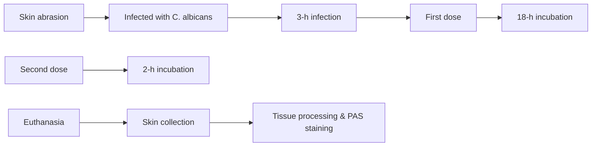

pubs.acs.org/ac

Article

# Fingerprint Stimulated Raman Scattering Imaging Unveils Ergosteryl Ester as a Metabolic Signature of Azole-Resistant Candida albicans

Meng Zhang, Pu-Ting Dong, Hassan E. Eldesouky, Yuewei Zhan, Haonan Lin, Zian Wang, Ehab A. Salama, Sebastian Jusuf, Cheng Zong, Zhicong Chen, Mohamed N. Seleem,\* and Ji-Xin Cheng\*

Cite This: Anal. Chem. 2023, 95, 9901−9913

Read Online

ACCESS

Metrics & More

Article Recommendations

Supporting Information

ABSTRACT: Candida albicans (C. albicans), a major fungal pathogen, causes life-threatening infections in immunocompromised individuals. Fluconazole (FLC) is recommended as first-line therapy for treatment of invasive fungal infections. However, the widespread use of FLC has resulted in increased antifungal resistance among different strains of Candida, especially C. albicans, which is a leading source of hospital-acquired infections. Here, by hyperspectral stimulated Raman scattering imaging of single fungal cells in the fingerprint window and pixel-wise spectral unmixing, we report aberrant ergosteryl ester accumulation in azole-resistant C.

albicans compared to azole-susceptible species. This accumulation was a consequence of de novo lipogenesis. Lipid profiling by mass spectroscopy identified ergosterol oleate to be the major species stored in azole-resistant C. albicans. Blocking ergosterol esterification by oleate and suppressing sterol synthesis by FLC synergistically suppressed the viability of C. albicans in vitro and limited the growth of biofilm on mouse skin in vivo. Our findings highlight a metabolic marker and a new therapeutic strategy for targeting azole-resistant C. albicans by interrupting the esterified ergosterol biosynthetic pathway.

line chart

| Raman shift (cm⁻¹) | Intensity (a.u.) - Resistant | Intensity (a.u.) - Amide I | Intensity (a.u.) - Serol C=C |
| ------------------ | ---------------------------- | -------------------------- | ---------------------------- |
| 1550               | ~0                           | ~0                         | ~0                           |
| 1575               | ~0                           | ~0                         | ~0                           |
| 1600               | ~0                           | ~0                         | Peak at ~1625                  |
| 1625               | ~0                           | ~0                         | Peak at ~1650                  |
| 1650               | ~0                           | Peak                       | Acyl C=C                    |
| 1675               | ~0                           | Peak                       | Acyl C=C                    |
| 1700               | ~0                           | Peak                       | Acyl C=C                    |

nvasive fungal infections and increasing resistance to I antifungals are emerging threats to public health that contribute to high morbidity and mortality.1 Fungal infections have been referred to as “hidden killers” because the effects of fungal infections and antifungal resistance on human health are not widely recognized.2 Candida albicans (C. albicans) is a major fungal pathogen that causes life-threatening infections when the host becomes debilitated or immunocompromised.3 Species of Candida, most notably C. albicans, are mostly associated with invasive, life-threatening fungal infections in immunocompromised individuals.4 Mortality rates due to fungal infections are estimated to be as high as 45%,5 which may be due to the inefficient diagnostic methods and inappropriate initial antifungal therapies.6

Therapeutic options for fungal infections are limited. The most widely used antifungal drugs comprise only a few chemical classes, including azoles [fluconazole (FLC), itraconazole, voriconazole, and posaconazole], polyenes (amphotericin B), and the echinocandins (caspofungin, anidulafungin, and micafungin).7,8 Azoles are recommended as first-line therapy for most invasive Candida species that cause systemic infections; azoles inhibit 14α-demethylase Erg11 in the ergosterol biosynthesis pathway. This results in the accumulation of toxic sterol 14,24-dimethylcholesta-8,24(28)-dien-3β,6α-diol, which permeabilizes the fungal plasma membrane.9 However, the widespread use of azoles has resulted in increased antifungal resistance by different fungal strains to these drugs, especially among Candida species.10,11 C. albicans can gain resistance to azoles mainly via genetic alteration of the drug target Erg11;12 upregulation of the efflux pumps CDR1, CDR2, and MDR1:1315 and 10,11,16−21

Despite these advances in our understanding of azole resistance mechanisms, it remains unclear why some fungal species are intrinsically resistant to or easily acquire resistance to multiple antifungal drugs. 1,22 In particular, how ergosterol metabolism is reprogrammed in response to antifungal azole treatment remains poorly understood.

Recently developed coherent Raman scattering microscopy, based on coherent anti-Stokes Raman scattering (CARS) or stimulated Raman scattering (SRS), opens a new window to explore single-cell metabolism in a spatially and temporally resolved manner. In particular, hyperspectral CARS or SRS imaging has unveiled hidden signatures in various biological

Received: February 28, 2023

Accepted: May 24, 2023

Published: June 13, 2023

A  

text_image

Stimulated Raman scattering
ωp
ωs
Ω
v = 1
v = 0
ω
Δt2
Δt1
Δω1
Δω2
t

B  

line chart

| Raman shift (cm⁻¹) | TWO7241 | TWO7243 | NR-29446 | W. Type | ATCC 64124 | ATCC MYA573 | NR-29448 |
| ------------------ | ------- | ------- | -------- | ------- | ---------- | ----------- | -------- |
| 1550               | ~0      | ~0      | ~0       | ~0      | ~0         | ~0          | ~0       |
| 1575               | ~0      | ~0      | ~0       | ~0      | ~0         | ~0          | ~0       |
| 1600               | ~15     | ~12     | ~10      | ~8      | ~7         | ~6          | ~5       |
| 1625               | ~5      | ~5      | ~5       | ~5      | ~5         | ~5          | ~5       |
| 1650               | ~18     | ~15     | ~12      | ~10     | ~8         | ~7          | ~6       |
| 1675               | ~10     | ~8      | ~5       | ~5      | ~5         | ~5          | ~5       |
| 1700               | ~0      | ~0      | ~0       | ~0      | ~0         | ~0          | ~0       |

C  

line chart

| Raman shift (cm⁻¹) | Intensity (a.u.) |
| ------------------ | ---------------- |
| 1550               | ~0.1             |
| 1575               | ~0.2             |
| 1600               | ~0.4             |
| 1625               | ~0.6             |
| 1650               | ~0.8             |
| 1675               | ~0.6             |
| 1700               | ~0.4             |

text_image

D
Sensitive
Resistant
W. Type
TWO7241
TWO7243
ATCC 64124
NR-29446
ATCC MYA573
NR-29448
hSRS stack
Sterol C=C
Acyl C=C
Amide I

E  

box plot

| Species | Fluconazole-sensitive (a.u.) | Susceptible dose dependent (a.u.) | Fluconazole-resistant (a.u.) |
|---|---|---|---|
| W. Type | 0.25 | 0.18 | 0.15 |
| DSC16 | 0.45 | 0.22 | 0.18 |
| NR-28449 | 0.15 | 0.12 | 0.10 |
| NR-224436 | 0.18 | 0.15 | 0.12 |
| ATCC-25760 | 0.20 | 0.18 | 0.15 |
| NR-28367 | 0.12 | 0.10 | 0.08 |
| NR-22368 | 0.15 | 0.13 | 0.11 |
| ATCC-9029 | 0.25 | 0.20 | 0.18 |
| NR-29434 | 0.22 | 0.17 | 0.14 |
| NR-29435 | 0.18 | 0.14 | 0.11 |
| NR-29353 | 0.15 | 0.12 | 0.09 |
| 10B1A3A | 0.12 | 0.10 | 0.07 |
| SCTAC1R34A | 0.20 | 0.16 | 0.13 |
| SCMRR1P34A | 0.25 | 0.21 | 0.18 |
| 11AB42A | 0.55 | 0.35 | 0.30 |
| ATCC-64114 | 0.08 | 0.06 | 0.05 |
| ATCC-MYA573 | 0.05 | 0.04 | 0.03 |
| NR-28443 | 0.55 | 0.45 | 0.40 |
| TWOT241 | 0.55 | 0.45 | 0.40 |
| TWOT243 | 0.45 | 0.40 | 0.35 |
| NR-28446 | 0.45 | 0.35 | 0.30 |
The chart displays the relative intensities of sterol C=C (a.u.) for different molecular species under different conditions, with statistical significance indicated by asterisks (***). The y-axis represents the sterol C=C intensity in arbitrary units (a.u.), and the x-axis lists the molecular species or conditions. The legend distinguishes between fluconazole-sensitive, susceptible dose-dependent, and fluconazole-resistant states.

F  

box plot

| Category | Sample | Acyl C=C Intensity (a.u.) |
| -------- | ------ | ------------------------- |
| fluconazole-sensitive | W. Type | ~1.5 |
| fluconazole-sensitive | D9C46 | ~2.0 |
| fluconazole-sensitive | NR-29449 | ~1.8 |
| fluconazole-sensitive | NF-294456 | ~2.2 |
| fluconazole-sensitive | ATCC 25790 | ~2.0 |
| fluconazole-sensitive | NR-29367 | ~1.8 |
| fluconazole-sensitive | NF-29368 | ~1.5 |
| fluconazole-sensitive | ATCC 90029 | ~1.7 |
| fluconazole-sensitive | NR-29434 | ~1.8 |
| fluconazole-sensitive | NR-29435 | ~2.3 |
| fluconazole-sensitive | 10B A3A | ~1.5 |
| fluconazole-sensitive | SCTAC1R34A | ~1.8 |
| fluconazole-sensitive | SOMRR1R34A | ~2.0 |
| fluconazole-sensitive | 11A8A2A | ~1.5 |
| fluconazole-sensitive | ATCC 64124 | ~1.8 |
| fluconazole-sensitive | ATCC MYA573 | ~2.0 |
| fluconazole-resistant | NR-29448 | ~1.5 |
| fluconazole-resistant | TWO7241 | ~1.5 |
| fluconazole-resistant | TWO7243 | ~1.5 |
| fluconazole-resistant | NR-29446 | ~1.0 |

Figure 1. SRS imaging reveals an increased level of EE accumulation in azole-resistant C. albicans. (A) Schematic illustration on the principle of SRS. (B) Raman spectra of lipids accumulated in azole-resistant fungal strains, including C. albicans TWO7241, TWO7243, ATCC 64124, NR-29446, ATCC MYA573, NR-29448, and azole-susceptible C. albicans W. Type, by hSRS imaging. (C) Reference spectra for hSRS spectra unmixing analysis using least square fitting. (D) Fingerprinting hSRS images of various types of C. albicans cells, including azole-susceptible and azoleresistant cells. (E) EE and (F) acyl C�C quantification analysis of (D). Bar scale represents 10 μm. Significance was evaluated using an unpaired t test $( ^ { * * * } , p < 0 . 0 0 1 )$ .

systems. These imaging techniques have permitted researchers to spatially resolve and quantitatively analyze metabolites inside cancer cells23−28 $\mathsf { c e l l s } ^ { 2 3 - 2 8 }$ and Caenorhabditis elegans. 29−34 Dynamic imaging of specific metabolites was enabled by SRS imaging of vibrational probes.35−38

As it relates to using SRS imaging for infectious diseases, the orientation of amphotericin B was resolved by the polarizationsensitive SRS signal from fingerprint $\mathrm { C } { = } \mathrm { C }$ stretching vibration.39 Rapid antimicrobial susceptibility determination at a single-bacterium level was achieved by stimulated Raman metabolic imaging. 40,41 Despite these advances, SRS imaging of metabolism in drug-resistant fungal cells is underexplored. A recent femtosecond SRS study identified lipid accumulation in azole-resistant cells.42 Yet, femtosecond SRS in the CH stretching vibration window does not have the capacity to resolve the chemical content of lipids. Consequently, the molecular mechanism and clinical impact of this lipid accumulation remain elusive.

To study metabolic reprogramming of fungal cells in response to azole treatment, we employed fingerprint hyperspectral SRS (hSRS) imaging to visualize the contents of C. albicans at a subcellular level. A pixel-wise least absolute shrinkage and selection operator (LASSO) regression algorithm was further applied to decompose the hSRS stack into chemical maps. An aberrant storage of esterified ergosterol (EE), featured by the sterol $\mathrm { C } { = } \mathrm { C }$ peak at $1 6 0 3 ~ \mathrm { { c m } ^ { - 1 } }$ and the acyl $\mathrm { C } { = } \mathrm { C }$ peak at $1 6 5 5 ~ \mathrm { { c m } ^ { - 1 } }$ , was identified in azole-resistant species but not in azole-sensitive species. Further investigation verified that EE accumulation in azole-resistant C. albicans arises from de novo lipogenesis. Mass spectrometry analysis identified ergosteryl oleate as the major EE species. Based on these findings, we tested an antifungal strategy utilizing oleate to interrupt the esterification process. Oleate significantly suppressed EE accumulation in C. albicans. Moreover, oleate/ azole combination treatment resulted in effective attenuation of the azole tolerance and viability of C. albicans in both yeast and biofilm forms. The in vivo study further confirmed that oleate-mediated inhibition of EE accumulation effectively impaired azole resistance in C. albicans and suppressed biofilm growth. These data collectively demonstrate the potential of using EE as a metabolic marker for detection of azole-resistant fungi and identify a new approach to treat invasive fungal infections by targeting ergosterol metabolism.

## MATERIALS AND METHODS

SRS Imaging. hSRS imaging was conducted with a spectral focusing method, where the Raman shift was tuned by controlling the temporal delay between two chirped femtosecond pulses. A femtosecond laser (Coherent) operating at 80 MHz provided the pump and Stokes laser source. With the pump beam tuned to 891 nm, the Stokes beam was tuned to 1040 nm to cover the fingerprint $\mathrm { C } { = } \mathrm { C }$ vibrational region. The Stokes beam was modulated at 2.3 MHz by an acousto-optic modulator (1205-C, Isomet). After combination, both the pump and Stokes beams were chirped by 12.7 cm long SF57 glass rods and then sent to a laser-scanning microscope. A 60× water immersion objective $\begin{array} { r l r } { \left( \mathrm { N A } \ \right) } & { { } = } & { \mathrm { i } . 2 } \end{array}$ , UPlanApo/IR, Olympus) was used to focus the light on the sample. An oil condenser (NA = 1.4, U-AAC, Olympus) was used to collect the signal.

To acquire hSRS images, a stack of 120 images at different pump-Stokes temporal delay was recorded. The temporal delay was controlled by an automatic stage that moved forward with a step size of 10 μm. To calibrate the Raman shift to the temporal delay, standard chemicals, including DMSO, triglyceride, and ergosterol, with known Raman peaks in $\mathrm { C } =$ C region from 1460 to $1 7 5 0 ~ \mathrm { c m } ^ { - 1 }$ were used. The average acquisition time for a 200 × 200 pixels image was about 1 s. hSRS images were analyzed using ImageJ (National Institute of Health).

Details of materials and other methods are included in the Supporting Information.

## RESULTS

SRS Imaging Reveals an Increased Level of Esterified Ergosteryl in Azole-Resistant C. albicans. We first applied confocal fluorescence imaging to confirm the accumulation of neutral lipids in the stationary phase, FLC-resistant C. albicans. As shown in Figure S1, BODIPY-labeled droplets are seen in the C. albicans cells in the UPC (susceptible dose-dependent), TWO7241, and TWO7243 (resistant) strains but are not seen in sensitive wild-type (W. Type) and DBC 46 strains. However, compositional information of individual lipid droplets (LDs) cannot be revealed from the fluorescence images. To quantitatively visualize and identify the chemical components of the lipids in individual fungal cells, we deployed fingerprint hSRS imaging via spectral focusing using a setup shown in Figure S2. SRS is a dissipative process in which energy corresponding to the beating frequency $( \omega _ { \mathsf { p } } - \omega _ { \mathsf { S } } )$ is transferred from input photons to a Raman-active molecular vibration (Ω). Tuning the time delay between the two chirped excitation beams can substantially change the overlapping difference in the frequency, which excites different Raman shifts (Figure 1A). By tuning the laser-beating frequency to cover the $\mathrm { C } { = } \mathrm { C }$ stretching vibration window from 1550 to $1 7 0 0 ~ \mathrm { c m } ^ { - 1 }$ , we conducted hSRS imaging of azole-resistant C. albicans strains, including TWO7241, TWO7243, NR-29446, ATCC 64124, ATCC MYA573, NR-29448, and azole susceptible W. Type, all in the stationary phase. The SRS spectra in this spectral region, which arise from the intracellular LDs and proteins, can be extracted at each pixel from the image stack. In the normalized SRS spectra of LDs in azoleresistant C. albicans (TWO7241, TWO7243, NR-29446, and ATCC 64124), two strong Raman bands at 1603 and 1655 $\mathrm { c m } ^ { - 1 }$ were present (Figure 1B). The sterol $\mathrm { C } { = } \mathrm { C }$ peak was absent in strain ATCC MYA573, which contains a mutation in ERG11. In comparison, the azole-sensitive C. albicans W. Type strain had a significantly weaker Raman signal at 1603 $\mathrm { c m } ^ { - 1 } ,$ which suggests that azole-susceptible C. albicans cells have a much lower concentration ratio of sterol $\mathrm { C } { = } \mathrm { C }$ to acyl $\mathrm { C } { = } \mathrm { C }$ (Figure 1B). The two types of spectrally separated bands are contributed by the sterol $\mathrm { { \dot { C } } = } C$ vibration with a peak at 1603 $\mathrm { c m } ^ { - 1 }$ and the acyl $\mathrm { C } { = } \mathrm { C }$ vibration with a peak at $1 6 5 5 ~ \mathrm { c m } ^ { - 1 } ,$ respectively. The origin of the two major peaks was confirmed by the SRS spectra of pure ergosterol and glyceryl trioleate, which exhibit a characteristic sterol $\mathrm { C } { = } \mathrm { C }$ vibrational band at $1 6 0 3 ~ \mathrm { { c m } ^ { - 1 } }$ and acyl $\mathrm { C } { = } \mathrm { C }$ vibrational band at $1 6 5 5 ~ \mathrm { { c m } ^ { - 1 } }$ $( { \mathrm { F i g u r e ~ } } 1 { \mathrm { C } } )$ . The SRS spectra of pure ergosterol and glyceryl trioleate overlapped with the spectra of LDs in azole-resistant C. albicans cells. This indicates that the content in individual LDs is predominantly in the form of ergosterol (in its esterified form) and glyceryl trioleate.

To quantify the amount of EE in these LDs, concentration maps of acyl $\mathrm { C } { = } \mathrm { C } ,$ sterol $\mathrm { C } { = } \mathrm { C } ,$ , and the amide I band were reconstructed from LASSO analysis of the hSRS stacks (see the Materials and Methods section). As shown in Figure 1D, hSRS images that contained hundreds of single fungal cells in each field-of-view were obtained. The standard reference spectra of ergosterol, glyceryl trioleate, and peptone (Figure 1C) were used for unmixing of sterol $\mathrm { C } { = } \mathrm { C } ,$ acyl $\mathrm { C } { = } \mathrm { C } ,$ , and the amide I band, respectively. The reconstructed concentration maps of sterol $\mathrm { C } { = } \mathrm { C } ,$ . acyl $\mathrm { C } { = } \mathrm { C } ,$ and amide I for azole-resistant C. albicans TWO7241, TWO7243, ATCC 64124, NR-29446, ATCC MYA573, and NR-29448 and azole-susceptible C. albicans W. Type are presented in Figure 1D. The hSRS stack channel visualized the sum of hSRS frames. Distinct spatial patterns were found in the decomposed sterol $\mathrm { C } { = } \mathrm { C } ,$ acyl C� $\mathrm { C } ,$ and amide I channels. In the sterol $\mathrm { C } { = } \mathrm { C }$ channel, EE accumulation was successfully separated and visualized in the C. albicans W. Type, TWO7241, TWO7243, and NR-29446 strains but barely in strains ATCC 64124, ATCC MYA573, and NR-29448. The acyl C�C signal revealed accumulation of lipid metabolites both in LDs and the cell membrane, whereas the amide I channel revealed protein distribution, which presented as a uniform pattern inside cells.

A  

natural_image

Microscopic view of hSRS stack particles labeled 'Stationary' (no other text or symbols)

Sterol C=C  

natural_image

Black background with scattered bright yellow and red dots resembling stars or particles (no text or symbols)

Acyl C=C  

natural_image

Microscopic view of blue-stained spherical particles on a dark background (no text or symbols)

Amide I  

natural_image

Microscopic view of yellow-stained cells or particles (no text or symbols visible)

c  

natural_image

Microscopic image of hSRS stack cells with Log scale bar (no text or symbols on image)

Sterol C=C  

natural_image

Completely black image with no visible content or text.

Acyl C=C  

natural_image

Microscopic view of blue-stained cellular structures against a black background (no text or symbols)

Amide I  

natural_image

Microscopic view of yellow-stained cells against a black background (no text or symbols)

E  

natural_image

Microscopic image of hSRS stack cells labeled 'Biofilm' (no additional text or symbols)

Sterol C=C  

natural_image

Microscopic image showing scattered red fluorescent spots against a black background, with a color bar indicating intensity (no text or symbols)

Acyl C=C  

natural_image

Fluorescent microscopy image showing blue-stained cellular structures against a black background (no text or symbols)

Amide I  

natural_image

Microscopic view of fluorescently labeled cellular structures (no text or symbols visible)

G  

box plot

| Condition  | Median | IQR Lower | IQR Upper | Whisker Min | Whisker Max |
|------------|--------|-----------|-----------|-------------|-------------|
| Stationary | 0.5    | 0.3       | 0.7       | 0.1         | 0.8         |
| Log        | 0.05   | 0.02      | 0.1       | 0.01        | 0.1         |
| Biofilm    | 0.4    | 0.2       | 0.6       | 0.1         | 0.9         |

H  

box plot

| Condition  | Acyl C=C intensity (a.u.) |
| ---------- | -------------------------- |
| Stationary | 1.3                        |
| Log        | 0.7                        |
| Biofilm    | 1.2                        |

B  

line chart

| Raman shift (cm⁻¹) | Intensity (a.u.) |
| ------------------ | ---------------- |
| 1550               | 2.5              |
| 1575               | 4.0              |
| 1600               | 14.5             |
| 1625               | 6.0              |
| 1650               | 13.5             |
| 1675               | 4.0              |
| 1700               | 2.5              |

D  

line chart

| Raman shift (cm⁻¹) | Intensity (a.u.) |
| ------------------ | ---------------- |
| 1550               | 1.0              |
| 1575               | 2.0              |
| 1600               | 3.0              |
| 1625               | 4.0              |
| 1650               | 6.0              |
| 1675               | 4.0              |
| 1700               | 1.0              |

F  

line chart

| Raman shift (cm⁻¹) | Intensity (a.u.) |
| ------------------ | ---------------- |
| 1550               | 2.0              |
| 1575               | 4.0              |
| 1600               | 12.0             |
| 1625               | 6.0              |
| 1650               | 12.0             |
| 1675               | 4.0              |
| 1700               | 2.0              |

Figure 2. Increased EE accumulation in azole-resistant C. albicans stationary phase and biofilm cells. Fingerprinting hSRS images of stationary phase (A), logarithmic (log) phase (C) C. albicans cells, and C. albicans biofilm (E). hSRS spectra of lipids accumulated in (B) stationary phase, (D) logarithmic phase C. albicans TWO7241, and (F) C. albicans TWO7241 biofilm. (G) EE and (H) acyl $\mathrm { C } { = } \mathrm { C }$ quantification analysis of hSRS unmixed concentration maps in (A,C,E). Bar scale represents 10 μm.

To verify whether the observed phenomenon is strain specific, we repeated the detection on multiple azolesusceptible and susceptible dose-dependent C. albicans cells (Figure S3). Consistently, hSRS spectral unmixing confirmed that azole-susceptible strains had significantly lower intracellular EE accumulation compared to azole-resistant strains. Interestingly, the 11A8A2A strain is a susceptible dosedependent strain, but it exhibited obvious EE accumulation. It was found that the 11A8A2A strain, which is an ERG11- overexpressing isolates, contained a gain of function mutation in UPC2, in which eight single amino acid substitutions were elucidated from their UPC2 alleles. This was found to be associated with increased ERG11 expression, increased ergosterol production, and decreased FLC susceptibility.11,43

  
Figure 3. EE accumulation in azole-resistant C. albicans cells is related to glucose de novo lipogenesis. (A) Spectra unmixing hSRS imaging of C. albicans cells under glucose depletion treatment. (B) hSRS spectra of lipid accumulation in (A). (C) EE and (D) acyl C�C quantification analysis of hSRS unmixed concentration maps in (A). (E) Spectra unmixing hSRS imaging of C. albicans cells in the presence of the glycolysis inhibitor (2DG). (F) hSRS spectra of lipid accumulation in (E). (G) EE and (H) acyl $\mathrm { C } { = } \mathrm { C }$ quantification analysis of hSRS unmixed concentration maps in (E). (I) Mass spectra of lipids extracted from azole-susceptible C. albicans W. Type and azole-resistant C. albicans TWO7241 cells. (J) Ergosteryl oleate (EE C18:1) level analysis of mass spectra. (K) Overall lipid level analysis of mass spectra. (L) Quantitative ergosteryl oleate (EE C18:1) to overall lipids (EE ${ \mathrm { C 1 8 } } { \mathrm { : 0 } } + { \mathrm { C 1 8 } } { \mathrm { : 1 } } + { \mathrm { C 1 8 } } { \mathrm { : 2 } } + { \mathrm { C 1 8 } } { \mathrm { : 3 } } { \mathrm { ) } }$ ) intensity ratio of C. albicans W. Type and C. albicans TWO7241 cells. Bar scale represents 10 μm. Significance was evaluated using an unpaired t test $( { } ^ { * * } , p < 0 . 0 1 ; { } ^ { * * * } , p < 0 . 0 0 \dot { 1 } )$ .

For single-cell chemical analysis, the decomposed concentration maps were segmented to generate maps of intracellular compartments corresponding to LDs and proteins in individual cells (Figure S4). Statistical analysis in Figure 1E shows a clearly elevated level of sterol C�C accumulation in azoleresistant C. albicans TWO7241, TWO7243, and NR-29446. In contrast, the azole-resistant C. albicans strains ATCC 64124, ATCC MYA573. and NR-29448 had relatively lower levels of sterol $\mathrm { C } { = } \mathrm { C } ,$ probably due to inyolyement other azole resistance mechanisms that do not rely predominantly on ergosterol overproduction. Quantitative analysis of the EE-to protein ratio intensity confirmed a significant difference in EE accumulation levels between azole-resistant and azole-susceptible or susceptible dose-dependent C. albicans (Figure S5A).

For further statistical comparison, Student’s t test found that the two subpopulations were statistically different (p value <0.001) in terms of the levels of EE in azole-resistant and azole-susceptible cells. In contrast, no significant alteration was present in the acyl $\mathrm { C } { = } \mathrm { C }$ contents between azole-resistant and azole-susceptible strains, as shown in the quantitative analysis of acyl C�C intensity (Figure 1F) and acyl C�C-to-protein ratio intensity (Figure S5B). This indicates that acyl $\mathrm { C } { = } \mathrm { C }$ is not a molecular marker inside C. albicans. These data collectively demonstrate a significantly increased level of EE accumulation in azole-resistant C. albicans compared to nonresistant strains.

Next, to examine the effects of growth period on EE accumulation, we explored the phase-dependent changes in lipid metabolism during fungal growth. In the stationary phase, yeast cells have a balanced rate of microbial death and new cell generation. The metabolic activities of stationary phase cells are at equilibrium. However, logarithmic phase yeast cells grow and divide rapidly with minimal reproductive time. In logarithmic phase yeast cells, metabolism is the most active at this stage of a cell’s lifespan and, as a consequence, these cells are more sensitive to changes in their environment.44,45

Yeast cells accumulate more lipids during the stationary phase.46 Figure 1 demonstrates the increased level of EE accumulation in the stationary phase, azole-resistant C. albicans. To explore whether EE is accumulated in the log phase as well, azole-resistant C. albicans TWO7241 cells were grown and then harvested in the mid-logarithmic phase and stationary phase, respectively. The hSRS concentration maps suggest that the level of EE is significantly decreased in logarithmic phase cells compared to stationary phase cells (Figure 2A,C). The intracellular sterol C�C and acyl C�C intensities in individual cells were distinctly higher in stationary phase cells, as shown in the SRS spectra of the lipids (Figure 2B,D). The integrated sterol C�C and acyl C�C intensity in individual cells was quantitatively analyzed and is plotted as histograms (Figure 2G,H). The results indicated that the sterol C�C and acyl C�C contents were higher in azole-resistant C. albicans at a single-cell level. Additionally, we collected stationary phase C. albicans cells and then cultured them in fresh nutrient medium for 3 h. The hSRS spectra showed decreased EE accumulation in the C. albicans cells after the medium was refreshed (Figure S6). The growth of microorganisms depends on the availability of nutrients in the surrounding medium. A previous study found that when the culture medium of stationary phase C. albicans cells was switched, this induced rapid hydrolyzation of sterol esters to free sterol and fatty acids that were utilized for the biogenesis of membranes.46 These data collectively suggest that higher levels of EE accumulation are a distinct metabolic feature of azole-resistant C. albicans cells that are in the stationary phase.

C. albicans cells that are in the stationary phase are capable of forming highly drug-resistant biofilms in humans through various adaptive mechanisms that alter the lipid composition of cell membranes. The ability of C. albicans to form biofilms poses a significant medical challenge in the treatment of candidiasis as these structured communities are recalcitrant to treatment by antifungals.47,48 Therefore, we investigated if EE content is altered during C. albicans biofilm development. We cultured stationary phase C. albicans to form biofilm and then examined the level of EE in cells using hSRS microscopy. A mixed type of cells, which comprised round and spherical yeast cells with filamentous hyphae and pseudohyphae intertwined with each other, was formed during the temporal development of biofilms, as shown in the hSRS stack image (Figure 2E). The decomposed SRS images show significant EE accumulation in the fungal biofilm (Figure 2E). The SRS spectra of lipids and the statistical analysis confirmed that EE accumulated at a high level, which was comparable to the yeast form of C. albicans TWO7241 in the stationary phase (Figure 2F,G). The acyl C�C level remained markedly high in cells both in the stationary phase and biofilm form, which was at higher level compared to cells in the log phase (Figure 2H). Altogether, these data demonstrate that EE accumulation is a signature of Candida biofilm.

EE in Azole-Resistant C. albicans Arises from De Novo Lipogenesis and Is Largely in the Form of Ergosteryl

Oleate. To identify the source of increased EE accumulation in azole-resistant C. albicans cells, we examined the contribution of de novo lipogenesis and exogenous fatty acid uptake, respectively. Cytosolic acetyl coenzyme A is the central metabolic intermediate that is essential for lipid biosynthetic reactions through different carbon metabolism pathways, such as glycolysis, β-oxidation, and the glyoxylate cycle.49 Among these metabolic pathways, glucose is universally utilized as the preferred carbon source by most organisms.50,51 To evaluate the contribution of de novo lipogenesis to the increased EE accumulation in azole-resistant C. albicans strains, we examined the effects of glycolysis on carbon utilization and lipid storage. Azole-resistant C. albicans TWO7241, TWO7243, and azole susceptible W. Type were cultured in glucose-supplemented medium or glucose-deficient medium until cells reached the stationary phase. The fingerprinting hSRS images of cells grown in glucose-supplemented or glucose-deficient media were acquired, and the hSRS spectra from the LDs were quantified (Figure 3A,B, Figure S7A,C). We found a significant decrease in the total level of LDs, especially in the accumulation of EE, from cells cultured in glucose-deficient medium compared to glucose-supplemented medium in the azole-resistant TWO7241 and TWO7243 strains and the azole-susceptible W. Type strain (Figure 3C, Figure S7B,D). Additionally, the acyl C�C lipid was significantly decreased after glucose depletion (Figure 3D). This result indicates that glycolysis was a major contributor of the accumulated lipids.

Next, we used a glycolysis inhibitor, 2-deoxy-D-glucose (2DG), to further confirm that de novo biosynthesis is a major route to the elevated EE storage in azole-resistant C. albicans. 2DG, an analogue of glucose, cannot undergo further glycolysis since the 2-hydroxyl group in the glucose molecule is replaced by a hydrogen. To assess the effects of 2DG on lipid storage, we first studied its toxicity to fungal cells. The cell viability result under concentration-dependent treatment of 2DG confirmed that the concentration of 0.2 M did not reduce C. albicans growth in vitro (Figure S8). The fingerprint hSRS images of cells cultured in YPD medium supplemented with 2DG and cells cultured in normal YPD medium were acquired. As indicated in Figure 3E,F, we observed that EE accumulation was markedly attenuated upon glycolysis inhibition by 2DG in the azole-resistant C. albicans TWO7241 and TWO7243 strains. In contrast, upon exposure to 2DG, a less drastic reduction in the EE level was observed in azole-sensitive cells compared to FLC-resistant cells (Figure 3G, Figure S9A,C). The acyl C�C intensity reduction was not significantly affected in FLC-susceptible and FLC-resistant cells (Figure 3H. Figure S9B.D). These data together indicate that EF accumulation in azole-resistant C. albicans cells is largely due to glucose uptake and de novo synthesis. The inhibition of glycolysis effectively reduced the level of EE in the FLCresistant strain.

In order to identify the fatty acid types in the accumulated EE, we performed electrospray ionization mass spectrometry (ESI−MS) analysis of the extracted lipids from C. albicans. Our result revealed that ergosteryl oleate (EE C18:1) accumulated in intracellular lipids was identified to be the dominant species (Figure 3I). The m/z 679, m/z 677, and m/z 675 peaks correspond to ergosteryl oleate (EE C18:1), ergosteryl linoleate (EE C18:2), and ergosteryl linolenate (EE C18:3), respectively. The quantitative analysis further showed that the level of EE (C18:1) was significantly higher in the TWO7241 strain compared to the W. Type strain (Figure 3J). Moreover, the total amount of lipids was significantly higher in azole resistant cells compared to azole-sensitive cells (Figure 3K). Quantitative analysis showed that the percentage of ergosteryl oleate (EE C18:1) in overall lipids (EE C18:0 + C18:1 + C18:2 + C18:3) is in significant higher level in TWO7241 cells than that in W. Type cells (Figure 3L).

B  

bar chart

| Concentration (µM) | Sterol C=C intensity (a.u.) |
| ------------------ | --------------------------- |
| Control            | 0.5                         |
| 10                 | 0.7                         |
| 100                | 0.2                         |
| 500                | 0.1                         |

C  

scatterplot

| Concentration (µM) | Acyl C=C intensity (a.u.) |
| ------------------ | ------------------------- |
| Control            | 1.3                       |
| 10                 | 1.4                       |
| 100                | 0.4                       |
| 500                | 0.3                       |

D  

line chart

| Time (h) | Control | 10 µM | 100 µM | 500 µM |
| -------- | ------- | ----- | ------ | ------ |
| 0        | 0.0     | 0.0   | 0.0    | 0.0    |
| 10       | 0.2     | 0.2   | 0.1    | 0.1    |
| 20       | 1.4     | 1.3   | 0.8    | 0.1    |
| 30       | 1.4     | 1.4   | 1.3    | 0.1    |
| 40       | 1.4     | 1.4   | 1.4    | 0.1    |

E  

line chart

| Concentration (μM) | OA    | EO    |
| ------------------ | ----- | ----- |
| 10^-4              | 1.4   | 1.4   |
| 10^-3              | 1.4   | 1.4   |
| 10^-2              | 1.4   | 1.4   |
| 10^-1              | 1.4   | 1.4   |
| 10^0               | 1.2   | 1.2   |
| 10^1               | 0.2   | 0.2   |
| 10^2               | 0.1   | 0.1   |
| 10^3               | 0.1   | 0.1   |
| 10^4               | 0.1   | 0.1   |

Figure 4. Oleate attenuates EE accumulation in azole-resistant C. albicans. (A) Fingerprinting hSRS images of stationary phase C. albicans cells under concentration-dependent oleate treatment. Quantification of (B) EE and (C) acyl C�C levels in hSRS unmixed concentration maps to show OA inhibition on EE accumulation. (D) Growth inhibition of C. albicans TWO7241 under concentration-dependent oleate treatment. (E) Comparison of growth inhibition of C. albicans TWO7241 under concentration-dependent OA and EO treatment. Bar scale represents 10 μm. Significance was measured using an unpaired t test $( ^ { * } , p < 0 . 0 5 ; ^ { * * * } , p < 0 . 0 0 1 ; ^ { } \mathrm { n } . 5 . )$ , not significant).

Inhibition of EE Accumulation by Oleic Acid Effectively Impairs Azole Resistance in Stationary Phase C. albicans Both In Vitro and In Vivo. It has been known that sterols are known to be esterified by acyl-CoAcholesterol acyltransferase (ACAT), which forms steryl esters in an intracellular acyl-CoA-dependent reaction. The two ACAT-related enzymes, Are1p and Are2p, catalyze sterol esterification in yeast.52 The mass data of lipid profiling led to our hypothesis that oleic acid (OA) can be employed as a competitive inhibitor of acyl-CoA to interfere with the active site of the enzyme. This prevents the substrate, acyl-CoA, from binding to the enzyme. To test our hypothesis, we measured whether cell viability or cell growth is affected by oleate treatment. To trace cellular response of OA treatment, we cultured cells in medium supplemented with OA at different concentrations for 13 h and detected the fingerprinting hSRS imaging signal as a measurement of exogenous fatty acid uptake. The cell morphology of the azole-resistant strain C. albicans TWO7241 was significantly affected by a high concentration of OA treatment (100 and 500 μM), which is indicated by the distorted cell shapes in the transmission images (Figure S10). In comparison, no morphological changes were observed with C. albicans W. Type cells under OA treatment at 10 and 100 μM; morphological changes were not observed until a high concentration of 500 μM OA was used. This result suggests that the cell morphology of azole resistant C. albicans is more vulnerable under OA treatment compared to that of azole-sensitive C. albicans cells.

To conduct a comprehensive study of the cellular changes in chemical information, we conducted fingerprinting hSRS to inspect metabolic changes in the presence of OA treatment. The hSRS unmixing concentration maps clarified that the intensity of the lipids, including both sterol $\mathrm { C } { = } \mathrm { C }$ and acy $\mathrm { C } { = } \mathrm { C } ,$ remained at a high level compared to the control and the low dose of OA treatment (10 μM). However, the lipid maps showed almost completely diminished sterol $\mathrm { C } { = } \mathrm { C }$ intensity in the presence of a high concentration of OA treatment (100 and 500 μM). The protein signals were remarkably decreased as well, with metabolic heterogeneity observed in the decomposed maps (Figure 4A). The intensity profile of the lipids showed active EE synthesis in the control and the low dose OA-treated (10 μM) cells, but EE synthesis was dramatically reduced in the presence of higher concentrations of OA (100 and 500 μM) (Figure 4B). This indicated that the metabolic inhibition in azole-resistant C. albicans was visualized by tracing biomass metabolic synthesis under OA treatment. A comparison of the unmixed SRS image intensity further revealed that the synthesis of lipids was highly active in azole-sensitive C. albicans cells exposed to 10 μM of OA treatment, but the synthesis of lipids was much reduced in the presence of a higher concentration of OA (100 and 500 $\mu \mathbf { M } )$ . However, the unmixing results exhibited a largely diminished signal in the EE image but no significant change in the acyl ${ \mathrm { C } } { = } { \mathrm { C } }$ image until the OA dosage was increased up to 500 μM (Figure S10). Comparing the unmixed fingerprinting channels between azole-resistant and azole-sensitive C. albicans cells, we postulated that the cell viability of azoleresistant C. albicans is much more vulnerable to OA treatment, and that EE production is impaired in the presence of OA. To confirm this finding, we investigated cell viability using an optical density measurement. The cell growth of azole-resistant C. albicans was not affected in the presence of OA treatment at a low concentration (10 μM). However, OA at 100 and 500 μM effectively inhibited the growth of azole-resistant C. albicans cells (Figure 4D). To ensure that this inhibition was not an acidic effect, we tested the ester form of OA, ethyl oleate (EO), and observed the same concentration-dependent growth inhibition results (Figure 4E). In contrast, the sensitive species were more robust to OA treatment (Figure S10). In summary, our observation supports that EE inhibition by OA reduces the viability of azole-resistant fungi.

A  

heatmap

| OA concentration (μg/mL) | 0 | 0.5 | 1 | 2 | 4 | 8 | 16 | 32 | 64 | 128 | 256 |
| --- | --- | --- | --- | --- | --- | --- | --- | --- | --- | --- | --- |
| FLC concentration (μg/mL) | 0 | 0 | 0 | 0 | 0 | 0 | 0 | 0 | 0 | 0 | 0 |
| 256 |  |  |  |  |  |  |  |  |  |  |  |
| 128 |  |  |  |  |  |  |  |  |  |  |  |
| 64 |  |  |  |  |  |  |  |  |  |  |  |
| 32 |  |  |  |  |  |  |  |  |  |  |  |
| 0 |  |  |  |  |  |  |  |  |  |  |  |
|  | 16 | 32 | 64 | 128 | 256 | 256 | 256 | 256 | 256 | 256 | 256 |
|  | 32 | 64 | 128 | 256 | 256 | 256 | 256 | 256 | 256 | 256 | 256 |
|  | 64 | 128 | 256 | 256 | 256 | 256 | 256 | 256 | 256 | 256 | 256 |
|  | 128 | 256 | 256 | 256 | 256 | 256 | 256 | 256 | 256 | 256 | 256 |
|  | 256 |  |  |  |  |  |  |  |  |  |  |

heatmap

TWO7243
| OA concentration (μg/mL) | 0 | 0.5 | 1 | 2 | 4 | 8 | 16 | 32 | 64 | 128 | 256 |
|---|---|---|---|---|---|---|---|---|---|---|---|
| FLC concentration (μg/mL) | 0 | 0.5 | 1 | 2 | 4 | 8 | 16 | 32 | 64 | 128 | 256 |
| FLC concentration (μg/mL) | 16 | 32 | 64 | 128 | 16 | 8 | 4 | 0 | 0 | 0 | 0 |
| FLC concentration (μg/mL) | 32 | 64 | 128 | 256 | 64 | 32 | 16 | 8 | 4 | 0 | 0 |
| FLC concentration (μg/mL) | 64 | 128 | 256 | 64 | 32 | 16 | 8 | 4 | 0 | 0 | 0 |
| FLC concentration (μg/mL) | 128 | 256 | 64 | 128 | 8 | 4 | 0 | 0 | 0 | 0 | 0 |
| FLC concentration (μg/mL) | 256 | 64 | 128 | 256 | 64 | 32 | 16 | 8 | 4 | 0 | 0 |
The chart displays a heatmap of FLC concentration values against OA concentration, with color intensity indicating the magnitude of FLC concentration at each OA concentration level. The legend is implicit in the color scale from blue to red. The title 'TWO7243' appears in the top-left corner.

heatmap

| OA concentration (μg/mL) | 0    | 4    | 8    | 16   | 32   | 64   | 128  | 164  | 256  |
| ------------------------ | ---- | ---- | ---- | ---- | ---- | ---- | ---- | ---- | ---- |
| FLC concentration (μg/mL) | 0.5  | 1    | 2    | 4    | 8    | 16   | 32   | 64   | 128  |
| FLC concentration (μg/mL) | 1    | 2    | 4    | 8    | 16   | 32   | 64   | 128  | 256  |
| FLC concentration (μg/mL) | 2    | 4    | 8    | 16   | 32   | 64   | 128  | 256  | 500  |
| FLC concentration (μg/mL) | 4    | 8    | 16   | 32   | 64   | 128  | 256  | 500  | 750  |
| FLC concentration (μg/mL) | 8    | 16   | 32   | 64   | 128  | 256  | 500  | 750  | 1000 |
| FLC concentration (μg/mL) | 16   | 32   | 64   | 128  | 256  | 500  | 750  | 1000 | 1250 |
| FLC concentration (μg/mL) | 32   | 64   | 128  | 256  | 500  | 750  | 1000 | 1250 | 1500 |
| FLC concentration (μg/mL) | 64   | 128  | 32   | 64   | 128  | 256  | 500  | 1500 | 1750 |
| FLC concentration (μg/mL) | 128  | 256  | 64   | 128  | 256  | 500  | 750  | 1750 | 2000 |
| FLC concentration (μg/mL) | 256  | 500  | 128  | 256  | 500  | 750  | 1000 | 1750 | 2000 |
The chart displays a heatmap with color intensity corresponding to the FLC concentration values. The x-axis represents OA concentration in μg/mL, and the y-axis represents FLC concentration in μg/mL. The color scale indicates the FLC concentration value ranging from -1 to +1. The data is presented in a grid format with rows and columns labeled 'FLC concentration (μg/mL)' and 'OA concentration (μg/mL)'.

heatmap

| OA concentration (μg/mL) | FLC concentration (μg/mL) | OD600 nm |
| ------------------------ | -------------------------- | -------- |
| 0                        | 0                          | 1.0      |
| 4                        | 0                          | 0.8      |
| 8                        | 0                          | 0.6      |
| 16                       | 0                          | 0.4      |
| 32                       | 0                          | 0.2      |
| 64                       | 0                          | 0.0      |
| 128                      | 0                          | 0.2      |
| 256                      | 0                          | 0.4      |

B

<table><tr><td>C. albicans Strains ID</td><td>Fluconazole MIC (μg/mL)</td><td>Oleic acid MIC (μg/mL)</td><td> ${\mathrm{{FIC}}}_{\text{FLC }}$ </td><td> ${\mathrm{{FIC}}}_{\mathrm{{OA}}}$ </td><td>ΣFICI</td><td>Effect</td></tr><tr><td>TWO7241</td><td>32</td><td>256</td><td>0.125</td><td>0.25</td><td>0.375</td><td>Synergistic</td></tr><tr><td>TWO7243</td><td>64</td><td>&gt;256</td><td>0.0625</td><td>0.25</td><td>0.313</td><td>Synergistic</td></tr><tr><td>NR-29446</td><td>64</td><td>256</td><td>0.008</td><td>0.5</td><td>0.133</td><td>Partial synergy</td></tr><tr><td>ATCC 64124</td><td>64</td><td>64</td><td>0.008</td><td>0.0625</td><td>0.071</td><td>Synergistic</td></tr></table>

C  

line chart

| Time (h) | 0 nM OA+8 µg/mL FLC | 100 nM OA+8 µg/mL FLC | 1 µM OA+8 µg/mL FLC | 10 µM OA+8 µg/mL FLC | 100 µM OA+8 µg/mL FLC | 1 mM OA+8 µg/mL FLC |
| -------- | ------------------- | --------------------- | ------------------- | --------------------- | --------------------- | ------------------- |
| 0        | 0.0                 | 0.0                   | 0.0                 | 0.0                   | 0.0                   | 0.0                 |
| 10       | ~0.2                | ~0.2                  | ~0.2                | ~0.2                  | ~0.2                  | ~0.2                |
| 20       | ~1.2                | ~1.2                  | ~1.2                | ~1.2                  | ~1.2                  | ~1.2                |
| 30       | ~1.4                | ~1.4                  | ~1.4                | ~1.4                  | ~1.4                  | ~1.4                |
| 40       | ~1.5                | ~1.5                  | ~1.5                | ~1.5                  | ~1.5                  | ~1.5                |

D  

text_image

Control
OA
FLC
OA+FLC
SYTOX Green
(Dead cells)
Con A
(Cell Wall)
Transmission

G  

text_image

Control
OA
FLC
OA+FLC
SYTOX Green
(Dead cells)
Con A
(Cell Wall)
Transmission

E  

bar chart

| Group    | Dead cell percentage (%) |
| -------- | ------------------------ |
| Control  | ~5                       |
| FLC      | ~40                      |
| OA       | ~2                       |
| FLC+OA   | ~90                      |

F  

box plot

| Group     | Hyphae/Yeast Ratio (a.u.) |
| --------- | ------------------------- |
| Control   | 14.0                      |
| FLC       | 0.4                       |
| OA        | 0.3                       |
| FLC+OA    | 0.0                       |

H  

box plot

| Group    | Dead cell percentage (%) |
| -------- | ------------------------ |
| Control  | 18                       |
| FLC      | 29                       |
| OA       | 24                       |
| FLC+OA   | 41                       |

Figure 5. Oleate and fluconazole exhibit a synergistic relationship against azole-resistant C. albicans in the stationary phase and biofilm development. (A) Synergistic relationship between oleate and fluconazole (FLC) was determined by azole-resistant C. albicans strains TWO7241, TWO7243, NR-29446, and ATCC 64124. (B) FIC of fluconazole with OA treatment in azole-resistant C. albicans strains TWO7241, TWO7243, NR-29446, and ATCC 64124. (C) Growth inhibition of C. albicans TWO7241 in the presence of OA and FLC combination treatment. (D) Live and dead assay of OA/FLC synergistic treatment on C. albicans to elucidate the inhibition of biofilm formation. The fluorescent green and red signals indicate SYTOX (cell nucleus) and Con A (cell wall), respectively. (E) Synergistic effect of impairing azole tolerance and cell viability through combination therapy with OA/FLC. (F) Histogram that shows a lower hyphae to the yeast form ratio under the OA/FLC combination treatment, which indicates that the combination induces an inhibitory effect on fungal biofilm development. (G) Live and dead assay of OA/FLC synergistic treatment on the viability of cells in the C. albicans biofilm. (H) Quantitative dead cell ratios indicate that a substantial suppression of cells in biofilm viability was achieved by OA/FLC combination therapy. Bar scale represents 10 μm. Significance was measured using an unpaired t test (\*\*\*, $p < 0 . 0 0 1 ;$ ; n.s., not significant).

Because ergosterol esterification is known to play a vital role in maintaining intracellular ergosterol homeostasis, we evaluated how cell susceptibility to azole antifungals could be affected by oleate-mediated abrogation of EE. Additionally, we evaluated whether the combination of OA and azoles would exhibit a synergistic relationship and reduce azole tolerance in fungi. To determine if a synergistic relationship exists, we used the checkerboard assay to monitor the optical density of azoleresistant C. albicans TWO7241, TWO7243, NR-29446, and ATCC 64124 in the presence of oleate and FLC treatment. A synergistic relationship was identified between oleate and FLC treatment against azole-resistant C. albicans (Figure 5A). Notably, the lowest azole concentration that inhibited C. albicans TWO7241 growth within 24 h steadily decreased when the dose of OA was increased. An OA dose of 128 μg/ mL resulted in a 8-fold reduction in the minimum inhibitory concentration (MIC) of FLC, where a two-fold change or larger was classified as synergy based on the fractional inhibitory concentration index (FICI). A synergistic relationship was also observed between OA and FLC against other azole-resistant strains: for C. albicans TWO7243, a 16-fold reduction in the MIC of FLC was observed in the presence of 64 μg/ml OA; for C. albicans NR-29446, a 128-fold reduction in the MIC of FLC was observed in the presence of 128 μg/ mL OA; and for C. albicans ATCC 64124, a 128-fold reduction in the MIC of FLC was observed in the presence of 4 μg/mL of OA treatment, respectively. The calculation of FICI based on the MICs of FLC or OA and the fractional inhibitory concentration (FIC) confirmed the synergistic effect between oleate and FLC (Figure 5B). Additionally, the combination of FLC (at 8 μg/mL) with OA, at concentrations of 10 $\mu \mathbf { M }$ and higher, reduced the growth of C. albicans as observed over a 40 h period (Figure 5C). The results confirmed that using OA, an EE biosynthesis inhibitor, significantly impaired the cell viability and resistance to FLC in azole-resistant C. albicans strains. These growth inhibition results further validate our hypothesis that OA with FLC exhibits a strong synergistic effect in suppressing the growth of azole-resistant C. albicans cells compared to either agent alone. Notably, palmitic acid and arachidonic acid did not exhibit a synergistic relationship with FLC against C. albicans TWO7241 (Figure S12). OA treatment inhibits ergosterol esterification biosynthesis which is vital for ergosterol homeostasis. The azole antifungals inhibit the ergosterol biosynthesis pathway. Thus, OA acted synergistically with FLC against azole-resistant C. albicans.

After confirming the efficacy of OA and FLC combination treatment in azole-resistant C. albicans cells, and the hSRS imaging predicted that inhibition in EE accumulation may impair the biofilm-forming ability of C. albicans, we further explored the synergistic effect of OA with FLC on the growth of C. albicans biofilm. Biofilm development from yeast cells and the biofilm cell viability were examined under OA and azole treatment. The concentration of OA at 128 μg/mL and FLC at 16 μg/mL were chosen for combination therapy against C. albicans TWO7241 biofilm. We performed confocal fluores cence imaging to identify the dead fungal cells with SYTOX green nucleic acid stain and the overall fungal cells using the cell wall stain concanavalin A (Con A) as an indicator. Stationary phase C. albicans TWO7241 cells were seeded to grow a biofilm over 24 h. The OA or azole treatment was then applied before the biofilm was developed from the yeast form of C. albicans. As shown in Figure 5D, the transmission images clearly show that in the control group, cells developed large number of filamentous hyphae with extracellular matrix after the 24 h incubation period, indicating that a biofilm had formed. In the OA treatment group, the cells developed large numbers of filamentous hyphae. However, in the FLC or the OA/FLC treatment groups, there was a reduced number of filamentous hyphae, and more yeast cells remained. From the green channels showing the dead fungal cells with SYTOX green, we observed that the dead cell ratio was dramatically higher in the OA/FLC group. Quantification of the dead cell (green channel) and the total cell amount (red channel) further confirmed that the ratio of dead cells was significantly higher in response to OA/FLC treatment compared to the other three groups (Figure 5E). This validated the synergistic effect of OA/FLC to impair azole tolerance and cell viability. From the total cell amount indicated in the red channel. we estimated the cell number of yeast form and hyphae form. As expected, the histogram showed the fungal cells largely remained in the yeast form in the presence of OA/FLC, which indicated that there was an inhibitory effect in fungal biofilm development (Figure 5F).

We further evaluated if the OA/FLC combination could eradicate a fungal biofilm. The biofilm of C. albicans TWO7241 yeast cells was first grown for 12 h, and then, the OA or FLC treatment was incubated with the biofilm for another 12 h. No signs of morphological changes were detected between the treatment groups (Figure 5G). The live/ dead fluorescence imaging suggested that OA or FLC treatment alone did not affect cell viability over the treatment period. Interestingly, the ratio of dead cells was markedly increased in the presence of the OA/FLC combination when compared to OA or FLC alone. This indicates that OA/FLC substantially suppressed the formation of C. albicans biofilm. The quantitative ratio of dead cells was calculated and is plotted in Figure 5H. These data demonstrate an enhanced effect of OA and FLC when administrated together to enhance the activity of FLC in the biofilm of C. albicans.

flowchart

text_image

B
Control
FLC
OA
OA +FLC

text_image

C
Control
FLC
OA
OA+FLC

box plot

| Group     | Hyphae/Yeast Ratio (a.u.) |
| --------- | ------------------------- |
| Control   | 1.5                       |
| FLC       | 0.4                       |
| OA        | 0.8                       |
| FLC+OA    | 0.1                       |

Figure 6. Inhibition of EE accumulation by OA effectively impairs azole resistance of C. albicans in vivo. (A) Schematic illustration of development and subsequent treatment for C. albicans-induced mice skin abrasions. (B) Pictures of murine skin wounds of four different groups taken before treatment; (C) histology scanning of PAS staining of C. albicans-infected murine skin tissue in the presence of different treatments. Bar scale represents 50 μm. (D) Ratio of hyphae to yeast cells after C. albicans was exposed to different treatments in (A). Significance was measured using an unpaired t test $( ^ { * } , p < 0 . 0 5 ; ^ { * \bar { * } } , p < 0 . \dot { 0 } 1 ;$ n.s., not significant).

To evaluate the efficacy of combining OA and FLC to overcome azole resistance in vivo, we investigated the effect of OA/FLC in a murine skin wound infection model.53 To induce skin lesions in mice (4 groups [n = 2 mice/group]), a fungal suspension containing approximately 108 CFU/mL of azole-resistant C. albicans TWO7241 was inoculated on the wounds and uniformly applied gently onto the mice skin (Figure 6A). 3 h after the wounds were infected, the first topical treatments were administered to each group (FLC at 32 μg/mL or OA at 256 μg/mL). The second treatment was administered 21 h after the wounds were infected. The wounds of all the treated groups and the control group are shown in Figure 6B. Then, mice were humanely euthanized, and the wound tissues were aseptically collected in order to quantify the Candida filamentation in wounds. Periodic acid−Schiff (PAS) staining was further employed to examine the physiological condition of the wounds. The untreated, OAtreated, and FLC-treated groups all showed the formation of C. albicans filaments below the wound, in which dead tissues, yeast, or hyphae form fungi, macrophages, and neutrophils dwell (Figure 6C). This suggests that the immune system of mice fought against fungi residing inside the wound tissue. Treatment of OA alone did not significantly influence C. albicans hyphae development relative to the untreated control $\left( p > 0 . 0 5 \right)$ (Figure 6C,D). In contrast, OA/FLC effectively inhibited the formation of C. albicans hyphae in mice skin tissues, with yeast form C. albicans aggregated on the mice skin surface. These results qualitatively and quantitatively demonstrate the improvement of OA/FLC in their ability to impair Candida filamentation in vivo (Figure $^ \mathrm { 6 C , D ) }$ . The synergistic relationship between OA and FLC, as demonstrated here, implies a novel approach to effectively inhibit the growth of C. albicans hyphae, which impairs biofilm formation.

## DISCUSSION

Multidrug-resistant Candida species are rapidly emerging and spreading globally. The mortality rates of invasive C. albicans infection remain high despite the availability of existing antifungal therapies. Strategies that can combat the emergence and spread of antifungal resistance are crucial for guiding therapeutic treatment. However, an understanding of the underlying mechanism of fungal cell metabolism reprogramming in response to azole treatment is incomplete. C. albicans is capable of forming highly drug-resistant biofilms, an organized three-dimensional structure that comprises a dense network of cells in an extracellular matrix of carbohydrates, glycoproteins, lipids, and nucleic acids.54−56 These biofilms restrict access to echinocandin drugs, and they are intrinsically 10,57 As the biofilms of C. albicans are recalcitrant to antifungal treatment, biofilms pose a significant medical challenge for the treatment of candidiasis. The development and formation of biofilms is a multi-step process that involves various adaptive mechanisms, such as lipid composition alteration.47 Cells in C. albicans biofilms undergo phase-dependent changes in the levels and composition of lipids.58,59

Here, by hSRS imaging that enables visualization and quantitative analysis of lipid metabolism integrated with LASSO analysis to quantify the intracellular chemical contents, we report an aberrant accumulation of EE in azole-resistant C. albicans as compared with non-resistant species at a single-cell level. Such accumulation is found to arise from de novo glucose lipogenesis. According to lipid profiling analysis by mass spectrometry, ergosterol oleate storage significantly increases in azole-resistant C. albicans. Consequently, blocking EE accumulation by using azoles in combination with oleate synergistically suppressed C. albicans cell viability in vitro and the growth of biofilms on the wounds of mice in vivo.

Visualizing metabolism in single living cells has been challenging due to technical difficulties. Here, by fingerprinting hSRS imaging, we demonstrated visualization and quantitative analysis of lipid metabolism at the single-cell level in a temporal and spatially resolved manner. This method is complementary to current techniques, like mass spectrometry, nuclear magnetic resonance spectroscopy, fluorescence imaging, or single-color SRS spectroscopy. Instead of ensemble measurement, high spatial resolution is vital for exploring intracellular dynamic and complex metabolic networks. Visualizing the mechanisms underlying fungal resistance to azole antifungals and revealing the metabolic heterogeneity or the diversity in metabolism at a single-cell level should facilitate a better understanding of why some fungal species are intrinsically resistant to azoles. Our method opens an avenue to address this question by imaging the metabolic response in a wide variety of fungal cells or a biofilm in situ. Another important question that can be pursued by our technology is whether a therapeutic strategy can be developed through a quantitative, comparative study of intracellular metabolites between sensitive fungal cells, resistant cells, and biofilm cells.

In this work, we showed that compared to azole-sensitive C. albicans cells, resistant cells exhibit significantly higher level of EE accumulation derived mainly from de novo glucose lipogenesis. Our observation is consistent with previous reports of higher EE accumulation levels in some azole-resistant cells.60,61 A recent study reported significant enrichment of genes associated with ergosterol and sphingolipid biosynthesis in FLC-treated cells which has the highest correlation with FLC resistance.62 Oleate inhibited steryl ester synthesis and caused liposensitivity in yeast.63 However, direct evidence to elucidate azole resistance and steryl esterification is needed The difference of EE biosynthetic preference for C. albicans may be related to its special metabolic demands, leading to our observation of a distinct EE biosynthetic metabolic pathway in azole-resistant C. albicans. We also noticed that different clinical isolates may have distinct metabolic profiles. Azoleresistant C. albicans strains ATCC MYA573, ATCC 64124, and NR-29448 showed relatively lower cellular levels of EE. Further investigation is needed to fully understand the metabolic networks on how high cellular levels of EE contribute to azole resistance. Our imaging method could be a powerful tool to reveal the metabolic differences between different cell models in clinically resistant isolates and other fungal pathogens. Developing more applications for our approach relies on improving imaging sensitivity further. Due to the current limited detection sensitivity at a millimolar level, we could not detect ergosterol or sphingolipid on the cell membrane in the fingerprint region. Higher sensitivity would allow mapping of the complex organization with distinct lipid compositions on cell membranes. Future elucidation is needed for the molecular mechanisms by which the EE biosynthetic pathway will determine whether ergosterol esterification is a compelling therapeutic target across multiple Candida types. Regulating ergosterol metabolism in Candida cells from multiple isolates will further improve the current understanding of how metabolic transformation is linked to antifungal resistance.

## ASSOCIATED CONTENT

## \*sı Supporting Information

The Supporting Information is available free of charge at https://pubs.acs.org/doi/10.1021/acs.analchem.3c00900.

Additional experimental details, materials, and discus sion, including C. albicans clinical isolates and antifungal susceptibility testing, chemicals and reagents, cell culture conditions, SRS imaging, spontaneous Raman spectroscopy, ESI−MS measurement of lipid extraction, fluorescence imaging of live and dead C. albicans biofilm, checkerboard broth dilution assays, in vivo assessment of synergy between FLC and OA, and spectral unmixing and single-cell analysis (PDF)

## AUTHOR INFORMATION

## Corresponding Authors

Mohamed N. Seleem − Department of Biomedical Sciences and Pathobiology, Virginia-Maryland College of Veterinary Medicine, Virginia Polytechnic Institute and State University, Blacksburg, Virginia 24061, United States; orcid.org/ 0000-0003-0939-0458; Email: seleem@vt.edu

Ji-Xin Cheng − Department of Electrical & Computer Engineering, Boston, Massachusetts 02215, United States; Boston University Photonics Center, Boston University, Boston, Massachusetts 02215, United States; Department of Biomedical Engineering and Department of Chemistry, Boston University, Boston, Massachusetts 02215, United States; orcid.org/0000-0002-5607-6683; Email: jxcheng@bu.edu

## Authors

Meng Zhang − Department of Electrical & Computer Engineering, Boston, Massachusetts 02215, United States; Boston University Photonics Center, Boston University, Boston, Massachusetts 02215, United States  
Pu-Ting Dong − Boston University Photonics Center, Boston University, Boston, Massachusetts 02215, United States; Department of Biomedical Engineering, Boston University, Boston, Massachusetts 02215, United States; Present Address: Department of Microbiology, The Forsyth Institute, Boston, MA 02142, USA; Department of Oral Medicine, Infection, and Immunity, Harvard School of Dental Medicine, Boston, MA 02115, USA  
Hassan E. Eldesouky − Department of Biomedical Sciences and Pathobiology, Virginia-Maryland College of Veterinary Medicine, Virginia Polytechnic Institute and State University, Blacksburg, Virginia 24061, United States; Present Address: Department of Microbiology, School of Medicine, University of Washington, Seattle, 98109 WA, USA.; orcid.org/0000-0003-4718-6087  
Yuewei Zhan − Boston University Photonics Center, Boston University, Boston, Massachusetts 02215, United States; Department of Biomedical Engineering, Boston University, Boston, Massachusetts 02215, United States  
Haonan Lin − Boston University Photonics Center, Boston University, Boston, Massachusetts 02215, United States; Department of Biomedical Engineering, Boston University, Boston, Massachusetts 02215, United States; orcid.org 0000-0003-0437-5902  
Zian Wang − Boston University Photonics Center, Boston University, Boston, Massachusetts 02215, United States; Department of Biomedical Engineering, Boston University, Boston, Massachusetts 02215, United States  
Ehab A. Salama − Department of Biomedical Sciences and Pathobiology, Virginia-Maryland College of Veterinary Medicine, Virginia Polytechnic Institute and State University, Blacksburg, Virginia 24061, United States  
Sebastian Jusuf − Boston University Photonics Center, Boston University, Boston, Massachusetts 02215, United States; Department of Biomedical Engineering, Boston University, Boston, Massachusetts 02215, United States  
Cheng Zong − Department of Electrical & Computer Engineering, Boston, Massachusetts 02215, United States; Boston University Photonics Center, Boston University, Boston, Massachusetts 02215, United States  
Zhicong Chen − Department of Electrical & Computer Engineering, Boston, Massachusetts 02215, United States; Boston University Photonics Center, Boston University, Boston, Massachusetts 02215, United States; Department of Biomedical Engineering, Boston University, Boston, Massachusetts 02215, United States; Present Address: Department of Obstetrics and Gynecology, Center for Reproductive Medicine, The Third Affiliated Hospital of Guangzhou Medical University, Guangzhou 510150, China.

Complete contact information is available at: https://pubs.acs.org/10.1021/acs.analchem.3c00900

## Author Contributions

M.Z. and P.-T.D. contributed equally to this work. J.-X.C. and M.Z. conceived the idea. M.N.S. provided the clinical fungal isolates and constructive discussions. M.Z., P.-T.D., J.-X.C., and M.N.S. designed the experiments. M.Z. and P.-T.D. designed, performed, and analyzed initial SRS and fluorescence imaging experiments. M.Z. designed, performed, and analyzed in vitro mechanism studies and synergistic therapy studies. M.Z. and Y.Z. designed and performed the biofilm growth assays, fluorescence assays, and imaging experiments. Y.Z. conducted the in vivo mice abrasion experiments. E.S. and H.E. performed the MIC assay, checkerboard assay, and interpretation and helped with biofilm experiments. Y. Z. and Z.W. helped with the histology slide scanning assay. Z. W. participated in part of the cell imaging data analysis. H.L. developed the hSRS unmixing method. S.J. helped with the in vivo studies. C.Z. helped with the SRS imaging measurements and data analysis. E.S., H.E., and Z.C. provided constructive suggestions over the project and manuscript. J.-X.C. supervised the overall project. M.Z. and J.-X.C. co-wrote the manuscript. M.N.S. revised the manuscript. All authors read and commented on the manuscript.

## Notes

The authors declare no competing financial interest.

## ACKNOWLEDGMENTS

This work is supported by R01 AI141439 and R35 GM136223. We would like to thank Dr. Theodor White (University of Missouri-Kansas City), Dr. David Rogers (University of Tennessee Health Science Center), and BEI resources for kindly providing C. albicans isolates used in this study. Research reported in this publication was supported by the Boston University Micro and Nano Imaging Facility and the Office of the Director, National Institutes of Health under award number S10OD024993. The content is solely the responsibility of the authors and does not necessarily represent the official views of the National Institute of Health. We acknowledge Christina R. Ferreira and Bruce R. Cooper from Purdue Metabolomics Facility for their help on mass spectrometry measurements. We would like to thank Fukai Chen for the help on histology slide scanning assay.

## REFERENCES

(1) Denning, D. W.; Bromley, M. J. Science 2015, 347, 1414−1416.  
(2) Brown Gordon, D.; Denning David, W.; Gow Neil, A. R.; Levitz Stuart, M.; Netea Mihai, G.; White Theodore, C. Sci. Transl. Med. 2012, 4, 165rv13.  
(3) Kojic, E. M.; Darouiche, R. O. Clin. Microbiol. Rev. 2004, 17, 255−267.  
(4) Pfaller, M. A.; Diekema, D. J. Crit. Rev. Microbiol. 2010, 36, 1− 53.  
(5) Cheng, M.-F.; Yang, Y.-L.; Yao, T.-J.; Lin, C.-Y.; Liu, J.-S.; Tang, R.-B.; Yu, K.-W.; Fan, Y.-H.; Hsieh, K.-S.; Ho, M.; Lo, H.-J. BMC Infect. Dis. 2005, 5, 22.  
(6) Morrell, M.; Fraser, V. J.; Kollef, M. H. Antimicrob. Agents Chemother. 2005, 49, 3640−3645.  
(7) Howard, K. C.; Dennis, E. K.; Watt, D. S.; Garneau-Tsodikova, S. Chem. Soc. Rev. 2020, 49, 2426−2480.  
(8) Nett, J. E.; Andes, D. R. Infect. Dis. Clin. 2016, 30, 51−83.  
(9) Pappas, P. G.; Kauffman, C. A.; Andes, D. R.; Clancy, C. J.; Marr, K. A.; Ostrosky-Zeichner, L.; Reboli, A. C.; Schuster, M. G.; Vazquez, J. A.; Walsh, T. J.; Zaoutis, T. E.; Sobel, J. D. Clin. Infect. Dis. 2015, 62, e1−e50.  
(10) Perlin, D. S.; Shor, E.; Zhao, Y. Curr. Clin. Microbiol. Rep. 2015, 2, 84−95.  
(11) Whaley, S. G.; Berkow, E. L.; Rybak, J. M.; Nishimoto, A. T.; Barker, K. S.; Rogers, P. D. Front. Microbiol. 2017, 7, 2173.  
(12) Marichal, P.; Koymans, L.; Willemsens, S.; Bellens, D.; Verhasselt, P.; Luyten, W.; Borgers, M.; Ramaekers, F. C. S.; Odds, F. C.; Vanden Bossche, H. Microbiology 1999, 145, 2701−2713.  
(13) Coste, A. T.; Karababa, M.; Ischer, F.; Bille, J.; Sanglard, D. Eukarvot, Cell 2004. 3. 16391652.  
(14) Liu, T. T.; Znaidi, S.; Barker, K. S.; Xu, L.; Homayouni, R.; Saidane, S.; Morschhäuser, J.; Nantel, A.; Raymond, M.; Rogers, P. D. Eukaryot. Cell 2007, 6, 2122−2138.  
(15) Coste, A.; Selmecki, A.; Forche, A.; Diogo, D.; Bougnoux, M.- E.; d’Enfert, C.; Berman, J.; Sanglard, D. Eukaryot. Cell 2007, 6, 1889−1904.  
(16) Kelly, S. L.; Lamb, D. C.; Kelly, D. E. FEBS Lett. 1997, 412, 233−235.  
(17) Nolte, F. S.; Parkinson, T.; Falconer, D. J.; Dix, S.; Williams, J.; Gilmore, C.; Geller, R.; Wingard, J. R. Antimicrob. Agents Chemother. 1997, 41, 196−199.  
(18) Miyazaki, Y.; Geber, A.; Miyazaki, H.; Falconer, D.; Parkinson, T.; Hitchcock, C.; Grimberg, B.; Nyswaner, K.; Bennett, J. E. Gene 1999, 236, 43−51.  
(19) Chau, A. S.; Gurnani, M.; Hawkinson, R.; Laverdiere, M.; Cacciapuoti, A.; McNicholas, P. M. Antimicrob. Agents Chemother. 2005, 49, 3646−3651.  
(20) Martel, C. M.; Parker, J. E.; Bader, O.; Weig, M.; Gross, U.; Warrilow, A. G. S.; Rolley, N.; Kelly, D. E.; Kelly, S. L. Antimicrob. Agents Chemother. 2010, 54, 4527−4533.  
(21) Morio, F.; Pagniez, F.; Lacroix, C.; Miegeville, M.; Le Pape, P. J. Antimicrob. Chemother. 2012, 67, 2131−2138.  
(22) Cowen, L. E.; Sanglard, D.; Howard, S. J.; Rogers, P. D.; Perlin, D. S. Cold Spring Harbor Perspect. Med. 2015, 5, a019752.  
(23) Yue, S.; Li, J.; Lee, S. Y.; Lee, H. J.; Shao, T.; Song, B.; Cheng, L.; Masterson, T. A.; Liu, X.; Ratliff, T. L.; Cheng, J. X. Cell Metab. 2014, 19, 393−406.  
(24) Li, J.; Condello, S.; Thomes-Pepin, J.; Ma, X.; Xia, Y.; Hurley, T. D.; Matei, D.; Cheng, J. X. Cell Stem Cell 2017, 20, 303−314.e5.  
(25) Lee, H. J.; Chen, Z.; Collard, M.; Chen, F.; Chen, J. G.; Wu,M.; Alani, R. M.; Cheng, J.-X. BME Front. 2021, 2021, 9860123.  
(26) Du, J.; Su, Y.; Qian, C.; Yuan, D.; Miao, K.; Lee, D.; Ng, A. H. C.; Wijker, R. S.; Ribas, A.; Levine, R. D.; Heath, J. R.; Wei, L. Nat. Commun. 2020, 11, 4830.  
(27) Lu, F.-K.; Calligaris, D.; Olubiyi, O. I.; Norton, I.; Yang, W.; Santagata, S.; Xie, X. S.; Golby, A. J.; Agar, N. Y. R. Cancer Res. 2016, 76, 3451−3462.  
(28) Lu, F.-K.; Basu, S.; Igras, V.; Hoang, M. P.; Ji, M.; Fu, D.; Holtom, G. R.; Neel, V. A.; Freudiger, C. W.; Fisher, D. E.; Xie, X. S. Proc. Natl. Acad. Sci. U.S.A. 2015, 112, 11624−11629.  
(29) Chen, W.-W.; Lemieux, G. A.; Camp, C. H.; Chang, T.-C.; Ashrafi, K.; Cicerone, M. T. Nat. Chem. Biol. 2020, 16, 1087−1095.  
(30) Wang, M. C.; O’Rourke, E. J.; Ruvkun, G. Science 2008, 322, 957−960.  
(31) Shi, L.; Zheng, C.; Shen, Y.; Chen, Z.; Silveira, E. S.; Zhang, L.; Wei, M.; Liu, C.; de Sena-Tomas, C.; Targoff, K.; Min, W. Nat. Commun. 2018, 9, 2995.  
(32) Chen, A. J.; Li, J.; Jannasch, A.; Mutlu, A. S.; Wang, M. C.;Cheng, J.-X. ChemPhysChem 2018, 19, 2500−2506.  
(33) Wang, P.; Li, J.; Wang, P.; Hu, C.-R.; Zhang, D.; Sturek, M.; Cheng, J.-X. Angew. Chem., Int. Ed. Engl. 2013, 52, 13042−13046.  
(34) Wang, P.; Liu, B.; Zhang, D.; Belew, M. Y.; Tissenbaum, H. A.; Cheng, J.-X. Angew. Chem., Int. Ed. 2014, 53, 11787−11792.  
(35) Lee, H. J.; Zhang, W.; Zhang, D.; Yang, Y.; Liu, B.; Barker, E. L.; Buhman, K. K.; Slipchenko, L. V.; Dai, M.; Cheng, J.-X. Sci. Rep. 2015, 5, 7930.  
(36) Wei, L.; Chen, Z.; Shi, L.; Long, R.; Anzalone, A. V.; Zhang, L.; Hu, F.; Yuste, R.; Cornish, V. W.; Min, W. Nature 2017, 544, 465− 470.  
(37) Wei, L.; Hu, F.; Shen, Y.; Chen, Z.; Yu, Y.; Lin, C.-C.; Wang, M. C.i Min. W. Nat. Methods 2014. 11. 410-412.  
(38) Hu, F.; Shi, L.; Min, W. Nat. Methods 2019, 16, 830−842.  
(39) Dong, P.-T.; Zong, C.; Dagher, Z.; Hui, J.; Li, J.; Zhan, Y.; Zhang, M.; Mansour, M. K.; Cheng, J.-X. Sci. Adv. 2021, 7, No. eabd5230.  
(40) Zhang, M.; Hong, W.; Abutaleb, N. S.; Li, J.; Dong, P.-T.; Zong, C.; Wang, P.; Seleem, M. N.; Cheng, J.-X. Adv. Sci. 2020, 7, 2001452.  
(41) Hong, W.; Karanja, C. W.; Abutaleb, N. S.; Younis, W.; Zhang, X.; Seleem, M. N.; Cheng, J.-X. Anal. Chem. 2018, 90, 3737−3743.  
(42) Karanja, C. W.; Hong, W.; Younis, W.; Eldesouky, H. E.; Seleem, M. N.; Cheng, J.-X. Anal. Chem. 2017, 89, 9822−9829.  
(43) Flowers, S. A.; Barker, K. S.; Berkow, E. L.; Toner, G.; Chadwick, S. G.; Gygax, S. E.; Morschhäuser, J.; Rogers, P. D. Eukaryot. Cell 2012, 11, 1289−1299.  
(44) Werner-Washburne, M.; Braun, E. L.; Crawford, M. E.; Peck, V. M. Mol, Microbiol, 1996, 19, 11591166.  
(45) Werner-Washburne, M.; Braun, E.; Johnston, G. C.; Singer, R. A. Microbiol, Rev, 1993. 57. 383401.  
(46) Taylor, F. R.; Parks, L. W. J. Bacteriol. 1978, 136, 531−537.  
(47) Alim, D.; Sircaik, S.; Panwar, S. L. J. Fungi 2018, 4, 140.  
(48) Scorzoni, L.; de Paula e Silva, A. C. A.; Marcos, C. M.; Assato, P. A.; de Melo, W. C. M. A.; de Oliveira, H. C.; Costa-Orlandi, C. B.; Mendes-Giannini, M. J. S.; Fusco-Almeida, A. M. Front. Microbiol. 2017, 08, 36.  
(49) Hynes, M. J.; Murray, S. L.; Andrianopoulos, A.; Davis, M. A. Eukaryot. Cell 2011, 10, 547−555.  
(50) Lorenz, M. C. mBio 2013, 4, 000344−e113.  
(51) Sánchez, S.; Chávez, A.; Forero, A.; García-Huante, Y.; Romero, A.; Sánchez, M.; Rocha, D.; Sánchez, B.; Ávalos, M.; Guzmán-Trampe, S.; Rodríguez-Sanoja, R.; Langley, E.; Ruiz, B. J. Antibiot. 2010, 63, 442−459.  
(52) Yang, H.; Bard, M.; Bruner, D. A.; Gleeson, A.; Deckelbaum, R. J.; Aljinovic, G.; Pohl, T. M.; Rothstein, R.; Sturley, S. L. Science 1996, 272, 1353−1356.  
(53) Wang, Y.; Wu, X.; Chen, J.; Amin, R.; Lu, M.; Bhayana, B.; Zhao, J.; Murray, C. K.; Hamblin, M. R.; Hooper, D. C.; Dai, T. J. Infect. Dis. 2016, 213, 1380−1387.  
(54) Pappas, P. G.; Lionakis, M. S.; Arendrup, M. C.; Ostrosky Zeichner, L.; Kullberg, B. J. Nat. Rev. Dis. Prim. 2018, 4, 18026.  
(55) Kumamoto, C. A. Curr. Opin. Microbiol. 2002, 5, 608−611.  
(56) Ramage, G.; Mowat, E.; Jones, B.; Williams, C.; Lopez-Ribot, J. Crit. Rev. Microbiol. 2009, 35, 340−355.  
(57) Silva, S.; Rodrigues, C. F.; Araujo, ́ D.; Rodrigues, M. E.; Henriques, M. J. Fungi 2017, 3, 8.  
(58) Lattif, A. A.; Mukherjee, P. K.; Chandra, J.; Roth, M. R.; Welti, R.; Rouabhia, M.; Ghannoum, M. A. Microbiology 2011, 157, 3232− 3242.  
(59) Alim, D.; Sircaik, S.; Panwar, S. L. J. Fungi 2018, 4, 140.  
(60) Singh, A.; Prasad, R. PLoS One 2011, 6, No. e19266.  
(61) Singh, A.; Yadav, V.; Prasad, R. PLoS One 2012, 7, No. e39812.  
(62) Gao, J.; Wang, H.; Li, Z.; Wong, A. H.-H.; Wang, Y.-Z.; Guo, Y.; Lin, X.; Zeng, G.; Liu, H.; Wang, Y.; Wang, J. Nat. Commun. 2018, 9, 4495.  
(63) Connerth, M.; Czabany, T.; Wagner, A.; Zellnig, G.; Leitner, E.; Steyrer, E.; Daum, G. J. Biol. Chem. 2010, 285, 26832−26841.

text_image

CAS Insights™
Acceleration your scientific progress by resulting
original processes and perspective at the
intervention of scientific technology and innovation.
Search to CAS Insights
Goldene—advancing new
applications on the
promise of graphene
Webinar, Emerging areas
In biomaterials -
Reshaping medicine and
human health
Catal care promotion
Healthcare for human health
Astron Biomedics
Catal Care Promotion
Catal Care Prevention
Catal Care Management
Catal Care Research
Catal Care Planning
Catal Care Research
Catal Care Management
Catal Care Research
Catal Care Planning
Catal Care Research
Catal Care Management
Catal Care Research
Catal Care Planning
Catal Care Research
Catal Care Management
Catal Care Research
Catal Care Planning
Catal Care Research
Catal Care Management
Catal Care Research
Catal Care Planning
Catal Care Research
Catal Care Management
Catal Care Research
Catal Care Planning
Catal CareResearch

## CAS INSIGHTS ™

## EXPLORE THE INNOVATIONS SHAPING TOMORROW

Discover the latest scientific research and trends with CAS Insights Subscribe for email updates on new articles, reports, and webinars at the intersection of science and innovation

Subscribe today

American Chemical Society