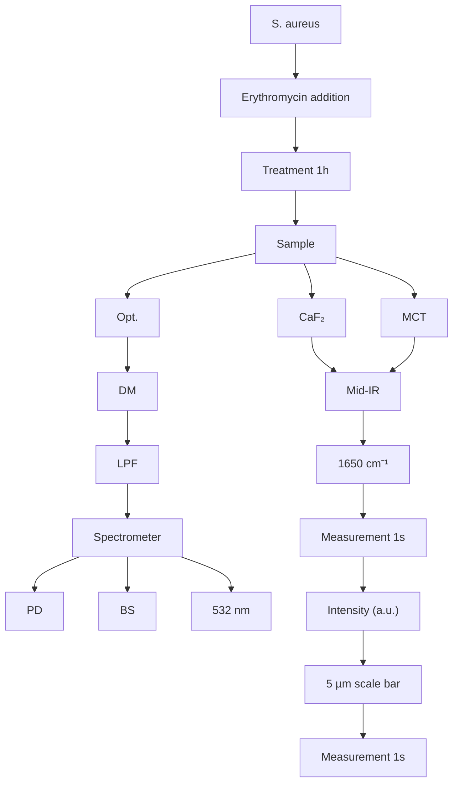

pubs.acs.org/ac

Article

# Fingerprinting Bacterial Metabolic Response to Erythromycin by Raman-Integrated Mid-Infrared Photothermal Microscopy

Jiabao $\mathrm { X u } , ^ { \perp }$ Xiaojie $\mathrm { L i } , ^ { \perp }$ Zhongyue Guo, Wei E. Huang, and Ji-Xin Cheng

Cite This: https://dx.doi.org/10.1021/acs.analchem.0c02489

Read Online

ACCESS

Metrics & More

Article Recommendations

ABSTRACT: We report rapid and sensitive phenotyping of bacterial response to antibiotic treatment at single-cell resolution by a Raman-integrated optical mid-infrared photothermal (MIP) microscope. The MIP microscope successfully detected biochem ical changes of bacteria in specific to the acting mechanism of erythromycin with 1 h incubation. Compared to Raman spectroscopy, MIP spectroscopy showed a much larger signal-to-noise ratio at the fingerprint region at an acquisition speed as fast as 1 s per spectrum. The high sensitivity of MIP enabled detection of metabolic changes at antibiotic concentrations below minimum inhibitory concentration (MIC). Meanwhile, the single-cell

resolution of the technique allowed observation of heteroresistance within one bacterial population, which is of great clinical relevance. This study showcases characterizing antibiotic response as one of the many possibilities of applying MIP microscopy to single-cell biology.

flowchart

## INTRODUCTION

Bacteria express a wide spectrum of phenotypic traits with high relevance for research and development. Sequencing-based techniques have been extensively applied to elucidate the structure and complexity of these microbial communities. What has emerged more recently is the large cellular heterogeneity within an isogenic population which can be crucial in, for example, tackling the rise of antimicrobial resistance due to metabolic adaptions by individual patho gens.1,2 Metabolomics allows comprehensive analysis of molecular phenotypes; however, the bulk measurements can average-out important information on cell-to-cell variance. Therefore, new phenotyping tools are needed to study cell metabolism and physiology at a single-cell level.

Vibrational spectroscopic imaging techniques excel at their noninvasive characterization of biochemical composition inside single cells.3 Infrared absorption spectroscopy and Raman scattering spectroscopy are two vibrational modalities with different selection rules. Because of the weak scattering signal of water, Raman microspectroscopy has been used extensively in biological applications including investigating metabolism of single eukaryotic and prokaryotic cells and probing cell−drug interaction. 9 Compared with Raman scattering which generates strong peaks in the high-wavenumber C−H stretching region, infrared absorption has a large cross section from fingerprint bands. Fourier transform infrared (FTIR) microscopy has been widely used to characterize specimens in chemistry, material sciences, and biological sciences. However, the use of FTIR microscopy for single-cell studies is prohibited by its poor spatial resolution in the range from 3 to 30 μm. The combination of an infrared laser source to an atomic force microscope 10 or a scattering scanning near-field optical microscope11 offers nanoscale spatial resolution down to 10−20 nm. However, the infrared-based techniques mentioned above are mostly only applicable to dried specimens. This hinders their uses in functional studies of living biological systems that require aqueous environments.

Mid-infrared photothermal (MIP) microscopy has been recently developed to overcome such limitation by optica probing of thermal effect as a noncontact approach to detect the infrared absorption.12 -1 In this scheme, infrared absorption at the focus causes a temperature rise that induces a thermal expansion and also changes the local refractive index. Such changes cause subsequently a variation in the propagation of the visible probe beam, which can be detected via a dark field geometry. MIP offers a strong infrared fingerprint signal with submicron resolution merited from the visible probe, which opens up opportunities in investigating chemistry in single cells. A unique feature of MIP microscopy is its high compatibility with confocal Raman microspectroscopy,18

Received: June 11, 2020

Accepted: October 9, 2020

A  

text_image

CaF₂
Mid-IR
Reflective Obj.
Sample
Obj.
DM
LPF
Spectrometer
PD
BS
532 nm

B

text_image

0.43
Amide I
(1650 cm⁻¹)
5 µm
0
0
0.43
Off resonance
(1750 cm⁻¹)
5 µm

C  

line chart

| Wavenumber (cm⁻¹) | Intensity (a.u.) - Untreated | Intensity (a.u.) - Ery-treated for 1hr |
| ----------------- | ---------------------------- | ------------------------------------- |
| ~1050             | ~0.008                       | ~0.009                                |
| ~1550             | ~0.013                       | ~0.014                                |
| ~1650             | ~0.024                       | ~0.023                                |

scatterplot

| Group      | Untreated | 1hr-treated |
| ---------- | --------- | ----------- |
| Integration of MIP peak (a.u.) | 0.14      | 0.16        |
| 1hr-treated  | 0.17      | 0.16        |
| 1hr-treated  | 0.30      | 0.28        |

scatterplot

| Group | Condition | n (%) mean ± SD of Nucleic Acids |
|-------|-----------|----------------------------------|
| Nucleic Acids | Untreated | 1.20 |
| Nucleic Acids | 1hr-treated | 1.00 |
| Amide II | Untreated | 2.20 |
| Amide II | 1hr-treated | 1.80 |
| Amide I | Untreated | 2.00 |
| Amide I | 1hr-treated | 1.60 |

Figure 1. MIP imaging and spectroscopic typing of single S. aureus under influence of erythromycin. (A) A counter-propagating MIP microscope integrated with a Raman spectrometer. BS, beam splitter. PD, photodiode. DM, dichroic mirror. LPF, long pass filter. MCT, mercury cadmium telluride detector. (B) MIP images of single bacteria at Amide $\stackrel { \cdot } { ( } 1 6 5 0 \ \mathrm { c m } ^ { - 1 } )$ and off resonance $( 1 7 5 0 ~ \mathrm { { c m } ^ { - 1 } ) }$ with a probe power of 3 mW, pixel size of 0.2 μm, pump power of $6 \mathrm { m W } ,$ infrared pulse width of 900 ns, and modulated frequency of 100 kHz. (C) Averaged single-cell MIP spectra showing spectral differences of untreated and erythromycin-treated (1 h) S. aureus cells at Nucleic Acids $\left( 1 0 3 0 { - } 1 1 4 \breve { 5 } \mathrm { ~ c m } ^ { - 1 } \right)$ , Amide II (1500− 1600 cm−1 ), and Amide I $\left( 1 6 1 0 { - } 1 7 1 5 \ \mathrm { c m } ^ { - 1 } \right)$ . (D) Quantification of peaks at Nucleic acids, Amide II, and Amide I by integrating the area under the curve. (E) Quantification of ratios of peaks at Amide II/Nucleic Acids and Amide I/Nucleic Acids.

where MIP and Raman spectra of the same object can be recorded with the same submicrometer resolution.

In this study, we deploy a lab-built Raman-integrated MIP microscope to perform spectroscopic typing of bacteria under antibiotic influences. Earlier studies phenotyped a bacterium in its natural state without observing various metabolic and physiological adaptions in real-world scenarios, including microbe-drug interaction or microbe-host symbiosis.17,18 In these earlier studies, the fastest reported speed of recording a spectrum was limited to 24 s because of the settings of the instruments.18 Here, we pushed the speed limit of MIP spectroscopy to cover the entire fingerprint within 1 s by utilizing a quantum cascade laser (QCL) with a high wavelength-scanning speed and correcting the scanning delay between different chips of the laser. We show that MIP is able to probe biochemical changes in a single bacterium, outperforming Raman microspectroscopy in both speed and spectral quality. Harnessing the merit of single-cell resolution, we further assessed the heterogeneity within one bacterial population in response to an antibiotic. To the best of our knowledge, this work presents the first MIP microscopic investigation of bacterial response to drug treatment.

## EXPERIMENTAL SECTION

Bacterial Strain and Culture Condition. Staphylococcus aureus 6538 (ATCC) stored $\mathrm { a t } - 8 0 ~ ^ { \circ } \mathrm { C }$ was grown in Mueller-Hinton agar (MHA). After 10 h, a single colony was picked and inoculated into 3 mL of Mueller-Hinton broth (MHB) and grown to logarithmic growth phase at $3 7 ~ ^ { \circ } \mathrm { C }$ for 2 h.

Antibiotic Treatment for Spectral Measurements. The S. aureus samples at the logarithmic growth phase were inoculated into microcentrifuge tubes containing serial dilutions of erythromycin in MHB to achieve various concentrations of erythromycin and final concentrations of bacteria at $\sim 5 \ : \mathrm { ~ \times ~ } \ : 1 0 ^ { 5 } / \mathrm { m L }$ . The tubes were incubated aerobically at $3 7 ~ ^ { \circ } \mathrm { C }$ with shaking. After 1 h, the bacteria were centrifuged and washed twice with sterile water. Then, 2 μL of bacteria solution was deposited to a CaF coverslip and kept at room temperature for 5 min for the bacteria to attach to the coverslip, ready for spectral measurements.

Minimal Inhibitory Concentration Determination. Broth dilution method was used for the minimal inhibitory concentration (MIC) test. The S. aureus samples at the logarithmic growth phase were inoculated into microdilution plates (96 wells) containing serial dilutions of erythromycin in MHB to achieve final concentrations of bacterial cells at ${ \sim } 5 \times$ $1 0 ^ { 5 } / \mathrm { m L }$ . The plates were then incubated at $3 7 ~ ^ { \circ } \mathrm { C } .$ The optical density at 600 nm $\left( \mathrm { O D } _ { 6 0 0 } \right)$ of the corresponding wells was measured after 24 h. The MIC was defined as the lowest concentration of erythromycin under which cell growth was completely inhibited, identified by a clear solution observed by naked eyes and an $\mathrm { O D } _ { 6 0 0 }$ less than 0.05. The number of microorganisms was assessed at each concentration of erythromycin by plating 10-fold dilutions of the bacterial suspension on MHA in quadruplicates. The number of bacteria was determined as colony forming units (CFUs) and the killing percentage was determined by the percentage of CFU differences at each concentration compared with the original CFUs.

Raman-Integrated MIP Microscope. A schematic of the Raman-integrated MIP microscope is shown in Figure 1A. The laser sources comprised a pulsed QCL (Daylight Solutions, MIRcat-2400) for mid-infrared (from 1000 to $1 7 7 0 ~ \mathrm { c m } ^ { - 1 } )$ excitation and a continuous-wave laser (Cobolt, Samba 532 nm) at a wavelength of 532 nm for probing the photothermal effect. The scanning delay between different chips was corrected. The mid-infrared pump beam was focused onto the sample by a reflective objective lens $( 5 2 { \times } ; ~ \mathrm { N A } , ~ 0 . 6 5 ;$ Edmund Optics, #66589) with gold coating, while the visible probe beam was focused to the same spot by a high NA refractive objective lens (60×; NA, 1.2; water immersion; Olympus, UPlanSApo). The infrared absorption at the focus caused a temperature increase that locally changed the refractive index of the sample, which consequently affected the propagation of the visible probe beam. Meanwhile, illumination of the sample by the visible laser simultaneously generated spontaneous Raman scattering. The back-reflected beam containing photothermal information passed a dichroic mirror (DM) (Edmund Optics, #69215) and was directed to a silicon photodiode (PD) (Hamamatsu, S3994-01) by a 50:50 beam splitter (BS). The scattering beam generated by Raman scattering was reflected by the DM and focused into a spectrometer (Andor Technology, Shamrock SR-303i-A) through an achromatic lens of 100 mm focal length. The mid-infrared laser power was monitored by a mercury cadmium telluride (MCT, Vigo Inc., PVM-10.6) detector.

The photocurrent from the PD was amplified by a laboratory-built resonant circuit (resonant frequency at 103.8 kHz, gain 100) and sent to a lock-in amplifier (Zurich Instruments, HF2LI) for phase-sensitive detection to acquire the photothermal signal. The mid-infrared laser power spectrum was measured by the MCT detector through another lock-in input channel. Based on the photothermal image, a spectrometer equipped with a charge-coupled device (Andor Technology, Newton DU920N-BR-DD) was used to acquire Raman spectrum from pixels of interest. The window covered from 1000 to $1 8 0 0 ~ \mathrm { { c m } ^ { - 1 } }$ with a grating of 1200 mm/L. A computer was used to synchronize the QCL wavelength selection, stage scanning, and data acquisition. For each sample, around 30 cells were measured. Before measurements, the integrity of the cells was observed under the microscope and by MIP imaging at the Amide I peak at $1 6 5 0 ~ \mathrm { { c m } ^ { - 1 } }$ , and only intact cells were measured to maintain a consistent signal level.

MIP and Raman Spectral Data Processing and Analysis. Data processing for photothermal spectra was done under a MATLAB environment using in-house scripts. The raw photothermal signal was normalized by the midinfrared laser power spectrum collected by the MCT detector with resolution of $\zeta \mathrm { c m } ^ { - 1 }$ to obtain the absorption spectrum of samples. The photothermal spectra were further normalized by the area under the curve between l0oo and $1 7 7 0 \ \mathrm { c m ^ { - 1 } }$ for comparison between groups of bacteria. No baseline correction was performed on the MIP spectra as mid-infrared light causes little autofluorescence in biological samples.

Data processing for Raman spectra was done using commercial software (HORIBA, LabSpec 6). After manually removing cosmic spikes, baseline correction was performed using a polynomial of order 10 with maximally 120 points. The Raman signal was further normalized by the area under the curve for comparison between bacteria.

The signal-to-noise ratio (SNR) of MIP and Raman spectra was calculated as the ratio of the signal intensity to the standard deviation of the background noise. The signal was decided by the peak intensity of the most prominent peak in the acquired spectra, that was, the Amide I peak at around $1 6 5 0 \ \mathrm { c m ^ { - 1 } }$ in MIP and the $\mathrm { C H } _ { 2 }$ peak at around 1450 cm−1 in Raman. The background noise was chosen at a region where the signal level was the lowest and the background had the highest contribution to the acquired intensity.

Data analysis and visualization were done under an R 3.3.3 environment using in-house scripts. Only for the comparison between MIP and Raman spectra, both datasets were sized to a matching spectral step of 5 $\mathrm { c m } ^ { - 1 }$ and a spectral range from 1000 to $1 7 \bar { 6 } 5 ~ \mathrm { c m } ^ { - 1 }$ . MIP peaks associated with Nucleic Acids $\left( 1 0 3 0 { - } 1 1 4 5 ~ \mathrm { c m } ^ { - 1 } \right)$ , Amide II $\left( 1 5 0 0 { - } 1 6 0 0 \ \mathrm { c m } ^ { - 1 } \right)$ , and Amide I $\left( 1 6 1 0 { - } 1 7 1 5 \ \mathrm { ~ c m } ^ { - 1 } \right)$ were integrated to quantify the intracellular biomolecule concentrations. The ratios of Amide II or Amide I peak integral to Nucleic Acid peak integral were also calculated. Box plots showing the quantification distribution were plotted. The rectangle in the box plots represented the second and third quartiles with a line inside representing the median. The lower and upper quartiles were drawn as lines outside the box. Sample means were compared by using Welch’s two sample t-test for unequal variance, and statistical significance was marked $\mathsf { a s } ^ { \ast \ast \ast \ast } \hat { \big ( p < 0 . 0 0 0 1 \big ) }$ , \*\*\* $( p < 0 . 0 0 1 { \breve { ) } } , \ast \ast ( p < 0 . 0 1 )$ , and $^ { * } ~ ( p ~ < ~ \bar { 0 } . 0 5 )$ or ns (not significant).

## RESULTS AND DISCUSSION

MIP Imaging and Fingerprinting of Single Bacteria under the Influence of an Antibiotic. Figure 1A shows the schematic of our Raman-integrated MIP microscope. In brief, a pulsed mid-infrared pump beam is focused at the sample with a reflective objective, and the reflected probe beam is collected by a 50:50 BS and sent to a silicon PD. A continuous visible probe laser at 532 nm is focused onto the sample by a waterimmersion objective, which also serves as the excitation source for Raman scattering. The Raman scattering signal is reflected by a DM and directed to a spectrometer.

On the basis of the submicrometer resolution of the microscope, we explored its potential for characterization of single bacteria under antibiotic influence in the fingerprint region using S. aureus ATCC 6538 and erythromycin as a testing model. To ensure clinical relevance, we have prepared the bacterial cells in accordance with the standard broth dilution method used for antibiotic susceptibility test (AST). The S. aureus cultures were grown in MHB to logarithmic growth phase and diluted to a concentration of $5 \times 1 0 ^ { 5 } /$ mL before being inoculated into erythromycin-containing medium $\left( 0 . 0 6 ~ \mu \mathrm { g / m L } \right)$ .

We first acquired MIP images of S. aureus cells on a CaF slide at 1650 and 1750 cm−1 (Figure 1B). At $1 6 5 0 ~ \mathrm { { c m } ^ { - 1 } }$ 2, assigned to the Amide I band in proteins, individual S. aureus cells gave strong contrast. Under the same field view, tuning the laser to an off-resonance $1 7 5 0 ~ \mathrm { ~ c m } ^ { - 1 }$ resulted in the disappearance of MIP contrast. Then, we pinpointed the lasers to the center of each bacterium and acquired single-cell MIP spectra. Figure 1C illustrates the fingerprint MIP spectra of S. aureus before (red) and after (blue) treating with erythromycin for 1 h, averaged from around 30 single cells. Compared with their untreated counterparts, erythromycin-treated S. aureus illustrated prominently different profiles. Differences were observed particularly in the peaks centered around 1080, 1550, and $1 6 5 0 ~ \mathrm { { c m } ^ { - 1 } }$ , which can be assigned to the phosphate vibration $\left( \nu _ { s } \mathrm { P O } _ { 2 } ^ { - } \right)$ of Nucleic Acids, Amide II of proteins, and Amide I of proteins, respectively. C

line chart

| Wavenumber (cm⁻¹) | 1s (SNR~25) | 4s (SNR~51) | 16s (SNR~111) |
| ----------------- | ----------- | ----------- | ------------- |
| 1000              | ~0          | ~0          | ~0            |
| 1200              | ~0          | ~0          | ~0            |
| 1400              | ~0          | ~0          | ~0            |
| 1600              | ~0          | ~0          | ~0            |
| 1800              | ~0          | ~0          | ~0            |

line chart

| Wavenumber (cm⁻¹) | Intensity (a.u.) |
| ----------------- | ---------------- |
| 16s               | ~1.5             |
| 4s                | ~1.0             |
| 1s                | ~0.8             |

line chart

| Wavenumber (cm⁻¹) | 1s     | 4s     | 16s    |
| ----------------- | ------ | ------ | ------ |
| 1000              | Low    | Low    | Medium |
| 1200              | Low    | Medium | Medium |
| 1400              | Low    | Medium | Medium |
| 1600              | High   | High   | Very High |
| 1800              | Low    | Low    | Low    |

line chart

| Wavenumber (cm⁻¹) | Intensity (a.u.) at 1s | Intensity (a.u.) at 4s | Intensity (a.u.) at 16s |
| ----------------- | ---------------------- | ---------------------- | ----------------------- |
| 1000              | ~0.2                   | ~0.3                   | ~0.5                    |
| 1200              | ~0.3                   | ~0.4                   | ~0.6                    |
| 1400              | ~0.4                   | ~0.5                   | ~0.7                    |
| 1600              | ~0.3                   | ~0.4                   | ~0.6                    |
| 1800              | ~0.2                   | ~0.3                   | ~0.5                    |

Erythromycin-treated S. aureus

•Untreated S. aureus  

scatterplot

| Group | Dim1 (68.6%) | Dim2 (11.5%) |
|-------|--------------|--------------|
| 1s    | -0.015       | -0.003       |
| 4s    | -0.008       | 0.001        |
| 16s   | 0.005        | 0.004        |

scatterplot

| Dim1 (43.5%) | Dim3 (4.2%) | Label |
| ------------ | ----------- | ----- |
| -0.50        | 0.0         | 1s    |
| -0.25        | 0.0         | 1s    |
| 0.00         | 0.0         | 4s    |
| 0.25         | 0.0         | 16s   |
| 0.25         | -0.1        | 16s   |
| 0.25         | -0.2        | 16s   |

Figure 2. Comparison between single-cell MIP spectra and single-cell Raman spectra with the same spectral acquisition time of either 16, 4, or 1 s. (A,B) Single-cell spectrum of S. aureus showing SNR at different acquisition times using (A) MIP or (B) Raman microscopy. (C,D) Comparison of averaged spectra by (C) MIP and (D) Raman microscopy of untreated (darker) and erythromycin-treated (lighter) S. aureus at different acquisition times of 16 s (green), 4 s (orange), and 1 s (purple). The shaded area represents the standard deviation from single-cell measurements. (E,F) PCA of spectra of untreated and erythromycin-treated S. aureus cells at different acquisition times using (E) MIP and (F) Raman microscopy.

Next, we performed quantification and comparison of the three peaks at the single-cell level by integrating the area under the curve for all bacterial cells in each group to highlight the phenotypic differences (Figure 1D). Under antibiotic influence, the Nucleic Acid content significantly increased (p $< 0 . 0 0 0 1 \big )$ ), accompanying a decrease in the protein content at both Amide II $\left( p < 0 . 0 0 0 1 \right)$ and Amide I $\left( p < 0 . 0 0 0 1 \right)$ peaks. Erythromycin is a 50S rRNA-binding antibiotic which inhibits ribosomes, thus reducing the protein synthesis in the bacteria. As a result, it also causes an accumulation of untranslated

RNA, thus increasing the nucleic acid content. We then calculated the ratio of total proteins to total Nucleic Acids as an indicator of bacterial replication,20 as shown in Figure 1E. Both the ratios of Amide I/Nucleic Acids and Amide II/ Nucleic Acids dropped significantly after 1 h of erythromycin treatment $\left( p \ < \ 0 . 0 0 0 1 \right)$ ), indicating inhibited growth and replication caused by the antibiotic. Collectively, our results illustrate that fingerprint MIP enabled sensitive detection of the hindered protein synthesis caused specifically by the mechanism of action of erythromycin as well as the subsequent accumulation of untranslated RNA. Only 1 h antibiotic treatment was needed to produce a pronounced change in fingerprint infrared bands.

Speed and SNR Comparison between MIP and Raman Spectroscopy. With the unique design of our Raman-integrated MIP microscope, we were able to acquire the Raman and infrared fingerprint spectra at the same time. Figure 2A,B demonstrates the single spectra acquired in one S. aureus cell by MIP and Raman. We compared the SNRs of MIP and Raman fingerprinting with acquisition time of $1 6 , 4 ,$ or 1 s. With a decrease in the acquisition time. the SNR of the MIP spectra was 111 at 16 s, 51 at 4 s, and 25 at 1 s (Figure 2A). At each acquisition time, the SNR of the Raman fingerprint was significantly lower as 26 at $1 6 \ s , \ 9$ at 4 s, and 6 at 1 s (Figure 2B). The high SNR in MIP spectra was achieved by the high scanning speed of the QCL, for example, the scanning speed was adjusted from $5 0 ~ \mathrm { c m } ^ { - 1 } / s$ (16 s acquisition time) to 800 $\mathrm { c m } ^ { - 1 } / \mathrm { s }$ (1 s acquisition time). With the high speed capacity, single-cell MIP shows a spectral SNR around 4 times higher than single-cell Raman with 1 s acquisition time.

A

<table><tr><td colspan="8">S. aureus ATCC 6538</td></tr><tr><td>Erythromycin (μg/mL)</td><td>0</td><td>0.015</td><td>0.03</td><td>0.06</td><td>0.12</td><td>0.5</td><td>1</td></tr><tr><td> $OD_{600}$ </td><td>0.2941</td><td>0.1697</td><td>0.1042</td><td>0.0016</td><td>0.0005</td><td>0</td><td>-0.001</td></tr></table>

B  

bar chart

| Erythromycin concentration (ug/mL) | CFU/mL (light green) | CFU/mL (brown) |
| ---------------------------------- | --------------------- | --------------- |
| 0                                  | 450000                | 0               |
| 0.015                              | 300000                | 180000          |
| 0.03                               | 300000                | 200000          |
| 0.06                               | 350000                | 180000          |
| 0.12                               | 450000                | 150000          |
| 0.5                                | 750000                | 150000          |
| 1                                  | 750000                | 150000          |

C  

line chart

| Wavenumber (cm⁻¹) | Nucleic Acids Intensity (a.u.) | Amide I Intensity (a.u.) |
| ----------------- | ------------------------------ | ------------------------ |
| 1000              | ~0.8                           | ~0.9                     |
| 1200              | ~0.7                           | ~0.8                     |
| 1400              | ~0.6                           | ~0.7                     |
| 1600              | ~0.5                           | ~0.6                     |
| 1800              | ~0.4                           | ~0.5                     |

D  

scatterplot

| Erythromycin concentration (μg/mL) | Nucleic Acids (Integration of MIP peak a.u.) | Amide II (Integration of MIP peak a.u.) | Amide I (Integration of MIP peak a.u.) |
| ---------------------------------- | ------------------------------------------ | -------------------------------------- | ------------------------------------- |
| 0.00                               | 0.12                                       | 0.18                                   | 0.35                                  |
| 0.015                              | 0.14                                       | 0.17                                   | 0.34                                  |
| 0.03                               | 0.15                                       | 0.16                                   | 0.33                                  |
| 0.06                               | 0.16                                       | 0.15                                   | 0.34                                  |
| 0.12                               | 0.18                                       | 0.14                                   | 0.35                                  |
| 0.25                               | 0.19                                       | 0.13                                   | 0.36                                  |
| 0.5                                | 0.20                                       | 0.12                                   | 0.37                                  |

scatterplot

| Erythromycin concentration (µg/mL) | Integration of MIP peak (a.u.) - Amide I/II/Nucleic Acids | Integration of MIP peak (a.u.) - Amide I/Nucleic Acids |
| ---------------------------------- | ---------------------------------------------------------- | -------------------------------------------------------- |
| 0.00                               | 1.5                                                        | 3.0                                                    |
| 0.015                              | 1.4                                                        | 2.8                                                    |
| 0.03                               | 1.3                                                        | 2.6                                                    |
| 0.06                               | 1.1                                                        | 2.4                                                    |
| 0.12                               | 0.9                                                        | 2.2                                                    |
| 0.25                               | 0.8                                                        | 2.0                                                    |
| 0.5                                | 0.7                                                        | 1.8                                                    |

Figure 3. Bacterial response to different concentrations of antibiotic. (A) MIC measurement of erythromycin againstS. aureus ATCC 6538. $\mathrm { O D } _ { 6 0 0 }$ represents the optical density at 600 nm after 24 h of drug treatment. MIC, highlighted as orange, was the lowest drug concentration under which $\mathrm { O D } _ { 6 0 0 }$ was lower than 0.05. (B) Visualization of concentration-dependent killing of S. aureus ATCC 6538 by erythromycin after 1 h incubation time and colonies were counted after 20 h. Represented are average values of the cell count in logarithmic CFUs per mL (green bars, left scale) and the corresponding killing rate in percentage (red bars, right scale). The killing percentage was determined by the percentage of CFU differences at each concentration compared with the original CFU. The asterisk shows the MIC. (C) Single-cell MIP spectra of S. aureus ATCC 6538 treated with different concentrations of erythromycin. Quantification of (D) Nucleic Acids, Amide II, and Amide I MIP peaks and (E) the ratios of Amide II/Nucleic Acids and Amide I/Nucleic Acids.

We then acquired MIP spectra (Figure 2C) and Raman spectra (Figure 2D) of 30 single cells from untreated and erythromycin-treated S. aureus by a Raman-integrated MIP microscope. Averaged spectra were plotted, with shaded area as the standard deviation from the single-cell measurements at each wavenumber. Comparison of spectral differences showed more observable changes after antibiotic treatment for 1 h in single-cell MIP spectra. Smaller spectral noise was also observed by a smaller standard deviation in the MIP fingerprints (Figure 2C) compared with a high background noise level in the Raman spectra (Figure 2D).

Unsupervised principal component analysis (PCA) was used to reduce the high-dimensional spectral datasets and visualize them at a single-cell level. The PCA plot of the infrared spectra along the first two dimensions shows clear clustering of each group and separates the drug-treated group from the nontreated group at all acquisition times (Figure 2E). In the PCA plot of the Raman spectra, more dispersed clusters were observed in all groups, and the separation between the drugtreated group and the control group worsens with a decrease in the measurement time (Figure 2F). Overall, PCA analysis of erythromycin-treated and -untreated single-cell spectra showed a much better differentiation by MIP fingerprinting than Raman fingerprinting at all acquisition parameters.

Raman microscopy has gained wider acceptance as a mature phenotypic tool to characterize bacteria including clinically relevant pathogens and to study microbe−antibiotic interactions,5 merited from the rich information in the fingerprint region and the tolerance of water in the biological samples. However, its weakness remains as the intrinsically small Raman cross section, particularly in the fingerprint region. Measuring a single bacterium can take 15−60 s for a high-quality Raman spectrum in the fingerprint $\mathrm { r e g i o n . } ^ { 6 - 8 }$ Because of the long measurement time, spontaneous Raman spectroscopy or imaging is not feasible for a living bacterium that could divide or otherwise alter its physiological state within that time.4 Our results demonstrate that MIP microscopy can sensitively phenotype a single bacterium within 1 s, which is significantly $\left( 2 4 ~ \ s \right) ^ { 1 7 , 1 8 }$ beneficial in terms of real-time monitoring of live bacteria, as well as reducing the overall time required to measure all single cells in a community.

A  

radar chart

| Concentration | Total | Nucleic Acids | Amide II | Amide I |
| ------------- | ----- | ------------- | -------- | ------- |
| 0xMIC         | 0.1   | 0.05          | 0.07     | 0.2     |
| 0.25xMIC      | 0.08  | 0.04          | 0.06     | 0.18    |
| 0.5xMIC       | 0.07  | 0.03          | 0.05     | 0.16    |
| 1xMIC         | 0.06  | 0.02          | 0.04     | 0.14    |
| 2xMIC         | 0.05  | 0.01          | 0.03     | 0.12    |
| 4xMIC         | 0.04  | 0.01          | 0.02     | 0.1      |
| 8xMIC         | 0.03  | 0.01          | 0.01     | 0.08    |

line chart

| Wavenumber/cm⁻¹ | Intensity (a.u.) |
| --------------- | ---------------- |
| 1000            | ~0.002           |
| 1200            | ~0.005           |
| 1400            | ~0.003           |
| 1600            | ~0.018           |
| 1800            | ~0.001           |

C  

line chart

| Wavenumber/cm⁻¹ | Intensity (a.u.) |
| --------------- | ---------------- |
| 1000            | ~0.005           |
| 1200            | ~0.008           |
| 1400            | ~0.006           |
| 1600            | ~0.018           |
| 1800            | ~0.002           |

Figure 4. Phenotypic heterogeneity illustrated by single-cell MIP spectroscopy. (A) Degree of heterogeneity in the total spectra, Nucleic Acids, Amide II, and Amide I peaks in single-cell MIP spectra at different concentrations of erythromycin. The degree of heterogeneity is defined as the sum of standard deviation in populations of single cells at the whole spectral region, Nucleic Acid region, Amide II region, or Amide I region. Examples of single-cell heterogeneity within one population were presented by randomly selecting two single-cell spectra at (B) 1 × MIC and (C) 8 × MIC concentrations of erythromycin.

Bacterial Response to Different Concentrations of Antibiotic and Subpopulation Heterogeneity. Like in traditional AST, the MIC of erythromycin against S. aureus ATCC 6538 was determined by broth dilution method. The minimal dose under which no visible bacterial growth was detected after 24 h of drug exposure, namely MIC, was 0.06 μg/mL measured by $\mathrm { O D } _ { 6 0 0 }$ (Figure 3A). The CFUs were counted, and the killing percentages were calculated at each antibiotic concentration (Figure 3B).

To compare with the traditional AST, we performed spectral measurements by the MIP microscope on S. aureus along the same gradient of antibiotic concentrations (Figure 3C). Quantification of Nucleic Acids, Amide II, and Amide I is shown in Figure 3D to visualize the effect with an increasing exposure of erythromycin on phenotypic expression of the bacteria (Figure 3D). A gradual decrease in the Amide I and Amide II peaks was observed with an increasing exposure of erythromycin, indicating hindered protein synthesis in S. aureus. On the other hand, the Nucleic Acid peak gradually increased because of an accumulation of untranslated RNA. It plateaued around 2 × MIC (0.12 μg/mL), which is in good agreement with the CFU counting and killing percentage in Figure 3B.

The ratios of Amide II/Nucleic Acids and Amide I/Nucleic Acids were calculated as an indication of bacterial replicative activity, both of which gradually decreased from 0 to 4 × MIC (0.24 μg/mL) and remained the same level at 8 × MIC and 16 × MIC (Figure 3E). At concentrations of 8 × MIC and 16 × MIC, more than 80% of the bacterial population were killed (Figure 3B), therefore contributing little to the overall nucleic acid synthesis and replicative rate.

Both the metabolic and replicative changes were observed at doses of antibiotic lower than the MIC measured by traditional AST at 0.06 μg/mL and matched well the CFU counting and killing percentage calculations. Compared to the traditional AST which requires an incubation time of at least 24 h, the MIP illustrates substantial sensitivity of tracking metabolic changes of bacteria within 1 h.

Next, we aimed to look at phenotypic heterogeneity among individual bacteria in the same population. A certain degree of physiological and metabolic heterogeneity existed in an isogenic population of bacteria under antibiotic retreatment, characterized by the sum of standard deviations in populations of single cells at Nucleic Acids, Amide II and Amide I peaks, and the entire fingerprint area (Figure 4A). The heterogeneity spiked at 0 × MIC, 1 × MIC, and 8 × MIC, potentially showing subpopulations of bacteria displaying differen strategies/physiologies against antibiotic despite being iso genic. Figure 4B shows an example of Amide I difference between two single-cell spectra at 1 × MIC. Figure 4C shows another example of Nucleic Acid difference between two cells at 8 × MIC.

Physiological heterogeneity of bacteria within one popula tion was observed because of the merit of single-cell resolution, which is specifically important in the study of bacterial infection.4 The occurrence of varied responses to antibiotics within the same population, known as heteroresistance, is a poorly characterized phenomenon because of the populationwise approach of standard AST.21 Several heteroresistance studies have revealed the importance of subpopulation-wise heterogeneity to the survival of pathogenic bacteria during antibiotic treatment and consequently the treatment results.2,22,23 The heteroresistance can also be unstable and transient and further complicates the detection.22 Our data show that rapid single-cell analysis by MIP microscopy, which can detect single-cell phenotype in 1 s, offers a promising solution.

## CONCLUSIONS

The reported rapid fingerprinting of bacteria under antibiotic influence shows the capability, sensitivity, and speed of MIP microscopy in characterizing bacterial phenotypes and metabolism. Our method succeeded at probing biochemical changes of single bacterial cells in specific to the acting mechanism of erythromycin with an incubation time of 1 h. We have pushed the speed limit of MIP spectroscopy to 1 s per spectrum covering the entire fingerprint window. Compared with single-cell Raman spectroscopy which has been extensively used in investigating single-cell metabolism including bacterial responses to antibiotics, MIP showed stronger signal at the fingerprint region and higher SNR when lower acquisition time (1 s) was used. The MIP microscope also illustrated high sensitivity of detecting metabolic changes below the standard MIC value. Because of the single-cell resolution, a degree of heteroresistance was observed in an isogenic population of bacteria, the detection of which can be crucial in clinical decisions and treatment results. This rapid and sensitive fingerprinting method can be of great potential in understanding bacterial metabolism and antibiotic pharmacodynamics and developing novel clinical interventions.

## AUTHOR INFORMATION

## Corresponding Author

− Department of Biomedical Engineering, Boston -Xin ChengUniversity, Boston, Massachusetts 02215, United States;

orcid.org/0000-0002-5607-6683; Email: jxcheng@bu.edu

## Authors

− Department of Biomedical Engineering, Boston abao XuUniversity, Boston, Massachusetts 02215, United States; Department of Engineering Science, University of Oxford, Oxford OX1 3PJ, U.K.  
− Department of Biomedical Engineering, Boston aojie LiUniversity, Boston, Massachusetts 02215, United States; State Key Laboratory of Applied Optics, Changchun Institute of Optics, Fine Mechanics and Physics, Chinese Academy of Sciences, Changchun, Jilin 130033, China; University of Chinese Academy of Sciences, Beijing 100049, China

− Department of Biomedical Engineering, hongyue GuoBoston University, Boston, Massachusetts 02215, United State − Department of Engineering Science, University ei E. Huangof Oxford, Oxford OX1 3PJ, U.K.; orcid.org/0000-0003- 1302-6528

Complete contact information is available at: https://pubs.acs.org/10.1021/acs.analchem.0c02489

## Author Contributions

⊥J.X. and X.L. contributed equally to the work.

## Notes

The authors declare no competing financial interest.

## ACKNOWLEDGMENTS

This work is supported by NIH grants R01AI141439, R35GM136223, R42CA224844, and R44EB027018 to J.- X.C. The authors thank Yi Zhang for help in instrumentation.

## REFERENCES

(1) Şimsek, E.; Kim, M.̧ ISME J. 2018, 12, 1199−1209.  
(2) Nicoloff, H.; Hjort, K.; Levin, B. R.; Andersson, D. I. Nat. Microbiol. 2019, 4, 504−514.  
(3) Cheng, J.-X.; Xie, X. S. Science 2015, 350, aaa8870.  
(4) Kogermann, K.; Putrins, M.; Tenson, T.̌ Eur. J. Pharm. Sci. 2016, 95, 2−16.  
(5) Stöckel, S.; Kirchhoff, J.; Neugebauer, U.; Rösch, P.; Popp, J. J. Raman Spectrosc. 2016, 47, 89−109.  
(6) Moritz, T. J.; Taylor, D. S.; Polage, C. R.; Krol, D. M.; Lane, S. M.; Chan, J. W. Anal. Chem. 2010, 82, 2703−2710.  
(7) Athamneh, A. I. M.; Alajlouni, R. A.; Wallace, R. S.; Seleem, M. N.: Senger, R. S. Antimicrob. Ágents Chemother. 2014. 58, 1302—1314.  
(8) Münchberg, U.; Rösch, P.; Bauer, M.; Popp, J. Anal. Bioanal. Chem. 2014, 406, 3041−3050.  
(9) Song, Y.; Cui, L.; Lopez, J. Á ́. S.; Xu, J.; Zhu, Y.-G.; Thompson, I. P.; Huang, W. E. Sci. Rep. 2017, 7, 16648.  
(10) Dazzi, A.; Prater, C. B.; Hu, Q.; Chase, D. B.; Rabolt, J. F.; Marcott, C. Appl. Spectrosc. 2012, 66, 1365−1384.  
(11) Huth, F.; Govyadinov, A.; Amarie, S.; Nuansing, W.; Keilmann, F.; Hillenbrand, R. Nano Lett. 2012, 12, 3973−3978.  
(12) Zhang, D.; Li, C.; Zhang, C.; Slipchenko, M. N.; Eakins, G.; Cheng, J.-X. Sci. Adv. 2016, 2, No. e1600521.  
(13) Bai, Y.; Zhang, D.; Li, C.; Liu, C.; Cheng, J.-X. J. Phys. Chem. B 2017, 121, 10249−10255.  
(14) Klementieva, O.; Sandt, C.; Martinsson, I.; Kansiz, M.; Gouras, G. K.: Borondics. F. Adv. Sci. 2020, 7, 1903004.  
(15) Samolis, P. D.; Sander, M. Y. Opt. Express 2019, 27, 2643− 2655.  
(16) Li, C.; Zhang, D.; Slipchenko, M. N.; Cheng, J.-X. Anal. Chem. 2017, 89, 4863−4867.  
(17) Li, Z.; Aleshire, K.; Kuno, M.; Hartland, G. V. J. Phys. Chem. B 2017, 121, 88388846.  
(18) Li, X.; Zhang, D.; Bai, Y.; Wang, W.; Liang, J.; Cheng, J.-X. Anal. Chem. 2019, 91, 10750−10756.  
(19) Movasaghi, Z.; Rehman, S.; ur Rehman, D. I. Appl. Spectrosc. Rev. 2008, 43, 134179.  
(20) Xu, J.; Preciado-Llanes, L.; Aulicino, A.; Decker, C. M.; Depke, M.: Gesell Salazar. M.: Schmidt. F.: Simmons. A.i Huang. W. E. Anal Chem. 2019, 91, 7729−7737.  
(21) El-Halfawy, O. M.; Valvano, M. A. Clin. Microbiol. Rev. 2015, 28, 191−207.  
(22) Andersson, D. I.; Nicoloff, H.; Hjort, K. Nat. Rev. Microbiol. 2019, 17, 479−496.  
(23) Sanchez-Romero, M. A.; Casadesú s, J.́ Proc. Natl. Acad. Sci. U.S.A. 2014, 111, 355−360.