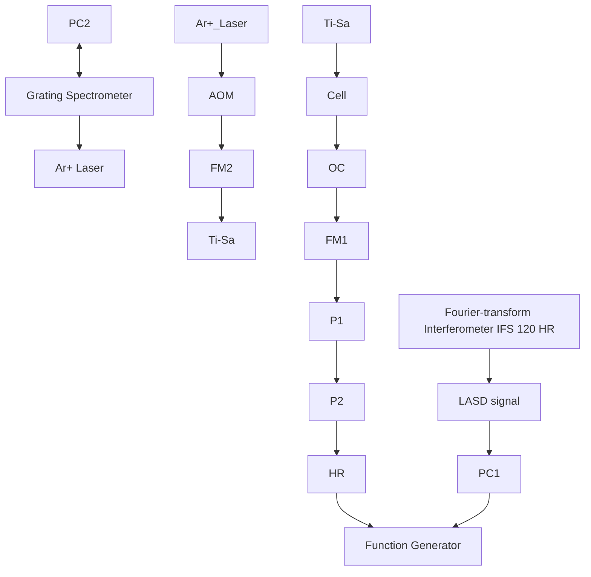

# Fourier-transform intra-cavity laser absorption spectroscopy of HOD $\nu _ { 0 \mathbf { D } } = 5$ overtone

Shuiming Hu,\* Hai Lin, Shenggui He, Jixin Cheng and Qingshi Zhu

Open L aboratory of Bond-Selective Chemistry, University of Science and T echnology of China, Hefei 230026, P.R. China. E-mail: Fax:smhu=mail.ustc.edu.cn; ]86 551 3602969

Received 5th May 1999, Accepted 30th June 1999

The newly developed high resolution Fourier-transform intra-cavity laser absorption spectroscopy (FT-ICLAS) was utilized to record the $\nu _ { \mathrm { O D } } = 5$ stretching overtone of HOD at a resolution of $0 . 0 5 \mathrm { c m } ^ { - 1 }$ in the region $1 2 5 5 0 – 1 2 9 0 0 \mathrm { c m } ^ { - 1 }$ . The spectrum was rotationally analysed and the spectroscopic parameters were derived from nonlinear least-squares Ðtting. Good agreement of the observed with the calculated energy levels was achieved.

## I. Introduction

Due to the delocalized nature of the stretching vibrational levels, HOD has been an attractive proposition for the realization of bond selective chemistry reactions.1 A high resolution spectroscopic study can provide the necessary information towards this goal. However, very little is known about the high overtone region of HOD. The Ðrst extensive spectroscopic study of HOD was carried out by Benedict et al. in the region 2400È8000 $\mathrm { c m } ^ { - 1 }$ with a resolution of $0 . 2 5 ~ \mathrm { c m } ^ { - 1 } . { } ^ { 2 }$ Accurate values for the rotational energy levels of the HOD ground vibrational state and spectroscopic constants of the Watson-type reduced Hamiltonian have been reported by Papineau et $a l . ^ { 3 }$ and by $\mathrm { J o h n s } . ^ { 4 }$ Fourier transform spectra were recorded for the (010)¤ band,5 for the (100) and (020) bands,3,6 and for the (001), (110) and (030) bands.7 Toth also reported an FTS study of the transitions of HOD in the region 4719È58438 and $6 0 0 0 { - } 7 7 0 0 \ \mathrm { c m } ^ { - 1 } . ^ { 9 }$ The single-mode distributed feedback semiconductor laser was used to record the absorption spectra of the (101) and (021) bands with an experimental accuracy of about 0.004 cm\~1.10 The (012), (121) and (310) bands were studied by intra-cavity laser absorption spectroscopy (ICLAS) from 8000 to 9000 $\mathrm { c m } ^ { - 1 } . ^ { 1 1 , 1 2 ^ { \bullet } }$ The highly excited vibrational states of the HOD molecule, (003) and (005), were recorded by Bykov et al. using ICLAS and photo-acoustic spectroscopy, respectively.13 Recently, the OH stretch overtones (003) and (004) were studied by Fair et al. with photo-acoustic spectroscopy and a transition dipole alignment of HOD was also carried out.14

Among the various spectroscopic methods, ICLAS is the technique with ultra-sensitivity and has been widely used. A detailed description of ICLAS and references to early papers can be found elsewhere.15,16 The main idea is to place the sample cell inside the cavity of a broad band laser. The resulting spectrum of the sample appears as absorption lines superimposed on the envelope of the broad band laser emission,17,18

$$
I (\sigma , t _ {\mathrm{g}}) = I _ {0} (\sigma , t _ {\mathrm{g}}) \times \exp [ - \alpha (\sigma) L _ {\mathrm{eq}} ] \tag {1}
$$

$$
L _ {\mathrm{eq}} = c t _ {\mathrm{g}} l / L \tag {2}
$$

In equations above, p denotes the frequency and $t _ { \mathbf { g } }$ is the generation time, $I _ { 0 } ( \sigma , t _ { \mathrm { g } } )$ is the envelope of the laser emission. The exponential term describes the intra-cavity absorption in the form of the LambertÈBeer law with a sample absorption coef-Ðcient of (a)p and an equivalent absorption pathlength of L , $L _ { \mathrm { e q } } ,$ where c is the light speed and l/L is the ratio of the length of the intra-cavity sample cell with respect to the total length of the laser cavity. In the recent years, there has been considerable e†ort in developing a Fourier-transform (FT) based optical technology to record the highly sensitive ICLAS spectra. The motivation comes from the following advantages promised by Fourier-transform intra-cavity laser absorption spectroscopy (FT-ICLAS) : (1) FT-ICLAS will have a high sensitivity which is the main advantage of ICLAS together with a high resolution since the resolution in Fouriertransform spectroscopy (FTS) can reach up to $1 0 ^ { - 3 } ~ \mathrm { { c m } ^ { - 1 } }$ . (2) One can expect that the multi-channel or FellgettÏs advantage of FTS can e†ectively reduce the noise originating from the inherent quantum Ñuctuations in multi-mode lasers.19 The signal-to-noise ratio (SNR) can thus be improved by a factor of $\sqrt { N } .$ where, N is the number of channels or laser modes.20 (3) The entire gain envelope can be recorded in a single FTS scan, and the spectra in FTS experiments are very easy to calibrate. (4) More meaningful and important, FT-ICLAS is expected to be used beyond the spectral limit of the linear CCD arrays, since normal Si-diode CCD arrays cannot be used over 1.1 lm and for other types of CCD arrays, such as InGaAs, it is currently impossible to achieve high resolution. With the recent progress in mid-infrared $\mathrm { I C L A S } , ^ { \overline { { 2 } } 1 }$ FT-ICLAS would be an ideal choice for this spectral region.

Recently, we developed the Ðrst high resolution FT-ICLAS by combining a Bruker IFS 120HR Fourier-transform spectrometer with an intra-cavity Ti : sapphire laser absorption system.20,22 The experimental installation is based on an initial attempt by our group.23 In this paper, we report studies on the HOD (500) overtone spectrum with the Ðrst attempt to facilitate a high resolution FT-ICLAS. The spectrum is analysed by the ground state combination di†erences method. The rotational levels and the spectroscopic parameters which are obtained by the nonlinear least-squares Ðtting are given.

## II. Experimental setup

A detailed discussion on this experimental set-up can be found in ref. 22. Here we just give a brief description. Fig. 1 depicts

flowchart

Fig. 1 ConÐguration of the FT-ICLAS set-up. The bold and thin lines represent the laser beam and electronic signals, respectively. The double lines denote the cables connecting the spectrometers and computers. PM : pumping mirror, FM : folding mirror, HR : high reÑector, OC : output coupler, P1, P2 : prisms, AOM : acousto-optical modulator, TiÈSa : Ti : sapphire crystal, cell : absorption sample cell.

the experimental conÐguration of the FT-ICLAS developed in our laboratory. A Bruker IFS 120HR Fourier-transform spectrometer is used to record the intra-cavity absorption spectrum. A 1.9 m long standing wave Ti : sapphire laser is pumped by a Coherent Innova 400 argon ion $( \mathbf { A r } ^ { + } )$ laser. A 0.8 m long sample cell is placed inside the Ti : sapphire laser cavity. The pumping laser beam is chopped by an acoustooptical modulator (AOM) and the broad band Ti : sapphire laser emission is focused and sent into the FT interferometer. As shown in Fig. 2, a transistorÈtransistor logic (TTL) signal, LASD (laser after digitization) given by the FT spectrometer is used as a clock for the timing system. This signal is used to trigger a home-made function generator. The output rectangular wave from the generator with an adjustable delay and duration with respect to the trigger then drives an AOM to chop the pumping laser. Thus the data acquisition of FTS and the laser emission of the ICLAS is synchronized. The generation time $t _ { \mathbf { g } }$ is measured as the delay of the sampling pulse (XAS) with respect to the AOM chopping pulse. A noticeable delay of the laser emission with respect to AOM chopping can be found in Fig. 2. It comes from the build-up time of the laser radiation which is about several ls.24

line chart

| Time/10² µs | LASD signal | Generator output | Laser emission | Sampling pulse (XAS) |
|-------------|-------------|------------------|----------------|----------------------|
| 0           | High        | High             | Low            | Low                  |
| 2           | High        | High             | Low            | Low                  |
| 4           | High        | High             | Low            | Low                  |
| 6           | High        | High             | Low            | Low                  |
| 8           | High        | High             | Low            | Low                  |

Fig. 2 Diagram showing the synchronization between triggering and sampling. The generation time $t _ { \mathbf { g } }$ is measured as the delay of the sampling pulse with respect to the $\mathsf { L A S D }$ signal. The laser emission signal was recorded by a digital oscilloscope connected with a Si-diode detector.

For convenience of optical alignment (for example, to avoid fringes, etc.), a part of the Ti : sapphire laser output beam is split into a grating spectrometer equipped with a CCD of 1024 pixels (Fig. 1). The data acquisition and rotating of the grating are controlled by a personal computer. The spectral quality can be monitored in time and the conventional ICLAS spectra can also be recorded to compare with the result obtained by FT-ICLAS if necessary.

The Bruker IFS 120HR interferometer was equipped with a quartz beam-splitter and a Si-diode detector. No optical Ðlter was applied, but electrical Ðlters were used to improve the SNR. No inÑuence on the position of the lines but a small distortion on the intensity of the lines takes place.22 The unapodized resolution of $0 . 0 5 ~ \mathrm { { \ c m } } ^ { - 1 } { } ~ [ 1 / \mathrm { { M O P D } }$ (maximal optical path di†erences)] is comparable with the Doppler width of $0 . 0 3 6 ~ \mathrm { c m } ^ { - 1 }$ for HOD. The boxcar apodization function and Mertz phase correction were used in the Fourier transformation. By tuning the Ti : sapphire laser, several spectra with di†erent centers were obtained and the whole $\bar { \mathrm { F T - I C L A S } }$ spectrum in the region $1 2 5 5 0 { - } 1 2 9 0 0 \ \mathrm { c m } ^ { - 1 }$ was obtained by combining all these spectra together after normalization. Calibration was carried out with the ${ \bf H } _ { 2 } \mathbf O$ lines in the region which is tabulated in a Hitran 96 database. They have also been recorded by Toth.25 The precise position of the lines is estimated to be better than $0 . 0 1 ~ \mathrm { { c m } } ^ { - 1 }$ .

The spectra were recorded at room temperature. No attempt had been carried out to exclude atmospheric absorption (mostly by water) by residual air inside the Ti : sapphire laser cavity. The ${ \bf D } _ { 2 } { \bf O }$ sample was commercially bought and FTS measurements showed that it contains about $9 0 \% \mathbf { D } _ { 2 } \mathbf { O }$ and 10% HOD $( \mathrm { H } _ { 2 } \mathrm { O } < 0 . 5 \% )$ It was used without further. puriÐcation. To distinguish absorption from di†erent isotopomers, the absorption cell was Ðrst Ðlled with $\textbf { a 9 }$ Torr ${ \bf D } _ { 2 } { \bf O }$ sample and FT-ICLAS spectra recorded as the reference. The pulse width of the laser emission was set at 150 ls which would lead to a maximum equivalent absorption length of 19 km if eqn. (2) is taken into account. Then a mixture was prepared by mixing the pure ${ \bf H } _ { 2 } \mathbf O$ and the ${ \bf D } _ { 2 } { \bf O }$ sample 1 : 1. It is estimated that in the mixture, the amount of $\mathbf { D } _ { 2 } \bar { \mathbf { O } } , \mathbf { H } _ { 2 } \mathbf { O }$ and HOD is 24, 26 and 50% respectively. The cell was Ðlled with 10 Torr gas of this mixture and the pulse width of the laser emission was set at 280 ls, thus the maximum equivalent absorption length was 35 km in order to Ðnd the weak lines of HOD. In the two spectra, the reference spectrum and the spectrum of the mixture, the intensity of the absorption lines of $\mathbf { D } _ { 2 } \mathbf { O } ,$ HOD and, $\mathbf { H } _ { 2 } \mathbf { O }$ were expected to alter, respectively. Fig. 3 shows part of the spectra obtained in the two measurements. It is easy to make the distinction between the lines from $\mathbf { D } _ { 2 } \mathbf { O } _ { 3 }$ , HOD and $\mathbf { H } _ { 2 } \mathbf { O }$ Thus we can Ðnd the lines of HOD..

line chart

| Wavenumber/cm⁻¹ | Transmittance (Top) | Transmittance (Bottom) |
| --------------- | ------------------- | ---------------------- |
| 12718           | ~0.5                | ~0.8                   |
| 12719           | ~0.9                | ~0.9                   |
| 12720           | ~0.6                | ~0.4                   |
| 12721           | ~0.8                | ~0.9                   |

Fig. 3 Part of the spectra recorded by FT-ICLAS. The lower spectrum (b) is for the deuterated water (note that this also contains 10% HOD) and used as the reference. The upper spectrum (a) is for the mixture prepared by mixing water and deuterated water 1 : 1. The peaks indicated by $\ " { \bf \Phi } _ { 0 } \cdot \bf { \vec { \sigma } } , \ \ " { \bf \Phi } _ { X } \vec { \bf \Phi } ^ { , }$ and $^ { 6 6 } + { } ^ { , 9 }$ are assigned to $\mathrm { H } _ { 2 } \mathrm { O } , \mathrm { D } _ { 2 } \mathrm { O }$ and HOD, respectively.

Table 1 Observed upper rotational energy levels (cm\~1)

<table><tr><td>J</td><td> $K_a$ </td><td> $K_c$ </td><td> $E_{obs}$ </td><td> $E_{obs} - E_{calc}$ </td></tr><tr><td>0</td><td>0</td><td>0</td><td>12767.128</td><td>-0.002</td></tr><tr><td>1</td><td>0</td><td>1</td><td>12781.206</td><td>-0.005</td></tr><tr><td>1</td><td>1</td><td>1</td><td>12795.026</td><td>0.012</td></tr><tr><td>1</td><td>1</td><td>0</td><td>12797.318</td><td>0.032</td></tr><tr><td>2</td><td>0</td><td>2</td><td>12809.111</td><td>0.001</td></tr><tr><td>2</td><td>1</td><td>2</td><td>12820.931</td><td>0.040</td></tr><tr><td>2</td><td>1</td><td>1</td><td>12827.698</td><td>-0.006</td></tr><tr><td>2</td><td>2</td><td>1</td><td>12868.993</td><td>-0.002</td></tr><tr><td>2</td><td>2</td><td>0</td><td>12869.246</td><td>-0.005</td></tr><tr><td>3</td><td>0</td><td>3</td><td>12850.323</td><td>0.000</td></tr><tr><td>3</td><td>1</td><td>3</td><td>12859.521</td><td>-0.024</td></tr><tr><td>3</td><td>1</td><td>2</td><td>12873.140</td><td>0.001</td></tr><tr><td>3</td><td>2</td><td>2</td><td>12911.162</td><td>0.001</td></tr><tr><td>3</td><td>2</td><td>1</td><td>12912.421</td><td>0.002</td></tr><tr><td>3</td><td>3</td><td>1</td><td>12985.438</td><td>0.001</td></tr><tr><td>3</td><td>3</td><td>0</td><td>12985.447</td><td>-0.008</td></tr><tr><td>4</td><td>0</td><td>4</td><td>12904.197</td><td>0.000</td></tr><tr><td>4</td><td>1</td><td>4</td><td>12910.801</td><td>-0.007</td></tr><tr><td>4</td><td>1</td><td>3</td><td>12933.340</td><td>0.001</td></tr><tr><td>4</td><td>2</td><td>3</td><td>12967.161</td><td>0.000</td></tr><tr><td>4</td><td>2</td><td>2</td><td>12970.794</td><td>0.001</td></tr><tr><td>4</td><td>3</td><td>2</td><td>13041.992</td><td>-0.003</td></tr><tr><td>4</td><td>3</td><td>1</td><td>13042.119</td><td>-0.001</td></tr><tr><td>4</td><td>4</td><td>1</td><td>13144.638</td><td>0.006</td></tr><tr><td>4</td><td>4</td><td>0</td><td>13144.641</td><td>0.008</td></tr><tr><td>5</td><td>0</td><td>5</td><td>12970.126</td><td>0.001</td></tr><tr><td>5</td><td>1</td><td>5</td><td>12974.489</td><td>-0.001</td></tr><tr><td>5</td><td>1</td><td>4</td><td>13007.924</td><td>-0.002</td></tr><tr><td>5</td><td>2</td><td>4</td><td>13036.808</td><td>0.001</td></tr><tr><td>5</td><td>2</td><td>3</td><td>13044.762</td><td>0.004</td></tr><tr><td>5</td><td>3</td><td>3</td><td>13112.782</td><td>0.001</td></tr><tr><td>5</td><td>3</td><td>2</td><td>13113.273</td><td>0.001</td></tr><tr><td>5</td><td>4</td><td>2</td><td>13215.113</td><td>0.000</td></tr><tr><td>5</td><td>4</td><td>1</td><td>13215.109</td><td>-0.013</td></tr><tr><td>5</td><td>5</td><td>1</td><td>13345.952</td><td>0.033</td></tr><tr><td>5</td><td>5</td><td>0</td><td>13345.952</td><td>0.033</td></tr><tr><td>6</td><td>0</td><td>6</td><td>13047.718</td><td>0.004</td></tr><tr><td>6</td><td>1</td><td>6</td><td>13050.406</td><td>-0.001</td></tr><tr><td>6</td><td>1</td><td>5</td><td>13096.373</td><td>-0.001</td></tr><tr><td>6</td><td>2</td><td>5</td><td>13119.877</td><td>0.005</td></tr><tr><td>6</td><td>2</td><td>4</td><td>13134.424</td><td>0.004</td></tr><tr><td>6</td><td>3</td><td>4</td><td>13197.770</td><td>-0.005</td></tr><tr><td>6</td><td>3</td><td>3</td><td>13199.210</td><td>0.002</td></tr><tr><td>6</td><td>4</td><td>3</td><td>13299.809</td><td>0.002</td></tr><tr><td>6</td><td>4</td><td>2</td><td>13299.845</td><td>-0.008</td></tr><tr><td>6</td><td>5</td><td>2</td><td>13430.151</td><td>-0.003</td></tr><tr><td>6</td><td>5</td><td>1</td><td>13430.154</td><td>-0.001</td></tr><tr><td>6</td><td>6</td><td>1</td><td>13588.438</td><td>-0.000</td></tr><tr><td>7</td><td>0</td><td>7</td><td>13136.819</td><td>0.002</td></tr><tr><td>7</td><td>1</td><td>7</td><td>13138.393</td><td>0.000</td></tr><tr><td>7</td><td>1</td><td>6</td><td>13198.014</td><td>-0.003</td></tr><tr><td>7</td><td>2</td><td>6</td><td>13216.097</td><td>-0.000</td></tr><tr><td>7</td><td>2</td><td>5</td><td>13239.561</td><td>-0.006</td></tr><tr><td>7</td><td>3</td><td>5</td><td>13296.876</td><td>-0.020</td></tr><tr><td>7</td><td>3</td><td>4</td><td>13300.316</td><td>-0.003</td></tr><tr><td>7</td><td>4</td><td>4</td><td>13398.753</td><td>-0.003</td></tr><tr><td>7</td><td>4</td><td>3</td><td>13398.939</td><td>0.016</td></tr><tr><td>7</td><td>5</td><td>3</td><td>13528.482</td><td>-0.027</td></tr><tr><td>7</td><td>5</td><td>2</td><td>13528.488</td><td>-0.005</td></tr><tr><td>7</td><td>6</td><td>2</td><td>13686.271</td><td>-0.001</td></tr><tr><td>7</td><td>6</td><td>1</td><td>13686.271</td><td>-0.001</td></tr><tr><td>8</td><td>0</td><td>8</td><td>13237.426</td><td>0.004</td></tr><tr><td>8</td><td>1</td><td>8</td><td>13238.312</td><td>0.003</td></tr><tr><td>8</td><td>1</td><td>7</td><td>13312.108</td><td>-0.004</td></tr><tr><td>8</td><td>2</td><td>7</td><td>13325.214</td><td>0.009</td></tr><tr><td>8</td><td>2</td><td>6</td><td>13359.761</td><td>0.001</td></tr><tr><td>8</td><td>3</td><td>6</td><td>13410.011</td><td>0.013</td></tr><tr><td>8</td><td>3</td><td>5</td><td>13417.025</td><td>0.000</td></tr><tr><td>8</td><td>4</td><td>5</td><td>13511.988</td><td>0.001</td></tr><tr><td>8</td><td>4</td><td>4</td><td>13512.495</td><td>0.021</td></tr><tr><td>8</td><td>5</td><td>4</td><td>13641.029</td><td>0.013</td></tr><tr><td>8</td><td>5</td><td>3</td><td>13641.031</td><td>-0.000</td></tr><tr><td>9</td><td>0</td><td>9</td><td>13349.576</td><td>0.011</td></tr><tr><td>9</td><td>1</td><td>9</td><td>13350.044</td><td>-0.006</td></tr><tr><td>9</td><td>1</td><td>8</td><td>13437.985</td><td>-0.003</td></tr><tr><td>9</td><td>2</td><td>8</td><td>13446.913</td><td>-0.000</td></tr><tr><td>9</td><td>2</td><td>7</td><td>13494.409</td><td>0.001</td></tr><tr><td>9</td><td>3</td><td>7</td><td>13536.900</td><td>0.035</td></tr></table>

Table 1 Continued

<table><tr><td>J</td><td> $K_a$ </td><td> $K_c$ </td><td> $E_{\text{obs}}$ </td><td> $E_{\text{obs}} - E_{\text{calc}}$ </td></tr><tr><td>9</td><td>3</td><td>6</td><td>13549.619</td><td>-0.001</td></tr><tr><td>9</td><td>4</td><td>6</td><td>13639.475</td><td>-0.012</td></tr><tr><td>9</td><td>4</td><td>5</td><td>13640.710</td><td>-0.004</td></tr><tr><td>9</td><td>5</td><td>4</td><td>13767.759</td><td>0.004</td></tr><tr><td>10</td><td>0</td><td>10</td><td>13473.259</td><td>-0.013</td></tr><tr><td>10</td><td>1</td><td>10</td><td>13473.524</td><td>-0.008</td></tr><tr><td>10</td><td>3</td><td>7</td><td>13698.126</td><td>0.003</td></tr><tr><td>11</td><td>0</td><td>11</td><td>13608.555</td><td>0.002</td></tr><tr><td>11</td><td>1</td><td>11</td><td>13608.691</td><td>0.001</td></tr><tr><td>11</td><td>1</td><td>10</td><td>13723.536</td><td>-0.000</td></tr><tr><td>11</td><td>2</td><td>9</td><td>13804.125</td><td>-0.000</td></tr><tr><td>12</td><td>0</td><td>12</td><td>13755.403</td><td>0.004</td></tr></table>

## III. Rotational analysis

To interpret the spectra of HOD in the region 12 550È12 900 cm\~1, the band origin and rotational constants are needed. This work has been carried out by Bykov et $a l . ^ { 1 3 }$ with the least-square Ðtting method. There are 4 bands predicted in this region, (202), (122), (500), and (311) with the band origin at 12 560, 12 651, 12 759, and $1 2 9 3 5 \mathrm { c m } ^ { - 1 }$ , respectively. The (500) band appears to be the correct one because the band origin is found to be located at about $1 2 7 6 0 \mathrm { c m } ^ { - 1 }$ from the spectrum.

From the spectra, a total of 275 lines were found to be from HOD. Among them, 237 lines were assigned as the transitions from the ground state to the (500) vibrational state by the method of ground state combination di†erences (GSCD). 90 energy levels of the (500) vibrational state up to $J = 1 2$ and $K _ { \mathrm { a } } = 6$ were determined. The deduced up-state energy levels are shown in Table 1. Analysis of the relative strength of the lines has shown that the (500) band is a ““hybridÏÏ band with near equal intensities for $\omega _ { \mathrm { a } } \omega _ { }$ and $\mathbf { \omega } ^ { 6 6 }$ type transitions. The energy levels determined were used to Ðt the band origin, rotational and centrifugal distortion constants for the (500) vibrational state. The Watson A-reduced Hamiltonian was used,

$$
\begin{array}{l} H = E _ {v} + \left(A ^ {v} - \frac {B ^ {v} + C ^ {v}}{2}\right) J _ {z} ^ {2} + \frac {B ^ {v} + C ^ {v}}{2} J ^ {2} + \frac {B ^ {v} - C ^ {v}}{2} J _ {x y} ^ {2} \\ - \varDelta_ {k} ^ {\nu} J _ {z} ^ {4} - \varDelta_ {j k} ^ {\nu} J _ {z} ^ {2} J ^ {2} - \varDelta_ {j} ^ {\nu} J ^ {4} - \delta_ {k} ^ {\nu} \{J _ {z} ^ {2}, J _ {x y} ^ {2} \} - 2 \delta_ {j} ^ {\nu} J _ {x y} ^ {2} J ^ {2} \\ + H _ {k} ^ {\nu} J _ {z} ^ {2} + H _ {k j} ^ {\nu} J _ {z} ^ {4} J ^ {2} + H _ {j k} ^ {\nu} J _ {z} ^ {2} J ^ {4} + H _ {j} ^ {\nu} J ^ {6} + h _ {k} ^ {\nu} \{J _ {z} ^ {4}, J _ {x y} ^ {2} \} \\ + h _ {j k} ^ {\nu} \{J _ {z} ^ {2}, J _ {x y} ^ {2} \} J ^ {2} + 2 h _ {j} ^ {\nu} J _ {x y} ^ {2} J ^ {4} + L _ {k} ^ {\nu} J _ {z} ^ {8} \\ + L _ {k k j} ^ {\nu} J _ {z} ^ {6} J ^ {2} + \dots + P _ {k} ^ {\nu} J _ {z} ^ {1 0} + \dots \tag {3} \\ \end{array}
$$

where

$$
J ^ {2} = J _ {x} ^ {2} + J _ {y} ^ {2} + J _ {z} ^ {2}, \quad J _ {x y} ^ {2} = J _ {x} ^ {2} - J _ {y} ^ {2}, \quad \{A, B \} = A B + B A
$$

The results of the Ðt are shown in Table 2. The quoted errors in the last few digits (one standard deviation) are given in the parentheses. The other parameters were Ðxed to zero during the Ðt.

Table 2 Spectroscopic constants $( \mathsf { c m } ^ { - 1 } )$ of the HOD (500) state

<table><tr><td> $E_{v}$ </td><td>12767.1295(32)</td></tr><tr><td>A</td><td>21.99221(97)</td></tr><tr><td>B</td><td>8.18394(25)</td></tr><tr><td>C</td><td>5.89877(29)</td></tr><tr><td> $\Delta_{K}$ </td><td> $7.968(75) \times 10^{-3}$ </td></tr><tr><td> $\Delta_{JK}$ </td><td> $2.045(30) \times 10^{-3}$ </td></tr><tr><td> $\Delta_{J}$ </td><td> $3.167(20) \times 10^{-3}$ </td></tr><tr><td> $\delta_{K}$ </td><td> $3.038(77) \times 10^{-3}$ </td></tr><tr><td> $\delta_{J}$ </td><td> $9.89(11) \times 10^{-4}$ </td></tr><tr><td> $H_{K}$ </td><td> $3.45(21) \times 10^{-5}$ </td></tr><tr><td> $H_{KJ}$ </td><td> $-1.94(25) \times 10^{-5}$ </td></tr><tr><td> $H_{JK}$ </td><td> $7.89(85) \times 10^{-6}$ </td></tr><tr><td> $h_{K}$ </td><td> $6.52(77) \times 10^{-5}$ </td></tr><tr><td> $h_{JK}$ </td><td> $3.13(42) \times 10^{-6}$ </td></tr></table>

The di†erences between the observed and the calculated energy levels $\delta = E _ { \mathrm { o b s } } - E _ { \mathrm { c a l c } }$ are also shown in Table 1. Statistical analysis of these di†erences shows a satisfactory agreement between the observation and calculation. From 90 rotational levels used in the weighted nonlinear least-squares $\operatorname { f i t } , | \delta |$ is less than $0 . 0 1 ~ \mathrm { c m } ^ { - 1 }$ for 81.1% of the levels and less than 0.04 $\mathrm { c m } ^ { - 1 }$ for all the other levels.

## IV. Summary

High-resolution and high-sensitivity Fourier-transform intracavity laser absorption spectroscopy (FT-ICLAS) was utilized to record the highly excited vibrational states (500) of HOD for the Ðrst time. Line assignments and energy levels were determined and the spectroscopic parameters of the Watson A-reduced Hamiltonian were obtained. Good agreement of the observed and calculated energy levels indicated that the analysis is successful without taking into account the accidental resonances.

## Acknowledgements

This work is jointly supported by the National Natural Science Foundation of China, the Chinese Academy of Sciences and the Pan-deng Project. The authors thank Dr A. A. Kachanov and Dr Xiaogang Wang for helpful discussions.

## References

1 J. D. Thoemke, J. M. Pfei†er, R. B. Metz and F. F. Crim, J. Phys. Chem., 1995, 99, 13748.  
2 W. S. Benedict, N. Gailar and E. K. Plyler, J. Chem. Phys., 1956, 24, 1139.  
3 N. Papineau, C. Camy-Peyret, J.-M. Flaud and G. Guelachvili, J. Mol. Spectrosc., 1982, 92, 451.  
4 J. W. C. Johns, J. Opt. Soc. Am. B, 1985, 2, 1340.  
5 G. Guelachvili, J. Opt. Soc. Am., 1983, 73, 137.  
6 R. A. Toth, V. D. Gupta and J. W. Brault, Appl. Opt., 1982, 21, 3337.  
7 R. A. Toth and J. W. Brault, Appl. Opt., 1983, 22, 908.  
8 R. A. Toth, J. Mol. Spectrosc., 1997, 186, 276.  
9 R. A. Toth, J. Mol. Spectrosc., 1997, 186, 66.  
10 T. Ohshima and H. Sasada, J. Mol. Spectrosc., 1989, 136, 250.  
11 A. D. Bykov, V. P. Lopasov, Yu. S. Makushkin, L. N. Sinitsa, O. N. Ulenikov and V. E. Zuev, J. Mol. Spectrosc., 1982, 94, 1.  
12 A. D. Bykov, Yu. S. Makushkin, V. I. Serdyukov, L. N. Sinitsa, O. N. Ulenikov and G. A. Ushakova, J. Mol. Spectrosc., 1987, 105, 397.  
13 A. D. Bykov, V. A. Kapitanov, O. V. Naumenko, T. M. Petrova, V. I. Serdyukov and L. N. Sinitsa, J. Mol. Spectrosc., 1992, 153, 197.  
14 J. R. Fair, O. Votava and D. Nesbitt, J. Chem. Phys., 1998, 108, 72.  
15 A. A. Kachanov, A. Charvat and F. Stoeckel, J. Opt. Soc. Am. B, 1994, 11, 2412.  
16 A. A. Kachsnov, A. Charvat and F. Stoeckel, J. Opt. Soc. Am. B, 1995, 12, 970.  
17 A. Campargue, F. Stoeckel and M. Chenevier, Spectrochim. Acta Rev., 1990, 13, 69.  
18 F. Stoeckel, M. A. Me lie\` res and M. Chenevier, J. Chem. Phys., 1982, 76, 2191.  
19 A. A. Kachanov, V. R. Mironenko and I. K. Pashkovich, Sov. J. Quantum Electron., 1989, 19, 95.  
20 H. Lin, J.-X. Cheng, S.-M. Hu, S.-G. He, D. Wang, Q.-S. Zhu and A. A. Kachanov, Appl. Opt., submitted.  
21 M. P. Frolov and Y. P. Podmarkov, Opt. Comm., 1998, 155, 313.  
22 J.-X. Cheng, H. Lin, S.-M. Hu, S.-G. He, Q.-S. Zhu and A. A. Kachanov, J. Chem. Phys., submitted.  
23 H. Lin, X.-G. Wang, S.-F. Yang, S.-M. Hu and Q.-S. Zhu, Chin. J. L aser A, 1998, 25, 1008.  
24 A. A. Kachanov, A. Charvat and F. Stoeckel, J. Opt. Soc. Am. B, 1994, 11, 2412.  
25 R. A. Toth, J. Mol. Spectrosc., 1994, 116, 176.

Paper 9/03593A