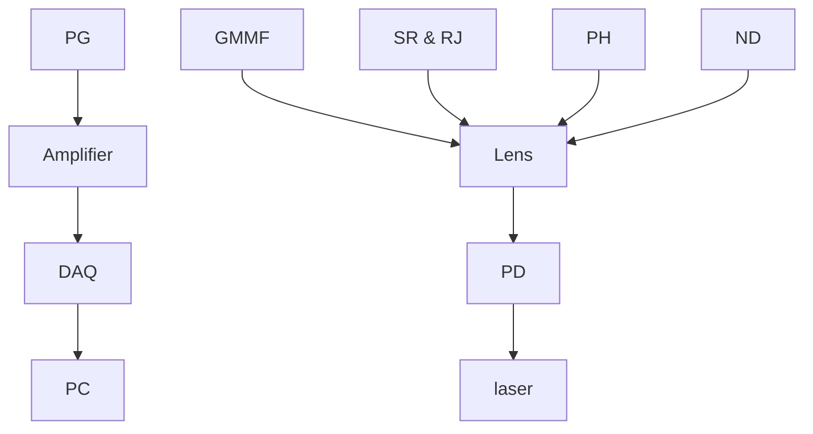

## Optics Letters

# High-resolution photoacoustic endoscope through beam self-cleaning in a graded index fiber

Yi Zhang,1 Yingchun Cao,² And Ji-Xin Cheng1,2,3,\*

1 Department of Physics, Boston University, 590 Commonwealth Avenue, Boston, Massachusetts 02215, USA

2 Department of Electronic and Computer Engineering, Boston University, 8 St. Mary’s St., Boston, Massachusetts 02215, USA

3 Department of Biomedical Engineering, Boston University, 8 St. Mary’s St., Boston, Massachusetts 02215, USA

\*Corresponding author: jxcheng@bu.edu

Received 10 June 2019; accepted 25 June 2019; posted 1 July 2019 (Doc. ID 368782); published 29 July 2019

Intravascular photoacoustic imaging can potentially improve the identification of lipid-laden atherosclerotic plaque. Most intravascular photoacoustic endoscopes use multimode fibers, which do not allow tight focusing of photons. Recent experiments on pulse propagation in multimode graded-index fibers have shown a nonlinear improvement in beam quality. Here, we harness this nonlinear phenomenon for fiber-delivery of nanosecond laser pulses. We built a photoacoustic catheter 1.4 mm outer diameter, offering a lateral resolution as fine as 30 μm within a depth range of 2.5 mm. Such resolution is one order of magnitude better than current multimode fiber-based intravascular photoacoustic catheters. At the same time, the delivered pulse energy can reach as high as 20 μJ, which is two orders of magnitude higher than that of an optical resolution photoacoustic endoscope built with a single mode fiber. These improvements are expected to promote the biomedical application of photoacoustic endoscopes which require both high resolution and high pulse energy. © 2019 Optical Society of America

https://doi.org/10.1364/OL.44.003841

A photoacoustic endoscope, which embodies photoacoustic imaging in a miniaturized probe, can provide depth-resolved imaging of an internal organ with optical contrast [1–5]. This technique has shown great potential for the detection of colon cancer [2,6] and lipid-laden plaques [7,8]. In most cases, a step-index multimode fiber (MMF) is used to allow high-energy pulse delivery; however, the spatial resolution is not optimal [3,9,10]. A significant problem to be solved is the effective coupling and stable transmission of a diffractionlimited beam from a single mode (SM) laser source into an MMF, where interference between the different fiber modes occurs, which results in a complex speckle pattern at the output. Such a speckle pattern prohibits tight focusing of photons through a microlens. To improve the spatial resolution, a design with the combination of a single mode fiber and a graded index (GRIN) lens was reported [6,11]. Nevertheless, the low laser damage threshold prohibits the use of single mode fibers for delivery of high-energy laser pulses which are often needed in high-quality photoacoustic imaging. Though the GRIN lens can tightly focus the Gaussian beam from the single-mode fiber, it cannot focus effectively a beam delivered by an MMF.

To further illustrate this issue, a simulation of the focusing effect with the GRIN lens was performed. We used the beampropagation method [2] to analyze the performance of the GRIN lens on the Gaussian beam and the complex speckle pattern from the multimode fiber. Specifically, we adopted an aberration-free GRIN lens with a gradient constant $0 . 5 \mathrm { \ m m ^ { - 1 } }$ . Figure 1(a) shows that the GRIN lens can effectively focus a Gaussian beam tightly. However, as shown in Fig. 1(b), the output beam from the multimode fiber has random modes and cannot be focused by a GRIN lens.

To achieve high-resolution photoacoustic imaging, we har ness the reported spatial beam self-cleaning effect in a graded index multimode fiber (GRIN MMF) [12,13] to improve the beam quality significantly. Despite the high number of permitted guided modes in a GRIN MMF, light self-cleaning enables a robust, effective propagation of spatially bell-shaped beams. The self-cleaning effect can be explained by the four-wave mix ing interaction among a large population of the guided modes. Spatial self-induced periodic imaging and Kerr nonlinearity create a periodic longitudinal modulation of the refractive index of the fiber core, and this permits quasi-phase matching and energy exchange between guided modes through four-wave mixing [14]. The fundamental mode shows nonreciprocal nonlinear energy exchange with the high order modes and traps all the energy transformed to it. As a result, the beam profile coalesces from a highly irregular to a well-defined bell-shaped structure in the core center. This process effectively improves the beam quality and enhances the focus. Also, spatial beam self-cleaning does not lead to frequency spectrum changes or nonlinear loss of energy. Notably, GRIN MMF with spatial beam cleaning has a larger mode area than SMF and could deliver a high-quality beam with two orders of magnitude higher laser pulse energy [15,16].

heatmap

| Distance from probe end (µm) | y (µm) | Value |
| ---------------------------- | ------ | ----- |
| -400                         | 0      | 1     |
| -200                         | 0      | 0.5   |
| 0                            | 0      | 0     |
| 200                          | 0      | 0.5   |
| 400                          | 0      | 1     |
| 600                          | 0      | 0.5   |
| 800                          | 0      | 0     |

text_image

(b)
GRIN lens
y (μm)
-50
-25
0
25
50
-400
-200
0
200
400
600
Distance from probe end (μm)

Simulation results of GRIN focusing of (a) a Gaussian beam Fig. 1.and (b) an output beam from the step-index multimode fiber.

To our knowledge, none of the current intravascular photoacoustic endoscopes have achieved high energy pulse delivery and high resolution at the same time. For in vivo intravascular photoacoustic imaging of lipids at 1.2 or 1.7 μm [8,17], the signal to noise is a primary concern, where the absorption of water and the scattering of the blood significantly compromises the photoacoustic signal. By increasing the pulse energy from ∼500 nJ to 20 μJ, one can effectively enhance the signal strength and thus improve the image quality.

In this Letter, we demonstrate a fully encapsulated photoacoustic endoscope based on a GRIN MMF. Our endoscope utilizes spatial beam self-cleaning to achieve high-resolution photoacoustic imaging. Compared with previous MMF photoacoustic endoscope without light converging, this design significantly improves the imaging resolution in the lateral direction. Also, taking advantage of a much larger core size (100 μm) of the GRIN MMF, we achieved delivering pulse energy around 20 μJ, with 1000 Hz repetition rate.

The quality of the beam delivered by the GRIN MMF is crucial for the imaging system. Figure 2(a) shows the setup for GRIN fiber optical coupling and beam output measurement. In the setup, a 2-ns pulsed laser at 1030 nm is first cleaned by a pinhole, then launched into a 1-m GRIN fiber with 0.29 NA and a 100/140 μm core diameter (F-MLD from Newport Co.) where a lens, an ND filter (ND10A from Thorlabs), and a three-axis translation stage are used. The beam diameter is 30 μm at the fiber-tip surface, and the incident angle is less than one degree to ensure high coupling efficiency and low high-order modes (HOMs) excitation. The fiber is laid loosely on an optical table, without any stress to mitigate intermode coupling and losses through the HOMs. The near field profile and the output beam quality were measured by a CCD camera, and as a comparison, we also measured the output from a step index MMF (FG105LCA, Thorlabs, Inc.) with 105 μm core diameter on the same setup.

flowchart

natural_image

Thermal or heat map image showing a circular region with red and green hotspots, no text or symbols present

heatmap

| Value |
|-------|
| 1     |

Near-field beam profiles for different input pulse energies Fig. 2.(intensity in linear scale). (a) The system setup of the fiber coupling and near field beam profile measurement. (b) Near field beam profile from a GRIN MMF. (c) Near field beam profile from a step index MMF fiber.

When we increased the input laser pulse energy above a cer tain level (about 1 μJ per pulse), the beam profile coalesced from a highly speckled profile to a bell-shaped structure with the majority of laser power in the center, surrounded by a low power speckled pedestal. Figure 2(b) shows the near field spatial beam intensity profile after coalescence at an incident pulse energy of 20 μJ. With the same setup and laser energy, we sub stituted the GRIN MMF with a step-index MMF, and the selfcleaning effect does not appear. As shown in Fig. 2(c), the smooth input Gaussian beam from the laser source degraded into the irregular transverse profile. Thus, compared with step MMF, the much-improved spatial beam quality by the GRIN MMF paves the way toward a high-resolution photoacoustic endoscope.

Harnessing the beam self-cleaning effect, we designed a GRIN MMF based high-resolution photoacoustic endoscope illustrated in Fig. 3(a). A diode laser at 1030 nm wavelength is utilized as the photoacoustic excitation light source. This high pulse reputation rate (1 KHz) laser with two ns pulse width enables real-time imaging. After coupling the laser to the GRIN MMF and fine tuning it until the beam self-cleaning was achieved; the GRIN MMF is then connected to the endo scope for photoacoustic imaging. The photoacoustic signal, col lected by an ultrasound transducer, transfers through the signal wire and slip ring and is amplified with a 39-dB low noise am plifier. A photodiode is used to measure the pulse energy and trigger the data acquisition card (DAQ) through the pulse generator. The photoacoustic signal collected by DAQ is saved in a PC for further data processing.

Figure 3(b) presents a more detailed structure of the rigid distal section and photos of several key components, respectively. The GRIN lens, fiber spacer, and the distal end of the GRIN MMF are enclosed in the 3D printed housing and completely fixed to the tube wall with epoxy. The focused laser output from the GRIN lens (GT-IFRL-085-inf-50-CC from GRINTECH) is reflected by a 0.8 mm microprism to realize side firing. Then a 42 MHz transducer (from Blatek) is installed into the reserved space, which is tilted by 10 deg. The relative position of the transducer and the prism is optimized to achieve the maximum overlap of the ultrasound focus and the laser focus, ensuring the sensitivity of the photoacoustic signal collection efficiency.

In this probe design, the converging beam from the GRIN MMF is achieved by a GRIN lens, taking advantage of its small size and easy alignment. A commercially available numerical optical modeling software ZEMAX (ZEMAX Development Corporation, Washington, USA) is used to assist the optical alignment design. With comprehensive consideration of the working distance, beam spot size, and penetration depth, the 0.25 pitch grin lens with 0.85 mm diameter and 0.8 mm homogeneous refraction index fiber spacer are chosen. According to the simulation, 2.5 mm working distance and 28 μm focus spot size can be achieved with this probe.

Volumetric photoacoustic imaging is realized by proximal rotation and pulling back of the endoscope. A fiber-optical rotary joint and slip-ring assembly, which provide optical coupling and RF signal transmission, are the key element. Figure 3(c) depicts the fully assembled device and the design of the fiber-optical rotary joint. The rotary part is driven by a motor via a belt. The laser transmission is realized by the direct coupling between fibers. Precise matching is required to minimize the axial misalignment.

(a)  

flowchart

(b)

text_image

CPT
GRIN MMF H
GRIN lens PM
UST
UST
PM

(c)  

text_image

SR RJ motor
Rotor SR stator

Schematic of the PA endoscope. (a) Schematic illustration Fig. 3.of the imaging setup with the alignment of various modules. Abbreviations: PG, a pulse generator; DAQ, data acquisition system; PD, photodiode; SR and RJ, slip ring and rotary joint; PH, pinhole; GMMF, GRIN MMF; ND, neutral density filter. (b) Architecture and photography of the endoscope. PM, prism; UST, ultrasound transducer. (c) The fiber optical rotary joint and slip-ring assembly and the schematic design of the fiber-optical rotary joint.

The feasibility and resolution of the high-resolution photoacoustic system with GRIN MMF are first validated by a 7-μm carbon fiber phantom. The endoscope is driven by the linear stage and moves perpendicular to the carbon fiber.

Photoacoustic data collected by the DAQ card are first bandpass filtered followed by Hilbert transformation. Figure 4(a) shows the photoacoustic amplitude along the scanning direction. Furthermore, the data are fitted with the Gaussian function to estimate the spatial resolution. From the Gaussian fitting shown in Fig. 4(c), the photoacoustic endoscope offers a lateral spatial resolution of 29.6 μm, which is ∼10 times better than the previous multimode fiber-based intravascular photoacoustic endoscope [10]. The resolution along the axial direction is measured to be 96 μm, which is decided by the photoacoustic ultrasound frequency. We then substituted the GRIN fiber with a 105 μm diameter MMF and performed the same measurement. Figure 4(b) is an image measured with step index MMF. The fitted profile I shown in Fig. 4(d) indicates a resolution of 102 μm. These data collectively confirm the superiority of the GRIN MMF with spatial mode self-cleaning over the step index MMF.

(a)  

text_image

Lateral
Axial
100 µm

(b)  

text_image

Lateral
Axial
100 µm

(c)  

line chart

| Lateral resolution (µm) | PA amplitude (a.u.) |
| ----------------------- | ------------------- |
| 0                       | 300                 |
| 50                      | 350                 |
| 100                     | 450                 |
| 120                     | 1050                |
| 150                     | 300                 |
| 200                     | 250                 |
| 250                     | 250                 |

(d)  

scatterplot

| Lateral resolution (µm) | PA amplitude (a.u.) |
| ----------------------- | ------------------- |
| 0                       | 200                 |
| 50                      | 300                 |
| 100                     | 600                 |
| 150                     | 800                 |
| 200                     | 400                 |
| 250                     | 200                 |

Spatial resolution of a photoacoustic endoscope made with Fig. 4.GRIN MMF and step-index MMF, respectively. (a) The photoacous tic image of carbon fiber taken by the endoscope with GRIN MMF. (b) The photoacoustic image taken by the endoscope with step index MMF (c) The transverse resolution of the photoacoustic image of the carbon fiber with GRIN MMF. (d) The transverse resolution with step-index MMF.

natural_image

Close-up of a woven mesh structure with 1 mm scale bar, no text or symbols present

natural_image

3D diagram of a mechanical assembly with a green cylindrical component and mesh structure, showing rotational motion (no text or symbols)

natural_image

Microscopic view of scattered bright particles arranged in a circular pattern on a black background, with a 1 mm scale bar for reference.

natural_image

Microscopic image of fibrous or layered material structure with 1 mm scale bar (no text or symbols)

Photoacoustic imaging of an iliac/common femoral artery stent. Fig. 5.(a) Optical microscopic image of the imaged sent segment. (b) The schematic of the image acquisition method. (c) Photoacoustic image of a cross section of the stent. (d) Representative 3D photoacoustic image.

natural_image

Microscopic image showing scattered bright particles on a black background, with a blue square highlighting a region of interest (no text or symbols present)

line chart

| Lateral distance (μm) | Photoacoustic signal (a.u.) |
| --------------------- | --------------------------- |
| 0                     | 100                         |
| 100                   | 150                         |
| 200                   | 300                         |
| 250                   | 1400                        |
| 300                   | 1500                        |
| 350                   | 300                         |
| 400                   | 100                         |

natural_image

Circular pattern of small white shapes on black background, with a blue square highlighting a specific region (no text or symbols)

line chart

| Lateral distance (μm) | Photoacoustic signal (a.u.) |
| --------------------- | --------------------------- |
| 0                     | 0                           |
| 100                   | 50                          |
| 200                   | 300                         |
| 300                   | 800                         |
| 350                   | 1100                        |
| 400                   | 600                         |
| 500                   | 100                         |
| 600                   | 50                          |

Photoacoustic and ultrasound images of the stent recorded Fig. 6.with the catheter. (a), (b) Photoacoustic image with the GRIN MMF and lateral resolution, (c), (d) photoacoustic image with the step index MMF and lateral resolution.

To demonstrate 3D intravascular imaging capability of our endoscope, we used an iliac/common femoral artery stent (Boston Scientific Corporation) shown in Fig. 5(a), which is made up of 14 individual metallic struts (each of a diameter of 100 μm). The stent was expanded to 3.5 mm diameter, and the imaging catheter was inserted into the center of the stent. A 3D image is taken by rotating the catheter [Fig. 5(b)]. The photoacoustic image in Fig. 5(c) and 3D reconstruction of the metabolic stent in Fig. 5(d) exhibit high contrast. The photoacoustic image is able to visualize fine features of the stent, such as the crossing of the struts at a high resolution.

The improvement of the resolution with the GRIN MMF is further illustrated with a cross-sectional image of the iliac/ common femoral artery stent. Figure 6 shows the photoacoustic image taken by the catheter with GRIN MMF and step index MMF. Figures 6(a) and 6(b) show the photoacoustic image of the stent with GRIN MMF. Because of the high resolution achieved by the GRIN MMF, it shows strict edges with a width of 93 μm. Figures 6(c) and 6(d) show the photoacoustic image with step index MMF. The focus for the step MMF is not optimal, and the edges are blurred, with a width of 210 μm. These data show the improvement achieved by the GRIN MMF photoacoustic endoscope. The scale bar is 1 mm.

In summary, we have developed a GRIN MMF-based PA endoscope that provides a high-resolution photoacoustic image with high laser energy. The PA endoscope offers a lateral resolution of 30 μm. Unlike the previously reported highresolution PA endoscope using SMF for light delivery, our GRIN MMF PA endoscope utilizes the spatial beam selfcleaning to keep the clean mode for a high-energy pulse. This photoacoustic endoscope design based on a GRIN MMF is also relevant for applications of self-cleaning in multimode fibers in different fields, such as three-photon imaging in fluorescence endoscopy and space division multiplexed transmission with GRIN fibers.

For future studies, to enable broad potential applications, this endoscope needs to be further downsized to a diameter smaller than 1 mm. Also, the rotary joint for the GRIN MMF should be improved to enable its ability of 3D imaging in vivo. The current design has an issue of high abrasion and cannot support high-speed rotation. GRIN MMF with a different diameter can be applied to meet the need. It is noted that due to the laser safety consideration, moderate focus with large depth of focus is preferred.

Funding. National Institutes of Health (NIH) (R01 HL125385).

Acknowledgment. The authors thank Boying Tai for discussions on fiber optics theory and set up. J.-X. C. acknowledges the support from NIH. J.-X. C. and Y. Z. conceived the concept and designed the experiments. Y. Z. conducted the experiments and data analysis. Y. C. contributed to data analysis. Y. Z. and Y. C. cowrote the Letter.

## REFERENCES

1. K. Jansen, G. van Soest, and A. F. van der Steen, Ultrasound Med. Biol 40, 1037 (2014)  
402. J. M. Yang, C. Favazza, R. Chen, J. Yao, X. Cai, K. Maslov, Q. Zhou, K. K. Shung, and L. V. Wang, Nat. Med. , 1297 (2012).  
183. J. M. Yang, K. Maslov, H. C. Yang, Q. Zhou, K. K. Shung, and L. V. Wang, Opt. Lett. , 1591 (2009).  
344. A. A. Oraevsky, E. Z. Zhang, L. V. Wang, and P. C. Beard, Proc. SPIE , 78991F (2011).  
78995. P. Wang, T. Ma, M. N. Slipchenko, S. Liang, J. Hui, K. K. Shung, S. Roy, M. Sturek, Q. Zhou, Z. Chen, and J. X. Cheng, Sci. Rep. , 6889 (2014).  
6. K. Xiong, S. Yang, X. Li, and D. Xing, Opt. Lett. , 1846 (2018).  
437. M. Wu, G. Springeling, M. Lovrak, F. Mastik, S. Iskander-Rizk, T. Wang, H. M. van Beusekom, A. F. van der Steen, and G. Van Soest, Biomed. Opt. Express , 943 (2017).  
88. Y. Cao, A. Kole, J. Hui, Y. Zhang, J. Mai, M. Alloosh, M. Sturek, and J. X. Cheng, Sci. Rep. , 2400 (2018).  
89. J. M. Yang, C. Li, R. Chen, Q. Zhou, K. K. Shung, and L. V. Wang, J. Biomed. Opt. , 066001 (2014).  
1910. J. Hui, Y. Cao, Y. Zhang, A. Kole, P. Wang, G. Yu, G. Eakins, M. Sturek, W. Chen, and J. X. Cheng, Sci. Rep. , 1417 (2017).  
711. X. Bai, X. Gong, W. Hau, R. Lin, J. Zheng, C. Liu, C. Zeng, X. Zou, H. Zheng, and L. Song, PLoS One , e92463 (2014).  
912. K. Krupa, A. Tonello, B. M. Shalaby, M. Fabert, A. Barthélémy, G. Millot, S. Wabnitz, and V. Couderc, Nat. Photonics , 237 (2017).  
13. L. G. Wright, Z. Liu, D. A. Nolan, M.-J. Li, D. N. Christodoulides, and F. W. Wise, Nat. Photonics , 771 (2016).  
1014. A. Mafi, J. Lightwave Technol. , 2803 (2012)  
3015. R. Guenard, K. Krupa, R. Dupiol, M. Fabert, A. Bendahmane, V. Kermene, A. Desfarges-Berthelemot, J. L. Auguste, A. Tonello, A. Barthelemy, G. Millot, S. Wabnitz, and V. Couderc, Opt. Express , 4783 (2017).  
2516. A. Mocofanescu, L. Wang, R. Jain, K. D. Shaw, A. Gavrielides, P. Peterson, and M. P. Sharma, Opt. Express , 2019 (2005).  
1317. J. M. Yang, C. Li, R. Chen, B. Rao, J. Yao, C. H. Yeh, A. Danielli, K. Maslov, Q. Zhou, K. K. Shung, and L. V. Wang, Biomed. Opt. Express , 918 (2015).