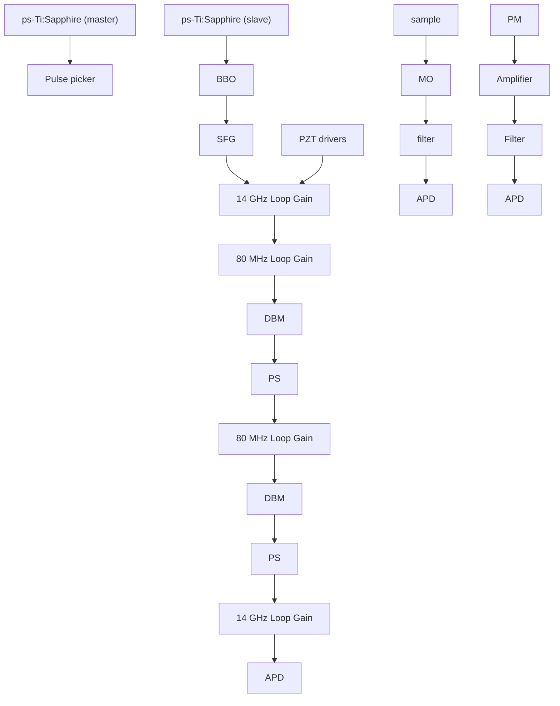

# High-sensitivity coherent anti-Stokes Raman scattering microscopy with two tightly synchronized picosecond lasers

Eric O. Potma

Department of Chemistry and Chemical Biology, Harvard University, Cambridge, Massachusetts 02138

David J. Jones

JILA, National Institute of Standards and Technology and University of Colorado, Boulder, Colorado 80309-0440

J.-X. Cheng and X. S. Xie

Department of Chemistry and Chemical Biology, Harvard University, Cambridge, Massachussetts 02138

Jun Ye

JILA, National Institute of Standards and Technology and University of Colorado, Boulder, Colorado 80309-0440

Received January 22, 2002

We demonstrate a significant improvement in signal-to-noise ratio in coherent anti-Stokes Raman scattering (CARS) spectroscopy/microscopy, using two highly synchronized picosecond Ti:sapphire lasers. A temporal jitter between the pulse trains from the two independent commercial lasers is reduced from a few picoseconds to 21 fs, maintained over several hours. The tight synchronization brings the f luctuation of the CARS signal down to the shot-noise limit, leading to enhanced CARS vibrational images of living cells and polymer beads. © 2002 Optical Society of America

OCIS codes: 300.6230, 110.3080, 320.0320, 140.7090.

Vibrational imaging based on coherent anti-Stokes Raman scattering (CARS) spectroscopy is a powerful method for acquisition of chemically selective maps of biological samples.1,2 In CARS microscopy, pulsed pump and Stokes beams are focused tightly to a single focal spot in the sample to achieve a high spatial resolution. The third-order nonlinear interaction produces a signal photon that is blueshifted (anti-Stokes signal) with respect to the incident beams. Strong CARS signals are obtained whenever the frequency difference between the pump and Stokes coincides with a Raman-active vibrational mode, which gives rise to the molecule-specific vibrational contrast in the image. Recent studies and technological improvements have demonstrated the exciting capability of CARS microscopy to attain high-resolution vibrational images of unstained living cells.2–6

Practical applications of the CARS microscopy technique require pulsed light sources: Optimized peak powers help boost the nonlinear signal. Pulses with temporal widths of 1–2 picoseconds (ps) should be used to match to the vibration bandwidths to optimize the CARS signal, with minimized nonresonant background and compromised spectral resolution.5 Also, the laser system employed should deliver at least two different frequencies, $\omega _ { p }$ (pump) and $\omega _ { s }$ (Stokes), such that $\omega _ { p } \ - \ \omega _ { s }$ can be tuned from 500 to $3 5 0 0 ~ \mathrm { c m } ^ { - 1 }$ , corresponding to the biologically interesting region of the vibrational spectrum. For tunability, ease of operation, and low photodamage to the sample from near-infrared radiation, a system composed of two synchronized ps Ti:sapphire lasers constitutes the most attractive and general purpose light source for CARS microscopy.5

An important technical challenge in using two independently running optical oscillators is control of the time coincidence of the individual laser pulses. Inherently a multiphoton-based process, the strength of the CARS signal depends directly on the temporal overlap of the incident pulses, and any timing jitter among the relevant pulses will lead to signal f luctuations that will, in turn, degrade the image. Hence, for highsensitivity CARS imaging, an active feedback for pulse synchronization is mandatory. Ideally, the timing jitter between the pump and Stokes pulses should be much smaller than the relevant pulse widths. Tight synchronization of two independent pulsed lasers with residual timing jitter amounting to only a small fraction of the pulse duration was recently accomplished in femtosecond laser systems by use of the high-harmonic locking technique.7,8 For example, timing jitter below 1 fs was achieved between two femtosecond lasers of 80-fs pulse width.9 In this Letter we extend this approach to synchronization of two ps lasers. It is shown that this scheme eliminates all the jitter-related noise from the CARS images and significantly enhances the image quality.

A schematic of the setup is depicted in Fig. 1. Two passively mode-locked Ti:sapphire lasers10 (Coherent MIRA 900-P, pumped by two separate Verdis) run at different wavelengths (tunable from 700 to 1000 nm) with 80-MHz repetition rates, delivering ps pulses with a temporal width of 3 ps. One of the oscillators is free running (master) and provides the Stokes beam. The other laser (slave) is equipped with a custom designed fast piezo transducer for active feedback control of the repetition rate so that it can be synchronized to the master. The second laser produces the pump pulse. The fundamental repetition rate (80 MHz) and the 175th harmonic (14 GHz) are simultaneously de tected from each laser by fast photodiodes. The pump laser is first synchronized to the Stokes laser by use of only the phase-sensitive error signal generated from the 80-MHz loop. Next, after the two pulse trains are temporally overlapped by adjustment of the 80-MHz phase shifter, the feedback loop for synchronization is gradually switched over to the 14-GHz loop. The greatly enhanced sensitivity and stability associated with the 14-GHz loop are essential for bringing the timing jitter well below the laser pulse width, leading to the best-quality CARS images obtained in this work. Additionally, the amount of timing jitter can be accurately controlled by adjustment of the relative amounts of 80-MHz and 14-GHz loop gain. This capability permits quantitative studies of CARS image qualities versus the pulse timing jitter.

flowchart

Fig. 1. Schematic of the setup: Two ps Ti:sapphire lasers are synchronized via a dual phase-locked-loop scheme, one operating at the fundamental repetition frequency (80 MHz) and one at the 175th harmonic (14 GHz). With the repetition rates reduced by the pulse pickers, the two beams are focused by a 1.4-N.A. oil objective mounted on an inverted microscope. Sample scanning is accomplished by piezo transducers (PZTs). APD, avalanche photodiode; BBO, b-barium borate; DBMs, double balanced mixers; DM, dichroic mirror; MO, microscope objective; PSs, phase shifters.

The average light power applied to the sample is reduced by two synchronously driven Bragg cells that are utilized to lower the pulse repetition rates of both pulse trains to 250 kHz. The diffracted beams are collinearly combined on a dichroic mirror and directed to an inverted microscope. The CARS signal from the sample (mounted on a three-dimensional translation stage) is separated from the incident beams via another dichroic mirror and detected in the epidirection4 [epidirected coherent anti-Stokes Raman scattering (E-CARS)] by an avalanche photodiode in photon-counting mode. Additionally, a portion of each laser beam is picked off for monitoring of the relative pulse timing jitter via a second-order cross correlator based on sum-frequency generation (SFG). The optical path lengths of the beams are adjusted so that the CARS signal and the SFG reference can be measured simultaneously.

Figure 2(a) shows the SFG cross correlation of the synchronized pulse trains. A cross-correlation width of 4.1 ps is measured, which is comparable to the individual pulse widths measured by an independent autocorrelator. To measure the timing jitter, we temporally offset the pump and Stokes pulses in the cross correlator by one-half the pulse width. Amplitude f luctuations recorded in the SFG signal can then be converted to timing jitter via the discrimination slope of the cross-correlation pulse. The insets in Fig. 2(a) display the SFG signal f luctuation as observed with a 160-Hz low-pass bandwidth, corresponding to a 1-ms averaging time, over a period of several seconds. If the lasers are synchronized with the 80-MHz loop only, a pronounced pulse jitter of \$700 fs is observed in a time window of a few seconds. Because of slow phase drifts, the temporal overlap of the pulses shows significant variations. With the 14-GHz loop fully activated, these slow f luctuations are totally eliminated. The timing jitter is reduced to only 21 fs, which is more than 2 orders of magnitude smaller than the pulse widths. Stable performance of synchronization extends over several hours without adjustments.

With the pump and Stokes lasers tuned to 753 and 857 nm, respectively, and hence with a Raman shift of 1600 cm21 corresponding to $\mathrm { C } = \mathrm { C }$ stretching vibration, E-CARS images of 1-mm polystyrene beads were taken at various levels of jitter. A fixed-position E-CARS signal is displayed in Fig. 2(b). Again, when the lasers are synchronized with the 80-MHz loop, the maximum CARS signal shows significant f luctuations that may completely deplete the CARS response. When the 14-GHz loop is enabled, the noise on the CARS signal is dramatically reduced. In fact, at the lowest jitter levels achieved, all the CARS noise originating from the temporal variations in the pulse overlap is virtually removed. We use a 2-ms averaging time for each scanned position (pixel) of the sample. With this bandwidth, the standard deviation of the CARS signal is usually smaller than 10% of a reasonable signal mean level. Figure 2(c) shows the experimental signal-to-noise ratio of the CARS signal as a function of the square root of the signal magnitude. The linear relationship revealed in the plot indicates that the remaining noise follows Poissonian statistics (signal-to-noise ratio \~  Intensity), indicating that the f luctuations originate primarily from the fundamental shot noise rather than from timing jitter.

line chart

| Delay [ps] | SFG intensity | CARS intensity |
| ---------- | ------------- | -------------- |
| -10        | 0.0           | 0.0            |
| -5         | 0.2           | 0.1            |
| 0          | 1.0           | 1.0            |
| 5          | 0.2           | 0.1            |
| 10         | 0.0           | 0.0            |

| (CARS count rate)^(1/2) | Signal-to-noise ratio |
| ------------------------ | --------------------- |
| 1                        | 5                     |
| 2                        | 8                     |
| 3                        | 12                    |
| 4                        | 15                    |
| 5                        | 18                    |
| 6                        | 20                    |
| 7                        | 22                    |
| 8                        | 25                    |

Fig. 2. (a) Second-order cross correlation (4.1 ps FWHM) of the ps pulses. The insets show the signal f luctuation for the time delay at which the signal amounts to half-maximum, observed through a 160-Hz low-pass filter for both the (left) 14-GHz and the (right) 80-MHz lock. (b) CARS signal as a function of the delay between pump and Stokes pulses (3.9 ps FWHM) recorded from a polystyrene beam (Raman shift, 1600 cm21). The insets depict the CARS signal f luctuation at zero time delay recorded with the (left) 14-GHz and (right) 80-MHz loop. (c) Signalto-noise ratio as a function of the square root of the CARS intensity. The filled circles indicate experimental data points, and the solid line is a linear fit.

line chart

| Panel | Peak Count | X-Axis Position | Y-Axis Counts |
|-------|------------|-----------------|---------------|
| (a)   | ~100       | ~0              | ~0            |
| (b)   | ~100       | ~0              | ~0            |

Fig. 3. E-CARS images of $1 \mathrm { - } \mu \mathrm { m }$ polystyrene beads spincast on a glass coverslip for different settings of time jitter: (a) 700 fs and (b) 21 fs. The Raman shift is 1600 $\mathrm { c m } ^ { - 1 }$ . Beam powers are 0.2 mW for the pump and 0.1 mW for the Stokes beam; total acquisition time is 5 s. The arrows indicates the positions of the onedimensional cross sections. Scale bar, 1 mm.

natural_image

Two grayscale microscopic images labeled (a) and (b), showing cellular or molecular structures with no visible text or symbols.

Fig. 4. E-CARS images of 3T3 mouse fibroblast cells in aqueous buffer solution recorded at a Raman shift of 1570 cm21. The power is 0.2 mW for the pump and 0.1 mW for the Stokes beams. (a) Image recorded with a large timing jitter of 700 fs. The image size is 512 3 442 pixels, and the pixel dwell time is 1.95 ms. (b) Identical image obtained with a time jitter of 21 fs. Scale bar, 10 $\mu \mathrm { m }$ .

The suppression of temporal jitter down to 21 fs has immediate implications for the quality of the CARS microscopic images. Figure 3(a) shows an E-CARS image of two 1-mm-diameter polystyrene beads, recorded with a timing jitter of 700 fs. The pattern of dark lines present in the image is caused by f luctuations and slow drifts in the pulse synchronization, resulting in degradation of the image. A much sharper image is obtained when the 14-GHz synchronization loop is fully active, as illustrated in Fig. 3(b). A horizontal line taken through the middle of the image is also shown. The large signal variations from pixel to pixel and the resultant noise patterns present in the 700-fs jitter image have clearly vanished in the image recorded with 21-fs jitter. With the quality of CARS images significantly enhanced, more-sensitive probing of microscopic objects will be made possible, including capabilities of higher spatial resolution for f iner details and (or) faster sampling speed for more-rapid dynamical processes.

Given the enduring stability of the laser synchronization, imaging experiments that require a longer acquisition time can be conveniently conducted. In Fig. 4, CARS images of a fibroblast cell are given for timing jitter of 700 and 21 fs. Both images were recorded in 8 min. In the high-timing-jitter image, long-term phase drifts give rise to significant distortion of the cell image. In comparison, superior image contrast is obtained when the 14-GHz synchronization scheme is fully activated. The low-timing-jitter image reveals new details in the cell that are otherwise obscured by excessive noise in the high-timing-jitter image.

In conclusion, high-precision synchronization of two mode-locked ps lasers is obtained by use of electronic phase-locked loops that exploit the enhanced phase sensitivity in the high-harmonic detection of the pulse repetition frequency. The feedback loop brings the timing jitter between ps pulse trains down to less than 1% of the pulse width as seen within a 160-Hz low-pass bandwidth. The stable performance of the system over several hours allows one to reach the full potential of CARS spectroscopy/microscopy of biological samples, with sharp images acquired free of jitter noise. We expect that, with the availability of this robust and f lexible light source, CARS microscopy can become a routine optical tool in the cell biologist’s laboratory.

We thank B. Burfeindt, Y. Pang, and S. Foreman for technical help, M. Morphew and J. R. McIntosh for providing the fibroblast cells, and J. L. Hall and H. C. Kapteyn for discussions. This research was funded by the National Science Foundation, the National Institutes of Health, NASA, and the National Institute of Standards and Technology (NIST). J. Ye is also a Staff Member of the Quantum Physics Division of NIST Boulder. His e-mail address is ye@jila. colorado.edu; X. S. Xie’s is xie@chemistry.harvard.edu.

## References

1. M. D. Duncan, J. Reintjes, and T. J. Manuccia, Opt. Lett. 7, 350 (1982).  
2. A. Zumbusch, G. R. Holtom, and X. S. Xie, Phys. Rev. Lett. 82, 4142 (1999).  
3. E. O. Potma, W. P. de Boeij, P. J. M. von Haastert, and D. A. Wiersma, Proc. Natl. Acad. Sci. USA 98, 1577 (2001).  
4. A. Volkmer, J.-X. Cheng, and X. S. Xie, Phys. Rev. Lett. 87, 023901 (2001).  
5. J.-X. Cheng, A. Volkmer, L. D. Book, and X. S. Xie, J. Phys. Chem. B 105, 1277 (2001).  
6. J.-X. Cheng, L. D. Book, and X. S. Xie, Opt. Lett. 26, 1341 (2001).  
7. L.-S. Ma, R. K. Shelton, H. C. Kapteyn, M. M. Murnane, and J. Ye, Phys. Rev. A 64, 021802 (2001).  
8. R. K. Shelton, L.-S. Ma, H. C. Kapteyn, M. M. Murnane, J. L. Hall, and J. Ye, Science 293, 1286 (2001).  
9. R. K. Shelton, S. Foreman, L.-S. Ma, H. C. Kapteyn, M. M. Murnane, J. L. Hall, M. Notcutt, and J. Ye, Opt. Lett. 27, 312 (2002).  
10. MIRA 900-P, Coherent, Inc., Santa Clara, Calif. Mention of the product name is for technical communication only.