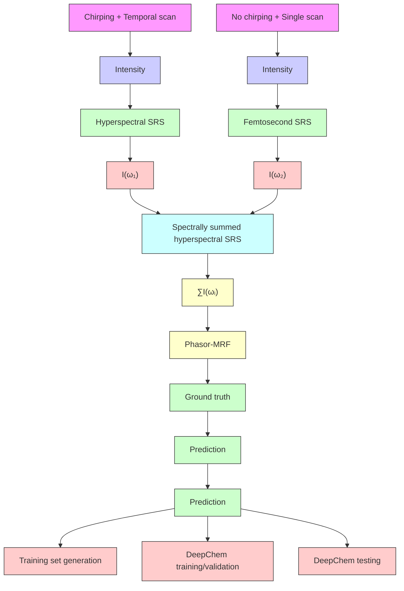
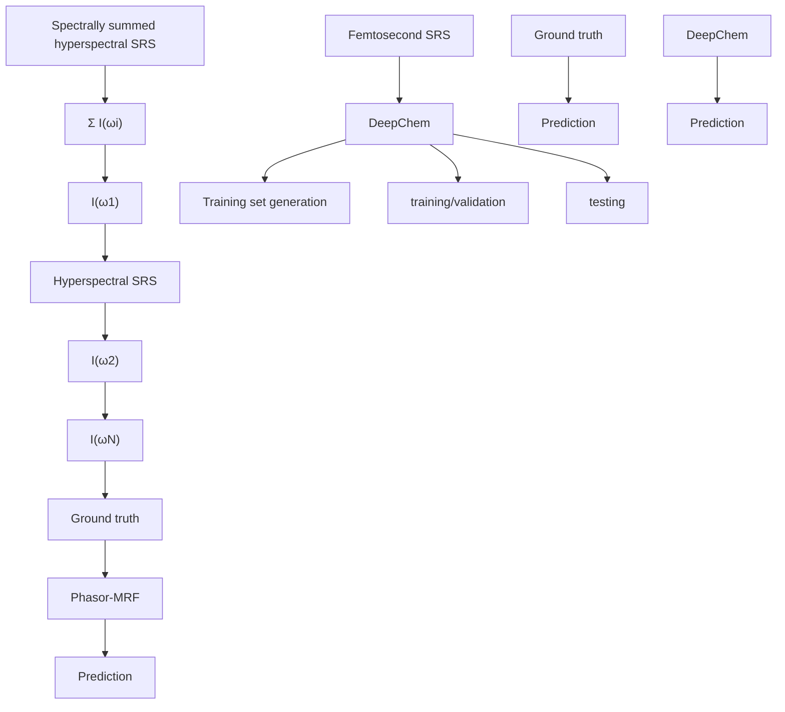

## Physical Insights into Materials and Molecular Properties

# High-Speed Chemical Imaging by Dense-Net Learning of Femtosecond Stimulated Raman Scattering

Jing Zhang, Jian Zhao, Haonan Lin, Yuying Tan, and Ji-Xin Cheng

J. Phys. Chem. Lett., Just Accepted Manuscript • DOI: 10.1021/acs.jpclett.0c01598 • Publication Date (Web): 11 Sep 2020

Downloaded from pubs.acs.org on September 14, 2020

## Just Accepted

“Just Accepted” manuscripts have been peer-reviewed and accepted for publication. They are posted online prior to technical editing, formatting for publication and author proofing. The American Chemical Society provides “Just Accepted” as a service to the research community to expedite the dissemination of scientific material as soon as possible after acceptance. “Just Accepted” manuscripts appear in full in PDF format accompanied by an HTML abstract. “Just Accepted” manuscripts have been fully peer reviewed, but should not be considered the official version of record. They are citable by the Digital Object Identifier (DOI®). “Just Accepted” is an optional service offered to authors. Therefore, the “Just Accepted” Web site may not include all articles that will be published in the journal. After a manuscript is technically edited and formatted, it will be removed from the “Just Accepted” Web site and published as an ASAP article. Note that technical editing may introduce minor changes to the manuscript text and/or graphics which could affect content, and all legal disclaimers and ethical guidelines that apply to the journal pertain. ACS cannot be held responsible for errors or consequences arising from the use of information contained in these “Just Accepted” manuscripts.

# High-Speed Chemical Imaging by Dense-Net Learning of Femtosecond Stimulated Raman Scattering

Jing Zhang1,†, Jian Zhao2,†, Haonan Lin1,†, Yuying Tan1, Ji-Xin Cheng1,2,\*

1Department of Biomedical Engineering, Boston University, Boston, MA 02215, USA

2Department of Electrical & Computer Engineering, Boston University, Boston, MA 02215, USA

ABSTRACT: Hyperspectral stimulated Raman scattering (SRS) by spectral focusing can generate label-free chemical images through temporal scanning of chirped femtosecond pulses. Yet, pulse chirping decreases the pulse peak power and temporal scanning increases the acquisition time, resulting in a much slower imaging speed compared to single-frame SRS using femtosecond pulses. In this paper, we present a deep learning algorithm to solve the inverse problem of getting a chemically labeled image from a single-frame femtosecond SRS image. Our DenseNet-based learning method, termed as DeepChem, achieves high-speed chemical imaging with a large signal level. Speed is improved by 2 orders of magnitude with four sub-cellular components (lipid droplet, endoplasmic reticulum, nuclei, cytoplasm) classified in MIA PaCa-2 cells and other cell types which were not used for training. Lipid droplet dynamics and cellular response to Dithiothreitol in live MIA PaCa-2 cells are demonstrated using this computationally multiplex method.

KEYWORDS: stimulated Raman scattering, spectrum analysis, image reconstruction techniques.

Vibrational spectroscopic imaging of cellular and tissue structures is opening a new window for cell biology research and clinical diagnosis1–3. Stimulated Raman scattering (SRS) microscopy is a vibrational imaging technique with label-free chemical specificity4,5. SRS microscopy has been implemented with both picosecond and femtosecond pulses, respectively, allowing the single color and hyperspectral imaging capabilities6,7. Despite these advances, the trade-off between speed, signalto-noise ratio (SNR), and spectroscopic bandwidth prevents its broader application in biology and biomedicine. Using picosecond pulse trains, video-rate SRS imaging was realized via a fast lock-in amplifier8. SNR was tenfold increased using femtosecond pulse excitation because of the integration over a spectral window compared to picosecond pulse excitation9. Although single-shot femtosecond SRS imaging permits realtime skin imaging in live mice and cellular metabolism quantification10, it lacks spectroscopic information thus cannot discriminate chemical components with overlapping Raman signatures. Spectral focusing provides an efficient method for femtosecond pulse based hyperspectral SRS (hSRS) measurements by linear chirping of pump and Stokes pulses11,12. However, the speed of time-delay scanning for parallel detection of several Raman bands is often limited by the motorized translational stage due to the waiting time for communication and stabilization13. Improved frequency tuning via a galvanometer mirror has reached a speed of seconds per stack13,14. Nevertheless, just as illustrated in Figure 1a, tens to hundreds of times more measurements are needed for an SRS stack than a single-frame image and limits further improvement of its imaging speed. Multiplex SRS enabled single spectrum recording within several microseconds by wavelength-division or modulation-division15–17. These multiplex designs, however, either came with deterioration in SNR or loss of spectral selectivity. Collectively, limitations of each modality highlight a need to fill the gap between the low spectral resolution in femtosecond pulse excitation and the low speed in hyperspectral measurement, aiming at a high-speed, high-SNR, hyperspectral SRS imaging method.

In parallel with instrumentation development, computational approaches have been applied to boost the speed and/or SNR in SRS microscopy. With prior knowledge of the low-rankness of SRS images, sparse sampling methods improved the SRS imaging speed with linear models18–20. Thanks to the recent resurgence of deep neural networks (DNNs), image interpretation and translation problems can be resolved via direct learning of the underlying image mapping relation21. A recently reported U-Net DNNs based algorithm for SRS image denoising shows applicability to reduce potential photodamage and enable deep tissue imaging22. Other applications of DNNs to optical microscopy include image translation23,24, denoising22,25, super-resolution26, cross-modality image fusion27, focus correction28, transmission correction29, largely in the fluorescence microscopy field.

In this work, we tackle the trade-off between spectral specificity, speed, and SNR by learning the correlation between spectral and spatial features to derive chemical maps from a high-speed femtosecond SRS image. Specifically, we deploy a customized DNN model, namely a DenseNetbased neural network architecture30,31. DenseNet has significant advantages over conventional DNNs such as U-Net in computer vision problems, including semantic segmentation32. By introducing connections between each layer, DenseNet has achieved advanced performance, such as the alleviation of gradient vanishing, reduction of the number of parameters, encouraging feature reuse30. We term our DenseNet-based DNN as DeepChem. The pairs of spectrally summed hSRS images of MIA PaCa-2 cells and the spatially segmented subcellular organelle maps are used for training DeepChem. Then the well-trained network is capable of generating subcellular organelle maps using femtosecond SRS images (Figure 1b). Based on this method, the needed frame number is reduced to one while the chemical selectivity of four subcellular components (lipid droplet, endoplasmic reticulum, nuclei, cytoplasm) is preserved. Thus, the trade-off between high SNR, chemical selectivity, and speed qualities is broken, without additional need for fluorescent labels, parameter estimation, or hardware design.

To test this idea, SRS images were acquired using a lab-built SRS microscope previously reported in 9 (Section S1 and Figure S1, Supporting Information). For hyperspectral SRS imaging under a spectral focusing scheme, both the pump and Stokes beams were chirped with high-dispersion glass, and the hSRS images were collected via spectral scanning controlled by a motorized translational stage. For single-frame femtosecond SRS imaging, no chirping material was used. The schematic of these two imaging schemes in the time, Ramam shift, and intensity domain is illustrated in Figure 1a. For the collected hSRS images, we implemented a hyperspectral image segmentation method based on Phasor analysis and Markov Random Field (Phasor-MRF, see Section S2 and Figure S2 for details) to incorporate both spectral and spatial features in segmenting the subcellular organelle maps. Two-photon excitation fluore-

flowchart

Figure 1. Schematic of SRS imaging and workflow of DeepChem training and prediction. (a) Schematic of two SRS imaging schemes in the 3D domain of time, Raman shift, and intensity. Left: hyperspectral SRS imaging with linearly chirped pulses. Right: single-frame SRS imaging with non-chirped femtosecond pulses. (b) The workflow of DeepChem training and prediction. The training set consists of pairs of spectrally summed hyperspectral SRS images and their corresponding subcellular organelle maps from Phasor-MRF. After training, DeepChem is capable of predicting subcellular organelle maps based on a single-frame femtosecond SRS image. MRF: Markov Random Field.

scence images then confirmed the results from Phasor-MRF (Figure S4, Supporting Information). Section S3 and Figure S5 in Supporting Information compared the single-frame femtosecond SRS images and the spectrally summed SRS images under the same field of view, showing that images collected using these two modalities have morphological features with high similarity. This data validates our scheme in which spectrally summed hSRS images were used for training. After training, DeepChem is capable of predicting subcellular organelle maps from single-frame femtosecond SRS images. The workflow of DeepChem training and prediction is shown in Figure 1b.

To generate the training set, we applied normalization for each image to accommodate different experimental conditions. Following the normalization, we applied image augmentation, such as image rotation and transpose, is used to generate a training set with 4000 images, each with 128x128 pixels. DeepChem is constructed with repeated dense blocks consisting of several densely-connected convolution blocks. Each convolution block consists of one convolutional layer followed by a batch normalization layer and a ReLU activation layer. DeepChem employs an exponentially decaying learning rate with an Adam optimizer and a batch size of 2. Different learning rate initialization is applied for each segmentation class. The neural network is implemented in Keras framework on a single GPU (GEFORCE 2080Ti). The detailed architecture can be found in Figure S6. Test-time augmentation is then applied towards a better segmentation accuracy as33. For each image in the testing set, the prediction ensemble of multiple transformed versions of this image is first calculated using the pre-trained network. Accordingly, we get the final prediction result $\begin{array} { r } { \bar { \hat { Y } } = \hat { E } ( Y | X ) = \sum _ { 1 } ^ { N } { y _ { n } } / { N } . { y _ { n } } } \end{array}$ denotes the probability map of each instance in the prediction ensemble, and denotes the input image for inference.

text_image

(a) Spectrally summed
hyperspectral SRS
Prediction
Phasor-MRF
Ground truth
(b)
Prediction
Ground truth
LD
ER
Nuclei
Cyto
(c)
OVCAR-5
HPDE-6
MIA PaCa-2
Femtosecond SRS
Ground truth
LD
ER
Nuclei
Cyto
Prediction
Ground truth
LD
ER
Nuclei
Cyto
0 0.2 0.4 0.6 0.8 1

Figure 2. Predicted subcellular organelle maps from spectrally summed hSRS images and single-frame femtosecond SRS images. (a) Predicted subcellular organelle maps from spectrally summed hSRS images. Scale bar: 10 µm. (b) Confusion matrix of subcellular component classes (definition in section S4, Supporting Information). Top: normalized by column; bottom: normalized by row. LD, Bkg, ER, and Cyto are abbreviations for lipid droplet, background, endoplasmic reticulum, and cytoplasm. (c) Predicted subcellular organelle maps from single-frame femtosecond SRS images. Scale bar: 10 µm.

Predicted subcellular organelle maps using spectrally summed hSRS show clear biological details and high structural similarity to ground truth images (Figure 2a). The confusion matrix in Figure 2b shows good prediction accuracy (high intensities cluster in the diagonals). Specifically, DeepChem has a 0.787 $\mathrm { F } _ { 1 }$ score (definition in Section S4, Supporting Information) for nuclei segmentation, better than other subcellular organelle segmentation methods using fluorescence images (\~0.7)34. For the other three classes (lipid droplets, ER, cytoplasm), our method has F score of 0.645, 0.805, 0.789. In addition, our method is greatly simplified and easier to use compared with networks deploying multi-scale branches with different z-depth inputs23,24. Moreover, compared with the U-Net DNNs trained on the same dataset, DenseNet-based DeepChem achieves higher segmentation performance (Section S5 and Figure S7, Supporting Information)32. Figure 2c and Figure S8 show predicted subcellular organelle maps from femtosecond SRS images including those cell types (OVCAR-5 and HPDE-6) that never appeared in the training set. It means the neural network “has learned” to provide reliable results from new input of different modalities and different cell types. This result demonstrates the generalization ability of our method and heralds potential in functional cell imaging with high speed and chemical selectivity. In terms of the speed performance, a hSRS stack (256×256×100, FOV 64×64 µm2) takes 110 s, while a single shot femtosecond SRS image with the same size takes 1 to 2 s. This dramatic speed improvement allows realtime imaging of living cells.

(a)  

text_image

Ctrl
4
3
8
4
6
5

text_image

+DTT
1
2
3
4
5
6
7
8

line chart

| time/s | Distance/μm (Line 1) | Distance/μm (Line 2) | Distance/μm (Line 3) | Distance/μm (Line 4) | Distance/μm (Line 5) | Distance/μm (Line 6) | Distance/μm (Line 7) |
| ------ | --------------------- | --------------------- | --------------------- | --------------------- | --------------------- | --------------------- | --------------------- |
| 0      | 0.0                   | 0.0                   | 0.0                   | 0.0                   | 0.0                   | 0.0                   | 0.0                   |
| 25     | 1.5                   | 1.0                   | 0.8                   | 0.6                   | 0.4                   | 0.2                   | 0.1                   |
| 50     | 2.5                   | 1.5                   | 1.2                   | 0.9                   | 0.6                   | 0.4                   | 0.3                   |
| 75     | 3.5                   | 2.0                   | 1.5                   | 1.2                   | 0.8                   | 0.6                   | 0.5                   |
| 100    | 3.0                   | 2.5                   | 1.8                   | 1.5                   | 1.0                   | 0.8                   | 0.7                   |
| 125    | 2.5                   | 2.8                   | 2.0                   | 1.8                   | 1.2                   | 1.0                   | 0.9                   |

line chart

| time/s | Distance/μm |
| ------ | ----------- |
| 0      | 0.0         |
| 25     | 0.5         |
| 50     | 1.0         |
| 75     | 1.5         |
| 100    | 2.0         |
| 125    | 2.5         |

line chart

Distance travelled
| time/s | 1 | 2 | 3 | 4 | 5 | 6 | 7 | 8 |
|---|---|---|---|---|---|---|---|---|
| 0 | 0 | 0 | 0 | 0 | 0 | 0 | 0 | 0 |
| 25 | 5 | 4 | 6 | 3 | 2 | 1 | 1 | 0 |
| 50 | 8 | 6 | 10 | 5 | 4 | 3 | 2 | 0 |
| 75 | 9 | 7 | 14 | 6 | 5 | 4 | 3 | 0 |
| 100 | 10 | 8 | 18 | 7 | 6 | 5 | 4 | 1 |
| 125 | 11 | 9 | 20 | 8 | 7 | 6 | 5 | 2 |

line chart

| time/s | Distance/μm (Line 1) | Distance/μm (Line 2) | Distance/μm (Line 3) | Distance/μm (Line 4) | Distance/μm (Line 5) | Distance/μm (Line 6) | Distance/μm (Line 7) | Distance/μm (Line 8) |
| ------ | --------------------- | --------------------- | --------------------- | --------------------- | --------------------- | --------------------- | --------------------- | --------------------- |
| 0      | 0                     | 0                     | 0                     | 0                     | 0                     | 0                     | 0                     | 0                     |
| 25     | ~2                    | ~2                    | ~2                    | ~2                    | ~2                    | ~2                    | ~2                    | ~2                    |
| 50     | ~4                    | ~4                    | ~4                    | ~4                    | ~4                    | ~4                    | ~4                    | ~4                    |
| 75     | ~6                    | ~6                    | ~6                    | ~6                    | ~6                    | ~6                    | ~6                    | ~6                    |
| 100    | ~8                    | ~8                    | ~8                    | ~8                    | ~8                    | ~8                    | ~8                    | ~8                    |
| 125    | ~10                   | ~10                   | ~10                   | ~10                   | ~10                   | ~10                   | ~10                   | ~10                   |

Figure 3. Lipid droplet tracking in live MIA PaCa-2 cells by femtosecond SRS and DeepChem. (a) Trajectories of lipid droplets (solid lines) and contours of the ER regions (dashed green lines). Scale bar: 5 µm. (b) Quantification of lipid droplet dynamics. The insets in the right column show corresponding plots in the range of 75 to 125 s.  
To demonstrate the advantage of our DenseNet-based method over

correlation between the spatial-temporal dynamics of lipid droplets and cellular lipid metabolism35. However, the previous method using single frame femtosecond SRS was unable to detect other subcellular organelles simultaneously. A traditional frame-by-frame SRS imaging system can provide multiple subcellular organelles simultaneously, but the speed is around one hundred times slower than our method. In our experiment, we imaged live MIA PaCa-2 cells with a temporal resolution of 1.5 seconds per frame for about 2 min. Then, DeepChem predicted lipid droplet maps from the collected femtosecond SRS images. These maps were then analyzed by the particle-tracking plugin in ImageJ36. Two sample images are shown in Figure 3a. To quantify the lipid droplets dynamics, we define two parameters: traveled distance (the cumulative position displacement between consecutive frames) and distance to the origin (the displacement of the current position to the origin of the movement). Using the two parameters defined above, less active lipid droplet movement is observed in cells treated with 0.5 mM Dithiothreitol (DTT) for 1 hour (Figure 3b). DTT is a strong reducing agent that can break down disulfide bond formation and thus lead to ER stress in minutes37. Lipid droplet has been shown as a functional organelle connected as to the ER lumen. Thus, our observation implies that the enlarged ER lumen is more likely to trap the lipid droplets and limit their movement37. Besides lipid metabolism, DeepChem based femtosecond SRS has the hyperspectral competence to address the rising interest in understanding organelle interaction and cooperation from different aspects, including morphology and functionality.

Another strong desire in biomedical applications is large-scale imaging with single-cell resolution. The strengths of our method in resolving this need are motion artifacts suppression and quantitative evaluation of each population. To illustrate these strengths, 400 images (64×64 µm2 each) were captured in 10 minutes for both control and DTT treated group (0.5mM DTT, 1 hour incubation) (Figure 4a,b). We then quantify the cellular response by normalized ER total intensity and ER area ratio, defined in the caption of Figure 4. In the DTT treated group, ER total intensity (Figure 4c) and ER area ratio (Figure 4c) are both increased compared to the control group, indicating an expansion of ER lumen induced by DTT. The hyperspectral capability of our method enables this large-scale high-speed imaging with high SNR displaying great advantage over the conventional frame-by-frame SRS imaging system. In contrast to the flow setting where the sample cannot be retrieved, our image cytometry method can perform continuous imaging of the same field of view. Potential applications for this method include SRS-enabled cell

natural_image

Microscopic image of cellular structures with green fluorescent markers, showing a 50μm scale bar (no text or symbols present)

natural_image

Microscopic image of fluorescently labeled cells with green nuclei and red cytoplasmic markers, scale bar 50μm (no text or symbols)

histogram

| Normalized ER total intensity | count (Blue) | count (Orange) |
| --- | --- | --- |
| 0.00 - 0.02 | 50 | 20 |
| 0.02 - 0.04 | 75 | 80 |
| 0.04 - 0.06 | 100 | 110 |
| 0.06 - 0.08 | 125 | 140 |
| 0.08 - 0.10 | 110 | 150 |
| 0.10 - 0.12 | 90 | 130 |
| 0.12 - 0.14 | 70 | 110 |
| 0.14 - 0.16 | 50 | 90 |
| 0.16 - 0.18 | 30 | 70 |
| 0.18 - 0.20 | 20 | 50 |
| 0.20 - 0.22 | 10 | 30 |
| 0.22 - 0.24 | 5 | 20 |
| 0.24 - 0.26 | 2 | 10 |
| 0.26 - 0.28 | 1 | 5 |
| 0.28 - 0.30 | 0 | 2 |
| 0.30 - 0.32 | 0 | 1 |
| 0.32 - 0.34 | 0 | 0 |
| 0.34 - 0.36 | 0 | 0 |
| 0.36 - 0.38 | 0 | 0 |
| 0.38 - 0.40 | 0 | 0 |
| 0.40 - 0.42 | 0 | 0 |
| 0.42 - 0.44 | 0 | 0 |
| 0.44 - 0.46 | 0 | 0 |
| 0.46 - 0.48 | 0 | 0 |
| 0.48 - 0.50 | 0 | 0 |
| 0.50 - 0.52 | 0 | 0 |
| 0.52 - 0.54 | 0 | 0 |
| 0.54 - 0.56 | 0 | 0 |
| 0.56 - 0.58 | 0 | 0 |
| 0.58 - 0.60 | 0 | 0 |
| 0.60 - 0.62 | 0 | 0 |
| 0.62 - 0.64 | 0 | 0 |
| 0.64 - 0.66 | 0 | 0 |
| 0.66 - 0.68 | 0 | 0 |
| 0.68 - 0.70 | 0 | 0 |
| 0.70 - 0.72 | 0 | 0 |
| 0.72 - 0.74 | 0 | 0 |
| 0.74 - 0.76 | 0 | 0 |
| 0.76 - 0.78 | 0 | 0 |
| 0.78 - 0.80 | 0 | 0 |
| 0.80 - 0.82 | 0 | 0 |
| 0.82 - 0.84 | 0 | 0 |
| 0.84 - 0.86 | 0 | 0 |
| 0.86 - 0.88 | 0 | 0 |
| 0.88 - 0.90 | 0 | 0 |
| 0.90 - 0.92 | 0 | 0 |
| 0.92 - 0.94 | 0 | 0 |
| 0.94 - 0.96 | 0 | 0 |
| 0.96 - 0.98 | 0 | 0 |
| 0.98 - 1.00 | 0 | 15 |
| >1.12 | ~5 | ~15 |
| >1.16 | ~15 | ~15 |
| >1.20 | ~35 | ~15 |
| >1.24 | ~65 | ~15 |
| >1.28 | ~95 | ~15 |
| >1.32 | ~125 | ~15 |
| >1.36 | ~155 | ~15 |
| >1.40 | ~175 | ~15 |
| >1.44 | ~195 | ~15 |
| >1.48 | ~215 | ~15 |
| >1.52 | ~235 | ~15 |
| >1.56 | ~255 | ~15 |
| >1.60 | ~275 | ~15 |
| >1.64 | ~295 | ~15 |
| >1.68 | ~315 | ~15 |
| >1.72 | ~335 | ~15 |
| >1.76 | ~355 | ~15 |
| >1.80 | ~375 | ~15 |
| >1.84 | ~395 | ~15 |
| >1.88 | ~415 | ~15 |
| >1.92 | ~435 | ~15 |
| >1.96 | ~455 | ~15 |
| >2.00 | ~475 | ~15 |
| >2.12 | ~495 | ~15 |
| >2.26 | ~515 | ~15 |
| >2.36 | ~535 | ~15 |
| >2.48 | ~555 | ~15 |
| >2.62 | ~575 | ~15 |
| >2.76 | ~595 | ~15 |
| >2.96 | ~615 | ~15 |
| >3.12 | ~635 | ~15 |
| >3.26 | ~655 | ~15 |
| >3.48 | ~675 | ~15 |
| >3.72 | ~695 | ~15 |
| >3.96 | ~715 | ~15 |
| >4.26 | ~735 | ~15 |
| >4.48 | ~755 | ~15 |
| >4.72 | ~775 | ~15 |
| >4.96 | ~795 | ~15 |
| >5.26 | ~815 | ~15 |
| >5.48 | ~835 | ~15 |
| >5.72 | ~855 | ~15 |
| >6.26 | ~875 | ~15 |
| >6.48 | ~895 | ~15 |
| >6.72 | ~915 | ~15 |
| >7.26 | ~935 | ~15 |
| >7.48 | ~955 | ~15 |
| >7.72 | ~975 | ~15 |
| >8.26 | ~995 | ~15 |

stacked bar chart

| ER area ratio | +DTT | control |
| ------------- | ---- | ------- |
| 0.0           | 0    | 0       |
| 0.1           | 50   | 40      |
| 0.2           | 120  | 80      |
| 0.3           | 60   | 30      |
| 0.4           | 20   | 10      |
| 0.5           | 5    | 0       |
| 0.6           | 0    | 0       |

single-frame femtosecond SRS imaging, we show lipid droplet tracking with paralleled ER label in live MIA PaCa-2 cells using high-speed highsensitivity femtosecond pulses excitation. Previous research has shown the  
sorting.  
Figure 4. Quantification of cellular response to DTT in live MIA PaCa-2 cells. (a-b) Large-area femtosecond SRS images from the control and the DTT treated group. The insets show areas framed with white boxes. Scale bar: 10 µm. Green lines denote the contour of the ER region predicted. Red lines denote the cell contour analyzed by CellProfiler. (c-d) Histogram showing the distribution of the normalized

ER total intensity and ER area ratio from the two groups. ER area ratio=ER area∕Cell area; normalized ER total intensity = ER area × ER intensity∕Cell area. ER intensity is defined by the averaged SRS signal in the ER region given the linear relationship between SRS signal intensity and the concentration of resonant molecules.

We note that in our manuscript, the subcellular components ER, nucleus, cytoplasm, and lipid droplets can be differentiated based on the intensity of femtosecond SRS images. This condition implies that machine learning is not a magic; it pushes the limit in one domain by leveraging information in another domain. Nevertheless, compared to the threshold approach, machine learning ensures higher accuracy through a sophisticated network. Figure S9 compares the prediction results between brightness thresholding and DeepChem, showing that brightness thresholding based on a simple linear scheme suffers from different experimental conditions and cell-to-cell variation. The advantage of this DenseNet-based learning method is that it trains a nonlinear network utilizing the information of both the intensity and the morphological features in the training process, and after training, it outputs much more robust segmentation results with high accuracy (Section S6, Supporting Information).

In conclusion, we demonstrated a high-speed multiplex chemical imaging method by DenseNet-based learning of femtosecond SRS images. This method is capable of revealing rapid cellular dynamics, including lipid droplet movement and cellular response to DTT, an inducer of ER stress. High speed and chemical selectivity provided by this method offers various possibilities, and potential applications including large-area tissue segments imaging and deciphering cell metabolism. An optimized algorithm may be applied to enable massive parallel visualization of subcellular organelles in the future. Based on rapid developments in both SRS microscopy and deep learning methods, we foresee a more integrated computational SRS microscope providing advanced imaging schemes for comprehensive understanding of biology and materials.

## ASSOCIATED CONTENT

## Supporting Information

The Supporting Information is available free of charge on the ACS Publications website.

SRS microscope setup, implementing phasor-MRF, comparison between spectrally summed hyperspectral SRS and femtosecond SRS, quantification of DeepChem prediction, comparison between subcellular organelle maps from phasor-MRF and fluorescence images, comparison between DeepChem and U-Net, DeepChem prediction of subcellular organelle maps from spectrally summed hyperspectral SRS images and femtosecond SRS images, (PDF).

## AUTHOR INFORMATION

## Corresponding Author

\*Corresponding author: jxcheng@bu.edu

## Author Contributions

†These authors contribute equally to this work.

## Notes

The authors declare no conflicts of interest

## ACKNOWLEDGMENT

We thank Linli Shi for her assistance with the experiment, Dr. Kai-Chih Huang for helpful discussions on image pre-processing, and Peng Lin for discussions on the theoretical comparison between spectrally summed hyperspectral SRS and femtosecond SRS. We acknowledge funding from R35GM136223, R33CA223581, R01CA224275 to JXC.

## REFERENCES

(1) Cheng, J.-X.; Xie, X. S. Vibrational Spectroscopic Imaging of Living Systems: An Emerging Platform for Biology and Medicine. Science 2015, 350 (6264), aaa8870.  
(2) Min, W.; Freudiger, C. W.; Lu, S.; Xie, X. S. Coherent Nonlinear Optical Imaging: Beyond Fluorescence Microscopy. Annu. Rev. Phys. Chem. 2011, 62 (1), 507–530.  
(3) Camp, C. H. Chemically Sensitive Bioimaging with Coherent Raman Scattering. Nat. Photonics 2015, 9, 11.  
(4) Freudiger, C. W.; Min, W.; Saar, B. G.; Lu, S.; Holtom, G. R.; He, C.; Tsai, J. C.; Kang, J. X.; Xie, X. S. Label-Free Biomedical Imaging with High Sensitivity by Stimulated Raman Scattering Microscopy. Science 2008, 322 (5909), 1857–1861.  
(5) Nandakumar, P.; Kovalev, A.; Volkmer, A. Vibrational Imaging Based on Stimulated Raman Scattering Microscopy. New J. Phys. 2009, 11 (3), 033026.  
(6) Zhang, C.; Cheng, J.-X. Perspective: Coherent Raman Scattering Microscopy, the Future Is Bright. APL Photonics 2018, 3 (9), 90901.  
(7) Zhang, C.; Zhang, D.; Cheng, J.-X. Coherent Raman Scattering Microscopy in Biology and Medicine. Annu. Rev. of Biomed. Eng. 2015, 17 (1), 415–445.  
(8) Saar, B. G.; Freudiger, C. W.; Reichman, J.; Stanley, C. M.; Holtom, G. R.; Xie, X. S. Video-Rate Molecular Imaging in Vivo with Stimulated Raman Scattering. Science 2010, 330 (6009), 1368–1370.  
(9) Zhang, D.; Slipchenko, M. N.; Cheng, J. X. Highly Sensitive Vibrational Imaging by Femtosecond Pulse Stimulated Raman Loss. J. Phys. Chem. Lett. 2011, 2 (11), 1248–1253.  
(10) Yue, S.; Cheng, J.-X. Deciphering Single Cell Metabolism by Coherent Raman Scattering Microscopy. Curr. Opin. Chem. Biol. 2016, 33, 46–57.  
(11) Hellerer, T.; Enejder, A. M. K.; Zumbusch, A. Spectral Focusing: High Spectral Resolution Spectroscopy with Broad-Bandwidth Laser Pulses. Appl. Phys. Lett. 2004, 85 (1), 25.  
(12) Fu, D.; Holtom, G.; Freudiger, C.; Zhang, X.; Xie, X. S. Hyperspectral Imaging with Stimulated Raman Scattering by Chirped Femtosecond Lasers. J. Phys. Chem. B 2013, 117 (16), 4634–4640.  
(13) Liao, C.-S.; Huang, K.-C.; Hong, W.; Chen, A. J.; Karanja, C.; Wang, P.; Eakins, G.; Cheng, J.-X. Stimulated Raman Spectroscopic Imaging by Microsecond Delay-Line Tuning. Optica 2016, 3 (12), 1377.  
(14) Ozeki, Y.; Umemura, W.; Sumimura, K.; Nishizawa, N.; Fukui, K.; Itoh, K. Stimulated Raman Hyperspectral Imaging Based on Spectral Filtering of Broadband Fiber Laser Pulses. Opt. Lett. 2012, 37 (3), 431.  
(15) Liao, C.-S.; Wang, P.; Wang, P.; Li, J.; Lee, H. J.; Eakins, G.; Cheng, J.-X. Spectrometer-Free Vibrational Imaging by Retrieving Stimulated Raman Signal from Highly Scattered Photons. Sci. Adv. 2015, 1 (9), e1500738.  
(16) Liao, C.-S.; Slipchenko, M. N.; Wang, P.; Li, J.; Lee, S.-Y.; Oglesbee, R. A.; Cheng, J.-X. Microsecond Scale Vibrational Spectroscopic Imaging by Multiplex Stimulated Raman Scattering Microscopy. Light Sci. Appl. 2015, 4 (3), e265–e265.  
(17) Fu, D.; Lu, F.-K.; Zhang, X.; Freudiger, C.; Pernik, D. R.; Holtom, G.; Xie, X. S. Quantitative Chemical Imaging with Multiplex Stimulated Raman Scattering Microscopy. J. Am. Chem. Soc. 2012, 134 (8), 3623– 3626.  
(18) Bae, K.; Zheng, W.; Huang, Z. Spatial Light-Modulated Stimulated Raman Scattering (SLM-SRS) Microscopy for Rapid Multiplexed Vibrational Imaging. Theranostics 2020, 10 (1), 312–322.  
(19) Berto, P.; Scotté, C.; Galland, F.; Rigneault, H.; Aguiar, H. B. de. Programmable Single-Pixel-Based Broadband Stimulated Raman Scattering. Opt. Lett. 2017, 42 (9), 1696–1699.  
(20) Lin, H.; Liao, C.-S.; Wang, P.; Kong, N.; Cheng, J.-X. Spectroscopic Stimulated Raman Scattering Imaging of Highly Dynamic Specimens through Matrix Completion. Light Sci. Appl. 2018, 7 (5), 17179–17179.  
(21) Rivenson, Y.; Göröcs, Z.; Günaydin, H.; Zhang, Y.; Wang, H.; Ozcan, A. Deep Learning Microscopy. Optica 2017, 4 (11), 1437–1443.  
(22) Manifold, B.; Thomas, E.; Francis, A. T.; Hill, A. H.; Fu, D. Denoising of Stimulated Raman Scattering Microscopy Images via Deep Learning. Biomed. Opt. Express 2019, 10 (8), 3860–3874.  
(23) Christiansen, E. M.; Yang, S. J.; Ando, D. M.; Javaherian, A.; Skibinski, G.; Lipnick, S.; Mount, E.; O’Neil, A.; Shah, K.; Lee, A. K.; Goyal, P.; Fedus, W.; Poplin, R.; Esteva, A.; Berndl, M.; Rubin, L. L.; Nelson, P.; Finkbeiner, S. In Silico Labeling: Predicting Fluorescent Labels in Unlabeled Images. Cell 2018, 173 (3), 792-803.e19.  
(24) Ounkomol, C.; Seshamani, S.; Maleckar, M. M.; Collman, F.; Johnson, G. R. Label-Free Prediction of Three-Dimensional Fluorescence Images from Transmitted-Light Microscopy. Nat. Methods 2018, 15 (11), 917–920.  
(25) Lin, H.; Lee, H. J.; Tague, N.; Lugagne, J.-B.; Zong, C.; Deng, F.; Wong, W.; Dunlop, M. J.; Cheng, J.-X. Fingerprint Spectroscopic SRS Imaging of Single Living Cells and Whole Brain by Ultrafast Tuning and Spatial-Spectral Learning. arXiv:2003.02224 [physics] 2020.  
(26) Nehme, E.; Weiss, L. E.; Michaeli, T.; Shechtman, Y. Deep-STORM: Super-Resolution Single-Molecule Microscopy by Deep Learning. Optica 2018, 5 (4), 458–464.  
(27) Rivenson, Y.; Wang, H.; Wei, Z.; de Haan, K.; Zhang, Y.; Wu, Y.; Günaydın, H.; Zuckerman, J. E.; Chong, T.; Sisk, A. E.; Westbrook, L. M.; Wallace, W. D.; Ozcan, A. Virtual Histological Staining of Unlabelled Tissue-Autofluorescence Images via Deep Learning. Nat. Biomed. Eng. 2019, 3 (6), 466–477.  
(28) Pinkard, H.; Phillips, Z.; Babakhani, A.; Fletcher, D. A.; Waller, L. Deep Learning for Single-Shot Autofocus Microscopy. Optica 2019, 6 (6), 794–797.  
(29) Zhao, J.; Sun, Y.; Zhu, H.; Zhu, Z.; Antonio-Lopez, J. E.; Correa, R. A.; Pang, S.; Schülzgen, A. Deep-Learning Cell Imaging through Anderson Localizing Optical Fiber. Adv. Photonics 2019, 1 (6), 066001.  
(30) G. Huang, Z. Liu, L. Van Der Maaten and K. Q. Weinberger, Densely Connected Convolutional Networks. 2017 IEEE Conference on Computer Vision and Pattern Recognition (CVPR); IEEE: Honolulu, HI, USA, 2017, pp. 2261-2269.  
(31) Jegou, S.; Drozdzal, M.; Vazquez, D.; Romero, A.; Bengio, Y. The One Hundred Layers Tiramisu: Fully Convolutional DenseNets for Semantic Segmentation. In 2017 IEEE Conference on Computer Vision and Pattern Recognition Workshops (CVPRW); IEEE: Honolulu, HI, USA, 2017; pp 1175–1183.  
(32) Ronneberger, O.; Fischer, P.; Brox, T. U-Net: Convolutional Networks for Biomedical Image Segmentation. In Medical Image Computing and Computer-Assisted Intervention – MICCAI 2015; Navab, N., Hornegger, J., Wells, W. M., Frangi, A. F., Eds.; Lecture Notes in Computer Science; Springer International Publishing: Cham, 2015; pp 234–241.  
(33) Wang, G.; Li, W.; Aertsen, M.; Deprest, J.; Ourselin, S.; Vercauteren, T. Aleatoric Uncertainty Estimation with Test-Time Augmentation for Medical Image Segmentation with Convolutional Neural Networks. Neurocomputing 2019, 338, 34–45.  
(34) Caicedo, J. C.; Goodman, A.; Karhohs, K. W.; Cimini, B. A.; Ackerman, J.; Haghighi, M.; Heng, C.; Becker, T.; Doan, M.; McQuin, C.; Rohban, M.; Singh, S.; Carpenter, A. E. Nucleus Segmentation across Imaging Experiments: The 2018 Data Science Bowl. Nat. Methods 2019, 16 (12), 1247–1253.  
(35) Zhang, C.; Li, J.; Lan, L.; Cheng, J.-X. Quantification of Lipid Metabolism in Living Cells through the Dynamics of Lipid Droplets Measured by Stimulated Raman Scattering Imaging. Anal. Chem. 2017, 89 (8), 4502–4507.  
(36) Sbalzarini, I. F.; Koumoutsakos, P. Feature Point Tracking and Trajectory Analysis for Video Imaging in Cell Biology. J. Struct. Biol. 2005, 151 (2), 182–195.  
(37) Oslowski, C. M.; Urano, F. Measuring ER Stress and the Unfolded Protein Response Using Mammalian Tissue Culture System. Methods Enzymol. 2011, 490, 71–92.

flowchart

