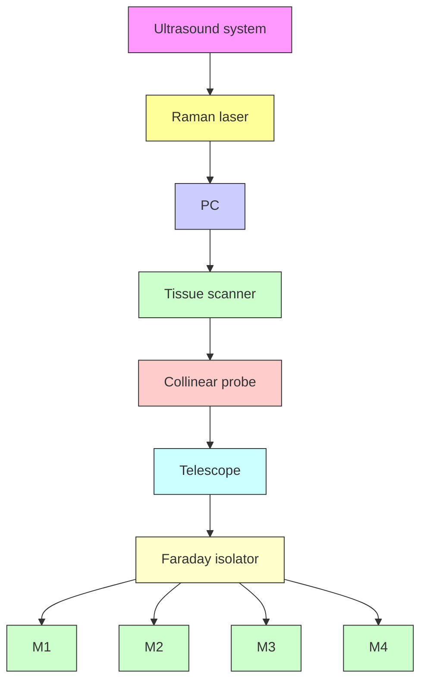
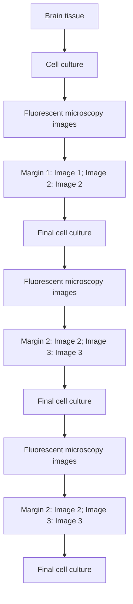

# High‐speed intra-operative assessment of breast tumour margins by multimodal ultrasound and photoacoustic tomography

Rui Li1,2,3\* | Lu Lan1,4\* | Yan Xia5 | Pu Wang5 | Linda K. Han6 | Gary L. Dunnington6 | Samilia Obeng‐Gyasi6 | George E. Sandusky7 | Jennifer A. Medley8 | Susan T. Crook8 | Ji‐Xin Cheng1,4,9

1 Weldon School of Biomedical Engineering, Purdue University, West Lafayette, Indiana  
2 School of Biological Science and Medical Engineering, Beihang University, Beijing, China  
3 Beijing Advanced Innovation Center for Biomedical Engineering, Beihang University, Beijing, China  
4 Photonics Center, Boston University, Boston, Massachusetts  
5 Vibronix, Inc., West Lafayette, Indiana  
6 Indiana University Health Melvin and Bren Simon Cancer Center, Indianapolis, Indiana  
7 Department of Pathology & Laboratory Medicine, Indiana University School of Medicine, Indianapolis, Indiana  
8 Department of Radiology and Imaging Sciences, Indiana University School of Medicine, Indianapolis, Indiana  
9 Purdue University Center for Cancer Research, West Lafayette, Indiana

## Correspondence

Ji‐Xin Cheng, Photonics Center, Boston University. Boston. MA. Email: jxcheng@bu.edu

## Funding information

NIH STTR, Grant/Award Number: 1R41CA200006‐01A1; Walther Cancer Foundation

## Abstract

Conventional methods for breast tumour margins assessment need a long turnaround time, which may lead to re‐operation for patients undergoing lumpectomy surgeries. Photoacoustic tomography (PAT) has been shown to visualize adipose tissue in small animals and human breast. Here, we demonstrate a customized multimodal ultrasound and PAT system for intra‐operative breast tumour margins assessment using fresh lumpectomy specimens from 66 patients. The system provides the margin status of the entire excised tissue within 10 min. By subjective reading of three researchers, the results show 85.7% [95% confidence interval (CI), 42.0–99.2] sensi tivity and 84.6% (95% CI, 53.7–97.3) specificity, 71.4% (95% CI, 30.3–94.9) sensitivity and 92.3% (95% CI, 62.1–99.6) specificity and 100% (95% CI, 56.1–100) sensitivity and 53.9% (95% CI, 26.1–79.6) specificity, respectively, when cross‐correlated with post‐operational histology. Furthermore, a machine learning‐based algorithm is deployed for margin assessment in the challenging ductal carcinoma in situ tissues and achieved 85.5% (95% CI, 75.2–92.2) sensitivity and 90% (95% CI, 79.9–95.5) specificity. Such results present the potential of using multimodal ultrasound and PAT as a high‐speed and accurate method for intra‐operative breast tumour margins evaluation.

## K E Y W O R D S

breast cancer, imaging, lipid, margin status, photoacoustic tomography

## 1 | INTRODUCTION

Each year, there are \~249,000 newly diagnosed breast cancer cases in the United States, 70% of which undergo breast‐conserving surgery or lumpectomy (Siegel, Miller, & Jemal, 2016). Compared to mastectomy, lumpectomy when used in conjunction with radia tion therapy has equivalent survival outcomes and is the preferred surgical intervention for early stage breast cancer (Arriagada, Le,

Rochard, & Contesso, 1996; van Dongen et al., 2000; Fisher et al., 2002; Veronesi et al., 2002). However, due to failure to achieve clear or negative margins in lumpectomy, 20%–40% of patients require additional operative intervention in the form of re‐excision or mastectomy (Atkins et al., 2012; Balch, Mithani, Simpson, & Kelley, 2005; Fleming et al., 2004; Huston, Pigalarga, Osborne, & Tousimis, 2006; Jacobs, 2008). Therefore, the ability to obtain accurate intra‐operative feedback about margin status will reduce the need for re‐excision and surgery‐related cost. Currently, there have been multiple existing or emerging intra‐operative imaging tools for breast tumour margin assessment (Supporting Information Table S1). Frozen sec tion and imprint cytology are applied clinically, but they suffer from long procedure time and low sensitivity (70%) due to sampling rate limitation (Cendan, Coco, & Copeland, 2005; Creager, Shaw, Young, & Geisinger, 2002; D’Halluin et al., 2009; Riedl et al., 2009). Radio frequency spectroscopy reduces the procedure time, but still suf fers from limited sensitivity (70%) and specificity (68%) owning to the lack of chemical selectivity (Thill, 2013; Thill, Roder, Diedrich, & Dittmer, 2011). Intra‐operative X‐ray provides the margin status in depth by displaying two‐dimensional projections in several minutes, but the sensitivity (49%) is reported very low due to the poorly defined tissue boundary (Erguvan‐Dogan et al., 2006; Goldfeder, Davis, & Cullinan, 2006). The emerging optical technologies, including optical coherence tomography (OCT), Raman spectroscopy, and diffuse reflectance imaging have improved the sensitivity and specificity, but still suffer from long procedure time, inadequate imag ing depth or limited detection area (Brown et al., 2010; Keller et al., 2010, 2011; Nguyen et al., 2009). Therefore, an unmet need exists in developing an intra‐operative margin assessment tool that is rapid, accurate and able to measure the entire tissue surface with adequate imaging depth (Brown et al., 2010; Morrow et al., 2016).

Intra‐operative ultrasound has been used as a guiding tool in breast‐conserving surgery to locate the tumour position (Pan et al., 2013). A recent study demonstrated the feasibility of high‐frequency ultrasound for intra‐operative breast tumour margin assessment with 74% sensitivity and 85% specificity in ductal carcinoma in situ (Doyle et al., 2011). Photoacoustic tomography (PAT), compatible with conventional ultrasonography, has proved its capability in rapid deep tissue imaging with optical absorption contrast and sub millimetre resolution (Gateau, Caballero, Dima, & Ntziachristos, 2013; Wang et al., 2003). Based on electronic absorption of haemoglobin or exogenous contrast agents, PAT has been used to study brain function, liver diseases, tooth health and breast tumour margins in mouse models (Cheng et al., 2016; Wang & Hu, 2012; Wu et al., 2017; Xi et al., 2012; Yao & Wang, 2011). In particular, based on absorption of haemoglobin, PAT has been used to detect breast cancer due to abnormal angiogenesis in recent clinical studies (Dean‐Ben, Fehm, Gostic, & Razansky, 2016; Diot et al., 2017; Ermilov et al., 2009; Heijblom et al., 2016; Toi et al., 2017). Also, based on elec tronic absorption of DNA and RNA, photoacoustic microscopy was performed to analyse the lumpectomy specimen for margin evaluation (Wong et al., 2017). More recently, PAT based on the overtone absorption of lipid in the second optical window (Supporting

Information Figure S1) has opened up multiple applications including intravascular plaque imaging, peripheral nerve imaging and etc (Cao et al., 2016; Li, Phillips, Wang, Goergen, & Cheng, 2016; Wang et al., 2012). Because of rich lipid content in the human breast, these pre vious advancements shed a light on the use of the second‐window PAT plus ultrasound for breast tumour margins assessment.

Herein, we demonstrate the first application of a multimodal ul trasound and PAT system for high‐speed intra‐operative assessmen of breast tumour margins with high sensitivity and specificity. By im plementing a customized automatic tissue scanner, the system pro vides a stack of two‐dimensional images of the entire tissue surface with 6 mm photoacoustic imaging depth and \~200 μm axial resolution within 10 min. The system outputs two imaging channels: high frequency ultrasound images showing the tissue morphology and photoacoustic images indicating lipid distribution, which is the majo component of healthy tissue in human breast. In a clinical study of 66 patients, we performed imaging on the whole freshly excised breast tumour tissues and then correlated it with the corresponding histo logical results to determine the sensitivity and specificity. By sub jective reading of three researchers, the results show 85.7% (95% CI, 42.0–99.2) sensitivity and 84.6% (95% CI, 53.7–97.3) specificity, 71.4% (95% CI, 30.3–94.9) sensitivity and 92.3% (95% CI, 62.1–99.6) specificity and 100% (95% CI, 56.1–100) sensitivity and 53.9% (95% CI, 26.1–79.6) specificity, respectively. Furthermore, in order to mitigate readers’ subjective variation and reduce the reading time, we implement a deep convolutional neural network (CNN) machine learning algorithm to differentiate positive margins from negative margins, specifically for ductal carcinoma in situ, and achieve 85.5% (95% CI, 75.2–92.2) sensitivity and 90% (95% CI, 79.9–95.5) specific ity. Together, these results demonstrate the translational potential and intra‐operative practicality of multimodal ultrasound and PAT in assessment of breast tumour margins in breast‐conserving surgeries.

## 2 | RESULTS AND DISCUSSION

## 2.1 | Engineering an intra-operative multimodal ultrasound and PAT system

Using overtone absorption of lipid as contrast, we built a multimodal ultrasound and PAT system capable of fast and automatic detection of ultrasound/photoacoustic signals (Figure 1) with the goal of distin guishing breast cancer from non‐cancerous tissue within 2 mm sur face in 10 min. The system employed a custom‐built, all‐solid‐state Raman laser as the excitation source, since the output wavelength lies in the optical window to solely visualize lipid in the breast (Li, Slipchenko, Wang, & Cheng, 2013; Wang et al., 2011). The 10 Hz, 10 ns pulse trains with the pulse energy of 100 mJ at 1197 nm wavelength were delivered to the excised breast tissue via a fibre bundle to effectively and sufficiently excite the lipid in the breast tissue to generate photoacoustic signals (Supporting Information Figure S2). The generated photoacoustic signals were acquired by a customized 18 MHz high‐frequency ultrasound array with 128 elements and 50% bandwidth. Meanwhile, the same transducer array emits and receives ultrasound signals, which were then processed by a high‐frequency ultrasound imaging system. The laser and the ultrasound system were connected to a computer to synchronize the trigger and visualize the registered ultrasound/photoacoustic images. In order to meet the need of fast intra‐operative margin assessment, an automatic tissue scanner (Supporting Information Figure S3) was designed and built based on a series of clinical testing of specimens from a total of 36 patients. In the final version, we achieved two‐dimensional scanning of $1 0 \times 1 0 \mathsf { c m } ^ { 2 } \mathsf { i n } 2$ min, which covered the size of the majority of excised breast tumour tissues in lumpectomies (Brown et al., 2010). To adapt to the tissue surface irregularity during the scanning, a collinear design was applied to fabricate the imaging probe (Supporting Information Figure S4), which was comprised of the ultrasound transducer, a fibre bundle, a pair of cylindrical lenses and two glass slides. Light illumination from the imaging probe was consistent with the transport simula tions (Supporting Information Figure S5) using ray optics simulation toolbox from MATLAB, demonstrating that the light from the end of the probe was collimated. With the collinear design, a freshly excised breast tumour tissue was imaged, showing 6 mm photoacoustic imag ing depth and 13.4 mm adaptation, which was two times better than the traditional bifurcation design (Supporting Information Figure S6).

flowchart

natural_image

White lab setup with transparent acrylic enclosure and keyboard, monitor on top (no visible text or symbols)

F I G U R E 1   Engineering an intra-operative multimodal ultrasound and photoacoustic tomography (PAT) system. (a) Schematic showing major components in the intra-operative multimodal ultrasound and PAT system. (b) Illustration of the intra-operative multimodal ultrasound and PAT system

## 2.2 | Development of an imaging protocol

A total of 30 female patients (Supporting Information Table S3) were enrolled in a study to determine the sensitivity and specificity of the multimodal ultrasound and PAT system. Patients requiring lumpec tomy for diagnosis of breast cancer, including ductal carcinoma in situ (DCIS) and invasive ductal carcinoma (IDC) diagnosed by pre operative imaging and core biopsies, were recruited at Indiana University Health Simon Cancer Center. All the patients signed and gave the informed consent for this study one day before the surgery per protocols approved by the Institutional Review Boards at Indiana University Health. Patients’ names and other HIPPA identifiers were removed from all sections of the study.

In lumpectomy operation, after a tumour mass was resected, it was first oriented with a long suture marking the lateral margin and a short suture marking the superior margin. Then, it was placed on a sample tray, and transparent ultrasonic gel was applied on its sur face for signal coupling (Figure 2a). The tray with gel coated spec imen was inserted into the tissue scanner. The cover of the tissue scanner was then closed, and the gel contacted with a plastic film of a water reservoir. In the meantime, distilled water was auto matically poured into the reservoir when the cover was closed. A series of 1,000 two‐dimensional (2D) ultrasound/photoacoustic im ages (Figure 2b,c) were taken over a 10 by $1 0 \mathrm { c m } ^ { 2 }$ area within 2 min and presented in three‐dimensional (3D) layout (Figure 2d,e). Upon completion of the first imaging, the tissue was taken out from the scanner, flipped 180°, and the aforementioned procedures were re peated to acquire the margin information of the other surface. With the automatic scanning design, we minimized the whole procedure time to <10 min. Finally, the tissue was cleaned and delivered to the histology room for further standard histopathology analysis. The re searchers involved in the data acquisition were completely blinded to the final histology results.

## 2.3 | Image analysis & evaluation protocol

All the ultrasound/photoacoustic images were acquired and processed with the same standard and displayed in the same brightness level and contrast scale, as recommended by board‐certified radiologists with fel lowship training in breast imaging. Data collected from the first enrolled

flowchart

  
F I G U R E 2   Development of an imaging protocol. (a) Imaging procedure. (b and c) Co‐registered 2D ultrasound and photoacoustic images reconstructed by the multimodal ultrasound and Photoacoustic tomography (PAT) system. (d and e) Co‐registered 3D ultrasound and photoacoustic images reconstructed by the multimodal ultrasound and PAT system

10 patients were used as a training set to establish the evaluation crite ria. The representative images from the training data set including dif ferent features were shown in Figure 3. The first column (Figure 3a–d) showed the 2D ultrasound images, which indicated tumour mass (red ovals), micro‐calcifications (bright spots inside the tissue, orange ovals), breast cyst (purple ovals) and fibrosis (blue ovals). The second column (Figure 3e–h) showed the 2D photoacoustic images, which mapped the adipose tissue (green ovals). All the images were confirmed by the corresponding haematoxylin and eosin (H&E) stained histology images (Figure 3i‐l) in the third column (Sewell, 1995; Sharma, Radosevich, Pachori, & Mandal, 2016). Based on the latest consensus guidelines from Society of Surgical Oncology‐American Society for Radiation Oncology‐American Society of Clinical Oncology in 2016, IDC requires clear margin on ink and DCIS requires at least 2 mm clear margin from the tissue surface (Morrow et al., 2016). Therefore, for IDC, if it was not all covered by adipose tissue (no photoacoustic signals on the surface), it was considered a positive margin (Figure 4a–c), which was consistent with the current invasive breast margins guideline of margins on ink. For DCIS, if it was not all covered by adipose tissue with at least 2 mm thickness or micro‐calcifications were found within 2 mm surface, it was considered a positive margin (Figure 4g–i). The margin assessment was made using the full set of ultrasound/photoacoustic images for each tis sue. As long as at least one image frame showed abnormal, the tissue was deemed as positive in margin assessment.

## 2.4 | Performance based on subjective reading

A blinded subjective reader study was performed to evaluate the statistical performance of the intra‐operative multimodal ultrasound and PAT system. Data from the remaining 20 patients were used to calculate the sensitivity and specificity (Table 1) associated with the margin interpretation of the breast tumour tissues in the tissue/pa tient level. Three readers including an imaging researcher, a breast surgeon and a board‐certified radiologist were recruited for this study. The readers were firstly given a training set of sample ultra sound/photoacoustic images showing tumour mass, micro‐calcifica tions, adipose tissue and breast cyst to familiarize with the images acquired by the imaging system. Then, each reader was instructed to visualize the images of the 20 breast tissues and score the tissue on a scale of 1–4 as the following: (a) a score of 1 means that the reader is confident that the margin is negative for cancer; (b) a score of 2 means that the reader thinks that the margin is likely negative, but there is some uncertainty; (c) a score of 3 means that the reader thinks that the margin is likely positive, but there is some uncertainty; (d) a score of 4 means that the reader is confident tha the margin is positive for cancer. After reading, the tissue margin was declared as negative only if given a score of 1 and positive if given a score of 2, 3 and 4, which represented a conservative clinical scenario. During the reading, each reader at first was instructed to evaluate the tissue margins by visualizing only ultrasound images of each tissue. Then, each reader was instructed to evaluate the tissue margins by visualizing ultrasound plus photoacoustic images of each tissue to judge whether the photoacoustic images would improve the reading results or not. Table 1 lists the statistical results for each reader. The results showed that only by ultrasound images itself, it was achieved 71.4% (95% CI, 30.3–94.9) sensitivity and 76.9% (95% CI, 46.0–93.9) specificity, 71.4% (95% CI, 30.3–94.9) sensitivity and 53.9% (95% CI, 26.2–79.6) specificity and 71.4% (95% CI, 30.3–94.9)

  
F I G U R E 3   Representative images showing different tissue features. (a–d) 2D ultrasound images of breast specimen. (e–h) 2D photoacoustic images of breast specimen. (i–l) Corresponding H&E images of breast specimen. Adipose tissue is circled by green ovals. Tumour mass is circled by red ovals. Micro‐calcifications are circled by orange ovals. Breast cyst is circled by purple ovals. Fibrosis is circled by blue ovals. Scale bar: 3 mm

sensitivity and 61.5% (95% CI, 32.3–84.9) specificity for each reader. However, by ultrasound images plus photoacoustic images, it was achieved 85.7% (95% CI, 42.0–99.2) sensitivity and 84.6% (95% CI, 53.7–97.3) specificity, 71.4% (95% CI, 30.3–94.9) sensitivity and 92.3% (95% CI, 62.1–99.6) specificity and 100% (95% CI, 56.1–100) sensitivity and 53.9% (95% CI, 26.1–79.6) specificity, respectively.

## 2.5 | Performance based on machine learning

Subjective interpretation of the ultrasound/photoacoustic images by either breast surgeons or radiologists is time‐intensive (10–15 min/ tissue, 3–5 s/frame) and reader biased. Consequently, a system which is able to rapidly deliver the consistent and accurate margin evalua tion will be preferred during the breast‐conserving surgeries. We employed a machine learning‐based algorithm called deep convolutional neural network (CNN) for breast tumour margin assessment because it needed relatively less pre‐processing and could achieve end‐to end supervised learning (Kuwahara & Eiho, 1983; LeCun, Bengio, & Hinton, 2015). In this study, GoogLeNet Inception v3 CNN architecture was applied and adapted to the margin assessment through transfer learning. Based on the inception v3 architecture pre‐trained on the ImageNet data set, the original leaf nodes were firstly replaced with our own two node (positive against negative). Then, the optimal threshold value for ultrasound model and photoacoustic model was obtained via the rule of farthest point from the diagonal in the Receiver Operating Characteristics (ROC) curve, respectively.

Ultrasound  

natural_image

Microscopic or scanned image showing a textured surface with vertical striations and a scale bar (no visible text or symbols)

Photoacoustic  

natural_image

Microscopic image showing fluorescently labeled cells with a red arrow pointing to a specific region (no text or symbols present)

Histology  

natural_image

Microscopic tissue section with blue outline and pink-stained cells, no visible text or labels

natural_image

Grayscale medical scan image showing tissue layers with a scale bar (no text or symbols)

natural_image

Fluorescent microscopy image showing yellow-stained cellular structures with an arrow pointing to a specific region (no text or symbols present)

natural_image

Microscopic tissue section stained with hematoxylin and eosin, showing cellular structures (no text or labels visible)

natural_image

Grayscale medical ultrasound image showing tissue layers with no visible text or symbols

natural_image

Microscopic image showing two red arrows pointing to a yellow fluorescent structure against a dark background, with a scale bar at the bottom (no text or symbols present)

natural_image

Microscopic tissue section stained pink and purple, showing cellular structures with scattered dark spots (no text or labels visible)

natural_image

Microscopic grayscale image showing layered tissue structure with no visible text or symbols

natural_image

Microscopic image showing a yellow fluorescent signal against a dark background, with scale bar and label (k) in top-left corner

natural_image

Microscopic tissue section stained with pink and purple hues, showing cellular structures (no text or labels visible)

F I G U R E 4   Representative images of different margins from invasive ductal carcinoma (IDC) and DCIS specimens. (a–c) IDC positive margin with ultrasound, photoacoustic and H&E images. (d–f) IDC negative margin with ultrasound, photoacoustic and H&E images. (g–i) ductal carcinoma in situ (DCIS) positive margin with ultrasound, photoacoustic and H&E images. (j–l) DCIS negative margin with ultrasound photoacoustic and H&E images. Red arrow in the first row indicates cancer protruding the margin. Orange arrow in the second row shows the cancer is covered by adipose tissue. The two red arrows in the third row indicate in situ cancer covering by adipose tissue with the thickness <2 mm. Scale bar: 3 mm

A training data set of 1,052 positive frames and 918 negative frames was built by flipping and rotating the images generated by the multimodal PAT system. These frames were determined as positive or negative based on the reading of ultrasound and photoacoustic images by a trained radiologist, also they were correlated to pathology H&E staining read by a pathologist. Two independen CNN models were trained with only ultrasound and only photoacoustic data, separately. Then the two models were combined with an OR method, that was, an image was classified as positive if predicted as positive by either ultrasound model or photoacoustic model (Figure 5). A testing set was built with 76 positive frames and 70 negative frames, of which the margin status was declared by a board‐certified radiologist. The ultrasound‐only CNN model achieved a best sensitivity of 57.9% (95% CI, 46.0–69.0) and spec ificity of 100% (95% CI, 93.5–100) on margin assessment, with cor responding area under curve (AUC) of 0.81. The photoacoustic‐only CNN model achieved a best sensitivity of 77.6% (95% CI, 66.4–86.1) and specificity of 90.0% (95% CI, 79.9–95.5) on margin assessment with an AUC of 0.87. The ultrasound‐photoacoustic‐combined model achieved the best sensitivity of 85.53% (95% CI, 75.2–92.2) and specificity of 90.0% (95% CI, 79.9–95.5) on margin assessment, with corresponding an AUC of 0.93 (ultrasound threshold was fixed) or 0.88 (photoacoustic threshold was fixed).

TA B L E 1   Sensitivity and specificity by subjective reading analysis

<table><tr><td>Reader</td><td>Statistics</td><td>Ultrasound only (%)</td><td>95% CI</td><td>Ultrasound + Photoacoustic (%)</td><td>95% CI</td></tr><tr><td rowspan="2">Reader 1</td><td>Sensitivity</td><td>71.4</td><td>30.3–94.9</td><td>85.7</td><td>42.0–99.2</td></tr><tr><td>Specificity</td><td>76.9</td><td>46.0–93.9</td><td>84.6</td><td>53.7–97.3</td></tr><tr><td rowspan="2">Reader 2</td><td>Sensitivity</td><td>71.4</td><td>30.3–94.9</td><td>71.4</td><td>30.3–94.9</td></tr><tr><td>Specificity</td><td>53.9</td><td>26.2–79.6</td><td>92.3</td><td>62.1–99.6</td></tr><tr><td rowspan="2">Reader 3</td><td>Sensitivity</td><td>71.4</td><td>30.3–94.9</td><td>100</td><td>56.1–100</td></tr><tr><td>Specificity</td><td>61.5</td><td>32.3–84.9</td><td>53.9</td><td>26.1–79.6</td></tr></table>

## 2.6 | Discussion

The goal of breast conservation surgery is to resect all cancer tissue while preserving as much normal tissue as possible for optimal cosmetic outcome. Achieving clear margin status of the excised breast tumour tissue, a key predictor of local recurrence (Dunne, Burke, Morrow, & Kell, 2009; Houssami et al., 2010), necessitates a fast and accurate intra‐operative margin assessment tool. Current methods either need long procedure time or lack sensitivity and specificity. Here, we demonstrate an intra-operative multimodal ultrasound and

PAT system for high‐speed and accurate assessment of breast tu mour margins in 20 patients.

The ideal intra‐operative tool for tissue margin assessment should image the entire tissue surface in a fast manner. In breast conservation surgery, the excised tissue can be of arbitrary shape and large size, which usually has a tissue surface area ranging from 1 to 100 cm2 . The tissue surface inevitably has a lot of fluctuations and irregularities, for example, 10 mm height difference between tissue peaks and valleys. Conventional margin assessment tools, such as electrical resonance spectroscopy and OCT, have limited imaging depth of <2 mm and cannot adapt to such tissue surface fluctua tion in scanning mode, which is significant to reduce the assessment time. To overcome this challenge, we developed two novel compo nents. Firstly, our collinear imaging probe was able to provide 6 mm imaging depth and adapts to tissue surface fluctuation up to 13 mm. Secondly, we developed an imaging chamber that significantly sim plified and shortened the tissue preparation time for ultrasound/ photoacoustic imaging. For conventional scanning of a specimen, agarose gel solution is needed to be prepared beforehand, poured into a tissue container, naturally cures to fix the tissue, and water is later added to couple the signal from the tissue to the imaging probe. Such tissue preparation method is not only complex, but also time consuming. Here, we designed a tissue cartridge and tissue con tainer to prepare the tissue for scanning and reconstruct 3D images within 5 min in 4 steps: (1) Before the imaging, the freshly excised breast tissue is rinsed by 0.9% saline solution, which takes 1 minute;

  
F I G U R E 5   Machine learning‐based margin assessment. (a) Illustration of positive margin. (b) Illustration of negative margin. Scale bar: 5 mm

(2) Ultrasound gel is applied on the surface of the tissue, which takes less than 1.5 minutes (depending on the tissue size); (3) The tissue cartridge with the tissue was inserted into the imaging chamber, which takes <0.5 min; (4) By pressing one button, the tissue surface was scanned within 2 min. Thus, the user was able to visualize the tissue margins of one surface within 5 min. In this study, two oppo site faces were imaged for one tissue, taking less than 10 min, which was the fastest intra‐operative breast tumour margin assessment tool to date. Also, 3D images of the breast tissue could be recon structed, showing the tumour location and size. By correlating the suspicious area to the lumpectomy cavity, the surgeon will be able to locate the corresponding area of concern for future resection.

In the subjective reading, reader 1 achieved 71.4% (95% CI, 30.3–94.9) sensitivity and 76.9% (95% CI, 46.0–93.9) specificity only by ultrasound images, while 85.7% (95% CI, 42.0–99.2) sensitivity and 84.6% (95% CI, 53.7–97.3) specificity by ultrasound plus photo acoustic images. Reader 2 achieved 71.4% (95% CI, 30.3–94.9) sensitivity and 53.9% (95% CI, 26.2–79.6) specificity only by ultrasound images, while 71.4% (95% CI, 30.3–94.9) sensitivity and 92.3% (95% CI, 62.1–99.6) specificity by ultrasound plus photoacoustic images. Reader 3 achieved 71.4% (95% CI, 30.3–94.9) sensitivity and 61.5% (95% CI, 32.3–84.9) specificity only by ultrasound images, while 100% (95% CI, 56.1–100) sensitivity and 53.9% (95% CI, 26.1–79.6) specificity by ultrasound plus photoacoustic images. Apparently, different readers have distinct interpretation of thresholds for call ing an image positive, and there is inter‐reader variability (Cohen’s Kappa Coefficient between reader 1 and reader 2, between reader 1 and 3 and between reader 2 and 3 is 0.565, 0.340 and 0.205, separately). However, the most conservative reading still has a sensitivity of 71% and a specificity of 92%, which is better than the current radio‐frequency spectroscopy (71% sensitivity and 68% specificity) and intra‐operative X‐ray (49% sensitivity and 73% specificity). The reported optical coherence tomography achieves 100% sensitivity and 82% specificity, but the decision criterion is margin on surface ink for all the tumour types in the reading. However, the new released consensus guideline on breast margins requires at least 2 mm for DCIS, which leads to a sensitivity of only 63% for a recent clinical study (Zysk et al., 2015) with the aforementioned optical coher ence tomography probe because of its limitation in imaging depth. High‐frequency ultrasound itself provided a decent sensitivity in evaluating the breast tumour margins, especially in IDC specimens. However, with photoacoustic tomography, the detecting specificity of breast margins improved in IDC specimens, which would avoid unnecessary tissue excisions. Moreover, by adding the photoacoustic imaging channel, the multimodal ultrasound and PAT system im proved both detection sensitivity and specificity for in situ cancer within 2 mm margins (Supporting Information Table S4–S6).

Machine learning‐based algorithm may improve the speed, con sistency and accuracy of margin assessment for breast‐conserving surgeries, intra‐operatively. Our results have shown that CNN‐based model achieved higher accuracy and adaptability than other automated approaches. The ideal CNN‐based classification algorithm will require little pre‐processing and provide general margin assessment for all tumour types in real time. The CNN‐based classification algo rithm reported here was able to distinguish between positive and negative margin status of 2 mm margin area for in situ tumour at a speed of 0.7 s/frame. We anticipate that the accuracy of our classification algorithm can be further improved by he followings: (a) collecting more patient data (including both positive and negative cases); (b) reducing background noise and fine‐tuning parameters of image pre‐processing. We also expect to obtain a more generalized classification algorithm that can be used for more types of breast tu mours by the followings: (a) training more CNN models focusing on different tumour types; or (b) adding another layer of pre‐classifier before margin assessment.

## 3 | CONCLUSION

As the prevalence of breast cancer screening, more lesions are identified in an early stage, leading to the popularity of using breast ‐conservation surgeries. Achieving a negative or clear mar gin is essential for improving the clinical outcomes. However, an unmet need still exists to achieve time‐efficient and highly sensitive intra‐operative evaluation of breast cancer margins during surgical procedures. Here, we demonstrate the first application of a customized multimodal ultrasound and PAT system for intraoperative breast tumour margins assessment using a compact and portable Raman laser‐based system and fresh lumpectomy specimens from 66 patients. Fresh lumpectomy specimens from a tota of 36 breast cancer patients were used to improve the design, especially the collinear imaging probe and automatic tissue scanner. The final system provides three‐dimensional compositional information of the entire excised breast tissue within 10 min. To evaluate the accuracy, fresh ex vivo human breast cancer tissues were obtained from 30 patients (10 for training, 20 for study) and imaged by the system maintained in a hospital surgical site. By subjective reading of three researchers, the results show 85.7% [95% CI, 42.0–99.2] sensitivity and 84.6% (95% CI, 53.7–97.3) specificity, 71.4% (95% CI, 30.3–94.9) sensitivity and 92.3% (95% CI, 62.1–99.6) specificity and 100% (95% CI, 56.1–100) sensitivity and 53.9% (95% CI, 26.1–79.6) specificity respectively when cross‐correlated with post‐operational histology. Furthermore, a machine learning‐based algorithm, termed deep convolutiona neural network, was deployed for breast tumour margin assessment and achieved 85.5% (95% CI, 75.2–92.2) sensitivity and 90% (95% CI, 79.9–95.5) specificity. Such results present the potential of using multimodal ultrasound and PAT as a high‐speed and accurate method for intra‐operative breast tumour margins evaluation.

## 4 | EXPERIMENTAL SECTION

## 4.1 | Clinical study design

The objective of this study was to evaluate the potential of the mul timodal ultrasound and PAT system to intra‐operatively assess the breast tumour margin status in breast‐conserving surgeries. Freshly excised human breast tumour tissues (n = 66) with different tumour types (IDC and DCIS) at Indiana University Health Simon Cancer Center were obtained and imaged by the imaging system. Patients undergoing mastectomies, or having infectious diseases, were ex cluded from this study. No patients were excluded based on age, ethnicity, race or weight (Supporting Information Table S2). All the experiment protocols in this study were approved and carried out in accordance with the relevant guidelines and regulations.

## 4.2 | Design of the Raman laser

A schematic of the compact $\mathsf { B a } ( \mathsf { N O } _ { 3 } ) _ { 2 }$ ‐based Raman laser was shown in Supporting Information Figure S2A,B. The Raman crystal was pumped by a Q‐switched Nd:YAG laser at 10 Hz pulse repetition rate. A Faraday optical isolator was used to protect the Nd:YAG laser from the damage caused by back‐scattering. A telescope composed of a planar‐convex lens with 70 mm focal length and a planar‐con cave lens with −50 mm focal length was employed to shrink the beam size to match the dimensions of the $\mathsf { B a } ( \mathsf { N O } _ { 3 } ) _ { 2 }$ crystal. For the Raman laser, a flat–flat resonator with a cavity length of about 10 cm was used. The resonator end mirror was coated with high reflectivity at 1,197 nm $( R > 9 9 \% )$ and high transmission at 1,064 nm (T > 95%). The output coupler was coated with high reflectivity at 1,064 nm (R > 99%) and 35% transmission at 1,197 nm. The $\mathsf { B a } ( \mathsf { N O } _ { 3 } ) _ { 2 }$ crystal, with dimensions of $7 \times 7 \times 9 0 \mathrm { m m } ^ { 3 }$ , was coated with high transmis sion at 1,064 and 1,197 nm on both faces.

The spectral profile of the generated Raman laser indicated the central wavelength of 1197.6 nm (Supporting Information Figure S2C), which lay in the second overtone absorption peak of lipid. The pulse duration of the output was measured to be 10.75 ns (Supporting Information Figure S2D), which met the thermal and stress confinements to efficiently generate photoacoustic signals. The maximum laser output could reach 142 mJ when the pump energy was 294 mJ, corresponding conversion efficiency of 48.3% (Supporting Information Figure S2E). The continuous laser power output within three hours was shown in Supporting Information Figure S2F. It indicated an average output of 1 W with 1.8% instability, which guaranteed sufficient pulse energy to excite the stable photoacoustic signals.

## 4.3 | Design of the automatic tissue scanner

The automatic tissue scanner (Supporting Information Figure S3A) was capable of 2D scanning of $1 0 \times 1 0 ~ \mathrm { c m } ^ { 2 }$ area within 2 min. The integrated imaging probe was placed on the top cover. After each breast conservation procedure, the top cover was lifted, and the fresh tissue was put on the tissue holder on the bottom (Supporting Information Figure S3B). Then, the top cover was closed, and a water reservoir covered with a plastic film contacted with the applied gel. Distilled water which was reserved in a water bottle was directed to the water reservoir as acoustic coupling medium. The imaging head then performed a 2D scan of the tissue within the water reservoir (Supporting Information Figure S3C). After one surface scanning, the top cover was lifted, and the tissue was flipped for the other surface scanning. The whole procedure took <10 min, which met the current economic need.

## 4.4 | Design of the collinear imaging probe

The schematic of the collinear imaging probe was shown in Supporting Information Figure S4. It was comprised of a custom‐built ultrasound transducer array, a fibre bundle, a pair of cylindrical lenses and two glass slides. The laser light propagating from the fibre bundle went through one glass slide to the tissue surface to excite ultrasound signals. The generated signals were reflected by the two glass slides and then received by the ultra sound transducer array. This collinear design was able to generate a collinear laser beam with a size of 2.6 mm × 10 mm at a distance of 10 mm (Supporting Information Figure S5), which was beneficial to adapt the tissue surface roughness. With a freshly excised breast tumour tissue, collinear design could reach 6 mm imaging depth with 13.4 mm adaptation, which was two times better than the traditional bifurcation design (Supporting Information Figure S6).

## 4.5 | Histology evaluation

Based on the suture orientation, the fixed breast tumour tissue was first inked with different colours for the following margin identifica tion. Then, it was grossed into several blocks. Through gross inspection, only suspicious areas from each block were incised and placed into a cassette for further standard H&E staining. Histology slides were digitized with a light microscope (ScanScope CS, Leica Inc.) a 20X magnification. Then all the H&E‐stained histology images were interpreted by a board‐certified pathologist for histopathologic as sessment and margin status. The pathologist was blinded to the re constructed images and results.

## ACKNOWLEDGEMENTS

This work was partly supported by a Walther Cancer Foundation grant to Dr. Ji‐Xin Cheng, and NIH STTR grant (1R41CA200006‐01A1) to Vibronix, Inc. We thank the IUSCC Cancer Center at Indiana University School of Medicine, for the use of the Tissue Procurement and Distribution Core, which pro vided patient consent and tissue collection service. We also thank Charles R. Stine, Amanda M. Harshbarger and Bradley W. Mosburg for breast tumour tissue grossing, Kyle McElyea and Victoria Sefcsik for digitizing tissue histology images, and Li‐Hsin Tseng fo analysing acquired tissue images.

## CONFLICT OF INTEREST

Pu Wang, Yan Xia, Linda Han and Ji‐Xin Cheng had a financial inter est in Vibronix inc.

## REFERENCES

Arriagada, R., Le, M. G., Rochard, F., & Contesso, G. (1996). Conservative treatment versus mastectomy in early breast cancer: Patterns of failure with 15 years of follow‐up data. Institut Gustave‐Roussy Breast Cancer Group. Journal of Clinical Oncology, 14, 1558–1564. https:// doi.org/10.1200/JCO.1996.14.5.1558  
Atkins, J., Al Mushawah, F., Appleton, C. M., Cyr, A. E., Gillanders, W. E., Aft, R. L., … Margenthaler, J. A. (2012). Positive margin rates following breast‐conserving surgery for stage I‐III breast cancer: Palpable versus nonpalpable tumors. Journal of Surgical Research, 177, 109– 115. https://doi.org/10.1016/j.jss.2012.03.045  
Balch, G. C., Mithani, S. K., Simpson, J. F., & Kelley, M. C. (2005). Accuracy of intraoperative gross examination of surgical margin sta tus in women undergoing partial mastectomy for breast malignancy. American Surgeon, 71, 22–27; discussion 27‐28.  
Brown, J. Q., Bydlon, T. M., Richards, L. M., Yu, B., Kennedy, S. A., Geradts, J., … Ramanujam, N. (2010). Optical assessment of tumor resection margins in the breast. IEEE Journal of Selected Topics in Quantum Electronics, 16, 530–544. https://doi.org/10.1109/ JSTOF.2009,2033257  
Cao, Y., Hui, J., Kole, A., Wang, P., Yu, Q., Chen, W., … Cheng, J. X. (2016). High‐sensitivity intravascular photoacoustic imaging of lipid‐laden plaque with a collinear catheter design. Scientific Reports, 6, 25236. https://doi.org/10.1038/srep25236  
Cendan, J. C., Coco, D., & Copeland, E. M. 3rd (2005). Accuracy of intra operative frozen‐section analysis of breast cancer lumpectomy‐bed margins. Journal of the American College of Surgeons, 201, 194–198. https://doi.org/10.1016/j.jamcollsurg.2005.03.014  
Cheng, R., Shao, J., Gao, X., Tao, C., Ge, J., & Liu, X. (2016). Noninvasive assessment of early dental lesion using a dual‐contrast photoacoustic tomography. Scientific Reports, 6, 21798. https://doi.org/10.1038/ srep21798  
Creager, A. J., Shaw, J. A., Young, P. R., & Geisinger, K. R. (2002). Intraoperative evaluation of lumpectomy margins by imprint cytology with histologic correlation: A community hospital experience. Archives of Pathology and Laboratory Medicine, 126, 846–848.  
Dean‐Ben, X. L., Fehm, T. F., Gostic, M., & Razansky, D. (2016). Volumetric hand‐held optoacoustic angiography as a tool for real‐time screening of dense breast. Journal of Biophotonics, 9, 253–259. https://doi. org/10.1002/jbio.201500008  
D'Halluin, F., Tas, P., Rouquette, S., Bendavid, C., Foucher, F., Meshba, H., … Levêque, J. (2009). Intra‐operative touch preparation cytology following lumpectomy for breast cancer: A series of 400 procedures. Breast, 18, 248–253. https://doi.org/10.1016/j. breast.2009.05.002  
Diot, G., Metz, S., Noske, A., Liapis, E., Schroeder, B., Ovsepian, S. V., … Ntziachristos, V. (2017). Multispectral optoacoustic tomography (MSOT) of human breast cancer. Clinical Cancer Research, 23, 6912– 6922. https://doi.org/10.1158/1078-0432.CCR-16-3200  
van Dongen, J. A., Voogd, A. C., Fentiman, I. S., Legrand, C., Sylvester, R. J., Tong, D., … Bartelink, H. (2000). Long‐term results of a randomized trial comparing breast‐conserving therapy with mastectomy: European Organization for Research and Treatment of Cancer 10801 trial. Journal of the National Cancer Institute, 92, 1143–1150. https:// doi.org/10.1093/jnci/92.14.1143  
Doyle, T. E., Factor, R. E., Ellefson, C. L., Sorensen, K. M., Ambrose, B. J., Goodrich, J. B., … Neumayer, L. A. (2011). High‐frequency ultrasound for intraoperative margin assessments in breast conservation surgery: A feasibility study. BMC Cancer, 11, 444. https://doi. org/10.1186/1471-2407-11-444  
Dunne, C., Burke, J. P., Morrow, M., & Kell, M. R. (2009). Effect of margin status on local recurrence after breast conservation and radiation therapy for ductal carcinoma in situ. Journal of Clinical Oncology, 27, 1615–1620. https://doi.org/10.1200/JCO.2008.17.5182  
Erguvan‐Dogan, B., Whitman, G. J., Nguyen, V. A., Dryden, M. J., Stafford, R. J., Hazle, J., … Middleton, L. P. (2006). Specimen radiography in confirmation of MRI‐guided needle localization and surgical excision of breast lesions. American Journal of Roentgenology, 187, 339–344. https://doi.org/10.2214/AJR.05.0422  
Ermilov, S. A., Khamapirad, T., Conjusteau, A., Leonard, M. H., Lacewell, R., Mehta, K., … Oraevsky, A. A. (2009). Laser optoacoustic imaging system for detection of breast cancer. Journal of Biomedical Optics, 14, 024007. https://doi.org/10.1117/1.3086616  
Fisher, B., Anderson, S., Bryant, J., Margolese, R. G., Deutsch, M., Fisher, E. R., … Wolmark, N. (2002). Twenty‐year follow‐up of a randomized trial comparing total mastectomy, lumpectomy, and lumpectomy plus irradiation for the treatment of invasive breast cancer. New England Journal of Medicine, 347, 1233–1241. https://doi.org/10.1056/ NEJMoa022152  
Fleming, F. J., Hill, A. D., Mc Dermott, E. W., O'Doherty, A., O'Higgins, N. J., & Quinn, C. M. (2004). Intraoperative margin assessment and re excision rate in breast conserving surgery. European Journal of Surgical Oncology, 30, 233–237. https://doi.org/10.1016/j.ejso.2003.11.008  
Gateau, J., Caballero, M. A., Dima, A., & Ntziachristos, V. (2013). Three dimensional optoacoustic tomography using a conventional ultra sound linear detector array: Whole‐body tomographic system fo small animals. Medical Physics. 40, 013302,  
Goldfeder, S., Davis, D., & Cullinan, J. (2006). Breast specimen radiog raphy: Can it predict margin status of excised breast carcinoma? Academic Radiology, 13, 1453–1459. https://doi.org/10.1016/j. acra.2006.08.017  
Heijblom, M., Piras, D., van den Engh, F. M., van der Schaaf, M., Klaase, J. M., Steenbergen, W., & Manohar, S. (2016). The state of the art in breast imaging using the Twente Photoacoustic Mammoscope: Results from 31 measurements on malignancies. European Radiology, 26, 3874–3887. https://doi.org/10.1007/s00330-016-4240-7  
Houssami, N., Macaskill, P., Marinovich, M. L., Dixon, J. M., Irwig, L., Brennan, M. E., & Solin, L. J. (2010). Meta‐analysis of the impact of surgical margins on local recurrence in women with early‐stage inva sive breast cancer treated with breast‐conserving therapy. European Journal of Cancer, 46, 3219–3232. https://doi.org/10.1016/j. ejca.2010.07.043  
Huston, T. L., Pigalarga, R., Osborne, M. P., & Tousimis, E. (2006). The influence of additional surgical margins on the total specimen volume excised and the reoperative rate after breast‐conserving surgery. American Journal of Surgery, 192, 509–512. https://doi.org/10.1016/j. amjsurg.2006.06.021  
Jacobs, L. (2008). Positive margins: The challenge continues for breast surgeons. Annals of Surgical Oncology, 15, 1271–1272. https://doi. org/10.1245/s10434-007-9766-0  
Keller, M. D., Majumder, S. K., Kelley, M. C., Meszoely, I. M., Boulos, F. I., Olivares, G. M., & Mahadevan‐Jansen, A. (2010). Autofluorescence and diffuse reflectance spectroscopy and spectral imaging for breast surgical margin analysis. Lasers in Surgery and Medicine, 42, 15–23. https://doi.org/10.1002/lsm.20865  
Keller, M. D., Vargis, E., de Matos, Granja. N., Wilson, R. H., Mycek, M. A., Kelley, M. C., & Mahadevan‐Jansen, A. (2011). Development of a spatially offset Raman spectroscopy probe for breast tumor surgical margin evaluation. Journal of Biomedical Optics, 16, 077006. https:// doi.org/10.1117/1.3600708  
Kuwahara, M., & Eiho, S. (1983). Image processing technics–focus on software. 1. Perspectives in biomedical image processing. Iyodenshi To Seitai Kogaku, 21, 266273.  
LeCun, Y., Bengio, Y., & Hinton, G. (2015). Deep learning. Nature, 521, 436-444. bttps://doi.org/10.1038/nature14539  
Li, R., Phillips, E., Wang, P., Goergen, C. J., & Cheng, J. X. (2016). Label free in vivo imaging of peripheral nerve by multispectral photo acoustic tomography. Journal of Biophotonics, 9, 124–128. https:// doi.org/10.1002/jbio.201500004  
Li, R., Slipchenko, M. N., Wang, P., & Cheng, J. X. (2013). Compact high power barium nitrite crystal‐based Raman laser at 1197 nm for pho toacoustic imaging of fat. Journal of Biomedical Optics, 18, 040502. https://doi.org/10.1117/1.JBO.18.4.040502  
Morrow, M., Van Zee, K. J., Solin, L. J., Houssami, N., Chavez‐MacGregor, M., Harris, J. R., … Moran, M. S. (2016). Society of surgical oncology American society for radiation oncology‐American society of clinical oncology consensus guideline on margins for breast‐conserving surgery with whole‐breast irradiation in Ductal Carcinoma in situ. Annals of Surgical Oncology, 23, 3801–3810. https://doi.org/10.1245 s10434-016-5449-z  
Nguyen, F. T., Zysk, A. M., Chaney, E. J., Kotynek, J. G., Oliphant, U. J., Bellafiore, F. J., … Boppart, S. A. (2009). Intraoperative evaluation of breast tumor margins with optical coherence tomography. Cancer Research, 69, 8790–8796. https://doi.org/10.1158/0008-5472. CAN-08-4340  
Pan, H., Wu, N., Ding, H., Ding, Q., Dai, J., Ling, L., … Wang, S. (2013). Intraoperative ultrasound guidance is associated with clear lumpectomy margins for breast cancer: A systematic review and meta: analysis. PLoS ONE, 8, e74028. https://doi.org/10.1371/journal. pone.0074028  
Riedl, O., Fitzal, F., Mader, N., Dubsky, P., Rudas, M., Mittlboeck, M., … Jakesz, R. (2009). Intraoperative frozen section analysis for breastconserving therapy in 1016 patients with breast cancer. European Journal of Surgical Oncology, 35, 264–270. https://doi.org/10.1016/j. ejso.2008.05.007  
Sewell, C. W. (1995). Pathology of benign and malignant breast disorders. Radiologic Clinics of North America, 33, 1067–1080.  
Sharma, T., Radosevich, J. A., Pachori, G., & Mandal, C. C. (2016). A molecular view of pathological microcalcification in breast cancer. Journal of Mammary Gland Biology and Neoplasia, 21, 25–40. https:// doi.org/10.1007/s10911-015-9349-9  
Siegel, R. L., Miller, K. D., & Jemal, A. (2016). Cancer statistics, 2016. CA: A Cancer Journal for Clinicians, 66, 7–30.  
Thill, M. (2013). MarginProbe: Intraoperative margin assessment during breast conserving surgery by using radiofrequency spectroscopy. Expert Review of Medical Devices, 10, 301–315. https://doi. org/10.1586/erd.13.5  
Thill, M., Roder, K., Diedrich, K., & Dittmer, C. (2011). Intraoperative assessment of surgical margins during breast conserving surgery of ductal carcinoma in situ by use of radiofrequency spectroscopy. Breast, 20, 579–580. https://doi.org/10.1016/j.breast.2011.08.134  
Toi, M., Asao, Y., Matsumoto, Y., Sekiguchi, H., Yoshikawa, A., Takada, M., … Shiina, T. (2017). Visualization of tumor‐related blood vessels in human breast by photoacoustic imaging system with a hemispherical detector array. Scientific Reports, 7, 41970. https://doi.org/10.1038/ srep41970  
Veronesi. U.. Cascinelli. N.. Mariani. I. Greco. M. Saccozzi. R.. Luini A., … Marubini, E. (2002). Twenty‐year follow‐up of a randomized study comparing breast‐conserving surgery with radical mastectomy for early breast cancer. New England Journal of Medicine, 347, 1227– 1232. https://doi.org/10.1056/NEJMoa020989  
Wang, H. W., Chai, N., Wang, P., Hu, S., Dou, W., Umulis, D., … Cheng, J. X. (2011). Label‐free bond‐selective imaging by listening to vibrationally excited molecules. Physical Review Letters, 106, 238106. https://doi.org/10.1103/PhysRevLett.106.238106  
Wang, L. V., & Hu, S. (2012). Photoacoustic tomography: In vivo imaging from organelles to organs. Science, 335, 1458–1462. https://doi. org/10.1126/science.1216210  
Wang, B., Karpiouk, A., Yeager, D., Amirian, J., Litovsky, S., Smalling, R., & Emelianov, S. (2012). Intravascular photoacoustic imaging of lipid in atherosclerotic plaques in the presence of luminal blood. Optics Letters, 37, 1244–1246. https://doi.org/10.1364/OL.37.001244  
Wang, X., Pang, Y., Ku, G., Xie, X., Stoica, G., & Wang, L. V. (2003). Noninvasive laser‐induced photoacoustic tomography for structural and functional in vivo imaging of the brain. Nature Biotechnology, 21, 803–806. https://doi.org/10.1038/nbt839  
Wong, T. T. W., Zhang, R., Hai, P., Zhang, C., Pleitez, M. A., Aft, R. L., … Wang, L. V. (2017). Fast label‐free multilayered histology‐like im aging of human breast cancer by photoacoustic microscopy. Science Advances, 3, e1602168. https://doi.org/10.1126/sciady.1602168  
Wu, J., You, L., Lan, L., Lee, H. J., Chaudhry, S. T., Li, R., … Mei, J. (2017). Semiconducting polymer nanoparticles for centimeters‐deep pho toacoustic imaging in the second near‐infrared window. Advanced Materials. 29, 1703403, https://doi.org/10.1002/adma.201703403  
Xi, L., Grobmyer, S. R., Wu, L., Chen, R., Zhou, G., Gutwein, L. G., … Jiang, H. (2012). Evaluation of breast tumor margins in vivo with intraoper ative photoacoustic imaging. Optics Express, 20, 8726–8731. https:/ doi.org/10.1364/OE.20.008726  
Yao, J., & Wang, L. V. (2011). Photoacoustic tomography: Fundamentals, advances and prospects. Contrast Media & Molecular Imaging, 6, 332– 345. https://doi.org/10.1002/cmmi.443  
Zysk, A. M., Chen, K., Gabrielson, E., Tafra, L., May Gonzalez, E. A. Canner, J. K., … Jacobs, L. K. (2015). Intraoperative assessment of final margins with a handheld optical imaging probe during breastconserving surgery may reduce the reoperation rate: Results of a multicenter study. Annals of Surgical Oncology, 22, 3356–3362. https://doi.org/10.1245/s10434-015-4665-2

## SUPPORTING INFORMATION

Additional supporting information may be found online in the Supporting Information section at the end of the article.

How to cite this article: Li R, Lan L, Xia Y, et al. High‐speed intra-operative assessment of breast tumour margins by multimodal ultrasound and photoacoustic tomography. Med Devices Sens. 2018;1:e10018. https://doi.org/10.1002/ mds3.10018