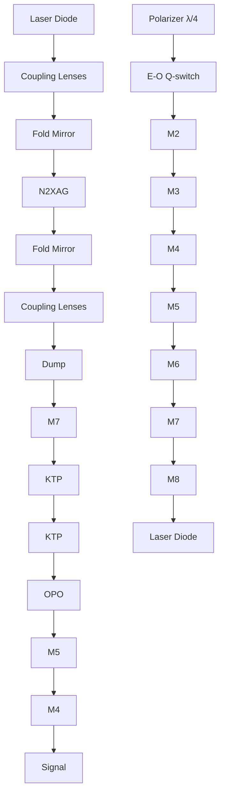
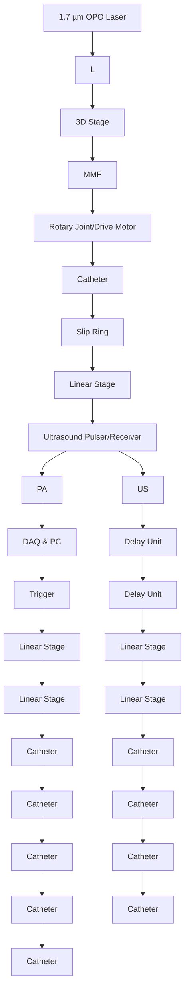

# High-speed intravascular photoacoustic imaging at 1.7 μm with a KTP-based OPO

Jie Hui,1,8 Qianhuan Yu,2,3,8 Teng Ma,4,8 Pu Wang,5 Yingchun Cao,5 Rebecca S. Bruning,6 Yueqiao Qu,7 Zhongping Chen,7 Qifa Zhou,4 Michael Sturek,6 Ji-Xin Cheng,5,9 and Weibiao Chen2,10

1 Department of Physics and Astronomy, Purdue University, West Lafayette, IN, 47906, USA  
2 Key Laboratory of Space Laser Communication and Detection Technology, Shanghai Institute of Optics and Fine Mechanics, Chinese Academy of Sciences, Shanghai 201800, China  
3 University of Chinese Academy of Science, Beijing 100049, China  
4 Department of Biomedical Engineering, NIH Ultrasonic Transducer Resource Center, University of Southern California, Los Angeles, CA, 90089, USA  
5 Weldon School of Biomedical Engineering, Purdue University, West Lafayette, IN, 47906, USA  
6 Department of Cellular & Integrative Physiology, Indiana University School of Medicine, Indianapolis, IN, 46202, USA  
7 Department of Biomedical Engineering, University of California, Irvine, Irvine, CA, 92612, USA  
8 These authors contributed equally to this work  
9 jcheng@purdue.edu  
10wbchen@mail.shcnc.ac.cn

Abstract: Lipid deposition inside the arterial wall is a hallmark of plaque vulnerability. Based on overtone absorption of C-H bonds, intravascular photoacoustic (IVPA) catheter is a promising technology for quantifying the amount of lipid and its spatial distribution inside the arterial wall. Thus far, the clinical translation of IVPA technology is limited by its slow imaging speed due to lack of a high-pulse-energy high-repetition-rate laser source for lipid-specific first overtone excitation at 1.7 μm. Here, we demonstrate a potassium titanyl phosphate (KTP)-based optical parametric oscillator with output pulse energy up to 2 mJ at a wavelength of 1724 nm and with a repetition rate of 500 Hz. Using this laser and a ring-shape transducer, IVPA imaging at speed of 1 frame per sec was demonstrated. Performance of the IVPA imaging system’s resolution, sensitivity, and specificity were characterized by carbon fiber and a lipid-mimicking phantom. The clinical utility of this technology was further evaluated ex vivo in an excised atherosclerotic human femoral artery with comparison to histology.

©2015 Optical Society of America

OCIS codes: (140.3460) Lasers; (110.0110) Imaging systems; (110.5125) Photoacoustics; (170.5120) Photoacoustic imaging; (170.1610) Clinical applications.

## References and links

1. L. M. Buja and J. T. Willerson, “Role of inflammation in coronary plaque disruption,” Circulation 89(1), 503– 505 (1994).  
2. P. Libby, “Inflammation in atherosclerosis,” Nature 420(6917), 868–874 (2002).  
3. M. Naghavi, P. Libby, E. Falk, S. W. Casscells, S. Litovsky, J. Rumberger, J. J. Badimon, C. Stefanadis, P. Moreno, G. Pasterkamp, Z. Fayad, P. H. Stone, S. Waxman, P. Raggi, M. Madjid, A. Zarrabi, A. Burke, C. Yuan, P. J. Fitzgerald, D. S. Siscovick, C. L. de Korte, M. Aikawa, K. E. Juhani Airaksinen, G. Assmann, C. R. Becker, J. H. Chesebro, A. Farb, Z. S. Galis, C. Jackson, I. K. Jang, W. Koenig, R. A. Lodder, K. March, J. Demirovic, M. Navab, S. G. Priori, M. D. Rekhter, R. Bahr, S. M. Grundy, R. Mehran, A. Colombo, E. Boerwinkle, C. Ballantyne, W. Insull, Jr., R. S. Schwartz, R. Vogel, P. W. Serruys, G. K. Hansson, D. P. Faxon, S. Kaul, H. Drexler, P. Greenland, J. E. Muller, R. Virmani, P. M. Ridker, D. P. Zipes, P. K. Shah, and J. T. Willerson, “From vulnerable plaque to vulnerable patient: a call for new definitions and risk assessment strategies: Part I,” Circulation 108(14), 1664–1672 (2003).  
4. P. Libby, M. DiCarli, and R. Weissleder, “The vascular biology of atherosclerosis and imaging targets,” J. Nucl. Med. 51(Suppl 1), 33S–37S (2010).  
5. A. Fernández-Ortiz, J. J. Badimon, E. Falk, V. Fuster, B. Meyer, A. Mailhac, D. Weng, P. K. Shah, and L. Badimon, “Characterization of the relative thrombogenicity of atherosclerotic plaque components: implications for consequences of plaque rupture,” J. Am. Coll. Cardiol. 23(7), 1562–1569 (1994).  
6. E. Falk, P. K. Shah, and V. Fuster, “Coronary plaque disruption,” Circulation 92(3), 657–671 (1995).  
7. R. Puri, E. M. Tuzcu, S. E. Nissen, and S. J. Nicholls, “Exploring coronary atherosclerosis with intravascular imaging,” Int. J. Cardiol. 168(2), 670–679 (2013).  
8. R. P. Choudhury, V. Fuster, and Z. A. Fayad, “Molecular, cellular and functional imaging of atherothrombosis,” Nat. Rev. Drug Discov. 3(11), 913–925 (2004).  
9. T. Ma, M. Yu, J. Li, C. E. Munding, Z. Chen, C. Fei, K. K. Shung, and Q. Zhou, “Multi-frequency intravascular ultrasound (IVUS) imaging,” IEEE Trans. Ultrason. Ferroelectr. Freq. Control 62(1), 97–107 (2015).  
10. T. Thim, M. K. Hagensen, D. Wallace-Bradley, J. F. Granada, G. L. Kaluza, L. Drouet, W. P. Paaske, H. E. Bøtker, and E. Falk, “Unreliable assessment of necrotic core by virtual histology intravascular ultrasound in porcine coronary artery disease,” Circ Cardiovasc Imaging 3(4), 384–391 (2010).  
11. P. R. Moreno, R. A. Lodder, K. R. Purushothaman, W. E. Charash, W. N. O’Connor, and J. E. Muller, “Detection of lipid pool, thin fibrous cap, and inflammatory cells in human aortic atherosclerotic plaques by near-infrared spectroscopy,” Circulation 105(8), 923–927 (2002).  
12. S. Brugaletta, H. M. Garcia-Garcia, P. W. Serruys, S. de Boer, J. Ligthart, J. Gomez-Lara, K. Witberg, R. Diletti, J. Wykrzykowska, R. J. van Geuns, C. Schultz, E. Regar, H. J. Duckers, N. van Mieghem, P. de Jaegere, S. P. Madden, J. E. Muller, A. F. van der Steen, W. J. van der Giessen, and E. Boersma, “NIRS and IVUS for characterization of atherosclerosis in patients undergoing coronary angiography,” JACC Cardiovasc. Imaging 4(6), 647–655 (2011).  
13. H. Yoo, J. W. Kim, M. Shishkov, E. Namati, T. Morse, R. Shubochkin, J. R. McCarthy, V. Ntziachristos, B. E. Bouma, F. A. Jaffer, and G. J. Tearney, “Intra-arterial catheter for simultaneous microstructural and molecular imaging in vivo,” Nat. Med. 17(12), 1680–1684 (2011).  
14. P. C. Beard and T. N. Mills, “Characterization of post mortem arterial tissue using time-resolved photoacoustic spectroscopy at 436, 461 and 532 nm,” Phys. Med. Biol. 42(1), 177–198 (1997).  
15. S. Sethuraman, J. H. Amirian, S. H. Litovsky, R. W. Smalling, and S. Y. Emelianov, “Spectroscopic intravascular photoacoustic imaging to differentiate atherosclerotic plaques,” Opt. Express 16(5), 3362–3367 (2008).  
16. T. J. Allen and P. C. Beard, “Photoacoustic characterisation of vascular tissue at NIR wavelengths,” Proc. SPIE 7177, 71770A (2009).  
17. H. W. Wang, N. Chai, P. Wang, S. Hu, W. Dou, D. Umulis, L. V. Wang, M. Sturek, R. Lucht, and J. X. Cheng, “Label-free bond-selective imaging by listening to vibrationally excited molecules,” Phys. Rev. Lett. 106(23), 238106 (2011).  
18. B. Wang, A. Karpiouk, D. Yeager, J. Amirian, S. Litovsky, R. Smalling, and S. Emelianov, “Intravascular photoacoustic imaging of lipid in atherosclerotic plaques in the presence of luminal blood,” Opt. Lett. 37(7), 1244–1246 (2012).  
19. K. Jansen, M. Wu, A. F. W. van der Steen, and G. van Soest, “Photoacoustic imaging of human coronary atherosclerosis in two spectral bands,” Photoacoustics 2(1), 12–20 (2014).  
20. P. Wang, J. R. Rajian, and J. X. Cheng, “Spectroscopic imaging of deep tissue through photoacoustic detection of molecular vibration,” J. Phys. Chem. Lett. 4(13), 2177–2185 (2013).  
21. P. Wang, T. Ma, M. N. Slipchenko, S. Liang, J. Hui, K. K. Shung, S. Roy, M. Sturek, Q. Zhou, Z. Chen, and J. X. Cheng, “High-speed intravascular photoacoustic imaging of lipid-laden atherosclerotic plaque enabled by a 2- kHz barium nitrite raman laser,” Sci. Rep. 4, 6889 (2014).  
22. P. Wang, H. W. Wang, M. Sturek, and J. X. Cheng, “Bond-selective imaging of deep tissue through the optica window between 1600 and 1850 nm,” J. Biophotonics 5(1), 25–32 (2012).  
23. B. Wang, A. Karpiouk, D. Yeager, J. Amirian, S. Litovsky, R. Smalling, and S. Emelianov, “In vivo intravascular ultrasound-guided photoacoustic imaging of lipid in plaques using an animal model of atherosclerosis,” Ultrasound Med. Biol. 38(12), 2098–2103 (2012).  
24. J. Zhang, S. Yang, X. Ji, Q. Zhou, and D. Xing, “Characterization of lipid-rich aortic plaques by intravascular photoacoustic tomography: ex vivo and in vivo validation in a rabbit atherosclerosis model with histologic correlation,” J. Am. Coll. Cardiol. 64(4), 385–390 (2014).  
25. Y. Li, X. Gong, C. Liu, R. Lin, W. Hau, X. Bai, and L. Song, “High-speed intravascular spectroscopic photoacoustic imaging at 1000 A-lines per second with a 0.9-mm diameter catheter,” J. Biomed. Opt. 20(6), 065006 (2015).  
26. X. Ji, K. Xiong, S. Yang, and D. Xing, “Intravascular confocal photoacoustic endoscope with dual-element ultrasonic transducer,” Opt. Express 23(7), 9130–9136 (2015).  
27. L. R. Marshall and A. Kaz, “Eye-safe output from noncritically phase-matched parametric oscillators,” J. Opt. Soc. Am. B 10(9), 1730–1736 (1993).  
28. D. J. Armstrong, W. J. Alford, T. D. Raymond, A. V. Smith, and M. S. Bowers, “Parametric amplification and oscillation with walkoff-compensating crystals,” J. Opt. Soc. Am. B 14(2), 460–474 (1997).  
29. American National Standard for Safe Use of Lasers, ANSI Z136.1 (2014).

## 1. Introduction

The majority of fatal acute coronary syndromes are due to plaque rupture and thrombosis [1– 4]. Pathophysiological assessment of atherosclerotic lesions have demonstrated that lesions more prone or “vulnerable” to rupture and thrombosis contain large lipid cores and are located in areas of high shear stress within the coronary arterial wall [2,5,6]. Currently, no clinically available imaging devices can reliably and accurately diagnose vulnerable plaques [7]. Imaging modalities, which include magnetic resonance angiography, computed tomography angiography and X-ray angiography are used primarily to image the encroachment of plaques on the artery lumen, which is not always predictive of lipid core size or plaque vulnerability. Among the current interventional imaging approaches, intravascular ultrasound (IVUS) lacks the chemical selectivity to determine the lipid-composition of the vessel wall [8], even for the most recently demonstrated multi-frequency IVUS method [9]. The so-called “virtual histology” based on IVUS image processing has been challenged [10]. Intravascular near infrared spectroscopy can detect lipids in the vessel wall with high specificity, but doesn’t provide enough depth to visualize its overall distribution in the artery [11,12]. Intravascular optical coherence tomography accurately detects the surface layer of arterial wall with micron-scale resolution, but has neither sufficient imaging depth nor chemical selectivity to determine plaque composition [13]. These limitations highlight an unmet clinical need for a novel intravascular imaging system maintaining both chemical selectivity and depth resolution.

Catheter-based intravascular photoacoustic (IVPA) imaging is considered as a promising modality to bridge the aforementioned gap. Combining nanosecond pulsed laser excitation with ultrasonic detection, IVPA catheters map chemical compositions in the artery based on their optical absorption. Photoacoustic (PA) imaging of lipid-rich plaques has been demonstrated under different wavelengths [14–16]. As reported, the 1.2 and 1.7 µm spectral bands resonant with the second and first overtone vibrations of the C-H bond and are suitable for IVPA imaging of lipid-rich plaques [17–19]. Compared with 1.2 µm excitation, 1.7 µm is more favorable for IVPA imaging due to the high absorption coefficient and less optical scattering by blood [18,20,21]. A few groups have demonstrated the feasibility of IVPA imaging of lipid-laden plaques by excitation at 1.7 µm, even in the presence of blood [18,19,22]. More recently, the in vivo feasibility test has been performed in animal models [23,24]. However, the in vivo imaging applications of IVPA technology is blocked by the slow imaging speed due to the lack of a high-pulse-energy high-repetition-rate laser source for high-speed lipid-specific excitation at 1.7 µm. The traditionally used optical parametric oscillator (OPO) lasers operate at 10-20 Hz repetition rate. Such a low repetition rate translates to a cross-sectional imaging speed of 50 s per frame of 500 A-lines, which is marginally useful for clinical applications. Recently, Song and associates demonstrated catheter-based high-speed PA imaging of phantoms containing perivascular fat using a commercial 1-kHz OPO at the wavelength of 1.7 µm [25]. The low pulse energy (\~30 µJ) of commercial OPO lasers, however, makes it difficult to generate data from real vascular tissues.

Here, we demonstrate a potassium titanyl phosphate (KTP)-based OPO with a pulse energy up to 2 mJ at a wavelength of 1724 nm and with a repetition rate of 500 Hz. Our laser outputs stable pulses with pulse duration of 13.2 ns and pulse-to-pulse variation of 6.3%. To obtain such high pulse energy and high repetition rate, we adopted two KTP crystals cut with a special angle and placed with adverse orientation to effectively minimize the walk-off effect. With this laser, we successfully performed human artery imaging ex vivo with an imaging speed as high as 1 frame per sec, which is about 50-fold faster than previously reported IVPA systems at 1.7 µm excitation [18,19,26].

## 2. Method and material

## 2.1 KTP-based OPO laser

We designed and constructed the compatible KTP-based OPO with high pulse energy and high repetition rate for the demanding need of high-speed IVPA imaging. A schematic diagram of the OPO laser was shown in Fig. 1. Two fiber-coupled laser diodes (LDs) with a 30 W maximum output power at 808 nm were used as the pump source. The pump light was coupled into both sides of the laser crystal at the same time by two groups of 2:5 coupling lenses. A 0.3%-doped composite Nd:YAG crystal (diameter, 4 mm; length, 40 mm) was used as the active medium. Here, the long crystal was chosen to reduce the damage to the pump LDs caused by the unabsorbed diode laser; while a composite Nd:YAG crystal with low doping was chosen to reduce the thermal lens effect and achieve a high-quality beam for the original fundamental laser, which helped to improve the conversion efficiency. This crystal had a 5 mm-long un-doped part on both distal ends and had the distal surfaces antireflection (AR) coated at both 808 and 1064 nm. A plane-plane resonating cavity was adopted in the laser system, which included the Nd:YAG crystal, mirrors M1 and $\begin{array} { r } { \mathbf { M } _ { 2 } , } \end{array}$ two fold mirrors, and an electro-optic (E-O) Q-switch (light green color framed). The flat mirror $\mathrm { M } _ { \mathrm { l } }$ was highreflection (HR) coated at 1064 nm. The output mirror $\mathbf { M } _ { 2 }$ was coated with a transmittance equivalent of 60% at 1064 nm. Two fold mirrors were AR coated at 808 nm and HR coated at 1064 nm. The E-O Q-switch was composed of a polarizer, a quarter-wave plate and a potassium dideuterium phosphate (KD\*P) Pockels cell. The pump had a pulse duration of 230 μs, which just closely matches the lifetime of the upper laser level for an Nd:YAG crystal. At the cavity output, the 1064 nm beam with pulse energy of 11 mJ was obtained with good beam quality and then redirected to the OPO by reflective mirrors $\mathrm { M } _ { 3 }$ and $\mathrm { M } _ { 4 }$ (both HR coated at 1064 nm). The OPO (light pink color framed) was composed of flat mirrors $\mathbf { M } _ { 5 }$ and $\mathrm { M } _ { 6 }$ and two KTP crystals. $\mathbf { M } _ { 5 }$ was AR coated at 1064 nm and HR coated at the signal wavelength. $\mathbf { M } _ { 6 }$ was AR coated at 1064 nm and had 40% partial transmittance at the signal wavelength. Both of the mirrors were made of quartz to avoid absorption at the signal laser.

flowchart

Fig. 1. Schematic of 1.7 μm OPO Laser. $\begin{array} { r } { \mathbf { M } _ { 1 } , \mathbf { M } _ { 2 } , \mathbf { M } _ { 5 } , \mathbf { M } _ { 6 } , } \end{array}$ flat mirrors; M3, $\mathrm { M } _ { 4 } , \mathrm { M } _ { 8 } ,$ reflective mirrors; $\mathbf { M } _ { 7 } ,$ dichroic mirror; KD\*P, potassium dideuterium phosphate Pockels cell; KTP, potassium titanyl phosphate. The inset shows the pictures of the actual laser system.

Here, the two KTP crystals with a size of $7 \times 7 \times 2 0 ~ \mathrm { m m } ^ { 3 }$ were cut in a special way (θ, $6 3 . 5 ^ { \circ } ; \Phi , 0 ^ { \circ } )$ to realize type II phase matching. It effectively reduced the walk-off effect by placing two KTP crystals with adverse orientations, while the effective nonlinear coefficient was still acceptable [27,28]. In order to reduce loss, both sides of the KTP crystals were AR coated at the pump, signal, and idler light. In the laser system, the length of the OPO cavity was designed to be as short as 44 mm, since a short length leads to a low conversion threshold power density. To dissipate heat effectively, the laser rods and KTP crystals were wrapped with indium foil and tightly mounted in water-cooled heat sinks. The temperature of the cooling water was kept at around 295 K. After the OPO, the pump beam was separated by the dichroic mirror $\mathbf { M } _ { 7 }$ and blocked by a dump; while the signal beam was separated by $\mathbf { M } _ { 7 }$ and then redirected to be the final output by the reflective mirror $\mathrm { M } _ { 8 } .$ It is important to note that all these optical components for the OPO were installed in a compatible aluminum alloy box with a size of $3 6 \times 2 \bar { 7 } \times 1 0 \mathrm { c m } ^ { 3 }$ shown by the inset pictures of Fig. 1. The compactness of the laser will make the entire IVPA imaging system much easier for clinical translation in an operating room.

(a)  

line chart

| Time (ms) | Amplitude (a.u.) |
| --------- | ---------------- |
| 0         | 0.0              |
| 2         | 0.5              |
| 4         | 0.5              |
| 6         | 0.5              |
| 8         | 0.5              |
| 10        | 0.5              |
| 12        | 0.5              |
| 14        | 0.5              |
| 16        | 0.5              |

(b)  

line chart

| Wavelength (nm) | Normalized intensity (a.u.) |
| --------------- | --------------------------- |
| 1700            | 0.0                         |
| 1710            | 0.0                         |
| 1720            | 1.0                         |
| 1730            | 0.0                         |
| 1740            | 0.0                         |
| 1750            | 0.0                         |

(c)  

line chart

| Current (A) | Output power (W) |
| ----------- | ---------------- |
| 6.5         | 0.0              |
| 7.0         | 0.2              |
| 7.5         | 0.4              |
| 8.0         | 0.6              |
| 8.5         | 0.8              |
| 9.0         | 1.0              |

(d)  

line chart

| Output power (W) | Output pulse duration (ns) |
| ---------------- | -------------------------- |
| 0.2              | 10                         |
| 0.3              | 12                         |
| 0.4              | 11                         |
| 0.5              | 12                         |
| 0.6              | 13                         |
| 0.7              | 12                         |
| 0.8              | 13                         |
| 0.9              | 13                         |
| 1.0              | 13                         |

(e)  

line chart

| Time (ns) | Intensity (a.u.) |
| --------- | ---------------- |
| -40       | 0.0              |
| -20       | 0.0              |
| 0         | 0.0              |
| 20        | 0.7              |
| 40        | 0.0              |
| 60        | 0.0              |

(f)  

line chart

| Pulse number | Pulse energy (mJ) |
| ------------ | ----------------- |
| 0            | 1.5               |
| 50           | 1.5               |
| 100          | 1.5               |
| 150          | 1.5               |
| 200          | 1.5               |

Fig. 2. Performance of the KTP-based OPO. (a) Repetition rate; (b) laser emission spectrum; (c) output power at different current; (d) pulse duration at different output power; (e) pulse duration at output power of 0.726 W; (f) pulse-to-pulse variation.

We characterized the performance of the KTP-based OPO. Beam quality factor is less than 1.3. The pulse repetition rate of the OPO is 500 Hz, as the time interval between every two neighboring pulses is 2 ms in Fig. 2(a). The output spectrum was measured by a NIR spectrometer (LF-1250, Spectral Evolution, MA). The peak position in the spectrum is centered at 1724 nm, which matches the first overtone vibrational band of C-H bond (Fig. 2(b)). The output power increases with the control current with a maximum power of 1 W (2 mJ for pulse energy) measured at 8.5 A (Fig. 2(c)). As shown in Fig. 2(d), the pulse duration is slightly increased with the output power ranging from 10.7 to 13.7 ns by measuring the FWHM of a single laser pulse. The pulse width with the output power of 0.726 W is 13.2 ns, at which we performed all of the experiments (Fig. 2(e)). Since PA imaging does not have a critical requirement on the pulse width in this range, the OPO can be used for IVPA imaging with a different power in this tunable range. The average pulse energy is characterized to be 1.452 mJ with 0.726 W output power. The pulse energy coupled to the catheter head was kept at 0.4 mJ. Thus, the energy density at the surface of the catheter was calculated to be 0.1 $\mathrm { J } / \mathrm { c m } ^ { 2 } .$ , which is below the 1 J/cm2 ANSI safety standard for skin at this wavelength [29]. The pulse-to-pulse variation is 6.27% (Fig. 2(f)), which ensures the same amount of photon delivery for each A-line at different angles.

## 2.2 High-speed IVPA imaging system

flowchart

Fig. 3. IVPA/IVUS imaging system. MMF, multimode fiber; L, lens.

The entire high-speed IVPA imaging system was constructed by integrating the KTP-based OPO laser, the IVPA catheter, a scanning system, and data acquisition units (Fig. 3(a)). The OPO output was focused by a lens with a focal length of 75 mm into a 200 μm-core multimode fiber (FG200LCC, Thorlabs, NJ) mounted on a 3D adjustable stage. After the 2 m long fiber, the beam was then coupled into the IVPA catheter by two fixed-focus collimators mounted on the scanning system. We designed a co-registered IVPA/IVUS dual-modality imaging catheter (inset of Fig. 3(a)). The IVPA catheter was composed of a miniaturized ringshape ultrasound transducer (center frequency, 35 MHz; band width, 65%; focal length, 3 mm), an end-polished 400 μm-core multimode fiber (BFL48-400, Thorlabs, NJ), a 45-degree rod mirror with a diameter of 2 mm (Edmund Optics Inc., NJ), a homemade metallic housing and a 55 cm long torque coil. For ultrasound transducer, single crystal $\mathrm { P b } ( \mathrm { M g } _ { 1 / 3 } \mathrm { N b } _ { 2 / 3 } ) \mathrm { O } _ { 3 } -$ PbTiO3 was adopted as the function piezoelectric material, which provides superior electromechanical coupling coefficient. The transducer/fiber and rod mirror were fixed in a metal housing with an open window for both light and sound delivery. Based on same design as used in the previous work [21], both the excitation light and the ultrasound transmission were reflected 90 degrees by the mirror, which maximized the optical-acoustic overlapping area and thus provided the largest sensitivity. The trigger of the laser was used to synchronize the data acquisition for both IVPA and IVUS imaging. A delay generator (37000-424, Datapulse Inc.) was used to set a 20 μs delay between the laser pulse and the initial ultrasound (US) pulse (the voltage of the transmitted pulse, 180 V) generated by an ultrasound pulser/receiver (5073PR Olympus, Inc). Both the generated PA and US signals were detected by the ring-shape transducer and then sent to the ultrasound pulser/receiver with a total amplification of 39 dB. These signals were digitized and transferred by a data acquisition card with 16 bits digitization and 180 MS/s sampling rate (ATS9462 PCI express digitizer, AlazerTech, Canada) installed in a personal computer (PC). The data acquisition software was developed to control, save, and process the recorded data in LabVIEW. The data analysis was then performed off-line by Matlab. In the Matlab script, each A-line was band-pass filtered (bandwidth: 9.5-50 MHz), Hilbert transformed for the signal envelop and subtracted by an averaged background. The final polar image (cross-sectional image) was constructed by 500 A-lines with a rotation speed of 1 frame per second. The dynamic range of each polar image was log compressed and then normalized. None of the images in the experiment was averaged. The rotation of the catheter was driven by a scanning system. We designed the scanning system by integrating a homebuilt optical rotary joint and a linear stage with an electrical slip ring (LPC-12T, JINPAT Electronics). The optical rotary joint delivered the laser light through free-space coupling by the collimators (concentrically aligned with a bearing) and rotated the catheter for the cross-sectional scanning. A linear stage was used for linear pullback to ultimately acquire three-dimensional imaging. The electrical slip ring was used to transmit the recorded signal from the transducer wire to the ultrasound pulser/receiver. Both the optical rotary joint and the linear stage were controlled by the PC.

## 3. Results

3.1 Performance test of high-speed IVPA imaging system by phantoms

text_image

(a)
2 mm
IVPA
Max
Min
D₂O
Carbon Fiber

text_image

(b)
2 mm
IVUS
Max
Min

line chart

| Axial position (mm) | PA amplitude (a.u.) - 102 µm | PA amplitude (a.u.) - 260 µm |
| ------------------- | ---------------------------- | ---------------------------- |
| 2.7                 | ~0.0                         | ~0.0                         |
| 2.8                 | ~0.0                         | ~0.0                         |
| 2.9                 | ~0.1                         | ~0.0                         |
| 3.0                 | ~1.0                         | ~0.9                         |
| 3.1                 | ~0.4                         | ~0.3                         |
| 3.2                 | ~0.1                         | ~0.0                         |
| 3.3                 | ~0.0                         | ~0.0                         |

line chart

| Axial position (mm) | Lateral | Axial |
| ------------------- | ------- | ----- |
| 2.5                 | 230     | 100   |
| 2.6                 | 225     | 100   |
| 2.7                 | 235     | 100   |
| 2.8                 | 240     | 100   |
| 2.9                 | 250     | 100   |
| 3.0                 | 260     | 100   |
| 3.1                 | 270     | 105   |
| 3.2                 | 280     | 105   |
| 3.3                 | 275     | 105   |
| 3.4                 | 285     | 105   |
| 3.5                 | 275     | 110   |
| 3.6                 | 265     | 110   |
| 3.7                 | 250     | 110   |
| 3.8                 | 230     | 110   |
| 3.9                 | 315     | 110   |
| 4.0                 | 225     | 110   |
| 4.1                 | 220     | 110   |
| 4.2                 | 215     | 110   |
| 4.3                 | 170     | 110   |
| 4.4                 | 160     | 115   |
| 4.5                 | 235     | 105   |
| 4.6                 | 180     | 95    |
| 4.7                 | 175     | 90    |

Fig. 4. IVPA imaging of 30 μm carbon fiber phantom. (a) IVPA image with schematic of carbon fiber phantom. Black dot indicates 30 μm carbon fiber. (b) IVUS image. (c) The axial and lateral resolutions of IVPA imaging at axial position of 3 mm. (d) The spatial resolutions of IVPA imaging as a function of the axial positions.

To characterize the spatial resolution of the high-speed IVPA imaging system, a carbon fiber with a diameter of 30 μm was imaged. As shown in the inset of Fig. 4(a), the carbon fiber was placed at the depth of 3 mm in $\mathrm { D } _ { 2 } \mathrm { O }$ environment. Both PA and US signals were collected and reconstructed as IVPA (Fig. 4(a)) and IVUS (Fig. 4(b)) images through the high-speed IVPA imaging system. The dynamic ranges for displayed IVPA and IVUS images are 60 dB and 90 dB, respectively. The co-registration of IVPA and IVUS imaging was clearly reflected. In Fig. 4(c), according to the IVPA image, the experimental data of the imaged carbon fiber was plotted along its axial and lateral directions, respectively. The dotted lines were then fitted with Gaussian functions to estimate the axial and lateral resolutions of IVPA imaging. Based on the FWHMs of the fitted functions, the axial resolution is estimated to be 102 μm, while the lateral resolution is 260 μm. The axial resolution of IVPA is quite close to that of IVUS, since it primarily depends on the transducer bandwidth. In Fig. 4(d), the spatial resolutions of IVPA imaging were measured and plotted as a function the axial positions. Both axial and lateral resolutions are maintained at the same levels, which shows the advantage of ring-shape transducer-based IVPA catheter.

To characterize the sensitivity and specificity, we made a lipid-mimicking phantom with butter for bond-selective IVPA imaging. The phantom structure is depicted in Fig. 5(a). 2.5% agarose-D2O gel acts as the tissue environment. One big hole, for IVPA catheter to be inserted in, and three small holes, two filled with butter while one left blank, were reserved in the agarose gel. The whole phantom and IVPA catheter were immersed in D2O medium for IVPA imaging to avoid water absorption at 1.7 μm. Using the high-speed IVPA imaging system, the B-scan IVPA, IVUS and merged IVPA/IVUS images of the phantom were obtained and shown in Fig. 5(b), Fig. 5(c) and Fig. 5(d) respectively. In the IVPA image with dynamic range of 39 dB, the two holes with butter exhibit strong PA signal while the blank hole shows no evident signal. In the IVUS image with dynamic range of 28 dB, all three holes provide contrast due to the boundaries of the holes and the butter. The relative positions of the holes in the merged image further confirm the co-registration of IVPA and IVUS imaging. The results above successfully demonstrated the specificity for high-speed IVPA imaging and also the good sensitivity for lipid detection.

text_image

(a)
Butter rod
Butter rod
D₂O agar gel
Hole with D₂O
2 mm
Phantom

text_image

(b)
2 mm
IVPA
Max
Min

text_image

(c)
2 mm
IVUS
Max
Min

natural_image

Circular microscopy image showing merged fluorescent spots with 2 mm scale bar (no text or symbols beyond labels)

Fig. 5. IVPA imaging of lipid-mimicking phantom. (a) Schematic of phantom structure. (b) IVPA image. (c) IVUS image. (d) Merged IVPA/IVUS image.

## 3.2 Ex vivo high-speed IVPA imaging of human artery with histological validation

To further validate the high-speed IVPA imaging system, an ex vivo study of an excised atherosclerotic human femoral artery was performed. A small section of artery with atherosclerotic plaque verified by a microscope was fixed in 2.5% agarose-H2O gel and immersed in water for imaging purpose. The IVPA catheter was then inserted into the lumen of the artery and rotated at a speed of 1 round per second. 500 A-lines were acquired during a cycle to form a cross-sectional image. The IVPA (Fig. 6(a)), IVUS (Fig. 6(b)), and merged (Fig. 6(c)) images of the atherosclerotic artery clearly show the complementary information of the artery wall. Notably, the lipid deposition in the arterial wall indicated by white arrows at 2 and 3 o'clock directions, which is not seen in the IVUS image (dynamic range of 70 dB), shows high contrast in the IVPA image with dynamic range of 54 dB. The lipid deposition in 2 and 3 o'clock directions, although spatially stretched and distorted a little bit by the inserting catheter indicated by some of the calcium lesion torn, was further confirmed by the gold standard histology of the same cross-section of the artery (Fig. 6(d)). In the histology, the lipid shows up with red color and areas of calcification are black when stained with Oil Red O. The lipid deposition in 7 o'clock direction was not successfully picked up by IVPA imaging. There are two possible reasons, either caused by catheter induced spatial distortion or by the histology process, where exact the same cross-section was not sliced. During the experiment, the energy density at the catheter head was maintained at 0.1 J/cm2 , which is below the ANSI safety standard for a nanosecond laser at this wavelength. The imaging and histology results further confirmed the capability of the high-speed IVPA imaging system for lipid detection accurately and specifically.

text_image

(a)
2 mm
IVPA
Max
Min

text_image

(b)
2 mm
IVUS
Max
Min

natural_image

Circular grayscale image showing a bright green fluorescent region with a central hole, labeled 'Merged' and scale bar indicating 2 mm (no text or symbols beyond labels)

natural_image

Microscopic histology image showing tissue sections with scale bar (1 mm) and label (d), no readable text or symbols beyond labels

Fig. 6. High-speed IVPA/IVUS imaging of an excised atherosclerotic human femoral artery. (a) IVPA image. (b) IVUS image. (c) Merged IVPA/IVUS image. (d) Cross-sectional view of the artery histologically assessed for lipids with Oil-Red-O staining. The red indicates the lipid deposition in the artery and the black indicates areas of calcification.

## 4. Discussion and conclusion

In this study, we have developed a compactible KTP-based OPO with an 2 mJ output at the wavelength of 1724 nm and repetition rate of 500 Hz and demonstrated its use for high-speed IVPA imaging of lipid deposition inside an intact human artery wall. The performance of the IVPA imaging system’s resolution, sensitivity and specificity were successfully characterized by a 30 μm carbon fiber and a lipid-mimicking phantom through a ring-shape transducerbased IVPA catheter. The axial and lateral resolutions were measured to be 102 μm and 260 μm, respectively. Although the catheter we used has a relative large diameter, the constant spatial resolutions along the axial positions and the large optical-acoustic overlapping area make this design advantageous when compared with front-back and dual-element transducer designs [25,26]. For clinical applications, our catheter size should be further reduced to \~1 mm in diameter. The size of our IVPA catheter is mainly determined by the size of ring-shape transducer. The current size of ring-shape transducer (2.5 mm) is limited by the traditional fabrication method of mechanical turning and drilling due to the multi-layer structure of transducer as well as the small stiffness of piezoelectric material. Currently, our group is working toward to reducing the transducer size down to 1 mm in diameter by using the two available advanced micro-machining techniques: laser cutting and inductively coupled plasma (ICP)-enhanced deep reactive ion etching (DRIE). Nd: YAD solid-state laser cutting system is able to precisely drill and cut the ceramic substrate of ultrasonic transducer with a narrow kerf less than 10 microns and up to 1 mm thickness. Moreover, the ICP-DRIE method commonly used for composite material fabrication can also be easily adapted to fulfill the requirements of transducer minimization. The improvement on spatial resolutions based on IVPA catheter designs also increases the detection accuracy of lipid distribution, thus provides more accurate diagnosis of plaque vulnerability.

Another improvement to be addressed is the laser source with even higher repetition rate. Currently, the IVPA imaging speed is primarily driven by the availability of high repetition rate laser source with wavelengths that generate relative contrasts. In order to make IVPA imaging competitive for clinical applications, the imaging speed has to be increased to \~30 frames/sec, comparable with the typical imaging speed of clinical IVUS. The least number of A-lines forming a cross-sectional IVPA image is determined by the lateral resolution. Based on our imaging results and Nyquist sampling theorem, the least number of A-lines is $\frac { 2 \pi \times V i e w i n g d e p t h } { L a t e r a l r e s o l u t i o n } = 1 2 5$ with lateral resolution of \~250 μm and viewing depth of 5 mm.

Thus, the laser repetition rate needs to be at least 3750 Hz. If the number of A-lines is increased to be the same with clinical IVUS (256 A-lines typically), then the repetition rate needs to be \~7500 Hz. If the lateral resolution goes to the optical resolution, then the repetition rate needs to be much higher. Therefore, we need further improve our laser with high repetition rate of the order of 10 kHz. It still is possible by using a KTP-based OPO to generate the high-energy pulsed laser with \~10 kHz repetition rate at 1.7 μm for clinical IVPA imaging and we are now working toward to engineering such laser. Moreover, the compactness of the laser facilitates clinical translation of the IVPA imaging system.

## Acknowledgments

This work was funded by R01HL125385 to J.X. Cheng and M. Sturek, R01HL127271 to Z. Chen, and T32HL079995 and Center of Excellence in Cardiovascular Research Grant to M. Sturek.