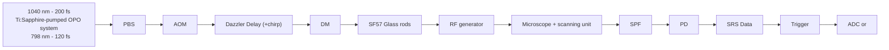

## Optics Letters

# High-speed stimulated hyperspectral Raman imaging using rapid acousto-optic delay lines

1,†   2,†   1   3 MOHAMMED S. ALSHAYKH, CHIEN-SHENG LIAO, OSCAR E. SANDOVAL, GREGORY GITZI

1 Department of Electrical and Computer Engineering, 465 Northwestern Ave., Purdue University, West Lafayette, Indiana 47907, USA

2 Weldon School of Biomedical Engineering, 206 S. Martin Jischke Drive, Purdue University, West Lafayette, Indiana 47907, USA

3 Fastlite, 1900 route des Crêtes, 06560 Valbonne, France

4 Purdue University Center for Cancer Research, Purdue University, West Lafayette, Indiana 47907, USA

5 Department of Chemistry, Purdue University, 560 Oval Drive, West Lafayette, Indiana 47907, USA

6 Birck Nanotechnology Center, Purdue University, West Lafayette, Indiana 47907, USA

7 e-mail: jcheng@purdue.edu

\*Corresponding author: amw@purdue.edu

Received 7 February 2017; revised 14 March 2017; accepted 14 March 2017; posted 16 March 2017 (Doc. ID 285619); published 6 April 2017

Stimulated Raman scattering (SRS) is a powerful, label-free imaging technique that holds significant potential for medical imaging. To allow chemical specificity and minimize spectral distortion in the imaging of live species, a highspeed multiplex SRS imaging platform is needed. By combining a spectral focusing excitation technique with a rapid acousto-optic delay line, we demonstrate a hyperspectral SRS imaging platform capable of measuring a 3-dB spectral window of ∼200 cm−1 within 12.8 μs with a scan rate of 30 KHz. We present hyperspectral images of a mixture of two different microsphere polymers as well as live fungal cells mixed with human blood. © 2017 Optical Society of America

OCIS codes: (170.5660) Raman spectroscopy; (180.4315) Nonlinear microscopy; (170.1420) Biology; (170.1065) Acousto-optics

https://doi.org/10.1364/OL.42.001548

Stimulated Raman scattering (SRS) is a nonlinear process that relies on intrinsic molecular vibrations, allowing label-free imaging. Removing the need for added labels or tags simplifies the imaging process, prevents the possibility of the label altering the observed phenomena, and eliminates any potential toxicity [1]. SRS is limited by low signal intensities, rendering it slow and unsuitable for studying the molecular dynamics of live biological samples. Coherent Raman scattering (CRS) can overcome these limitations. Video-rate single color coherent anti-Stokes Raman scattering (CARS) and SRS have been demonstrated [2,3]. However, chemical specificity in single-color CRS is limited and fails to separate specimens with overlapping Raman bands. To improve chemical specificity, broadband CARS using supercontinuum laser sources achieved speeds of several milliseconds per pixel [4]. However, CARS suffers from a nonresonant background signal that distorts the spectra [5]. Phase retrieval methods to reconstruct the real Raman spectra have been developed but require complicated analysis [6]. In SRS, the Raman signal is coherently heterodyne, mixed with either the Stokes or the pump beam, thereby eliminating the nonresonant background signal. In addition, the SRS signal i linearly proportional to the concentration [7]. We note, however, that other non-Raman background signals, such a cross-phase modulation, transient absorption and photother mal lensing, are present [8]. Recently, multicolor SRS with 16 multiplex detection channels was demonstrated with a 32-μs pixel dwell time [9].

One simple approach to hyperspectral CRS is spectral focusing [10]. Two broadband femtosecond pulses are linearly chirped to the picosecond range. Due to the chirp, the instantaneous frequency of the pulse varies with time. If one beam is delayed with respect to the other, the beating frequency be tween the pump and Stokes is slightly changed. This allow tunable excitation of the Raman modes via the control of th delay [11]. Hyperspectral CARS and SRS using spectral focusing were demonstrated with acquisition times in the order of several tens of seconds to minutes [10,12]. The speed was limited by the mechanical motorized delay line. This limitation can be overcome by utilizing rapid acousto-optic delay lines [13]. The use of acousto-optic delay lines was demonstrated in absorption spectroscopy [14] and more recently in pump probe transient absorption spectroscopy and terahertz spectros copy [15,16].

In this work, we implement a Raman imaging setup that combines spectral focusing with a rapid acousto-optic delay line. The SRS signal is recorded within 12.8 μs with a scan rate of 30 KHz per pixel. Hyperspectral images of a mixture of two different microsphere polymers as well as live fungal cells mixed with human blood are shown, and a chemical concentration map is successfully obtained.

The acousto-optic programmable dispersive filter (AOPDF) has been used extensively for pulse shaping and dispersion control [17,18]. It consists of a birefringent crystal in which an acoustic pulse propagates with the optical beam in collinear geometry. The input laser pulse is linearly polarized to the ordinary axis. The travelling sound wave causes periodic variations in the dielectric tensor, which in turn couple the unperturbed normal modes of the structure. Part of the optical pulse is diffracted to the extraordinary mode, where it propagates through the rest of the crystal’s length with slightly different group velocity. The acoustic wave, which has a velocity six orders or magnitude lower than the speed of light, takes 33 μs to propagate through the 25-mm-long $\mathrm { T e O } _ { 2 }$ crystal. When lasers with repetition rates of multi-megahertz or higher are used, the acoustic wave propagates a small distance during the repetition period, leading to shot-to-shot variations in the position where the laser-acoustooptic interaction happens. This in turn results in an incremental delay in the diffracted optical beam that varies linearly throughout the pulse train. In addition, incremental dispersion, which could lead to pulse width variations, is also added. Schubert et al. [13] have shown that this effect is insignificant for pulse widths equal to or higher than 100 fs. Furthermore, instead of using the AOPDF only as a delay line, we use it to chirp the pulses as well. This also relaxes the limitations on pulse width imposed by the incremental dispersion, which becomes a small and negligible fraction of the total dispersion. The AOPDF used introduces a maximum delay of 7.9 ps. To chirp an optical pulse, a temporally longer acoustic pulse is required. The optical pulses interacting with the acoustic wave at the interface of the crystal are ignored due to incomplete or partial interaction. We reserve part of the pulse shaping capability to ensure that a delay range of 3 ps with full acousto-optic interaction occurs. The rest of the pulse shaping capability is utilized to chirp a 200-fs Stokes pulse to 0.96 ps. A delay range of 3 ps with full acousto-optic interaction is scanned within 12.8 μs. However, the acoustic wave takes 33 μs to propagate through the crystal.

text_image

(a)
f (THz)
Time (ps)
chirp
(b)
f (THz)
Time (ps)
ωv1
ωv2

flowchart

(a) Concept of spectral focusing. Chirping the pulses focuses Fig. 1.the energy to excite a narrow Raman vibrational mode and results in the beating frequency between the pump and Stokes becoming delaydependent. (b) The experimental setup: λ∕2, half-wave plate; PBS, polarization beam splitter; AOM, acousto-optic modulator; DM, dichroic mirror; SPF, short-pass filter; PD, photodetector; ADC, analog-to-digital converter.

Figure 1 shows the experimental setup. A Ti:Sapphire pumped optical parametric oscillator system (InSight, Spectra Physics) provides two synchronized output beams: a 200-fs pulse at 1040 nm with a repetition rate of 80 MHz, and a wavelength-tunable 120-fs pulse set to 798 nm. By passing through two 12.7-cm-long SF57 glass rods, the 120-fs pump was chirped to 1.6 ps, measured with an autocorrelator (PulseScope, APE). The intensity of the 200-fs Stokes beam was modulated by an acousto-optic intensity modulator (AOM, 1205-C, Isomet) at 6.6 MHz, then sent to an acousto-optic programmable disper sive filter (AOPDF). To match the chirp rate, the AOPDF (Dazzler, Fastlite) was programmed to chirp the Stokes to 0.96 ps while simultaneously being used as a delay line. A small fraction of the pump beam was photodetected and the signal was used as an external clock to the Dazzler’s RF drivers to reduce jitter. After the AOPDF, the diffracted rays were separated by propagating spatially, and then a half-wave plate was used to align the polarization parallel to the pump beam. The two beams were combined by a dichroic mirror, and were then sent to the laser-scanning microscope. The powers sent to the microscope were 200 mw and 30 mw for the Stokes and pump, respectively. A 60× water immersion objective lens (UPLSAPO 60XW, Olympus) was utilized to focus the light into the sample, and an oil condenser (N.A. 1.4, Nikon) was used to collect the signal. A short-pass filter (980 sp, Chroma) passed the 798-nm beam, and a stimulated Raman loss signal was detected by a photodiode (S3994, Hamamtsu) equipped with a home-built resonant circuit with a bandwidth of 2.4 MHz. The signal was recorded using an oscilloscope (DS4024, RIGOL) for spectroscopy, or an analog-to-digital converter (ATS460, AlazarTech) with a sampling frequency of 20 MHz for imaging.

Figure 2 shows Raman spectra of four different substances: dimethyl sulfoxide (DMSO), cyclohexanone, methanol, and olive oil. The known Raman peaks of these substances were used to map the time delay axis to wavenumbers. In spectral focusing, all the spectral energy is focused to excite a narrowband. However, as one pulse is delayed with respect to the other, the overlap between the pulses is reduced, and the driving force term falls according to the intensity cross-correlation of the pump and Stokes. Using 120-fs and 200-fs Gaussian pulses, the 3-dB detection bandwidth is approximately $2 0 0 \ \mathrm { c m ^ { - 1 } }$ . The two-photon absorption signal of Rhodamine 6G, which closely resembles the cross-correlation of the pump and Stokes, was used to normalize the detection window of the SRS signal. The spectral resolution obtained is estimated for the $2 9 \bar { 1 } 2 ~ \mathrm { c m } ^ { - 1 }$ peak of DMSO to be ${ \sim } 2 5 ~ \mathrm { c m ^ { - 1 } }$ . This spectral resolution is similar to the resolution obtained with motorized mechanical stages [19]. This also agrees with the theoretical results. Assuming linearly chirped Gaussian pulses, and that $( \Delta t _ { \mathrm { c h } } / \Delta t ) ^ { 2 } \gg 1$ , where $\Delta t$ and $\Delta t _ { \mathrm { c h } }$ represent the trans- form-limited and the chirped pulse duration, respectively, we can write the driving force, $F ,$ as

line chart

| wavenumbers (cm⁻¹) | Olive oil | Methanol | Cyclohexanone | DMSO |
| ------------------ | --------- | -------- | ------------- | ---- |
| 2800               | 3.3       | 2.3      | 1.2           | 0.0  |
| 2850               | 4.0       | 2.8      | 1.8           | 0.0  |
| 2900               | 4.1       | 2.6      | 1.7           | 1.0  |
| 2950               | 3.5       | 2.4      | 2.1           | 0.0  |
| 3000               | 3.3       | 2.2      | 1.2           | 0.4  |
| 3050               | 3.2       | 2.1      | 1.1           | 0.0  |

SRS spectra of dimethyl sulfoxide (DMSO), cyclohexanone, Fig. 2.methanol, and olive oil. The spectra are shown after calibration and normalization of the detection window using a two-photon absorption signal of Rhodamine 6G.

$$
\begin{array}{l} F (\omega) = \Im \{E _ {p} (t) E _ {s} ^ {*} (t) \} = \Im \left\{\text { Re } \right. \\ \left. \times \left\{B _ {p} B _ {s} e ^ {j \left(\omega_ {p} - \omega_ {s}\right) t - (1. 1 7 7 t) ^ {2} \left[ \left(\frac {1}{\Delta t _ {\mathrm{ch} , p} ^ {2}} + \frac {1}{\Delta t _ {\mathrm{ch} , s} ^ {2}}\right) + j \left(\frac {1}{\Delta t _ {\mathrm{ch} , s} \Delta t _ {s}} - \frac {1}{\Delta t _ {\mathrm{ch} , p} \Delta t _ {p}}\right) \right]} \right\} \right\}, \tag {1} \\ \end{array}
$$

where E, B, and ω represent the electric field, amplitude, and angular frequency, respectively. We define the parameter $( \Delta t _ { \mathrm { c h } } \times \Delta t ) ^ { - 1 }$ as the chirp rate. In our case, the chirp rate is $( \Delta t _ { \mathrm { c h } , s } \times \Delta t _ { s } ) ^ { - 1 } \approx 5 . 2 1 ~ \mathrm { T \ ' H z / p s } \approx ( \Delta t _ { \mathrm { c h } , \dot { p } } \times \Delta t _ { \dot { p } } ) ^ { - 1 }$ . Note that    if the chirp rate is matched, as in our experiment, the driving force term becomes equivalent to the driving force of two narrowband transform-limited picosecond pulses. And the resolution, at full-width half-maximum of the driving force’s magnitude in hertz, can be written as

$$
\Delta v = \frac {2 (1 . 1 7 7) \sqrt {\ln (2)}}{\pi} \sqrt {\frac {1}{\Delta t _ {\mathrm{ch} , s} ^ {2}} + \frac {1}{\Delta t _ {\mathrm{ch} , p} ^ {2}}}. \tag {2}
$$

For the pulse widths used, this gives a resolution of 25.26 cm−1.

Next, we performed spectroscopic imaging of a mixture of two different types of microsphere polymers: polystyrene (PS) and poly(methyl methacrylate) (PMMA). The Raman signal was acquired within 12.8 μs with a 30-KHz scan rate at each pixel. The data were digitized at a sampling frequency of 20 MHz, recording 256 frames (spectral points) with a laser shot-to-shot delay step of ∼3 fs, corresponding $\mathrm { ~ t o ~ a ~ } { \sim } 1 . 1 \mathrm { c m } ^ { - 1 }$ step between each frame. The total acquisition time of the 400 × 400 pixel image was 5.28 seconds. A previously reported MATLAB-based Multivariate Curve Resolution-Alternating Least Square (MCR-ALS) algorithm was used to decompose the three-dimensional data set to a product of spectra and concentration vectors [20,21]. The algorithm successfully outputs a chemically selective map of the image, as shown in Fig. 3. The output spectra matched the spontaneous Raman spectra of PMMA and PS.

To demonstrate the speed advantage of our platform, we successfully identified live pathogenic microorganisms, specifically the fungal cells Candida albicans, mixed with blood. C. albicans is an opportunistic pathogen that imposes a serious threat to immunocompromised individuals. It is the most common human fungal pathogen and constitutes an importan public health issue [22]. Live C. albicans are highly dynamic, and hyperspectral images cannot be taken by motorized stages or techniques with long acquisition time because the free movement of the C. albicans causes spectral distortions. Using our platform, we acquired $\phantom { - } 1 4 0 0 \times 4 0 0$ pixel image. Without averaging, MCR analysis was applied and the algorithm successfully separated C. albicans from red blood cells. The concentration map and obtained spectra are shown in Fig. 4. Blood cells are shown in red, C. albicans in green, C. albicans lipid droplets in yellow, and water in black. Red blood cells are rich with hemoglobin, a globular protein that absorbs photons and generates heat. This generates a photothermal signal [8] that results in a broad spectrum, as shown in Fig. 4(b). In addition, hemoglobin has been reported to exhibit two-photon absorption [23], which also leads to a broad spectrum in our spectral window. C. albicans is rich with lipid droplets. The lipid spectrum shows signals at 2920 cm−1 and 2850 cm−1 contributed by $\mathrm { C H } _ { 3 }$ and CH vibrations, respectively [24], while C. albicans cells exhibit a strong Raman signal at $2 9 2 0 ~ \mathrm { c m ^ { - 1 } }$ contributed by the $\mathrm { C H } _ { 3 }$ vibrations from protein. There is growing scientific interest in studying the metabolism and biogenesis of this active organelle [25]. This activity can be seen in Visualization 1, which shows a sample containing C. albicans isolates in phos phate-buffered saline. The sample was sealed between two cover glasses and one of the cover glasses was coated with poly-lysine. Twenty hyperspectral images were taken. Each hy perspectral image was analyzed by MCR and reduced to one frame: the output MCR chemical concentration map (shown in color, left) or the sum of all spectral intensities at each pixel (shown in greyscale, right). Next, those images were combined to make the animation shown in Visualization 1.

(a)  

natural_image

Microscopic image showing two distinct clusters of blue and yellow dots on a black background, with a 20 μm scale bar for size reference.

(c)  

natural_image

Microscopic image of spherical particles with scale bar indicating 290 μm (no text or symbols on particles)

(d)  

line chart

| wavenumbers (cm⁻¹) | Polystyrene | PMMA |
| ------------------ | ----------- | ---- |
| 2800               | 0.0         | 1.0  |
| 2850               | 0.0         | 1.0  |
| 2900               | 0.4         | 1.2  |
| 2950               | 0.1         | 2.0  |
| 3000               | 0.3         | 1.3  |
| 3050               | 1.0         | 1.0  |
| 3100               | 0.0         | 1.0  |

(f)  

natural_image

Microscopic image showing clustered bright particles on a dark background, scale bar indicates 20 μm (no text or symbols present)

Hyperspectral imaging of a mixture of PMMA and PS beads. Fig. 3.(a) MCR concentration map output, polystyrene (yellow), and PMMA (blue); (b) decomposed spectra; (c), (d), and (f ) raw SRS images at 2920 cm−1, 2944 cm−1, and 3050 cm−1, respectively. Scale bar: 20 μm.

natural_image

Fluorescence microscopy image showing red and green stained cells with a 10 μm scale bar (no text or symbols beyond label)

natural_image

Microscopic image showing scattered bright spots on a black background, scale bar indicates 10 μm (no text or symbols present)

natural_image

Microscopic image showing fluorescent spots with scale bar indicating 10 μm (no text or symbols present)

line chart

| wavenumbers (cm⁻¹) | C. albicans lipid | C. albicans | Blood Cells |
| ------------------ | ----------------- | ----------- | ----------- |
| 2820               | 200               | 100         | 800         |
| 2840               | 300               | 50          | 780         |
| 2860               | 400               | 100         | 770         |
| 2880               | 500               | 200         | 760         |
| 2900               | 600               | 300         | 750         |
| 2920               | 650               | 350         | 740         |
| 2940               | 600               | 350         | 730         |
| 2960               | 500               | 350         | 720         |
| 2980               | 450               | 350         | 710         |
| 3000               | 450               | 250         | 950         |

natural_image

Microscopic image showing red fluorescent cells labeled 'Blood only' with a 10 μm scale bar (no additional text or symbols)

(a) MCR concentration map output of blood mixed with Fig. 4.fungi. Blood cells are shown in red, C. albicans in green, C. albicans lipid droplet in yellow, and water in black; (b) decomposed spectra; and (c), (d), raw SRS images of the mixture at $2 9 2 0 ~ \mathrm { c m } ^ { - 1 }$ and $2 8 5 0 ~ \mathrm { c m ^ { - 1 } }$ , respectively. (e) MCR concentration map of sample containing only blood. Scale bar: 20 μm.

Another approach for rapid delay scanning is using resonant mirrors to introduce a periodic difference in path length. This method has been deployed in optical coherence tomography [26] and recently in CARS and SRS spectroscopy [27–29]. Compared to this method, our proposed platform is faster by a factor of 2.5 while offering a more robust and compact setup. While the AOPDF scans the delay linearly, the nonlinear motion of resonant mirrors results in a nonlinear delay, requiring further effort to linearize the Raman signal. The ability to program the applied chirp using the AOPDF significantly simplifies matching the chirp rates between the Stokes and the pump. Furthermore, if a larger delay range is needed, the pulse can be chirped by other means to allow using most of the AOPDF’s 7.9-ps pulse shaping capability for delay. More importantly, to convert these spectroscopic techniques into standard clinical tools, a compact and robust all-fiber setup is preferred. The Dazzler can be easily coupled to fiber; on the other hand, applying the scanning resonant mirror setup in an all-fiber setup would be more difficult to achieve.

In conclusion, we have presented a real-time hyperspectral SRS platform using acousto-optic delay lines. A 3-dB spectral window $\mathrm { o f } \sim 2 0 0 \ \mathrm { c m } ^ { - 1 }$ was recorded within 12.8 μs with a scan rate of 30 KHz and a spectral resolution of 25 $\mathrm { c m ^ { - 1 } }$ . The spectral resolution can be enhanced by chirping the pulses to longer durations and using the AOPDF’s full pulse shaping capability for delay. To demonstrate the speed advantage of our platform, we performed label-free hyperspectral imaging of highly dynamic living cells. MCR analysis successfully identified pathogenic microorganisms mixed with blood cells. This platform shows the potential of applying Raman spectroscopy in microorganism identification and in the study of metabolism and biogenesis of lipids.

Funding. W. M. Keck Foundation.

Acknowledgment. J.-X. C. has a financial interest in Vibronix, Inc.

† These authors contributed equally to this work.

## REFERENCES

1. J.-X. Cheng and X. S. Xie, Science , aaa8870 (2015).  
3502. C. L. Evans, E. O. Potma, M. Puoris’haag, D. Côté, C. P. Lin, and X. S. Xie, Proc. Natl. Acad. Sci. USA , 16807 (2005).  
1023. B. G. Saar, C. W. Freudiger, J. Reichman, C. M. Stanley, G. R. Holtom, and X. S. Xie, Science , 1368 (2010).  
3304. C. H. Camp, Jr., Y. J. Lee, J. M. Heddleston, C. M. Hartshorn, A. R. H. Walker, J. N. Rich, J. D. Lathia, and M. T. Cicerone, Nat. Photonics , 627 (2014).  
5. J.-X. Cheng and X. S. Xie, J. Phys. Chem. B , 827 (2004).  
1086. M. T. Cicerone, K. A. Aamer, Y. J. Lee, and E. Vartiainen, J. Raman Spectrosc. , 637 (2012).  
437. J.-X. Cheng and X. S. Xie, Coherent Raman Scattering Microscopy (CRC Press/Taylor Francis Group, 2013).  
8. D. Zhang, M. N. Slipchenko, D. E. Leaird, A. M. Weiner, and J.-X. Cheng, Opt. Express , 13864 (2013).  
219. C.-S. Liao, M. N. Slipchenko, P. Wang, J. Li, S.-Y. Lee, R. A. Oglesbee, and J.-X. Cheng, Light Sci. Appl. , e265 (2015).  
410. T. Hellerer, A. M. Enejder, and A. Zumbusch, Appl. Phys. Lett. , 25 (2004).  
11. B. Dunlap, P. Richter, and D. W. McCamant, J. Raman Spectrosc. , 918 (2014).  
12. D. Fu, G. Holtom, C. Freudiger, X. Zhang, and X. S. Xie, J. Phys. Chem. B , 4634 (2013).  
11713. O. Schubert, M. Eisele, V. Crozatier, N. Forget, D. Kaplan, and R. Huber, Opt. Lett. , 2907 (2013).  
3814. I. Znakovskaya, E. Fill, N. Forget, P. Tournois, M. Seidel, O. Pronin, F. Krausz, and A. Apolonski, Opt. Lett. , 5471 (2014).  
3915. X. Audier, N. Balla, and H. Rigneault, Opt. Lett. , 294 (2017)  
4216. B. Urbanek, M. Möller, M. Eisele, S. Baierl, D. Kaplan, C. Lange, and R. Huber, Appl. Phys. Lett. , 121101 (2016).  
10817. P. Tournois, Opt. Commun. , 245 (1997)  
14018. F. Verluise, V. Laude, J.-P. Huignard, P. Tournois, and A. Migus, J. Opt. Soc. Am. B , 138 (2000).  
1719. B. Liu, H. J. Lee, D. L. Zhang, C.-S. Liao, N. Ji, Y. Q. Xia, and J.-X. Cheng, Appl. Phys. Lett. , 173704 (2015).  
10620. R. Tauler, A. Smilde, and B. Kowalski, J. Chemom. , 31 (1995).  
921. D. L. Zhang, P. Wang, M. N. Slipchenko, D. Ben-Amotz, A. M. Weiner, and J. X. Cheng, Anal. Chem. , 98 (2013).  
8522. J. Kim and P. Sudbery, J. Microbiol. , 171 (2011)  
4923. T. Ye, D. Fu, and W. S. Warren, Photochem. Photobiol. , 631 (2009).  
24. K. Czamara, K. Majzner, M. Pacia, K. Kochan, A. Kaczor, and M. Baran-ska, J. Raman Spectrosc. , 4 (2015).  
4625. M. Radulovic, O. Knittelfelder, A. Cristobal-Sarramian, D. Kolb, H. Wolinski, and S. D. Kohlwein, Curr. Genet. , 231 (2013).  
5926. X. Liu, M. J. Cobb, and X. Li, Opt. Lett. , 80 (2004).  
2927. K. Hashimoto, M. Takahashi, T. Ideguchi, and K. Goda, Sci. Rep. , 21036 (2016).  
28. C.-S. Liao, K.-C. Huang, W. Hong, A. J. Chen, C. Karanja, P. Wang, G. Eakins, and J.-X. Cheng, Optica , 1377 (2016).  
329. R. He, Z. Liu, Y. Xu, W. Huang, H. Ma, and M. Ji, Opt. Lett. , 659 (2017).