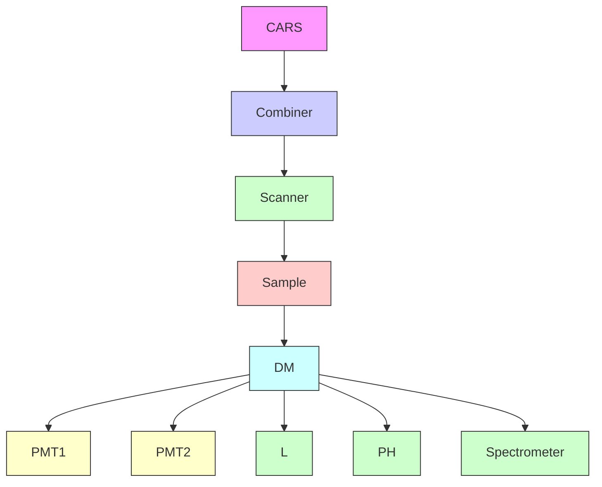

# High-Speed Vibrational Imaging and Spectral Analysis of Lipid Bodies by Compound Raman Microscopy

Mikhail N. Slipchenko,† Thuc T. Le,† Hongtao Chen,‡ and Ji-Xin Cheng\*,†,‡

Weldon School of Biomedical Engineering and Department of Chemistry, Purdue Uni ersity, West Lafayette, Indiana 47907

Recei ed: March 12, 2009

Cells store excess energy in the form of cytoplasmic lipid droplets. At present, it is unclear how different types of fatty acids contribute to the formation of lipid droplets. We describe a compound Raman microscope capable of both high-speed chemical imaging and quantitative spectral analysis on the same platform. We used a picosecond laser source to perform coherent Raman scattering imaging of a biological sample and confocal Raman spectral analysis at points of interest. The potential of the compound Raman microscope was evaluated on lipid bodies of cultured cells and live animals. Our data indicate that the in vivo fat contains much more unsaturated fatty acids (FAs) than the fat formed via de novo synthesis in 3T3-L1 cells. Furthermore, in vivo analysis of subcutaneous adipocytes and glands revealed a dramatic difference not only in the unsaturation level but also in the thermodynamic state of FAs inside their lipid bodies. Additionally, the compound Raman microscope allows tracking of the cellular uptake of a specific fatty acid and its abundance in nascent cytoplasmic lipid droplets. The high-speed vibrational imaging and spectral analysis capability renders compound Raman microscopy an indispensible analytical tool for the study of lipid-droplet biology.

## Introduction

Obesity is an established risk factor for type II diabetes, hypertension, strokes, many types of cancer, atherosclerosis, and other diseases.1,2 A central goal of obesity studies is to understand how cells store excess energy in the form of cytoplasmic lipid droplets (LDs).3 As lipid synthesis and storage pathways are conserved among many organisms, cell model systems derived from simple organisms have been employed to bring insight into the cause of obesity in humans.4 Use of a murine fibroblast-derived 3T3-L1 cell line developed by Green and Kehinde has allowed the transcriptional regulation of fat cell differentiation to be elucidated.4,5 In recent years, a number of lipid-binding proteins have been identified, and their functions in LD formation and mobilization have been characterized.6 Furthermore, a genome-wide RNA interference screen in Drosophila S2 cells revealed a role of phospholipid synthesis in regulating LD size, number, and morphology.7 Nonetheless, significant details on the biology of LDs are still lacking.6,8 Currently, it is not clearly understood how different types of phospholipids or fatty acids contribute to the formation of LDs. Consequently, nutritional intervention in obesity is largely based on restriction of calorie uptake. Effective obesity intervention based on dietary composition is not yet possible because of a lack of understanding of the roles of nutritional ingredients in LD formation.

Until recently, studies of lipid-droplet biology have relied on nonspecific, invasive, or population measurements. Traditionally, intracellular LDs have been visualized based on the fluorescence of lipophilic dyes such as Oil red O (ORO) or Nile red.5,9 The use of ORO, in particular, requires cell fixation, which prevents dynamic studies of LD mobilization and has also been shown to fuse LDs.10 More importantly, because most lipid or fatty acid (FA) molecules have no known specific markers, the fluorescence signals from ORO or Nile red contain no information regarding lipid composition or organization. To analyze the composition of LDs, standard techniques including gas chromatography, liquid chromatography, and mass spectrometry have been employed. Although such analytical techniques are powerful, they provide only population-average information.

Recent advances in vibrational imaging are opening up exciting opportunities for dynamic, noninvasive, and compositional analysis of single LDs. Confocal Raman microscopy allowed visualization of arachidonic acids in LDs inside leukocytes.11 However, long acquisition times on the order of seconds per pixel restrict the use of Raman microscopy to relatively static samples. To increase the vibrational signal level without additional labeling, coherent anti-Stokes Raman scattering (CARS) microscopy has been developed12 and employed to visualize lipid-rich structures at the speed of a few microseconds per pixel or 1 s per frame on a laser-scanning microscope platform.13-15 The large CARS signal is produced by quadratic dependence on the concentration of molecular vibration in the focal volume and by spectral focusing of all of the laser energy into a single Raman band such as the CH2 symmetric stretch mode with picosecond pulse excitation. Such single-frequency CARS microscopy has been employed to monitor LD formation and mobilization in live cells and C. elegans. 10,16-18 A drawback of single-frequency CARS microscopy is its lack of spectral information. Multiplex CARS (M-CARS) microscopy using broadband pulses has been devised to overcome this shortcoming19,20 and has recently been applied to study the level of fatty acid saturation and the thermodynamic state of LDs in fixed 3T3-L1 cells.21 Compared to Raman microscopy, the vibrational signal in M-CARS is enhanced via mixing with the nonresonant background and can be extracted by the maximum entropy method.21 However, compared to single-frequency CARS, the M-CARS signal is significantly weaker because the excitation energy is spread over a broad spectral window. Consequently, M-CARS has reduced sensitivity and requires minutes to obtain an image of $1 0 0 ~ \times ~ 1 0 0$ pixels.21 This acquisition speed precludes its application to the analysis of highly dynamic features such as live cells.

flowchart

text_image

a)
b)
5 µm
x6
c)

line chart

| Raman shift, cm⁻¹ | 2 µm, 4 sec | 2 µm, 0.01 sec | 110 nm, 4 sec |
| ----------------- | ----------- | -------------- | ------------- |
| 1000              | ~1000       | ~500           | ~200          |
| 1500              | ~500        | ~300           | ~150          |
| 3000              | ~200        | ~150           | ~100          |

line chart

| Distance from surface, µm | Intensity at 1005 cm⁻¹ |
| ------------------------- | ---------------------- |
| -10                       | 0                      |
| -5                        | 2                      |
| 0                         | 8                      |
| 5                         | 10                     |
| 10                        | 4                      |
| 15                        | 2                      |
| 20                        | 0                      |

Figure 1. Layout and performance of the compound Raman microscope. (a) Optical layout and diagrams for CARS and spontaneous Raman scattering. $\omega _ { \mathrm { p } }$ and ω are pump and Stokes laser beams, respectively; DM is an exchangeable dichroic mirror; L is an achromatic lens of 100-mm focal length; PH is a $1 0 0 \mathrm { - } \mu \mathrm { m }$ pinhole; and PMT1 and PMT2 are photomultiplier tubes for forward and backward (epi) detection, respectively. In the CARS and Raman diagrams, the solid horizontal lines represent ground and vibrationally excited states. The dashed horizontal lines represent virtual levels. The red and dark red arrows correspond to the pump and Stokes laser beams, respectively. The wavy arrows represent emitted signals. (b) Epi-detected CARS image of a mixture of polystyrene (PS) beads of 2.2-µm and 110-nm diameter taken with a $6 0 \times$ W/IR objective (Olympus) and average pump and Stokes powers of 10 and 15 mW, respectively, at the sample position. The total integration time per pixel was 150 µs. Crosses indicate positions where the confocal Raman point scan was performed. (c) Intensity profiles along the lines indicated by arrows in panel b. (d) Raman spectrum obtained from the two PS beads in panel b under different acquisition modes and 3 mW of pump laser at the sample position. For clarity, the middle and bottom spectra are offset and multiplied by factors of 5 and 10, respectively. The PS beads were dried on a fused silica coverslip to reduce the fluorescence background. (e) Intensity profile showing the depth resolution of confocal Raman measurements.

During the development of CARS microscopy, we came to realize that coherent Raman and spontaneous Raman techniques are inherently complementary to each other: Coherent Raman scattering permits high-speed vibrational imaging by using picosecond pulses to focus the excitation energy on a single Raman band;22 spontaneous Raman scattering is inherently multiplex and background-free, and it allows fast spectral analysis at a specified location. We demonstrate herein a compound Raman microscope that implements high-speed coherent Raman imaging of a biological sample and confocal Raman spectral analysis at points of interest using a picosecond laser source. With the capability of vibrational imaging and spectral analysis within a few seconds, the compound Raman microscope was applied to analyze the LDs in cultured Chinese ovary hamster (CHO) and 3T3-L1 cells, as well as subcutaneous adipocytes and sebaceous glands in a living BALB/c mouse.

## Experimental Methods

Compound Raman Microscopy. In our apparatus, two synchronized 5-ps, 80 MHz laser oscilators (Tsunami, Spectra-Physics Lasers Inc., Mountain View, CA) are temporally synchronized and collinearly combined into a laser-scanning inverted microscope (FV300 IX71, Olympus Inc., Central +Valley, PA) (Figure 1a). The laser is focused into the sample using 40 (numerical aperture, $\mathrm { N A } = 0 . 8 0$ , LUMPlanFI/IR, )Olympus) or 60 (NA  1.2, UPlanApo/IR, Olympus) water-)immersion objectives. The CARS signals are detected by photomultiplier tube detectors (H7422-40, Hamamatsu, Japan) in either the forward (F-CARS) or backward (E-CARS) direction. The F-CARS signal is collected by an air condenser (NA $= 0 . 5 5 )$ , whereas the epi-detected E-CARS signal is collected )by the same water-immersion objectives. Confocal Raman microspectroscopy is realized by mounting a spectrometer (Shamrock SR-303i-A, Andor Technology, Belfast, U.K.) to the side port of the microscope. The spectrometer is externally triggered by a point-scan signal from the scanner. To achieve 3D spatial resolution, the spectrometer slit assembly is replaced with a pinhole of $1 0 0 \mathrm { - } \mu \mathrm { m }$ diameter. For CARS imaging and Raman spectra measurements of $\mathrm { L D s } .$ , the pump and Stokes lasers are tuned to 707 nm $( 1 4 1 4 0 ~ \mathrm { c m } ^ { - 1 } )$ and 885 nm (11300 $\mathrm { c m } ^ { - 1 } )$ , respectively, to be in resonance with the $\mathrm { C H } _ { 2 }$ symmetric stretch vibration. After acquisition of a CARS image using the signal from the $\mathrm { C H } _ { 2 }$ vibration, the Stokes beam is blocked, and the long-pass dichroic mirror (670dcxr, Chroma Technology Corp, Rockingham, VT) in the turret for E-CARS imaging is switched to a short-pass dichroic mirror (720dcsp, Chroma), which directs the Raman signal toward the spectrometer. The utilization of the same picosecond laser for both CARS imaging and confocal Raman spectrometry eliminates the need for any spatial calibration.

The Raman signal is filtered from the scattered light using a band-pass filter and focused into the pinhole using an achromatic lens of 100-mm focal length. The spectrometer is equipped with a 300 grooves/mm 500-nm blaze angle grating and a thermoelectrically (TE) cooled back-illuminated electron-multiplying charge-coupled device (EMCCD; Newton DU970N-BV, Andor). Our current settings permits spectral analysis in a wide range from 830 to 3100 cm-1 , which covers both the fingerprint and the CH stretch vibration regions. The EMCCD is cooled $\mathrm { t o } - 7 0$ $^ \circ \mathrm { C }$ -to minimize dark current noise. Additionally, the EMCCD is used in a crop mode to collect signal from only 20 rows to further decrease the noise because the light from the entrance pinhole illuminates only a small portion of rows on the EMCCD. The cropping mode also decreases the EMCCD signal processing time and maximizes the repetition rate. For sample preparation, fused silica coverslips are used instead of standard borosilicate glass coverslips to minimize the substrate fluorescence background. The interferometric intensity modulation caused by the back-illuminated EMCCD and the fluorescence background are removed by data processing (see Figure S1 in the Supporting Information).

Because of space limitations in the scanning unit, we have placed the spectrometer in a nondescanned port of the microscope. To maximize the efficiency of confocal detection, we use a micropositioning translational stage to position the point of interest to the center of the field of view for Raman spectral analysis.

For SRS imaging, a Pockel Cell (360-80, Con-optics, Danbury, CT) is inserted in the pump beam for intensity modulation at 1.0 MHz. A 60 dipping water objective (1.1 NA, LUMFI, Olympus) is used instead of an air condenser $( \mathrm { N A } = 0 . 5 5 )$ to )collect the forward pump and Stokes beams in order to minimize the thermal lensing effect. The Stokes beam is selected by bandpass filters and detected by a large-area photodiode (DET100A, Thorlabs, Newton, NJ). A lock-in amplifier (SR844, Standord Research Systems, Sunnyvale, CA) is used for phasesensitive detection of the Raman gain signal at a time constant of 100 µs.

De Novo Lipid Synthesis in 3T3-L1 Cells. De novo lipid synthesis was induced using an adipogenesis assay kit (catalog no. ECM 950, Chemicon International). 3T3-L1 cells were grown to confluence in Dulbecco’s Modified Eagle’s Medium (DMEM) consisting of 25 mM of glucose supplemented with 10% calf serum and penicillin/streptomycin. On day 0, the cells were induced with the initiation medium composed of 0.5 mM isobutylmethylxanthine (IBMX) and 1 µM dexamethasone in DMEM supplemented with 10% fetal calf serum and penicillin (100 units/mL)/streptomycin (100 µg/mL). On day 2, the initiation medium was replaced with the progression medium composed of 10 µg/mL insulin in DMEM supplemented with 10% fetal calf serum and penicillin/streptomycin. On day 4, the progression medium was replaced with the maintenance medium (DMEM supplemented with 10% fetal calf serum and penicillin/streptomycin). From day 4 to day 14, the cells were kept in maintenance medium with new maintenance medium being replaced every two days. Cells were incubated at $3 7 ~ ^ { \circ } \mathrm { C }$ with 5% $\mathrm { C O } _ { 2 } .$

## Results and Discussion

Characterization of Spatial Resolution and Spectral Sensitivity. We first evaluated the performance of our setup using polystyrene (PS) beads of known diameters. Single PS beads of 2.2-µm and 110-nm diameters spread on a coverslip were first visualized by epi-detected CARS (Figure 1b). The CARS intensity profiles across the beads are displayed in Figure 1c. The lateral full-width-at-half-maximum (fwhm) resolution is 230 nm for the 110-nm PS bead, which is smaller than the 300-nm (fwhm) Airy disk calculated using the wavelength of the pump beam and assuming $\mathrm { N A } = 1 . 2$ for the objective. The )confocal Raman spectra of the PS beads were obtained using two acquisition modes of the EMCCD. First, we acquired the Raman spectra of the PS beads in 4 s with the CCD in conventional mode and a 50 kHz readout speed. For the ring breathing band at $1 0 0 5 ~ \mathrm { c m } ^ { - 1 }$ , the signal-to-noise ratio for the 2.2-µm and 110-nm PS beads was 100 and 6, respectively (Figure 1d). Second, we measured the spectrum of the $2 \AA - \mu \mathrm { m }$ PS bead with the EMCCD in the electromultiplying regime at a 2.5 MHz readout speed and 10 ms acquisition time. The resulting spectrum exhibited a signal-to-noise ratio of 3 (Figure 1d). Furthermore, we evaluated the depth resolution of the confocal Raman spectrometer by obtaining spectra of a 2.2-µm PS bead at different depths. The intensities of the $1 0 0 5 ~ \mathrm { { c m } ^ { - 1 } }$ peak were fitted with a Lorentzian function, which yielded an axial fwhm of 6.4 µm. The depth resolution was further confirmed by the nearly linear dependence of the Raman spectral intensity on the diameter for LDs smaller than $1 0 \ : \mu \mathrm { m }$ (Figure S2, Supporting Information). The above data demonstrate the ability of compound Raman microscopy to provide highsensitivity CARS imaging and confocal Raman spectral analysis of a point of interest on the time scale of milliseconds to seconds.

Compound Raman Analysis of Single LDs within Live Cells. To build the foundation for quantitative analysis of LDs, we first employed our setup to obtain Raman spectra of pure esterified fatty acids. We tested three fatty acid (FA) species: saturated palmitic acid (C16:0), monounsaturated oleic acid (C18:1), and polyunsaturated linoleic acid (C18:2). The palmitic acid was tested in the gel state at room temperature of $2 3 ~ ^ { \circ } \mathrm { C }$ and in the liquid state at $5 0 ~ ^ { \circ } \mathrm { C } .$ Full spectral assignment of fatty acids is summarized in Table S1 (Supporting Information). Because the peak intensity of the CH deformation band at 1445 $\mathrm { c m } ^ { - 1 }$ has nearly no dependence on the number of unsaturated $\mathrm { C } { = } \mathrm { C }$ bonds, it is used as an internal reference for quantitative analysis. When the data are normalized by the intensity of the 1445 $\mathrm { c m } ^ { - 1 }$ peak $( I _ { 1 4 4 5 } )$ , several distinctive spectral features among the different fatty acids can be discerned (Figure 2a). The most prominent difference is observed for the $1 6 5 4 ~ \mathrm { { c m } ^ { - 1 } }$ peak, which corresponds to the $\mathrm { C } { = } \mathrm { C }$ stretching vibration. The $1 6 5 4 ~ \mathrm { { c m } ^ { - 1 } }$ band is absent in the saturated palmitic acid $( I _ { 1 6 5 4 } /$ $I _ { 1 4 4 5 } = 0 )$ , present at low intensity for the monounsaturated oleic )acid $( I _ { 1 6 5 4 } / I _ { 1 4 4 5 } = 0 . 5 8 )$ , and present at high intensity for the )polyunsaturated linoleic acid $( I _ { 1 6 5 4 } / I _ { 1 4 4 5 } ~ = ~ 1 . 2 7 )$ . Another )distinctive feature is the 2935 cm 1 peak, which corresponds to the CH symmetric stretch and is enhanced by Fermi resonance in ordered packing.23 Correspondingly, using the CH2 stretching band at $2 \bar { 8 } 5 0 ~ \mathrm { c m } ^ { - 1 }$ as a reference, the $2 9 3 5 ~ \mathrm { c m } ^ { - 1 }$ peak is significantly higher in the gel state than in the liquid state for the saturated palmitic acid (Figure 2a).

With the above data, we applied compound Raman microscopy to monitor the uptake and storage of oleic acid by CHO cells incubated with 500 µM oleic acid for 6 h. Using CARS imaging at a speed of 10 $\mu \mathrm { s } / \mathrm { p i x e l } .$ , we visualized numerous cytoplasmic LDs with varying diameters up to 1.5 µm (Figure 2c) compared to the few smaller-in-diameter LDs in untreated CHO cells (Figure 2b). Three LDs (Figure 2c) within a CHO cell were analyzed, and their Raman spectra are displayed in Figure 2d. For the $1 4 4 5 ~ \mathrm { c m } ^ { - 1 }$ peak, the Raman spectra of lipid droplets acquired in 4 s have a signal-to-noise ratio of 30. The Raman spectra of cytoplasmic LDs are identical to each other (Figure 2d) and resemble the spectrum of pure oleic FA in solution (Figure 2e). However, a few distinctive spectral features between the LDs and oleic FA are observed. First, the LD spectra exhibit a higher intensity of the dCH deformation band at $1 2 6 5 ~ \mathrm { c m } ^ { - 1 }$ and of the $\mathrm { C } { = } \mathrm { C }$ stretching band at $1 6 5 4 ~ \mathrm { { c m } ^ { - 1 } . }$ , indicating a higher level of unsaturation per chain as compared to the oleic FA. This result agrees with the fact that exogenous fatty acids can be desaturated and elongated in cells before being stored in cytoplasmic LDs. Second, only the LD spectra exhibit a peak at $1 7 4 2 ~ \mathrm { c m } ^ { - 1 }$ , which is assigned to the ${ \mathrm { C } } { = } 0$ carbonyl stretching vibration and is present in the ester form of FAs (Figure 2a). This spectral feature strongly suggests the conversion of free FAs into the esterified form, possibly into triglyceride, which is the dominant component of LDs. Together, these data demonstrate the capability of compound Raman microscopy for fast CARS imaging and full Raman spectral analysis of single LDs within the time scale of a few seconds.

line chart

| Raman shift, cm⁻¹ | LE     | OE     | PE (liq) | PE (gel) |
| ----------------- | ------ | ------ | -------- | -------- |
| 1000              | ~0.2   | ~0.1   | ~0.1     | ~0.05    |
| 1500              | ~0.8   | ~0.6   | ~0.4     | ~0.2     |
| 2000              | ~0.9   | ~0.7   | ~0.5     | ~0.3     |
| 2500              | ~0.7   | ~0.5   | ~0.3     | ~0.1     |
| 3000              | ~0.3   | ~0.2   | ~0.1     | ~0.05    |

natural_image

Microscopic image showing scattered bright spots on a dark background, scale bar indicates 10 μm, with text label '500 μM Oleic FA' and '0 hours' at bottom (no other symbols or data points)

text_image

c)
1
2
3
500 µM Oleic FA
6 hours

line chart

| Raman shift, cm⁻¹ | LD1 (x1.4) | LD2 (x1.2) | LD3 |
| ----------------- | ---------- | ---------- | --- |
| 1000              | ~0         | ~0         | ~0  |
| 1500              | ~1.5       | ~0         | ~0  |
| 2000              | ~1.8       | ~0         | ~0  |
| 2500              | ~1.2       | ~0         | ~0  |
| 3000              | ~0         | ~0         | ~0  |

line chart

| Raman shift, cm⁻¹ | LD1 | Oleic FA |
| ----------------- | --- | -------- |
| 1000              | ~0  | ~0       |
| 1500              | ~0  | ~0       |
| 2000              | ~0  | ~0       |
| 3000              | ~0  | ~0       |

Figure 2. Raman spectra of fatty acids and compound Raman analysis of LDs in CHO cells. (a) Raman spectra (from top to bottom) of linoleic methyl ester (LE), oleic methyl ester (OE), and palmitic methyl ester (PE) in the liquid state at $5 0 ~ ^ { \circ } \mathrm { C }$ and of palmitic methyl ester (PE) in the gel state at room temperature. $( \mathrm { b , \dot { c } ) F { - } C A R S }$ images of CHO cells incubated for (b) 0 and (c) 6 h in a medium containing 500 µM oleic FA. Each image is a stack of four $5 1 2 \times 5 1 2$ pixels images with 1.0-µm depth separation acquired at the speed of 10 µs/pixel. The CARS images were obtained using a 60 IR objective (Olympus) and average pump and Stokes powers of 10 and 15 mW, respectively, at the sample. The crosses numbered $_ { 1 - 3 }$ indicate the positions where Raman point scans were performed. (d) Raman spectra obtained from three LDs marked in panel c, together with -differences shown in green. The difference spectra are offset for clarity. (e) Confocal Raman spectrum of LD1 from panel $\mathrm { c } ,$ together with the spectrum of pure oleic FA. Both spectra are normalized on the $\mathrm { C H } _ { 2 }$ deformation band around 1445 $\mathrm { c m } ^ { - 1 }$ . The acquisition time for each Raman spectrum in panels d and e was 4 s.

Analysis of Endogenous and Exogenous FAs within Single LDs. Using LDs accumulated in 3T3-L1 cells (Figure S3, Supporting Information), we evaluated the capability of compound Raman microscopy to resolve the contributions of endogenous and exogenous FAs within single LDs. First, we analyzed the LDs formed through de novo lipid synthesis (Figure 3a,b). The Raman spectrum showed peaks similar in frequency to those of FAs (Figure 2a). Then, we supplemented predifferentiated 3T3-L1 cells with $5 0 \mu \mathrm { M }$ deuterated palmitic acid for 4 days (Figure 3c) and repeated Raman analysis.We observed in all LDs a distinctive peak around $2 1 0 0 \mathrm { c m } ^ { - 1 }$ that corresponds to the CsD stretching vibration (Figure 3d). The integral intensities of the $\mathrm { C - D } \left( I _ { \mathrm { C - D } } \right)$ and $\mathrm { C - H } \left( I _ { \mathrm { C - H } } \right)$ stretching bands were measured to indicate the fractions of exogenous and endogenous FAs in the LD. To account for the different Raman cross sections and instrument sensitivities for CD and CH vibrations, we recorded the Raman spectrum of a 1:9 (molar) mixture of $d _ { 3 1 }$ -palmitic FA and oleic FA at $5 0 ~ ^ { \circ } \mathrm { C }$ and obtained a $I _ { \mathrm { C - D } } / I _ { \mathrm { C - H } }$ ratio of 0.185. From the calibrated value of $I _ { \mathrm { C - D } } /$ $( I _ { \mathrm { C - D } } + I _ { \mathrm { C - H } } )$ , we found that exogenous FAs constitute 19% of +total lipids in the probed volume. For comparison, we supplied undifferentiated 3T3-L1 with $5 0 ~ \mu \mathrm { M }$ deuterated palmitic acid for 4 days (Figure 3e). Because de novo lipid synthesis was not stimulated, we anticipated that the source of FAs in the LDs in 3T3-L1 cells would be dominated by exogenous palmitic acid. Correspondingly, we observed an $I _ { \mathrm { C - D } } / ( I _ { \mathrm { C - D } } + I _ { \mathrm { C - H } } )$ value of +0.70, which suggests a 70% composition of exogenous fatty acids (Figure 3f). These results demonstrate that compound

natural_image

Microscopic image showing circular particles with a 20 μm scale bar, no text or symbols present.

line chart

| x    | y     |
| ---- | ----- |
| 1000 | ~0.5  |
| 1500 | ~1.8  |
| 2000 | ~0.3  |
| 2500 | ~0.4  |
| 3000 | ~1.9  |

natural_image

Microscopic image showing spherical particles with a red crosshair overlay and 40 μm scale bar (no text or symbols beyond scale)

line chart

| x    | y     |
| ---- | ----- |
| 1000 | *     |
| 1500 |       |
| 2000 | *     |
| 2500 |       |
| 3000 |       |

natural_image

Microscopic image showing a central cross-shaped particle with a 20 μm scale bar, against a dark background with scattered particles (no text or symbols beyond scale indicator)

line chart

| Raman shift, cm⁻¹ | Intensity |
| ----------------- | --------- |
| ~1000             | *         |
| ~2000             | *         |

Figure 3. Compound Raman analysis of exogenous and endogenous FAs in LDs of live 3T3-L1 cells. (a) F-CARS image of $3 \mathrm { T } 3  – \mathrm { L } \bar { 1 }$ cells incubated for 2 weeks in a medium containing FAs secreted by VF. (c) F-CARS image of 3T3-L1 cells incubated for 2 weeks in a medium containing FAs secreted by VF and then for 4 days with added 50 $\mu \mathbf { M }$ d31-palmitic FA. (e) F-CARS image of undifferentiated 3T3-L1 cells incubated for 4 days in a medium containing 50 µM $d _ { 3 1 }$ -palmitic FA. (b,d,f) Corresponding Raman spectra of LDs indicated by crosses in panels a, c, and e, colored black, red, and blue, respectively. The asterisks show the positions of peaks of $d _ { 3 1 }$ -palmitic acid.

Raman microscopy can distinguish the origin of FA species within single LDs. Our data shown in Figure 3 suggest that LDs accumulated in differentiating 3T3-L1 cells in the presence of exogenous FAs are due to free FA uptake as well as de novo lipid synthesis where the carbon source is derived from acetyl-

natural_image

Fluorescence microscopy image showing red and blue cellular structures with a 50 μm scale bar (no text or symbols beyond labels)

line chart

| Raman shift, cm⁻¹ | LD in fat cell | LD in Gland | difference |
| ----------------- | -------------- | ----------- | ---------- |
| 1000              | ~0.5           | ~0.4        | ~0.1       |
| 1500              | ~1.2           | ~1.0        | ~0.3       |
| 2000              | ~1.8           | ~1.6        | ~0.2       |
| 2500              | ~1.5           | ~1.3        | ~0.1       |
| 3000              | ~1.0           | ~0.8        | ~0.1       |

natural_image

Microscopic image showing red fluorescent cellular structures against a dark blue background, with a white crosshair marker and label 'b)' in the corner (no readable text or symbols beyond labels)

line chart

| Raman shift, cm⁻¹ | LD in Gland |
| ----------------- | ----------- |
| 2800              | Low         |
| 2900              | High        |
| 3000              | Low         |

line chart

| Raman shift, cm⁻¹ | LD in fat cell |
| ----------------- | -------------- |
| 2800              | Low            |
| 2900              | High           |
| 3000              | Low            |

d)

Figure 4. Compound Raman analysis of lipid-rich structures in vivo. (a,b) Overlapped CARS (red) and SHG (light blue) images of mouse skin at two different depths. (c) Raman spectra taken at points indicated in panels a and b corresponding to the gland and adipocyte, respectively. (d) Raman spectra of the CsH stretching regions of the LDs in the gland and adipocyte, together with least-squares fitting by six Lorentzian lines.  

natural_image

Microscopic image of a cellular or particulate structure with scale bar (20 μm) and marked regions (red cross, blue plus), no readable text or symbols present.

line chart

| Raman shift, cm⁻¹ | LD   | Cytoplasm | Nucleus |
| ----------------- | ---- | --------- | ------- |
| 1000              | ~0   | ~0        | ~0      |
| 1500              | ~250 | ~100      | ~50     |
| 2000              | ~300 | ~150      | ~100    |
| 2500              | ~100 | ~50       | ~25     |
| 3000              | ~0   | ~0        | ~0      |

natural_image

Microscopic image showing a vertical dashed line at 2600 cm⁻¹ with a scale bar on the right (no text or symbols in the main visual field)

natural_image

Microscopic image showing spherical particles with a vertical dashed line and a corresponding spectral graph (no text or symbols)

natural_image

Microscopic image showing circular structures with a vertical dashed line and scale bar (no text or symbols)

natural_image

Microscopic image of a cellular or particulate structure with a vertical dashed line and scale bar (no text or symbols)

Figure 5. Confocal Raman analysis and SRS imaging of LDs in a differentiated 3T3-L1 cell. (a) Transmission image of a 3T3-L1 cell. (b) Raman spectra of LD, cytoplasm, and nucleus indicated by crosses in panel a. The spectra of cytoplasm and nucleus are multiplied by 5 and offset for clarity. (c f) SRS images of 3T3-L1 cell at (c) 2600, (d) 1654, (e) 2850, and $( \dot { \mathrm { f } } ) 2 9 3 5 \mathrm { c m } ^ { - 1 }$ . The intensity profiles along the dashed lines are shown -for each SRS image. Cells were predifferentiated for 5 days. The acquisition time for each Raman spectrum in panel b was 20 s, and the acquisition time for each SRS image was 53 s.

CoA, a glycolysis byproduct of glucose. For 3T3-L1 cells, the $I _ { 1 6 5 4 } / I _ { 1 4 4 5 }$ ratio for FAs produced through de novo synthesis is $0 . 3 2 \pm 0 . 0 4$ [mean standard deviation (sd), $n = 2 0 ]$ (Figure ( ( )S4, Supporting Information). Compared to the ratio of 0.58 for monounsaturated oleic acid, our data show that the LDs in 3T3- L1 cells contain a significant portion of saturated FAs. It should be noted that we have assumed homogeneity of LDs in the above analysis. Muller and co-workers21 showed phase separation within single LDs composed of highly saturated FAs. However, such separation occurred only when the fraction of saturated FAs reached 75%. In the present study, such a high fraction of saturated FAs was not reached even in the case of LDs in 3T3- L1 cells dominated by exogenous palmitic acid (see Figure 3b). We anticipate that such a high fraction of saturated FAs is rarely reached in de novo synthesis.

In Vivo Analysis of Lipid-Rich Structures. A clear advantage of CARS imaging over Nile red staining lies in labelfree imaging of lipid-rich structures in a complex tissue environment where labeling is not readily accessible.24 Based on this advantage of coherent Raman imaging, we further evaluated the capability of our compound Raman microscope for chemical imaging and spectral analysis of lipid-rich structures in vivo. We first identified subcutaneous adipocytes and sebaceous glands in the ear of a living BALB/c mouse by E-CARS imaging (Figure 4a,b). Subsequent spectral analyses of the adipocytes and glands revealed $I _ { 1 6 5 4 } / I _ { 1 4 4 5 }$ ratios of 0.82 $\pm \ : 0 . 0 4 $ (mean sd, n 3) and $0 . 2 9 \pm 0 . 0 3$ (mean sd, $n =$ ( ( ) ( ( )3) for the subcutaneous adipocytes and sebaceous glands, respectively (Figure 4c,d). Because the 1654 and $1 4 4 \bar { 5 } \ \mathrm { c m } ^ { - 1 }$ peaks correspond to CdC stretching and CsH deformation vibrations, respectively, our results indicate a much higher level of saturated lipids in the glands. This result is consistent with the high wax ester concentration of a sebaceous gland, which can reach up to 26% of the sebum weight.25,26 The high concentration of saturated lipid species in sebaceous glands is also reflected in the fitted peak ratio of $I _ { 2 8 5 0 } / I _ { 2 9 3 5 } .$ which is 2.1 times that in the subcutaneous adipocytes (Figure 4d). Here, I2850 and $I _ { 2 9 3 5 }$ represent the peak intensities of CH2 and CH3 symmetric stretching bands, respectively. This result suggests that lipid packing in the sebaceous gland is much more ordered than that in the subcutaneous adipocytes (cf. Figure 2). Notably, the $I _ { 1 6 5 4 } / I _ { 1 4 4 5 }$ ratio of 0.82 for subcutaneous adipocytes is significantly higher than the ratio of 0.32 for in vitro 3T3-L1 cells, indicating that the in vivo fat contains much more unsaturated FAs than the fat formed via de novo synthesis in 3T3-L1 cells. To summarize, these measurements demonstrate the significance of quantitative Raman spectral analysis for in vivo CARS imaging studies.

Coupling Spontaneous Raman with Stimulated Raman Scattering. Finally, we demonstrate the integration of confocal Raman analysis and stimulated Raman scattering (SRS) imaging.27 High-speed SRS imaging of live cells with picosecond pulses was demonstrated recently.28 However, it is cumbersome to record an SRS spectrum by tuning a picosecond laser. Herein, we overcame this difficulty by performing confocal Raman analysis and subsequent SRS imaging using the same picosecond laser source (see Experimental Methods). By transmission illumination and confocal Raman analysis, we first recorded the whole vibrational spectra of individual LD, cytoplasm, and nucleus in a 3T3-L1 cell (Figure 5a,b). Our data showed that the intensity ratio of the CH symmetric stretch at $2 8 5 0 ~ \mathrm { c m } ^ { - 1 }$ to the $\mathrm { C H } _ { 3 }$ symmetric stretch at $2 9 3 5 ~ \mathrm { c m } ^ { - 1 }$ in the LD is higher than that in the cytoplasm and nucleus. A possible explanation for this finding is that the lipids stored in the LDs have a higher density of $\mathrm { C H } _ { 2 }$ groups than proteins, which are abundant in the cytoplasm and nucleus. Another interesting spectral feature is the amide I band of proteins at around $1 6 5 0 \mathrm { { c m } ^ { - 1 } }$ . However, it coincides with the stronger $\mathrm { C } { = } \mathrm { C }$ vibration of FAs at 1654 cm 1 . To confirm the spectral analysis, we performed stimulated Raman gain imaging of the same cell. At $\overline { { 1 6 5 4 } } \mathrm { c m } ^ { - 1 }$ , we mainly observed signal from LDs and very low contrast from cytoplasm because of the low intensity of the amide I band (Figure 5d). At the $\mathrm { C H } _ { 2 }$ stretching vibration frequency of $2 8 5 0 ~ \mathrm { { c m } ^ { - 1 } }$ , we observed a bright contrast from the large LDs, low contrast from the cytoplasm, and no signal from the nucleus (Figure 5e). At the $\mathrm { C H } _ { 3 }$ stretching vibration frequency of $2 9 3 5 ~ \mathrm { { c m } ^ { - 1 } }$ , we observed a higher contrast from the cytoplasm and nucleus (Figure 5f). The contrast nearly disappeared at $2 6 0 0 \mathrm { c m } ^ { - 1 }$ , away from any Raman resonance (Figure 5c). The recorded spectrum in the CH stretching region further confirmed that the Raman gain signal was background-free (Figure S5, Supporting Information).

## Conclusions

We have developed a compound Raman microscope that is capable of high-speed vibrational imaging with coherent Raman signals and quantitative spectral analysis with spontaneous Raman signals. We evaluated the performance of our compound Raman microscope on lipid bodies of cultured cells and live animals. Important information including lipid body abundance and size, degree of carbon chain unsaturation, and lipid-packing density could be obtained within a few seconds. In particular, our compound Raman microscope allowed quantitative analysis of the abundance of an exogenous FA species within single lipid droplets. Such information is critical to the analysis of lipid distributions29 under in vivo conditions, thus permitting realtime evaluation of the effectiveness of an obesity treatment. We expect that the high-speed data acquisition capability of compound Raman microscopy will open up exciting possibilities for in vivo studies of lipid metabolism where the impact of microenvironments, including vasculatures, extracellular matrix, and stromal cells, can be evaluated. Although we focused on lipid bodies in this work, our method also allows high-speed spectral analysis and chemical imaging of samples in pharmaceutical, environmental, and other research fields.

Acknowledgment. This work was partially supported by a National Institutes of Health grant (R01 EB007243) to J.X.C. T.T.L. is supported by a National Institutes of Health postdoctoral fellowship (F32HL089074).

Supporting Information Available: Details of experimental methods, parameters, five figures, and table with Raman peaks assignments are available free of charge via the Internet at http:// pubs.acs.org.

## References and Notes

(1) Kopelman, P. G. Nature 2000, 404, 635.  
(2) Calle, E. E.; Kaaks, R. Nat. Re . Cancer 2004, 4, 579.  
V(3) Rosen, E. D.; Spiegelman, B. M. Nature 2006, 444, 847.  
(4) Rosen, E. D.; MacDougald, O. A. Nat. Re . Mol. Cell Biol. 2006, 7, 885.  
(5) Green, H.; Kehinde, O. Cell 1974, 1, 113.  
(6) Martin, S.; Parton, R. G. Nat. Re . Mol. Cell Biol. 2006, 7, 373.  
V(7) Guo, Y.; Walther, T. C.; Rao, M.; Stuurman, N.; Goshima, G.; Terayama, K.; Wong, J. S.; Vale, R. D.; Walter, P.; Farese, R. V. Nature 2008, 453, 657.  
(8) Fujimoto, T.; Ohsaki, Y.; Cheng, J.; Suzuki, M.; Shinohara, Y. Histochem. Cell Biol. 2008, 130, 263.  
(9) Greenspan, P.; Mayer, E. P.; Fowler, S. D. J. Cell Biol. 1985, 100, 965.  
(10) Nan, X. L.; Cheng, J. X.; Xie, X. S. J. Lipid Res. 2003, 44, 2202.  
(11) van Manen, H. J.; Kraan, Y. M.; Roos, D.; Otto, C. Proc. Natl. Acad. Sci. U.S.A. 2005, 102, 10159.  
(12) Cheng, J. X.; Xie, X. S. J. Phys. Chem. B 2004, 108, 827.  
(13) Evans, C. L.; Potma, E. O.; Puoris’haag, M.; Cote, D.; Lin, C. P.; Xie, X. S. Proc. Natl. Acad. Sci. U.S.A. 2005, 102, 16807.  
(14) Wang, H. F.; Fu, Y.; Zickmund, P.; Shi, R. Y.; Cheng, J. X. Biophys. J. 2005, 89, 581.  
(15) Li, L.; Wang, H. F.; Cheng, J. X. Biophys. J. 2005, 89, 3480.  
(16) Nan, X. L.; Potma, E. O.; Xie, X. S. Biophys. J. 2006, 91, 728.  
(17) Yamaguchi, T.; Omatsu, N.; Morimoto, E.; Nakashima, H.; Ueno, K.; Tanaka, T.; Satouchi, K.; Hirose, F.; Osumi, T. J. Lipid Res. 2007, 48, 1078.  
(18) Hellerer, T.; Axang, C.; Brackmann, C.; Hillertz, P.; Pilon, M.; Enejder, A. Proc. Natl. Acad. Sci. U.S.A. 2007, 104, 14658.  
(19) Cheng, J. X.; Volkmer, A.; Book, L. D.; Xie, X. S. J. Phys. Chem. B 2002, 106, 8493.  
(20) Muller, M.; Schins, J. M. J. Phys. Chem. B 2002, 106, 3715.  
(21) Rinia, H. A.; Burger, K. N. J.; Bonn, M.; Muller, M. Biophys. J. 2008, 95, 4908.  
(22) Cheng, J.-X.; Volkmer, A.; Book, L. D.; Xie, X. S. J. Phys. Chem. B 2001, 105, 1277.  
(23) Levin, I. W. Vibrational Spectroscopy of Membrane Assemblies. In Ad ances in Infrared and Raman Spectroscopy; Clark, R. J. H., Hester, VR. E., Eds.; Wiley Heyden: New York, 1984; Vol. 11, pp 1 48.  
-(24) Evans, C. L.; Xie, X. S. Annu. Re . Anal. Chem. 2008, 1, 883.  
V(25) Smith, K. R.; Thiboutot, D. M. J. Lipid Res. 2008, 49, 271.  
(26) Caspers, P. J.; Lucassen, G. W.; Puppels, G. J. Biophys. J. 2003, 85, 572.  
(27) Ploetz, E.; Laimgruber, S.; Berner, S.; Zinth, W.; Gilch, P. Appl. Phys. B 2007, 87, 389.  
(28) Freudiger, C. W.; Min, W.; Saar, B. G.; Lu, S.; Holtom, G. R.; He, C.; Tsai, J. C.; Kang, J. X.; Xie, X. S. Science 2008, 322, 1857.  
(29) Weiss, R. Eur. J. Endocrinol. 2007, 157, S39.

JP902231Y