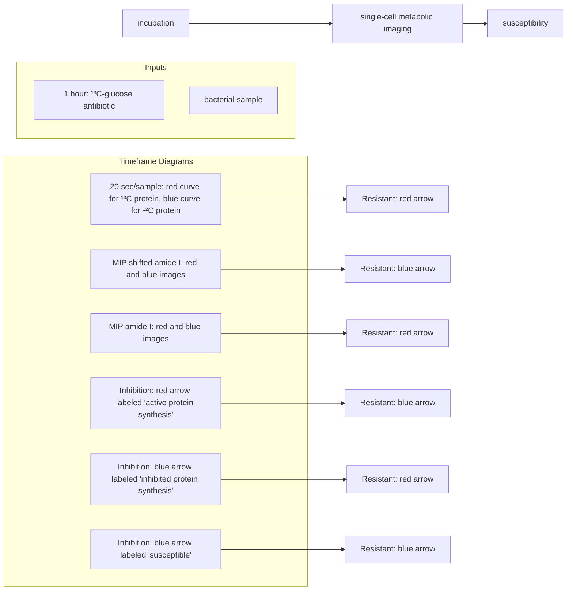
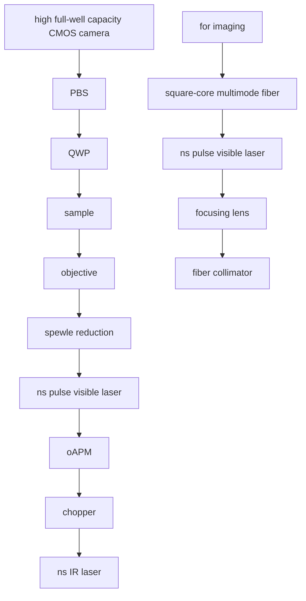

pubs.acs.org/ac

Article

# High-Throughput Antimicrobial Susceptibility Testing of Escherichia coli by Wide-Field Mid-Infrared Photothermal Imaging of Protein Synthesis

Zhongyue Guo,∥ Yeran Bai,∥ Meng Zhang, Lu Lan, and Ji-Xin Cheng

Cite This: Anal. Chem. 2023, 95, 2238−2244

Read Online

ACCESS

Metrics & More

Article Recommendations

Supporting Information

ABSTRACT: Antimicrobial resistance poses great threats to global health and economics. Current gold-standard antimicrobial susceptibility testing (AST) requires extensive culture time (36−72 h) to determine susceptibility. There is an urgent need for rapid AST methods to slow down antimicrobial resistance. Here, we present a rapid AST method based on wide-field mid-infrared photothermal imaging of protein synthesis from 13C-glucose in Escherichia coli. Our wide-field approach achieved metabolic imaging for hundreds of bacteria at the single-cell resolution within seconds. The perturbed microbial protein synthesis can be probed within 1 h after antibiotic treatment in E. coli cells. The susceptibility of antibiotics with various mechanisms of action has been probed through monitoring protein synthesis, which promises great potential of the proposed platform toward clinical translation.

flowchart

## INTRODUCTION

Antibiotics have revolutionized the practice of modern medicine. Nevertheless, antimicrobial resistance (AMR) greatly threatens this progress,1 presenting significant risks to human health2,3 and imposing huge economic burdens.4 AMR has outpaced the development of new antimicrobial agents,5−7 reinforcing the need to preserve the currently available ones. Therefore, it is essential to optimize the antibiotic selection and reduce the inappropriate use of broad-spectrum antibiotics. However, clinical gold-standard AST methods require extensive culture time (36−72 h) to distinguish the phenotypic growth or inhibition of pure bacterial isolates, making it impossible for patients to receive the optimal antimicrobial treatment in time, especially in life-threatening conditions such as sepsis.

Great efforts have been made to reduce the diagnostic time down to within a working shift (<8 h) for rapid AST.8−10 Molecular-based AST methods detect known genes or protein markers of resistance.11−16 However, non-characterized resistance mechanisms or new mutations would remain elusive. Additionally, the absence of resistance markers cannot reliably predict phenotypic susceptibility. Other methods determine bacterial growth through quantifying ATP,17,18 precursor rRNA,19 DNA,20,21 or 16S RNA genes.22,23 However, these methods require complicated sample processing, involving the lysis of bacterial cells and extraction of the desired biomaterials. In addition, the detection of heterogeneity is clinically important, but these phenotypic methods can only measure at the population level.24 Therefore, there is an unmet need for rapid AST based on phenotypic changes at the single cell level.

Vibrational spectroscopic techniques shed new light on phenotypic rapid AST by directly probing the metabolic changes at the single-cell level through detecting endogenous spectral changes25,26 or combing stable isotope probing such as heavy water (D O ).27−32 The susceptibility can be determined with single-cell Raman spectroscopy or stimulated Raman scattering imaging within several hours for urine samples.29,30

However, slow data acquisition speed in single-cell Raman spectroscopy as well as the expensive and complicated system used in stimulated Raman scattering imaging hinder the clinical translation of these advanced technologies. On the other hand. infrared (IR) absorption-based AST methods promise a higher data acquisition speed due to a much larger cross section compared with Raman. Additionally, the IR imaging system is compact and relatively cost-effective since there is no need for ultrafast lasers as in stimulated Raman scattering imaging. However, current far-field IR-based AST methods still require pure bacterial colonies to detect the spectral changes,33−38 while the extremely low throughput

Received: August 22, 2022

Accepted: December 23, 2022

Published: January 18, 2023

associated with near-field IR methods prevents translation to clinics.39

Mid-infrared photothermal (MIP) microscopy was recently developed to overcome the abovementioned limitations. In MIP imaging, visible light detects the photothermal effect induced by IR absorption.40−43 The sub-micrometer spatial resolution and high sensitivity of MIP imaging have been demonstrated in the detection of single viruses,44 bacteria,45− 49 cells,40,45,47,50−52 and tissues.53,54 The direct imaging of lipid metabolism in living cells has been shown by combining MIP with isotopic labeled fatty acids.50 The majority of the developed MIP systems are based on point-scan measurement, where both the IR pump and visible probe are focused and an image is created from stage-scanning. To probe small objects such as single bacterial cells, point-scan measurements provide a high signal-to-noise ratio (SNR). However, over 3 min is needed to acquire a single IR wavenumber MIP image (pixel size of 0.15 μm, 300 pixels by 300 pixels, 2 ms dwell time), which limits the throughput. While the wide-field MIP modalities improve the imaging speed through spatial multiplexing,55,56 the use of the light-emitting diodes (LEDs) limits the detection sensitivity of small objects because of the long pulse duration (hundreds of nanoseconds). Therefore, a new platform with improved sensitivity and throughput is needed for rapid AST determination.

Here, we report a wide-field metabolic MIP imaging platform for rapid AST by monitoring protein synthesis in single bacterial cells. We selected Escherichia coli (E. coli) as our testing bed since it is the leading pathogen in common bacterial infections in humans.57 We systematically design and implement a highly sensitive wide-field MIP microscope, achieving high-throughput metabolic imaging of hundreds of individual bacterial cells within seconds. Then, we quantify protein synthesis from isotopically labeled glucose $\binom { 1 3 } { 5 } \dot { \mathrm { C } } .$ glucose) in terms of the 13C-protein replacement ratio using dual-wavenumber MIP imaging at the original $\left( 1 6 5 6 ~ \mathrm { c m ^ { - 1 } } \right)$ and shifted amide I $( 1 \mathsf { \breve { 6 } } 1 \mathsf { \breve { 2 } ~ \thinspace ~ c m } ^ { - 1 } )$ peaks. Finally, we demonstrate that the 13C-protein replacement ratio is a reliable metabolic marker for the determination of susceptibility of E. coli against various antibiotics with as short as 1 h treatment.

## EXPERIMENTAL SECTION

Wide-Field MIP Microscope. We had previously demon strated wide-field MIP microscopy by pulsed IR/visible illumination and detection via a virtual lock-in camera.55 However, the sensitivity was not sufficient for metabolic imaging of single bacteria due to the following reasons: First, the probe pulse duration was too long (∼1 μs) for bacterial imaging. The thermal decay constant of a single bacterium after absorbing IR light was found to be 280 ns, where 95% of heat drained out within 800 ns.47 The long probe pulse takes the average of the complete thermal decay process. In contrast, a short probe pulse could better target at the highest temperature, providing higher MIP contrast. Second, the camera had a limited full well capacity (FWC). As wide-field MIP is shot-noise limited. the SNR is proportional to the square root of the total number of received photons. Third, the objective was not suitable for imaging small objects. The previously used 20×, NA 0.25 objective for cancer cells55 cannot resolve a single bacterium. Higher magnification and higher NA are necessary to meet the Nyquist sampling requirement and collect high-angle scattered photons. Fourth, speckles from a short-pulse probe laser contributed to a noisy background, which deteriorated the SNR.

To address the abovementioned limitations, we have designed and constructed a new wide-field MIP microscope (Figure 1). First, for the probe source, either a 532 nm

flowchart

Figure 1. Highly sensitive wide-field mid-infrared photothermal microscope for metabolic imaging of single bacterial cells. CMOS: complementary metal-oxide-semiconductor; PBS: polarizing beam splitter; QWP: quarter-wave plate; OAPM: off-axis parabolic mirror; ns: nanosecond.

nanosecond laser (Wedge HF 532 nm, Bright Solutions) with a pulse duration of ∼1 ns or a pulsed 520 nm nanosecond laser (NPL52C, Thorlabs) with a pulse duration of 129 ns was used. Second, a camera with a high FWC (2 Me−) (Q-2HFW, Adimec) was used as the detector instead of a regular FWC one (19 ke−) (IL-5, Fastec). Third, for detection, a high-NA objective (MPLFLN Olympus, 100×, NA 0.9 or MPLFLN Olympus, 50×, NA 0.8) collected the sample-reflected light. Fourth, to minimize the speckle effect, the 520 nm laser went through a square-cored multimode optical fiber (M97L02, Thorlabs). To increase the collection efficiency of the scattered and reflected photons, we coupled a polarizing beam splitter (PBS) and a quarter-wave plate (QWP) before the objective. The randomly polarized light emitted from the fiber becomes s-polarized after PBS reflection, with a 50% power reduction. The light became circularly polarized after the QWP, and the sample-reflected/scattered photons were circularly polarized with reverse-handedness.58 Then, the light became p-polarized passing through the QWP again and transmitted through PBS before reaching the imaging path. The total photon loss using PBS and QWP is 50%, compared with 75% photon loss using a non-polarizing beam splitter. A mid-IR laser (Firefly-LW, M Squared Lasers) produced IR pulses with ∼20 ns pulse duration and 20 kHz repetition rate. The IR pulses were modulated by an optical chopper (MC2000B, Thorlabs) and weakly focused onto the sample from the bottom using an offaxis parabolic mirror. We synchronized the IR pulses, probe pulses, and camera acquisition (Supplement Figure 1) using a delay pulse generator (9254, Quantum Composers).

The performance of the new MIP microscope was evaluated via imaging of 500 nm poly(methyl methacrylate) (PMMA) beads. The mid-IR laser was tuned to 1728 cm−1 with a power of ∼35 mW before the microscope. For imaging single bacterial cells, the IR powers were 30 and 34 mW for 1656 and $1 6 1 2 ~ \mathrm { c m } ^ { - 1 }$ . The IR power was monitored by a compact power meter (PM16-401, Thorlabs) for power normalization. Probe powers were in the range of 1−3 mW before the microscope depending on the objective and camera used.

A  
Visible probe source  
LED  

ns laser  

B  
camera  
FWC = 19 k e  

  
FWC = 2M

line chart

| distance (μm) | normalized MIP Intensity |
| ------------- | ------------------------ |
| -3            | 0.0                      |
| -2            | 0.0                      |
| -1            | 0.0                      |
| 0             | 1.0                      |
| 1             | -0.5                     |
| 2             | 0.0                      |
| 3             | 0.0                      |

line chart

| distance (μm) | SNR ~124 | SNR ~294 |
| ------------- | -------- | -------- |
| -3            | 0.0      | 0.0      |
| -2            | 0.0      | 0.0      |
| -1            | 0.0      | 0.0      |
| 0             | 1.0      | 1.0      |
| 1             | 0.0      | 0.0      |
| 2             | 0.0      | 0.0      |
| 3             | 0.0      | 0.0      |

C  
objective  
50x 0.8NA  

100x 0.9NA  

line chart

| distance (μm) | 50x8NA | 100x9NA |
| ------------- | ------ | ------- |
| -3            | 0.0    | 0.0     |
| -2            | 0.0    | 0.0     |
| -1            | 0.5    | 0.0     |
| 0             | 1.0    | 1.0     |
| 1             | 0.5    | 0.0     |
| 2             | 0.0    | 0.0     |
| 3             | 0.0    | 0.0     |

D  
speckle reduction  
Without speckle reductior  

With speckle reductior  

line chart

| distance (μm) | speckle | reduced |
| ------------- | ------- | ------- |
| -3            | 0.0     | 0.0     |
| -2            | 0.0     | 0.0     |
| -1            | 0.0     | 0.0     |
| 0             | 1.0     | 1.0     |
| 1             | 0.0     | 0.0     |
| 2             | 0.0     | 0.0     |
| 3             | 0.0     | 0.0     |

Figure 2. Near two orders of magnitude improvement in SNR through advanced instrumentation. (A) Visible probe sources: light-emitting diode (LED) versus nanosecond (ns) laser. (B) Camera full well capacity (FWC): 19k e− versus 2M e−. (C) Objective magnification and numeric aperture (NA): 50× 0.8NA versus 100× 0.9NA. (D) Without or with speckle reduction. 500 nm PMMA beads were imaged in (A) and (B), and E. coli cells were imaged in (C) and (D). The top and middle images show the reflection and MIP images. The bottom row shows the normalized MIP line profile of particles pointed by arrows. Scale bars: 5 μm.

Bacterial 13C-Glucose Incorporation, Antibiotic Treatment, and Sample Preparation. E. coli 25113 was inoculated from a single colony and pre-cultured in the nutrient medium (Tryptic Soy Broth or Mueller Hinton Broth) for ∼3 h to reach the log phase. The optical destiny at 600 nm was measured to estimate the concentration. Then. the bacteria were diluted to a concentration of around $\varsigma \times 1 0 ^ { 5 }$ CFU/mL (standard concentration used for AST) in the M9 minimal medium. The M9 minimal medium was supplemented with either $^ { 1 2 } \mathrm { C }$ -glucose or $^ { 1 3 } \mathrm { C }$ -glucose at a concentration of 0.2% w/v. The 13C-glucose ( -Glucose ${ \mathrm { U } } _ { - } ^ { 1 3 } { \mathrm { C } } _ { 6 } ,$ 99%, Cambridge Isotope Laboratories) was universally labeled where all carbon atoms were replaced with $^ { 1 3 } \mathrm { C }$ atoms. The antibiotics (gentamicin, ampicillin, trimethoprim, and erythromycin) were dissolved with either DMSO or PBS as the stock solutions and added at the clinical breakpoint concentration. At the time of collection, the bacterial cells were fixed with 10% formalin, and multiple rounds of washing with deionized water were performed to remove the fixative and residue medium. A 2 μL drop of the bacteria-containing solution was deposited on the poly- -lysine-coated silicon substrate and dried in air.

Quantifying Protein Synthesis and Determining Susceptibility. We quantify protein synthesis at the single cell level by (1) identifying single bacterial cells based on the reflection images, (2) measuring MIP intensities at the original and shifted amide I peaks, (3) calculating the relative concentrations of $^ { 1 2 } { \mathrm { C } } \cdot$ -protein and 13C-protein based on the reference spectrum, and (4) calculating the 13C-protein replacement ratio defined as 13C-protein concentration over the sum of $^ { 1 3 } \mathrm { C } .$ -protein and $^ { 1 2 } { \mathrm { C } } \cdot$ -protein concentrations.

To determine the susceptibility, a cut-off value is chosen to maximize the ability to differentiate between the negative control $^ { 1 2 } { \mathrm { C } } \cdot$ -glucose only group and the positive control $^ { 1 3 } \mathrm { C } \mathrm { . }$ glucose only group. If the $^ { 1 3 } \mathrm { C } .$ -protein replacement ratio is above the cut-off value, then bacterial protein synthesis is not inhibited and the bacteria are resistant. Otherwise, the bacteria are susceptible.

## RESULTS AND DISCUSSION

Performance of the Newly Designed Wide-Field MIP Microscope. We have evaluated the sensitivity of the new wide-field MIP microscope (Figure 1) by imaging 500 nm PMMA beads and E. coli cells (Figure 2). To minimize the biological sample-related variation, we started by testing standard PMMA particles. First, we used a nanosecond laser with a pulse duration of ∼1 ns to probe at the highest temperature and achieved a 10-fold improvement in SNR compared with the LED source (Figure 2A). Second, a high FWC (2 Me-) camera further improved the SNR by ∼3-fold (Figure 2B). With these two innovations, we were able to image single bacterial cells with high SNR, and third, the incorporation of a high magnification and high NA objective further improved the SNR ∼1.5-fold (Figure 2C). Fourth, the speckle reduction module (Figure 1, inset) suppressed the speckles around the bacteria, leading to an SNR improvement of ∼1.7-fold (Figure 2D). Together, these advanced instrumentations synergistically boosted the sensitivity with 77 times improvement compared with previously reported results. We achieved MIP imaging of 500 nm PMMA beads at the speed of 635 frames/s with an SNR of 12 (Supplement Figure 2). In contrast, wide-field MIP imaging of 1 μm PMMA beads was limited to the speed of 2 frames/s with an SNR of 24 using the previously reported setup.55 This high sensitivity laid the foundation for high-throughput metabolic imaging of single bacteria.

MIP Quantification of Newly Synthesized Protein from 13C-Glucose. We choose to probe protein synthesis as a metabolic indicator for the following reasons: First, proteins are responsible for nearly every task of cellular events. Thus, perturbation in protein synthesis is a good indicator of antibiotic effectiveness. Second, the protein amide I band has one of the strongest IR absorptions among all biological materials.59 Moreover, $^ { 1 3 } \mathrm { C }$ labeling of peptide bonds induces a significant redshift (∼40 cm−1 ) of the amide I band,47,48,60,61 $( { \sim } 4 0 ~ \mathrm { c m ^ { - 1 } } )$ which allows clear differentiation. Third, glucose is widely used to synthesize various amino acids and one can track protein synthesis by culturing with $^ { 1 3 } \mathrm { C } .$ -glucose as the sole carbon source (Supplement Figure $3 ) . ^ { 6 2 , 8 3 }$ Unlike $\mathrm { D } _ { 2 } \mathrm { O } , \ ^ { 1 3 } \mathrm { C } \cdot \mathrm { g l u c o s }$ e has a negligible influence on cell metabolism and physiology.64

We used E. coli to demonstrate MIP probing of protein synthesis. E. coli was cultured in M9 minimal medium with either unlabeled glucose $\left( ^ { 1 2 } \mathbf { C - g l u c o s e } \right)$ or uniformly labeled glucose $\scriptstyle \left( { ^ { 1 3 } { \bf C - g l u c o s e } } \right)$ for 24 h. We acquired wide-field MIP spectra and observed a clear peak shift to a lower wavenumber by ∼40 $\mathrm { c m ^ { - 1 } }$ from the 12C-glucose group to the 13C-glucose group (Figure 3A). By dual-wavenumber MIP imaging at the

line chart

| Wavenumber (cm⁻¹) | MIP Int. (a.u.) - ¹²C | MIP Int. (a.u.) - ¹³C |
| ----------------- | --------------------- | --------------------- |
| 1612              | ~0.8                  | ~0.6                  |
| 1656              | ~0.9                  | ~0.7                  |

Figure 3. Protein synthesis probed by dual-wavenumber MIP imaging. (A) Wide-field MIP spectra for $\scriptstyle { ^ { 1 2 } \mathbf { C } \cdot \mathbf { g l u c o s e } } .$ and $^ { 1 3 } { \mathrm { C } } \mathrm { - }$ glucose-cultured E. coli for 24 h. The solid line represents the mean, and the shaded area represents the standard deviation of ${ \bf > } 2 0 $ cells in each group. The black curves represent MIP spectra from cell-free background regions. MIP raw spectra were normalized with IR power spectra. The spectra were offset for visualization. Dual-wavenumber MIP images at 1612 and 1656 $\mathrm { c m } ^ { - 1 }$ for (B, C) 12C-glucose- and $\scriptstyle ( \mathrm { D } ,$ E) 13C-glucose-treated E. coli. Scale bars: $5 \ \mu \mathrm { m }$ .

original amide I peak $( \sim 1 6 5 6 ~ \mathrm { c m ^ { - 1 } } )$ and the shifted amide I peak $( \sim 1 6 1 2 ~ \mathrm { c m } ^ { - 1 } )$ (Figure 3B−E), it was found that most proteins (95.6% estimated based on the residual peak at 1656 $\cdot \mathrm { c m } ^ { - 1 }$ in Figure 3A) in the bacteria are $^ { 1 3 } \mathrm { C } .$ -labeled (defined as $^ { 1 3 } \mathrm { C }$ -protein) after 24 h of incubation with $^ { 1 3 } \mathrm { C - g l u c o s e } .$ .

To quantify the rate of protein synthesis, we further developed a data processing pipeline to identify single cells and then calculate the $^ { 1 3 } \mathrm { C }$ -protein replacement ratios (Figure $\mathrm { 4 A ) }$ . Briefly, we generated masks for single cells based on the reflection images and measured MIP intensities. We used widefield MIP spectra (Figure 3A) as the reference and extracted four coefficients $( \ h _ { 1 2 } ^ { \nu } , \ h _ { 1 2 } ^ { \nu } , \ h _ { 1 3 } ^ { \nu } , \ h _ { 1 3 } ^ { \nu } )$ . We then calculated the relative $^ { 1 2 } { \mathrm { C } } \cdot$ - and $^ { 1 3 } \bar { \mathrm { C } } .$ -protein concentrations (defined as $c _ { 1 2 }$ and $c _ { 1 3 } )$ and obtained the $^ { 1 3 } \mathrm { C }$ -protein replacement ratio as $c _ { 1 3 } / \AA$ $\left( c _ { 1 2 } + c _ { 1 3 } \right)$ . We validated our quantification by imaging E. coli with different $^ { 1 3 } \mathrm { C }$ -glucose incubation times (Figure 4B). A clear trend of increasing $^ { 1 3 } \mathrm { C }$ -protein replacement ratios over time was found with a near 0.0 ratio at the start and a near 1.0 ratio at 24 h. The representative MIP images at the original and shifted amide I peaks at selected incubation times were shown in Supplement Figure 4. This result matched well the theoretical prediction of bacterial growth.65,66 The $^ { 1 3 } \mathrm { C } .$ -protein replacement ratio was ∼17% after 1 h and ∼33% after 3 3 h of incubation, which paved the way for rapid AST.

line chart

| incubation time (hours) | MIP intensity (u_c) | h_12^v | h_13^v |
| --- | --- | --- | --- |
| 1580 | 0.5 |  |  |
| 1600 | 0.6 |  |  |
| 1620 | 0.7 |  |  |
| 1640 | 0.6 |  |  |
| 1660 | 0.5 |  |  |
| 1680 | 0.4 |  |  |
| 1700 | 0.3 |  |  |
| 1720 | 0.2 |  |  |
| 15 | 0.4 |  |  |
| 20 | 0.6 |  |  |
| 25 | 0.8 |  |  |
| 25 | 1.0 |  |  |
| 25 | 1.2 |  |  |
| 25 | 1.2 |  |  |
| 25 | 1.2 |  |  |
| 25 | 1.2 |  |  |
| 25 | 1.2 |  |  |
| 25 | 1.2 |  |  |

Figure 4. Quantification of protein synthesis rate. (A) Data analysis pipeline for quantifying the $^ { \mathbf { \lambda _ { 1 3 } } } { \bf C } .$ -protein replacement ratio. $\left( \mathbf { B } \right) \ { } ^ { 1 3 } \mathbf { C } \cdot$ protein replacement ratios grow over time and match the theoretical prediction (in blue).

Probing Inhibition of Protein Synthesis under Antibiotic Treatment. We have designed the protocol for MIP metabolic imaging-based AST (Figure 5A). The bacteria were

flowchart

B  

text_image

12C-glucose
13C-glucose
14C-glucose
+ gentamicin
1566 cm-1
1612 cm-1

C  

violin chart

| Group | Median Ratio | IQR Lower CI | IQR Upper CI |
|-------|--------------|---------------|---------------|
| 12C-glucose | ~0.05 | ~-0.15 | ~0.15 |
| 13C-glucose | ~0.4 | ~0.35 | ~0.55 |
| 13C-glucose + gentamicin | ~0.1 | ~-0.05 | ~0.05 |
| 13C-glucose + erythromycin | ~0.4 | ~0.35 | ~0.55 |

Figure 5. Protein synthesis under antibiotic treatment probed by dual-wavenumber MIP imaging. (A) Protocol for antibiotic treatment with $^ { 1 3 } \mathrm { C - g l u c o s e }$ for MIP imaging. (B) Representative reflection, MIP at 1656 and 1612 $\mathrm { c m } ^ { - 1 }$ images for controls $\scriptstyle \left( { \mathrm { ^ { 1 2 } C - g l u c o s e } } \right.$ and $^ { 1 3 } \mathrm { C } \mathrm { . }$ - glucose), effective antibiotic (13C-glucose + gentamicin), and ineffective antibiotic $\scriptstyle ( { } ^ { 1 3 } { \mathrm { C - g l } }$ ucose + erythromycin) groups, scale bar: 5 μm. (C) Quantification of $^ { 1 3 } \mathrm { C } \mathrm { - } 1$ protein replacement ratios (n > 176). The cut-off value of 0.15 is shown in the orange dashed line.

diluted to mimic the clinical-relevant concentration. The diluted bacteria were incubated with antibiotics and $^ { 1 3 } \mathrm { C } \mathrm { - }$ glucose together for 1 or 3 h. Then, the cells were fixed for 10 min and washed two times (20 min). The cells were then air dried for 5 min before MIP imaging. To generate the number of cells for statistical analysis, three fields of view MIP images were typically acquired, which led to 20 s of total acquisition time for each sample.

To verify protein synthesis as a susceptibility marker, we treated E. coli with antibiotics and incubated with $^ { 1 3 } \mathrm { C } .$ -glucose for 3 h. The effective antibiotic (gentamicin) led to a higher intensity at the original amide I peak, similar to the $^ { 1 2 } { \mathrm { C } } \cdot$ -glucose group, indicating inhibited protein synthesis. In contrast, the ineffective antibiotic (erythromycin, which does not inhibit E. coli) led to a higher intensity at the shifted amide I peak, similar to the $^ { 1 3 } \mathrm { C }$ -glucose group, indicating unaffected protein synthesis (Figure 5B). Subsequent quantification of the $^ { 1 3 } \mathrm { C } \mathrm { - }$ protein replacement ratios reinforced this observation. Susceptibility to gentamicin and resistance to erythromycin resulted in a 13C-protein replacement ratio below and above the cut-off value, respectively (Figure 5C).

scatterplot

| Condition | Concentration (cm⁻¹) | Cell Type |
|-----------|----------------------|---------|
| ¹²C-glucose | 1656 | Varies |
| ¹²C-glucose | 1612 | Varies |
| ¹³C-glucose | 1656 | Varies |
| ¹³C-glucose | 1612 | Varies |
| ¹³C-glucose + gentamicin | 1656 | Varies |
| ¹³C-glucose + gentamicin | 1612 | Varies |
| ¹³C-glucose + trimethoprim | 1656 | Varies |
| ¹³C-glucose + trimethoprim | 1612 | Varies |
| ¹³C-glucose + ampicillin | 1656 | Varies |
| ¹³C-glucose + ampicillin | 1612 | Varies |
| ¹³C-glucose + erythromycin | 1656 | Varies |
| ¹³C-glucose + erythromycin | 1612 | Varies |

violin chart

| Treatment Group | 13C-protein replacement ratio |
| --- | --- |
| 12C-glucose | -0.1 |
| 13C-glucose | 0.3 |
| 13C-glucose + pentamicin | 0.2 |
| 13C-glucose + thymothoprim | 0.2 |
| 13C-glucose + ampicillin | 0.2 |
| 13C-glucose + erythromycin | 0.3 |

Figure 6. MIP-determined susceptibility of different antibiotics after 1 h incubation. (A) Reflection, MIP at 1656 and 1612 $\mathrm { c m } ^ { - 1 }$ images for E. coli treated with gentamicin, trimethoprim, ampicillin, and erythromycin. Scale bar: 5 μm. (B) Quantification of 13C-protein replacement ratios (n > 109). The cut-off value of 0.09 is shown in the orange dashed line.

Susceptibility to Different Antibiotics Determined with 1 h of Incubation. To expand the applicability of our approach and further shorten the treatment time, we tested antibiotics with different mechanisms of action. Specifically, gentamicin inhibits protein synthesis, trimethoprim inhibits folate synthesis, ampicillin inhibits cell wall synthesis, and erythromycin does not inhibit E. coli.67 We incubated E. coli with $^ { 1 3 } \mathrm { C } .$ -glucose for 1 h. MIP images and $^ { 1 3 } \mathrm { C }$ protein replacement ratio are shown in Figure 6. 13C-glucose alone, ampicillin-treated, and erythromycin-treated groups showed higher shifted peak intensities compared to other groups (Figure 6A). Quantification of the 13C-protein replacement ratios showed a clear difference between groups (Figure 6B). Therefore, our imaging data show that this E. coli strain was susceptible to 2 μg/mL gentamicin and 4 μg/mL trimethoprim (ratios below cut-off) but resistant to 8 μg/mL ampicillin and 4 μg/mL erythromycin (ratios above cut-off). These results were validated by the standard broth microdilution of the same sample (Supplement Table 1) and in agreement with the reported results.68

## CONCLUSIONS

We developed a highly sensitive wide-field mid-infrared photothermal microscope and achieved high-throughput MIP imaging of protein synthesis from 13C-glucose at the single-cell level for rapid AST. Protein inhibition in E. coli cells after various antibiotics treatments was determined as short as 1 h of incubation using the developed platform. We fully exploited the high-throughput merit of wide-field MIP and developed an automated data analysis pipeline to quantify protein synthesis in E. coli at single-cell resolution.

The current work used E. coli as the testing bed. For future work, more antibiotic−microorganism combinations and clinical samples will be tested. We also noted that the current procedure using 13C-glucose solely may pose limitations on certain bacterial pathogens whose glucose utilization is different from E. coli.69 To address this limitation, we will implement a mixture of isotopically labeled carbon sources such as glucose, fructose, lactose, and xylose.70 We will also investigate other key steps in protein synthesis pathways such as directly adding isotopically labeled amino acids, which may potentially be more efficient. To further facilitate clinical antibiotic selection, we will also integrate a pathogen identification module, such as fluorescence imaging based on fluorescence in situ hybridization.

## ASSOCIATED CONTENT

## \*sı Supporting Information

The Supporting Information is available free of charge at https://pubs.acs.org/doi/10.1021/acs.analchem.2c03683.

Illustration for the synchronization of the nanosecond probed wide-field MIP system, ultrafast chemical imaging of 500 nm PMMA beads up to 635 Hz, glucose widely used in protein synthesis by synthesizing various amino acids in bacteria, representative MIP images of E. coli with different 13C-glucose incubation times, and susceptibility of E. coli to antibiotics with diverse mechanisms of action validated by standard broth microdilution assay (PDF)

## AUTHOR INFORMATION

## Corresponding Author

Ji-Xin Cheng − Department of Biomedical Engineering, Department of Electrical and Computer Engineering, and Photonics Center, Boston University, Boston, Massachusett 02215, United States; orcid.org/0000-0002-5607-6683; Email: jxcheng@bu.edu

## Authors

Zhongyue Guo − Department of Biomedical Engineering and Photonics Center, Boston University, Boston, Massachusetts 02215, United States

Yeran Bai − Department of Electrical and Computer Engineering and Photonics Center, Boston University, Boston, Massachusetts 02215, United States; Present Address: Present address: Neuroscience Research Institute, University of California, Santa Barbara, California 93106, United States (Y.B.)

Meng Zhang − Department of Electrical and Computer Engineering and Photonics Center, Boston University, Boston, Massachusetts 02215, United States

Lu Lan − Department of Electrical and Computer Engineering and Photonics Center, Boston University, Boston, Massachusetts 02215, United States

Complete contact information is available at: https://pubs.acs.org/10.1021/acs.analchem.2c03683

## Author Contributions

∥ Z.G. and Y.B. contributed equally to this work.

## Notes

The authors declare the following competing financial interest(s): Ji-Xin Cheng declares financial conflicts of interests in Vibronix Inc and Photothermal Spectroscopy Corp.

## ACKNOWLEDGMENTS

This work was supported by National Institutes of Health (NIH) grants R35GM136223, R01AI141439, and R42CA224844 to J.-X.C.

## REFERENCES

(1) Murray, C. J. L.; Ikuta, K. S.; Sharara, F.; Swetschinski, L.; Robles Aguilar, G.; Gray, A.; Han, C.; Bisignano, C.; Rao, P.; Wool, E.; Johnson, S. C.; Browne, A. J.; Chipeta, M. G.; Fell, F.; Hackett, S.; Haines-Woodhouse, G.; Kashef Hamadani, B. H.; Kumaran, E. A. P.; McManigal, B.; Agarwal, R.; Akech, S.; Albertson, S.; Amuasi, J.; Andrews, J.; Aravkin, A.; Ashley, E.; Bailey, F.; Baker, S.; Basnyat, B.; Bekker, A.; Bender, R.; Bethou, A.; Bielicki, J.; Boonkasidecha, S.; Bukosia, J.; Carvalheiro, C.; Castañeda-Orjuela, C.; Chansamouth, V.; Chaurasia, S.; Chiurchiu,̀ S.; Chowdhury, F.; Cook, A. J.; Cooper, B.; Cressey, T. R.; Criollo-Mora, E.; Cunningham, M.; Darboe, S.; Day, N. P. J.; De Luca, M.; Dokova, K.; Dramowski, A.; Dunachie, S. J.; Eckmanns, T.; Eibach, D.; Emami, A.; Feasey, N.; Fisher-Pearson, N.; Forrest, K.; Garrett, D.; Gastmeier, P.; Giref, A. Z.; Greer, R. C.; Gupta, V.; Haller, S.; Haselbeck, A.; Hay, S. I.; Holm, M.; Hopkins, S.; Iregbu, K. C.; Jacobs, J.; Jarovsky, D.; Javanmardi, F.; Khorana, M.; Kissoon, N.; Kobeissi, E.; Kostyanev, T.; Krapp, F.; Krumkamp, R.; Kumar, A.; Kyu, H. H.; Lim, C.; Limmathurotsakul, D.; Loftus, M. J.; Lunn, M.; Ma, J.; Mturi, N.; Munera-Huertas, T.; Musicha, P.; Mussi Pinhata, M. M.; Nakamura, T.; Nanavati, R.; Nangia, S.; Newton, P.; Ngoun, C.; Novotney, A.; Nwakanma, D.; Obiero, C. W.; Olivas-Martinez, A.; Olliaro, P.; Ooko, E.; Ortiz-Brizuela, E.; Peleg, A. Y.; Perrone, C.; Plakkal, N.; Ponce-de-Leon, A.; Raad, M.; Ramdin, T.; Riddell, A.; Roberts, T.; Robotham, J. V.; Roca, A.; Rudd, K. E.; Russell, N.; Schnall, J.; Scott, J. A. G.; Shivamallappa, M.; Sifuentes Osornio, J.; Steenkeste, N.; Stewardson, A. J.; Stoeva, T.; Tasak, N.; Thaiprakong, A.; Thwaites, G.; Turner, C.; Turner, P.; van Doorn, H. R.; Velaphi, S.; Vongpradith, A.; Vu, H.; Walsh, T.; Waner, S.; Wangrangsimakul, T.; Wozniak, T.; Zheng, P.; Sartorius, B.; Lopez, A. D.; Stergachis, A.; Moore, C.; Dolecek, C.; Naghavi, M. Lancet 2022, 399, 629−655.

(2) Marston, H. D.; Dixon, D. M.; Knisely, J. M.; Palmore, T. N.; Fauci, A. S. JAMA 2016, 316, 1193−1204. (3) Cassini, A.; Högberg, L. D.; Plachouras, D.; Quattrocchi, A.; Hoxha, A.; Simonsen, G. S.; Colomb-Cotinat, M.; Kretzschmar, M. E.; Devleesschauwer, B.; Cecchini, M.; Ouakrim, D. A.; Oliveira, T. C.; Struelens, M. J.; Suetens, C.; Monnet, D. L.; Strauss, R.; Mertens, K.; Struyf, T.; Catry, B.; Latour, K.; Ivanov, I. N.; Dobreva, E. G.; Tambic

Andrasevic,̌ A.; Soprek, S.; Budimir, A.; Paphitou, N.; Žemlicková, H.; Schytte Olsen, S.; Wolff Sönksen, U.; Märtin, P.; Ivanova, M.; Lyytikäinen, O.; Jalava, J.; Coignard, B.; Eckmanns, T.; Abu Sin, M.; Haller, S.; Daikos, G. L.; Gikas, A.; Tsiodras, S.; Kontopidou, F.; Tóth, Á.; Hajdu, Á.; Guólaugsson, Ó.; Kristinsson, K. G.; Murchan, S.; Burns, K.; Pezzotti, P.; Gagliotti, C.; Dumpis, U.; Liuimiene, A.; Perrin, M.; Borg, M. A.; de Greeff, S. C.; Monen, J. C. M.; Koek, M. B. G.; Elstrøm, P.; Zabicka, D.; Deptula, A.; Hryniewicz, W.; Caniça, M.; Nogueira, P. J.; Fernandes, P. A.; Manageiro, V.; Popescu, G. A.; Serban, R. I.; Schréterová, E.; Litvová, S.; Štefkovicová, M.; Kolman, J.; Klavs, I.; Korosec,̌ A.; Aracil, B.; Asensio, A.; Pérez-Vázquez, M.; Billström, H.; Larsson, S.; Reilly, J. S.; Johnson, A.; Hopkins, S. Lancet Infect. Dis. 2019, 19, 56−66.

(4) O’Neill, J. Tackling drug-resistant infections globally: final report and recommendations; Government of the United Kingdom: 2016.

(5) Theuretzbacher, U.; Gottwalt, S.; Beyer, P.; Butler, M.; Czaplewski, L.; Lienhardt, C.; Moja, L.; Paul, M.; Paulin, S.; Rex, J. H.; Silver, L. L.; Spigelman, M.; Thwaites, G. E.; Paccaud, J.-P.; Harbarth. S. Lancet Infect. Dis. 2019, 19, e40-e50.

(6) Silver, L. L. Clin. Microbiol. Rev. 2011, 24, 71−109.

(7) Fair, R. J.; Tor, Y. Perspect. Med. Chem. 2014, 6, 25−64.

(8) van Belkum, A.; Burnham, C.-A. D.; Rossen, J. W. A.; Mallard, F.: Rochas. O.i Dunne. W. M.. Jr. Nat. Rev. Microbiol. 2020. 18. 299- 311.

(9) Vasala, A.; Hytönen, V. P.; Laitinen, O. H. Front. Cell. Infect. Microbiol. 2020, 10, 308.

(10) Banerjee, R.; Humphries, R. Front. Med. 2021, 8, No. 635831.

(11) Su, M.; Satola, S. W.; Read, T. D. J. Clin. Microbiol. 2019, 57, e01405−e01418.

(12) Pasteran, F.; Denorme, L.; Ote, I.; Gomez, S.; De Belder, D.; Glupczynski, Y.; Bogaerts, P.; Ghiglione, B.; Power, P.; Mertens, P.; Corso, A. J. Clin. Microbiol. 2016, 54, 2832−2836.

(13) Mertins, S.; Higgins, P. G.; Rodríguez, M. G.; Borlon, C.; Gilleman, Q.; Mertens, P.; Seifert, H.; Krönke, M.; Klimka, A. J. Med. Microbiol. 2019, 68, 1021−1032.

(14) Rösner, S.; Kamalanabhaiah, S.; Küsters, U.; Kolbert, M.; Pfennigwerth, N.; Mack, D. J. Med. Microbiol. 2019, 68, 379−381.

(15) Tada, T.; Sekiguchi, J. I.; Watanabe, S.; Kuwahara-Arai, K.; Mizutani, N.; Yanagisawa, I.; Hishinuma, T.; Zan, K. N.; Mya, S.; Tin, H. H.; Kirikae, T. BMC Infect. Dis. 2019, 19, 565.

(16) Volland, H.; Dortet, L.; Bernabeu, S.; Boutal, H.; Haenni, M.; Madec, J.-Y.; Robin, F.; Beyrouthy, R.; Naas, T.; Simon, S. J. Clin. Microbiol. 2019, 57, e01454−e01418.

(17) Ivancič ,́ V.; Mastali, M.; Percy, N.; Gornbein, J.; Babbitt, J. T.; Li, Y.; Landaw, E. M.; Bruckner, D. A.; Churchill, B. M.; Haake, D. A. J. Clin. Microbiol. 2008, 46, 1213−1219.

(18) Matsui, A.; Niimi, H.; Uchiho, Y.; Kawabe, S.; Noda, H.; Kitajima. I. Sci. Rep. 2019. 9. 13565.

(19) Halford, C.; Gonzalez, R.; Campuzano, S.; Hu, B.; Babbitt, J. T.; Liu, J.; Wang, J.; Churchill, B. M.; Haake, D. A. Antimicrob. Agents Chemother. 2013, 57, 936−943.

(20) Schoepp, N. G.; Khorosheva, E. M.; Schlappi, T. S.; Curtis, M. S.; Humphries, R. M.; Hindler, J. A.; Ismagilov, R. F. Angew. Chem., Int. Ed. 2016, 55, 9557−9561.

(21) Schoepp, N. G.; Schlappi, T. S.; Curtis, M. S.; Butkovich, S. S.; Miller, S.; Humphries, R. M.; Ismagilov, R. F. Sci. Transl. Med. 2017, 9, No. eaal3693.

(22) Rolain, J. M.; Mallet, M. N.; Fournier, P. E.; Raoult, D. J. Antimicrob. Chemother. 2004, 54, 538541.

(23) Waldeisen, J. R.; Wang, T.; Mitra, D.; Lee, L. P. PLoS One 2011, 6, No. e28528.

(24) Nicoloff, H.; Hjort, K.; Levin, B. R.; Andersson, D. I. Nat. Microbiol, 2019, 4, 504514.

(25) Germond, A.; Ichimura, T.; Horinouchi, T.; Fujita, H.; Furusawa, C.; Watanabe, T. M. Commun. Biol. 2018, 1, 85.

(26) Kirchhoff, J.; Glaser, U.; Bohnert, J. A.; Pletz, M. W.; Popp, J.; Neugebauer, U. Anal. Chem. 2018, 90, 1811−1818.

(27) Tao, Y.; Wang, Y.; Huang, S.; Zhu, P.; Huang, W. E.; Ling, J.; Xu, J. Anal. Chem. 2017, 89, 4108−4115.

(28) Yang, K.; Li, H. Z.; Zhu, X.; Su, J. Q.; Ren, B.; Zhu, Y. G.; Cui, L. Anal. Chem. 2019, 91, 6296−6303.  
(29) Zhang, M.; Hong, W.; Abutaleb, N. S.; Li, J.; Dong, P. T.; Zong, C.; Wang, P.; Seleem, M. N.; Cheng, J. X. Adv. Sci. 2020, 7, 2001452.  
(30) Yi, X.; Song, Y.; Xu, X.; Peng, D.; Wang, J.; Qie, X.; Lin, K.; Yu, M.; Ge, M.; Wang, Y.; Zhang, D.; Yang, Q.; Wang, M.; Huang, W. E. Anal. Chem. 2021, 93, 5098−5106.  
(31) Karanja, C. W.; Hong, W.; Younis, W.; Eldesouky, H. E.; Seleem, M. N.; Cheng, J. X. Anal. Chem. 2017, 89, 9822−9829.  
(32) Hong, W.; Karanja, C. W.; Abutaleb, N. S.; Younis, W.; Zhang, X.; Seleem, M. N.; Cheng, J. X. Anal. Chem. 2018, 90, 3737−3743.  
(33) Lechowicz, L.; Urbaniak, M.; Adamus-Białek, W.; Kaca, W. Acta Biochim. Pol. 2013, 60, 713.  
(34) Adamus-Białek, W.; Lechowicz, Ł.; Kubiak-Szeligowska, A. B.; Wawszczak, M.; Kaminska,́ E.; Chrapek, M. Mol. Biol. Rep. 2017, 44, 191−202.  
(35) Salman, A.; Sharaha, U.; Rodriguez-Diaz, E.; Shufan, E.; Riesenberg, K.; Bigio, I. J.; Huleihel, M. Analyst 2017, 142, 2136− 2144.  
(36) Sharaha, U.; Rodriguez-Diaz, E.; Riesenberg, K.; Bigio, I. J.; Huleihel, M.; Salman, A. Anal. Chem. 2017, 89, 8782−8790.  
(37) Sharaha, U.; Rodriguez-Diaz, E.; Sagi, O.; Riesenberg, K.; Lapidot, I.; Segal, Y.; Bigio, I. J.; Huleihel, M.; Salman, A. Anal. Chem. 2019, 91, 2525−2530.  
(38) Sharaha, U.; Rodriguez-Diaz, E.; Sagi, O.; Riesenberg, K.; Salman, A.; Bigio, I. J.; Huleihel, M. J Biophotonics 2019, 12, No. e201800478.  
(39) Kochan, K.; Nethercott, C.; Perez-Guaita, D.; Jiang, J.-H.; Peleg, A. Y.; Wood, B. R.; Heraud, P. Anal. Chem. 2019, 91, 15397− 15403.  
(40) Zhang, D.; Li, C.; Zhang, C.; Slipchenko, M. N.; Eakins, G.; Cheng, J.-X. Sci. Adv. 2016, 2, No. e1600521.  
(41) Bai, Y.; Yin, J.; Cheng, J.-X. Sci. Adv. 2021, 7, No. eabg1559.  
(42) Pavlovetc, I. M.; Podshivaylov, E. A.; Chatterjee, R.; Hartland, G. V.; Frantsuzov, P. A.; Kuno, M. J. Appl. Phys. 2020, 127, 165101.  
(43) Xia, Q.; et al. J. Phys. Chem. B 2022, 43, 8597. (44) Zhang, Y.; Yurdakul, C.; Devaux, A. J.; Wang, L.; Xu, X. G.; Connor, J. H.; ÜnlÜ , M. S.; Cheng, J.-X. Anal. Chem. 2021, 93, 4100− 4107.  
(45) Li, X.; Zhang, D.; Bai, Y.; Wang, W.; Liang, J.; Cheng, J. X. Anal. Chem. 2019, 91, 10750−10756.  
(46) Xu, J.; Li, X.; Guo, Z.; Huang, W. E.; Cheng, J. X. Anal. Chem. 2020, 92. 1445914465.  
(47) Yin, J.; Lan, L.; Zhang, Y.; Ni, H.; Tan, Y.; Zhang, M.; Bai, Y.; Cheng, J. X. Nat. Commun. 2021, 12, 7097.  
(48) Lima, C.; Muhamadali, H.; Xu, Y.; Kansiz, M.; Goodacre, R. Anal. Chem, 2021, 93. 30823088.  
(49) Lima, C.; Ahmed, S.; Xu, Y.; Muhamadali, H.; Parry, C.; McGalliard, R. J.; Carrol, E. D.; Goodacre, R. Chem. Sci. 2022, 13, 8171−8179.  
(50) Bai, Y.; Zhang, D.; Li, C.; Liu, C.; Cheng, J. X. J. Phys. Chem. B 2017, 121, 10249−10255.  
(51) Lim, J. M.; Park, C.; Park, J. S.; Kim, C.; Chon, B.; Cho, M. J. Phys. Chem. Lett. 2019, 10, 2857−2861.  
(52) Klementieva, O.; Sandt, C.; Martinsson, I.; Kansiz, M.; Gouras, G. K.; Borondics, F. Adv. Sci. 2020, 7, 1903004.  
(53) Schnell, M.; Mittal, S.; Falahkheirkhah, K.; Mittal, A.; Yeh, K.; Kenkel, S.; Kajdacsy-Balla, A.; Carney, P. S.; Bhargava, R. Proc. Natl. Acad. Sci. U. S. A. 2020, 117, 3388−3396.  
(54) Mankar, R.; Gajjela, C. C.; Bueso-Ramos, C. E.; Yin, C. C.; Mayerich, D.; Reddy, R. K. Appl. Spectrosc. 2022, 76, 508−518.  
(55) Bai, Y.; Zhang, D.; Lan, L.; Huang, Y.; Maize, K.; Shakouri, A.; Cheng, J.-X. Sci. Adv. 2019, 5, No. eaav7127.  
(56) Zong, H.; Yurdakul, C.; Bai, Y.; Zhang, M.; Ü nlü, M. S.; Cheng, J.-X. ACS Photonics 2021, 8, 3323−3336.  
(57) Kaper, J. B.; Nataro, J. P.; Mobley, H. L. T. Nat .Rev. Microbiol. 2004, 2, 123−140.  
(58) van der Laan, J. D.; Wright, J. B.; Scrymgeour, D. A.; Kemme, S. A.; Dereniak, E. L. Opt. Express 2015, 23, 31874−31888.  
(59) Baker, M. J.; Trevisan, J.; Bassan, P.; Bhargava, R.; Butler, H. J.; Dorling, K. M.; Fielden, P. R.; Fogarty, S. W.; Fullwood, N. J.; Heys, K. A.; Hughes, C.; Lasch, P.; Martin-Hirsch, P. L.; Obinaju, B.; Sockalingum, G. D.; Sule-Suso, J.; Strong, R. J.; Walsh, M. J.; Wood, B. R.; Gardner, P.; Martin, F. L. Nat. Protoc. 2014, 9, 1771−1791.  
(60) Muhamadali, H.; Chisanga, M.; Subaihi, A.; Goodacre, R. Anal. Chem. 2015, 87, 4578−4586.  
(61) Lima, C.; Muhamadali, H.; Goodacre, R. Sensors 2022, 22, 3928.  
(62) He, L.; Xiao, Y.; Gebreselassie, N.; Zhang, F.; Antoniewicz, M. R.; Tang, Y. J.; Peng, L. Biotechnol. Bioeng. 2014, 111, 575−585.  
(63) Gonzalez, J. E.; Long, C. P.; Antoniewicz, M. R. Metab. Eng. 2017, 39, 9−18.  
(64) Sandberg, T. E.; Long, C. P.; Gonzalez, J. E.; Feist, A. M.; Antoniewicz, M. R.; Palsson, B. O. PLoS One 2016, 11, No. e0151130.  
(65) Margolin, W. Nat. Rev. Mol. Cell Biol. 2005, 6, 862−871.  
(66) Eswara, P. J.; Ramamurthi, K. S. Annu. Rev. Microbiol. 2017, 71, 393.  
(67) Levinson, W.; Chin-Hong, P.; Joyce, E. A.; Nussbaum, J.; Schwartz, B., Antibacterial Drugs: Mechanism of Action. In Review of Medical Microbiology &amp; Immunology: A Guide to Clinical Infectious Diseases, 15e, McGraw-Hill Education: New York, NY, 2018.  
(68) Testing, E. C. o. A. S. Data from the EUCAST MIC distribution website. http://www.eucast.org/.  
(69) Enoch, D. A.; Birkett, C. I.; Ludlam, H. A. Int. J. Antimicrob. Agents 2007, 29, S33−S41.  
(70) Wang, X.; Xia, K.; Yang, X.; Tang, C. Nat. Commun. 2019, 10, 1279.

natural_image

Abstract digital artwork with blue and yellow geometric shapes on dark background (no text or symbols)

CAS BIOEINDER DISCOVERY PLATEORMTM

## STOP DIGGING THROUGH DATA -START MAKING DISCOVERIES

CAS BioFinder helps you find the right biological insights in seconds

Start your search

