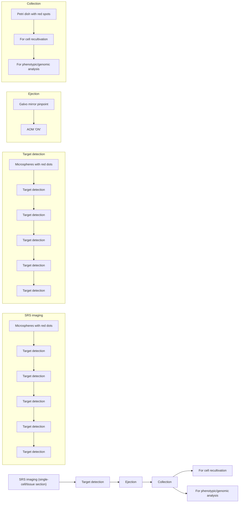

## C H E M I C A L I M AG I N G

# High-throughput single-cell sorting by stimulated Raman-activated cell ejection

Jing Zhang1,2 , Haonan Lin1,2 , Jiabao Xu3 \*, Meng Zhang2,4 , Xiaowei Ge2,4 , Chi Zhang5 , Wei E. Huang6 \*, Ji-Xin Cheng1,2,4 \*

Raman-activated cell sorting isolates single cells in a nondestructive and label-free manner, but its throughput is limited by small spontaneous Raman scattering cross section. Coherent Raman scattering integrated with microfluidics enables high-throughput cell analysis, but faces challenges with small cells (<3 μm) and tissue sections. Here, we report stimulated Raman-activated cell ejection (S-RACE) that enables high-throughput single-cell sorting by integrating stimulated Raman imaging, in situ image decomposition, and laser-induced cell ejection. S-RACE allows ejection of live bacteria or fungi guided by their Raman signatures. Furthermore, S-RACE successfully sorted lipid-rich Rhodotorula glutinis cells from a cell mixture with a throughput of \~13 cells per second, and the sorting results were confirmed by downstream quantitative polymerase chain reaction. Beyond single cells, S-RACE shows high compatibility with tissue sections. Incorporating a closed-loop feedback control circuit further enables real-time SRS imaging-identification-ejection. In summary, S-RACE opens exciting opportunities for diverse single-cell sorting applications.

Copyright © 2024 The

Authors, some rights

reserved; exclusive

licensee American

Association for the

Advancement of

Science. No claim to original U.S.

Government Works.

Distributed under a

Creative Commons

Attribution

NonCommercial

License 4.0 (CC BY-­NC ).

## INTRODUCTION

Cell sorting is indispensable for characterizing a heterogeneous cel population from various perspectives, such as chemical, structural, and genomic analyses (1–3). Current cell sorting techniques include flow cytometry, laser microdissection, cell picking, and microfluidics (4, 5). Among this array of techniques, fluorescent and magnetic labeling are commonly used for sorting target cells, whereas the exogenous labels may potentially induce cytotoxicity and disrupt cellular functions. Additional challenges such as the lack of specific labels and susceptibility to photobleaching limit the utility of labelingbased cell sorting. In contrast, label-free cell sorting methods rely on cellular properties like morphology and deformability. However, these morphological and mechanical attributes may not exhibit a direct correlation with biological states, thus reducing the sorting specificity (6). For example, quantitative phase imaging could map the volumetric distribution of the refractive index but has difficulty identifying specific cells (7, 8).

Raman spectroscopy has the capacity to surpass the constraints faced by the above regimes. By detecting inelastic photon scattering (9), Raman spectroscopy can characterize the endogenous chemical content of single cells and is capable of probing cell metabolic activity (10). By integrating Raman spectroscopy with cell sorting method ologies, including flow (11, 12), optical tweezer (13, 14), dielectrophoresis (15, 16), and cell ejection (17, 18), a plurality of biomedical applications has been achieved (19). Raman-activated cell sorting (RACS) has found extensive use in microbiology for isolating functional individuals from a community. It has been illustrated to differentiate antibiotic-resistant (20–22) or functional microbes that have specific pathways in a complex environment such as the human gut (21) or natural ecosystems (23–25). Other cell types like mammalian and fungal cells can also be characterized and sorted using RACS (16, 26, 27). Among the RACS techniques, Raman-activated cell ejection (RACE) has been proven especially powerful in highprecision sorting of small-size cells. RACE is based on laser-induced forward transfer, a method widely used in material transfer (28). In RACE, the specimens are first placed on coverslips coated with a laser-absorbing material. A pulsed laser then acts on the target location to ablate the coating, providing forward momentum to eject the cells to the collector for downstream analysis (19), for example, linking single-cell phenotype and genotype of microorganisms sampled from the natural environment (24). Despite its versatility, current RACS methods have a low throughput due to the small cross section of spontaneous Raman scattering. Typical integration time for a single Raman measurement ranges from 15 to 60 s per spectrum for biological samples to obtain a sufficient signal-to-noise ratio (29). As RACS advances into the high-information-content regime, it introduces a trade-off between information content, throughput, and generality (recent RACS methods were summarized in table S1).

Here, we demonstrate stimulated Raman-activated ejection (S-RACE) to achieve automated single-cell sorting with high-throughput and versatile sample compatibility. In coherent Raman microscopy, 104 to 105 signal enhancement can be achieved compared to spontaneous Raman scattering (30, 31). Coherent Raman microscopy employs two pulsed laser beams to probe chemical bond vibrations in a sample. Both stimulated Raman scattering (SRS) and coherent anti-Stokes Raman scattering (CARS) have been combined with microfluidics for highthroughput cell detection (32–36). Recently, two coherent Ramanactivated cell sorting studies were reported, one in the C─H stretching region (37) and the other in the fingerprint region (400 to 1800 cm−1 ), using an Fourier-transform CARS (FT-CARS) spectrometer (38). Although offering high throughput, these microfluidic-based methods encounter challenges in handling small-size cells (<3 μm) (37) and unstable flow caused by bubbles and/or debris in the microfluidic channel (39). Apart from cell detection and sorting, SRS microdissection and sequencing were recently reported for in situ laser microdissection of

1 Department of Biomedical Engineering, Boston University, Boston, MA 02215, USA. 2 Photonics Center, Boston University, Boston, MA 02215, USA. 3 Division of Biomedical Engineering, James Watt School of Engineering, University of Glasgow, Glasgow G12 8LT , UK. 4 Department of Electrical and Computer Engineering, Boston University, Boston, MA 02215, USA. 5 Department of Chemistry, Purdue University, 560 Oval Dr., West Lafayette, IN 47907, USA. 6 Department of Engineering Science, University of Oxford, Oxford OX1 3PJ, UK. \*Corresponding author. Email: jiabao.xu@glasgow.ac.uk (J.X.); wei.huang@eng.ox. ac.uk (W.E.H.); jxcheng@bu.edu (J.-X.C.)

tissue slices and downstream DNA and RNA sequencing (40). Despite their advantage in recapitulating both morphological and chemical features, additional micromanipulation for collection is required in this laser capture microdissection (LCM)–based method.

Our S-RACE platform integrates multicolor SRS imaging, online image processing, and a laboratory-built ejection module to enable high-throughput image-based cell sorting. This method can be applied to a versatile range of samples from single bacteria to brain slices, as shown in Fig. 1. We achieved a high yield of $9 3 . 3 \pm 2 . 6 \%$ and a high purity level of $9 6 . 2 \pm 2 . 1 \%$ for a mixture of $1 . 0 \mathrm { - } \mu \mathrm { m } \mathrm { p o l y - }$ mer beads, with a throughput of approximately $1 7 . 0 \pm 3 . 5$ events per second (eps). Additionally, we demonstrated fast identification and sorting of lipid-rich Rhodotorula glutinis cells from a mixture with Saccharomyces cerevisiae and confirmed the result by quantitative polymerase chain reaction (qPCR) amplification of the second internal transcribed spacer (ITS2) region. A notable feature of our platform is its live cell sorting capability, a pivotal component for isolating and purifying cells with specific functions while ensuring their viability. Successful cell recovery was observed for both bacteria (Escherichia coli) and fungus (S. cerevisiae). Beyond single cells, S-RACE also shows compatibility with tissue sections, including rat brain and tumor tissues. Furthermore, by harnessing a comparator circuit for communication between imaging and laser ejection, we achieved real-time SRS-guided sorting of single polymer beads, live cells, and regions of interest (ROIs) in a sliced tissue. The S-RACE platform promises various biomedical applications, including metabolic engineering (41), precise diagnosis (29), and cell therapies (42).

## RESULTS

## S-RACE platform

Our S-RACE system includes a multispectral SRS microscope and a laser ejection module (Fig. 1A). The SRS microscope was described in our previous work (41). Detailed setup can be found in fig. S1. A multicolor SRS stack was collected by scanning the interpulse delay between the spectrally chirped pump and Stokes beams. The ejection module (Fig. 1B) consists of a 532-nm 1.0-ns pulsed laser, an ejection coverslip, and a collector assembled in a sandwich-like manner. The ejection coverslip is coated with a thin layer of titanium dioxide $\mathrm { ( T i O } _ { 2 } )$ as the dynamic release layer (43). For the polymer microparticle mixture sorting, the sample is first loaded onto the coverslip with $\mathrm { T i O } _ { 2 }$ coating, followed by an air-drying step in preparation for ejection. As the 532-nm laser propagates through the coverslip, the $\mathrm { T i O } _ { 2 }$ coating absorbs the laser energy and undergoes a four-phase transfer before propelling the targeted microparticle away (28). The interface between the $\mathrm { T i O } _ { 2 }$ coating and coverslip is first heated, and then a melt front propagates through the $\mathrm { T i O } _ { 2 }$ coating toward the microparticle. Subsequently, $\mathrm { T i O } _ { 2 }$ reaches its boiling point after superheating. Finally, the resulting gas pressure pushes the targeted microparticle away (44). The “ejected” microparticle is then collected by the bottom collector, which is fabricated by coating a layer of polydimethylsiloxane (PDMS) on a standard coverslip. For live cell sorting, an additional thin layer of agarose gel is introduced on the $\mathrm { T i O } _ { 2 }$ coating, mitigating potential mechanical damage during the ejection process (18). In addition, a complementary layer of agarose is introduced at the bottom of the collector to safeguard the cells from any impact during the landing process $( 1 8 , 4 5 )$ . For tissue samples, the cryosectioned tissue section was first affixed to a $\mathrm { T i O } _ { 2 ^ { - } }$ coated coverslip, and ROIs were then selected based on the SRS image. The dissected regions were collected by the bottom collector.

Metals such as gold, metal oxides, and polymer materials have been used as the dynamic release layer in laser-induced forward transfer (LIFT) systems for cell ejection or tissue dissection (43). Among various coatings tested in this study, $\mathrm { T i O } _ { 2 }$ showed the best performance in both SRS imaging and laser ejection (fig. S2). The $\mathrm { T i O } _ { 2 } .$ -coated coverslip (\~150 μm thick) is fabricated by magnetron sputtering to 4-nm thickness for 2-min sputtering time. Figure S3A shows that $\mathrm { T i O } _ { 2 }$ coating has minimal background in SRS imaging and no interference with the SRS signal of polymer beads. In contrast to $\mathrm { T i O } _ { 2 }$ coating, commonly used Au-coated coverslips contributed a substantial thermal background to the SRS image (fig. S3B). The ultraviolet-visible spectrum of the $\operatorname { T i O } _ { 2 } -$ -coated coverslip shows an absorbance peak at 532 nm (fig. S3D), which facilitates the laser ejection. In addition, the $\mathrm { T i O } _ { 2 }$ coating has a minimal background in post-ejection analysis (SRS imaging and qPCR), which corroborates the feasibility of our S-RACE system. To characterize the spatial resolution of ejection, bead clusters dried on the $\mathrm { T i O } _ { 2 } .$ -coated coverslip were used as a test bed (fig. S3E). For the 60× objective, the ejection spot diameter is $4 . 2 0 \pm 0 . 7 4$ μm. For the 40× objective with an underfilled objective back aperture, the ejection spot size is 6.19 ± 1.00 μm. The ejection spot is larger than the optical resolution, probably due to the “ripple effect” ejection. The test was performed with a minimum laser energy guaranteeing a successful ejection without photodamage. Specifically, the laser power used was lower than 1.5 mW before the objective, and the energy of the laser pulse was less than 1 μJ. We further studied the impact of the axial focal position on the ejection efficiency (fig. S3F). It was found that maximal efficacy was reached when the objective was focused on the $\mathrm { T i O } _ { 2 }$ coating, which is about 1 μm above the beads.

text_image

A
Combined 800 nm
& 1040 nm
DMLP
AOM
532 nm
L
L
2D GM

C

text_image

B
532 nm
ns pulse
Cell at target
was "ejected"
Glass Spacer Cell
Laser-absorbing coating
Agar (live cell only)

flowchart

Fig. 1. Optical diagram and workflow of S-RACE. (A) Optical diagram of S-RACE . AOM, acousto-optic modulator; DMLP, long-pass dichroic mirror; 2D GM, 2D galvo mirrors; L, lens; OBJ, objective; COND, condenser; F, filter; PD, photodiode. (B) Sketch of the single-cell ejection process. The left diagram is a zoom-in of the sample in the dashed box in (A). (C) Workflow of S-RACE for single-cell and tissue section samples. Each image stack contains 300 × 300 × 4 pixels.

The workflow of S-RACE is shown in Fig. 1C. For each field of view (FOV), SRS images are first collected at 10-μs pixel dwell time. An SRS stack of 300 by 300 pixels and four wave numbers takes \~6 s. The SRS images have a spatial resolution of $4 6 0 \pm 1 5$ nm for 60× 1.2 NA (numerical aperture) objective under the $\mathrm { S - R A C E }$ regime (fig. S4). Subsequently, microparticles/cells within the FOV are identified by spectral analysis. For the discrimination of target objects in the context of four-color SRS images involving two types of polymer microbeads, the target detection step consumes \~0.2 s. For each targeted microparticle/cell, two-dimensional (2D) galvo mirrors are used to precisely position the green laser on the object. An acousto-optic modulator (AOM) is then activated to emit the 532-nm, 4-kHz laser onto the coating. The targeted object is then pushed away from the ejection coverslip and received by the collector coverslip. With AOM as a fast pulse picker, single-pulse ejection is achieved and each ejection takes \~8 ms, which is sufficient to stabilize 2D galvo mirrors to pinpoint and compensate for laser repetition rate. Multiple FOVs are stitched to a larger FOV by moving the sample stage. After sorting all the targeted cells, downstream phenotypic and/or genomic analysis, e.g., sequencing and proteomics, can be applied to the cells in the collector.

## S-RACE performance evaluated with mixtures of polymer microbeads

We tested S-RACE performance using a polymer bead mixture [polystyrene (PS), with red fluorescence; poly(methyl methacrylate) (PMMA), without fluorescence]. The bead sizes are both 1.0 μm in diameter, mimicking the size of bacteria. Four wave numbers (2860, 2905, 2950, and $2 9 9 4 ( \mathrm { c m } ^ { - 1 } )$ representing the Raman signatures of PS $( 2 9 0 5 ~ \mathrm { c m } ^ { - 1 } )$ and PMMA $( 2 9 5 0 ~ \mathrm { c m } ^ { - 1 } )$ were selected (fig. S5A). This polymer bead test was performed with the configuration in fig. S3E (top) (60× objective), which features a small focus size. A composite image of two-color SRS before ejection is shown in Fig. 2A. All the beads were classified into two types (PS or PMMA) based on the workflow in fig. S5B, and PS beads were targeted for sorting. The composite SRS image with classified beads color-labeled is shown in

Fig. 2B. To further enhance sorting purity, PS beads (the targeted class) that had neighboring PMMA beads located closer than 2.5 μm (identified as “clustered” PS) were excluded from sorting. The postejection identity of the beads is visualized in Fig. 2C. In the zoom-in image of Fig. 2B, two white arrows highlight PMMA beads situated adjacent to a PS bead. Both PMMA beads were retained following the ejection of all the targeted PS beads. Averaged spectra of beads before and after ejection are shown in Fig. 2D, confirming the bead classification. During experiments, we observed bright spots remaining on the coverslip after ejection (Fig. 2C). The spectra of these bright spots (fig. S5C) were distinguishable from those of PS or PMMA (fig. S5A), indicating that these bright spots might have been caused by the deformations in the $\mathrm { T i O } _ { 2 }$ coating (46, 47).

The quantification of ejection performance is presented in Fig. 2E. Our S-RACE achieved 93.3 ± 2.6% yield, $9 6 . 2 \pm 2 .$ 1% purity, and $1 7 . 0 \pm 3 . 5$ eps. The results were obtained from three replicates with an average of 536 isolated beads. Given that the PS beads had red fluorescence, we were able to quantify the PS beads in the collector using wide-field fluorescence (fig. S5D). This analysis revealed the presence of 292 PS beads in the collector, with a collection rate of \~55%. Experiments conducted using different bead exclusion criteria demonstrated that stricter exclusion criteria resulted in higher purity (Fig. 2 and fig. S6).

## S-RACE is applicable to live cells

To validate the biocompatibility of our S-RACE platform in sorting single live cells, we conducted tests on S. cerevisiae, Candida albicans, and E. coli, representing both eukaryotic and prokaryotic cells. Hydrogels, polymers, and aqueous medium layers have been reported in printing viable cells (18, 48). Here, to protect live cells from heat and mechanical damage process, we adapted the protocols from Liang et al. (18) and Hong et al. (49) and prepared an agarose layer on the $\mathrm { T i O } _ { 2 }$ coating. The thickness of the agarose gel was $6 . 2 5 \pm 0 . 9 5$ μm based on estimation under a microscope. As shown in fig. S7 (A and B), individual C. albicans cells on the agarose gel were identified based on bright-field imaging. The bright-field image analysis revealed an ejection yield of $9 2 . 9 \pm 3 . 9 \%$ and purity of $7 8 . 2 \pm 1 . 9 \%$ (fig. S7, A to C). The observed purity is similar to the 1.0-μm polymer bead results without neighbor exclusion criteria despite the larger size of the cells. This was due to the higher percentage of cells attached to target cells. Moreover, the addition of an agarose layer for live cell ejection yielded no discernible difference in ejection yield and purity when compared to the ejection of 1.0-μm polymer beads without an agarose layer. After finishing the ejection of all targeted cells, the agarose plate with the sorted cells was sent to an incubator set at $3 0 ^ { \circ } \mathrm { C }$ for fungi and $3 7 ^ { \circ } \mathrm { C }$ for bacteria. Cultivation recovery was determined by the ratio of the number of recovered colonies to the number of ejected cells. For E. coli, the cultivation rate was $1 9 . 5 \pm 3 . 0 \%$ . Performance evaluation of live S. cerevisiae ejection is included in fig. S7 (E to H). Furthermore, the fragments of agarose gel and $\mathrm { T i O } _ { 2 }$ were negligible and not observed under the microscope, suggesting a limited impact on cell culture. These results established the coating condition for live cell ejection.

To assess the impact of SRS laser radiation on cell viability during the S-RACE of live cells, time-lapse imaging was performed to visualize E. coli growth after SRS laser radiation (fig. S8). Three different SRS laser radiation levels were chosen: no radiation, low radiation (pump 24 mW, Stokes 50 mW), and medium radiation (pump 24 mW, Stokes 100 mW). The medium radiation level was more stringent compared to the experimental condition. E. coli cells were dropped onto a 1% agarose pad after sampling from liquid culture and sandwiched with a top coverslip. The cells were kept in an enclosed incubator stabilized at 30°C. For all three laser radiation levels, cell growth and colony formation were observed. The growth rates, calculated by fitting the growth curve of the cell colony areas, were not significantly different across the three radiation levels. This result confirms the biocompatibility of the SRS laser radiation.

text_image

A 2-color SRS before ejection
2905, 2950 cm⁻¹
20 µm

text_image

B Bead identity before ejection
PS; PMMA

text_image

C Bead identity after ejection
PS; PMMA; ejection spot

line chart

| Raman shift (cm⁻¹) | Intensity (a.u.) - PS (n=671) | Intensity (a.u.) - PMMA (n=273) |
| ------------------ | ----------------------------- | ------------------------------- |
| 2860               | 0                             | 0                               |
| 2905               | 1                             | 0.5                             |
| 2950               | 0.5                           | 1                               |
| 2994               | 0                             | 0                               |

line chart

| Raman shift (cm⁻¹) | Intensity (a.u.) - PS (n=135) | Intensity (a.u.) - PMMA (n=262) |
| ------------------ | ----------------------------- | ------------------------------- |
| 2860               | 0.0                           | 0.0                             |
| 2905               | 1.0                           | 0.5                             |
| 2950               | 0.5                           | 1.0                             |
| 2994               | 0.0                           | 0.0                             |

bar chart

| Metric | Value (%) |
| :--- | :--- |
| Yield (%) | 90 |
| Purity (%) | 90 |
| Throughput (eps) | 22 |

Fig. 2. Evaluation of S-RACE performance by polymer microbead mixtures (PS, with red fluorescence; PMMA, without fluorescence). The bead sizes are both $1 . 0 \mu \mathrm { m }$ in diameter. (A) Two-color SRS image before ejection. (B) Bead identity map of the same FOV in (A). White arrows in the zoom-in image mark the detected two PS beads that were excluded from ejection. (C) Bead identity map of the same FOV in (A) and (B) after ejection. (D) Multicolor SRS of polymer beads before and after ejection. Shaded error bar: SD. (E) Quantification of S-RACE performance. Yield $9 3 . 3 \pm 2 . 6 \%$ , purity $9 6 . 2 \pm 2 . 1 \% ,$ , throughput $1 7 . 0 \pm 3 . 5$ eps. Data are shown as means ± SD.

We then performed S-RACE of two types of live cells: S. cerevisiae (Fig. 3, A to F) and green fluorescent protein (GFP)–labeled E. coli (Fig. 3, G to L). Figure 3A shows the schematic of the ejection module. Figure 3B shows SRS spectra in the C─H stretching region of the cells. Individual S. cerevisiae cells were identified based on single-frame SRS images at $2 9 3 5 ~ \mathrm { c m } ^ { - 1 }$ (signal-to-background ratio \~4; Fig. 3, C and D). SRS image after ejection is shown in Fig. 3E. Bright spots in Fig. 3E were probably caused by the deformed agarose layer and/or deformed $\mathrm { T i O } _ { 2 }$ coating. The spectra of bright spots after ejection are shown in fig. S9, different from the spectra of cells or the image background. Recultivated cells were transferred to culture tubes after \~40 hours of cultivation on an agarose plate. The culture medium with ejected cells became turbid, indicating successful cell growth, whereas the medium of the control group remained clear. For GFP-labeled E. coli, the collector used was composed of a thin agar layer (\~60 μm) and a standard coverslip (Fig. 3G). This design enables the visualization of sorted cells in the collector. Figure 3 (I to K) shows the image before and after ejection. After cell ejection, a wide-field fluorescence image of the sorted GFP-labeled E. coli in the collector confirmed that most of the cells remained in good shape (Fig. 3L).

## S-RACE of lipid-rich R. glutinis from cell mixture followed by qPCR identification

To show the utility of our S-RACE platform to sort target cells from a mixture, we tested lipid-rich R. glutinis cells mixed with S. cerevisiae. R. glutinis has been identified as an oleaginous yeast and can contain up to 70% lipids in its dry-weight biomass (50, 51). In contrast, S. cerevisiae only has \~6% lipids in its biomass (50). Lipid-rich yeasts including R. glutinis have been valuable models for sustainable biofuel production. Using multicolor SRS, the lipid content in individual yeast cells can be quantified. Lipid-rich intracellular aggregates found in the SRS image had a spectrum similar to that of glycerol trioleate (Fig. 4, A and B). While the cell body part has a similar spectrum as peptone, a standard protein sample (Fig. 4B), the lipid channel after background subtraction in Fig. 4C showed that the SRS signal at $2 8 5 1 \mathrm { { c m } ^ { - 1 } }$ is contributed by lipid (52).

Figure 4D shows the spectral summation of a five-color SRS image of a mixture of R. glutinis and S. cerevisiae (ratio \~1:1). The lipidrich cells were subsequently identified from the lipid channel (Fig. 4,

A  

text_image

Glass
TiO₂
Agar (1%)
Water
Agar (1%)
Petri dish

line chart

| Wavelength (nm) | Intensity (a.u.) - Cell Background | Intensity (a.u.) - Cell Background |
| --------------- | ----------------------------------- | ----------------------------------- |
| 2800            | ~0.05                               | ~0.15                               |
| 2900            | ~0.25                               | ~0.28                               |
| 3000            | ~0.05                               | ~0.10                               |

C  

text_image

SRS 2935 cm⁻¹
20 µm

D  

text_image

Cell target
0.5
0

F  

text_image

w/
ejected
cells
w/o
ejected
cells

E  

text_image

SRS 2935 cm⁻¹
0.5
0

G  

text_image

Glass
TiO₂
Agar (1%)
PDMS
spacer
Agar (1%)
Glass

H  

line chart

| Wavelength (nm) | Cell Background Intensity (a.u.) |
| --------------- | --------------------------------- |
| 2800            | 0.05                              |
| 2900            | 0.18                              |
| 3000            | 0.03                              |

natural_image

Fluorescence microscopy image showing SRS-2935 cm⁻¹ particles with scale bar (10 μm) and color scale (0.7–0.15), no textual annotations beyond labels

J

text_image

Cell target
0.7
0.15

L  

natural_image

Microscopic image showing green fluorescent particles on a dark background with a 20 μm scale bar (no text or symbols beyond scale)

K  

text_image

SRS 2935 cm⁻¹
1.8
0.3

Fig. 3. S-RACE and recovery of live cells (S. cerevisiae and GFP-labeled E. coli). (A) Schematic of the ejection module used for S. cerevisiae ejection. (B) SRS spectra of S. cerevisiae and background. (C) Single-color SRS image of S. cerevisiae before ejection. (D) Cell identity map generated based on (C). (E) Single-color SRS image of the same FOV as (C) and (D) after ejection. (F) Picture of culture tube after 48 hours. (G) Schematic of the ejection module used for E. coli ejection. (H) SRS spectra of E. coli and background. Shaded error bar: SD. (I) Single-color SRS image of E. coli before ejection. (J) Cell identity map generated based on (I). (K) Single-color SRS image of the same FOV as (J) after ejection. (L) Wide-field fluorescence image of collected E. coli on the bottom agar.

E and F). The cells were sorted with the configuration in fig. S3E (bottom) (40× objective). After sorting the lipid-rich cells, the lipid channel showed a much reduced intensity (Fig. 4G), which confirms the successful ejection of lipid-rich cells. The sorted cells were col lected by a customized collector made with coverslip and PDMS (Fig. 4H). Four independent trials were performed (presented as collection well a to d in Fig. 4H). Each collection well received sorted cells from 8 to 12 SRS FOVs. The ejection yield is $9 3 . 6 \pm 2 .$ 1% and purity is $7 9 . 6 \pm 0 . 8 \%$ , with a throughput of $1 2 . 6 \pm 2 . 9$ ejection per second (fig. S10). The purity level is similar to the 1.0-μm polymer bead results without neighbor exclusion criteria owing to higher object density.

To confirm that the identity of the sorted cells matched the targeted R. glutinis, qPCR was performed on the collected cells. The ITS2 in the nuclear ribosomal DNA was used as the target sequence. The workflow of qPCR amplification preparation is shown in Fig. 4H: After DNA extraction (53), the supernatant containing resuspended DNA was used for qPCR, using primers from a previous study (54). Each well produced three replicates in qPCR amplification, and each replicate contained \~16% of the total DNA content in this well. The amplifications of the collected cell contents present a peak of around 81.3°C in the melt curve (Fig. 4I), consistent with the amplification results of R. glutinis pure culture without ambiguous peaks (fig. S11B). We would also like to note that the cell number per well estimated from qPCR amplification is lower than the number of ejection due to the cell loss during the transfer process and the presence of larger cells that necessitate multiple ejections (fig. S11, C and D). In conclusion, these results demonstrate that S-RACE successfully sorted specific cell populations based on their phenotype/functions.

## S-RACE with opto-control allows for real-time sorting of individual cells and ROIs in a tissue slice

Seamlessly integrating a real-time precision opto-control (RPOC) system with our S-RACE platform yielded a real-time cell sorting approach. The RPOC uses a closed-loop feedback control circuit for laser manipulation with a fast response time of sub-microsecond (55, 56). This innovation enables imaging-identifying-sorting to occur within a single pixel during laser scanning, bringing opportunities for higher precision and efficiency. The concept of real-time imaging-sorting is illustrated in Fig. 5A. The front panel of the comparator circuit is shown in Fig. 5B. During laser scanning, the SRS signal carrying chemical information from the sample was sent to the comparator circuit. For an SRS signal higher than the preset threshold, the comparator circuit commands the AOM to rapidly couple the 532-nm laser, which subsequently ejects the targeted object residing

$$
\begin{array}{l} I _ {\mathrm{lipid}} = \sum_ {2 8 4 7 - 2 8 5 6 \mathrm{cm} ^ {- 1}} I _ {k} \\ I _ {\mathrm{bkg}} = 1. 5 \sum_ {2 8 4 3, 2 8 6 1 \mathrm{cm} ^ {- 1}} I _ {k} \\ \end{array}
$$

Fig. 4. S-RACE of lipid-rich R. glutinis from mixture with S. cerevisiae and qPCR identification. (A) Spectrally summed hyperspectral SRS image of R. glutinis. (B) SRS spectra of the cell body (yellow solid line) and lipid droplet (green solid line), with two standard samples (glycerol trioleate: green dashed line; peptone: yellow dashed line). The pink-shaded region denotes the signature Raman peak of lipid. (C) Left: Definition of lipid and background intensity. Right: Lipid channel of the same FOV in (A). The lipid channel presents an SRS signal at around 2850 cm−1 with linear background subtracted. (D) Spectrally summed five-color SRS image of R. glutinis and S. cerevisiae mixture before ejection. (E) Lipid channel of the same FOV in (D). (F) Location of lipid-rich cells found by automatic program based on lipid channel in (E). (G) Lipid channel after ejection. (H) Sample preparation steps for qPCR amplification. Left: Schematic of ejected cell collector (a to d represent four independent trials); middle: qPCR vial; right: qPCR machine. (I) Melt curve of the PCR amplicons (different colors represent different trials, and each trial produced three replicates). The dashed line denotes the melt curve peak (81.3◦C).

in the current pixel. Limited by the repetition rate of 532-nm laser (16.6 kHz), 70-μs dwell time was applied. To show the utility of this real-time imaging-sorting regime, we sorted 1.0-μm polymer beads, single cells, and tissue sections based on their SRS images. For polymer beads, the SRS image $( 2 9 5 0 \mathrm { c m } ^ { - 1 } )$ before sorting is shown in Fig. 5C (top). Active pixels were set by thresholding the SRS image, and each polymer bead contained four to six active pixels for best sorting performance. Most of the polymer beads were successfully sorted based on their SRS intensity. For live S. cerevisiae, SRS images before and after real-time imaging-sorting are shown in Fig. 5D. After \~48 hours, six S. cerevisiae colonies were observed in the petri dish with sorted cells, and no colony growth was observed in the control group.

We further tested the applicability of S-RACE to tissue sections. We prepared a cryosectioned rat brain tissue and ablated multiple ROIs based on SRS images at $2 8 5 0 \ \mathrm { c m } ^ { - 1 } \ ( \mathrm { F i g . \ 5 E } )$ and $2 9 4 0 \mathrm { c m } ^ { - 1 }$ (Fig. 5F). Raman bands centered around 2850 and $2 9 4 0 ~ \mathrm { c m } ^ { - 1 }$ are representative of cellular lipids and proteins and provide contrast in molecular signatures and morphological features of the cryosectioned tissues. Successful tissue microdissection was confirmed by SRS spectra (Fig. 5G), where the ejected spots showed relatively low intensities, while the unimpacted areas showed a typical protein-rich Raman spectrum. In the future, instead of single-color SRS, lipid and protein contrast could be combined for tissue microdissection with the aid of two comparator circuits. In addition to rat brain tissue, we also tested a bone cancer tissue slice, where three FOVs were imaged, featuring protein-rich, vessel, and collagen-rich regions (fig. S12). Ejection targets were manually selected, and successful ejections were confirmed by the SRS spectrum after ejection. The size of the ejection spots was quantified. For protein-rich bone cancer tissue, the spot size was measured at $1 0 . 9 8 \pm 2 . 2 4$ μm. The collagen-rich region of bone cancer tissue had a smaller ejection size, probably because of the higher rigidity of collagen compared to the protein-rich region. These results highlight the potential of S-RACE as an integrative tool for spatial multiomics measurements across diverse samples ranging from single cells to tissue sections.

text_image

A
During
imaging-ejection
Scanning
trajectory
One example line
SRS signal
V_T
Active pixel
532 nm laser
....OFF....ON ....OFF...

B  

text_image

Input
SRS
signal
ZHANG RESEARCH GROUP
PROJECT TYPE58 COMPARATOR CIRCUIT
MASCAL ADJUST
AOM ON
C
TTL
CONTROL
ANALUS SETPOINT INPUT
AOM OPT
AOM
SRS signal
TTL to AOM
controlling
ejection
pulses
Power

text_image

C
1 µm polymer beads
Before ejection
2950 cm⁻¹
D
Live S. cerevisiae
2940 cm⁻¹
Active pixels
After ejection

Scale bar: 10 µm

text_image

Live S. cerevisiae
2940 cm⁻¹

natural_image

Petri dish with several white colonies on agar medium (no text or symbols visible)

E  

text_image

5 µm rat brain tissue
2940 cm⁻¹

text_image

F 5 µm rat brain tissue
2850 cm⁻¹

G  

line chart

| Raman shift (cm⁻¹) | Intensity (a.u.) |
| ------------------ | ---------------- |
| 2850               | 1.0              |
| 2900               | 3.0              |
| 2950               | 4.0              |
| 3000               | 1.0              |

Fig. 5. S-RACE with a RPOC system for single-cell sorting and tissue microdissection. (A) Illustration of real-time imaging-identifying-sorting with RPOC technology. (B) Front panel of the comparator circuit box with ports used in this study. (C) Real-time imaging-identifying-sorting of 1.0-μm polymer beads. Top to bottom: SRS image $( 2 9 5 0  c m ^ { - 1 } )$ before sorting; active pixels; SRS image after sorting. (D) Real-time imaging-identifying-sorting of live S. cerevisiae. Top to bottom: SRS image $( 2 9 4 0  c m ^ { - 1 } )$ of live S. cerevisiae before sorting; active pixels (light gray crosses mark single active pixels for better visualization); SRS image after sorting; culturing result of sorted S. cerevisiae. (E) Real-time imaging-identifying-sorting of rat brain tissue (thickness 5 μm). Top to bottom: SRS image $( 2 9 4 0  c m ^ { - 1 } )$ of rat brain tissue before sorting; active pixel; SRS image after sorting. (F) The same rat brain tissue as (E). Top to bottom: SRS image $( 2 8 5 0 \mathsf { c m } ^ { - 1 } )$ of rat brain tissue before sorting; active pixel (light gray crosses mark single active pixels for better visualization); SRS image after sorting. (G) SRS spectra of the circled regions in the bottom figure in (E).

## DISCUSSION

Being label-free, nondestructive, and high-information, RACS tech nologies hold great potential as a powerful platform for profiling dif ferent types of cells (19, 57, 58). However, RACS faces throughput constraints due to the small spontaneous Raman scattering cross section. Integrated with microfluidic cell sorting, coherent Raman imaging achieves higher sorting throughput but has limited applicability to small cells and tissue sections (37,  38), as summarized in table S1. To address the aforementioned challenges, we reported in this work a stimulated Raman-activated cell ejection (S-RACE) system toward the goal of Raman image–activated single-cell sorting with high throughput and generality. This platform integrates a multispectral SRS microscope, a laser ejection module, and an online image processing framework. Successful sorting of various samples was demonstrated, including a 1.0-μm polymer bead mixture, bacteria, fungi, and tissue sections. These results illustrate high-throughput (>10 eps) single-cell sorting and tissue microdissection based on their Raman image signatures, ensuring precision while minimizing impact on the microenvironment surrounding the targeted cell or ROI. Being compatible with tissues, our platform holds promise for biopsy procedures in live patients by offering instant diagnosis or intraoperative guidance via SRS imaging and genomic profiling via downstream sequencing.

S-RACE achieves a throughput of approximately $1 7 . 0 \pm 3 . 5$ eps on a mixture of polymer beads with four-color SRS imaging and single-pulse ejection. For five-color SRS-activated cell sorting, the throughput is approximately $1 2 . 6 \pm 2 . 9$ eps. Successful DNA extraction and qPCR amplification were demonstrated with sorted lipidrich R. glutinis cells, where the ejection can be completed in less than 3 min. Considering the sample preparation time, the entire process can be completed in less than 10 min. The potential for multiplexed high-throughput sorting is also on the horizon, as different species or cells can be sorted into different wells in the collector for subsequent phenotypic and/or genotypic analyses. A single S-RACE procedure may encounter challenges when sorting targets close to untargeted objects. Small objects, e.g., polymer beads of 1 μm diameter, are more likely to be ejected, although they are not targets, while the object size does not have a significant impact when it exceeds $2 \mu \mathrm { m } ^ { 2 } ,$ e.g., yeast cells. Furthermore, incorporating an agarose layer for live cell ejection resulted in no discernible difference in ejection yield and purity when compared to ejection without an agarose layer. To address this purity challenge, we implemented exclusion criteria in the sorting algorithm. Specifically, the program automatically identifies targets with close untargeted neighbors and then excludes them from sorting. This strategy has proven effective, allowing us to achieve a purity of 96.2 ± 2.1% on polymer bead mixture (Fig. 2E). High sorting yield was achieved for microparticles, microorganisms, and tissue sections, because of the high success rate of ejection and the automatic image-based target detection. S-RACE has the capability for live cell imaging and sorting, a feat that has long been pursued in RACE but remains challenging due to mechanical stress, thermal, and dehydration damage (59). Successful cultivation after ejection for three microorganism species (S. cerevisiae, C. albicans, and E. coli) was shown. It is also possible to apply S-RACE to live mammalian cells as high mammalian cell viability was reported in LIFT-based cell isolation and SRS imaging (48, 60, 61). Additionally, compared to traditional sorting strategies like fluorescence-activated cell sorting (FACS), which have additional consumable costs, e.g., antibodies and filters, the consumable cost for a single S-RACE run is less than \$5, primarily for the TiO2-coated coverslip.

The capabilities of S-RACE can be further augmented in several ways. First, LIFT-based cell sorting typically necessitates an air layer to separate the original sample on the top from the sorted cells in the bottom collector. However, this practice contradicts the prerequisites of SRS imaging and consequently attenuates the SRS signal quality. Besides, non-Raman background, e.g., cross-phase modulation, engenders some spurious effects. The exploration of alternative modalities like frequency-modulation SRS (62), stimulated Raman photothermal microscopy (63), and mid-infrared photothermal microscopy (64, 65) holds promise owing to their high detection sensitivity. The challenges associated with the refractive index mismatch between the sample and the air layer can also be mitigated through the use of photothermal detection regimes. Second, integration with machine learning techniques will maximize the potential of Raman image–activated cell sorting. For instance, deep learning techniques have been applied to effectively circumvent the trade-off between bandwidth, speed, and signal-to-noise ratio in SRS imaging (41, 66). This advancement could lead to improvements in the speed and spectral bandwidth of S-RACE. Meanwhile, more complex cellular spatial features or cell-cell interactions could be extracted and applied for cell sorting. Prior research has demonstrated the extraction of coherent Raman image features, including morphology, intensity, and spectral domain, to study the metabolic profile of human cancer cells and Caenorhabditis elegans (36, 67). Collectively, these investigations highlight the potential of high-content analysis in accelerating biological discoveries using S-RACE, such as elucidating the metabolic response of cancer cells. Third, the image dwell time in the current real-time imaging-sorting regime is limited by the relatively low repetition rate of the ejection laser. A higher throughput could be achieved by incorporating a nanosecond laser with a higher laser repetition rate. Furthermore, the use of a hardware-based spectral processor in the module could enhance specificity through multiplex imaging.

We envision that S-RACE would benefit multiple biological applications that were previously challenging or impractical with conventional fluorescence-based or flow-based sorting technologies. First, a synergistic integration of S-RACE with advanced genome, epigenome, and transcriptome sequencing technologies will provide insights into the link between phenotype and genotype at the single-cell level. Second, in contrast to microfluidics-based cell sorting technologies, S-RACE extends its applicability beyond singlecell samples, enabling the study of intricate cell-cell interactions in a 2D culture and histological features in tissue samples. Harnessing its high-throughput capacity and advanced image recognition capabilities, discrimination and further genetic analysis of different cells/ ROIs based on both Raman signatures and morphological features can be achieved. Third, most microbial organisms are still regarded as “dark matter” and are waiting to be revealed (68). In tandem with genomic analysis, S-RACE can be a potent tool for discovering unknown species without the need for microorganism cultivation. For example, complex samples from environmental soil could be directly placed onto a TiO -coated coverslip and sorted based on specific phenotypes for single-cell genomics analysis. Tissue samples like sectioned gut tissues could also be studied by S-RACE to gain insights into microbiota activities and the interactions between the gut and microbiota while retaining the spatial architecture of the microenvironment. Last, it could enable the selection of cells for cell therapies, including stem cells and chimeric antigen receptor T (CAR-T) cells for personalized medicine.

## MATERIALS AND METHODS

## Polymer bead mixture

PS microbeads with red fluorescence and PMMA microbeads with 1.0 μm diameter were mixed with a 1:1 to 3:1 ratio in deionized water. The mixture was dropped onto a coverslip with TiO2 coating and then air dried before the S-RACE experiments.

## E. coli sample

The E. coli strain with GFP label was kindly provided by Prof. M. Dunlop at Boston University, which harbored a plasmid containing a constitutive promoter-driven superfolder GFP. The cells were first recovered from −80°C on a trypticase soy agar (TSA) plate for 37°C overnight. Then, the TSA plate was stored at 4°C for future use.

On the experiment day, a single colony was scrapped from the TSA plate and suspended in a culture tube with 2 ml of tryptic soy broth (TSB) medium. The suspended cells were cultured at 37°C with shaking at 200 rpm for \~4 hours.

## S. cerevisiae and C. albicans sample

The S. cerevisiae strain was kindly provided by Prof. A. (M.) Khalil at Boston University. For both S. cerevisiae and C. albicans cells, the cells were first recovered from −80°C on a yeast peptone dextrose (YPD) plate for 30°C overnight. Then, the YPD plate was stored at 4°C for future use. One day before the experiment, a single colony was scrapped from the YPD plate and suspended in a culture tube with 2 ml of YPD medium. The suspended cells were cultured at 30°C with shaking at 200 rpm for \~4 to 6 hours.

## R. glutinis sample

The R. glutinis strain was from the Agricultural Research Service Culture Collection (NRRL). The cells were first recovered from −80°C on a medium No. 6 plate for 30°C overnight. Then, the YPD plate was stored at 4°C for future use. A two-phase growing protocol was adapted to promote lipid production. For phase 1: A single colony was scrapped from the YPD plate and suspended in a culture tube with 2 ml of YPD medium. The cells were cultured at 30°C with agitation at 200 rpm for 24 to 48 hours. For phase 2: 100 to 200 μl of cell culture from phase one were mixed with 2 ml of medium No. 6 supplemented with 3% glucose. The cells were cultured at 30°C with shaking at 200 rpm for \~96 hours. Medium No. 6 is composed of dextrose (10 g/liter), yeast extract (3 g/liter), peptone (5 g/liter), and malt extract (3 g/liter).

## Tissue sections

The SJSA-1 tumor tissue and rat brain tissue were fixed with formal dehyde fixative overnight. The tissue section was then transferred to a container with 30% sucrose in 1× phosphate-buffered saline (PBS) at 4°C. After the tissue sank, it was removed from the liquid and embedded in the optimal cutting temperature (OCT) compound. The tissue sample was then placed in a −80°C freezer until fully frozen. The frozen tissue sample was then sectioned to 5 μm with a cryostat machine (cm1950, Leica).

## S-RACE setup

SRS images were acquired using a laboratory-built SRS microscope (fig. S1). Briefly, a femtosecond laser source (InSight DeepSee, Spectra-Physics) was used for SRS excitation. The laser output 2-fs pulse trains used for the pump (tunable wavelength) and Stokes (fixed wavelength at 1045 nm), respectively. Both the pump and Stokes beams were chirped for hyperspectral imaging through spectral focusing with high-dispersion glass (SF57, 90 cm in length for the Stokes beam and 75 cm in length for the pump beam). An AOM (522c, Isomet) was used to modulate the Stokes beam at \~2.5 MHz. A translation stage (Zaber Technologies) was used to scan the interpulse delay between the pump and the Stokes beams, thus the excitation frequency. The combined pump and Stokes beam were directed to a microscope frame by a 2D galvo mirror (GVS002, Thorlabs). The microscope was equipped with a 60× water immersion objective (NA = 1.2, UPlan-Apo/IR, Olympus) or a 40× water immersion objective (NA = 0.8, LUMPLFLN, Olympus). The SRS signal was then captured by a photodiode with a custom-built resonant circuit and extracted by a lock-in amplifier (UHFLI, Zurich Instrument). For the polymer bead sample, the power on the sample was \~14 mW for 800 nm and 25 to 40 mW for 1040 nm. For E. coli/S. cerevisiae/C. albicans sample, the power on the sample was \~14 mW for 800 nm and 50 mW for 1040 nm. For R. glutinis, the power on the sample was \~14 mW for 802 nm and 50 mW for 1040 nm.

For microparticle/cell ejection, a 532-nm laser (ALPHALAS, pulse width 0.89 ns) was collinearly combined with the pump and Stokes before the galvo mirror. The 532-nm laser was operated at a 1.7-A current with a repetitive rate of \~4 kHz. For automated cell sorting, an AOM (522C-2, Isomet) was used as a pulse picker. A function generator (DG1022Z, Rigol) was used to trigger AOM (\~3 kHz, burst mode). The AOM modulation frequency matched the repetition rate of the 532-nm laser. The 532-nm laser was combined with the pump and Stokes beams before the 2D galvo mirror with a 650-nm long-pass filter.

## Automatic imaging-sorting

A customized program was developed in LabVIEW that seamlessly integrates SRS imaging, target detection, and single-pulse ejection functions. For single-color SRS images, objects are detected by first generating the object mask and then calculating the centroid of each object. For multi-color SRS images, an additional least-square fitting step was executed, allowing for object classification based on their spectral features. For each targeted object, 2D galvo mirrors were used to precisely position the green laser on the object. Subsequently, an AOM was activated to project the green laser onto the coating. The targeted object was then pushed away from the ejection coverslip and collected by the collector. By moving the sample stage, multiple FOVs were stitched together to achieve high throughput.

Before each experiment, one registration step was performed. This step aligns the coordinates of the SRS image with the position of the green laser. The performance metrics (yield, purity, throughput, and spatial resolution of imaging and sorting) are presented as means ± SD.

## The ejection module

Coverslips with TiO coating were used for cell ejection. The TiO coating absorbs the 532-nm laser pulse and forms an ejecting force by nanosecond laser irradiation. Coverslips with TiO2 coating were prepared by magnetron sputtering (3.00-inch-diameter Angstrom Sciences ONYX-3 Mag II cathode) with a TiO2 target (purity 99.99%, QA13- 11200, Angstrom Engineering Inc.). The sputtering time for coverslips used in this work is 2 min if not otherwise specified. For live E. coli and S. cerevisiae sorting, a thin agarose layer was added on top of TiO2 by dropping 5 μl of 1% agarose and squeezing with another coverslip. This agarose layer was \~6 μm (measured under a microscope).

For the receiver, a normal coverslip with PDMS (thickness \~200 μm) spacer was used for the polymer bead sample. For imaging GFPlabeled E. coli in the receiver, a standard coverslip with an agarose gel layer (1%) was used as a receiver and was also with a PDMS spacer (thickness \~200 μm). For recultivating GFP-labeled E. coli and S. cerevisiae, a petri dish with an agarose gel layer (2% agarose in YPD medium for S. cerevisiae, 2% agarose in TSB for E. coli).

## Quantitative PCR

For sorted R. glutinis, DNA was first extracted using a protocol adapted from a previous study (53). In the final step, DNA in each collection well was diluted to 50 μl. Each qPCR well contained 7.5 μl of DNA template, 10 μl of PowerTrack SYBR Green Mix, 1 μl of forward primer, 1 μl of reverse primer (final concentration 1 μM), and 0.5 μl of yellow buffer. A 96-well plate with all reagents was then sent to a qPCR machine (StepOne Plus RT-PCR, Applied Biosystems). The qPCR run started at 95°C for 2 min and then ran for 40 cycles at 95°C for 15 $s , 6 0 ^ { \circ } \mathrm { C }$ for 60 s, and 72°C for 30 s. After the qPCR run, a melt curve was measured at 95°C for 15 s, 60°C for 60 s, and 95°C for 15 s.

The primer used in this study was from a previous study (54). The forward ITS2 primer was 5′-GCATCGATGAAGAACGCAGC-3′. The reverse ITS2 primer was 5′-TCCTCCGCTTATTGATATGC-3′. The primers were from Integrated DNA Technologies Inc.

## Real-time precision opto-control

The comparator circuit box was kindly provided by Prof. C. Zhang at Purdue University. The comparator box was operated in manual selection mode. The selection threshold was set by turning the knob on the box. The transistor-transistor logic (TTL) signal output was sent to AOM installed in the optical path of the 532-nm laser. For the TTL signal <0.8 V, the AOM was off. For the TTL signal >2.7 V, the AOM was on and coupled a 532-nm laser into the optical path. Before the experiment, the 532-nm laser was first aligned with the SRS lasers for high-precision sorting.

## Supplementary Materials

This PDF file includes:

Figs. S1 to S12

Table S1

References

## REFERENCES AND NOTES

1. H . M. Davey, D. B. Kell, Flow cytometry and cell sorting of heterogeneous microbial populations: The importance of single-cell analyses. Microbiol. Rev. 60, 641–696 (1996).  
2. S. J. Altschuler, L. F. Wu, Cellular heterogeneity: Do differences make a difference? Cell 141, 559–563 (2010).  
3. I . C. Macaulay, C. P. Ponting, T. Voet, Single-cell multiomics: Multiple measurements from single cells. Trends Genet. 33, 155–168 (2017).  
4. A. Gross, J. Schoendube, S. Zimmermann, M. Steeb, R. Zengerle, P. Koltay, Technologies for single-cell isolation. Int. J. Mol. Sci. 16, 16897–16919 (2015).  
5. P. Hu, W. Zhang, H. Xin, G. Deng, Single cell isolation and analysis. Front. Cell Dev. Biol. 4, 116 (2016).  
6. D. R. Gossett, W. M. Weaver, A. J. Mach, S. C. Hur, H. T. K. Tse, W. Lee, H. Amini, D. Di Carlo, Label-free cell separation and sorting in microfluidic systems. Anal. Bioanal. Chem. 397, 3249–3267 (2010).  
7. D. Pirone, J. Lim, F. Merola, L. Miccio, M. Mugnano, V. Bianco, F. Cimmino, F. Visconte, A. Montella, M. Capasso, A. Iolascon, P. Memmolo, D. Psaltis, P. Ferraro, Stain-free identification of cell nuclei using tomographic phase microscopy in flow cytometry. Nat. Photonics 16, 851–859 (2022).  
8. G. V. Grigorev, A. V. Lebedev, X. Wang, X. Qian, G. V. Maksimov, L. Lin, Advances in microfluidics for single red blood cell analysis. Biosensors 13, 117 (2023).  
9. Y. Song, H. Yin, W. E. Huang, Raman activated cell sorting. Curr. Opin. Chem. Biol. 33, 1–8 (2016).  
10. J. Xu, D. Zhu, A. D. Ibrahim, C. C. R. Allen, C. M. Gibson, P. W. Fowler, Y. Song, W. E. Huang, Raman deuterium isotope probing reveals microbial metabolism at the single-cell level. Anal. Chem. 89, 13305–13312 (2017).  
11. D. McIlvenna, W. E. Huang, P. Davison, A. Glidle, J. Cooper, H. Yin, Continuous cel sorting in a flow based on single cell resonance Raman spectra. Lab Chip 16, 1420–1429 (2016).  
12. Y. Lyu, X. Yuan, A. Glidle, Y. Fu, H. Furusho, T. Yang, H. Yin, Automated Raman based cell sorting with 3D microfluidics. Lab Chip 20, 4235–4245 (2020).  
13. W. E. Huang, A. D. Ward, A. S. Whiteley, Raman tweezers sorting of single microbial cells. Environ. Microbiol. Rep. 1, 44–49 (2009).  
14. K. S. Lee, M. Palatinszky, F. C. Pereira, J. Nguyen, V. I. Fernandez, A. J. Mueller, F. Menolascina, H. Daims, D. Berry, M. Wagner, R. Stocker, An automated Raman-based platform for the sorting of live cells by functional properties. Nat. Microbiol. 4, 1035–1048 (2019).  
15. P. Zhang, L. Ren, X. Zhang, Y. Shan, Y. Wang, Y. Ji, H. Yin, W. E. Huang, J. Xu, B. Ma, Raman-activated cell sorting based on dielectrophoretic single-cell trap and release. Anal. Chem. 87, 2282–2289 (2015).  
16. X. Wang, Y. Xin, L. Ren, Z. Sun, P. Zhu, Y. Ji, C. Li, J. Xu, B. Ma, Positive dielectrophoresis– based Raman-activated droplet sorting for culture-free and label-free screening of enzyme function in vivo. Sci. Adv. 6, eabb3521 (2020).  
17. Y. Wang, Y. Ji, E. S. Wharfe, R. S. Meadows, P. March, R. Goodacre, J. Xu, W. E. Huang, Raman activated cell ejection for isolation of single cells. Anal. Chem. 85, 10697–10701 (2013).  
18. P. Liang, B. Liu, Y. Wang, K. Liu, Y. Zhao, W. E. Huang, B. Li, Isolation and culture of single microbial cells by laser ejection sorting technology. Appl. Environ. Microbiol. 88, e0116521 (2022).  
19. S. Yan, J. Qiu, L. Guo, D. Li, D. Xu, Q. Liu, Development overview of Raman-activated cell sorting devoted to bacterial detection at single-cell level. Appl. Microbiol. Biotechnol. 105, 1315–1331 (2021).  
20. Y. Song, L. Cui, J. Á. S. López, J. Xu, Y.-G. Zhu, I. P. Thompson, W. E. Huang, Raman-Deuterium Isotope Probing for in-situ identification of antimicrobial resistant bacteria in Thames River. Sci. Rep. 7, 16648 (2017).  
21. Y. Wang, J. Xu, L. Kong, B. Li, H. Li, W. E. Huang, C. Zheng, Raman-activated sorting of antibiotic-resistant bacteria in human gut microbiota. Environ. Microbiol. 22, 2613–2624 (2020).  
22. T . Xu, Y. Gong, X. Su, P. Zhu, J. Dai, J. Xu, B. Ma, Phenome–genome profiling of single bacterial cell by Raman-activated gravity-driven encapsulation and sequencing. Small 16, 2001172 (2020).  
23. Y. Song, A.-K. Kaster, J. Vollmers, Y. Song, P. A. Davison, M. Frentrup, G. M. Preston, I. P. Thompson, J. C. Murrell, H. Yin, C. N. Hunter, W. E. Huang, Single-cell genomics based on Raman sorting reveals novel carotenoid-containing bacteria in the Red Sea. Microb. Biotechnol. 10, 125–137 (2017).  
24. X. Jing, H. Gou, Y. Gong, X. Su, L. Xu, Y. Ji, Y. Song, I. P. Thompson, J. Xu, W. E. Huang, Raman-activated cell sorting and metagenomic sequencing revealing carbon-fixing bacteria in the ocean. Environ. Microbiol. 20, 2241–2255 (2018).  
25. X. Jing, Y. Gong, H. Pan, Y. Meng, Y. Ren, Z. Diao, R. Mu, T. Xu, J. Zhang, Y. Ji, Y. Li, C. Wang, L. Qu, L. Cui, B. Ma, J. Xu, Single-cell Raman-activated sorting and cultivation (scRACS-­Culture) for assessing and mining in situ phosphate-solubilizing microbes from nature. ISME Commun. 2, 106 (2022).  
26. X. Wang, L. Ren, Z. Diao, Y. He, J. Zhang, M. Liu, Y. Li, L. Sun, R. Chen, Y. Ji, J. Xu, B. Ma, Robust spontaneous Raman flow cytometry for single-cell metabolic phenome profiling via pDEP-DLD-RFC. Adv. Sci. 10, 2207497 (2023).  
27. S. Dochow, C. Beleites, T. Henkel, G. Mayer, J. Albert, J. Clement, C. Krafft, J. Popp, Quartz microfluidic chip for tumour cell identification by Raman spectroscopy in combination with optical traps. Anal. Bioanal. Chem. 405, 2743–2746 (2013).  
28. P. Serra, A. Piqué, Laser-induced forward transfer: Fundamentals and applications. Adv. Mater. Technol. 4, 1800099 (2019).  
29. J. Xu, X. Yi, G. Jin, D. Peng, G. Fan, X. Xu, X. Chen, H. Yin, J. M. Cooper, W. E. Huang, High-speed diagnosis of bacterial pathogens at the single cell level by Raman microspectroscopy with machine learning filters and denoising autoencoders. ACS Chem. Biol. 17, 376–385 (2022).  
30. J.-X. Cheng, X. S. Xie, Vibrational spectroscopic imaging of living systems: An emerging platform for biology and medicine. Science 350, aaa8870 (2015).  
31. C . H. Camp Jr., M. T. Cicerone, Chemically sensitive bioimaging with coherent Raman scattering. Nat. Photonics 9, 295–305 (2015).  
32. Y. Wakisaka, Y. Suzuki, O. Iwata, A. Nakashima, T. Ito, M. Hirose, R. Domon, M. Sugawara, N. Tsumura, H. Watarai, T. Shimobaba, K. Suzuki, K. Goda, Y. Ozeki, Probing the metabolic heterogeneity of live Euglena gracilis with stimulated Raman scattering microscopy. Nat. Microbiol. 1, 16124 (2016).  
33. C . Zhang, K.-­C. Huang, B. Rajwa, J. Li, S. Yang, H. Lin, C. Liao, G. Eakins, S. Kuang, V. Patsekin, J. P. Robinson, J.-X. Cheng, Stimulated Raman scattering flow cytometry for label-free single-particle analysis. Optica 4, 103–109 (2017).  
34. K. Hiramatsu, T. Ideguchi, Y. Yonamine, S. Lee, Y. Luo, K. Hashimoto, T. Ito, M. Hase, J.-W. Park, Y. Kasai, S. Sakuma, T. Hayakawa, F. Arai, Y. Hoshino, K. Goda, High-throughput label-free molecular fingerprinting flow cytometry. Sci. Adv. 5, eaau0241 (2019).  
35. Y. Suzuki, K. Kobayashi, Y. Wakisaka, D. Deng, S. Tanaka, C.-J. Huang, C. Lei, C.-W. Sun, H. Liu, Y. Fujiwaki, S. Lee, A. Isozaki, Y. Kasai, T. Hayakawa, S. Sakuma, F. Arai, K. Koizumi, H. Tezuka, M. Inaba, K. Hiraki, T. Ito, M. Hase, S. Matsusaka, K. Shiba, K. Suga, M. Nishikawa, M. Jona, Y. Yatomi, Y. Yalikun, Y. Tanaka, T. Sugimura, N. Nitta, K. Goda, Y. Ozeki, Label-free chemical imaging flow cytometry by high-speed multicolor stimulated Raman scattering. Proc. Natl. Acad. Sci. U.S.A. 116, 15842–15848 (2019).  
36. K.-­C. Huang, J. Li, C. Zhang, Y. Tan, J.-X. Cheng, Multiplex stimulated Raman scattering imaging cytometry reveals lipid-rich protrusions in cancer cells under stress condition. iScience 23, 100953 (2020).  
37. N . Nitta, T. Iino, A. Isozaki, M. Yamagishi, Y. Kitahama, S. Sakuma, Y. Suzuki, H. Tezuka, M. Oikawa, F. Arai, T. Asai, D. Deng, H. Fukuzawa, M. Hase, T. Hasunuma, T. Hayakawa, K. Hiraki, K. Hiramatsu, Y. Hoshino, M. Inaba, Y. Inoue, T. Ito, M. Kajikawa, H. Karakawa,  
Y. Kasai, Y. Kato, H. Kobayashi, C. Lei, S. Matsusaka, H. Mikami, A. Nakagawa, K. Numata, T. Ota, T. Sekiya, K. Shiba, Y. Shirasaki, N. Suzuki, S. Tanaka, S. Ueno, H. Watarai, T. Yamano, M. Yazawa, Y. Yonamine, D. Di Carlo, Y. Hosokawa, S. Uemura, T. Sugimura, Y. Ozeki, K. Goda, Raman image-activated cell sorting. Nat. Commun. 11, 3452 (2020).  
38. M. Lindley, J. G. de Pablo, W. Peterson, A. Isozaki, K. Hiramatsu, K. Goda, High-throughput Raman-activated cell sorting in the fingerprint region. Adv. Mater. Technol. 7, 2101567 (2022).  
39. A. Isozaki, H. Mikami, K. Hiramatsu, S. Sakuma, Y. Kasai, T. Iino, T. Yamano, A. Yasumoto, Y. Oguchi, N. Suzuki, Y. Shirasaki, T. Endo, T. Ito, K. Hiraki, M. Yamada, S. Matsusaka, T. Hayakawa, H. Fukuzawa, Y. Yatomi, F. Arai, D. Di Carlo, A. Nakagawa, Y. Hoshino, Y. Hosokawa, S. Uemura, T. Sugimura, Y. Ozeki, N. Nitta, K. Goda, A practical guide to intelligent image-activated cell sorting. Nat. Protoc. 14, 2370–2415 (2019)  
40. T . Chen, C. Cao, J. Zhang, A. Streets, T. Li, Y. Huang, Histologically resolved multiomics enables precise molecular profiling of human intratumor heterogeneity. PLOS Biol. 20, e3001699 (2022).  
41. J. Zhang, J. Zhao, H. Lin, Y. Tan, J.-X. Cheng, High-speed chemical imaging by dense-net learning of femtosecond stimulated Raman scattering. J. Phys. Chem. Lett. 11, 8573–8578 (2020).  
42. D. T. Riglar, P. A. Silver, Engineering bacteria for diagnostic and therapeutic applications. Nat. Rev. Microbiol. 16, 214–225 (2018).  
43. A. Palla Papavlu, T. Lippert, “LI FT using a dynamic release layer” in Laser Printing of Functional Materials (John Wiley & Sons Ltd., 2018), pp. 37–61.  
44. F. J. Adrian, J. Bohandy, B. F. Kim, A. N. Jette, P. Thompson, A study of the mechanism of metal deposition by the laser-induced forward transfer process. J. Vac. Sci. Technol. B 5, 1490–1494 (1987).  
45. Y. Deng, Z. Huang, W. Wang, Y. Chen, Z. Guo, Y. Chen, Improving the cell viability and isolating precision of laser-induced forward transfer process by maintaining a proper environment with a microchip. Curr. Pharm. Biotechnol. 18, 1190–1198 (2018).  
46. M. Domke, Evidence of pressure waves in confined laser ablation. J. Laser Micro Nanoeng. 10, 119–123 (2015).  
47. Y. Hu, H. Cheng, J. Xu, Z. Yao, A coupling model to simulate the dynamic process of blister-actuated nanosecond laser-induced forward transfer. J. Phys. D Appl. Phys. 50, 325305 (2017).  
48. J. A. Barron, D. B. Krizman, B. R. Ringeisen, Laser printing of single cells: Statistical analysis, cell viability, and stress. Ann. Biomed. Eng. 33, 121–130 (2005).  
49. W. Hong, C. W. Karanja, N. S. Abutaleb, W. Younis, X. Zhang, M. N. Seleem, J.-X. Cheng, Antibiotic susceptibility determination within one cell cycle at single-bacterium Level by stimulated Raman metabolic imaging. Anal. Chem. 90, 3737–3743 (2018).  
50. A. Beopoulos, J. Cescut, R. Haddouche, J.-­L. Uribelarrea, C. Molina-Jouve, J.-M. Nicaud, Yarrowia lipolytica as a model for bio-oil production. Prog. Lipid Res. 48, 375–387 (2009).  
51. F. Abeln, C. J. Chuck, The history, state of the art and future prospects for oleaginous yeast research. Microb. Cell Fact. 20, 221 (2021).  
52. K. Czamara, K. Majzner, M. Z. Pacia, K. Kochan, A. Kaczor, M. Baranska, Raman spectroscopy of lipids: A review. J. Raman Spectrosc. 46, 4–20 (2015).  
53. M. Lõoke, K. Kristjuhan, A. Kristjuhan, Extraction of genomic DNA from yeasts for PCR-based applications. BioTechniques 50, 325–328 (2011).  
54. M. A. Mohamed, A. B. Abdelrazik, S. A.-A. Ibrahim, Identification of different species of Rhodotorula using Internal Transcribed Spacers. Open Sci. Repository Agric. , e45011822 (2014).  
55. M. G. Clark, G. A. Gonzalez, Y. Luo, J. A. Aldana-Mendoza, M. S. Carlsen, G. Eakins, M. Dai, C. Zhang, Real-time precision opto-control of chemical processes in live cells. Nat. Commun. 13, 4343 (2022).  
56. B. Dong, S. Mahapatra, M. G. Clark, M. S. Carlsen, K. J. Mohn, S. Ma, K. A. Brasseale, G. Crim, C. Zhang, Spatiotemporally precise optical manipulation of intracellular molecular activities. Adv. Sci. 11, 2307342 (2024).  
57. X. Wang, Q. Sun, Z. Diao, J. Xu, B. Ma, Advances with applications of Raman spectroscopy in single-cell phenotype sorting and analysis. Synth. Biol. J. 4, 204–224 (2023).  
58. J. Gala de Pablo, M. Lindley, K. Hiramatsu, K. Goda, High-throughput Raman flow cytometry and beyond. Acc. Chem. Res. 54, 2132–2143 (2021).  
59. C . Dou, V. Perez, J. Qu, A. Tsin, B. Xu, J. Li, A state-of-the-art review of laser-assisted bioprinting and its future research trends. ChemBioEng Rev. 8, 517–534 (2021)  
60. Y. Deng, P. Renaud, Z. Guo, Z. Huang, Y. Chen, Single cell isolation process with laser induced forward transfer. J. Biol. Eng. 11, 2 (2017).  
61. H . J. Lee, J.-X. Cheng, Imaging chemistry inside living cells by stimulated Raman scattering microscopy. Methods 128, 119–128 (2017).  
62. D. Zhang, M. N. Slipchenko, D. E. Leaird, A. M. Weiner, J.-X. Cheng, Spectrally modulated stimulated Raman scattering imaging with an angle-to-wavelength pulse shaper. Opt. Express 21, 13864–13874 (2013).  
63. Y. Zhu, X. Ge, H. Ni, J. Yin, H. Lin, L. Wang, Y. Tan, C. V. P. Dessai, Y. Li, X. Teng, J.-X. Cheng, Stimulated Raman photothermal microscopy toward ultrasensitive chemical imaging. Sci. Adv. 9, eadi2181 (2023).  
64. D. Zhang, C. Li, C. Zhang, M. N. Slipchenko, G. Eakins, J.-X. Cheng, Depth-resolved mid-infrared photothermal imaging of living cells and organisms with submicrometer spatial resolution. Sci. Adv. 2, e1600521 (2016).  
65. Q. Xia, J. Yin, Z. Guo, J.-X. Cheng, Mid-­Infrared photothermal microscopy: Principle, instrumentation, and applications. J. Phys. Chem. B 126, 8597–8613 (2022).  
66. H . Lin, H. J. Lee, N. Tague, J.-B. Lugagne, C. Zong, F. Deng, J. Shin, L. Tian, W. Wong, M. J. Dunlop, J.-X. Cheng, Microsecond fingerprint stimulated Raman spectroscopic imaging by ultrafast tuning and spatial-spectral learning. Nat. Commun. 12, 3052 (2021).  
67. W.-W. Chen, G. A. Lemieux, C. H. Camp Jr., T.-­C. Chang, K. Ashrafi, M. T. Cicerone, Spectroscopic coherent Raman imaging of Caenorhabditis elegans reveals lipid particle diversity. Nat. Chem. Biol. 16, 1087–1095 (2020)  
68. J.-Y. Jiao, L. Liu, Z.-S. Hua, B.-Z. Fang, E.-M. Zhou, N. Salam, B. P. Hedlund, W.-J. Li, Microbial dark matter coming to light: Challenges and opportunities. Natl. Sci. Rev. 8, nwaa280 (2021).  
69. C . Xie, D. Chen, Y. Li, Raman sorting and identification of single living micro-organisms with optical tweezers. Opt. Lett. 30, 1800–1802 (2005).  
70. A. Y. Lau, L. P. Lee, J. W. Chan, An integrated optofluidic platform for Raman-activated cell sorting. Lab Chip 8, 1116–1120 (2008).  
71. X. Wang, L. Ren, Y. Su, Y. Ji, Y. Liu, C. Li, X. Li, Y. Zhang, W. Wang, Q. Hu, D. Han, J. Xu, B. Ma, Raman-activated droplet sorting (RADS) for label-free high-throughput screening of microalgal single-cells. Anal. Chem. 89, 12569–12577 (2017).

Acknowledgments: We thank H. He for preparing the SJSA-1 tumor tissue sample. We thank M. Li for providing the rat brain sample. We appreciate insightful inputs from M. Wagner at Vienna University and M. Dunlop at Boston University. We thank L. Wang, C. P. Dessai, and Z. Guo in the Cheng group and N. Tauge in the M. Dunlop laboratory for helpful discussion. We thank Boston University Bio-­Interface Technology core facility for their assistance with qPCR experiment and cryosectioning, Boston University Micro and Nano Image core facility for their assistance with confocal imaging, and Boston University Photonics Center Optoelectronic Processing facility for their assistance with magnetron sputtering. Funding: This work was supported by NIH grants R35GM136223, R01AI141439, and R01EB032391 (to J.X.C.) and Department of Energy grant BER DE-SC0019387 (to J.-X.C.). W.E.H gratefully acknowledge funding from EPSRC (EP/M02833X/1) for instrumentation. Author contributions: Conceptualization: W.E.H. and J.-X.C. Methodology: J.Z., H.L., J.X., M.Z., and X.G. Investigation: J.Z., H.L., and J.X. Visualization: J.Z., H.L., and J.X. Resources: J.X., M.Z., X.G., and C.Z. Supervision: J.X., W.E.H., and J.-X.C. Writing—original draft: J.Z. and J.-X.C. Writing—review and editing: J.Z., H.L., J.X., and J.-X.C. Competing interests: J.-X.C., J.Z., H.L., W.E.H., and J.X. are inventors of a patent application (U.S. Patent Provisional Application No. 63/542, 652), submitted by Boston University, which covers image-guided cell sorting and uses. The authors declare no other competing interests. Data and materials availability: All data needed to evaluate the conclusions in the paper are present in the paper and/or the Supplementary Materials. Raw data and code are available in Figshare (DOI: 10.6084/m9.figshare.25393516)

Submitted 19 December 2023

Accepted 21 May 2024

Published 11 December 2024

10.1126/sciadv.adn6373

# ScienceAdvances

## High-throughput single-cell sorting by stimulated Raman-activated cell ejection

Jing Zhang, Haonan Lin, Jiabao Xu, Meng Zhang, Xiaowei Ge, Chi Zhang, Wei E. Huang, and Ji-Xin Cheng

Sci. Adv. 10 (50), eadn6373. DOI: 10.1126/sciadv.adn6373

View the article online

https://www.science.org/doi/10.1126/sciadv.adn6373

Permissions

https://www.science.org/help/reprints-and-permissions

Use of this article is subject to the Terms of service