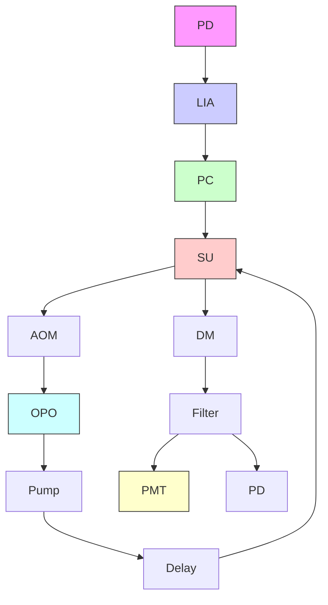
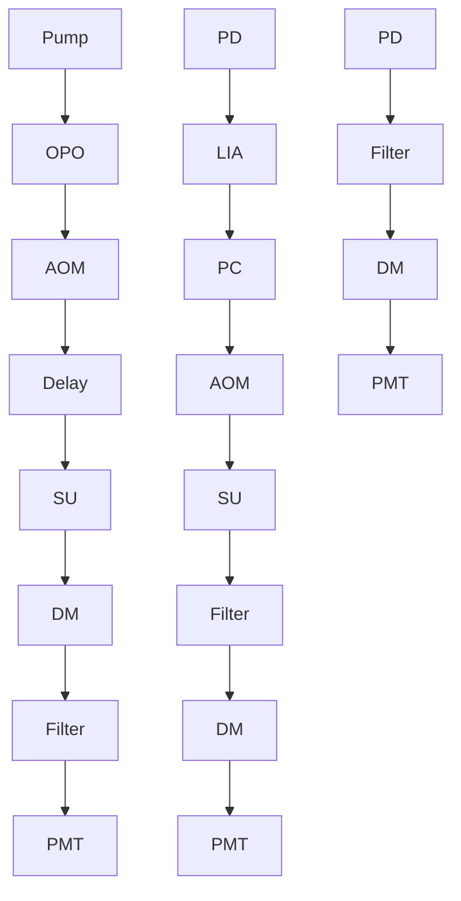

# Highly Sensitive Vibrational Imaging by Femtosecond Pulse Stimulated Raman Loss

Delong Zhang,†,§ Mikhail N. Slipchenko,‡,§ and Ji-Xin Cheng\*, †,‡

† Department of Chemistry and ‡ Weldon School of Biomedical Engineering, Purdue University, West Lafayette, Indiana 47907, United States

bS Supporting Information

ABSTRACT: Nonlinear vibrational imaging of live cells and organisms is demonstrated by detecting femtosecond pulse stimulated Raman loss. Femtosecond pulse excitation produced a 12 times larger stimulated Raman loss signal than picosecond pulse excitation. The large signal allowed real-time imaging of the conversion of deuterated palmitic acid into lipid droplets inside of live cells and three-dimensional sectioning of fat storage in live C. elegans. With the majority of the excitation power contributed by the Stokes beam in the 1.0 1.2 μm wavelength range, photodamage of biological samples was not observed.

SECTION: Biophysical Chemistry

flowchart

abel-free vibrational imaging is an attractive alternative to Lfluorescence imaging. Nonlinear vibrational microscopy based on coherent anti-Stokes Raman scattering (CARS) has found broad applications,13 especially in the study of lipid bodies and white matter based on the strong resonant signal from C H stretch vibration.4 Various methods, including polarization-sensitive detection,5 time-delayed detection,6 frequency modulation,7,8 and phase-sensitive heterodyne detection,9,10 have been developed for suppression of the nonresonant background. Despite appealing proof-of-principle demonstrations, the complexity of these advanced methods hinders their biological applications. Stimulated Raman scattering (SRS) microscopy provides a straightforward way to solve the nonresonant background problem .1114 The SRS process occurs simultaneously with CARS, represented by an intensity gain in the Stokes field and an intensity loss in the pump field. Unlike the CARS process where the signal is produced at a new frequency, the signal in SRS is generated at the frequency of incident beams that provide a local oscillator $\bf E _ { L O }$ to mix with the signal field Esig. Because only the vibrationally resonant signal is mixed with the local oscillator, such heterodyne detection removes the nonresonant background. Additionally, mixing with the intense local oscillator boosts the signal level. The SRS signal provides spectral information identical to that of spontaneous Raman and is linearly proportional to the molecular concentration. These advantages facilitate data interpretation and also enhance the detection sensitivity for low-concentration molecules.

SRS imaging was first demonstrated on polymer beads using amplified femtosecond (fs) pulses of low repetition rate. By making use of MHz frequency modulation to reject the low-frequency laser noise, SRS imaging on the order of a few tens of seconds per image of 512 512 pixels has been demonstrated.12,13 Very recently, video-rate SRS imaging has been realized by using a fast lock-in amplifier.15 Technically, SRS imaging can be implemented on a CARS microscope by adding a function generator, an optical modulator, a lock-in amplifier, and a photodiode detector. SRS microscopy has been applied to vibrational imaging of tablets and biomass based on fingerprint 16,17

Despite these advances, the detection sensitivity of SRS imaging can be much improved. So far, high-speed SRS imaging has been implemented with picosecond (ps) pulse excitation, where the signal level is limited by the relatively low peak power of ps pulses. Because the shot noise limit has been reached with mode-locked lasers,12 an effective way to improve the detection limit is to increase the SRS signal level by shorter pulse excitation. Historically, laser pulses of a few ps in duration were promoted for CARS imaging in order to increase the ratio of resonant signal to nonresonant background.18 However, such a requirement is eliminated in SRS microscopy because the SRS signal is free of the nonresonant background. Femtosecond pulse excitation has been used for background-free SRS spectroscopy.19,20 In this paper, we show theoretically and experimentally that, by using fs pulse excitation, the signal-to-noise ratio can be increased by 1 order of magnitude for high-speed, bond-selective imaging of isolated Raman bands, including the C H and C D stretch vibrations.

Received: April 15, 2011

Accepted: May 3, 2011

Published: May 09, 2011

We adopted a frequency domain model18 to evaluate the relationship between the coherent Raman scattering intensity and pulse width. In the frequency domain, the stimulated Raman loss (SRL) field arises from the induced third-order polarization written as

$$
\mathbf {P} ^ {(3)} \left(\omega_ {\text { sig }}\right) = \int_ {- \infty} ^ {+ \infty} d \omega_ {S} \int_ {- \infty} ^ {+ \infty} d \omega_ {S} ^ {\prime} \int_ {- \infty} ^ {+ \infty} d \omega_ {p} \chi_ {S R L} ^ {(3)} E _ {S} \left(\omega_ {S}\right) E _ {S} \left(\omega_ {S} ^ {\prime}\right)
$$

$$
\times E _ {\mathrm{p}} (\omega_ {\mathrm{p}}) \delta (\omega_ {\mathrm{S}} - \omega_ {\mathrm{S}} ^ {'} + \omega_ {\mathrm{p}} - \omega_ {\mathrm{sig}}) \tag {1}
$$

where $E _ { \mathrm { S } } ( \omega ) _ { S }$ and $E _ { \mathrm { p } } ( \omega ) _ { \mathrm { g } }$ p denote the Stokes and pump fields, respectively. The third-order susceptibility is written as

$$
\chi_ {\mathrm{SRL}} ^ {(3)} = \chi_ {\mathrm{NR}} ^ {(3)} + \frac {A}{\omega_ {\mathrm{S}} - (\omega_ {\mathrm{p}} - \Omega) + \mathrm{i} \Gamma} \tag {2}
$$

Here, $\chi _ { \mathrm { N R } } ^ { ( 3 ) }$ is the nonresonant contribution. The second term is the vibrationally resonant part $\chi _ { \mathrm { R } } ^ { ( 3 ) }$ , where A is a constant. The pump and Stokes fields are assumed to be two temporally overlapped pulses with Gaussian spectral profiles

$$
E _ {\mathrm{p}} (\omega_ {\mathrm{p}}) = \frac {A _ {\mathrm{p}}}{\Delta_ {\mathrm{p}} ^ {1 / 2}} \exp \left\{\frac {- 2 (\omega_ {\mathrm{p}} ^ {0} - \omega_ {\mathrm{p}}) ^ {2} \ln 2}{\Delta_ {\mathrm{p}} ^ {2}} \right\} \tag {3}
$$

$$
E _ {\mathrm{S}} (\omega_ {\mathrm{S}}) = \frac {A _ {\mathrm{S}}}{\Delta_ {\mathrm{S}} ^ {1 / 2}} \exp \left\{\frac {- 2 (\omega_ {\mathrm{S}} ^ {0} - \omega_ {\mathrm{S}}) ^ {2} \ln 2}{\Delta_ {\mathrm{S}} ^ {2}} \right\}
$$

Here, $\omega _ { \mathrm { p } } ^ { 0 }$ and ${ \upsilon } _ { S } ^ { 0 }$ are central frequencies of the pump and Stokes fields. $\bar { \Delta _ { \mathrm { p } } }$ and $\Delta _ { S }$ are the spectral full widths at half-maximum (fwhm) of the pump and Stokes fields, respectively. $A _ { \mathfrak { p } }$ and $A _ { S }$ are constants related to peak intensities. To simplify the calculation, we assume $\Delta _ { \mathrm { p } } = \Delta _ { \mathrm { S } } .$ . The prefactors in eq 3 ensure that the pulse energy is independent of the pulse spectral width. The heterodyne-detected SRL intensity at $\omega _ { \mathrm { s i g } }$ is written as

$$
\begin{array}{l} \Delta I _ {\mathrm{p}} (\omega_ {\mathrm{sig}}) \\ = 2 \int_ {- \infty} ^ {+ \infty} d \omega_ {\mathrm{S}} \int_ {- \infty} ^ {+ \infty} d \omega_ {\mathrm{S}} ^ {\prime} \int_ {- \infty} ^ {+ \infty} d \omega_ {\mathrm{p}} \int_ {- \infty} ^ {+ \infty} d \omega_ {\mathrm{p}} ^ {\prime} \operatorname{Im} (\chi_ {\mathrm{SRL}} ^ {(3)}) E _ {\mathrm{S}} (\omega_ {\mathrm{S}}) \\ \times E _ {\mathrm{S}} \left(\omega_ {\mathrm{S}} ^ {\prime}\right) E _ {\mathrm{p}} \left(\omega_ {\mathrm{p}}\right) E _ {\mathrm{p}} \left(\omega_ {\mathrm{p}} ^ {\prime}\right) \delta \left(\omega_ {\mathrm{S}} - \omega_ {\mathrm{S}} ^ {\prime} + \omega_ {\mathrm{p}} - \omega_ {\mathrm{sig}}\right) \delta \left(\omega_ {\mathrm{sig}} - \omega_ {\mathrm{p}} ^ {\prime}\right) \tag {4} \\ \end{array}
$$

Here, the second delta function represents the requirement for mixing between the local oscillator and the SRL field.

On the basis of the above theoretical model, we have computed the relationship between the pulse spectral width and the spectrally integrated SRL intensity

$$
I _ {\mathrm{SRL}} = - \int_ {- \infty} ^ {\infty} \Delta I _ {\mathrm{p}} (\omega_ {\mathrm{sig}}) \mathrm{d} \omega_ {\mathrm{sig}} \tag {5}
$$

Our calculation (Figure 1) indicates that $\Delta I _ { \mathrm { p } } ( \omega _ { \mathrm { s i g } } = \omega _ { \mathrm { p } } ^ { 0 } )$ strongly depends on the Raman line half-width and the pulse spectral width. For $\Gamma = 5 \mathrm { c m } ^ { - 1 } , \Delta I _ { \mathrm { p } }$ is amplified 6 times when the spectral width increases from 1 to 20 cm1 and becomes saturated thereafter. However, for $\Gamma = 2 5 \mathrm { c m } ^ { - 1 } , \Delta I _ { \mathrm { p } }$ is amplified 30 times when the pulse spectral width increases from 1 ( 14 ps) to $1 2 0 ~ \mathrm { { c m } ^ { - 1 } }$ ( 120 fs). The same results hold for stimulated Raman gain (SRG). Therefore, by use of shorter pulses, we expect to increase the SRL signal level by 1 order of magnitude at the same excitation energy.

A practical challenge of using fs pulse excitation is the increased photodamage potential associated with the high peak power of fs pulses. To minimize the multiphoton absorptioninduced photodamage, we adopted a SRL configuration in which most excitation power was carried by the Stokes beam in the 1.0 1.2 μm wavelength range. The SRL setup is shown in Figure 2. A Ti:Sapphire laser (Chameleon Vision, Coherent) with up to 4 W (80 MHz, 140 fs pulse width) pumps an optical parametric oscillator (OPO, Chameleon Compact, Angewandte Physik & Elektronik GmbH), providing the pump beam tunable from 680 to 1080 nm and the Stokes beam tunable from 1.0 to 1.6 μm. The pump and Stokes pulse trains were collinearly overlapped and directed into a laser-scanning microscope (FV300, Olympus). A 60 water-immersion objective lens (UPlanSApo, Olympus) was used to focus the laser into a sample. To minimize the thermal lensing effect, another waterimmersion objective lens (LUMFI, Olympus) of 1.10 numerical aperture (NA) was used to collect the signal in a forward direction. The Stokes beam intensity was modulated by an acousto-optic modulator (15180 1.06-LTD-GAP, Gooch & Housego) with 70% modulation depth. The shot noise limit was reached by modulating the Stokes beam intensity at 5.4 MHz (Figure 2). The SRL signals were detected by a photodiode (818- BB-40, Newport) and then sent to a fast lock-in amplifier (HF2LI, Zurich Instrument), which has a time constant as small as 800 ns. The lateral and axial resolutions of our SRS microscope are about 0.42 and 1.01 μm, respectively, measured from the X Z intensity profile of 200 nm polystyrene beads (Figure S1, Supporting Information).

line chart

| Spectral FWHM (cm⁻¹) | Γ = 5 cm⁻¹ | Γ = 25 cm⁻¹ |
| --------------------- | ---------- | ----------- |
| 0                     | 0          | 0           |
| 20                    | ~6         | ~15         |
| 40                    | ~7         | ~22         |
| 60                    | ~7         | ~26         |
| 80                    | ~7         | ~28         |
| 100                   | ~7         | ~30         |
| 120                   | ~7         | ~31         |

Figure 1. Calculated SRS intensities for narrow $\Gamma = 5 \mathrm { c m } ^ { - 1 }$ and broad $\Gamma = 2 5 ~ \mathrm { c m } ^ { - 1 }$ Raman transitions. The intensities are normalized by the values at the pulse spectral width of $1 . 0 ~ \mathrm { c m } ^ { - 1 }$ . Γ is the Raman line halfwidth.

To confirm the theoretical results, we compared the SRL intensity from C H stretching of olive oil generated by 5 ps and 200 fs laser pulses. The 5 ps laser system for SRS imaging was described in ref 16. We used 6 mW for the pump and 6 mW for the Stokes at the sample. The intensity profiles below the SRL images (Figure 3) show that the signal level increased more than 12 times when the excitation was switched from 5 ps to 200 fs pulsed lasers. Meanwhile, the noise level remained the same.

Using the fs-laser-based SRL microscope, we explored the uptake of palmitic acid and its intracellular fate in Chinese hamster ovary (CHO) cells. Excess palmitic acids have been shown to induce lipotoxicity in mammalian cells.21 However, direct visualization of the fatty acids was not accessible with existing imaging tools. To selectively detect the molecule by SRL, we used deuterated palmitic acid- $d _ { 3 1 }$ (Aldrich), which gives an isolated Raman band at 2110 cm1 corresponding to the C D bond stretch vibration (Figure 4A). The deuterated compound was clearly visualized in lipid droplets (LDs) and also in the cellular membranes (Figure 4C,E). The C D signal from LDs comprised $1 9 \pm 5 \%$ of the total intensity in the group treated with palmitic acid alone, whereas the LD signal comprised 32 ( 4% of total intensity in the group treated by both palmitic acid and methyl oleate. These results provide visual evidence that oleic acid facilitates the conversion of palmitic acid into lipid bodies.21 Previously, picosecond SRS was used to image cellular uptake of fatty acids, but only the LDs were detected.12 The increased sensitivity by fs pulse excitation allowed us to detect the fatty acids in cell membranes. We also imaged the same cells based on the SRL signal from C H vibration (Figure 4F I). It was found that the C D-rich droplets were overlapped with the C H-abundant droplets. In the control cells and the oleatetreated cells, the SRL signals at the C D vibration frequency were not detected (Figure 4B,D), which confirmed the bondselective imaging capability of the SRL setup.

flowchart

Figure 2. Femtosecond pulse stimulated Raman loss imaging system. The top left box is the electronic connection, where the solid line indicates electronic control and the dashed line is data flow. The inset shows the shot noise limit detection at megahertz modulation. The PD and PMT are used for forward SRL and backward two-photon fluorescence detection, respectively. LIA: lock-in amplifier. AOM: acousto-optic modulator. PD: photodiode. SU: scanning unit. DM: dichroic mirror. PMT: photomultiplier tube.

line chart

| Distance (pixels) | Signal (μV) |
| ----------------- | ----------- |
| 0                 | ~0          |
| 100               | ~0          |
| 200               | ~0          |
| 300               | ~0          |
| 400               | ~0          |
| 500               | ~0          |

Figure 3. Experimental comparison of SRL signal levels between picosecond and femtosecond excitation. (A) SRL image of $\mathrm { C - H }$ stretching vibration at the interface of olive oil and air, with 5 ps excitation. (B) SRL image of the same sample with 200 fs pulse excitation. The same power of 6 mW $( 1 . 1 \mathrm { \ M W / c m } ^ { 2 } )$ at the sample was used for both pump and Stokes fields. Shown below each image is the intensity profile along the dashed line. Bar: 20 μm.

As another important application, we demonstrated SRL imaging of fat storage in live Caenorhabditis elegans (C. elegans). As a label-free imaging modality, CARS microscopy has been employed to selectively visualize LDs in $C . \ e l e g a n s . ^ { 2 2 , 2 3 }$ More recently, SRS microscopy has been used to map lipids in the worm but without 3D sectioning. $^ { 2 4 } \mathrm { B y }$ using an objective lens of 1.2 NA, we obtained 3D SRL images of a wild-type C. elegans using the signal from the C H bond (Figure ${ \mathrm { s A } } ;$ Movies S1 and S2, Supporting Information). Such 3D sectioning is critical to distinguish the fat stored in LDs from the membrane lipids. As an additional advantage, our system with fs pulse excitation is highly compatible with other modalities such as two-photon excitation fluorescence (TPEF). This advantage allows simultaneous forward SRL imaging of the lipid and backward TPEF imaging of autofluorescence in C. elegans. As shown in Figure 5B and Movie S3 (Supporting Information), the autofluorescence arose from the small intestine and some particles that were not overlapped with the LDs.

In our setup, most excitation power is carried by the Stokes beam at a wavelength above $1 . 0 \mu \mathrm { m } ,$ , with the pump beam power being as low as a few mW at the sample. Thus, photodamage to cells is not expected. To explore the phototoxicity, we determined the power threshold of cell damage at different wavelengths (Figure 6). We used plasma membrane blebbing25 as an indicator of cell damage. At the wavelengths of 680, 830, 880, and 1000 nm, the power density at the sample to cause CHO cell membrane blebbing was found to be 1.6, 8.9, 10.5, and 15.8 $\mathrm { M W } / { \mathrm { c m } } ^ { 2 }$ , respectively. At 1100 nm, we did not observe photodamage with the maximum power $( 9 . 5 \mathrm { M W } / \mathrm { c m } ^ { 2 }$ at sample) provided by the OPO. In our SRL imaging experiment, the maximum power density used was $2 . 9 \ \mathrm { M W } / \mathrm { c m } ^ { \widehat { 2 } }$ for 830 nm, 5.8 $\mathrm { M W } / { \mathrm { c m } } ^ { 2 }$ for 1000 nm, and $7 . 8 \mathrm { M W / c m } ^ { 2 }$ for 1100 nm, which was far below the damage threshold. Accordingly, no damage was observed during the imaging procedures.

Although the resolution of fs pulses is known to be insufficient for studying the fingerprint region, the spectral resolution of our setup is sufficient for imaging isolated Raman bands such as the C D stretch band at 2100 cm1 . We examined the spectral resolution of our setup using the C H stretch bands of poly-(lactic-co-glycolic acid) $\left( \mathrm { P L G A } \right)$ . The Lorenzian fit of the fs SRL spectrum of the 2960 $\mathrm { { \dot { c } m } } ^ { - 1 }$ band of PLGA (Figure S2, Supporting Information) produced a fwhm of about 100 cm Such a value is smaller than the calculated fwhm $( 1 3 6 ~ \mathrm { c m } ^ { - 1 } )$ .) of the SRL spectrum given by eq 4 based on the pulse widths of the pump field (140 fs), the Stokes field (200 fs), and the fwhm of the Raman line $( 2 6 \thinspace { \mathrm { c m } } ^ { - 1 } )$ . The enhanced spectral resolution is possibly due to the pulse chirping caused by the optics inside of the microscope. Spectral focusing of fs pulses can be achieved by introduction of chirping in the optical path.26,27

  
Figure 4. SRL imaging of deuterated lipids in live CHO cells. (A) Molecular structure and Raman spectrum of palmitic acid $\cdot d _ { 3 1 } . \left( \mathrm { B - I } \right)$ SRL images of CD stretch vibration and CH stretch vibration. (JM) Transmission images in accordance with each column. Columns 14: control, deuterated palmitic acid alone, oleate alone, and deuterated palmitic acid oleate. The cells were treated for 7 h. All images were acquired at the speed of 4 μs per pixel. The pump and Stokes powers at the sample were 10 and 40 mW, respectively. The pump wavelength was 830 nm. The Stokes wavelength was 1090 nm for $\mathrm { C - H }$ and 1005 nm for C D. Bar: 5 μm.

  
Figure 5. SRL imaging of fat storage in C. elegans. Depth-resolved SRL images of a live C. elegans based on the signal from the C H stretching band (A) and simultaneous TPEF images of autofluorescence (B). A total of 50 frames were taken at the axial step of 1.0 μm. The images of 512 512 pixels were acquired at the speed of 2 μs per pixel. The same power as that in Figure 4 was used. Bar: 20 μm. Videos of the 3D rendering are available in Supporting Information (Movie S1 and S2).

natural_image

Microscopic view of cellular structures with visible nuclei and cytoplasmic details (no text or labels)

natural_image

Microscopic view of cellular structures with red arrows pointing to specific features (no text or symbols present)

C  

bar chart

| Wavelength (nm) | Damage (MW/cm²) | No Damage (MW/cm²) |
|---|---|---|
| 680 | 21.5 | 1.5 |
| 700 | 2.5 | 0.0 |
| 830 | 12.0 | 8.8 |
| 890 | 12.0 | 10.4 |
| 1000 | 18.0 | 15.8 |
| 1100 | 0.0 | 9.4 |
The chart displays the laser intensity in MW/cm² for two conditions: 'Damage' and 'No Damage', with each bar labeled by its corresponding wavelength in nm. The y-axis is labeled 'Laser Int. (MW/cm²)'. Error bars are present on the bars, but no explicit numerical values are provided in the image.

Figure 6. Characterization of photodamage as a function of fs laser wavelength. (A) Transmission image of nondamaged cells. (B) Damaged cells indicated by blebbings of the plasma membranes (arrows). Bar: 10 μm. (C) Damage threshold at different laser wavelengths. In all experiments, CHO cells were continuously scanned for 2 min.

To explore the effect of pulse broadening on the SRL signal level, we measured the SRL signal from oil as a function of temporal overlap of the two pulsed beams and obtained a fwhm of 480 fs. This result indicates some broadening of the laser pulses at the sample. Nevertheless, such broadening does not reduce the SRL signal according to Figure 1. Theoretically, transform-limited 1 ps pulses are optimal for coherent Raman imaging. Such pulses are however difficult to produce in solidstate lasers. In this work, the fs pulses not only produce a strong SRS signal but also facilitate the coupling of SRS with other NLO modalities such as two-photon fluorescence and secondharmonic generation. Our study shows that SRS imaging can be implemented on a widely used multiphoton microscope platform. Importantly, the photodamage is negligible in the SRL configuration where most excitation power is carried by the Stokes beam in the 1.0 1.2 μm region. These results are expected to expedite the biological applications of SRS microscopy.

To summarize, we have shown a new platform for real-time vibrational imaging. Compared to existing SRS microscopes with ps laser excitation, fs excitation increases the signal intensity by 1 order of magnitude. We have compared the new setup with a SRS system pumped with a 5 ps laser at the same power and found a 12-fold increase in the signal-tonoise ratio for imaging C H bonds. Though we focused on C D and C H bonds, the broad tuning range of the OPO (from 1.0 to 1.6 μm) also permits SRL imaging of O D, S H, N H, and O H bonds based on their stretching vibrations. Because the majority of the excitation power is carried by the Stokes beam above 1.0 μm in wavelength, photodamage to the sample is negligible. As an additional advantage, the fspulse-based SRL modality is highly compatible with other NLO modalities including TPEF, which facilitates multimodal imaging of complex biological tissues. These advances open up new opportunities for label-free molecular imaging of live cells and organisms using signals from molecular vibration.

## EXPERIMENTAL SECTION

Live Cell Imaging. Deuterated palmitic acid was dissolved in DMSO and added to the cell culture medium at a final concentration of 100 μM. After 7 h of incubation, the CHO cells were directly imaged with the SRL microscope. To study the conversion of the deuterated palmitic acid, 10 sectionings of CHO cell of each group were used for analysis.

Live C. elegans Imaging. Wild-type C. elegans were transferred from a Petri plate to a thin layer of agar gel with a homemade worm-picker. The worms were placed on top of the agar gel and anesthetized by 100 mM sodium azide solution. The sample in 340 μm thick agar gel was sandwiched between two coverslips and was imaged immediately.

## ASSOCIATED CONTENT

bS Supporting Information. Spatial resolution of the fs SRL microscope (Figure S1), SRL spectrum of the PLGA film (Figure S2), SRL movies (Movies S1 and S2), including depth sectioning, 3D rendering of C. elegans at the C H vibration, and 3D rendering of simultaneous TPEF imaging (Movie S3). This material is available free of charge via the Internet at http://pubs.acs.org.

## ’AUTHOR INFORMATION

Corresponding Author

\*E-mail: jcheng@purdue.edu.

Author Contributions

§ Equal contributions.

## ’ACKNOWLEDGMENT

This project was supported by NSF CBET-0828832 and NIH R01 EB007243 to J.-X.C. We thank Dr. Chang-Deng Hu for providing the C. elegans samples and Shuhua Yue and Junjie Li for their help in the experiments.

## REFERENCES

(1) M€uller, M.; Zumbusch, A. Coherent Anti-Stokes Raman Scattering Microscopy. ChemPhysChem. 2007, 8, 2156–2170.  
(2) Cheng, J. X. Coherent Anti-Stokes Raman Scattering Microscopy, Appl. Spectrosc, 2007, 61. 197A206A.  
(3) Evans, C. L.; Xie, X. S. Coherent Anti-Stokes Raman Scattering Microscopy: Chemically Selective Imaging for Biology and Medicine. Annu. Rev. Anal. Chem. 2008, 1, 883–909.  
(4) Le, T. T.; Yue, S.; Cheng, J. X. Shedding New Light on Lipid Biology by CARS Microscopy. J. Lipid Res. 2010, 51, 3091–3102.  
(5) Cheng, J. X.; Book, L. D.; Xie, X. S. Polarization Coherent Anti-Stokes Raman Scattering Microscopy. Opt. Lett. 2001, 26, 1341–1343.  
(6) Volkmer, A.; Book, L. D.; Xie, X. S. Time-Resolved Coherent Anti-Stokes Raman Scattering Microscopy: Imaging Based on Raman Free Induction Decay. Appl. Phys. Lett. 2002, 80, 1505–1507.  
(7) Ganikhanov, F.; Evans, C. L.; Saar, B. G.; Xie, X. S. High Sensitivity Vibrational Imaging with Frequency Modulation Coherent Anti-Stokes Raman Scattering (FM-CARS) Microscopy. Opt. Lett. 2006, 31, 1872–1874.  
(8) Saar, B. G.; Holtom, G. R.; Freudiger, C. W.; Ackermann, C.; Hill, W.; Xie, X. S. Intracavity Wavelength Modulation of an Optical Parametric Oscillator for Coherent Raman Microscopy. Opt. Express. 2009, 17, 12532–12539.  
(9) Potma, E. O.; Evans, C. L.; Xie, X. S. Heterodyne Coherent Anti-Stokes Raman Scattering (CARS) Imaging. Opt. Lett. 2006, 31, 241–243.  
(10) Jurna, M.; Korterik, J. P.; Otto, C.; Herek, J. L.; Offerhaus, H. L. Background Free CARS Imaging by Phase Sensitive Heterodyne CARS. Opt. Express. 2008, 16, 15863–15869.  
(11) Ploetz, E.; Laimgruber, S.; Berner, S.; Zinth, W.; Gilch, P. Femtosecond Stimulated Raman Microscopy. Appl. Phys. B: Laser Opt. 2007, 87, 389–393.  
(12) Freudiger, C. W.; Min, W.; Saar, B. G.; Lu, S.; Holtom, G. R.; He, C.; Tsai, J. C.; Kang, J. X.; Xie, X. S. Label-Free Biomedical Imaging with High Sensitivity by Stimulated Raman Scattering Microscopy. Science 2008, 322, 1857–1861.  
(13) Nandakumar, P.; Kovalev, A.; Volkmer, A. Vibrational Imaging Based on Stimulated Raman Scattering Microscopy. New J. Phys. 2009, 11, 033026.  
(14) Ozeki, Y.; Dake, F.; Kajiyama, S.; Fukui, K.; Itoh, K. Analysis and Experimental Assessment of the Sensitivity of Stimulated Raman Scattering Microscopy. Optics Express. 2009, 17, 3651–3658.  
(15) Saar, B. G.; Freudiger, C. W.; Reichman, J.; Stanley, C. M.; Holtom, G. R.; Xie, X. S. Video-Rate Molecular Imaging in Vivo with Stimulated Raman Scattering. Science 2010, 330, 1368.  
(16) Slipchenko, M. N.; Chen, H.; Ely, D. R.; Jung, Y.; Carvajal, M. T.; Cheng, J. X. High-Speed and High-Resolution Vibrational Imaging of Tablets by EPI-Detected Stimulated Raman Scattering Microscopy. Analyst. 2010, 135, 2613–2619.  
(17) Saar, B. G.; Zeng, Y.; Freudiger, C. W.; Liu, Y.-S.; Himmel, M. E.; Xie, X. S.; Ding, S.-Y. Label-Free, Real-Time Monitoring of Biomass Processing with Stimulated Raman Scattering Microscopy. Angew. Chem., Int. Ed. 2010, 49, 5476–5479.  
(18) Cheng, J. X.; Volkmer, A.; Book, L. D.; Xie, X. S. An EPI-Detected Coherent Anti-Stokes Raman Scattering (E-CARS) Microscope with High Spectral Resolution and High Sensitivity. J. Phys. Chem. B 2001, 105, 1277–1280.  
(19) McCamant, D. W.; Kukura, P.; Mathies, R. A. Femtosecond Broadband Stimulated Raman: A New Approach for High-Performance Vibrational Spectroscopy. Appl. Spectrosc. 2003, 57, 1317–1323.  
(20) Kukura, P.; McCamant, D. W.; Mathies, R. A. Femtosecond Stimulated Raman Spectroscopy. Annu. Rev. Phys. Chem. 2007, 58, 461–488.  
(21) Listenberger, L. L.; Han, X.; Lewis, S. E.; Cases, S.; Farese, R. V.; Ory, D. S.; Schaffer, J. E. Triglyceride Accumulation Protects against Fatty Acid-Induced Lipotoxicity. Proc. Natl. Acad. Sci. U.S.A. 2003, 100, 3077.  
(22) Le, T. T.; Duren, H. M.; Slipchenko, M. N.; Hu, C. D.; Cheng, J. X. Label-Free Quantitative Analysis of Lipid Metabolism in Living Caenorhabditis Elegans. J. Lipid Res. 2010, 51, 672.  
(23) Yen, K.; Le, T. T.; Bansal, A.; Narasimhan, S. D.; Cheng, J. X.; Tissenbaum, H. A.; Melov, S. A Comparative Study of Fat Storage Quantitation in Nematode Caenorhabditis Elegans Using Label and Label-Free Methods. PloS One 2010, 5, 387–398.  
(24) Wang, M. C., Min, W., Freudiger, C. W., Ruvkun, G., Xie, X. S., RNAi Screening for Fat Regulatory Genes with SRS Microscopy. Nat. Methods. 2011.  
(25) Fu, Y.; Wang, H.; Shi, R.; Cheng, J. X. Characterization of Photodamage in Coherent Anti-Stokes Raman Scattering Microscopy. Opt. Express. 2006, 14, 3942–3951.  
(26) Hellerer, T.; Enejder, A. M. K.; Zumbusch, A. Spectral Focusing: High Spectral Resolution Spectroscopy with Broad-Bandwidth Laser Pulses. Appl. Phys. Lett. 2004, 85, 25–27.  
(27) Pegoraro, A. F.; Ridsdale, A.; Moffatt, D. J.; Jia, Y.; Pezacki, J. P.; Stolow, A. Optimally Chirped Multimodal CARS Microscopy Based on a Single Ti:Sapphire Oscillator. Opt. Express. 2009, 17, 2984–2996.