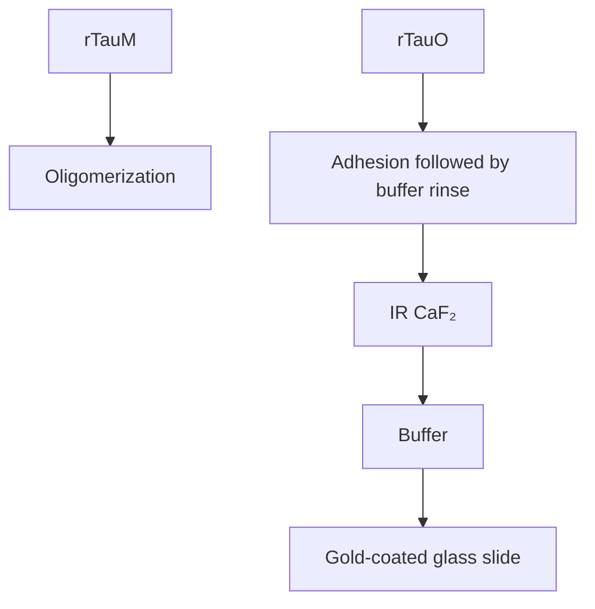

# IR-AMES uncovers structure and composition of Alzheimer’s tau oligomers

Qing Xia1,2, Qingbo Wang3,4, Danchen Jia1,2, Dashan Dong1,2, Mingsheng Li1,2, Eliana Sherman3,4, Jianpeng Ao1,2, Qian Ren5 , Huan Bao5\*, Lulu Jiang3,4\* and Ji-Xin Cheng1,2,6,7\*

1 Department of Electrical and Computer Engineering, Boston University, Boston, Massachusetts 02215, United States;  
2 Photonics Center, Boston University, Boston, Massachusetts 02215, United States;  
3 Department of Neuroscience, University of Virginia School of Medicine, Charlottesville, Virginia 22908, United States;  
4 Center for Brain Immunology and Glia (BIG), University of Virginia School of Medicine, Charlottesville, Virginia 22908, United States;  
5 Department of Molecular Physiology and Biological Physics, University of Virginia, Charlottesville, Virginia 22903, United States;  
6 Department of Chemistry, Boston University, Boston, Massachusetts 02215, United States;  
7 Department of Biomedical Engineering, Boston University, Boston, Massachusetts 02215, United States;  
Corresponding authors: jxcheng@bu.edu (Ji-Xin Cheng), jiang.lulu@virginia.edu (Lulu Jiang), and pyn4sg@virginia.edu (Huan Bao).

## Summary paragraph

Tau misfolding and aggregation are central to cognitive decline in Alzheimer’s disease and related neurodegenerative disorders1-3. Although soluble tau oligomers are implicated as primary toxic species4-6, the structural and compositional determinants of their toxicity remain inaccessible at the single oligomer level. Here we introduce infrared absorbance-modulated evanescent scattering (IR-AMES), a label-free single-molecule spectroscopic imaging approach that photothermally encodes mid-infrared vibrational fingerprints into evanescent scattering from individual biomolecular assemblies under native aqueous conditions. Applying IR-AMES to recombinant human tau resolves random-coil-dominated monomers and captures the emergence of structurally heterogeneous oligomers. Analysis of tau oligomers from postmortem Alzheimer’s disease brains uncovers enrichment of antiparallel β-sheet structures and RNA components, features that are largely obscured in ensemble-averaged measurements. Using lipid nanodiscs as a defined membrane mimic, we further show that pathological tau oligomers exhibit enhanced interactions with anionic membranes. Together, these findings establish a link between structure and neurotoxicity of tau oligomers, and position IR-AMES as a platform for uncovering structure–function relationships in complex biomolecular assemblies.

## Main

Tau misfolding and aggregation are pathological hallmarks of Alzheimer’s disease (AD) and related dementias and are closely linked to cognitive decline1-3. Although fibrillar tau underlies neuropathological staging, increasing evidence implicates soluble tau oligomers as the primary neurotoxic species4-6. These oligomers are structurally and compositionally heterogeneous, and their toxicity varies across assemblies. Thus far, the molecular features that distinguish pathogenic oligomers from less harmful species remain to be clarified. Although cryo-electron microscopy7-10 and nuclear magnetic resonance11 have elucidated atomic structures of tau fibrils, these methods require purified, homogeneous samples and are not well suited to transient, heterogeneous oligomers in aqueous environments. Optical imaging methods have enabled detection of individual protein aggregates, yet none allows label-free chemical fingerprinting of single oligomers in solution. Fluorescence imaging achieves single-molecule sensitivity but requires extrinsic labels and lacks intrinsic structural specificity12-15. Surface-enhanced vibrational spectroscopies provide single-molecule chemical information, yet often suffer from hotspot-dependent variability16-18. Near-field infrared (IR) nanospectroscopy resolves protein secondary structures with nanoscale resolution, but measurements are typically performed on fibrils or dried oligomers and have limited throughput19-21. Far-field interferometric scattering achieves exceptional sensitivity and throughput for detecting single proteins in solution but lacks chemical contrast22-25, leaving the structure and composition of individual oligomers unresolved.

Here, we introduce a label-free single-molecule spectroscopic imaging technique, termed infrared absorbance-modulated evanescent scattering (IR-AMES), which encodes mid-infrared (mid-IR) vibrational information into evanescent scattering and enables vibrational fingerprinting of single proteins under native aqueous conditions. IR-AMES (Fig. 1a) builds on the mid-infrared photothermal effect26, 27: IR excitation of molecular vibrations (e.g., amide C=O stretching) generates local heating that produces a transient temperature increase (ΔT), which leads to thermal expansion (Δr), and refractive index decrease (Δn) of the molecule. These perturbations are detected in a pump-probe scheme as a modulation of the evanescent scattering intensity (ΔI), which depends on the local probe- and pump-field intensities, while the detection sensitivity is determined by the modulation depth (ΔI/I). Earlier efforts28, 29 using high-energy optical parametric oscillator (OPO) mid-IR sources and interferometric enhancement pushed mid-IR photothermal sensitivity to single \~100-nm viruses in air. However, the conventional coaxial photothermal detection (Fig. 1b, right) faces an intrinsic physical limit to its sensitivity: $\Delta r$ and $\Delta n$ have opposite contributions to scattering intensity modulation29, reducing the overall modulation depth. Thus, breaking the single-molecule barrier requires a more efficient photothermal detection strategy.


<details>
<summary>text_image</summary>

a
Mid-IR pump
900–1,800 cm⁻¹
Excited state
Amide
C
N
H
Ground state
Heat
Evanescent wave
z
Ei
T
r
n
Protein
Gold-coated glass slide
|E|^2
Visible probe
450 nm
Scattering
Total-internal
reflection
Camera
</details>


<details>
<summary>text_image</summary>

b
Orthogonal detection
Ei
IR
|ΔEs|
|Es|
ES(r)↓ ES(n)↓
Coaxial detection
Ei
IR
|ΔEs|
|Es|
ES(r)↑ ES(n)↓
</details>


<details>
<summary>text_image</summary>

IR off
- IR on
= IR-encoded scattering
Hyperspectral imaging
IR wavenumber scan
Parallel
β-sheet
Random
coil
α-helix
β-turn
Antiparallel
β-sheet
RNA
Lipid
1,580
Wavenumber (cm⁻¹)
1,760
</details>


<details>
<summary>natural_image</summary>

Fluorescence microscopy image showing PMMA-treated cells with a scale bar and color intensity legend (×10⁴), no readable text or symbols beyond labels.
</details>


<details>
<summary>natural_image</summary>

Fluorescence microscopy image showing PMMA-treated cells with 75 nm scale bar (no text or symbols beyond label)
</details>


<details>
<summary>text_image</summary>

f 50 nm PMMA: C=O
x y z ×10³
</details>


<details>
<summary>line chart</summary>

| Wavenumber (cm⁻¹) | Intensity (a.u.) ×10³ |
| ----------------- | --------------------- |
| 1680              | 0                     |
| 1720              | 1                     |
| 1760              | 0                     |
</details>


<details>
<summary>scatterplot</summary>

| Effective diameter (nm) | C=O intensity (a.u.) |
| ----------------------- | -------------------- |
| 20                      | 100                  |
| 50                      | 1000                 |
| 75                      | 10000                |
</details>


<details>
<summary>line chart</summary>

| Distance (μm) | Normalized intensity (FWHM y) | Normalized intensity (FWHM x) |
| ------------- | ----------------------------- | ----------------------------- |
| 0.0           | ~0                            | ~0                            |
| 0.5           | ~1.0                          | ~1.0                          |
| 1.0           | ~0                            | ~0                            |
</details>

Fig. 1 IR-AMES concept, implementation and performance. a, Schematic of IR-AMES. Mid-IR excitation of molecular vibrations (e.g., amide modes in proteins) induces non-radiative relaxation, generating localized heating that transiently modulates the particle radius (??) and refractive index (??), thereby perturbing the scattered field from the sample $( E _ { s } )$ . A visible probe undergoes total internal reflection (TIR) at a gold-coated glass substrate to generate a surface-confined evanescent incident field $( E _ { i } )$ . A pulsed mid-IR pump is introduced at an oblique angle to excite molecular vibrations. Evanescent scattering is collected orthogonally for wide-field detection. ??: temperature. b, Conventional photothermal detection uses a coaxial geometry (right), where photothermal induced scattering field cancellation limits modulation depth $( \frac { | \Delta E _ { s } | } { | E _ { s } | } )$ In contrast, IR-AMES employs an orthogonal detection scheme of TIRilluminated evanescent scattering (left), which enhances the relative scattering modulation. c, Imageprocessing workflow. IR-encoded scattering images are generated by subtracting IR-off from IR-on frames. IR wavenumber scanning produces hyperspectral stacks for single-particle compositional and structural

analysis. d–f, IR-AMES images of 100-nm (d), 75-nm (e) and 50-nm (f) PMMA particles integrated over the C=O band $( 1 , 7 1 5 { - } 1 , 7 5 5 \ \mathrm { c m } ^ { - 1 } )$ . Scale bars: 1 µm. g, Representative single-particle C=O stretching spectra corresponding to particles marked by white arrows in d–f. h, IR-AMES C=O signal intensity versus effective particle diameter (d) under the evanescent field. Data points represent mean values, and error bars indicate the full width at half maximum (FWHM) of Gaussian fits to the corresponding intensity distributions in Supplementary Fig. 8. i, Spatial resolution of IR-AMES, quantified by the FWHM obtained from the white dashed cross in f. Solid lines: Gaussian fits.

In IR-AMES, the sensitivity is dramatically boosted by an orthogonal detection scheme with evanescent-field–enhanced readout (Fig. 1b, left, details in Supplementary Note 1). First, an IRreflective gold-coated substrate with 45° p-polarized mid-IR incidence doubles the interfacial pump field intensity (Supplementary Fig. 1). Second, a surface-confined evanescent probe field enhances the interferometric scattering by \~6.5-fold (Supplementary Fig. 2). Third, the horizontally propagating evanescent wave allows the scattering to be collected orthogonally (Supplementary Fig. 3). Together, this scheme eliminates cancellation between the two photothermal contributions (Fig. 1b, left) and boosts the modulation depth over coaxial detection (Fig. 1b, right). These advances enable IR-AMES to detect a single protein in solution and achieve high-throughput vibrational fingerprinting by excitation with a rapidly tunable mid-IR quantum-cascade laser (QCL) and camera-based widefield detection. In the following, we first benchmark IR-AMES with polymer nanoparticles to quantify the modulation depth, spatial resolution, and dependence of the photothermal signal on particle size. We then apply IR-AMES to individual immunoglobulin M (IgM) used as a model system of single biomolecular oligomers, resolving discrete molecular counts and revealing hydration-dependent conformational heterogeneity at the single-molecule level. Extending IR-AMES to tau, we first map the structural heterogeneity that emerges during recombinant tau oligomerization. Further analysis of human-derived tau oligomers and fibrils lead to the identification of antiparallel β-sheet structures and RNA molecules enriched in AD tau oligomers. These unique molecular signatures are accompanied by increased hydrophobicity and neuronal toxicity. Finally, by probing tau interactions with lipid nanodiscs as a defined membrane mimic, we show that AD tau oligomers exhibit an enhanced anionic membrane interaction associated with destabilization of antiparallel β-sheet structures. Together, these findings provide a link between nanoscale molecular structure, biomolecular membrane interaction, and pathogenic function in tau-mediated neurodegeneration.

## IR-AMES setup and benchmarks.

A schematic of IR-AMES setup is shown in Fig. 1a (Details in Supplementary Fig. 4 and Methods) To implement the orthogonal photothermal detection, a visible beam is directed onto a gold-coated glass slide under total internal reflection (TIR) using an oil-immersion objective. This configuration generates a laterally propagating evanescent field that enhances the scattering from molecules at the interface, while a spatial barrier blocks the reflected beam so that only the scattered light is collected orthogonally onto a camera. To encode vibrational spectra, a pulsed mid-IR beam illuminates the sample at an oblique angle.

The reflective gold film doubles the local IR excitation while minimizing unwanted heating of the immersion oil. The mid-IR pump, visible probe, and camera are electronically synchronized (Supplementary Fig. 5) to ensure consistent acquisitions of IR-on and IR-off images. The IR absorption induces transient photothermal modulation of the scattering signal, and subtraction of IR-on and IR-off frames produces an IR-encoded scattering image. By scanning the IR wavenumber, a hyperspectral image stack is generated, from which vibrational fingerprints containing molecular composition and structure signatures are obtained (Fig. 1c and Supplementary Fig. 6).

We characterized the photothermal signal enhancement in the orthogonal detection geometry using 500-nm poly(methyl methacrylate) (PMMA) beads, a standard benchmark used in coaxial scatteringbased photothermal microscopy owing to their strong C=O vibrational resonance. These particles show strong resonant contrast at $1 { , } 7 2 8 \mathrm { c m } ^ { - 1 }$ , with negligible off-resonance signal (Extended Data Fig. 1a). The photothermal modulation depth reaches \~22.7% for a single bead in IR-AMES (Extended Data Fig. 1b), whereas coaxial photothermal detection produces only ${ \sim } 0 . 2 \% ^ { 3 0 }$ . This >100-fold sensitivity enhancement enables single-shot chemical-bond imaging at 100 Hz, with the potential extension to kilohertz frame rates using a high-speed camera31. The modulation depth increases linearly with IR power (Supplementary Fig. 7), confirming minimal nonlinear thermal artifacts. Despite operating with a QCL delivering 10-fold lower pulse energy than an IR OPO and a camera 6-fold slower in frame rate, IR-AMES achieves \~60- fold faster chemical-bond imaging than earlier OPO-based interferometric mid-IR photothermal implementations28 (Supplementary Table 1). A hyperspectral image stack spanning 900–1,800 cm−1 with $\mathsf { a } \ 2 \mathrm { c m } ^ { - 1 }$ step size (450 spectral points) is acquired within two minutes, primarily limited by the QCL tuning speed. The statistical spectra of 50 individual PMMA beads match Fourier-transform infrared spectroscopy (FTIR) results well and clearly resolve the C–O–C and C=O vibrational modes, with a small standard deviation of $3 . 0 5 \times 1 0 ^ { - 2 }$ across all wavenumbers (Extended Data Fig. 1c).

Size-dependent photothermal responses were quantified using PMMA beads of 100, 75, and 50 nm diameter (Figs. 1d–f). The C=O peak intensity decreases with particle size, and the mean image intensity scales with the third power of diameter (Fig. 1g, h and Supplementary Fig. 8), consistent with the interferometric scattering theory32 after accounting for the evanescent-field decay as an effective diameter (Supplementary Note 2). The interferometric reference field arises from nanoscale roughness of the gold film, consistent with mechanisms established in previous study24. The lateral spatial resolution was characterized using 50-nm particles. The y- and x-axis full widths at half maximum (FWHMs) are 171 nm and 208 nm (Fig. 1i), enabling nanoscale IR imaging through visible-light interferometric detection. IR illumination uniformity was validated by beam-profile fitting, and a central 30-µm region was selected as the effective imaging area (Supplementary Fig. 9). Under the applied excitation conditions, thermal modelling and experimental validation estimate a transient temperature rise of \~36.7 K for 500-nm PMMA particles. For 50-nm PMMA particles, the temperature quickly rises to \~0.41 K on the nanosecond scale and remains constant during IR excitation (Supplementary Notes 3–4, Supplementary Figs. 10–11). Such small temperature rise is compatible with biomolecular measurements. Together, these results establish IR-AMES as a label-free, high-throughput and high-fidelity platform for quantitative vibrational spectroscopy of individual nano-objects.

## Single-protein vibrational fingerprinting under native aqueous conditions.

To establish single-protein vibrational fingerprinting, we applied IR-AMES to IgM (\~950 kDa), an oligomeric protein that comprises both β-sheet and conformationally flexible regions33. As an initial structural readout, we target the amide-I band, where backbone C=O stretching is highly sensitive to protein secondary structure34. For simplicity, we started with IgM molecules dried on the gold substrate. IR-AMES imaging resolves discrete diffraction-limited spots (Fig. 2a), and spectra extracted from these spots exhibit three quantized intensity levels (Fig. 2b), corresponding to one, two, and three IgM molecules within the detection area. Histogram analysis of \~300 particles reveals a multimodal intensity distribution (Fig. 2c). Gaussian fitting shows that the peak centers scale linearly with molecular count (Fig. 2d), confirming single-molecule detection23. Atomic force microscopy (AFM) further verifies the presence of isolated IgM particles35 with lateral dimensions of \~35 nm and heights of \~5 nm (Supplementary Fig. 12).

IR-AMES spectroscopy heatmaps further reveal conformational heterogeneity among IgM molecules, with the amide-I intensity increasing with molecular count (Fig. 2e). Spectra from single IgM molecules exhibit partially collapsed random-coil, β-turn, and antiparallel β-sheet features induced by dehydration (Fig. 2f, bottom), whereas the aggregates retain stronger antiparallel β-sheet signatures due to intermolecular stabilization (Fig. 2f, top). We suspect that the spectral difference between single IgMs and aggregates arises from dehydration. To validate, we performed independent FTIR measurements on the more flexible, α-helix-dominated myoglobin and observed even stronger structural distortion upon dehydration, with a distinct shift toward β-sheet-rich spectra (Fig. 2g). These results highlight the need for single-protein IR spectroscopy under aqueous conditions, where native protein conformations are preserved.

For the solution environment, however, the single protein signals are easily overwhelmed by water absorption background. We addressed this challenge by using a thin aqueous layer, oblique mid-IR incidence, and short 80-ns IR pulses to suppress the water background (Extended Data Fig. 2). Both simulations and measurements on 100-nm PMMA in water confirm that, under these conditions, the molecular C=O band at 1,728 cm−1 dominates the photothermal response. With this strategy, IR-AMES detects hydrated IgM molecules at single-protein sensitivity (Fig. 2h, i). The resulting intensity distribution is dominated by the lowest-intensity population, indicating that most detected events correspond to individual IgM molecules rather than small aggregates (Fig. 2j, k). Importantly, the hydrated IgM molecules (Fig. 2l, m) exhibit a broader amide-I band than the dried ones, consistent with hydrationinduced stabilization of flexible random-coil, β-turn, and antiparallel β-sheet conformations33.

Distinct vibrational signatures are further resolved for RNA36 and reference proteins with welldefined secondary structures, including α-helix and antiparallel β-sheet, demonstrating the chemical and structural specificity of IR-AMES (Extended Data Fig. 3, Supplementary Table 2). Together, these results establish IR-AMES as a platform capable of resolving structure and composition of individual biomolecular assemblies in solution.

a  


<details>
<summary>heatmap</summary>

| Group | Value (x10⁴) |
|-------|--------------|
| 1-3   | ~2.5         |
| 1-4   | ~2.5         |
| 2-1   | ~2.5         |
| 1-2   | ~2.5         |
| 3-1   | ~2.5         |
| 1-1   | ~2.5         |
| 2-2   | ~2.5         |
| 3-2   | ~2.5         |
| 1-5   | ~2.5         |
| 2-3   | ~2.5         |
</details>

c


<details>
<summary>line chart</summary>

| Amide-l intensity (a.u.) | Counts |
| ------------------------ | ------ |
| 0                        | 0      |
| 10000                    | 50     |
</details>

e  


<details>
<summary>heatmap</summary>

| Wavenumber (cm⁻¹) | 1,600 | 1,640 | 1,680 | 1,720 |
| ----------------- | ----- | ----- | ----- | ----- |
| 300               | 700   | 700   | 700   | 700   |
| 200               | 700   | 700   | 700   | 700   |
| 100               | 700   | 700   | 700   | 700   |
</details>

f


<details>
<summary>line chart</summary>

| Wavenumber (cm⁻¹) | Normalized intensity |
| ----------------- | -------------------- |
| 1600              | ~0                   |
| 1640              | Peak                 |
| 1680              | ~0                   |
| 1720              | ~0                   |
</details>

b  


<details>
<summary>line chart</summary>

| Wavenumber (cm⁻¹) | 3-1     | 3-2     | 2-1     | 2-2     | 2-3     | 1-1     | 1-2     | 1-3     | 1-4     | 1-5     |
| ----------------- | ------- | ------- | ------- | ------- | ------- | ------- | ------- | ------- | ------- | ------- |
| 1600              | ~0.3    | ~0.2    | ~0.15   | ~0.1    | ~0.08   | ~0.05   | ~0.03   | ~0.02   | ~0.01   | ~0.005  |
| 1640              | ~1.2    | ~0.9    | ~0.7    | ~0.5    | ~0.4    | ~0.3    | ~0.2    | ~0.15   | ~0.1    | ~0.05   |
| 1680              | ~0.8    | ~0.6    | ~0.5    | ~0.4    | ~0.3    | ~0.2    | ~0.15   | ~0.1    | ~0.08   | ~0.05   |
| 1720              | ~0.1    | ~0.05   | ~0.03   | ~0.02   | ~0.01   | ~0.005  | ~0.003  | ~0.002  | ~0.001  | ~0.0005 |
</details>

d  


<details>
<summary>line chart</summary>

| Sample   | Amide-I intensity (a.u.) |
| -------- | ------------------------ |
| Single   | 5000                     |
| Double   | 12000                    |
| Triple   | 19000                    |
</details>

k  


<details>
<summary>line chart</summary>

| Sample   | Data  | Linear Fit |
| -------- | ----- | ---------- |
| Single   | 1.5   | 1.5        |
| Double   | 3.0   | 3.0        |
| Triple   | 4.0   | 4.0        |
</details>

I  


<details>
<summary>heatmap</summary>

| Wavenumber (cm⁻¹) | lgM index in solution |
| ----------------- | --------------------- |
| 1600              | 0                     |
| 1640              | 180                   |
| 1680              | 0                     |
| 1720              | 0                     |
</details>

g  


<details>
<summary>line chart</summary>

| Wavenumber (cm⁻¹) | Myoglobin in air | Myoglobin in solution |
| ----------------- | ---------------- | --------------------- |
| 1,630             | 1,630            | -                     |
| 1,651             | -                | 1,651                 |
</details>


<details>
<summary>line chart</summary>

| Wavenumber (cm⁻¹) | 2-1  | 2-2  | 1-1  | 1-2  | 1-3  | 1-4  | 1-5  |
| ----------------- | ---- | ---- | ---- | ---- | ---- | ---- | ---- |
| 1,600             | ~20  | ~10  | ~5   | ~5   | ~5   | ~5   | ~5   |
| 1,640             | ~80  | ~60  | ~40  | ~30  | ~30  | ~30  | ~30  |
| 1,680             | ~20  | ~10  | ~5   | ~5   | ~5   | ~5   | ~5   |
| 1,720             | ~5   | ~5   | ~5   | ~5   | ~5   | ~5   | ~5   |
</details>

m  


<details>
<summary>line chart</summary>

| Wavenumber (cm⁻¹) | Normalized intensity |
| ----------------- | -------------------- |
| 1600              | Low                  |
| 1640              | Peak                 |
| 1680              | Medium               |
| 1720              | Low                  |
</details>

/

h  


<details>
<summary>heatmap</summary>

| Amide-I band | IgM Value |
| ------------ | --------- |
| 1-5          | ~5        |
| 2-1          | ~5        |
| 1-1          | ~5        |
| 1-2          | ~5        |
| 1-4          | ~5        |
| 2-2          | ~5        |
| 1-3          | ~5        |
</details>

j


<details>
<summary>line chart</summary>

| Amide-l intensity (a.u.) | Counts |
| ------------------------ | ------ |
| 0                        | 0      |
| 1                        | 30     |
| 2                        | 10     |
| 3                        | 5      |
| 4                        | 0      |
</details>

Fig. 2 Fingerprinting single proteins under air and aqueous conditions. a–f, IgM in air. a, IR-AMES image of IgM molecules at the amide-I band. Scale bar: 1 µm. b, Representative IR-AMES spectra extracted from circled IgM molecules in a, showing increased amide-I intensity. c, Amide-I intensity histograms of IgM molecules with Gaussian fits. Secondary (blue) and tertiary (orange) peaks correspond to multi-molecule binding or multiple molecules within sub-diffraction distances. d, IR-AMES intensity versus IgM molecule count. Data points represent the mean of each peak in c. Error bars indicate the fitted Gaussian FWHM. e, Heatmap of IR-AMES spectra in the amide-I region, sorted by integrated intensity over amide-I band. f, Representative average spectra for aggregated IgM (index 217–316) and single IgM (index 1–100) in air. Solid line: mean spectra, shaded region: standard deviation. g, Dehydration-induced distorts of native myoglobin secondary structures, with FTIR spectra shifting from α-helix (solution, 20 mg/ml) to β-sheet (air, powder). Spectra were normalized to 0–1 and vertically offset for clarity. h–m, IgM in solution. h, IR-AMES image of IgM molecules at the amide-I band. Scale bar: 1 µm. i, Representative IR-AMES spectra extracted from circled IgM molecules in h. j, Amide-I intensity

histograms of IgM molecules with Gaussian fits. Secondary (light blue) and tertiary (dark blue) peaks indicate multi-molecule binding events or multiple molecules within sub-diffraction distances. k, IR-AMES image intensity versus IgM molecule count extracted as in d. l, Heatmap of IR-AMES spectra of IgM, sorted by integrated intensity over amide-I band. m, Representative average spectra for single IgM molecules in solution (index 1–100) in l. Solid line: mean spectra, shaded region: standard deviation.

## IR-AMES reveals conformational heterogeneity in recombinant tau oligomers.

Tau is an intrinsically disordered protein, and its early oligomerization represents a key transition from largely disordered monomers to structurally heterogeneous assemblies that precede pathological aggregation. To resolve such structural transitions, we next performed IR-AMES measurements on recombinant human 2N4R tau monomer (rTauM) and oligomer (rTauO) samples (Fig. 3a). The distribution of amide-I intensities for rTauM exhibits a single Gaussian peak, indicating a largely homogeneous monomer population (Fig. 3b). In contrast, rTauO displays multiple discrete intensity populations. Plotting the peak centers against the apparent oligomer order reveals an approximately linear scaling (Fig. 3c). The lowest-intensity rTauO population lies close to the rTauM distribution, potentially reflecting residual monomeric species or small assemblies, whereas subsequent populations follow the fitted trend toward higher intensities. These distributions are consistent with rTauO assemblies that predominantly comprise dimers and trimers37, 38. In addition, IR-AMES spectra of rTauM are relatively homogeneous, with dominant intensity centered near $1 , 6 4 5 ~ \mathrm { ~ c m } ^ { - 1 }$ , indicating random-coil-rich conformations (Fig. 3d). Although individual monomers are conformationally dynamic, their spectra cluster within a narrow range, indicating that random coil with minor α-helical contributions dominates at the single-particle level. This spectral uniformity is consistent with AlphaFold3 structure predictions39, which show highly disordered tau monomers with substantial conformational variability but no stable β- sheet formation (Supplementary Note 5 and Supplementary Fig. 13a).

In contrast, rTauO exhibits distinct spectral heterogeneity (Fig. 3e). Individual oligomer spectra show a broad amide-I range, including clear features near \~1,625 cm−1 and \~1,686 cm−1, characteristic of antiparallel β-sheet structures, in addition to random-coil components near 1,645 cm−1. This spectral diversity indicates that early tau oligomerization generates structurally heterogeneous assemblies rather than a single, well-defined conformation. Consistently, AlphaFold3 predictions of tau dimers and trimers frequently reveal β-sheet-rich motifs embedded within otherwise disordered conformations, reflecting multiple possible intermolecular binding interfaces (Supplementary Fig. 13b).

Lorentzian deconvolution of amide-I spectra quantitatively captures the structural differences between tau monomers and oligomers (Fig. 3f and Extended Data Fig. 4). Whereas tau monomers display a narrow distribution dominated by random-coil features, oligomers exhibit a broadened distribution with increased β-sheet–associated spectral contributions. Importantly, these structural differences are largely obscured in the averaged spectra that mimic ensemble measurements (Fig. 3g), highlighting that conformational heterogeneity during early tau oligomerization needs to be resolved at the single-particle level. Together, these results demonstrate that recombinant tau oligomerization is accompanied by the emergence of structurally heterogeneous, β-sheet-containing conformations, and establishes a foundation for IR-AMES to probe disease-relevant tau assemblies with single-particle chemical specificity.

a  


<details>
<summary>flowchart</summary>


</details>

b


<details>
<summary>histogram</summary>

| Amide-I intensity (a.u.) | rTauM Count | rTauO Count |
| ------------------------ | ----------- | ----------- |
| 0.0                      | 0           | 0           |
| 0.1                      | 20          | 5           |
| 0.2                      | 45          | 10          |
| 0.3                      | 75          | 20          |
| 0.4                      | 60          | 30          |
| 0.5                      | 30          | 25          |
| 0.6                      | 10          | 20          |
| 0.7                      | 5           | 15          |
| 0.8                      | 2           | 10          |
| 0.9                      | 1           | 5           |
| 1.0                      | 0           | 2           |
| 1.1                      | 0           | 1           |
| 1.2                      | 0           | 0           |
| 1.3                      | 0           | 0           |
| 1.4                      | 0           | 0           |
| 1.5                      | 0           | 0           |
| 1.6                      | 0           | 0           |
| 1.7                      | 0           | 0           |
| 1.8                      | 0           | 0           |
| 1.9                      | 0           | 0           |
| 2.0                      | 0           | 0           |
</details>

c  


<details>
<summary>line chart</summary>

| Apparent oligomer order | Amide-I intensity (a.u.) ×10³ |
| ----------------------- | ----------------------------- |
| 1                       | 0.3                           |
| 2                       | 0.6                           |
| 3                       | 0.9                           |
| 4                       | 1.3                           |
</details>

d  


<details>
<summary>heatmap</summary>

| Wavenumber (cm⁻¹) | Counts |
| ----------------- | ------ |
| 1,550             | 1,550  |
| 1,645             | 1,625  |
| 1,656             | 1,645  |
| 1,670             | 1,670  |
| 1,686             | 1,686  |
</details>

e  


<details>
<summary>heatmap</summary>

| Wavenumber (cm⁻¹) | Counts |
| ----------------- | ------ |
| 1,550             | 200    |
| 1,625             | 150    |
| 1,645             | 160    |
| 1,656             | 165    |
| 1,670             | 170    |
| 1,686             | 175    |
</details>

f  


<details>
<summary>box plot</summary>

| Group           | Relative fitted contribution (%) |
| --------------- | -------------------------------- |
| Parallel β-sheet | 35                               |
| Random coil     | 40                               |
| α-helix         | 30                               |
| β-turn          | 10                               |
| Anti-parallel β-sheet | 5                        |
</details>


<details>
<summary>box plot</summary>

| Group          | Relative Fitted Contribution (%) |
| -------------- | -------------------------------- |
| Parallel β-sheet | 50                               |
| Random coil    | 45                               |
| α-helix        | 25                               |
| β-turn         | 15                               |
| Anti-parallel β-sheet | 20                        |
</details>

g  


<details>
<summary>line chart</summary>

| Wavenumber (cm⁻¹) | rTauM | rTauO |
| ----------------- | ----- | ----- |
| 1,500             | -0.2  | -0.2  |
| 1,600             | 0.0   | 0.0   |
| 1,700             | 0.0   | 0.0   |
</details>

Fig. 3 Conformational mapping of recombinant human 2N4R tau proteins. a, Schematic of oligomerization from recombinant human 2N4R human tau monomers (rTauM) to oligomers (rTauO) and imaging workflow. b, Amide-I band intensity histograms of rTauM (green) and rTauO (orange) particles with Gaussian fits (n = 200 for each). c, Amide-I band intensity versus apparent oligomer order (rTauM, green; rTauO, orange). Order 1 corresponds to the rTauM population. Data points represent the mean of each peak in b. Error bars indicate the fitted Gaussian FWHM. d–e, Heatmaps of IR-AMES spectra from monomers (d) and oligomers (e), sorted by integrated intensity. Cartoons illustrate that monomers, although structurally dynamic, remain predominantly random coil, whereas oligomers exhibit more

heterogeneous secondary structures. Detailed conformations predicted by AlphaFold3 are provided in the Supplementary Note 5 and Supplementary Fig. 13. f, Quantification of fitted spectral components obtained from Lorentzian deconvolution of the amide-I band (see Extended Data Fig. 4 for representative fitting examples). Monomers show a narrow distribution dominated by random-coil features, whereas oligomers exhibit a broader heterogeneity with increased β-sheet structures. All groups were expressed as mean ± s.d. g, Representative average spectra for monomers (green) and oligomers (orange). Solid lines: mean spectra, shaded regions: standard deviation. Ensemble averages show minimal spectral differences, highlighting that conformational diversity is primarily resolved in IR-AMES.

## AD patient-derived tau oligomers are featured by antiparallel β-sheet and RNA enrichment.

Disease-associated tau assemblies may display distinct structural and compositional signatures linked to neurotoxicity. To resolve these features at the single-particle level, we first applied AFM to tau oligomers (TauO) and fibrils (TauF) isolated from postmortem AD brains40, 41. AFM images revealed that AD-derived tau oligomers (AD TauO) predominantly adopt spherical or ellipsoidal morphologies with heights of 5–8 nm and lateral dimensions of \~40 nm, whereas AD-derived tau fibrils (AD TauF) form short, fragmented rod-like structures with increased length and height (Fig. 4a and Supplementary Fig. 14). We next assessed the neurotoxicity of these tau assemblies using iPSC-derived neurons. Neurons exposed to AD TauO exhibited significantly increased cytotoxicity, as indicated by elevated lactate dehydrogenase (LDH) release and enhanced cleaved caspase-3 signaling, compared with AD TauF (Fig. 4b, c and Supplementary Fig. 15). Age-matched control brain–derived tau oligomers (Ctrl TauO) and control tau fibrils (Ctrl TauF) showed lower toxicity than AD TauO. These results suggest that soluble tau oligomers derived from AD brains represent the most neurotoxic tau species.

To identify molecular features associated with AD tau oligomer toxicity, we applied IR-AMES to characterize the structure and composition of individual tau assemblies. IR-AMES imaging at the amide-I band window revealed strong signals from both AD and Ctrl TauO (Fig. 4d). IR-AMES spectral heatmaps showed distinct heterogeneity in AD TauO, with major contributions near 1,684 cm−1 and 1,694 $\mathrm { c m } ^ { - 1 }$ , corresponding to antiparallel β-sheet and RNA-associated (uracil C=O) vibrational modes, respectively. In contrast, spectra of Ctrl TauO derived from non-AD brains were dominated by a peak near $1 , 6 4 6 \ \mathrm { c m } ^ { - 1 } ;$ , indicating random-coil conformations (Fig. 4e). Consistent with these observations, IR-AMES images acquired at the antiparallel β-sheet (Fig. 4f) and RNA (Fig. 4g) channels further revealed strong enrichment of both signals in AD TauO compared with Ctrl TauO. To validate the RNA contribution, AD TauO were treated with endonuclease benzonase prior to imaging. This enzymatic RNA digestion remarkably reduced the $\sim 1 { , } 6 9 4 ~ \mathrm { c m } ^ { - 1 }$ RNA-associated peak, accompanied by broadening of the amide-I features (Fig. 4h), indicating that RNA binding contributes to the antiparallel β-sheet. In comparison, both AD- and control-derived TauF exhibited dominant features near \~1,630 cm−1, corresponding to parallel β- sheet structures, with minimal RNA-associated signal (Fig. 4i, j and Extended Data Fig. 5).

a  


<details>
<summary>text_image</summary>

AD TauO
15 nm
0
</details>


<details>
<summary>natural_image</summary>

Microscopic image of AD TauF protein expression with fluorescent labeling (no text or symbols)
</details>

30 nm


<details>
<summary>bar chart</summary>

| Group       | TauO  | TauF  |
| ----------- | ----- | ----- |
| Untreated Ctrl | 10    | 8     |
| AD          | 35    | 20    |
</details>

c  


<details>
<summary>bar chart</summary>

| Group     | TauO | TauF |
| --------- | ---- | ---- |
| Untreated | 10   | 10   |
| Ctrl      | 25   | 18   |
| AD        | 40   | 20   |
</details>


<details>
<summary>text_image</summary>

d
Sum of amide-I band
AD TauO
</details>

e  


<details>
<summary>heatmap</summary>

| Wavenumber (cm⁻¹) | 1,580 | 1,620 | 1,660 | 1,700 |
| ----------------- | ----- | ----- | ----- | ----- |
| AD TauO counts     | 100   |       |       |       |
</details>

f  


<details>
<summary>natural_image</summary>

Fluorescence microscopy image showing red-labeled β-sheet structures against a dark background, with scale bar indicating 1,684 cm⁻¹ (no text or symbols beyond label)
</details>

g  


<details>
<summary>natural_image</summary>

Fluorescence microscopy image showing blue-stained cellular structures against a dark background, labeled with RNA concentration (1,694 cm⁻¹)
</details>


<details>
<summary>natural_image</summary>

Fluorescence microscopy image showing green-labeled cells against a blue background, labeled 'Ctrl TauO' on the left (no other text or symbols)
</details>


<details>
<summary>heatmap</summary>

| Wavenumber (cm⁻¹) | 1,580 | 1,620 | 1,660 | 1,700 |
| ----------------- | ----- | ----- | ----- | ----- |
| Ctrl TauO counts   | 100   | 100   | 100   | 100   |
</details>


<details>
<summary>natural_image</summary>

Microscopic image showing red fluorescent spots against a black background, with a scale bar in the corner (no text or symbols)
</details>


<details>
<summary>natural_image</summary>

Microscopic view of blue fluorescent cells against a black background (no text or symbols visible)
</details>


<details>
<summary>heatmap</summary>

| Wavenumber (cm⁻¹) | Antiparallel β-sheet | RNA |
| ----------------- | --------------------- | --- |
| 1,580             | ~0                    | ~0  |
| 1,620             | ~0                    | ~0  |
| 1,660             | ~0                    | ~0  |
| 1,700             | ~0                    | ~0  |
</details>


<details>
<summary>heatmap</summary>

| Wavenumber (cm⁻¹) | AD TauF counts |
| ----------------- | -------------- |
| 1,580             | 100            |
| 1,620             | 100            |
| 1,660             | 100            |
| 1,700             | 100            |
</details>


<details>
<summary>heatmap</summary>

| Wavenumber (cm⁻¹) | Ctrl TauF counts |
| ----------------- | ---------------- |
| 1,580             | 100              |
| 1,620             | 100              |
| 1,660             | 100              |
| 1,700             | 100              |
</details>


k  


<details>
<summary>box plot</summary>

| Group        | Anti-parallel β-sheet (%) |
| ------------ | -------------------------- |
| AD TauO      | ~40                        |
| Ctrl TauO    | ~5                         |
| AD TauF      | ~5                         |
| Ctrl TauF    | ~5                         |
| AD TauO w/Benz | ~5                         |
</details>


<details>
<summary>box plot</summary>

| Group        | RNA (%) |
| ------------ | ------- |
| AD TauO      | 20      |
| Ctrl TauO    | 5       |
| AD TauF      | 5       |
| Ctrl TauF    | 5       |
| AD TauO w/Benz | 5       |
</details>


<details>
<summary>scatterplot</summary>

| Group       | t-SNE Dimension 1 | t-SNE Dimension 2 |
|-------------|-------------------|-------------------|
| AD TauO     | -30               | 5                 |
| Ctrl TauO   | 10                | -20               |
| AD TauF     | 5                 | 15                |
| Ctrl TauF   | 15                | -10               |
</details>

Fig. 4 Structural and compositional mapping of human-derived tau oligomers provide insights into neuronal toxicity. a, Atomic force microscopy images of Alzheimer’s disease patient derived tau oligomers (AD TauO) and fibrils (AD TauF). Scale bars: 250 nm. AD TauO appear as spherical or

ellipsoidal particles wih heights of 5–8 nm and lateral dimensions of \~40 nm. AD TauF appear as short fragmented rods with heights of \~10 nm, lateral widths of \~30–50 nm, and lengths ranging from 100 to 500 nm. Dimensions were measured along the white dashed lines, details are provided in Supplementary Fig. 14. b–c, Cytotoxicity of iPSC-derived neurons treated with human tau for 24 h, quantified by LDH release (b) and cleaved caspase-3–positive area relative to TUJ1 (c). $n = 6 .$ Data were expressed as mean ± s.d. Column means were compared using two-way ANOVA, with $\ast \ast \ast \ast \ast \mathsf { \Pi } _ { \mathsf { p } } < 0 . 0 0 0 1$ . d, IR-AMES image of AD TauO and age-matched normal human derived tau oligomers (Ctrl TauO) at the amide-I band. Scale bars: 1 µm. e, Heatmaps of IR-AMES spectra from AD TauO and Ctrl TauO, $n = 1 5 0$ . Spectra were normalized to 0–1. f–g, IR-AMES image of AD TauO and Ctrl TauO at the antiparallel β-sheet channel (f) and RNA channel (g). Scale bars: 1 µm. h–j, Heatmaps of IR-MAES spectra from AD TauO with endonuclease benzonase (AD TauO w/Benz) treatment (h), AD TauF (i) and normal human derived tau fibrils (Ctrl TauF) (j), $n = 1 5 0$ . Spectra were normalized to 0–1. k, Quantification of antiparallel β-sheets and RNA content from human tau in e and h–j. Values were derived from Lorentzian deconvolution of the amide-I region (see Extended Data Fig. 6 for representative fits). All groups were expressed as mean ± s.d. Column means were compared using one-way ANOVA, with $\ast \ast \ast \ast _ { \mathrm { p } } < 0 . 0 0 0 1$ , and ns for not significance. l, t-SNE visualization of all spectra from individual tau assemblies, revealing structuredependent clustering patterns. Each dot indicates a single-particle spectrum.

Quantitative analysis based on Lorentzian deconvolution confirmed these signatures (Fig. 4k and Extended Data Fig. 6). AD TauO exhibits significant enrichment of both antiparallel β-sheet and RNA compared with all control groups. Benzonase treatment reduced RNA signals to control levels and was accompanied by a partial decrease in antiparallel β-sheet signal. This decrease may reflect partial spectral overlap between RNA-associated and antiparallel β-sheet bands, yet the residual antiparallel β-sheet content remained significantly higher than in control tau species. Collectively, IR-AMES measurements reveal that tau oligomers from human AD brains are distinguished by the coexistence of antiparallel β- sheet structures and RNA enrichment. Notably, ensemble-averaged measurements predominantly resolve the parallel β-sheet signatures at 1,630 cm−1 in fibrillar assemblies (Supplementary Fig. 16), whereas the oligomer-specific antiparallel β-sheet and RNA presence are obscured, showing the significance of single particle analysis.

To ensure that these structural distinctions arise independently of peak fitting, we applied an unsupervised dimensionality reduction algorithm, t-distributed stochastic neighbor embedding (t-SNE), to the single-particle amide-I spectra. As shown in Fig. 4l, t-SNE allowed spectral clustering without predefined structural assignments. AD TauF and Ctrl TauF largely overlapped in the embedding space, consistent with their parallel β-sheet structures7 . In contrast, AD TauO formed a clearly separated cluster, whereas Ctrl TauO occupied a distinct but partially proximal region relative to fibrillar assemblies. Centroid-distance analysis further confirmed the close clustering of fibrillar species and the distinct separation of AD TauO from other tau assemblies (Supplementary Fig. 17). Together, these findings establish a connection between structure, composition and neurotoxicity of AD TauO.

## IR-AMES reveals a strong interaction between AD TauO and lipid nanodiscs.

Given the strong implication of tau–membrane interactions in neurotoxicity and membrane disruption42-45, we examined how these molecular signatures identified in AD-derived TauO influence tau–lipid interaction using lipid nanodiscs (NDs) as a testbed with defined compositions. The nanodiscs were assembled using an amphipathic α-helical 18A scaffold peptide modified with hexanoic acid46, providing a chemically defined membrane environment (Fig. 5a). Nanodiscs composed of phosphatidylcholine (PC) alone or PC mixed with negatively charged phosphatidylserine (PS) were prepared. Nanodiscs alone under IR-AMES showed co-localized amide-I and lipid signals, with spectra dominated by α-helix and lipid features, consistent with a homogeneous scaffold protein and lipid bilayer architecture (Figs. 5b–d).

Upon co-incubation of tau assemblies with nanodiscs, AD TauO exhibited distinct interaction with the PS-containing membranes (Figs. 5e-g). Spectra of AD TauO–ND (PC+PS) complexes resolved into two subpopulations (Fig. 5f, g; left column): lipid-poor particles retained dominant antiparallel β-sheet signatures characteristic of AD TauO alone, whereas lipid-enriched particles exhibited reduced antiparallel β-sheet contributions together with increased disordered and α-helical spectral features. The latter likely reflects a combination of structural remodeling and contributions from the α-helical nanodisc scaffold. In comparison, this membrane-induced structural shift was significantly attenuated in neutral ND (PC) conditions (Fig. 5f, g; middle column), and largely absent for Ctrl TauO (Fig. 5f, g; right column), which retained predominantly random-coil signatures. Together, these data suggest a selective interaction between AD TauO and negatively charged lipids.

Quantitative analysis confirmed that AD TauO–ND (PC+PS) complexes exhibited increased lipid content accompanied by reduced antiparallel β-sheet component relative to the AD TauO alone or ND (PC) conditions (Fig. 5h). Importantly, single-particle correlation analysis revealed a moderate negative correlation between lipid and antiparallel β-sheet contribution (Pearson’s r = –0.56) in AD TauO–ND (PC+PS) complexes (Fig. 5i). This indicates that membrane interaction is accompanied by destabilization of β-sheet conformations. In contrast, AD TauF maintained dominant parallel β-sheet signatures with minimally detectable lipid signal (Supplementary Fig. 18), indicating limited fibril–membrane interaction and relatively weak photothermal contrast of small lipid membranes compared to the tau fibrils.

Consistent with the preferential membrane association of AD TauO, through a fluorescence assay47, we find stronger surface hydrophobicity of AD TauO relative to Ctrl TauO and fibrils (Fig. 5j). Together, these results indicate that AD TauO preferentially engages anionic membranes and such tau–membrane interaction is associated with partial loss of β-sheet structure. Collectively, these findings suggest a mechanistic connection between structure and pathogenic activity of tau oligomers via interactions with lipid membranes.

a  


<details>
<summary>flowchart</summary>

```mermaid
graph LR
  A["Human-derived tau aggregates"] + B["Lipid nanodiscs (NDs)"] --> C["Co-incubation"]
  C --> D["Tau-ND complexes"]
  D --> E["IR-AMES imaging"]
```
</details>


<details>
<summary>text_image</summary>

b
Amide-I band
Lipid band
ND (PC+PS)
ND (PC)
0.1 2×10³ 0.1 3×10²
</details>

c  


<details>
<summary>heatmap</summary>

| Wavenumber (cm⁻¹) | ND (PC+PS) index |
| ----------------- | ----------------- |
| 1,580             | 100               |
| 1,620             | 50                |
| 1,660             | 100               |
| 1,700             | 50                |
| 1,740             | 100               |
| 1,780             | 50                |
</details>


<details>
<summary>heatmap</summary>

| Wavenumber (cm⁻¹) | ND (PC) index |
| ----------------- | ------------- |
| 1,580             | 150           |
| 1,620             | 100           |
| 1,660             | 50            |
| 1,700             | 0             |
| 1,740             | 0             |
| 1,780             | 0             |
</details>

d  


<details>
<summary>line chart</summary>

| Wavenumber (cm⁻¹) | ND (PC+PS) | ND (PC) |
| ----------------- | ---------- | ------- |
| 1,580             | ~0         | ~0      |
| 1,620             | ~0.3       | ~0.8    |
| 1,660             | ~0.5       | ~1.0    |
| 1,700             | ~0.2       | ~0.6    |
| 1,740             | ~0.4       | ~0.9    |
| 1,780             | ~0         | ~0.5    |
</details>

e  


<details>
<summary>text_image</summary>

Amide-I band
Lipid band
AD TauO-ND (PC+PS)
AD TauO-ND (PC)
Ctrl TauO-ND (PC+PS)
0.3 3×10³ 0.3 8×10²
</details>


<details>
<summary>heatmap</summary>

| Wavenumber (cm⁻¹) | 1,580 | 1,620 | 1,660 | 1,700 | 1,740 | 1,780 |
| ----------------- | ----- | ----- | ----- | ----- | ----- | ----- |
| AD TauO-ND (PC+PS) index | ~200 | ~100 | ~100 | ~100 | ~100 | ~100 |
| Random coil | ~200 | ~200 | ~200 | ~200 | ~200 | ~200 |
| α-helix | ~200 | ~200 | ~200 | ~200 | ~200 | ~200 |
| Antiparallel β-sheet/Lipid | ~200 | ~200 | ~200 | ~200 | ~200 | ~200 |
</details>


<details>
<summary>heatmap</summary>

| Wavenumber (cm⁻¹) | AD TauO-ND (PC) index | Category |
|---|---|---|
| 1,580 | 100 | Random coil |
| 1,620 | 50 | α-helix |
| 1,660 | 100 | Antiparallel β-sheet |
| 1,700 | 50 | Lipid |
| 1,740 | 100 | Lipid |
| 1,780 | 50 | Lipid |
</details>


<details>
<summary>heatmap</summary>

| Wavenumber (cm⁻¹) | Ctrl TauO-ND (PC+PS) index |
|---|---|
| 1,580 | 100 |
| 1,620 | 100 |
| 1,660 | 100 |
| 1,700 | 100 |
| 1,740 | 100 |
| 1,780 | 100 |
Random coil α-helix Lipid
Yellow dashed vertical lines indicate transition regions.
</details>

6  


<details>
<summary>line chart</summary>

| Wavenumber (cm⁻¹) | ADTauO | ADTauO-ND (PC+PS) Low lipid | ADTauO-ND (PC+PS) High lipid |
| ----------------- | ------ | --------------------------- | ---------------------------- |
| 1580              | ~0     | ~0                          | ~0                           |
| 620               | ~0     | ~0                          | ~0                           |
| 660               | ~0     | ~0                          | ~0                           |
| 700               | ~0     | ~0                          | ~0                           |
| 740               | ~0     | ~0                          | ~0                           |
| 780               | ~0     | ~0                          | ~0                           |
</details>


<details>
<summary>line chart</summary>

| Wavenumber (cm⁻¹) | Normalized intensity |
| ----------------- | -------------------- |
| 1,580             | ~0.8                 |
| 1,620             | ~1.0                 |
| 1,660             | ~1.2                 |
| 1,700             | ~0.8                 |
| 1,740             | ~1.0                 |
| 1,780             | ~0.8                 |
</details>


<details>
<summary>line chart</summary>

| Wavenumber (cm⁻¹) | Normalized intensity (Ctrl TauO) | Normalized intensity (Ctrl TauO-ND (PC+PS) Low lipid) | Normalized intensity (Ctrl TauO-ND (PC+PS) High lipid) |
| ----------------- | ---------------------------------- | ---------------------------------------------------- | ----------------------------------------------------- |
| 1,580             | ~0.8                               | ~0.9                                                 | ~0.7                                                  |
| 1,620             | ~0.9                               | ~1.0                                                 | ~0.8                                                  |
| 1,660             | ~1.0                               | ~1.1                                                 | ~0.9                                                  |
| 1,700             | ~0.9                               | ~1.0                                                 | ~0.8                                                  |
| 1,740             | ~0.8                               | ~0.9                                                 | ~0.7                                                  |
| 1,780             | ~0.7                               | ~0.8                                                 | ~0.6                                                  |
</details>

h  


<details>
<summary>box plot</summary>

| Group | Antiparallel β-sheet (%) |
|-------|---------------------------|
| AD TauO-ND (PC+PS) | ~10 |
| AD TauO-ND (PC) | ~40 |
| AD TauO | ~35 |
</details>


<details>
<summary>box plot</summary>

| Group | Lipid (%) |
|-------|-----------|
| AD TauO-ND (PC+PS) | 50 |
| AD TauO-ND (PC) | 30 |
| AD TauO | 20 |
</details>

i  


<details>
<summary>scatter plot</summary>

| Lipid (%) | Antiparallel β-sheet (%) |
| --------- | ------------------------ |
| 0         | 60                       |
| 45        | 30                       |
| 90        | 0                        |
</details>

j  


<details>
<summary>line chart</summary>

| Wavelength (nm) | AD TauO | AD TauF | Ctrl TauO | Ctrl TauF | RNA | Buffer |
| --------------- | ------- | ------- | --------- | --------- | --- | ------ |
| 400             | ~2000   | ~2000   | ~2000     | ~2000     | ~2000 | ~2000  |
| 450             | ~7000   | ~5000   | ~4500     | ~4000     | ~3000 | ~3000  |
| 500             | ~6000   | ~4500   | ~4000     | ~3500     | ~2500 | ~2500  |
| 550             | ~3000   | ~2500   | ~2000     | ~1500     | ~1500 | ~1500  |
| 600             | ~1000   | ~1000   | ~1000     | ~1000     | ~1000 | ~1000  |
</details>

Fig. 5 IR-AMES investigation of human-derived tau oligomer and lipid membrane interactions. a, Schematic illustrating the co-incubation of human-derived tau aggregates with lipid nanodiscs (NDs) to

form tau–ND complexes for IR-AMES imaging. b, Representative IR-AMES images of NDs composed of phosphatidylcholine and phosphatidylserine (PC+PS) or PC only, shown for integrated amide-I and lipid signals. Scale bars, 1 µm. c, Heatmaps of IR-AMES spectra from ND (PC+PS) (n = 119) and ND (PC) (n = 165). Spectra were normalized to 0–1 and ordered by lipid intensity. d, Average spectra of NDs. Solid lines: mean spectra, shaded regions: standard deviation. $\mathbf { e } ,$ Representative images of AD TauO and Ctrl TauO following NDs incubation. Scale bars, 1 µm. f, Heatmaps of spectra from AD TauO–ND (PC+PS) (n = 225), AD TauO–ND (PC) (n = 115), and Ctrl TauO–ND (PC+PS) (n = 140), highlighting distinct protein secondary-structure and lipid-associated spectral features. Spectra for AD TauO–ND spectra were ordered by antiparallel β-sheet contribution. g, Average spectra of lipid-poor (n = 25) and lipid-enriched (n = 25) subsets derived from f, compared with tau aggregates alone (n = 150 for each). Spectra were normalized to 0–1 and vertically offset for display in d and g. h, Quantification of antiparallel β-sheet and lipid contributions from IR-AMES spectra using Lorentzian fitting. All groups were expressed as mean ± s.d. Column means were compared using one-way ANOVA, with $\ast \ast \ast \ast \ast \underline { { { \sf p } } } < 0 . 0 0 0 1$ , and ns for not significance. i, Single-particle correlation analysis of lipid content and antiparallel β-sheet contribution in AD TauO–ND (PC+PS), revealing a moderate negative correlation (Pearson’s $r = - 0 . 5 6 )$ . j, 8-anilino-1-naphthalenesulfonic acid (ANS) fluorescence spectra of human tau (n = 3, solid lines: mean spectra, shaded regions: standard deviation), indicating enhanced surface hydrophobicity of AD TauO relative to controls.

## Discussion

Single-molecule imaging has revealed extensive molecular heterogeneity within biological systems. Yet, current approaches largely rely on either fluorescence labeling12, 15, 48, 49 or scattering contrast22-25, both lacking direct structural or compositional information. IR-AMES fills this gap by photothermally encoding IR spectral information into scattering contrast. By deploying a surface-confined evanescent field and an orthogonal photothermal detection geometry, IR-AMES achieves label-free, widefield IR spectroscopic imaging with single-molecule sensitivity and nanoscale spatial resolution. Lorentzian spectral decomposition further allows comparative structural analysis across individual particles. Together, IR-AMES enables single-particle analysis of structure and composition of heterogeneous biomolecular assemblies, which remains challenging for cryo-electron microscopy or ensemble-averaged spectroscopic measurements.

Applying IR-AMES to tau oligomers reveals a link between nanoscale chemical feature and pathogenic function. During recombinant tau aggregation, the emergence of β-sheet structures and increasing conformational diversity from initially disordered monomers are observed. In human-derived samples, AD tau oligomers are distinguished by enrichment of antiparallel β-sheets and RNA, accompanied by increased hydrophobicity and neuronal toxicity. Cryo-electron microscopy of tau filaments from human tauopathies has revealed non-proteinaceous densities embedded within positively charged cavities, consistent with polyanionic cofactors that stabilize disease-specific folds50. Although the molecular identity of these cofactors remains unresolved, the RNA enrichment observed here suggests that nucleic acids may participate at early stages of tau assembly, prior to the emergence of mature fibrillar architectures. This interpretation is consistent with cellular evidence that tau oligomerization promotes association with RNA-binding proteins and N6-methyladenosine–modified RNA transcripts40.

Using lipid nanodiscs as a defined membrane mimic, we found that AD tau oligomers preferentially associate with anionic lipid membranes. This membrane engagement is accompanied by destabilization of antiparallel β-sheet–rich conformations and a shift toward less ordered structural states, indicating that tau oligomers are conformationally labile and sensitive to local microenvironments. The preferential interaction between AD tau oligomers and negatively charged lipid nanodiscs further suggests selective engagement of AD tau oligomers with negatively charged membrane interfaces, including the outer nuclear membrane. In consistence, tau oligomers have also been reported to localize to and perturb the nuclear envelope, inducing membrane invagination and lamina disruption45.

On the limitation side, we note that the amide-I band comprises partially overlapping vibrational modes, and thus spectral decomposition does not uniquely resolve all secondary-structure elements. Consequently, the extracted component weights reflect relative spectral contributions rather than absolute structural fractions. Our interpretation therefore focuses on relative enrichment of structural signatures across conditions rather than absolute quantification. Future expansion to broader vibrational windows or integration with complementary structural modalities may enhance single-particle secondary-structure resolution.

In summary, by capturing vibrational fingerprints of individual biomolecular assemblies, IR-AMES offers a versatile platform for chemical imaging of biological nanoparticles under native conditions. The ability to label-free resolve structure and composition at the single-particle level opens opportunities in viral subtyping, quality control of gene-delivery vectors, chemical profiling of extracellular vesicles, and identification of microorganisms. More broadly, IR-AMES heralds exciting potential in uncovering structure–function relationships in complex biomolecular systems, from understanding of lipid–protein interactions to screening of small compounds that remodel pathological protein conformations and modulate disease-associated activity.

## References

1. Ballatore, C., Lee, V.M. & Trojanowski, J.Q. Tau-mediated neurodegeneration in Alzheimer's disease and related disorders. Nat. Rev. Neurosci. 8, 663-672 (2007).  
2. Goedert, M., Eisenberg, D.S. & Crowther, R.A. Propagation of tau aggregates and neurodegeneration. Annu. Rev. Neurosci. 40, 189-210 (2017).  
3. Wilson, D.M., 3rd et al. Hallmarks of neurodegenerative diseases. Cell 186, 693-714 (2023).  
4. Ittner, L.M. & Gotz, J. Amyloid-beta and tau--a toxic pas de deux in Alzheimer's disease. Nat. Rev. Neurosci. 12, 65-72 (2011).  
5. Bemporad, F. & Chiti, F. Protein misfolded oligomers: Experimental approaches, mechanism of formation, and structure-toxicity relationships. Chem. Biol. 19, 315-327 (2012).  
6. Usenovic, M. et al. Internalized tau oligomers cause neurodegeneration by inducing accumulation of pathogenic tau in human neurons derived from induced pluripotent stem cells. J. Neurosci. 35, 14234-14250 (2015).  
7. Fitzpatrick, A.W.P. et al. Cryo-EM structures of tau filaments from Alzheimer's disease. Nature  
547, 185-190 (2017).  
8. Shi, Y. et al. Structure-based classification of tauopathies. Nature 598, 359-363 (2021).  
9. Gilbert, M.A.G. et al. CryoET of beta-amyloid and tau within postmortem Alzheimer's disease brain. Nature 631, 913-919 (2024).  
10. Lovestam, S. et al. Disease-specific tau filaments assemble via polymorphic intermediates. Nature 625, 119-125 (2024).  
11. Liu, J. et al. Solid-state NMR studies of amyloids. Structure 31, 230-243 (2023).  
12. Weiss, S. Fluorescence spectroscopy of single biomolecules. Science 283, 1676-1683 (1999).  
13. Deniz, A.A. et al. Single-molecule protein folding: diffusion fluorescence resonance energy transfer studies of the denaturation of chymotrypsin inhibitor 2. Proc. Natl. Acad. Sci. USA. 97, 5179-5184 (2000).  
14. Schuler, B., Lipman, E.A. & Eaton, W.A. Probing the free-energy surface for protein folding with single-molecule fluorescence spectroscopy. Nature 419, 743-747 (2002).  
15. Shimogawa, M. & Petersson, E.J. New strategies for fluorescently labeling proteins in the study of amyloids. Curr. Opin. Chem. Biol. 64, 57-66 (2021).  
16. Nie, S. & Emory, S.R. Probing single molecules and single nanoparticles by surface-enhanced Raman scattering. Science 275, 1102-1106 (1997).  
17. Devitt, G., Howard, K., Mudher, A. & Mahajan, S. Raman spectroscopy: An emerging tool in neurodegenerative disease research and diagnosis. ACS Chem. Neurosci. 9, 404-420 (2018).  
18. Sofińska, K. et al. Tip-enhanced Raman spectroscopy reveals the structural rearrangements of tau protein aggregates at the growth phase. Nanoscale 16, 5294-5301 (2024).  
19. Ramer, G. et al. Determination of polypeptide conformation with nanoscale resolution in water. ACS Nano 12, 6612-6619 (2018).  
20. Banerjee, S. & Ghosh, A. Structurally distinct polymorphs of tau aggregates revealed by nanoscale infrared spectroscopy. J. Phys. Chem. Lett. 12, 11035-11041 (2021).  
21. Pillai, V.V.S. et al. Single-oligomer characterization of tau phosphorylation and mechanical state. ACS Meas. Sci. Au (2025).  
22. Young, G. et al. Quantitative mass imaging of single biological macromolecules. Science 360, 423-427 (2018).  
23. Paul, S.S., Lyons, A., Kirchner, R. & Woodside, M.T. Quantifying oligomer populations in real time during protein aggregation using single-molecule mass photometry. ACS Nano 16, 16462- 16470 (2022).  
24. Zhang, P. et al. Plasmonic scattering imaging of single proteins and binding kinetics. Nat. Methods 17, 1010-1017 (2020).  
25. Zhang, P. et al. Evanescent scattering imaging of single protein binding kinetics and DNA conformation changes. Nat. Commun. 13, 2298 (2022).  
26. Zhang, D. et al. Depth-resolved mid-infrared photothermal imaging of living cells and organisms with submicrometer spatial resolution. Sci. Adv. 2, e1600521 (2016).  
27. Xia, Q., Yin, J., Guo, Z. & Cheng, J.X. Mid-infrared photothermal microscopy: Principle, instrumentation, and applications. J. Phys. Chem. B 126, 8597-8613 (2022).  
28. Xia, Q. et al. Single virus fingerprinting by widefield interferometric defocus-enhanced midinfrared photothermal microscopy. Nat. Commun. 14, 6655 (2023).  
29. Li, Z., Aleshire, K., Kuno, M. & Hartland, G.V. Super-resolution far-field infrared Iimaging by photothermal heterodyne imaging. J. Phys. Chem. B 121, 8838-8846 (2017).  
30. Zong, H. et al. Background-suppressed high-throughput mid-infrared photothermal microscopy via pupil engineering. ACS Photonics 8, 3323-3336 (2021).  
31. Paiva, E.M. & Schmidt, F.M. Ultrafast widefield mid-infrared photothermal heterodyne imaging. Anal. Chem. 94, 14242-14250 (2022).  
32. Buggle, C., Leonard, J., von Klitzing, W. & Walraven, J.T. Interferometric determination of the s and d-wave scattering amplitudes in 87Rb. Phys. Rev. Lett. 93, 173202 (2004).  
33. Li, Y. et al. Structural insights into immunoglobulin M. Science 367, 1014-1017 (2020).  
34. Byler, D.M. & Susi, H. Examination of the secondary structure of proteins by deconvolved FTIR spectra. Biopolymers 25, 469-487 (1986).  
35. Gole, M.T., Dronadula, M.T., Aluru, N.R. & Murphy, C.J. Immunoglobulin adsorption and film formation on mechanically wrinkled and crumpled surfaces at submonolayer coverage. Nanoscale Adv. 5, 2085-2095 (2023).  
36. Tsuboi, M. Application of infrared spectroscopy to structure studies of nucleic acids. Appl. Spectrosc. Rev. 3, 45-90 (1970).  
37. Patterson, K.R. et al. Characterization of prefibrillar Tau oligomers in vitro and in Alzheimer disease. J. Biol. Chem. 286, 23063-23076 (2011).  
38. Lasagna-Reeves, C.A. et al. Identification of oligomers at early stages of tau aggregation in Alzheimer's disease. FASEB J. 26, 1946-1959 (2012).  
39. Abramson, J. et al. Accurate structure prediction of biomolecular interactions with AlphaFold 3. Nature 630, 493-500 (2024).  
40. Jiang, L. et al. Interaction of tau with HNRNPA2B1 and N(6)-methyladenosine RNA mediates the progression of tauopathy. Mol. Cell 81, 4209-4227 e4212 (2021).  
41. Jiang, L. et al. TIA1 regulates the generation and response to toxic tau oligomers. Acta Neuropathol 137, 259-277 (2019).  
42. Ait-Bouziad, N. et al. Discovery and characterization of stable and toxic Tau/phospholipid oligomeric complexes. Nature Communications 8, 1678 (2017).  
43. Rose, K. et al. Tau fibrils induce nanoscale membrane damage and nucleate cytosolic tau at lysosomes. Proc. Natl. Acad. Sci. USA. 121, e2315690121 (2024).  
44. Ury-Thiery, V. et al. Interaction of full-length Tau with negatively charged lipid membranes leads to polymorphic aggregates. Nanoscale 16, 17141-17153 (2024).  
45. Essepian, N. et al. Tau oligomerization drives neurodegeneration via nuclear membrane invagination and lamin B receptor binding in Alzheimer's disease. Preprint at https://www.biorxiv.org/content/10.1101/2025.05.21.655370v1 (2025).  
46. Ren, Q. et al. DeFrND: detergent-free reconstitution into native nanodiscs with designer membrane scaffold peptides. Nat. Commun. 16, 7973 (2025).  
47. Stryer, L. The interaction of a naphthalene dye with apomyoglobin and apohemoglobin: A fluorescent probe of non-polar binding sites. J. Mol. Biol. 13, 482-495 (1965).  
48. Shammas, S.L. et al. A mechanistic model of tau amyloid aggregation based on direct observation of oligomers. Nat. Commun. 6, 7025 (2015).  
49. Horrocks, M.H. et al. Single-molecule imaging of individual amyloid protein aggregates in human biofluids. ACS Chem. Neurosci. 7, 399-406 (2016).  
50. Zhang, W. et al. Novel tau filament fold in corticobasal degeneration. Nature 580, 283-287 (2020).

## Methods

Materials. Gold-coated glass slides with gold thickness of \~50 nm were purchased from Biosensing Instrument. CaF2 substrates (CAFP13-0.2R) were purchased from Crystran. PMMA nanoparticles (MMA500, MMA100, MMA75, MMA50) were purchased from Phosphorex. Amino PMMA nanoparticles (500 nm) were purchased from Polysciences (07763-5). IgM from human serum (I8260), myoglobin (M0630), concanavalin A (Con A, C2010), DL-dithiothreitol (DTT, D9779), arachidonic acid (AA, A3611), benzonase (Benz, E1014), 8-Anilino-1-naphthalenesulfonic acid ammonium salt (ANS, 10417), fluorescein isothiocyanate isomer I (FITC, F7250), sodium chloride (S9888), and zinc chloride (208086) were purchased from Sigma–Aldrich. Recombinant human tau protein was purchased from R&D Systems, Inc (SP-495). Universal human reference RNA (QS0639) and Tris (1 M, pH 8.0, AM9855G) were purchased from Thermo Fisher Scientific.

Generation of human tau oligomers and fibrils. Anonymous post-mortem human prefrontal cortex (Brodmann area 10) tissues from age-matched control $( n = 8 )$ and Alzheimer’s disease $( n = 8 )$ cases were obtained from the Emory Goizueta Alzheimer’s Disease Research Center brain bank (NIH P30AG066511). All samples were fresh-frozen and de-identified. Tau oligomer (TauO) and fibril (TauF) fractions were prepared as previously described40, 41. Briefly, 100mg frozen tissue was homogenized in 10 volumes of Hsiao TBS buffer (50 mM Tris, pH 8.0, 274 mM NaCl, 5 mM KCl) supplemented with protease and phosphatase inhibitors. Homogenates were centrifuged at 28,000 rpm (Beckman Coulter Optima MAX-TL ultracentrifuge, TLA-55 rotor) for 20 min at 4 $^ { \circ } \mathrm { C } .$ . The supernatant (S1; TBS-soluble fraction) was further centrifuged at 55,000 rpm for 40 min at $4 ^ { \circ } \mathrm { C }$ . The resulting pellet (TauO fraction) was resuspended in TE buffer (10 mM Tris, 1 mM EDTA, pH 8.0; 4× volume relative to starting tissue weight), aliquoted, and stored $\mathrm { a t } - 8 0 ~ ^ { \circ } \mathrm { C }$ .

The initial pellet (P1) was homogenized in buffer B (10 mM Tris, pH 7.4, 800 mM NaCl, 10% sucrose, 1 mM EGTA, 1 mM PMSF; \~5× tissue wet weight) and centrifuged at 22,000 rpm for 20 min at $4 ^ { \circ } \mathrm { C }$ . The supernatant (S2) was incubated with 1% Sarkosyl at $3 7 ^ { \circ } \mathrm { C }$ for 1 h with rotation and centrifuged at 55,000 rpm for 1 h at $4 ^ { \circ } \mathrm { C }$ The sarkosyl-insoluble pellet (P3; TauF fraction) was resuspended in $5 0 \mu \mathrm { L }$ TE buffer and stored $\mathrm { a t } - 8 0 ~ ^ { \circ } \mathrm { C }$ .

Tau species in TauO and TauF fractions were analyzed by native PAGE. Total tau levels were quantified by immunoblot using 3–12% SDS–PAGE and the Tau-5 antibody, with recombinant tau standards for calibration. Fractions were normalized to $2 0 ~ \mu \mathrm { g } \ \mathrm { m L } ^ { - 1 }$ total tau for storage and downstream applications.

The human brain tissue samples used in this study were all de-identified. All studies included both sexes, and results were integrated by covariate analysis. Donor characteristics are summarized in Supplementary Table 3.

Preparation of lipid nanodiscs. Nanodiscs were assembled by incubating liposomes composed of 1,2- dioleoyl-sn-glycero-3-phosphocholine (DOPC) or 70 mol% DOPC and 30 mol% 1,2-dioleoyl-sn-glycero-3-phospho-L-serine (DOPS) with the scaffold peptide Hex $1 8 \mathrm { A } ^ { 4 6 }$ at a ratio of 1/30 at $4 \mathrm { { ^ \circ C } }$ with gentle shaking for 16 h. The mixture was purified by size-exclusion chromatography using a Superose 6 10/300 column equilibrated in 25 mM Tris-HCl, 100 mM NaCl. Fractions containing nanodiscs were pooled together and concentrated to $1 0 0 \mu \mathrm { M }$ before use.

IR-AMES setup. The IR-AMES system (Supplementary Fig. 4) was built on an inverted microscope frame (IX70, Olympus) and integrated a TIR visible probe with widefield mid-IR photothermal excitation. The visible probe light was provided by a lab-built nanosecond pulsed 450-nm laser (K450F03FN-2.6W, Precision Micro-Optics Inc.) (Supplementary Fig. 4, bottom). The beam was collimated using an achromatic doublet (AC254-030-A-ML, Thorlabs) and then focused onto the back focal plane of an oilimmersion objective (UPLAPO60XOHR, 60×, NA 1.50, Olympus) by a second lens (AC508-180-A-ML).

The TIR incidence angle was tuned by translating the fiber output of the laser. An evanescent field was generated above the interface to excite scattering from nano-objects on the surface. The scattered light was collected by the same objective and separated from the illumination path using a beam splitter (BSW10R, Thorlabs). A spatial barrier placed near the back focal plane blocked the specular reflection, allowing only scattered light to reach a CMOS camera (BFS-U3-20S4M-C, FLIR) for image acquisition. The mid-IR pump light was provided by a pulsed QCL laser (MIRcat 2400, Daylight Solutions), tunable from 900 to 1,800 cm−1. The IR beam was expanded fivefold and relayed using a pair of concave mirrors (CM254-50-P01 and CM254-250-P01, Thorlabs) (Supplementary Fig. 4, top). The expended IR beam was then weakly focused onto the sample at $4 5 ^ { \circ }$ incidence in p polarization using an off-axis parabolic mirror (MPD124-P01, Thorlabs). The mid-IR power at the sample plane was measured using a power meter (PM16-401, Thorlabs) for spectra normalization.

The system was electrically controlled by a four-channel delay pulse generator (9254, Quantum Composers), which provided a 100-kHz master clock to synchronize the pump pulses, probe pulses, and camera exposure (Supplementary Fig. 5). The mid-IR pulse train was set at a 50% duty cycle, with pulse widths of 1 µs for measurements in air and 40–80 ns for measurements in aqueous environments (80 ns for PMMA beads, 40 ns for biomolecules). The camera was triggered to recorded IR-on and IR-off frames with the same exposure time (e.g., 5 ms, corresponding to 500 IR pulses per frame) sequentially, and IRencoded scattering images were generated by two-frame subtraction at each wavenumber. For hyperspectral imaging, the QCL operated in a “Step-and-Measure” mode, sending a start-of-scan trigger at each wavenumber that initiated a synchronized pump–probe–camera acquisition sequence. This acquisition cycle was repeated at every spectral step until the scan reached the final wavenumber, with a dead interval of \~250 ms between adjacent steps. The estimated power density at the sample plane was \~0.1–6 $\mathrm { k W } / \mathrm { c m } ^ { 2 }$ for the visible probe and \~0.05–1.5 kW/cm2 for the mid-IR pump, depending on pulse width and effective illumination area. The probe power density and camera exposure time were optimized for each measurement (Supplementary Table 4).

Sample preparation. For PMMA nanoparticle detection, PMMA beads were diluted 100-1000 times in deionized (DI) water and then spin-coated onto gold-coated glass slides, and dried in air. For measurements in aqueous environments, the dried PMMA-coated substrates were gently rinsed with DI water to remove loosely attached particles. A small volume of DI water (<0.1 µL) was added onto the surface and sealed with a CaF2 coverslip to form a thin aqueous layer (<150 nm at the edge) for IR-AMES imaging. For IgM detection in air, IgM was diluted to 1 nM in PBS and incubated on a cleaned goldcoated coverslip for >1 h at $4 \mathrm { { } ^ { \circ } C }$ to allow unspecific binding. The surface was gently rinsed with PBS and DI water to remove unbound molecules, then dried in air before IR-AMES imaging. For IgM detection in solution, IgM was prepared and adsorbed as above, followed by a gentle PBS rinse. A small volume of PBS (<0.1 µL) was added and sealed with a CaF2 coverslip to form a thin aqueous layer (<150 nm at the edge) for IR-AMES measurements. Tau assemblies, nanodiscs, and tau–nanodisc complexes were immobilized on gold substrates via nonspecific adsorption to minimize perturbation of native structures. Incubation times were adjusted according to sample concentration and adsorption kinetics until sufficient individual particles were stably adsorbed on the surface. Control experiments at two different incubation times excluding motion-induced artifacts in the solution condition are shown in Supplementary Fig. 19. Detailed procedures are described in Supplementary Note 6.

Data processing. IR-AMES imaging data were acquired with custom MATLAB scripts and analyzed with ImageJ. Data plotting and statistical analysis were performed in Origin and MATLAB. Pseudocolor was added to the IR-AMES and fluorescence images with ImageJ. Spectral analysis and Lorentzian peak fitting of single-particle spectra were performed in MATLAB. Detailed image and spectral analysis workflows are described in Supplementary Note 7. Biomolecule illustrations were created with BioRender. All values labeled “a.u.” in the figures represent arbitrary units.

FTIR measurement. The FTIR spectra were acquired using an attenuated total reflection FTIR spectrometer (Nicolet Nexus 670, Thermo Fisher Scientific). The spectra resolution is 2 cm−1 and each spectrum was measured with 128 scanning. Baseline correction and spectral normalization were applied using the instrument software.

AFM imaging. All AFM experiments were carried out in air using AC/tapping mode with a soft tapping mode tip (2 N/m) (240AC-NA-10, Nanoandmore USA) with the scan rate of 1.0 Hz with with the Asylum AFM Cypher S/ES instrument.

Neuronal toxicity assay. Human induced pluripotent stem cells (iPSCs) were obtained from the JAX iPSC Collection (JIPSC001000). Neural progenitor cells (NPCs) were generated using STEMdiff™ Forebrain Neuron Differentiation Medium (Cat# 08600) on Matrigel-coated plates and maintained in STEMdiff™ Neural Progenitor Medium 2 (Cat#08560) according to the manufacturer’s instructions. For terminal differentiation, passage-matched NPCs were transduced with NEUROG2 lentivirus (MOI 3; GeneCopoeia, LPP-T7381-Lv105-A00-S). Medium was replaced 24 h post-transduction to remove residual virus, generating induced neurons (iNeurons). At 6 days after NGN2 derived neuronal differentiation, iNeurons were treated with 40 ng ml⁻¹ TauO or TauF fractions extracted from post-mortem Alzheimer’s disease or age-matched control brain tissue for 24 h. Conditioned medium was collected for lactate dehydrogenase (LDH) release assays using the CyQUANT™ LDH Cytotoxicity Assay (Thermo Fisher Scientific, C20301) according to the manufacturer’s protocol. Absorbance at 490 nm and 680 nm was measured using an Epoch microplate spectrophotometer (BioTek). For morphological and apoptosis analyses, neurons were fixed in 4% paraformaldehyde 96 h after tau exposure and subjected to immunofluorescence staining for neuronal markers and cleaved caspase-3. Experimental procedures, assay conditions, and quantitative analysis are described in Supplementary Note 8.

Hydrophobicity measurement. Hydrophobicity was quantified using ANS fluorescence on a SpectraMax i3x microplate reader (excitation: 380 nm; PMT gain: high; 50 flashes/read). Samples contained 15 µM ANS mixed with either 1.6 ng/µL human Tau or 40 ng/µL RNA in 20 mM HEPES buffer (150 mM NaCl). Mixtures were incubated for 15 min at room temperature and measured in 50-µL volumes in a 96-well plate.

Statistics analysis. Statistical analysis was performed using Origin 2018. Data are presented as mean ± s.d. For experiments with factorial designs, group means were compared using two-way ANOVA followed by Bonferroni multiple-comparisons tests. For comparisons among independent groups without a complete factorial design, one-way ANOVA followed by Bonferroni multiple-comparisons tests was used. For single-particle imaging experiments, the sample size refers to the number of counted particles (>100 per group). For toxicity assays, the sample size was ≥6 per group. Statistical significance was defined as $^ { * * * } \mathfrak { p } < 0 . 0 0 1 , ^ { * * * } \mathfrak { p } < 0 . 0 0 0 1$ , and ns, not significant.

Data availability. The data that support the findings of this study are included in the article and its Supplementary Information. Source data are provided with this paper.

Acknowledgements. AFM imaging was performed in part at the Harvard University Center for Nanoscale Systems, a member of the National Nanotechnology Coordinated Infrastructure Network, which is supported by the National Science Foundation under NSF Award No. ECCS-2025158. The authors thank Jason Tresback for training and assistance with AFM imaging. The authors thank Haonan Zong, Zhongyue Guo and Jian Zhao for helpful discussions on the development of the IR-AMES system, Hongjian He and Guangrui Ding for help on AlphaFold3 predictions, and Pintian Lv for helpful discussions on IgM imaging.

Funding. This research was supported by NIH grants R35GM136223, R01AI141439, and R33CA261726 to J.-X.C, Boston University Ignition Award to Q.X. and J.-X.C, and R35GM156801 to H.B. Experiments performed and materials provided by the Jiang laboratory were supported by NIH/NIA (R01AG091577) and the Cure Alzheimer’s Cardinal Family Scholars Fund to L.J.

Author contributions. Q.X. and J.-X.C. conceived the concept. L.J. provided guidance on experiments related to tau preparation and biological interpretation. H.B. provided the nanodisc samples and contributed to biological interpretation. Q.X., J.-X.C., L.J. and H.B. designed the experiments. Q.X. performed the experiments and analyzed the data. Q.W. carried out neuronal toxicity assays D.J. developed the simulation models for scattering modulation. D.D. and M.L. contributed to the development of the lab-built visible laser and the IR-AMES system. E.S. prepared the human-derived tau samples. J.A. assisted with data analysis. Q.R. prepared the nanodisc samples. Q.X. and J.-X.C. wrote the manuscript with edits and approval from all authors.

Competing interests. J.-X.C. declares interests with Photothermal Spectroscopy Corp., which did not support this study. Other authors declare no competing interests.

a  


<details>
<summary>text_image</summary>

Scattering: 500 nm PMMA ×10⁴
C=O: 1,728 cm⁻¹
Off-resonance: 1,800 cm⁻¹
</details>

b  


<details>
<summary>line chart</summary>

| Frame number | IR off | IR on |
| ------------ | ------ | ----- |
| 0            | 1.0    | 0.75  |
| 12           | 1.0    | 0.75  |
| 20           | 1.0    | 0.75  |
| 30           | 1.0    | 0.75  |
</details>

C  


<details>
<summary>line chart</summary>

| Wavenumber (cm⁻¹) | Single-particle IR-AMES contrast | Bulk FTIR absorption |
| ----------------- | -------------------------------- | --------------------- |
| 900               | ~0.1                             | ~0.5                  |
| 1,050             | ~0.3                             | ~0.6                  |
| 1,200             | ~0.4                             | ~0.7                  |
| 1,350             | ~0.2                             | ~0.8                  |
| 1,500             | ~0.1                             | ~0.9                  |
| 1,650             | ~0.2                             | ~1.0                  |
| 1,800             | ~0.1                             | ~0.5                  |
</details>

Extended Data Fig. 1 Experimental validation of enhanced scattering modulation and spectral fidelity in IR-AMES. ${ \mathbf { a } } ,$ Evanescent scattering image of single 500-nm PMMA particles at the IR-off state, and corresponding IR-AMES images at on-resonance (1,728 cm−1, C=O band) and off-resonance $( 1 , 8 0 0 \mathrm { c m } ^ { - 1 } )$ . Scale bar: 3 µm. $\mathbf { b } ,$ Scattering modulation at $\mathrm { o n - ( 1 , 7 2 8 \mathrm { c m } ^ { - 1 } ) }$ and off-resonance $( 1 , 8 0 0 \mathsf { c m } ^ { - 1 } )$ cYanmnmaGent.lowb of the PMMA particle indicated in a. $\mathbf { c } ,$ Spectral fidelity of IR-AMES measured from 500-nm PMMA beads $( n = 5 0 )$ . Black line: FTIR spectrum, red line: mean IR-AMES spectra, shaded region: standard deviation. Inset: molecular structure of PMMA.

a  


<details>
<summary>line chart</summary>

| Time (μs) | C=O (cm⁻¹) | O-H (cm⁻¹) |
|-----------|------------|------------|
| 0         | 0          | 0          |
| 0.5       | 1.2        | 1.8        |
| 1         | 0.8        | 1.2        |
| 2         | 0.4        | 0.6        |
| 3         | 0.2        | 0.3        |
| 4         | 0.1        | 0.1        |
</details>


<details>
<summary>line chart</summary>

| Time (μs) | Delta T (K) for C=O | Delta T (K) for O-H |
| --------- | ------------------- | ------------------- |
| 0         | 0.8                 | 0.4                 |
| 1         | ~0.1                | ~0.2                |
| 2         | ~0.05               | ~0.1                |
| 3         | ~0.02               | ~0.05               |
| 4         | ~0.01               | ~0.02               |
</details>

b


<details>
<summary>text_image</summary>

Top view
Side view
CaF₂
Water
Nail polish
Imaging area
Gold-coated glass slide
Zoomed-in side view
D = 100 nm
PMMA
</details>


<details>
<summary>text_image</summary>

IR pulse width: 500 ns
O-H: 1,644 cm⁻¹
C=O: 1,728 cm⁻¹
</details>


<details>
<summary>text_image</summary>

IR pulse width: 80 ns
×10⁴
1.5
0
</details>

d


<details>
<summary>line chart</summary>

| Wavenumber (cm⁻¹) | IR pulse width: 500 ns | IR pulse width: 80 ns |
| ----------------- | ---------------------- | --------------------- |
| 1,644             | ~7×10⁴                 | ~3×10⁴                |
| 1,728             | ~4×10⁴                 | ~3×10⁴                |
</details>

Extended Data Fig. 2 Water-suppression strategy enables IR-AMES detection of nanoparticles in aqueous environments. a, Simulated thermal decay of a 100-nm PMMA nanoparticle in water. A long IR pulse (500 ns) produces strong water absorption at the O–H band $( 1 , 6 4 4 \mathrm { c m } ^ { - 1 } )$ , making the PMMA C=O band $( 1 , 7 2 8 \ \mathrm { c m } ^ { - 1 } )$ invisible. A short 80-ns pulse confines heating to the particle, suppresses water absorption, and makes the bead signal dominant. b, Schematic of IR-AMES imaging in liquid environment with thin water layer and oblique IR incidence at the edge. c, IR-AMES images of 100-nm PMMA nanoparticles in water with 500-ns and 80-ns IR pulses. The average mid-IR power at the sample plane was 11.8 mW (500 ns) and 2.7 mW (80 ns) at $1 { , } 7 2 8 \ \mathrm { c m } ^ { - 1 } ,$ , and 15.5 mW (500 ns) and 3.5 mW (80 ns) at $1 { , } 6 4 4 \mathrm { c m } ^ { - 1 }$ . Scale bars: 1 µm. d, Averaged IR-AMES spectra showing that under 80-ns IR excitation, the water background is suppressed and the PMMA peak appears. Solid lines: mean spectra, shaded regions: standard deviation. (500 ns: $n = 1 7 ;$ ; 80 ns: n = 13).


<details>
<summary>line chart</summary>

| Wavenumber (cm⁻¹) | Concanavalin A | Myoglobin | Human RNA |
| ----------------- | -------------- | --------- | --------- |
| 1,630             | ~1,630         | ~1,630    | ~1,630    |
| 1,656             | ~1,656         | ~1,656    | ~1,656    |
| 1,686             | ~1,686         | ~1,686    | ~1,686    |
| 1,694             | ~1,694         | ~1,694    | ~1,694    |
</details>

Extended Data Fig. 3 IR-AMES spectral peak assignment of reference biomolecules in solution. Representative averaged IR-AMES spectra of concanavalin A, myoglobin, and human reference RNA in solution, showing characteristic vibrational features assigned to antiparallel β-sheet (∼1,686 cm−1), α- helix (∼1,656 cm−1), and RNA uracil C=O stretching (∼1,694 cm−1) modes. Solid lines: mean spectra, shaded regions: standard deviation (n = 40 particles per group). Spectra were normalized to 0–1 and vertically offset for display.

a  


<details>
<summary>line chart</summary>

| Wavenumber (cm⁻¹) | Normalized intensity |
| ----------------- | -------------------- |
| 1600              | 0                    |
| 1640              | 1.1                  |
| 1680              | 0                    |
| 1720              | 0                    |
</details>

rTauM  


<details>
<summary>area chart</summary>

| Wavenumber (cm⁻¹) | Normalized intensity |
| ----------------- | -------------------- |
| 1600              | 0                    |
| 1640              | 1.1                  |
| 1680              | 0                    |
| 1720              | 0                    |
</details>


<details>
<summary>area chart</summary>

| Wavenumber (cm⁻¹) | Total fit | Parallel β-sheet | Random coil | α-helix | β-turn | Anti-parallel β-sheet | Data |
| ----------------- | --------- | ----------------- | ----------- | ------- | ------ | ---------------------- | ---- |
| 1600              | ~0.0      | ~0.0              | ~0.0        | ~0.0    | ~0.0   | ~0.0                   | ~0.0 |
| 1640              | ~1.1      | ~0.8              | ~1.0        | ~0.6    | ~0.3   | ~0.2                   | ~1.1 |
| 1680              | ~0.5      | ~0.3              | ~0.4        | ~0.2    | ~0.1   | ~0.1                   | ~0.5 |
| 1720              | ~0.0      | ~0.0              | ~0.0        | ~0.0    | ~0.0   | ~0.0                   | ~0.0 |
</details>


<details>
<summary>line chart</summary>

| Wavenumber (cm⁻¹) | Normalized intensity |
| ----------------- | -------------------- |
| 1,600             | 0.0                  |
| 1,640             | 1.1                  |
| 1,680             | 0.0                  |
| 1,720             | 0.0                  |
</details>


<details>
<summary>line chart</summary>

| Wavenumber (cm⁻¹) | Normalized intensity |
| ----------------- | -------------------- |
| 1600              | 0.0                  |
| 1640              | 1.1                  |
| 1680              | 0.0                  |
| 1720              | 0.0                  |
</details>


<details>
<summary>line chart</summary>

| Wavenumber (cm⁻¹) | Normalized intensity |
| ----------------- | -------------------- |
| 1600              | 0.0                  |
| 1640              | 1.1                  |
| 1680              | 0.0                  |
| 1720              | 0.0                  |
</details>

b  


<details>
<summary>area chart</summary>

| Wavenumber (cm⁻¹) | Normalized intensity |
| ----------------- | -------------------- |
| 1600              | 0.0                  |
| 1640              | 1.1                  |
| 1680              | 0.0                  |
| 1720              | 0.0                  |
</details>

rTauO  


<details>
<summary>area chart</summary>

| Wavenumber (cm⁻¹) | Normalized intensity |
| ----------------- | -------------------- |
| 1600              | 0.0                  |
| 1640              | 1.1                  |
| 1680              | 0.0                  |
| 1720              | 0.0                  |
</details>


<details>
<summary>line chart</summary>

| Wavenumber (cm⁻¹) | Normalized intensity |
| ----------------- | -------------------- |
| 1600              | 0.0                  |
| 1640              | 1.1                  |
| 1680              | 0.9                  |
| 1720              | 0.0                  |
</details>


<details>
<summary>line chart</summary>

| Wavenumber (cm⁻¹) | Normalized intensity |
| ----------------- | -------------------- |
| 1600              | 0.0                  |
| 1640              | 1.1                  |
| 1680              | 0.5                  |
| 1720              | 0.0                  |
</details>


<details>
<summary>line chart</summary>

| Wavenumber (cm⁻¹) | Normalized intensity |
| ----------------- | -------------------- |
| 1600              | 0.0                  |
| 1640              | 1.1                  |
| 1680              | 0.5                  |
| 1720              | 0.0                  |
</details>


<details>
<summary>area chart</summary>

| Wavenumber (cm⁻¹) | Normalized intensity |
| ----------------- | -------------------- |
| 1600              | 0.0                  |
| 1640              | 1.1                  |
| 1680              | 0.0                  |
| 1720              | 0.0                  |
</details>

Extended Data Fig. 4 Lorentzian deconvolution of single-particle amide-I spectra of recombinant tau. a, Recombinant human 2N4R tau monomers (rTauM). b, Recombinant human 2N4R tau oligomers (rTauO). Each spectrum was normalized to 0–1 and decomposed into five secondary-structure components within the amide-I region: parallel β-sheet, random coil, α-helix, β-turn, and antiparallel β-sheet. Colored areas represent the contribution of each component, and solid black lines represent the fitted total spectrum. The integrated areas of these components were used to generate the single-particle structural distributions shown in Fig. 3f.


<details>
<summary>text_image</summary>

Sum of amide-I band
Parallel β-sheet
Antiparallel β-sheet
RNA
AD TauF
Ctrl TauF
0.1 1.5×10⁵ 0 7×10⁴ 0 7×10⁴ 0 7×10⁴
</details>

Extended Data Fig. 5 IR-AMES images of AD TauF and Ctrl TauF at the amide-I band. Sum of amide-I was obtained by integrating signals from $1 , 5 8 0 { - } 1 , 7 2 0 \mathrm { c m } ^ { - 1 }$ . Parallel β-sheet content was mapped using the 1,620–1,634 cm−1 band, antiparallel β-sheet using 1,680–1,694 cm−1, and RNA-associated signatures using the uracil C=O band using $1 , 6 9 4 - 1 , 7 1 0 \mathrm { c m } ^ { - 1 }$ . Scale bars: 1 µm.

a  


<details>
<summary>line chart</summary>

| Wavenumber (cm⁻¹) | Normalized intensity |
| ----------------- | -------------------- |
| 1600              | 0.0                  |
| 1640              | 1.1                  |
| 1680              | 1.1                  |
| 1720              | 0.0                  |
</details>

AD TauO  


<details>
<summary>line chart</summary>

| Wavenumber (cm⁻¹) | Normalized intensity |
| ----------------- | -------------------- |
| 1600              | 0                    |
| 1640              | ~0.5                 |
| 1680              | ~1.1                 |
| 1720              | 0                    |
</details>


<details>
<summary>line chart</summary>

| Wavenumber (cm⁻¹) | Normalized intensity |
| ----------------- | -------------------- |
| 1600              | ~0.5                 |
| 1640              | ~0.3                 |
| 1680              | ~1.1                 |
| 1720              | ~0.1                 |
</details>

b  


<details>
<summary>area chart</summary>

| Wavenumber (cm⁻¹) | Normalized intensity |
| ----------------- | -------------------- |
| 1600              | 0.0                  |
| 1640              | 1.1                  |
| 1680              | 0.0                  |
| 1720              | 0.0                  |
</details>

Ctrl TauO  


<details>
<summary>area chart</summary>

| Wavenumber (cm⁻¹) | Normalized intensity |
| ----------------- | -------------------- |
| 1600              | 0.0                  |
| 1640              | 1.1                  |
| 1680              | 0.0                  |
| 1720              | 0.0                  |
</details>


<details>
<summary>line chart</summary>

| Wavenumber (cm⁻¹) | Normalized intensity |
| ----------------- | -------------------- |
| 1600              | 0.0                  |
| 1640              | 1.1                  |
| 1680              | 0.0                  |
| 1720              | 0.0                  |
</details>

c  


<details>
<summary>line chart</summary>

| Wavenumber (cm⁻¹) | Normalized intensity |
| ----------------- | -------------------- |
| 1600              | ~0.8                 |
| 1640              | ~1.0                 |
| 1680              | ~0.9                 |
| 1720              | ~0.1                 |
</details>

AD TauO w/ Benz  


<details>
<summary>line chart</summary>

| Wavenumber (cm⁻¹) | Normalized intensity |
| ----------------- | -------------------- |
| 1600              | 0.5                  |
| 1620              | 0.8                  |
| 1640              | 0.3                  |
| 1660              | 0.7                  |
| 1680              | 0.9                  |
| 1700              | 0.6                  |
| 1720              | 0.1                  |
</details>


<details>
<summary>line chart</summary>

| Wavenumber (cm⁻¹) | Normalized intensity |
| ----------------- | -------------------- |
| 1600              | ~0.8                 |
| 1640              | ~1.0                 |
| 1680              | ~0.9                 |
| 1720              | ~0.1                 |
</details>

d  


<details>
<summary>area chart</summary>

| Wavenumber (cm⁻¹) | Normalized intensity |
| ----------------- | -------------------- |
| 1600              | 0.0                  |
| 1640              | 1.1                  |
| 1680              | 0.0                  |
| 1720              | 0.0                  |
</details>

AD TauF  


<details>
<summary>line chart</summary>

| Wavenumber (cm⁻¹) | Normalized intensity |
| ----------------- | -------------------- |
| 1600              | 0.0                  |
| 1640              | 1.1                  |
| 1680              | 0.5                  |
| 1720              | 0.0                  |
</details>


<details>
<summary>area chart</summary>

| Wavenumber (cm⁻¹) | Normalized intensity |
| ----------------- | -------------------- |
| 1600              | 0.0                  |
| 1640              | 1.1                  |
| 1680              | 0.0                  |
| 1720              | 0.0                  |
</details>

e  


<details>
<summary>line chart</summary>

| Wavenumber (cm⁻¹) | Normalized intensity |
| ----------------- | -------------------- |
| 1600              | ~0.5                 |
| 1640              | ~1.0                 |
| 1680              | ~0.3                 |
| 1720              | ~0.1                 |
</details>

Ctrl TauF  


<details>
<summary>line chart</summary>

| Wavenumber (cm⁻¹) | Normalized intensity |
| ----------------- | -------------------- |
| 1600              | ~0.5                 |
| 1640              | ~1.1                 |
| 1680              | ~0.2                 |
| 1720              | ~0.1                 |
</details>


<details>
<summary>line chart</summary>

| Wavenumber (cm⁻¹) | Normalized intensity |
| ----------------- | -------------------- |
| 1600              | ~0.5                 |
| 1640              | ~1.1                 |
| 1680              | ~0.2                 |
| 1720              | ~0.1                 |
</details>

Extended Data Fig. 6 Lorentzian deconvolution of single-particle spectra of human-derived tau. a, AD-derived tau oligomers (AD TauO). b, Control tau oligomers (Ctrl TauO). c, AD TauO with endonuclease benzonase treatment (AD TauO w/ Benz). d, AD-derived tau fibrils (AD TauF). e, Control tau fibrils (Ctrl TauF). Each normalized spectrum was decomposed into contributions from parallel β- sheet, random coil, α-helix, β-turn, antiparallel β-sheet components, and RNA. Colored areas represent the contribution of each component, and solid black lines represent the fitted total spectrum. The integrated areas of these components were used for the quantitative analysis shown in Fig. 4k.