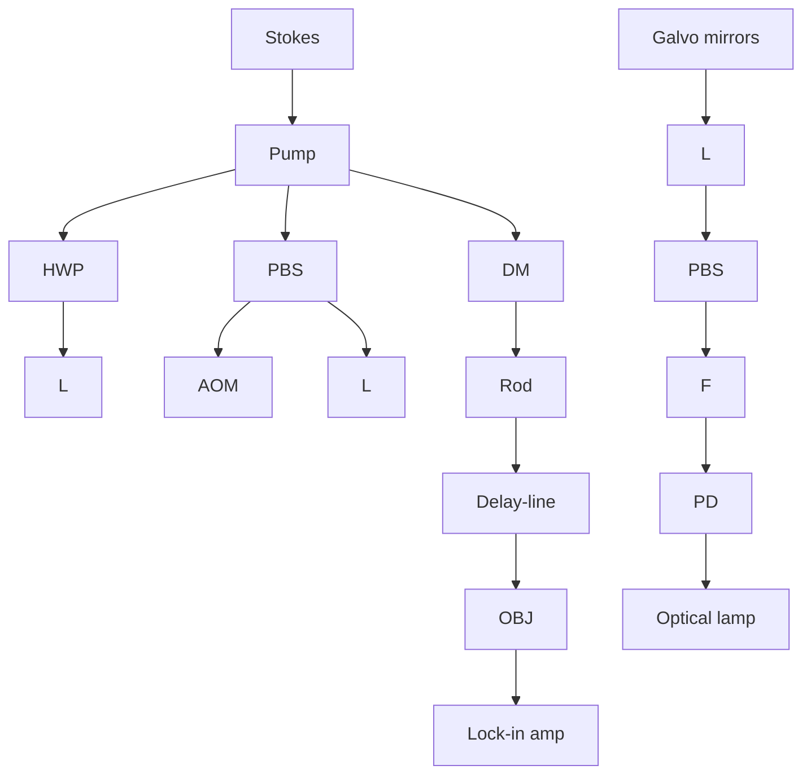

BiomedicalOptics.SPIEDigitaLibrary.org

# Imaging of demineralized enamel in intact tooth by epidetected stimulated Raman scattering microscopy

Masatoshi Ando Chien-Sheng Liao George J. Eckert Ji-Xin Cheng

# Imaging of demineralized enamel in intact tooth by epidetected stimulated Raman scattering microscopy

Masatoshi Ando,a,\* Chien-Sheng Liao,b George J. Eckert,c and Ji-Xin Chengb

a Indiana University School of Dentistry, Department of Cariology, Operative Dentistry and Dental Public Health, Indianapolis, Indiana, United States

b Boston University, Department of Electrical and Computer Engineering, Department of Biomedical Engineering, Photonics Center,

Boston, Massachusetts, United States

c Indiana University School of Medicine, Department of Biostatistics, Indianapolis, Indiana, United States

Abstract. Stimulated Raman scattering microscopy (SRS) was deployed to quantify enamel demineralization in intact teeth. The surfaces of 15 bovine-enamel blocks were divided into four equal-areas, and chemically demin eralized for 0, 8, 16, or 24 h, respectively. SRS images (spectral coverage from ∼850 to $1 1 5 0 ( c m ^ { - 1 } )$ ) were obtained at 10-μm increments up to 90 μm from the surface to the dentin–enamel junction. SRS intensities of phosphate (peak: 959 cm−1), carbonate $( 1 0 7 0 \ c m ^ { - 1 } )$ , and water (3250 cm−1) were measured. The phosphate peak height was divided by the carbonate peak height to calculate the SRS-P/C-ratio, which was normalized relative to 90 μm (SRS-P/C-ratio-normalized). The water intensity against depth decay curve was fitted with exponential decay. A decay constant (SRS-water-content) was obtained. Knoop-hardness values were obtained before (SMHS) and after demineralization $( \mathsf { S M H } _ { \mathsf { D } } )$ . Surface microhardness-change (SMH-change) $[ ( \mathsf { S M H _ { D } } - \mathsf { S M H _ { S } } ) / \mathsf { S M H _ { S } } ]$ ] was calculated. Depth and integrated mineral loss (ΔZ ) were determined by transverse microradiography. Comparisons were made using repeated-measures of analysis of variance. For SRS-P/ C-ratio-normalized, at 0-μm (surface), sound (0-h demineralization) was significantly higher than 8-h demineralization and 24-h demineralization; 16-h demineralization was significantly higher than 24-h demineralization. For SRS-water-content, 24-h demineralization was significantly higher than all other demineralization-groups; 8-h demineralization and 16-h demineralization were significantly higher than 0-h demineralization. SRS-watercontent presented moderate-to-strong correlation with SMH-change and weak-to-moderate correlation with depth. These results collectively demonstrate the potential of using SRS microscopy for in-situ chemical analysis of dental caries. © 2018 Society of Photo-Optical Instrumentation Engineers (SPIE) [DOI: 10.1117/1.JBO.23.10.105005]

Keywords: stimulated Raman scattering microscopy; vibrational imaging; enamel; demineralization; quantification

Paper 180206RR received Apr. 6, 2018; accepted for publication Sep. 26, 2018; published online Oct. 22, 2018.

## 1 Introduction

In 2010, a systematic review and metaregression indicated that untreated dental caries in permanent teeth remained the most prevalent health condition across the globe, affecting 2.4 billion people. Furthermore, untreated early childhood caries was found to be the 10th most prevalent condition/disease, affecting 621 million children worldwide.1 Therefore, dental caries remains a worldwide health issue. Dental caries result from dissolution of mineral, such as calcium and phosphate $( \mathrm { P O } _ { 4 } ^ { 3 - } )$ , from the tooth structure,2 a process called demineralization.

The first step of caries diagnosis is caries detection. Caries diagnosis should imply a human, professional summation of all available data.3 Caries detection implies an objective method of determining whether disease is present.4 Detecting caries lesions at an early stage prior to cavitation should allow implementation of nonsurgical treatments to not only arrest the caries process, but also maintain as much remaining healthy tooth structure as possible. To accurately diagnose dental caries and determine appropriate caries management/treatment, assessment of caries lesion activity is also important.5,6 Caries lesion activity can be defined as follows: a caries lesion that is progressing (continuing to demineralize) is described as an active caries lesion; and a lesion that has stopped further progression (stagnant/remineralized) is referred to as an inactive or arrested caries lesion.7 When caries lesions are in an active stage, demineralization continues, lesion depth increases, and the body of the lesion becomes more porous. When caries lesions are exposed to water, these porous lesions are filled with water and the amount of water absorbed by the lesion increases as demineralization progresses.6 Consequently, the amount of water in a caries lesion should correlate with its severity.

Raman spectroscopy is a nondestructive chemical analysis technique, which provides detailed information about the chemical structure, phase and polymorphy, and crystallinit and molecular interactions. It is based upon the interaction of light with the chemical bonds within a material.8 Various types of Raman spectroscopy techniques have been used in dental research. Using fiber-optic-based Raman microspectroscopy to characterize the caries process, spectral changes were observed in $\mathrm { P O } _ { 4 } ^ { 3 - }$ vibrations arising from hydroxyapatite of mineralized tooth tissue.9 Raman spectroscopy provided biochemical confirmation of caries. An in vitro study showed the sensitivity of 97% and specificity of 100% for caries detection using polarized Raman microspectroscopy.10 A fiber-optic coupled polarizationresolved Raman spectroscopic system was developed for simultaneous collection of orthogonally polarized Raman spectra in a single measurement.11 Caries lesions could be quantified based on a reduced Raman polarization anisotropy or a higher depolarization ratio of the $9 5 9 \mathrm { - c m ^ { - 1 } }$ peak. Fourier transform– Raman spectroscopy has also been used to obtain mineral concentration.12 In this study, peak position and area under the phosphate band were determined and the authors were able to follow changes in the mineral concentration and structure.

Stimulated Raman scattering (SRS) has been recently developed to improve the acquisition speed of the weak Raman signals by coherent excitation of molecular vibrations. SRS microscopy offers visualization of chemical bonds with submicron spatial resolution and real-time imaging speed. For tooth imaging, a rapid polarization-resolved hyperspectral SRS microscopic imaging technique has been developed.13 This study─ examined the cross-sectioned surface of the tooth. SRS images of tooth were acquired at 959 (PO3− of HA crystals), $2 9 4 0 \left( \mathrm { C H } _ { 3 } \right.$ of protein), and $3 2 5 0 ~ \mathrm { c m } ^ { - 1 } ~ ( \mathrm { O } { \dot { - } } \mathrm { H }$ of water). Based on the results, the authors demonstrated the potential of SRS microscopy in characterizing biochemical structures and composition, as well as biomolecule organization/orientations of the tooth without labeling.13 For example, the characterization of crosssectioned surface of the tooth showed depolarization ratios of SRS Raman peaks at 959 $\mathrm { c m } ^ { - 1 } ~ ( \ O _ { \nu 1 } - \mathrm { P O } _ { 4 } ^ { \hat { 3 } - }$ of HA crystals) calculated by dividing the polarized SRS intensity $[ I _ { \mathrm { S R S } } ( \theta =$ 90 deg ] by the polarized SRS intensity $[ I _ { \mathrm { S R S } } ( \theta = 0 ~ \mathrm { d e g } ) ] .$ 14 From surface to the bottom of lesion, the depolarization ratios showed clear contrasts among surface zone, body of lesion, translucent zone, and the sound enamel.

Previous studies employing Raman spectroscopy and SRS microscopy9,13,14 utilized the cross-sectioned tooth surface, which involved sample destruction. A nondestructive approach employing the anatomical tooth surface, which can be utilized under in vivo conditions, would be advantageous. Therefore, the primary objective of this study is to evaluate whether epidetected SRS microscopy could determine the degree of mineralization directly from the anatomical tooth surface. Toward this objective, we measured SRS intensities of phosphate (peak: $9 5 9 ~ \mathrm { c m } ^ { - 1 } )$ and carbonate $( 1 0 7 0 ~ \mathrm { c m } ^ { - 1 } )$ . Human enamel has attained 86% mineral by volume.15 The mineral component of sound enamel consists of carbonated calcium hydroxyapatite crystals [Ca10 PO4 OH2].16,17 $\mathrm { [ C a _ { 1 0 } ( P O _ { 4 } ) _ { 6 } O H _ { 2 } ] } .$ Extraneous ions such as carbonate, fluoride, sodium, and magnesium are also frequently found within the crystal structure. Magnesium and carbonate are two minor but important elements.18 Dental caries/demineralization is the loss of calcified materials, such as phosphate, from the tooth structure.19 In a previous study, from the lesion body, phosphate removed/lost was 18.5% and carbonate was 1.0%.20 Based on these data, although carbonate has been identified as preferentially lost and it decreases rapidly during the early stage of dental caries, nearly 99% of carbonate might remain in the lesion body. Thus, when the amount/intensity of phosphate is divided by that of carbonate (P/C ratio), the P/C ratio should decrease as the severity of the lesion/demineralization increases. Therefore, measuring these two SRS bands can be used to determine the degree of mineralization. The secondary objective is to determine whether SRS microscopy could quantify the amount of water in sound and demineralized enamel. The hypothesis is that as demineralization time increases, the amount of phosphate would decrease, and that the amount of water in the caries lesion body would increase.

## 2 Materials and Methods

## 2.1 Specimen Preparation

A total of 155.0- × 5.0- × 2.0-mm blocks were prepared from extracted bovine incisors. The initial enamel blocks were cut using a low-speed saw (ISOMET™ Low Speed Saw, Buehler, Ltd. Illinois). The dentin side was ground to establish a flat surface and the enamel side was ground and polished by RotoForce-4 and RotoPol-31 (Struers Inc., Rødovre, Denmark) until the total height was 2.0 mm. The specimens were mounted individually on 1-in. acrylic blocks using sticky wax, leaving only the polished enamel surface exposed.

text_image

5 mm
2 mm
5 mm
24 hr
16 hr
8 hr
0 hr

Fig. 1 This diagram shows physical dimension of specimen and areas for demineralization. Black squares indicate the locations of SRS image acquisition and black circles indicate the locations of SRS measurements. The left side of image presents sound (0-h demineralization) on the surface. Darker color indicates longer demineralization time.

## 2.2 Baseline/Sound Surface Microhardness

The surface was divided into equal four areas, approximate size of $1 \times 5 ~ \mathrm { m m } ^ { 2 }$ . For each area, five baseline indentations were made using a Knoop diamond indenter (2100 HT; Wilson Instruments, Norwood, Massachusetts) with a 50-g load along a line parallel to the external surface of the specimen ∼100 μm apart from each other, with a dwelling time of 11 s. The Knoop hardness number for each specimen was derived by calculating the mean of the length of the long diagonal of the five indentations.

## 2.3 Demineralization

The surface was checked under a stereomicroscope to make sure there was no debris on the enamel surface. Prior to the demin eralization, the demineralizing solution21 with Carbopol 907™ (B.F. Goodrich Co. Chemical Group, Ohio) was warmed to $3 7 ^ { \circ } \mathrm { C }$ . The solution contained 0.1 mol∕L lactic acid and 0.2% Carbopol $9 0 7 ^ { \mathrm { T M } }$ , was 50% saturated with hydroxyapatite and adjusted with a 0.25 N NaOH solution to pH 5.0. First, one area of enamel surface $( 1 \times 5 ~ \mathrm { m m } ^ { 2 } )$ was covered with acid resistant clear nail varnish as baseline prior to demineralization. Specimens were exposed to 12.4-mL demineralization solutio for 8 h at 37°C. After 8-h demineralization (8-h demin), one area $( 1 \times 5 ~ \mathrm { m m } ^ { 2 } )$ next to baseline was covered with acid-resistant clear nail varnish and the specimens were exposed to demineralization solution for additional 8 h at 37°C. After additional 8-h demineralization (total 16-h demineralization: 16-h demin), one area $( 1 \times 5 ~ \mathrm { m m } ^ { 2 } )$ next to 8 h demineralized area (16-h demin area) was covered with acid-resistant clear nail varnish and the specimens were exposed to demineralization solution for another additional 8 h at 37°C. At the end, there were four areas on each surface: 0-, 8-, 16-, and 24-h demineralization (Fig. 1). The clear nail varnish was then removed with acetone.

## 2.4 Demineralized Enamel Surface Microhardness (SMH )

After demineralization, a second set of five indentations was made using the Knoop diamond indenter as described in Sec. 2.2, but to the left of and parallel to the sound enamel indentations, ∼100 μm apart from each other and ${ \sim } 2 0 0 \ \mu \mathrm { m }$ from the sound enamel indentations. The Knoop hardness number for each specimen was derived by utilizing the mean of the length of the long diagonal of the five indentations. Surface microhardness-change (SMH-change) $[ \big ( \mathrm { S M H _ { D N } - S M H _ { S } } \big ) / \mathrm { S M H _ { S } } ]$ was determined. N indicates demineralization time.

## 2.5 Hyperspectral SRS Microscopy

Our hyperspectral SRS imaging system (Fig. 2) was built based on a previously reported spectral focusing scheme,22 where the Raman shift is controlled by the temporal delay of two chirped femtosecond pulses. An ultrafast laser system with dual output operating at 80 MHz (InSight DeepSee, Spectra-Physics) provided the excitation sources. The tunable output with a pulse duration of 120 fs was tuned to 942 nm, serving as the pump beam. The other output centered at 1040 nm with a pulse duration of 220 fs was used as the Stokes beam, modulated by an acousto-optic modulator (AOM, 1205-C, Isomet) at 2.3 MHz. An optical delay line was installed in the pump light path and a motorized translation stage (T-LS28E, Zaber) was employed to scan the delay between the two beams. The spectral coverage from ∼850 to $1 1 5 0 ~ \mathrm { c m } ^ { - 1 }$ was tested. After combination by a dichroic mirror, both beams were chirped by two 12.7-cm-long SF57 glass rods. To match the linear chirp parameter of the two beams, the built-in prism compressor inside the laser system was used to adjust the dispersion of the pump beam. After glass rods, pulse durations of the pump and Stokes beams were stretched to ∼0.8 and ∼1.3 ps, respectively, measured with an autocorrelator (PulseScope, APE). The pump and Stokes beams were sent into a home-built laser-scanning microscope. A 20× water immersion objective lens $( \mathrm { N A } = 1 . 0 ,$ XLUMPLFLN-W, Olympus) was utilized to focus the light onto the sample. The back-scattered signal was collected by the same objective, reflected by a polarizing beam splitter to a lens, and then focused on a Si-photodiode (S3994-01, Hamamatsu). The SRS signal was extracted with a digital lock-in amplifier (HF2LI, Zurich Instrument).

flowchart

Fig. 2 Epidetected hyperspectral SRS microscope. AOM, acousto optic modulator; DM, dichroic mirror; F, filter; HWP, half waveplate; L, lens; OBJ, objective; PBS, polarizing beam splitter; and PD, photodiode.

## 2.6 SRS Data Analyses

## 2.6.1 Phosphate and carbonate peak ratio

SRS images for two locations of $0 . 4 8 \times 0 . 4 8 ~ \mathrm { m m } ^ { 2 }$ of each specimen, containing the interfaces between sound (0-h demineralization: 0-h demin) and 8-h demineralization and between 16- and 24-h demineralization, were imaged by our SRS micro scope with a $1 0 \mathrm { - } \mu \mathrm { m }$ increment up to 90 μm from surface to dentin–enamel junction (Fig. 1). The SRS intensities from phos phate (peak at $9 5 9 ~ \mathrm { c m } ^ { - 1 } )$ and carbonate (peak at $1 0 7 0 \ \mathrm { \bar { c m } ^ { - 1 } ) }$ were measured for each demineralization level $( 0 \cdot , \ 8 \cdot , \ 1 6 -$ , and 24-h demineralization). The spectra profile with two Lorentzian functions was fitted to obtain the peak heights of phosphate and carbonate groups. Peak ratio (SRS P/C ratio) was defined as the phosphate peak height divided by the carbonate peak height. SRS P/C ratio was normalized relative to 90-μm depth (SRS P/C-ratio-normalized). The depth of lesions wa estimated using SRS P/C-ratio-normalized data. The depth (SRS P/C depth) was identified when the normalized ratio was ${ \ge } 0 . 9 5$ . Based on the previous $\mathrm { s t u d y } ^ { 2 3 }$ to determine the lesion depth using (mineral) profile, 0.95 was chosen for this study. This was done to eliminate the effect of lesions approach ing 1∶1 SRS P/C-Ratio asymptotically.

## 2.6.2 Water content in enamel

In the same locations indicated above, the SRS intensity from water was measured (peak at $3 2 5 0 ~ \mathrm { c m } ^ { - 1 } )$ . The water intensity against depth decay curve was drawn using a multiparadigm numerical computing program (MATLAB R2014aY, MathWorks, Natick, Massachusetts). The curve was fitted with exponential decay and obtained a decay constant:

$$
y = a e ^ {- \frac {x}{t}} + y _ {0},
$$

where y is the SRS intensity, a is the fitting coefficient, x is the depth, t is the decay constant, and $y _ { 0 }$ is the intensity offset induced by amplifier.

## 2.7 Transverse Microradiography (TMR)

A thin section, ∼100 μm in thickness, was cut from the center area of each specimen using a Silverstone–Taylor Hard Tissu Microtome (Scientific Fabrications Laboratories). Any section thicker than 120 μm was hand-polished using 2400-grit silicon carbide paper to the required thickness. The sections were mounted with an aluminum step wedge on high-resolution glass plates type I A (Microchrome Technology Inc., San Jose, California). Sections were placed in the TMR-D system and x-rayed at 45 kV and 45 mA at a fixed distance for 12 s. The digital images were analyzed using the TMR software ${ \bf V } . 3 . 0 . 0 . 1 8 $ (Inspektor Research Systems BV, Amsterdam, the Netherlands). A window ${ \sim } 4 0 0 \times 4 0 0$ μm representing the entire lesion and not containing any cracks, debris, or other alteration was selected for analysis. The following variables were recorded for each specimen: lesion depth (L) (87% mineral; i.e., 95% of the mineral content of sound enamel), and integrated minera loss (ΔZ), which is calculated by subtracting the mineral profile in the lesion area from the sound profile.

## 2.8 Statistical Analyses

Comparisons among demineralization times for differences in SMH-change, L, ΔZ, SRS P/C-ratio-normalized, SRS P/C depth, and SRS water content were made using repeated measures of analysis of variance (ANOVA). The ANOVA included a fixed effect for demineralization time, with demineralization time repeated with specimen, allowing each demineralization time to have a different variance and different covariances were allowed between times. A 5% significance level was used for all tests. Pearson correlation coefficients were calculated to evaluate the linear associations between measurements.

## 3 Results

## 3.1 SRS Images at Raman Bands of Phosphate, Carbonate, and Water

Figure 3 shows representative SRS images of phosphate, carbonate, and water Raman bands. An 8-h demin showed microscopic demineralized structures at phosphate and carbonate Raman bands [Figs. 3(a) and 3(b)] and higher water penetration than sound area [Fig. 3(c)]. Following by the same trend, 24-h demin showed lower SRS signal at phosphate and carbonate Raman bands and more demineralized indications than 16-h demin [Figs. 3(d) and 3(e)]. The water penetration in the 24-h demineralized region was higher than 16-h demin [Fig. 3(f)].

line chart

| Raman shift (1/cm) | Sound | 8 hours | 16 hours | 24 hours |
| ------------------ | ----- | ------- | -------- | -------- |
| 880                | 0.0   | 0.0     | 0.0      | 0.0      |
| 900                | 0.2   | 0.4     | 0.2      | 0.2      |
| 920                | 0.5   | 0.7     | 0.5      | 0.5      |
| 940                | 0.8   | 1.0     | 0.8      | 0.8      |
| 960                | 1.0   | 1.1     | 1.0      | 1.0      |
| 980                | 0.8   | 1.0     | 0.8      | 0.8      |
| 1000               | 0.5   | 0.7     | 0.5      | 0.5      |
| 1020               | 0.3   | 0.5     | 0.3      | 0.3      |
| 1040               | 0.2   | 0.3     | 0.2      | 0.2      |
| 1060               | 0.1   | 0.2     | 0.1      | 0.1      |
| 1080               | 0.0   | 0.1     | 0.0      | 0.0      |
| 1100               | 0.0   | 0.0     | 0.0      | 0.0      |
| 1120               | 0.0   | 0.0     | 0.0      | 0.0      |
| 1140               | 0.0   | 0.0     | 0.0      | 0.0      |
| 1160               | 0.0   | 0.0     | 0.0      | 0.0      |
| 1180               | 0.0   | 0.0     | 0.0      | 0.0      |

Fig. 3 SRS images of specimen at Raman bands of phosphate, carbonate, and water bands. These images were taken 30 μm below surface. (a–b) About 8-h demin showed demineralized structures than sound area and (c) higher water penetration. (d–e) About 24-h demin showed more demineralized structures than 16-h demin and (f) higher water penetration. The SRS spectra of (a–f) are shown in (g). Scale bar for all panels: 100 μm.

Table 1 Means standard deviations of surface microhardness-change (SMH-change), SRS P/C ratio norm depth (SRS P/C depth), lesion depth (L), and integrated mineral loss (ΔZ ) for each demineralization time.

<table><tr><td>Demineralization time (h)</td><td>SMH-change (%)</td><td>SRS P/C depth ( $\mu m$ )</td><td> $L$  ( $\mu m$ )</td><td> $\Delta Z$  (vol% min  $\times \mu m$ )</td></tr><tr><td>Sound (0)</td><td> $1.1 \pm 1.4^{a}$ </td><td> $12.7 \pm 4.6^{a}$ </td><td>N.A.</td><td>N.A.</td></tr><tr><td>8</td><td> $82.7 \pm 12.5^{b}$ </td><td> $16.7 \pm 7.2^{b}$ </td><td> $16.6 \pm 6.7^{a}$ </td><td> $407 \pm 258^{a}$ </td></tr><tr><td>16</td><td> $125.1 \pm 11.9^{c}$ </td><td> $21.3 \pm 10.6^{b}$ </td><td> $29.0 \pm 16.5^{b}$ </td><td> $538 \pm 236^{a}$ </td></tr><tr><td>24</td><td> $178.0 \pm 18.3^{d}$ </td><td> $36.0 \pm 12.4^{c}$ </td><td> $50.7 \pm 28.8^{c}$ </td><td> $1085 \pm 400^{b}$ </td></tr></table>

Same letters in each outcome (vertical comparison) indicate there are no significant differences.

## 3.2 Observation of Demineralized Enamel by SMH, SRS, and TMR

Table 1 shows means and standard deviations of SMH-change, SRS P/C depth, $L ,$ and ΔZ. SMH-change increased as demin eralization time increased; all four demineralization times were significantly different from each other $( p < 0 . 0 0 1 )$ For SRS P/C depth, depth increased with demineralization time (sound versus 8-h demin $p = 0 . 0 0 8 6 ;$ sound versus 16-h demin $p = 0 . 0 1 3 4 ;$ sound, 8-h demin, and 16-h demin versus 24-h demin $p < 0 . 0 0 0 1$ , 8-h demin versus 16-h demin $p = 0 . 2 0 )$ . For depth of lesion (L), depth increased significantly with demineralization time (8-h demin versus 16-h demin, $p = 0 . 0 1 1 2 ;$ ; 8-h demin versus 24-h demin, $p = 0 . 0 0 0 1$ ; 16-h demin versus 24-h demin, $p = 0 . 0 0 0 4 )$ ). For integrated mineral loss (ΔZ), 24-h demin was significantly larger than 8-h demin $( p = 0 . 0 0 0 5 )$ and 16-h demin $( p < 0 . 0 0 0 1 )$ , but 8-h demin and 16-h demin were not significantly different $( p = 0 . 1 5 )$ . There were moderate correlations between L (lesion depth) and SRS P/C depth $( r = 0 . 5 5 , ~ p < 0 . 0 0 1 )$ and between ΔZ (integrated mineral loss) and SRS P/C depth $( r = 0 . 4 9 , p = 0 . 0 0 1 )$ .

## 3.3 Evaluation of Demineralized Enamel by SRS P/C-Ratio-Normalized

## 3.3.1 Mean and standard deviation

Table 2 shows means and standard deviations of SRS P/C Ratio relative to $9 0 \mathrm { - } \mu \mathrm { m }$ depth (SRS P/C-ratio-normalized) for each demineralization time at each depth; the means are shown in Fig. 4. Sound (0-h demineralization: 0-h demin) was significantly higher than 8-h demin at depths 0 to 10 μm; but lower than 8-h demin at depths 40 to 80 μm. 0-h demin was signifi cantly higher than 16-h demin at depths 10 to 30 μm; but lower than 16-h demin at depths 50 to 70 μm. 0-h demin was signifi cantly higher than 24-h demin at depths 0 to 40 μm; but lower than 24-h demin at depths 60 to 70 μm. 8-h demin was significantly higher than 16-h demin at depths 20 to 40 μm; but significantly lower than 16-h demin at a depth of 70 μm.

line chart

| Depth (μm) | sound | 8 hrs | 16 hrs | 24 hrs |
| ---------- | ----- | ----- | ------ | ------ |
| 0          | 0.6   | 0.55  | 0.5    | 0.5    |
| 10         | 0.95  | 0.9   | 0.85   | 0.75   |
| 20         | 1.05  | 1.05  | 1.0    | 0.85   |
| 30         | 1.08  | 1.08  | 1.05   | 0.95   |
| 40         | 1.05  | 1.05  | 1.05   | 1.0    |
| 50         | 1.02  | 1.02  | 1.02   | 1.02   |
| 60         | 1.0   | 1.0   | 1.0    | 1.0    |
| 70         | 1.0   | 1.0   | 1.0    | 1.0    |
| 80         | 1.0   | 1.0   | 1.0    | 1.0    |
| 90         | 1.0   | 1.0   | 1.0    | 1.0    |

Fig. 4 Means of SRS P/C ratio relative to 90-μm depth (SRS P/C ratio-normalized) for each demineralization time at each depth.

Table 2 Means standard deviations of SRS P/C ratio relative to 90-μm depth (SRS P/C-ratio-normalized) for each demineralization time at each depth.

<table><tr><td rowspan="2">Depth (μm)</td><td colspan="4">Demineralization time (h)</td></tr><tr><td>Sound (0)</td><td>8</td><td>16</td><td>24</td></tr><tr><td>0 (Surface)</td><td> $0.66 \pm 0.16^{a1}$ </td><td> $0.58 \pm 0.17^{b,c1}$ </td><td> $0.65 \pm 0.16^{a,b1}$ </td><td> $0.51 \pm 0.16^{c1}$ </td></tr><tr><td>10</td><td> $0.99 \pm 0.07^{a2}$ </td><td> $0.92 \pm 0.12^{b2}$ </td><td> $0.90 \pm 0.10^{b2}$ </td><td> $0.77 \pm 0.11^{c2}$ </td></tr><tr><td>20</td><td> $1.05 \pm 0.04^{a3}$ </td><td> $1.05 \pm 0.08^{a3-5}$ </td><td> $0.98 \pm 0.06^{b3}$ </td><td> $0.88 \pm 0.08^{c3}$ </td></tr><tr><td>30</td><td> $1.05 \pm 0.03^{a4}$ </td><td> $1.08 \pm 0.06^{a6}$ </td><td> $1.02 \pm 0.06^{b4}$ </td><td> $0.95 \pm 0.08^{c4}$ </td></tr><tr><td>40</td><td> $1.04 \pm 0.03^{b5}$ </td><td> $1.07 \pm 0.04^{a5,6}$ </td><td> $1.04 \pm 0.04^{b5}$ </td><td> $1.01 \pm 0.06^{c5}$ </td></tr><tr><td>50</td><td> $1.03 \pm 0.02^{b6}$ </td><td> $1.05 \pm 0.03^{a4}$ </td><td> $1.04 \pm 0.04^{a5}$ </td><td> $1.04 \pm 0.06^{ab6}$ </td></tr><tr><td>60</td><td> $1.01 \pm 0.03^{b2}$ </td><td> $1.03 \pm 0.03^{a3}$ </td><td> $1.04 \pm 0.03^{a4,5}$ </td><td> $1.05 \pm 0.06^{a6}$ </td></tr><tr><td>70</td><td> $1.01 \pm 0.02^{c2}$ </td><td> $1.02 \pm 0.02^{b3}$ </td><td> $1.04 \pm 0.03^{a4,5}$ </td><td> $1.05 \pm 0.05^{a6}$ </td></tr><tr><td>80</td><td> $1.01 \pm 0.02^{a2}$ </td><td> $1.01 \pm 0.02^{b3}$ </td><td> $1.03 \pm 0.04^{a,b4,5}$ </td><td> $1.04 \pm 0.05^{ab5,6}$ </td></tr></table>

Same letters indicate no significant differences among demineralization times at each depth (horizontal comparison) and same numbers indicate no significant differences among depths within each demineralization time (vertical comparison).  
The superscript numbers indicate no significant differences among the depths within each demineralization time (vertical comparison).

An 8-h demin was significantly higher than 24-h demin at depths 10 to 40 μm; but significantly lower than 24-h demin at the depth of $7 0 \ \mu \mathrm { m }$ . 16-h demin was significantly higher than 24-h demin at depths 0 to 40 μm.

## 3.3.2 Correlation with SMH and TMR

There was moderate negative correlation between SMH-change and SRS P/C-ratio-normalized for depths 10 to 30 μm $( r = - 0 . 4 3 \mathrm { t o } - 0 . 6 1 )$ ) and weak-to-moderate positive correlation for depths 60 to 80 μm $( r = 0 . 3 2$ to 0.47), and no correlation for other depths. L (lesion depth) was moderately correlated with SRS P/C-ratio-normalized for depths 20 to 40 μm $( r = - 0 . 4 4 \ \mathrm { t o } - 0 . 5 4 ) .$ . ΔZ (integrated mineral loss) was moderately correlated with SRS P/C-ratio-normalized for depths 10 to 40 μm $( r = - 0 . 4 0 \ \mathrm { t o } \ - 0 . 5 9 )$ ).

## 3.4 Quantification of Demineralized Enamel by Water Content Measured by SRS

## 3.4.1 Mean and standard deviation

Figure 5 shows water Content measured by SRS. About 24-h demin had significantly higher water content than all other groups $( p < 0 . 0 0 1$ versus 0 h, $p = 0 . 0 0 2$ versus 8 h, $p = 0 . 0 0 1$ versus 16 h), and 8-h demin and 16-h demin had significantly higher water content than 0-h demin $( p < 0 . 0 0 1 )$ , but 8-h demin and 16-h demin were not significantly different from each other $( p = 0 . 8 4 )$ .

## 3.4.2 Correlation with SMH, TMR and SRS P/C-ratio-normalized

There was a moderate-to-strong correlation $( r = 0 . 7 2 )$ between SMH change and SRS water content $( p < 0 . 0 0 1 )$ ). For TMR data, L (lesion depth) had weak-to-moderate correlations with SRS water content $( r = - 0 . 3 1$ to 0.64); ΔZ (integrated mineral loss) was strongly correlated $( r = 0 . 9 1 )$ with SRS water content for 8-h demineralization $( p < 0 . 0 0 1 )$ , but not for 16 or 24 h. There was moderate negative correlation $( r = - 0 . 4 1 ~ \mathrm { t o } \ - 0 . 5 5 )$ between SRS water content and SRS P/C-ratio-normalized for depths 0 to $2 0 ~ \mu \mathrm { m } ~ \left( p < 0 . 0 0 1 \right)$ and weak-to-moderate positive correlation $( r = 0 . 2 9 \mathrm { \ t o \ } 0 . 4 3 )$ for depths 60 to 80 μm $( p < 0 . 0 5 )$ , and no correlation for other depths.

bar chart

| Demineralization time (hours) | Value |
|---|---|
| sound | 13 |
| 8 hrs | 18 |
| 16 hrs | 18 |
| 24 hrs | 21 |

Fig. 5 Means standard deviations of SRS water content for each demineralization time. Same letters indicate there is no significant differences.

natural_image

Two 3D-rendered translucent rectangular blocks labeled (a) and (b), with a gradient color scheme on the right panel (no text or symbols on the blocks themselves)

Fig. 6 Example images for SRS water content. (a) Area between sound (0-h demineralization) and 8-h demineralization. (b) Area between 16-h demineralization and 24-h demineralization. The left side of each image presents the shorter demineralization time. Darker color (blue) indicates more water in the enamel.

## 3.4.3 3-D Image of water content by SRS

Figure 6 shows representative three-dimensional (3-D) images for SRS Water Content. $\mathbf { \ddot { a } } ^ { , , }$ shows area between sound (0-h demineralization) and 8-h demineralization. $\because { \mathrm { b } } ^ { \prime \prime }$ shows area between 16-h demineralization and 24-h demineralization. The left side of each image is the shorter demineralization time. Darker color (blue) indicates more water in the enamel. As demineralization time increased, the area became darker.

## 4 Discussion

Our current study showed that SRS microscopy has the potentia to nondestructively quantify enamel demineralization. SRS microscopy might be able to determine degree of mineralization from the top surface, and also quantify the amount of water in the sound and demineralized enamel, as discussed below.

## 4.1 SRS Potentially Can Quantify Demineralized Enamel

Human enamel has attained 86% mineral by volume.15 The mineral component of sound enamel consists of carbonated calcium hydroxyapatite crystals [Ca10 PO4 OH2].16,17 $\mathrm { [ C a _ { 1 0 } ( P O _ { 4 } ) _ { 6 } O H _ { 2 } ] . ^ { 1 6 , 1 7 } }$ Extraneous ions such as carbonate, fluoride, sodium, and magnesium are also frequently found within the crystal structure. Sound enamel contains 2% to 4% carbonate (by weight) and 17.5% to 18.5% phosphate.17,20,24,25 Dental caries is demineralization of dental hard tissue, which is the loss of calcified material, such as calcium and phosphate, from the tooth structure. This also appears to be complemented by preferential decrease in carbonate.19,26 Lesion depth and mineral loss were increased linearly against demineralization time.27 The rate of demineralization calculated from the titration data showed also nearly linear increase with time.28 Relative loss of carbonate ions occurs in the first minutes of the reaction at pH $5 . 6 . ^ { 2 9 }$ Mineral removal/loss of the caries lesion compared with sound enamel was calculated.20 From the lesion body, phosphate removed/lost was 18.5% and carbonate was 1.0%. Based on these data, although carbonate decreased rapidly, nearly 99% of carbonate might remain in the lesion body. Thus, when the amount/intensity of phosphate is divided by that of carbonate (P/C ratio), the P/C ratio should decrease as the severity of the lesion/demineralization increases. For our current study, to quantify and compare severity of demineralization among different teeth/specimens, peak ratio was used and defined as the phosphate peak height divided by the carbonate peak height (SRS P/C ratio). SRS P/C ratio was further normalized relative to 90-μm depth (SRS P/C-ratio-normalized). The results showed at the surface level (0-μm depth in Table 2) that SRS P/C-ratio-normalized decreased as demineralization time increased. There was a significant difference between sound and 24-h demineralized enamel, which had an average depth of 50.7 μm. Previous studies demonstrated that Raman spectroscopy could detect dental caries.9–11 The principle of these studies is that the Raman peak at $9 5 9 ~ \mathrm { c m ^ { - 1 } }$ (phosphate) for caries is weaker than that for sound enamel. Another study observed a cross-sectioned surface of the tooth.14 This study indicated that SRS could quantify caries lesions using the Raman peak at $9 5 9 ~ \mathrm { c m ^ { - 1 } }$ . Detection of caries lesions is the first step and an important process for caries management/treatment. To determine an appropriate treatment/management modality, quantification of the severity of caries lesion/ demineralization is also important because severe lesions may require more intense treatment/management. Our study successfully showed that SRS has the potential to quantify and visualize caries lesion/demineralization based on the intrinsic phosphate and carbonate contents. Similarly, the study of SRS polarization/ depolarization has been reported to identify dental lesions. 13 In the future, the combination of SRS polarization/depolarization and hyperspectral measurements could potentially provide more information of demineralization on the molecular level. It is well known that although sound enamel is highly mineralized tissue, the chemical composition is not uniform from the surface to inner structure.30 From the surface to the internal of the enamel, calcium, phosphate, and fluoride concentrations seem to decrease. On the other hand, magnesium, carbonate, and chloride concentrations seem to increase. However, concentration differences varied from place to place in the tooth. In addition, this variation may depend on the distance from the surface.31 These are the potential reasons for SRS P/C ratio changes from the surface to inner structure for the sound enamel.

## 4.2 SRS Can Potentially Estimate the Depth of Demineralized Enamel

Another unique aspect of our current study is that SRS P/Cratio-normalized data can potentially estimate the depth of the lesion/extent of demineralization (SRS P/C depth). Although the correlation was moderate, this indicates that SRS should be able to estimate depth of lesions from the anatomical surface without sectioning the teeth/specimens, which would not be possible under clinical conditions. The use of 10-μm increments at which the SRS measurements were performed would decrease the precision of the SRS P/C depth assessments. This may have lead to a reduction in the correlations with TMR lesion depth and ΔZ. Further studies will need to confirm the present findings and improve the methodology.

## 4.3 SRS-Based Water Content Can be Used to Determine Degree of Demineralization

Our current study is the first report investigating the relationship between the amount of water and the severity of caries lesion demineralization. At eruption, human enamel has attained 86% mineral, 2% organic material, and 12% water by volume.17 The mineral component of sound enamel consists of tightly packed hydroxyapatite crystals. These tightly packed hydroxyapatite crystals are separated by tiny intercrystalline spaces. Based on chemical analysis and histopathological observations, the initial stage of caries development is characterized by the opening of the intercrystalline spaces without the destruction of the surface and subsequent creation of microchannels.32–34 This initial stage of caries lesion, that macroscopically maintains intact/sound surface, is called a noncavitated caries lesion.

As demineralization continues, while maintaining intact surface, microchannels get wider and longer35 and the lesion bod becomes more porous.36 When noncavitated caries lesions are hydrated/wet, microchannels and the lesion body are filled with saliva/fluid. It is reasonable to assume that deeper noncavitated lesions contain more water, as demineralization continues. The results of our current study showed that as demineralization time increased, the SRS signal at water band increased. There were good correlations between the SRS signal at water band and the hardness and microradiography variables. We also successfully presented 3-D imaging of water from the top surface without sample preparation. As demineralization time increased, the signal from water got stronger, indicating higher penetration of water into demineralized enamel. Our observation is also consistent with previous work on measurement of refractive indice of sound and demineralized enamel. According to Refs. 37–39 the refractive index of sound enamel is 1.62, and interestingly the refractive index demineralized enamel is reported as 1.35,3 which is close to water refractive index (1.33). The lower refrac tive index of demineralized enamel is possibly due to the water penetration.

We note that in demineralized enamel, the porous structure filled with either air or water exhibits lower refractive index compared with sound enamel. This could lead to wavefront dis tortion and multiple optical scattering, which can degrade SRS signal at water band. As a result, water contained in deminer alized enamel might have been under-estimated. Future study will be required to quantified the water content in demineralized enamel. Despite this concern, enamel regions with longer demineralized time generally exhibit stronger SRS water signal [Figs. 3(c) and 3(f)], which supports our hypothesis. Light scattering can also degrade the Raman signals of phosphate and carbonate groups. In this study, we used the peak ratio between phosphate and carbonate groups to quantify enamel demineralization. Although light scattering can reduce the light intensity delivered into lesions and also degrade the collection of Raman signals, the ratio between two Raman peaks remains a quantifi able measurement. Moreover, the advantage of SRS measure ment includes the use of long wavelength in the near infrare region, which enables us to penetrate hundreds of micrometers. Also as one of the nonlinear optical techniques, SRS is advanta geous in blocking out-of-focus light compared with other linear techniques.

## 4.4 Comparing with other Technology-Based Methods

There are other optical caries detection methods available, such as reflectance-based method,40 optical coherence tomography (OCT),41 pulsed heating thermography (PHT),42 and lightinduced fluorescence (LF).6 OCT measures the changes in reflectivity or light scattering with millimeter penetration depth. PHT provides heat maps that could be used to localize infection or inflammation. LF uses short wavelength, usually blue light, to induce autofluorescence of tooth structure, especially of dentin. These optical modalities show advantages of nondestructive and quantitative assessment and eliminating the need of ionizing radiation. OCT, PHT, and LF are quantitative methods that can determine the severity of caries lesions, such as depth or equivalent of depth of the lesions. One of the limitations for OCT can be dental structures’ images, which can be acquired up to 2.5 mm in depth.43 Near-infrared light transillumination (NILT)41,44 has also been reported with the advantage of being able to be used on the approximal surface, which remains a difficult measurement for other modal ities. One of the disadvantages of NILT can be currently there is no quantification function to determine severity of caries lesions. Among these available optical methods, the fundamental principle is to detect/determine physical damage/destruction of tissue structure. On the other hand, Raman spectroscopy is not only a nondestructive method, but also a chemical analysis method that provides detailed information about the chemical structure, phase and polymorphy, crystallinity and molecular interactions, which cannot be accessed by other modalities. SRS provides a unique approach to visualize the chemical composition based on their molecular vibrations. In this study, we reported the direct measurement of increased water content in demineralized enamel with submicron spatial resolution, which provides a potential marker to quantify demineralization of enamel. We also reported the use of two inherent Raman peaks from enamel to quantify the demineralization. The ratio of phosphate and carbonate groups enables quantification of demineralization on the molecular level. Many optical meth ods, such as OCT, determine the optical changes to determine severity of caries lesions, such as depth of lesions. SRS, on the other hand, obtains chemical composition and is able to provide analysis of demineralization on the molecular level. However, SRS is mostly used in a benchtop-base setting and primarily for the laboratory use. In the future, we expect that more developments in handheld SRS microscope or endoscope will be reported.45

## Disclosures

The authors declare no conflict of interest.

## References

1. N. J. Kassebaum et al., “Global burden of untreated caries: a systematic review and metaregression,” J. Dent. Res. 94(5), 650–658 (2015).  
2. O. Fejerskov and M. J. Larsen, “Demineralization and remineralization: the key to understanding clinical manifestations of dental caries,” in Dental Caries: The Disease and Its Clinical Management, O. Fejerskov, B. Nyvad, and E. A. M. Kidd, Eds., pp. 155–170, 3rd edn., Willey Blackwell, Munksgaard, Oxford (2015).  
3. N. B. Pitts and J. W. Stamm, “International consensus workshop on caries clinical trials (ICW-CCT)—final consensus statements: agreeing where the evidence leads,” J. Dent. Res. 83(Suppl. 1), 125–128 (2004).  
4. G. V. Topping et al., “Clinical visual caries detection,” in Monographs in Oral Science, Detection, Assessment, Diagnosis and Monitoring of Caries, N. Pitts, Ed., Vol. 21, pp. 15–41, Karger, Basel, Switzerland (2009).  
5. K. R. Ekstrand et al., “Lesion activity assessment,” in Monographs in Oral Science, Detection, Assessment, Diagnosis and Monitoring of Caries, N. Pitts, Ed., Vol. 21, pp. 63–90, Karger, Basel, Switerland (2009).  
6. M. Ando et al., “Pilot clinical study to assess caries lesion activity using quantitative light-induced fluorescence during dehydration,” J. Biomed. Opt. 22(3), 035005 (2017).  
7. O. Fejerskov, B. Nyvad, and E. A. M. Kidd, “Dental caries: what is it?” in Dental Caries: The Disease and Its Clinical Management, O. Fejerskov, B. Nyvad, and E. A. M. Kidd, Eds., 3rd edn., pp. 7–10, Willey Blackwell, Munksgaard, Oxford (2015).  
8. E. B. Hanlon et al., “Prospects for in vivo Raman spectroscopy,” Phys. Med. Biol. 45, R1–R59 (2000).  
9. A. C. T. Ko et al., “Ex vivo detection and characterization of early dental caries by optical coherence tomography and Raman spectroscopy,” J. Biomed. Opt. 10, 031118 (2005).  
10. A. C. T. Ko et al., “Detection of early dental caries using polarized Raman spectroscopy,” Opt. Express 14, 203–215 (2006).  
11. A. C. T. Ko et al., “Early dental caries detection using a fibre-optic coupled polarization-resolved Raman spectroscopic system,” Opt. Express 16, 6274–6284 (2008).  
12. J. E. Kerr et al., “FT-Raman spectroscopy study of the remineralization of microwave-exposed artificial caries,” J. Dent. Res. 95(3), 342–348 (2016).  
13. Z. Wang et al., “Polarization-resolved hyperspectral stimulated Raman scattering microscopy for label-free biomolecular imaging of the tooth,” Appl. Phys. Lett. 108, 033701 (2016).  
14. Z. Wang et al., “Optical diagnosis and characterization of dental caries with polarization-resolved hyperspectral stimulated Raman scattering microscopy,” Biomed. Opt. Express 7(4), 1284–1293 (2016).  
15. O. Fejerskov, “Pathology of dental caries,” in Dental Caries: The Disease and Its Clinical Management, O. Fejerskov, B. Nyvad, and E. A. M. Kidd, Eds., 3rd edn., pp. 49–81, Willey Blackwell, Munksgaard, Oxford (2015).  
16. B. Angmar, D. Carlstrom, and J. E. Glas, “Studies on the ultrastructure of dental enamel. IV. The mineralisation of normal human enamel,” J. Ultrastruct. Res. 8, 12–23 (1963).  
17. C. Robinson, J. A. Weatherell, and A. S. Hallsworth, “Variations in the composition of dental enamel in thin ground sections,” Caries Res. 5(1), 44–57 (1971).  
18. R. Z. LeGeros et al., “Magnesium and carbonate in enamel and synthetic apatites,” Adv. Dent. Res. 10(2), 225–231 (1996).  
19. A. S. Hallsworth, J. A. Weatherell, and C. Robinson, “Loss of carbonate during the first stages of enamel caries,” Caries Res. 7(4), 345–348 (1973).  
20. C. Robinson, J. A. Weatherell, and A. S. Hallsworth, “Alteration in the composition of permanent human enamel during carious attack,” in Demineralisation and Remineralisation of the Teeth, S. A. Leach and W. M. Edgar, Eds., pp. 209–223, IRL Press, Oxford (1983).  
21. D. J. White, “Use of synthetic polymer gels for artificial carious lesion preparation,” Caries Res. 21(3), 228–242 (1987).  
22. B. Liu et al., “Label-free spectroscopic detection of membrane potential using stimulated Raman scattering,” Appl. Phys. Lett. 106(17), 173704 (2015).  
23. A. G. Dijkman, J. Schuthof, and J. Arends, “In vivo remineralization of plaque-induced initial enamel lesions—a microradiographic investigation,” Caries Res. 20(3), 202–208 (1986).  
24. R. T. Otto, “Crystalline organization of dental mineral,” in Structural and Chemical Organization of Teeth, A. E. W. Miles, Ed., pp. 165– 200, Academic Press, New York (1967).  
25. J. A. Weatherell, C. Robinson, and C. R. Hiller, “Distribution of carbonate in thin sections of dental enamel,” Caries Res. 2(1), 1–9 (1968).  
26. T. B. Cooldge and H. Jacobs, “Enamel carbonate in caries,” J. Dent. Res. 36(3), 765–768 (1957).  
27. X. J. Gao, J. C. Elliott, and P. Anderson, “Scanning microradiographi study of the kinetics of subsurface demineralization in tooth sections under constant-composition and small constant-volume conditions,” J. Dent. Res. 72(5), 923–930 (1993).  
28. L. C. Chow and S. Takagi, “A quasi-constant composition method for studying the formation of artificial caries-like lesions,” Caries Res. 23(3), 129–134 (1989).  
29. J. C. Voegel and P. Garnier, “Biological apatite crystal dissolution,” J. Dent. Res. 58(B), 852–856 (1979).  
30. J. A. Weatherell, C. Robinson, and A. S. Hallsworth, “Variations in the chemical composition of human enamel,” J. Dent. Res. 53(2), 180–192 (1974).  
31. V. Glauche et al., “Analysis of tooth surface elements by ion beam analysis,” J. Hard Tissue Biol. 20(2), 99–106 (2011).  
32. M. Goldberg et al., “Microchannels in the surface zone of artificially produced caries-like enamel lesions,” J. Biol. Buccale 9(3), 297–314 (1981).  
33. J. D. B. Featherstone et al., “Chemical and histological changes during development of artificial caries,” Caries Res. 19(1), 1–10 (1985).  
34. L. Holmen et al., “A scanning electron microscopy study of surface changes during development of artificial caries,” Caries Res. 19(1), 11–21 (1985).  
35. M. Ando et al., “Characteristics of early stage of enamel demineraliza tion in vitro,” in Early Detection of Dental Caries III, G. K. Stookey, Ed., pp. 363–373, Indiana University School of Dentistry, Indianapolis, Indiana (2003).  
36. L. Holmen et al., “A polarized light microscopic study of progression stages of enamel caries in vivo,” Caries Res. 19(4), 348–354 (1985).  
37. A. I. Darling, “Studies of the early lesion of enamel caries with transmitted light, polarised light and radiography,” Br. Dent. J. 101(9), 289–297, 329–341 (1956).  
38. R. C. G. De Medeiros, J. D. Soares, and F. B. De Sousa, “Natural enamel caries in polarized light microscopy: differences in histopathological features derived from a qualitative versus a quantitative approach to interpret enamel birefringence,” J. Microsc. 246(2), 177–189 (2012).  
39. I. Hariri et al., “Estimation of the enamel and dentin mineral content from the refractive index,” Caries Res. 47(1) 18–26 (2013).  
40. M. Ando, S. Shaikh, and G. Eckert, “Determination of caries lesion activity: reflection and roughness for characterization of caries progression,” Oper. Dent. 43(3) 301–306 (2018).  
41. J. C. Simon et al., “Near-IR and CP-OCT imaging of suspected occlusal caries lesions,” Lasers Surg. Med. 49(3), 215–224 (2017).  
42. M. Ando, N. Sharp, and D. Adams, “Pulse thermography for quantitative nondestructive evaluation of sound, de- and re-mineralized enamel,” Proc. SPIE 8348, 83480S (2012).  
43. H. Schneider et al., “Dental applications of optical coherence tomography (OCT) in cariology,” Appl. Sci. 7, 472 (2017).  
44. N. Abogazalah, G. J. Eckert, and M. Ando, “In vitro performance of near infrared light transillumination at 780-nm and digital radiography for detection of non-cavitated approximal caries,” J. Dent. 63, 44–50 (2017).

45. C.-S. Liao et al., “In vivo and in situ spectroscopic imaging by a hand held stimulated Raman scattering microscope,” ACS Photonics 5(3), 947–954 (2018).

Masatoshi Ando is an associate professor of the Department of Cariology, Operative Dentistry, and Dental Public Health at the Indiana University School of Dentistry. His main focus is to develop an objective and quantitative means to measure caries lesion activity. He has extensive experience in the application of quantitative lightinduced fluorescence and histological validation of lesions, using such techniques as microfocus computed tomography, transverse microradiography, optical reflecmetry, optical surface profilometry, and confocal laser scanning microscopy.

Chien-Sheng Liao is a postdoctoral research fellow at Boston Univeristy.

George J. Eckert is a biostatistician supervisor of the Department of Biostatistics at the Indiana University School of Medicine.

Ji-Xin Cheng is a Moustakas chair professor in photonics and optoelectronics of the Departments of Electrical and Computer Engineering, Biomedical Engineering, Photonics Center at the Boston University.