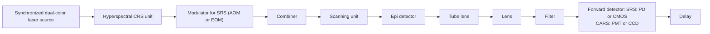

## ANNUAL REVIEWS Further

Click here to view this article's online features:

Download figures as PPT slides  
• Navigate linked references  
Download citations  
• Explore related articles  
• Search keywords

# In Situ and In Vivo Molecular Analysis by Coherent Raman Scattering Microscopy

Chien-Sheng Liao1 and Ji-Xin Cheng1,2,3,4,5

1Weldon School of Biomedical Engineering, Purdue University, West Lafayette, Indiana 47907; email: liao44@purdue.edu  
2Department of Chemistry, Purdue University, West Lafayette, Indiana 47907  
3Purdue University Center for Cancer Research, Purdue University, West Lafayette, Indiana 47907  
4Birck Nanotechnology Center, Purdue University, West Lafayette, Indiana 47907  
5School of Electrical and Computer Engineering, Purdue University, West Lafayette, Indiana 47907; email: jcheng@purdue.edu

Annu. Rev. Anal. Chem. 2016. 9:6993

The Annual Review of Analytical Chemistry is online at anchem.annualreviews.org

This article's doi: 10.1146/annurev-anchem-071015-041627

Copyright c 2016 by Annual Reviews. All rights reserved

## Keywords

Raman scattering, vibrational spectroscopy, biomedical imaging

## Abstract

Coherent Raman scattering (CRS) microscopy is a high-speed vibrational imaging platform with the ability to visualize the chemical content of a living specimen by using molecular vibrational fingerprints. We review technical advances and biological applications of CRS microscopy. The basic theory of CRS and the state-of-the-art instrumentation of a CRS microscope are presented. We further summarize and compare the algorithms that are used to separate the Raman signal from the nonresonant background, to denoise a CRS image, and to decompose a hyperspectral CRS image into concentration maps of principal components. Important applications of single-frequency and hyperspectral CRS microscopy are highlighted. Potential directions of CRS microscopy are discussed.

## INTRODUCTION

Thus far, the majority of our knowledge about the chemical content in cells or tissues comes from analysis of fixed samples or homogenates. These in vitro assays can only detect the presence of molecules. Without information of spatiotemporal dynamics, it still remains difficult to either probe transient/localized accumulation of metabolites or biomarkers, or determine whether the detected species is the cause or consequence of a biological event. To move from detecting the presence of molecules to fully understanding their functions (1), in situ and in vivo molecular analysis is becoming a frontier in the field of analytical chemistry. In this article we scrutinize the recent progress in developments and applications of coherent Raman scattering (CRS) microscopy, an emerging platform that allows high-speed vibrational spectroscopic imaging of biomolecules in living systems.

Raman scattering, an inelastic scattering process induced by molecular vibrations, was reported in 1928 by Raman & Krishnan (2). Since the invention of lasers in the 1960s, Raman spectroscopy has become a powerful analytical tool for label-free, quantitative analysis of molecules in gas, in solutions, or at an interface. In 1979 Abraham & Etz (3) resolved the spatial distribution of molecules in biological tissues using a Raman microscope. Now, commercially available confocal Raman microscopy providing submicron spatial resolution has reached millisecond-scale spectral acquisition speed. This speed is not yet sufficient for imaging living systems. CRS microscopy (4), based on either coherent anti-Stokes Raman scattering (CARS) or stimulated Raman scattering (SRS), has been developed to overcome the speed limitations. CARS is a third-order nonlinear optical process in which three laser fields, namely a pump field at frequency $\omega _ { p } ;$ a Stokes field at frequency $\omega _ { s }$ , and a probe field at frequency $\omega _ { p r }$ , are involved. When the energy difference of the pump and Stokes beams $( \omega _ { p } - \omega _ { s } )$ matches the frequency of a molecular vibration mode (), the Raman resonance occurs. This resonance is then probed by the third field at $\omega _ { p r } ,$ generating an anti-Stokes field at $( \omega _ { p } - \omega _ { s } ) + \omega _ { p r }$ . The CARS signal appears at a higher-frequency end and therefore is spectrally separated from the one-photon fluorescence. Meanwhile, the CARS signal is accompanied by a vibrationally nonresonant background contributed by electronic motions.

CARS was observed first by Terhune et al. in 1965 (5). Thereafter, CARS spectroscopy was widely applied to study the dynamics of chemical reactions (6, 7). The first CARS microscope with noncollinearly overlapped pump and Stokes beams focusing on a single vibrational frequency was reported in 1982 (8). In 1999, Zumbusch et al. (9) demonstrated CARS imaging of living cells using a tightly focused femtosecond laser source with collinear beam geometry. Subsequent developments of picosecond excitation with polarization control (10), epi-detected CARS (11), time-resolved CARS (12), interferometric CARS (13), and frequency modulation (14) aimed to reduce the nonresonant background and thus enhance the vibrational contrast. The image acquisition speed of single-frequency CARS reaches video rates (15). Spectroscopic CARS imaging techniques that acquire a CARS spectrum at each pixel were developed to resolve spectrally overlapped Raman bands. Methods include the fast tuning of an optical parametric oscillator (OPO) (16), spectral focusing (17), multiplex excitation (18, 19), and broadband excitation (20). In broadband CARS microscopy, spectral coverage of $\sim 3 , 0 0 0 \ \mathrm { c m ^ { - 1 } }$ with an acquisition time of 3.5 ms per pixel was recently reported (21).

SRS is a dissipative process that occurs simultaneously with CARS. When the beating frequency $( \omega _ { p } - \omega _ { s } )$ ) is tuned to excite a molecular vibration, the energy difference between $\omega _ { p }$ and $\omega _ { s }$ pumps the molecule from a ground state to a vibrationally excited state. The laser field manifests itself as a weak decrease in the pump beam intensity, called stimulated Raman loss (SRL), and a simultaneous increase in the Stokes beam intensity, called stimulated Raman gain (SRG). Because the Raman gain or loss signal appears at the same frequency as one of the incident beams, optical modulation and demodulation are needed to extract the SRS signal.

Woodbury & Ng (22) reported SRS phenomenon in 1962. Thereafter, femtosecond SRS spectroscopy was developed to study the dynamics of chemical and biochemical reactions at femtosecond-scale temporal resolution (for a review, see 23). In 2007, Ploetz et al. (24) demonstrated SRS microscopy using a femtosecond laser with a kilohertz repetition rate to generate the narrowband pump beam and the white continuum Stokes beam. In 2008, Freudiger et al. (25) demonstrated real-time, single-frequency SRS microscopy using a laser with a repetition rate of 76 MHz. In their scheme, an electro-optic modulator modulated the Stokes beam at megahertz frequency, and a lock-in amplifier demodulated the SRL signal from the pump beam. Since then, several hyperspectral SRS techniques have been published (26–29). Slipchenko et al. (30) established an alternative scheme of demodulation using a tuned amplifier, which enabled the development of a tuned amplifier array for multiplex SRS imaging (31).

Along with the efforts to improve instrumentation, various chemometrics approaches have been adopted to decompose the three-dimensional data (x-y-) in a hyperspectral CRS image into chemical maps (21, 27, 32, 33). The spectral fidelity and image quality were improved by algorithms that remove the noise in spatial and spectral domains (34–37). For CARS microscopy, researchers developed phase retrieval algorithms (38–42) to extract the Raman-resonant signals from the raw CARS spectra.

We review the basic theory of CRS and the most widely adopted instrumentation strategies for CRS microscopy. We discuss methods for hyperspectral data analysis and present different modalities of CRS microscopy and their applications, including single-frequency CRS, frame-byframe-based hyperspectral CRS, and multiplex CRS. Because of space limitations, we reviewed only part of the literature relevant to CRS microscopy. We recommend other reviews that can help readers achieve a broader coverage of this field (43–51).

## THEORETICAL DESCRIPTION OF COHERENT RAMAN SCATTERING

CRS belongs to a nonlinear optical process termed four-wave mixing that involves four waves at frequencies $\omega _ { s i g } , \omega _ { 0 } , \omega _ { p }$ , and ω . Here, p and s stand for pump and Stokes analogous to spontaneous Raman. In most experiments, only the pump and Stokes waves are used. When these waves are spatially and temporally overlapped into a medium, four CRS processes occur simultaneously, namely CARS at frequency $( \omega _ { p } - \omega _ { s } ) + \omega _ { p }$ , coherent Stoke Raman scattering (CSRS) at frequency $\omega _ { s } - ( \omega _ { p } - \omega _ { s } )$ , SRG at frequency $\omega _ { s }$ , and SRL at frequency $\omega _ { p }$ . In SRG the Stokes field experiences a gain in intensity, whereas in SRL the pump field experiences a loss. There also exists a Raman-induced Kerr effect (RIKE), where a new polarization component is produced. Detailed descriptions of these processes can be found elsewhere (52). Figure 1 illustrates the input and output fields in CARS, SRG, and SRL.

The CRS signal arises from an induced third-order nonlinear polarization expressed by

$$
\mathbf {P} ^ {(3)} (\omega_ {s i g}) = \varepsilon_ {0} D \chi^ {(3)} (\omega_ {s i g}; \omega_ {0}, \omega_ {p}, - \omega_ {s}) \mathbf {E _ {0}} \mathbf {E _ {p}} \mathbf {E _ {s} ^ {*}}, \tag {1.}
$$

where is the number of distinct permutations of the fields. 6 for three distinct fields, and D 3 for $\omega _ { 0 } = \omega _ { p }$ or ω (53). $\chi ^ { ( 3 ) }$ is the third-order susceptibility containing an electronic and a vibrational contribution,

$$
\chi^ {(3)} = \chi_ {C A R S} ^ {(3)} = \chi_ {S R L} ^ {(3)} = \chi_ {S R G} ^ {(3) *} = \chi_ {N R} ^ {(3)} + \frac {\chi_ {R} ^ {(3)}}{\Delta - i \Gamma}, \tag {2.}
$$

where $\chi _ { N R } ^ { ( 3 ) }$ is the electronic contribution that is vibrationally nonresonant, $\chi _ { R } ^ { ( 3 ) }$ is related to the Raman scattering cross-section,  is the Raman line width, and $\Delta = \Omega - ( \omega _ { p } - \omega _ { s } )$ is the detuning

text_image

Input
Output
Ω
ωs ωp
SRG
SRL
ωs ωp 2ωp - ωs
CARS

Figure 1

Input and output of CARS, SRG, and SRL. Abbreviations: CARS, coherent anti-Stokes Raman scattering; SRG, stimulated Raman gain; SRL, stimulated Raman loss.

from a vibrational transition at . The imaginary part of $\chi ^ { ( 3 ) }$ ,

$$
I m [ \chi^ {(3)} ] = \frac {\chi_ {R} ^ {(3)} \Gamma}{\Gamma^ {2} + \Delta^ {2}}, \tag {3.}
$$

exhibits a Lorentzian profile as the spontaneous Raman line shape. Under the slowly varying amplitude approximation, the CRS field has the following form,

$$
\mathbf {E} _ {\mathbf {C R S}} (\omega_ {s i g}) = i \chi^ {(3)} (\omega_ {s i g}; \omega_ {0}, \omega_ {p}, - \omega_ {s}) \mathbf {E} _ {0} \mathbf {E} _ {\mathbf {p}} \mathbf {E} _ {\mathbf {s}} ^ {*}. \tag {4.}
$$

Here we neglect the coefficients before $\chi ^ { ( 3 ) }$ for simplicity. The CARS signal appears at the anti-Stokes frequency. Under the tight focusing condition, the phase-matching condition is relaxed, and the forward-detected CARS intensity can be written as

$$
I _ {C A R S} (2 \omega_ {p} - \omega_ {s}) = \left| \chi_ {N R} ^ {(3)} + \frac {\chi_ {R} ^ {(3)}}{\Delta - i \Gamma} \right| ^ {2} I _ {p} ^ {2} I _ {s}. \tag {5.}
$$

As shown in Equation 5, the CARS spectral profile is dispersed owing to the interference between the resonant and nonresonant contributions, resulting in a red shift of the peak and the appearance of a dip at the higher wavenumber side. An effective way to remove the nonresonant background is to measure the CARS signal at the peak and dip of a Raman band. For a weak Raman scatterer, the difference of the CARS intensities at the peak and dip positions is written as

$$
I _ {C A R S} ^ {\text { peak - dip }} = \frac {2 \chi_ {R} ^ {(3)} \chi_ {N R} ^ {(3)}}{\Gamma} I _ {p} ^ {2} I _ {s}. \tag {6.}
$$

Thus, modulation between the peak and dip frequencies is a straightforward way to remove the nonresonant background. Under the shot noise limit, the noise in frequency modulating CARS equals the square root of the nonresonant background, and the signal-to-noise ratio (SNR) is

written as

$$
S N R _ {C A R S} = \frac {2 \chi_ {R} ^ {(3)}}{\Gamma} I _ {p} \sqrt {I _ {s}}. \tag {7.}
$$

Unlike CARS that appears at a new frequency, the SRL field appears at the same frequency as the pump wave,

$$
\mathbf {E} _ {\mathrm{SRL}} (\omega_ {p}) = i \chi_ {S R L} ^ {(3)} \mathbf {E} _ {\mathbf {s}} \mathbf {E} _ {\mathbf {p}} \mathbf {E} _ {\mathbf {s}} ^ {*}. \tag {8.}
$$

The total intensity, which is the mixing of the SRL field and the local oscillator $( \mathbf { E } _ { \mathrm { p } } )$ , is expressed as

$$
I _ {t o t a l} = \left| \mathbf {E} _ {\mathrm{p}} + \mathbf {E} _ {\mathrm{SRL}} \right| ^ {2}. \tag {9.}
$$

Being heterodyne-detected via mixing with the modulated Stokes wave, the Raman-induced modulation of the pump laser intensity is dominated by the interference term between the SRL field and the local oscillator $\bf { E _ { p } } ,$

$$
\Delta I (\omega_ {p}) = - 2 I m [ \chi_ {S R L} ^ {(3)} ] I _ {p} I _ {S}, \tag {10.}
$$

where the negative sign indicates a loss of intensity in the pump wave. Similarly, for SRG the Stokes laser intensity is modulated with a gain of

$$
\Delta I (\omega_ {s}) = 2 I m [ \chi_ {S R G} ^ {(3)} ] I _ {p} I _ {s}. \tag {11.}
$$

Both SRL and SRG have the same spectral profile as spontaneous Raman. A synergistic effect of SRL and SRG is the transfer of photon energy $b ( \omega _ { p } - \omega _ { s } )$ from the incident waves to the sample, resulting in a real vibrational excitation. Under the shot noise limit and resonant condition $( \triangle = 0 )$ , the noise in SRG equals the square root of $I _ { s } ,$ , and the SNR is written as

$$
S N R _ {S R G} = \frac {2 \chi_ {R} ^ {(3)}}{\Gamma} I _ {p} \sqrt {I _ {s}}. \tag {12.}
$$

A comparison between Equation 7 and Equation 12 shows that CARS and SRS have the same detection sensitivity.

## BUILDING A COHERENT RAMAN MICROSCOPE

In a most widely adopted CRS microscope (Figure 2a), two synchronized laser pulse trains are spatially overlapped and then sent to a laser scanning microscope. In this section, we discuss various laser sources and detection schemes used for single-frequency and multiplex CRS imaging.

## Laser Sources

A laser source that outputs either dual-color, synchronized pulse trains or a broadband pulse train is needed for CRS imaging. Moreover, because both CARS and SRS are nonlinear processes, pulsed lasers are required to utilize pulsed lasers to generate a strong signal. Several sources were developed to meet these requirements. The first approach uses two electronically synchronized, mode-locked Ti:sapphire lasers that produce mode-locked pulse trains with a repetition rate of ${ \sim } 8 0 ~ \mathrm { M H z } ,$ watt-level average power, and pulse duration from several picoseconds to 100 fs (54). The second approach uses a mode-locked picosecond $\mathrm { N d } { : } \mathrm { Y V O } _ { 4 }$ laser at 1,064 nm that synchronously pumps an OPO by its second harmonic (55). The third approach deploys a femtosecond Ti:sapphire laser to pump an OPO (56). For a single-frequency CRS microscope, high spectral resolution can be achieved with two transform-limited picosecond lasers or two spectrally focused femtosecond lasers. For a hyperspectral CRS microscope, the laser sources can be two tunable lasers with picosecond pulse duration, or two femtosecond lasers by the aid of linear chirping (Figure 2b) or pulse shaping (Figure 2c) techniques. The combination of a picosecond laser with a femtosecond laser or supercontinuum for multiplex CRS imaging has also been reported (19, 20, 31, 57–61).

flowchart

b Hyperspectral by spectral focusing  

text_image

ps output pulses
Glass rod
fs input pulses
t

c Hyperspectral by pulse shaping  

text_image

ps output pulses
M
SL
L
G
fs input pulses
ω
ω

Figure 2  
Schematic of a CRS microscope. Two temporally synchronized lasers are used to excite the molecular vibration. For single-frequency CRS, two picosecond or femtosecond lasers can be applied. For hyperspectral CRS, a tunable picosecond laser or a femtosecond laser with linear chirping or pulse shaping is needed. A detailed description of these hyperspectral techniques can be found in the text. Abbreviations: AOM, acousto-optic modulator; CARS, coherent anti-Stokes Raman scattering; CCD, charge-coupled device; CMOS, complementary metal-oxide semiconductor; CRS, coherent Raman scattering; EOM, electro-optic modulator; fs, femtosecond pulse; G, grating; L, lens; M, mirror; PD, photodiode; PMT, photomultiplier tube; ps, picosecond pulse; SL, slit; SRS, stimulated Raman scattering.

## Detection Schemes

In a CRS microscope, an objective lens with high numeric aperture is commonly used to fulfill the tight focusing condition and maximize the power density on the sample. A photomultiplier tube (PMT) collects CARS signals with a bandpass filter in the front to block the excitation laser beams. The SRS imaging modality can be built on a CARS microscope with a few modifications. An acousto-optic modulator (AOM) or electro-optic modulator (EOM) is added to modulate the pump or Stokes laser intensity at megahertz frequency. For SRS imaging, the use of an oil condenser is critical for suppressing the background induced by cross-phase modulation. Unlike a

CARS microscope, which uses a PMT as the photodetector, an SRS microscope uses photodiodes that can handle high laser power at the milliwatt level. A demodulator then extracts the SRL or SRG signals at the modulation frequency from the local oscillator. For high-speed SRS imaging, demodulation can be performed by a lock-in amplifier (25). A tuned amplifier that resonates at the modulation frequency provides a cost-effective way to demodulate the SRS signals (30). Hyperspectral CARS or SRS imaging is performed by tuning the wavelength of a picosecond laser or tuning the delay between two chirped femtosecond pulses.

Advanced detection schemes for multiplex CRS imaging have been developed. In multiplex or broadband CARS, a charge-coupled device (CCD) collects the dispersed CARS signals. For multiplex SRS, a photodiode array (62) or complementary metal-oxide semiconductor array (63) is used to collect dispersed SRS signals. The demodulation can be performed by either subtracting the background from the signal or using demodulators such as a multichannel lock-in amplifier (64) or a tuned amplifier array (31).

## HYPERSPECTRAL COHERENT RAMAN SCATTERING IMAGE ANALYSIS

Providing spectral information at each pixel, hyperspectral CRS images are three-dimensional, including x, y, and the Raman shift . The primary goal of hyperspectral data analysis is to generate concentration maps of individual species based on their Raman spectral profiles. A panel of image processing methods has been adopted to convert hyperspectral CRS image data to chemical maps. These methods include denoising, phase retrieval, principal component analysis, and multivariate curve resolution. The denoising algorithms, based on either singular value decomposition (SVD) or spectral total variation (STV), remove the noise in spatial and spectral domains to improve the SNR and spectral fidelity. Based on either time-domain Kramers-Kronig (TDKK) transform or the maximum entropy model (MEM), the phase retrieval algorithms extract the Raman-resonant signals from raw CARS signals mixed with the nonresonant background. Principal component analysis (PCA) determines the number of major components in the hyperspectral image data. Finally, multivariate curve resolution (MCR) generates a concentration map for every principal component.

## Denoising a Hyperspectral Coherent Raman Scattering Image

Under the optimized condition, shot noise is the main noise source that degrades the image quality and the spectral fidelity. Longer integration time or frame averaging could increase the SNR but at the price of sacrificing the imaging speed. An image-processing algorithm that reduces the noise in both spectral and spatial dimensions is important for in vivo imaging applications. Denoising two-dimensional images is well studied in the literature (65, 66). Two methods denoise hyperspectral image data that contain three-dimensional information. One method uses SVD to remove components that are dominated by random noise. The other method utilizes the spatialspectral correlation of signals and the statistical independence of the noise.

Denoising by singular value decomposition. SVD is widely used for noise reduction in spectroscopic images (32, 34–36). This method first factorizes the data matrix D into three matrix factors, ${ \bf D } = { \bf U } { \bf S } { \bf V } ^ { \bf T }$ , where the unitary matrix U corresponds to an array of spectral vectors; S is a diagonal matrix composed of singular values; and V corresponds to an array of spatial vectors. Then the number of significant singular values in S is objectively determined, and the rest of the singular values are considered to be noise dominated and set to zeros to generate a new diagonal matrix S- . The noise-reduced data D- can be reconstructed using $\mathbf { D } ^ { \prime } = \mathbf { U } \mathbf { S } ^ { \prime } \mathbf { V } ^ { \mathbf { T } }$ . The determination of significant singular values is the key to denoising. Several criteria have been reported, including the decline in the slope of singular values, the first-order autocorrelation function of spectral and spatial matrices, and the randomness of residual plots for the difference between the original and reconstructed spectroscopic image data (67, 68).

Denoising by spectral total variation. STV denoises a hyperspectral image by utilizing the spatial-spectral correlation of the signal and the statistical independence of the noise (37). This method is a numerical optimization algorithm that solves the problem

$$
\underset {f} {\text { minimize }} \frac {1}{2} \| f - g \| ^ {2} + \frac {1}{\mu} \| D f \| _ {1}, \tag {13.}
$$

where g is a vector of the observed (noisy) image; f is a vector of the desired (clean) image; μ is a parameter to determine the relative emphasis of the first term and the second term; and D is a matrix representing the first-order forward finite-difference operators along the horizontal, vertical, and wavelength directions, defined as

$$
\mathbf {D} _ {x} \mathbf {f} = \mathbf {f} _ {x + 1, y, \lambda} - \mathbf {f} _ {x, y, \lambda},
$$

$$
\mathbf {D} _ {y} \mathbf {f} = \mathbf {f} _ {x, y + 1, \lambda} - \mathbf {f} _ {x, y, \lambda}, \tag {14.}
$$

$$
\mathbf {D} _ {\lambda} \mathbf {f} = \mathbf {f} _ {x, y, \lambda + 1} - \mathbf {f} _ {x, y, \lambda}.
$$

The first term of Equation 13 is a quadratic term for the residue between the observed image and the solution, and the second term is a total variation term for the solution. The parameter $\mu$ is a function depending on the noise level σ of each spectral frame. An image with a large noise level requires more smoothing, and therefore $\mu$ should be small. The relationship between $\mu$ and $\sigma$ can be determined empirically:

$$
\mu \approx \frac {1}{\sigma^ {\alpha}}, \tag {15.}
$$

where $1 \leq \alpha \leq 1 . 2$ . Therefore, by estimating the noise level σ of each spectral frame, Liao et al. (37) denoised hyperspectral SRS images of diluted dimethyl sulfoxide solutions and Caenorhabditis elegans and improved SNR by up to 57 times.

A quantitative comparison of denoising performance between SVD and STV was given by Liao et al. (37). In general, SVD eliminates the noise contributed by insignificant components, and therefore, it requires prior knowledge of the sample, such as the number of major species and the spectral features. STV reduces the noise level on the basis of the spatial-spectral correlation of signals. The knowledge of the optical system, for example, the spatial and spectral resolutions, determines the denoising parameter and the performance of the STV algorithm.

## Phase Retrieval

The CARS signal contains a Raman-resonant and a nonresonant contribution to the third-order nonlinear susceptibility, which can be expressed as

$$
\left| \chi^ {(3)} \right| = \left| \chi_ {N R} ^ {(3)} + \frac {\chi_ {R} ^ {(3)}}{\Delta - i \Gamma} \right| = \left| \chi_ {N R} ^ {(3)} + \chi_ {R ^ {\prime}} ^ {(3)} + i \chi_ {R ^ {\prime \prime}} ^ {(3)} \right|, \tag {16.}
$$

where the resonant component is composed of real $( \chi _ { R ^ { \prime } } ^ { ( 3 ) } )$ and imaginary $( \chi _ { R ^ { \prime \prime } } ^ { ( 3 ) } )$ parts, and the nonresonant contribution $( \chi _ { N R } ^ { ( 3 ) } )$ contains only a real part. The imaginary part of $\begin{array} { r } { \chi ^ { ( 3 ) } ( I m [ \chi ^ { ( 3 ) } ] = \frac { \chi _ { R } ^ { ( 3 ) } \Gamma } { \Gamma ^ { 2 } + \Delta ^ { 2 } } ) . } \end{array}$ χ (3)  R 2 2 ), representing the Raman line shapes, can be calculated by the following equation if the spectral

phase (ϕ) is known,

$$
I m [ \chi^ {(3)} ] = | \chi^ {(3)} | \sin (\varphi). \tag {17.}
$$

Two methods, based on either TDKK (41, 42) or MEM (39), were developed to retrieve the spectral phase from the raw CARS spectrum without prior knowledge of the sample.

Time-domain Kramers-Kronig transform. The Kramers-Kronig relation is widely used to obtain phase information from the modulus of susceptibility under the assumption of a causal and holomorphic response,

$$
\varphi (\omega) = - \frac {P}{\pi} \int_ {- \infty} ^ {+ \infty} \frac {\ln | \chi (\omega^ {\prime \prime}) |}{\omega^ {\prime \prime} - \omega} d \omega^ {\prime \prime}, \tag {18.}
$$

where $\chi ( \omega ) = | \chi ( \omega ) | \exp [ i \varphi ( \omega ) ]$ , and P is the Cauchy principal value. For CARS, there are two major difficulties when applying the Kramers-Kronig relation in a frequency domain. One is that the CARS signal is a mixture of nonresonant background and Raman resonance. This mixture leads to the inequality in the magnitudes of real and imaginary parts of the spectral phase, which does not agree with the assumption of causality. Moreover, in the case that ω goes to infinity and $\chi ( \omega )$ approaches zero, $l n | \chi ( \omega ) |$ goes to negative infinity. To resolve these problems, an alternative form of TDKK using the Fourier series approach was reported (69). The spectral phase as a function of the signal modulus is represented in the time domain as

$$
\varphi (\omega) = \frac {- 1}{\pi} P \int_ {- \infty} ^ {+ \infty} \frac {l n | \chi (\omega^ {\prime}) |}{\omega^ {\prime} - \omega} d \omega^ {\prime} = 2 I m \left[ \psi (l n | \chi (\omega) |) - \frac {l n | \chi (\omega) |}{2} \right], \tag {19.}
$$

where the operator ψ( f (ω)) is defined as

$$
\psi (f (\omega)) = \frac {1}{\sqrt {2 \pi}} F [ u (t) ] ^ {*} F [ F ^ {- 1} [ f (\omega) ] ] = \frac {1}{\sqrt {2 \pi}} F [ u (t) ] ^ {*} f (\omega), \tag {20.}
$$

and $u ( t )$ is the Heaviside step function (41). Based on the above Kramers-Kronig relation, one can represent the nonresonant background as a finite amplitude negative-time component. The Fourier transform of the nonresonant background is a symmetric function centered at time zero with a finite width. Assuming that the CARS signal has a negative-time component only from the nonresonant background and the positive-time response contains both Raman-resonant and nonresonant components, one can extract the spectral phase by replacing the Heaviside step function with the following function (41):

$$
\eta (t: f (\omega)) = \left\{ \begin{array}{l} F ^ {- 1} [ f (\omega) ], t \geq 0 \\ F ^ {- 1} [ f _ {N R} (\omega) ], t <   0 \end{array} \right\}. \tag {21.}
$$

By combining Equations 20 and 21, the spectral phase can be extracted.

Maximum entropy model. The MEM approach assumes that the data are consistent with the maximized entropy of the associated probability distribution. Therefore, the CARS spectrum can be fitted with the model by MEM and the spectral phase function can be estimated. In MEM, the CARS line shape function is represented as (70)

$$
S (\upsilon) = \left| \frac {\beta}{1 + \sum_ {k = 1} ^ {M} a _ {k} \exp (- 2 \pi i k \upsilon)} \right| ^ {2} = \left| \frac {\beta}{A _ {M} (\upsilon)} \right| ^ {2}, \tag {22.}
$$

where ν is the normalized frequency defined as

$$
\upsilon = \frac {\omega_ {a s} - \omega_ {m i n}}{\omega_ {m a x} - \omega_ {m i n}}. \tag {23.}
$$

The maximum entropy coefficients $a _ { k }$ and $\beta$ can be formulated as a Toeplitz matrix,

$$
\left[ \begin{array}{c c c c} C _ {0} & C _ {1} ^ {*} & \dots & C _ {M} ^ {*} \\ C _ {1} & C _ {0} & \dots & C _ {M - 1} ^ {*} \\ \vdots & \vdots & \ddots & \vdots \\ C _ {M} & C _ {M - 1} & \dots & C _ {0} \end{array} \right], \tag {24.}
$$

where $C _ { M }$ is the discrete Fourier transform of the CARS line shape at normalized frequencies, represented as

$$
C _ {m} = L ^ {- 1} \sum_ {j = 0} ^ {L - 1} S (v _ {j}) \exp (2 \pi i m v _ {j}). \tag {25.}
$$

Therefore, one can estimate $C _ { M } ,$ , resolve the Toeplitz matrix for the maximum entropy coefficients, and then obtain the CARS line shape function. The spectral phase can be retrieved by

$$
\varphi (\upsilon) = \arg [ A _ {M} (\upsilon) ]. \tag {26.}
$$

This approach has been explicitly discussed in References 38 and 39 and used in CARS microscopy to extract the Raman signal.

## Principal Component Determination

Principal component analysis (PCA) is widely applied for both hyperspectral CARS and SRS microscopy (71, 72) to characterize the principal components in a hyperspectral image. PCA rotates the coordinate of the dataset to a new space to reduce the number of dimensions. This can be done by SVD, in which the rank of eigenvalue and eigenvector is provided to determine the major components. As discussed above, the data matrix D is factorized into three matrix factors, $\mathbf { D } = \mathbf { U } \mathbf { S } \mathbf { V } ^ { \mathbf { T } }$ , where the unitary matrix U corresponds to an array of spectral vectors, S is a diagonal matrix composed of singular values, and V corresponds to an array of spatial vectors. The number of major components can thus be assessed by the singular values, given that the nonmajor components have a singular value close to zero.

## Spectral Unmixing

Hyperspectral images can be decomposed into chemical maps of major components by methods including linear unmixing (21), multivariate curve resolution (MCR) (27), independent component analysis (32), spectral phasor analysis (33), or factorization into spectra and concentrations (73). MCR analysis has been applied to hyperspectral SRS microscopy (27, 74, 75). MCR is a bilinear model (76), capable of decomposing a measured spectral data set D into concentration profiles and spectra of chemical components, represented by matrices C and $\mathbf { S } ^ { \mathrm { T } } , \mathbf { D } = \mathbf { C } \cdot \mathbf { S } ^ { \mathrm { T } } + \mathbf { E }$ . Here, T is the transpose of matrix S. E is the residual matrix or experimental error. The inputs to MCR are the dataset D and the reference spectra of each component. S contains the output spectra of all fitted components. The output concentration of a chemical component at each pixel is expressed as a percentage relative to the intensity of the MCR-optimized spectrum. Given an initial estimate of pure spectra either from PCA or prior knowledge of the sample, an alternating least squares algorithm calculates C and S iteratively until the results optimally fit the data matrix D. Nonnegativity on both concentration maps and spectral profiles can be applied as a constraint during the alternating least squares iteration. To reduce ambiguity associated with MCR decomposition (77), a data augmentation matrix composed of repeating reference spectra can be added to the spectral dataset D. The enhanced weight on pure reference spectra ensures that the MCR algorithm selectively recovers concentration profiles for the corresponding Raman bands from dataset D.

## SINGLE-FREOUENCY COHERENT RAMAN SCATTERING MICROSCOPY

## Methods

Single-frequency CRS microscopy focuses all laser energy onto a specific Raman band to maximize the imaging speed until video rate (15, 78). The spectral bandwidth of a typical Raman band is ${ \sim } 1 0 ~ \mathrm { c m ^ { - 1 } }$ . Therefore, to achieve high spectral resolution, picosecond excitation is preferred. By contrast, owing to the nature of the nonlinear interaction of CRS, a high-peak laser power is required to generate signals. As a result, femtosecond excitation can generate a larger signal level. Moreover, to couple CRS with other widely used imaging modalities, including two-photon excitation fluorescence, second harmonic generation, and third harmonic generation, femtosecond pulse excitation is preferred (79, 80). The signal-to-background ratios of CARS and SRS as the function of the pulse spectral width have been extensively studied (11, 81, 82). For the CARS signal, the use of femtosecond pulse as the excitation increases not only the Raman-resonant signal, but also the nonresonant background. The ratio of resonant signal to the nonresonant background can reach the maximum in the case that the width of the excitation pulses equals the spectral width of the Raman band (11, 81). For SRS that is not interrupted by the nonresonant background, the signal level can be increased by more than one order using femtosecond excitation. For a broad Raman line with a bandwidth of $2 5 ~ \mathrm { c m ^ { - 1 } }$ , the SRG signal is amplified 30 times when the pulse spectral width increases from $1 \ { \mathrm { c m } } ^ { - 1 } \ ( { \mathrm { \sim } } 1 4 \ { \mathrm { p s } } ) \ { \mathrm { t o } } \ 1 2 0 \ { \mathrm { c m } } ^ { - 1 } \ ( { \mathrm { \sim } } 1 2 0 \ { \mathrm { f s } } )$ (82). For narrow Raman bands, picosecond or spectrally focused femtosecond pulses are preferred to minimize the cross-phase modulation background in SRS microscopy.

In addition to optimizing the pulse duration for higher signal level, the nonresonant background in the CARS signal can be removed by techniques including polarization-sensitive CARS (10, 83), time-resolved CARS (12), interferometric CARS (13), and frequency-modulated CARS (14). In polarization-sensitive CARS, a polarizer is used before the detector to block the nonresonant background, which is linearly polarized but not parallel to the Raman-resonant signal (10). In time-resolved CARS, the Raman free-induction decay of molecular vibrations is recorded. The instantaneous nonresonant background can thus be separated in the time domain (12). In interferometric CARS, a third beam at the CARS wavelength is introduced as the local oscillator and the interferometric mixing term are detected, in which the phase of the local oscillator is adjusted to minimize the nonresonant background (13). In frequency-modulated CARS, the CARS intensities at the peak and dip positions are compared at each pixel (14). The intensity difference is free from the nonresonant background and is linearly proportional to the concentration of the target species.

SRS microscopy is not completely background free. In an intensity-modulated single-frequency SRS microscope, pump-probe signals including cross-phase modulation, two-photon absorption, and photothermal effects can be generated by the same laser beams and they contribute to the non-Raman background in the SRS image. These backgrounds can be removed by harnessing their difference from the SRS signal in the spectral domain (84–86). For example, Zhang et al. (86) developed a spectral modulation scheme for SRS microscopy in which an AOM in a pulse shaper switched between two excitation wavelengths within a femtosecond pulse at megahertz rate. Another way to remove backgrounds is to detect the SRL and SRG signals simultaneously. Berto et al. (87) demonstrated three-beam SRS microscopy with frequencies at $\omega _ { 0 } , ( \omega _ { 0 } - \Omega ) , \mathrm { a n d } ( \omega _ { 0 } + \Omega )$ , where  is the molecular vibrational mode. In this scheme, lasers at $( \omega _ { 0 } - \Omega )$ and $( \omega _ { 0 } + \Omega )$ were modulated by two AOMs and with a 180◦ phase delay. Therefore, SRL and SRG signals were detected simultaneously from the local oscillator at $\omega _ { 0 } ,$ , and thus the background was canceled out (87).

In the case that the excitation wavelengths cover Raman bands that are spectrally overlapped, single-frequency excitation provides poor chemical specificity. To address this issue, Freudiger et al. (88) utilized a spatial light modulator to code two excitation patterns in a femtosecond pulse, and used an EOM to fast switch these two patterns at megahertz rate. The excitation pattern can be programmed to match a known, specific molecular vibration mode. An easier way is to record a stack of CRS images sequentially at multiple Raman shifts (89). To this end, hyperspectral CRS microscopy has been extensively developed, which is discussed below.

## Applications

Single-frequency CRS microscopy has been applied to the fields of chemistry, materials science, biology, and medicine. For single-cell analysis, the C-H stretching region with Raman peaks at 2,850 and $2 , 9 4 0 \ \mathrm { c m ^ { - 1 } }$ is commonly used to image lipid and protein at submicron resolution. For example, lipid droplet dynamics was monitored during differentiation in 3T3-L1 cells (90), lipolysis in adipocytes (91), accumulation induced by excess free fatty acid in cancer cells (92), and early embryo development (93). The accumulation of lipid was used to differentiate the circulating tumor cells from leukocytes (94). Besides lipid droplets, SRS microscopy can image polytene DNA in the nucleus, which contains multiple copies of tightly bound chromosomes and exhibits Raman peaks at 785 and $1 , 0 9 0 \mathrm { c m } ^ { - 1 } \left( 9 5 \right)$ . Quantitation of lipid storage influenced by metabolic pathways (96) was studied in C. elegans using a label-free method (97). The quantitative measurement of lipid storage has also been applied to identify 9 out of 272 genes whose inactivation increased fat content by more than 25% (98). Studies of myelin disease and spinal cord injury used CRS microscopy at the tissue level to visualize the myelin sheath in the central (99–103) and peripheral (104, 105) nervous systems. For medical imaging, Freudiger et al. (89) and Ji et al. (106) showed that, by the linear combination of SRS images at peaks of 2,850 and $2 , 9 4 0 \mathrm { c m } ^ { - 1 }$ for $\mathrm { C H } _ { 2 }$ and CH vibration modes, a stain-free histopathological image comparable to a hematoxylin and eosin (H&E) stained image can be achieved (Figure 3a).

To improve the chemical selectivity of single-frequency CRS microscopy, researchers deployed deuterated molecules (82, 107) or alkyne-tagged molecules (108–110) to study specific molecules from the single-cell level to the tissue level. For example, Zhang et al. (82) visualized the cellular uptake of deuterated fatty acid, which exhibited a C-D Raman signal at $2 , 1 3 3 \mathrm { c m } ^ { - 1 }$ and showed that oleic fatty acid facilitated the conversion of palmitic fatty acid into lipid bodies. Li & Cheng (111) used isotope-labeled glucose to track its metabolism in pancreatic cancer cells and discovered that glucose was largely utilized for lipid synthesis (Figure 3b). Wei et al. (107) used deuterium-labeled amino acids and imaged newly synthesized proteins in live mammalian cells with quantitative ratios between new and total proteomes. To increase SRS signals from the tag molecules, Wei et al. (108) reported alkyne-tagged molecules display a signal at $2 , 1 2 5 ~ \mathrm { c m } ^ { - 1 }$ by a C C chemical bond and visualized the de novo synthesis of DNA, RNA, proteins, phospholipids, and triglycerides through metabolic incorporation of alkyne-tagged precursors (Figure 3c). For imaging cholesterol storage in living cells and C. elegans, Lee et al. (110) reported the phenyl-diyne tag exhibited a Raman scattering cross-section that was 15 times larger than the alkyne group, and 88 times larger than the endogenous C  O group.

CRS microscopy has also been applied to monitor drug delivery and biomass conversion. Saar et al. (112) showed quantitative, selective imaging of the deuterated nonsteroidal antiinflammatory drug ibuprofen in propylene glycol solutions penetrating skin tissue using the

d  
t = 26 mins  

natural_image

Abstract thermal or heat map image with orange and dark tones, no visible text or symbols

t = 124 mins  

natural_image

Abstract orange-toned image with blurred dark shapes and warm tones, no visible text or symbols

z = 0 μm

natural_image

Dark abstract image with faint glowing orange shapes, no visible text or symbols

natural_image

Microscopic view of cellular or porous structure with orange-brown fluorescence (no text or symbols)

z = 12 μm  
Endogenous

e  

natural_image

Microscopic image showing scattered bright particles with a red crosshair marker and 20 μm scale bar (no text or symbols beyond scale)

line chart

| x     | y     |
|-------|-------|
| 1,000 | 0.5   |
| 1,500 | 1.2   |
| 2,000 | 0.3   |
| 2,500 | 0.4   |
| 3,000 | 0.6   |

natural_image

Microscopic image showing cellular or particulate structures with a 40 μm scale bar (no text or symbols beyond scale indicator)

line chart

| x     | y     |
|-------|-------|
| 1,000 | *     |
| 1,500 | *     |
| 2,000 | *     |
| 2,500 | *     |
| 3,000 | *     |

Figure 3

Applications of single-frequency CRS microscopy. (a) SRS and H&E images of frozen sections of normal mouse brain. Lipids are colored green and proteins are blue. (b) Upper and lower panels show SRS images of normal immortalized pancreatic epithelial cells and pancreatic cancer cells treated with 25-mM glucose-d7 in glucose-free media and with 10% FBS, respectively. Lipogenesis increased in pancreatic cancer cells compared with normal cells. (c) Time-lapse SRS images of a dividing cell that was incubated with 100-μM alkyne-tagged thymidine analog EdU. (d ) SRS images of the penetration dynamics of deuterated propylene glycol across the stratum corneum at different depths. (e) Left panels show CARS images of 3T3-L1 cells without and with incubation of 50-μM deuterated palmitic acid. Right panels show the spontaneous Raman spectra from the indicated positions in the CARS images, and the peak at $2 , 1 \bar { 3 } 3 \mathrm { c m } ^ { - 1 }$ was from deuterated palmitic acid. The Raman intensity indicated the fractions of exogenous and endogenous fatty acid in the lipid droplets. Panels a $, b , c , d ,$ and e are reprinted with permission from References 106, 111, 108, 112, and 114, respectively. Abbreviations: CARS, coherent anti-Stokes Raman scattering; CRS, coherent Raman scattering; EdU, 5-ethynyl-2 -deoxyuridine; Endo + Exo, endogenous plus exogenous; FBS, fetal bovine serum; H&E, hematoxylin and eosin; SRS, stimulated Raman scattering.

Raman band at $2 , 1 3 3 ~ \mathrm { c m ^ { - 1 } }$ (Figure 3d ). Saar et al. (113) also visualized delignification in corn stover stem by imaging the $1 { , } 6 0 0 \mathrm { c m } ^ { - 1 }$ Raman peak from aromatic stretching in lignin.

Although single-frequency CRS uses all the laser energy in a specific Raman band to maximize the image speed, it is accompanied by loss of spectral information. To address this issue, Slipchenko et al. (114) coupled a single-frequency CRS microscope with a spontaneous Raman spectrometer. Thus, the single-color CRS image of a specific Raman band served as guidance and Raman spectroscopy was performed at the area of interest. Slipchenko et al. (114) reported that the fat in adipocytes in living animals was composed of more unsaturated fatty acid than cultured adipocyte 3T3-L1 cells (Figure 3e). This method enabled Le et al. (115) to quantify the unsaturation level of lipids in wild-type and mutant C. elegans. Yue et al. (116) further used this platform to quantitatively analyze the lipid storage in prostate cancerous tissues and discovered the accumulation of esterified cholesterol in lipid bodies in aggressive prostate cancer cells.

## FRAME-BY-FRAME HYPERSPECTRAL COHERENT RAMAN SCATTERING MICROSCOPY

## Methods

Frame-by-frame hyperspectral CRS imaging is performed by tuning the excitation wavelength over a defined spectral window. The wavelength tuning can be achieved by using a mode-locked and frequency-doubled picosecond Nd:YVO laser that synchronously pumps an OPO to generate a signal beam and an idler beam (16). Hyperspectral CARS and SRS imaging were generally done by tuning the temperature of the periodically poled potassium titanyl phosphate or the lithium triborate crystal $\mathrm { ( L i B _ { 3 } O _ { 5 } ) }$ inside the OPO and adjusting the etalon setting, with a scanning range of ${ \sim } 2 0 0 \ \mathrm { c m } ^ { - 1 } \ ( 2 6 , 7 2 , 1 1 7 )$ . A limitation of this method is that it takes seconds for each step of tuning. Alternatively, Garbacik et al. (118) adjusted the angle of the intracavity Lyot filter that was synchronized to the galvano mirrors and reached the scanning range of $2 , 8 8 0 { - } 3 , 0 2 0 \ \mathrm { c m ^ { - 1 } }$ at $2 ~ \mathrm { c m } ^ { - 1 }$ resolution and subsecond tuning speed. Kong et al. (119) developed an electro-optical tunable Lyot filter and achieved a tuning range of $\sim 1 1 5 ~ \mathrm { c m ^ { - 1 } }$ at 100 µs per step.

Hyperspectral CRS imaging was also achieved with femtosecond pulses. One approach for spectral tuning is to utilize the wavelength components in a broadband femtosecond pulse. Ozeki et al. (120) used an ytterbium (Yb) fiber oscillator to generate a broadband pulse with a bandwidth $\mathrm { o f } \sim 3 0$ nm and sent the broadband pulse to a high-resolution, tunable bandpass filter in which a galvano mirror was used to tune the angle between the grating and the laser beam. The authors reported a spectral tuning range close to $3 0 0 \mathrm { c m } ^ { - 1 }$ , a resolution of 3 $\mathrm { c m } ^ { - 1 }$ , and video-rate spectral acquisition speed (29, 120). Zhang et al. (27) utilized two femtosecond pulses from a synchronously pumped OPO system. Two pulse shapers transformed the pulses to picosecond, and an automated slit on the Fourier plane in one pulse shaper selected the excitation wavelength sequentially (27). Another approach is based on spectral focusing, in which a linear positive or negative chirp is introduced to femtosecond pulses. Therefore, Raman shift tuning can be achieved by scanning the temporal overlap of the two chirped pulses. By this method, hyperspectral CARS (17) and SRS (28) with a tuning range of ${ \sim } 2 8 0 ~ \mathrm { c m ^ { - 1 } }$ have been demonstrated. Using this concept, Beier et al. (121) used a part of a femtosecond oscillator to pump a photonics crystal fiber and generated a supercontinuum as the Stokes beam. By introducing the positive chirp to the other part of the femtosecond oscillator and scanning the temporal overlap, the authors demonstrated a spectral coverage of ${ \sim } 8 0 0 ~ \mathrm { c m ^ { - 1 } }$ (121). Andresen et al. (122) generated a soliton, which is red-shifted due to a self-frequency shift, as the Stokes beam. By introducing a negative chirp to both beams and scanning the temporal overlap, the authors reported a spectral coverage of ${ \sim } 2 8 0 \ c m ^ { - 1 }$ (122).

## Applications

Frame-by-frame hyperspectral CRS microscopy has been applied to chemical imaging of single cells and tissues by resolving overlapped Raman bands. Using this approach, Fu et al. (71) demonstrated decomposition of saturated lipid, unsaturated lipid, cholesterol, protein, and water in fixed cells; Di Napoli et al. (123) showed quantitative imaging of saturated and unsaturated lipids in human adipose-derived stem cells (Figure 4a). By culturing C. elegans, a live test subject, with deuterated palmitic and oleic acid, Fu et al. (124) reported that unsaturated fatty acids are utilized preferentially for triolein synthesis incorporated into lipid droplets. Using fingerprint C C vibrations, Wang et al. (75) discovered that lysosome-related organelles are the sites of cholesterol storage in C. elegans (Figure 4b).

At the tissue level, Ozeki et al. (29) showed the potential of hyperspectral SRS for medical imaging, in which lipid, cytoplasm, filament, nucleus, and water were clearly separated (Figure 4c). Hyperspectral CARS was used to study lipid storage in muscle tissue (125) and identify cholesterol crystals from condensed aliphatic lipids in atherosclerotic plaques in mouse model (126). Suhalim et al. (26) showed that the structure of crystalized cholesterol in plaques can be analyzed by integrating SRS microscopy with second harmonic generation modality (Figure 4d ); Wang et al. (74) discriminated cholesterol crystals from lipids in the pig model, and further quantified the cholesterol ester level and the degree of unsaturation in lipid droplets, by hyperspectral SRS. For applications to drug delivery, Fussell et al. (127) studied the dissolution rate of oral dosage containing theophylline anhydrate and the corresponding change of the solid state. Fu et al. (128) further reported the accumulation of the Abelson tyrosine kinase inhibitor in the lysosome, which is one of the frontline therapies for chronic myelogenous leukemia inside single cells (Figure 4e).

For plant science and agrochemical research, Mansfield et al. (117) reported in situ chemical analysis of plant cell walls and epicuticular waxes; Liu et al. (129) mapped the aromatic ring of lignin, aldehyde, and alcohol groups in lignified plant cell walls and uncovered the spatially distinct distribution of aldehyde and alcohol groups in the thickened secondary cell wall. These studies collectively showed the potential of hyperspectral CRS microscopy with its high imaging speed and intrinsic three-dimensional spatial resolution.

## MULTIPLEX COHERENT RAMAN SCATTERING MICROSCOPY

In multiplex CRS, the acquisition of spectra is performed on a pixel-by-pixel base. Compared to frame-by-frame hyperspectral imaging, the advantage of multiplex acquisition is that it avoids motion-induced spectral distortion. Therefore, high-speed pixel-by-pixel spectral acquisition is preferred for in vivo applications.

## Methods

The first approach for multiplex CRS microscopy is to simultaneously detect multiple Raman bands in the spectral domain. Multiplex CARS microscopy was initially demonstrated (57, 58) with synchronized femtosecond and picosecond pulses as the broadband Stokes beam and the narrowband pump beam, respectively. A prism or grating dispersed the signal light and a CCD array collected the spectrally separated CARS signals. The use of a supercontinuum source further broadened the spectral window to $\sim 3 , 0 0 0 \ \mathrm { c m ^ { - 1 } }$ (19, 20, 59–61). Heterodyne spectral interferometry retrieved the Raman-resonant spectral information from the nonresonant background (130–132). To date, the fastest spectral acquisition time is 3.5 ms, covering a broad Raman spectral window ranging from 500 to $3 { , } 5 0 0 \mathrm { c m } ^ { - 1 }$ (21). The spectral acquisition speed of multiplex or broadband CARS is limited mainly by the CCD readout rate.

Multiplex SRS microscopy requires parallel detection of dispersed SRS signals. Lu et al. (133) demonstrated multicolor SRS using three independent lock-in amplifiers. Using a multichannel lock-in amplifier with a frequency of hundreds of kilohertz, Seto et al. (64) developed 128-channel multiplex SRS microscope. The use of different detector arrays for multiplex SRS was discussed by Marx et al. (62). With a complementary metal-oxide semiconductor array, Rock et al. (63)

line chart

| Wavenumber (1/cm) | Water | Palmitic acid | Nucleus | Lipid droplet | Possible artifact | sim |
| ----------------- | ----- | ------------- | ------- | ------------- | ------------------ | --- |
| 2800              | 0.0   | 0.0           | 0.0     | 0.0           | 0.0                | 0.0 |
| 2900              | 0.0   | 0.5           | 0.0     | 4.0           | 0.0                | 4.0 |
| 3000              | 0.0   | 0.0           | 0.0     | 2.0           | 0.5                | 2.0 |
| 3100              | 0.0   | 0.0           | 0.0     | 0.0           | 0.5                | 0.5 |

b  

text_image

Pharynx
Intestinal cells
Gonadal primordium
LROs; fat droplets; oxidized lipids; protein
20 µm

c  

text_image

C
D
A
B
F
E
20 µm

line chart

| Wavenumber (cm⁻¹) | Protein rich | Lipid rich | Water rich |
| ----------------- | ------------ | ---------- | ---------- |
| 2800              | Low          | Low        | Low        |
| 2900              | Medium       | High       | Medium     |
| 3000              | Medium       | Medium     | Medium     |
| 3100              | High         | High       | High       |

natural_image

Microscopic image of a circular cellular structure labeled 'Control' with 5 μm scale bar (no additional text or symbols)

GNF-2  

natural_image

A grayscale circular object with diffuse texture against a dark background, resembling a celestial body or microscopic view.

d  

text_image

i
3
5
2
6
4
1
ii
5
SHG
6
4
10 µm

iii  

line chart

| Raman shift (cm⁻¹) | CHC   | 4     | 3     | 2     | 1     |
| ------------------ | ----- | ----- | ----- | ----- | ----- |
| 2,800              | 3.7   | 3.2   | 1.8   | 1.1   | 0.3   |
| 2,900              | 4.5   | 3.8   | 2.8   | 1.5   | 0.5   |
| 3,000              | 3.5   | 3.0   | 1.8   | 1.2   | 0.4   |

line chart

| Wavelength (nm) | Intensity (a.u.) - Red Line | Intensity (a.u.) - Blue Line |
| --------------- | --------------------------- | ---------------------------- |
| 1500            | ~0.05                       | ~0.05                        |
| 1550            | ~0.1                        | ~0.1                         |
| 1600            | ~0.2                        | ~0.2                         |
| 1650            | ~0.7                        | ~0.5                         |
| 1700            | ~0.1                        | ~0.1                         |

recorded an SRS spectrum within 20 ms. A 32-channel tuned-amplifier array integrated with a photodiode array significantly reduced the spectral acquisition time to 32 µs, covering a spectral window of $\cdot { \sim } 2 0 0 \ c m ^ { - 1 } \ ( 3 1 )$ .

The second approach is to detect the simultaneously excited Raman bands in the time domain. Weiner et al. (134) reported impulsive SRS in which a sudden impulse drove multiple Raman vibration modes simultaneously and Fourier transformation retrieved the spectral information from the time-dependent phonon oscillations on the femtosecond timescale. Fourier-transform CARS microscopy was demonstrated by scanning the time delay between the impulsive excitation pulse and the probe pulse through either a Michelson interferometer (135) or frequency combs (136).

The third approach is to code the excitation photons in the spectral domain, collect the photons with a single detector, and decode the signals thereafter. Fu et al. (137) reported three-color SRS by modulating each color of the excitation laser with an acousto-optical tunable filter at a specific frequency at kilohertz rate. By scanning a dispersed excitation beam on a spatial pattern inside a femtosecond pulse shaper, Liao et al. (138) demonstrated multiplexed modulation at megahertz rate and spectral acquisition within 60 µs per pixel.

## Applications

Multiplex CRS microscopy has enabled multiple applications in imaging a living system. Multiplex CARS was used to study the fluidity and density of lipid in vesicle and supported bilayers (57, 139–142), and to monitor the transition to lipid phase (40). Parekh et al. (19) used broadband CARS to discriminate between nuclear and cytoplasmic regions of single living cells. Okuno et al. (143) observed the spectral profile of mitochondria in living budding yeast cells in the fingerprint region. Kano & Hamaguchi (144) visualized multiple organelles including mitochondria, septum, and nucleus in yeast cells. Rinia et al. (145) used multiplex CARS to map the lipid unsaturation and acyl-chain order of different lipid droplets in 3T3-L1 cells. Liao et al. (31) used multiplex SRS to measure the percentage of cholesterol ester storage in lipid droplets in live cancer cells, which is a potential indicator of cancer aggressiveness (Figure 5a). Broadband CARS microscopy showed its potential in histopathology. Pohling et al. (146) demonstrated imaging contrast of gray and white matter as well as layers of granule and Purkinje cells in fresh mouse brain tissue. Camp et al. (21) presented CARS images of healthy and neoplastic tissues, including xenograft glioblastoma in mouse brain, pancreatic ducts, and liver tissues, and showed clear contrast of nucleus, collagen, and lipid (Figure 5b). Liao et al. (138) demonstrated in situ SRS imaging of

## Figure 4

Applications of frame-by-frame hyperspectral CRS microscopy. (a) Hyperspectral CARS image of human adipose-derived stem cells fed with palmitic acid and α-linolenic acid. Five components, including water, palmitic acid, nucleus, lipid droplet, and a possible artifact, were identified. (b) Compositional analysis of intracellular compartments in a Caenorhabditis elegans daf-2 mutant by hyperspectral SRS images. MCR analysis distinguished neutral fat droplets, LROs, oxidized lipids, and protein. (c) The left panel is a SRS spectral image of rat liver tissue and the spectra of independent components. The locations A–F indicated by arrows show various structures with different pseudocolors. The right panel shows the distribution of lipid-rich, water-rich, and protein-rich regions. (d ) The left panels (i, ii ) show SRS and SHG images of cholesterol crystal in atherosclerotic plaques of a mouse. The right panel (iii ) shows SRS spectra of regions indicated in the left panels. SHG-active areas exhibit spectra consistent with the spectral signature of CHC, whereas amorphous lipophilic compounds in area 3 exhibit a weak SHG signal, suggesting no preferred orientation. (e) Hyperspectral SRS images of BaF3/BCR-ABL1 untreated cells and cells treated with the drug GNF-2. Drug accumulation led spectra of cytoplasm to increase at $\sim 1 , 6 0 0 \mathrm { c m } ^ { - 1 }$ . Panels a, b, c, d, and e are reprinted with permission from References 123, 75, 29, 26, and 128, respectively. Abbreviations: CARS, coherent anti-Stokes Raman scattering; CHC, cholesterol crystal; CRS, coherent Raman scattering; LRO, lysosome-related organelle; MCR, multivariate curve resolution; SHG, second harmonic generation; sim, simulation; SRS, stimulated Raman scattering.

a  

natural_image

Microscopic image of live cancer cells with scale bar (10 μm) and concentration value (2874 cm⁻¹), no textual annotations beyond labels

text_image

CE storage
1.0
0.1

text_image

CE inhibited cell
2874 cm⁻¹

heatmap

CE storage
| | CE storage |
|---|---|
| (various) | 0.1 |
| (various) | 1.0 |

c  

natural_image

Microscopic view of yellow-stained cellular structures (no text or symbols visible)

natural_image

Microscopic view of cellular or porous structure with 100 μm scale bar (no text or symbols within the structure)

natural_image

Microscopic image showing green fluorescent cells with scattered purple-stained nuclei, no text or symbols present

natural_image

Microscopic tissue section showing fibrous structures and cellular details (no text or labels visible)

Fat Nucleus Fibrosis

b  

text_image

En
En
A
B
Ep
B
20 µm

Nucleotides  
Collagen  
Protein (Phe)

line chart

| x    | Norm. Im{X^(3)} (au) |
| ---- | --------------------- |
| 600  | 0.00                  |
| 800  | 0.02                  |
| 1000 | 0.04                  |
| 1200 | 0.05                  |
| 1400 | 0.03                  |
| 1600 | 0.04                  |

Wavenumber (cm–1)

line chart

| Wavelength | Nucleus | Collagen | Arterial wall | Lipid body |
| ---------- | ------- | -------- | ------------- | ---------- |
| 2800       | 0.0     | 0.0      | 0.0           | 0.0        |
| 2900       | 1.0     | 1.0      | 1.0           | 1.0        |
| 3000       | 0.0     | 0.0      | 0.0           | 0.0        |
| 3100       | 0.0     | 0.0      | 0.0           | 0.0        |
| 3200       | 0.5     | 0.5      | 0.5           | 0.5        |
| 3300       | 0.2     | 0.2      | 0.2           | 0.2        |
| 3400       | 0.0     | 0.0      | 0.0           | 0.0        |

Wavenumber (cm–1)  
Figure 5

Applications of multiplex CRS microscopy. (a) Quantification of CE storage in live prostate cancer cells by multiplex SRS. Upper panels present the SRS image at $2 , 8 7 4 \mathrm { c m } ^ { - 1 }$ and the percentage of CE in lipid droplet, which was composed mostly of triglyceride. The lower panels show live cancer cells treated with avasimibe, which inhibited CE storage. (b) Left panel shows the spectral image of murine liver tissue of a mouse. Right panel shows single-pixel spectra from the nucleus, collagen fiber, arterial wall, and lipid droplet. (c) Left panels show SRS images of a cancerous bulk human breast cell after MCR analysis. Right panels show the H&E stained histologic result of the same tissue. Panels $a , b ,$ and c are reprinted with permission from References 31, 21, and 138, respectively. Abbreviations: $\mathrm { A } ,$ portal artery; B, bile duct; $\mathrm { C E } ,$ cholesterol ester; CRS, coherent Raman scattering; En, endothelial cell; $\mathrm { E p , }$ epithelial cell; H&E, hematoxylin and eosin; MCR, multivariate curve resolution; SRS, stimulated Raman scattering; V, portal vein.

human breast cancerous tissue that provided the same information as the H&E stained histologic result (Figure $5 c )$ . Additional applications include quantitative and qualitative assessments of multicomponent pharmaceuticals (36), decomposition of individual component in polymer blends (60, 68), and discrimination of fat stores from protein-rich organelles in C. elegans (31).

## OUTLOOK

Both single-frequency and hyperspectral CRS microscopy have generated promising results in compositional analysis of single cells and tissues. Looking into the future, we expect several advancements in developments and applications. First, microsecond-scale SRS spectroscopic imaging, based on parallel detection (31), modulation frequency multiplexing (138), or methods yet to be developed, will enable fast chemical analysis of living systems and high-throughput analysis of single cells in a flow cytometry setting. Second, integration of CRS microscopy with tailor-made Raman tags will enable broad functional imaging applications such as proteins synthesis and lipid metabolism. Third, device miniaturization and reductions in laser costs will transform CRS microscopy into a mobile analytical tool. The solid-state laser currently used for CRS is generally bulky, costly, and sensitive to the environment. Thus, development of reliable and cost-effective fiber laser sources will be crucial for bringing CRS microscopy to clinic. To date, several proof-of-concept works based on lab-built fiber laser systems have shown the potential clinical applications for CARS, such as an in vivo endoscope and a miniaturized probe (147–149). For SRS microscopy that demodulates the Raman resonant signals from the local oscillator, a lownoise fiber laser source as the excitation and an auto-balanced detector were demonstrated (150). A mobile system with such a reliable fiber laser source is expected to produce insightful clinical data in the near future. In conclusion, with continuous efforts to improve detection sensitivity, reduce costs, and promote commercialization, we anticipate CRS microscopy will have a broad impact on both discovery-driven biological sciences and label-free molecular-guided diagnoses.

## DISCLOSURE STATEMENT

J.-X.C. has a financial interest in Vibronix Inc. C.-S.L. is not aware of any affiliations, memberships, funding, or financial holdings that might be perceived as affecting the objectivity of this review.

## ACKNOWLEDGMENTS

This work was supported by National Institutes of Health grants R01HL125385, R21CA182608, and R21GM114853 and a grant from the W.M. Keck Foundation to J.-X.C. The authors thank Hyeon Jeong Lee, Wei Chen, Yin-Xin Zhang, and Caroline Karanja for proofreading the manuscript.

## LITERATURE CITED

1. Whitesides GM. 2013. Is the focus on “molecules” obsolete? Annu. Rev. Anal. Chem. 6:1–29  
2. Raman CV, Krishnan KS. 1928. A new type of secondary radiation. Nature 121:5012  
3. Abraham JL, Etz ES. 1979. Molecular microanalysis of pathological specimens in situ with a laser-Raman microprobe. Science 206:71618  
4. Cheng J-X, Xie XS, eds. 2013. Coherent Raman Scattering Microscopy. Boca Raton, FL: CRC Press  
5. Terhune RW, Maker PD, Savage CM. 1965. Measurements of nonlinear light scattering. Phys. Rev. Lett. 14:681–84  
6. Regnier PR, Taran JPE. 1973. On the possibility of measuring gas concentrations by stimulated anti-´ Stokes scattering. Appl. Phys. Lett. 23:240–42  
7. Gord JR, Meyer TR, Roy S. 2008. Applications of ultrafast lasers for optical measurements in combusting flows. Annu. Rev. Anal. Chem. 1:66387  
8. Duncan MD, Reintjes J, Manuccia TJ. 1982. Scanning coherent anti-Stokes Raman microscope. Opt. Lett. 7:350–52  
9. Zumbusch A, Holtom GR, Xie XS. 1999. Three-dimensional vibrational imaging by coherent anti-Stokes Raman scattering. Phys. Rev. Lett. 82:4142–45  
10. Cheng J-X, Book LD, Xie XS. 2001. Polarization coherent anti-Stokes Raman scattering microscopy. Opt. Lett. 26:1341–43  
11. Cheng J-X, Volkmer A, Book LD, Xie XS. 2001. An epi-detected coherent anti-Stokes Raman scattering (E-CARS) microscope with high spectral resolution and high sensitivity. J. Phys. Chem. B 105:1277–80  
12. Volkmer A, Book LD, Xie XS. 2002. Time-resolved coherent anti-Stokes Raman scattering microscopy: imaging based on Raman free induction decay. Appl. Phys. Lett. 80:1505–7  
13. Potma EO, Evans CL, Xie XS. 2006. Heterodyne coherent anti-Stokes Raman scattering (CARS) imaging. Opt. Lett. 31:241–43  
14. Ganikhanov F, Evans CL, Saar BG, Xie XS. 2006. High-sensitivity vibrational imaging with frequency modulation coherent anti-Stokes Raman scattering (FM CARS) microscopy. Opt. Lett. 31:1872–74  
15. Evans CL, Potma EO, Puoris’haag M, Cotˆ e D, Lin CP, Xie XS. 2005. Chemical imaging of tissue in´ vivo with video-rate coherent anti-Stokes Raman scattering microscopy. PNAS 102:16807–12  
16. Brustlein S, Ferrand P, Walther N, Brasselet S, Billaudeau C, et al. 2011. Optical parametric oscillatorbased light source for coherent Raman scattering microscopy: practical overview. J. Biomed. Opt. 16:021106  
17. Hellerer T, Enejder AMK, Zumbusch A. 2004. Spectral focusing: high spectral resolution spectroscopy with broad-bandwidth laser pulses. Appl. Phys. Lett. 85:25–27  
18. Bonn M, Muller M, Rinia HA, Burger KNJ. 2009. Imaging of chemical and physical state of individual¨ cellular lipid droplets using multiplex CARS microscopy. J. Raman Spectrosc. 40:763–69  
19. Parekh SH, Lee YJ, Aamer KA, Cicerone MT. 2010. Label-free cellular imaging by broadband coherent anti-stokes Raman scattering microscopy. Biophys. J. 99:2695–704  
20. Kee TW, Cicerone MT. 2004. Simple approach to one-laser, broadband coherent anti-Stokes Raman scattering microscopy. Opt. Lett. 29:2701–3  
21. Camp CH, Lee YJ, Heddleston JM, Hartshorn CM, Walker ARH, et al. 2014. High-speed coherent Raman fingerprint imaging of biological tissues. Nat. Photonics 8:627–34  
22. Woodbury EJ, Ng WK. 1962. Ruby laser operation in the near IR. Proc. IRE 50:2367  
23. Kukura P, Yoon S, Mathies RA. 2006. Femtosecond stimulated Raman spectroscopy. Anal. Chem. 78:5952–59  
24. Ploetz E, Laimgruber S, Berner S, Zinth W, Gilch P. 2007. Femtosecond stimulated Raman microscopy. Appl. Phys. B 87:389–93  
25. Freudiger CW, Min W, Saar BG, Lu S, Holtom GR, et al. 2008. Label-free biomedical imaging with high sensitivity by stimulated Raman scattering microscopy. Science 322:1857–61  
26. Suhalim JL, Chung CY, Lilledahl MB, Lim RS, Levi M, et al. 2012. Characterization of cholesterol crystals in atherosclerotic plaques using stimulated Raman scattering and second-harmonic generation microscopy. Biophys. J. 102:1988–95  
27. Zhang D, Wang P, Slipchenko MN, Ben-Amotz D, Weiner AM, et al. 2012. Quantitative vibrational imaging by hyperspectral stimulated Raman scattering microscopy and multivariate curve resolution analysis. Anal. Chem. 85:98106  
28. Fu D, Holtom G, Freudiger C, Zhang X, Xie XS. 2012. Hyperspectral imaging with stimulated Raman scattering by chirped femtosecond lasers. J. Phys. Chem. B 117:4634–40  
29. Ozeki Y, Umemura W, Otsuka Y, Satoh S, Hashimoto H, et al. 2012. High-speed molecular spectral imaging of tissue with stimulated Raman scattering. Nat. Photonics 6:845–51  
30. Slipchenko MN, Oglesbee RA, Zhang DL, Wu W, Cheng J-X. 2012. Heterodyne detected nonlinear optical imaging in a lock-in free manner. J. Biophotonics 5:801–7  
31. Liao C-S, Slipchenko MN, Wang P, Li J, Lee S-Y, et al. 2015. Microsecond scale vibrational spectro scopic imaging by multiplex stimulated Raman scattering microscopy. Light Sci. Appl. 4:e265  
32. Masia F, Glen A, Stephens P, Borri P, Langbein W. 2013. Quantitative chemical imaging and unsu pervised analysis using hyperspectral coherent anti-Stokes Raman scattering microscopy. Anal. Chem. 85:10820–28  
33. Fu D, Xie XS. 2014. Reliable cell segmentation based on spectral phasor analysis of hyperspectral stim ulated Raman scattering imaging data. Anal. Chem. 86:4115–19  
34. Onogi C, Hamaguchi HO. 2009. Photobleaching of the “Raman spectroscopic signature of life” and mitochondrial activity in Rho− budding yeast cells. J. Phys. Chem. B 113:10942–45  
35. Uzunbajakava N, Lenferink A, Kraan Y, Volokhina E, Vrensen G, et al. 2003. Nonresonant confocal Raman imaging of DNA and protein distribution in apoptotic cells. Biophys. J. 84:3968–81  
36. Hartshorn CM, Lee YJ, Camp CH, Liu Z, Heddleston J, et al. 2013. Multicomponent chemical imaging of pharmaceutical solid dosage forms with broadband CARS microscopy. Anal. Chem. 85:8102–11  
37. Liao C-S, Choi JH, Zhang D, Chan SH, Cheng J-X. 2015. Denoising stimulated Raman spectroscopic images by total variation minimization. J. Phys. Chem. Lett. C 119:19397–403  
38. Vartiainen EM, Peiponen KE, Asakura T. 1996. Phase retrieval in optical spectroscopy: resolving optical constants from power spectra. Appl. Spectrosc. 50:1283–89  
39. Vartiainen EM, Rinia HA, Muller M, Bonn M. 2006. Direct extraction of Raman line-shapes from¨ congested CARS spectra. Opt. Express 14:3622–30  
40. Rinia HA, Bonn M, Muller M, Vartiainen EM. 2007. Quantitative CARS spectroscopy using the maxi-¨ mum entropy method: the main lipid phase transition. Chemphyschem 8:27987  
41. Liu YX, Lee YJ, Cicerone MT. 2009. Broadband CARS spectral phase retrieval using a time-domain Kramers-Kronig transform. Opt. Lett. 34:1363–65  
42. Cicerone MT, Aamer KA, Lee YJ, Vartiainen E. 2012. Maximum entropy and time-domain Kramers-Kronig phase retrieval approaches are functionally equivalent for CARS microspectroscopy. J. Raman Spectrosc. 43:637–43  
43. Evans CL, Xie XS. 2008. Coherent anti-Stokes Raman scattering microscopy: chemical imaging for biology and medicine. Annu. Rev. Anal. Chem. 1:883–909  
44. Le TT, Yue S, Cheng J-X. 2010. Shedding new light on lipid biology with coherent anti-Stokes Raman scattering microscopy. J. Lipid Res. 51:3091–102  
45. Yue S, Slipchenko MN, Cheng J-X. 2011. Multimodal nonlinear optical microscopy. Laser Photonics Rev. 5:496512  
46. Min W, Freudiger CW, Lu S, Xie XS. 2011. Coherent nonlinear optical imaging: beyond fluorescence microscopy. Annu. Rev. Phys. Chem. 62:507–30  
47. Pezacki JP, Blake JA, Danielson DC, Kennedy DC, Lyn RK, et al. 2011. Chemical contrast for imaging living systems: molecular vibrations drive CARS microscopy. Nat. Chem. Biol. 7:137–45  
48. Suhalim JL, Boik JC, Tromberg BJ, Potma EO. 2012. The need for speed. J. Biophotonics 5:387–95  
49. Chung C-Y, Boik J, Potma EO. 2013. Biomolecular imaging with coherent nonlinear vibrational mi croscopy. Annu. Rev. Pbys. Chem. 64:7799  
50. Zhang D, Wang P, Slipchenko MN, Cheng J-X. 2014. Fast vibrational imaging of single cells and tissues by stimulated Raman scattering microscopy. Acc. Chem. Res. 47:2282–90  
51. Zhang C, Zhang D, Cheng J-X. 2015. Coherent Raman scattering microscopy in biology and medicine. Annu. Rev. Biomed. Eng. 17:415–45  
52. Levenson MD, Kano SS. 1988. Introduction to Nonlinear Laser Spectroscopy. San Diego, CA: Academic  
53. Shen YR. 1984. The Principles of Nonlinear Optics. New York: Wiley  
54. Jones DJ, Potma EO, Cheng J-X, Burfeindt B, Pang Y, et al. 2002. Synchronization of two passively mode-locked, picosecond lasers within 20 fs for coherent anti-Stokes Raman scattering microscopy. Rev. Sci. Instrum. 73:2843–48  
55. Ganikhanov F, Carrasco S, Xie XS, Katz M, Seitz W, et al. 2006. Broadly tunable dual-wavelength light source for coherent anti-Stokes Raman scattering microscopy. Opt. Lett. 31:1292–94  
56. Ozeki Y, Dake F, Kajiyama S, Fukui K, Itoh K. 2009. Analysis and experimental assessment of the sensitivity of stimulated Raman scattering microscopy. Opt. Express 17:3651–58  
57. Cheng J-X, Volkmer A, Book LD, Xie XS. 2002. Multiplex coherent anti-Stokes Raman scattering microspectroscopy and study of lipid vesicles. 7. Pbys. Cbem. B 106:849398  
58. Muller M, Schins JM. 2002. Imaging the thermodynamic state of lipid membranes with multiplex CARS microscopy. 106:3715–23  
59. Kano H, Hamaguchi H. 2005. Ultrabroadband $( > 2 5 0 0 ~ \mathrm { c m } ^ { - 1 } )$ multiplex coherent anti-Stokes Raman scattering microspectroscopy using a supercontinuum generated from a photonic crystal fiber. Appl. Phys. Lett. 86:121113  
60. von Vacano B, Meyer L, Motzkus M. 2007. Rapid polymer blend imaging with quantitative broadband multiplex CARS microscopy. J. Raman Spectrosc. 38:916–26  
61. Okuno M, Kano H, Leproux P, Couderc V, Hamaguchi HO. 2008. Ultrabroadband multiplex CARS microspectroscopy and imaging using a subnanosecond supercontinuum light source in the deep near infrared. Opt. Lett. 33:923–25  
62. Marx B, Czerwinski L, Light R, Somekh M, Gilch P. 2014. Multichannel detectors for femtosecond stimulated Raman microscopy—ideal and real ones. J. Raman Spectrosc. 45:521–27  
63. Rock W, Bonn M, Parekh SH. 2013. Near shot-noise limited hyperspectral stimulated Raman scattering spectroscopy using low energy lasers and a fast CMOS array. Opt. Express 21:15113–20  
64. Seto K, Okuda Y, Tokunaga E, Kobayashi T. 2013. Development of a multiplex stimulated Raman microscope for spectral imaging through multi-channel lock-in detection. Rev. Sci. Instrum. 84:083705  
65. Paris S, Durand F. 2009. A fast approximation of the bilateral filter using a signal processing approach. Int. J. Comput. Vis. 81:24–52  
66. Chan SH, Zickler T, Lu YM. 2014. Monte Carlo non-local means: random sampling for large-scale image filtering. IEEE Trans. Image Process. 23:3711–25  
67. Haq I, Chowdhury BZ, Chaires JB. 1997. Singular value decomposition of 3-D DNA melting curves reveals complexity in the melting process. Eur. Biophys. J. Biophys. Lett. 26:419–26  
68. Lee YJ, Moon D, Migler KB, Cicerone MT. 2011. Quantitative image analysis of broadband CARS hyperspectral images of polymer blends. Anal. Chem. 83:2733–39  
69. Peterson CW, Knight BW. 1973. Causality calculations in time domain—efficient alternative to Kramers-Kronig method. J. Opt. Soc. Am. 63:1238–42  
70. Vartiainen EM. 1992. Phase retrieval approach for coherent anti-Stokes-Raman scattering spectrum analysis. 7. Ot. Soc. Am. B 9:120914  
71. Fu D, Holtom G, Freudiger C, Zhang X, Xie XS. 2013. Hyperspectral imaging with stimulated Raman scattering by chirped femtosecond lasers. J. Phys. Chem. B 117:4634–40  
72. Lin CY, Suhalim JL, Nien CL, Miljkovic MD, Diem M, et al. 2011. Picosecond spectral coherent anti-Stokes Raman scattering imaging with principal component analysis of meibomian glands. J. Biomed. Opt. 16:021104  
73. Masia F, Karuna A, Borri P, Langbein W. 2015. Hyperspectral image analysis for CARS, SRS, and Raman data. J. Raman Spectrosc. 46:727–34  
74. Wang P, Li J, Wang P, Hu C-R, Zhang D, et al. 2013. Label-free quantitative imaging of cholesterol in intact tissues by hyperspectral stimulated Raman scattering microscopy. Angew. Chem. Int. Ed. Engl. 52:13042–46  
75. Wang P, Liu B, Zhang DL, Belew MY, Tissenbaum HA, Cheng JX. 2014. Imaging lipid metabolism in live Caenorhabditis elegans using fingerprint vibrations. Angew. Chem. Int. Ed. Engl. 53:11787–92  
76. de Juan A, Tauler R. 2006. Multivariate curve resolution (MCR) from 2000: progress in concepts and applications. Crit. Rev. Anal. Chem. 36:163–76  
77. Jaumot J, Tauler R. 2010. MCR-BANDS: a user friendly MATLAB program for the evaluation of rotation ambiguities in Multivariate Curve Resolution. Chemo. Intell. Lab. Syst. 103:96–107  
78. Saar BG, Freudiger CW, Reichman J, Stanley CM, Holtom GR, et al. 2010. Video-rate molecular imaging in vivo with stimulated Raman scattering. Science 330:1368–70  
79. Chen HT, Wang HF, Slipchenko MN, Jung YK, Shi YZ, et al. 2009. A multimodal platform for nonlinear optical microscopy and microspectroscopy. Opt. Express 17:1282–90  
80. Pegoraro AF, Slepkov AD, Ridsdale A, Pezacki JP, Stolow A. 2010. Single laser source for multimodal coherent anti-Stokes Raman scattering microscopy. Appl. Opt. 49:F10–17  
81. Pegoraro AF, Ridsdale A, Moffatt DJ, Jia YW, Pezacki JP, et al. 2009. Optimally chirped multimodal CARS microscopy based on a single Ti: Sapphire oscillator. Opt. Express 17:2984–96  
82. Zhang DL, Slipchenko MN, Cheng J-X. 2011. Highly sensitive vibrational imaging by femtosecond pulse stimulated Raman loss. 7. Phys. Cbem. Lett. 2:124853  
83. Akhmanov SA, Bunkin AF, Ivanov SG, Koroteev NI. 1978. Polarization coherent active Raman spectroscopy and coherent Raman ellipsometry. Zh. Eksp. Teor. Fiz. 4:1272–94  
84. Levine BF, Bethea CG. 1980. Frequency-modulated shot noise limited stimulated Raman gain spectroscopy. 36:245–47  
85. Levenson MD, Moerner WE, Horne DE. 1983. FM spectroscopy detection of stimulated Raman gain. Opt. Lett. 8:10810  
86. Zhang DL, Slipchenko MN, Leaird DE, Weiner AM, Cheng J-X. 2013. Spectrally modulated stimulated Raman scattering imaging with an angle-to-wavelength pulse shaper. Opt. Express 21:13864–74  
87. Berto P, Andresen ER, Rigneault H. 2014. Background-free stimulated Raman spectroscopy and microscopy. Phys. Rev. Lett. 112:053905  
88. Freudiger CW, Min W, Holtom GR, Xu BW, Dantus M, et al. 2011. Highly specific label-free molecular imaging with spectrally tailored excitation-stimulated Raman scattering (STE-SRS) microscopy. Nat. Photonics 5:1039  
89. Freudiger CW, Pfannl R, Orringer DA, Saar BG, Ji MB, et al. 2012. Multicolored stain-free histopathology with coherent Raman imaging. Lab. Investig. 92:1661–61  
90. Nan X, Cheng J-X, Xie XS. 2003. Vibrational imaging of lipid droplets in live fibroblast cells with coherent anti-Stokes Raman scattering microscopy. J. Lipid Res. 44:2202–8  
91. Paar M, Jungst C, Steiner NA, Magnes C, Sinner F, et al. 2012. Remodeling of lipid droplets during ¨ lipolysis and growth in adipocytes. 7. Biol. Cbem, 287:1116473  
92. Le TT, Huff TB, Cheng J-X. 2009. Coherent anti-Stokes Raman scattering imaging of lipids in cancer metastasis. BMC Cancer 9:42  
93. Dou W, Zhang D, Jung Y, Cheng J-X, Umulis DM. 2012. Label-free imaging of lipid-droplet intracellular motion in early Drosophila embryos using femtosecond-stimulated Raman loss microscopy. Biophys. J. 102:1666–75  
94. Mitra R, Chao O, Urasaki Y, Goodman OB, Le TT. 2012. Detection of lipid-rich prostate circulating tumour cells with coherent anti-Stokes Raman scattering microscopy. BMC Cancer 12:540  
95. Zhang X, Roeffaers MBJ, Basu S, Daniele JR, Fu D, et al. 2012. Label-free live-cell imaging of nucleic acids using stimulated Raman scattering microscopy. Chemphyschem 13:1054–59  
96. Hellerer T, Axang C, Brackmann C, Hillertz P, Pilon M, et al. 2007. Monitoring of lipid stor-¨ age in Caenorhabditis elegans using coherent anti-Stokes Raman scattering (CARS) microscopy. PNAS 104:14658–63  
97. Yen K, Le TT, Bansal A, Narasimhan SD, Cheng J-X, et al. 2010. A comparative study of fat storage quantitation in nematode Caenorhabditis elegans using label and label-free methods. PLOS ONE 5:e12810  
98. Wang MC, Min W, Freudiger CW, Ruvkun G, Xie XS. 2011. RNAi screening for fat regulatory genes with SRS microscopy. Nat. Methods 8:135–38  
99. Wang H, Fu Y, Zickmund P, Shi R, Cheng J-X. 2005. Coherent anti-stokes Raman scattering imaging of axonal myelin in live spinal tissues. Biophys. J. 89:581–91  
100. Fu Y, Wang H, Huff TB, Shi R, Cheng J-X. 2007. Coherent anti-stokes Raman scattering imaging of myelin degradation reveals a calcium-dependent pathway in lyso-PtdCho-induced demyelination. J. Neurosci. Res. 85:2870–81  
101. Shi Y, Kim S, Huff TB, Borgens RB, Park K, et al. 2010. Effective repair of traumatically injured spinal cord by nanoscale block copolymer micelles. Nat. Nanotechnol. 5:80–87  
102. Belanger E, Henry FP, Vall´ ee R, Randolph MA, Kochevar IE, et al. 2011. In vivo evaluation of demyeli-´ nation and remyelination in a nerve crush injury model. Biomed. Opt. Express 2:2698–708  
103. Shi Y, Zhang D, Huff TB, Wang X, Shi R, et al. 2011. Longitudinal in vivo coherent anti-Stokes Raman scattering imaging of demyelination and remyelination in injured spinal cord. J. Biomed. Opt. 16:1060121  
104. Huff TB, Cheng J-X. 2007. In vivo coherent anti-Stokes Raman scattering imaging of sciatic nerve tissue. 7. Microsc. 225:17582  
105. Jung Y, Ng JH, Keating CP, Senthil-Kumar P, Zhao J, et al. 2014. Comprehensive evaluation of peripheral nerve regeneration in the acute healing phase using tissue clearing and optical microscopy in a rodent model. PLOS ONE 9:e94054  
106. Ji M, Orringer DA, Freudiger CW, Ramkissoon S, Liu X, et al. 2013. Rapid, label-free detection of brain tumors with stimulated Raman scattering microscopy. Sci. Transl. Med. 5:201ra119  
107. Wei L, Yu Y, Shen YH, Wang MC, Min W. 2013. Vibrational imaging of newly synthesized proteins in live cells by stimulated Raman scattering microscopy. PNAS 110:11226–3  
108. Wei L, Hu FH, Shen YH, Chen ZX, Yu Y, et al. 2014. Live-cell imaging of alkyne-tagged small biomolecules by stimulated Raman scattering. Nat. Methods 11:410–12  
109. Hong SL, Chen T, Zhu YT, Li A, Huang YY, et al. 2014. Live-cell stimulated Raman scattering imaging of alkyne-tagged biomolecules. Angew. Chem. Int. Ed. Engl. 53:5827–31  
110. Lee HJ, Zhang WD, Zhang DL, Yang Y, Liu B, et al. 2015. Assessing cholesterol storage in live cells and C. elegans by stimulated Raman scattering imaging of phenyl-diyne cholesterol. Sci. Rep. 5:7930  
111. Li JJ, Cheng J-X. 2014. Direct visualization of de novo lipogenesis in single living cells. Sci. Rep. 4:6807  
112. Saar BG, Contreras-Rojas LR, Xie XS, Guy RH. 2011. Imaging drug delivery to skin with stimulated Raman scattering microscopy. Mol. Pharm. 8:969–75  
113. Saar BG, Zeng YN, Freudiger CW, Liu YS, Himmel ME, et al. 2010. Label-free, real-time monitoring of biomass processing with stimulated Raman scattering microscopy. Angew. Chem. Int. Ed. Engl. 49:5476– 79  
114. Slipchenko MN, Le TT, Chen H, Cheng J-X. 2009. High-speed vibrational imaging and spectral analysis of lipid bodies by compound Raman microscopy. J. Phys. Chem. B 113:7681–86  
115. Le TT, Duren HM, Slipchenko MN, Hu C-D, Cheng J-X. 2010. Label-free quantitative analysis of lipid metabolism in living Caenorhabditis elegans. J. Lipid Res. 51:672–77  
116. Yue S, Li J, Lee S-Y, Lee HJ, Shao T, et al. 2014. Cholesteryl ester accumulation induced by PTEN loss and PI3K/AKT activation underlies human prostate cancer aggressiveness. Cell Metab. 19:393–406  
117. Mansfield JC, Littlejohn GR, Seymour MP, Lind RJ, Perfect S, et al. 2013. Label-free chemically specific imaging in planta with stimulated Raman scattering microscopy. Anal. Chem. 85:5055–63  
118. Garbacik ET, Herek JL, Otto C, Offerhaus HL. 2012. Rapid identification of heterogeneous mixture components with hyperspectral coherent anti-Stokes Raman scattering imaging. J. Raman Spectrosc. 43:651–55  
119. Kong LJ, Ji MB, Holtom GR, Fu D, Freudiger CW, et al. 2013. Multicolor stimulated Raman scattering microscopy with a rapidly tunable optical parametric oscillator. Opt. Lett. 38:14547  
120. Ozeki Y, Umemura W, Sumimura K, Nishizawa N, Fukui K, et al. 2012. Stimulated Raman hyperspectral imaging based on spectral filtering of broadband fiber laser pulses. Opt. Lett. 37:431–33  
121. Beier HT, Noojin GD, Rockwell BA. 2011. Stimulated Raman scattering using a single femtosecond oscillator with flexibility for imaging and spectral applications. Opt. Express 19:18885–92  
122. Andresen ER, Berto P, Rigneault H. 2011. Stimulated Raman scattering microscopy by spectral focusing and fiber-generated soliton as Stokes pulse. Opt. Lett. 36:2387–89  
123. Di Napoli C, Pope I, Masia F, Watson P, Langbein W, et al. 2014. Hyperspectral and differential CARS microscopy for quantitative chemical imaging in human adipocytes. Biomed. Opt. Express 5:1378–90  
124. Fu D, Yu Y, Folick A, Currie E, Farese RV, et al. 2014. In vivo metabolic fingerprinting of neutral lipids with hyperspectral stimulated Raman scattering microscopy. J. Am. Chem. Soc. 136:8820–28  
125. Billecke N, Rago G, Bosma M, Eijkel G, Gemmink A, et al. 2014. Chemical imaging of lipid droplets in muscle tissues using hyperspectral coherent Raman microscopy. Histochem. Cell Biol. 141:263–73  
126. Lim RS, Suhalim JL, Miyazaki-Anzai S, Miyazaki M, Levi M, et al. 2011. Identification of cholesterol crystals in plaques of atherosclerotic mice using hyperspectral CARS imaging. J. Lipid Res. 52:2177–86  
127. Fussell A, Garbacik E, Offerhaus H, Kleinebudde P, Strachan C. 2013. In situ dissolution analysis using coherent anti-Stokes Raman scattering (CARS) and hyperspectral CARS microscopy. Eur. J. Pharm. Biopharm. 85:1141–47  
128. Fu D, Zhou J, Zhu WS, Manley PW, Wang YK, et al. 2014. Imaging the intracellular distribution of tyrosine kinase inhibitors in living cells with quantitative hyperspectral stimulated Raman scattering. Nat. Chem. 6:615–23  
129. Liu B, Wang P, Kim JI, Zhang D, Xia Y, et al. 2015. Vibrational fingerprint mapping reveals spatial distribution of functional groups of lignin in plant cell wall. Anal. Chem. 87:9436–42  
130. Evans CL, Potma EO, Xie XSN. 2004. Coherent anti-Stokes Raman scattering spectral interferometry: determination of the real and imaginary components of nonlinear susceptibility $\chi ^ { ( 3 ) }$ for vibrational microscopy. Opt. Lett. 29:2923–25  
131. Lim SH, Caster AG, Leone SR. 2005. Single-pulse phase-control interferometric coherent anti-Stokes Raman scattering spectroscopy. Phys. Rev. A 72:041803  
132. Lim SH, Caster AG, Leone SR. 2007. Fourier transform spectral interferometric coherent anti-Stokes Raman scattering (FTSI-CARS) spectroscopy. Opt. Lett. 32:1332–34  
133. Lu FK, Ji MB, Fu D, Ni XH, Freudiger CW, et al. 2012. Multicolor stimulated Raman scattering microscopy. Mol. Phys. 110:1927–32  
134. Weiner AM, Leaird DE, Wiederrecht GP, Nelson KA. 1991. Femtosecond multiple-pulse impulsive stimulated Raman-scattering spectroscopy. J. Opt. Soc. Am. B 8:1264–75  
135. Ogilvie JP, Beaurepaire E, Alexandrou A, Joffre M. 2006. Fourier-transform coherent anti-Stokes Raman scattering microscopy. Opt. Lett. 31:480–82  
136. Ideguchi T, Holzner S, Bernhardt B, Guelachvili G, Picqué N, Hänsch W. 2013. Coherent Raman spectro-imaging with laser frequency combs. Nature 502:355–58  
137. Fu D, Lu FK, Zhang X, Freudiger C, Pernik DR, et al. 2012. Quantitative chemical imaging with multiplex stimulated Raman scattering microscopy. J. Am. Chem. Soc. 134:3623–26  
138. Liao C-S, Wang P, Wang P, Li J, Lee HJ, et al. 2015. Spectrometer-free vibrational imaging by retrieving stimulated Raman signal from highly scattered photons. Sci. Adv. 1:e1500738  
139. Muller M, Schins JM, Nastase N, Wurpel GWH, Brakenhoff GJ. 2002. Imaging the chemical com-¨ position and thermodynamic state of lipid membranes with multiplex CARS microscopy. Biophys. J. 82:175a  
140. Rinia HA, Bonn M, Muller M. 2006. Quantitative multiplex CARS spectroscopy in congested spectral¨ regions. 110:4472–79  
141. Wurpel GWH, Muller M. 2006. Water confined by lipid bilayers: a multiplex CARS study.¨ Chem. Phys. Lett. 425:33641  
142. Wurpel GWH, Rinia HA, Muller M. 2005. Imaging orientational order and lipid density in multilamellar¨ vesicles with multiplex CARS microscopy. J. Microsc. 218:37–45  
143. Okuno M, Kano H, Leproux P, Couderc V, Day JPR, et al. 2010. Quantitative CARS molecular fingerprinting of single living cells with the use of the maximum entropy method. Angew. Chem. Int. Ed. Engl. 49:6773–77  
144. Kano H, Hamaguchi H. 2006. In-vivo multi-nonlinear optical imaging of a living cell using a supercontinuum light source generated from a photonic crystal fiber. Opt. Express 14:2798–804  
145. Rinia HA, Burger KNJ, Bonn M, Muller M. 2008. Quantitative label-free imaging of lipid composition¨ and packing of individual cellular lipid droplets using multiplex CARS microscopy. Biophys. J. 95:4908–14  
146. Pohling C, Buckup T, Pagenstecher A, Motzkus M. 2011. Chemoselective imaging of mouse brain tissue via multiplex CARS microscopy. Biomed. Opt. Express 2:2110–16  
147. Murugkar S, Smith B, Srivastava P, Moica A, Naji M, et al. 2010. Miniaturized multimodal CARS microscope based on MEMS scanning and a single laser source. Opt. Express 18:23796–804  
148. Legare F, Evans CL, Ganikhanov F, Xie XS. 2006. Towards CARS endoscopy. Opt. Express 14:4427–32  
149. Wang ZY, Liu YJ, Gao L, Chen YX, Luo PF, et al. 2011. Use of multimode optical fibers for fiber-based coherent anti-Stokes Raman scattering microendoscopy imaging. Opt. Lett. 36:2967–69  
150. Freudiger CW, Yang WL, Holtom GR, Peyghambarian N, Xie XS, et al. 2014. Stimulated Raman scattering microscopy with a robust fibre laser source. Nat. Photonics 8:153–59