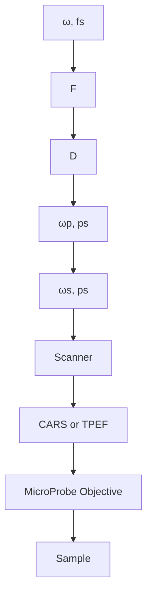

# Increasing the imaging depth of coherent anti-Stokes Raman scattering microscopy with a miniature microscope objective

Haifeng Wang,1 Terry B. Huff,1 Yan Fu,1 Kevin Y. Jia,2 and Ji-Xin Cheng1,\*

1 Weldon School of Biomedical Engineering and Department of Chemistry, Purdue University, West Lafayette, Indiana 47907, USA

2 Olympus America, Inc., 3500 Corporate Parkway, Center Valley, Pennsylvania 18034, USA

\*Corresponding author: jcheng@purdue.edu

Received March 29, 2007; revised May 28, 2007; accepted May 30, 2007; posted June 6, 2007 (Doc. ID 81672); published July 24, 2007

A miniature objective lens with a tip diameter of 1.3 mm was used for extending the penetration depth of coherent anti-Stokes Raman scattering (CARS) microscopy. Its axial and lateral focal widths were determined to be 11.4 and 0.86 m, respectively, by two-photon excitation fluorescence imaging of 200 nm beads at a 735 nm excitation wavelength. By inserting the lens tip into a soft gel sample, CARS images of 2 m polystyrene beads 5 mm deep from the surface were acquired. The miniature objective was applied to CARS imaging of rat spinal cord white matter with a minimal requirement for surgery. © 2007 Optical Society of America

OCIS codes: 300.6230, 350.3950, 110.0180.

Coherent anti-Stokes Raman scattering (CARS) microscopy allows label-free vibrational imaging with 3D spatial resolution [1]. These advantages are important for in vivo molecular imaging where labeling can be complicated by inefficient diffusion and nonspecific binding. In vivo CARS imaging is, however, limited by the small optical penetration depth -100 m, which reaches only the superficial layer of a biological sample such as skin [2]. Surgery was needed to open the skin for imaging sciatic nerve in vivo [3].

Inserting miniature focusing optics into soft samples provides an effective approach to imaging deep tissues with minimal surgery. For instance, the gradient-index (GRIN) lens has been applied to fluorescence imaging of deep brain tissues [4]. Here we demonstrate CARS imaging with a miniature objective, namely the MicroProbe Objective (MPO) lens from Olympus Inc. The tip of our MPO lens has an outer diameter of 1.3 mm and a working distance of 200 m (Fig. 1). It is a true objective lens with the aberration correction necessary for CARS imaging. Below we characterize its imaging properties and demonstrate its application to CARS imaging of a rat spinal cord with a minimal surgery on the vertebra.

The schematic of our setup is shown in Fig. 1. Two tightly synchronized 2.5 ps Ti:sapphire lasers (Mira 900, Coherent Inc.) provided the pump beam at frequency $\omega _ { \mathsf { p } }$ and Stokes beam at $\omega _ { \mathrm { s } } .$ A Pockels’ cell (Model 350-160, Conoptics) reduced the repetition rate from 78 to 3.9 MHz. The two beams were parallel polarized and collinearly combined for CARS imaging. A 200 fs Ti:sapphire laser (Mira 900) at 78 MHz was used for two-photon excitation fluorescence (TPEF) imaging. All beams were directed into a home-modified laser-scanning unit of an upright confocal microscope (FV300/BX51WI, Olympus America Inc.). A 60 water immersion objective lens with a numerical aperture (N.A.) of 1.1 (LUMFL60XW-SP,

Olympus) or the water immersion MPO lens (20, N.A.=0.5) focused the beams into a sample. The CARS or TPEF signal was epidetected with a photomultiplier tube (H7422, Hamamatsu). The dwell time for each pixel was 2 s.

We first measured the focal volume of the MPO lens by using TPEF imaging. Figure 2(a) shows an XZ image of a fluorescent bead (200 nm diameter, no. 09834, Polysciences Inc.) fixed in agarose gel. The axial Z and lateral X intensity profiles [Figs. 2(b) and 2(c)] showed FWHM of 11.4 and 0.86 m, respectively. The lateral width was close to the diffraction limit of 0.90 m at 735 nm excitation. The axial width was bigger than the diffraction limit of 7.8 m, probably because of the residual aberration in the MPO lens. Similarly, the axial focal width of a N.A. =0.5 GRIN lens measured by TPEF at 880 nm excitation was reported to be 20 m, which was twice the theoretical value of 10 m and was attributed to the aberration of the GRIN lens [5].

The epidetected CARS (E-CARS) signal levels for the MPO lens and the 60 objective were compared

flowchart

Fig. 1. Diagram of CARS and TPEF imaging with the MPO lens. D, dichroic mirror; F, flipper mirror.

(a)  

(b)  

line chart

| Int. (a.u.) | Data (Z μm) | Gaussian Fit (Z μm) |
|-------------|-------------|---------------------|
| 0           | 0           | 0                   |
| 10          | ~5          | ~5                  |
| 20          | ~10         | ~10                 |
| 30          | ~15         | ~15                 |

(c)  

line chart

| X (μm) | Int. (a.u.) |
| ------ | ----------- |
| 5      | 0.86        |

text_image

(d) 20X MPO

natural_image

Microscopic image showing scattered bright spots on a dark background with a scale bar (no text or symbols)

(f)  

line chart

| Position (µm) | 60X Water | 20X MPO |
| ------------- | --------- | ------- |
| 0             | 0         | 0       |
| 5             | 0         | 0       |
| 10            | 1.0       | 0.1     |
| 15            | 0         | 0       |

Fig. 2. (Color online) Resolution and sensitivity of the MPO lens. (a) XZ TPEF image of a 200 nm fluorescent bead in 0.5% agarose gel. Excitation, 200 fs, 735 nm, repetition rate 78 MHz, average power 30 mW at the sample. (b), (c) Axial and lateral TPEF intensity profiles along the vertical Z and horizontal X lines in (a). The FWHMs are shown. (d), (e) XY E-CARS images of 2 m polystyrene beads in 0.5% agarose gel taken by the MPO lens and the 60 ob jective. The pump and Stokes laser wavenumbers were 14,229 and 11,184 $\mathrm { c m } ^ { - 1 }$ , respectively, corresponding to $3 0 4 5 ~ \mathrm { c m } ^ { - 1 }$ for $( \omega _ { \mathrm { p } } - \omega _ { \mathrm { s } } )$ . The repetition rate was 3.9 MHz. For both objectives, the pump and Stokes laser powers at the sample were 3.6 and 1.26 mW, respectively. (f) Line intensity profiles along the lines in (d) and (e).

by imaging 2 m polystyrene beads (no. 19814, Polysciences Inc.) on the surface of 0.5% agarose gel. $\omega _ { \mathrm { p } }$ $- \omega _ { \mathrm { s } }$ was tuned to $3 0 4 5 ~ \mathrm { c m } ^ { - 1 }$ , resonant with the aromatic CH vibration in polystyrene. The size of the collimated beam was adjusted to match the back apertures of both objectives. The laser powers at the sample were kept the same. E-CARS images of beads acquired with the MPO lens and the 60 objective are shown in Figs. 2(d) and 2(e), respectively. The CARS signal with the MPO lens was 6 times smaller than that with the 60 objective [Fig. 2(f)]. The weaker CARS signal with the MPO lens can be attributed to both the lower collection efficiency due to the lower N.A. of the MPO lens and the lower CARS generation because the axial focal width of the MPO lens 11.4 m was larger than the bead diameter $( 2 . 0 \ \mu \mathrm { m } )$ . We have also compared the performance of the MPO lens with that of GRIN lenses for CARS imaging. With a GRIN lens composed of one SRL-0.35- 100-2003 used as a relay lens and two ILH-0.35-P $= 0 . 2 2 \mathrm { - } 0 . 8 0 \mathrm { - } \mathrm { N C } 0$ lenses used as coupling and objective lenses (NSG America Inc., Somerset, New Jersey), the CARS signal generated from the GRIN lens glass was found to overwhelm the CARS signal from a sample. This CARS generation arose from a beam focus inside the relay lens (pitch 1.0) and was nonresonant. To alleviate this problem, we tried a GRIN imaging lens (pitch 0.5, ILW-1.30-P=0.50-550-NC-0, NSG America Inc.). It was found that the CARS signal from the GRIN imaging lens was more than 40 times weaker than a 60 water objective with the same excitation power, possibly because the GRIN imaging lens lacked the correction for chromatic aberration to precisely overlap the pump and Stokes laser foci.

The penetration capability of the MPO lens was characterized by imaging 2 m polystyrene beads embedded in 0.5% agarose gel. The average bead concentration was $5 . 7 \check { \times } 1 0 ^ { 7 }$ beads/cm3. We defined the imaging depth $Z$ as the depth of the object underneath the surface. When the laser focus was on the gel surface $\scriptstyle ( Z = 0 )$ , the CARS signal was the strongest. When the focus was moved deeper inside the gel, Z increased and the CARS signal dropped because the laser beams were partially scattered by the beads located in the focusing path. Before Z reached 200 m, the penetration was purely optical. When Z exceeded 200 m, the MPO lens was inserted into the gel (Fig. 1), constituting physical penetration.

Two CARS images at different imaging depths are shown in Fig. 3. The beads were clearly probed at the depth of 3 mm. Quantitative analysis of the E-CARS signal versus imaging depth [Fig. 3(c)] showed that the signal dropped by 25% at a 200 $\mu \mathrm { m }$ imaging depth, where the MPO lens contacted the gel. An extra attenuation of the CARS signal after the lens entered the gel was observed and attributed to compression of the beads under the lens tip. At a 2 mm insertion depth, the bead density under the lens tip was found to be 2–2.5 times the original density. The signal became stable after Z exceeded 2.5 mm. The 1.3 mm diameter section of the MPO lens was totally inserted into the sample at $Z = 5$ mm, and the CARS signal was 12% of the signal at Z=0. To further explore the relation between the signal level and sample property, we increased the bead density by 10 times $( 5 . 7 \times 1 0 ^ { 8 }$ beads/cm3. From the E-CARS signal versus depth curve [Fig. 3(d)], even before Z reached 200 m the signal was significantly attenuated owing to scattering and subsequent focus distortion by the high-density beads. Therefore, reducing the scattering inside the working distance is important to keep the MPO’s sensitivity in deep tissue imaging. In comparison, GRIN lenses with a working distance of tens of micrometers should suffer less from sample scattering [6].

(a) $Z = 1 0 7 5 \mu \mathrm { m }$  

natural_image

Microscopic image showing scattered bright spots on a dark background with a 10 μm scale bar (no text or symbols beyond the scale)

(b) $Z = 3 0 0 0 \ { \mu \mathrm { m } }$  

natural_image

Microscopic image showing scattered bright spots on a dark background with a 10 μm scale bar (no text or symbols beyond scale)

(c)  

line chart

| Depth Z (mm) | CARS Int. (a.u.) |
| ------------ | ---------------- |
| 0            | 1.0              |
| 0.5          | 0.7              |
| 1.0          | 0.4              |
| 1.5          | 0.3              |
| 2.0          | 0.2              |
| 2.5          | 0.15             |
| 3.0          | 0.1              |
| 3.5          | 0.1              |
| 4.0          | 0.1              |
| 4.5          | 0.1              |
| 5.0          | 0.1              |

Fig. 3. Penetration capability of the MPO lens. (a), (b) CARS images of $2 \ \mu \mathrm { m }$ polystyrene beads at different depths in 0.5% agarose gel. The depths were marked above the images. The intensity in (a) was reduced by 2 times from the actual intensity. The laser parameters were the same as for Fig. 2. (c), (d) E-CARS intensity versus depth for samples with (c) $5 . 7 \times 1 0 ^ { 7 }$ beads/cm3 and (d) 5.7 $\times 1 0 ^ { 8 }$ beads/cm3.

line chart

| Position (μm) | Int. (a.u.) |
| ------------- | ----------- |
| 0             | ~5          |
| 10            | ~15         |
| 20            | ~10         |
| 30            | ~15         |
| 40            | ~10         |
| 50            | ~15         |
| 60            | ~10         |
| 70            | ~5          |

Fig. 4. E-CARS image of axonal myelin in a rat spinal cord acquired with the MPO lens. Shown below the image is the CARS intensity profile along the line defined by the arrows. The pump and Stokes laser wavenumbers were 14,174 and $1 1 , 3 3 1 \mathrm { { \bar { c m } } ^ { - 1 } }$ , respectively. The pump and Stokes laser powers at the sample were 4.14 and 1.26 mW, respec tively, at the repetition rate of 3.9 MHz.

A biological application of the MPO lens was demonstrated by E-CARS imaging of spinal cord white matter in a euthanized rat, where the small tip of the MPO lens effectively facilitated the surgery. The spinal cord was exposed by making an incision through the skin and muscle tissue and drilling through the vertebrate bone to form a 2 mm diameter concave. Inserting the MPO lens into the concave allowed the focusing of laser beams into the spinal cord inside the vertebra. Krebs’ solution was used as the immersion medium to maintain the physiological environment [7]. With $\omega _ { \mathrm { p } } - \omega _ { \mathrm { s } }$ tuned to $2 \bar { 8 } 4 \bar { 3 } \mathrm { c m } ^ { - 1 }$ for the symmetric $\mathrm { C H _ { 2 } }$ stretch vibration, the myelin sheath in spinal tissues gave a strong CARS signal owing to its densely packed lipid membranes [7]. Figure 4 shows a CARS image of parallel myelinated axons acquired by using the MPO lens, with a signal-to-background ratio of 7:1. A strong CARS signal was also obtained from a live rat anesthetized by ketamine–xylazine. In the in vivo imaging, we observed some image distortion due to the respiration motion, which will be minimized by video rate scanning [2] in future studies.

In conclusion, a 20 MPO lens with a tip diameter of 1.3 mm allowed CARS imaging of objects as deep as 5 mm under the surface. The lateral and axial focal widths were measured to be 0.86 and 11.4 m. As shown in CARS imaging of myelin sheath in a rat spinal cord, the MPO lens minimized the requirements for surgery, which is important for long-term observation of physiological processes. Although we focused on CARS imaging here, the MPO lens provides new possibilities for nonlinear optical imaging and microspectroscopy studies of deep tissues in general.

This research was supported by National Institutes of Health R21 grant EB004906 and Nation Science Foundation grant 0416785. The authors acknowledge William Schoenlein, Melissa Bible, Amy Peterson, and Riyi Shi for their kind guidance in animal surgery. All surgical procedures were approved by the Purdue Animal Care and Use Committee.

## References

1. J. X. Cheng, A. Volkmer, and X. S. Xie, J. Opt. Soc. Am. B 19, 1363 (2002).  
2. C. L. Evans, E. O. Potma, M. Puoris’haag, D. Côté, C. P. Lin, and X. S. Xie, Proc. Natl. Acad. Sci. U.S.A. 102, 16807 (2005).  
3. T. B. Huff and J. X. Cheng, J. Microsc. 225, 175 (2007).  
4. B. A. Flusberg, E. D. Cocker, W. Piyawattanametha, J. C. Jung, E. L. M. Cheung, and M. J. Schnitzer, Nat. Methods 2, 941 (2005).  
5. W. Göbel, J. N. D. Kerr, A. Nimmerjahn, and F. Helmchen, Opt. Lett. 29, 2521 (2004).  
6. M. J. Levene, D. A. Dombeck, K. A. Kasischke, R. P. Molloy, and W. W. Webb, J. Neurophysiol. 91, 1980 (2004).  
7. H. Wang, Y. Fu, P. Zickmund, R. Shi, and J. X. Cheng, Biophys. J. 89, 581 (2005).